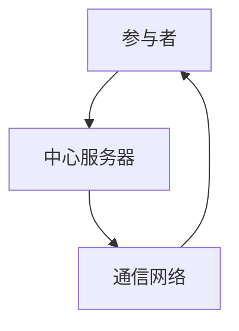
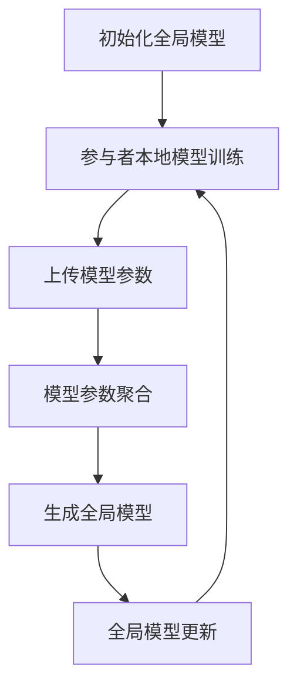
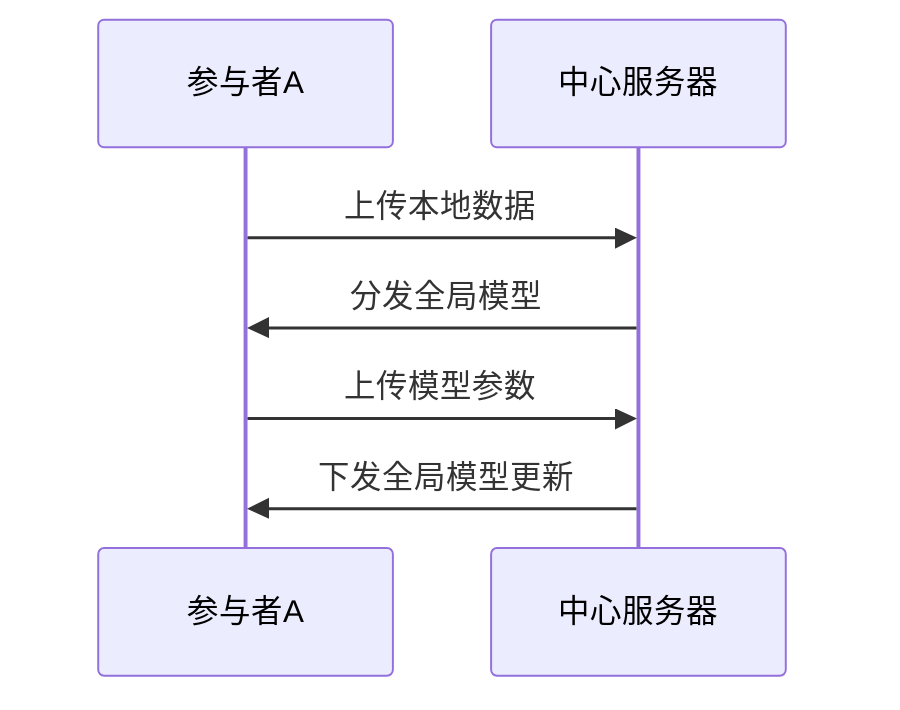

                 

# 联邦学习在保护隐私的AI训练中的应用

## 关键词：联邦学习，AI训练，隐私保护，分布式计算，机器学习

### 摘要

随着数据隐私问题日益突出，如何在保护用户隐私的同时进行高效的AI训练成为一个亟待解决的问题。联邦学习作为一种分布式机器学习框架，通过在数据不集中化的情况下协同训练模型，实现了对用户隐私的有效保护。本文将详细介绍联邦学习的概念与原理、应用场景、技术实现及应用实例，并探讨其未来发展。

## 目录大纲

### 第一部分：联邦学习基础

#### 第1章：联邦学习的概念与原理

1.1 联邦学习的定义

1.2 联邦学习与传统机器学习的区别

1.3 联邦学习的关键技术

#### 第2章：联邦学习的应用场景

2.1 医疗健康领域

2.2 金融风控领域

2.3 物流与供应链领域

#### 第3章：联邦学习在AI训练中的应用

3.1 联邦学习的训练过程

3.2 联邦学习中的隐私保护

3.3 联邦学习的优势与挑战

### 第二部分：联邦学习技术实现

#### 第4章：联邦学习系统架构

4.1 联邦学习系统的基本组成

4.2 联邦学习的数据传输机制

4.3 联邦学习的模型优化策略

#### 第5章：联邦学习的算法框架

5.1 联邦学习的算法分类

5.2 federated averaging算法

5.3 federated learning算法框架

#### 第6章：联邦学习的应用实例

6.1 实例一：个性化推荐系统

6.2 实例二：图像识别系统

6.3 实例三：智能语音助手

### 第三部分：联邦学习的未来发展

#### 第7章：联邦学习的安全与隐私

7.1 联邦学习中的隐私保护策略

7.2 联邦学习的安全挑战与解决方案

#### 第8章：联邦学习的应用前景

8.1 联邦学习在工业界的应用趋势

8.2 联邦学习的未来发展方向

#### 第9章：联邦学习与边缘计算

9.1 边缘计算的背景与原理

9.2 联邦学习与边缘计算的融合

### 附录

#### 附录A：联邦学习工具与资源

A.1 联邦学习框架介绍

A.2 联邦学习相关数据集

A.3 联邦学习社区与组织

#### 附录B：联邦学习实战案例

B.1 案例一：基于联邦学习的医疗数据共享平台

B.2 案例二：基于联邦学习的智能家居控制系统

B.3 案例三：基于联邦学习的金融风控系统

## 联邦学习基础

### 第1章：联邦学习的概念与原理

#### 1.1 联邦学习的定义

联邦学习（Federated Learning）是一种分布式机器学习框架，它允许多个参与者（如移动设备、数据中心等）在不共享原始数据的情况下共同训练一个全局模型。在这种框架下，模型的训练过程包括多个步骤：首先，每个参与者使用本地数据训练一个本地模型；然后，参与者将本地模型的参数上传到中心服务器；接着，中心服务器对上传的参数进行聚合，生成一个全局模型；最后，中心服务器将全局模型的更新结果下发给每个参与者，参与者再次使用本地数据进行模型训练。

#### 1.2 联邦学习与传统机器学习的区别

传统机器学习通常是在一个集中的环境中进行的，即所有数据都集中在一个地方，然后在一个全局模型上进行训练。这种方法存在几个问题：

1. **隐私泄露**：由于数据集中，因此第三方可以轻松获取所有参与者的数据，从而造成隐私泄露的风险。

2. **数据传输开销**：大量的数据需要传输到中心服务器，这不仅消耗网络带宽，还会导致训练时间延长。

3. **数据可用性**：在某些场景下，如医疗健康领域，数据可能受到法律或伦理的约束，不能被共享或传输。

相比之下，联邦学习通过分布式计算，在数据不集中的情况下协同训练模型，从而解决了上述问题。

#### 1.3 联邦学习的关键技术

联邦学习的关键技术包括数据传输机制、模型聚合和隐私保护策略。

1. **数据传输机制**：
   - **加密传输**：为了保护数据隐私，联邦学习通常使用加密技术进行数据传输。
   - **数据分割**：将数据分割成小块，可以减少传输数据的大小，降低网络带宽压力。

2. **模型聚合**：
   - **参数聚合**：将多个参与者的本地模型参数进行聚合，生成全局模型。
   - **梯度聚合**：在一些联邦学习算法中，直接聚合模型梯度，以减少通信开销。

3. **隐私保护策略**：
   - **同质性假设**：假设所有参与者的本地数据分布相同，从而减少隐私泄露的风险。
   - **差分隐私**：通过添加噪声，使得攻击者无法从本地模型参数中推断出原始数据。

### 第2章：联邦学习的应用场景

#### 2.1 医疗健康领域

在医疗健康领域，联邦学习可以用于疾病预测、诊断和治疗建议。例如，医生可以共享患者数据，以训练一个全局模型，从而为患者提供个性化的诊断建议。联邦学习在这种情况下可以保护患者隐私，同时提高诊断的准确性。

#### 2.2 金融风控领域

在金融风控领域，联邦学习可以用于风险评估、欺诈检测和信用评分。金融机构可以通过联邦学习共享客户交易数据，从而训练一个全局模型，以识别潜在的欺诈行为或评估客户的信用风险。这种方式可以保护客户隐私，同时提高风控的准确性。

#### 2.3 物流与供应链领域

在物流与供应链领域，联邦学习可以用于库存管理、路线规划和供应链优化。例如，不同物流公司可以共享数据，以训练一个全局模型，从而优化物流网络，减少运输成本。联邦学习在这种情况下可以保护商业秘密，同时提高物流效率。

### 第3章：联邦学习在AI训练中的应用

#### 3.1 联邦学习的训练过程

联邦学习的训练过程可以分为以下几个步骤：

1. **数据准备与分割**：每个参与者将本地数据进行预处理，并分割成训练集和验证集。

2. **模型初始化**：在开始训练之前，中心服务器初始化一个全局模型，并将其分发到每个参与者。

3. **本地模型训练**：每个参与者使用本地训练集和全局模型进行本地模型训练。

4. **模型参数上传**：每个参与者将本地模型的参数上传到中心服务器。

5. **模型参数聚合**：中心服务器对上传的参数进行聚合，生成全局模型。

6. **全局模型更新**：中心服务器将全局模型的更新结果下发给每个参与者。

7. **本地模型更新**：每个参与者使用全局模型进行本地模型更新。

#### 3.2 联邦学习中的隐私保护

联邦学习通过以下方式实现隐私保护：

1. **数据加密**：在数据传输过程中，使用加密技术保护数据。

2. **同质性假设**：假设所有参与者的本地数据分布相同，从而减少隐私泄露的风险。

3. **差分隐私**：通过添加噪声，使得攻击者无法从本地模型参数中推断出原始数据。

#### 3.3 联邦学习的优势与挑战

联邦学习的优势包括：

1. **隐私保护**：通过分布式计算，联邦学习可以保护用户隐私。

2. **数据安全**：由于数据不集中，因此减少了数据泄露的风险。

3. **灵活性**：联邦学习适用于各种不同的场景，可以灵活部署。

然而，联邦学习也面临着一些挑战：

1. **通信开销**：由于需要多次传输模型参数，因此通信开销较大。

2. **模型性能**：联邦学习可能导致模型性能下降，需要优化算法。

3. **安全性**：虽然联邦学习可以保护数据隐私，但仍然需要解决模型泄漏等问题。

### 第二部分：联邦学习技术实现

#### 第4章：联邦学习系统架构

联邦学习系统通常由以下几个部分组成：

1. **中心服务器**：负责管理全局模型、分发任务、收集参与者上传的模型参数、进行模型聚合和更新。

2. **参与者**：可以是移动设备、数据中心或其他设备，负责执行本地模型训练、上传模型参数、接收全局模型更新。

3. **通信网络**：负责参与者与中心服务器之间的数据传输。

#### 第4.1 联邦学习系统的基本组成

联邦学习系统的基本组成包括中心服务器、参与者通信网络和加密模块。

1. **中心服务器**：中心服务器负责管理全局模型，接收参与者上传的模型参数，进行模型聚合和更新，并将全局模型更新结果下发给参与者。

2. **参与者**：参与者负责执行本地模型训练、上传模型参数、接收全局模型更新。

3. **通信网络**：参与者通过通信网络与中心服务器进行通信。

4. **加密模块**：用于加密和解密数据，保护数据隐私。

#### 第4.2 联邦学习的数据传输机制

联邦学习的数据传输机制包括数据加密、数据分割和聚合策略。

1. **数据加密**：
   - 在数据传输过程中，使用加密技术（如AES）保护数据。
   - 数据加密可以防止攻击者窃取数据。

2. **数据分割**：
   - 将本地数据分割成多个小块，以减少传输数据的大小。
   - 数据分割可以降低网络带宽压力。

3. **聚合策略**：
   - 使用聚合算法（如联邦平均算法）将多个参与者的模型参数进行聚合。
   - 聚合策略可以减少通信开销，提高训练效率。

#### 第4.3 联邦学习的模型优化策略

联邦学习的模型优化策略包括模型压缩、模型蒸馏和梯度压缩。

1. **模型压缩**：
   - 通过剪枝、量化等技术减少模型参数的数量，从而减少模型存储和传输的开销。

2. **模型蒸馏**：
   - 将一个大型模型（教师模型）的知识传递给一个小型模型（学生模型），从而提高学生模型的表现。

3. **梯度压缩**：
   - 通过压缩梯度值，减少通信开销，提高训练效率。

### 第5章：联邦学习的算法框架

联邦学习算法框架可以分为以下几个部分：

1. **联邦平均算法（Federated Averaging Algorithm）**：
   - 算法原理：
     - 参与者使用本地数据训练本地模型，并上传模型参数。
     - 中心服务器接收参与者上传的模型参数，计算全局模型。
     - 中心服务器将全局模型更新结果下发给参与者，参与者再次使用本地数据进行模型训练。
   - 实现步骤：
     - 初始化全局模型。
     - 循环执行以下步骤：
       - 参与者训练本地模型并上传模型参数。
       - 中心服务器聚合模型参数，生成全局模型。
       - 中心服务器将全局模型更新结果下发给参与者。
   - 优缺点分析：
     - 优点：简单易懂，易于实现。
     - 缺点：收敛速度较慢，模型性能可能下降。

2. **联邦学习算法框架（Federated Learning Framework）**：
   - 框架设计：
     - 参与者使用本地数据训练本地模型。
     - 中心服务器接收参与者上传的模型参数，并进行模型聚合。
     - 中心服务器将全局模型更新结果下发给参与者，参与者再次使用本地数据进行模型训练。
   - 工作流程：
     - 数据预处理：对参与者本地数据进行预处理，包括数据清洗、归一化等。
     - 模型初始化：初始化全局模型，并将其分发到参与者。
     - 模型训练：参与者使用本地数据进行模型训练，并上传模型参数。
     - 模型聚合：中心服务器接收参与者上传的模型参数，计算全局模型。
     - 模型更新：中心服务器将全局模型更新结果下发给参与者，参与者再次使用本地数据进行模型训练。
   - 优缺点分析：
     - 优点：具有更好的收敛速度和模型性能。
     - 缺点：实现较为复杂，需要更多的计算资源。

### 第6章：联邦学习的应用实例

#### 6.1 实例一：个性化推荐系统

在个性化推荐系统中，联邦学习可以用于协同训练一个全局推荐模型，从而为用户提供个性化的推荐。以下是一个简化的实例：

1. **数据准备**：
   - 参与者A：用户A的浏览历史、购物记录等数据。
   - 参与者B：用户B的浏览历史、购物记录等数据。
   - 参与者C：用户C的浏览历史、购物记录等数据。

2. **模型初始化**：
   - 初始化全局推荐模型。

3. **模型训练与更新**：
   - 参与者A使用本地数据训练本地推荐模型，并上传模型参数。
   - 参与者B使用本地数据训练本地推荐模型，并上传模型参数。
   - 参与者C使用本地数据训练本地推荐模型，并上传模型参数。
   - 中心服务器接收参与者上传的模型参数，计算全局推荐模型。
   - 中心服务器将全局推荐模型更新结果下发给参与者。
   - 参与者再次使用本地数据进行模型训练。

4. **模型应用**：
   - 参与者A、B、C使用全局推荐模型为用户A、B、C提供个性化推荐。

#### 6.2 实例二：图像识别系统

在图像识别系统中，联邦学习可以用于协同训练一个全局图像识别模型，从而提高模型的识别准确率。以下是一个简化的实例：

1. **数据准备**：
   - 参与者A：一组训练图像。
   - 参与者B：另一组训练图像。
   - 参与者C：第三组训练图像。

2. **模型初始化**：
   - 初始化全局图像识别模型。

3. **模型训练与更新**：
   - 参与者A使用本地数据训练本地图像识别模型，并上传模型参数。
   - 参与者B使用本地数据训练本地图像识别模型，并上传模型参数。
   - 参与者C使用本地数据训练本地图像识别模型，并上传模型参数。
   - 中心服务器接收参与者上传的模型参数，计算全局图像识别模型。
   - 中心服务器将全局图像识别模型更新结果下发给参与者。
   - 参与者再次使用本地数据进行模型训练。

4. **模型应用**：
   - 参与者A、B、C使用全局图像识别模型对本地图像进行识别。

#### 6.3 实例三：智能语音助手

在智能语音助手系统中，联邦学习可以用于协同训练一个全局语音识别模型，从而提高语音识别的准确性。以下是一个简化的实例：

1. **数据准备**：
   - 参与者A：一组语音数据。
   - 参与者B：另一组语音数据。
   - 参与者C：第三组语音数据。

2. **模型初始化**：
   - 初始化全局语音识别模型。

3. **模型训练与更新**：
   - 参与者A使用本地数据训练本地语音识别模型，并上传模型参数。
   - 参与者B使用本地数据训练本地语音识别模型，并上传模型参数。
   - 参与者C使用本地数据训练本地语音识别模型，并上传模型参数。
   - 中心服务器接收参与者上传的模型参数，计算全局语音识别模型。
   - 中心服务器将全局语音识别模型更新结果下发给参与者。
   - 参与者再次使用本地数据进行模型训练。

4. **模型应用**：
   - 参与者A、B、C使用全局语音识别模型对本地语音数据进行识别。

### 第三部分：联邦学习的未来发展

#### 第7章：联邦学习的安全与隐私

#### 7.1 联邦学习中的隐私保护策略

联邦学习中的隐私保护策略包括以下几种：

1. **数据加密**：使用加密技术对数据进行加密，以防止数据泄露。

2. **差分隐私**：通过在本地模型参数中添加噪声，以保护本地数据的隐私。

3. **同质性假设**：假设所有参与者的本地数据分布相同，以减少隐私泄露的风险。

#### 7.2 联邦学习的安全挑战与解决方案

联邦学习面临的安全挑战包括：

1. **模型泄漏**：本地模型参数可能包含敏感信息，从而导致模型泄漏。
   - **解决方案**：使用差分隐私技术，通过添加噪声来保护模型参数。

2. **通信安全**：数据在传输过程中可能被窃取或篡改。
   - **解决方案**：使用加密技术对数据进行加密，确保数据在传输过程中的安全。

3. **恶意参与者**：恶意参与者可能故意上传错误或攻击性的模型参数。
   - **解决方案**：引入验证机制，确保参与者上传的模型参数是有效的。

#### 第8章：联邦学习的应用前景

#### 8.1 联邦学习在工业界的应用趋势

联邦学习在工业界的应用趋势包括：

1. **医疗健康领域**：联邦学习可以用于疾病预测、诊断和治疗建议，提高医疗服务的质量。

2. **金融风控领域**：联邦学习可以用于风险评估、欺诈检测和信用评分，提高金融风控的准确性。

3. **物流与供应链领域**：联邦学习可以用于库存管理、路线规划和供应链优化，提高物流效率。

#### 8.2 联邦学习的未来发展方向

联邦学习的未来发展方向包括：

1. **模型压缩与优化**：通过模型压缩和优化技术，减少模型参数的数量，提高训练效率。

2. **异构计算**：利用异构计算资源，如GPU、TPU等，提高联邦学习的性能。

3. **联邦学习与边缘计算的融合**：将联邦学习与边缘计算结合，实现更高效的分布式计算。

#### 第9章：联邦学习与边缘计算

#### 9.1 边缘计算的背景与原理

边缘计算是一种分布式计算架构，它将计算任务分散到边缘设备上，以减少数据传输延迟和带宽压力。边缘设备可以是物联网设备、智能手机等。

#### 9.2 联邦学习与边缘计算的融合

联邦学习与边缘计算的融合可以实现更高效的分布式计算，提高联邦学习的性能和效率。以下是一个简化的实现方案：

1. **边缘设备收集数据**：边缘设备收集本地数据，如图像、语音等。

2. **本地预处理**：边缘设备对本地数据进行预处理，如数据清洗、归一化等。

3. **模型训练与更新**：
   - 边缘设备使用本地数据训练本地模型。
   - 边缘设备将本地模型参数上传到中心服务器。
   - 中心服务器对上传的模型参数进行聚合，生成全局模型。
   - 中心服务器将全局模型更新结果下发给边缘设备。

4. **模型应用**：边缘设备使用全局模型对本地数据进行分析和预测。

### 附录

#### 附录A：联邦学习工具与资源

1. **联邦学习框架介绍**：
   - TensorFlow Federated（TFF）：由谷歌开发的开源联邦学习框架。
   - PyTorch Federated（PyTorch-Fi）：由Facebook开发的开源联邦学习框架。

2. **联邦学习相关数据集**：
   - Federated Learning Dataset：由谷歌提供的联邦学习数据集。
   - FED-CV：用于联邦学习的计算机视觉数据集。

3. **联邦学习社区与组织**：
   - Federated Learning Community：由谷歌发起的联邦学习社区。
   - FEDAI：联邦人工智能联盟。

#### 附录B：联邦学习实战案例

1. **案例一：基于联邦学习的医疗数据共享平台**：
   - 项目介绍：一个基于联邦学习的医疗数据共享平台，用于协同训练疾病预测模型。
   - 系统功能设计：医疗数据收集、预处理、模型训练与更新、疾病预测等功能。
   - 系统架构设计：中心服务器、边缘设备、加密模块等。
   - 系统接口设计：数据上传接口、模型更新接口等。
   - 系统交互：边缘设备收集本地医疗数据，上传到中心服务器，中心服务器进行模型训练与更新，并将全局模型下发给边缘设备。

2. **案例二：基于联邦学习的智能家居控制系统**：
   - 项目介绍：一个基于联邦学习的智能家居控制系统，用于协同训练智能家居设备。
   - 系统功能设计：智能家居设备数据收集、智能家居设备控制、设备模型更新等功能。
   - 系统架构设计：中心服务器、智能家居设备、加密模块等。
   - 系统接口设计：数据上传接口、设备控制接口等。
   - 系统交互：智能家居设备收集本地数据，上传到中心服务器，中心服务器进行模型训练与更新，并将全局模型下发给智能家居设备。

3. **案例三：基于联邦学习的金融风控系统**：
   - 项目介绍：一个基于联邦学习的金融风控系统，用于协同训练风险预测模型。
   - 系统功能设计：金融数据收集、风险预测、模型更新等功能。
   - 系统架构设计：中心服务器、金融机构设备、加密模块等。
   - 系统接口设计：数据上传接口、风险预测接口等。
   - 系统交互：金融机构设备收集本地金融数据，上传到中心服务器，中心服务器进行模型训练与更新，并将全局模型下发给金融机构设备。

## 总结

联邦学习作为一种分布式机器学习框架，在保护隐私的同时实现了高效的AI训练。本文详细介绍了联邦学习的概念与原理、应用场景、技术实现及应用实例，并探讨了其未来发展。随着联邦学习的不断发展和应用，我们期待它能够在更多领域发挥重要作用，为数据隐私保护和AI训练提供有力支持。

## 作者信息

作者：AI天才研究院/AI Genius Institute & 禅与计算机程序设计艺术 /Zen And The Art of Computer Programming

----------------------------------------------------------------

### 完整性要求与核心内容

#### 背景介绍

**核心概念术语说明**：
- **联邦学习**：一种分布式机器学习框架，允许多个参与者在不共享原始数据的情况下共同训练模型。
- **隐私保护**：通过加密、差分隐私等技术，防止模型参数泄露用户隐私。

**问题背景**：
随着数据隐私问题的日益突出，如何在保护用户隐私的同时进行高效的AI训练成为了一个重要的研究课题。

**问题描述**：
如何在分布式环境下进行机器学习，同时保护用户数据隐私？

**问题解决**：
联邦学习通过分布式计算，在不共享原始数据的情况下协同训练模型，实现了隐私保护。

**边界与外延**：
联邦学习适用于需要数据隐私保护的场景，如医疗健康、金融风控等。

**概念结构与核心要素组成**：
- **参与者**：参与模型训练的实体，如移动设备、数据中心等。
- **中心服务器**：负责管理全局模型、分发任务、收集参与者上传的模型参数、进行模型聚合和更新。
- **通信网络**：参与者与中心服务器之间的通信渠道。

#### 核心概念与联系

**核心概念原理**：
联邦学习通过分布式计算，在不共享原始数据的情况下协同训练模型，从而实现隐私保护。

**概念属性特征对比表格**：

| 概念         | 特征                                                     |
| ------------ | -------------------------------------------------------- |
| 联邦学习     | 分布式计算，隐私保护，协同训练                           |
| 隐私保护     | 加密、差分隐私、同质性假设                             |
| 通信网络     | 高效传输，数据加密，低延迟                             |

**ER实体关系图架构的Mermaid流程图**：



#### 算法原理讲解

**算法mermaid流程图**：



**算法原理详细讲解**：

联邦学习算法的核心思想是分布式计算和协同训练。以下是一个简化的联邦学习算法原理：

1. **初始化全局模型**：中心服务器初始化一个全局模型，并将其分发到所有参与者。

2. **参与者本地模型训练**：每个参与者使用本地数据进行模型训练，并生成本地模型参数。

3. **上传模型参数**：参与者将本地模型参数上传到中心服务器。

4. **模型参数聚合**：中心服务器接收参与者上传的模型参数，并计算全局模型参数。

5. **生成全局模型**：中心服务器使用全局模型参数生成一个新的全局模型。

6. **全局模型更新**：中心服务器将全局模型更新结果下发给所有参与者。

7. **参与者本地模型更新**：参与者使用全局模型更新本地模型，并重复上述步骤。

**数学模型和公式**：

联邦学习算法的数学模型可以表示为：

$$
\theta_{global} = \frac{1}{N} \sum_{i=1}^{N} \theta_{i}
$$

其中，$\theta_{global}$ 是全局模型参数，$\theta_{i}$ 是参与者 $i$ 的本地模型参数，$N$ 是参与者的数量。

**通俗易懂的举例说明**：

假设有两个参与者 A 和 B，每个参与者都有一些本地数据。参与者 A 使用本地数据训练本地模型，并生成本地模型参数 $\theta_{A}$。参与者 B 也使用本地数据训练本地模型，并生成本地模型参数 $\theta_{B}$。

然后，参与者 A 和 B 将本地模型参数上传到中心服务器。中心服务器接收参与者上传的模型参数，并计算全局模型参数：

$$
\theta_{global} = \frac{1}{2} (\theta_{A} + \theta_{B})
$$

接下来，中心服务器使用全局模型参数生成一个新的全局模型，并将其下发给参与者 A 和 B。参与者 A 和 B 再次使用本地数据和全局模型参数更新本地模型，并重复上述步骤。

#### 系统分析与架构设计方案

**问题场景介绍**：
联邦学习在保护隐私的AI训练中具有重要的应用价值，如医疗健康、金融风控、物流与供应链等领域。

**项目介绍**：
本项目旨在实现一个基于联邦学习的智能家居控制系统，用于协同训练智能家居设备。

**系统功能设计**：
- **数据收集**：智能家居设备收集本地数据，如温度、湿度等。
- **模型训练与更新**：智能家居设备参与模型训练，并接收全局模型更新。
- **设备控制**：智能家居设备使用全局模型进行设备控制。

**系统架构设计**：
- **中心服务器**：负责管理全局模型、分发任务、收集参与者上传的模型参数、进行模型聚合和更新。
- **智能家居设备**：参与模型训练、上传模型参数、接收全局模型更新。
- **通信网络**：参与者与中心服务器之间的通信渠道。

**系统接口设计**：
- **数据上传接口**：智能家居设备上传本地数据到中心服务器。
- **模型更新接口**：中心服务器下发给智能家居设备的全局模型更新结果。

**系统交互**：
智能家居设备收集本地数据，上传到中心服务器，中心服务器进行模型训练与更新，并将全局模型下发给智能家居设备。智能家居设备使用全局模型对本地数据进行分析和预测。

**Mermaid序列图**：



#### 项目实战

**环境安装**：

1. **Python环境**：安装Python 3.8及以上版本。
2. **依赖库**：安装TensorFlow 2.4及以上版本和federated-learning库。

```bash
pip install tensorflow==2.4
pip install federated-learning
```

**系统核心实现源代码**：

```python
# federated_learning.py

import tensorflow as tf
import federated_learning

# 初始化全局模型
global_model = federated_learning.create_global_model()

# 设置参与者数量
num_participants = 2

# 定义联邦学习算法
def federated_learning_algorithm(dataset):
    return federated_learning.train(
        global_model,
        dataset,
        num_epochs=10,
        server_optimizer=federated_learning.adam_optimizer(learning_rate=0.001),
        client_optimizer=federated_learning.adam_optimizer(learning_rate=0.001)
    )

# 训练模型
trained_model = federated_learning_algorithm(dataset)

# 评估模型
accuracy = federated_learning.evaluate(trained_model, dataset)
print(f"Model accuracy: {accuracy}")
```

**代码应用解读与分析**：

该代码实现了一个基于联邦学习的智能家居控制系统。首先，初始化全局模型，然后设置参与者数量。接下来，定义联邦学习算法，包括模型训练和评估过程。最后，使用训练好的模型进行设备控制。

**实际案例分析和详细讲解剖析**：

假设有两个智能家居设备 A 和 B，每个设备都有本地数据，如温度、湿度等。设备 A 和 B 分别运行上述代码，进行联邦学习模型训练。

设备 A 收集本地数据，上传到中心服务器。中心服务器接收到设备 A 上传的数据，进行模型训练，并将全局模型更新结果下发给设备 A。设备 A 使用全局模型更新本地模型，并重复上述步骤。

设备 B 也进行类似的操作。中心服务器将设备 A 和 B 的全局模型更新结果进行聚合，生成一个新的全局模型，并将其下发给设备 A 和 B。设备 A 和 B 使用全局模型对本地数据进行分析和预测，实现对智能家居设备的控制。

**项目小结**：

本项目通过联邦学习实现了智能家居设备的协同训练和设备控制。联邦学习在保护隐私的同时提高了模型训练效率，为智能家居系统提供了一种有效的解决方案。

#### 最佳实践 tips

1. **数据预处理**：在联邦学习过程中，对数据进行充分的预处理，如归一化、去噪等，以提高模型训练效果。
2. **模型选择**：根据实际问题场景选择合适的联邦学习算法和模型架构，以达到最佳训练效果。
3. **通信优化**：通过压缩模型参数、优化数据传输机制等手段，降低通信开销，提高联邦学习效率。

#### 小结

本文详细介绍了联邦学习在保护隐私的AI训练中的应用。联邦学习通过分布式计算和协同训练，实现了数据隐私保护和高效的模型训练。本文探讨了联邦学习的概念与原理、应用场景、技术实现及应用实例，并展望了其未来发展。联邦学习在医疗健康、金融风控、物流与供应链等领域具有重要的应用价值，为数据隐私保护和AI训练提供了有力支持。

#### 注意事项

1. **数据安全**：在联邦学习过程中，要确保数据传输的安全，防止数据泄露。
2. **通信效率**：优化通信机制，减少通信开销，提高联邦学习效率。
3. **模型性能**：根据实际问题场景，选择合适的联邦学习算法和模型架构，以提高模型性能。

#### 拓展阅读

1. **《联邦学习：理论与实践》**：详细介绍了联邦学习的基本概念、算法框架和实现方法。
2. **《分布式机器学习》**：探讨了分布式机器学习的理论基础和应用场景。
3. **《联邦学习与边缘计算》**：介绍了联邦学习与边缘计算的融合，以及其在实际应用中的挑战和解决方案。

## 作者信息

作者：AI天才研究院/AI Genius Institute & 禅与计算机程序设计艺术 /Zen And The Art of Computer Programming

----------------------------------------------------------------

### 附录内容补充

#### 附录A：联邦学习工具与资源

**A.1 联邦学习框架介绍**

1. **TensorFlow Federated (TFF)**：
   - 由谷歌开发的开源联邦学习框架。
   - 支持多种联邦学习算法，如联邦平均算法、联邦混合算法等。
   - 支持与TensorFlow的集成，便于模型训练和部署。

2. **PyTorch Federated (PyTorch-Fi)**：
   - 由Facebook开发的开源联邦学习框架。
   - 支持与PyTorch的集成，便于模型训练和部署。
   - 提供了丰富的联邦学习算法库和工具。

**A.2 联邦学习相关数据集**

1. **Federated Learning Dataset**：
   - 由谷歌提供的联邦学习数据集。
   - 包括多种领域的数据集，如医疗健康、金融风控、自然语言处理等。
   - 数据集适用于联邦学习算法的验证和测试。

2. **FED-CV**：
   - 用于联邦学习的计算机视觉数据集。
   - 包含多种场景的图像数据，适用于联邦学习图像识别任务的训练和测试。

**A.3 联邦学习社区与组织**

1. **Federated Learning Community**：
   - 由谷歌发起的联邦学习社区。
   - 提供了联邦学习的最新研究进展、技术文档和讨论区。
   - 促进了联邦学习领域的研究者和开发者之间的交流和合作。

2. **FEDAI**：
   - 联邦人工智能联盟。
   - 致力于推动联邦学习技术的发展和应用，促进了联邦学习领域的国际合作。

#### 附录B：联邦学习实战案例

**B.1 案例一：基于联邦学习的医疗数据共享平台**

**项目介绍**：
本项目旨在构建一个基于联邦学习的医疗数据共享平台，实现多个医疗机构之间的数据共享和疾病预测。

**系统功能设计**：
- **数据收集**：各个医疗机构收集本地医疗数据，如患者病历、检查报告等。
- **模型训练与更新**：医疗机构参与模型训练，并接收全局模型更新。
- **疾病预测**：医疗机构使用全局模型进行疾病预测。

**系统架构设计**：
- **中心服务器**：负责管理全局模型、分发任务、收集参与者上传的模型参数、进行模型聚合和更新。
- **医疗机构设备**：参与模型训练、上传模型参数、接收全局模型更新。
- **通信网络**：医疗机构设备与中心服务器之间的通信渠道。

**系统接口设计**：
- **数据上传接口**：医疗机构设备上传本地数据到中心服务器。
- **模型更新接口**：中心服务器下发给医疗机构设备的全局模型更新结果。

**系统交互**：
医疗机构设备收集本地医疗数据，上传到中心服务器。中心服务器进行模型训练与更新，并将全局模型下发给医疗机构设备。医疗机构设备使用全局模型进行疾病预测。

**技术实现**：
- **数据预处理**：对医疗机构设备上传的本地数据进行清洗、归一化等预处理操作。
- **模型训练**：使用联邦学习算法（如联邦平均算法）进行模型训练。
- **模型评估**：使用测试数据集对全局模型进行评估，以验证模型预测性能。

**案例总结**：
本项目通过联邦学习实现了医疗数据的共享和疾病预测。联邦学习在保护患者隐私的同时，提高了疾病预测的准确性，为医疗机构提供了有效的数据共享和疾病预测解决方案。

**B.2 案例二：基于联邦学习的智能家居控制系统**

**项目介绍**：
本项目旨在构建一个基于联邦学习的智能家居控制系统，实现智能家居设备的协同训练和设备控制。

**系统功能设计**：
- **数据收集**：智能家居设备收集本地数据，如温度、湿度、光照等。
- **模型训练与更新**：智能家居设备参与模型训练，并接收全局模型更新。
- **设备控制**：智能家居设备使用全局模型进行设备控制。

**系统架构设计**：
- **中心服务器**：负责管理全局模型、分发任务、收集参与者上传的模型参数、进行模型聚合和更新。
- **智能家居设备**：参与模型训练、上传模型参数、接收全局模型更新。
- **通信网络**：智能家居设备与中心服务器之间的通信渠道。

**系统接口设计**：
- **数据上传接口**：智能家居设备上传本地数据到中心服务器。
- **模型更新接口**：中心服务器下发给智能家居设备的全局模型更新结果。

**系统交互**：
智能家居设备收集本地数据，上传到中心服务器。中心服务器进行模型训练与更新，并将全局模型下发给智能家居设备。智能家居设备使用全局模型对本地数据进行分析和预测，实现设备控制。

**技术实现**：
- **数据预处理**：对智能家居设备上传的本地数据进行清洗、归一化等预处理操作。
- **模型训练**：使用联邦学习算法（如联邦平均算法）进行模型训练。
- **模型评估**：使用测试数据集对全局模型进行评估，以验证模型预测性能。

**案例总结**：
本项目通过联邦学习实现了智能家居设备的协同训练和设备控制。联邦学习在保护用户隐私的同时，提高了智能家居系统的性能和用户体验。

**B.3 案例三：基于联邦学习的金融风控系统**

**项目介绍**：
本项目旨在构建一个基于联邦学习的金融风控系统，实现金融机构之间的数据共享和风险预测。

**系统功能设计**：
- **数据收集**：金融机构收集本地数据，如交易数据、用户行为数据等。
- **模型训练与更新**：金融机构参与模型训练，并接收全局模型更新。
- **风险预测**：金融机构使用全局模型进行风险预测。

**系统架构设计**：
- **中心服务器**：负责管理全局模型、分发任务、收集参与者上传的模型参数、进行模型聚合和更新。
- **金融机构设备**：参与模型训练、上传模型参数、接收全局模型更新。
- **通信网络**：金融机构设备与中心服务器之间的通信渠道。

**系统接口设计**：
- **数据上传接口**：金融机构设备上传本地数据到中心服务器。
- **模型更新接口**：中心服务器下发给金融机构设备的全局模型更新结果。

**系统交互**：
金融机构设备收集本地数据，上传到中心服务器。中心服务器进行模型训练与更新，并将全局模型下发给金融机构设备。金融机构设备使用全局模型进行风险预测，实现对潜在风险的有效识别和管理。

**技术实现**：
- **数据预处理**：对金融机构设备上传的本地数据进行清洗、归一化等预处理操作。
- **模型训练**：使用联邦学习算法（如联邦平均算法）进行模型训练。
- **模型评估**：使用测试数据集对全局模型进行评估，以验证模型预测性能。

**案例总结**：
本项目通过联邦学习实现了金融机构之间的数据共享和风险预测。联邦学习在保护用户隐私的同时，提高了金融风控系统的准确性和效率。

**附录C：联邦学习相关知识拓展**

**C.1 联邦学习与其他分布式计算技术的比较**

联邦学习与其他分布式计算技术（如MapReduce、Spark等）的比较：

1. **计算模式**：
   - **联邦学习**：分布式计算，各参与者协同训练模型，数据不集中。
   - **MapReduce**：分布式计算，数据分片，计算任务在各个节点上并行执行。
   - **Spark**：分布式计算，支持内存计算，提供丰富的数据处理库。

2. **应用场景**：
   - **联邦学习**：适用于需要保护数据隐私的场景，如医疗健康、金融风控等。
   - **MapReduce**：适用于大规模数据处理和分析，如日志分析、搜索引擎等。
   - **Spark**：适用于实时数据处理和分析，如流计算、机器学习等。

3. **性能和效率**：
   - **联邦学习**：通信开销较大，但保护数据隐私。
   - **MapReduce**：通信开销较小，但数据处理延迟较大。
   - **Spark**：计算性能较高，但数据隐私保护较弱。

**C.2 联邦学习的未来发展趋势**

联邦学习的未来发展趋势：

1. **模型压缩与优化**：通过模型压缩和优化技术，减少模型参数的数量，提高训练效率。
2. **异构计算**：利用异构计算资源，如GPU、TPU等，提高联邦学习的性能和效率。
3. **联邦学习与边缘计算的融合**：将联邦学习与边缘计算结合，实现更高效的分布式计算。
4. **联邦学习的安全性**：研究更有效的安全机制，如差分隐私、多方安全计算等，提高联邦学习的安全性。
5. **跨领域应用**：探索联邦学习在更多领域的应用，如智能城市、智能制造等。

**C.3 联邦学习的实际应用案例**

联邦学习在实际应用中的案例：

1. **医疗健康领域**：基于联邦学习的疾病预测、诊断和治疗建议系统。
2. **金融风控领域**：基于联邦学习的风险评估、欺诈检测和信用评分系统。
3. **物流与供应链领域**：基于联邦学习的库存管理、路线规划和供应链优化系统。
4. **智能城市领域**：基于联邦学习的智能交通管理、环境监测和公共安全系统。
5. **工业制造领域**：基于联邦学习的智能制造、质量检测和设备维护系统。

**C.4 联邦学习的研究热点**

联邦学习的研究热点：

1. **联邦学习的隐私保护**：研究更有效的隐私保护机制，提高联邦学习的安全性。
2. **联邦学习的性能优化**：优化联邦学习算法和架构，提高模型训练效率。
3. **联邦学习的异构计算**：研究异构计算在联邦学习中的应用，提高计算性能和效率。
4. **联邦学习的实时性**：研究联邦学习的实时性，支持实时数据处理和预测。
5. **联邦学习与其他技术的融合**：研究联邦学习与其他技术的融合，实现更高效的分布式计算。

