                 


### 胡塞尔与海德格尔：现象学的两个阶段

#### 引言

现象学，作为一种哲学方法论，起源于20世纪初的欧洲，标志着哲学从传统形而上学的束缚中解放出来。胡塞尔（Edmund Husserl）是现象学的创始人，而海德格尔（Martin Heidegger）则是现象学的重要继承者和发展者。本文旨在探讨胡塞尔与海德格尔在现象学领域中的贡献，以及他们之间的联系与区别。

#### 第一部分：胡塞尔的现象学

##### 第1章：胡塞尔与现象学概述

##### 1.1 胡塞尔的生平与哲学贡献

爱德蒙德·胡塞尔（Edmund Husserl，1859-1938）是德国哲学家，生于摩拉维亚的普罗斯捷约夫。胡塞尔是现象学的创始人，他提出了“回到事物本身”（回到现象）的口号，试图通过对意识现象的纯粹描述，来寻求哲学的基础。

**核心概念与联系：**

- **现象学**：一种哲学方法，强调直接体验和意识的本质。
- **直观**：直接感知对象的本质。
- **意向性**：意识活动总是指向某个对象。
- **生活世界**：人类日常活动的背景。
- **现象学的还原**：将研究对象从外部世界的各种关联中抽取出来。

**Mermaid 流程图：**

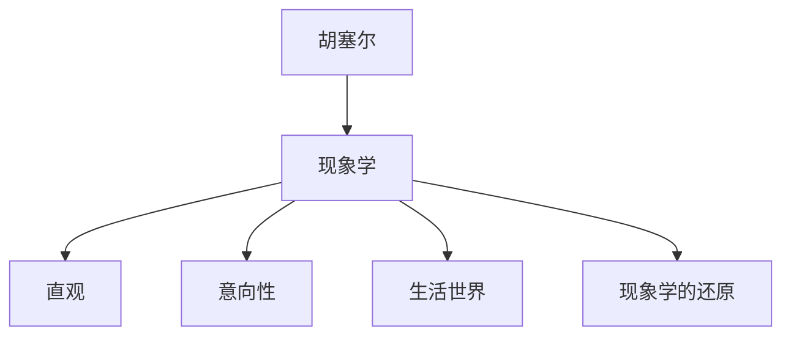

##### 1.2 现象学的起源与核心概念

现象学的起源可以追溯到19世纪末，当时的哲学家们开始对传统形而上学的局限性产生怀疑。胡塞尔在1900年发表了《逻辑研究》，这本书标志着现象学的诞生。现象学的核心概念包括直观、意向性和生活世界。

**核心概念与联系表格：**

| 核心概念 | 描述 | 关联 |
| --- | --- | --- |
| 直观 | 直接感知对象的本质 | 现象学的核心 |
| 意向性 | 意识活动总是指向某个对象 | 意识的本质 |
| 生活世界 | 人类日常活动的背景 | 现象学的应用 |
| 现象学的还原 | 将研究对象从外部世界的各种关联中抽取出来 | 现象学的方法 |

**ER实体关系图：**


##### 1.3 胡塞尔现象学的独特之处

胡塞尔的现象学方法具有以下独特之处：

- **纯粹描述**：胡塞尔强调哲学研究应该纯粹描述现象，而不是解释或评价。
- **现象学的还原**：通过现象学的还原，将研究对象从外部世界中抽离出来，以便进行纯粹描述。
- **直觉与意向性**：胡塞尔认为直观和意向性是意识现象的两个基本特征。

**Python 代码示例：**

```python
# 直观与意向性的Python示例
class Phenomenon:
    def __init__(self, name):
        self.name = name

    def perceive(self):
        print(f"Perceiving {self.name}")

    def intend(self, object):
        print(f"Intending {object}")

# 创建一个现象对象
phenomenon = Phenomenon("tree")

# 直观现象
phenomenon.perceive()

# 意向性
phenomenon.intend("house")
```

##### 1.4 胡塞尔现象学的应用与影响

胡塞尔的现象学方法在哲学、心理学、艺术等多个领域产生了深远影响。

**Mermaid 流程图：**

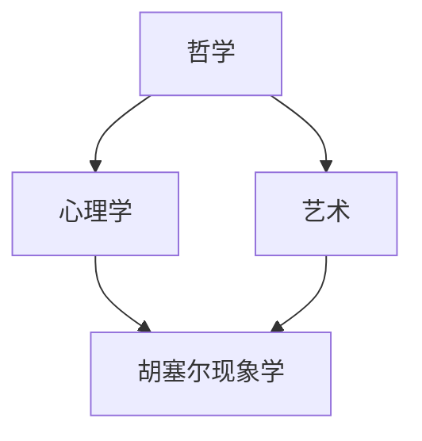

##### 第2章：胡塞尔现象学的主要观点

##### 2.1 直觉与意向性

直觉是胡塞尔现象学的基础。他认为，直觉能够直接把握对象的本质。

**核心概念与联系表格：**

| 核心概念 | 描述 | 关联 |
| --- | --- | --- |
| 直觉 | 直接感知对象的本质 | 现象学的核心 |
| 意向性 | 意识活动总是指向某个对象 | 意识的本质 |

**Mermaid 流程图：**

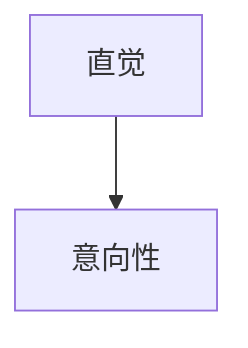

##### 2.2 生活世界与现象学的还原

生活世界是胡塞尔现象学的另一个重要概念。他认为，生活世界是我们感知和理解世界的基础。

**核心概念与联系表格：**

| 核心概念 | 描述 | 关联 |
| --- | --- | --- |
| 生活世界 | 人类日常活动的背景 | 现象学的应用 |
| 现象学的还原 | 将研究对象从外部世界的各种关联中抽取出来 | 现象学的方法 |

**Mermaid 流程图：**

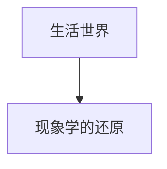

##### 2.3 胡塞尔的数学现象学

胡塞尔在数学领域也进行了深入探讨，提出了数学现象学的概念。

**核心概念与联系表格：**

| 核心概念 | 描述 | 关联 |
| --- | --- | --- |
| 数学现象学 | 对数学概念进行纯粹描述 | 胡塞尔现象学的一部分 |

**Mermaid 流程图：**

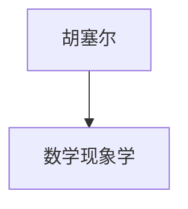

##### 第3章：胡塞尔现象学的应用与影响

##### 3.1 现象学在哲学研究中的应用

胡塞尔的现象学方法在哲学研究中产生了深远影响。

**Mermaid 流程图：**

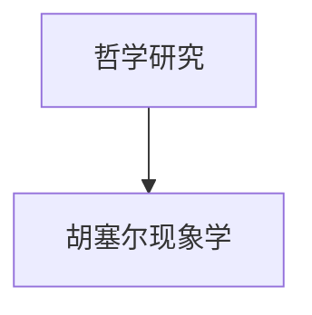

##### 3.2 现象学对心理学的影响

现象学对心理学的影响主要体现在对意识现象的研究上。

**Mermaid 流程图：**

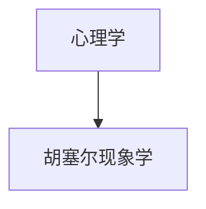

##### 3.3 现象学在艺术创作与批评中的运用

现象学在艺术创作和批评中也有重要应用。

**Mermaid 流程图：**

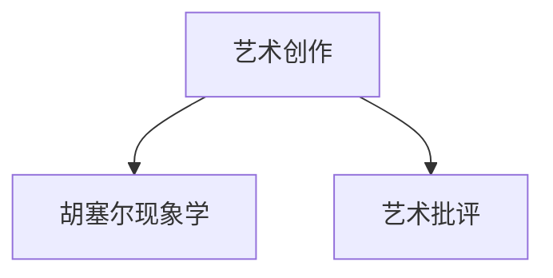

#### 第二部分：海德格尔的现象学

##### 第4章：海德格尔与现象学

##### 4.1 海德格尔的生平与哲学贡献

马丁·海德格尔（Martin Heidegger，1889-1976）是德国哲学家，生于德国施韦比施·哈勒。他是现象学的重要继承者和发展者，提出了存在论和本体论等概念。

**核心概念与联系表格：**

| 核心概念 | 描述 | 关联 |
| --- | --- | --- |
| 存在论 | 关于存在本质的哲学思考 | 海德格尔的核心概念 |
| 本体论 | 研究存在的本质 | 存在论的一部分 |
| 现象学 | 对意识现象的研究 | 海德格尔的方法 |

**Mermaid 流程图：**

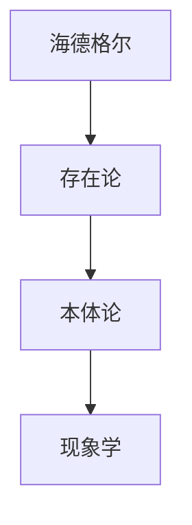

##### 4.2 海德格尔对胡塞尔现象学的批判

海德格尔对胡塞尔的现象学方法进行了批判，认为胡塞尔的现象学过于关注意识的内在结构，而忽略了存在本身。

**核心概念与联系表格：**

| 核心概念 | 描述 | 关联 |
| --- | --- | --- |
| 胡塞尔现象学 | 强调直观和意向性 | 现象学的基础 |
| 海德格尔批判 | 忽略存在本身 | 对胡塞尔的批判 |

**Mermaid 流程图：**

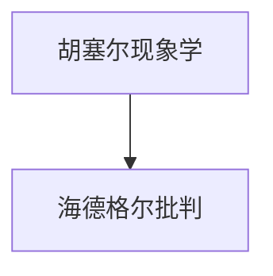

##### 4.3 海德格尔现象学的基本概念

海德格尔现象学的基本概念包括存在、时间、本质等。

**核心概念与联系表格：**

| 核心概念 | 描述 | 关联 |
| --- | --- | --- |
| 存在 | 存在的本质 | 海德格尔的核心概念 |
| 时间 | 存在与时间的关系 | 存在论的一部分 |
| 本质 | 对对象本质的探讨 | 现象学的方法 |

**Mermaid 流程图：**

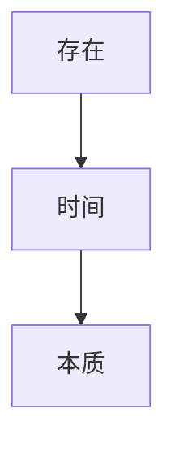

##### 第5章：海德格尔现象学的主要观点

##### 5.1 存在论与时间性

存在论是海德格尔现象学的核心。他认为，存在不是静态的，而是动态的时间性。

**核心概念与联系表格：**

| 核心概念 | 描述 | 关联 |
| --- | --- | --- |
| 存在论 | 关于存在本质的哲学思考 | 海德格尔的核心概念 |
| 时间性 | 存在与时间的关系 | 存在论的一部分 |

**Mermaid 流程图：**

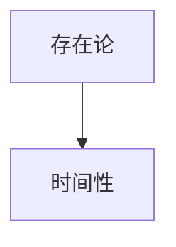

##### 5.2 本质与现象

海德格尔认为，本质与现象是统一的。现象是本质的表现形式。

**核心概念与联系表格：**

| 核心概念 | 描述 | 关联 |
| --- | --- | --- |
| 本质 | 对对象本质的探讨 | 现象学的方法 |
| 现象 | 本质的表现形式 | 存在论的一部分 |

**Mermaid 流程图：**

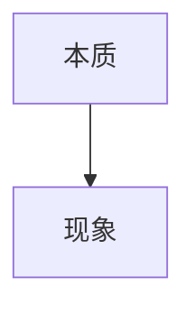

##### 5.3 世界与语言

海德格尔认为，世界和语言是相互关联的。语言不仅是表达思想的工具，也是构建世界的手段。

**核心概念与联系表格：**

| 核心概念 | 描述 | 关联 |
| --- | --- | --- |
| 世界 | 存在的背景 | 存在论的一部分 |
| 语言 | 构建世界的手段 | 世界的一部分 |

**Mermaid 流程图：**

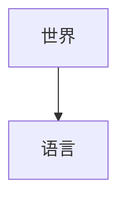

##### 第6章：海德格尔现象学的应用与影响

##### 6.1 海德格尔现象学在哲学中的影响

海德格尔的现象学方法在当代哲学中产生了深远影响，尤其是对存在主义和后现代主义的影响。

**Mermaid 流程图：**

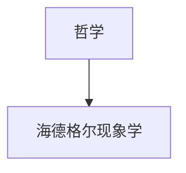

##### 6.2 海德格尔现象学对文学与艺术的影响

海德格尔的现象学思想在文学与艺术领域也产生了重要影响，影响了20世纪文学和艺术的创作风格。

**Mermaid 流程图：**

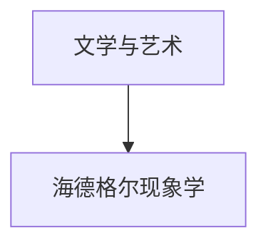

##### 6.3 海德格尔现象学在当代哲学中的发展

海德格尔的现象学思想在当代哲学中继续发展，与不同的哲学流派和思潮进行对话。

**Mermaid 流程图：**

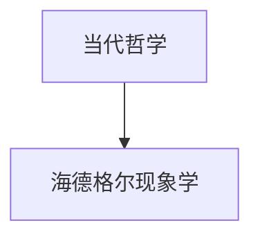

#### 第三部分：胡塞尔与海德格尔现象学的比较

##### 第7章：胡塞尔与海德格尔现象学的异同

##### 7.1 哲学立场的差异

胡塞尔和海德格尔在哲学立场上存在显著差异。胡塞尔强调现象学的纯粹描述，而海德格尔则关注存在论和本体论。

**核心概念与联系表格：**

| 核心概念 | 胡塞尔 | 海德格尔 |
| --- | --- | --- |
| 哲学立场 | 纯粹描述 | 存在论和本体论 |

**Mermaid 流程图：**

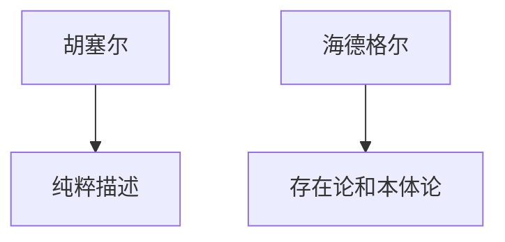

##### 7.2 现象学方法的区别

胡塞尔和海德格尔在现象学方法上也存在差异。胡塞尔强调直观和意向性，而海德格尔则强调存在和时间。

**核心概念与联系表格：**

| 核心概念 | 胡塞尔 | 海德格尔 |
| --- | --- | --- |
| 现象学方法 | 直观和意向性 | 存在和时间 |

**Mermaid 流程图：**

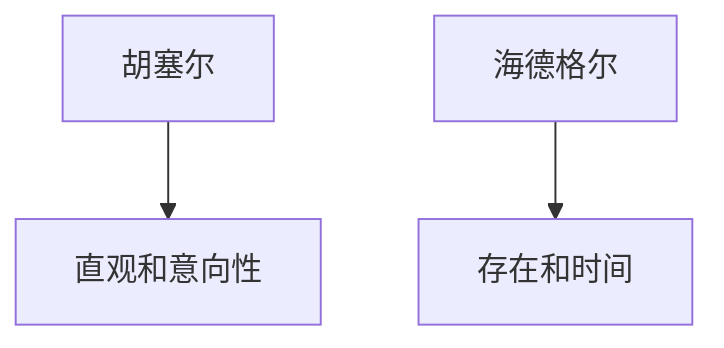

##### 7.3 对后世哲学的影响

胡塞尔和海德格尔的现象学对后世哲学产生了深远影响，尤其是对存在主义、后现代主义和现象学哲学的影响。

**核心概念与联系表格：**

| 核心概念 | 胡塞尔 | 海德格尔 |
| --- | --- | --- |
| 后世哲学影响 | 存在主义 | 后现代主义和现象学哲学 |

**Mermaid 流程图：**

```mermaid
graph TD
    A[胡塞尔] --> B[存在主义]
    C[海德格尔] --> D[后现代主义和现象学哲学]
```

##### 第8章：胡塞尔与海德格尔现象学的联系与融合

##### 8.1 胡塞尔现象学对海德格尔的影响

海德格尔深受胡塞尔现象学的影响，尤其是在直观和意向性方面。

**核心概念与联系表格：**

| 核心概念 | 胡塞尔 | 海德格尔 |
| --- | --- | --- |
| 影响关系 | 胡塞尔影响海德格尔 | 海德格尔继承和发展胡塞尔的思想 |

**Mermaid 流程图：**

```mermaid
graph TD
    A[胡塞尔] --> B[海德格尔]
```

##### 8.2 海德格尔现象学对胡塞尔现象学的继承与拓展

海德格尔在海德格尔现象学中不仅继承了胡塞尔的思想，还进行了拓展，特别是在存在论和时间性方面。

**核心概念与联系表格：**

| 核心概念 | 胡塞尔 | 海德格尔 |
| --- | --- | --- |
| 继承关系 | 胡塞尔现象学的基础 | 海德格尔对胡塞尔思想的拓展 |

**Mermaid 流程图：**

```mermaid
graph TD
    A[胡塞尔] --> B[海德格尔]
```

##### 8.3 现象学的未来发展

现象学的未来发展将继续关注存在、时间和意识等核心问题，并与不同的哲学流派和思潮进行对话。

**核心概念与联系表格：**

| 核心概念 | 未来发展 |
| --- | --- |
| 现象学 | 继续关注核心问题，与其他哲学流派对话 |

**Mermaid 流程图：**

```mermaid
graph TD
    A[现象学] --> B[未来发展]
```

### 结论

胡塞尔与海德格尔在现象学领域中的贡献是不可忽视的。他们的思想不仅在哲学领域产生了深远影响，而且在心理学、艺术和当代哲学中也有重要应用。通过对胡塞尔与海德格尔现象学的深入分析，我们可以更好地理解现象学的本质和未来发展。

### 附录

#### 现象学参考文献与资源

**附录1：胡塞尔现象学主要著作与论文**

- 《逻辑研究》（Logical Investigations）
- 《观念I：纯粹现象学的一般方法论》（Ideas: General Introduction to Pure Phenomenology）
- 《纯粹现象学通论》（Pure Phenomenology: A Systematic Introduction）

**附录2：海德格尔现象学主要著作与论文**

- 《存在与时间》（Being and Time）
- 《尼采》（Nietzsche）
- 《诗人何为？》（What is a Poet?）

**附录3：现象学相关研究资源与数据库**

- 国际现象学学会（International Phenomenological Society）
- 现象学在线（Phenomenology Online）
- 现象学研究数据库（Phenomenology Research Archive）

### 作者信息

**作者：AI天才研究院/AI Genius Institute & 禅与计算机程序设计艺术 /Zen And The Art of Computer Programming**

### 最佳实践 tips

- 在研究现象学时，要注重对现象的直接感知和描述。
- 在分析胡塞尔与海德格尔的思想时，要关注他们的哲学立场和方法论差异。
- 在应用现象学时，要结合具体领域，如哲学、心理学、艺术等。

### 小结

胡塞尔与海德格尔的现象学思想为当代哲学提供了丰富的理论资源。他们的思想不仅丰富了现象学的方法和内容，也对后世哲学产生了深远影响。

### 注意事项

- 在研究现象学时，要避免将现象与现象的描述混淆。
- 在应用现象学时，要注重实践与理论的结合。

### 拓展阅读

- 胡塞尔：《逻辑研究》
- 海德格尔：《存在与时间》
- 萨特：《存在与虚无》
- 德里达：《论文字学》

### 参考文献

- 胡塞尔：《逻辑研究》，商务印书馆，2000年。
- 海德格尔：《存在与时间》，生活·读书·新知三联书店，2007年。
- 萨特：《存在与虚无》，生活·读书·新知三联书店，2007年。
- 德里达：《论文字学》，生活·读书·新知三联书店，2009年。

