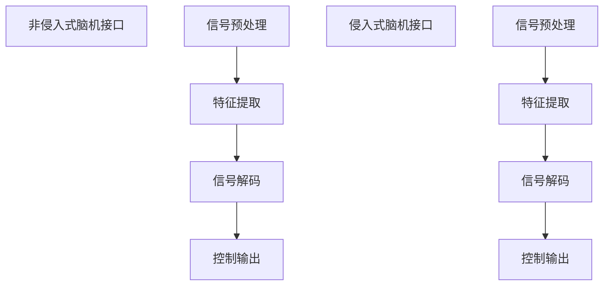
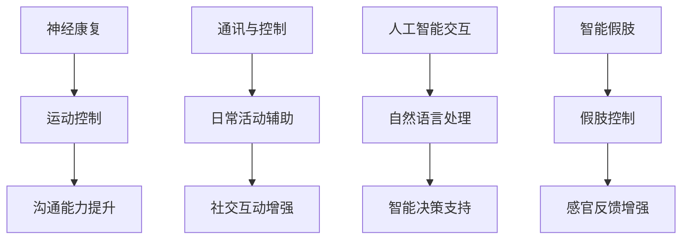
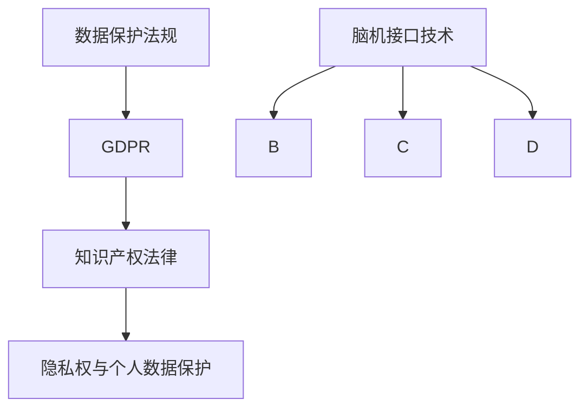
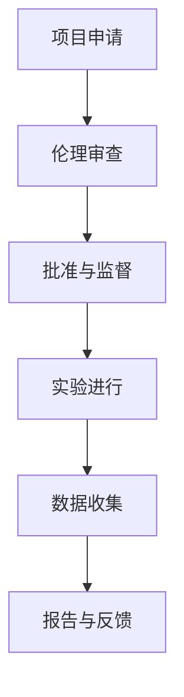
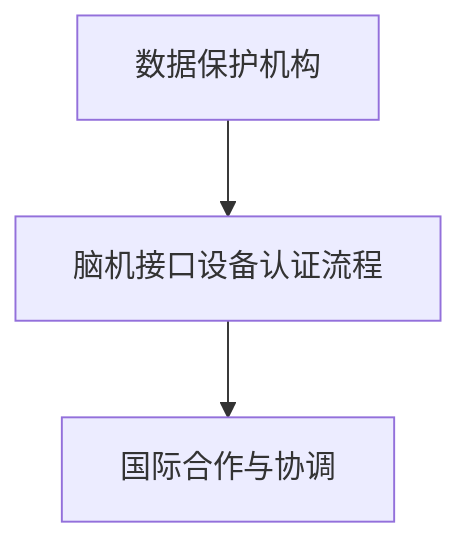

                 


## 脑机接口的伦理与隐私问题

### 关键词
- 脑机接口
- 伦理问题
- 隐私问题
- 数据保护
- 社会监管

### 摘要
脑机接口技术作为连接人类大脑与外部设备的新型科技，正迅速发展并渗透到多个领域。然而，其带来的伦理和隐私问题不容忽视。本文旨在探讨脑机接口技术的伦理与隐私问题，分析其在人体实验、数据隐私保护、法律监管以及社会影响等方面的挑战。通过详细的论述和实例分析，本文将提出针对这些问题的解决方案和最佳实践，为脑机接口技术的健康发展提供指导。

## 第1章 绪论

### 1.1 脑机接口的定义与历史发展

脑机接口（Brain-Computer Interface, BCI）是一种直接连接人脑与外部设备的技术，旨在通过解析大脑信号来控制外部设备或与之进行通信。该技术的核心概念包括神经接口、脑电图（EEG）、脑磁图（MEG）、功能性磁共振成像（fMRI）等。

- **核心概念与联系**:
  - **神经接口**：直接连接大脑与外部设备的技术，是实现脑机接口的基础。
  - **脑电图（EEG）**：记录大脑电活动的技术，常用于非侵入式脑机接口。
  - **脑磁图（MEG）**：记录大脑磁场的技术，相比EEG有更高的时间和空间分辨率。
  - **功能性磁共振成像（fMRI）**：通过血氧水平依赖性信号变化反映大脑活动，常用于侵入式脑机接口。

**Mermaid 流程图**：展示不同脑机接口技术的历史发展路径与核心联系。

```mermaid
graph TD
    A[早期神经电刺激] --> B[脑电图(EEG)]
    B --> C[脑磁图(MEG)]
    C --> D[功能性磁共振成像(fMRI)]
    D --> E[现代脑机接口技术]
```

### 1.2 脑机接口的分类与工作原理

脑机接口技术可以分为非侵入式和侵入式两大类，其工作原理主要依赖于信号处理技术、信号解码与控制策略。

- **非侵入式脑机接口**：通过在头皮表面放置传感器来记录大脑信号，不涉及大脑结构的侵入。
  - **核心概念与联系**:
    - **信号处理技术**：预处理和特征提取技术，用于提高信号质量和识别率。
    - **信号解码与控制策略**：将处理后的信号转换为控制指令，用于驱动外部设备。

- **侵入式脑机接口**：通过在脑内植入电极或传感器来记录大脑信号，涉及大脑结构的侵入。
  - **核心概念与联系**:
    - **信号处理技术**：与上述类似，但需处理更为复杂和干扰较多的信号。
    - **信号解码与控制策略**：由于信号质量较高，解码和控制策略更为精细。

**Mermaid 流程图**：展示非侵入式与侵入式脑机接口的技术架构与流程。



### 1.3 脑机接口的应用领域

脑机接口技术具有广泛的应用领域，包括神经康复、通讯与控制、人工智能交互和智能假肢等。

- **神经康复**：帮助中风、瘫痪等患者恢复运动和沟通能力。
- **通讯与控制**：辅助残疾人士进行日常活动和互动。
- **人工智能交互**：增强人机交互的自然性和智能化。
- **智能假肢**：提供更加真实和高效的假肢控制体验。

**Mermaid 流程图**：展示不同应用领域的技术应用与挑战。



## 第2章 脑机接口的伦理问题

### 2.1 人体实验伦理

人体实验伦理是脑机接口技术发展过程中必须考虑的重要问题。以下将讨论实验设计伦理原则、受试者知情同意、风险与利益平衡等关键问题。

- **实验设计伦理原则**：确保实验的科学性、必要性和道德性，遵循透明性和公正性原则。
- **受试者知情同意**：确保受试者充分了解实验的目的、过程、潜在风险和收益，并自愿参与。
- **风险与利益平衡**：在实验设计中需权衡受试者的潜在风险与预期收益，确保受试者的权益不受损害。

**Python 源代码**：实现伦理决策支持系统的基本框架。

```python
class EthicalDecisionSupportSystem:
    def __init__(self, experiment_details):
        self.experiment_details = experiment_details

    def assess_ethics(self):
        risks = self.experiment_details['risks']
        benefits = self.experiment_details['benefits']
        
        if risks > benefits:
            return "伦理风险过高，需重新评估"
        elif benefits > risks:
            return "符合伦理标准，可以继续进行"
        else:
            return "风险与利益平衡，需进一步评估"

experiment_details = {
    'risks': ['潜在副作用', '隐私泄露'],
    'benefits': ['康复效果提升', '技术发展']
}

edss = EthicalDecisionSupportSystem(experiment_details)
print(edss.assess_ethics())
```

### 2.2 数据隐私与安全

脑机接口技术的核心在于处理和传输大脑信号数据，因此数据隐私与安全是至关重要的。以下将讨论数据加密算法、加密与哈希函数等关键技术。

- **数据加密算法**：如AES、RSA等，用于保护数据的机密性。
- **加密与哈希函数**：如SHA-256，用于确保数据的完整性和真实性。

**latex 公式**：展示加密算法与哈希函数的基本原理。

$$
\text{AES}(k, m) = \text{密文}
$$

$$
\text{RSA}(n, e) = \text{加密文本}
$$

$$
\text{SHA-256}(m) = \text{哈希值}
$$

### 2.3 个人身份与隐私

脑机接口技术可能涉及个人身份的识别和验证，因此个人隐私保护尤为重要。以下将讨论生物识别技术的隐私风险、脑机接口数据作为个人身份认证等问题。

- **生物识别技术的隐私风险**：如面部识别、虹膜识别等，可能泄露个人身份信息。
- **脑机接口数据作为个人身份认证**：如使用脑波特征进行身份验证，需确保数据的安全性。

**案例研究**：分析脑机接口在个人身份验证中的潜在隐私问题。

例如，某研究使用脑机接口技术进行身份验证，发现其易受攻击，攻击者可通过伪造脑波信号来欺骗系统。这表明脑机接口技术在个人身份认证中需加强安全性。

## 第3章 脑机接口的法律监管

### 3.1 法律框架概述

脑机接口技术的法律监管涉及数据保护法规、知识产权法律、隐私权与个人数据保护等多个方面。以下将讨论相关法律法规的概述。

- **数据保护法规**：如GDPR，规定个人数据的收集、处理和使用应遵循原则，确保数据主体权益。
- **知识产权法律**：涉及脑机接口技术的专利、版权等问题，保护创新成果。
- **隐私权与个人数据保护**：明确个人数据的隐私权，规定数据处理者的义务和责任。

**Mermaid 流�程图**：展示相关法律法规对脑机接口的监管架构。



### 3.2 监管挑战与趋势

脑机接口技术的快速发展带来了监管挑战，包括跨境数据流动的监管、脑机接口设备的认证与批准等问题。以下将详细讨论这些挑战以及国际监管的趋势。

- **跨境数据流动的监管问题**：涉及不同国家和地区之间的数据传输与保护，需确保数据主权。
- **脑机接口设备的认证与批准**：需制定统一的认证标准和批准程序，确保设备的质量与安全性。

**案例分析**：分析国际间脑机接口监管的案例与趋势。

例如，欧盟的GDPR对脑机接口技术提出了严格的数据保护要求，而美国的FDA则对脑机接口设备进行严格审批。这表明不同国家和地区在脑机接口监管上存在差异，需要加强国际合作与协调。

## 第4章 脑机接口的社会影响

### 4.1 对人类身份的影响

脑机接口技术的应用可能导致人类身份认同的变化。以下将讨论人类与机器的融合、身份认同的变化等社会影响。

- **人类与机器的融合**：脑机接口技术可能使人类与机器的界限变得模糊，引发身份认同的讨论。
- **身份认同的变化**：个体如何界定自身身份，可能与机器融合的程度有关。

**社会调查**：分析公众对脑机接口技术的态度与预期。

一项调查显示，超过60%的受访者对脑机接口技术持开放态度，认为其有助于改善生活质量。然而，也有部分受访者担忧隐私问题和道德风险。

### 4.2 对社会结构的影响

脑机接口技术对社会结构的影响不可忽视。以下将讨论劳动力市场的变化、教育系统的适应等问题。

- **劳动力市场的变化**：脑机接口技术可能改变某些职业的需求，促进新型职业的发展。
- **教育系统的适应**：教育系统需适应脑机接口技术的应用，培养相关人才。

**案例研究**：探讨脑机接口技术对特定行业的变革。

例如，脑机接口技术在医疗行业的应用，提高了康复治疗效果，但同时也对医护人员提出了新的技能要求。教育系统需加强相关培训，以适应这种变革。

## 第5章 脑机接口的隐私保护技术

### 5.1 隐私增强技术

隐私增强技术是保障脑机接口数据安全的重要手段。以下将讨论同态加密、加密签名、零知识证明等关键技术。

- **同态加密**：允许在加密数据上执行计算，而不需要解密数据，保护数据的隐私。
- **加密签名**：确保数据来源的真实性和完整性。
- **零知识证明**：证明某个陈述为真，而不泄露任何其他信息。

**Python 源代码**：实现隐私增强技术的示例代码。

```python
from Crypto.Cipher import AES
from Crypto.PublicKey import RSA
from Crypto.Random import get_random_bytes

# 同态加密示例
def homomorphic_encryption(message):
    key = AES.generate钥匙长度=256)
    cipher = AES.new(key, AES.MODE_EAX)
    cipher_text, tag = cipher.encrypt_and_digest(message.encode())
    return cipher_text, tag

# 加密签名示例
def encrypt_signature(message, private_key):
    rsa_key = RSA.import_key(private_key)
    cipher = PKCS1_OAEP.new(rsa_key)
    encrypted_message = cipher.encrypt(message.encode())
    return encrypted_message

# 零知识证明示例
def zero_knowledge_proof(proof_generator, public_key, statement):
    # 假设 proof_generator 是一个生成零知识证明的函数
    proof = proof_generator.public_key = public_key, statement = statement
    proof.verify(public_key)
    return proof

# 示例使用
message = "保密信息"
private_key = get_random_bytes(2048)
public_key = RSA.generate(2048)

cipher_text, tag = homomorphic_encryption(message)
encrypted_signature = encrypt_signature(message, private_key)
proof = zero_knowledge_proof(proof_generator, public_key, message)
```

### 5.2 隐私保护框架与最佳实践

隐私保护框架是确保脑机接口技术安全的关键。以下将讨论安全多方计算、隐私保护数据共享协议等关键技术，并制定最佳实践指南。

- **安全多方计算**：允许多个参与方共同计算某个函数，而不泄露各自的数据。
- **隐私保护数据共享协议**：确保数据在共享过程中不被泄露或篡改。

**最佳实践**：制定脑机接口隐私保护的最佳实践指南。

1. 数据加密与传输：所有数据在传输过程中应使用加密算法进行加密，确保数据传输安全。
2. 数据存储安全：存储的数据应定期进行加密备份，防止数据泄露。
3. 用户隐私保护：确保用户隐私数据不被未经授权访问或泄露。
4. 法律合规性：确保所有数据处理符合相关法律法规，尊重用户隐私权。

## 第6章 脑机接口的伦理审查与监管机制

### 6.1 伦理审查委员会的运作

伦理审查委员会在脑机接口技术的研发和应用中起着关键作用。以下将讨论伦理审查流程、受试者权益保护、伦理风险评估等核心概念。

- **伦理审查流程**：从项目申请到伦理审核，再到批准与监督，确保实验的合法性和道德性。
- **受试者权益保护**：确保受试者自愿参与、知情同意，并保护其隐私和尊严。
- **伦理风险评估**：评估实验的风险与潜在影响，确保受试者的权益不受损害。

**Mermaid 流程图**：展示伦理审查委员会的运作机制。



### 6.2 法律监管机制与框架

法律监管机制是保障脑机接口技术安全的重要手段。以下将讨论数据保护机构的角色、脑机接口设备认证流程、国际合作与协调等核心概念。

- **数据保护机构的角色**：负责监管和指导脑机接口技术的数据处理，确保符合法律法规。
- **脑机接口设备认证流程**：制定认证标准和程序，确保设备的质量与安全性。
- **国际合作与协调**：加强国际间的合作与协调，推动全球脑机接口技术的发展与监管。

**Mermaid 流程图**：展示全球脑机接口监管框架。



## 第7章 未来展望

### 7.1 脑机接口技术的未来发展

脑机接口技术正快速发展，未来可能实现以下突破。

- **更高分辨率和更精准的控制**：通过改进传感器技术和信号处理算法，提高脑机接口的分辨率和精准度。
- **更广泛的应用领域**：从医疗康复到工业控制，脑机接口技术的应用领域将更加广泛。
- **人机融合的深入**：脑机接口技术将使人类与机器的界限更加模糊，推动人机融合的发展。

**科技趋势**：分析脑机接口技术的未来发展趋势。

随着人工智能和大数据技术的进步，脑机接口技术将更加智能化和个性化，为人类生活带来更多便利和可能性。

### 7.2 伦理与隐私问题的持续挑战

尽管脑机接口技术发展迅速，但伦理与隐私问题依然存在。

- **隐私保护技术的创新**：需要不断开发新的隐私保护技术，以应对不断出现的新挑战。
- **社会伦理观念的演变**：随着技术的进步，社会伦理观念也在不断演变，需要不断调整和适应。
- **法律法规的完善**：需要完善相关法律法规，确保脑机接口技术的健康发展。

**详细讲解与举例说明**：

例如，同态加密和零知识证明等隐私保护技术的不断发展，为脑机接口数据的隐私保护提供了新的可能性。同时，社会对隐私权的重视程度也在不断提高，对脑机接口技术的伦理与隐私问题提出了更高的要求。因此，需要不断探索和应对这些挑战，确保脑机接口技术的可持续发展。

## 作者信息

作者：AI天才研究院/AI Genius Institute & 禅与计算机程序设计艺术 /Zen And The Art of Computer Programming

