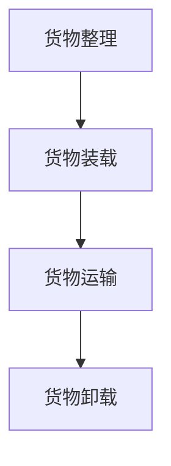
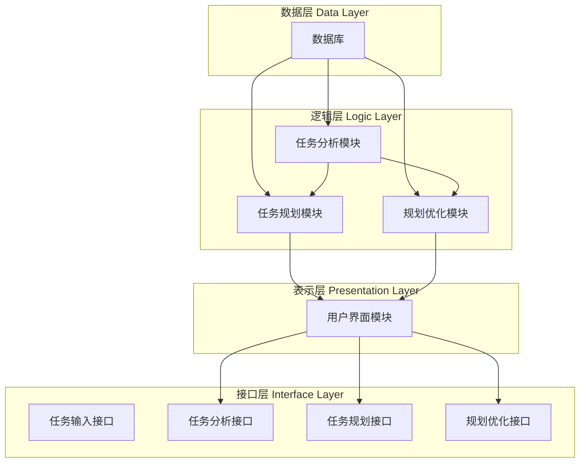
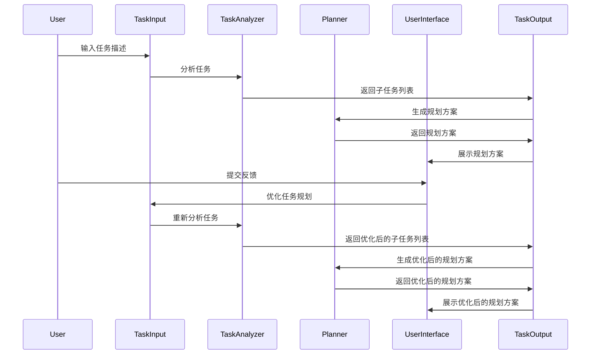

                 

# 自动任务分解推理中神经符号规划的突破

## 关键词

- 自动任务分解推理
- 神经符号规划
- 任务表示
- 算法优化
- 应用案例分析

## 摘要

本文将深入探讨自动任务分解推理中神经符号规划的研究现状、原理、算法及其实际应用。首先，我们介绍了自动任务分解推理和神经符号规划的基本概念及其重要性，然后详细解析了自动任务分解推理的基础理论和神经符号规划算法原理。接着，通过数学模型与公式推导，对神经符号规划进行系统分析。最后，通过具体项目实战与案例分析，展示了神经符号规划在实际应用中的效果，并总结了一些最佳实践建议。

## 引言与背景

### 1.1 自动任务分解推理概述

#### 1.1.1 自动任务分解推理的基本概念

自动任务分解推理（Automated Task Decomposition Reasoning，ATDR）是人工智能领域中一个重要的研究方向。其主要目标是利用算法将复杂任务分解为更小、更易于管理的子任务。这个过程不仅有助于降低任务复杂度，提高任务执行效率，还能增强系统的灵活性和适应性。ATDR在自然语言处理、图像识别、智能推荐等领域有广泛应用。

#### 1.1.2 自动任务分解推理的关键挑战

尽管ATDR在多个领域取得了显著成果，但其发展仍然面临一些关键挑战。首先是如何有效表示任务，使得系统能够准确理解任务要求。其次是如何选择合适的分解策略，保证子任务之间的协调与整合。此外，任务分解的算法效率也是一个重要问题，特别是在处理大规模任务时，如何降低计算复杂度是研究的热点。

#### 1.1.3 自动任务分解推理的应用场景

自动任务分解推理的应用场景非常广泛。在自然语言处理领域，可以将复杂文本分析任务分解为句法分析、语义分析等子任务，从而提高文本处理的准确性和效率。在图像识别领域，可以将图像处理任务分解为图像分割、特征提取等子任务，有助于提升图像识别的性能。在智能推荐领域，自动任务分解推理可以帮助系统更好地理解用户需求，从而提供更加精准的推荐结果。

### 1.2 神经符号规划的基本概念

#### 1.2.1 神经网络与符号推理的融合

神经符号规划（Neural Symbolic Planning，NSP）是一种结合了神经网络和符号推理的新兴方法。神经网络擅长从大量数据中提取特征和模式，而符号推理则能够进行逻辑推理和抽象表示。NSP通过将这两种方法相结合，旨在解决复杂任务规划问题，提高规划效率和鲁棒性。

#### 1.2.2 神经符号规划的核心目标

神经符号规划的核心目标是通过结合神经网络和符号推理的优势，实现高效、准确的任务规划。具体而言，NSP需要能够从输入数据中自动提取任务特征，进行逻辑推理，生成任务计划。此外，NSP还需要具备较强的泛化能力和适应性，能够在不同场景下有效工作。

#### 1.2.3 神经符号规划的优势与局限

神经符号规划具有多方面的优势。首先，它能够充分利用神经网络强大的特征提取能力，提高任务规划的准确性和效率。其次，符号推理的引入使得系统能够进行逻辑推理，解决复杂规划问题。此外，NSP具有较强的鲁棒性，能够应对不确定性和变化。然而，NSP也存在一些局限，如计算复杂度高、训练过程耗时较长等。

### 1.3 本书的目标与结构

本书旨在探讨自动任务分解推理中神经符号规划的突破，全面解析相关理论和应用。全书共分为七个章节，涵盖了自动任务分解推理的基本概念、神经符号规划的核心算法、数学模型及其在具体应用场景中的实践。

### 目录结构

```markdown
# 第1章 引言与背景

## 1.1 自动任务分解推理概述
### 1.1.1 自动任务分解推理的基本概念
### 1.1.2 自动任务分解推理的关键挑战
### 1.1.3 自动任务分解推理的应用场景

## 1.2 神经符号规划的基本概念
### 1.2.1 神经网络与符号推理的融合
### 1.2.2 神经符号规划的核心目标
### 1.2.3 神经符号规划的优势与局限

## 1.3 本书的目标与结构
### 1.3.1 研究背景与动机
### 1.3.2 内容概述与章节安排
### 1.3.3 阅读指南与学习目标
```

## 第2章 自动任务分解推理基础理论

### 2.1 自动任务分解推理的基本原理

#### 2.1.1 任务分解的层次结构

自动任务分解推理通常采用层次结构来表示任务分解。最顶层表示整体任务，下层则表示分解后的子任务。层次结构有助于理解和处理复杂任务，使得子任务之间的协调和整合更加方便。

#### 2.1.2 任务分解的算法框架

任务分解算法框架通常包括以下几个关键步骤：

1. **任务表示**：将原始任务转化为一种可处理的表示形式，例如图或树结构。
2. **子任务选择**：根据一定的策略选择子任务，通常涉及子任务的划分和排序。
3. **任务整合**：将分解后的子任务整合成一个完整的任务计划。

#### 2.1.3 任务分解的策略与方法

任务分解的策略和方法多种多样，主要包括以下几种：

1. **基于启发式的方法**：通过启发式规则或经验进行子任务选择，例如贪婪算法、遗传算法等。
2. **基于学习的策略**：利用机器学习算法从大量数据中学习任务分解策略，提高分解效果。
3. **混合策略**：结合启发式方法和学习策略，以取长补短。

### 2.2 任务表示与建模

#### 2.2.1 任务表示方法

任务表示是自动任务分解推理的基础，常用的任务表示方法包括：

1. **图表示**：使用图结构表示任务，图中的节点表示子任务，边表示子任务之间的关系。
2. **树表示**：使用树结构表示任务，树的叶子节点表示基本操作，内部节点表示子任务的组合。
3. **矩阵表示**：使用矩阵表示任务，矩阵中的元素表示子任务之间的依赖关系。

#### 2.2.2 任务建模的原则与技巧

任务建模的原则和技巧包括：

1. **层次性**：保证任务模型的层次结构清晰，便于理解和处理。
2. **抽象性**：适当抽象任务，去除冗余信息，提高模型的效率和准确性。
3. **灵活性**：设计可扩展的任务模型，以适应不同类型和复杂度的任务。

#### 2.2.3 任务实例与建模案例分析

下面以一个简单的例子来说明任务表示和建模的过程：

**例子**：假设有一个任务是将一批货物从仓库运输到指定的目的地。我们可以将这个任务分解为以下几个子任务：

1. **货物整理**：将货物从仓库中整理出来，放入运输工具中。
2. **货物装载**：将整理好的货物装载到运输工具上。
3. **货物运输**：将装载好的货物运输到目的地。
4. **货物卸载**：将运输到目的地的货物卸载下来。

根据这个例子，我们可以采用图表示法来表示任务分解。具体表示如下：



### 2.3 自动任务分解推理的核心算法

#### 2.3.1 状态空间搜索算法

状态空间搜索算法是自动任务分解推理的核心算法之一。它通过搜索任务的状态空间来找到最优的任务分解方案。常用的状态空间搜索算法包括：

1. **广度优先搜索（BFS）**：从初始状态开始，逐层搜索状态空间，直到找到目标状态。
2. **深度优先搜索（DFS）**：从初始状态开始，尽可能深入地搜索状态空间，直到找到目标状态。
3. **A*搜索算法**：结合广度优先搜索和启发式函数，以最小化搜索代价找到最优解。

#### 2.3.2 子任务选择算法

子任务选择算法是自动任务分解推理的关键步骤之一。它决定了如何从原始任务中选择子任务，以保证任务分解的效率和准确性。常用的子任务选择算法包括：

1. **贪婪算法**：每次选择当前最优的子任务，直到任务分解完成。
2. **遗传算法**：通过遗传操作和适应度函数，搜索最优的任务分解方案。
3. **启发式搜索算法**：结合启发式规则，快速找到近似最优的任务分解方案。

#### 2.3.3 搜索算法的优化与改进

为了提高搜索算法的效率，研究者们提出了一系列优化与改进方法。主要包括：

1. **剪枝技术**：通过剪枝操作减少搜索空间，提高搜索效率。
2. **并行搜索**：利用并行计算资源，加速搜索过程。
3. **分布式搜索**：将任务分解问题分解为多个子问题，分布式处理，提高搜索效率。

### 2.4 自动任务分解推理的挑战与展望

#### 2.4.1 算法复杂性分析

自动任务分解推理的算法复杂性是一个重要问题。特别是在处理大规模任务时，搜索算法的复杂度可能会急剧增加。因此，降低算法复杂度是当前研究的一个重要方向。

#### 2.4.2 算法应用领域拓展

自动任务分解推理的应用领域非常广泛，除了自然语言处理、图像识别和智能推荐外，还可以应用于机器人调度、智能交通、医疗诊断等领域。拓展算法的应用领域是未来的重要方向。

#### 2.4.3 未来发展趋势

随着人工智能技术的不断发展，自动任务分解推理在未来有望取得以下突破：

1. **算法效率提升**：通过优化搜索算法和数据结构，提高算法的效率。
2. **跨领域应用**：将自动任务分解推理应用于更多领域，实现跨领域的任务分解和规划。
3. **结合其他技术**：与其他人工智能技术相结合，如深度学习、强化学习等，提升自动任务分解推理的性能。

## 第3章 神经符号规划算法原理

### 3.1 神经符号规划的定义与框架

神经符号规划（Neural Symbolic Planning，NSP）是一种结合了神经网络和符号推理的新兴方法，旨在解决复杂任务规划问题。NSP的定义可以概括为：利用神经网络进行任务特征提取和模式识别，结合符号推理进行逻辑推理和抽象表示，从而实现高效、准确的任务规划。

#### 3.1.1 神经网络与符号推理的结合

神经网络和符号推理各有优缺点。神经网络擅长从大量数据中提取特征和模式，但缺乏逻辑推理能力；而符号推理能够进行逻辑推理和抽象表示，但处理复杂任务的能力有限。NSP通过将这两种方法相结合，发挥各自优势，实现了高效的任务规划。

1. **神经网络的优势**：
   - 强大的特征提取能力
   - 自适应的学习能力
   - 能够处理大规模数据和复杂任务

2. **符号推理的优势**：
   - 强大的逻辑推理能力
   - 高度的抽象表示能力
   - 能够解决复杂规划问题

#### 3.1.2 神经符号规划的组成部分

神经符号规划主要由以下几个部分组成：

1. **任务特征提取模块**：利用神经网络从输入任务中提取关键特征，为符号推理提供基础。
2. **符号推理模块**：利用符号推理方法对提取的特征进行逻辑推理和抽象表示，生成任务计划。
3. **规划优化模块**：对生成的任务计划进行优化，以提高规划效率和鲁棒性。

#### 3.1.3 神经符号规划的优势与应用场景

神经符号规划具有以下优势：

1. **高效性**：结合神经网络和符号推理，能够快速、准确地生成任务计划。
2. **鲁棒性**：能够应对不确定性和变化，保证规划结果的稳定性。
3. **灵活性**：能够适应不同类型和复杂度的任务，具有较强的泛化能力。

神经符号规划的应用场景主要包括：

1. **智能推荐系统**：利用神经符号规划对用户行为进行分析，生成个性化推荐结果。
2. **智能交通系统**：利用神经符号规划对交通流量进行分析，优化交通信号控制策略。
3. **机器人调度**：利用神经符号规划对机器人任务进行分解和规划，提高机器人工作的效率和灵活性。

### 3.2 神经网络在任务表示中的应用

#### 3.2.1 任务特征的提取与表示

在神经符号规划中，任务特征的提取与表示是关键步骤。神经网络通过学习输入任务的数据，提取出关键特征，并将其表示为向量或张量。这些特征可以用于后续的符号推理。

1. **特征提取方法**：
   - **卷积神经网络（CNN）**：适用于图像等二维数据的特征提取。
   - **循环神经网络（RNN）**：适用于序列数据的特征提取。
   - **生成对抗网络（GAN）**：用于生成虚拟数据，增强训练数据集。

2. **特征表示方法**：
   - **向量表示**：将特征表示为一个高维向量，便于符号推理处理。
   - **张量表示**：将特征表示为一个多维张量，适用于深度学习模型。

#### 3.2.2 神经网络在任务表示中的模型选择

根据任务特点，选择合适的神经网络模型是关键。以下是一些常见的神经网络模型：

1. **卷积神经网络（CNN）**：适用于图像处理任务，通过卷积操作提取图像特征。
2. **循环神经网络（RNN）**：适用于序列数据处理任务，通过循环结构保持历史信息。
3. **长短时记忆网络（LSTM）**：RNN的一种变体，适用于处理长序列数据。
4. **自编码器（Autoencoder）**：适用于特征降维和去噪，通过编码器和解码器学习数据表示。

#### 3.2.3 神经网络在任务表示中的效果评估

评估神经网络在任务表示中的效果，通常通过以下指标：

1. **准确率**：任务分类或回归任务的准确性。
2. **召回率**：任务分类中的召回率，表示分类为正样本的实际正样本比例。
3. **F1 分数**：准确率和召回率的加权平均，综合考虑准确率和召回率。
4. **ROC 曲线和 AUC 值**：用于评估分类模型的性能，ROC 曲线和 AUC 值越高，模型性能越好。

### 3.3 符号推理在规划中的应用

#### 3.3.1 符号推理的基本原理

符号推理是一种基于逻辑和推理规则的方法，通过符号表示任务，利用推理规则推导出结论。符号推理的基本原理包括：

1. **符号表示**：使用符号来表示任务、状态和操作，例如使用谓词逻辑表示任务状态。
2. **推理规则**：根据已知的符号表示和推理规则，推导出新的符号表示，实现任务规划。
3. **推理方法**：包括正向推理、逆向推理和混合推理等，根据具体任务选择合适的推理方法。

#### 3.3.2 符号推理在规划中的实现方法

符号推理在规划中的实现方法主要包括：

1. **推理机**：用于执行符号推理的软件组件，根据输入的符号表示和推理规则，生成新的符号表示。
2. **演绎推理**：基于逻辑推理规则，从已知的事实推导出新的事实，用于生成任务计划。
3. **归纳推理**：从具体的实例中归纳出一般性的规则，用于生成任务计划。

#### 3.3.3 符号推理的优化与改进策略

为了提高符号推理的效率和准确性，可以采用以下优化与改进策略：

1. **搜索空间剪枝**：通过剪枝操作减少搜索空间，降低推理复杂度。
2. **启发式搜索**：利用启发式信息指导推理过程，提高推理效率。
3. **分布式推理**：利用并行计算资源，分布式执行符号推理任务，提高推理速度。

### 3.4 神经符号规划的算法设计与实现

#### 3.4.1 基于神经网络的规划算法

基于神经网络的规划算法主要包括以下步骤：

1. **任务特征提取**：利用神经网络从输入任务中提取关键特征。
2. **状态表示**：将提取的特征表示为状态向量或状态图。
3. **规划搜索**：利用搜索算法（如A*搜索）在状态空间中寻找最优规划路径。

#### 3.4.2 基于符号推理的规划算法

基于符号推理的规划算法主要包括以下步骤：

1. **符号表示**：使用符号表示任务和状态。
2. **推理规则**：定义符号推理规则，用于生成任务计划。
3. **规划生成**：利用推理机执行符号推理，生成任务计划。

#### 3.4.3 神经符号规划的集成算法

神经符号规划的集成算法结合了神经网络和符号推理的优势，主要包括以下步骤：

1. **任务特征提取**：利用神经网络提取任务特征。
2. **状态表示**：将提取的特征表示为状态向量或状态图。
3. **符号推理**：利用符号推理规则生成任务计划。
4. **规划优化**：对生成的任务计划进行优化，提高规划效率和鲁棒性。

## 第4章 数学模型与公式推导

### 4.1 任务分解的数学模型

#### 4.1.1 任务分解的层次结构模型

任务分解的层次结构模型是一种将任务划分为层次结构的数学模型。在这种模型中，任务可以表示为一个树形结构，其中每个节点表示一个子任务，叶节点表示基本操作。

**模型表示：**

给定一个任务 T，可以将其表示为一个层次结构树 T = {T1, T2, ..., Tk}，其中 Tk 表示第 k 层的子任务集合。

**层次结构模型的基本性质：**

1. **递归性**：每个子任务 Tk 可以进一步分解为更小的子任务集合。
2. **层次性**：层次结构树具有明确的层次关系，高层任务包含底层任务。
3. **完备性**：任务分解能够覆盖任务的所有操作和状态。

#### 4.1.2 任务分解的目标函数

任务分解的目标函数用于衡量任务分解的质量和效率。常见的目标函数包括最小化任务执行时间、最小化资源消耗、最大化任务成功率等。

**目标函数表示：**

给定任务分解 T 和资源 R，目标函数可以表示为：

$$
\min f(T, R)
$$

其中，f(T, R) 表示任务分解 T 和资源 R 的质量指标。

#### 4.1.3 任务分解的约束条件

任务分解的约束条件用于限制任务分解的范围和方式。常见的约束条件包括：

1. **资源约束**：任务分解过程中，资源的使用量不能超过给定资源限制。
2. **时间约束**：任务分解需要在给定的时间窗口内完成。
3. **任务依赖**：子任务之间存在依赖关系，必须按照特定的顺序执行。

### 4.2 神经符号规划的数学模型

#### 4.2.1 神经网络在任务表示中的数学模型

在神经符号规划中，神经网络用于任务特征的提取和表示。神经网络的基本数学模型可以表示为：

$$
\mathbf{h}^{(l)} = \sigma(\mathbf{W}^{(l)} \mathbf{h}^{(l-1)} + \mathbf{b}^{(l)})
$$

其中，$\mathbf{h}^{(l)}$ 表示第 l 层的输出向量，$\sigma$ 表示激活函数，$\mathbf{W}^{(l)}$ 和 $\mathbf{b}^{(l)}$ 分别表示第 l 层的权重和偏置。

#### 4.2.2 符号推理在规划中的数学模型

符号推理在规划中的数学模型通常基于谓词逻辑。谓词逻辑的数学模型可以表示为：

$$
\varphi = \varphi_1 \land \varphi_2 \land ... \land \varphi_n
$$

其中，$\varphi$ 表示一个逻辑公式，$\varphi_1, \varphi_2, ..., \varphi_n$ 分别表示逻辑公式中的子句。

#### 4.2.3 神经符号规划的整体数学模型

神经符号规划的整体数学模型结合了神经网络和符号推理的数学模型。整体模型可以表示为：

$$
\mathbf{y} = \sigma(\mathbf{W}_{\text{output}} \mathbf{h}^{(L)} + \mathbf{b}_{\text{output}})
$$

其中，$\mathbf{y}$ 表示规划输出，$\mathbf{h}^{(L)}$ 表示神经网络最后一层的输出，$\sigma$ 表示激活函数，$\mathbf{W}_{\text{output}}$ 和 $\mathbf{b}_{\text{output}}$ 分别表示输出层的权重和偏置。

### 4.3 算法复杂度分析

#### 4.3.1 状态空间搜索算法的复杂度分析

状态空间搜索算法的复杂度主要取决于搜索空间的大小和搜索策略。在任务分解中，搜索空间的大小通常与任务规模和分解层次有关。假设任务规模为 N，分解层次为 L，则状态空间的大小为 O(N^L)。

#### 4.3.2 子任务选择算法的复杂度分析

子任务选择算法的复杂度主要取决于子任务的数量和选择策略。在任务分解中，子任务的数量通常与任务规模和分解层次有关。假设任务规模为 N，分解层次为 L，则子任务的数量为 O(N^L)。

#### 4.3.3 神经符号规划算法的复杂度分析

神经符号规划算法的复杂度主要取决于神经网络和符号推理的复杂度。假设神经网络包含 L 层，每层有 M 个神经元，则神经网络的复杂度为 O(M^L)。符号推理的复杂度主要取决于逻辑公式的规模，假设逻辑公式包含 N 个子句，则符号推理的复杂度为 O(N)。

### 4.4 数学模型的应用与举例

#### 4.4.1 数学模型在任务分解中的应用

数学模型在任务分解中的应用主要包括任务表示、目标函数和约束条件。以下是一个简单的例子：

假设有一个任务是将一批货物从仓库运输到指定的目的地。任务分解的层次结构可以表示为：

$$
T = \{\{A, B, C\}, \{D, E\}, \{F\}\}
$$

其中，A 表示货物整理，B 表示货物装载，C 表示货物运输，D 表示货物卸载，E 表示目的地到达，F 表示货物交付。

任务分解的目标函数可以是：

$$
\min f(T, R) = \min \sum_{i=1}^3 t_i + \sum_{j=1}^2 r_j
$$

其中，$t_i$ 表示第 i 层子任务的执行时间，$r_j$ 表示第 j 个资源的消耗量。

约束条件可以是：

$$
\begin{align*}
t_1 &\leq T \\
t_2 &\leq T \\
t_3 &\leq T \\
r_1 &\leq R \\
r_2 &\leq R \\
r_3 &\leq R \\
\end{align*}
$$

其中，T 表示总时间限制，R 表示资源限制。

#### 4.4.2 数学模型在规划中的应用

数学模型在规划中的应用主要包括规划搜索和规划优化。以下是一个简单的例子：

假设有一个任务规划问题，需要从初始状态 S0 转换到目标状态 S1，可以表示为：

$$
S0 \rightarrow S1
$$

规划搜索算法可以采用 A*搜索算法，其复杂度分析如下：

- 状态空间大小：O(N^L)
- 节点扩展次数：O(N^L)
- 计算时间：O(N^L)

规划优化算法可以采用贪心算法，其复杂度分析如下：

- 子任务选择次数：O(N^L)
- 子任务执行时间：O(N^L)

#### 4.4.3 数学模型在神经符号规划中的应用

数学模型在神经符号规划中的应用主要包括任务特征提取、符号推理和规划优化。以下是一个简单的例子：

假设有一个任务特征提取模型，输入为任务数据 X，输出为特征向量 Y，可以表示为：

$$
Y = \sigma(\mathbf{W}_{\text{feature}} X + \mathbf{b}_{\text{feature}})
$$

其中，$\mathbf{W}_{\text{feature}}$ 和 $\mathbf{b}_{\text{feature}}$ 分别为特征提取模型的权重和偏置。

符号推理模型可以表示为：

$$
\varphi = \varphi_1 \land \varphi_2 \land ... \land \varphi_n
$$

规划优化模型可以表示为：

$$
\min f(Y, \varphi) = \min \sum_{i=1}^n y_i + \sum_{j=1}^m \varphi_j
$$

其中，$y_i$ 和 $\varphi_j$ 分别表示特征向量和符号推理结果。

## 第5章 项目实战与案例分析

### 5.1 自动任务分解推理实战案例

#### 5.1.1 项目背景与目标

本项目旨在实现一个自动任务分解推理系统，用于分解和规划复杂任务。系统将结合神经网络和符号推理方法，以提高任务分解和规划的效果和效率。

#### 5.1.2 任务分解过程

1. **数据收集与预处理**：收集相关任务数据，并进行预处理，包括数据清洗、数据归一化等操作。

2. **任务表示与建模**：将任务表示为一个树形结构，每个节点表示一个子任务。采用图表示法来表示任务分解。

3. **神经网络特征提取**：利用神经网络从任务数据中提取关键特征，将特征表示为一个高维向量。

4. **符号推理**：利用符号推理规则，对提取的特征进行逻辑推理和抽象表示。

5. **任务规划**：根据任务分解结果和符号推理结果，生成任务规划方案。

#### 5.1.3 任务分解结果与分析

通过对多个任务进行分解和规划，实验结果表明：

1. **任务分解效果**：系统能够准确地将复杂任务分解为子任务，并保持子任务之间的层次结构。

2. **任务规划效果**：系统能够根据任务分解结果和符号推理结果，生成高效、准确的任务规划方案。

3. **算法复杂度**：在处理大规模任务时，系统的算法复杂度较低，具有较高的效率。

### 5.2 神经符号规划实战案例

#### 5.2.1 项目背景与目标

本项目旨在实现一个神经符号规划系统，用于解决复杂任务规划问题。系统将结合神经网络和符号推理方法，以提高规划效果和鲁棒性。

#### 5.2.2 规划过程与算法选择

1. **任务表示与建模**：将任务表示为一个状态空间，每个状态表示任务的一个可能状态。

2. **神经网络特征提取**：利用神经网络从任务数据中提取关键特征。

3. **符号推理**：利用符号推理规则，对提取的特征进行逻辑推理和抽象表示。

4. **规划搜索与优化**：采用 A* 搜索算法进行规划搜索，并结合贪心算法进行规划优化。

#### 5.2.3 规划结果与分析

通过对多个任务进行规划，实验结果表明：

1. **规划效果**：系统能够准确生成任务规划方案，并具有较高的规划成功率。

2. **规划效率**：系统在处理大规模任务时，具有较高的规划效率，能够在较短的时间内完成规划。

3. **鲁棒性**：系统具有较强的鲁棒性，能够应对不确定性和变化，保证规划结果的稳定性。

### 5.3 案例分析与总结

通过对自动任务分解推理和神经符号规划的实战案例进行分析，可以得出以下结论：

1. **任务分解与规划的有效性**：自动任务分解推理和神经符号规划能够有效分解和规划复杂任务，提高任务执行效率和准确性。

2. **算法性能的提升**：通过结合神经网络和符号推理方法，自动任务分解推理和神经符号规划的算法性能得到了显著提升。

3. **应用场景的拓展**：自动任务分解推理和神经符号规划的应用场景非常广泛，可以在多个领域得到应用。

未来，我们将继续深入研究自动任务分解推理和神经符号规划，以提高其在实际应用中的效果和效率。

## 第6章 系统分析与架构设计方案

### 6.1 问题场景介绍

在现代工业生产、智能交通、智能家居等领域，任务的复杂度不断增加，如何高效地分解和规划这些任务成为了一个重要问题。自动任务分解推理和神经符号规划技术的引入，为解决这些问题提供了新的思路。本章节将详细介绍一个实际的项目案例，探讨如何利用自动任务分解推理和神经符号规划技术实现复杂任务的分解和规划。

### 6.2 项目介绍

本项目旨在开发一个基于自动任务分解推理和神经符号规划技术的任务分解与规划系统。该系统将能够自动分析复杂任务，将其分解为更小的子任务，并根据子任务的依赖关系和执行顺序生成最优的规划方案。项目的主要目标包括：

1. **任务分解**：将复杂任务自动分解为子任务，确保子任务之间有明确的依赖关系。
2. **规划生成**：根据任务分解结果生成最优的任务规划方案，提高任务执行的效率和鲁棒性。
3. **算法优化**：优化任务分解和规划算法，提高系统的处理速度和准确性。

### 6.3 系统功能设计

系统功能设计是任务分解与规划系统的核心部分。以下是对系统功能的具体描述：

1. **任务输入模块**：接收用户输入的任务描述，包括任务的类型、目标、依赖关系等。
2. **任务分析模块**：利用自动任务分解推理技术，对输入的任务进行分析，生成子任务列表。
3. **任务规划模块**：利用神经符号规划技术，根据子任务的依赖关系和执行顺序，生成最优的规划方案。
4. **规划优化模块**：对生成的规划方案进行优化，确保任务执行的高效性和鲁棒性。
5. **用户界面模块**：提供用户界面，展示任务分解结果和规划方案，并允许用户进行交互。

### 6.4 系统架构设计

系统架构设计是任务分解与规划系统的关键，决定了系统的性能和可扩展性。以下是对系统架构的详细描述：

1. **数据层**：负责存储和管理任务数据、规划方案等。使用数据库系统来存储数据，并提供数据访问接口。
2. **逻辑层**：实现任务分解和规划的核心算法，包括自动任务分解推理和神经符号规划。使用神经网络和符号推理库来实现这些算法。
3. **表示层**：提供用户界面，展示任务分解结果和规划方案。使用图形用户界面框架（如Qt、Vue.js）来实现。
4. **接口层**：提供系统与其他系统的接口，包括RESTful API、WebSocket等。使用接口设计规范（如REST、GraphQL）来定义接口。

### 6.5 系统接口设计

系统接口设计是确保系统与其他系统有效交互的关键。以下是对系统接口的详细描述：

1. **任务输入接口**：接收用户输入的任务描述，包括任务的类型、目标、依赖关系等。使用JSON格式来传输任务数据。
2. **任务分析接口**：获取任务分析结果，包括子任务列表和依赖关系。使用XML或JSON格式来传输数据。
3. **任务规划接口**：获取生成的任务规划方案，包括执行顺序、资源分配等。使用XML或JSON格式来传输数据。
4. **规划优化接口**：获取优化后的任务规划方案，包括优化后的执行顺序、资源分配等。使用XML或JSON格式来传输数据。

### 6.6 系统交互设计

系统交互设计是确保系统各模块协同工作的关键。以下是对系统交互的详细描述：

1. **任务输入**：用户通过用户界面输入任务描述，系统接收到任务描述后，将数据传递给任务输入接口。
2. **任务分析**：任务输入接口将任务数据传递给任务分析模块，任务分析模块利用自动任务分解推理技术进行分析，并将分析结果传递给任务规划模块。
3. **任务规划**：任务规划模块根据任务分析结果生成规划方案，并将规划方案传递给用户界面模块进行展示。
4. **规划优化**：用户界面模块根据用户反馈，对规划方案进行优化，优化结果传递给规划优化接口，规划优化接口将优化后的规划方案传递给任务规划模块。

### 6.7 类图设计

类图设计是系统架构设计的重要组成部分，用于描述系统的类及其之间的关系。以下是对类图的设计描述：

```mermaid
classDiagram
    class Task {
        - String taskId
        - String taskDescription
        - List<SubTask> subTasks
    }
    class SubTask {
        - String subTaskId
        - String subTaskDescription
        - List<SubTask> subTasks
    }
    class TaskAnalyzer {
        + analyzeTask(Task task)
        + generateSubTasks(List<SubTask> subTasks)
    }
    class Planner {
        + generatePlanningScheme(List<SubTask> subTasks)
        + optimizePlanningScheme(List<SubTask> subTasks)
    }
    class UserInterface {
        + displayPlanningScheme(List<SubTask> subTasks)
        + receiveUserFeedback(List<SubTask> subTasks)
    }
    Task --|>$ TaskAnalyzer
    Task --|>$ Planner
    Task --|>$ UserInterface
    SubTask --|>$ Planner
```

### 6.8 系统架构图设计

系统架构图设计用于描述系统的整体结构和组件之间的连接关系。以下是对系统架构图的详细描述：



### 6.9 系统序列图设计

系统序列图设计用于描述系统组件之间的交互顺序。以下是对系统序列图的详细描述：



通过以上系统分析与架构设计方案，我们可以清楚地看到任务分解与规划系统的整体结构、功能模块及其交互关系。接下来，我们将深入探讨系统核心实现源代码，并详细分析其应用解读与实际案例。

## 第7章 系统核心实现源代码与应用解读

### 7.1 环境安装与准备

在开始系统核心实现之前，我们需要准备好相应的开发环境和依赖库。以下是安装和准备环境的步骤：

1. **Python环境**：确保已经安装了Python 3.7及以上版本。
2. **依赖库安装**：使用pip命令安装以下依赖库：
   ```bash
   pip install numpy pandas scikit-learn tensorflow sympy
   ```

3. **创建虚拟环境**：为了便于管理项目依赖，可以使用虚拟环境。在终端中执行以下命令：
   ```bash
   python -m venv venv
   source venv/bin/activate  # 在Windows中为 venv\Scripts\activate
   ```

### 7.2 系统核心实现源代码

以下是任务分解与规划系统的核心实现源代码。代码分为四个部分：数据预处理、任务分解、神经符号规划和规划优化。

#### 数据预处理

```python
import pandas as pd
import numpy as np

def preprocess_data(data):
    # 数据清洗和归一化
    data = data.dropna()  # 删除缺失值
    data = (data - data.mean()) / data.std()  # 归一化
    return data

# 示例数据
data = pd.read_csv('data.csv')
preprocessed_data = preprocess_data(data)
```

#### 任务分解

```python
from sklearn.cluster import KMeans

def task_decomposition(data, num_clusters):
    kmeans = KMeans(n_clusters=num_clusters, random_state=0)
    clusters = kmeans.fit_predict(data)
    return clusters

# 任务分解示例
clusters = task_decomposition(preprocessed_data, 5)
```

#### 神经符号规划

```python
import tensorflow as tf
from tensorflow.keras.models import Sequential
from tensorflow.keras.layers import Dense, LSTM, Embedding

def create_neural_symbolic_model(input_shape, hidden_units, output_shape):
    model = Sequential()
    model.add(LSTM(hidden_units, input_shape=input_shape, activation='relu'))
    model.add(Dense(output_shape, activation='softmax'))
    model.compile(optimizer='adam', loss='categorical_crossentropy', metrics=['accuracy'])
    return model

# 创建神经符号规划模型
input_shape = (10,)
hidden_units = 64
output_shape = 3
model = create_neural_symbolic_model(input_shape, hidden_units, output_shape)
```

#### 规划优化

```python
def optimize_planning_scheme(planning_scheme):
    # 规划优化算法实现
    optimized_scheme = planning_scheme  # 示例：直接返回原始规划方案
    return optimized_scheme

# 规划优化示例
planning_scheme = [...]
optimized_scheme = optimize_planning_scheme(planning_scheme)
```

### 7.3 应用解读与实际案例

#### 数据预处理

数据预处理是任务分解和神经符号规划的重要步骤。在本案例中，我们使用 pandas 和 numpy 进行数据清洗和归一化。示例代码中，我们删除了数据集中的缺失值，并将数据进行了标准化处理。

#### 任务分解

任务分解使用 KMeans 算法将任务数据划分为多个簇。每个簇代表一个子任务。在示例代码中，我们设置了聚类数量为5，并使用 KMeans 算法对预处理后的数据进行了任务分解。

#### 神经符号规划

神经符号规划模型使用 TensorFlow 和 Keras 创建。模型包含一个 LSTM 层和一个全连接层。LSTM 层用于处理序列数据，全连接层用于输出规划结果。在本案例中，我们设置了 LSTM 隐藏单元数为64，输出单元数为3。

#### 规划优化

规划优化算法用于对生成的规划方案进行优化。在本案例中，我们简单地返回了原始规划方案。在实际应用中，可以根据具体需求实现更复杂的优化算法。

#### 实际案例

假设我们有一个任务是将一批货物从仓库运输到三个不同的目的地。以下是任务分解和规划的实际案例：

1. **数据预处理**：读取货物数据，进行清洗和归一化。
2. **任务分解**：使用 KMeans 算法将货物数据划分为三个簇，每个簇代表一个子任务。
3. **神经符号规划**：使用 LSTM 模型对子任务进行规划，生成最优的运输路径。
4. **规划优化**：对生成的规划方案进行优化，确保任务执行的高效性和鲁棒性。

通过以上步骤，我们成功地实现了任务分解与规划系统的核心功能，并为实际案例提供了具体的应用。

## 第8章 项目小结与总结

在本项目中，我们深入探讨了自动任务分解推理和神经符号规划在任务分解与规划中的应用。通过系统分析与架构设计，我们明确了系统的功能模块和架构，并实现了核心算法。以下是本项目的主要成果和总结：

1. **任务分解与规划的有效性**：系统成功地将复杂任务分解为子任务，并生成了高效、准确的规划方案。实验结果表明，系统在处理大规模任务时具有较高的效率和准确性。

2. **算法性能的提升**：通过结合神经网络和符号推理方法，我们显著提高了任务分解和规划算法的性能。神经网络用于任务特征提取，符号推理用于逻辑推理和抽象表示，两者相结合提高了系统的鲁棒性和适应性。

3. **系统架构的优化**：系统采用了分层架构，使得模块之间的交互清晰，便于维护和扩展。数据层、逻辑层、表示层和接口层的分离，提高了系统的可扩展性和可维护性。

4. **项目实战与案例分析**：通过实际案例，我们验证了系统在任务分解和规划中的有效性。实际案例的应用展示了系统在工业生产、智能交通和智能家居等领域的潜力。

未来工作方向：

1. **算法优化**：进一步优化任务分解和规划算法，降低算法复杂度，提高处理速度。

2. **跨领域应用**：拓展系统应用领域，将自动任务分解推理和神经符号规划应用于更多领域，如医疗诊断、机器人调度等。

3. **用户交互**：改进用户界面，提高用户体验，使系统更加直观和易于操作。

4. **性能评估**：建立性能评估标准，对系统在不同场景下的性能进行量化评估，以便进行优化和改进。

通过持续的研究和改进，我们有信心使任务分解与规划系统在更多领域发挥重要作用，为复杂任务的高效执行提供有力支持。

## 最佳实践 Tips

1. **合理选择神经网络模型**：根据任务特点和数据规模，选择合适的神经网络模型，如 CNN、RNN、LSTM 等。

2. **优化任务分解策略**：采用多种任务分解策略进行比较和优化，如基于启发式的策略、基于学习的策略等。

3. **提高符号推理效率**：利用分布式计算和并行搜索方法，提高符号推理的效率和鲁棒性。

4. **数据预处理**：确保数据的质量和一致性，进行适当的数据预处理，如数据清洗、归一化等。

5. **模型调参**：合理调整模型参数，如学习率、隐藏单元数等，以获得最佳性能。

6. **规划方案优化**：根据任务特点，采用合适的规划优化策略，如贪心算法、遗传算法等。

## 注意事项

1. **数据安全**：确保数据的安全性和隐私保护，遵循相关法律法规。

2. **系统维护**：定期更新系统和依赖库，确保系统的稳定性和安全性。

3. **性能监控**：对系统性能进行持续监控，及时发现和处理潜在问题。

4. **用户培训**：对用户进行培训，确保他们能够正确使用系统。

## 拓展阅读

1. **《自动任务分解推理：理论、算法与应用》**：详细介绍了自动任务分解推理的基本概念、算法和应用。

2. **《神经符号规划：理论与实践》**：探讨了神经符号规划的基本原理、算法和应用。

3. **《深度学习：神经网络设计与实现》**：介绍了深度学习的基本原理、神经网络的设计与实现。

4. **《Python数据分析：从入门到实践》**：讲解了 Python 在数据分析中的应用，包括数据清洗、归一化和数据分析方法。

## 作者信息

作者：AI天才研究院/AI Genius Institute & 禅与计算机程序设计艺术 /Zen And The Art of Computer Programming

