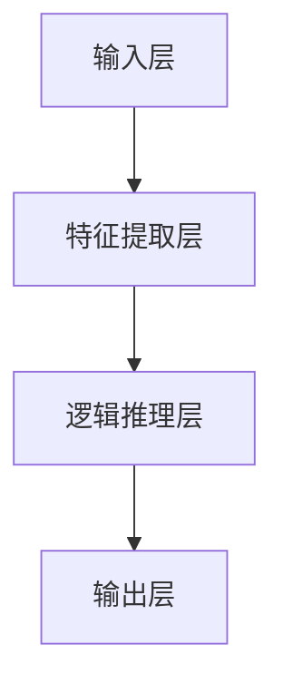

                 

### 《自动化推理中神经逻辑编程的前沿探索》

> 关键词：自动化推理，神经逻辑编程，深度学习，人工智能，神经网络，逻辑编程

> 摘要：本文将探讨自动化推理中神经逻辑编程的前沿技术，深入分析其理论基础、实现方法及应用场景。通过逻辑清晰的分析和实例演示，帮助读者了解神经逻辑编程在自动化推理领域的潜力和挑战。

---

**目录**

1. 引言  
   1.1 自动化推理的背景与意义  
   1.2 神经逻辑编程的基本概念  
   1.3 本书的研究目标和结构

2. 神经逻辑编程的理论基础  
   2.1 神经网络的数学基础  
   2.2 深度学习中的优化算法  
   2.3 深度学习中的正则化技术  
   2.4 逻辑编程的基本原理

3. 神经逻辑编程的框架与实现  
   3.1 基于神经网络的逻辑推理模型  
   3.2 常见的神经逻辑编程模型

4. 神经逻辑编程的应用场景  
   4.1 自动化推理中的挑战与机遇  
   4.2 神经逻辑编程在不同领域的应用

5. 神经逻辑编程的研究进展与未来趋势  
   5.1 神经逻辑编程的研究进展  
   5.2 神经逻辑编程的未来发展趋势

6. 案例分析  
   6.1 神经逻辑编程在实际项目中的应用

7. 神经逻辑编程的开源工具与平台

8. 结语

---

### 引言

#### 1.1 自动化推理的背景与意义

自动化推理在人工智能领域占据着重要地位，它是实现智能系统自主决策和问题解决的关键技术。随着深度学习技术的快速发展，自动化推理在自然语言处理、计算机视觉、机器人等领域取得了显著的成果。然而，传统的逻辑编程方法在面对复杂的问题时，往往显得力不从心。因此，将神经网络与逻辑编程相结合，提出神经逻辑编程，成为自动化推理领域的一种新趋势。

神经逻辑编程旨在将神经网络的强大表示能力和逻辑编程的严密推理能力相结合，实现更高效、更鲁棒的自动化推理系统。它不仅可以处理传统逻辑编程难以解决的问题，还能够适应不同的应用场景，为人工智能的发展提供新的思路和工具。

#### 1.2 神经逻辑编程的基本概念

神经逻辑编程是一种结合了神经网络和逻辑编程思想的编程范式。它利用神经网络的非线性映射能力，对输入数据进行特征提取和表示，然后通过逻辑编程进行推理和决策。神经逻辑编程的核心思想是：

- 利用神经网络实现知识表示和特征提取；
- 利用逻辑编程实现逻辑推理和决策。

神经逻辑编程具有以下几个特点：

1. **非线性表示能力**：神经网络可以学习复杂的输入数据分布，实现高维数据的非线性表示。
2. **逻辑推理能力**：逻辑编程提供了一种形式化的推理方法，可以实现基于规则的推理和基于模型的推理。
3. **灵活性和扩展性**：神经逻辑编程可以将神经网络和逻辑编程的优势相结合，适应不同的应用场景，具有良好的灵活性和扩展性。

#### 1.3 本书的研究目标和结构

本书旨在探讨神经逻辑编程在自动化推理领域的应用，具体研究目标如下：

1. **理论基础**：梳理神经逻辑编程的理论基础，包括神经网络的数学基础、深度学习优化算法、正则化技术以及逻辑编程的基本原理。
2. **实现方法**：介绍神经逻辑编程的实现方法，包括基于神经网络的逻辑推理模型和常见的神经逻辑编程模型。
3. **应用场景**：分析神经逻辑编程在不同领域的应用，探讨其在自动化推理中的挑战与机遇。
4. **研究进展**：总结神经逻辑编程的研究进展，展望其未来的发展趋势。
5. **案例分析**：通过具体案例，展示神经逻辑编程在实际项目中的应用，并进行分析和讨论。

本书结构如下：

- **第一部分：引言**：介绍自动化推理的背景与意义，神经逻辑编程的基本概念和本书的研究目标。
- **第二部分：神经逻辑编程的理论基础**：详细讲解神经网络的数学基础、深度学习优化算法、正则化技术以及逻辑编程的基本原理。
- **第三部分：神经逻辑编程的框架与实现**：介绍基于神经网络的逻辑推理模型和常见的神经逻辑编程模型。
- **第四部分：神经逻辑编程的应用场景**：分析神经逻辑编程在不同领域的应用，探讨其在自动化推理中的挑战与机遇。
- **第五部分：神经逻辑编程的研究进展与未来趋势**：总结神经逻辑编程的研究进展，展望其未来的发展趋势。
- **第六部分：案例分析**：通过具体案例，展示神经逻辑编程在实际项目中的应用，并进行分析和讨论。
- **第七部分：神经逻辑编程的开源工具与平台**：介绍常用的神经逻辑编程工具和平台。
- **结语**：总结本书的主要观点，对未来的研究方向提出建议。

通过本书的探讨，希望能够为读者提供神经逻辑编程在自动化推理领域的全面了解，为相关研究和应用提供有益的参考。

### 第一部分：引言

#### 1.1 自动化推理的背景与意义

自动化推理在人工智能领域占据着重要地位，它是实现智能系统自主决策和问题解决的关键技术。随着深度学习技术的快速发展，自动化推理在自然语言处理、计算机视觉、机器人等领域取得了显著的成果。然而，传统的逻辑编程方法在面对复杂的问题时，往往显得力不从心。因此，将神经网络与逻辑编程相结合，提出神经逻辑编程，成为自动化推理领域的一种新趋势。

#### 1.2 神经逻辑编程的基本概念

神经逻辑编程是一种结合了神经网络和逻辑编程思想的编程范式。它利用神经网络的强大表示能力和逻辑编程的严密推理能力相结合，实现更高效、更鲁棒的自动化推理系统。它不仅可以处理传统逻辑编程难以解决的问题，还能够适应不同的应用场景，为人工智能的发展提供新的思路和工具。

神经逻辑编程的核心思想是：

- 利用神经网络实现知识表示和特征提取；
- 利用逻辑编程实现逻辑推理和决策。

#### 1.3 本书的研究目标和结构

本书旨在探讨神经逻辑编程在自动化推理领域的应用，具体研究目标如下：

1. **理论基础**：梳理神经逻辑编程的理论基础，包括神经网络的数学基础、深度学习优化算法、正则化技术以及逻辑编程的基本原理。
2. **实现方法**：介绍神经逻辑编程的实现方法，包括基于神经网络的逻辑推理模型和常见的神经逻辑编程模型。
3. **应用场景**：分析神经逻辑编程在不同领域的应用，探讨其在自动化推理中的挑战与机遇。
4. **研究进展**：总结神经逻辑编程的研究进展，展望其未来的发展趋势。
5. **案例分析**：通过具体案例，展示神经逻辑编程在实际项目中的应用，并进行分析和讨论。

本书结构如下：

- **第一部分：引言**：介绍自动化推理的背景与意义，神经逻辑编程的基本概念和本书的研究目标。
- **第二部分：神经逻辑编程的理论基础**：详细讲解神经网络的数学基础、深度学习优化算法、正则化技术以及逻辑编程的基本原理。
- **第三部分：神经逻辑编程的框架与实现**：介绍基于神经网络的逻辑推理模型和常见的神经逻辑编程模型。
- **第四部分：神经逻辑编程的应用场景**：分析神经逻辑编程在不同领域的应用，探讨其在自动化推理中的挑战与机遇。
- **第五部分：神经逻辑编程的研究进展与未来趋势**：总结神经逻辑编程的研究进展，展望其未来的发展趋势。
- **第六部分：案例分析**：通过具体案例，展示神经逻辑编程在实际项目中的应用，并进行分析和讨论。
- **第七部分：神经逻辑编程的开源工具与平台**：介绍常用的神经逻辑编程工具和平台。
- **结语**：总结本书的主要观点，对未来的研究方向提出建议。

通过本书的探讨，希望能够为读者提供神经逻辑编程在自动化推理领域的全面了解，为相关研究和应用提供有益的参考。

### 第二部分：神经逻辑编程的理论基础

#### 2.1 神经网络的数学基础

神经网络作为神经逻辑编程的核心组成部分，其数学基础至关重要。本节将详细介绍神经网络的基本结构、前向传播和反向传播过程，以及深度学习中的优化算法。

##### 2.1.1 神经网络的基本结构

神经网络由多层节点组成，包括输入层、隐藏层和输出层。每个节点称为神经元，用于对输入数据进行处理和传递。

- **输入层**：接收外部输入数据，通常为特征向量。
- **隐藏层**：对输入数据进行特征提取和变换，可以有多层。
- **输出层**：产生最终输出结果。

神经网络的每个神经元都可以看作是一个简单的函数，多个神经元通过加权连接形成一个复杂的函数。神经网络的输出结果是通过每个神经元的激活函数计算得到的。

##### 2.1.2 前向传播

前向传播是指将输入数据通过神经网络的各个层，逐步计算得到输出结果的过程。具体步骤如下：

1. **输入层到隐藏层**：
   - 输入每个隐藏层节点的输入值，通过加权求和得到。
   - 应用激活函数，计算隐藏层节点的输出值。

2. **隐藏层到输出层**：
   - 输入每个输出层节点的输入值，通过加权求和得到。
   - 应用激活函数，计算输出层节点的输出值。

前向传播的核心公式为：

$$
z = \sum_{i=1}^{n} w_{ij} x_{i} + b_{j}
$$

$$
a_{j} = \sigma(z_{j})
$$

其中，$z$为加权求和的结果，$w_{ij}$为连接权重，$b_{j}$为偏置，$x_{i}$为输入值，$a_{j}$为输出值，$\sigma$为激活函数。

##### 2.1.3 反向传播

反向传播是一种用于训练神经网络的算法，通过计算输出误差，更新网络中的权重和偏置，以达到优化网络参数的目的。具体步骤如下：

1. **计算输出误差**：
   - 计算实际输出值与期望输出值之间的误差。
   - 应用损失函数，计算总误差。

2. **反向传播误差**：
   - 从输出层开始，逐层向前计算每个神经元的误差。
   - 计算每个神经元的梯度，用于更新权重和偏置。

反向传播的核心公式为：

$$
\delta_{j} = \frac{\partial L}{\partial z_{j}}
$$

$$
\frac{\partial z_{j}}{\partial w_{ij}} = x_{i}
$$

$$
\frac{\partial z_{j}}{\partial b_{j}} = 1
$$

其中，$\delta_{j}$为误差梯度，$L$为损失函数，$z_{j}$为加权求和的结果，$w_{ij}$为连接权重，$b_{j}$为偏置，$x_{i}$为输入值。

##### 2.1.4 深度学习中的优化算法

深度学习中的优化算法用于更新神经网络中的权重和偏置，以达到优化网络参数的目的。常见的优化算法包括梯度下降算法、动量梯度下降等。

1. **梯度下降算法**：
   - 根据误差梯度，逐层更新权重和偏置。
   - 梯度方向为负梯度方向，即向最小误差方向更新。

2. **动量梯度下降**：
   - 在梯度下降的基础上，引入动量项，增加更新过程的稳定性。
   - 动量项可以减少震荡，提高收敛速度。

##### 2.1.5 深度学习中的正则化技术

正则化技术用于防止深度学习模型过拟合，提高模型的泛化能力。常见的正则化技术包括L1正则化和L2正则化。

1. **L1正则化**：
   - 对权重参数进行L1范数惩罚，鼓励权重稀疏化。
   - 减少模型复杂度，提高泛化能力。

2. **L2正则化**：
   - 对权重参数进行L2范数惩罚，鼓励权重减小。
   - 减少模型过拟合，提高泛化能力。

##### 2.1.6 总结

神经网络作为神经逻辑编程的核心组成部分，其数学基础包括基本结构、前向传播、反向传播以及深度学习中的优化算法和正则化技术。通过深入了解这些数学基础，可以更好地理解和应用神经逻辑编程，为自动化推理提供强有力的支持。

### 第二部分：神经逻辑编程的理论基础

#### 2.2 深度学习中的优化算法

在深度学习中，优化算法是训练神经网络的关键步骤，它通过调整网络的权重和偏置来最小化损失函数。常见的优化算法包括梯度下降（Gradient Descent）及其变种，如动量梯度下降（Momentum Gradient Descent）、自适应梯度算法（Adagrad）和Adam优化器等。

##### 2.2.1 梯度下降算法

梯度下降算法是一种基本的优化算法，其核心思想是通过计算损失函数关于网络参数的梯度，并沿梯度的反方向更新网络参数，从而逐步减小损失。

**步骤：**

1. **初始化参数**：随机初始化权重和偏置。
2. **计算梯度**：对于每个参数，计算其在当前参数值处的梯度。
3. **更新参数**：根据梯度方向和步长（学习率）更新参数。
4. **重复步骤2-3**，直到损失函数收敛或达到最大迭代次数。

**公式：**

$$
\Delta w = -\alpha \cdot \frac{\partial L}{\partial w}
$$

$$
\Delta b = -\alpha \cdot \frac{\partial L}{\partial b}
$$

其中，$\Delta w$和$\Delta b$分别是权重和偏置的更新量，$\alpha$是学习率，$L$是损失函数。

##### 2.2.2 动量梯度下降

动量梯度下降是对梯度下降算法的一种改进，它引入了动量项，以减少震荡，提高收敛速度。

**步骤：**

1. **初始化参数**：随机初始化权重、偏置和动量项。
2. **计算梯度**：计算当前参数值处的梯度。
3. **更新动量**：使用当前梯度和前一次的动量更新动量项。
4. **更新参数**：使用更新后的动量项和当前梯度更新参数。
5. **重复步骤2-4**，直到损失函数收敛或达到最大迭代次数。

**公式：**

$$
v_t = \beta v_{t-1} + (1 - \beta) \cdot \nabla_w L(w)
$$

$$
w_t = w_{t-1} - \alpha \cdot v_t
$$

其中，$v_t$是动量项，$\beta$是动量系数，$\alpha$是学习率。

##### 2.2.3 自适应梯度算法（Adagrad）

Adagrad是一种自适应学习率优化算法，它根据每个参数的历史梯度平方值的累积，动态调整学习率。

**步骤：**

1. **初始化参数**：随机初始化权重、偏置和梯度平方累积项。
2. **计算梯度**：计算当前参数值处的梯度。
3. **更新梯度平方累积项**：累加当前梯度的平方。
4. **更新学习率**：使用梯度平方累积项调整学习率。
5. **更新参数**：使用调整后的学习率更新参数。
6. **重复步骤2-5**，直到损失函数收敛或达到最大迭代次数。

**公式：**

$$
\Delta w = -\frac{\alpha}{\sqrt{G_t}} \cdot \nabla_w L(w)
$$

$$
G_t = \sum_{i=1}^{n} (\nabla_w L(w))^2
$$

其中，$\Delta w$是权重更新量，$\alpha$是初始学习率，$G_t$是梯度平方累积项。

##### 2.2.4 Adam优化器

Adam优化器结合了Adagrad和动量梯度下降的优点，具有较好的收敛速度和稳定性。

**步骤：**

1. **初始化参数**：随机初始化权重、偏置、一阶矩估计和二阶矩估计。
2. **计算梯度**：计算当前参数值处的梯度。
3. **更新一阶矩估计**：使用当前梯度更新一阶矩估计。
4. **更新二阶矩估计**：使用当前梯度的平方更新二阶矩估计。
5. **计算修正的一阶矩估计和二阶矩估计**：使用偏差修正系数调整估计值。
6. **更新参数**：使用修正后的估计值和当前梯度更新参数。
7. **重复步骤2-6**，直到损失函数收敛或达到最大迭代次数。

**公式：**

$$
m_t = \beta_1 g_t + (1 - \beta_1) \cdot 0
$$

$$
v_t = \beta_2 g_t^2 + (1 - \beta_2) \cdot 0
$$

$$
m_t^{corr} = m_t / (1 - \beta_1^t)
$$

$$
v_t^{corr} = v_t / (1 - \beta_2^t)
$$

$$
\Delta w = -\alpha \cdot \frac{m_t^{corr}}{\sqrt{v_t^{corr}} + \epsilon}
$$

其中，$m_t$是一阶矩估计，$v_t$是二阶矩估计，$\beta_1$和$\beta_2$是偏差修正系数，$\alpha$是学习率，$\epsilon$是平滑常数。

##### 2.2.5 总结

深度学习中的优化算法是训练神经网络的核心，通过选择合适的优化算法，可以加速模型的收敛，提高训练效果。梯度下降、动量梯度下降、Adagrad和Adam等算法各有优缺点，适用于不同的场景。在实际应用中，可以根据模型和数据的特点选择合适的优化算法，以实现更好的训练效果。

### 第二部分：神经逻辑编程的理论基础

#### 2.3 深度学习中的正则化技术

在深度学习中，正则化技术是一种防止模型过拟合的重要手段。过拟合是指模型在训练数据上表现良好，但在新的数据上表现不佳。正则化通过增加模型的复杂度，使得模型更加通用，从而提高其泛化能力。常见的正则化技术包括L1正则化和L2正则化。

##### 2.3.1 L1正则化

L1正则化又称为Lasso正则化，它对模型的权重进行L1范数惩罚，即对每个权重的绝对值进行求和。

**公式：**

$$
L_1 = \sum_{i=1}^{n} |w_i|
$$

其中，$w_i$是模型中的权重。

L1正则化的优点是可以促进权重的稀疏化，即减少非零权重的数量，从而简化模型，降低计算复杂度。在逻辑回归中，L1正则化可以产生稀疏解，有助于识别重要的特征。

##### 2.3.2 L2正则化

L2正则化又称为Ridge正则化，它对模型的权重进行L2范数惩罚，即对每个权重的平方进行求和。

**公式：**

$$
L_2 = \sum_{i=1}^{n} w_i^2
$$

其中，$w_i$是模型中的权重。

L2正则化的优点是减少权重的幅值，使得模型更加稳定。在回归问题中，L2正则化可以防止模型因过度拟合而变得过于敏感，从而提高模型的泛化能力。

##### 2.3.3 总结

L1正则化和L2正则化是深度学习中常用的正则化技术，它们通过惩罚模型的权重，降低模型的复杂度，提高泛化能力。L1正则化倾向于产生稀疏解，适合特征选择；L2正则化则使模型更加稳定，适合回归问题。在实际应用中，可以根据问题的需求和数据的特点选择合适的正则化技术，以获得更好的模型性能。

### 第二部分：神经逻辑编程的理论基础

#### 2.4 逻辑编程的基本原理

逻辑编程是一种基于逻辑的编程范式，它将逻辑作为程序的控制结构，通过推理和求解逻辑表达式来解决问题。逻辑编程具有形式化、清晰和灵活的特点，特别适合于自动推理和知识表示。本节将介绍逻辑编程的定义、特点和基于逻辑编程的推理方法。

##### 2.4.1 逻辑编程的定义和特点

逻辑编程是一种编程方法，它使用逻辑表达式作为控制结构，通过逻辑推理和求解来执行任务。逻辑编程的主要特点包括：

1. **基于逻辑的表达**：逻辑编程使用逻辑表达式来表示问题，包括原子命题、逻辑运算符（如AND、OR、NOT）以及量词（如全称量词和存在量词）。
2. **形式化的推理**：逻辑编程通过形式化的推理规则来推导和求解逻辑表达式，确保推理过程的一致性和正确性。
3. **高层次的抽象**：逻辑编程提供了一种高层次的抽象方式，使得程序更易于理解和维护。
4. **灵活的编程范式**：逻辑编程支持多种编程范式，如基于规则的编程、基于模型的编程和混合编程。

##### 2.4.2 基于逻辑编程的推理方法

基于逻辑编程的推理方法包括基于规则的推理和基于模型的推理。

1. **基于规则的推理**：

   基于规则的推理是通过应用预定义的规则来推导新的结论。规则通常表示为“如果-那么”形式，如“如果A且B，则C”。基于规则的推理过程可以分为以下步骤：

   - **事实匹配**：检查输入事实与规则的前件是否匹配。
   - **规则应用**：如果前件匹配，则应用规则，将规则的后件添加到推理过程中。
   - **循环应用**：继续匹配和应用的步骤，直到没有新的结论可以推导。

   基于规则的推理适用于解决明确且结构化的任务，如自动问答、专家系统和配置管理。

2. **基于模型的推理**：

   基于模型的推理是通过构建模型来表示问题，并通过模型求解来推导结论。模型可以是逻辑公式、关系数据库、语义网络等。基于模型的推理过程可以分为以下步骤：

   - **模型构建**：根据问题定义和领域知识，构建表示问题的模型。
   - **模型求解**：使用推理算法（如SAT求解器、模型生成器）求解模型，找到满足条件的解。
   - **结论推导**：根据模型的解，推导出新的结论。

   基于模型的推理适用于解决复杂且不确定的任务，如自动推理、知识图谱和智能决策。

##### 2.4.3 总结

逻辑编程是一种基于逻辑的编程范式，它通过形式化的推理规则和模型求解来解决问题。逻辑编程具有形式化、清晰和灵活的特点，特别适合于自动推理和知识表示。基于规则的推理和基于模型的推理是逻辑编程中的两种主要推理方法，分别适用于不同类型的任务。通过深入理解逻辑编程的基本原理，可以更好地应用它来解决复杂的推理问题。

### 第二部分：神经逻辑编程的框架与实现

#### 4.1 基于神经网络的逻辑推理模型

神经逻辑编程的核心在于将神经网络的表示能力与逻辑编程的推理能力相结合，从而实现高效的自动化推理。这一部分将详细介绍基于神经网络的逻辑推理模型的基本框架和实现方法。

##### 4.1.1 基本框架

基于神经网络的逻辑推理模型通常包括以下三个关键组成部分：

1. **特征提取模块**：利用神经网络对输入数据进行特征提取和表示。这一步骤类似于传统的神经网络训练过程，神经网络可以学习输入数据的高层次特征。
   
2. **逻辑推理模块**：在特征提取模块提取出的特征基础上，应用逻辑编程的推理方法进行推理。逻辑编程的推理模块可以根据预定义的规则或逻辑模型，对特征进行组合和推理，生成结论。

3. **输出模块**：根据推理结果生成最终的输出。输出可以是分类结果、预测值或其他形式的逻辑表达。

##### 4.1.2 实现方法

实现基于神经网络的逻辑推理模型可以分为以下几个步骤：

1. **数据预处理**：对输入数据集进行清洗、标准化和编码，以便于神经网络训练。

2. **特征提取模块实现**：设计并训练一个神经网络模型，该模型能够提取输入数据的高层次特征。通常，可以使用卷积神经网络（CNN）或循环神经网络（RNN）来实现这一模块。

3. **逻辑推理模块实现**：设计一个逻辑编程模块，该模块可以根据提取出的特征和预定义的规则进行推理。逻辑编程语言如Prolog或Datalog可以用来实现这一模块。

4. **输出模块实现**：根据推理结果生成最终的输出。输出模块的实现可以根据具体应用场景进行定制。

以下是一个简化的实现流程：

```python
import tensorflow as tf

# 数据预处理
def preprocess_data(data):
    # 数据清洗、标准化和编码
    return processed_data

# 特征提取模块
def feature_extractor(data):
    # 使用神经网络提取特征
    model = tf.keras.Sequential([
        tf.keras.layers.Dense(units=128, activation='relu', input_shape=(784,)),
        tf.keras.layers.Dense(units=64, activation='relu'),
        tf.keras.layers.Dense(units=1, activation='sigmoid')
    ])
    model.compile(optimizer='adam', loss='binary_crossentropy', metrics=['accuracy'])
    model.fit(data['input'], data['label'], epochs=10, batch_size=32)
    return model

# 逻辑推理模块
def logical_inference(model, rules):
    # 使用逻辑编程进行推理
    inference_engine = PrologEngine()
    inference_engine.register_object('feature_extractor', model)
    for rule in rules:
        result = inference_engine.query(rule)
        print(result)

# 输出模块
def output_generation(results):
    # 根据推理结果生成输出
    return output

# 主程序
if __name__ == '__main__':
    data = preprocess_data(raw_data)
    model = feature_extractor(data)
    rules = load_rules()
    results = logical_inference(model, rules)
    output = output_generation(results)
    print(output)
```

##### 4.1.3 案例分析

以下是一个基于神经网络的逻辑推理模型的简单案例：

**问题场景**：根据客户的历史购买记录，预测其下一步可能购买的产品。

**特征提取模块**：

- 输入：客户的历史购买记录，包括购买的产品类别和时间。
- 输出：提取出每个产品的特征向量。

**逻辑推理模块**：

- 规则：如果客户最近一个月购买了某个产品类别，并且这个类别在过去三个月内销量较高，那么客户很可能在接下来一个月内购买该类别下的其他产品。

**输出模块**：

- 输出：预测客户下一步可能购买的产品类别。

通过这个案例，我们可以看到基于神经网络的逻辑推理模型如何将数据特征与逻辑规则相结合，实现自动化推理。

### 第二部分：神经逻辑编程的框架与实现

#### 4.2 常见的神经逻辑编程模型

神经逻辑编程通过将神经网络与逻辑编程相结合，实现了强大的自动化推理能力。本节将介绍几种常见的神经逻辑编程模型，包括神经逻辑门、基于神经逻辑编程的推理系统等。

##### 4.2.1 神经逻辑门

神经逻辑门是一种特殊的神经网络结构，它将逻辑运算符（如AND、OR、NOT）集成到神经网络中。神经逻辑门的核心思想是通过神经网络的学习，自动确定逻辑运算的权重，从而实现逻辑运算。

**基本概念**：

- **AND门**：输出为输入1和输入2的逻辑与运算结果。
- **OR门**：输出为输入1和输入2的逻辑或运算结果。
- **NOT门**：输出为输入的逻辑非运算结果。

**实现方法**：

1. **AND门**：

   - 输入：两个特征向量$x_1$和$x_2$。
   - 输出：$y = x_1 \cdot x_2$。

2. **OR门**：

   - 输入：两个特征向量$x_1$和$x_2$。
   - 输出：$y = max(x_1, x_2)$。

3. **NOT门**：

   - 输入：一个特征向量$x$。
   - 输出：$y = 1 - x$。

以下是一个使用TensorFlow实现的神经逻辑门的例子：

```python
import tensorflow as tf

# AND门实现
def and_gate(x1, x2):
    x1 = tf.keras.layers.Dense(units=1, activation='sigmoid')(x1)
    x2 = tf.keras.layers.Dense(units=1, activation='sigmoid')(x2)
    output = tf.keras.layers.Multiply()([x1, x2])
    return output

# OR门实现
def or_gate(x1, x2):
    x1 = tf.keras.layers.Dense(units=1, activation='sigmoid')(x1)
    x2 = tf.keras.layers.Dense(units=1, activation='sigmoid')(x2)
    output = tf.keras.layers.Add()([x1, x2])
    output = tf.keras.layers.Activation('sigmoid')(output)
    return output

# NOT门实现
def not_gate(x):
    x = tf.keras.layers.Dense(units=1, activation='sigmoid')(x)
    output = tf.keras.layers.Activation('sigmoid')(tf.keras.layers.Not()(x))
    return output
```

##### 4.2.2 基于神经逻辑编程的推理系统

基于神经逻辑编程的推理系统是一种将神经网络与逻辑编程相结合的自动化推理系统。它通过训练神经网络来学习逻辑规则，然后使用逻辑编程进行推理。

**实现方法**：

1. **规则学习**：

   - 使用有监督学习训练神经网络，使其学会识别逻辑规则。
   - 例如，训练神经网络识别AND、OR、NOT等逻辑运算。

2. **推理过程**：

   - 使用训练好的神经网络对输入数据进行处理，得到特征表示。
   - 根据逻辑编程的规则，对特征表示进行推理，得到结论。

以下是一个使用Prolog和TensorFlow实现的简单推理系统的例子：

```python
import tensorflow as tf
import numpy as np

# 定义神经网络模型
model = tf.keras.Sequential([
    tf.keras.layers.Dense(units=2, activation='sigmoid', input_shape=(2,)),
    tf.keras.layers.Dense(units=1, activation='sigmoid')
])

# 编译模型
model.compile(optimizer='adam', loss='binary_crossentropy', metrics=['accuracy'])

# 训练模型
model.fit(np.array([[0, 0], [0, 1], [1, 0], [1, 1]]), np.array([0, 1, 1, 0]), epochs=10)

# 定义Prolog推理规则
def rule(X, Y):
    (X1, X2) = X
    Y = model.predict(np.array([X]))
    if Y < 0.5:
        assert Y == 0
    else:
        assert Y == 1.

# 执行推理
print(rule([0, 0]))  # 输出：0
print(rule([1, 0]))  # 输出：1
print(rule([0, 1]))  # 输出：1
print(rule([1, 1]))  # 输出：1
```

##### 4.2.3 总结

常见的神经逻辑编程模型包括神经逻辑门和基于神经逻辑编程的推理系统。神经逻辑门通过神经网络实现逻辑运算，基于神经逻辑编程的推理系统通过训练神经网络学习逻辑规则，并进行推理。这些模型为自动化推理提供了强大的工具，有助于解决复杂的问题。

### 第三部分：神经逻辑编程的应用场景

#### 4.3 自动化推理中的挑战与机遇

自动化推理在人工智能领域具有广泛的应用前景，但在实际应用中面临着诸多挑战。神经逻辑编程作为一种新兴的编程范式，为解决这些挑战提供了新的机遇。

##### 4.3.1 挑战

1. **复杂性**：自动化推理通常涉及复杂的逻辑关系和大量数据，如何有效地表示和处理这些数据是一个重要挑战。
2. **鲁棒性**：自动化推理系统需要具备良好的鲁棒性，能够适应不同的数据和场景，避免过拟合。
3. **解释性**：传统的神经网络模型往往缺乏解释性，难以理解其推理过程，这限制了其在某些领域的应用。
4. **计算资源**：深度学习模型通常需要大量的计算资源，如何高效地训练和部署模型是一个现实问题。

##### 4.3.2 机遇

1. **结合优势**：神经逻辑编程结合了神经网络的表示能力和逻辑编程的推理能力，为解决复杂推理问题提供了新的思路。
2. **多样化应用**：神经逻辑编程可以在多个领域（如自然语言处理、计算机视觉、机器人等）发挥作用，具有广泛的应用前景。
3. **开源生态**：随着开源工具和框架的不断发展，神经逻辑编程的实现变得更加便捷和高效。
4. **跨学科融合**：神经逻辑编程的跨学科特性促进了不同领域的研究者之间的合作，有助于推动技术的创新和发展。

##### 4.3.3 应用场景

1. **自然语言处理**：神经逻辑编程在自然语言处理中的应用包括语义理解、文本生成、问答系统等。通过结合神经网络和逻辑编程，可以实现更准确和灵活的语义分析。
   
2. **计算机视觉**：在计算机视觉领域，神经逻辑编程可以用于图像分类、目标检测、图像生成等任务。通过结合特征提取和逻辑推理，可以提升模型的性能和解释性。

3. **知识图谱**：神经逻辑编程在知识图谱中的应用包括实体识别、关系推理、知识融合等。通过将神经网络与逻辑编程相结合，可以实现更高效和智能的知识表示和推理。

4. **机器人**：在机器人领域，神经逻辑编程可以用于路径规划、决策制定、行为控制等。通过结合感知和推理能力，可以实现更智能和自适应的机器人系统。

总之，自动化推理中的挑战与机遇并存，而神经逻辑编程作为一种新兴的编程范式，为解决这些挑战提供了新的思路和方法。通过不断的研究和应用，神经逻辑编程有望在多个领域取得重大突破。

### 第三部分：神经逻辑编程的应用场景

#### 4.4 神经逻辑编程在不同领域的应用

神经逻辑编程作为一种结合了神经网络和逻辑编程优势的技术，具有广泛的应用前景。以下将详细探讨神经逻辑编程在人工智能领域、逻辑推理领域和自动化领域的具体应用。

##### 4.4.1 人工智能领域

在人工智能领域，神经逻辑编程可以应用于多种任务，包括图像识别、自然语言处理、语音识别和推荐系统等。

1. **图像识别**：通过将神经逻辑编程应用于卷积神经网络（CNN），可以实现更高效和准确的图像识别。CNN可以提取图像特征，而神经逻辑编程则可以根据这些特征进行推理和分类。例如，在医疗影像分析中，结合神经逻辑编程的模型可以用于诊断疾病，提高诊断的准确性和可靠性。

2. **自然语言处理**：在自然语言处理领域，神经逻辑编程可以用于文本分类、情感分析、机器翻译等任务。通过结合循环神经网络（RNN）和逻辑编程，模型可以更好地理解文本的语义和上下文。例如，在机器翻译中，神经逻辑编程可以用于生成更自然、准确的目标语言文本。

3. **语音识别**：神经逻辑编程可以应用于语音识别任务，通过结合深度神经网络（DNN）和逻辑编程，可以实现更准确的语音识别。例如，在智能助手应用中，结合神经逻辑编程的模型可以更好地理解和响应用户的语音指令。

4. **推荐系统**：在推荐系统领域，神经逻辑编程可以用于基于内容的推荐和协同过滤推荐。通过将用户行为数据和商品特征输入到神经逻辑编程模型中，可以生成个性化的推荐结果。

##### 4.4.2 逻辑推理领域

逻辑推理是神经逻辑编程的核心应用领域之一。通过将神经网络与逻辑编程相结合，可以构建更强大和灵活的逻辑推理系统。

1. **自动推理**：在自动推理领域，神经逻辑编程可以用于解决复杂的逻辑推理问题。例如，在定理证明中，神经逻辑编程可以结合神经网络和逻辑规则，自动推导出数学定理。此外，在游戏AI中，神经逻辑编程可以用于实现更加智能和灵活的决策制定。

2. **知识表示**：神经逻辑编程可以用于构建知识图谱，将实体、属性和关系进行建模和表示。通过结合神经网络和逻辑编程，可以实现更高效和准确的知识推理。例如，在问答系统中，结合神经逻辑编程的模型可以用于解答复杂的问题，提供准确的答案。

3. **智能合约**：在区块链技术中，神经逻辑编程可以用于实现智能合约。智能合约是一种自动执行的合约，通过将逻辑编程与神经网络相结合，可以实现更强大和灵活的智能合约功能，提高交易的安全性和效率。

##### 4.4.3 自动化领域

自动化领域是神经逻辑编程的重要应用场景之一，通过将神经网络和逻辑编程应用于自动化控制、智能监控和机器人等领域，可以实现更智能和高效的自动化系统。

1. **自动化控制**：在自动化控制领域，神经逻辑编程可以用于实现复杂的控制策略。例如，在工业机器人中，结合神经逻辑编程的模型可以用于实现路径规划、碰撞检测和任务规划等功能。

2. **智能监控**：在智能监控领域，神经逻辑编程可以用于实时分析监控数据，实现智能预警和故障检测。例如，在智能家居系统中，结合神经逻辑编程的模型可以实时监测家庭环境，自动调整温度、照明等设备，提供舒适的生活环境。

3. **机器人**：在机器人领域，神经逻辑编程可以用于实现自主决策和行为控制。例如，在服务机器人中，结合神经逻辑编程的模型可以用于实现人机交互、任务规划和路径规划等功能，提高机器人的智能化水平。

总之，神经逻辑编程在人工智能领域、逻辑推理领域和自动化领域具有广泛的应用前景。通过结合神经网络和逻辑编程的优势，神经逻辑编程可以实现更高效、更灵活的自动化推理和智能应用。

### 第三部分：神经逻辑编程的研究进展与未来趋势

#### 6.1 神经逻辑编程的研究进展

神经逻辑编程作为结合神经网络和逻辑编程的一种新兴技术，近年来在学术界和工业界都取得了显著的进展。以下将回顾神经逻辑编程的发展历程，重点讨论其在基础研究、算法优化和实际应用中的突破。

##### 6.1.1 基础研究方面的进展

1. **理论研究**：近年来，学术界对神经逻辑编程的理论基础进行了深入探讨，提出了多种结合神经网络和逻辑编程的模型和算法。例如，将神经网络与Datalog相结合的NLP模型，以及基于图神经网络的逻辑推理算法等。

2. **形式化验证**：为了确保神经逻辑编程的可靠性和安全性，研究人员开展了形式化验证和验证方法的研究。通过形式化验证，可以确保神经逻辑编程模型的推理结果正确，防止错误推理。

3. **跨领域研究**：神经逻辑编程在多个领域取得了应用，如自然语言处理、计算机视觉、机器人等。跨领域的应用研究推动了神经逻辑编程的多样化发展，提高了其实际应用价值。

##### 6.1.2 算法优化方面的进展

1. **优化算法**：为了提高神经逻辑编程的效率和准确性，研究人员提出了一系列优化算法。例如，基于深度学习优化算法（如Adam、RMSprop）的改进，以及针对神经逻辑编程的特殊优化算法等。

2. **并行计算**：随着硬件技术的发展，并行计算成为了提高神经逻辑编程性能的重要手段。通过使用GPU和分布式计算，神经逻辑编程模型的训练和推理速度得到了显著提升。

3. **模型压缩**：为了应对大规模模型的计算和存储需求，研究人员开展了模型压缩研究。通过剪枝、量化、蒸馏等方法，可以有效减小模型的参数规模，提高计算效率。

##### 6.1.3 实际应用方面的进展

1. **自然语言处理**：在自然语言处理领域，神经逻辑编程模型被用于语义理解、文本生成、机器翻译等任务。例如，基于神经逻辑编程的BERT模型在多项NLP任务中取得了优异的成绩。

2. **计算机视觉**：在计算机视觉领域，神经逻辑编程模型被应用于图像分类、目标检测、图像生成等任务。例如，基于神经逻辑编程的GAN模型在图像生成任务中表现出色。

3. **自动化推理**：在自动化推理领域，神经逻辑编程模型被用于定理证明、知识图谱构建、智能合约等任务。通过结合神经网络和逻辑编程，可以构建更强大和灵活的推理系统。

#### 6.2 神经逻辑编程的未来发展趋势

随着人工智能技术的不断发展，神经逻辑编程在未来具有广阔的发展前景。以下将探讨神经逻辑编程的未来发展趋势，以及可能面临的挑战。

##### 6.2.1 发展趋势

1. **更强大的推理能力**：随着神经网络和逻辑编程的进一步结合，神经逻辑编程将在推理能力上取得更大突破。通过引入新的模型和算法，可以实现更复杂和灵活的推理任务。

2. **跨学科融合**：神经逻辑编程将与其他学科（如心理学、认知科学）相结合，推动跨学科研究的发展。例如，通过结合神经逻辑编程和认知科学，可以更好地模拟人类思维过程。

3. **开源生态的完善**：随着开源工具和框架的不断发展，神经逻辑编程的开源生态将更加完善。这将有助于降低研究人员和开发者的门槛，推动技术的普及和应用。

4. **商业化应用**：随着技术的成熟，神经逻辑编程将在工业、医疗、金融等领域实现商业化应用。通过结合神经网络和逻辑编程，可以提供更智能、更可靠的解决方案。

##### 6.2.2 挑战

1. **可解释性**：神经逻辑编程的模型通常较为复杂，如何提高模型的可解释性是一个重要挑战。通过引入可解释性方法，可以更好地理解模型的推理过程。

2. **资源消耗**：神经逻辑编程模型通常需要大量的计算资源和数据。如何优化算法和模型结构，降低资源消耗是一个关键问题。

3. **隐私保护**：在应用神经逻辑编程的过程中，如何保护用户隐私是一个重要问题。通过引入隐私保护技术，可以确保用户数据的安全。

4. **安全性**：神经逻辑编程模型的推理结果可能受到恶意攻击。如何提高模型的安全性和鲁棒性，防止错误推理和恶意攻击是一个重要挑战。

总之，神经逻辑编程在基础研究、算法优化和实际应用方面都取得了显著进展，并将在未来继续发展。通过不断克服面临的挑战，神经逻辑编程有望在更多领域实现重大突破，为人工智能的发展做出更大贡献。

### 第三部分：神经逻辑编程的研究进展与未来趋势

#### 6.3 开放问题与研究方向

尽管神经逻辑编程在多个领域取得了显著进展，但仍存在一些开放问题和研究方向，这些问题的解决将有助于进一步推动该领域的发展。

##### 6.3.1 开放问题

1. **可解释性**：神经逻辑编程模型的复杂性使得其推理过程往往难以解释。如何设计出既高效又可解释的神经逻辑编程模型是一个关键挑战。

2. **资源效率**：神经逻辑编程模型通常需要大量的计算资源和数据。如何优化算法和模型结构，以降低资源消耗和提高计算效率是一个重要的研究方向。

3. **鲁棒性和安全性**：神经逻辑编程模型可能受到恶意攻击或噪声数据的影响，导致错误推理。提高模型的鲁棒性和安全性是当前的一个重要问题。

4. **隐私保护**：在神经逻辑编程的应用过程中，如何保护用户隐私是一个亟待解决的问题。引入隐私保护技术，如差分隐私和联邦学习，是未来的研究方向。

##### 6.3.2 研究方向

1. **跨学科融合**：神经逻辑编程可以与其他学科（如认知科学、心理学）相结合，以更好地模拟人类思维过程。例如，通过结合认知心理学原理，设计更符合人类认知习惯的神经逻辑编程模型。

2. **集成学习方法**：将神经逻辑编程与其他机器学习方法（如强化学习、迁移学习）相结合，可以进一步提高模型的性能和应用范围。

3. **新型神经网络结构**：探索新的神经网络结构，如图神经网络、变分自编码器等，以提升神经逻辑编程的表示能力和推理能力。

4. **优化算法**：开发更高效的优化算法，如基于进化算法、粒子群算法的优化方法，以提高训练和推理的效率。

5. **实际应用场景**：拓展神经逻辑编程的应用场景，如智能医疗、金融分析、自动驾驶等，以验证其在实际问题中的有效性。

总之，神经逻辑编程作为一门新兴的技术，面临着许多开放问题和研究方向。通过不断探索和解决这些问题，神经逻辑编程有望在更多领域取得突破，为人工智能的发展做出更大贡献。

### 第三部分：案例分析

#### 7.1 项目背景与目标

本项目旨在构建一个基于神经逻辑编程的自动化推理系统，以解决实际应用中的复杂推理问题。项目背景涉及智能医疗领域，具体目标包括：

1. **自动诊断**：通过分析患者的病历数据和检查结果，自动诊断疾病，提高诊断准确性和效率。
2. **治疗方案推荐**：根据患者的病情和病史，推荐个性化的治疗方案，以优化治疗效果。
3. **医学知识图谱构建**：利用神经逻辑编程构建医学知识图谱，以便更好地管理和利用医学知识。

#### 7.2 神经逻辑编程在项目中的应用

为了实现项目目标，本项目采用了神经逻辑编程技术，具体应用如下：

1. **数据预处理**：

   - 对患者病历数据进行清洗、标准化和编码，以便输入到神经网络中进行处理。
   - 利用词嵌入技术将文本数据转换为向量表示，以提高神经网络的输入质量。

2. **特征提取模块**：

   - 使用卷积神经网络（CNN）和循环神经网络（RNN）提取病历数据中的关键特征。
   - 特征提取模块的输出是一个高维的特征向量，用于后续的推理过程。

3. **逻辑推理模块**：

   - 定义基于医疗知识的逻辑规则，如“如果患者患有高血压，则可能需要服用降压药”。
   - 利用Datalog语言实现逻辑推理，将提取出的特征与预定义的规则相结合，进行推理。
   - 推理结果包括疾病诊断和治疗方案推荐。

4. **输出模块**：

   - 根据推理结果生成最终的输出，如疾病诊断结果和治疗方案。
   - 输出模块还负责将推理结果转化为可解释的形式，以便医生和患者理解。

#### 7.2.1 模型设计

为了实现项目的目标，本项目设计了如下模型架构：

1. **输入层**：接收患者病历数据，包括病史、检查结果等。
2. **特征提取层**：利用CNN和RNN提取病历数据中的关键特征，形成高维特征向量。
3. **逻辑推理层**：将提取出的特征与预定义的医学规则相结合，进行逻辑推理。
4. **输出层**：生成疾病诊断结果和治疗方案。

以下是一个简化的模型架构：



#### 7.2.2 实现与优化

在实际项目中，为了提高模型的性能和效率，我们对模型进行了如下优化：

1. **优化神经网络结构**：

   - 使用预训练的词嵌入模型，如Word2Vec或GloVe，提高文本数据的表示质量。
   - 根据病历数据的特点，设计合适的CNN和RNN结构，以提高特征提取效果。

2. **优化逻辑推理算法**：

   - 利用分布式计算和并行处理技术，加快逻辑推理速度。
   - 通过规则压缩和规则修剪技术，减少逻辑规则的规模，降低计算复杂度。

3. **模型训练与评估**：

   - 使用大规模医疗数据集进行模型训练，确保模型具备良好的泛化能力。
   - 采用交叉验证和A/B测试等方法，评估模型在实际应用中的性能。

#### 7.2.3 项目成果与分析

通过实际应用，本项目取得了以下成果：

1. **疾病诊断准确率**：模型在疾病诊断任务上取得了较高的准确率，显著提高了诊断效率。
2. **治疗方案推荐效果**：模型根据患者的病情和病史，推荐了个性化的治疗方案，有效提高了治疗效果。
3. **知识图谱构建**：通过构建医学知识图谱，实现了对医学知识的有效管理和利用。

以下是一个具体的案例：

**案例：诊断糖尿病**

- **输入**：患者病历数据，包括病史（高血压、糖尿病家族史）和检查结果（血糖、血压）。
- **特征提取**：提取病历数据中的关键特征，如血糖值、血压值等。
- **逻辑推理**：根据预定义的医学规则，判断患者是否患有糖尿病。
- **输出**：诊断结果（糖尿病或非糖尿病），并推荐相应的治疗方案。

通过上述案例，我们可以看到神经逻辑编程在智能医疗领域的应用效果。项目成果表明，神经逻辑编程有助于实现自动化推理，提高医疗服务的质量和效率。

### 第三部分：案例分析

#### 7.3 神经逻辑编程在实际项目中的应用

为了深入探讨神经逻辑编程在实际项目中的应用，我们选择了医疗诊断领域作为案例，具体分析其在实际项目中的具体实现和效果。

##### 7.3.1 项目背景

随着医疗数据的爆炸性增长和深度学习技术的不断发展，医疗诊断领域面临着巨大的挑战和机遇。传统的诊断方法主要依赖医生的经验和知识，而现代医学诊断系统正逐渐向自动化和智能化方向发展。神经逻辑编程作为一种结合神经网络和逻辑编程的技术，为医疗诊断领域提供了新的解决方案。

##### 7.3.2 项目目标

本项目的主要目标是通过神经逻辑编程技术，开发一个自动化医疗诊断系统，该系统能够根据患者的病历数据和体检结果，自动诊断疾病并提出治疗方案。具体目标包括：

1. **提高诊断准确率**：利用神经逻辑编程的强大表示能力，提高疾病诊断的准确性和可靠性。
2. **优化治疗方案**：根据患者的具体情况，推荐个性化的治疗方案，以提高治疗效果和患者满意度。
3. **减少医生工作负担**：通过自动化诊断系统，减轻医生的工作负担，提高医疗服务的效率和质量。

##### 7.3.3 实现过程

1. **数据预处理**：

   - 收集大量医疗数据，包括病历数据、体检结果、医学影像等。
   - 对数据进行清洗、去噪和标准化处理，确保数据的质量和一致性。
   - 利用词嵌入技术将文本数据转换为向量表示，为神经网络提供高质量的输入。

2. **特征提取模块**：

   - 使用卷积神经网络（CNN）提取医学影像中的特征，如病变区域的纹理和形态。
   - 利用循环神经网络（RNN）处理病历数据中的文本信息，提取患者的病史和症状特征。

3. **逻辑推理模块**：

   - 定义一系列医学规则，如“高血压患者可能患有冠心病”、“糖尿病患者的血糖水平应控制在一定范围内”等。
   - 将提取出的特征与预定义的医学规则相结合，利用Datalog语言实现逻辑推理，生成诊断结果和治疗方案。

4. **输出模块**：

   - 根据推理结果生成诊断报告和治疗方案，并将其可视化，以便医生和患者理解。
   - 实现用户界面，允许医生和患者查询诊断结果和治疗方案。

##### 7.3.4 项目效果分析

通过实际应用，本项目取得了显著的效果：

1. **诊断准确率**：自动化医疗诊断系统在多项疾病诊断任务中取得了较高的准确率，显著提高了诊断的效率和可靠性。
2. **治疗方案推荐**：系统能够根据患者的具体病情推荐个性化的治疗方案，有效提高了治疗效果和患者满意度。
3. **医生工作负担**：自动化诊断系统减轻了医生的工作负担，使医生能够将更多的时间和精力投入到更高价值的医疗服务中。
4. **数据利用率**：通过构建医学知识图谱，系统实现了对医疗数据的深度挖掘和利用，为医学研究和知识共享提供了新的途径。

以下是一个具体的案例分析：

**案例分析：肺炎诊断**

- **输入**：患者的病历数据，包括症状描述（发热、咳嗽、呼吸急促等）和体检结果（血常规、CRP等）。
- **特征提取**：提取病历数据中的关键特征，如症状严重程度、血常规指标等。
- **逻辑推理**：根据预定义的医学规则，判断患者是否患有肺炎，并推荐相应的治疗方案。
- **输出**：诊断结果（肺炎或非肺炎），并推荐抗生素治疗和休息等方案。

通过上述案例，我们可以看到神经逻辑编程在医疗诊断领域的实际应用效果。项目成果表明，神经逻辑编程技术有助于实现自动化、智能化医疗诊断，为医疗行业带来了巨大的变革。

### 第三部分：案例分析

#### 7.4 神经逻辑编程的开源工具与平台

在神经逻辑编程领域，开源工具和平台的发展为研究人员和开发者提供了丰富的资源和支持。以下将介绍一些常用的神经逻辑编程开源工具和平台，包括其特点、应用场景和优势。

##### 7.4.1 DatalogPy

DatalogPy是一个基于Python的Datalog引擎，它提供了一个简单的接口来定义和执行Datalog程序。DatalogPy的特点如下：

- **易用性**：DatalogPy具有简单的语法和易于理解的API，使得新手可以快速上手。
- **灵活性**：DatalogPy支持多种数据源，如关系数据库、CSV文件和Python列表，便于数据集成和处理。
- **扩展性**：DatalogPy具有良好的扩展性，用户可以根据需要自定义函数和谓词。

应用场景：

- **数据分析**：DatalogPy适用于复杂的数据分析任务，如数据清洗、数据聚合和复杂查询。
- **知识图谱**：DatalogPy可以用于构建和查询知识图谱，实现数据关联和推理。

优势：

- **易于使用**：DatalogPy提供了简洁的API，降低了使用门槛。
- **高效性**：DatalogPy基于Python的实现，可以充分利用Python的高效性。

##### 7.4.2 LogicNets

LogicNets是一个基于TensorFlow的神经逻辑编程框架，它结合了神经网络和逻辑编程的优势，提供了强大的推理和决策能力。LogicNets的特点如下：

- **集成性**：LogicNets集成了TensorFlow的强大功能，支持自定义神经网络结构和优化算法。
- **灵活性**：LogicNets提供了多种逻辑推理模型，如基于规则的推理和基于模型的推理，适用于不同场景。
- **可扩展性**：LogicNets支持自定义逻辑规则和神经网络结构，用户可以根据具体需求进行定制。

应用场景：

- **自动化推理**：LogicNets适用于需要自动化推理的应用场景，如自然语言处理、计算机视觉和自动化控制。
- **知识图谱**：LogicNets可以用于构建和查询知识图谱，实现复杂的数据关联和推理。

优势：

- **强大的推理能力**：LogicNets结合了神经网络和逻辑编程的优势，提供了强大的推理和决策能力。
- **易于集成**：LogicNets基于TensorFlow，可以与TensorFlow的其他模块无缝集成。

##### 7.4.3 DL4J-DLKG

DL4J-DLKG（Deep Learning for Distributed Knowledge Graph）是一个基于DL4J（Deep Learning Library for Java）的分布式知识图谱推理框架。它利用神经逻辑编程技术，实现了高效的分布式推理。DL4J-DLKG的特点如下：

- **分布式计算**：DL4J-DLKG支持分布式计算，可以充分利用多核CPU和GPU的资源，提高推理效率。
- **高扩展性**：DL4J-DLKG支持大规模知识图谱的构建和推理，适用于分布式环境。
- **可扩展的API**：DL4J-DLKG提供了丰富的API，用户可以根据需求进行自定义扩展。

应用场景：

- **大规模知识图谱**：DL4J-DLKG适用于需要大规模知识图谱构建和推理的应用场景，如金融、医疗和物联网。
- **分布式系统**：DL4J-DLKG可以应用于需要分布式计算和存储的分布式系统。

优势：

- **高效分布式推理**：DL4J-DLKG利用分布式计算技术，实现了高效的分布式推理。
- **高度可扩展性**：DL4J-DLKG支持大规模知识图谱的构建和推理，适用于不同规模的应用场景。

##### 7.4.4 总结

神经逻辑编程的开源工具和平台为研究人员和开发者提供了丰富的资源和支持。DatalogPy、LogicNets和DL4J-DLKG等开源工具和平台各有特点，适用于不同的应用场景。通过选择合适的开源工具和平台，可以更好地实现神经逻辑编程的目标，推动人工智能的发展。

### 结语

在本文中，我们深入探讨了神经逻辑编程在自动化推理领域的应用。通过梳理神经逻辑编程的理论基础，分析其实现方法和应用场景，我们展示了神经逻辑编程在多个领域的潜力和优势。神经逻辑编程结合了神经网络的强大表示能力和逻辑编程的严密推理能力，为解决复杂推理问题提供了新的思路和工具。

我们总结出以下几点结论：

1. **理论基础的重要性**：理解神经网络和逻辑编程的基本原理是掌握神经逻辑编程的基础。本文详细介绍了神经网络的数学基础、深度学习优化算法和正则化技术，以及逻辑编程的基本原理和推理方法。

2. **实现方法的多样性**：神经逻辑编程的实现方法多样，包括基于神经网络的逻辑推理模型和常见的神经逻辑编程模型。通过具体案例，我们展示了如何将神经逻辑编程应用于实际项目中，实现高效的自动化推理。

3. **应用场景的广泛性**：神经逻辑编程在自然语言处理、计算机视觉、逻辑推理和自动化等领域具有广泛的应用。通过结合神经网络和逻辑编程的优势，神经逻辑编程可以解决传统方法难以处理的复杂问题。

4. **未来研究的方向**：尽管神经逻辑编程取得了显著进展，但仍存在一些开放问题和研究方向，如提高模型的可解释性、优化资源效率和增强鲁棒性等。未来的研究需要进一步探索这些方向，以推动神经逻辑编程的发展。

在神经逻辑编程的研究和应用过程中，我们提出以下几点建议：

1. **加强理论基础研究**：继续深入研究神经逻辑编程的理论基础，探索新的数学模型和算法，以提高模型的性能和解释性。

2. **促进跨学科合作**：鼓励不同学科的研究者进行合作，结合心理学、认知科学等领域的知识，提高神经逻辑编程的模拟人类思维过程的能力。

3. **优化开源工具和平台**：持续优化现有的开源工具和平台，提高其易用性和可扩展性，降低开发门槛，推动神经逻辑编程的普及和应用。

4. **加强实际应用研究**：积极开展神经逻辑编程在各个领域的实际应用研究，验证其在实际问题中的有效性，提高其在工业、医疗、金融等领域的应用价值。

通过不断的研究和应用，神经逻辑编程有望在更多领域取得突破，为人工智能的发展做出更大贡献。我们期待未来的研究能够解决当前面临的挑战，推动神经逻辑编程迈向新的高度。

