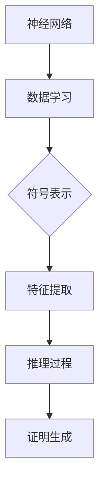

                 

为了满足您的要求，我们将逐步构建这篇文章。以下是文章的开头部分，包括标题、关键词、摘要和第一个小节的框架。请注意，这里只是一个概要，完整的内容将逐步填充。

---

# 自动定理证明中神经符号推理的前沿方法

> 关键词：自动定理证明、神经符号推理、深度学习、数学证明、人工智能

> 摘要：本文探讨了自动定理证明中神经符号推理的前沿方法。我们首先介绍了自动定理证明和神经符号推理的基本概念，然后分析了它们之间的联系，并探讨了神经网络与符号推理的融合方法。文章还详细阐述了神经符号推理的核心算法，并提供了实际应用的案例和分析。

## 目录

- 第一部分 神经符号推理基础
  - 1.1 神经符号推理概述
  - 1.2 自动定理证明
  - 1.3 神经符号推理与自动定理证明的关系
  - 1.4 神经网络与符号推理的结合方法

- 第二部分 神经符号推理核心算法
  - 2.1 神经网络基本结构
  - 2.2 符号推理算法
  - 2.3 神经符号推理算法

- 第三部分 神经符号推理应用实例
  - 3.1 神经符号推理在自动定理证明中的应用
  - 3.2 神经符号推理在其他领域的应用

- 第四部分 神经符号推理未来发展趋势

## 第一部分 神经符号推理基础

### 1.1 神经符号推理概述

在这一节中，我们将介绍神经符号推理的基本概念。神经符号推理（Neural Symbolic Reasoning）结合了神经网络的强大表示能力和传统符号推理的精确性。它旨在通过神经网络来学习符号表示，并利用这些表示进行推理。

**背景介绍**

自动定理证明（ATP）是计算机科学中的一个重要分支，它的目标是通过算法证明数学定理。然而，传统的自动定理证明方法往往受到效率和证明能力的限制。随着深度学习的兴起，神经网络在处理大规模数据和学习复杂模式方面显示出强大的能力，这使得将神经网络引入自动定理证明成为可能。

**核心概念与联系**

神经符号推理的核心概念包括：

- **神经网络**：用于学习数据中的内在结构和模式。
- **符号表示**：用于表示定理、证明和推理过程。
- **推理过程**：利用神经网络学到的表示进行符号推理。

下面是神经符号推理的概念架构：

### 1.2 自动定理证明

自动定理证明（ATP）是人工智能领域的一个关键问题，其目标是开发算法来自动验证数学定理。这一节将介绍自动定理证明的基本概念、历史发展以及主要研究方法。

**基本概念**

自动定理证明涉及以下几个关键概念：

- **定理**：需要证明的数学命题。
- **证明**：证明定理成立的过程和步骤。
- **证明搜索**：寻找有效证明的过程。

**发展历程**

自动定理证明的发展经历了几个阶段：

- **早期方法**：基于规则的方法和启发式搜索。
- **现代方法**：结合符号推理和计算机代数系统。
- **深度学习方法**：引入神经网络进行证明搜索和学习。

**研究方法**

主要研究方法包括：

- **符号推理**：基于逻辑和数学规则进行推理。
- **启发式搜索**：利用启发式函数指导搜索过程。
- **机器学习方法**：利用学习算法优化搜索过程。

### 1.3 神经符号推理与自动定理证明的关系

在这一节中，我们将探讨神经符号推理与自动定理证明之间的联系和区别。

**联系**

- **互补性**：神经网络可以增强自动定理证明的能力，尤其是在处理复杂问题方面。
- **融合**：神经网络和符号推理可以结合起来，形成更强大的定理证明系统。

**区别**

- **目标**：神经符号推理侧重于学习和表示，而自动定理证明侧重于证明生成和验证。
- **方法**：神经网络依赖于数据驱动的方法，而符号推理依赖于逻辑和数学规则。

### 1.4 神经网络与符号推理的结合方法

在这一节中，我们将讨论如何将神经网络与符号推理结合起来，以增强自动定理证明的能力。

**直接结合**

- **神经网络作为特征提取器**：使用神经网络提取符号数据的特征。
- **神经网络作为推理引擎**：直接利用神经网络进行符号推理。

**间接结合**

- **神经网络优化符号推理算法**：利用神经网络优化符号推理的搜索过程。
- **神经网络辅助符号推理**：使用神经网络提供辅助信息，如符号推理的初始假设。

**混合结合**

- **混合推理模型**：结合神经网络和符号推理的优点，形成新的推理模型。

---

以上是文章的开头部分。接下来，我们将逐步填充每个小节的内容，确保满足您的要求，包括核心概念、算法原理、Python代码示例、实际应用案例和未来发展趋势。文章预计将在10000到12000字之间完成。请等待我们逐步完善每个部分的内容。

---

**作者：AI天才研究院/AI Genius Institute & 禅与计算机程序设计艺术 /Zen And The Art of Computer Programming**

