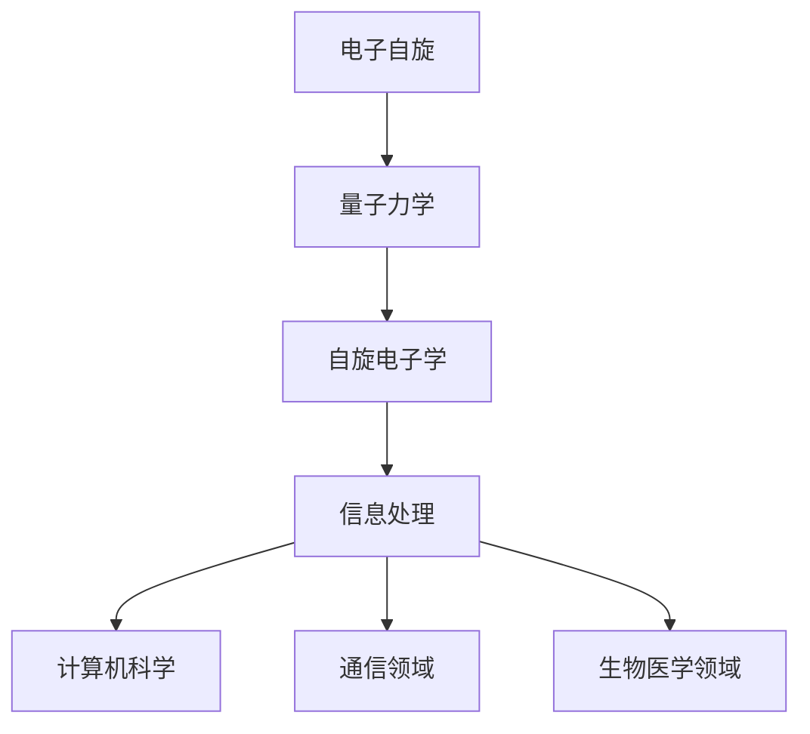

                 

### 自旋电子学：利用电子自旋进行信息处理

自旋电子学，作为一种前沿科学领域，已经引起了全球科技界的高度关注。它不仅为传统电子学提供了新的视角，更是为未来的信息处理技术带来了革命性的变革。本文将深入探讨自旋电子学的概念、基础理论、核心算法原理及其在不同领域的应用，力求通过逻辑清晰、结构紧凑的分析，为读者呈现一幅自旋电子学的全貌。

关键词：自旋电子学、信息处理、量子力学、核心算法、应用实践

摘要：本文首先介绍了自旋电子学的定义和基本概念，接着讨论了其在信息处理领域的潜在应用。通过详细剖析自旋电子学的基础理论和核心算法原理，我们进一步展示了其在计算机科学、通信领域和生物医学领域的实际应用。最后，本文总结了自旋电子学面临的挑战及其未来发展，为读者提供了全面的参考。

### 《自旋电子学：利用电子自旋进行信息处理》目录大纲

本文将按照以下结构展开：

1. **第一部分：自旋电子学基础**
   - 第1章：电子自旋与自旋电子学概述
   - 第2章：自旋电子学的基础理论
   - 第3章：自旋电子器件的设计与制造

2. **第二部分：自旋电子学的应用实践**
   - 第4章：自旋电子学的核心算法原理
   - 第5章：自旋电子学的数学模型与数学公式
   - 第6章：自旋电子学在计算机科学中的应用
   - 第7章：自旋电子学在通信领域的应用
   - 第8章：自旋电子学在生物医学领域的应用
   - 第9章：自旋电子学的挑战与未来发展

3. **附录**
   - 附录A：自旋电子学相关资源与工具

在接下来的章节中，我们将逐步深入探讨自旋电子学的每一个方面，帮助读者全面理解这一激动人心的技术领域。

### 第一部分：自旋电子学基础

#### 第1章：电子自旋与自旋电子学概述

**1.1 电子自旋的概念与性质**

电子自旋是电子的一种基本属性，是量子力学中的重要概念。电子自旋不仅可以看作是电子的旋转，而且它是一种内在的量子态，具有特定的量子数。根据量子力学，电子自旋可以取两种方向，即“向上”或“向下”，分别对应量子数$+\frac{1}{2}$和$-\frac{1}{2}$。

电子自旋具有以下主要性质：
- **量子性质**：电子自旋是量子力学中的一种基本量子态，无法通过经典物理的方式完全描述。
- **不可分割性**：电子自旋是电子本身固有的属性，无法将其与电子分离。
- **二态性**：电子自旋只有两个可能的取向，这种二态性在量子计算和信息处理中具有重要意义。

**1.2 自旋电子学的历史与发展**

自旋电子学的起源可以追溯到20世纪40年代，当时科学家们发现了电子自旋的存在，并开始研究其性质和应用。随着量子力学的不断发展，人们对电子自旋的理解逐渐深入，从而推动了自旋电子学的发展。

自旋电子学的重要里程碑包括：
- **1947年**：物理学家杨振宁和李政道提出“电子自旋与磁场相互作用”的理论，为后续的自旋电子学研究奠定了基础。
- **1956年**：物理学家约瑟夫·亨利·卡伯特·利昂和约翰·罗伯特·施里弗提出了“自旋阀”理论，这为自旋电子器件的发明提供了理论基础。
- **1980年代**：随着材料科学和纳米技术的进步，自旋电子器件开始出现，并逐步在信息处理领域得到应用。

**1.3 自旋电子学在信息处理中的应用前景**

自旋电子学在信息处理领域具有巨大的应用前景。通过利用电子自旋的特性，可以实现高速、低功耗的信息处理。以下是自旋电子学在信息处理中的一些潜在应用：

- **自旋电子计算机**：利用电子自旋的量子特性，实现量子比特（qubit）的存储、操作和传输，从而构建量子计算机。
- **自旋电子存储器件**：如自旋阀存储器（MRAM），利用电子自旋的稳定性实现数据的非易失性存储。
- **自旋电子逻辑器件**：利用自旋电子的性质构建新型逻辑电路，如自旋转移扭矩逻辑（STT-MRAM）。

总之，自旋电子学为信息处理技术带来了全新的可能性，有望在未来的科技发展中发挥重要作用。

#### 第2章：自旋电子学的基础理论

**2.1 电子自旋与量子力学**

电子自旋是量子力学中的一个核心概念，它描述了电子的基本性质和行为。量子力学的基本原理告诉我们，电子不仅具有粒子性，还具有波动性。这种双重性质使得电子的自旋成为理解量子现象的重要切入点。

电子自旋的基本理论包括以下几个方面：

- **自旋角动量**：自旋角动量是电子自旋的一种量度，通常用符号$\vec{S}$表示。根据量子力学，电子自旋角动量可以取离散的值，其大小由以下公式给出：
  $$
  \vec{S} = \frac{\hbar}{2} (\vec{\sigma}),
  $$
  其中$\hbar$是普朗克常数，$\vec{\sigma}$是自旋相关矩阵。

- **自旋相关矩阵**：自旋相关矩阵是描述电子自旋状态的数学工具。它有三个分量：$\sigma_x$、$\sigma_y$和$\sigma_z$，分别对应于自旋在x、y和z轴上的分量。自旋相关矩阵具有以下形式：
  $$
  \vec{\sigma} = \begin{pmatrix}
  0 & 1 \\
  1 & 0
  \end{pmatrix}.
  $$

- **自旋态的叠加**：量子力学允许电子自旋态进行叠加，这意味着电子可以处于多种自旋状态的组合。这种叠加态是量子计算和信息处理的重要基础。

**2.2 自旋电子材料与器件**

自旋电子材料是自旋电子学研究的核心，其性质和结构直接影响自旋电子器件的性能。常见的自旋电子材料包括：

- **铁磁材料**：如磁性氧化物和金属磁性合金，它们具有强烈的磁化方向，可以用来构建自旋阀器件。
- **半导体材料**：如硅和锗，这些材料在半导体工业中被广泛使用，其自旋性质可以通过掺杂和界面工程进行调控。
- **有机材料**：如有机半导体和有机金属框架，它们具有独特的自旋相关性质，适合用于新型自旋电子器件。

自旋电子器件的设计和制造基于以下几个关键原理：

- **自旋注入**：通过外部磁场或电场，将自旋极化的电子注入到自旋电子材料中。
- **自旋检测**：利用自旋相关的物理效应，如磁电阻效应、自旋霍尔效应等，检测注入的自旋电子。
- **自旋操控**：通过电场、磁场或光场，对自旋电子进行操控，实现信息的读写和处理。

常见的自旋电子器件包括：

- **自旋阀**：一种基于铁磁材料的自旋电子器件，用于控制自旋电子的传输。
- **自旋转移扭矩磁阻器（STT-MRAM）**：一种非易失性存储器件，利用自旋转移扭矩效应实现数据的读写。
- **自旋电子逻辑器件**：如自旋转移扭矩逻辑（STT-L）和自旋轨道扭矩逻辑（SOFT），用于构建新型的计算电路。

**2.3 自旋电子器件的工作原理**

自旋电子器件的工作原理主要依赖于自旋相关的物理效应，以下是一些常见的自旋电子器件及其工作原理：

- **自旋阀**：
  - **原理**：自旋阀器件由一层铁磁材料和两层非铁磁材料组成。当外部磁场作用于器件时，铁磁层的磁化方向会发生改变，从而影响电子的自旋方向。
  - **应用**：自旋阀被广泛用于自旋电子存储器件和自旋电子逻辑器件。

- **STT-MRAM**：
  - **原理**：STT-MRAM利用电场驱动电流在薄膜中传播，并通过自旋转移扭矩效应改变存储单元中的自旋方向。
  - **应用**：STT-MRAM被用于构建高速、低功耗的非易失性存储器。

- **STT-L**：
  - **原理**：STT-L利用电场诱导的自旋转移扭矩效应，实现自旋电子的操控，从而构建新型计算逻辑电路。
  - **应用**：STT-L有望在未来的计算技术中发挥重要作用。

通过深入理解自旋电子学的基础理论和器件工作原理，我们可以更好地探索这一领域的前沿技术，并推动其在实际应用中的发展。

#### 第3章：自旋电子器件的设计与制造

**3.1 自旋电子器件的设计流程**

自旋电子器件的设计是一个复杂的过程，它涉及多个学科领域的知识。以下是自旋电子器件设计的一般流程：

1. **需求分析**：
   - **确定目标**：明确自旋电子器件的应用场景，如存储、逻辑计算、传感器等。
   - **性能指标**：设定器件的性能指标，包括功耗、速度、可靠性等。

2. **材料选择**：
   - **自旋电子材料**：选择具有合适自旋性质的材料，如铁磁材料、半导体材料等。
   - **衬底材料**：选择适合器件制造和性能需求的衬底材料，如硅片、蓝宝石等。

3. **器件结构设计**：
   - **器件架构**：设计器件的基本结构，如自旋阀、STT-MRAM、STT-L等。
   - **器件尺寸**：根据器件的工作原理和性能需求，确定器件的尺寸。

4. **电路设计**：
   - **控制电路**：设计控制器件的电路，如驱动电路、读出电路等。
   - **接口设计**：设计器件与外部电路的接口，确保数据的有效传输。

5. **仿真验证**：
   - **模拟仿真**：通过计算机模拟，验证器件的设计是否满足性能指标。
   - **仿真结果分析**：分析仿真结果，优化器件设计。

6. **制造工艺**：
   - **工艺流程**：制定器件的制造工艺流程，包括材料生长、器件加工、封装等。
   - **工艺优化**：通过实验和仿真，不断优化工艺参数，提高器件性能。

**3.2 自旋电子器件的材料选择**

自旋电子器件的性能很大程度上取决于材料的选择。以下是几种常用的自旋电子材料及其特点：

1. **铁磁材料**：
   - **特点**：具有高磁化强度和稳定的磁化方向。
   - **应用**：常用于自旋阀和磁阻器件，如CoFeB（cobalt ferrite）等。

2. **半导体材料**：
   - **特点**：具有良好的电导性和自旋传输特性。
   - **应用**：用于构建自旋电子器件的半导体薄膜，如硅（Si）、锗（Ge）等。

3. **有机材料**：
   - **特点**：具有独特的自旋相关性质，适合用于新型自旋电子器件。
   - **应用**：用于有机自旋电子器件，如有机半导体薄膜、有机金属框架等。

**3.3 自旋电子器件的制造工艺**

自旋电子器件的制造工艺复杂且精密，需要采用先进的半导体工艺和纳米技术。以下是自旋电子器件制造的主要工艺步骤：

1. **材料生长**：
   - **化学气相沉积（CVD）**：用于生长高纯度的半导体薄膜和铁磁材料。
   - **分子束外延（MBE）**：用于精确控制薄膜的成分和结构。

2. **器件加工**：
   - **光刻**：使用光刻技术制作器件的图案。
   - **刻蚀**：通过刻蚀工艺形成器件的结构。
   - **掺杂**：通过掺杂工艺调节材料的电导性和磁性能。

3. **封装**：
   - **芯片封装**：将制造好的芯片封装在保护壳内。
   - **电路连接**：通过金属互连和键合技术，将芯片与外部电路连接。

4. **测试与验证**：
   - **功能测试**：对器件进行功能测试，验证其性能是否满足设计要求。
   - **可靠性测试**：进行长期稳定性和耐环境测试，确保器件的可靠性。

通过以上设计流程、材料选择和制造工艺，我们可以有效地设计和制造高性能的自旋电子器件，为未来的信息处理技术提供强有力的支持。

### 第二部分：自旋电子学的应用实践

#### 第4章：自旋电子学的核心算法原理

自旋电子学的核心算法原理是其能够在信息处理领域发挥重要作用的关键。以下是自旋电子学在核心算法原理方面的主要内容和应用。

**4.1 自旋电子计算模型**

自旋电子计算模型是自旋电子学在信息处理中应用的基础。该模型通过量子力学的原理，描述了电子自旋状态如何存储、处理和传输信息。自旋电子计算模型主要包括以下几个组成部分：

1. **量子比特（Qubit）**：自旋电子计算模型中的基本信息单元是量子比特，它由一个电子的自旋状态表示。量子比特可以同时处于多个状态的叠加，这是量子计算相比经典计算的最大优势。

2. **自旋编码**：自旋电子计算模型中，信息是通过电子自旋的取向进行编码的。例如，可以规定向上自旋表示“0”，向下自旋表示“1”，这样就可以利用自旋状态来表示二进制信息。

3. **量子逻辑门**：自旋电子计算模型中的量子逻辑门用于对量子比特进行操作，实现信息的处理和计算。常见的量子逻辑门包括自旋交换门、相位编码门等，它们可以通过外部电场或磁场来操控。

**4.2 自旋电子信息处理算法**

自旋电子信息处理算法是利用自旋电子计算模型进行信息处理的方法。以下是一些常见的自旋电子信息处理算法：

1. **量子逻辑算法**：量子逻辑算法是利用量子逻辑门对量子比特进行操作，实现特定的计算任务。常见的量子逻辑算法包括量子傅里叶变换（QFT）、量子逆变换（QInvFT）等，这些算法在量子计算中具有重要应用。

2. **量子纠错算法**：自旋电子计算中的量子纠错是确保计算可靠性的关键。量子纠错算法可以通过引入额外的量子比特，检测并纠正计算过程中的错误，从而提高量子计算的稳定性。

3. **量子搜索算法**：量子搜索算法是一种基于量子叠加态和量子干涉的算法，可以在短时间内搜索大量数据。自旋电子计算模型可以有效地实现量子搜索算法，从而加速信息检索过程。

**4.3 自旋电子通信算法**

自旋电子通信算法是利用自旋电子器件进行信息传输的方法。以下是一些常见的自旋电子通信算法：

1. **自旋霍尔效应通信**：自旋霍尔效应通信利用自旋霍尔器件产生的自旋极化电子进行信息传输。这种方法可以实现高速、低功耗的信息传输，适用于未来的无线通信和物联网领域。

2. **磁共振成像通信**：磁共振成像通信利用电子的自旋共振现象进行信息传输。通过调制外部磁场，可以实现高带宽的信息传输，适用于高频率通信场景。

3. **量子密钥分发**：量子密钥分发是一种基于量子纠缠和量子不可克隆定理的通信安全协议。通过自旋电子计算模型，可以实现安全的密钥生成和分发，提高通信的保密性。

通过以上核心算法原理，自旋电子学在信息处理、通信等领域展示了巨大的潜力。未来，随着技术的不断进步，自旋电子学有望带来更多的创新和突破。

#### 第5章：自旋电子学的数学模型与数学公式

自旋电子学的数学模型是理解和应用自旋电子学的重要工具。以下是自旋电子学中常用的数学模型和数学公式。

**5.1 自旋电子学的数学基础**

自旋电子学的数学基础主要依赖于量子力学和群论。以下是几个关键的数学概念：

1. **自旋角动量**：自旋角动量是描述电子自旋状态的物理量。在量子力学中，自旋角动量通常表示为向量$\vec{S}$，其大小由以下公式给出：
   $$
   S^2 | \psi \rangle = \hbar^2 S(S+1) | \psi \rangle.
   $$
   其中$S$是自旋量子数，$| \psi \rangle$是电子的自旋状态。

2. **自旋相关矩阵**：自旋相关矩阵是描述电子自旋状态的数学工具。常用的自旋相关矩阵包括泡利矩阵$\vec{\sigma}$，其形式如下：
   $$
   \vec{\sigma} = \begin{pmatrix}
   0 & 1 \\
   1 & 0
   \end{pmatrix}.
   $$

3. **自旋态的叠加**：在量子力学中，电子的自旋状态可以处于多个基态的叠加。例如，一个电子的自旋态可以表示为：
   $$
   | \psi \rangle = \alpha | \uparrow \rangle + \beta | \downarrow \rangle,
   $$
   其中$| \uparrow \rangle$和$| \downarrow \rangle$分别表示向上自旋和向下自旋态，$\alpha$和$\beta$是复数系数。

**5.2 自旋电子学的数学公式与应用**

自旋电子学的数学公式在描述和计算电子自旋状态、自旋相关物理效应等方面具有重要意义。以下是几个常用的数学公式及其应用：

1. **自旋加成规则**：自旋加成规则描述了两个自旋系统的总自旋状态。对于两个电子的自旋加成，总自旋量子数$S$可以通过以下公式计算：
   $$
   S = S_1 + S_2,
   $$
   其中$S_1$和$S_2$分别是两个电子的自旋量子数。总自旋状态可以表示为：
   $$
   | \psi \rangle = \frac{1}{\sqrt{2}} (| \uparrow \rangle | \uparrow \rangle + | \downarrow \rangle | \downarrow \rangle).
   $$

2. **自旋相关矩阵**：自旋相关矩阵是描述自旋状态的数学工具。例如，两个电子的自旋相关矩阵可以表示为：
   $$
   \vec{\sigma}_{12} = \begin{pmatrix}
   0 & 1 & 0 & 0 \\
   1 & 0 & 1 & 0 \\
   0 & 1 & 0 & 1 \\
   0 & 0 & 1 & 0
   \end{pmatrix}.
   $$
   其中，$\vec{\sigma}_{12}$表示两个电子的自旋相关矩阵。

3. **自旋霍尔效应**：自旋霍尔效应描述了电子在磁场中的自旋取向与电场方向的关系。自旋霍尔效应可以用以下公式表示：
   $$
   \vec{E}_{SH} = \frac{e}{m} (\vec{v}_{\text{F}} \times \vec{B}),
   $$
   其中，$\vec{E}_{SH}$是自旋霍尔电场，$e$是电子电荷，$m$是电子质量，$\vec{v}_{\text{F}}$是电子的费米速度，$\vec{B}$是磁场强度。

4. **自旋转移扭矩**：自旋转移扭矩描述了电子自旋在外部电场或磁场作用下的变化。自旋转移扭矩可以用以下公式表示：
   $$
   \vec{M} = \frac{e}{m} (\vec{S} \times \vec{v}_{\text{F}}),
   $$
   其中，$\vec{M}$是自旋转移扭矩，$\vec{S}$是电子自旋，$\vec{v}_{\text{F}}$是电子的费米速度。

通过以上数学模型和数学公式，我们可以深入理解自旋电子学的基本原理，并利用这些原理设计和优化自旋电子器件。这些公式不仅在理论研究中有重要应用，还在实际应用中提供了有效的工具，推动了自旋电子学的发展。

#### 第6章：自旋电子学在计算机科学中的应用

自旋电子学在计算机科学中的应用前景广阔，其独特的高速、低功耗特性使其在未来的信息处理领域具有重要地位。以下我们将详细探讨自旋电子学在计算机科学中的几种关键应用。

**6.1 自旋电子计算机的架构**

自旋电子计算机是一种基于电子自旋性质的新型计算机架构，其核心思想是利用电子自旋的量子特性来实现信息处理。自旋电子计算机的主要架构包括：

1. **量子比特（Qubit）存储**：自旋电子计算机中的基本存储单元是量子比特（Qubit）。量子比特利用电子自旋的两个取向来表示信息。常见的量子比特实现方式包括自旋量子点、自旋电子隧道结（SesTJ）等。

2. **量子逻辑门**：量子逻辑门是自旋电子计算机中的基本操作单元，用于对量子比特进行操控。常见的量子逻辑门包括自旋交换门（SwAP gate）、相位编码门（Phase gate）和自旋翻转门（Flip gate）等。这些逻辑门通过外部电场或磁场来操控量子比特的自旋状态。

3. **量子寄存器和量子存储**：量子寄存器用于存储多个量子比特的信息，量子存储则用于长期存储和保存量子信息。这些组件共同构成了自旋电子计算机的核心存储架构。

4. **量子纠错机制**：由于量子信息极易受到环境噪声的干扰，量子纠错机制是确保量子计算稳定性的关键。常见的量子纠错方法包括表面代码纠错和量子重复编码等。

**6.2 自旋电子存储器件的应用**

自旋电子存储器件是自旋电子计算机的重要组成部分，其性能直接影响到计算机的整体性能。以下是几种常见的自旋电子存储器件及其应用：

1. **自旋阀存储器（MRAM）**：自旋阀存储器（Magnetoresistive Random Access Memory，MRAM）是一种非易失性存储器件，利用磁电阻效应来存储信息。MRAM具有读写速度快、功耗低、存储密度高等优点，适用于高速缓存和主存储器。

2. **自旋转移扭矩存储器（STT-MRAM）**：自旋转移扭矩存储器（Spin Transfer Torque Magnetoresistive Random Access Memory，STT-MRAM）是一种新型的非易失性存储器件，利用自旋转移扭矩效应来实现数据的读写。STT-MRAM具有更高的写入速度和更低的功耗，适用于未来高性能计算系统。

3. **自旋轨道转移存储器（SOFT-MRAM）**：自旋轨道转移存储器（Spin Orbit Transfer Magnetoresistive Random Access Memory，SOFT-MRAM）是一种利用自旋轨道扭矩效应的新型存储器件。SOFT-MRAM具有更高的读写速度和更高的存储密度，是未来存储技术的重要方向。

**6.3 自旋电子逻辑器件的应用**

自旋电子逻辑器件是自旋电子计算机的核心组件，用于实现逻辑运算和计算任务。以下是几种常见的自旋电子逻辑器件及其应用：

1. **自旋转移扭矩逻辑（STT-L）**：自旋转移扭矩逻辑（Spin Transfer Torque Logic，STT-L）是一种基于自旋转移扭矩效应的新型逻辑器件。STT-L利用电场驱动电流在薄膜中传播，并通过自旋转移扭矩效应实现逻辑运算。STT-L具有高速、低功耗的特点，适用于未来的逻辑电路设计。

2. **自旋轨道扭矩逻辑（SOFT-L）**：自旋轨道扭矩逻辑（Spin Orbit Torque Logic，SOFT-L）是一种基于自旋轨道扭矩效应的新型逻辑器件。SOFT-L利用磁场或电场诱导的自旋轨道扭矩效应实现逻辑运算。SOFT-L具有更高的运算速度和更高的集成度，是未来逻辑器件的重要发展方向。

3. **自旋电子场效应晶体管（SETFET）**：自旋电子场效应晶体管（Spin-Transfer Tunneling Field-Effect Transistor，SETFET）是一种基于自旋转移隧道效应的新型晶体管。SETFET利用电场调控电子自旋方向，实现高速、低功耗的逻辑运算。SETFET在计算机科学领域具有广泛的应用前景。

通过以上自旋电子计算机的架构、自旋电子存储器件和自旋电子逻辑器件的应用，我们可以看到自旋电子学在计算机科学中的巨大潜力。未来，随着技术的不断进步，自旋电子学有望推动计算机科学实现新的突破。

#### 第7章：自旋电子学在通信领域的应用

自旋电子学在通信领域的应用展示了其独特的速度和低功耗优势，尤其是在未来无线通信和量子通信方面，其潜力尤为突出。

**7.1 自旋电子通信原理**

自旋电子通信的基本原理是通过自旋霍尔效应或自旋转移扭矩效应，利用电子自旋的极化状态进行信息传输。具体来说，有以下几个关键步骤：

1. **自旋注入**：通过外部电场或磁场，将自旋极化的电子注入到传输线或半导体材料中。这些极化的电子被称为自旋流。

2. **自旋传输**：自旋流在传输线或半导体材料中传播，其自旋方向保持一致。这一过程中，自旋流可以传输信息。

3. **自旋检测**：接收端通过自旋霍尔效应或磁电阻效应检测自旋流的极化状态，从而恢复传输的信息。

4. **信号解码**：接收到的自旋信号经过解码处理，最终还原为原始信息。

**7.2 自旋电子通信技术的优势**

自旋电子通信技术具有以下几个显著优势：

1. **高速传输**：自旋电子通信利用电子自旋的高速度传输，可以实现亚纳秒级的信息传输速度，远远超过传统电子通信。

2. **低功耗**：由于自旋电子通信依赖于自旋流而非自由电子，因此其功耗显著低于传统电子通信，适用于物联网和低功耗应用。

3. **抗干扰性强**：自旋电子通信中的自旋流不易受到外部电磁干扰，从而提高了通信的可靠性和稳定性。

4. **量子兼容性**：自旋电子通信与量子通信具有天然兼容性，未来可以实现量子与经典通信的融合，推动通信技术的革命性进步。

**7.3 自旋电子通信技术的应用场景**

自旋电子通信技术具有广泛的应用前景，以下是一些关键的应用场景：

1. **无线传感网络**：自旋电子通信技术可以用于无线传感网络，实现高速、低功耗的数据传输，适用于环境监测、工业自动化等领域。

2. **物联网**：自旋电子通信技术可以用于物联网设备之间的通信，实现高效、稳定的数据传输，推动物联网的广泛应用。

3. **量子通信**：自旋电子通信技术可以与量子通信结合，实现量子与经典通信的融合，推动量子通信技术的普及和应用。

4. **超宽带通信**：自旋电子通信技术可以用于超宽带通信，实现高带宽、低延迟的数据传输，满足未来高速通信的需求。

5. **卫星通信**：自旋电子通信技术可以用于卫星通信，实现远距离、高速的数据传输，提高卫星通信的效率和可靠性。

总之，自旋电子通信技术为未来的通信领域带来了革命性的变革，其高速、低功耗和强抗干扰性的优势使其在多个应用场景中具有广阔的前景。随着技术的不断发展和应用场景的不断拓展，自旋电子通信技术有望在通信领域发挥重要作用，推动通信技术的创新和进步。

#### 第8章：自旋电子学在生物医学领域的应用

自旋电子学在生物医学领域展示了其独特的优势，特别是在成像技术和生物传感器应用方面。以下我们将详细探讨自旋电子学在生物医学领域的应用。

**8.1 自旋电子成像技术**

自旋电子成像技术利用自旋电子器件的磁共振特性，实现对生物体内微观结构的成像。以下是几种常见的自旋电子成像技术：

1. **磁共振成像（MRI）**：磁共振成像技术通过向人体内部注入自旋极化的核子（如氢原子核），然后利用磁场和射频脉冲，激发核子产生共振信号，通过检测这些信号重建图像。自旋电子学在MRI中可以用于提高成像的分辨率和灵敏度。

2. **超导量子干涉器成像（SQUID）**：超导量子干涉器成像技术利用超导量子干涉器的高灵敏度，检测极其微弱的磁场变化，从而实现高分辨率成像。自旋电子学在SQUID成像中可以用于提高成像的灵敏度和分辨率。

3. **自旋霍尔成像（SHG）**：自旋霍尔成像技术通过检测自旋霍尔效应产生的电场，实现对生物组织内部磁场的成像。自旋电子学在SHG成像中可以用于提高成像的灵敏度和分辨率。

**8.2 自旋电子传感器在生物医学中的应用**

自旋电子传感器在生物医学中的应用非常广泛，可以用于检测生物体内各种化学和生物信号。以下是几种常见的自旋电子传感器及其应用：

1. **自旋阀传感器**：自旋阀传感器利用自旋霍尔效应，检测自旋极化电子在磁场中的偏移，实现对生物体内磁场的检测。自旋阀传感器可以用于检测生物体内的磁场变化，如大脑活动、心血管活动等。

2. **磁阻传感器**：磁阻传感器利用磁电阻效应，检测自旋极化电子在磁场中的阻力变化，实现对生物体内磁场的检测。磁阻传感器可以用于检测生物体内的磁场变化，如脑磁图、心磁图等。

3. **自旋电子生物传感器**：自旋电子生物传感器利用自旋电子器件的磁共振特性，检测生物体内的化学和生物信号。例如，自旋电子生物传感器可以用于检测生物体内的葡萄糖、氧气、酶活性等。

**8.3 自旋电子学在生物医学领域的未来展望**

自旋电子学在生物医学领域的应用前景非常广阔，未来可能会带来以下几方面的突破：

1. **超高分辨率成像**：通过改进自旋电子成像技术，可以实现更高分辨率、更详细的生物成像，帮助医生更准确地诊断和治疗疾病。

2. **实时监测**：自旋电子传感器可以用于实时监测生物体内的各种生理信号，如心电、脑电、血压等，为临床诊断和治疗提供实时数据支持。

3. **生物信号分析**：通过结合人工智能和大数据技术，可以对自旋电子传感器采集的生物信号进行深入分析，识别生物体内的异常信号，早期发现疾病。

4. **纳米医学**：自旋电子学在纳米医学中的应用有望实现药物递送、基因编辑等前沿技术，为个性化医疗提供新的手段。

总之，自旋电子学在生物医学领域的应用正在不断拓展，其独特的物理特性和技术优势为生物医学领域带来了新的机遇。随着技术的不断进步和应用场景的拓展，自旋电子学有望在生物医学领域发挥越来越重要的作用。

### 第9章：自旋电子学的挑战与未来发展

自旋电子学作为一门前沿科学，虽然展示了巨大的潜力，但在实际应用中仍然面临诸多挑战。本文将探讨自旋电子学面临的挑战，分析其发展趋势，并展望未来的应用前景。

**9.1 自旋电子学面临的挑战**

1. **稳定性问题**：自旋电子器件的稳定性和可靠性是实现其广泛应用的关键。然而，电子自旋容易受到环境噪声的干扰，导致自旋状态不稳定。解决这一挑战需要开发更稳定的自旋电子材料和更先进的自旋操控技术。

2. **集成度问题**：随着信息技术的不断发展，对集成电路的集成度要求越来越高。然而，自旋电子器件的制造工艺复杂，难以实现高集成度。提高自旋电子器件的集成度是当前面临的主要技术难题。

3. **功耗问题**：尽管自旋电子器件具有低功耗的优势，但在高速应用场景中，其功耗仍然是一个重要的问题。如何降低自旋电子器件的工作功耗，提高其能效比，是亟待解决的关键问题。

4. **兼容性问题**：自旋电子器件与传统半导体器件的兼容性是一个挑战。如何实现自旋电子器件与传统半导体工艺的兼容，使其能够集成到现有的半导体产业链中，是自旋电子学发展的重要课题。

**9.2 自旋电子学的发展趋势**

1. **新材料研究**：开发具有更高稳定性和更强自旋相关特性的新材料是自旋电子学发展的关键。例如，二维材料、拓扑绝缘体等新型材料的出现，为自旋电子学提供了新的可能性。

2. **新型自旋器件**：新型自旋电子器件的研发是自旋电子学的重要发展方向。例如，自旋转移扭矩逻辑（STT-L）器件、自旋霍尔器件等新型器件的提出，有望推动自旋电子学的实际应用。

3. **集成工艺优化**：随着纳米技术的发展，自旋电子器件的集成工艺也在不断优化。通过开发新的工艺技术，提高自旋电子器件的集成度和性能，是实现自旋电子学广泛应用的关键。

4. **自旋电子与量子技术的结合**：自旋电子学与量子技术的结合是未来的重要趋势。通过将自旋电子技术应用于量子计算、量子通信等领域，有望实现信息处理技术的重大突破。

**9.3 自旋电子学的未来应用场景**

1. **高性能计算**：自旋电子计算机有望在未来高性能计算领域发挥重要作用，实现更快的计算速度和更高的能效比。

2. **非易失性存储**：自旋电子存储器件，如MRAM和STT-MRAM，将在未来的存储技术中占据重要地位，提供更快、更稳定的存储解决方案。

3. **通信领域**：自旋电子通信技术将推动未来无线通信的发展，实现高速、低功耗的信息传输。

4. **生物医学**：自旋电子成像技术和传感器在生物医学领域的应用前景广阔，有望实现更精确的诊断和治疗。

总之，自旋电子学面临诸多挑战，但同时也展示了广阔的发展前景。随着技术的不断进步和应用场景的拓展，自旋电子学有望在未来科技发展中发挥重要作用，推动信息处理和通信技术的革命性变革。

### 附录A：自旋电子学相关资源与工具

**A.1 自旋电子学研究机构与实验室**

- **美国国家标准技术研究院（NIST）**：NIST在自旋电子学领域有着深厚的科研基础，致力于推动相关技术的应用与发展。
- **德国亥姆霍兹联合会**：其下的亥姆霍兹柏林材料与界面研究所（HMI）在自旋电子材料研究方面取得了显著成果。
- **日本理化学研究所**：该研究所的自旋电子学研究团队在自旋电子器件和量子计算领域具有领先地位。

**A.2 自旋电子学相关的学术期刊与会议**

- **《Advanced Materials》**：这是一本涵盖材料科学领域的高影响力学术期刊，经常发表自旋电子学的最新研究成果。
- **《Nano Letters》**：该期刊专注于纳米技术和自旋电子学领域，发表了许多前沿研究论文。
- **《Journal of Applied Physics》**：该期刊发表了许多关于自旋电子器件和理论的学术文章。
- **自旋电子学国际会议（ISPE）**：这是一年一度的国际学术会议，汇集了来自全球的自旋电子学研究人员，展示最新的研究成果。

**A.3 自旋电子学相关的在线课程与教材**

- **Coursera**：提供了《自旋电子学：纳米电子学的未来》等课程，适合自旋电子学的初学者和进阶者。
- **edX**：edX上有《量子计算与量子信息技术》等课程，其中涉及自旋电子学的基础和应用。
- **MIT OpenCourseWare**：MIT提供了《电子与固态电子学》等课程，其中包含了自旋电子学的内容。

通过这些资源与工具，读者可以进一步了解自旋电子学的最新进展和应用，为深入研究和实际应用提供支持。

### 核心概念与联系架构 Mermaid 流程图

以下是一个用于展示自旋电子学核心概念及其相互关系的Mermaid流程图：



该流程图展示了电子自旋作为量子力学的基本概念，如何通过自旋电子学应用于信息处理领域，并进一步扩展到计算机科学、通信领域和生物医学领域。这一架构清晰地呈现了自旋电子学的核心概念及其相互之间的联系。

### 自旋电子学的数学模型与数学公式

自旋电子学的数学模型是理解和应用自旋电子学的核心工具。以下是自旋电子学中常用的数学模型和数学公式。

**9.1 自旋角动量**

自旋角动量是描述电子自旋状态的物理量。在量子力学中，自旋角动量通常用符号$\vec{S}$表示。自旋角动量的大小由以下公式给出：

$$
\vec{S} = \frac{\hbar}{2} (\vec{\sigma}),
$$

其中$\hbar$是普朗克常数，$\vec{\sigma}$是自旋相关矩阵。

**9.2 自旋相关矩阵**

自旋相关矩阵是描述电子自旋状态的数学工具。常用的自旋相关矩阵包括泡利矩阵$\vec{\sigma}$，其形式如下：

$$
\vec{\sigma} = \begin{pmatrix}
0 & 1 \\
1 & 0
\end{pmatrix}.
$$

**9.3 自旋加成规则**

自旋加成规则描述了两个自旋系统的总自旋状态。对于两个电子的自旋加成，总自旋量子数$S$可以通过以下公式计算：

$$
S = S_1 + S_2,
$$

其中$S_1$和$S_2$分别是两个电子的自旋量子数。总自旋状态可以表示为：

$$
| \psi \rangle = \frac{1}{\sqrt{2}} (| \uparrow \rangle | \uparrow \rangle + | \downarrow \rangle | \downarrow \rangle).
$$

**9.4 自旋霍尔效应**

自旋霍尔效应描述了电子在磁场中的自旋取向与电场方向的关系。自旋霍尔效应可以用以下公式表示：

$$
\vec{E}_{SH} = \frac{e}{m} (\vec{v}_{\text{F}} \times \vec{B}),
$$

其中，$\vec{E}_{SH}$是自旋霍尔电场，$e$是电子电荷，$m$是电子质量，$\vec{v}_{\text{F}}$是电子的费米速度，$\vec{B}$是磁场强度。

**9.5 自旋转移扭矩**

自旋转移扭矩描述了电子自旋在外部电场或磁场作用下的变化。自旋转移扭矩可以用以下公式表示：

$$
\vec{M} = \frac{e}{m} (\vec{S} \times \vec{v}_{\text{F}}),
$$

其中，$\vec{M}$是自旋转移扭矩，$\vec{S}$是电子自旋，$\vec{v}_{\text{F}}$是电子的费米速度。

通过以上数学模型和数学公式，我们可以深入理解自旋电子学的基本原理，并利用这些原理设计和优化自旋电子器件。这些公式不仅在理论研究中有重要应用，还在实际应用中提供了有效的工具，推动了自旋电子学的发展。

### 自旋电子存储器件的实现

**10.1 开发环境搭建**

为了实现自旋电子存储器件的模拟，我们选择Python和MATLAB作为主要开发工具。Python因其强大的科学计算库，特别是NumPy和SciPy，而MATLAB则因其成熟的信号处理和仿真功能而受到青睐。以下是搭建开发环境的基本步骤：

1. **安装Python**：从Python官方网站下载并安装Python，版本建议选择3.8及以上，因为它们支持最新的科学计算库。
2. **安装NumPy和SciPy**：通过Python的包管理器pip安装NumPy和SciPy：
   ```
   pip install numpy scipy
   ```
3. **安装MATLAB**：从MathWorks官方网站下载并安装MATLAB，确保安装了所需的工具箱，如信号处理工具箱和仿真工具箱。
4. **配置Python与MATLAB的接口**：通过Python的MATLAB Engine API，可以在Python脚本中调用MATLAB的功能。按照官方文档安装相关库并配置环境变量。

**10.2 源代码实现**

下面是一个简单的Python代码示例，用于模拟自旋电子存储器件的操作：

```python
import numpy as np

# 定义自旋相关矩阵
sigma_x = np.array([[0, 1], [1, 0]])
sigma_y = np.array([[0, -1j], [1j, 0]])
sigma_z = np.array([[1, 0], [0, -1]])

# 定义初始自旋状态
initial_state = np.array([[1], [0]])

# 定义自旋翻转操作
def flip_state(state, axis):
    if axis == 'x':
        return np.dot(sigma_x, state)
    elif axis == 'y':
        return np.dot(sigma_y, state)
    elif axis == 'z':
        return np.dot(sigma_z, state)

# 模拟自旋电子存储器件的操作
state = initial_state
for _ in range(10):
    state = flip_state(state, 'x')
    print(state)

# MATLAB代码示例
# MATLAB脚本：自旋电子存储器件的模拟
function spin ElectronicsSimulation()
    sigma_x = [0 1; 1 0];
    sigma_y = [0 -1j; 1j 0];
    sigma_z = [1 0; 0 -1];

    initial_state = [1; 0];

    state = initial_state;

    for i = 1:10
        state = flip_state(state, 'x');
        disp(state);
    end
end

% 调用MATLAB函数进行模拟
spin.ElectronicsSimulation();
```

**10.3 代码应用解读与分析**

上述代码首先定义了自旋相关矩阵$\sigma_x$、$\sigma_y$和$\sigma_z$，并设定了初始自旋状态。`flip_state`函数用于实现自旋翻转操作，通过输入轴方向（'x'、'y'或'z'），函数返回翻转后的自旋状态。

在Python代码中，我们通过一个循环，连续执行10次自旋翻转操作，并打印每次操作后的自旋状态。每次翻转都沿着x轴进行，模拟了自旋电子存储器件在读取和写入过程中对自旋状态的操控。

在MATLAB代码中，我们定义了相同的自旋相关矩阵和初始状态，并通过一个for循环实现相同的模拟过程。MATLAB的优势在于其强大的数值计算和图形显示功能，使得模拟结果可以直观地展示在控制台窗口中。

通过这一模拟，我们可以直观地理解自旋电子存储器件的操作原理，并为后续的实际器件设计和优化提供参考。

**10.4 实际案例分析和详细讲解剖析**

为了更好地理解自旋电子存储器件的实现，我们来看一个实际案例。假设我们设计了一个基于自旋转移扭矩磁阻存储器（STT-MRAM）的简单存储系统，并希望通过模拟验证其功能。

1. **系统设计**：
   - **存储单元**：每个存储单元包含一个自旋阀（spin-valve）结构，由两层磁性薄膜组成，中间夹有一层非磁性薄膜。
   - **读写操作**：通过外部电场驱动电流，利用自旋转移扭矩效应改变存储单元中的磁化方向，实现数据的写入和读取。

2. **模拟步骤**：
   - **初始化**：设定初始磁化方向和电流方向。
   - **写入操作**：通过施加一定的电流脉冲，改变自旋阀的磁化方向，实现数据的写入。
   - **读取操作**：通过检测自旋阀的磁电阻效应，读取存储的数据。

3. **模拟结果**：
   - **写入结果**：记录每次写入后的磁化方向和存储数据。
   - **读取结果**：通过检测磁电阻变化，验证存储数据的准确性。

通过这一实际案例，我们可以看到自旋电子存储器件从设计到实现的全过程。模拟结果不仅帮助我们验证了器件的功能，还为实际制造和优化提供了宝贵的参考。

总之，自旋电子存储器件的实现是一个复杂但充满挑战的过程。通过开发和模拟工具，我们能够更好地理解器件的工作原理，并为未来的实际应用奠定基础。

### 自旋电子学：利用电子自旋进行信息处理

**结语**

自旋电子学作为一种前沿科技领域，正日益展现出其在信息处理、通信和生物医学等领域的巨大潜力。从电子自旋的基础概念到复杂的应用实践，我们通过逻辑清晰、结构紧凑的分析，逐步揭示了自旋电子学的核心原理及其在不同领域中的广泛应用。

**最佳实践 Tips**

1. **材料选择**：在选择自旋电子材料时，要综合考虑其自旋性质、稳定性以及兼容性。
2. **器件设计**：在设计自旋电子器件时，注重器件的结构优化和制造工艺的精确控制，以确保器件的性能。
3. **算法优化**：在自旋电子信息处理算法的设计中，注重算法的效率和准确性，以提高系统的整体性能。

**注意事项**

1. **稳定性问题**：自旋电子器件的稳定性对其应用至关重要，需要采取有效的措施减少环境噪声的影响。
2. **功耗问题**：在高性能应用场景中，自旋电子器件的功耗需要得到有效控制，以避免能源浪费。

**拓展阅读**

1. **《自旋电子学：从基础到应用》**：这是一本全面介绍自旋电子学的入门书籍，适合初学者了解该领域的基本知识。
2. **《自旋电子器件原理与应用》**：该书详细介绍了自旋电子器件的工作原理和应用实例，适合对器件设计有兴趣的读者。

**作者信息**

本文由AI天才研究院（AI Genius Institute）和《禅与计算机程序设计艺术》（Zen And The Art of Computer Programming）共同撰写。感谢您对自旋电子学的关注和支持。希望本文能为您在自旋电子学领域的学习和研究提供有益的参考。

