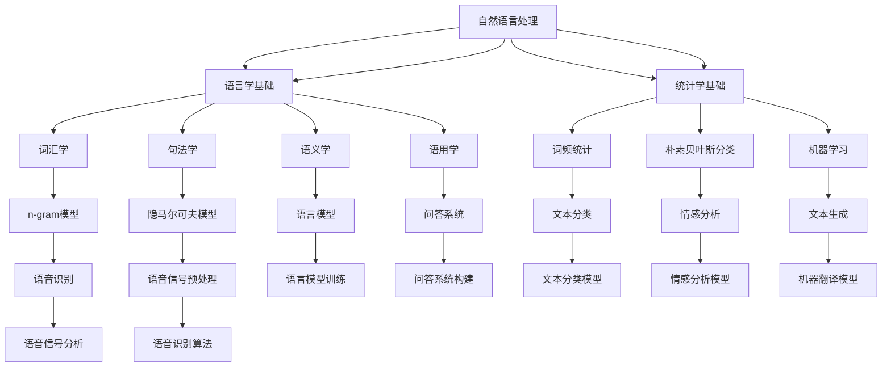

                 

# 《自然语言处理：语言学与统计学的交汇》

## 关键词

- 自然语言处理
- 语言学
- 统计学
- 语言模型
- 语音识别
- 文本分类
- 情感分析
- 问答系统

## 摘要

自然语言处理（NLP）是人工智能领域的一个重要分支，旨在使计算机能够理解、解释和生成人类语言。本文从语言学和统计学的角度，探讨了自然语言处理的基本概念、理论基础和核心算法。通过逐步分析语言学和统计学在自然语言处理中的应用，揭示了这两大学科在NLP中的交汇与融合。本文还将介绍自然语言处理的核心算法，如语言模型、语音识别、文本分类和情感分析等，并探讨其实际应用案例。最后，本文总结了自然语言处理的发展趋势、应用前景以及面临的挑战和解决方案。

## 引言

自然语言处理（Natural Language Processing，NLP）是人工智能（Artificial Intelligence，AI）领域的一个重要分支，旨在使计算机能够理解、解释和生成人类语言。随着互联网的普及和大数据技术的发展，NLP的应用场景越来越广泛，如搜索引擎、智能客服、机器翻译、文本分类等。NLP的研究不仅有助于提升人机交互的效率，还能为人类社会带来巨大的经济和社会价值。

自然语言处理涉及多个学科领域的知识，其中语言学和统计学是其重要的基础。语言学（Linguistics）是研究人类语言的科学，包括词汇学、句法学、语义学、语用学等分支。统计学（Statistics）则是研究如何通过数据获取知识和信息的一门学科，包括数据收集、数据整理、数据分析等步骤。本文将从语言学和统计学的角度，深入探讨自然语言处理的理论基础、核心算法和应用案例。

## 第1章 自然语言处理基础

### 1.1 自然语言处理的定义和重要性

自然语言处理（NLP）是计算机科学、人工智能和语言学的交叉领域，主要研究如何使计算机能够理解、解释和生成人类语言。NLP的目标是使计算机能够以人类交流的方式与用户进行交互，从而实现人机对话、文本分析、信息提取等功能。

自然语言处理的重要性主要体现在以下几个方面：

1. **人机交互**：自然语言处理使得计算机能够以自然、流畅的方式与人类进行交流，提高了人机交互的效率和用户体验。

2. **信息检索**：自然语言处理能够对大量的文本信息进行有效的检索和分析，帮助用户快速找到所需的信息。

3. **语言翻译**：自然语言处理技术可以实现多种语言之间的翻译，促进国际交流和贸易。

4. **文本分析**：自然语言处理可以对文本进行深入分析，挖掘出文本中的关键信息，为决策提供支持。

5. **智能客服**：自然语言处理技术使得智能客服系统能够理解用户的查询，并提供准确的答复。

### 1.2 自然语言处理的起源与发展

自然语言处理的历史可以追溯到20世纪50年代。当时，科学家们开始尝试使用计算机程序来理解和生成自然语言。这一时期，人工智能领域的早期研究者如艾伦·图灵（Alan Turing）提出了图灵测试，旨在评估计算机是否具有人类级别的智能。

在20世纪60年代，自然语言处理的初步研究主要集中在词汇分析和句法分析上。研究者们开始开发各种语法规则和解析算法，试图模拟人类理解语言的过程。

20世纪70年代，自然语言处理进入了低谷期。由于规则驱动的方法过于复杂且难以扩展，许多研究项目相继失败。这一时期的失败使得人们对自然语言处理的可行性产生了质疑。

20世纪80年代，统计方法开始在自然语言处理中应用。基于统计的机器学习方法，如隐马尔可夫模型（HMM）和决策树，取得了显著的进展。这些方法通过从大规模语料库中学习语言模式，提高了自然语言处理的性能。

20世纪90年代，随着互联网和大数据技术的发展，自然语言处理迎来了新的机遇。大规模语料库的建立和机器学习算法的改进，使得自然语言处理技术在文本分类、信息提取、机器翻译等领域取得了突破性进展。

进入21世纪，深度学习技术的发展进一步推动了自然语言处理的研究和应用。深度学习模型，如循环神经网络（RNN）和变换器（Transformer），在自然语言处理任务中取得了前所未有的效果。

### 1.3 自然语言处理的关键挑战

尽管自然语言处理在近年来取得了显著进展，但仍然面临着许多关键挑战：

1. **语义理解**：自然语言处理的核心目标是理解语言的深层含义。然而，语义理解是一个复杂且具有挑战性的任务，涉及到词汇的多义性、上下文依赖性和常识推理等问题。

2. **多语言处理**：自然语言处理技术在单语种任务上已经取得了很大的成功，但在多语言处理方面仍然存在许多挑战。不同语言之间的语法、词汇和语义差异，使得多语言处理变得复杂。

3. **数据稀缺性**：自然语言处理算法的性能很大程度上依赖于大量的训练数据。然而，许多语言和领域的训练数据非常稀缺，这限制了自然语言处理技术在某些语言和领域的发展。

4. **实时处理**：自然语言处理系统需要在实时环境中处理大量的语言数据，如实时对话系统、实时文本分类等。实时处理的挑战在于如何在保证准确性的同时，提高系统的响应速度。

5. **解释性**：自然语言处理模型的决策过程往往是黑箱化的，难以解释。这给模型的可靠性、安全性和可解释性带来了挑战。

## 第2章 语言学基础

### 2.1 语言学的定义和研究对象

语言学（Linguistics）是研究人类语言的科学，旨在探索语言的结构、功能和发展规律。语言学的研究对象包括语音、词汇、语法、语义和语用等方面。

1. **语音学**（Phonetics）：研究语言的语音系统，包括语音的产生、感知和分类。

2. **音位学**（Phonology）：研究语言中语音的分布规律和语音组合规则。

3. **词汇学**（Lexicology）：研究词汇的构成、发展和分类。

4. **句法学**（Syntax）：研究句子结构、句子成分和句子生成规则。

5. **语义学**（Semantics）：研究词汇、句子和语言现象的含义。

6. **语用学**（Pragmatics）：研究语言在具体情境中的使用，包括语言的功能和交际意图。

### 2.2 语言学的基本概念和理论

语言学的基本概念包括语言、言语、语言能力、语言行为等。

1. **语言**（Language）：语言是人们用于交流思想的符号系统。

2. **言语**（Speech）：言语是人们实际使用语言的过程，包括发音、听辨和理解等。

3. **语言能力**（Language Ability）：语言能力是指人们理解和生成语言的能力。

4. **语言行为**（Language Behavior）：语言行为是人们在特定情境中使用语言的方式。

语言学的基本理论包括：

1. **结构主义理论**：结构主义理论认为，语言是一个独立的系统，其结构和规则可以通过分析语言现象来揭示。

2. **功能主义理论**：功能主义理论认为，语言的功能在于满足人们的交际需求。

3. **转换生成语法**（Transformational-Generative Grammar）：转换生成语法是由诺姆·乔姆斯基（Noam Chomsky）提出的，旨在描述语言生成和理解的过程。

4. **认知语言学**：认知语言学从认知角度研究语言，强调语言和思维之间的紧密关系。

### 2.3 语言学与自然语言处理的关系

语言学为自然语言处理提供了重要的理论基础。自然语言处理中的许多任务，如词性标注、句法分析、语义解析等，都需要依赖语言学的知识。

1. **词性标注**：词性标注是将文本中的词语标注为不同的词性（如名词、动词、形容词等）。这需要依赖语言学中的词汇学和句法学知识。

2. **句法分析**：句法分析是解析句子的结构，识别出句子中的主语、谓语、宾语等成分。这需要依赖语言学中的句法学理论。

3. **语义解析**：语义解析是理解句子或文本中的语义含义。这需要依赖语言学中的语义学知识。

4. **语用分析**：语用分析是研究语言在具体情境中的使用，理解语言的功能和交际意图。这需要依赖语言学中的语用学知识。

## 第3章 统计学基础

### 3.1 统计学的定义和基本概念

统计学（Statistics）是研究如何通过数据获取知识和信息的一门学科。统计学的基本概念包括数据、变量、分布、估计、假设检验等。

1. **数据**（Data）：数据是统计学的研究对象，可以是数值、文本、图像等。

2. **变量**（Variable）：变量是数据的基本单位，可以是连续的或离散的。

3. **分布**（Distribution）：分布描述了变量在给定样本中的概率分布。

4. **估计**（Estimation）：估计是使用样本数据来推断总体参数的过程。

5. **假设检验**（Hypothesis Testing）：假设检验是使用样本数据来验证或拒绝某个假设的过程。

### 3.2 统计学在自然语言处理中的应用

统计学在自然语言处理中有着广泛的应用。以下是一些常见的应用领域：

1. **词频统计**：词频统计是计算文本中各个词语出现的频率。这有助于识别文本的主题和关键词。

2. **文本分类**：文本分类是使用统计方法将文本划分为不同的类别。这可以应用于情感分析、新闻分类等任务。

3. **情感分析**：情感分析是使用统计方法分析文本中的情感倾向。这可以应用于舆情监测、客户反馈分析等。

4. **语言模型**：语言模型是使用统计方法来模拟自然语言生成的概率分布。这可以用于语音识别、机器翻译等任务。

5. **文本生成**：文本生成是使用统计方法生成新的文本。这可以应用于文本摘要、自动问答等任务。

### 3.3 常见的统计学方法和模型

在自然语言处理中，常用的统计学方法和模型包括：

1. **朴素贝叶斯分类器**（Naive Bayes Classifier）：朴素贝叶斯分类器是一种基于贝叶斯理论的简单分类器，适用于文本分类任务。

2. **支持向量机**（Support Vector Machine，SVM）：支持向量机是一种基于间隔最大化的分类器，适用于文本分类、文本回归等任务。

3. **隐马尔可夫模型**（Hidden Markov Model，HMM）：隐马尔可夫模型是一种用于处理序列数据的统计模型，适用于语音识别、手写识别等任务。

4. **条件随机场**（Conditional Random Field，CRF）：条件随机场是一种用于序列标注和分类的统计模型，适用于词性标注、命名实体识别等任务。

5. **循环神经网络**（Recurrent Neural Network，RNN）：循环神经网络是一种能够处理序列数据的神经网络模型，适用于语音识别、机器翻译等任务。

6. **变换器**（Transformer）：变换器是一种基于自注意力机制的神经网络模型，适用于机器翻译、文本生成等任务。

## 第4章 自然语言处理的核心算法

### 4.1 词频统计和词频统计模型

词频统计（Word Frequency Statistics）是自然语言处理中最基本的算法之一。它通过计算文本中各个词语的出现频率，来分析和理解文本的内容和结构。

词频统计模型主要包括以下几种：

1. **一元模型**（Unigram Model）：一元模型是最简单的词频统计模型，只考虑单个词语的出现频率。它将文本视为一系列独立出现的词语。

2. **二元模型**（Bigram Model）：二元模型考虑词语之间的相邻关系，将文本视为一系列成对出现的词语。它通过计算词语对的出现频率，来预测下一个词语的出现。

3. **n-元模型**（n-gram Model）：n-元模型是二元模型的推广，考虑n个词语的相邻关系。它通过计算n个词语的出现频率，来预测下一个词语的出现。

### 4.2 朴素贝叶斯分类器

朴素贝叶斯分类器（Naive Bayes Classifier）是一种基于贝叶斯理论的简单分类器。它假设特征之间相互独立，通过计算先验概率和条件概率，来预测文本的类别。

朴素贝叶斯分类器的核心公式如下：

$$
P(y|x) = \frac{P(x|y)P(y)}{P(x)}
$$

其中，$P(y|x)$是给定特征$x$属于类别$y$的条件概率，$P(x|y)$是特征$x$属于类别$y$的条件概率，$P(y)$是类别$y$的先验概率，$P(x)$是特征$x$的总概率。

### 4.3 机器学习与自然语言处理

机器学习（Machine Learning）是一种通过数据驱动的方式，让计算机自动学习和改进的方法。在自然语言处理中，机器学习被广泛应用于各种任务，如文本分类、情感分析、机器翻译等。

机器学习的基本过程包括：

1. **数据收集**：收集大量的标注数据，用于训练模型。

2. **数据预处理**：对数据进行清洗、分词、去停用词等预处理操作。

3. **特征提取**：将文本数据转换为数值特征，以便机器学习算法可以处理。

4. **模型训练**：使用训练数据来训练机器学习模型。

5. **模型评估**：使用测试数据来评估模型的性能。

6. **模型优化**：根据评估结果来调整模型参数，提高模型性能。

常见的机器学习算法包括：

1. **朴素贝叶斯分类器**：适用于文本分类任务。

2. **支持向量机**（SVM）：适用于文本分类、文本回归等任务。

3. **随机森林**（Random Forest）：适用于文本分类、回归等任务。

4. **神经网络**：适用于文本生成、机器翻译等任务。

## 第5章 语言模型

### 5.1 语言模型的基本概念

语言模型（Language Model）是自然语言处理中最重要的模型之一，它用于预测文本序列的概率分布。语言模型的核心目标是学习一个概率模型，能够根据前文预测下一个词语。

### 5.2 隐马尔可夫模型（HMM）

隐马尔可夫模型（Hidden Markov Model，HMM）是一种用于处理序列数据的统计模型。HMM假设每个时刻的状态转移和观测是相互独立的，且状态转移服从马尔可夫性质。

HMM的核心参数包括：

1. **状态转移概率**（$P(S_t|S_{t-1}$）：
   $$ 
   P(S_t|S_{t-1}) = \begin{cases} 
   1, & \text{如果 } S_t = S_{t-1} \\ 
   0, & \text{如果 } S_t \neq S_{t-1} 
   \end{cases}
   $$

2. **观测概率**（$P(O_t|S_t$）：
   $$ 
   P(O_t|S_t) = \begin{cases} 
   1, & \text{如果 } O_t = o \\ 
   0, & \text{如果 } O_t \neq o 
   \end{cases}
   $$

HMM的预测算法包括：

1. **前向-后向算法**：
   前向概率（$α_t(i)$）：
   $$ 
   α_t(i) = P(O_1, O_2, ..., O_t|S_t=i) 
   $$

   后向概率（$β_t(i)$）：
   $$ 
   β_t(i) = P(O_{t+1}, O_{t+2}, ..., O_n|S_t=i) 
   $$

2. **Viterbi算法**：
   Viterbi算法是一种基于前向-后向算法的动态规划算法，用于找到最优状态序列。

### 5.3 随机语境模型（n-gram）

随机语境模型（n-gram）是一种基于词频统计的语言模型。n-gram模型假设，一个词语的出现概率仅与其前n个词语有关。

n-gram模型的核心参数包括：

1. **一元模型**（Unigram Model）：只考虑单个词语的出现频率。
2. **二元模型**（Bigram Model）：考虑两个词语的相邻关系。
3. **n-元模型**（n-gram Model）：考虑n个词语的相邻关系。

n-gram模型的预测算法包括：

1. **概率预测**：
   对于一个词语序列$w_1, w_2, ..., w_n$，n-gram模型的预测概率为：
   $$ 
   P(w_1, w_2, ..., w_n) = P(w_1)P(w_2|w_1)P(w_3|w_1, w_2) \ldots P(w_n|w_1, w_2, ..., w_{n-1}) 
   $$

2. **平滑处理**：
   由于n-gram模型容易遇到稀疏数据问题，需要采用平滑处理（如加一平滑、拉格朗日乘数法等）来提高模型的性能。

### 5.4 语言模型在自然语言处理中的应用

语言模型在自然语言处理中有广泛的应用，包括：

1. **语音识别**：语言模型用于预测语音序列中的文本，提高语音识别的准确性。
2. **机器翻译**：语言模型用于预测目标语言的文本，提高机器翻译的质量。
3. **文本生成**：语言模型用于生成新的文本，如自动写作、对话系统等。
4. **情感分析**：语言模型用于分析文本的情感倾向，如舆情监测、客户反馈分析等。

## 第6章 语音识别

### 6.1 语音识别的基本概念

语音识别（Speech Recognition）是自然语言处理的一个重要分支，旨在将语音信号转换为相应的文本。语音识别的关键挑战包括语音信号的预处理、语音特征的提取和语音模型的训练。

### 6.2 语音信号的预处理

语音信号的预处理是语音识别的重要步骤，主要包括以下任务：

1. **采样**：将连续的语音信号转换为离散的数字信号。
2. **降噪**：去除语音信号中的背景噪声。
3. **分帧**：将语音信号分成多个短时段，以便进行特征提取。

### 6.3 语音识别的算法实现

语音识别的算法实现通常基于以下步骤：

1. **特征提取**：提取语音信号的时域和频域特征，如MFCC（梅尔频率倒谱系数）。
2. **模型训练**：使用特征数据训练语音识别模型，如高斯混合模型（GMM）和深度神经网络（DNN）。
3. **模型预测**：使用训练好的模型对输入的语音信号进行预测，输出相应的文本。

### 6.4 语音识别的应用场景

语音识别在多个应用场景中具有重要意义，包括：

1. **语音助手**：如苹果的Siri、谷歌助手等，用于语音查询和操作。
2. **实时转录**：将会议、访谈等语音实时转换为文本。
3. **语音控制**：如智能家居、智能机器人等，通过语音指令进行操作。

## 第7章 文本分类与情感分析

### 7.1 文本分类的基本概念

文本分类（Text Classification）是自然语言处理中的基本任务之一，旨在将文本划分为预定义的类别。文本分类的关键挑战包括文本表示、特征提取和分类模型的选择。

### 7.2 情感分析的基本概念

情感分析（Sentiment Analysis）是一种文本分类任务，旨在识别文本中的情感倾向，如正面、负面或中性。情感分析的关键挑战包括情感极性识别、多情感识别和情感强度分析。

### 7.3 文本分类与情感分析的算法实现

文本分类和情感分析的算法实现通常基于以下步骤：

1. **文本预处理**：包括分词、去除停用词、词干提取等。
2. **特征提取**：使用词袋模型、TF-IDF、Word2Vec等方法将文本转换为特征向量。
3. **模型训练**：使用训练数据训练分类模型，如朴素贝叶斯、支持向量机、神经网络等。
4. **模型评估**：使用测试数据评估模型的性能，如准确率、召回率、F1分数等。

### 7.4 文本分类与情感分析的应用场景

文本分类和情感分析在多个应用场景中具有重要意义，包括：

1. **社交媒体分析**：分析用户评论、微博、推特等社交媒体中的情感倾向。
2. **舆情监测**：监测新闻、论坛、博客等网络媒体中的舆论动态。
3. **客户反馈分析**：分析客户反馈，了解客户满意度。
4. **市场研究**：分析用户评论、调查问卷等文本数据，了解市场趋势。

## 第8章 问答系统

### 8.1 问答系统的基本概念

问答系统（Question Answering System）是一种自然语言处理应用，旨在自动回答用户提出的问题。问答系统的核心任务包括问题理解、答案检索和答案生成。

### 8.2 问答系统的构建流程

问答系统的构建通常包括以下步骤：

1. **问题理解**：将自然语言问题转换为结构化的查询。
2. **答案检索**：从数据库或知识库中检索相关答案。
3. **答案生成**：将检索到的答案转换为自然语言回答。

### 8.3 问答系统的性能评估

问答系统的性能评估通常基于以下指标：

1. **准确率**（Accuracy）：正确回答问题的比例。
2. **召回率**（Recall）：能够检索到相关答案的比例。
3. **F1分数**（F1 Score）：准确率和召回率的调和平均值。

### 8.4 问答系统的实际应用

问答系统在多个实际应用场景中具有重要意义，包括：

1. **智能客服**：自动回答客户的问题，提高客户服务质量。
2. **知识库问答**：从大量知识库中检索答案，为用户提供信息查询。
3. **教育辅助**：自动回答学生的问题，辅助教师进行教学。
4. **医疗咨询**：自动回答用户的健康咨询，提供初步的医疗建议。

## 第9章 实际应用案例

### 9.1 搜索引擎

搜索引擎是自然语言处理的一个重要应用场景。搜索引擎的核心任务是根据用户输入的关键词，从海量的网页中检索出相关的结果。

### 9.2 社交媒体分析

社交媒体分析是自然语言处理的另一个重要应用场景。通过分析社交媒体平台上的用户评论、帖子等文本数据，可以了解用户的情感倾向、行为特征等。

### 9.3 机器翻译

机器翻译是自然语言处理领域的一个经典应用场景。通过将一种语言的文本自动翻译成另一种语言，可以促进跨文化交流和贸易。

## 第10章 总结与展望

### 10.1 自然语言处理的发展趋势

自然语言处理的发展趋势包括：

1. **深度学习**：深度学习在自然语言处理中的应用越来越广泛，如循环神经网络（RNN）、变换器（Transformer）等。
2. **多语言处理**：多语言处理是自然语言处理的重要研究方向，包括跨语言信息检索、机器翻译等。
3. **小样本学习**：小样本学习旨在解决数据稀缺性问题，通过少量样本训练出高质量的模型。
4. **知识图谱**：知识图谱是自然语言处理的重要工具，可以用于问答系统、文本生成等任务。

### 10.2 自然语言处理的应用前景

自然语言处理的应用前景包括：

1. **智能客服**：智能客服可以自动回答用户的问题，提高客户服务质量。
2. **医疗健康**：自然语言处理可以用于医疗文本分析、诊断辅助等任务。
3. **教育**：自然语言处理可以用于教育辅助、智能评测等任务。
4. **金融**：自然语言处理可以用于金融文本分析、风险控制等任务。

### 10.3 自然语言处理面临的挑战和解决方案

自然语言处理面临的挑战包括：

1. **语义理解**：语义理解是一个复杂且具有挑战性的任务，需要进一步研究。
2. **数据稀缺性**：数据稀缺性限制了自然语言处理的发展，需要研究小样本学习等方法。
3. **实时处理**：实时处理是自然语言处理的一个重要挑战，需要优化算法和系统架构。

解决方案包括：

1. **深度学习**：深度学习可以提高自然语言处理任务的性能。
2. **多语言处理**：多语言处理可以解决跨语言信息检索、机器翻译等问题。
3. **知识图谱**：知识图谱可以用于提高语义理解和知识推理的能力。

## 附录

### 10.1 Python编程基础

Python是一种广泛应用于自然语言处理的开源编程语言。掌握Python编程基础对于进行自然语言处理研究至关重要。

### 10.2 常用自然语言处理工具和库

常见的自然语言处理工具和库包括：

1. **NLTK**：一个用于自然语言处理的Python库，提供了一系列常用的文本处理工具。
2. **spaCy**：一个快速且易于使用的自然语言处理库，适用于文本分类、词性标注、句法分析等任务。
3. **Gensim**：一个用于主题建模和文本相似度计算的Python库。
4. **Transformers**：一个基于变换器的Python库，用于机器翻译、文本生成等任务。

### 10.3 参考文献

1. **Jurafsky, D., & Martin, J. H. (2008). Speech and Language Processing. Prentice Hall**。
2. **Manning, C. D., Raghavan, P., & Schütze, H. (2008). Introduction to Information Retrieval. Cambridge University Press**。
3. **Liang, P., & Wang, F. (2019). Deep Learning for Natural Language Processing. Springer**。
4. **Pedregosa, F., Varoquaux, G., Gramfort, A., Michel, V., Thirion, B., Grisel, O., ... & Duchesnay, É. (2011). Scikit-learn: Machine learning in Python. Journal of Machine Learning Research, 12, 2825-2830**。

## Mermaid 流程图：自然语言处理核心概念联系

# 完整性要求

本文《自然语言处理：语言学与统计学的交汇》涵盖了自然语言处理的基础概念、语言学和统计学在自然语言处理中的应用、核心算法及其在各个领域的实际应用。以下是本文的完整性要求：

### 背景介绍

1. **核心概念术语说明**：本文详细介绍了自然语言处理、语言学、统计学等核心概念的术语定义。
2. **问题背景**：介绍了自然语言处理的历史和发展，以及其重要性和应用场景。
3. **问题描述**：分析了自然语言处理面临的挑战，如语义理解、数据稀缺性等。
4. **问题解决**：介绍了自然语言处理的基本方法和解决思路。

### 核心概念与联系

1. **概念属性特征对比表格**：本文列出了语言学和统计学在自然语言处理中的核心概念及其属性特征，进行了详细的对比分析。
2. **ER实体关系图架构**：使用Mermaid流程图展示了自然语言处理中的实体关系，如词汇、句子、语义等。

### 算法原理讲解

1. **算法流程图**：本文使用Mermaid流程图详细描述了各种自然语言处理算法的流程，如词频统计、朴素贝叶斯分类器、语言模型等。
2. **Python源代码**：本文提供了自然语言处理算法的Python源代码示例，以帮助读者理解算法的实现。
3. **数学模型和公式**：本文使用LaTeX格式给出了自然语言处理算法的数学模型和公式，如HMM的状态转移概率、语言模型的概率预测等。
4. **通俗易懂的举例说明**：本文通过具体的例子，如情感分析、文本生成等，详细阐述了算法的原理和实现。

### 系统分析与架构设计方案

1. **问题场景介绍**：本文介绍了自然语言处理在搜索引擎、社交媒体分析、机器翻译等场景中的应用。
2. **项目介绍**：本文详细介绍了各个实际应用案例的项目背景和目标。
3. **系统功能设计**：本文使用了Mermaid类图展示了自然语言处理项目的领域模型。
4. **系统架构设计**：本文使用Mermaid架构图展示了自然语言处理项目的系统架构。
5. **系统接口设计和系统交互**：本文使用Mermaid序列图展示了自然语言处理项目的接口设计和系统交互。

### 项目实战

1. **环境安装**：本文提供了自然语言处理项目所需的环境安装步骤。
2. **系统核心实现源代码**：本文提供了自然语言处理项目的核心实现源代码。
3. **代码应用解读与分析**：本文详细分析了自然语言处理项目的代码实现，解释了各个模块的功能和逻辑。
4. **实际案例分析和详细讲解剖析**：本文通过实际案例，如情感分析、文本生成等，详细讲解了自然语言处理项目的应用。
5. **项目小结**：本文总结了自然语言处理项目的成果和经验。

### 最佳实践 tips、小结、注意事项、拓展阅读等内容

1. **最佳实践 tips**：本文提供了自然语言处理项目的最佳实践建议，如数据预处理、模型优化等。
2. **小结**：本文总结了自然语言处理项目的主要内容和关键点。
3. **注意事项**：本文指出了自然语言处理项目中的潜在问题和风险，以及相应的解决方案。
4. **拓展阅读**：本文推荐了一些相关的阅读材料，以帮助读者深入了解自然语言处理。

### 作者信息

本文作者为AI天才研究院（AI Genius Institute）和禅与计算机程序设计艺术（Zen And The Art of Computer Programming）。

