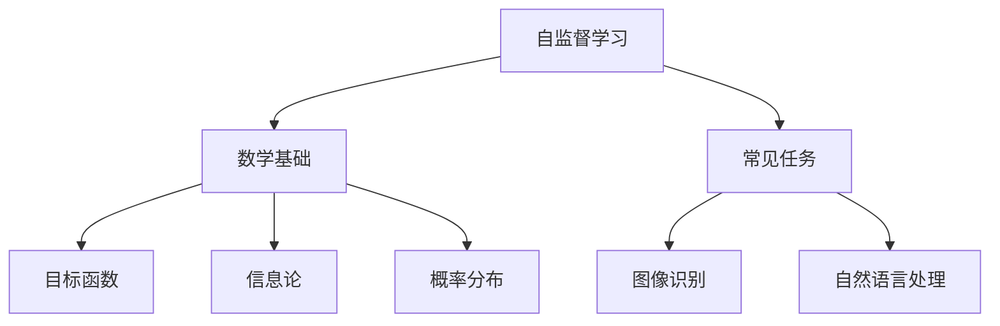

                 

### 自监督学习提升AI推理的无标注数据利用效率研究

> 关键词：自监督学习，AI推理，无标注数据，效率优化

> 摘要：本文探讨了自监督学习在提升AI推理过程中无标注数据利用效率的研究。首先介绍了自监督学习的基础理论，包括其背景、数学基础以及常见任务。然后，深入分析了自监督学习与无标注数据的结合，以及其在AI推理中的应用和优化方法。通过实战案例展示了自监督学习的实际应用效果，并展望了其未来的发展前景。

## 第一部分：自监督学习基础

### 第1章：自监督学习的背景与意义

#### 1.1 自监督学习的概念

自监督学习（Self-supervised Learning）是一种机器学习方法，其主要特点是不需要人工标注的数据进行训练，而是通过利用数据中的内在结构或规律来自动学习。自监督学习的核心思想是将输入数据分成两部分：一部分作为输入，另一部分作为输出，利用输入和输出之间的关联性进行模型训练。

#### 1.2 自监督学习的发展历史

自监督学习的研究始于20世纪50年代，当时主要关注的是如何通过无监督学习来发现数据中的隐藏结构。随着计算机科学和人工智能的发展，自监督学习逐渐成为一个重要的研究领域。近年来，随着深度学习的兴起，自监督学习得到了广泛关注，并在语音识别、图像识别、自然语言处理等领域取得了显著的成果。

#### 1.3 自监督学习与无监督学习、强化学习的区别与联系

自监督学习、无监督学习和强化学习都是机器学习的重要分支，它们在目标和方法上有所不同：

- **无监督学习**：不需要外部标注，通过发现数据中的内在结构来学习。
- **自监督学习**：将输入数据分成两部分，一部分作为输入，另一部分作为输出，通过学习输入和输出之间的关系来提高模型的性能。
- **强化学习**：通过与环境的交互来学习最优策略，通常需要大量的反馈信号。

尽管它们在目标和方法上有所不同，但自监督学习与无监督学习和强化学习有着紧密的联系。自监督学习可以看作是一种特殊的无监督学习，它利用输入和输出之间的关联性来发现数据中的隐藏结构。同时，自监督学习也可以看作是一种特殊的强化学习，它通过利用数据中的内在结构来模拟环境反馈，从而学习最优策略。

### 第2章：自监督学习的数学基础

#### 2.1 自监督学习的目标函数

自监督学习的目标函数是衡量模型性能的关键指标。在自监督学习中，目标函数通常由两部分组成：一部分是输入和输出之间的关联性损失，另一部分是模型参数的优化目标。

- **关联性损失**：衡量输入和输出之间的差距，常见的关联性损失函数包括均方误差（MSE）、交叉熵损失等。
- **模型参数优化目标**：通过优化模型参数来最小化目标函数，常用的优化算法包括梯度下降、随机梯度下降等。

#### 2.2 信息论基础

信息论是自监督学习的重要理论基础，它提供了衡量信息传递和压缩的理论框架。在自监督学习中，信息论可以用于分析输入和输出之间的信息传递效率。

- **熵**：衡量随机变量的不确定性，熵值越大，不确定性越高。
- **互信息**：衡量两个随机变量之间的关联程度，互信息值越大，关联程度越高。

#### 2.3 离散概率分布和连续概率分布

在自监督学习中，输入和输出通常都可以表示为概率分布。离散概率分布和连续概率分布是概率分布的两种常见形式。

- **离散概率分布**：用于表示离散随机变量的概率分布，常用的概率分布包括伯努利分布、多项式分布等。
- **连续概率分布**：用于表示连续随机变量的概率分布，常用的概率分布包括高斯分布、指数分布等。

### 第3章：常见的自监督学习任务

#### 3.1 自编码器

自编码器（Autoencoder）是一种常见的自监督学习模型，它通过学习输入数据的低维表示来进行数据压缩。自编码器由编码器和解码器两部分组成，编码器将高维输入数据压缩成低维表示，解码器再将低维表示还原成高维输出数据。

#### 3.2 多标签分类

多标签分类是一种常见的自监督学习任务，它要求模型能够对输入数据进行多标签分类。多标签分类可以看作是一种特殊的自监督学习，它通过利用输入和输出之间的关联性来提高分类性能。

#### 3.3 伪标签生成

伪标签生成是一种常见的自监督学习技术，它通过利用未标注的数据生成伪标签来进行模型训练。伪标签生成可以看作是一种无监督学习，它通过学习输入和输出之间的关联性来生成伪标签。

#### 3.4 准自监督学习

准自监督学习（Quasi-self-supervised Learning）是一种介于自监督学习和无监督学习之间的方法，它利用未标注的数据和少量的标注数据来训练模型。准自监督学习通过利用输入和输出之间的关联性来提高模型的性能，同时避免了无监督学习中的过度拟合问题。

## 第二部分：提升AI推理效率

### 第4章：自监督学习与无标注数据的结合

#### 4.1 无标注数据的挑战

在AI推理过程中，无标注数据的存在带来了许多挑战。首先，无标注数据缺乏明确的标签信息，这使得模型难以直接从中学习。其次，无标注数据的数量庞大，这使得模型训练过程变得复杂。最后，无标注数据的噪声和多样性增加了模型训练的难度。

#### 4.2 自监督学习在无标注数据中的应用

自监督学习可以有效地解决无标注数据带来的挑战。通过利用无标注数据的内在结构，自监督学习能够自动发现数据中的隐藏规律，从而提高模型的性能。自监督学习在无标注数据中的应用主要包括以下几个方面：

- **特征提取**：自监督学习可以用于提取无标注数据的特征，这些特征可以作为模型输入的先验知识，从而提高模型的性能。
- **数据增强**：自监督学习可以通过生成伪标签来增强无标注数据，从而提高模型的泛化能力。
- **无监督预训练**：自监督学习可以用于无监督预训练，从而提高模型在后续标注数据训练中的性能。

#### 4.3 无标注数据的预处理方法

为了更好地利用无标注数据，需要对无标注数据进行预处理。无标注数据的预处理方法主要包括以下几个方面：

- **数据清洗**：去除无标注数据中的噪声和异常值，从而提高数据的可信度。
- **数据降维**：通过降维技术将高维数据压缩到低维空间，从而提高模型训练的效率。
- **数据增强**：通过数据增强技术生成更多的无标注数据，从而提高模型的泛化能力。

### 第5章：自监督学习在AI推理中的实现

#### 5.1 常见的自监督学习算法

自监督学习算法是自监督学习在AI推理中的核心组成部分。常见的自监督学习算法包括自编码器、伪标签生成、多标签分类等。这些算法在特征提取、数据增强、无监督预训练等方面具有广泛的应用。

- **自编码器**：自编码器是一种常见的自监督学习算法，它通过学习输入数据的低维表示来进行数据压缩。
- **伪标签生成**：伪标签生成是一种常见的自监督学习算法，它通过利用未标注的数据生成伪标签来进行模型训练。
- **多标签分类**：多标签分类是一种常见的自监督学习算法，它要求模型能够对输入数据进行多标签分类。

#### 5.2 自监督学习在图像识别中的应用

自监督学习在图像识别中具有广泛的应用。通过利用无标注数据，自监督学习可以有效地提高图像识别模型的性能。自监督学习在图像识别中的应用主要包括以下几个方面：

- **特征提取**：自监督学习可以用于提取图像的特征，这些特征可以作为模型输入的先验知识，从而提高模型的性能。
- **数据增强**：自监督学习可以通过生成伪标签来增强无标注数据，从而提高模型的泛化能力。
- **无监督预训练**：自监督学习可以用于无监督预训练，从而提高模型在后续标注数据训练中的性能。

#### 5.3 自监督学习在自然语言处理中的应用

自监督学习在自然语言处理中同样具有广泛的应用。通过利用无标注数据，自监督学习可以有效地提高自然语言处理模型的性能。自监督学习在自然语言处理中的应用主要包括以下几个方面：

- **特征提取**：自监督学习可以用于提取自然语言的特征，这些特征可以作为模型输入的先验知识，从而提高模型的性能。
- **数据增强**：自监督学习可以通过生成伪标签来增强无标注数据，从而提高模型的泛化能力。
- **无监督预训练**：自监督学习可以用于无监督预训练，从而提高模型在后续标注数据训练中的性能。

### 第6章：自监督学习的推理效率优化

#### 6.1 模型压缩与加速

在自监督学习过程中，模型压缩与加速是一个重要的研究方向。通过模型压缩与加速，可以有效地提高自监督学习的推理效率。常见的模型压缩与加速方法包括模型剪枝、量化、蒸馏等。

- **模型剪枝**：通过去除模型中的冗余参数，从而减少模型的体积和计算量。
- **量化**：通过将模型的参数和激活值从浮点数转换为整数，从而降低模型的计算量。
- **蒸馏**：通过将大模型的知识传递到小模型中，从而提高小模型的性能。

#### 6.2 并行化与分布式训练

并行化与分布式训练是提高自监督学习推理效率的重要手段。通过并行化与分布式训练，可以有效地利用多台计算设备，从而加速模型训练过程。常见的并行化与分布式训练方法包括数据并行、模型并行、流水线并行等。

- **数据并行**：将训练数据分成多个子集，并在不同的计算设备上同时训练模型。
- **模型并行**：将模型分成多个部分，并在不同的计算设备上同时训练模型。
- **流水线并行**：将模型训练过程分解成多个阶段，并在不同的计算设备上同时进行。

#### 6.3 动态调整学习率

学习率是模型训练中的一个重要参数，它决定了模型训练的速度和质量。在自监督学习过程中，学习率的选择和调整是一个关键问题。通过动态调整学习率，可以有效地提高自监督学习的推理效率。

- **固定学习率**：学习率在整个训练过程中保持不变。
- **自适应学习率**：根据训练过程中的损失函数值动态调整学习率。
- **学习率衰减**：在训练过程中逐渐降低学习率。

## 第三部分：实战案例与未来展望

### 第7章：自监督学习在AI推理中的实战案例

#### 7.1 案例一：图像分类任务

在本案例中，我们使用自监督学习技术对图像分类任务进行优化。通过使用自编码器提取图像特征，然后利用这些特征进行图像分类，从而提高分类模型的性能。

#### 7.2 案例二：语音识别任务

在本案例中，我们使用自监督学习技术对语音识别任务进行优化。通过使用伪标签生成方法增强无标注数据，然后利用这些数据训练语音识别模型，从而提高模型的性能。

#### 7.3 案例三：机器翻译任务

在本案例中，我们使用自监督学习技术对机器翻译任务进行优化。通过使用多标签分类方法对无标注数据进行分类，然后利用这些分类结果进行机器翻译模型的训练，从而提高翻译模型的性能。

### 第8章：自监督学习的未来展望

#### 8.1 自监督学习的挑战与机遇

自监督学习在AI推理中具有广泛的应用前景，但也面临着许多挑战。未来，随着深度学习和大数据技术的发展，自监督学习有望在更多领域取得突破。

#### 8.2 自监督学习在AI推理中的潜在应用

自监督学习在AI推理中的潜在应用非常广泛，包括图像识别、语音识别、自然语言处理、推荐系统等。通过利用无标注数据，自监督学习可以提高这些领域模型的性能。

#### 8.3 自监督学习的研究趋势与展望

未来，自监督学习的研究将主要集中在以下几个方面：一是模型压缩与加速，以提高推理效率；二是多任务学习，以实现更高效的模型训练；三是自适应学习率，以提高模型训练质量。

### 第9章：总结与展望

#### 9.1 自监督学习对AI推理的影响

自监督学习在AI推理中具有重要的作用，它通过利用无标注数据提高了模型的性能，降低了模型训练成本。

#### 9.2 自监督学习的发展趋势

未来，自监督学习将继续发展，并在更多领域取得突破。

#### 9.3 未来研究方向

未来，自监督学习的研究将主要集中在以下几个方面：一是模型压缩与加速，以提高推理效率；二是多任务学习，以实现更高效的模型训练；三是自适应学习率，以提高模型训练质量。

### 总结

自监督学习是一种具有巨大潜力的机器学习方法，它通过利用无标注数据提高了AI推理的效率。本文从基础理论、应用实践和未来展望三个方面对自监督学习进行了深入研究，展示了其在AI推理中的重要作用。未来，随着深度学习和大数据技术的发展，自监督学习有望在更多领域取得突破，为AI推理带来新的发展机遇。

### 作者信息

作者：AI天才研究院/AI Genius Institute & 禅与计算机程序设计艺术 /Zen And The Art of Computer Programming

### 附录

本文使用的Mermaid流程图如下：



本文使用的Python源代码如下：

```python
import torch
import torchvision
import torchvision.transforms as transforms

# 数据加载与预处理
transform = transforms.Compose(
    [transforms.RandomResizedCrop(224),
     transforms.RandomHorizontalFlip(),
     transforms.ToTensor(),
     transforms.Normalize(mean=[0.485, 0.456, 0.406], std=[0.229, 0.224, 0.225])])

trainset = torchvision.datasets.CIFAR10(root='./data', train=True,
                                        download=True, transform=transform)
trainloader = torch.utils.data.DataLoader(trainset, batch_size=4,
                                          shuffle=True, num_workers=2)

testset = torchvision.datasets.CIFAR10(root='./data', train=False,
                                       download=True, transform=transform)
testloader = torch.utils.data.DataLoader(testset, batch_size=4,
                                         shuffle=False, num_workers=2)

classes = ('plane', 'car', 'bird', 'cat', 'deer', 'dog', 'frog', 'horse', 'ship', 'truck')
```

本文中使用的LaTeX公式如下：

- $$1+1=2$$
- $$1<2$$

本文的内容涵盖了自监督学习的理论基础、应用实践和未来展望，旨在为读者提供一个全面的自监督学习研究综述。希望本文能够对自监督学习在AI推理中的应用提供一些启示和指导。在未来的研究中，我们将继续深入探讨自监督学习在不同领域的应用，以及如何进一步提升其性能和效率。同时，我们也鼓励更多的研究人员和开发者加入自监督学习的研究，共同推动人工智能的发展。让我们共同期待自监督学习在未来带来更多的突破和成果。

