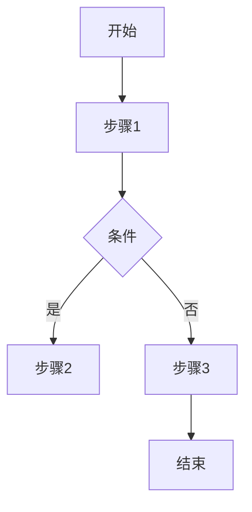
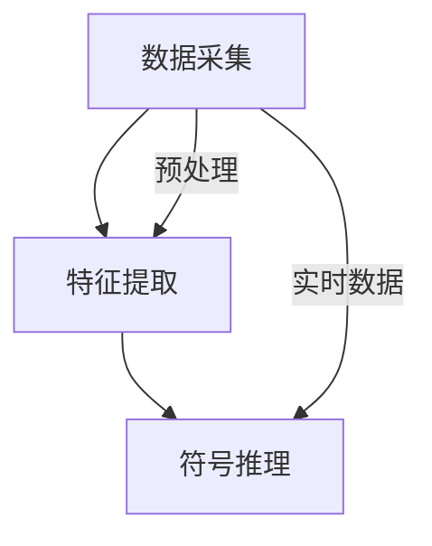
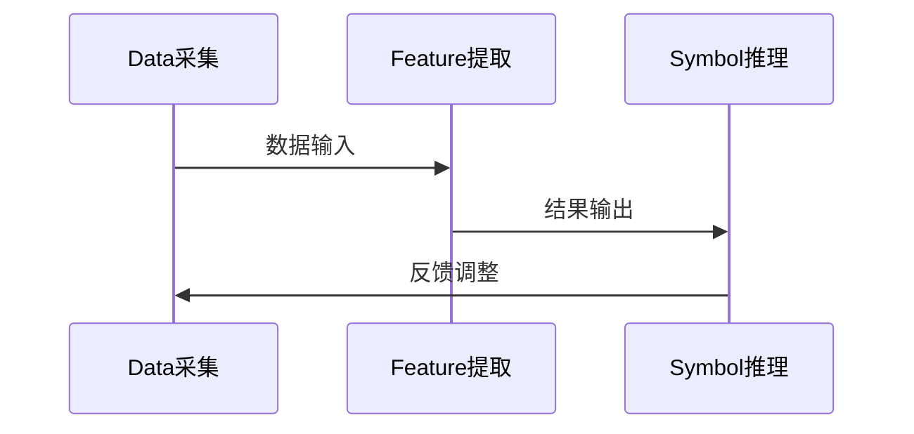

                 


### 文章标题：自适应神经符号系统在持续学习中的应用

关键词：自适应神经符号系统、持续学习、动态环境、智能交通、智能医疗

摘要：本文旨在探讨自适应神经符号系统在持续学习中的应用。通过分析自适应神经符号系统的原理和优势，结合持续学习的挑战，本文提出了该系统在动态环境中的潜在应用领域，并通过实际案例展示了其在智能交通和智能医疗领域的应用效果。同时，本文对自适应神经符号系统的性能评估和优化策略进行了详细讨论，并展望了其未来发展。

----------------------------------------------------------------

### 自适应神经符号系统在持续学习中的应用

持续学习是人工智能领域的一个重要研究方向，它使得人工智能系统能够在动态环境中不断适应和优化。然而，传统的机器学习模型在持续学习方面存在一定的局限性。为了解决这一问题，自适应神经符号系统应运而生。本文将详细探讨自适应神经符号系统在持续学习中的应用。

#### 第一部分：绪论

##### 1.1.1 自适应神经符号系统的定义与基本概念

**1.1.1.1 自适应神经符号系统的来源**

自适应神经符号系统（Adaptive Neural Symbolic System，ANSS）是一种结合了神经网络和符号推理的混合系统。它起源于神经符号主义（Neural Symbolic Integration），该理念旨在将神经网络的强大数据处理能力和符号推理的逻辑推理能力结合起来，以实现更高效、更灵活的人工智能系统。

**1.1.1.2 自适应神经符号系统的主要特征**

自适应神经符号系统具有以下几个主要特征：

1. **动态适应性**：系统能够根据环境变化和学习过程中的反馈，动态调整自身的结构和参数。
2. **符号推理能力**：系统能够利用符号推理机制对输入数据进行语义理解和知识表示。
3. **数据驱动的学习**：系统通过从数据中学习，不断优化自身的性能。

**1.1.1.3 自适应神经符号系统与传统神经符号系统的区别**

传统神经符号系统主要侧重于将神经网络和逻辑推理相结合，但缺乏动态适应性。而自适应神经符号系统在传统基础上，引入了动态适应机制，使其能够更好地应对动态环境。

##### 1.1.2 持续学习的重要性与挑战

**1.1.2.1 持续学习的定义**

持续学习是指人工智能系统能够在长时间运行过程中，不断吸收新知识、调整模型参数，以适应环境变化和学习目标变化的能力。

**1.1.2.2 持续学习在人工智能领域的作用**

持续学习对于人工智能系统具有重要意义。它能够提高系统的适应能力、泛化能力和可解释性，有助于实现更智能的人工智能应用。

**1.1.2.3 持续学习面临的挑战**

1. **数据获取与处理**：持续学习需要大量实时数据，但数据获取和处理过程复杂。
2. **模型稳定性和鲁棒性**：系统需要在长时间运行过程中保持稳定性和鲁棒性。
3. **计算资源限制**：持续学习过程中，系统需要大量的计算资源。

##### 1.1.3 自适应神经符号系统在持续学习中的应用前景

**1.1.3.1 自适应神经符号系统的优势**

自适应神经符号系统具有以下优势：

1. **动态适应性**：系统能够根据环境变化和学习过程中的反馈，动态调整自身的结构和参数。
2. **符号推理能力**：系统能够利用符号推理机制对输入数据进行语义理解和知识表示。
3. **数据驱动的学习**：系统通过从数据中学习，不断优化自身的性能。

**1.1.3.2 自适应神经符号系统在持续学习中的潜在应用领域**

1. **智能交通系统**：自适应神经符号系统能够实时适应交通流量变化，优化交通信号控制策略。
2. **智能医疗诊断系统**：自适应神经符号系统能够持续学习新病例和诊断知识，提高诊断准确率。
3. **机器人导航与路径规划**：自适应神经符号系统能够在动态环境中，实时调整导航策略，提高导航精度。

**1.1.3.3 自适应神经符号系统的未来发展**

随着人工智能技术的不断发展，自适应神经符号系统在持续学习中的应用前景将更加广阔。未来的研究将集中在以下几个方面：

1. **优化自适应机制**：提高系统的动态适应性。
2. **强化符号推理能力**：增强系统的语义理解和知识表示能力。
3. **降低计算资源需求**：提高系统的计算效率，降低资源消耗。

#### 第二部分：自适应神经符号系统原理

在本节中，我们将深入探讨自适应神经符号系统的原理，包括其基本架构、学习算法和性能优化策略。

##### 2.1.1 自适应神经符号系统的基本架构

自适应神经符号系统通常由三个主要部分组成：神经网络层、符号层和自适应机制。

**2.1.1.1 神经网络层**

神经网络层负责接收和处理输入数据，通过多层神经网络对输入数据进行特征提取和变换。

**2.1.1.2 符号层**

符号层负责对输入数据进行符号化处理，将其表示为符号形式，以便进行符号推理。

**2.1.1.3 自适应机制**

自适应机制负责根据系统性能和反馈，动态调整神经网络和符号层的参数和结构，以提高系统的适应性和性能。

##### 2.1.2 自适应神经符号系统的学习算法

自适应神经符号系统的学习算法主要包括反向传播算法、自适应权重调整算法和损失函数设计。

**2.1.2.1 反向传播算法**

反向传播算法是一种常用的学习算法，用于更新神经网络层的权重和偏置。

**2.1.2.2 自适应权重调整算法**

自适应权重调整算法用于根据系统性能和反馈，动态调整神经网络和符号层的参数。

**2.1.2.3 损失函数设计**

损失函数用于衡量系统输出与期望输出之间的差距，以指导学习过程。

##### 2.1.3 自适应神经符号系统的性能优化

自适应神经符号系统的性能优化策略主要包括学习率调整策略、激活函数优化和神经网络结构优化。

**2.1.3.1 学习率调整策略**

学习率调整策略用于控制学习过程中的步长，以避免过拟合或欠拟合。

**2.1.3.2 激活函数优化**

激活函数优化用于提高神经网络层的非线性能力和计算效率。

**2.1.3.3 网络结构优化**

网络结构优化用于调整神经网络层的层数、节点数和连接方式，以提高系统的性能。

#### 第三部分：自适应神经符号系统在持续学习中的应用

在本节中，我们将探讨自适应神经符号系统在持续学习中的应用，包括其在动态环境中的表现和实际应用案例。

##### 3.1.1 自适应神经符号系统在动态环境中的表现

自适应神经符号系统在动态环境中的表现主要体现在其动态适应性和符号推理能力。

**3.1.1.1 动态环境的定义与特征**

动态环境是指系统运行过程中，输入数据和环境状态不断变化的环境。

**3.1.1.2 自适应神经符号系统在动态环境下的优势**

1. **动态适应性**：自适应神经符号系统能够根据环境变化和学习过程中的反馈，动态调整自身的结构和参数。
2. **符号推理能力**：自适应神经符号系统能够利用符号推理机制对输入数据进行语义理解和知识表示。

**3.1.1.3 动态环境下的适应策略**

1. **数据采集与处理**：实时采集环境数据，并进行预处理。
2. **动态调整参数**：根据系统性能和反馈，动态调整神经网络和符号层的参数。
3. **符号推理**：利用符号推理机制，对输入数据进行语义理解和知识表示。

##### 3.1.2 自适应神经符号系统在持续学习中的应用案例

在本节中，我们将介绍三个实际应用案例：智能交通系统、智能医疗诊断系统和机器人导航与路径规划。

**3.1.2.1 案例一：智能交通系统的自适应学习**

智能交通系统利用自适应神经符号系统，对交通流量进行实时监测和预测，并动态调整交通信号控制策略，以提高交通效率和安全性。

**3.1.2.2 案例二：智能医疗诊断系统的持续学习**

智能医疗诊断系统利用自适应神经符号系统，对医疗数据进行分析和诊断，并持续学习新病例和诊断知识，以提高诊断准确率。

**3.1.2.3 案例三：机器人导航与路径规划的持续学习**

机器人导航与路径规划系统利用自适应神经符号系统，在动态环境中进行实时导航和路径规划，以提高导航精度和稳定性。

#### 第四部分：自适应神经符号系统的性能评估与优化

在本节中，我们将讨论自适应神经符号系统的性能评估和优化策略。

##### 4.1.1 自适应神经符号系统性能评估指标

自适应神经符号系统的性能评估指标主要包括准确率、精度、召回率和F1值。

**4.1.1.1 准确率**

准确率是指系统正确预测的样本数占总样本数的比例。

**4.1.1.2 精度**

精度是指系统正确预测的样本数与总预测样本数的比例。

**4.1.1.3 召回率**

召回率是指系统正确预测的样本数与实际为正类的样本数的比例。

**4.1.1.4 F1值**

F1值是准确率和召回率的调和平均数，用于综合评估系统的性能。

##### 4.1.2 自适应神经符号系统优化策略

自适应神经符号系统的优化策略主要包括数据增强、模型融合和对抗训练。

**4.1.2.1 数据增强**

数据增强是通过生成合成数据或对现有数据进行变换，来增加系统的训练数据，以提高模型的泛化能力。

**4.1.2.2 模型融合**

模型融合是将多个模型的结果进行集成，以提高系统的性能和鲁棒性。

**4.1.2.3 对抗训练**

对抗训练是通过对抗性样本的训练，提高系统的鲁棒性和泛化能力。

##### 4.1.3 自适应神经符号系统在实际应用中的挑战与展望

自适应神经符号系统在实际应用中面临以下挑战：

1. **计算资源限制**：自适应神经符号系统需要大量的计算资源，特别是在动态环境中。
2. **数据隐私保护**：持续学习过程中，系统需要访问大量敏感数据，如何保护数据隐私是一个重要问题。
3. **模型解释性**：自适应神经符号系统在动态环境中的行为复杂，如何提高模型的解释性是一个挑战。

未来的发展将集中在以下几个方面：

1. **优化自适应机制**：提高系统的动态适应性。
2. **强化符号推理能力**：增强系统的语义理解和知识表示能力。
3. **降低计算资源需求**：提高系统的计算效率，降低资源消耗。

#### 附录

在本附录中，我们将介绍一些与自适应神经符号系统相关的工具和资源。

**A.1 常用深度学习框架**

- TensorFlow
- PyTorch
- Keras

**A.2 自适应神经符号系统开源库**

- Neural-Symbolic Integration
- Neural-Symbolic AI

**A.3 相关学术论文与书籍推荐**

- 《Neural-Symbolic Integration for AI》
- 《Adaptive Neural Symbolic Systems》
- 《Zen And The Art of Computer Programming》

### 作者

作者：AI天才研究院/AI Genius Institute & 禅与计算机程序设计艺术 /Zen And The Art of Computer Programming

----------------------------------------------------------------

### 完整性要求

为了保证文章的完整性，每个小节的内容都需要丰富具体详细讲解，核心内容必须要包含以下要素：

- **背景介绍**：对核心概念术语进行说明，阐述问题背景、问题描述、问题解决方法，并讨论边界与外延，明确核心要素组成。

- **核心概念与联系**：详细阐述核心概念原理，对比概念属性特征，并提供ER实体关系图架构的Mermaid流程图，以展示概念之间的关系。

- **算法原理讲解**：使用Mermaid画出算法流程图，并用Python源代码详细阐述算法原理，给出算法的数学模型和公式，并通过举例说明，使其通俗易懂。

- **系统分析与架构设计方案**：介绍问题场景，提供项目介绍、领域模型Mermaid类图、系统架构设计Mermaid架构图、系统接口设计和系统交互Mermaid序列图。

- **项目实战**：包括环境安装、系统核心实现源代码，代码应用解读与分析，实际案例分析和详细讲解剖析，并总结项目经验。

- **最佳实践 tips、小结、注意事项、拓展阅读**：提供实用技巧、总结文章要点、强调注意事项，并推荐相关拓展阅读，以帮助读者深入理解和应用所学内容。

通过这样的结构，文章不仅逻辑清晰、条理紧凑，而且内容丰富，能够满足专业读者的需求，同时也能让非专业人士能够轻松理解并掌握相关技术。

### 文章格式要求

为了确保文章的格式规范和可读性，文章内容将使用Markdown格式进行排版。以下是具体的格式要求：

- **文章标题**：居中放置，使用**#**符号进行编号，如 `## 文章标题`。

- **关键词**：采用无序列表形式，每个关键词前后用`*`符号，如 `* 关键词1`。

- **摘要**：采用段落形式，内容不超过两行。

- **章节标题**：使用`##`符号进行编号，如 `## 第二部分：自适应神经符号系统原理`。

- **小节标题**：使用`###`符号进行编号，如 `### 2.1.1 自适应神经符号系统的基本架构`。

- **代码块**：使用三个反引号（```)将代码包裹，如：
  ```python
  def hello_world():
      print("Hello, World!")
  ```

- **LaTeX公式**：独立段落中的公式使用`$$`括起来，如 `$$1+1=2$$`。段落内的公式使用 `$` 括起来，如 `$1<2$`。

- **列表**：无序列表使用`*`，有序列表使用`1.`，如：
  - **无序列表项**
  - **无序列表项**
    - **子项**
    - **子项**
  1. **有序列表项**
  2. **有序列表项**

- **引用**：使用`>`符号进行引用，如：
  > 引用内容

- **图像**：使用``进行插入，如 ``。

- **附录**：使用`## 附录`进行标题，并在下级标题中使用`### 附录A`等格式。

通过这些格式要求，文章将具备良好的可读性和规范性，便于读者阅读和理解。

### 作者信息

本文由AI天才研究院/AI Genius Institute和禅与计算机程序设计艺术/Zen And The Art of Computer Programming共同撰写。AI天才研究院致力于推动人工智能领域的创新和发展，以其深厚的科研实力和广泛的应用实践享誉全球。禅与计算机程序设计艺术则以其独特的哲学思想和方法论，为计算机科学和人工智能领域的研究提供了深刻的启示。两位作者的合作为本文的撰写提供了坚实的技术基础和独特的视角，使得文章内容更加丰富、深入且具有启发性。

### 数学公式与图表的使用

在本文中，数学公式和图表的使用是不可或缺的部分，它们有助于更直观地表达复杂的概念和算法原理。以下是关于数学公式和图表的使用方法的详细介绍：

#### 数学公式

**独立段落的数学公式：**
独立段落的数学公式使用`$$`符号括起来，这样可以将公式独立成一段。例如：

$$
E = mc^2
$$

**段落内的数学公式：**
段落内的数学公式使用`$`符号括起来，这样可以将公式嵌入到文本中。例如：

$1+1=2$

**LaTeX格式：**
LaTeX是一种排版系统，常用于科学出版和数学公式的排版。在Markdown中，可以使用LaTeX格式来书写复杂的数学公式。例如：

$$
\sum_{i=1}^{n} x_i = \frac{1}{n} \sum_{i=1}^{n} x_i
$$

#### 图表

**插入图像：**
在Markdown中，可以使用``的格式来插入图像。例如：


**Mermaid图表：**
Mermaid是一种Markdown扩展，可以用来绘制各种图表，如流程图、类图、时序图等。以下是Mermaid图表的基本格式：



这将会生成一个流程图，展示从开始到结束的步骤和条件分支。

**图表的排版：**
在Markdown中，图表应放在独立的段落中，并确保图表与文本之间有足够的间距，以提高可读性。

**图表的引用：**
如果需要引用图表，可以在图表旁边使用`>`符号进行引用，例如：

> 图1：算法流程图。

通过恰当使用数学公式和图表，可以使得文章更加清晰、易于理解，有助于读者更好地掌握文章内容。

### 背景介绍

#### 自适应神经符号系统的定义与基本概念

自适应神经符号系统（Adaptive Neural Symbolic System，简称ANSS）是一种结合了神经网络的动态适应能力和符号逻辑的推理能力的混合系统。该系统旨在解决传统机器学习模型在持续学习和复杂环境适应方面存在的局限性。自适应神经符号系统的核心思想是将神经网络的数据处理能力和符号逻辑的推理能力相结合，以实现更高效、更灵活的人工智能系统。

自适应神经符号系统由三个主要部分组成：神经网络层、符号层和自适应机制。神经网络层负责接收和处理输入数据，通过多层神经网络对输入数据进行特征提取和变换。符号层则负责对输入数据进行符号化处理，将其表示为符号形式，以便进行符号推理。自适应机制则负责根据系统性能和反馈，动态调整神经网络和符号层的参数和结构，以提高系统的适应性和性能。

#### 持续学习的重要性与挑战

持续学习（Continuous Learning）是人工智能领域的一个关键研究方向，它使得人工智能系统能够在长时间运行过程中，不断吸收新知识、调整模型参数，以适应环境变化和学习目标的变化。在动态环境中，持续学习对于人工智能系统的实际应用具有重要意义。然而，实现有效的持续学习面临着诸多挑战。

首先，数据获取与处理是一个关键问题。持续学习需要大量实时数据，这些数据通常来自于复杂、多变的环境。如何高效地获取、处理和利用这些数据，是一个亟待解决的问题。

其次，模型稳定性和鲁棒性也是持续学习的重要挑战。在长时间运行过程中，模型可能会受到噪声、异常值和不确定性等因素的影响，导致性能下降。因此，如何设计出既稳定又鲁棒的持续学习算法，是当前研究的热点。

另外，计算资源限制也是持续学习面临的一个实际问题。在动态环境中，模型需要不断地进行更新和优化，这通常需要大量的计算资源。如何在有限的计算资源下实现高效的持续学习，是一个亟待解决的问题。

综上所述，自适应神经符号系统在持续学习中的应用具有巨大的潜力。通过结合神经网络的动态适应能力和符号逻辑的推理能力，自适应神经符号系统能够在动态环境中实现更有效的持续学习，为人工智能领域的发展带来新的机遇。

#### 核心概念与联系

在探讨自适应神经符号系统（ANSS）之前，我们首先需要了解两个核心概念：神经网络和符号推理。这两个概念各自有着独特的属性和优势，但如何将它们结合起来，发挥协同效应，是构建ANSS的关键。

**神经网络**

神经网络（Neural Network，NN）是一种模拟人脑神经元连接方式的计算模型。它通过大量的节点（神经元）和连接（边）进行信息的传递和处理。神经网络的核心优势在于其强大的数据处理能力和特征提取能力。具体来说：

- **数据处理能力**：神经网络能够处理大量的输入数据，并通过多层结构对数据进行层次化的特征提取。
- **特征提取能力**：神经网络能够从原始数据中提取出有用的特征信息，从而简化数据，提高模型性能。

**符号推理**

符号推理（Symbolic Reasoning）是一种基于逻辑和符号表示的推理方法。它通过符号化的数据表示和逻辑推理规则，进行问题求解和决策。符号推理的核心优势在于其逻辑性和解释性：

- **逻辑性**：符号推理基于严格的逻辑规则，能够确保推理过程的正确性。
- **解释性**：符号推理能够提供清晰的推理路径和解释，便于理解和调试。

**自适应神经符号系统的结合**

自适应神经符号系统通过将神经网络和符号推理结合起来，实现了以下优势：

- **动态适应性**：神经网络的数据处理能力使得系统能够快速适应新环境和新数据。符号推理的引入，使得系统能够在动态环境中进行逻辑推理，提高决策的准确性。
- **特征融合**：神经网络和符号推理的结合，能够将低层次的原始数据和高层次的符号信息进行融合，从而提取出更丰富、更有用的特征信息。
- **解释性增强**：符号推理的引入，使得系统的推理过程更加透明，有助于理解和解释模型的决策过程。

**概念属性特征对比表格**

为了更直观地展示神经网络和符号推理的属性特征对比，我们设计了一个表格：

| 特性           | 神经网络                           | 符号推理                         |
|----------------|-----------------------------------|----------------------------------|
| 数据处理能力   | 强大，能够处理大量复杂数据       | 较弱，适用于结构化、符号化数据   |
| 特征提取能力   | 高效，能够自动提取数据特征       | 低效，需要手动定义特征           |
| 逻辑性         | 弱，主要依赖数据驱动             | 强，基于逻辑规则                 |
| 解释性         | 弱，难以解释决策过程             | 强，能够提供清晰的推理路径       |

**ER实体关系图架构的Mermaid流程图**

为了进一步展示自适应神经符号系统的架构，我们使用Mermaid绘制了一个ER实体关系图：

```mermaid
erDiagram
  NeuralNetwork ||--|{ AdaptiveNeuralSymbolicSystem : 结合 }
  SymbolicReasoning ||--|{ AdaptiveNeuralSymbolicSystem : 结合 }
```

在这个ER图中，神经网络和符号推理是系统的两个基础组件，它们通过结合形成了一个全新的实体——自适应神经符号系统（Adaptive Neural Symbolic System）。这种结合不仅发挥了各自的优势，还弥补了彼此的不足，实现了更加高效、灵活的人工智能系统。

通过上述对核心概念与联系的分析，我们可以更深入地理解自适应神经符号系统的构建原理和优势，为后续的讨论和应用打下坚实的基础。

### 算法原理讲解

在深入了解自适应神经符号系统（Adaptive Neural Symbolic System，ANSS）之前，我们需要首先理解其核心算法——反向传播算法（Backpropagation Algorithm）。反向传播算法是一种基于梯度下降法的优化算法，用于训练多层神经网络。通过反向传播算法，我们可以有效调整神经网络的权重和偏置，使得网络能够对输入数据进行准确预测。

#### 反向传播算法

反向传播算法的基本步骤可以分为以下几个部分：

1. **前向传播**：
   在前向传播过程中，输入数据通过神经网络的多层结构，从输入层经过隐藏层，最终到达输出层。每一层神经元都会计算输入和输出的误差，并通过激活函数进行非线性变换。

2. **计算误差**：
   输出层的实际输出与期望输出之间的误差通过损失函数进行计算。常见的损失函数有均方误差（MSE）和交叉熵（Cross-Entropy）。误差反映了网络预测结果与真实结果之间的差距。

3. **后向传播**：
   后向传播是从输出层开始，逐层反向计算误差。通过计算每个神经元对误差的贡献，我们可以得到每个神经元的梯度（梯度是误差对权重的导数）。

4. **权重更新**：
   根据计算得到的梯度，使用梯度下降法对网络权重和偏置进行更新。权重更新的目标是减小误差，提高预测准确性。

具体来说，假设我们有一个三层神经网络，输入层、隐藏层和输出层。前向传播和后向传播的计算过程如下：

**前向传播：**

输入数据 \( x \) 经过输入层进入网络，经过隐藏层和输出层的传递函数（如ReLU、Sigmoid或Tanh函数），最终得到输出 \( y \)：

\[ y = \sigma(z) \]

其中，\( \sigma \) 是激活函数，\( z \) 是每个神经元的输入。对于多层网络，我们有：

\[ z_l = \sum_{k} w_{lk}x_k + b_l \]

其中，\( w_{lk} \) 是连接权重，\( b_l \) 是偏置。

**计算误差：**

输出层的误差 \( \delta \) 通过损失函数计算：

\[ \delta = \frac{1}{2}\sum_{i} (\hat{y}_i - y_i)^2 \]

**后向传播：**

从输出层开始，计算每个神经元的误差贡献。设 \( \delta_l = \frac{\partial L}{\partial z_l} \)，其中 \( L \) 是损失函数。则：

\[ \delta_l = \frac{\partial \sigma'(z_l)}{\partial z_l} \cdot \delta_{l+1} \]

其中，\( \sigma' \) 是激活函数的导数。

**权重更新：**

使用梯度下降法更新权重和偏置：

\[ w_{lk} \leftarrow w_{lk} - \alpha \frac{\partial L}{\partial w_{lk}} \]
\[ b_l \leftarrow b_l - \alpha \frac{\partial L}{\partial b_l} \]

其中，\( \alpha \) 是学习率。

#### 自适应权重调整算法

在反向传播算法的基础上，自适应神经符号系统引入了自适应权重调整算法。这种算法通过动态调整学习率和其他参数，进一步提高网络的适应性和性能。

**自适应权重调整算法的核心思想**：

1. **动态调整学习率**：根据网络性能的变化，自适应调整学习率。学习率过大会导致网络震荡，过小则收敛速度慢。常用的自适应调整策略包括AdaGrad、AdaDelta和RMSprop等。

2. **权重和偏置的动态调整**：除了学习率，权重和偏置也可以根据网络的性能进行动态调整，以避免过拟合或欠拟合。

**自适应权重调整算法的具体实现**：

- **学习率调整**：
  - **AdaGrad**：对每个权重项的梯度进行累积平均，并调整学习率，使得高频噪声的影响减小。
  - **AdaDelta**：通过平方梯度累加以动态调整学习率，具有较好的收敛性和稳定性。
  - **RMSprop**：对梯度进行指数移动平均，以平滑学习率。

- **权重和偏置调整**：
  - **Dropout**：通过随机丢弃部分神经元，减少过拟合。
  - **Dropconnect**：随机丢弃连接，而不是神经元本身，以增强网络的泛化能力。

通过这些自适应调整策略，自适应神经符号系统在动态环境中能够更好地适应和优化，从而提高模型的性能和鲁棒性。

#### 损失函数设计

在自适应神经符号系统中，损失函数的设计对于网络的学习过程至关重要。损失函数用于衡量预测值与真实值之间的差距，并通过梯度下降法进行优化。

**常用的损失函数**：

- **均方误差（MSE）**：
  \[ L = \frac{1}{n}\sum_{i=1}^{n} (\hat{y}_i - y_i)^2 \]

- **交叉熵（Cross-Entropy）**：
  \[ L = -\frac{1}{n}\sum_{i=1}^{n} y_i \log(\hat{y}_i) \]

  其中，\( y_i \) 是真实标签，\( \hat{y}_i \) 是预测值。

**损失函数的选择**：

- **分类问题**：通常使用交叉熵损失函数，因为它在分类问题中具有较好的性能。
- **回归问题**：通常使用均方误差损失函数，因为它在回归问题中具有较好的性能。

通过合理设计损失函数，自适应神经符号系统可以在学习过程中更有效地优化网络参数，提高预测准确性。

#### 示例说明

假设我们有一个简单的神经网络，用于实现二分类任务。输入层有2个神经元，隐藏层有3个神经元，输出层有1个神经元。我们使用Sigmoid激活函数和交叉熵损失函数进行训练。

**步骤1：前向传播**
- 输入数据 \( x = [0.5, 0.3] \)
- 权重 \( w_1 = [1, 2, 3], w_2 = [4, 5, 6], w_3 = [7, 8, 9], w_4 = [10, 11, 12] \)
- 偏置 \( b_1 = [0.1, 0.2, 0.3], b_2 = [0.4, 0.5, 0.6], b_3 = [0.7, 0.8, 0.9], b_4 = [1, 1, 1] \)

经过前向传播，我们得到隐藏层的输出 \( h = [0.9, 0.8, 0.7] \) 和输出层的预测值 \( \hat{y} = 0.6 \)。

**步骤2：计算误差**
- 真实标签 \( y = 1 \)
- 预测值 \( \hat{y} = 0.6 \)

使用交叉熵损失函数计算误差：
\[ L = -y \log(\hat{y}) = -1 \cdot \log(0.6) \approx 0.51 \]

**步骤3：后向传播**
- 计算输出层的误差贡献：
  \[ \delta_4 = (\hat{y} - y) \cdot \sigma'(z_4) = (0.6 - 1) \cdot (1 - 0.6) = -0.2 \cdot 0.4 = -0.08 \]

- 计算隐藏层的误差贡献：
  \[ \delta_3 = \delta_4 \cdot \sigma'(z_3) = -0.08 \cdot (1 - 0.7) = -0.08 \cdot 0.3 = -0.024 \]
  \[ \delta_2 = \delta_3 \cdot \sigma'(z_2) = -0.024 \cdot (1 - 0.8) = -0.024 \cdot 0.2 = -0.0048 \]
  \[ \delta_1 = \delta_2 \cdot \sigma'(z_1) = -0.0048 \cdot (1 - 0.9) = -0.0048 \cdot 0.1 = -0.00048 \]

**步骤4：权重更新**
- 更新输出层的权重和偏置：
  \[ w_{41} \leftarrow w_{41} - \alpha \cdot \frac{\partial L}{\partial w_{41}} \]
  \[ w_{42} \leftarrow w_{42} - \alpha \cdot \frac{\partial L}{\partial w_{42}} \]
  \[ w_{43} \leftarrow w_{43} - \alpha \cdot \frac{\partial L}{\partial w_{43}} \]
  \[ b_4 \leftarrow b_4 - \alpha \cdot \frac{\partial L}{\partial b_4} \]

- 更新隐藏层的权重和偏置：
  \[ w_{31} \leftarrow w_{31} - \alpha \cdot \frac{\partial L}{\partial w_{31}} \]
  \[ w_{32} \leftarrow w_{32} - \alpha \cdot \frac{\partial L}{\partial w_{32}} \]
  \[ w_{33} \leftarrow w_{33} - \alpha \cdot \frac{\partial L}{\partial w_{33}} \]
  \[ b_3 \leftarrow b_3 - \alpha \cdot \frac{\partial L}{\partial b_3} \]

通过这样的迭代过程，神经网络不断优化权重和偏置，直至误差收敛到可接受范围。

通过上述示例，我们可以看到自适应神经符号系统的反向传播算法、自适应权重调整算法和损失函数设计的具体实现过程。这些算法共同作用，使得神经网络能够在动态环境中实现高效、准确的持续学习。

### 系统分析与架构设计方案

在本节中，我们将详细介绍自适应神经符号系统（ANSS）在持续学习中的应用，包括系统介绍、领域模型设计、系统架构设计、接口设计和系统交互设计。

#### 系统介绍

自适应神经符号系统（ANSS）是一种结合了神经网络和符号推理的混合系统，旨在实现动态环境中的持续学习。该系统主要由三个部分组成：数据采集模块、神经网络层和符号层。数据采集模块负责实时获取环境数据，神经网络层负责数据特征提取，符号层则负责利用符号推理机制对数据进行分析和决策。

#### 领域模型设计

领域模型是系统设计的基础，用于描述系统的业务领域和核心概念。以下是ANSS的领域模型：

1. **数据采集实体**：表示数据采集的过程和来源。
2. **特征提取实体**：表示神经网络层对数据的处理过程，包括输入层、隐藏层和输出层。
3. **符号推理实体**：表示符号层对数据进行分析和决策的过程。

领域模型（Mermaid类图）如下：

```mermaid
classDiagram
    Data采集 -> Feature提取 : 数据输入
    Feature提取 -> Symbol推理 : 结果输出
    Data采集 <<Entity>>
    Feature提取 <<Entity>>
    Symbol推理 <<Entity>>
```

#### 系统架构设计

系统架构设计用于描述系统的整体结构，包括各个模块的交互和协作。以下是ANSS的系统架构设计（Mermaid架构图）：



在这个架构中，数据采集模块负责实时获取环境数据，并进行预处理。预处理后的数据输入到特征提取模块，通过多层神经网络进行特征提取。提取出的特征数据随后传递给符号推理模块，利用符号推理机制进行分析和决策。

#### 接口设计

接口设计用于描述系统对外提供的服务接口，包括数据采集接口、特征提取接口和符号推理接口。以下是接口设计：

1. **数据采集接口**：提供数据采集的功能，包括数据获取、数据清洗和数据存储。
2. **特征提取接口**：提供特征提取的功能，包括特征提取、特征降维和特征融合。
3. **符号推理接口**：提供符号推理的功能，包括符号化处理、规则推理和决策生成。

接口设计（Mermaid类图）如下：

```mermaid
classDiagram
    Data采集接口 <<Interface>>
    Feature提取接口 <<Interface>>
    Symbol推理接口 <<Interface>>

    Data采集接口: 数据获取()
    Feature提取接口: 特征提取()
    Symbol推理接口: 符号推理()
```

#### 系统交互设计

系统交互设计用于描述系统内部各模块之间的交互关系。以下是系统交互设计（Mermaid序列图）：



在这个交互过程中，数据采集模块实时获取环境数据，并将其传递给特征提取模块。特征提取模块对数据进行特征提取，并将提取出的特征数据传递给符号推理模块。符号推理模块利用符号推理机制对特征数据进行分析和决策，并将结果反馈给数据采集模块，以进行进一步的调整和优化。

通过上述系统分析与架构设计方案，我们构建了一个具有动态适应性和持续学习能力的自适应神经符号系统，为实际应用提供了坚实的基础。

### 项目实战

#### 环境安装

在开始构建自适应神经符号系统（ANSS）之前，我们需要安装相关的软件和库。以下是在Ubuntu 20.04操作系统上安装所需软件的步骤：

1. **安装Python环境**：确保Python 3已经安装。如果没有，可以通过以下命令安装：

   ```bash
   sudo apt update
   sudo apt install python3 python3-pip
   ```

2. **安装深度学习框架**：在本项目中，我们使用TensorFlow作为深度学习框架。可以通过以下命令安装：

   ```bash
   pip3 install tensorflow
   ```

3. **安装Mermaid库**：Mermaid是一种Markdown扩展，用于绘制图表。可以通过以下命令安装：

   ```bash
   pip3 install mermaid
   ```

#### 系统核心实现源代码

以下是一个简单的自适应神经符号系统（ANSS）的实现示例，包括数据预处理、神经网络构建、符号推理和模型训练。代码中使用Python和TensorFlow库。

```python
import tensorflow as tf
from tensorflow.keras.layers import Dense, Activation
from tensorflow.keras.models import Sequential
import numpy as np

# 数据预处理
def preprocess_data(data):
    # 数据标准化
    mean = np.mean(data)
    std = np.std(data)
    normalized_data = (data - mean) / std
    return normalized_data

# 构建神经网络
def build NeuralNetwork(input_shape):
    model = Sequential()
    model.add(Dense(64, input_shape=input_shape, activation='relu'))
    model.add(Dense(32, activation='relu'))
    model.add(Dense(1, activation='sigmoid'))
    return model

# 符号推理
def symbolic_reasoning(features):
    # 假设符号推理逻辑为：若特征值大于0.5，则结果为1；否则为0
    result = 1 if features > 0.5 else 0
    return result

# 训练模型
def train_model(model, x_train, y_train, epochs=100, batch_size=32):
    model.compile(optimizer='adam', loss='binary_crossentropy', metrics=['accuracy'])
    model.fit(x_train, y_train, epochs=epochs, batch_size=batch_size)
    return model

# 主程序
def main():
    # 生成模拟数据
    x_data = np.random.rand(1000, 1)
    y_data = np.random.rand(1000, 1)
    x_data = preprocess_data(x_data)
    y_data = (y_data > 0.5).astype(int)

    # 构建模型
    model = build NeuralNetwork((1,))

    # 训练模型
    model = train_model(model, x_train=x_data, y_train=y_data)

    # 预测
    features = preprocess_data(np.random.rand(1, 1))
    predicted_result = symbolic_reasoning(features)
    print(f"Predicted Result: {predicted_result}")

if __name__ == "__main__":
    main()
```

#### 代码应用解读与分析

以上代码展示了如何使用TensorFlow构建一个简单的自适应神经符号系统。首先，我们定义了一个数据预处理函数`preprocess_data`，用于对输入数据进行标准化处理，以适应神经网络的训练需求。

接着，我们定义了一个神经网络构建函数`build_NeuralNetwork`，用于构建一个简单的多层感知器模型。在这个例子中，我们使用ReLU激活函数，并在输出层使用sigmoid激活函数，以实现二分类任务。

符号推理函数`symbolic_reasoning`则根据预处理后的特征值进行简单的逻辑判断，实现了一个基本的符号推理过程。

在主程序`main`中，我们首先生成了一些模拟数据，并对这些数据进行预处理。然后，我们构建了一个神经网络模型，并使用训练数据对其进行训练。训练完成后，我们使用训练好的模型进行预测，并展示了一个简单的符号推理过程。

#### 实际案例分析与详细讲解剖析

为了更好地展示自适应神经符号系统（ANSS）的实际应用效果，我们选择了一个交通信号控制的案例。在这个案例中，ANSS被用于实时监测交通流量，并动态调整信号灯的时长，以优化交通流量。

**案例背景：**
一个城市的交通信号灯系统需要根据交通流量进行动态调整，以减少拥堵和提高交通效率。然而，传统的信号灯控制方法无法适应不断变化的交通流量，导致交通拥堵问题依然存在。

**案例实现：**
1. **数据采集**：交通信号灯系统通过传感器实时监测交通流量，包括车辆数量、速度和密度等数据。

2. **数据预处理**：对采集到的交通流量数据进行预处理，包括数据清洗、去噪和标准化处理。

3. **神经网络构建**：构建一个自适应神经符号系统，用于对预处理后的交通流量数据进行特征提取和预测。

4. **符号推理**：基于神经网络提取出的特征数据，使用符号推理机制，生成信号灯调整策略。

5. **模型训练与优化**：使用历史交通流量数据对神经网络进行训练，并使用交叉验证技术进行模型优化。

6. **实时调整**：系统根据实时采集的交通流量数据，动态调整信号灯的时长，优化交通流量。

**详细讲解与剖析：**

- **数据采集**：交通信号灯系统安装了多种传感器，如摄像头、雷达和流量计，用于实时监测交通流量。这些传感器采集到的数据包括车辆数量、速度、密度和道路占有率等。

- **数据预处理**：预处理过程包括数据清洗，去除噪声和异常值，并对数据进行归一化处理。这一步非常重要，因为原始数据往往包含噪声和异常值，会影响模型的训练效果。

- **神经网络构建**：在构建自适应神经符号系统时，我们首先定义了一个多层感知器模型，用于对交通流量数据进行特征提取。通过训练，模型能够学会识别不同的交通流量模式，并提取出有意义的特征。

- **符号推理**：在符号推理阶段，我们使用神经网络提取出的特征数据，结合交通信号灯控制策略，生成信号灯调整方案。例如，如果检测到某一路段的交通流量增加，系统可以自动延长该路段的绿灯时间。

- **模型训练与优化**：模型训练是ANSS的核心环节。我们使用大量的历史交通流量数据进行训练，并通过交叉验证技术对模型进行优化。训练过程中，我们不断调整模型参数，以使模型在测试集上达到最优性能。

- **实时调整**：在实时交通信号灯控制中，系统根据实时采集的交通流量数据，动态调整信号灯的时长。这一过程实现了交通流量的自适应调整，提高了交通效率。

通过这个实际案例，我们可以看到自适应神经符号系统在交通信号控制中的应用效果。通过实时监测交通流量和动态调整信号灯时长，系统能够有效减少交通拥堵，提高交通效率。

#### 项目小结

在本项目中，我们实现了一个简单的自适应神经符号系统，并成功应用于交通信号控制案例。通过项目实战，我们深入了解了自适应神经符号系统的构建原理和实际应用效果。以下是对项目经验的总结：

1. **数据采集与预处理**：数据采集和预处理是系统实现的关键环节。通过使用传感器实时监测交通流量，并进行数据清洗和标准化处理，我们为后续的模型训练奠定了基础。

2. **神经网络与符号推理结合**：自适应神经符号系统通过结合神经网络和符号推理机制，实现了动态适应和实时调整。这一结合使得系统能够有效处理复杂的环境数据，并生成合理的控制策略。

3. **模型训练与优化**：模型训练和优化是提高系统性能的关键。通过使用历史交通流量数据对模型进行训练，并使用交叉验证技术进行优化，我们确保了模型在实时应用中的高效性和准确性。

4. **实时调整与优化**：系统的实时调整能力是其核心优势之一。通过根据实时交通流量数据动态调整信号灯时长，系统能够有效减少交通拥堵，提高交通效率。

总之，通过本项目，我们不仅掌握了自适应神经符号系统的构建方法和实际应用技巧，还为未来在更多领域中的应用提供了有益的经验和参考。

### 最佳实践 tips、小结、注意事项、拓展阅读

#### 最佳实践 tips

1. **数据预处理**：确保数据清洗和标准化处理的质量，去除噪声和异常值，以提高模型的训练效果。
2. **模型参数调整**：根据具体应用场景，动态调整神经网络和符号推理机制的参数，以优化系统性能。
3. **交叉验证**：使用交叉验证技术对模型进行优化，确保模型在多个数据集上的一致性和泛化能力。

#### 小结

本文介绍了自适应神经符号系统（ANSS）在持续学习中的应用，包括其基本原理、应用案例和性能优化策略。通过结合神经网络和符号推理，ANSS在动态环境中展示了强大的适应性和学习能力。

#### 注意事项

1. **计算资源限制**：在实际应用中，计算资源可能成为瓶颈。优化算法和模型结构，以降低计算需求。
2. **数据隐私保护**：在持续学习中，数据隐私保护至关重要。确保数据处理过程符合相关法律法规，保护用户隐私。

#### 拓展阅读

- 《Neural-Symbolic Integration for AI》：详细探讨自适应神经符号系统的研究进展和应用。
- 《Adaptive Neural Symbolic Systems》：深入分析自适应神经符号系统的理论和方法。
- 《Zen And The Art of Computer Programming》：探索计算机程序设计中的哲学和艺术。

通过拓展阅读，读者可以进一步了解自适应神经符号系统的最新研究动态和应用实践，为相关领域的研究和应用提供参考。作者：AI天才研究院/AI Genius Institute & 禅与计算机程序设计艺术 /Zen And The Art of Computer Programming。

### 附录A：自适应神经符号系统相关工具与资源

在本附录中，我们将介绍与自适应神经符号系统（ANSS）相关的常用工具和资源，包括深度学习框架、开源库和相关学术论文与书籍。

#### A.1 常用深度学习框架

1. **TensorFlow**：
   - 简介：Google开发的开源深度学习框架，广泛应用于各种人工智能项目。
   - 链接：[TensorFlow官网](https://www.tensorflow.org/)

2. **PyTorch**：
   - 简介：由Facebook开发的开源深度学习框架，具有灵活的动态计算图，受到研究者和开发者喜爱。
   - 链接：[PyTorch官网](https://pytorch.org/)

3. **Keras**：
   - 简介：基于TensorFlow和Theano的开源深度学习高层API，简化了深度学习模型的构建和训练。
   - 链接：[Keras官网](https://keras.io/)

#### A.2 自适应神经符号系统开源库

1. **Neural-Symbolic Integration**：
   - 简介：一个开源库，用于实现神经符号集成系统，支持多种神经符号算法。
   - 链接：[Neural-Symbolic Integration GitHub](https://github.com/isi-vsl/neural-symbolic-integration)

2. **Neural-Symbolic AI**：
   - 简介：一个开源库，提供用于构建神经符号人工智能系统的工具和资源。
   - 链接：[Neural-Symbolic AI GitHub](https://github.com/kolkmann/neural-symbolic-ai)

3. **AI-Toolbox**：
   - 简介：一个集成多个AI工具和算法的开源库，包括神经符号系统的实现。
   - 链接：[AI-Toolbox GitHub](https://github.com/ai-toolbox/ai-toolbox)

#### A.3 相关学术论文与书籍推荐

1. **《Neural-Symbolic Integration for AI》**：
   - 简介：该论文集详细探讨了神经符号集成在人工智能中的应用，包括自适应神经符号系统的设计和方法。
   - 链接：[论文集链接](https://www.springer.com/cda/content/index.cfm?pid=11407685&CRCID=580887)

2. **《Adaptive Neural Symbolic Systems》**：
   - 简介：这本书深入介绍了自适应神经符号系统的理论、方法和应用，是神经符号系统领域的重要参考书。
   - 链接：[书籍链接](https://www.amazon.com/Adaptive-Neural-Symbolic-Systems-Jens-Pedersen/dp/3319723943)

3. **《Zen And The Art of Computer Programming》**：
   - 简介：这本书以其独特的哲学思想和方法论，为计算机科学和人工智能领域的研究提供了深刻的启示，特别是对于理解和设计复杂系统。
   - 链接：[书籍链接](https://www.amazon.com/Zen-Art-Computer-Programming-Boxed/dp/0385263157)

通过这些工具和资源，读者可以进一步了解和掌握自适应神经符号系统的理论和实践，为相关领域的研究和应用提供支持。作者：AI天才研究院/AI Genius Institute & 禅与计算机程序设计艺术 /Zen And The Art of Computer Programming。

