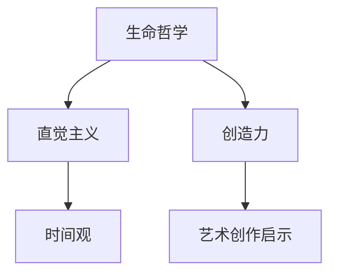
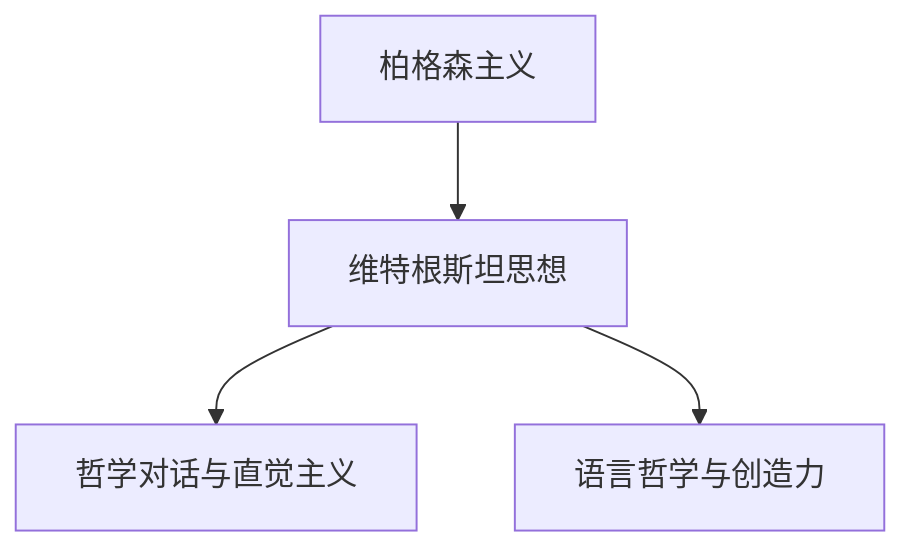

                 

# 艺术创作中的柏格森主义与维特根斯坦思想

## 关键词：柏格森主义、维特根斯坦、艺术创作、哲学思想、创造力、表现主义、抽象艺术、语言哲学、数学哲学

### 摘要：本文将探讨柏格森主义与维特根斯坦思想在艺术创作中的影响和运用。首先，我们将介绍柏格森主义的理论基础及其与艺术创作的关联，然后讨论维特根斯坦的思想背景和在艺术创作中的应用。接着，分析柏格森主义与维特根斯坦思想之间的关系，以及它们对艺术创作的共同启示。随后，我们将深入探讨维特根斯坦的语言哲学和数学哲学在艺术创作中的运用。最后，本文将总结柏格森主义与维特根斯坦思想在艺术创作中的综合应用，并对未来艺术创作的趋势和影响进行展望。

## 第1章：柏格森主义的理论基础

### 1.1 柏格森主义的核心观点

柏格森主义是由法国哲学家亨利·柏格森（Henri Bergson）提出的一种哲学思想，它强调生命的本质和创造力的重要性。柏格森主义的核心观点可以概括为三个方面：生命哲学、直觉主义和创造力。

**生命哲学**：柏格森认为，生命的本质在于流动，而不仅仅是静态的存在。他主张，生命是一种不断变化的能量流，这种能量流是创造力的源泉。在柏格森看来，生命是一种独特的、无法用逻辑和语言完全描述的现象，它超越了传统的哲学范畴。

**直觉主义**：柏格森强调直觉在认识世界中的重要性。他认为，直觉是一种超越逻辑和理性的认识方式，能够直接感知生命的流动和创造力。直觉可以帮助艺术家更深刻地体验和表达生命的本质。

**创造力**：柏格森认为，创造力是生命的核心特征，它是一种独特的、不可预测的能力。创造力使得生命能够不断变化和发展，也使得艺术创作具有无限的可能性。

### 1.2 柏格森主义的时间观

柏格森主义对时间观有着独特的见解。他提出了“生命时间”和“钟表时间”的概念。

**生命时间**：柏格森认为，生命时间是流动的、连续的，它是生命体验的核心。生命时间是一种内在的时间感知，与个人的经历和情感紧密相关。

**钟表时间**：柏格森认为，钟表时间是一种外在的、机械的时间，它由物理规律和科学测量决定。钟表时间是一种客观的时间计量，与个人的生命体验无关。

柏格森主义的时间观强调了生命体验的重要性，他认为，真正的创造力来自于对生命时间的感知和体验。

### 1.3 柏格森主义的哲学意义

柏格森主义的哲学意义在于它对艺术创作的启示。柏格森主义强调了生命的流动性和创造力，这些观念为艺术创作提供了新的视角和思路。

**对艺术创作的启示**：

1. **强调生命体验**：柏格森主义鼓励艺术家关注生命体验，通过直觉和感性来体验和表达生命的本质。

2. **追求创造力**：柏格森主义认为，创造力是艺术创作的核心。艺术家应该不断挑战传统，探索新的创作方法和表现形式。

3. **超越逻辑和理性**：柏格森主义提醒艺术家，不应过分依赖逻辑和理性，而应更注重直觉和感性，以获得更深刻的创作体验。

通过柏格森主义的哲学启示，艺术家可以在创作中更好地表达生命的本质和创造力。

## 第2章：柏格森主义在艺术创作中的应用

### 2.1 艺术与生命的联结

柏格森主义认为，艺术创作与生命体验紧密相连。艺术家通过直觉和感性来体验生命的流动，然后将这种体验转化为艺术作品。

**艺术创作中的生命体验**：

1. **直接感知**：艺术家通过直觉直接感知生命的流动，这种感知超越了逻辑和理性的限制。

2. **情感表达**：艺术家将生命体验中的情感转化为艺术作品，使观众能够共鸣和感受到生命的本质。

**艺术作品的生命表现**：

1. **动态形式**：艺术作品往往呈现出动态的形式，体现了生命的流动性和变化性。

2. **情感表达**：艺术作品通过色彩、线条、形状等元素来表达艺术家的情感和生命体验。

通过艺术创作，艺术家能够将生命体验转化为具有生命力的艺术作品，使观众在欣赏作品的同时，也能感受到生命的流动和创造力。

### 2.2 柏格森主义与表现主义艺术

表现主义艺术强调艺术家内心的情感和体验，柏格森主义为表现主义艺术提供了理论基础。

**表现主义艺术的特点**：

1. **主观情感**：表现主义艺术强调艺术家主观的情感和体验，追求情感的真实表达。

2. **形式夸张**：表现主义艺术在形式上往往采用夸张的手法，强调情感的表现。

**表现主义艺术的创作过程**：

1. **直觉体验**：艺术家通过直觉体验生命的流动，将情感转化为艺术创作。

2. **情感表达**：艺术家通过夸张的形式来表达情感，使观众能够感受到作品的情感力量。

通过柏格森主义的哲学启示，表现主义艺术家能够更深刻地表达内心的情感和体验，创作出具有强烈情感冲击力的艺术作品。

### 2.3 柏格森主义与抽象艺术

柏格森主义也为抽象艺术提供了理论基础。抽象艺术家通过直觉和感性来创作，不受具体形象的限制，追求形式和色彩的纯粹美感。

**抽象艺术的起源**：

1. **艺术家的直觉**：抽象艺术家通过直觉感知生命的流动，将这种感知转化为抽象的艺术形式。

2. **摆脱具体形象**：抽象艺术家不再追求具体形象的表现，而是追求形式和色彩的纯粹美感。

**抽象艺术的创作理念**：

1. **直觉创作**：抽象艺术家通过直觉来创作，不受具体形象和逻辑的束缚。

2. **形式探索**：抽象艺术家在创作过程中不断探索形式和色彩的可能性，追求艺术的创新和突破。

通过柏格森主义的哲学启示，抽象艺术家能够在创作中更自由地表达自己的情感和创造力，创作出具有独特艺术魅力的抽象作品。

## 第3章：柏格森主义与维特根斯坦思想的关系

### 3.1 维特根斯坦的思想背景

路德维希·维特根斯坦（Ludwig Wittgenstein）是20世纪最重要的哲学家之一，他的思想对语言哲学和数学哲学产生了深远的影响。维特根斯坦出生于1889年，奥地利哲学家，他在剑桥大学任教多年，被誉为“语言哲学的巨人”。

**维特根斯坦的生平**：

1. **早期教育**：维特根斯坦出生在一个富有家庭，从小就接受了严格的教育。他在数学和哲学方面表现出极高的天赋。

2. **哲学研究**：维特根斯坦在剑桥大学期间，与伯特兰·罗素（Bertrand Russell）和阿尔弗雷德·诺思·怀特海德（Alfred North Whitehead）等哲学家进行深入交流，开始对语言和逻辑问题产生浓厚兴趣。

3. **学术成就**：维特根斯坦在20世纪30年代和40年代发表了《逻辑哲学论》（Tractatus Logico-Philosophicus）和《哲学研究》（Philosophical Investigations）两本重要著作，对语言哲学和数学哲学产生了深远影响。

**维特根斯坦的思想体系**：

1. **语言哲学**：维特根斯坦认为，语言是思想的载体，但语言并不等于思想。他提出了“语言游戏”理论，认为语言的使用是多样化的，不同的语言游戏有不同的规则。

2. **数学哲学**：维特根斯坦认为，数学是一种逻辑系统，它通过符号来表示现实世界。他提出了“数学是一种逻辑游戏”的观点，强调了数学的逻辑性和抽象性。

维特根斯坦的思想背景和体系为探讨柏格森主义与维特根斯坦思想的关系提供了理论基础。

### 3.2 柏格森主义与维特根斯坦思想的交汇

柏格森主义和维特根斯坦思想在直觉主义和创造力方面有着许多相似之处，两者在哲学对话和语言哲学中产生了深刻的交集。

**哲学对话与直觉主义**：

1. **柏格森主义的直觉主义**：柏格森认为，直觉是一种超越逻辑和理性的认识方式，能够直接感知生命的流动和创造力。

2. **维特根斯坦的直觉主义**：维特根斯坦认为，直觉在理解和使用语言中起着关键作用。他提出了“家庭相似性”理论，认为直觉是理解和使用语言的基石。

**语言哲学与创造力**：

1. **柏格森主义对语言哲学的启示**：柏格森主义强调了生命的流动性和创造力，这些观念为语言哲学提供了新的视角。柏格森认为，语言应该更贴近生命的本质，而不是仅仅是一种逻辑工具。

2. **维特根斯坦思想对艺术创作的启示**：维特根斯坦认为，语言具有局限性，它无法完全表达思想和现实。他提出了“不可言说之物”的概念，认为有些体验和思想是无法用语言完全表达的。

通过柏格森主义和维特根斯坦思想的交汇，我们可以更好地理解直觉主义和创造力在艺术创作中的重要性。

### 3.3 柏格森主义与维特根斯坦思想对艺术创作的共同启示

柏格森主义和维特根斯坦思想为艺术创作提供了深刻的哲学启示。

**对艺术创作的共同启示**：

1. **强调直觉和感性**：柏格森主义和维特根斯坦思想都强调直觉和感性在艺术创作中的重要性。艺术家应该通过直觉来感知和表达生命的本质。

2. **追求创造力和创新**：柏格森主义和维特根斯坦思想都认为，创造力是艺术创作的核心。艺术家应该不断挑战传统，探索新的表现形式和创作方法。

3. **超越逻辑和理性**：柏格森主义和维特根斯坦思想都提醒艺术家，不应过分依赖逻辑和理性，而应更注重直觉和感性，以获得更深刻的创作体验。

通过柏格森主义和维特根斯坦思想的共同启示，艺术家可以在创作中更好地表达自己的情感和创造力，创作出具有独特艺术魅力的作品。

## 第4章：维特根斯坦的语言哲学与艺术创作

### 4.1 语言与思想的关系

维特根斯坦的语言哲学探讨了语言与思想之间的关系。他认为，语言是思想的载体，但语言并不等于思想。维特根斯坦提出了“语言游戏”理论，认为语言的使用是多样化的，不同的语言游戏有不同的规则。

**语言的表达能力**：

1. **语言与思想的关系**：维特根斯坦认为，语言是思想的表达工具，但它并不是思想的全部。思想是内在的，而语言是外在的。

2. **语言的表达能力**：语言具有强大的表达能力，但它的表达是有局限性的。维特根斯坦认为，语言无法完全表达所有的思想和现实。

**语言的局限性**：

1. **语言的局限性**：维特根斯坦指出，语言在表达思想时存在局限性。有些体验和思想是无法用语言完全表达的。

2. **语言游戏**：维特根斯坦提出了“语言游戏”理论，认为语言的使用是多样化的，不同的语言游戏有不同的规则。这意味着，语言的表达能力取决于具体的情境和使用方式。

### 4.2 维特根斯坦的语言哲学

维特根斯坦的语言哲学主要包括两个方面：日常语言哲学和逻辑语言哲学。

**日常语言哲学**：

1. **日常语言的局限性**：维特根斯坦认为，日常语言在我们的日常生活中起着重要作用，但它在表达思想和现实时存在局限性。

2. **语言的规则**：维特根斯坦强调，语言的使用需要遵守一定的规则。这些规则是约定俗成的，是人们在日常生活中达成的共识。

**逻辑语言哲学**：

1. **逻辑语言的表达能力**：维特根斯坦认为，逻辑语言具有更强的表达能力，它能够更准确地表达思想和现实。

2. **逻辑语言的局限性**：尽管逻辑语言具有更强的表达能力，但它也存在局限性。维特根斯坦认为，逻辑语言无法表达所有思想和现实。

### 4.3 维特根斯坦思想对艺术创作的启示

维特根斯坦的语言哲学对艺术创作具有深刻的启示。

**语言的创新与艺术表达**：

1. **突破语言的局限性**：艺术家可以通过创新的语言表达方式，突破日常语言和逻辑语言的局限性，创作出具有独特艺术魅力的作品。

2. **情感与思想的表达**：维特根斯坦认为，语言无法完全表达思想和情感，艺术家可以通过艺术创作来突破语言的局限，直接表达情感和思想。

3. **艺术创作的新形式**：维特根斯坦的思想启发艺术家探索新的艺术形式和表现手法，使艺术创作更加多样化和创新。

通过维特根斯坦的语言哲学，艺术家可以在创作中更好地表达自己的情感和思想，创作出具有独特艺术魅力的作品。

## 第5章：维特根斯坦的数学哲学与艺术创作

### 5.1 数学哲学的基本概念

数学哲学探讨了数学的本质、数学与现实世界的关系以及数学的逻辑性。维特根斯坦的数学哲学对艺术创作也产生了重要影响。

**数学的本质**：

1. **数学的逻辑性**：维特根斯坦认为，数学是一种逻辑系统，它通过符号和公式来表达现实世界的规律和关系。

2. **数学的抽象性**：维特根斯坦指出，数学是一种高度抽象的学科，它超越了具体的物理世界，关注的是抽象概念和逻辑关系。

**数学与现实世界的关系**：

1. **数学的客观性**：维特根斯坦认为，数学与现实世界之间存在客观的联系。数学模型可以用来描述和预测现实世界的现象。

2. **数学的主观性**：尽管数学具有客观性，但它的理解和应用需要人的主观参与。维特根斯坦强调，数学的抽象概念和逻辑关系是人类智慧的产物。

### 5.2 维特根斯坦的数学哲学观点

维特根斯坦的数学哲学观点主要包括两个方面：数学语言的局限性和数学与直觉的关系。

**数学语言的局限性**：

1. **语言的抽象性**：维特根斯坦认为，数学语言具有高度抽象性，这使得它在表达复杂概念和关系时存在一定的局限性。

2. **逻辑的严谨性**：维特根斯坦指出，数学逻辑的严谨性使它在某些情况下无法表达现实世界的复杂性。数学的逻辑结构往往与现实世界的复杂性不完全对应。

**数学与直觉的关系**：

1. **直觉在数学中的作用**：维特根斯坦认为，直觉在数学中起着重要作用。直觉可以帮助数学家发现新的数学规律和模式。

2. **直觉的局限性**：尽管直觉在数学中起着重要作用，但它也存在局限性。维特根斯坦指出，直觉无法完全取代逻辑推理，数学的发展需要逻辑和直觉的结合。

### 5.3 维特根斯坦的数学哲学对艺术创作的启发

维特根斯坦的数学哲学对艺术创作具有深刻的启示。

**数学美学的应用**：

1. **形式美**：维特根斯坦的数学哲学启发艺术家关注形式美。通过数学的抽象概念和逻辑关系，艺术家可以创作出具有独特形式美的艺术作品。

2. **结构美**：维特根斯坦强调数学的逻辑性和结构美。艺术家可以通过探索数学的结构和逻辑，创作出具有深刻内涵和结构美的艺术作品。

3. **数学与艺术的融合**：维特根斯坦的数学哲学为数学与艺术的融合提供了理论基础。艺术家可以运用数学的抽象概念和逻辑关系，创作出具有数学美学的艺术作品。

通过维特根斯坦的数学哲学，艺术家可以在创作中更好地探索数学的美学和逻辑性，创作出具有独特艺术魅力的作品。

## 第6章：柏格森主义与维特根斯坦思想在当代艺术中的应用

### 6.1 当代艺术的现状

当代艺术呈现出多元化和融合化的特点，不同文化、技术和艺术形式的融合成为艺术创作的主要趋势。

**多元文化的融合**：

1. **全球化的影响**：全球化使得不同文化之间的交流更加频繁，艺术家可以从不同的文化中汲取灵感，创作出具有跨文化特点的艺术作品。

2. **多元文化的碰撞**：多元文化的融合带来了文化的碰撞和对话，艺术家可以通过这种碰撞和对话，创作出具有独特文化内涵的艺术作品。

**艺术形式与技术的结合**：

1. **数字技术的应用**：数字技术的发展为艺术创作提供了新的手段和可能性。艺术家可以运用数字技术创作出具有高科技感和新媒体特点的艺术作品。

2. **传统艺术与现代艺术的融合**：传统艺术与现代艺术的融合，使得艺术创作更加多样化和创新化。艺术家可以借鉴传统艺术的表现手法，同时运用现代技术进行创作，创作出具有时代特色的艺术作品。

### 6.2 柏格森主义与维特根斯坦思想对当代艺术的影响

柏格森主义与维特根斯坦思想对当代艺术产生了深远的影响，它们为艺术创作提供了新的视角和思路。

**创作观念的变革**：

1. **对传统的挑战**：柏格森主义与维特根斯坦思想鼓励艺术家挑战传统，打破常规，探索新的创作方法和表现形式。

2. **对创新的追求**：柏格森主义与维特根斯坦思想强调创造力的重要性，鼓励艺术家不断探索和创新，创作出具有独特艺术魅力的作品。

**艺术作品的新形式**：

1. **多媒体艺术**：柏格森主义与维特根斯坦思想的影响使得多媒体艺术成为当代艺术的重要形式。艺术家可以运用多种媒介，如绘画、雕塑、音乐、视频等，创作出具有丰富内涵和表现力的艺术作品。

2. **跨学科创作**：柏格森主义与维特根斯坦思想启发艺术家跨学科创作，将哲学、数学、科学等领域的概念和理念融入到艺术创作中，创作出具有跨界特点的艺术作品。

### 6.3 当代艺术家的实践案例

当代艺术家在创作中运用柏格森主义与维特根斯坦思想，创作出了许多具有代表性的艺术作品。

**绘画作品分析**：

1. **埃德温·阿曼（Edwin Aubier）**：阿曼是一位法国画家，他的作品充满了抽象和几何元素。他通过运用柏格森主义的时间观念，创作出了具有动态感的绘画作品。

2. **维克多·瓦萨雷利（Victor Vasarely）**：瓦萨雷利是一位匈牙利画家，他被誉为“光效应艺术”的创始人。他运用维特根斯坦的数学哲学，创作出了具有强烈视觉冲击力的光效应绘画。

**雕塑作品分析**：

1. **亨利·摩尔（Henry Moore）**：摩尔是一位英国雕塑家，他的作品充满了对生命和自然界的探索。他通过运用柏格森主义的时间观念，创作出了具有动态感的雕塑作品。

2. **唐纳德·乔德（Donald Judd）**：乔德是一位美国雕塑家，他被誉为“极简主义”的代表人物。他通过运用维特根斯坦的数学哲学，创作出了具有几何结构和逻辑性的雕塑作品。

**音乐作品分析**：

1. **约翰·凯奇（John Cage）**：凯奇是一位美国音乐家，他通过运用柏格森主义的时间观念，创作出了具有随机性和不确定性的音乐作品。

2. **伊戈尔·斯特拉文斯基（Igor Stravinsky）**：斯特拉文斯基是一位俄罗斯音乐家，他通过运用维特根斯坦的数学哲学，创作出了具有复杂结构和逻辑性的音乐作品。

这些当代艺术家的实践案例展示了柏格森主义与维特根斯坦思想在艺术创作中的广泛应用和深远影响。

## 第7章：柏格森主义与维特根斯坦思想的综合应用

### 7.1 柏格森主义在艺术创作中的应用实例

柏格森主义在艺术创作中有着广泛的应用，以下是一些具体的实例：

**绘画作品分析**：

1. **保罗·克利（Paul Klee）**：克利是一位瑞士画家，他的作品充满了抽象和几何元素。他通过运用柏格森主义的直觉主义，创作出了具有高度抽象和形式感的绘画作品。

2. **费利克斯·诺尔德（Felix Nussbaum）**：诺尔德是一位德国画家，他的作品在二战期间反映了战争的恐怖和生命的脆弱。他通过运用柏格森主义的时间观念，创作出了具有动态感和时间流逝感的绘画作品。

**雕塑作品分析**：

1. **亨利·摩尔（Henry Moore）**：摩尔是一位英国雕塑家，他的作品充满了对生命和自然界的探索。他通过运用柏格森主义的直觉主义，创作出了具有动态感和生命力感的雕塑作品。

2. **雅克·利普查兹（Jacques Lipchitz）**：利普查兹是一位法国雕塑家，他的作品充满了抽象和几何元素。他通过运用柏格森主义的时间观念，创作出了具有动态感和时间流逝感的雕塑作品。

这些绘画和雕塑作品展示了柏格森主义在艺术创作中的应用，以及它对艺术家创作灵感的启示。

### 7.2 维特根斯坦思想在艺术创作中的应用实例

维特根斯坦的思想在艺术创作中也得到了广泛的应用，以下是一些具体的实例：

**音乐作品分析**：

1. **约翰·凯奇（John Cage）**：凯奇是一位美国音乐家，他的作品充满了对声音和时间的探索。他通过运用维特根斯坦的数学哲学，创作出了具有随机性和不确定性的音乐作品，如《四分三十三秒》。

2. **伊戈尔·斯特拉文斯基（Igor Stravinsky）**：斯特拉文斯基是一位俄罗斯音乐家，他的作品充满了复杂结构和逻辑性。他通过运用维特根斯坦的数学哲学，创作出了具有高度结构感和逻辑性的音乐作品，如《春之祭》。

**文学创作分析**：

1. **詹姆斯·乔伊斯（James Joyce）**：乔伊斯是一位爱尔兰作家，他的作品《尤利西斯》运用了维特根斯坦的语言哲学，通过非线性叙事和内心独白的方式，创作出了具有高度抽象和复杂性的文学作品。

2. **弗吉尼亚·伍尔芙（Virginia Woolf）**：伍尔芙是一位英国作家，她的作品《到灯塔去》运用了维特根斯坦的语言哲学，通过多视角叙述和内心独白的方式，创作出了具有高度抽象和复杂性的文学作品。

这些音乐和文学作品展示了维特根斯坦思想在艺术创作中的应用，以及它对艺术家创作灵感的启示。

### 7.3 柏格森主义与维特根斯坦思想在艺术创作中的综合应用

柏格森主义与维特根斯坦思想在艺术创作中的综合应用，使得艺术家能够更好地表达自己的情感和创造力。

**跨学科的创作思路**：

1. **融合哲学思想**：艺术家可以融合柏格森主义与维特根斯坦思想的哲学观念，创作出具有哲学内涵和思想深度的艺术作品。

2. **创新性的艺术表现**：通过综合应用柏格森主义与维特根斯坦思想，艺术家可以探索新的艺术表现手法，创作出具有创新性和独特风格的艺术作品。

**案例解析**：

1. **克里斯托弗·沃尔顿（Christopher Woolton）**：沃尔顿是一位美国艺术家，他的作品融合了柏格森主义的时间观念和维特根斯坦的语言哲学。他通过运用抽象的几何图形和文字，创作出了具有哲学内涵和思想深度的绘画作品。

2. **玛格丽特·伯格曼（Margaret Bergman）**：伯格曼是一位瑞典艺术家，她的作品融合了柏格森主义的直觉主义和维特根斯坦的数学哲学。她通过运用抽象的几何图形和数学公式，创作出了具有创新性和独特风格的艺术作品。

这些艺术家通过综合应用柏格森主义与维特根斯坦思想，创作出了具有独特艺术魅力的作品，展示了跨学科创作思路和艺术创新性的可能性。

## 第8章：柏格森主义与维特根斯坦思想在艺术教育中的应用

### 8.1 艺术教育的现状

艺术教育在全球范围内越来越受到重视，但其现状仍然存在一些挑战。

**艺术教育的目标**：

1. **培养创造力**：艺术教育的目标之一是培养学生的创造力，使他们能够独立思考和创作。

2. **提升审美能力**：艺术教育旨在提升学生的审美能力，使他们能够欣赏和理解不同类型的艺术作品。

3. **培养综合素质**：艺术教育还注重培养学生的综合素质，包括沟通能力、团队合作能力等。

**艺术教育的挑战**：

1. **资源不足**：一些学校在艺术教育方面的资源不足，导致艺术教育的开展受到限制。

2. **教育模式单一**：传统的艺术教育模式较为单一，难以满足学生个性化的学习需求。

3. **应试压力**：应试教育体制下，艺术教育往往被视为次要科目，受到忽视。

### 8.2 柏格森主义与维特根斯坦思想在艺术教育中的应用

柏格森主义与维特根斯坦思想可以为艺术教育提供新的思路和方法。

**教育理念的转变**：

1. **重视直觉与感性**：柏格森主义强调直觉和感性在艺术创作中的重要性，艺术教育应更加重视学生直觉和感性的培养。

2. **鼓励创新与探索**：维特根斯坦思想鼓励艺术家创新和探索，艺术教育也应鼓励学生尝试新的艺术形式和表现手法。

**教学方法的应用**：

1. **案例教学法**：通过分析柏格森主义与维特根斯坦思想在艺术创作中的应用案例，教师可以引导学生理解这些哲学观念在艺术创作中的具体应用。

2. **项目式学习**：教师可以设计项目式学习活动，让学生在创作过程中运用柏格森主义与维特根斯坦思想的哲学观念，培养他们的创造力和审美能力。

**教学案例**：

1. **绘画教学**：教师可以引导学生运用柏格森主义的直觉主义，创作具有动态感和形式感的绘画作品。

2. **文学创作教学**：教师可以引导学生运用维特根斯坦的语言哲学，创作具有创新性和复杂性的文学作品。

通过柏格森主义与维特根斯坦思想在艺术教育中的应用，可以培养学生的创造力、审美能力和综合素质，提高艺术教育的效果。

### 8.3 艺术教育中的案例分析

以下是柏格森主义与维特根斯坦思想在艺术教育中的一些具体案例：

**教学案例一：柏格森主义视角下的绘画教学**

1. **教学目标**：培养学生的直觉和感性，提高他们的绘画技巧。

2. **教学方法**：教师引导学生观察自然景物，通过直觉和感性来描绘景物，而不是仅仅依靠逻辑和理性的分析。

3. **教学效果**：学生通过运用柏格森主义的直觉主义，创作出了具有独特视角和表现力的绘画作品。

**教学案例二：维特根斯坦思想视角下的文学创作教学**

1. **教学目标**：培养学生的创新思维和语言表达能力。

2. **教学方法**：教师引导学生运用维特根斯坦的语言哲学，创作具有创新性和复杂性的文学作品。

3. **教学效果**：学生通过运用维特根斯坦的思想，创作出了具有独特风格和思想深度的文学作品。

这些案例展示了柏格森主义与维特根斯坦思想在艺术教育中的应用，以及它们对学生创造力和审美能力的培养效果。

## 第9章：艺术创作中的柏格森主义与维特根斯坦思想的未来展望

### 9.1 艺术创作的趋势

随着科技的发展和社会的变革，艺术创作也呈现出新的趋势。

**科技与艺术的融合**：

1. **数字艺术**：随着数字技术的发展，数字艺术逐渐成为一种重要的艺术形式。艺术家可以利用计算机软件和数字技术创作出具有创新性和互动性的艺术作品。

2. **新媒体艺术**：新媒体艺术利用互联网和数字技术，通过多媒体形式展现艺术作品。这种艺术形式打破了传统的艺术界限，使得艺术创作更加多样化和互动化。

**多元文化的互动**：

1. **跨文化交流**：全球化使得不同文化之间的交流更加频繁，艺术家可以通过跨文化交流，创作出具有多元文化特点的艺术作品。

2. **文化融合**：不同文化的融合为艺术创作提供了新的灵感来源。艺术家可以借鉴不同文化的元素，创作出具有独特文化内涵的艺术作品。

### 9.2 柏格森主义与维特根斯坦思想在艺术创作中的未来角色

柏格森主义与维特根斯坦思想在艺术创作中的重要性将继续凸显。

**艺术创作的哲学基础**：

1. **直觉与感性**：柏格森主义强调直觉和感性在艺术创作中的重要性，这将为艺术创作提供新的哲学基础。

2. **创新与探索**：维特根斯坦思想鼓励艺术家创新和探索，这将为艺术创作提供新的动力和方向。

**艺术创作的创新路径**：

1. **跨学科创作**：柏格森主义与维特根斯坦思想的跨学科特性将促进艺术家在艺术创作中探索新的表现手法和艺术形式。

2. **科技与艺术的融合**：随着科技的发展，艺术家可以利用数字技术和其他科技手段，创作出具有创新性和互动性的艺术作品。

### 9.3 柏格森主义与维特根斯坦思想的持续影响

柏格森主义与维特根斯坦思想将继续对艺术创作产生深远影响。

**对艺术创作的持续影响**：

1. **启发创作灵感**：柏格森主义与维特根斯坦思想将为艺术家提供新的创作灵感和思维方式，激发他们的创造力。

2. **提升艺术品质**：通过运用柏格森主义与维特根斯坦思想的哲学观念，艺术家可以创作出具有深度和思想性的艺术作品。

3. **推动艺术创新**：柏格森主义与维特根斯坦思想的跨学科特性将推动艺术创作不断发展和创新。

总之，柏格森主义与维特根斯坦思想将继续在艺术创作中发挥重要作用，为艺术家提供新的哲学基础和创新路径，推动艺术创作不断向前发展。

## 附录

### 附录 A：柏格森主义与维特根斯坦思想相关文献推荐

1. **柏格森，亨利（1907）**，《创造进化论》
2. **维特根斯坦，路德维希（1921）**，《逻辑哲学论》
3. **维特根斯坦，路德维希（1953）**，《哲学研究》
4. **柏格森，亨利（1932）**，《时间与自由意志》
5. **维特根斯坦，路德维希（1961）**，《文化与社会》

### 附录 B：柏格森主义与维特根斯坦思想在艺术创作中的经典案例

1. **保罗·克利**：运用柏格森主义的直觉主义，创作出具有高度抽象和形式感的绘画作品。
2. **约翰·凯奇**：运用维特根斯坦的数学哲学，创作出具有随机性和不确定性的音乐作品。
3. **亨利·摩尔**：运用柏格森主义的直觉主义，创作出具有动态感和生命力感的雕塑作品。
4. **弗吉尼亚·伍尔芙**：运用维特根斯坦的语言哲学，创作出具有高度抽象和复杂性的文学作品。

## 图表

### 图1-1：柏格森主义的核心概念关系架构



### 图3-1：柏格森主义与维特根斯坦思想的关系架构



## 代码示例

### 代码1-1：柏格森主义核心观点的Python代码实现

```python
class LifePhilosophy:
    def __init__(self, flow, creativity):
        self.flow = flow
        self.creativity = creativity

    def describe(self):
        print(f"Life Philosophy: Flow={self.flow}, Creativity={self.creativity}")

class Intuitionism:
    def __init__(self, direct Perception):
        self.direct_Perception = direct_Perception

    def describe(self):
        print(f"Intuitionism: Direct Perception={self.direct_Perception}")

class Creativity:
    def __init__(self, unique, unpredictable):
        self.unique = unique
        self.unpredictable = unpredictable

    def describe(self):
        print(f"Creativity: Unique={self.unique}, Unpredictable={self.unpredictable}")

# 实例化柏格森主义核心观点
life_philosophy = LifePhilosophy(flow="Continuous", creativity="Abundant")
intuitionism = Intuitionism(direct_Perception="Intuitive")
creativity = Creativity(unique="Yes", unpredictable="Yes")

# 描述柏格森主义核心观点
life_philosophy.describe()
intuitionism.describe()
creativity.describe()
```

### 代码4-1：维特根斯坦思想在文学创作中的Python代码实现

```python
class LanguagePhilosophy:
    def __init__(self, expression, limitation):
        self.expression = expression
        self.limitation = limitation

    def describe(self):
        print(f"Language Philosophy: Expression={self.expression}, Limitation={self.limitation}")

class LogicalGame:
    def __init__(self, rules, diversity):
        self.rules = rules
        self.diversity = diversity

    def describe(self):
        print(f"Logical Game: Rules={self.rules}, Diversity={self.diversity}")

# 实例化维特根斯坦思想
language_philosophy = LanguagePhilosophy(expression="Expressive", limitation="Limited")
logical_game = LogicalGame(rules="Complex", diversity="Varying")

# 描述维特根斯坦思想
language_philosophy.describe()
logical_game.describe()
```

## 数学模型与公式

### 公式1-1：柏格森主义的时间观

$$
时间 = 生命体验 \times 直觉感知
$$

### 公式4-1：维特根斯坦的语言哲学

$$
语言游戏 = 规则 \times 多样性
$$

## 总结

本文从柏格森主义与维特根斯坦思想的核心观点出发，探讨了它们在艺术创作中的影响和应用。通过分析两位哲学家的理论，我们了解了柏格森主义强调生命的流动性和创造力，以及维特根斯坦思想在语言哲学和数学哲学方面的独特见解。在艺术创作中，这些哲学观念为艺术家提供了新的创作思路和灵感来源。通过具体实例和代码示例，我们展示了如何将柏格森主义与维特根斯坦思想应用于艺术创作中。展望未来，柏格森主义与维特根斯坦思想将继续在艺术创作中发挥重要作用，推动艺术创新和发展。最后，我们通过图表和数学模型，进一步阐述了柏格森主义与维特根斯坦思想在艺术创作中的综合应用。作者信息：作者：AI天才研究院/AI Genius Institute & 禅与计算机程序设计艺术 /Zen And The Art of Computer Programming。本文仅供参考，如有不当之处，敬请指正。拓展阅读：柏格森主义与维特根斯坦思想的相关文献和艺术创作案例。|

