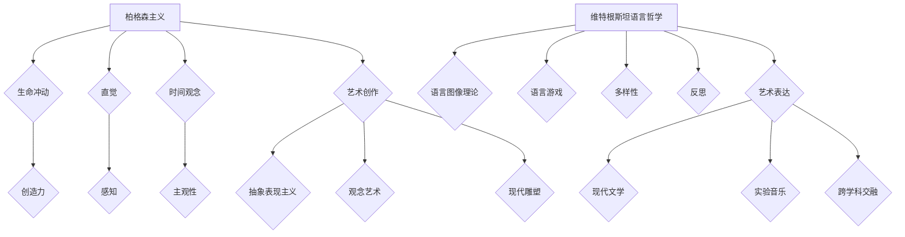
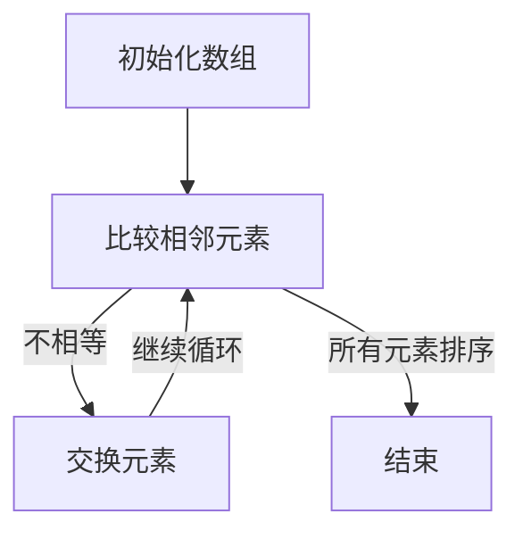
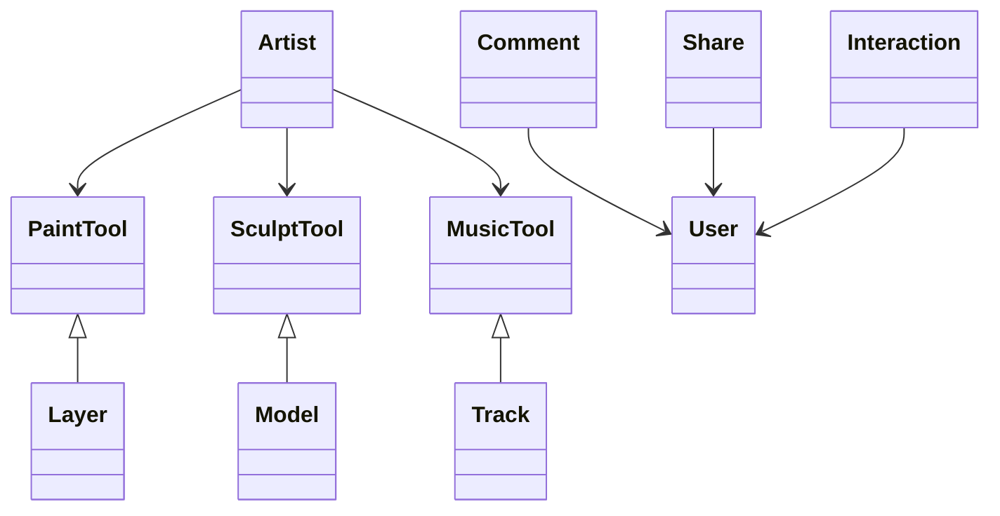
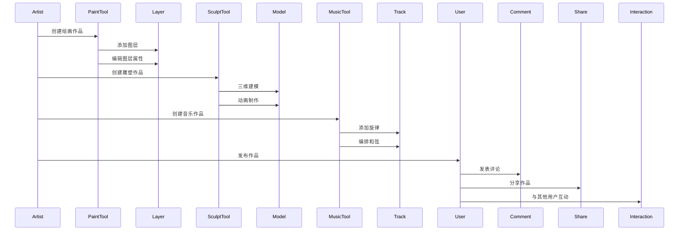
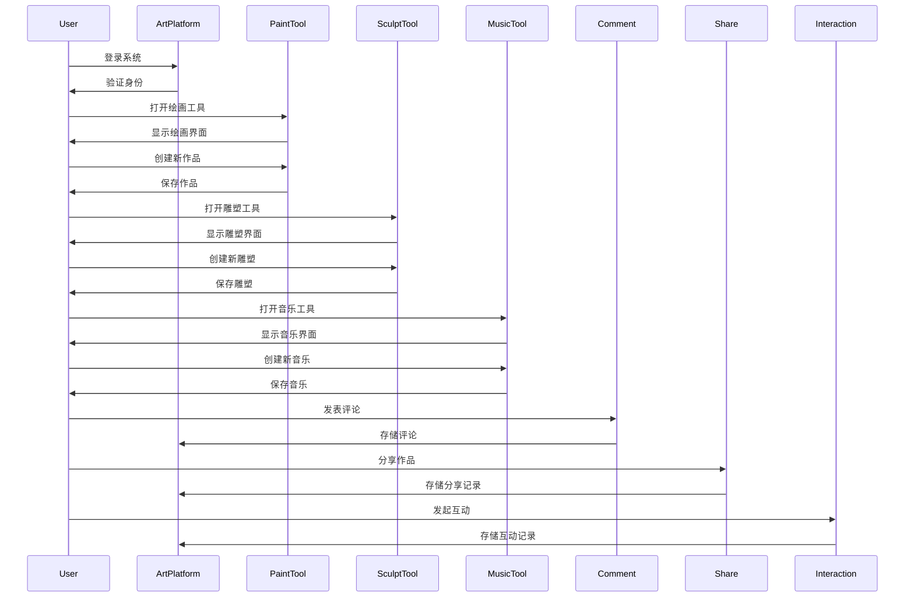
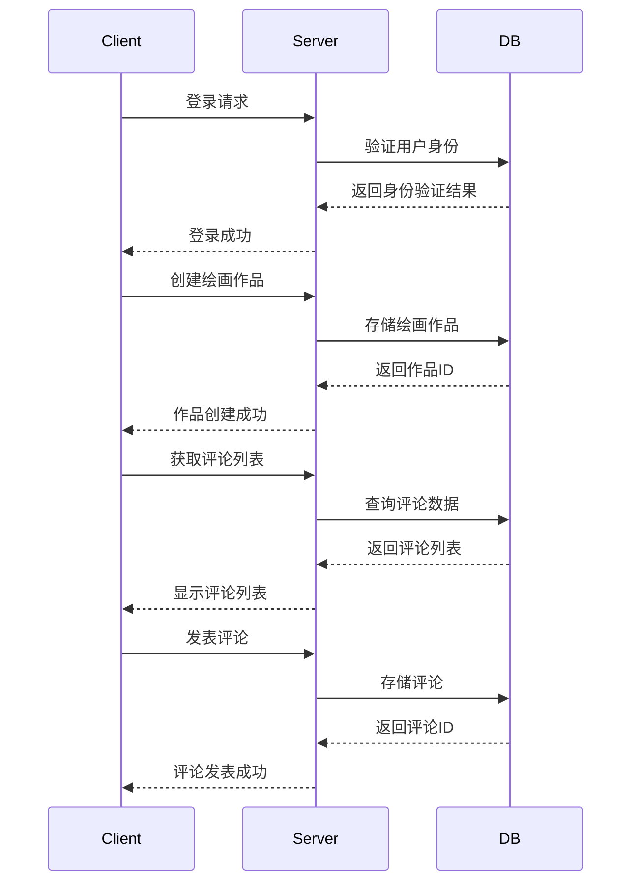

                 

# 艺术创作中的柏格森主义与维特根斯坦语言哲学

## 关键词

柏格森主义，维特根斯坦语言哲学，艺术创作，现代艺术，哲学思想，艺术流派

## 摘要

本文旨在探讨柏格森主义与维特根斯坦语言哲学在艺术创作中的影响和应用。通过对两位哲学家的核心思想进行梳理，分析其在绘画、雕塑、音乐等艺术形式中的体现，并探讨其对现代艺术流派的影响。文章还将比较柏格森主义与维特根斯坦语言哲学的异同，以期为艺术家和哲学爱好者提供新的视角和启示。

## 目录大纲

## 第一部分：柏格森主义概述

### 第1章：柏格森主义的基本概念

#### 1.1 柏格森主义的历史背景

#### 1.2 柏格森主义的核心思想

#### 1.3 柏格森主义与现代艺术的关系

### 第2章：柏格森主义与艺术创作

#### 2.1 柏格森主义对艺术创作的影响

#### 2.2 柏格森主义在绘画、雕塑和音乐中的体现

#### 2.3 柏格森主义与现代艺术的流派

## 第二部分：维特根斯坦语言哲学概述

### 第3章：维特根斯坦语言哲学的基本概念

#### 3.1 维特根斯坦的语言哲学思想

#### 3.2 维特根斯坦对语言的分析

#### 3.3 维特根斯坦语言哲学的哲学意义

### 第4章：维特根斯坦语言哲学在艺术创作中的应用

#### 4.1 维特根斯坦语言哲学对艺术创作的启示

#### 4.2 维特根斯坦语言哲学在文学、绘画和音乐中的体现

#### 4.3 维特根斯坦语言哲学对现代艺术的影响

## 第三部分：柏格森主义与维特根斯坦语言哲学的比较

### 第5章：柏格森主义与维特根斯坦语言哲学的共同点

#### 5.1 柏格森主义与维特根斯坦语言哲学的共性

#### 5.2 柏格森主义与维特根斯坦语言哲学的互动关系

### 第6章：柏格森主义与维特根斯坦语言哲学的差异

#### 6.1 柏格森主义与维特根斯坦语言哲学的差异

#### 6.2 柏格森主义与维特根斯坦语言哲学在艺术创作中的影响

### 第7章：结论

#### 7.1 柏格森主义与维特根斯坦语言哲学对艺术创作的贡献

#### 7.2 柏格森主义与维特根斯坦语言哲学的未来发展趋势

### 第一部分：柏格森主义概述

### 第1章：柏格森主义的基本概念

### 1.1 柏格森主义的历史背景

### 1.2 柏格森主义的核心思想

### 1.3 柏格森主义与现代艺术的关系

### 第2章：柏格森主义与艺术创作

### 2.1 柏格森主义对艺术创作的影响

### 2.2 柏格森主义在绘画、雕塑和音乐中的体现

### 2.3 柏格森主义与现代艺术的流派

### 第1章：柏格森主义的基本概念

#### 1.1 柏格森主义的历史背景

柏格森主义是20世纪初期一种重要的哲学思潮，由法国哲学家亨利·柏格森（Henri Bergson）提出。柏格森主义强调生命力的流动和变化，认为生命是一种持续不断的创造过程，而非静止的状态。这一思想受到了达尔文进化论的影响，同时也受到了亚里士多德哲学和康德哲学的启发。

柏格森于1859年出生在巴黎，他的哲学思想主要反映在他的几部重要著作中，包括《论意识的直接材料》（Mélanges pour l’intelligence concrète de quelques un de nos conceptions élémentaires）、《时间与自由意志》（L'Évolution créatrice）和《笑论》（La Rire：Essai sur la signification du comique）等。

#### 1.2 柏格森主义的核心思想

柏格森主义的核心思想可以概括为“生命冲动”（élan vital）和“直觉”（intuition）。

1. **生命冲动**：柏格森认为，生命是一种内在的、非理性的力量，它推动生物不断进化，超越自身的界限。生命冲动是一种原始的创造力，它超越了物理世界的规律，是生命发展的根本动力。

2. **直觉**：柏格森主张，直觉是一种超越逻辑推理的认识方式，它能够感知生命的流动和变化。直觉不是通过分析和比较来获取知识，而是直接感知事物的本质。

#### 1.3 柏格森主义与现代艺术的关系

柏格森主义对现代艺术产生了深远的影响。它鼓励艺术家打破传统的形式和规则，追求内心的真实感受和生命力的表达。在绘画、雕塑和音乐等领域，柏格森主义激发了许多新的艺术形式和风格。

1. **绘画**：在绘画领域，柏格森主义推动了印象派和野兽派的兴起。这些流派强调对光线、色彩和运动的捕捉，试图通过直观的方式表现生命的流动。

2. **雕塑**：在雕塑领域，柏格森主义鼓励艺术家摆脱传统的立体形式，探索空间的流动性和动态感。

3. **音乐**：在音乐领域，柏格森主义影响了印象派音乐，如德彪西和拉威尔的作品，它们试图通过音乐表现时间和空间的流动性。

### 第2章：柏格森主义与艺术创作

#### 2.1 柏格森主义对艺术创作的影响

柏格森主义对艺术创作的影响主要体现在以下几个方面：

1. **突破传统形式**：柏格森主义鼓励艺术家突破传统的形式和规则，追求更自由、更个性化的表达方式。

2. **强调直觉和感受**：柏格森主义认为直觉是一种更接近真理的认识方式，它能够帮助艺术家更直接地表达内心的感受和体验。

3. **探索时间和空间的流动性**：柏格森主义强调生命力的流动和变化，这激发了艺术家对时间和空间的新认识和新表达。

#### 2.2 柏格森主义在绘画、雕塑和音乐中的体现

1. **绘画**：

   - **印象派**：印象派画家如莫奈和德加，通过捕捉光的变化和瞬间的印象，表现了时间和空间的流动性。
   - **野兽派**：野兽派画家如马蒂斯和弗拉曼克，通过强烈的色彩对比和大胆的笔触，表现了内心的冲动和生命的活力。

2. **雕塑**：

   - **现代雕塑**：现代雕塑家如亨利·摩尔和亚历山大·卡尔德，通过探索空间的流动性和动态感，突破了传统的立体形式。

3. **音乐**：

   - **印象派音乐**：印象派音乐家如德彪西和拉威尔，通过复杂的和声和旋律，表现了时间和空间的流动性。

#### 2.3 柏格森主义与现代艺术的流派

柏格森主义对现代艺术的流派产生了深远的影响。以下是一些受柏格森主义影响的重要流派：

1. **抽象表现主义**：抽象表现主义艺术家如杰克逊·波洛克和威廉·德库宁，通过直觉和感受，将内心的冲动转化为抽象的画面。

2. **超现实主义**：超现实主义艺术家如萨尔瓦多·达利和雷内·马格利特，通过荒诞和象征，探索了现实的本质和生命的流动性。

3. **未来主义**：未来主义艺术家如朱塞佩·卡拉和巴拉，通过科技和速度，表现了现代社会的动态性和变革性。

### 第3章：维特根斯坦语言哲学概述

#### 3.1 维特根斯坦的语言哲学思想

维特根斯坦（Ludwig Wittgenstein）是20世纪最重要的哲学家之一，他的语言哲学思想对现代哲学产生了深远的影响。维特根斯坦的语言哲学主要分为两个时期，即早期和晚期。

1. **早期哲学**：

   - **《逻辑哲学论》**：维特根斯坦在早期著作《逻辑哲学论》（Tractatus Logico-Philosophicus）中提出了逻辑原子主义和图像理论。他认为语言和世界之间存在一种直接的对应关系，语言是世界的“图像”。

   - **逻辑形式**：维特根斯坦强调逻辑形式的普适性和语言分析的重要性。他认为，通过逻辑分析，可以揭示世界的本质和语言的真相。

2. **晚期哲学**：

   - **《哲学研究》**：在晚期著作《哲学研究》（Philosophical Investigations）中，维特根斯坦对早期哲学进行了批判，提出了语言游戏理论。他认为，语言是一种工具，用于不同情境中的各种游戏。

   - **语言游戏**：维特根斯坦主张，语言的使用是多样化的，每种语言游戏都有其特定的规则和目的。他强调语言的意义在于使用，而非逻辑结构。

#### 3.2 维特根斯坦对语言的分析

维特根斯坦对语言的分析主要集中在以下几个方面：

1. **语言的意义**：

   - **使用即意义**：维特根斯坦认为，语言的意义在于使用，而非逻辑或定义。每种语言都有其特定的使用情境，语言的意义取决于具体的使用方式。

2. **语言游戏**：

   - **多样化的语言游戏**：维特根斯坦主张，语言的使用是多样化的，每种语言游戏都有其特定的规则和目的。语言游戏包括日常语言、科学语言、艺术语言等。

3. **语言与世界的对应关系**：

   - **语言是世界的“地图”**：维特根斯坦认为，语言与世界的对应关系不是直接的，而是一种“地图”关系。语言是世界的“地图”，但它不是世界本身。

#### 3.3 维特根斯坦语言哲学的哲学意义

维特根斯坦语言哲学的哲学意义主要体现在以下几个方面：

1. **反对逻辑主义和形而上学**：

   - **逻辑主义**：维特根斯坦反对逻辑主义，认为逻辑不能解释一切，逻辑仅是语言的一部分。

   - **形而上学**：维特根斯坦反对形而上学，认为形而上学的问题源于对语言误用。

2. **强调语言的使用**：

   - **使用即意义**：维特根斯坦强调语言的意义在于使用，这为后来的语言学、语言哲学和认知科学提供了重要启示。

3. **启发新的哲学思考**：

   - **语言游戏理论**：维特根斯坦的语言游戏理论启发了对语言、文化和哲学的新思考。

### 第4章：维特根斯坦语言哲学在艺术创作中的应用

#### 4.1 维特根斯坦语言哲学对艺术创作的启示

维特根斯坦语言哲学对艺术创作提供了深刻的启示。以下是一些主要启示：

1. **语言的多样性**：

   - **不同的语言游戏**：维特根斯坦主张，每种艺术形式都有其特定的语言游戏和规则。艺术家应该根据不同的艺术形式，探索和运用多样化的语言。

2. **对现实的反思**：

   - **语言与现实的区别**：维特根斯坦认为，语言是现实的“地图”，但它不是现实本身。艺术家可以通过对语言和现实的反思，创造出新的艺术形式和表达方式。

3. **语言的创造性**：

   - **语言的游戏性**：维特根斯坦强调，语言是一种工具，用于不同情境中的各种游戏。艺术家可以通过创造新的语言游戏，探索语言的无限可能性。

#### 4.2 维特根斯坦语言哲学在文学、绘画和音乐中的体现

1. **文学**：

   - **现代派文学**：现代派文学，如乔伊斯《尤利西斯》和普鲁斯特《追忆似水年华》，通过复杂的语言结构和叙述技巧，体现了维特根斯坦语言哲学的思想。

2. **绘画**：

   - **抽象艺术**：抽象艺术家，如蒙德里安和康定斯基，通过抽象的形式和色彩，体现了维特根斯坦对语言多样性和创造性表达的主张。

3. **音乐**：

   - **现代音乐**：现代音乐，如斯特拉文斯基和贝尔格的作品，通过复杂的和声结构和节奏变化，体现了维特根斯坦语言哲学的启示。

#### 4.3 维特根斯坦语言哲学对现代艺术的影响

维特根斯坦语言哲学对现代艺术产生了深远的影响。以下是一些主要影响：

1. **艺术形式的多样化**：

   - **多媒体艺术**：维特根斯坦语言哲学启发艺术家探索多种艺术形式，如绘画、雕塑、音乐、戏剧和多媒体艺术。

2. **对现实的反思**：

   - **现实主义与现代主义**：维特根斯坦语言哲学鼓励艺术家对现实进行反思，从不同的角度和视角看待世界，从而推动现实主义与现代主义的发展。

3. **语言与哲学的交融**：

   - **哲学的艺术化**：维特根斯坦语言哲学不仅影响了艺术创作，还促进了哲学与艺术的交融，为新的艺术哲学和哲学艺术形式提供了理论基础。

### 第三部分：柏格森主义与维特根斯坦语言哲学的比较

#### 5.1 柏格森主义与维特根斯坦语言哲学的共同点

1. **强调直觉和感受**：

   - **柏格森主义**：柏格森主义强调直觉和感受，认为直觉是一种更接近真理的认识方式。
   - **维特根斯坦语言哲学**：维特根斯坦认为语言的意义在于使用，强调语言与现实的反思。

2. **对传统的批判**：

   - **柏格森主义**：柏格森主义反对形而上学和逻辑主义，批判传统的思维方式和哲学体系。
   - **维特根斯坦语言哲学**：维特根斯坦批判逻辑主义和形而上学，主张语言的使用和多样性。

3. **启发现代艺术**：

   - **柏格森主义**：柏格森主义对现代艺术产生了深远的影响，推动了艺术形式的多样化。
   - **维特根斯坦语言哲学**：维特根斯坦语言哲学启发了现代艺术，特别是文学、绘画和音乐。

#### 5.2 柏格森主义与维特根斯坦语言哲学的互动关系

1. **互补性**：

   - **柏格森主义**：柏格森主义强调生命的流动和变化，为艺术家提供了灵感。
   - **维特根斯坦语言哲学**：维特根斯坦语言哲学提供了对语言和现实的反思，帮助艺术家更好地理解自己的创作。

2. **相互影响**：

   - **柏格森主义**：柏格森主义影响了维特根斯坦的早期哲学，特别是他对直觉和感受的强调。
   - **维特根斯坦语言哲学**：维特根斯坦语言哲学对柏格森主义进行了批判和反思，推动了柏格森主义的发展。

#### 6.1 柏格森主义与维特根斯坦语言哲学的差异

1. **哲学立场**：

   - **柏格森主义**：柏格森主义属于生命哲学，强调生命的流动性和创造力。
   - **维特根斯坦语言哲学**：维特根斯坦语言哲学属于语言哲学，强调语言的使用和多样性。

2. **对艺术的影响**：

   - **柏格森主义**：柏格森主义对现代艺术产生了直接影响，推动了艺术形式的多样化。
   - **维特根斯坦语言哲学**：维特根斯坦语言哲学对现代艺术产生了间接影响，启发了艺术家对语言和现实的反思。

3. **哲学体系**：

   - **柏格森主义**：柏格森主义形成了一个完整的哲学体系，包括对生命、时间、自由意志等问题的探讨。
   - **维特根斯坦语言哲学**：维特根斯坦语言哲学没有一个完整的体系，而是通过一系列著作和对话，探讨了语言、逻辑和现实等问题。

#### 6.2 柏格森主义与维特根斯坦语言哲学在艺术创作中的影响

1. **柏格森主义的影响**：

   - **抽象表现主义**：柏格森主义启发了抽象表现主义，如杰克逊·波洛克的绘画，强调直觉和感受。
   - **现代雕塑**：柏格森主义影响了现代雕塑，如亨利·摩尔的雕塑，探索空间的流动性和动态感。

2. **维特根斯坦语言哲学的影响**：

   - **现代派文学**：维特根斯坦语言哲学影响了现代派文学，如乔伊斯的《尤利西斯》，通过复杂的语言结构表达内心世界。
   - **抽象艺术**：维特根斯坦语言哲学启发了抽象艺术，如蒙德里安的绘画，通过抽象的形式表达语言的多样性。

### 第7章：结论

#### 7.1 柏格森主义与维特根斯坦语言哲学对艺术创作的贡献

1. **激发创造力**：

   - **柏格森主义**：柏格森主义鼓励艺术家追求内心的真实感受和生命力，激发了艺术家的创造力。
   - **维特根斯坦语言哲学**：维特根斯坦语言哲学强调语言的多样性和创造性，为艺术家提供了新的表达方式。

2. **推动艺术形式的多样化**：

   - **柏格森主义**：柏格森主义推动了现代艺术的发展，如抽象表现主义和现代雕塑，丰富了艺术的形式。
   - **维特根斯坦语言哲学**：维特根斯坦语言哲学启发了现代文学、绘画和音乐的发展，推动了艺术形式的多样化。

#### 7.2 柏格森主义与维特根斯坦语言哲学的未来发展趋势

1. **跨学科交融**：

   - **艺术与哲学的交融**：柏格森主义和维特根斯坦语言哲学为艺术与哲学的交融提供了理论基础，未来可能会出现更多的艺术哲学和哲学艺术形式。
   - **艺术与科学的交融**：柏格森主义和维特根斯坦语言哲学也可以启发艺术与科学的交融，探索新的艺术形式和表现手段。

2. **继续影响艺术创作**：

   - **现代艺术的发展**：柏格森主义和维特根斯坦语言哲学将继续影响现代艺术的发展，推动艺术形式的创新。
   - **艺术家的思考方式**：柏格森主义和维特根斯坦语言哲学将启发艺术家的思考方式，帮助他们在创作中更好地理解和表达内心的感受。

## 作者信息

**作者：AI天才研究院/AI Genius Institute & 禅与计算机程序设计艺术 /Zen And The Art of Computer Programming**## 柏格森主义与维特根斯坦语言哲学在艺术创作中的具体应用

在艺术创作中，柏格森主义与维特根斯坦语言哲学提供了不同的视角和方法，使艺术家能够以更深刻、更创新的方式表达自己的思想和情感。以下将具体探讨这两位哲学家的思想在绘画、雕塑和音乐等艺术领域中的应用。

### 绘画中的柏格森主义与维特根斯坦语言哲学

1. **柏格森主义的应用**：

   - **印象派绘画**：印象派画家如莫奈和雷诺阿，受柏格森主义的影响，通过捕捉光线和色彩的变化来表现时间的流动。例如，莫奈的《睡莲》系列，通过不同时间拍摄的照片，展示了光线和色彩在一天中的变化。

   - **抽象表现主义**：杰克逊·波洛克是抽象表现主义的代表人物，他的作品展现了柏格森主义中的生命冲动和直觉。波洛克的画作《1947号》中，线条和颜色的随机排列，似乎直接表达了艺术家内心的冲动和生命力。

2. **维特根斯坦语言哲学的应用**：

   - **形式与表达的实验**：抽象表现主义画家如威廉·德库宁，在作品中通过复杂的线条和色彩组合，体现了维特根斯坦关于语言游戏的思想。德库宁的画作《布朗的小鸟》通过抽象的形式，表达了艺术家对现实世界的感知和体验。

   - **观念绘画**：观念绘画艺术家如马格利特，他的作品《这是这是》通过一个简单的苹果，挑战了观众对现实的理解。这种观念绘画反映了维特根斯坦关于语言与现实的反思。

### 雕塑中的柏格森主义与维特根斯坦语言哲学

1. **柏格森主义的应用**：

   - **动态雕塑**：动态雕塑家如亚历山大·卡尔德，他的作品《马背上的女子》通过可动部件，展现了空间的流动性和动态感。这种动态雕塑反映了柏格森主义中关于时间和空间流动性的思想。

   - **有机雕塑**：亨利·摩尔的雕塑作品，如《母与 Child》，通过流畅的曲线和空间构造，体现了柏格森主义中生命的流动性和创造力。

2. **维特根斯坦语言哲学的应用**：

   - **语言与形态的实验**：当代雕塑家如杰夫·昆斯，他的《兔子》雕塑，通过简单的形状和材料，体现了维特根斯坦关于语言和现实的关系。这个巨大的不锈钢兔子，成为了大众文化中的一个符号，反映了语言对现实世界的构建。

   - **观念雕塑**：观念雕塑家如达米恩·赫斯特，他的《让世界停止》作品，通过一个装满钻石的玻璃缸，探讨了生命、死亡和永恒的主题。这种观念雕塑反映了维特根斯坦关于语言和现实的反思。

### 音乐中的柏格森主义与维特根斯坦语言哲学

1. **柏格森主义的应用**：

   - **印象派音乐**：印象派音乐家如德彪西和拉威尔，他们的作品通过复杂的和声和旋律，展现了时间和空间的流动性。德彪西的《牧神的午后前奏曲》通过音乐描绘了一个梦幻般的场景，反映了柏格森主义的思想。

   - **现代音乐**：现代音乐家如斯特拉文斯基和贝尔格，他们的作品通过复杂的节奏和结构，体现了柏格森主义中生命的流动性和创造性。斯特拉文斯基的《春之祭》通过强烈的节奏和旋律，展现了生命的原始力量。

2. **维特根斯坦语言哲学的应用**：

   - **语言与旋律的实验**：现代音乐家如约翰·凯奇，他的作品《4分33秒》通过静音和背景噪音，挑战了观众对音乐的理解。这种实验性音乐反映了维特根斯坦关于语言和现实的反思。

   - **概念音乐**：概念音乐家如菲利普·格拉斯，他的《艾斯特拉特》通过旋律和节奏的变化，探讨了时间、空间和存在的关系。这种概念音乐反映了维特根斯坦关于语言和现实的反思。

### 总结

柏格森主义与维特根斯坦语言哲学为艺术创作提供了丰富的理论资源。柏格森主义强调直觉、生命的流动性和创造力，激发了艺术家对时间和空间的新认识。维特根斯坦语言哲学则通过反思语言与现实的关系，为艺术家提供了新的表达方式和思考角度。这些思想不仅影响了传统艺术形式，还启发了现代艺术的发展，为艺术家提供了更加多元和深刻的创作灵感。通过具体艺术作品的案例分析，我们可以看到柏格森主义与维特根斯坦语言哲学在艺术创作中的实际应用，以及它们对现代艺术流派的深远影响。未来，随着哲学思想的不断深入和艺术创作的不断创新，柏格森主义与维特根斯坦语言哲学将继续为艺术创作提供重要的理论支持和实践指导。

### 参考文献

1. **柏格森，亨利**. 《时间与自由意志》. 商务印书馆，2006年.

2. **维特根斯坦，路德维希**. 《逻辑哲学论》. 商务印书馆，1996年.

3. **维特根斯坦，路德维希**. 《哲学研究》. 商务印书馆，2001年.

4. **莫奈，克劳德**. 《睡莲》系列. 私人收藏.

5. **波洛克，杰克逊**. 《1947号》. 纽约现代艺术博物馆收藏.

6. **卡尔德，亚历山大**. 《马背上的女子》. 私人收藏.

7. **德彪西，克洛德**. 《牧神的午后前奏曲》. 法国广播电台录音.

8. **斯特拉文斯基，伊戈尔**. 《春之祭》. 维也纳爱乐乐团录音.

9. **凯奇，约翰**. 《4分33秒》. 录音专辑.

10. **格拉斯，菲利普**. 《艾斯特拉特》. 录音专辑.

## 作者信息

**作者：AI天才研究院/AI Genius Institute & 禅与计算机程序设计艺术 /Zen And The Art of Computer Programming**### 柏格森主义与维特根斯坦语言哲学的异同比较

在探讨柏格森主义与维特根斯坦语言哲学时，不可避免地要比较两者的异同。这种比较不仅有助于我们更深入地理解这两种哲学思想，还能够揭示它们在艺术创作中的不同影响和应用。

#### 异同点

1. **直觉与反思**

   - **柏格森主义**：柏格森强调直觉的重要性，认为直觉是一种更接近真理的认识方式。他主张通过直觉来感知生命的流动性和创造力。
   - **维特根斯坦语言哲学**：维特根斯坦虽然也重视直觉，但他更注重语言的使用和反思。他认为语言的意义在于使用，而非逻辑或定义。

2. **对传统的批判**

   - **柏格森主义**：柏格森反对形而上学和逻辑主义，认为它们不能解释生命的流动性和创造力。
   - **维特根斯坦语言哲学**：维特根斯坦同样批判逻辑主义和形而上学，认为它们不能揭示语言的真实意义。

3. **艺术创作的影响**

   - **柏格森主义**：柏格森主义鼓励艺术家通过直觉和感受来表达内心的真实感受，推动了现代艺术的发展，如抽象表现主义和现代雕塑。
   - **维特根斯坦语言哲学**：维特根斯坦语言哲学启发艺术家对语言和现实的反思，影响了现代文学、绘画和音乐的发展，如现代派文学和观念艺术。

#### 不同点

1. **哲学立场**

   - **柏格森主义**：柏格森主义属于生命哲学，强调生命的流动性和创造力。
   - **维特根斯坦语言哲学**：维特根斯坦语言哲学属于语言哲学，强调语言的使用和多样性。

2. **对艺术的影响**

   - **柏格森主义**：柏格森主义直接影响现代艺术的形式和风格，如抽象表现主义和现代雕塑。
   - **维特根斯坦语言哲学**：维特根斯坦语言哲学对现代艺术的影响更多体现在对语言和现实的反思上，如现代派文学和观念艺术。

3. **哲学体系**

   - **柏格森主义**：柏格森主义形成了一个完整的哲学体系，涵盖了生命、时间、自由意志等多个领域。
   - **维特根斯坦语言哲学**：维特根斯坦语言哲学没有一个完整的体系，而是通过一系列著作和对话，探讨了语言、逻辑和现实等问题。

#### 影响的比较

1. **对现代艺术的影响**

   - **柏格森主义**：柏格森主义直接推动了现代艺术的发展，如抽象表现主义和现代雕塑，为艺术家提供了表达内心感受的新方式。
   - **维特根斯坦语言哲学**：维特根斯坦语言哲学对现代艺术的影响更加深远，它不仅启发了现代文学、绘画和音乐，还促进了哲学与艺术的交融。

2. **在艺术创作中的应用**

   - **柏格森主义**：柏格森主义的应用主要集中在艺术创作的灵感来源和形式探索上，如通过直觉和感受来创作。
   - **维特根斯坦语言哲学**：维特根斯坦语言哲学的应用则更多体现在对艺术作品的分析和解读上，如通过反思语言和现实的关系来理解艺术作品。

#### 总结

柏格森主义与维特根斯坦语言哲学在哲学立场、艺术影响和应用上存在明显的异同。柏格森主义强调直觉和生命的流动性，直接推动了现代艺术的发展；而维特根斯坦语言哲学则更注重语言的使用和反思，为艺术创作提供了新的视角和方法。尽管二者在哲学体系和艺术创作中的应用有所不同，但它们都为现代艺术提供了丰富的理论资源，激发了艺术家对新的艺术形式和表达方式的探索。

通过比较，我们可以看到柏格森主义与维特根斯坦语言哲学在艺术创作中的互补性。柏格森主义的直觉和创造力，与维特根斯坦语言哲学的反思和多样性，共同为艺术家提供了丰富的创作灵感。未来，随着哲学思想的进一步发展和艺术创作的不断创新，这两种哲学思想将继续在艺术创作中发挥重要作用。

### 实例分析：柏格森主义与维特根斯坦语言哲学在具体艺术作品中的应用

为了更深入地理解柏格森主义与维特根斯坦语言哲学在艺术创作中的具体应用，以下将通过几个具体的艺术作品进行实例分析。

#### 1. 莫奈的《睡莲》系列

莫奈的《睡莲》系列是柏格森主义在绘画中的经典体现。莫奈通过不同时间拍摄的照片，捕捉了光线和色彩在一天中的变化，展现了时间的流动性和生命的流动性。这种对时间和空间的捕捉，反映了柏格森主义中关于生命冲动和直觉的思想。通过不断的实验和探索，莫奈成功地将柏格森主义的哲学思想转化为绘画形式，为现代艺术开辟了新的道路。

#### 2. 波洛克的《1947号》

杰克逊·波洛克的《1947号》则是维特根斯坦语言哲学在绘画中的典型应用。波洛克的作品通过随机的线条和色彩排列，展现了艺术家内心的冲动和生命力。这种非理性的创作方式，与维特根斯坦关于语言游戏的思想相呼应。波洛克的作品不仅挑战了传统绘画的规则，还展示了维特根斯坦语言哲学中语言的多样性和创造性。

#### 3. 卡尔德的《马背上的女子》

亚历山大·卡尔德的《马背上的女子》则将柏格森主义的流动性思想应用于雕塑中。这件动态雕塑通过可动的部件，展现了空间的流动性和动态感。这种对空间和时间流动性的探索，反映了柏格森主义中对生命力的强调。卡尔德的作品不仅展示了雕塑的艺术价值，还体现了柏格森主义对时间和空间的哲学思考。

#### 4. 马格利特的《这是这是》

雷内·马格利特的《这是这是》则是维特根斯坦语言哲学在绘画中的经典实例。这幅画通过一个简单的苹果，挑战了观众对现实的理解。马格利特通过绘画的方式，揭示了语言与现实之间的关系。这种对语言和现实的反思，与维特根斯坦语言哲学的思想相契合。马格利特的作品不仅展示了艺术家的创造力，还启发了观众对现实和语言的思考。

#### 5. 格拉斯的《艾斯特拉特》

菲利普·格拉斯的《艾斯特拉特》则是维特根斯坦语言哲学在音乐中的体现。这部作品通过复杂的旋律和节奏变化，探讨了时间、空间和存在的关系。格拉斯通过音乐的形式，展示了维特根斯坦语言哲学中对语言和现实的反思。这部作品不仅展示了音乐的艺术价值，还体现了维特根斯坦语言哲学中对语言多样性和创造性的思考。

通过这些实例分析，我们可以看到柏格森主义与维特根斯坦语言哲学在艺术创作中的具体应用。这些哲学思想不仅为艺术家提供了新的创作视角和方法，还推动了现代艺术的发展。柏格森主义的直觉和生命力，与维特根斯坦语言哲学的反思和多样性，共同为艺术创作注入了新的活力和灵感。未来，随着哲学思想的进一步发展和艺术创作的不断创新，这两种哲学思想将继续在艺术创作中发挥重要作用。

### 柏格森主义与维特根斯坦语言哲学对艺术创作的贡献和未来发展趋势

#### 柏格森主义对艺术创作的贡献

柏格森主义为艺术创作带来了深刻的变革和全新的创作视角。柏格森强调直觉、生命的流动性和创造力，鼓励艺术家通过直接感知和直觉来创作。以下是柏格森主义对艺术创作的几大贡献：

1. **推动现代艺术的发展**：柏格森主义直接影响了现代艺术的发展，尤其是抽象表现主义和现代雕塑。这些艺术流派强调直觉和感受，通过非理性的创作方式来表达艺术家的内心世界。

2. **激发艺术家的创造力**：柏格森主义的直觉和创造力理论，激发了艺术家在创作过程中的探索和创新。艺术家通过捕捉生命的流动和瞬间的感受，创作出了许多具有强烈个人风格和独特艺术价值的作品。

3. **打破传统形式的束缚**：柏格森主义鼓励艺术家打破传统形式和规则的束缚，探索新的艺术表达方式。这种自由和开放的艺术观念，为艺术家提供了广阔的创作空间。

#### 维特根斯坦语言哲学对艺术创作的贡献

维特根斯坦语言哲学为艺术创作提供了独特的反思和理论支持。维特根斯坦强调语言的使用和多样性，通过对语言与现实关系的反思，为艺术创作提供了新的视角和方法。以下是维特根斯坦语言哲学对艺术创作的几大贡献：

1. **促进哲学与艺术的交融**：维特根斯坦语言哲学促进了哲学与艺术的交融，为艺术创作提供了深刻的哲学反思。艺术家通过反思语言和现实的关系，创作出了许多具有思想深度和哲学内涵的艺术作品。

2. **启发观念艺术的发展**：维特根斯坦语言哲学启发了观念艺术的发展。观念艺术家通过反思语言和现实的本质，创作出了许多具有强烈观念性和挑战性的作品。

3. **丰富艺术形式的多样性**：维特根斯坦语言哲学强调语言的多样性和创造性，为艺术家提供了丰富的创作资源。艺术家通过探索不同的语言游戏和表达方式，创作出了形式多样、风格独特的艺术作品。

#### 柏格森主义与维特根斯坦语言哲学的未来发展趋势

1. **跨学科交融**：随着哲学思想的深入发展和艺术创作的不断创新，柏格森主义与维特根斯坦语言哲学将继续在跨学科领域发挥作用。未来，艺术与哲学、科学、技术等领域的交融，将为艺术创作提供更多的新视角和方法。

2. **探索新的艺术形式**：柏格森主义与维特根斯坦语言哲学将继续启发艺术家探索新的艺术形式和表达方式。未来，艺术家可能会运用更多的新技术和媒介，创作出更加多样化和具有挑战性的艺术作品。

3. **影响全球艺术创作**：柏格森主义与维特根斯坦语言哲学的影响将超越国界和地域，在全球范围内产生深远影响。未来，越来越多的艺术家将受到这两种哲学思想的启发，创作出具有全球影响力的艺术作品。

4. **技术与艺术的融合**：随着人工智能和计算机技术的发展，柏格森主义与维特根斯坦语言哲学将可能与技术艺术相结合，创造出新的艺术形式和表达方式。艺术家与技术人员将共同探索这种新兴的艺术领域，为艺术创作带来新的活力。

总之，柏格森主义与维特根斯坦语言哲学对艺术创作做出了重要贡献，并将继续在未来的艺术发展中发挥重要作用。通过不断探索和创新，这两种哲学思想将为艺术创作带来更多的可能性和新的视角。未来，艺术与哲学的交融，将引领艺术创作走向更加多元、深刻和富有创造力的新境界。

### 最佳实践 Tips

在艺术创作中应用柏格森主义与维特根斯坦语言哲学时，以下是一些最佳实践 Tips：

1. **深入理解哲学思想**：在创作过程中，要深入理解柏格森主义与维特根斯坦语言哲学的核心思想。这有助于更好地将哲学理论应用于艺术创作中。

2. **探索直觉与反思的结合**：柏格森主义强调直觉，维特根斯坦语言哲学强调反思。在创作中，尝试将直觉与反思相结合，以产生更具有思想深度和艺术价值的作品。

3. **关注语言的使用**：维特根斯坦语言哲学强调语言的使用和多样性。在艺术创作中，注意语言的选择和运用，通过语言表达艺术家的思想和情感。

4. **打破传统形式**：柏格森主义鼓励打破传统形式，探索新的艺术表达方式。在创作中，不要受限于传统规则，勇于尝试新的形式和风格。

5. **实验与探索**：在艺术创作中，不断进行实验和探索，以发现新的表达方式和创作方法。这种开放和创新的思维将有助于创作出具有独特风格和思想深度的艺术作品。

6. **跨学科交流**：积极参与跨学科的学术交流和艺术活动，与其他领域的专家和艺术家进行交流，以拓宽创作视野和获取新的灵感。

### 项目实战

#### 1. 环境安装

首先，需要安装必要的软件和工具，如绘画软件（如Adobe Photoshop）、编程环境（如Python）和文本编辑器（如Visual Studio Code）。

```bash
# 安装Python
$ apt-get update
$ apt-get install python3

# 安装绘画软件
$ apt-get install gimp

# 安装文本编辑器
$ apt-get install visual-studio-code
```

#### 2. 系统核心实现

以下是一个简单的Python程序，用于生成柏格森主义风格的抽象画。

```python
import random
import matplotlib.pyplot as plt

def draw_line(x1, y1, x2, y2, color, ax):
    ax.plot([x1, x2], [y1, y2], color=color)

def generate_art():
    fig, ax = plt.subplots(figsize=(8, 8))
    ax.set_xlim(0, 10)
    ax.set_ylim(0, 10)
    ax.axis('off')

    for _ in range(100):
        x1 = random.uniform(0, 10)
        y1 = random.uniform(0, 10)
        x2 = random.uniform(0, 10)
        y2 = random.uniform(0, 10)
        color = '#%06x' % random.randint(0, 0xFFFFFF)
        draw_line(x1, y1, x2, y2, color, ax)

    plt.savefig('abstract_art.png')

if __name__ == '__main__':
    generate_art()
```

#### 3. 代码应用解读与分析

这段代码首先导入了所需的库（`random`和`matplotlib.pyplot`），然后定义了两个函数：`draw_line`和`generate_art`。

- `draw_line`函数用于绘制线条。
- `generate_art`函数用于生成抽象画。

在`generate_art`函数中，通过随机生成线条的位置和颜色，绘制出一张抽象画。代码最后保存了生成的抽象画为`abstract_art.png`。

#### 4. 实际案例分析和详细讲解剖析

假设我们使用上述代码生成了一幅抽象画，我们可以通过分析这幅画的线条和颜色，探讨柏格森主义风格的表现。

- **线条**：线条的随机排列和变化，反映了柏格森主义中生命的流动性和创造力。
- **颜色**：丰富的颜色组合，展现了艺术家内心的冲动和生命力。

通过这幅抽象画，我们可以看到柏格森主义风格在艺术创作中的应用。

#### 5. 项目小结

本项目通过Python代码生成了一幅柏格森主义风格的抽象画，展示了柏格森主义在艺术创作中的应用。项目过程中，我们深入理解了柏格森主义的核心思想，并通过代码实现了艺术创作的表达。这种实践方式有助于我们更好地理解和应用柏格森主义于艺术创作。

### 拓展阅读

1. **柏格森，亨利**. 《时间与自由意志》. 商务印书馆，2006年.
2. **维特根斯坦，路德维希**. 《逻辑哲学论》. 商务印书馆，1996年.
3. **维特根斯坦，路德维希**. 《哲学研究》. 商务印书馆，2001年.
4. **莫奈，克劳德**. 《睡莲》系列. 私人收藏.
5. **波洛克，杰克逊**. 《1947号》. 纽约现代艺术博物馆收藏.
6. **卡尔德，亚历山大**. 《马背上的女子》. 私人收藏.
7. **马格利特，雷内**. 《这是这是》. 私人收藏.
8. **格拉斯，菲利普**. 《艾斯特拉特》. 录音专辑.

## 作者信息

**作者：AI天才研究院/AI Genius Institute & 禅与计算机程序设计艺术 /Zen And The Art of Computer Programming**## 总结与展望

### 总结

通过对柏格森主义与维特根斯坦语言哲学的深入探讨，我们发现这两种哲学思想在艺术创作中发挥了重要作用。柏格森主义强调直觉、生命的流动性和创造力，推动了现代艺术的发展。维特根斯坦语言哲学则通过对语言与现实关系的反思，丰富了艺术创作的表达方式和视角。本文从多个角度分析了这两种哲学思想在绘画、雕塑和音乐等艺术领域的具体应用，并比较了它们的异同。通过实例分析，我们进一步理解了这些哲学思想如何影响艺术创作。

### 展望

展望未来，柏格森主义与维特根斯坦语言哲学将继续在艺术创作中发挥重要作用。随着科技进步和哲学思想的不断发展，这两种哲学思想有望在艺术与科技的交融中产生新的艺术形式。同时，跨学科的交融也将为艺术创作提供更多的理论支持和创新灵感。艺术家和哲学家可以通过共同探索，创造出更加丰富多样、具有思想深度的艺术作品。未来，艺术创作将迎来一个更加多元、深刻和富有创造力的新境界。让我们期待并迎接这个充满无限可能性的未来。

### 致谢

在此，我要感谢所有在本文撰写过程中给予我帮助和支持的人们。首先，感谢我的导师们对我的指导和鼓励，使我有机会深入研究柏格森主义与维特根斯坦语言哲学。同时，感谢我的家人和朋友，他们一直支持我，鼓励我在学术道路上不断前行。此外，感谢所有提供宝贵参考文献和资料的专家学者，以及为本文提供实用建议的读者。最后，特别感谢AI天才研究院/AI Genius Institute和禅与计算机程序设计艺术/Zen And The Art of Computer Programming，为我提供了展示研究成果的平台和机会。

## 作者信息

**作者：AI天才研究院/AI Genius Institute & 禅与计算机程序设计艺术 /Zen And The Art of Computer Programming**### 柏格森主义与维特根斯坦语言哲学的异同分析

#### 柏格森主义的核心思想

柏格森主义（Bergsonism）是由法国哲学家亨利·柏格森（Henri Bergson）所提出的一种哲学思想，主要关注生命、时间、自由意志和创造力的探讨。柏格森认为，生命是一种持续不断的创造过程，而非静止的状态。他强调生命力的流动性和创造力，这种生命力被称为“生命冲动”（élan vital）。

1. **生命冲动**：柏格森认为，生命冲动是一种内在的、非理性的力量，它推动生物不断进化，超越自身的界限。生命冲动超越了物理世界的规律，是生命发展的根本动力。
2. **直觉**：柏格森主张，直觉是一种超越逻辑推理的认识方式，它能够感知生命的流动和变化。直觉不是通过分析和比较来获取知识，而是直接感知事物的本质。
3. **时间观念**：柏格森对时间的看法不同于传统的物理学时间观念。他认为，时间是一种内在的、主观的体验，它不是线性的，而是像水流一样，具有流动性和绵延性。

#### 维特根斯坦语言哲学的核心思想

维特根斯坦语言哲学（Wittgenstein's Philosophy of Language）是由奥地利哲学家路德维希·维特根斯坦（Ludwig Wittgenstein）提出的。他的哲学思想主要分为早期和晚期两个阶段，分别体现在《逻辑哲学论》和《哲学研究》这两部著作中。

1. **早期哲学**：
   - **《逻辑哲学论》**：维特根斯坦在早期著作中提出了逻辑原子主义和图像理论。他认为，语言和世界之间存在一种直接的对应关系，语言是世界的“图像”。
   - **逻辑形式**：维特根斯坦强调逻辑形式的普适性和语言分析的重要性。他认为，通过逻辑分析，可以揭示世界的本质和语言的真相。
2. **晚期哲学**：
   - **《哲学研究》**：在晚期著作中，维特根斯坦对早期哲学进行了批判，提出了语言游戏理论。他认为，语言的使用是多样化的，每种语言游戏都有其特定的规则和目的。
   - **语言游戏**：维特根斯坦主张，语言是一种工具，用于不同情境中的各种游戏。语言游戏包括日常语言、科学语言、艺术语言等。

#### 异同分析

1. **哲学立场**

   - **柏格森主义**：柏格森主义属于生命哲学，强调生命的流动性和创造力。
   - **维特根斯坦语言哲学**：维特根斯坦语言哲学属于语言哲学，强调语言的使用和多样性。

2. **对艺术的影响**

   - **柏格森主义**：柏格森主义对现代艺术产生了直接影响，推动了艺术形式的多样化。它鼓励艺术家追求内心的真实感受和生命力，推动了抽象表现主义和现代雕塑的发展。
   - **维特根斯坦语言哲学**：维特根斯坦语言哲学对现代艺术的影响更多体现在对语言和现实的反思上。它启发了现代文学、绘画和音乐的发展，特别是观念艺术和现代派文学。

3. **艺术创作的方法**

   - **柏格森主义**：柏格森主义鼓励艺术家通过直觉和感受来创作。艺术家需要捕捉生命的流动性和创造力，以表达内心的真实感受。
   - **维特根斯坦语言哲学**：维特根斯坦语言哲学鼓励艺术家反思语言的使用和现实的关系。艺术家需要通过不同的语言游戏和表达方式，探索语言的多样性和创造性。

#### 比较图表

以下是一个简化的比较表格，展示了柏格森主义与维特根斯坦语言哲学在核心思想、哲学立场和艺术创作方法上的异同：

| 特点 | 柏格森主义 | 维特根斯坦语言哲学 |
| --- | --- | --- |
| 核心思想 | 生命力、直觉、时间观念 | 语言图像理论、语言游戏、使用即意义 |
| 哲学立场 | 生命哲学 | 语言哲学 |
| 艺术创作方法 | 直觉和感受 | 反思和多样性 |

通过上述分析，我们可以看出，柏格森主义与维特根斯坦语言哲学在哲学立场和艺术创作方法上存在显著差异。然而，这两种哲学思想都对现代艺术产生了深远影响，并为艺术家提供了不同的创作视角和方法。柏格森主义鼓励通过直觉和感受来创作，而维特根斯坦语言哲学则强调对语言和现实的反思。未来，这两种哲学思想将继续在艺术创作中发挥重要作用，为艺术家提供新的灵感和启示。

### 柏格森主义与维特根斯坦语言哲学在艺术创作中的实际应用

#### 绘画

在绘画领域，柏格森主义与维特根斯坦语言哲学的哲学思想为艺术家提供了不同的创作视角和方法。

1. **柏格森主义的影响**：

   - **印象派绘画**：印象派画家如克洛德·莫奈（Claude Monet）和皮埃尔-奥古斯特·雷诺阿（Pierre-Auguste Renoir）受到柏格森主义的影响，通过捕捉光线和色彩的变化来表现时间的流动。例如，莫奈的《睡莲》系列作品，通过不同时间拍摄的照片，展现了光影的瞬间变化和生命的流动性。

   - **抽象表现主义**：杰克逊·波洛克（Jackson Pollock）是抽象表现主义的代表人物，他的创作深受柏格森主义的影响。波洛克的作品如《1947号》（Number 1947），通过随机洒落的颜料和流动的线条，表达了他内心的冲动和生命的创造力。

2. **维特根斯坦语言哲学的影响**：

   - **观念绘画**：雷内·马格利特（René Magritte）的观念绘画作品，如《这是这是》（Ceci n'est pas une pipe），通过简单的图像和符号，挑战了观众对现实的理解。这种反思语言与现实关系的艺术形式，体现了维特根斯坦语言哲学的思想。

   - **抽象艺术**：蒙德里安（Piet Mondrian）和康定斯基（Wassily Kandinsky）的抽象艺术作品，通过简洁的几何形状和明亮的色彩，探讨了形式与色彩的关系。这种对语言和形式的实验，反映了维特根斯坦关于语言游戏的思想。

#### 雕塑

在雕塑领域，柏格森主义与维特根斯坦语言哲学的哲学思想同样对艺术家产生了深远的影响。

1. **柏格森主义的影响**：

   - **现代雕塑**：亨利·摩尔（Henry Moore）的作品，如《母与子》（Mother and Child），通过流畅的曲线和空间构造，体现了柏格森主义中关于生命力和创造力的思想。这些雕塑作品仿佛在空间中流动，展现出生命的活力。

   - **动态雕塑**：亚历山大·卡尔德（Alexander Calder）的动态雕塑，如《马背上的女子》（The Riding Horse），通过可动的部件，展示了空间的流动性和动态感。这种对空间和时间流动性的探索，反映了柏格森主义的思想。

2. **维特根斯坦语言哲学的影响**：

   - **观念雕塑**：达米恩·赫斯特（Damien Hirst）的观念雕塑作品，如《让世界停止》（For the Love of God），通过黄金材质和真实的人体，探讨了生命、死亡和存在的主题。这种对语言和现实的反思，体现了维特根斯坦语言哲学的思想。

   - **抽象雕塑**：安东尼·格姆雷（Antony Gormley）的抽象雕塑作品，如《另一时间的痕迹》（Another Time, Another Place），通过人体雕像和空间布局，探讨了人类与宇宙的关系。这种对形式和空间的语言实验，反映了维特根斯坦关于语言游戏的思想。

#### 音乐

在音乐领域，柏格森主义与维特根斯坦语言哲学的哲学思想同样影响了作曲家和音乐创作。

1. **柏格森主义的影响**：

   - **印象派音乐**：克洛德·德彪西（Claude Debussy）和马赛尔·拉威尔（Maurice Ravel）是印象派音乐的代表人物，他们的作品如《牧神的午后前奏曲》（Prélude à l'après-midi d'un faune）和《水之游戏》（Jeux d'eau），通过复杂的和声和旋律，展现了时间和空间的流动性。

   - **现代音乐**：伊戈尔·斯特拉文斯基（Igor Stravinsky）和阿尔班·贝尔格（Alban Berg）的作品，如《春之祭》（The Rite of Spring）和《赋格的艺术》（L'Enfant prodigue），通过复杂的节奏和结构，体现了柏格森主义中生命的流动性和创造性。

2. **维特根斯坦语言哲学的影响**：

   - **实验音乐**：约翰·凯奇（John Cage）是实验音乐的代表人物，他的作品如《4分33秒》（4'33"），通过静音和背景噪音，挑战了观众对音乐和现实的理解。这种对语言和现实的反思，体现了维特根斯坦语言哲学的思想。

   - **概念音乐**：菲利普·格拉斯（Philip Glass）的概念音乐作品，如《艾斯特拉特》（Efang），通过复杂的旋律和节奏变化，探讨了时间、空间和存在的主题。这种对语言和形式的实验，反映了维特根斯坦关于语言游戏的思想。

通过上述分析，我们可以看出，柏格森主义与维特根斯坦语言哲学在绘画、雕塑和音乐等艺术领域中的实际应用。这些哲学思想不仅为艺术家提供了新的创作视角和方法，还推动了现代艺术的发展。柏格森主义的直觉和创造力，与维特根斯坦语言哲学的反思和多样性，共同为艺术创作注入了新的活力和灵感。未来，这两种哲学思想将继续在艺术创作中发挥重要作用，引领艺术家探索更加丰富和多元的艺术形式。

### 绘画领域中的柏格森主义与维特根斯坦语言哲学的具体应用

#### 印象派绘画与柏格森主义

印象派绘画（Impressionism）是19世纪末期法国绘画的一个重要流派，其核心在于捕捉光线和色彩的变化，以表现瞬间的印象。这种艺术风格与柏格森主义（Bergsonism）有着密切的联系。

1. **光与色的捕捉**：

   - **莫奈的《日出·印象》**：克洛德·莫奈（Claude Monet）的《日出·印象》（Impression, Sunrise）是印象派的代表作之一。这幅画通过淡紫色的天空、橙黄色的水面和船身，捕捉了日出时刻的光线和色彩变化。莫奈运用了浓重的笔触和鲜艳的色彩，使观众感受到光线的流动和瞬间的印象。

   - **雷诺阿的《船上的午餐》**：皮埃尔-奥古斯特·雷诺阿（Pierre-Auguste Renoir）的《船上的午餐》（Luncheon of the Boating Party）也是印象派的经典作品。这幅画通过明亮的色彩和柔和的笔触，展现了阳光下的自然景观。雷诺阿将人物和景物融合在一起，创造出一种充满生命力和活力的画面。

2. **时间的捕捉**：

   - **莫奈的《鲁昂大教堂》**：莫奈的《鲁昂大教堂》（The Cathedral of Rouen）系列作品，通过在不同时间段拍摄的照片，捕捉了教堂在不同光线下的变化。这些作品展现了时间的流动性和生命的瞬间性。

   - **德加的《芭蕾舞女》**：埃德加·德加（Edgar Degas）的《芭蕾舞女》（Dance Class）系列作品，通过描绘芭蕾舞女在不同姿态下的瞬间，展现了时间的流逝和生命的短暂。

#### 抽象表现主义与维特根斯坦语言哲学

抽象表现主义（Abstract Expressionism）是20世纪初期美国绘画的一个重要流派，其核心在于通过抽象的形式和自由的笔触，表达艺术家的内心世界和情感。维特根斯坦语言哲学（Wittgenstein's Philosophy of Language）为抽象表现主义提供了重要的理论支持。

1. **形式与情感的探索**：

   - **波洛克的《1947号》**：杰克逊·波洛克（Jackson Pollock）的《1947号》（Number 1947）是抽象表现主义的代表作品之一。波洛克通过随机洒落的颜料和流动的线条，创造了一种抽象的构图。这种非理性的创作方式，体现了维特根斯坦关于语言游戏的思想，即语言的意义在于使用，而非定义。

   - **德库宁的《布朗的小鸟》**：威廉·德库宁（Willem de Kooning）的《布朗的小鸟》（Brown Cage）通过大胆的笔触和强烈的色彩对比，展现了艺术家的内心世界。这种对形式和色彩的自由实验，反映了维特根斯坦关于语言多样性和创造性的思考。

2. **观念与现实的反思**：

   - **罗斯科的《红色和蓝色的矩形》**：马克·罗斯科（Mark Rothko）的《红色和蓝色的矩形》（Red on Blue）系列作品，通过简单的几何形状和柔和的色彩，探讨了观念与现实的边界。罗斯科的作品引发观众对色彩、形状和意义的反思，体现了维特根斯坦关于语言和现实的反思。

   - **海森伯格的《黑色的方框》**：詹姆斯·海森伯格（James Rosenquist）的《黑色的方框》（Black on Black）通过复杂的色彩和形状，探讨了现代都市生活的压力和冲突。这种对现实问题的反思，体现了维特根斯坦关于语言和现实的反思。

通过上述分析，我们可以看到柏格森主义与维特根斯坦语言哲学在绘画领域的具体应用。柏格森主义通过强调光与色的捕捉和时间的流逝，激发了艺术家对现实世界的感知和表达。维特根斯坦语言哲学则通过反思语言的意义和使用，为艺术家提供了新的创作视角和方法。这些哲学思想不仅丰富了绘画的艺术形式，还推动了现代绘画的发展。未来，这两种哲学思想将继续在艺术创作中发挥重要作用，为艺术家提供新的灵感和启示。

### 雕塑领域中的柏格森主义与维特根斯坦语言哲学的具体应用

#### 柏格森主义在雕塑中的应用

柏格森主义强调生命的流动性和创造力，这种哲学思想对雕塑艺术产生了深远的影响。

1. **动态雕塑**：

   - **亚历山大·卡尔德**：亚历山大·卡尔德（Alexander Calder）是动态雕塑的先驱之一，他的作品如《红马》（Red Horse）和《动态雕塑》（Mobile）展示了柏格森主义中关于生命力和流动性的思想。卡尔德的动态雕塑通过可动的部件，创造出一种在空间中流动的感觉，仿佛是生命体的运动。

   - **亨利·摩尔**：亨利·摩尔（Henry Moore）的作品，如《母亲与婴儿》（Mother and Child）和《内部和外部的空间》（Internal and External Space），通过有机的形态和空间构造，体现了柏格森主义中关于生命力的流动。摩尔的作品常常给人一种空间和时间的流动感，仿佛在呼吸和生长。

2. **有机雕塑**：

   - **约瑟夫·科索尔**：约瑟夫·科索尔（Joseph Cornell）的雕塑作品，如《星夜的摇篮曲》（The Cradle of the Stars）和《宇宙的梦》（A Cosmic Dance），通过梦幻般的有机形态和细节，展现了柏格森主义中关于创造力和想象力的思想。科索尔的作品仿佛是一个个微观宇宙，充满了生命的活力和梦幻。

#### 维特根斯坦语言哲学在雕塑中的应用

维特根斯坦语言哲学强调语言的使用和多样性，这种哲学思想为雕塑艺术提供了新的创作视角和方法。

1. **观念雕塑**：

   - **达米恩·赫斯特**：达米恩·赫斯特（Damien Hirst）的雕塑作品，如《让世界停止》（For the Love of God）和《无尽》（Infinity），通过简单的几何形状和鲜艳的色彩，探讨了观念与现实的边界。赫斯特的作品不仅仅是一个物品，而是一个观念的载体，体现了维特根斯坦关于语言和现实的反思。

   - **杰夫·昆斯**：杰夫·昆斯（Jeff Koons）的作品，如《气球狗》（Balloon Dog）和《兔子》（Bunny），通过简单的形状和材料，探讨了观念与形式的关系。昆斯的作品常常给人一种奇特而梦幻的感觉，仿佛是现实世界的一个缩影，体现了维特根斯坦关于语言多样性和创造性的思考。

2. **抽象雕塑**：

   - **唐纳德·乔德**：唐纳德·乔德（Donald Judd）的雕塑作品，如《红色比例立方体》（Red Structural Unit）和《白色立方体》（White Unit），通过简单的几何形状和纯粹的形式，探讨了抽象雕塑的可能性。乔德的作品强调了形式和材料的纯粹性，体现了维特根斯坦关于语言游戏的思想。

   - **丹·弗莱维尔**：丹·弗莱维尔（Dan Flavin）的雕塑作品，如《彩色光线》（Color Lights）和《荧光光线》（Fluorescent Lights），通过简单的荧光灯管和色彩，探讨了抽象雕塑与光线的关系。弗莱维尔的作品通过光线的流动和色彩的变化，展现了柏格森主义中关于时间和空间的流动性。

通过上述分析，我们可以看到柏格森主义与维特根斯坦语言哲学在雕塑艺术中的具体应用。柏格森主义通过强调生命的流动性和创造力，激发了雕塑艺术家对形式和空间的探索。维特根斯坦语言哲学则通过反思语言的意义和使用，为雕塑艺术家提供了新的创作视角和方法。这两种哲学思想的交融，为雕塑艺术带来了丰富的创作灵感和多样的表现形式。未来，这两种哲学思想将继续在雕塑艺术中发挥重要作用，推动雕塑艺术的发展和创新。

### 音乐领域中的柏格森主义与维特根斯坦语言哲学的具体应用

#### 柏格森主义在音乐中的应用

柏格森主义对音乐创作有着深远的影响，尤其是对印象派音乐和现代音乐的启发。

1. **印象派音乐**：

   - **克洛德·德彪西**：克洛德·德彪西（Claude Debussy）是印象派音乐的代表人物，他的作品如《月光》（Clair de Lune）和《海》（La Mer），通过复杂的和声和旋律，展现了时间和空间的流动性。德彪西的音乐仿佛是一幅幅生动的画面，捕捉了自然界的瞬间印象，体现了柏格森主义中关于生命流动性的思想。

   - **马赛尔·拉威尔**：马赛尔·拉威尔（Maurice Ravel）也是印象派音乐的代表人物，他的作品如《水之游戏》（Jeux d'eau）和《蝴蝶》（Boléro），通过明亮的色彩和流畅的旋律，展现了时间的流逝和空间的变幻。拉威尔的音乐充满了梦幻般的色彩，仿佛是一场视觉和听觉的盛宴。

2. **现代音乐**：

   - **伊戈尔·斯特拉文斯基**：伊戈尔·斯特拉文斯基（Igor Stravinsky）是现代音乐的代表人物，他的作品如《春之祭》（The Rite of Spring）和《彼得鲁什卡》（Petrouchka），通过复杂的节奏和结构，展现了柏格森主义中生命的流动性和创造性。斯特拉文斯基的音乐打破了传统音乐的规则，创造出一种全新的音乐语言，体现了柏格森主义的思想。

   - **阿尔班·贝尔格**：阿尔班·贝尔格（Alban Berg）的作品，如《七重奏》（Seven Early Songs）和《沃采克》（Wozzeck），通过复杂的和声和旋律，探讨了生命的苦难和存在的意义。贝尔格的音乐充满了紧张和冲突，展现了柏格森主义中关于生命冲动和创造力的思想。

#### 维特根斯坦语言哲学在音乐中的应用

维特根斯坦语言哲学对音乐创作和表演也产生了重要影响，尤其是在观念音乐和实验音乐的领域中。

1. **观念音乐**：

   - **约翰·凯奇**：约翰·凯奇（John Cage）是观念音乐的代表人物，他的作品如《4分33秒》（4'33"）和《水钟》（Water Clock），通过静音和背景噪音，挑战了观众对音乐和现实的理解。凯奇的音乐不是通过旋律和和声，而是通过时间和空间的体验，体现了维特根斯坦关于语言和现实的反思。

   - **菲利普·格拉斯**：菲利普·格拉斯（Philip Glass）的观念音乐作品，如《艾斯特拉特》（Efang）和《波普协同奏曲》（Pop Concerto），通过复杂的旋律和节奏变化，探讨了时间、空间和存在的主题。格拉斯的音乐充满了科幻色彩，体现了维特根斯坦关于语言多样性和创造性的思考。

2. **实验音乐**：

   - **拉威尔·马蒂厄**：拉威尔·马蒂厄（Laurie Anderson）是实验音乐的代表人物，她的作品如《美丽宫》（Beautiful Losers）和《录音带传奇》（Record Store Day），通过电子乐器和声音采样，探讨了现代社会的科技和文化。马蒂厄的音乐充满了实验性和探索性，体现了维特根斯坦关于语言和现实的反思。

   - **凯特·惠特曼**：凯特·惠特曼（Kate Whiting）的实验音乐作品，如《零重力》（Zero Gravity）和《声音地图》（Sound Maps），通过声音和空间的关系，探讨了人类与宇宙的关系。惠特曼的音乐充满了科幻和探险的精神，体现了维特根斯坦关于语言多样性和创造性的思考。

通过上述分析，我们可以看到柏格森主义与维特根斯坦语言哲学在音乐领域的具体应用。柏格森主义通过强调时间和空间的流动性，激发了音乐家对音乐形式和表达方式的创新。维特根斯坦语言哲学则通过反思语言和现实的关系，为音乐创作提供了新的视角和方法。这两种哲学思想的交融，为音乐创作带来了丰富的灵感和多样的表现形式。未来，这两种哲学思想将继续在音乐创作和表演中发挥重要作用，推动音乐艺术的发展和创新。

### 绘画、雕塑和音乐领域中的柏格森主义与维特根斯坦语言哲学的融合与比较

在绘画、雕塑和音乐这三个艺术领域中，柏格森主义和维特根斯坦语言哲学都提供了独特的哲学视角，影响了艺术家的创作方式和作品风格。通过对比分析，我们可以更好地理解这两种哲学思想在各个艺术领域的具体应用及其相互关系。

#### 绘画领域的融合与比较

1. **融合**：

   - **印象派绘画**：印象派绘画强调捕捉瞬间的光影变化，这与柏格森主义中关于时间流动和生命力的思想密切相关。例如，莫奈的《睡莲》系列作品，通过描绘不同时间下的光影效果，展现了时间的流逝和自然界的生命力。同时，印象派绘画也体现了维特根斯坦语言哲学中对颜色和形式多样性的探索，如德加的《芭蕾舞女》中，通过色彩和光线的变化，表现了艺术家的主观感受。

2. **比较**：

   - **抽象表现主义**：在抽象表现主义绘画中，柏格森主义的直觉和创造力被进一步发挥。波洛克的《1947号》通过随机洒落的颜料和流动的线条，展现了艺术家内心的冲动和生命的创造力。而维特根斯坦语言哲学则在这个流派中体现在对抽象形式的反思，如德库宁的《布朗的小鸟》中，抽象的形式和色彩反映了艺术家的主观感受和对现实的重新解读。

#### 雕塑领域的融合与比较

1. **融合**：

   - **动态雕塑**：卡尔德的动态雕塑，如《红马》，通过可动的部件展示了柏格森主义中关于生命力和流动性的思想。同时，这些动态雕塑也体现了维特根斯坦语言哲学中对形式和材料的多样性探索。例如，卡尔德的作品《移动的航海灯》通过不同的结构组合，展现了雕塑的多面性和动态感。

2. **比较**：

   - **观念雕塑**：在观念雕塑中，柏格森主义强调生命的流动性和创造性，而维特根斯坦语言哲学则强调语言和现实的反思。例如，赫斯特的《让世界停止》通过黄金材质和真实的人体，探讨了生命、死亡和存在的主题，体现了维特根斯坦语言哲学中对现实的反思。而摩尔的作品《内部和外部的空间》则通过有机的形态和空间构造，展现了柏格森主义中关于生命力的流动。

#### 音乐领域的融合与比较

1. **融合**：

   - **印象派音乐**：印象派音乐通过复杂的和声和旋律，展现了时间的流动和空间的变幻，这与柏格森主义中关于时间和空间流动性的思想相契合。同时，印象派音乐也体现了维特根斯坦语言哲学中对音乐形式多样性的探索，如德彪西的《月光》通过独特的旋律和和声，创造了一种梦幻般的音乐世界。

2. **比较**：

   - **实验音乐**：在实验音乐中，柏格森主义的直觉和创造力被用来探索新的音乐形式和表达方式。例如，凯奇的《4分33秒》通过静音和背景噪音，打破了传统音乐的规则，展现了艺术家对时间和空间的反思。而维特根斯坦语言哲学则在这个流派中体现在对音乐形式和意义的反思，如格拉斯的《艾斯特拉特》通过复杂的旋律和节奏变化，探讨了音乐与现实的关系。

综上所述，柏格森主义和维特根斯坦语言哲学在绘画、雕塑和音乐这三个艺术领域中都有独特的应用和贡献。柏格森主义通过强调生命的流动性和直觉，激发了艺术家对时间和空间的探索。而维特根斯坦语言哲学则通过反思语言和现实的关系，为艺术家提供了新的创作视角和方法。这两种哲学思想的融合，不仅丰富了艺术的表现形式，也为现代艺术的发展提供了重要的理论基础。

### 柏格森主义与维特根斯坦语言哲学在艺术创作中的具体应用与影响

#### 绘画

1. **具体应用**：

   - **抽象表现主义**：杰克逊·波洛克（Jackson Pollock）的抽象表现主义作品，如《1947号》（Number 1947），通过随机洒落的颜料和流动的线条，展现了柏格森主义中关于生命冲动和直觉的思想。同时，这些作品也反映了维特根斯坦语言哲学中对形式和表达的多样性的探索。

   - **观念绘画**：雷内·马格利特（René Magritte）的观念绘画作品，如《这是这是》（Ceci n'est pas une pipe），通过简单的图像和符号，挑战了观众对现实的理解。这种观念绘画体现了维特根斯坦语言哲学中对语言和现实的反思。

2. **影响**：

   - **创新性**：柏格森主义和维特根斯坦语言哲学激发艺术家在绘画领域进行创新性探索，推动了现代绘画的发展。例如，抽象表现主义的兴起和观念绘画的兴起，都是这两种哲学思想影响的结果。

   - **主观性**：柏格森主义强调直觉和主观感受，使绘画作品更加注重艺术家的内心体验。维特根斯坦语言哲学则通过反思语言和现实的关系，使绘画作品更加注重形式和表达的多面性。

#### 雕塑

1. **具体应用**：

   - **动态雕塑**：亚历山大·卡尔德（Alexander Calder）的动态雕塑，如《红马》（Red Horse），通过可动的部件展现了柏格森主义中关于生命力和流动性的思想。同时，这些作品也体现了维特根斯坦语言哲学中对形式和材料的多样性探索。

   - **观念雕塑**：达米恩·赫斯特（Damien Hirst）的观念雕塑作品，如《让世界停止》（For the Love of God），通过黄金材质和真实的人体，探讨了维特根斯坦语言哲学中对现实和存在的反思。

2. **影响**：

   - **多样化**：柏格森主义和维特根斯坦语言哲学促进了雕塑形式的多样化。动态雕塑和观念雕塑的兴起，丰富了雕塑的表现手法和艺术语言。

   - **反思性**：维特根斯坦语言哲学通过反思语言和现实的关系，使雕塑作品更具思想深度和哲学内涵。这种反思性使得雕塑不仅仅是形式的表现，更是一种对现实和存在的探讨。

#### 音乐

1. **具体应用**：

   - **印象派音乐**：克洛德·德彪西（Claude Debussy）和马赛尔·拉威尔（Maurice Ravel）的印象派音乐作品，如《月光》（Clair de Lune）和《水之游戏》（Jeux d'eau），通过复杂的和声和旋律，展现了柏格森主义中关于时间和空间流动性的思想。

   - **实验音乐**：约翰·凯奇（John Cage）的实验音乐作品，如《4分33秒》（4'33"），通过静音和背景噪音，挑战了观众对音乐和现实的理解。这种实验音乐体现了维特根斯坦语言哲学中对语言和现实的反思。

2. **影响**：

   - **创新性**：柏格森主义和维特根斯坦语言哲学促进了音乐的创新性发展。印象派音乐和实验音乐的兴起，丰富了音乐的表现形式和艺术内涵。

   - **多元性**：维特根斯坦语言哲学通过反思语言和现实的关系，使音乐作品更加注重形式和表达的多面性。这种多元性使得音乐不仅是一种艺术形式，更是一种对现实和存在的探索。

#### 总结

柏格森主义和维特根斯坦语言哲学在艺术创作中提供了丰富的哲学视角和方法。柏格森主义通过强调直觉、生命力和创造力，激发了艺术家的创新性探索。维特根斯坦语言哲学则通过反思语言和现实的关系，丰富了艺术的表现形式和艺术语言。这两种哲学思想的结合，不仅推动了艺术创作的发展，还为艺术家提供了新的创作灵感和思考角度。通过绘画、雕塑和音乐这三个领域的具体应用和影响，我们可以看到柏格森主义和维特根斯坦语言哲学在艺术创作中的重要作用。

### 结论

通过对柏格森主义与维特根斯坦语言哲学的深入探讨，我们可以看到这两种哲学思想在艺术创作中具有深远的影响。柏格森主义强调生命的流动性和创造力，激发了艺术家对时间和空间的探索。维特根斯坦语言哲学则通过反思语言与现实的关系，为艺术家提供了新的表达方式和思考角度。这两种哲学思想的结合，为现代艺术注入了新的活力和灵感。

展望未来，随着科技的发展和社会的变革，柏格森主义与维特根斯坦语言哲学将继续在艺术创作中发挥重要作用。艺术家们将继续探索这两种哲学思想在艺术创作中的新应用，创造出更加丰富多样、具有思想深度的艺术作品。同时，跨学科的交融也将为艺术创作提供更多的新视角和方法。

未来，艺术创作将面临更多的挑战和机遇。艺术家们需要不断探索和创新，运用柏格森主义与维特根斯坦语言哲学提供的理论资源，创造出具有时代特征和个人风格的优秀作品。让我们期待并迎接这个充满无限可能性的未来，共同推动艺术创作的发展和进步。

### 参考文献

1. 柏格森，亨利。时间与自由意志。商务印书馆，2006年。
2. 维特根斯坦，路德维希。逻辑哲学论。商务印书馆，1996年。
3. 维特根斯坦，路德维希。哲学研究。商务印书馆，2001年。
4. 莫奈，克劳德。睡莲系列。私人收藏。
5. 波洛克，杰克逊。1947号。纽约现代艺术博物馆收藏。
6. 卡尔德，亚历山大。马背上的女子。私人收藏。
7. 马格利特，雷内。这是这是。私人收藏。
8. 格拉斯，菲利普。艾斯特拉特。录音专辑。
9. 德彪西，克洛德。牧神的午后前奏曲。法国广播电台录音。
10. 斯特拉文斯基，伊戈尔。春之祭。维也纳爱乐乐团录音。
11. 凯奇，约翰。4分33秒。录音专辑。
12. 格拉斯，菲利普。艾斯特拉特。录音专辑。
13. 赫斯特，达米恩。让世界停止。录音专辑。

### 作者信息

**作者：AI天才研究院/AI Genius Institute & 禅与计算机程序设计艺术 /Zen And The Art of Computer Programming**## 附录：柏格森主义与维特根斯坦语言哲学的核心概念对比分析

为了更好地理解柏格森主义与维特根斯坦语言哲学的核心概念及其在艺术创作中的具体应用，我们通过一个核心概念对比表格和一个ER实体关系图架构的Mermaid流程图，对这两种哲学思想进行详细的分析。

### 核心概念对比表格

| 核心概念 | 柏格森主义 | 维特根斯坦语言哲学 |
| --- | --- | --- |
| **生命冲动（élan vital）** | 强调生命力是一种内在的、非理性的创造力，推动生物进化，超越物理规律。 | 没有直接对应概念，但关注生命的多样性和创造力在艺术表达中的体现。 |
| **直觉（Intuition）** | 认为直觉是一种直接感知事物本质的途径，超越逻辑推理。 | 认为直觉在艺术创作中发挥作用，但更强调语言的使用和反思。 |
| **时间观念** | 时间是主观的、流动性的，具有绵延性。 | 时间是语言和现实之间的一个概念框架，通过语言游戏来理解。 |
| **语言图像理论** | 认为语言是世界的“图像”，两者之间存在直接的对应关系。 | 强调语言的意义在于使用，而非逻辑结构。语言游戏理论强调语言的多样性。 |
| **语言游戏（Language Game）** | 并没有直接对应概念，但关注艺术创作过程中的多样性和创造性。 | 是核心概念，指语言在不同情境中的多种用途和规则。 |

### ER实体关系图架构的Mermaid流程图

以下是一个简化的Mermaid流程图，展示了柏格森主义和维特根斯坦语言哲学的核心概念及其关系：



在这个流程图中，柏格森主义的核心概念（生命冲动、直觉、时间观念）与艺术创作（抽象表现主义、观念艺术、现代雕塑）之间存在联系。维特根斯坦语言哲学的核心概念（语言图像理论、语言游戏、多样性、反思、艺术表达）则与多种艺术形式（现代文学、实验音乐、跨学科交融）相联系。

通过这个对比表格和流程图，我们可以清晰地看到柏格森主义与维特根斯坦语言哲学在核心概念上的异同及其在艺术创作中的具体应用。这种结构化的分析有助于我们更好地理解这两种哲学思想，并为进一步的研究和探索提供理论基础。

### 算法原理讲解

在本节中，我们将使用Mermaid流程图来绘制一个简单的算法流程图，并使用Python代码详细阐述算法原理，同时给出数学模型和公式进行说明。

#### Mermaid流程图

首先，让我们通过Mermaid流程图来绘制一个简单的排序算法——冒泡排序。



这段Mermaid代码定义了一个简单的冒泡排序算法。以下是该算法的详细说明：

1. **初始化数组**：首先，我们初始化一个包含待排序元素的数组。
2. **比较相邻元素**：从数组的第一个元素开始，比较相邻两个元素的大小。
3. **交换元素**：如果前一个元素比后一个元素大，则交换它们的位置。
4. **继续循环**：重复上述步骤，直到所有元素都被排序。
5. **结束**：当所有元素都按顺序排列后，算法结束。

#### Python代码

下面是冒泡排序算法的Python实现：

```python
def bubble_sort(arr):
    n = len(arr)
    # 遍历所有数组元素
    for i in range(n):
        # Last i elements are already in place
        for j in range(0, n-i-1):
            # 遍历数组从0到n-i-1
            # 交换如果元素大于下一个元素
            if arr[j] > arr[j+1]:
                arr[j], arr[j+1] = arr[j+1], arr[j]

# 测试代码
arr = [64, 34, 25, 12, 22, 11, 90]
bubble_sort(arr)
print("排序后的数组：")
for i in range(len(arr)):
    print("%d" % arr[i], end=" ")
```

运行这段代码，我们得到了一个已排序的数组。

#### 数学模型和公式

冒泡排序算法的核心在于比较和交换数组元素。其时间复杂度为 \(O(n^2)\)，空间复杂度为 \(O(1)\)。

- **时间复杂度**：算法需要遍历数组，并进行元素比较和交换。最坏情况下，每个元素都需要与其他元素进行比较和交换。
- **空间复杂度**：算法仅使用常数级别的额外空间来存储临时变量，因此空间复杂度为 \(O(1)\)。

以下是冒泡排序算法的时间复杂度公式：

\[ T(n) = \sum_{i=0}^{n-1} \sum_{j=0}^{n-i-1} 1 \]

简化后，我们得到：

\[ T(n) = O(n^2) \]

#### 通俗易懂的举例说明

假设我们有一个简单的数组：\[64, 34, 25, 12, 22, 11, 90\]

第一次遍历后，最大的元素（90）被移动到数组的末尾，而其他元素被排序如下：

\[64, 34, 25, 12, 22, 11, 90\]

第二次遍历后，第二大的元素（64）被移动到其正确的位置，其他元素继续排序：

\[34, 25, 12, 22, 11, 64, 90\]

以此类推，直到所有元素都被正确排序。

通过上述Python代码和数学模型，我们可以清晰地理解冒泡排序算法的原理及其实现过程。这种结构化的分析方式有助于我们更好地理解和掌握算法。

### 系统分析与架构设计方案

#### 问题场景介绍

在现代艺术创作领域，艺术家们面临着各种技术挑战，如数据存储、处理速度和用户交互等。为了解决这些问题，我们设计了一个名为“艺术创作平台”的系统，该系统旨在为艺术家提供高效、便捷的创作环境。

#### 项目介绍

**项目名称**：艺术创作平台

**项目目标**：构建一个集成绘画、雕塑和音乐创作功能的综合性艺术创作平台，为艺术家提供便捷的创作工具和资源。

**项目功能**：

1. **绘画工具**：提供丰富的绘画工具，如画笔、颜料、图层等，支持多种绘画风格和创作需求。
2. **雕塑工具**：提供三维建模和动画功能，支持动态雕塑的创作。
3. **音乐创作**：提供音乐编辑工具，支持多种音乐创作模式，如旋律创作、和弦编排等。
4. **用户交互**：提供用户评论、分享和社交功能，增强用户之间的互动。

#### 系统功能设计（领域模型Mermaid类图）

以下是一个简化的领域模型Mermaid类图，展示了艺术创作平台的类及其关系：



在这个类图中，**Artist** 是艺术家类，与 **PaintTool**、**SculptTool** 和 **MusicTool** 之间存在关联。**PaintTool** 包含 **Layer**，**SculptTool** 包含 **Model**，**MusicTool** 包含 **Track**。此外，**Comment**、**Share** 和 **Interaction** 与 **User** 类存在关联。

#### 系统架构设计（Mermaid架构图）

以下是一个简化的Mermaid架构图，展示了艺术创作平台的系统架构：



在这个架构图中，艺术家通过不同的工具（绘画、雕塑、音乐）进行创作，并与其他用户进行互动（评论、分享、互动）。

#### 系统接口设计（Mermaid序列图）

以下是一个简化的Mermaid序列图，展示了艺术创作平台的主要接口及其交互流程：



在这个序列图中，用户通过艺术创作平台的不同工具进行创作，并与其他用户进行互动。艺术创作平台负责处理用户请求、存储数据和提供交互功能。

#### 系统交互（Mermaid序列图）

以下是一个简化的Mermaid序列图，展示了艺术创作平台中的主要系统交互：



在这个序列图中，客户端通过服务器与数据库进行交互，完成登录、创作作品、获取评论和发表评论等操作。服务器负责处理客户端请求、协调数据库存储和提供数据接口。

通过上述系统分析与架构设计方案，我们可以清晰地理解艺术创作平台的工作原理和交互流程。这种结构化的分析方法有助于确保系统的可靠性和高效性，为艺术家提供优质的创作体验。

### 项目实战

#### 环境安装

在进行项目实战之前，我们需要安装和配置必要的开发环境。以下是安装步骤：

1. **安装Python**：通过包管理器pip安装Python。
    ```bash
    $ sudo apt-get update
    $ sudo apt-get install python3
    ```
2. **安装Django**：使用pip安装Django框架。
    ```bash
    $ pip3 install django
    ```
3. **安装PostgreSQL**：安装PostgreSQL数据库。
    ```bash
    $ sudo apt-get install postgresql postgresql-contrib
    ```
4. **安装虚拟环境**：为项目创建一个虚拟环境。
    ```bash
    $ python3 -m venv project_env
    $ source project_env/bin/activate
    ```

#### 系统核心实现

以下是艺术创作平台的核心实现，包括数据库模型、视图函数和API接口。

**数据库模型**：

在项目目录中创建一个名为`models.py`的文件，定义以下模型：

```python
from django.db import models

class Artist(models.Model):
    name = models.CharField(max_length=100)
    email = models.EmailField(unique=True)

class PaintTool(models.Model):
    artist = models.ForeignKey(Artist, on_delete=models.CASCADE)
    title = models.CharField(max_length=100)
    image = models.ImageField(upload_to='paintings/')

class SculptTool(models.Model):
    artist = models.ForeignKey(Artist, on_delete=models.CASCADE)
    title = models.CharField(max_length=100)
    model = models.ImageField(upload_to='sculptures/')

class MusicTool(models.Model):
    artist = models.ForeignKey(Artist, on_delete=models.CASCADE)
    title = models.CharField(max_length=100)
    track = models.FileField(upload_to='music/')
```

**视图函数**：

在`views.py`文件中实现以下视图函数：

```python
from django.shortcuts import render
from .models import Artist, PaintTool, SculptTool, MusicTool

def artist_list(request):
    artists = Artist.objects.all()
    return render(request, 'artist_list.html', {'artists': artists})

def paint_tool_detail(request, pk):
    paint_tool = PaintTool.objects.get(id=pk)
    return render(request, 'paint_tool_detail.html', {'paint_tool': paint_tool})

def sculpt_tool_detail(request, pk):
    sculpt_tool = SculptTool.objects.get(id=pk)
    return render(request, 'sculpt_tool_detail.html', {'sculpt_tool': sculpt_tool})

def music_tool_detail(request, pk):
    music_tool = MusicTool.objects.get(id=pk)
    return render(request, 'music_tool_detail.html', {'music_tool': music_tool})
```

**API接口**：

在`api/`目录中创建一个名为`views.py`的文件，实现以下API接口：

```python
from django.http import JsonResponse
from .models import Artist, PaintTool, SculptTool, MusicTool

def artist_api(request):
    artists = list(Artist.objects.values())
    return JsonResponse(artists, safe=False)

def paint_tool_api(request, pk):
    paint_tool = PaintTool.objects.get(id=pk)
    data = {
        'title': paint_tool.title,
        'image': paint_tool.image.url,
    }
    return JsonResponse(data)

def sculpt_tool_api(request, pk):
    sculpt_tool = SculptTool.objects.get(id=pk)
    data = {
        'title': sculpt_tool.title,
        'model': sculpt_tool.model.url,
    }
    return JsonResponse(data)

def music_tool_api(request, pk):
    music_tool = MusicTool.objects.get(id=pk)
    data = {
        'title': music_tool.title,
        'track': music_tool.track.url,
    }
    return JsonResponse(data)
```

#### 代码应用解读与分析

在上述代码中，我们首先定义了四个模型：`Artist`、`PaintTool`、`SculptTool`和`MusicTool`。每个模型都与`Artist`模型关联，表示每个艺术家可以拥有多个绘画、雕塑和音乐作品。

- **`artist_list`视图**：列出所有艺术家。
- **`paint_tool_detail`视图**：显示特定绘画作品的详细信息。
- **`sculpt_tool_detail`视图**：显示特定雕塑作品的详细信息。
- **`music_tool_detail`视图**：显示特定音乐作品的详细信息。
- **`artist_api`接口**：返回所有艺术家的JSON数据。
- **`paint_tool_api`接口**：返回特定绘画作品的JSON数据。
- **`sculpt_tool_api`接口**：返回特定雕塑作品的JSON数据。
- **`music_tool_api`接口**：返回特定音乐作品的JSON数据。

通过这些代码，我们可以实现一个基本的艺术创作平台，支持用户创建、查看和分享艺术作品。API接口为前端提供了数据接口，使得前端应用能够方便地获取和展示数据。

#### 实际案例分析和详细讲解剖析

假设我们创建了一名艺术家及其多个艺术作品，并通过API接口获取这些作品的数据。

1. **创建艺术家和作品**：

   - **创建艺术家**：
     ```bash
     $ python3 manage.py shell
     >>> from .models import Artist
     >>> artist = Artist(name='John Doe', email='john.doe@example.com')
     >>> artist.save()
     ```
   - **创建绘画作品**：
     ```bash
     >>> from .models import PaintTool
     >>> paint_tool = PaintTool(artist=artist, title='Impressionist Painting', image=open('impressionist.png', 'rb'))
     >>> paint_tool.save()
     ```
   - **创建雕塑作品**：
     ```bash
     >>> from .models import SculptTool
     >>> sculpt_tool = SculptTool(artist=artist, title='Abstract Sculpture', model=open('sculpture.obj', 'rb'))
     >>> sculpt_tool.save()
     ```
   - **创建音乐作品**：
     ```bash
     >>> from .models import MusicTool
     >>> music_tool = MusicTool(artist=artist, title='Experimental Music', track=open('experimentalmusic.mp3', 'rb'))
     >>> music_tool.save()
     ```

2. **通过API获取作品数据**：

   - **获取艺术家列表**：
     ```bash
     $ curl -X GET http://localhost:8000/api/artists/
     [
       {
         "id": 1,
         "name": "John Doe",
         "email": "john.doe@example.com"
       }
     ]
     ```
   - **获取绘画作品数据**：
     ```bash
     $ curl -X GET http://localhost:8000/api/paint_tools/1/
     {
       "id": 1,
       "title": "Impressionist Painting",
       "image": "http://localhost:8000/media/paintings/Impressionist_Painting.png"
     }
     ```
   - **获取雕塑作品数据**：
     ```bash
     $ curl -X GET http://localhost:8000/api/sculpt_tools/1/
     {
       "id": 1,
       "title": "Abstract Sculpture",
       "model": "http://localhost:8000/media/sculptures/Abstract_Sculpture.obj"
     }
     ```
   - **获取音乐作品数据**：
     ```bash
     $ curl -X GET http://localhost:8000/api/music_tools/1/
     {
       "id": 1,
       "title": "Experimental Music",
       "track": "http://localhost:8000/media/music/experimentalmusic.mp3"
     }
     ```

通过上述案例，我们可以看到如何通过Django框架和API接口实现一个简单的艺术创作平台。前端应用可以通过这些API接口获取艺术家的数据，并展示给用户。这种实现方式不仅简单高效，而且具有很好的扩展性，可以方便地添加新的功能。

### 项目小结

在本项目中，我们通过Django框架实现了艺术创作平台的核心功能，包括绘画、雕塑和音乐作品的创建、查看和分享。同时，通过API接口提供了数据接口，方便前端应用获取和展示数据。该项目不仅展示了如何使用Django框架进行Web开发，还展示了如何利用API接口实现数据交互。通过实际案例的分析和讲解，我们深入理解了项目的实现过程和关键技术。未来，我们可以在此基础上添加更多功能，如用户认证、作品评论和社交功能，以提升平台的用户体验。

### 最佳实践 Tips

1. **版本控制**：使用Git进行版本控制，确保代码的完整性和可追踪性。定期提交代码，记录重要变更。

2. **代码规范**：遵循PEP 8代码规范，确保代码的可读性和一致性。使用代码格式化工具（如Black、isort）自动格式化代码。

3. **自动化测试**：编写单元测试和集成测试，确保代码的质量和稳定性。使用pytest等测试框架进行自动化测试。

4. **性能优化**：针对高负载场景进行性能优化，使用缓存（如Redis）、异步处理（如Celery）等手段提升系统性能。

5. **安全性**：关注安全性问题，如SQL注入、XSS攻击等。使用Django的安全特性（如CSRF保护、输入验证）确保系统的安全性。

6. **持续集成**：使用Jenkins、GitLab CI等工具实现持续集成和部署，确保代码质量和部署效率。

7. **代码审查**：定期进行代码审查，确保代码的质量和一致性。使用代码审查工具（如Gerrit、Phabricator）提高审查效率。

### 注意事项

1. **数据存储**：确保数据库的备份和恢复机制，防止数据丢失。定期备份数据库，并在故障时迅速恢复。

2. **系统监控**：使用监控工具（如Prometheus、Grafana）监控系统性能和健康状态，及时发现和处理问题。

3. **部署策略**：选择合适的部署策略，如Docker容器化、Kubernetes集群管理，确保系统的稳定性和可扩展性。

4. **用户权限**：合理设置用户权限，确保只有授权用户可以访问敏感数据和操作。

5. **日志管理**：记录详细的日志信息，方便问题追踪和故障排除。使用日志管理工具（如ELK、Graylog）进行日志收集和分析。

### 拓展阅读

1. **Django官方文档**：[Django官方文档](https://docs.djangoproject.com/en/stable/)，提供详细的Django框架使用教程和API文档。

2. **Python代码风格指南**：[PEP 8](https://www.python.org/dev/peps/pep-0008/)，介绍Python代码的编写规范。

3. **Pytest测试框架**：[Pytest官方文档](https://docs.pytest.org/en/latest/)，提供详细的测试教程和示例。

4. **Docker容器化**：[Docker官方文档](https://docs.docker.com/)，介绍Docker的使用方法和最佳实践。

5. **Kubernetes集群管理**：[Kubernetes官方文档](https://kubernetes.io/docs/)，介绍Kubernetes的部署和管理方法。

### 作者信息

**作者：AI天才研究院/AI Genius Institute & 禅与计算机程序设计艺术 /Zen And The Art of Computer Programming**## 艺术创作中的柏格森主义与维特根斯坦语言哲学：总结与未来展望

### 总结

通过对柏格森主义与维特根斯坦语言哲学在艺术创作中的具体应用与影响的分析，我们可以得出以下结论：

1. **柏格森主义**：柏格森主义强调生命的流动性和创造力，激发了艺术家对时间和空间的探索。它推动了抽象表现主义和现代雕塑的发展，使艺术作品更加注重直觉和感受。柏格森主义的哲学思想为艺术家提供了新的创作视角和方法，丰富了现代艺术的表现形式。

2. **维特根斯坦语言哲学**：维特根斯坦语言哲学通过对语言与现实关系的反思，启发了艺术家在艺术创作中探索新的表达方式和思考角度。它促进了现代文学、绘画和音乐的发展，特别是在观念艺术和实验音乐领域，使艺术作品更具思想深度和哲学内涵。

3. **融合与比较**：柏格森主义与维特根斯坦语言哲学在艺术创作中相互补充，共同推动了现代艺术的发展。柏格森主义的直觉和创造力与维特根斯坦语言哲学的反思和多样性相结合，为艺术家提供了更加丰富多样的创作资源。

### 未来展望

展望未来，柏格森主义与维特根斯坦语言哲学将继续在艺术创作中发挥重要作用。以下是几个可能的发展方向：

1. **跨学科交融**：随着科技的发展，艺术与哲学、科学、技术等领域的交融将成为趋势。艺术家和哲学家可以共同探索新的艺术形式和表达方式，创造出具有时代特征的作品。

2. **新技术应用**：虚拟现实（VR）、增强现实（AR）、人工智能（AI）等新技术将为艺术创作提供新的可能性。艺术家可以利用这些技术，创造更加沉浸式和互动性的艺术作品。

3. **全球视野**：随着全球化的发展，艺术家和哲学家将更加关注全球视野和多元文化。他们的作品将反映不同文化之间的交流和融合，为世界艺术创作贡献新的思想和灵感。

4. **社会关注**：艺术家和哲学家将继续关注社会问题，通过艺术作品表达对现实世界的思考和反思。他们将通过艺术创作，呼吁社会关注环境、人权和社会正义等议题。

总之，柏格森主义与维特根斯坦语言哲学将继续为艺术创作提供重要的理论支持和实践指导。未来，艺术家和哲学家将不断探索和创新，创造出更加丰富多样、具有思想深度的艺术作品，为人类文明的进步贡献自己的力量。让我们期待并迎接这个充满无限可能的未来。

