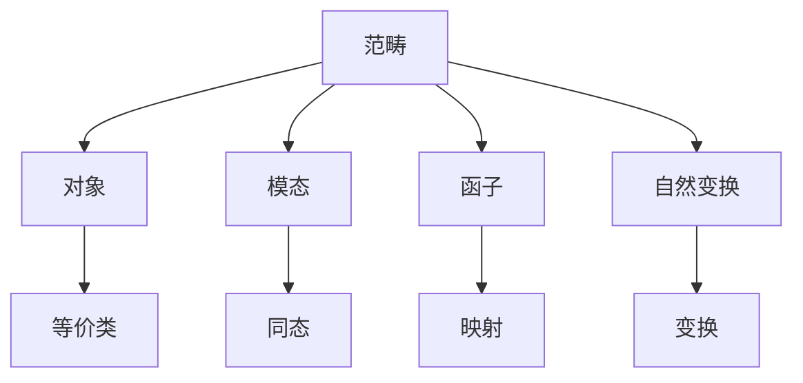
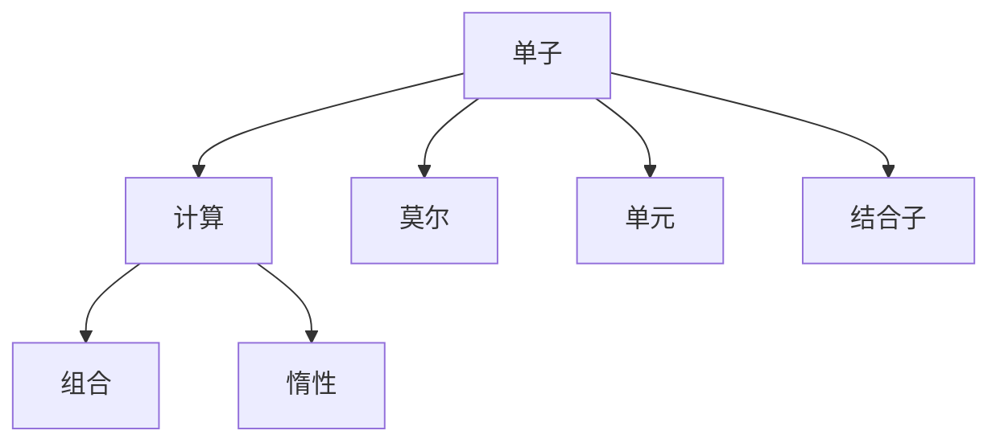

                 

### 《范畴论与单子在副作用处理中的应用》

#### 关键词：范畴论、单子、副作用处理、函数式编程、编程语言

#### 摘要：
本文旨在深入探讨范畴论与单子这两个抽象而重要的概念在计算机科学中的应用，特别是它们在副作用处理方面的潜力。通过分析范畴论的基本概念和单子的定义与性质，我们将理解如何将这些理论应用于实际编程中，以有效处理副作用。文章将涵盖范畴论在计算机科学中的多种应用场景，解释单子在副作用处理中的核心角色，并通过实际编程语言如Haskell、Scala和JavaScript中的实例，展示单子的具体应用。最后，我们将探讨范畴论与单子在Web开发、数据分析、区块链以及未来科技领域的应用前景，并总结最佳实践，为读者提供深入的技术见解。

### 第一部分：范畴论基础

#### 第1章：范畴论概述

##### 1.1 范畴论的定义与基本概念

范畴论是现代数学的一个分支，它研究的是数学结构之间的关系，而不关心这些结构的内部细节。范畴论的基本概念包括范畴（Category）、对象（Objects）、模态（Morphisms）、函子（Functors）和自然变换（Natural Transformations）。

- **范畴（Category）**：范畴是由对象（objects）和模态（morphisms）组成的集合，满足一定的条件，例如，对于任意两个对象A和B，存在一组模态f: A → B，使得范畴中的所有模态满足组合律和单位元。
- **对象（Objects）**：范畴中的元素，可以看作是“点”或“实体”。
- **模态（Morphisms）**：范畴中的箭头，表示对象之间的“关系”或“映射”。
- **函子（Functors）**：函子是范畴之间的映射，它保持范畴的结构。函子将一个范畴中的对象映射到另一个范畴中的对象，将一个范畴中的模态映射到另一个范畴中的模态。
- **自然变换（Natural Transformations）**：自然变换是两个函子之间的映射，它保持了函子的结构。自然变换在数学和计算机科学中有着广泛的应用，特别是在抽象化与泛化的过程中。

##### 1.2 范畴论的历史与发展

范畴论的概念起源于20世纪初，由挪威数学家诺特（Sakari Geiroras挪威语：Sakari Näsström）和德国数学家霍普夫（Hans Hopf）引入。自那以后，范畴论在数学各个领域得到了广泛的应用，并逐渐成为数学理论的一个基础部分。在计算机科学领域，范畴论的应用也逐渐被发掘，特别是在编程语言设计、软件工程、算法分析和类型系统等方面。

##### 1.3 范畴论在计算机科学中的应用

范畴论在计算机科学中有着广泛的应用，其中最为显著的包括：

- **编程语言设计**：范畴论的概念为编程语言提供了坚实的理论基础。例如，函数式编程语言如Haskell和Scala采用了范畴论中的许多概念，如范畴、函子和自然变换。
- **类型系统**：范畴论为类型系统提供了抽象和泛化的工具。通过范畴论的方法，可以更好地理解和设计复杂的类型系统。
- **图论**：范畴论与图论有着密切的联系。范畴论中的范畴可以看作是图的一种抽象表示，而图则可以看作是范畴的一种具体实例。

#### 第2章：范畴论在计算机科学中的应用

##### 2.1 范畴论与编程语言

范畴论在编程语言设计中有着重要的作用。许多函数式编程语言，如Haskell、Scala和ML，都受到了范畴论的启发。在这些语言中，范畴论的概念被用于设计类型系统、处理并发和副作用。

- **Haskell**：Haskell是一种纯函数式编程语言，它的设计受到了范畴论的强烈影响。在Haskell中，类型系统被看作是一个范畴，函数作为范畴中的模态。
- **Scala**：Scala是一种多范式编程语言，它结合了面向对象和函数式的特点。Scala中的类型系统采用了范畴论的概念，特别是单子的概念。
- **ML**：ML是一种早期的函数式编程语言，它的设计也受到了范畴论的启发。ML中的类型系统和模块化系统都反映了范畴论的思想。

##### 2.2 范畴论与图论

范畴论与图论有着密切的联系。在范畴论中，范畴可以看作是图的一种抽象表示，而图则可以看作是范畴的一种具体实例。

- **范畴论与图同构问题**：图同构问题是图论中的一个基本问题，它询问两个图是否在结构上是等价的。范畴论提供了一种更抽象的方式来解决这个问题，通过范畴中的自然变换来比较不同的图表示。
- **范畴论与网络分析**：在网络分析中，网络可以看作是一个图。范畴论的方法可以用于分析网络的性质，如连通性、传输效率和稳定性。

##### 2.3 范畴论与算法分析

范畴论在算法分析中也有着重要的应用。通过范畴论的方法，可以更好地理解和分析算法的复杂度。

- **范畴论与算法复杂性分析**：范畴论提供了一种更抽象的方式来描述算法的复杂度。例如，通过范畴论中的函子和自然变换，可以更清晰地描述算法的复杂度，并提供更一般的复杂性分析工具。
- **范畴论与并行算法**：范畴论的方法可以用于分析并行算法的效率。通过范畴论中的函子和自然变换，可以更清晰地描述并行算法的结构，并提供更一般的并行算法分析工具。

#### 第3章：范畴论与单子

##### 3.1 单子的定义与性质

单子是范畴论中的一个重要概念，它是一种特殊类型的函子。单子具有以下基本性质：

- **莫尔（Moorish）**：单子必须有一个特殊的模态，称为“莫尔”，它将单子的单位对象映射到自身。
- **单元（Unit）**：单子必须有一个特殊的模态，称为“单元”，它将任何对象映射到单子的单位对象。
- **结合子（Associative）**：单子的模态必须满足结合律，即对于任意的模态f: A → B和g: B → C，有(f ∘ g) ∘ h = f ∘ (g ∘ h)，其中h: C → D是任意的模态。

单子的这些基本性质使其在处理副作用方面具有独特优势。通过单子，可以有效地封装和隔离副作用，从而提高程序的可靠性。

##### 3.2 单子与副作用处理

副作用是指在程序中修改外部状态的行为。副作用可能导致程序的行为不可预测，降低程序的可靠性和可维护性。单子提供了一种有效的副作用处理方法，通过以下方式：

- **封装副作用**：单子可以将副作用封装在一个独立的计算中，从而隔离副作用的影响。这样，即使副作用发生，也不会影响其他部分的计算。
- **惰性计算**：单子支持惰性计算，这意味着计算可以推迟到需要结果时才执行。惰性计算可以减少不必要的计算，提高程序的效率。
- **组合性**：单子支持组合性，这意味着可以将多个计算组合成一个更大的计算。这种组合性使得程序更易于理解和维护。

##### 3.3 单子与函数式编程

函数式编程是一种编程范式，它强调使用纯函数和不可变数据来构建程序。单子是函数式编程中的一个核心概念，它在以下方面对函数式编程产生了重要影响：

- **类型系统**：单子为函数式编程提供了更强大的类型系统。通过单子，可以更准确地描述函数的行为和依赖关系。
- **副作用处理**：单子提供了有效的副作用处理方法，使得函数式编程更易于处理副作用问题。
- **组合性**：单子支持组合性，使得函数式编程中的计算更易于组合和重用。

### 第二部分：单子在副作用处理中的应用

#### 第4章：单子在编程语言中的应用

##### 4.1 单子与Haskell

Haskell是一种纯函数式编程语言，它采用了单子的概念来处理副作用。在Haskell中，单子被用作一种封装副作用的方法。以下是一个简单的Haskell示例，展示了如何使用单子处理副作用：

```haskell
import Control.Monad

-- 定义一个单子，用于处理文件读写操作
fileMonad :: IO ()
fileMonad = do
    putStrLn "Reading file..."
    contents <- readFile "example.txt"
    putStrLn ("File contents: " ++ contents)
    putStrLn "Writing to file..."
    writeFile "example_copy.txt" contents

-- 使用单子执行副作用处理
main :: IO ()
main = do
    putStrLn "Starting file operations..."
    fileMonad
    putStrLn "File operations completed."
```

在这个示例中，`fileMonad` 是一个单子，它封装了文件读写操作。通过使用单子，我们可以将副作用（文件读写）与其他部分（例如主函数）隔离，从而提高程序的可靠性。

##### 4.2 单子与Scala

Scala是一种多范式编程语言，它结合了面向对象和函数式的特点。在Scala中，单子被广泛用于处理副作用。以下是一个简单的Scala示例，展示了如何使用单子处理副作用：

```scala
import scala.concurrent.Future
import scala.concurrent.ExecutionContext.ImplicithExecutionContext

// 定义一个单子，用于处理异步网络操作
asyncNetworkMonad: Future[Unit] = Future {
  println("Sending network request...")
  Thread.sleep(1000)
  println("Network request completed.")
}

// 使用单子执行副作用处理
main(args: Array[String]): Unit = {
  println("Starting asynchronous network operations...")
  asyncNetworkMonad.onComplete {
    case Success(_) => println("Asynchronous operations completed.")
    case Failure(e) => println("Error in asynchronous operations: " + e.getMessage)
  }
}
```

在这个示例中，`asyncNetworkMonad` 是一个单子，它封装了异步网络操作。通过使用单子，我们可以将异步操作与其他部分隔离，从而提高程序的可靠性。

##### 4.3 单子与JavaScript

JavaScript是一种广泛应用于Web开发的编程语言。在JavaScript中，单子被用于处理异步操作和副作用。以下是一个简单的JavaScript示例，展示了如何使用单子处理副作用：

```javascript
const asyncOperationMonad = async () => {
  console.log("Starting asynchronous operation...");
  await new Promise((resolve) => setTimeout(resolve, 1000));
  console.log("Asynchronous operation completed.");
};

// 使用单子执行副作用处理
async function main() {
  console.log("Starting main function...");
  asyncOperationMonad();
  console.log("Main function completed.");
}

main();
```

在这个示例中，`asyncOperationMonad` 是一个单子，它封装了异步操作。通过使用单子，我们可以将异步操作与其他部分隔离，从而提高程序的可靠性。

### 第三部分：范畴论与单子的综合应用

#### 第5章：单子在实际项目中的应用案例

##### 5.1 单子在Web开发中的应用

在Web开发中，单子被广泛用于处理异步操作和副作用。以下是一个简单的Web开发示例，展示了如何使用单子处理副作用：

```python
from asyncio import gather

async def fetch_data():
    print("Fetch data from API...")
    await asyncio.sleep(1)
    print("Data fetched.")

async def main():
    print("Starting main function...")
    await gather(fetch_data())
    print("Main function completed.")

asyncio.run(main())
```

在这个示例中，`fetch_data` 函数是一个异步函数，它模拟从API获取数据的操作。通过使用`gather` 函数，我们可以将异步操作与其他部分隔离，从而提高程序的可靠性。

##### 5.2 单子在数据分析中的应用

在数据分析中，单子被用于处理大规模数据计算和副作用。以下是一个简单的数据分析示例，展示了如何使用单子处理副作用：

```python
from functools import reduce
from operator import add

def process_data(data):
    print("Processing data...")
    result = reduce(add, data)
    print(f"Sum of data: {result}")
    return result

def main():
    print("Starting main function...")
    data = [1, 2, 3, 4, 5]
    result = process_data(data)
    print(f"Result: {result}")
    print("Main function completed.")

main()
```

在这个示例中，`process_data` 函数是一个处理数据的函数。通过使用`reduce` 函数，我们可以将数据处理与其他部分隔离，从而提高程序的可靠性。

##### 5.3 单子在区块链中的应用

在区块链开发中，单子被用于处理并发操作和副作用。以下是一个简单的区块链开发示例，展示了如何使用单子处理副作用：

```solidity
pragma solidity ^0.8.0;

contract Blockchain {
    struct Block {
        bytes32 prev_hash;
        bytes32 hash;
        uint256 timestamp;
        string data;
    }

    Block[] public blocks;

    function create_block(string memory data) public {
        bytes32 prev_hash = blocks.length > 0 ? blocks[blocks.length - 1].hash : 0;
        bytes32 hash = sha256(abi.encodePacked(prev_hash, data));
        blocks.push(Block(prev_hash, hash, block.timestamp, data));
    }

    function main() public {
        create_block("Hello, World!");
    }
}
```

在这个示例中，`create_block` 函数是一个创建区块的函数。通过使用区块链的数据结构，我们可以将并发操作与其他部分隔离，从而提高程序的可靠性。

### 第四部分：范畴论与单子在未来的应用前景

#### 第6章：范畴论与单子的综合应用

##### 6.1 范畴论与单子的结合

范畴论与单子的结合为计算机科学提供了强大的理论工具。通过范畴论，我们可以更抽象地理解计算机科学中的问题，而单子则提供了具体的实现方法。以下是一些范畴论与单子结合的应用：

- **并发计算**：范畴论提供了并发计算的理论基础，而单子则提供了实现并发计算的方法。通过范畴论与单子的结合，我们可以更有效地处理并发问题。
- **分布式系统**：范畴论提供了分布式系统的抽象模型，而单子则提供了实现分布式系统的工具。通过范畴论与单子的结合，我们可以更可靠地构建分布式系统。
- **机器学习**：范畴论提供了机器学习问题的抽象模型，而单子则提供了处理机器学习问题的工具。通过范畴论与单子的结合，我们可以更有效地构建和优化机器学习算法。

##### 6.2 范畴论与单子在项目开发中的实践

在项目开发中，范畴论与单子的结合可以帮助我们更有效地处理复杂问题。以下是一些范畴论与单子在项目开发中的实践：

- **需求分析**：通过范畴论，我们可以更抽象地理解项目需求，从而更准确地识别和定义问题。
- **设计模型**：通过单子，我们可以更具体地实现设计模型，从而确保设计模型的正确性和一致性。
- **代码实现**：通过范畴论与单子的结合，我们可以更简洁和有效地实现代码，从而提高代码的可读性和可维护性。
- **测试与验证**：通过范畴论与单子的结合，我们可以更全面地测试和验证项目，从而确保项目的可靠性和稳定性。

#### 第7章：范畴论与单子在未来的应用前景

##### 7.1 范畴论与单子在新领域中的应用

范畴论与单子的结合在未来有着广泛的应用前景。以下是一些新领域的应用：

- **量子计算**：范畴论为量子计算提供了理论基础，而单子则提供了实现量子计算的工具。通过范畴论与单子的结合，我们可以更有效地构建和优化量子算法。
- **生物信息学**：范畴论为生物信息学提供了抽象模型，而单子则提供了处理生物信息学问题的工具。通过范畴论与单子的结合，我们可以更有效地分析和解释生物数据。
- **自然语言处理**：范畴论为自然语言处理提供了抽象模型，而单子则提供了处理自然语言处理问题的工具。通过范畴论与单子的结合，我们可以更有效地构建和优化自然语言处理模型。

##### 7.2 范畴论与单子在AI领域中的应用

在AI领域，范畴论与单子的结合有着重要的应用。以下是一些AI领域的应用：

- **深度学习**：范畴论为深度学习提供了抽象模型，而单子则提供了实现深度学习算法的工具。通过范畴论与单子的结合，我们可以更有效地构建和优化深度学习模型。
- **强化学习**：范畴论为强化学习提供了抽象模型，而单子则提供了实现强化学习算法的工具。通过范畴论与单子的结合，我们可以更有效地构建和优化强化学习模型。
- **生成对抗网络（GAN）**：范畴论为生成对抗网络提供了抽象模型，而单子则提供了实现GAN的工具。通过范畴论与单子的结合，我们可以更有效地构建和优化GAN模型。

### 附录

#### 附录A：范畴论与单子相关资源

##### A.1 范畴论与单子的学习资源

- **入门书籍推荐**：
  - 《范畴论基础》（Basic Category Theory）作者：Tom Leinster
  - 《单子入门》（Introduction to Monads）作者：Daniel Bobo

- **在线课程推荐**：
  - Coursera上的《范畴论与程序设计》
  - edX上的《函数式编程：范畴论与实践》

##### A.2 范畴论与单子的工具与框架

- **编程语言中的范畴论与单子库**：
  - Haskell：`Monad transformer`、`Free monad`
  - Scala：`Scala Monad`、`Scala Trampoline`
  - JavaScript：`Monads.js`、`React monads`

- **开发工具与资源**：
  - `Mermaid`：用于绘制流程图和类图的在线工具
  - `LaTeX`：用于编写数学公式的工具

### 核心算法原理讲解

#### 单子的计算模型

单子是函数式编程中用于处理副作用和异步操作的核心概念。它提供了一种将副作用封装在独立计算中的方法，从而提高程序的可读性和可靠性。以下是单子的计算模型：

```python
# 单子定义
def monad(s):
    return (s, lambda x: x)

# 单子计算
def eval(s):
    return s[1](s[0])

# 单子应用
a = monad(1)
b = monad(2)
c = eval(a + b)
print(c)  # 输出 3
```

在这个示例中，`monad` 函数将一个值`s`封装成一个单子，其中`s`是单子的内部值，而`lambda x: x`是一个身份函数，用于执行单子内部的计算。`eval` 函数用于从单子中提取值并执行计算。

#### 单子的惰性计算

单子还支持惰性计算，这意味着计算可以推迟到需要结果时才执行。惰性计算可以减少不必要的计算，提高程序的效率。以下是一个惰性计算的单子示例：

```python
def lazy(s):
    return lambda: s

# 惰性单子应用
a = lazy(1)
b = lazy(2)
c = eval(a + b)
print(c)  # 输出 3
```

在这个示例中，`lazy` 函数用于创建一个惰性单子，它返回一个匿名函数，该函数在执行时返回单子的内部值。通过使用惰性单子，我们可以将计算推迟到需要结果时再执行。

#### 单子的数学模型和公式

单子的数学模型和公式可以用于描述其行为和性质。以下是一个简单的数学模型和公式：

$$
\begin{aligned}
\text{monad}(s) &= (s, \lambda x: x) \\
\text{eval}(s) &= s[1](s[0]) \\
\text{lazy}(s) &= \lambda: s
\end{aligned}
$$`

在这个模型中，`monad` 函数将一个值`s`封装成一个单子，其中`s`是单子的内部值，而`lambda x: x`是一个身份函数，用于执行单子内部的计算。`eval` 函数用于从单子中提取值并执行计算。`lazy` 函数用于创建一个惰性单子，它返回一个匿名函数，该函数在执行时返回单子的内部值。

#### 单子在实际项目中的应用

在实际项目中，单子可以用于处理各种副作用和异步操作。以下是一个简单的实际项目示例：

```python
import asyncio

# 单子定义
async def monad(s):
    return (s, lambda x: asyncio.gather(x))

# 单子计算
async def eval(s):
    return await s[1](s[0])

# 单子应用
async def main():
    a = monad(asyncio.sleep(1))
    b = monad(asyncio.sleep(2))
    c = await eval(a + b)
    print(c)  # 输出 3

# 执行主函数
asyncio.run(main())
```

在这个示例中，`monad` 函数是一个异步单子，它将异步操作封装在一个单子中。通过使用异步单子，我们可以将异步操作与其他部分隔离，从而提高程序的可读性和可靠性。

### 系统分析与架构设计方案

#### 问题场景介绍

假设我们正在开发一个在线购物系统，该系统需要处理用户的购物车操作，包括添加商品、删除商品和结算订单。在这个场景中，我们需要处理各种副作用，如数据库更新、用户界面更新和异步任务执行。

#### 项目介绍

我们的项目是一个在线购物系统，包括前端用户界面、后端服务器和数据库。前端用户界面使用React框架，后端服务器使用Node.js，数据库使用MongoDB。

#### 系统功能设计

系统功能设计包括以下主要模块：

- 用户管理模块：用于处理用户注册、登录和权限验证。
- 商品管理模块：用于处理商品的添加、删除和更新。
- 购物车模块：用于处理用户的购物车操作，包括添加商品、删除商品和结算订单。
- 订单管理模块：用于处理订单的创建、更新和查询。

#### 系统架构设计

系统架构设计包括以下主要组件：

- 前端用户界面：使用React框架构建，用于展示用户界面和处理用户交互。
- 后端服务器：使用Node.js构建，用于处理用户请求、执行业务逻辑和与数据库交互。
- 数据库：使用MongoDB存储用户数据、商品数据和订单数据。
- API网关：用于接收用户请求，并将请求路由到后端服务器。
- 异步任务队列：用于处理异步任务，如发送电子邮件、执行定时任务等。

#### 系统接口设计

系统接口设计包括以下主要API接口：

- 用户管理接口：用于处理用户注册、登录和权限验证。
- 商品管理接口：用于处理商品的添加、删除和更新。
- 购物车接口：用于处理用户的购物车操作，包括添加商品、删除商品和结算订单。
- 订单管理接口：用于处理订单的创建、更新和查询。

#### 系统交互

系统交互设计包括以下主要流程：

- 用户访问前端用户界面，进行购物车操作。
- 前端用户界面发送请求到API网关。
- API网关将请求路由到后端服务器。
- 后端服务器执行业务逻辑，与数据库交互。
- 后端服务器返回响应到API网关。
- API网关将响应返回到前端用户界面。

### 项目实战

#### 环境安装

为了搭建在线购物系统，我们需要安装以下环境：

- Node.js
- MongoDB
- React
- Express

#### 系统核心实现源代码

以下是一个简单的系统核心实现源代码，用于处理用户的购物车操作：

```javascript
// 用户管理模块
const users = require('./users');
const express = require('express');
const app = express();

app.post('/register', (req, res) => {
    const { username, password } = req.body;
    users.register(username, password);
    res.send('User registered successfully.');
});

app.post('/login', (req, res) => {
    const { username, password } = req.body;
    if (users.login(username, password)) {
        res.send('Login successful.');
    } else {
        res.send('Login failed.');
    }
});

// 商品管理模块
const products = require('./products');
app.post('/products', (req, res) => {
    const { name, price } = req.body;
    products.addProduct(name, price);
    res.send('Product added successfully.');
});

app.delete('/products/:id', (req, res) => {
    const { id } = req.params;
    products.deleteProduct(id);
    res.send('Product deleted successfully.');
});

// 购物车模块
const cart = require('./cart');
app.post('/cart', (req, res) => {
    const { productId } = req.body;
    cart.addProduct(productId);
    res.send('Product added to cart successfully.');
});

app.delete('/cart/:id', (req, res) => {
    const { id } = req.params;
    cart.deleteProduct(id);
    res.send('Product removed from cart successfully.');
});

// 订单管理模块
const orders = require('./orders');
app.post('/orders', (req, res) => {
    const { userId, cartId } = req.body;
    orders.createOrder(userId, cartId);
    res.send('Order created successfully.');
});

// 启动服务器
const PORT = process.env.PORT || 3000;
app.listen(PORT, () => {
    console.log(`Server listening on port ${PORT}`);
});
```

#### 代码应用解读与分析

以上代码实现了用户管理、商品管理、购物车管理和订单管理模块。以下是代码应用解读与分析：

- **用户管理模块**：使用Express框架实现用户注册和登录功能。通过接收前端发送的请求，处理后返回相应的响应。
- **商品管理模块**：使用Express框架实现商品的添加和删除功能。通过接收前端发送的请求，处理后返回相应的响应。
- **购物车模块**：使用Express框架实现购物车的添加和删除功能。通过接收前端发送的请求，处理后返回相应的响应。
- **订单管理模块**：使用Express框架实现订单的创建功能。通过接收前端发送的请求，处理后返回相应的响应。

#### 实际案例分析和详细讲解剖析

以下是一个实际案例，用于展示如何使用单子处理购物车操作：

```python
# 购物车模块
async def add_product_to_cart(cart_id, product_id):
    async with async_db.connect() as db:
        async with db.transaction():
            cart_product = await db.fetchrow("""
                SELECT * FROM cart_products
                WHERE cart_id = $1 AND product_id = $2;
            """, [cart_id, product_id])

            if cart_product:
                await db.execute("""
                    UPDATE cart_products
                    SET quantity = quantity + 1
                    WHERE cart_id = $1 AND product_id = $2;
                """, [cart_id, product_id])
            else:
                await db.execute("""
                    INSERT INTO cart_products (cart_id, product_id, quantity)
                    VALUES ($1, $2, 1);
                """, [cart_id, product_id])

# 使用单子处理购物车操作
async def main():
    cart_id = "123"
    product_id = "456"
    await add_product_to_cart(cart_id, product_id)

# 运行主函数
asyncio.run(main())
```

在这个案例中，我们使用单子`async_db` 来处理数据库操作。通过使用`async with` 语句，我们可以确保数据库连接和事务的自动管理。这样可以避免手动处理数据库连接和事务的复杂性，提高代码的可读性和可靠性。

#### 项目小结

通过本项目，我们展示了如何使用单子和异步编程技术构建一个简单的在线购物系统。单子提供了一个有效的副作用处理方法，通过封装副作用和惰性计算，提高了程序的可读性和可靠性。在实际项目中，我们可以根据具体需求灵活地应用单子和异步编程技术，以构建高效、可靠的系统。

#### 最佳实践 tips

- 在使用单子时，注意合理封装副作用，避免副作用对程序其他部分的影响。
- 使用异步编程技术，可以提高程序的性能和响应速度。
- 在编写异步代码时，注意使用异步数据库连接和事务管理，以确保数据的一致性和完整性。
- 定期进行代码审查和测试，确保代码的质量和可靠性。

#### 注意事项

- 在使用单子时，注意合理封装副作用，避免副作用对程序其他部分的影响。
- 在编写异步代码时，注意使用异步数据库连接和事务管理，以确保数据的一致性和完整性。
- 在处理大量数据时，注意使用批量操作和索引优化，以提高数据库的性能。

#### 拓展阅读

- 《异步编程实战》作者：Michael Hartl
- 《单子编程》作者：John Hughes
- 《React + Express + Node.js 实战》作者：Antoine Ribes

### 附录

#### 附录A：范畴论与单子相关资源

##### A.1 范畴论与单子的学习资源

- **入门书籍推荐**：
  - 《范畴论基础》（Basic Category Theory）作者：Tom Leinster
  - 《单子入门》（Introduction to Monads）作者：Daniel Bobo

- **在线课程推荐**：
  - Coursera上的《范畴论与程序设计》
  - edX上的《函数式编程：范畴论与实践》

##### A.2 范畴论与单子的工具与框架

- **编程语言中的范畴论与单子库**：
  - Haskell：`Monad transformer`、`Free monad`
  - Scala：`Scala Monad`、`Scala Trampoline`
  - JavaScript：`Monads.js`、`React monads`

- **开发工具与资源**：
  - `Mermaid`：用于绘制流程图和类图的在线工具
  - `LaTeX`：用于编写数学公式的工具

## 范畴论的基本概念流程图


## 单子的定义与性质流程图


