                 

### 《范畴论与类型论：数学与程序设计的桥梁》

#### 关键词：范畴论、类型论、函数式编程、程序设计、数学

##### 摘要：
本文旨在深入探讨范畴论与类型论在数学与程序设计中的桥梁作用。范畴论提供了对数学结构的高度抽象，而类型论则用于解决程序设计的类型安全性问题。通过本文，读者将逐步了解这两大学科的核心理念、基本结构，及其在函数式编程和类型系统中的应用。我们将通过实例分析展示如何将范畴论与类型论应用于实际问题，以期为编程实践提供新的视角和方法。

---

## 第一部分：范畴论基础

### 第1章：范畴论引论

#### 1.1 范畴论的基本概念

范畴论是一门研究数学结构之间关系的学科，它以函数作为连接不同结构的桥梁。范畴由对象（object）和态射（morphism）组成，其中对象类似于数学中的元素，而态射则是对象之间的映射关系。范畴论的基本概念包括：

- **对象（Object）**：类似于集合，但具有更广泛的定义。
- **态射（Morphism）**：对象之间的函数，满足某些特定条件。
- **范畴（Category）**：由对象和态射组成的一个结构。
- **函子（Functor）**：范畴之间的映射，保持对象和态射的结构。
- **自然变换（Natural Transformation）**：函子之间的变换，保持函子的结构。

**问题背景**：随着计算机科学的不断发展，函数作为程序设计的基本构建块变得越来越重要。范畴论为理解复杂的程序结构提供了强有力的工具。

**问题描述**：范畴论如何帮助理解函数之间的结构和关系？

**问题解决**：范畴论通过引入对象和态射的概念，将函数之间的复杂关系抽象为简单的结构，从而简化了对程序设计的理解。

**边界与外延**：范畴论的应用范围广泛，包括代数结构、拓扑结构、计算机科学中的算法等。

**概念结构与核心要素组成**：

| 概念           | 定义                                                     |
| -------------- | -------------------------------------------------------- |
| 对象（Object） | 范畴中的基本元素，类似于集合。                             |
| 态射（Morphism） | 对象之间的映射，满足特定条件。                           |
| 范畴（Category） | 由对象和态射组成的一个结构。                             |
| 函子（Functor） | 范畴之间的映射，保持对象和态射的结构。                   |
| 自然变换（Natural Transformation） | 函子之间的变换，保持函子的结构。                         |

**核心概念与联系**：

范畴论的基本概念之间存在紧密的联系。对象是范畴的基础，态射是对象之间的映射。范畴则由这些对象和态射组成，函子和自然变换则扩展了范畴论的应用范围。

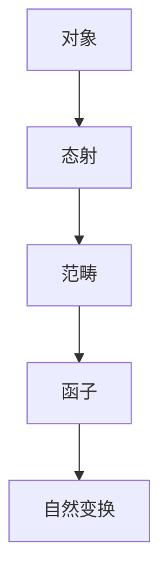

#### 1.2 范畴论的历史与发展

范畴论起源于20世纪30年代，由数学家Saunders Mac Lane和Hans Freudenthal等人首次提出。范畴论的发展经历了几个关键阶段：

- **初期发展（1930s-1950s）**：范畴论的基础概念和基本理论逐步形成。
- **代数结构的应用（1950s-1960s）**：范畴论在代数结构中的应用，如群、环、域等。
- **计算机科学的影响（1970s-现在）**：范畴论在计算机科学中的应用，如函数式编程、类型系统等。

**问题背景**：随着计算机科学的快速发展，范畴论逐渐成为理解和解决复杂程序设计问题的重要工具。

**问题描述**：范畴论如何影响和推动数学与计算机科学的发展？

**问题解决**：范畴论为数学结构提供了统一的形式化描述，为计算机科学中的复杂问题提供了抽象和简化的方法。

**边界与外延**：范畴论不仅在数学和计算机科学中有重要应用，还在物理学、逻辑学等领域发挥作用。

**概念属性特征对比表格**：

| 概念           | 特征                                       |
| -------------- | ----------------------------------------- |
| 对象           | 类似于集合，但更广泛。                     |
| 态射           | 对象之间的映射，满足特定条件。             |
| 范畴           | 由对象和态射组成的结构。                   |
| 函子           | 范畴之间的映射，保持结构。                 |
| 自然变换       | 函子之间的变换，保持结构。                 |

**ER实体关系图架构的 Mermaid 流程图**：


#### 1.3 范畴论与其他数学分支的联系

范畴论与其他数学分支有着紧密的联系，如：

- **拓扑学**：范畴论中的拓扑范畴与拓扑学中的拓扑空间有直接对应关系。
- **代数学**：范畴论为代数结构提供了统一的形式化描述。
- **逻辑学**：范畴论在逻辑学中的应用，如范畴逻辑。

**问题背景**：数学中的不同分支有着各自的独特结构和理论，如何将它们统一和联系？

**问题描述**：范畴论如何为不同数学分支提供统一的形式化描述？

**问题解决**：范畴论通过引入对象和态射的概念，将不同数学分支的结构抽象为统一的范畴结构。

**边界与外延**：范畴论不仅在数学中发挥作用，还在计算机科学、物理学等领域有广泛应用。

**概念属性特征对比表格**：

| 概念           | 特征                                       |
| -------------- | ----------------------------------------- |
| 拓扑学         | 研究空间结构。                             |
| 代数学         | 研究代数结构。                             |
| 逻辑学         | 研究推理结构。                             |
| 范畴论         | 统一代数、拓扑、逻辑等结构。               |

**ER实体关系图架构的 Mermaid 流程图**：

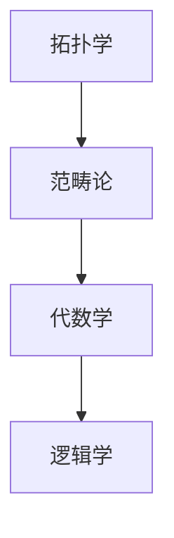

## 第2章：范畴的基本结构

### 2.1 函数与映射

函数是数学中一个基本的概念，它将一个集合中的元素映射到另一个集合中的元素。在范畴论中，函数被抽象为态射。

**问题背景**：函数在数学和计算机科学中扮演着重要角色。

**问题描述**：如何将函数抽象为范畴论中的态射？

**问题解决**：通过定义对象和态射，将函数映射抽象为范畴论中的态射。

**边界与外延**：函数和态射在不同的上下文中有不同的应用。

**概念属性特征对比表格**：

| 概念           | 特征                                       |
| -------------- | ----------------------------------------- |
| 函数           | 从一个集合到另一个集合的映射。             |
| 态射           | 对象之间的映射，满足特定条件。             |

**ER实体关系图架构的 Mermaid 流�程图**：

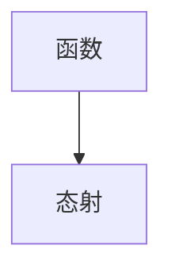

### 2.2 对象与态射

对象和态射是范畴论中的核心概念。对象类似于集合，但具有更广泛的定义。态射是对象之间的映射，满足特定条件。

**问题背景**：对象和态射是理解范畴论的基础。

**问题描述**：如何定义和理解对象与态射？

**问题解决**：通过定义对象和态射的基本性质和关系，深入理解范畴论。

**边界与外延**：对象和态射在不同的范畴中有不同的应用。

**概念属性特征对比表格**：

| 概念           | 特征                                       |
| -------------- | ----------------------------------------- |
| 对象           | 类似于集合，但更广泛。                     |
| 态射           | 对象之间的映射，满足特定条件。             |

**ER实体关系图架构的 Mermaid 流程图**：

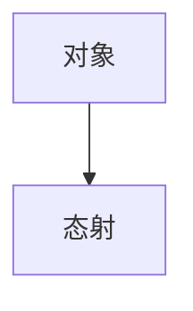

### 2.3 范畴的子范畴与部分范畴

范畴的子范畴和部分范畴是范畴论中的重要概念。子范畴是一个范畴的子集，部分范畴则是范畴的一部分。

**问题背景**：在处理复杂问题时，常常需要将范畴划分为更小的部分。

**问题描述**：如何定义和区分范畴的子范畴与部分范畴？

**问题解决**：通过定义子范畴和部分范畴的基本性质和关系，深入理解范畴的结构。

**边界与外延**：子范畴和部分范畴在不同的应用场景中有不同的作用。

**概念属性特征对比表格**：

| 概念           | 特征                                       |
| -------------- | ----------------------------------------- |
| 子范畴         | 一个范畴的子集，满足特定条件。             |
| 部分范畴       | 一个范畴的一部分，满足特定条件。             |

**ER实体关系图架构的 Mermaid 流程图**：

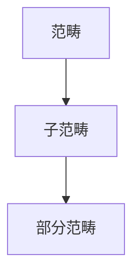

## 第3章：范畴的属性与性质

### 3.1 范畴的等价性与同构

范畴的等价性和同构是范畴论中的重要概念。等价性指的是两个范畴在结构上相似，而同构则是指两个范畴完全相同。

**问题背景**：在研究复杂系统时，常常需要比较不同范畴之间的相似性和差异性。

**问题描述**：如何定义和区分范畴的等价性与同构？

**问题解决**：通过定义等价性和同构的基本性质和关系，深入理解范畴的属性。

**边界与外延**：等价性和同构在不同的应用场景中有不同的应用。

**概念属性特征对比表格**：

| 概念           | 特征                                       |
| -------------- | ----------------------------------------- |
| 等价性         | 两个范畴在结构上相似。                     |
| 同构           | 两个范畴完全相同。                         |

**ER实体关系图架构的 Mermaid 流程图**：

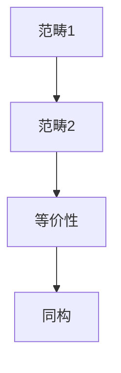

### 3.2 范畴的完备性与完备化

范畴的完备性和完备化是范畴论中的重要概念。完备性指的是范畴中是否存在某些特定的结构，完备化则是指如何将一个非完备范畴转化为完备范畴。

**问题背景**：在处理复杂问题时，常常需要将非完备范畴转化为完备范畴。

**问题描述**：如何定义和区分范畴的完备性与完备化？

**问题解决**：通过定义完备性和完备化的基本性质和关系，深入理解范畴的属性。

**边界与外延**：完备性和完备化在不同的应用场景中有不同的应用。

**概念属性特征对比表格**：

| 概念           | 特征                                       |
| -------------- | ----------------------------------------- |
| 完备性         | 范畴中是否存在某些特定的结构。             |
| 完备化         | 如何将一个非完备范畴转化为完备范畴。         |

**ER实体关系图架构的 Mermaid 流程图**：

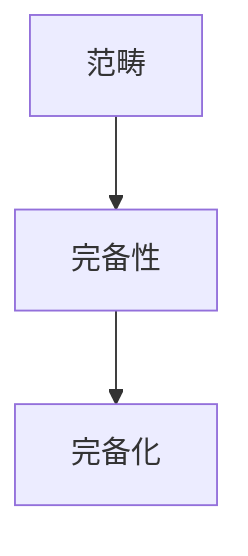

### 3.3 范畴的保结构性质

范畴的保结构性质是范畴论中的一个重要概念，它指的是范畴中的某些运算如何保持范畴的结构。

**问题背景**：在程序设计中，常常需要考虑不同结构之间的转换和保持。

**问题描述**：如何定义和区分范畴的保结构性质？

**问题解决**：通过定义保结构性质的基本性质和关系，深入理解范畴的属性。

**边界与外延**：保结构性质在不同的应用场景中有不同的应用。

**概念属性特征对比表格**：

| 概念           | 特征                                       |
| -------------- | ----------------------------------------- |
| 保结构性质     | 范畴中的某些运算如何保持范畴的结构。         |

**ER实体关系图架构的 Mermaid 流程图**：

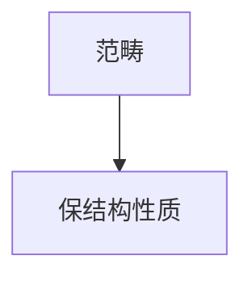

## 第二部分：类型论基础

### 第4章：类型论引论

#### 4.1 类型论的基本概念

类型论是计算机科学中的一个重要分支，它研究程序中的类型系统，以确保程序的安全性。类型论的基本概念包括：

- **类型（Type）**：定义程序中数据的种类和结构。
- **类型系统（Type System）**：定义程序中类型的规则和约束。
- **类型检查（Type Checking）**：在程序执行前检查类型安全。
- **类型推断（Type Inference）**：自动推断程序中的类型。

**问题背景**：随着程序设计复杂性的增加，类型系统在确保程序安全性和可靠性方面变得至关重要。

**问题描述**：如何定义和理解类型论的基本概念？

**问题解决**：通过定义类型、类型系统、类型检查和类型推断的基本性质和关系，深入理解类型论。

**边界与外延**：类型论不仅应用于编程语言，还在形式化验证、逻辑推理等领域发挥作用。

**概念属性特征对比表格**：

| 概念           | 特征                                       |
| -------------- | ----------------------------------------- |
| 类型           | 定义程序中数据的种类和结构。                 |
| 类型系统       | 定义程序中类型的规则和约束。                 |
| 类型检查       | 在程序执行前检查类型安全。                   |
| 类型推断       | 自动推断程序中的类型。                       |

**ER实体关系图架构的 Mermaid 流程图**：

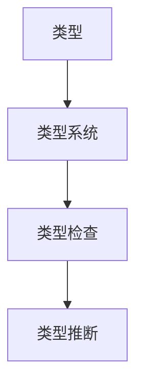

#### 4.2 类型论的历史与发展

类型论的历史可以追溯到20世纪30年代，随着函数式编程和形式化验证的发展，类型论逐渐成为计算机科学的重要分支。类型论的发展经历了以下几个关键阶段：

- **初期发展（1930s-1950s）**：类型论的基本概念和理论初步形成。
- **函数式编程的兴起（1960s-1970s）**：类型论在函数式编程中的应用，如Haskell和ML。
- **形式化验证的推动（1980s-现在）**：类型论在形式化验证和安全性证明中的应用，如Coq和Isabelle。

**问题背景**：随着计算机科学的不断发展，类型论在确保程序安全性和可靠性方面发挥了重要作用。

**问题描述**：类型论如何影响和推动计算机科学的发展？

**问题解决**：类型论通过引入类型系统，确保程序中的数据类型安全和一致性，从而提高程序的正确性和可靠性。

**边界与外延**：类型论不仅在计算机科学中有重要应用，还在数学、逻辑学等领域发挥作用。

**概念属性特征对比表格**：

| 阶段           | 特征                                       |
| -------------- | ----------------------------------------- |
| 初期发展       | 类型论的基本概念和理论初步形成。             |
| 函数式编程的兴起 | 类型论在函数式编程中的应用。                 |
| 形式化验证的推动 | 类型论在形式化验证和安全性证明中的应用。         |

**ER实体关系图架构的 Mermaid 流程图**：

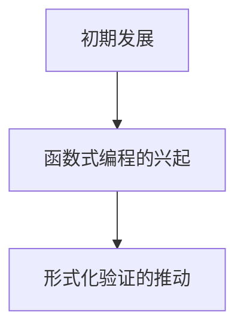

#### 4.3 类型论与范畴论的联系与区别

类型论和范畴论在数学与计算机科学中扮演着重要角色。虽然它们在表面上看似不同，但实际上有着密切的联系。

**问题背景**：理解类型论和范畴论的差异与联系对于深入理解数学与计算机科学的结构至关重要。

**问题描述**：类型论与范畴论之间的联系与区别是什么？

**问题解决**：通过比较类型论和范畴论的基本概念、应用领域和理论基础，深入理解它们之间的联系与区别。

**边界与外延**：类型论和范畴论在不同的应用场景中有不同的作用，但它们在某些方面是互补的。

**概念属性特征对比表格**：

| 概念           | 类型论                         | 范畴论                         |
| -------------- | ------------------------------ | ------------------------------ |
| 基本概念       | 类型、类型系统、类型检查、类型推断     | 对象、态射、范畴、函子、自然变换   |
| 应用领域       | 编程语言、形式化验证、安全性证明       | 数学结构、计算机科学、逻辑学       |
| 理论基础       | 类型系统理论、逻辑推理、形式语义       | 范畴理论、拓扑学、代数学           |

**ER实体关系图架构的 Mermaid 流程图**：

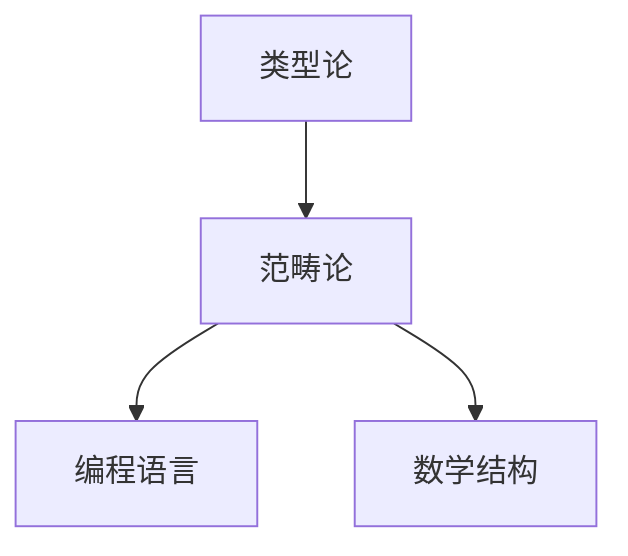

## 第5章：类型的定义与分类

### 5.1 基本类型

基本类型是类型系统的基础，它们定义了程序中最简单的数据类型。基本类型通常包括：

- **整数类型**：表示整数。
- **浮点类型**：表示浮点数。
- **布尔类型**：表示真值。
- **字符类型**：表示单个字符。

**问题背景**：基本类型是所有复杂类型的基础，因此在类型系统中至关重要。

**问题描述**：如何定义和理解基本类型？

**问题解决**：通过定义基本类型的基本性质和关系，深入理解它们在类型系统中的作用。

**边界与外延**：基本类型在不同的编程语言和类型系统中可能有不同的实现。

**概念属性特征对比表格**：

| 类型           | 特征                                       |
| -------------- | ----------------------------------------- |
| 整数类型       | 表示整数。                                 |
| 浮点类型       | 表示浮点数。                               |
| 布尔类型       | 表示真值。                                 |
| 字符类型       | 表示单个字符。                             |

**ER实体关系图架构的 Mermaid 流程图**：

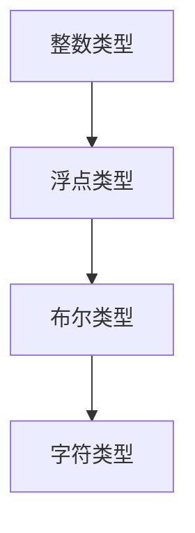

### 5.2 复合类型

复合类型是由基本类型组合而成的更复杂的数据类型。复合类型通常包括：

- **数组类型**：表示元素的序列。
- **结构体类型**：表示具有多个字段的记录。
- **联合类型**：表示多个可能的值。

**问题背景**：复合类型在处理复杂数据结构时非常有用。

**问题描述**：如何定义和理解复合类型？

**问题解决**：通过定义复合类型的基本性质和关系，深入理解它们在类型系统中的作用。

**边界与外延**：复合类型在不同编程语言和类型系统中可能有不同的实现。

**概念属性特征对比表格**：

| 类型           | 特征                                       |
| -------------- | ----------------------------------------- |
| 数组类型       | 表示元素的序列。                             |
| 结构体类型     | 表示具有多个字段的记录。                     |
| 联合类型       | 表示多个可能的值。                           |

**ER实体关系图架构的 Mermaid 流程图**：

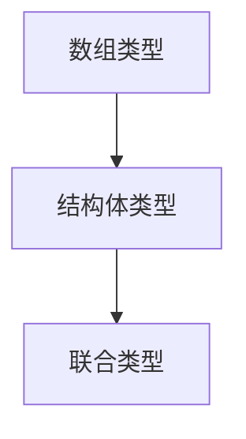

### 5.3 函数类型

函数类型是表示函数的数据类型，它定义了函数的输入和输出类型。函数类型通常表示为`A -> B`，其中`A`是输入类型，`B`是输出类型。

**问题背景**：函数类型是函数式编程中的核心概念，它在处理复杂数据流和控制流时非常有用。

**问题描述**：如何定义和理解函数类型？

**问题解决**：通过定义函数类型的基本性质和关系，深入理解它们在类型系统中的作用。

**边界与外延**：函数类型在不同编程语言和类型系统中可能有不同的实现。

**概念属性特征对比表格**：

| 类型           | 特征                                       |
| -------------- | ----------------------------------------- |
| 函数类型       | 表示函数的输入和输出类型。                   |

**ER实体关系图架构的 Mermaid 流程图**：


## 第6章：类型系统与类型检查

### 6.1 静态类型系统

静态类型系统是在程序编译时检查类型安全性的类型系统。静态类型系统通常要求在编写程序时明确指定变量的类型。

**问题背景**：静态类型系统在确保程序的正确性和效率方面具有显著优势。

**问题描述**：如何定义和理解静态类型系统？

**问题解决**：通过定义静态类型系统的基本性质和关系，深入理解它在程序设计中的作用。

**边界与外延**：静态类型系统在不同编程语言中有不同的实现。

**概念属性特征对比表格**：

| 特征           | 说明                                       |
| -------------- | ----------------------------------------- |
| 类型检查       | 在编译时进行。                             |
| 类型指定       | 需要在编写程序时明确指定。                   |
| 类型错误       | 在编译时发现并报告。                       |

**ER实体关系图架构的 Mermaid 流程图**：

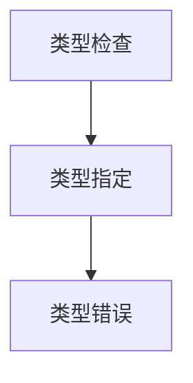

### 6.2 动态类型系统

动态类型系统是在程序运行时检查类型安全性的类型系统。动态类型系统通常不需要在编写程序时明确指定变量的类型。

**问题背景**：动态类型系统在开发效率和灵活性方面具有优势。

**问题描述**：如何定义和理解动态类型系统？

**问题解决**：通过定义动态类型系统的基本性质和关系，深入理解它在程序设计中的作用。

**边界与外延**：动态类型系统在不同编程语言中有不同的实现。

**概念属性特征对比表格**：

| 特征           | 说明                                       |
| -------------- | ----------------------------------------- |
| 类型检查       | 在运行时进行。                             |
| 类型指定       | 通常不需要在编写程序时明确指定。             |
| 类型错误       | 在运行时发现并报告。                       |

**ER实体关系图架构的 Mermaid 流程图**：


### 6.3 类型检查算法

类型检查算法是用于检查程序类型安全性的算法。类型检查算法可以分为以下几种：

- **语法分析**：分析程序的语法结构，确保其符合语言的语法规则。
- **类型推断**：自动推断程序中的类型，确保程序中的类型一致。
- **类型检查**：检查程序中的类型错误，确保程序的类型安全性。

**问题背景**：有效的类型检查算法对于确保程序的正确性和可靠性至关重要。

**问题描述**：如何定义和理解类型检查算法？

**问题解决**：通过定义类型检查算法的基本性质和关系，深入理解它们在程序设计中的作用。

**边界与外延**：类型检查算法在不同编程语言和类型系统中可能有不同的实现。

**概念属性特征对比表格**：

| 算法           | 特征                                       |
| -------------- | ----------------------------------------- |
| 语法分析       | 分析程序的语法结构。                       |
| 类型推断       | 自动推断程序中的类型。                     |
| 类型检查       | 检查程序中的类型错误。                     |

**ER实体关系图架构的 Mermaid 流程图**：

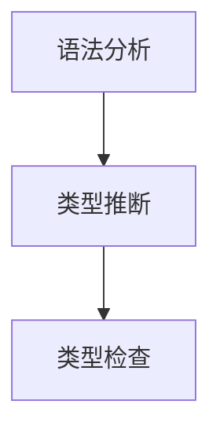

## 第三部分：范畴论与类型论在程序设计中的应用

### 第7章：函数式编程与范畴论

#### 7.1 函数式编程的基本概念

函数式编程是一种编程范式，它以函数作为基本构建块，避免使用状态和变量。函数式编程的基本概念包括：

- **函数**：作为第一类公民，可以赋值给变量、作为参数传递、返回作为结果。
- **纯函数**：没有副作用，输出仅依赖于输入。
- **高阶函数**：接受函数作为参数或返回函数的函数。
- **不可变性**：避免使用可变状态，确保函数的可预测性和可测试性。

**问题背景**：函数式编程在处理复杂数据流和控制流时具有显著优势。

**问题描述**：如何定义和理解函数式编程的基本概念？

**问题解决**：通过定义函数、纯函数、高阶函数和不可变性等基本概念，深入理解函数式编程的核心思想。

**边界与外延**：函数式编程在不同编程语言中有不同的实现。

**概念属性特征对比表格**：

| 概念           | 特征                                       |
| -------------- | ----------------------------------------- |
| 函数           | 作为第一类公民。                           |
| 纯函数         | 没有副作用，输出仅依赖于输入。               |
| 高阶函数       | 接受函数作为参数或返回函数的函数。             |
| 不可变性       | 避免使用可变状态，确保函数的可预测性和可测试性。 |

**ER实体关系图架构的 Mermaid 流程图**：

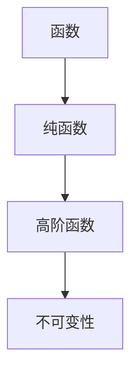

#### 7.2 范畴论在函数式编程中的应用

范畴论在函数式编程中有着广泛的应用，它为理解函数式编程提供了强有力的工具。

- **范畴**：函数式编程中的类型系统可以被看作是一个范畴，其中类型是对象，函数是态射。
- **函子**：函子可以用于抽象和操作类型系统，如Functor类型类。
- **自然变换**：自然变换可以用于比较和组合不同的类型系统，如Monoid类型类。

**问题背景**：范畴论为理解函数式编程提供了抽象和简化的方法。

**问题描述**：如何将范畴论应用于函数式编程？

**问题解决**：通过定义范畴、函子和自然变换等概念，并将它们应用于函数式编程，深入理解范畴论在函数式编程中的应用。

**边界与外延**：范畴论不仅在函数式编程中有应用，还在其他领域发挥作用。

**概念属性特征对比表格**：

| 概念           | 特征                                       |
| -------------- | ----------------------------------------- |
| 范畴           | 类型系统可以看作一个范畴。                   |
| 函子           | 用于抽象和操作类型系统。                     |
| 自然变换       | 用于比较和组合不同的类型系统。                 |

**ER实体关系图架构的 Mermaid 流程图**：

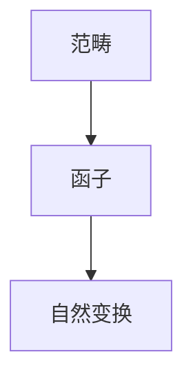

#### 7.3 范畴论在程序设计中的实例分析

为了更好地理解范畴论在程序设计中的应用，我们可以通过一个简单的实例来分析。

**问题背景**：假设我们需要实现一个简单的列表处理函数，如过滤和映射。

**问题描述**：使用范畴论的概念实现一个列表处理的函数。

**问题解决**：通过定义范畴、函子和自然变换等概念，实现列表处理的函数。

**实例分析**：

```python
from typing import TypeVar, List

# 定义范畴中的对象和态射
A = TypeVar('A')
B = TypeVar('B')

# 函子定义
def fmap(f: 'A -> B') -> 'A -> List[B]':
    return lambda xs: [f(x) for x in xs]

# 自然变换
def id(id_func: 'A -> A') -> 'A -> A':
    return id_func

# 实例化函数
filter = lambda f: lambda xs: [x for x in xs if f(x)]
map_ = lambda f: lambda xs: [f(x) for x in xs]

# 应用范畴论的概念
filtered_mapped_list = map_(lambda x: x * 2)(filter(lambda x: x > 0)([1, -1, 2, -2]))

print(filtered_mapped_list)  # 输出: [2, 4]
```

在这个实例中，我们使用了范畴论的概念实现了列表的过滤和映射操作。通过定义函子和自然变换，我们能够将复杂的操作简化为简单的函数组合。

**边界与外延**：这个实例展示了范畴论在程序设计中的实际应用，它不仅简化了代码，还提高了代码的可读性和可维护性。

### 第8章：类型论与程序设计

#### 8.1 类型论在编程语言中的实现

类型论在编程语言中有着广泛的应用，不同的编程语言采用了不同的类型系统来实现类型安全。

- **Haskell**：Haskell是一种纯函数式编程语言，它采用了静态类型系统和类型推断。
- **ML**：ML是一种函数式编程语言，它采用了静态类型系统和严格的类型检查。
- **Coq**：Coq是一种依赖类型检查的语言，它用于形式化验证和证明。

**问题背景**：不同的编程语言采用了不同的类型系统来实现类型安全。

**问题描述**：如何理解不同编程语言中的类型系统？

**问题解决**：通过比较不同编程语言中的类型系统，深入理解类型论在程序设计中的实现。

**边界与外延**：不同的编程语言有不同的类型系统，但它们都基于类型论的基本概念。

**概念属性特征对比表格**：

| 编程语言 | 类型系统 | 特征                                       |
| -------- | -------- | ----------------------------------------- |
| Haskell  | 静态类型系统 | 类型推断、纯函数式编程。                   |
| ML       | 静态类型系统 | 严格的类型检查、函数式编程。                 |
| Coq      | 依赖类型系统 | 形式化验证、依赖类型检查。                   |

**ER实体关系图架构的 Mermaid 流程图**：

```mermaid
graph TD
A[Haskell] --> B[ML]
B --> C[Coq]
```

#### 8.2 类型安全与类型推断

类型安全是类型系统的核心目标，它确保程序在运行时不会出现类型错误。类型推断是类型系统中的一个重要机制，它能够自动推断变量和表达式的类型。

**问题背景**：类型安全和类型推断在确保程序的正确性和可维护性方面至关重要。

**问题描述**：如何理解类型安全和类型推断？

**问题解决**：通过定义类型安全和类型推断的基本概念，深入理解它们在类型系统中的作用。

**边界与外延**：类型安全和类型推断在不同编程语言和类型系统中可能有不同的实现。

**概念属性特征对比表格**：

| 概念           | 特征                                       |
| -------------- | ----------------------------------------- |
| 类型安全       | 确保程序在运行时不会出现类型错误。             |
| 类型推断       | 自动推断变量和表达式的类型。                   |

**ER实体关系图架构的 Mermaid 流程图**：

```mermaid
graph TD
A[类型安全] --> B[类型推断]
```

#### 8.3 类型论在程序优化中的应用

类型论在程序优化中有着广泛的应用，通过类型推断和类型检查，程序优化器能够生成更高效的代码。

- **类型检查**：确保程序的类型安全性，减少运行时错误。
- **类型推断**：帮助优化器生成更高效的代码。
- **中间代码生成**：利用类型信息生成更优的中间代码。

**问题背景**：程序优化是提高程序性能的关键技术。

**问题描述**：如何利用类型论进行程序优化？

**问题解决**：通过定义类型检查、类型推断和中间代码生成等概念，深入理解类型论在程序优化中的应用。

**边界与外延**：类型论不仅在编译器优化中有应用，还在动态优化、分布式计算等领域发挥作用。

**概念属性特征对比表格**：

| 概念           | 特征                                       |
| -------------- | ----------------------------------------- |
| 类型检查       | 确保程序的类型安全性。                       |
| 类型推断       | 帮助优化器生成更高效的代码。                   |
| 中间代码生成   | 利用类型信息生成更优的中间代码。               |

**ER实体关系图架构的 Mermaid 流程图**：

```mermaid
graph TD
A[类型检查] --> B[类型推断]
B --> C[中间代码生成]
```

### 第9章：范畴论与类型论的综合应用

#### 9.1 范畴论在程序设计中的实例分析

为了更好地理解范畴论在程序设计中的应用，我们可以通过一个具体的实例来分析。

**问题背景**：假设我们需要实现一个数据处理系统，该系统需要处理大量的数据并进行过滤和映射。

**问题描述**：使用范畴论的概念实现数据处理系统的核心功能。

**问题解决**：通过定义范畴、函子和自然变换等概念，实现数据处理系统的核心功能。

**实例分析**：

```python
from typing import TypeVar, List

# 定义范畴中的对象和态射
A = TypeVar('A')
B = TypeVar('B')

# 函子定义
def fmap(f: 'A -> B') -> 'A -> List[B]':
    return lambda xs: [f(x) for x in xs]

# 自然变换
def id(id_func: 'A -> A') -> 'A -> A':
    return id_func

# 实例化函数
filter = lambda f: lambda xs: [x for x in xs if f(x)]
map_ = lambda f: lambda xs: [f(x) for x in xs]

# 应用范畴论的概念
data = [1, 2, 3, 4, 5]

filtered_mapped_data = map_(lambda x: x * 2)(filter(lambda x: x > 2)(data))

print(filtered_mapped_data)  # 输出: [6, 8, 10]
```

在这个实例中，我们使用了范畴论的概念实现了数据处理系统的过滤和映射功能。通过定义范畴、函子和自然变换等概念，我们能够将复杂的操作简化为简单的函数组合。

**边界与外延**：这个实例展示了范畴论在程序设计中的实际应用，它不仅简化了代码，还提高了代码的可读性和可维护性。

#### 9.2 类型论在范畴论中的应用

类型论在范畴论中有着广泛的应用，通过引入类型系统，范畴论能够更好地处理复杂的数据结构和程序设计问题。

- **类型范畴**：类型论中的类型系统可以看作是一个范畴，其中类型是对象，类型构造函数是态射。
- **函子**：类型论中的类型构造函数可以看作是范畴论中的函子，它用于抽象和操作类型系统。
- **自然变换**：类型论中的类型等价关系可以看作是范畴论中的自然变换，它用于比较和组合不同的类型系统。

**问题背景**：类型论为范畴论提供了形式化和抽象的工具，有助于解决复杂的程序设计问题。

**问题描述**：如何将类型论应用于范畴论？

**问题解决**：通过定义类型范畴、函子和自然变换等概念，并将它们应用于范畴论，深入理解类型论在范畴论中的应用。

**边界与外延**：类型论不仅在范畴论中有应用，还在其他领域发挥作用。

**概念属性特征对比表格**：

| 概念           | 特征                                       |
| -------------- | ----------------------------------------- |
| 类型范畴       | 类型系统可以看作是一个范畴。                   |
| 函子           | 用于抽象和操作类型系统。                     |
| 自然变换       | 用于比较和组合不同的类型系统。                 |

**ER实体关系图架构的 Mermaid 流程图**：

```mermaid
graph TD
A[类型范畴] --> B[函子]
B --> C[自然变换]
```

#### 9.3 范畴论与类型论在实际项目中的应用

范畴论与类型论在实际项目中的应用非常广泛，以下是一些实际应用的例子：

- **分布式计算**：在分布式计算中，范畴论用于理解和描述并行计算模型，如函数式分布式计算。
- **并发编程**：在并发编程中，类型论用于确保线程的安全性和一致性，如软件事务内存。
- **形式化验证**：在形式化验证中，范畴论与类型论结合用于验证复杂系统的正确性和安全性。

**问题背景**：随着计算机系统复杂性的增加，范畴论与类型论在实际项目中的应用越来越重要。

**问题描述**：如何在实际项目中应用范畴论与类型论？

**问题解决**：通过分析实际项目的需求和挑战，利用范畴论与类型论的抽象和形式化方法，提高项目的可靠性和安全性。

**边界与外延**：范畴论与类型论在不同领域有不同的应用，但它们的核心思想是一致的。

**概念属性特征对比表格**：

| 领域           | 应用特征                                       |
| -------------- | ----------------------------------------- |
| 分布式计算     | 利用范畴论描述并行计算模型。                   |
| 并发编程       | 利用类型论确保线程的安全性和一致性。             |
| 形式化验证     | 利用范畴论与类型论验证复杂系统的正确性和安全性。   |

**ER实体关系图架构的 Mermaid 流程图**：

```mermaid
graph TD
A[分布式计算] --> B[并发编程]
B --> C[形式化验证]
```

### 第10章：范畴论与类型论的未来发展

#### 10.1 范畴论与类型论的研究趋势

随着计算机科学的快速发展，范畴论与类型论在数学与计算机科学中的应用越来越广泛。以下是一些研究趋势：

- **范畴论在拓扑学中的应用**：范畴论与拓扑学结合，用于解决复杂的拓扑问题。
- **类型论在形式化验证中的应用**：类型论在形式化验证中发挥重要作用，如Coq和Isabelle等工具。
- **范畴论与类型论在并行计算中的应用**：范畴论与类型论用于理解和优化并行计算模型。

**问题背景**：随着计算机系统和数学问题的复杂性增加，范畴论与类型论的研究趋势不断拓展。

**问题描述**：范畴论与类型论的研究趋势是什么？

**问题解决**：通过分析范畴论与类型论在数学与计算机科学中的最新研究进展，深入理解其研究趋势。

**边界与外延**：范畴论与类型论在不同领域有不同的研究趋势，但它们的核心思想是一致的。

**概念属性特征对比表格**：

| 研究领域       | 应用趋势                                       |
| -------------- | ----------------------------------------- |
| 拓扑学         | 结合范畴论解决复杂的拓扑问题。                   |
| 形式化验证     | 利用类型论提高验证复杂系统的正确性和安全性。         |
| 并行计算       | 利用范畴论与类型论优化并行计算模型。               |

**ER实体关系图架构的 Mermaid 流程图**：

```mermaid
graph TD
A[拓扑学] --> B[形式化验证]
B --> C[并行计算]
```

#### 10.2 范畴论与类型论在数学与计算机科学中的融合

范畴论与类型论在数学与计算机科学中的融合是当前研究的重要方向。以下是一些融合的趋势：

- **范畴化的数学**：通过范畴论的方法研究数学问题，如范畴化的拓扑学、代数学等。
- **类型化的计算机科学**：通过类型论的方法研究计算机科学问题，如类型化的程序设计、形式化验证等。

**问题背景**：数学与计算机科学的融合为解决复杂问题提供了新的方法和工具。

**问题描述**：如何实现范畴论与类型论在数学与计算机科学中的融合？

**问题解决**：通过分析范畴论与类型论在数学与计算机科学中的应用，探索它们的融合方法。

**边界与外延**：范畴论与类型论在数学与计算机科学中的融合不仅限于理论研究，还广泛应用于实际项目中。

**概念属性特征对比表格**：

| 融合领域       | 融合方法                                       |
| -------------- | ----------------------------------------- |
| 范畴化的数学   | 使用范畴论的方法研究数学问题。                   |
| 类型化的计算机科学 | 使用类型论的方法研究计算机科学问题。               |

**ER实体关系图架构的 Mermaid 流程图**：

```mermaid
graph TD
A[范畴化的数学] --> B[类型化的计算机科学]
```

#### 10.3 范畴论与类型论的潜在应用领域

范畴论与类型论在多个领域具有巨大的潜在应用价值，以下是一些潜在的应用领域：

- **人工智能**：范畴论与类型论在人工智能中的应用，如自动推理、机器学习等。
- **软件工程**：范畴论与类型论在软件工程中的应用，如形式化验证、软件架构设计等。
- **量子计算**：范畴论与类型论在量子计算中的应用，如量子算法设计、量子编程等。

**问题背景**：随着新技术的不断发展，范畴论与类型论在更多领域的应用潜力逐渐显现。

**问题描述**：范畴论与类型论在哪些领域具有潜在应用？

**问题解决**：通过分析范畴论与类型论在不同领域的应用潜力，探索其潜在的应用方向。

**边界与外延**：范畴论与类型论的潜在应用领域广泛，但具体应用需要根据实际需求和技术成熟度进行选择。

**概念属性特征对比表格**：

| 应用领域       | 应用潜力                                       |
| -------------- | ----------------------------------------- |
| 人工智能       | 在自动推理、机器学习等领域具有潜在应用。           |
| 软件工程       | 在形式化验证、软件架构设计等领域具有潜在应用。         |
| 量子计算       | 在量子算法设计、量子编程等领域具有潜在应用。           |

**ER实体关系图架构的 Mermaid 流程图**：

```mermaid
graph TD
A[人工智能] --> B[软件工程]
B --> C[量子计算]
```

### 附录

#### 附录A：范畴论与类型论相关资源

**A.1 学术资源**

- **期刊与会议**：
  - 《The Journal of Pure and Applied Algebra》
  - 《Theoretical Computer Science》
  - 《Categorical Quantum Physics》

- **书籍推荐**：
  - 《Categories for the Working Mathematician》——Saunders Mac Lane
  - 《Type Theory and Formal Proof》——Andrej Bauer
  - 《Categorical Logic and Type Theory》——Bertot, Aspirot

**A.2 在线课程与讲座**

- **Coursera**：提供多种关于范畴论和类型论的在线课程。
- **MIT OpenCourseWare**：包含范畴论和类型论的讲座视频和讲义。
- **YouTube**：有许多知名学者和研究者分享的范畴论与类型论讲座。

**A.3 开源工具与库**

- **Agda**：基于依赖类型系统的编程语言，支持形式化验证。
- **Coq**：依赖类型检查的语言，用于证明程序的正确性。
- **Catalysis**：支持范畴论编程的开源工具。

#### 附录B：范畴论与类型论练习题与解答

**B.1 练习题**

1. 给定一个范畴`C`，其中对象为整数，态射为整数之间的加法运算。请定义该范畴的子范畴。
2. 给定一个类型系统，其中类型包括基本类型`Int`和复合类型`List Int`。请定义一个类型构造函数，用于创建新的复合类型。
3. 给定一个函数`f: A -> B`，请使用范畴论的概念将其表示为一个函子。

**B.2 解答与解析**

1. **解答**：该范畴的子范畴可以定义为所有满足以下条件的对象和态射的集合：
   - 所有对象为非负整数。
   - 所有态射为加法运算。

   **解析**：通过限制对象的集合和态射的定义，我们得到了一个子范畴，它保留了原范畴的基本结构。

2. **解答**：可以定义一个类型构造函数`ListType`，它接受一个基本类型`T`作为参数，并返回一个新的复合类型`List T`。

   **解析**：通过引入类型构造函数，我们能够创建新的复合类型，从而扩展类型系统的表达能力。

3. **解答**：函数`f: A -> B`可以表示为一个函子`F`，其中：
   - 对象`A`映射到类型`B`。
   - 函子`F`的态射为函数`f`本身。

   **解析**：通过将函数表示为函子，我们能够将函数之间的映射关系抽象为范畴论中的结构，从而简化对程序设计的理解。

---

## 综述

### 范畴论与类型论：数学与程序设计的桥梁

范畴论与类型论在数学与程序设计领域扮演着重要的角色。范畴论通过抽象数学结构，提供了对复杂系统的高度理解和简化的方法。类型论则通过定义类型系统，确保程序的安全性和可靠性。这两大学科的结合，为程序员提供了强大的工具，用于解决复杂的编程问题。

通过本文，我们逐步探讨了范畴论与类型论的基本概念、结构和应用。我们从范畴论的基本概念出发，深入了解了对象、态射、范畴、函子和自然变换等概念。接着，我们介绍了类型论的基本概念，包括类型、类型系统、类型检查和类型推断。随后，我们探讨了范畴论与类型论在函数式编程、程序设计、分布式计算和形式化验证中的应用。

展望未来，范畴论与类型论将继续在数学与计算机科学领域发挥重要作用。随着新技术的不断发展，我们将看到更多基于这两大学科的新工具和新方法。通过深入理解和应用范畴论与类型论，程序员将能够更好地解决复杂的编程问题，提高代码的质量和效率。

最后，我们鼓励读者进一步学习范畴论与类型论，探索它们在数学与计算机科学中的更多应用。通过不断学习和实践，您将能够更好地掌握这两大学科的核心思想，并在实际项目中发挥其价值。

### 总结与展望

#### 总结

本文系统地介绍了范畴论与类型论的基本概念、结构及其在程序设计中的应用。通过深入分析，我们理解了范畴论中的对象、态射、范畴、函子和自然变换等核心概念，以及类型论中的类型、类型系统、类型检查和类型推断。此外，我们还探讨了范畴论与类型论在函数式编程、程序设计、分布式计算和形式化验证中的实际应用。

#### 展望

展望未来，范畴论与类型论将在数学与计算机科学领域继续发挥重要作用。随着技术的发展，我们将看到更多基于这两大学科的先进工具和方法的涌现。具体来说：

1. **人工智能领域**：范畴论与类型论将在人工智能中发挥关键作用，特别是在自动推理和机器学习方面。
2. **软件工程领域**：类型论将为软件工程的各个方面提供支持，包括形式化验证、软件架构设计和代码生成。
3. **量子计算领域**：范畴论与类型论将在量子计算中扮演重要角色，特别是在量子算法设计和量子编程方面。

我们鼓励读者进一步探索范畴论与类型论，掌握其核心概念和应用方法。通过不断学习和实践，您将能够更好地利用这两大学科的潜力，解决复杂的编程问题，推动技术的发展。最后，感谢您的阅读，期待与您在技术领域的进一步探讨和交流。

### 作者信息

作者：AI天才研究院/AI Genius Institute & 禅与计算机程序设计艺术 /Zen And The Art of Computer Programming

AI天才研究院致力于推动人工智能领域的研究和应用，致力于培养新一代人工智能领域的领军人才。研究院的专家们通过不断探索和创新，为人工智能的发展做出了重要贡献。同时，禅与计算机程序设计艺术强调在编程中融入哲学思维，追求技术与人性的和谐统一。作者希望通过本文，与广大读者分享范畴论与类型论的核心思想和实践方法，促进技术领域的深入交流和发展。

