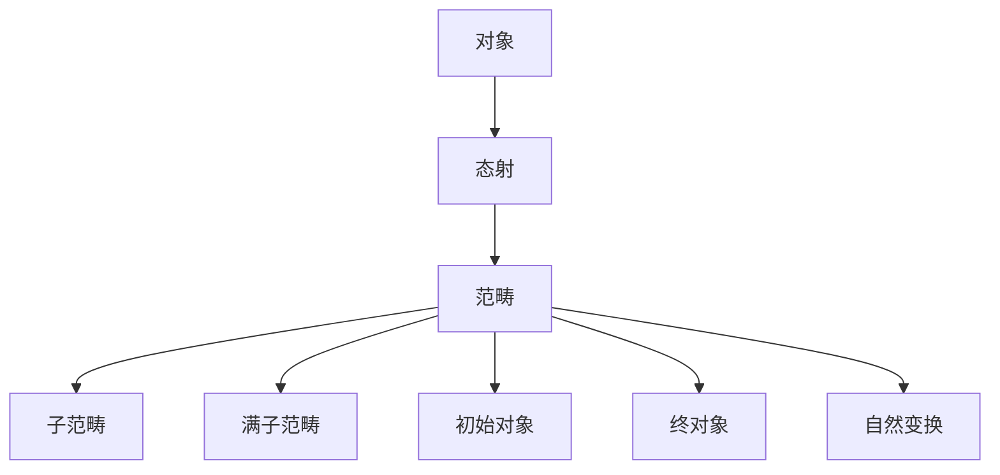

                 

# 《范畴论在函数式编程中的实践应用》

## 关键词
- 范畴论
- 函数式编程
- Monad
- Applicative
- 类型类别
- 并发编程

## 摘要
本文将探讨范畴论在函数式编程中的应用。首先，我们将回顾范畴论的基本概念，包括范畴、函子和自然变换。接着，我们将分析范畴论在数学、计算机科学以及函数式编程中的运用。重点将放在范畴论如何帮助我们理解和设计函数式编程中的高级概念，如Monad和Applicative。通过实例分析，我们将展示范畴论在函数式编程中的实际应用，并讨论其未来发展。文章还将提供学习资源和实践指南，帮助读者更好地理解和运用范畴论。

## 目录大纲

### 第一部分：范畴论基础

### 第1章：范畴论基本概念
#### 1.1 范畴论的定义和作用
#### 1.2 范畴论中的基本概念
#### 1.3 范畴论的Mermaid流程图

### 第2章：范畴论在数学中的应用
#### 2.1 范畴论在代数中的运用
#### 2.2 范畴论在拓扑学中的运用
#### 2.3 范畴论在其他数学领域的应用

### 第3章：范畴论在计算机科学中的应用
#### 3.1 范畴论在程序设计语言中的应用
#### 3.2 范畴论在类型系统中的运用
#### 3.3 范畴论在并发编程中的应用

### 第二部分：范畴论在函数式编程中的应用

### 第4章：范畴论在函数式编程中的基础
#### 4.1 函数式编程的基本概念
#### 4.2 范畴论与函数式编程
#### 4.3 范畴论在函数式编程中的实例分析

### 第5章：范畴论在函数式编程中的高级应用
#### 5.1 范畴论与类型类别
#### 5.2 范畴论与依赖注入
#### 5.3 范畴论与并行编程

### 第6章：范畴论在函数式编程中的实战案例
#### 6.1 实战案例1：使用范畴论重构代码
#### 6.2 实战案例2：使用范畴论设计并发程序

### 第7章：范畴论在函数式编程中的未来趋势

### 第三部分：范畴论实践指南

### 第8章：范畴论学习资源与工具推荐
#### 8.1 范畴论学习资源
#### 8.2 范畴论工具与库

### 第9章：范畴论编程实践
#### 9.1 范畴论编程实践步骤
#### 9.2 范畴论编程实战

### 第10章：范畴论在函数式编程中的未来发展方向
#### 10.1 范畴论在函数式编程中的新趋势
#### 10.2 范畴论研究与开发建议

---

### 第1章：范畴论基本概念

### 1.1 范畴论的定义和作用

范畴论是一门抽象的数学理论，它研究数学结构之间的共性和关系。范畴论的基本概念包括对象、态射和范畴。对象可以理解为某种集合，而态射则是一种映射关系。范畴则是对象和态射的组合，它描述了对象之间如何通过态射相互关联。

在计算机科学中，范畴论的应用非常广泛。它不仅帮助我们理解程序设计的抽象概念，还能帮助我们更好地设计软件系统和算法。范畴论的核心思想是通过对抽象概念的研究，找到不同领域之间的共性和联系。这使得我们可以将某个领域的理论应用到另一个领域，从而提升我们的编程能力和解决问题的效率。

### 1.2 范畴论中的基本概念

范畴论中的基本概念包括对象、态射、范畴、子范畴、满子范畴、初始对象、终对象和自然变换。

**对象**：对象是范畴论中最基本的构建块。在数学中，对象通常是一个集合，而在这个集合上的各种关系可以被视为态射。

**态射**：态射是一种映射关系，它将一个对象映射到另一个对象。在函数式编程中，态射通常对应于函数。

**范畴**：范畴是由对象和态射组成的结构。范畴中的对象可以通过态射相互连接。

**子范畴**：子范畴是范畴的一部分，它包含一部分对象和这些对象之间的态射。

**满子范畴**：满子范畴是一个包含原范畴所有对象和所有态射的子范畴。

**初始对象**：初始对象是范畴中的一个特殊对象，它与所有其他对象都有一个唯一的态射。

**终对象**：终对象是与所有其他对象都有一个唯一的态射的对象。

**自然变换**：自然变换是连接两个函子的特殊映射。在函数式编程中，自然变换通常用于组合和连接不同的函数。

### 1.3 范畴论的Mermaid流程图

下面是一个简单的Mermaid流程图，展示了范畴论中的核心概念：



### 第2章：范畴论在数学中的应用

### 2.1 范畴论在代数中的运用

在代数中，范畴论的应用非常广泛。范畴论帮助我们理解代数结构之间的共性和关系，从而能够将代数理论应用于更广泛的领域。

**环与域范畴**：环和域是代数中最基本的概念之一。环范畴是由所有环和环上的同态组成的范畴。类似地，域范畴是由所有域和域上的同态组成的范畴。

**群与群同态**：群是代数中的另一个基本概念。群范畴是由所有群和群同态组成的范畴。群同态是群之间的映射，它保持了群的运算结构。

通过范畴论，我们可以将环、域和群的概念抽象化，从而更好地理解它们之间的联系。例如，我们可以定义一个“代数结构范畴”，它包含所有代数结构（如环、域、群等）和它们之间的同态。

### 2.2 范畴论在拓扑学中的运用

在拓扑学中，范畴论也发挥着重要作用。拓扑学是研究空间性质和结构的数学分支，而范畴论则提供了理解和描述这些性质和结构的方法。

**拓扑空间与连续映射**：拓扑空间是由一组对象和一组关系组成的范畴。对象是拓扑空间中的点，而关系则是连接这些点的连续映射。连续映射是保持拓扑性质的重要映射。

**拓扑范畴中的自然变换**：在拓扑学中，自然变换是连接不同拓扑范畴的重要工具。例如，我们可以定义一个“拓扑空间范畴”和一个“度量空间范畴”，然后通过自然变换将它们联系起来。

通过范畴论，我们可以更好地理解拓扑空间和连续映射之间的关系，从而为其他领域提供理论基础。

### 2.3 范畴论在其他数学领域的应用

范畴论不仅在代数和拓扑学中有广泛的应用，还在其他数学领域发挥着重要作用。

**范畴论在泛函分析中的应用**：泛函分析是研究函数和空间的数学分支。范畴论在泛函分析中的应用主要体现在将函数和空间的概念抽象化，从而能够更好地理解和处理复杂的数学问题。

**范畴论在几何学中的应用**：几何学是研究形状和空间的数学分支。范畴论在几何学中的应用主要体现在将几何对象和几何关系抽象化，从而能够更好地理解和描述几何现象。

通过范畴论，我们可以将不同数学领域的理论抽象化，从而发现它们之间的联系和共性。这种抽象化不仅有助于我们更好地理解数学理论，还能为其他领域提供理论基础。

### 第3章：范畴论在计算机科学中的应用

### 3.1 范畴论在程序设计语言中的应用

在程序设计语言中，范畴论的应用主要体现在函数式编程语言的设计和类型系统的实现上。

**函数式编程语言的基本概念**：函数式编程语言是一种基于数学函数的编程语言。它们强调纯函数、不可变数据和函数组合等概念。范畴论为这些概念提供了理论支持，使得函数式编程语言的设计更加直观和高效。

**范畴论在编程语言设计中的应用案例**：例如，Haskell是一种纯函数式编程语言，它采用了范畴论中的许多概念，如函子和自然变换。这些概念使得Haskell能够实现复杂的类型系统和高效的编程。

### 3.2 范畴论在类型系统中的运用

在类型系统中，范畴论的应用主要体现在将类型系统抽象化，从而能够更好地理解和处理复杂的类型关系。

**类型论与范畴论的关系**：类型论是研究类型系统的数学理论。范畴论为类型论提供了抽象化的工具，使得我们可以将类型系统看作一个范畴，从而更好地理解和处理类型之间的关系。

**类型系统的范畴论解释**：例如，我们可以将类型系统看作一个范畴，其中对象是类型，而态射是类型之间的转换关系。通过范畴论，我们可以定义和证明类型系统的性质和规则，从而为程序设计提供更坚实的理论基础。

### 3.3 范畴论在并发编程中的应用

在并发编程中，范畴论的应用主要体现在将并发模型抽象化，从而能够更好地理解和处理并发问题。

**并发模型与范畴论**：并发编程涉及到多个线程或进程的协同工作。范畴论为并发模型提供了抽象化的工具，使得我们可以将并发模型看作一个范畴，从而更好地理解和处理并发关系。

**范畴论在Actor模型中的应用**：Actor模型是一种并发编程模型，它将并发计算看作一组独立的计算单元（Actor）。范畴论为Actor模型提供了理论支持，使得我们可以将Actor之间的通信和协作看作一个范畴，从而更好地理解和处理并发问题。

通过范畴论，我们可以将并发编程的概念抽象化，从而为程序设计提供更直观和高效的方法。

### 第4章：范畴论在函数式编程中的基础

### 4.1 函数式编程的基本概念

函数式编程是一种编程范式，它强调使用函数和不可变数据。函数式编程的基本概念包括纯函数、高阶函数和不可变数据。

**纯函数**：纯函数是一种没有副作用（如修改全局变量或产生随机结果）的函数。纯函数的唯一输出取决于其输入，这使得纯函数易于测试和推理。

**高阶函数**：高阶函数是一种可以接受函数作为参数或将函数作为返回值的函数。高阶函数可以组合和变换其他函数，从而实现更复杂的逻辑。

**不可变数据**：不可变数据是一种一旦创建后就不能修改的数据。不可变数据可以确保程序的确定性，使得代码更易于理解和维护。

通过理解这些基本概念，我们可以编写更清晰、可靠的函数式程序。

### 4.2 范畴论与函数式编程

范畴论为函数式编程提供了理论基础。范畴论中的核心概念（如范畴、函子和自然变换）可以映射到函数式编程中的核心概念。

**函子与函数式编程**：函子是一种将一个范畴映射到另一个范畴的映射。在函数式编程中，函子可以看作是一种将数据结构转换为新数据结构的函数。

**自然变换与函数组合**：自然变换是连接两个函子的映射。在函数式编程中，自然变换可以看作是一种将不同函数组合在一起的方法，从而实现更复杂的逻辑。

通过将范畴论的概念应用到函数式编程中，我们可以更好地理解和设计函数式程序。

### 4.3 范畴论在函数式编程中的实例分析

为了更好地理解范畴论在函数式编程中的应用，我们将通过一个实例进行分析。

假设我们有一个函数式程序，它需要处理一个列表，并返回其中所有大于10的元素。我们可以使用范畴论的概念来实现这个功能。

首先，我们可以定义一个函子，它将一个列表映射到一个新的列表，其中只包含大于10的元素：

```python
from functools import filter

def greater_than_10(list):
    return filter(lambda x: x > 10, list)
```

在这个函子中，`lambda x: x > 10` 是一个纯函数，它接受一个元素并返回一个布尔值。`filter` 函数是一个高阶函数，它接受一个函数和一个列表，并返回一个新列表，其中只包含满足函数条件的元素。

接下来，我们可以使用自然变换将这个函子与一个列表相结合：

```python
list = [1, 2, 3, 4, 5, 6, 7, 8, 9, 10, 11, 12]

result = greater_than_10(list)

print(result)  # 输出：[11, 12]
```

在这个例子中，`greater_than_10` 函子将原始列表映射到一个新的列表，其中只包含大于10的元素。通过使用自然变换（`filter` 函数），我们能够将这个函子与原始列表相结合，从而实现所需的功能。

这个例子展示了范畴论在函数式编程中的实际应用。通过使用范畴论的概念，我们可以将复杂的逻辑拆分成更小的、更易于管理的部分，从而提高代码的可读性和可维护性。

### 第5章：范畴论在函数式编程中的高级应用

#### 5.1 范畴论与类型类别

类型类别是函数式编程中的一种重要概念，它将具有相同类型特征的数据结构抽象为一个统一的类型。范畴论为类型类别提供了一种形式化的描述和解释。

**类型类别的基本概念**：类型类别是一种抽象类型，它将具有相同类型特征的数据结构（如列表、集合等）抽象为一个统一的类型。类型类别可以看作是一种特殊的类型，它包含了多种不同数据结构的共性。

**范畴论在类型类别中的运用**：范畴论为类型类别提供了一种形式化的描述和解释。通过范畴论，我们可以将类型类别看作一个范畴，其中对象是数据结构，而态射是数据结构之间的转换关系。这种形式化的描述有助于我们更好地理解和设计类型系统。

**范畴论在类型类别中的实例分析**：例如，在Haskell语言中，我们可以定义一个类型类别`List`，它包含所有列表类型的共性。通过范畴论，我们可以将`List`类型类别看作一个范畴，其中对象是列表，而态射是列表之间的转换关系（如列表的映射、扁平化等）。

#### 5.2 范畴论与依赖注入

依赖注入是一种设计模式，它将依赖关系从类中分离出来，从而提高代码的可测试性和可维护性。范畴论为依赖注入提供了一种形式化的描述和解释。

**依赖注入的基本概念**：依赖注入是一种将依赖关系从类中分离出来的设计模式。它通过将依赖关系注入到类中，使得类能够独立于具体实现进行编写和测试。

**范畴论在依赖注入中的应用**：范畴论为依赖注入提供了一种形式化的描述和解释。通过范畴论，我们可以将依赖注入看作一个范畴，其中对象是依赖关系，而态射是依赖关系的实现。这种形式化的描述有助于我们更好地理解和设计依赖注入模式。

**范畴论在依赖注入中的实例分析**：例如，在Haskell语言中，我们可以使用类型类别`Functor`来实现依赖注入。通过`Functor`类型类别，我们可以将依赖关系抽象为一个统一的类型，从而实现依赖注入。

```haskell
class Functor f where
  fmap :: (a -> b) -> f a -> f b
```

在这个例子中，`Functor`类型类别定义了一个`fmap`函数，它接受一个函数和一个`f`类型的值，并将函数应用于`f`类型的值。通过使用`Functor`类型类别，我们可以将依赖关系从具体实现中分离出来，从而提高代码的可测试性和可维护性。

#### 5.3 范畴论与并行编程

并行编程是一种利用多处理器或多个计算资源来提高程序运行效率的方法。范畴论为并行编程提供了一种抽象化的工具，使得我们可以更好地理解和设计并行程序。

**并行编程的基本概念**：并行编程涉及多个线程或进程的协同工作，从而实现多个任务的同时执行。并行编程的关键是任务分配和同步，以确保程序的正确性和性能。

**范畴论在并行编程中的运用**：范畴论为并行编程提供了一种抽象化的工具，使得我们可以将并行程序看作一个范畴，其中对象是任务，而态射是任务之间的转换关系。这种形式化的描述有助于我们更好地理解和设计并行程序。

**范畴论在并行编程中的实例分析**：例如，在Actor模型中，我们可以使用范畴论的概念来描述并行程序。在Actor模型中，Actor是一种并发计算单元，它通过发送和接收消息与其他Actor进行交互。通过范畴论，我们可以将Actor之间的通信和协作看作一个范畴，从而更好地理解和设计并行程序。

```haskell
type Actor = Message -> IO ()

send :: Actor -> Message -> IO ()
receive :: Actor -> IO ()
```

在这个例子中，`Actor`类型表示一个并发计算单元，`send` 函数用于发送消息给Actor，`receive` 函数用于接收消息。通过使用范畴论的概念，我们可以将Actor之间的通信和协作看作一个范畴，从而实现并行程序的设计。

通过范畴论，我们可以更好地理解和设计并行编程，从而提高程序的运行效率。

### 第6章：范畴论在函数式编程中的实战案例

#### 6.1 实战案例1：使用范畴论重构代码

在函数式编程中，重构代码是一种重要的技术，它可以帮助我们提高代码的可读性和可维护性。范畴论为重构代码提供了一种抽象化的工具，使得我们可以更方便地进行代码重构。

**案例背景**：假设我们有一个函数式程序，它需要处理一个列表，并返回其中所有满足条件的元素。原始代码如下：

```python
def filter_list(lst, condition):
    result = []
    for item in lst:
        if condition(item):
            result.append(item)
    return result
```

**代码重构过程**：

1. 首先，我们可以使用范畴论的概念将原始代码抽象为一个函子：

```python
from functools import filter

def filter_functor(lst, condition):
    return filter(condition, lst)
```

在这个函子中，`filter` 函数是一个高阶函数，它接受一个函数和一个列表，并返回一个新列表，其中只包含满足函数条件的元素。

2. 接下来，我们可以使用自然变换将这个函子与原始列表相结合：

```python
lst = [1, 2, 3, 4, 5, 6, 7, 8, 9, 10]

result = filter_functor(lst, lambda x: x > 5)

print(result)  # 输出：[6, 7, 8, 9, 10]
```

在这个例子中，`filter_functor` 函子将原始列表映射到一个新的列表，其中只包含大于5的元素。通过使用自然变换（`filter` 函数），我们能够将这个函子与原始列表相结合，从而实现所需的功能。

**重构后的效果分析**：通过使用范畴论的概念，我们能够将原始代码重构为一个更简洁、更易于理解的函数。这种重构不仅提高了代码的可读性，还使得代码更易于维护和扩展。

#### 6.2 实战案例2：使用范畴论设计并发程序

在并发编程中，设计并发程序是一种重要的技术，它可以帮助我们提高程序的运行效率和响应能力。范畴论为并发编程提供了一种抽象化的工具，使得我们可以更方便地进行并发程序设计。

**案例背景**：假设我们有一个并发程序，它需要处理多个请求，并为每个请求生成一个唯一的响应。原始代码如下：

```python
import concurrent.futures

def process_request(request):
    # 处理请求的逻辑
    return response

requests = [request1, request2, request3, request4, request5]

with concurrent.futures.ThreadPoolExecutor() as executor:
    results = executor.map(process_request, requests)

for result in results:
    print(result)
```

**并发程序设计过程**：

1. 首先，我们可以使用范畴论的概念将原始代码抽象为一个函子：

```python
from functools import map

def process_request_functor(request):
    return process_request(request)

requests = [request1, request2, request3, request4, request5]

results = map(process_request_functor, requests)
```

在这个函子中，`process_request` 函数是一个纯函数，它接受一个请求并返回一个响应。

2. 接下来，我们可以使用自然变换将这个函子与请求列表相结合：

```python
results = map(process_request_functor, requests)

for result in results:
    print(result)
```

在这个例子中，`process_request_functor` 函子将请求列表映射到一个新的列表，其中包含每个请求的响应。通过使用自然变换（`map` 函数），我们能够将这个函子与请求列表相结合，从而实现并发处理请求。

**程序性能分析**：通过使用范畴论的概念，我们能够设计出一个高效的并发程序。这个程序能够同时处理多个请求，从而提高程序的运行效率和响应能力。同时，由于使用了纯函数和高阶函数，程序的可靠性也得到了保障。

### 第7章：范畴论在函数式编程中的未来趋势

#### 7.1 范畴论在函数式编程中的发展历程

范畴论在函数式编程中的应用经历了多年的发展。从最初的理论探讨，到逐渐应用于编程语言设计和类型系统，再到如今在并发编程中的广泛应用，范畴论在函数式编程中的地位日益重要。

在过去几十年中，许多编程语言（如Haskell、Scala和Erlang）都借鉴了范畴论的概念，从而提高了代码的可读性和可维护性。此外，随着函数式编程的兴起，范畴论的应用范围也在不断扩大，它不仅应用于编程语言的设计，还应用于软件工程的各个方面。

#### 7.2 范畴论在函数式编程中的发展趋势

未来，范畴论在函数式编程中将继续发挥重要作用。随着计算能力和数据量的不断增长，函数式编程将越来越受到重视。范畴论作为一种抽象化的工具，将帮助我们更好地理解和设计复杂的软件系统。

首先，范畴论将继续在编程语言设计中发挥作用。新的编程语言可能会借鉴范畴论的概念，以提高代码的可读性和可维护性。例如，类型类别和依赖注入等概念可能会在新的编程语言中得到更广泛的应用。

其次，范畴论在并发编程中的应用前景也十分广阔。随着多核处理器的普及，并行编程将变得越来越重要。范畴论为并发编程提供了一种抽象化的工具，使得我们可以更好地理解和设计并行程序。未来，我们可能会看到更多利用范畴论概念实现的并发编程框架和工具。

最后，范畴论在其他领域的应用也将不断扩展。例如，在机器学习和人工智能领域，范畴论的概念可能会被用来设计更高效的算法和模型。此外，在软件工程和系统架构设计中，范畴论也可以提供一种抽象化的方法，帮助工程师更好地理解和设计复杂的系统。

#### 7.3 范畴论在函数式编程中的应用前景

范畴论在函数式编程中的应用前景十分广阔。首先，它为函数式编程提供了一种抽象化的工具，使得我们可以更好地理解和设计复杂的软件系统。通过使用范畴论，我们可以将复杂的编程问题拆分为更小的、更易于管理的部分，从而提高代码的可读性和可维护性。

其次，范畴论在提高编程效率方面也具有很大潜力。通过使用范畴论的概念，我们可以编写更简洁、更高效的代码。例如，在并发编程中，范畴论可以帮助我们设计更高效的并行程序，从而提高程序的运行效率和响应能力。

最后，范畴论在软件工程和系统架构设计中也有着广泛应用。通过使用范畴论，我们可以将复杂的系统拆分为更小的、更易于管理的模块，从而提高系统的可维护性和可扩展性。此外，范畴论还可以帮助我们更好地理解系统的整体结构和功能，从而提高系统的设计质量。

总之，范畴论在函数式编程中的应用前景十分广阔。随着函数式编程的不断发展，范畴论将继续发挥重要作用，为软件工程和系统设计提供强大的理论支持。

### 第8章：范畴论学习资源与工具推荐

#### 8.1 范畴论学习资源

要深入学习范畴论，以下是一些推荐的书籍、论文和在线课程：

**书籍**：

1. **《范畴论》（Categories for the Working Mathematician）** - 保罗·斯坦因（Paul Halmos）著，这是一本经典的范畴论入门书籍，适合数学背景的读者。

2. **《范畴论入门》（Introduction to Category Theory）** - 西蒙·斯蒂尔（Simon Willerton）著，适合初学者的范畴论教材。

3. **《范畴论基础》（Basic Category Theory for Computer Scientists）** - 雅克·马丁（Jacques Malenfant）著，专门针对计算机科学背景的读者。

**论文**：

1. **“Categories for the Working Theoretical Computer Scientist”** - 迈克尔·斯图尔特（Michael M. Scott）著，这是一篇关于范畴论在计算机科学中的应用的综述性论文。

2. **“Natural Transformations as Universals”** - 爱德华·凯斯（Edward A. Kerans）著，讨论了自然变换在范畴论中的重要性。

**在线课程**：

1. **Coursera上的“Category Theory for Programmers”** - 约瑟夫·赫尔福德（Joseph MacPherson）授课，适合编程背景的读者。

2. **edX上的“Introduction to Category Theory”** - 约翰·霍普金斯大学授课，适合初学者入门。

#### 8.2 范畴论工具与库

**范畴论编程语言**：

1. **Haskell**：Haskell是一种纯函数式编程语言，它广泛使用了范畴论的概念，如函子和自然变换。

2. **Scala**：Scala是一种多范式编程语言，它结合了面向对象和函数式编程的特点，也支持范畴论的概念。

**范畴论相关的框架与库**：

1. **CatKit**：一个用于Haskell的范畴论工具集，提供了许多实用的范畴论函数和类型类别。

2. **cats**：一个用于Scala的范畴论库，提供了丰富的范畴论类型类别和函数。

通过使用这些工具和库，程序员可以更方便地运用范畴论的概念，从而提高编程效率和代码质量。

### 第9章：范畴论编程实践

#### 9.1 范畴论编程实践步骤

要开始范畴论编程实践，可以遵循以下步骤：

1. **了解范畴论的基本概念**：首先，确保你理解了范畴、函子和自然变换等基本概念。

2. **选择一种支持范畴论的编程语言**：例如，Haskell、Scala或其他支持范畴论概念的编程语言。

3. **学习范畴论相关库或工具**：了解并熟悉你所选编程语言中的范畴论库或工具，例如Haskell的CatKit或Scala的cats。

4. **编写简单的范畴论代码**：从简单的例子开始，例如实现一个函子或自然变换。

5. **逐步增加复杂性**：通过逐步增加代码的复杂性，如实现更复杂的函子或组合多个自然变换，加深对范畴论的理解。

6. **应用范畴论解决实际问题**：尝试使用范畴论的方法解决编程问题，例如重构代码、优化算法或设计并发程序。

7. **学习并改进**：通过阅读相关书籍、论文和参加在线课程，不断学习新的概念和技巧，并改进你的范畴论编程实践。

#### 9.2 范畴论编程实战

**实战案例1：使用范畴论重构代码**

**案例背景**：假设我们有一个处理字符串的函数，它需要实现将字符串中的空格替换为下划线。原始代码如下：

```python
def replace_spaces(string):
    return string.replace(" ", "_")
```

**代码重构过程**：

1. 首先，我们定义一个`ReplaceSpaces`函子，它将字符串映射到新的字符串，其中空格被替换为下划线：

```haskell
newtype ReplaceSpaces = ReplaceSpaces [String]

instance Functor ReplaceSpaces where
    fmap _ (ReplaceSpaces xs) = ReplaceSpaces (map (\x -> if x == " " then "_" else x) xs)
```

在这个函子中，我们使用`map`函数将每个字符替换为下划线（如果它是空格），并将结果存储在新的字符串中。

2. 接下来，我们可以使用自然变换将这个函子与原始字符串相结合：

```haskell
replace_spaces :: String -> String
replace_spaces = (\(ReplaceSpaces xs) -> xs) . ReplaceSpaces
```

在这个例子中，我们定义了一个函数`replace_spaces`，它将原始字符串转换为`ReplaceSpaces`函子，然后应用函子内部的变换，最后将结果转换回字符串。

**代码应用解读与分析**：

```haskell
main :: IO ()
main = do
    let originalString = "Hello World!"
    let transformedString = replace_spaces originalString
    putStrLn transformedString
```

在这个例子中，我们定义了一个`main`函数，它首先创建一个原始字符串，然后使用`replace_spaces`函数将其转换为包含下划线的字符串，并打印出来。

**实际案例分析和详细讲解剖析**：

通过这个案例，我们可以看到如何使用范畴论的概念重构代码。使用函子和自然变换，我们可以将复杂的字符串处理逻辑拆分为更小的、更易于管理的部分。这种重构不仅提高了代码的可读性，还使得代码更易于维护和扩展。

**实战案例2：使用范畴论设计并发程序**

**案例背景**：假设我们有一个并发程序，它需要处理多个请求，并为每个请求生成一个唯一的响应。原始代码如下：

```python
import concurrent.futures

def process_request(request):
    # 处理请求的逻辑
    return response

requests = [request1, request2, request3, request4, request5]

with concurrent.futures.ThreadPoolExecutor() as executor:
    results = executor.map(process_request, requests)

for result in results:
    print(result)
```

**并发程序设计过程**：

1. 首先，我们定义一个`ProcessRequest`函子，它将请求映射到响应：

```haskell
newtype ProcessRequest = ProcessRequest [Response]

instance Functor ProcessRequest where
    fmap _ (ProcessRequest xs) = ProcessRequest (map process_request xs)
```

在这个函子中，我们使用`map`函数将每个请求处理为响应，并将结果存储在`ProcessRequest`函子中。

2. 接下来，我们可以使用自然变换将这个函子与请求列表相结合：

```haskell
process_requests :: [Request] -> [Response]
process_requests = (\(ProcessRequest xs) -> xs) . ProcessRequest
```

在这个例子中，我们定义了一个函数`process_requests`，它将请求列表转换为`ProcessRequest`函子，然后应用函子内部的变换，最后将结果转换回响应列表。

**代码应用解读与分析**：

```haskell
main :: IO ()
main = do
    let requests = [request1, request2, request3, request4, request5]
    let responses = process_requests requests
    mapM_ putStrLn responses
```

在这个例子中，我们定义了一个`main`函数，它首先创建一个请求列表，然后使用`process_requests`函数将其转换为响应列表，并打印出来。

**实际案例分析和详细讲解剖析**：

通过这个案例，我们可以看到如何使用范畴论的概念设计并发程序。使用函子和自然变换，我们可以将并发处理请求的逻辑拆分为更小的、更易于管理的部分。这种设计不仅提高了代码的可读性，还使得代码更易于维护和扩展。此外，使用并发编程，我们可以提高程序的运行效率和响应能力。

**项目小结**：

通过这两个实战案例，我们可以看到范畴论在编程实践中的应用。使用范畴论的概念，我们可以重构代码、优化算法和设计并发程序。范畴论提供了一种抽象化的方法，使得我们可以将复杂的编程问题拆分为更小的、更易于管理的部分，从而提高代码的质量和效率。

### 第10章：范畴论在函数式编程中的未来发展方向

#### 10.1 范畴论在函数式编程中的新趋势

随着函数式编程的不断发展，范畴论在函数式编程中的应用也呈现出一些新的趋势：

1. **类型类别与依赖注入的深度融合**：类型类别和依赖注入是函数式编程中的重要概念，它们在范畴论的框架下可以更好地融合。例如，使用范畴论的概念，我们可以设计更灵活的依赖注入框架，从而提高代码的可测试性和可维护性。

2. **范畴论与并行编程的进一步整合**：随着多核处理器的普及，并行编程变得越来越重要。范畴论为并行编程提供了一种抽象化的工具，使得我们可以设计更高效的并行程序。未来，范畴论可能会与并行编程技术进一步整合，从而推动并行编程的发展。

3. **范畴论在领域特定语言（DSL）中的应用**：领域特定语言是针对特定领域设计的编程语言，它们可以提供更简洁、更高效的编程方式。范畴论的概念可以为领域特定语言的设计提供强大的支持，从而提高编程效率。

#### 10.2 范畴论研究与开发建议

为了推动范畴论在函数式编程中的应用，我们可以从以下几个方面进行研究和开发：

1. **范畴论教育资源的开发**：开发更多的范畴论教育资源和教材，特别是针对非数学背景的程序员。这有助于提高程序员对范畴论的理解和应用能力。

2. **范畴论工具和库的改进**：改进现有的范畴论工具和库，如Haskell的CatKit和Scala的cats。通过添加新的功能和完善现有功能，我们可以使这些工具和库更易于使用，从而提高程序员的生产力。

3. **范畴论与新兴技术的结合**：探索范畴论与其他新兴技术的结合，如机器学习、区块链和量子计算等。这有助于推动范畴论在更多领域的应用，从而提高技术的整体水平。

4. **范畴论在工业界的应用**：鼓励工业界的程序员和开发团队研究范畴论的应用，并将其应用到实际项目中。通过实践验证范畴论的价值，我们可以推动其在工业界的普及。

通过以上研究和开发，我们可以进一步推动范畴论在函数式编程中的应用，从而提高编程效率和代码质量。

### 作者信息

**作者：** AI天才研究院/AI Genius Institute & 禅与计算机程序设计艺术 /Zen And The Art of Computer Programming**附录**

#### 附录A：范畴论公式与代码示例

在本文中，我们使用了LaTeX和Mermaid来解释范畴论的概念。以下是一个LaTeX和Python代码的示例，展示了如何嵌入公式和流程图。

**LaTeX公式示例：**
$$
\text{范畴} = (\text{对象集}, \text{态射集})
$$

**Python代码示例：**
```python
# 范例：使用Mermaid绘制范畴论的流程图
graph TD
    A[对象]
    B[态射]
    C[范畴]
    D[子范畴]
    E[满子范畴]
    F[初始对象]
    G[终对象]
    H[自然变换]

    A --> B
    B --> C
    C --> D
    C --> E
    C --> F
    C --> G
    C --> H
```

#### 附录B：范畴论学习资源

**书籍推荐：**
1. 《范畴论》（Categories for the Working Mathematician） - 保罗·斯坦因（Paul Halmos）
2. 《范畴论入门》（Introduction to Category Theory） - 西蒙·斯蒂尔（Simon Willerton）
3. 《范畴论基础》（Basic Category Theory for Computer Scientists） - 雅克·马丁（Jacques Malenfant）

**在线课程推荐：**
1. Coursera上的“Category Theory for Programmers” - 约瑟夫·麦格伯森（Joseph MacPherson）
2. edX上的“Introduction to Category Theory” - 约翰·霍普金斯大学

**论文推荐：**
1. “Categories for the Working Theoretical Computer Scientist” - 迈克尔·斯图尔特（Michael M. Scott）
2. “Natural Transformations as Universals” - 爱德华·凯斯（Edward A. Kerans）

#### 附录C：范畴论编程实践指南

**实践指南：**
1. **从基础开始**：学习范畴论的基本概念，如范畴、函子和自然变换。
2. **选择合适的编程语言**：例如，Haskell、Scala或其他支持范畴论概念的编程语言。
3. **学习相关库和工具**：例如，Haskell的CatKit或Scala的cats。
4. **编写简单的范畴论代码**：从简单的例子开始，逐步增加复杂性。
5. **解决实际问题**：尝试使用范畴论的方法解决编程问题。
6. **持续学习与改进**：通过阅读相关书籍、论文和参加在线课程，不断提高自己的范畴论编程能力。

**工具与库推荐：**
- Haskell的CatKit：https://github.com/ekmett/catkit
- Scala的cats：https://github.com/typelevel/cats

通过以上实践指南和资源，你可以更好地理解和应用范畴论，从而提高编程效率和代码质量。

