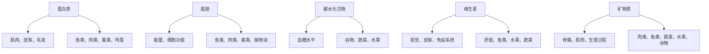
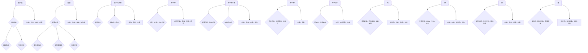

                 

## 猫咪的科学喂养重要性

科学喂养对于猫咪的健康和幸福至关重要。合理的饮食不仅能满足猫咪的基本营养需求，还能预防疾病、提高免疫力，延长猫咪的寿命。本文将从多个角度详细探讨猫咪的科学喂养，包括猫咪的基本营养需求、饮食管理、饮食选择、特殊饮食需求、饮食安全、饮食与行为的关系以及日常饮食管理等内容。

### 1.1 猫咪的基本营养需求

首先，我们需要了解猫咪的基本营养需求，这包括宏量营养素和微量营养素。宏量营养素主要包括蛋白质、脂肪和碳水化合物，而微量营养素则包括维生素和矿物质。

#### 1.1.1 蛋白质

蛋白质是猫咪身体的重要组成部分，对于肌肉、皮肤、毛发等组织的生长和修复至关重要。蛋白质的需求量通常占猫咪饮食的30%到40%。猫咪可以从鱼类、肉类、禽类、鸡蛋等食物中获取蛋白质。

#### 1.1.2 脂肪

脂肪是猫咪能量的主要来源，同时也支持细胞功能的正常运作。脂肪的需求量通常占猫咪饮食的20%到30%。脂肪主要从鱼类、肉类、禽类、植物油等食物中获取。

#### 1.1.3 碳水化合物

碳水化合物是猫咪能量的次要来源，对于维持正常的血糖水平有重要作用。碳水化合物的需求量通常占猫咪饮食的20%到30%。碳水化合物主要从谷物、蔬菜、水果等食物中获取。

#### 1.2 微量营养素的重要性

微量营养素对于猫咪的健康同样至关重要。维生素和矿物质是其中的重要组成部分。

##### 1.2.1 维生素

维生素是猫咪正常生理功能所必需的微量有机物质。不同类型的维生素具有不同的功能，例如：

- **维生素A**：支持视觉和皮肤健康。
- **维生素B群**：参与能量代谢和神经系统功能。
- **维生素C**：支持免疫系统。
- **维生素D**：帮助钙的吸收和骨骼健康。

维生素主要从肝脏、鱼类、水果和蔬菜等食物中获取。

##### 1.2.2 矿物质

矿物质是猫咪体内必不可少的无机元素，对于骨骼健康、肌肉功能和其他生理过程至关重要。常见的矿物质包括：

- **钙**：骨骼和牙齿的主要成分。
- **磷**：与钙一起维持骨骼健康。
- **钾**：维持细胞功能。
- **镁**：参与酶的激活和神经传递。

矿物质主要从肉类、鱼类、蔬菜、水果和谷物等食物中获取。

### 1.3 猫咪营养素需求的Mermaid流程图

为了更好地理解猫咪的营养需求，我们可以使用Mermaid流程图来展示各类营养素的来源和作用。

通过上述的Mermaid流程图，我们可以清晰地看到各类营养素在猫咪健康中的重要作用及其来源。接下来，我们将进一步探讨猫咪的饮食管理，了解如何确保猫咪获得均衡的营养。

## 第1章：猫咪的基本营养需求

### 1.1 猫咪所需的宏量营养素

#### 1.1.1 蛋白质

蛋白质是猫咪身体的重要组成部分，对于肌肉、皮肤、毛发等组织的生长和修复至关重要。蛋白质的需求量通常占猫咪饮食的30%到40%。

**定义与作用**：蛋白质是由氨基酸组成的大分子，是生命活动的基石。它们在体内起到多种关键作用，包括：

- **构建和修复组织**：肌肉、皮肤、毛发和骨骼等身体组织的生长和修复需要蛋白质。
- **酶和激素的合成**：蛋白质是酶和某些激素的组成部分，它们调节身体的各种生化反应。
- **免疫系统的支持**：蛋白质是抗体和免疫细胞的重要组成部分，对于抵抗疾病至关重要。

**推荐摄入量**：根据猫咪的体重和活动水平，蛋白质的摄入量会有所不同。一般建议的摄入量范围为：
- 幼猫：约30%
- 成年猫：约28%
- 老年猫：约26%

**食物来源**：猫咪可以从多种食物中获取蛋白质，以下是一些富含蛋白质的食物：

- **鱼类**：如金枪鱼、鲑鱼等。
- **肉类**：如鸡肉、牛肉、火鸡肉等。
- **禽类**：如鸡蛋和鸭肉。
- **豆类**：虽然猫咪是肉食动物，但豆类如豆腐可以作为蛋白质的替代来源。

#### 1.1.2 脂肪

脂肪是猫咪能量的主要来源，同时也是维持细胞功能和健康所必需的。脂肪的需求量通常占猫咪饮食的20%到30%。

**定义与作用**：脂肪是高度浓缩的能量来源，每克脂肪能提供约9千卡的能量，比蛋白质和碳水化合物高出约2倍。此外，脂肪还具备以下作用：

- **维生素吸收**：某些维生素（如维生素A、D、E和K）需要脂肪来帮助吸收。
- **细胞膜构成**：细胞膜主要由磷脂双层构成，而磷脂是由脂肪酸组成的。
- **激素合成**：一些激素的合成也需要脂肪。

**推荐摄入量**：脂肪的摄入量应根据猫咪的年龄、体重和活动水平进行调整。以下是一般推荐范围：

- 幼猫：约30%
- 成年猫：约20%-25%
- 老年猫：约15%-20%

**食物来源**：猫咪可以从多种食物中获取脂肪，以下是一些富含脂肪的食物：

- **鱼类**：如鲑鱼、鲱鱼等。
- **肉类**：如牛肉、羊肉、火鸡肉等。
- **植物油**：如橄榄油、葵花籽油等。

#### 1.1.3 碳水化合物

碳水化合物是猫咪能量的次要来源，主要作用是维持正常的血糖水平。碳水化合物在猫咪饮食中的需求量通常占20%到30%。

**定义与作用**：碳水化合物是由单糖组成的大分子，它们是身体快速获取能量的主要来源。碳水化合物在体内会分解为葡萄糖，为身体提供能量，并帮助维持血糖水平的稳定。

**推荐摄入量**：碳水化合物的摄入量应根据猫咪的年龄、体重和活动水平进行调整。以下是一般推荐范围：

- 幼猫：约30%
- 成年猫：约25%
- 老年猫：约20%

**食物来源**：猫咪可以从多种食物中获取碳水化合物，以下是一些富含碳水化合物的食物：

- **谷物**：如大米、燕麦等。
- **蔬菜**：如胡萝卜、西兰花等。
- **水果**：如苹果、蓝莓等。

### 1.2 微量营养素的重要性

微量营养素，如维生素和矿物质，虽然猫咪只需摄入少量，但它们在猫咪的健康中扮演着至关重要的角色。

#### 1.2.1 维生素

维生素是猫咪正常生理功能所必需的微量有机物质。不同类型的维生素具有不同的功能，以下是一些关键维生素及其作用：

- **维生素A**：对于视觉、皮肤和免疫功能至关重要。
  - **来源**：动物肝脏、鱼类、鸡蛋和某些蔬菜（如胡萝卜和菠菜）。
  
- **维生素B群**：包括B1（硫胺素）、B2（核黄素）、B3（烟酸）、B6（吡哆醇）和B12（钴胺素），它们参与能量代谢、神经系统功能和红细胞形成。
  - **来源**：肉类、鱼类、鸡蛋、谷物和某些蔬菜。

- **维生素C**：支持免疫系统、胶原蛋白合成和抗氧化作用。
  - **来源**：某些水果和蔬菜（如柑橘类、草莓、西红柿和菠菜）。

- **维生素D**：帮助钙的吸收和骨骼健康。
  - **来源**：阳光照射皮肤产生的维生素D，以及某些动物肝脏和鱼类。

#### 1.2.2 矿物质

矿物质是猫咪体内必不可少的无机元素，对于骨骼健康、肌肉功能和其他生理过程至关重要。以下是一些关键矿物质及其作用：

- **钙**：骨骼和牙齿的主要成分，对于肌肉收缩和血液凝固也至关重要。
  - **来源**：奶制品、肉类、绿叶蔬菜和鱼类。

- **磷**：与钙一起维持骨骼健康，同时也是DNA、RNA和ATP的组成部分。
  - **来源**：肉类、鱼类、奶制品和谷物。

- **钾**：维持细胞功能、水分平衡和神经传递。
  - **来源**：肉类、鱼类、蔬菜和水果。

- **镁**：参与酶的激活和神经传递，同时也对骨骼健康有重要作用。
  - **来源**：全谷物、绿叶蔬菜、坚果和豆类。

### 1.3 猫咪营养素需求的Mermaid流程图

为了更好地理解猫咪的营养需求，我们可以使用Mermaid流程图来展示各类营养素的来源和作用。

通过上述的Mermaid流程图，我们可以清晰地看到各类营养素在猫咪健康中的重要作用及其来源。接下来，我们将探讨猫咪的饮食管理，了解如何确保猫咪获得均衡的营养。

