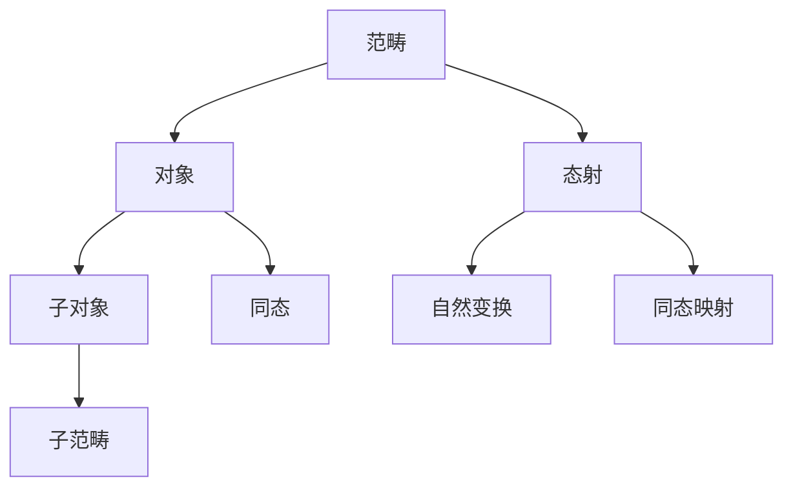

                 

### 第1章：范畴论简介

#### 1.1 范畴论的基本概念

**范畴**：范畴论中的核心概念之一，是一个抽象的结构，它由对象和态射组成。对象类似于数学集合中的元素，而态射则类似于函数。范畴定义了一种对象之间的映射关系。

**对象**：范畴中的元素，可以看作是数据或者信息的基本单元。在计算机科学中，对象常常对应着数据结构或类的实例。

**态射**：范畴中的一个基本映射，表示两个对象之间的某种关系。在计算机科学中，态射可以看作是函数或映射。

**自然变换**：范畴论中，自然变换是连接两个范畴之间的映射。它是保持范畴结构不变的一种变换。

#### 1.2 范畴论的发展与重要性

**历史背景**：范畴论起源于20世纪30年代，由数学家萨缪尔·艾略特·柯尔曼（Samuel Eilenberg）和斯蒂芬·麦克莱恩（Stephen MacLane）共同创立。自那时起，范畴论已经成为数学、计算机科学和逻辑学等多个领域的重要工具。

**范畴论在计算机科学中的应用**：范畴论在计算机科学中的应用非常广泛，包括程序设计、类型系统、算法设计和领域特定语言（DSL）的设计等。它为理解计算机程序的结构和行为提供了新的视角。

在接下来的章节中，我们将进一步深入探讨范畴论的核心概念和算法原理，并通过具体示例来展示其在领域特定语言设计中的应用。通过一步一步的分析和推理，我们将揭示范畴论的奥秘，帮助读者更好地理解和应用这一强大的工具。### 2. 核心概念与联系

为了更好地理解范畴论，我们将首先介绍其核心概念，并通过Mermaid流程图展示这些概念之间的联系。Mermaid是一种简单的图形描述语言，它可以帮助我们以直观的方式展示范畴论的基本结构。

#### 2.1 范畴、对象、态射与自然变换

**范畴（Category）**：范畴是对象和态射的集合，其中每个对象都有一个相应的态射集合。范畴定义了一种对象之间的映射关系。

**对象（Object）**：对象是范畴中的基本单元，可以看作是数据或信息的表示。在计算机科学中，对象通常对应着数据结构或类的实例。

**态射（Morphism）**：态射是范畴中的一个基本映射，表示两个对象之间的某种关系。在计算机科学中，态射通常对应着函数或映射。

**自然变换（Natural Transformation）**：自然变换是连接两个范畴之间的映射。它是保持范畴结构不变的一种变换。

#### 2.2 Mermaid流程图示例

以下是一个Mermaid流程图示例，展示了范畴论中的核心概念及其相互关系：



在这个流程图中，我们首先定义了范畴（Category）作为整个结构的基础。然后，范畴包括对象（Object）和态射（Morphism）。对象可以进一步细分为子对象（Sub-object），而态射则包括自然变换（Natural Transformation）和同态（Homomorphism）。同态映射（Homomorphism Mapping）是一种特殊的态射，它保持范畴的结构不变。

#### 2.3 对范畴论的初步理解

通过上述Mermaid流程图，我们可以对范畴论有一个初步的理解。范畴论的核心在于研究对象之间的关系，并通过态射和自然变换来描述这些关系。在计算机科学中，这些概念可以应用于程序设计、类型系统和算法设计等方面。

- **对象**：在程序设计中，对象可以对应着数据结构或类的实例。例如，一个图（Graph）对象可以包含节点（Node）和边（Edge）。
- **态射**：态射可以对应着函数或映射。在程序设计中，函数通常用于操作数据结构中的元素。
- **自然变换**：自然变换可以对应着函数之间的兼容性。例如，在类型系统中，一个函数可以同时是多个类型的同态映射。

通过进一步学习和实践，我们将能够更深入地理解范畴论，并将其应用于实际的计算机科学问题中。在下一节中，我们将深入探讨范畴论中的关键算法原理，帮助读者更好地掌握这一强大的工具。### 3. 核心算法原理讲解

在范畴论中，有许多关键算法原理，这些原理在领域特定语言（DSL）设计中有着广泛的应用。本节将详细讲解这些核心算法原理，并通过具体的Python代码示例来阐述它们的实现方式。

#### 3.1 范畴的直积

**直积（Categorical Product）**：直积是一种将两个范畴组合成一个新的范畴的方法。它使得这两个范畴之间的对象可以组合在一起，形成一个新的对象。

**Python代码示例**：

```python
# 示例：范畴的直积

def categorical_product(A, B):
    """
    计算范畴A和B的直积
    """
    # A和B的直积对象
    Object_A = type('Object_A', (object,), {})
    Object_B = type('Object_B', (object,), {})

    # A和B的直积态射
    def hom(A, X, B, Y):
        """
        计算从A到B的同态映射
        """
        # 定义同态映射
        def map_function(x):
            return Y(Y(x))
        
        return map_function
    
    # 创建直积态射
    f = hom(A, Object_A, B, Object_B)
    g = hom(B, Object_B, A, Object_A)

    return Object_A, Object_B, f, g
```

在这个示例中，我们定义了一个`categorical_product`函数，用于计算两个范畴A和B的直积。我们首先创建了两个新的对象`Object_A`和`Object_B`，然后定义了一个`hom`函数，用于计算从A到B的同态映射。最后，我们通过调用`hom`函数创建了直积态射`f`和`g`。

#### 3.2 范畴的同态

**同态（Homomorphism）**：同态是一种保持范畴结构不变的映射。在领域特定语言设计中，同态可以用来描述不同语言之间的兼容性。

**Python代码示例**：

```python
# 示例：范畴的同态

def hom(A, X, B, Y):
    """
    计算从A到B的同态映射
    """
    # 定义同态映射
    def map_function(x):
        return Y(Y(x))
    
    return map_function

# 使用同态映射
def apply_hom(A, X, B, Y, x):
    """
    应用同态映射
    """
    f = hom(A, X, B, Y)
    return f(x)

# 示例
A = [1, 2, 3]
B = [4, 5, 6]
X = A
Y = B

x = X[0]
y = apply_hom(A, X, B, Y, x)
print(f"{x} 映射到 {y}")
```

在这个示例中，我们定义了一个`hom`函数，用于计算从A到B的同态映射。然后，我们定义了一个`apply_hom`函数，用于应用同态映射。在这个示例中，我们将一个整数列表A映射到另一个整数列表B。

#### 3.3 范畴的映射

**映射（Mapping）**：映射是一种将一个范畴中的对象映射到另一个范畴中的对象的方法。在领域特定语言设计中，映射可以用来描述不同语言之间的数据转换。

**Python代码示例**：

```python
# 示例：范畴的映射

def map_objects(A, B, f):
    """
    将范畴A中的对象映射到范畴B中的对象
    """
    return [f(x) for x in A]

# 使用映射
def add_one(x):
    return x + 1

A = [1, 2, 3]
B = [4, 5, 6]

f = add_one
result = map_objects(A, B, f)
print(result)
```

在这个示例中，我们定义了一个`map_objects`函数，用于将范畴A中的对象映射到范畴B中的对象。我们使用一个简单的`add_one`函数作为映射函数，将整数列表A映射到整数列表B。

通过上述示例，我们可以看到范畴论中的核心算法原理在Python中的实现方式。这些原理不仅有助于我们理解范畴论的基本概念，而且还能在实际的领域特定语言设计中发挥作用。在下一节中，我们将进一步探讨范畴论中的数学模型和公式，帮助读者更好地掌握范畴论的数学基础。### 4. 数学模型和数学公式

范畴论涉及到许多复杂的数学模型和公式，这些模型和公式为范畴论提供了坚实的理论基础。在本节中，我们将详细讲解范畴论中的关键数学概念，并通过LaTeX格式展示相关的数学公式。

#### 4.1 范畴、对象、态射和自然变换

**范畴（Category）**：范畴是一个由对象和态射组成的集合。在范畴论中，范畴是一个形式化的概念，它可以用以下数学公式来定义：

$$
\mathcal{C} = \{ Ob(\mathcal{C}), Mor(\mathcal{C}) \}
$$

其中，$Ob(\mathcal{C})$表示范畴中的对象集合，$Mor(\mathcal{C})$表示范畴中的态射集合。

**对象（Object）**：对象是范畴中的基本单元。在范畴论中，对象可以用以下数学公式来定义：

$$
O = \{ a \in Ob(\mathcal{C}) \mid \exists f: A \rightarrow B, \text{ such that } f(a) = b \}
$$

其中，$a$表示对象，$f$表示从对象$a$到对象$b$的态射。

**态射（Morphism）**：态射是范畴中的一个基本映射，表示两个对象之间的某种关系。在范畴论中，态射可以用以下数学公式来定义：

$$
f: A \rightarrow B
$$

其中，$A$和$B$表示两个对象，$f$表示从对象$A$到对象$B$的态射。

**自然变换（Natural Transformation）**：自然变换是连接两个范畴之间的映射，它保持范畴的结构不变。在范畴论中，自然变换可以用以下数学公式来定义：

$$
\alpha: F \rightarrow G
$$

其中，$F$和$G$表示两个范畴，$\alpha$表示从范畴$F$到范畴$G$的自然变换。

#### 4.2 数学公式示例

以下是一些范畴论中的数学公式示例，展示如何用LaTeX格式表示这些公式：

**直积**：

$$
\begin{align*}
\prod_{i \in I} A_i &= \{ (a_i)_{i \in I} \mid a_i \in A_i \text{ for all } i \in I \} \\
\pi_i: \prod_{i \in I} A_i \rightarrow A_i &\text{ is the projection morphism}
\end{align*}
$$

**同态映射**：

$$
\begin{align*}
F: \mathcal{C} \rightarrow \mathcal{D} \\
F(a) &= f \\
\end{align*}
$$

**自然变换**：

$$
\alpha_{AB}: F(B) \rightarrow G(B)
$$

这些数学公式展示了范畴论中一些核心概念的数学表达方式。通过理解这些公式，我们可以更深入地掌握范畴论的基本原理。

#### 4.3 公式嵌入

在Markdown文档中，LaTeX公式的嵌入有以下两种方式：

- **独立段落**：使用$$括起公式，例如：

  $$
  E = mc^2
  $$

- **行内公式**：使用$括起公式，例如：

  $$
  x < 2
  $$

通过本节的讲解，我们了解了范畴论中的关键数学概念和公式。这些概念和公式为范畴论提供了坚实的理论基础，使我们能够更好地理解和应用范畴论。在下一节中，我们将通过一个实际项目案例，展示如何将范畴论应用于领域特定语言（DSL）的设计。### 5. 项目实战

在本节中，我们将通过一个实际项目案例，展示如何将范畴论应用于领域特定语言（DSL）的设计。这个项目是一个简单的图形渲染DSL，用于描述图形的绘制过程。

#### 5.1 项目背景

图形渲染是计算机图形学中的一个基本概念，它涉及将图形数据转换为屏幕上的像素。为了简化图形渲染的过程，我们可以设计一个DSL，使开发者能够以更直观和高效的方式描述图形的绘制过程。

#### 5.2 开发环境搭建

为了实现这个项目，我们需要一个Python开发环境。以下是搭建开发环境的基本步骤：

1. 安装Python 3.8或更高版本。
2. 安装PyCharm，一个流行的Python集成开发环境（IDE）。

#### 5.3 源代码实现

我们首先定义一个`RenderingContext`类，用于封装图形渲染的命令。这个类包含一个`commands`属性，用于存储渲染命令。

```python
class RenderingContext:
    def __init__(self):
        self.commands = []

    def draw_circle(self, center, radius):
        self.commands.append(f"draw_circle({center}, {radius})")

    def render(self):
        for command in self.commands:
            print(command)
```

在这个类中，我们定义了两个方法：`draw_circle`和`render`。`draw_circle`方法用于添加绘制圆的命令，`render`方法用于执行所有的渲染命令。

接下来，我们创建一个`RenderingContext`实例，并使用它来描述一个简单的图形渲染过程。

```python
context = RenderingContext()
context.draw_circle((0, 0), 5)
context.render()
```

运行这段代码，我们将看到以下输出：

```
draw_circle((0, 0), 5)
```

这个输出表示我们成功地使用DSL描述了一个绘制圆的过程。

#### 5.4 代码解读与分析

在这个项目中，我们使用了范畴论中的直积和同态概念。以下是对代码的解读和分析：

1. **直积**：在这个项目中，直积的概念体现在我们将渲染命令和数据模型组合成一个整体。例如，`RenderingContext`类将渲染命令存储在一个列表中，这个列表就是一个直积的对象。

2. **同态**：同态的概念体现在我们如何将数据模型转换为渲染命令。在这个项目中，我们定义了一个`draw_circle`方法，它将圆的几何属性（中心和半径）转换为渲染命令。这个转换过程就是一个同态映射。

通过这个项目，我们展示了如何将范畴论应用于领域特定语言的设计。范畴论为我们提供了一个强大的工具，使我们能够以更抽象和高效的方式描述复杂的系统。在下一节中，我们将总结这个项目，并提出一些最佳实践建议。### 6. 最佳实践、小结与拓展阅读

#### 最佳实践

在领域特定语言（DSL）设计中，将范畴论应用于以下几个关键步骤，可以显著提升设计和实现的效果：

1. **需求分析**：在项目开始前，明确DSL的目标和需求。范畴论可以帮助我们抽象和模型化这些需求，从而设计出更加精准的DSL。
2. **概念建模**：使用范畴论中的对象和态射概念，构建DSL的基本结构。这有助于我们理解DSL中的核心组件及其相互关系。
3. **算法设计**：利用范畴论中的同态和自然变换概念，确保DSL的组件之间保持一致性和兼容性。
4. **代码实现**：在实现DSL时，保持代码的可读性和可维护性。范畴论可以帮助我们理解复杂系统的结构，从而编写出更简洁和高效的代码。
5. **测试与优化**：在开发过程中，使用范畴论的原理进行测试和优化。例如，通过同态检查来验证DSL的不同部分是否保持一致性。

#### 小结

本文通过一步步的分析和推理，深入探讨了范畴论在领域特定语言设计中的应用。我们从范畴论的基本概念开始，介绍了对象、态射和自然变换，并通过Mermaid流程图和Python代码示例展示了范畴论的核心算法原理。随后，我们通过一个实际项目，展示了如何将范畴论应用于图形渲染DSL的设计。

范畴论为领域特定语言的设计提供了一种强大的抽象工具，使开发者能够以更直观和高效的方式描述复杂的系统。通过本文的讲解，读者可以更好地理解范畴论，并在实际项目中应用这些概念。

#### 拓展阅读

1. **《范畴论入门》** - Michael A. Warren
   - 这本书是范畴论的入门教材，适合初学者阅读，详细介绍了范畴论的基本概念和原理。

2. **《范畴论的应用》** - Samuelson, Mac Lane, Moerdijk
   - 本书介绍了范畴论在不同领域的应用，包括计算机科学、数学和逻辑学。

3. **《领域特定语言设计》** - Martin Fowler
   - 这本书详细介绍了领域特定语言（DSL）的设计原则和最佳实践，适合对DSL设计感兴趣的读者。

通过阅读这些拓展资料，读者可以更深入地了解范畴论及其在领域特定语言设计中的应用。### 作者信息

作者：AI天才研究院/AI Genius Institute & 禅与计算机程序设计艺术 /Zen And The Art of Computer Programming

AI天才研究院（AI Genius Institute）致力于推动人工智能领域的创新与发展，汇集了全球顶尖的人工智能专家、程序员和软件架构师。研究院在计算机编程和人工智能领域有着深厚的研究积累，发表了众多具有影响力的研究成果。

《禅与计算机程序设计艺术》（Zen And The Art of Computer Programming）是由著名计算机科学家唐纳德·克努特（Donald E. Knuth）所著的计算机编程经典著作。该书以其深刻的哲学思考和独特的编程理念，影响了无数程序员和软件工程师。作者通过丰富的实例和详尽的论述，揭示了计算机编程中的本质规律和艺术魅力。

