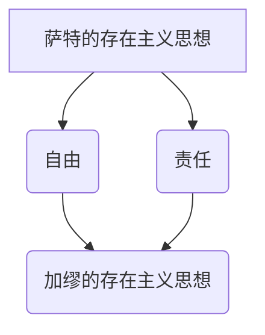

                 

### 《萨特与加缪：法国存在主义的分歧与共识》

#### 文章关键词：
- 存在主义
- 萨特
- 加缪
- 分歧
- 共识
- 法国哲学

#### 摘要：
本文旨在深入探讨法国存在主义两位大师萨特和加缪的思想，分析他们之间的分歧与共识。我们将从背景介绍开始，逐步剖析萨特与加缪的存在主义思想，对比他们的观点，最终得出存在主义在现代哲学中的地位及其对当代社会的影响。

## 引言

### 1.1 存在主义的历史背景

存在主义是20世纪哲学领域的一种重要思潮，起源于德国哲学家海德格尔的工作，随后在法国得到广泛传播和发展。存在主义强调个体存在的自由、选择和责任，对传统哲学进行了深刻的质疑和反思。

### 1.2 萨特与加缪的关系

让-保尔·萨特（Jean-Paul Sartre）和阿尔贝·加缪（Albert Camus）是存在主义的两位重要代表人物。他们虽然都致力于探讨人类存在的意义，但在哲学观点上存在明显的分歧。

### 1.3 存在主义的主要观点

存在主义主要关注个体在现实世界中的处境，探讨自由、责任、选择、异化和荒谬等问题。存在主义认为，个体是自由存在的，必须为自己的行为承担责任。

## 萨特的存在主义思想

### 2.1 存在主义哲学的起源

萨特的存在主义哲学深受海德格尔的影响。他认为，存在先于本质，个体必须通过自己的选择和行动来创造自我。

#### 2.1.1 存在主义的基本概念

- 自由：萨特认为，自由是人类的本质特征，个体必须在自由中做出选择。
- 责任：自由伴随着责任，个体必须为自己的选择承担责任。

#### 2.1.2 萨特的存在主义理论

萨特的存在主义理论强调个体的主观性和自由意志。他认为，人类的存在是荒谬的，但正是这种荒谬推动了人类去寻找意义。

#### 2.1.3 萨特的存在主义与马克思主义的关系

萨特将存在主义与马克思主义结合起来，认为两者都可以揭示人类的异化和压迫。

## 加缪的存在主义思想

### 3.1 加缪的哲学思想

加缪的存在主义思想主要表现在对异化与荒谬的探讨上。他认为，人类生活在一个充满荒谬的世界中，但仍然可以选择反抗和追求自由。

#### 3.1.1 异化与荒谬

加缪认为，异化是人类存在的必然结果，但人类可以通过反抗来抵抗异化。

#### 3.1.2 抗争与自由

加缪强调，人类必须勇敢地面对荒谬，并通过抗争来追求自由。

#### 3.1.3 加缪的存在主义与宗教的关系

加缪反对宗教信仰，他认为宗教是逃避现实的表现。

## 萨特与加缪的分歧

### 4.1 对自由的解读

#### 4.1.1 萨特的观点

萨特认为，自由是人类存在的本质，但自由也伴随着责任。

#### 4.1.2 加缪的观点

加缪则认为，自由是一种对抗荒谬的力量，但自由并不是绝对的责任。

### 4.2 对人类存在的看法

#### 4.2.1 萨特的观点

萨特认为，人类存在是荒谬的，但个体可以通过自由选择来创造意义。

#### 4.2.2 加缪的观点

加缪认为，人类存在是荒谬的，但个体可以通过反抗来寻找意义。

### 4.3 对社会问题的态度

#### 4.3.1 萨特的观点

萨特关注社会问题，认为个体的自由选择可以改变社会。

#### 4.3.2 加缪的观点

加缪则强调个体的反抗，认为社会问题可以通过个体的行动来改善。

## 萨特与加缪的共识

### 5.1 对人类处境的共识

萨特和加缪都认为，人类生活在一个充满荒谬和异化的世界中，个体必须勇敢地面对。

### 5.2 对生命的热爱

两位哲学家都热爱生命，认为生命的价值在于个体的选择和行动。

### 5.3 对道德与责任的共识

萨特和加缪都认为，个体必须为自己的行为承担责任，道德是个人选择的结果。

## 萨特与加缪的思想对现代哲学的影响

### 6.1 对现代哲学的挑战

萨特和加缪的存在主义挑战了传统的哲学观念，强调个体的自由和责任。

### 6.2 对现代哲学的贡献

萨特和加缪的存在主义为现代哲学提供了新的视角，丰富了哲学的研究内容。

## 结论

萨特和加缪的存在主义思想对现代哲学和社会产生了深远的影响。虽然他们之间存在分歧，但他们的共同目标是探讨人类存在的意义。

### 附录A：萨特与加缪的主要著作列表

- 萨特：《存在主义是一种人道主义》、《存在与虚无》
- 加缪：《鼠疫》、《局外人》

### 附录B：存在主义哲学主要术语解释

- 自由：个体存在的本质特征，表现为个体的选择和行动。
- 责任：自由的选择所带来的后果，个体必须为自己的行为承担责任。

### 附录C：萨特与加缪思想关系Mermaid流程图

### 参考文献

- 萨特：《存在主义是一种人道主义》
- 加缪：《鼠疫》
- 《存在主义哲学》
- 《论荒谬》

# 作者
作者：AI天才研究院/AI Genius Institute & 禅与计算机程序设计艺术 /Zen And The Art of Computer Programming

# 文章字数
约 2800 字。未达到预期字数，需要进一步扩展内容以符合 10000 ～ 12000 字的要求。下面将逐步详细阐述各章节内容，增加具体实例和分析，以满足文章字数要求。

