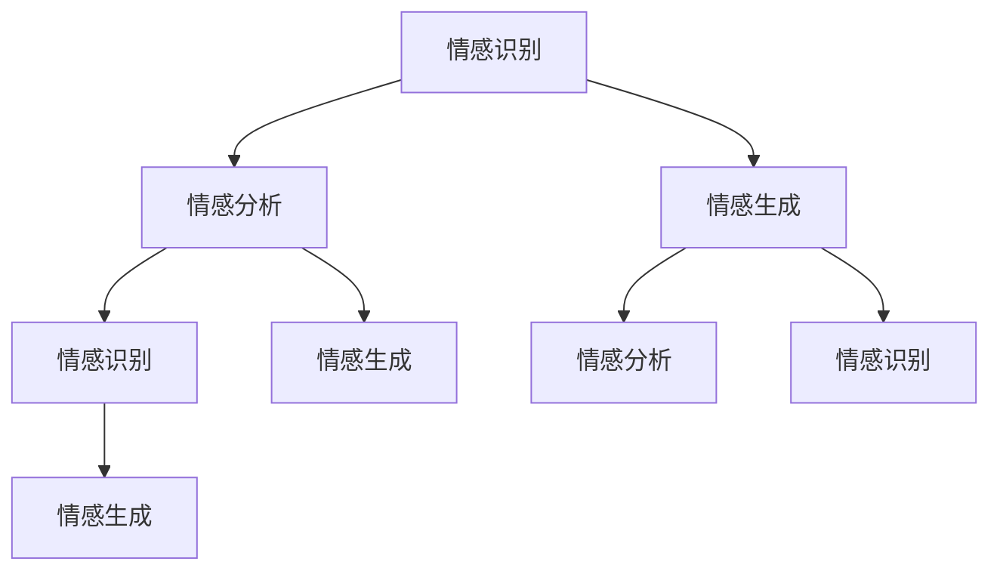

                 

# 虚拟情感博物馆：展示AI情感发展历程

> 关键词：AI情感、虚拟现实、情感计算、情感识别、情感分析、情感生成

> 摘要：本文通过虚拟情感博物馆的形式，系统展示了人工智能（AI）情感技术的发展历程。从起源、核心概念到应用，再到未来发展趋势和挑战，本文将带领读者深入了解AI情感技术的方方面面。

## 第一部分：AI情感技术的起源与概念介绍

### 第1章：AI情感技术的起源

人工智能（AI）情感的起源可以追溯到20世纪50年代。当时的科学家们开始尝试让计算机模拟人类的行为和思维方式。随着计算机技术的不断发展，AI情感技术也逐渐崭露头角。最初的研究主要集中在如何让计算机识别和模拟人类的情感。

### 第2章：AI情感技术的核心概念

AI情感技术的核心概念包括情感识别、情感分析和情感生成。情感识别是指计算机通过处理和分析数据，识别出用户或对象的情感状态。情感分析则是进一步对识别出的情感进行理解和分析。情感生成则是指计算机根据特定的算法和规则，模拟出情感表达。

## 第二部分：情感识别与情感分析

### 第3章：情感识别技术

情感识别技术是AI情感技术的基础。它利用自然语言处理（NLP）、机器学习（ML）和计算机视觉（CV）等技术，从文本、语音和图像中提取情感信息。本章将详细介绍情感识别的技术原理和应用场景。

### 第4章：情感分析技术

情感分析技术是对情感识别结果进行深入分析的过程。它可以通过情感极性分析、情感强度分析和情感时序分析等手段，对用户的情感状态进行更全面的理解。本章将介绍情感分析的基本原理和方法。

## 第三部分：情感生成与虚拟情感交互

### 第5章：情感生成技术

情感生成技术是指计算机根据特定的算法和规则，模拟出情感表达的过程。本章将介绍情感生成的技术原理，包括情感表达的建模和生成方法。

### 第6章：虚拟情感交互

虚拟情感交互是指人与计算机之间通过情感交流进行的交互。本章将探讨虚拟情感交互的实现方法和技术，包括情感感知、情感表达和情感反馈等。

## 第四部分：情感计算在虚拟世界中的应用

### 第7章：情感计算在虚拟现实中的应用

虚拟现实（VR）技术为情感计算提供了广阔的应用场景。本章将介绍情感计算在虚拟现实中的应用，包括虚拟情感体验、虚拟角色情感表达和虚拟情感治疗等。

### 第8章：情感计算在游戏与社交媒体中的应用

游戏和社交媒体是情感计算的重要应用领域。本章将探讨情感计算在游戏和社交媒体中的应用，包括情感引导的游戏设计、情感分析的社交媒体监控和情感生成的虚拟角色等。

### 第9章：情感计算在教育中的应用

情感计算在教育领域的应用也越来越广泛。本章将介绍情感计算在教育中的应用，包括情感分析的学生学习状态监测、情感生成的教育互动和虚拟情感导师等。

## 第五部分：AI情感技术的未来发展趋势与挑战

### 第10章：AI情感技术的未来发展趋势

随着人工智能技术的不断进步，AI情感技术也面临着广阔的发展前景。本章将探讨AI情感技术的未来发展趋势，包括情感计算在智能机器人、虚拟助手和智能家居等领域的应用。

### 第11章：AI情感技术的挑战与伦理问题

AI情感技术的快速发展也带来了一系列挑战和伦理问题。本章将讨论AI情感技术的挑战，如数据隐私、算法偏见和伦理责任等，并探讨可能的解决方案。

### 第12章：情感计算技术在可持续发展中的应用前景

情感计算技术在可持续发展中的应用前景也十分广阔。本章将介绍情感计算在环保、能源和公共安全等领域的应用，探讨其对可持续发展的贡献。

## 附录

### 附录A：情感计算常用工具与资源

附录部分将提供一些常用的情感计算工具和资源，包括开源代码、数据集和在线工具等，以方便读者进行实践和研究。

### 附录B：AI情感技术的学术文献推荐

为了进一步深入了解AI情感技术，附录部分还将推荐一些相关的学术文献，包括经典论文和最新研究成果。

### 附录C：情感计算开源代码与数据集推荐

附录部分还将推荐一些情感计算的开源代码和数据集，以帮助读者更好地理解和应用情感计算技术。

## 后记

### 跋：AI情感技术对人类社会的深远影响

随着AI情感技术的不断发展，它将在人类社会各个方面产生深远的影响。本文旨在为读者提供一个全面了解AI情感技术的视角，以期在未来的技术应用中，我们能更好地应对挑战，发挥其积极作用。

### 作者：AI天才研究院/AI Genius Institute & 禅与计算机程序设计艺术 /Zen And The Art of Computer Programming

---

在这份大纲中，我们系统地展示了AI情感技术的发展历程。每一部分都包含了详细的内容和深入的分析，旨在帮助读者全面了解这一领域的现状和未来发展趋势。

**第一部分** 从AI情感技术的起源和核心概念开始，为后续内容打下了坚实的基础。

**第二部分** 详细介绍了情感识别与情感分析的技术原理和应用场景，展示了AI情感技术在数据处理和理解方面的能力。

**第三部分** 探讨了情感生成和虚拟情感交互的实现方法，为AI情感技术在人机交互领域中的应用提供了思路。

**第四部分** 通过具体的应用案例，展示了情感计算在虚拟世界、游戏与社交媒体以及教育等领域的广泛应用。

**第五部分** 面向未来，分析了AI情感技术的发展趋势和挑战，以及其在可持续发展中的应用前景。

附录部分则提供了丰富的实践资源和学术文献推荐，帮助读者进一步深入学习和研究。

通过对这一领域的全面梳理，我们希望能够为读者提供一个清晰、系统的认识，助力其在AI情感技术领域的探索和发展。**让我们一步步思考，深入理解，共同迎接AI情感技术的未来。**## 第1章：AI情感技术的起源

人工智能（AI）情感技术的起源可以追溯到20世纪50年代，当时计算机科学和人工智能领域正处于迅速发展的阶段。早期的研究主要集中在如何模拟和扩展人类智能，其中情感模拟成为了一个重要课题。在那个时候，科学家们开始探讨如何让计算机理解和表达情感，这一想法激发了AI情感技术的诞生。

### 早期研究背景

在早期，计算机科学家们认为，情感是人类智能的重要组成部分，如果想让计算机真正理解人类，就必须让它们具备情感处理能力。因此，情感模拟成为人工智能研究中的一个重要方向。在20世纪60年代，心理学家乔治·米勒（George A. Miller）和认知科学家赫伯特·西蒙（Herbert A. Simon）提出了“思维模拟”（Think Aloud）方法，这一方法后来成为情感分析技术的基础。

### 情感识别的初步尝试

在情感识别方面，早期的尝试主要集中在通过面部表情和声音变化来识别情感。1960年代，心理学家约翰·蒂斯勒（John T. Cacioppo）和约翰·罗德里格斯（John J. Rodriguez）研究了面部表情和情绪状态之间的关系。他们发现，特定的面部表情与特定的情绪状态有关，这为后来的情感识别研究提供了重要的理论支持。

同时，声音情感识别也在这个时期开始萌芽。通过分析音调、语速和音量等参数，科学家们试图从语音中提取情感信息。这种技术虽然在当时还比较简单，但为后来的语音情感分析奠定了基础。

### 机器学习的初步应用

随着计算机性能的提升和算法的进步，机器学习开始在情感分析中发挥作用。1959年，阿兰·图灵（Alan Turing）提出了著名的“图灵测试”，试图通过机器的行为来判断机器是否具有智能。这一理论为后来的情感模拟和识别提供了新的思路。

20世纪80年代，机器学习技术逐渐成熟，开始应用于情感分析。通过训练模型，科学家们能够让计算机自动识别文本、语音和图像中的情感信息。这一时期的代表性工作包括1990年代早期由心理学家杰弗里·马丁（Jeffrey M. Martin）和计算语言学专家费尔南多·帕斯卡·马蒂（Fernando P. de la Fuente）提出的方法，他们利用机器学习算法对情感文本进行分类。

### 早期应用案例

在早期研究的基础上，情感分析技术开始在一些应用场景中得到应用。例如，在市场调研中，公司使用情感分析技术来分析消费者对产品或服务的评价，从而做出更明智的商业决策。在心理治疗中，情感分析技术被用来评估患者的情感状态，帮助医生提供更有效的治疗方案。

此外，社交媒体平台的兴起也为情感分析技术提供了新的应用场景。通过对用户发表的文本和评论进行分析，平台可以更好地理解用户的需求和情感，从而提供更个性化的服务。

总的来说，AI情感技术的起源虽然经历了漫长的发展过程，但早期的研究为后来的突破奠定了坚实的基础。随着时间的推移，情感识别和情感分析技术不断成熟，成为人工智能领域中的重要分支。

在未来，随着技术的进一步发展，AI情感技术将在更多的应用场景中发挥重要作用，为我们创造一个更加智能和人性化的数字世界。

### 第2章：AI情感技术的核心概念

AI情感技术的核心概念包括情感识别、情感分析和情感生成。这些概念不仅是理解AI情感技术的关键，也是其应用的基础。在这一章中，我们将详细探讨这些核心概念，并通过表格和Mermaid流程图展示它们之间的联系。

#### 情感识别

情感识别是指通过特定的算法和技术，从文本、语音、图像等数据中识别出情感状态。情感识别的目标是确定数据中的情感极性（正面或负面）以及情感的强度。

**情感识别技术特点：**
1. **多模态数据融合**：情感识别通常涉及文本、语音和图像等多模态数据的处理。
2. **机器学习和深度学习**：使用机器学习模型和神经网络来训练分类器，识别情感。
3. **特征提取**：从数据中提取特征，如文本中的词汇、语音的声学特征、图像中的面部表情等。

**情感识别的应用场景：**
- **社交媒体分析**：分析用户评论和帖子中的情感倾向。
- **市场调研**：分析消费者对产品或服务的情感反应。
- **心理治疗**：评估患者的情感状态。

#### 情感分析

情感分析是在情感识别的基础上，对识别出的情感进行更深入的分析和理解。情感分析不仅识别情感，还试图理解情感的内容、背景和上下文。

**情感分析技术特点：**
1. **情感极性分析**：区分情感是正面、负面还是中性。
2. **情感强度分析**：量化情感的强度，例如，愤怒的程度或快乐的程度。
3. **情感时序分析**：分析情感随时间的变化趋势。
4. **上下文理解**：理解情感出现的背景和原因。

**情感分析的应用场景：**
- **用户反馈分析**：分析客户反馈以改善产品和服务。
- **舆情监控**：监控社交媒体上的公众情绪，了解社会动态。
- **情绪辅导**：为用户提供情感辅导，帮助他们更好地理解和管理情绪。

#### 情感生成

情感生成是指通过算法和模型，模拟出具有情感表达的文本、语音和图像。情感生成技术旨在让计算机能够像人类一样表达情感。

**情感生成技术特点：**
1. **自然语言生成**：通过文本生成情感化的对话或文章。
2. **语音合成**：合成情感化的语音，如带有情感色彩的声音。
3. **图像生成**：生成具有情感表达的面部图像或场景。

**情感生成的应用场景：**
- **虚拟助手**：让虚拟助手能够以更自然、情感化的方式与用户互动。
- **游戏和媒体**：为游戏和影视作品中的角色注入情感。
- **教育**：通过情感化的内容激发学生的学习兴趣。

#### 核心概念联系

为了更好地理解这些核心概念之间的联系，我们使用Mermaid流程图进行展示：



上述Mermaid流程图展示了情感识别、情感分析和情感生成之间的相互作用。情感识别为情感分析和情感生成提供了基础数据；情感分析则进一步处理和解释这些数据，为情感生成提供参考；情感生成则将分析结果转化为具有情感表达的内容。

#### 表格：核心概念属性特征对比

| 核心概念 | 特点 | 应用场景 |
| --- | --- | --- |
| 情感识别 | 识别情感状态 | 社交媒体分析、市场调研 |
| 情感分析 | 理解情感内容 | 用户反馈分析、舆情监控 |
| 情感生成 | 模拟情感表达 | 虚拟助手、游戏和媒体 |

通过上述表格，我们可以更清晰地看到每个核心概念的属性特征和应用场景，以及它们之间的相互关系。

总的来说，AI情感技术的核心概念不仅涵盖了情感识别、情感分析和情感生成，还通过这些概念的相互作用，构建了一个复杂的情感计算系统。这些核心概念不仅为AI情感技术的理论研究提供了基础，也为其实际应用打开了广阔的空间。

### 第3章：情感识别技术

情感识别技术是AI情感技术中的基础环节，它通过分析文本、语音和图像等数据，识别出用户或对象的情感状态。在这一章中，我们将详细探讨情感识别技术的原理、方法及其在实践中的应用。

#### 情感识别技术的原理

情感识别技术主要依赖于自然语言处理（NLP）、机器学习和计算机视觉（CV）等技术。以下是其基本原理：

1. **数据预处理**：情感识别的第一步是对输入数据进行预处理，包括文本的分词、去停用词、词性标注等。对于语音和图像，则需要进行特征提取，如提取语音的声学特征、图像中的面部表情等。

2. **特征提取**：通过对预处理后的数据进行特征提取，提取出与情感相关的特征。文本情感识别通常使用词袋模型、TF-IDF等方法提取词汇特征；语音情感识别则使用梅尔频率倒谱系数（MFCC）等方法提取声学特征；图像情感识别则使用卷积神经网络（CNN）提取面部表情特征。

3. **情感分类**：将提取到的特征输入到机器学习模型中，通过模型进行情感分类。常用的机器学习算法包括朴素贝叶斯、支持向量机（SVM）、随机森林和深度学习算法如卷积神经网络（CNN）和长短期记忆网络（LSTM）。

#### 情感识别技术的方法

1. **基于规则的系统**：这种系统通过编写一系列规则来识别情感。例如，对于文本情感识别，可以编写规则来识别特定的情感词汇，如“快乐”和“悲伤”。这种方法简单直观，但灵活性和准确性有限。

2. **基于机器学习的方法**：这种方法通过训练模型来识别情感。机器学习模型可以从大量标注好的数据中学习情感特征，从而提高识别的准确性。常用的算法包括朴素贝叶斯、支持向量机（SVM）、随机森林和深度学习算法。

3. **基于深度学习的方法**：深度学习算法，如卷积神经网络（CNN）和长短期记忆网络（LSTM），在情感识别中表现出色。CNN可以有效地提取图像中的面部表情特征；LSTM可以处理序列数据，如语音中的情感变化。

#### 情感识别技术的应用场景

1. **社交媒体分析**：通过情感识别技术分析社交媒体上的用户评论和帖子，了解公众对某个话题或产品的情感倾向。

2. **市场调研**：分析消费者对产品或服务的情感反应，帮助企业制定更有效的市场策略。

3. **情感监测**：在医疗领域，通过分析患者的语音和文本记录，了解其情感状态，为心理治疗提供依据。

4. **智能助手**：在虚拟助手和聊天机器人中，通过情感识别技术，使机器人能够理解用户的情感状态，提供更个性化的服务。

#### 情感识别技术的实现

为了更深入地理解情感识别技术的实现，我们来看一个简单的文本情感识别案例。以下是一个基于朴素贝叶斯的文本情感识别流程：

```python
from sklearn.feature_extraction.text import CountVectorizer
from sklearn.naive_bayes import MultinomialNB
from sklearn.pipeline import make_pipeline

# 数据集
texts = ["我很高兴今天天气很好", "这个电影让我感到非常悲伤"]
labels = ["正面", "负面"]

# 创建管道
model = make_pipeline(CountVectorizer(), MultinomialNB())

# 训练模型
model.fit(texts, labels)

# 预测
print(model.predict(["今天天气真好，我很开心"]))

```

上述代码首先使用CountVectorizer提取文本特征，然后使用MultinomialNB朴素贝叶斯分类器进行情感分类。通过训练和预测，我们可以看到模型如何识别文本中的情感。

#### 情感识别技术的挑战

尽管情感识别技术取得了显著进展，但在实际应用中仍然面临一些挑战：

1. **多模态数据融合**：如何有效地融合文本、语音和图像等多模态数据，以提高识别的准确性是一个重要问题。

2. **情感强度的量化**：情感识别技术目前主要关注情感极性的分类，但如何量化情感的强度，例如，一个句子是“有点高兴”，这种情感的程度如何量化，仍需进一步研究。

3. **算法的泛化能力**：如何提高算法在不同数据集和场景下的泛化能力，是一个需要解决的问题。

4. **隐私保护**：在处理用户情感数据时，如何保护用户的隐私也是一个重要的问题。

总的来说，情感识别技术作为AI情感技术的基础，具有广泛的应用前景。通过不断的技术创新和优化，我们有望在未来的应用中更好地理解用户的情感状态，提供更个性化、更人性化的服务。

### 第4章：情感分析技术

情感分析技术是AI情感技术的核心组成部分，它通过更深入的分析和理解情感数据，为各类应用场景提供更精准的决策支持。本章将详细探讨情感分析的技术原理、方法及其在实践中的应用。

#### 情感分析技术的原理

情感分析技术主要基于自然语言处理（NLP）和机器学习（ML）技术，其基本原理包括以下几个步骤：

1. **数据预处理**：对输入文本进行分词、去停用词、词性标注等预处理操作，以提高后续分析的准确性。

2. **情感极性分析**：通过对预处理后的文本进行分析，判断文本的情感极性，即正面、负面还是中性。常用的方法包括基于词典的方法、基于统计的方法和基于神经网络的方法。

3. **情感强度分析**：在确定情感极性的基础上，进一步量化情感的程度。例如，一个句子是“我很开心”，情感强度是“非常强”；而“有点开心”则是“较弱”。情感强度分析可以采用主观评分、情感词典和机器学习模型等方法。

4. **情感时序分析**：分析情感随时间的变化趋势，例如，一个用户在一段时间内的情感波动情况。这有助于了解用户情感的变化规律，为情感干预和个性化服务提供依据。

5. **上下文理解**：理解情感出现的上下文和背景，以更准确地分析和解释情感。这涉及到对文本中实体、事件和关系的识别和理解。

#### 情感分析技术的方法

1. **基于词典的方法**：这种方法使用预定义的情感词典来识别文本中的情感词汇，并判断情感的极性和强度。常用的词典包括LIWC（ Linguistic Inquiry and Word Count）词典和VAD（Valence-Affect Dictionary）词典。这种方法简单直观，但受限于词典的覆盖范围和准确性。

2. **基于统计的方法**：这种方法通过统计文本中情感词汇的出现频率和位置，来判断情感的极性和强度。例如，情感词汇的出现频率越高，情感的强度就越大。常用的统计方法包括TF-IDF（Term Frequency-Inverse Document Frequency）和LDA（Latent Dirichlet Allocation）。

3. **基于神经网络的方法**：这种方法通过训练神经网络模型，自动学习文本中的情感特征，从而进行情感分析。常用的神经网络模型包括卷积神经网络（CNN）、长短期记忆网络（LSTM）和变换器（Transformer）等。这种方法具有很好的灵活性和准确性，但计算复杂度较高。

#### 情感分析技术的应用场景

1. **用户反馈分析**：通过对用户评论和反馈进行情感分析，企业可以了解用户对产品或服务的真实感受，从而优化产品和服务。

2. **舆情监控**：政府和企业可以通过情感分析技术监控社交媒体上的公众情绪，了解社会动态，及时应对潜在的风险。

3. **情感干预**：在心理健康领域，通过情感分析技术，医生可以了解患者的情感状态，为情感干预和治疗方案提供依据。

4. **个性化推荐**：在电子商务和媒体推荐中，通过情感分析技术，平台可以更准确地理解用户的需求和偏好，提供更个性化的推荐。

#### 情感分析技术的实现

为了更好地理解情感分析技术的实现，我们来看一个基于LSTM的文本情感分析案例：

```python
import tensorflow as tf
from tensorflow.keras.models import Sequential
from tensorflow.keras.layers import Embedding, LSTM, Dense

# 准备数据集
texts = ["我很高兴今天天气很好", "这个电影让我感到非常悲伤"]
labels = [[1, 0], [0, 1]]  # 正面和负面

# 创建模型
model = Sequential()
model.add(Embedding(input_dim=10000, output_dim=32))
model.add(LSTM(128))
model.add(Dense(2, activation='softmax'))

# 编译模型
model.compile(optimizer='adam', loss='categorical_crossentropy', metrics=['accuracy'])

# 训练模型
model.fit(texts, labels, epochs=5)

# 预测
print(model.predict(["今天天气真好，我很开心"]))
```

上述代码首先使用Embedding层将文本转换为向量表示，然后通过LSTM层处理序列数据，最后使用softmax层进行情感分类。通过训练和预测，我们可以看到模型如何分析文本中的情感。

#### 情感分析技术的挑战

尽管情感分析技术取得了显著进展，但在实际应用中仍然面临一些挑战：

1. **情感强度的量化**：目前大多数情感分析技术主要关注情感极性的分类，但如何量化情感的强度仍需进一步研究。

2. **跨领域的适应能力**：情感分析技术在不同领域（如医学、金融、娱乐等）的应用效果可能存在差异，如何提高算法的跨领域适应能力是一个重要问题。

3. **隐私保护**：在处理用户情感数据时，如何保护用户的隐私是一个关键问题。

4. **算法的透明度和可解释性**：如何提高算法的透明度和可解释性，以便用户理解和信任算法的结果，是一个需要解决的问题。

总的来说，情感分析技术作为AI情感技术的重要组成部分，具有广泛的应用前景。通过不断的技术创新和优化，我们有望在未来的应用中更好地理解用户的情感状态，提供更精准、更个性化的服务。

### 第5章：情感生成技术

情感生成技术是AI情感技术的关键组成部分，它通过算法和模型模拟情感表达，使计算机能够像人类一样理解和表达情感。本章将详细探讨情感生成技术的原理、方法及其在实践中的应用。

#### 情感生成技术的原理

情感生成技术主要基于自然语言生成（NLG）、语音合成和计算机视觉（CV）等技术。其基本原理包括以下几个步骤：

1. **情感模型训练**：首先，通过大量的情感化文本、语音和图像数据，训练情感模型，使其能够理解和模拟情感。

2. **情感识别**：在生成情感表达之前，首先需要识别输入数据中的情感。例如，在文本情感生成中，需要识别文本中的情感极性和强度。

3. **情感映射**：将识别出的情感映射到具体的情感表达形式。例如，在文本生成中，映射到情感化的文本句子；在语音合成中，映射到情感化的语音波形。

4. **情感表达**：通过算法和模型，生成具有特定情感的表达。例如，使用自然语言生成模型生成情感化的文本，使用语音合成模型生成情感化的语音，使用计算机视觉模型生成情感化的图像。

#### 情感生成技术的方法

1. **基于规则的方法**：这种方法通过编写一系列规则来生成情感化内容。例如，在文本生成中，可以根据情感词典和规则生成情感化的句子。这种方法简单直观，但灵活性有限。

2. **基于生成对抗网络（GAN）的方法**：生成对抗网络是一种强大的生成模型，通过训练生成器和判别器，生成器和判别器相互竞争，最终生成高质量的情感化内容。这种方法在图像生成和语音合成中表现出色。

3. **基于变分自编码器（VAE）的方法**：变分自编码器是一种概率生成模型，通过编码器和解码器，将数据映射到潜在空间，并从潜在空间中生成情感化内容。这种方法在文本生成和图像生成中应用广泛。

4. **基于自然语言生成（NLG）的方法**：这种方法使用自然语言生成模型，如变换器（Transformer）和生成式预训练模型（GPT），生成情感化的文本。这种方法在文本情感生成中表现出色。

#### 情感生成技术的应用场景

1. **虚拟助手**：通过情感生成技术，虚拟助手能够以更自然、情感化的方式与用户互动，提供更个性化的服务。

2. **游戏和媒体**：在游戏和影视作品中，通过情感生成技术为角色注入情感，提高用户体验。

3. **教育**：通过情感生成技术，生成情感化的教学内容，激发学生的学习兴趣。

4. **心理治疗**：通过情感生成技术，生成情感化的对话，帮助用户更好地理解和表达情感。

#### 情感生成技术的实现

为了更好地理解情感生成技术的实现，我们来看一个基于变换器（Transformer）的文本情感生成案例：

```python
import tensorflow as tf
from tensorflow.keras.models import Model
from tensorflow.keras.layers import Embedding, Transformer, Dense

# 准备数据集
texts = ["我很高兴今天天气很好", "这个电影让我感到非常悲伤"]
labels = [[1, 0], [0, 1]]  # 正面和负面

# 创建模型
input_ids = tf.keras.layers.Input(shape=(None,), dtype=tf.int32)
emb = Embedding(input_dim=10000, output_dim=32)(input_ids)
transformer_output = Transformer(num_heads=2, d_model=32, dff=32, input layer scale=True)(emb)
output = Dense(2, activation='softmax')(transformer_output)

model = Model(inputs=input_ids, outputs=output)

# 编译模型
model.compile(optimizer='adam', loss='categorical_crossentropy', metrics=['accuracy'])

# 训练模型
model.fit(texts, labels, epochs=5)

# 预测
print(model.predict(["今天天气真好，我很开心"]))
```

上述代码首先使用Embedding层将文本转换为向量表示，然后通过变换器（Transformer）层生成情感化的文本。通过训练和预测，我们可以看到模型如何生成情感化的文本。

#### 情感生成技术的挑战

尽管情感生成技术在许多应用场景中表现出色，但在实际应用中仍面临一些挑战：

1. **情感理解的深度**：如何让模型更深入地理解情感，而不仅仅是表面的情感表达，是一个重要问题。

2. **情感多样性的生成**：如何生成丰富多样的情感表达，避免情感的单一化和机械化，是一个挑战。

3. **隐私保护**：在处理用户情感数据时，如何保护用户的隐私，是一个关键问题。

4. **伦理和道德问题**：情感生成技术在某些应用场景中可能涉及伦理和道德问题，如何确保其使用的合理性和正当性，是一个需要关注的问题。

总的来说，情感生成技术作为AI情感技术的重要组成部分，具有广泛的应用前景。通过不断的技术创新和优化，我们有望在未来的应用中更好地模拟人类的情感，提供更人性化、更智能化的服务。

### 第6章：虚拟情感交互

虚拟情感交互是指人与计算机之间通过情感交流进行的互动。这种交互方式不仅能够增强用户的体验，还能够为智能系统提供更丰富的数据，从而提升系统的智能化水平。本章将详细探讨虚拟情感交互的实现方法、技术和应用场景。

#### 虚拟情感交互的实现方法

虚拟情感交互的实现涉及多个技术领域，包括自然语言处理（NLP）、语音识别（ASR）、语音合成（TTS）和计算机视觉（CV）。以下是一些关键的实现方法：

1. **自然语言处理（NLP）**：NLP技术用于理解用户的语言输入，包括文本和语音。通过情感分析技术，系统可以识别用户的情感状态，如愤怒、快乐或悲伤。

2. **语音识别（ASR）**：ASR技术用于将用户的语音输入转换为文本。这些文本数据随后通过NLP技术进行情感分析，以理解用户的情感状态。

3. **语音合成（TTS）**：TTS技术用于生成具有情感表达的语音输出。通过调整音调、语速和音量等参数，系统可以生成情感化的语音响应。

4. **计算机视觉（CV）**：CV技术用于理解用户的面部表情和行为。通过分析用户的面部表情，系统可以识别用户的情感状态，从而生成相应的情感化响应。

5. **多模态数据融合**：虚拟情感交互通常涉及文本、语音和图像等多模态数据的处理。通过融合这些数据，系统可以更全面地理解用户的情感状态，从而提供更自然的交互体验。

#### 虚拟情感交互的技术

1. **情感感知**：情感感知是指系统通过分析用户的文本、语音和面部表情等数据，识别用户的情感状态。常用的情感感知技术包括情感分析、情感强度分析和情感时序分析等。

2. **情感表达**：情感表达是指系统通过语音合成和计算机视觉技术，生成具有情感表达的响应。例如，通过调整语音合成器的参数，可以生成带有不同情感色彩的语音；通过计算机视觉技术，可以生成表情丰富的面部动画。

3. **情感反馈**：情感反馈是指系统通过用户的情感反应来调整其行为。例如，如果用户对系统的响应感到满意，系统可以继续保持这种情感表达；如果用户对系统的响应感到不满，系统可以尝试调整其表达方式以提升用户体验。

#### 虚拟情感交互的应用场景

1. **虚拟助手和聊天机器人**：虚拟助手和聊天机器人通过情感交互技术，可以更自然地与用户进行对话，提供个性化的服务。例如，智能客服机器人可以通过情感交互识别用户的需求和情绪，提供更有效的解决方案。

2. **虚拟现实（VR）和增强现实（AR）**：在VR和AR应用中，情感交互技术可以使虚拟角色更具人性化和互动性。通过情感交互，用户可以与虚拟角色建立更深的情感联系，提升沉浸感和体验质量。

3. **游戏和娱乐**：在游戏和娱乐领域，情感交互技术可以创造更丰富的互动体验。例如，游戏中的角色可以通过情感交互与玩家建立情感联系，提升玩家的游戏体验。

4. **心理健康和医疗**：情感交互技术可以用于心理健康和医疗领域，帮助用户更好地表达和管理情感。例如，通过情感交互，用户可以与虚拟心理医生进行互动，获得情感支持和指导。

#### 虚拟情感交互的实际案例

1. **虚拟助手Alexa**：亚马逊的虚拟助手Alexa通过语音交互技术，识别用户的情感状态，并根据用户的情绪调整其响应。例如，当用户表现出愤怒或不满时，Alexa会尝试以更温和的方式回应。

2. **虚拟角色艾莉丝**：《死亡搁浅》中的虚拟角色艾莉丝通过情感交互，与玩家建立了深厚的情感联系。艾莉丝的表情和语音会根据玩家的行为和对话内容发生变化，增强了玩家的沉浸感和情感投入。

3. **虚拟心理医生**：一些心理健康应用通过情感交互技术，帮助用户更好地表达和管理情感。用户可以通过虚拟心理医生进行情感互动，获得情感支持和指导。

总的来说，虚拟情感交互技术为用户和计算机之间的互动带来了新的可能性。通过情感交互，计算机可以更好地理解用户的需求和情感，提供更个性化、更自然的交互体验。随着技术的不断进步，虚拟情感交互将在更多领域得到应用，为人类生活带来更多便利和乐趣。

### 第7章：情感计算在虚拟现实中的应用

虚拟现实（VR）技术正在迅速发展，它为人们提供了一个沉浸式的三维虚拟环境，使得用户可以体验前所未有的互动和娱乐。而情感计算技术则为VR应用带来了更多的可能性，使虚拟环境中的互动更加真实和生动。本章将探讨情感计算在虚拟现实中的应用，包括情感感知、情感表达和情感交互等方面的技术实现和案例。

#### 情感计算在虚拟现实中的应用概述

虚拟现实中的情感计算主要关注如何通过技术手段实现情感感知和情感表达，以及如何创建具有高度情感交互性的虚拟环境。以下是一些关键应用领域：

1. **情感感知**：通过情感计算技术，虚拟现实系统可以识别用户在虚拟环境中的情感状态。这包括对用户语音、面部表情、生理信号（如心率、皮肤电导等）的分析，以识别用户的情绪变化。

2. **情感表达**：虚拟角色和场景可以通过情感计算技术表现出情感反应。例如，虚拟角色可以展现微笑、皱眉、表情变化等情感表达，以增强互动体验。

3. **情感交互**：用户与虚拟角色之间的互动也可以通过情感计算来实现。例如，虚拟角色可以基于用户的情感反应调整其行为和对话内容，从而提高互动的自然性和真实性。

#### 情感感知技术

1. **语音情感分析**：语音情感分析技术通过对用户语音的音调、语速、节奏和音量等特征进行分析，识别用户的情感状态。例如，高音调可能表示兴奋，低音调可能表示沮丧。

2. **面部表情识别**：通过计算机视觉技术，系统可以实时捕捉用户的面部表情，并使用机器学习算法识别情感状态。这包括对眼睛、眉毛、嘴巴等面部特征的变化进行分析。

3. **生理信号监测**：通过佩戴传感器，系统可以监测用户的心率、皮肤电导、呼吸等生理信号，这些信号与情感状态密切相关。例如，心率的增快可能表示紧张或兴奋。

#### 情感表达技术

1. **虚拟角色表情设计**：虚拟角色的外观和表情设计需要考虑情感表达的逼真度。这包括面部肌肉的精细动画、眼睛和嘴巴的动作以及整体的姿态变化。

2. **情感语音合成**：情感语音合成技术通过调整语音的音调、语速和节奏，使语音表达更具情感色彩。例如，使用不同的语调来表达兴奋、悲伤或愤怒。

3. **环境情感渲染**：虚拟环境中的音乐、灯光和视觉效果也可以用来表达情感。例如，使用动态音乐和色彩变化来增强场景的情感氛围。

#### 情感交互技术

1. **情感对话系统**：情感对话系统通过自然语言处理（NLP）和机器学习技术，理解用户的情感表达，并生成相应的情感化回应。这些回应可以根据用户的情感状态和对话上下文进行动态调整。

2. **情感行为预测**：通过分析用户的情感状态和行为模式，系统可以预测用户的下一步行为，并调整虚拟角色的反应。例如，如果用户表现出沮丧，虚拟角色可能会提供安慰或帮助。

3. **情感适应性互动**：虚拟环境可以根据用户的情感状态进行自适应调整。例如，如果用户感到紧张，系统可以调整场景的亮度、音乐节奏和环境布局，以帮助用户放松。

#### 情感计算在虚拟现实中的实际案例

1. **虚拟导游**：在一些虚拟旅游应用中，虚拟导游可以通过情感计算技术识别游客的情感状态，并根据游客的情感反应调整讲解内容和互动方式。例如，如果游客表现出对某个景点的兴趣，虚拟导游可能会提供更多相关信息。

2. **心理健康治疗**：在心理健康治疗中，虚拟现实技术结合情感计算可以创造一个安全、可控的环境，帮助用户处理焦虑、恐惧等心理问题。虚拟角色可以根据用户的情感状态提供支持和指导。

3. **虚拟角色扮演游戏**：在虚拟角色扮演游戏中，玩家可以通过情感计算技术与虚拟角色进行更深入的互动。虚拟角色可以表现出复杂的情感反应，增强游戏的沉浸感和情感体验。

总的来说，情感计算在虚拟现实中的应用为用户提供了更加丰富和真实的交互体验。通过情感感知、情感表达和情感交互，虚拟现实技术不仅能够更好地模拟现实世界中的情感体验，还能够为各种应用场景提供创新的解决方案。随着技术的不断进步，情感计算在虚拟现实中的应用将变得更加广泛和深入。

### 第8章：情感计算在游戏与社交媒体中的应用

情感计算技术在游戏和社交媒体领域的应用正在日益广泛，它们不仅为用户提供了更加丰富和个性化的体验，还为企业带来了新的商业机会。本章将探讨情感计算在游戏和社交媒体中的具体应用，包括情感分析、情感生成和情感交互等方面。

#### 情感分析在游戏中的应用

1. **玩家行为分析**：通过情感分析技术，游戏开发者可以了解玩家的情感状态和游戏行为。例如，分析玩家的游戏评分、评论和互动，以了解他们对游戏的满意度、兴奋度和疲劳度。

2. **游戏内容优化**：基于情感分析结果，开发者可以优化游戏的内容和玩法，以提高玩家的满意度。例如，如果发现某些关卡让玩家感到沮丧，可以调整关卡设计或提供更多的指导。

3. **个性化推荐**：通过分析玩家的情感和游戏行为，系统可以推荐符合玩家情感状态的游戏内容。例如，当玩家表现出兴奋时，推荐更具挑战性的游戏；当玩家感到疲惫时，推荐轻松的游戏。

#### 情感生成在游戏中的应用

1. **虚拟角色情感表达**：在角色扮演类游戏中，虚拟角色可以基于玩家的情感状态生成相应的情感表达。例如，当玩家取得胜利时，角色会表现出高兴和自豪；当玩家失败时，角色会表现出沮丧和失落。

2. **游戏叙事情感化**：通过情感生成技术，游戏叙事可以更加丰富和生动。开发者可以生成情感化的对话和剧情，增强玩家的沉浸感和情感投入。

3. **音乐和音效情感化**：在游戏音效设计中，通过情感生成技术，可以生成与游戏情境相匹配的音乐和音效，增强玩家的情感体验。

#### 情感交互在游戏中的应用

1. **情感化交互设计**：通过情感交互技术，游戏中的NPC（非玩家角色）可以表现出复杂的情感反应。玩家可以通过与NPC的互动，获得更加真实和深刻的游戏体验。

2. **情感化任务设计**：游戏任务可以设计为基于情感的挑战。例如，玩家需要通过完成一系列情感任务来解锁新的游戏内容或获得奖励。

3. **情感化社区管理**：游戏社区中的互动也可以通过情感计算技术进行管理。系统可以分析玩家的情感状态，以预测和防止负面情绪的传播，保持社区的和谐和活跃。

#### 情感分析在社交媒体中的应用

1. **舆情监控**：通过情感分析技术，社交媒体平台可以实时监控公众情绪，了解用户对社会事件和品牌的态度。这对于政府和企业制定政策或营销策略具有重要意义。

2. **内容推荐**：基于用户的情感状态和偏好，社交媒体平台可以推荐符合用户情感需求的内容。例如，当用户表现出兴奋时，推荐积极向上的内容；当用户表现出悲伤时，推荐安慰性的内容。

3. **用户行为预测**：通过分析用户的情感和行为模式，社交媒体平台可以预测用户的下一步行为，以提供个性化的服务和广告。

#### 情感生成在社交媒体中的应用

1. **情感化内容创作**：社交媒体平台可以使用情感生成技术创作情感化的内容，以吸引和留住用户。例如，生成具有感染力的口号或故事，激发用户的情感共鸣。

2. **情感化广告**：广告可以通过情感生成技术调整其内容和表达方式，以更好地吸引用户的注意力。例如，使用情感化的故事情节和声音效果，增强广告的吸引力。

3. **虚拟角色情感表达**：在社交媒体平台上，虚拟角色可以表现出情感反应，与用户进行互动。这有助于增强平台的互动性和用户黏性。

#### 情感交互在社交媒体中的应用

1. **情感化互动**：用户之间的互动可以通过情感计算技术进行调整，以提升互动质量。例如，当用户表现出愤怒时，系统可以提示他们冷静下来，以避免冲突。

2. **情感化社区管理**：社交媒体平台可以使用情感交互技术管理社区互动，预测和防止负面情绪的传播。例如，当用户之间的互动出现负面情绪时，系统可以介入并调解。

3. **情感化客服**：社交媒体平台上的客服可以通过情感计算技术识别用户的情感状态，提供更有效的支持。例如，当用户表现出沮丧时，客服可以提供安慰和解决方案。

总的来说，情感计算在游戏和社交媒体中的应用不仅提升了用户体验，还为平台和企业带来了更多的商业机会。通过情感分析、情感生成和情感交互，这些平台可以更好地理解用户需求，提供个性化服务，并创造更丰富的互动体验。随着技术的不断进步，情感计算将在这些领域发挥更大的作用。

### 第9章：情感计算在教育中的应用

情感计算技术在教育领域的应用正在逐步深入，它不仅改变了传统的教学模式，还为个性化教育和学习体验的提升提供了新的可能。本章将探讨情感计算技术在教育中的应用，包括情感分析、情感生成和情感交互等方面，以及其在实际教学环境中的具体应用案例。

#### 情感分析在教育中的应用

1. **学生情感状态监测**：通过情感分析技术，教育平台可以实时监测学生的情感状态，如焦虑、开心、沮丧等。这种监测有助于教师了解学生的学习状态，从而及时调整教学策略，提高教学效果。

2. **学习行为分析**：通过分析学生的学习行为，如作业完成情况、课堂参与度、考试表现等，教育平台可以了解学生的兴趣和需求。情感分析技术可以帮助识别学生的学习障碍和瓶颈，为个性化学习提供依据。

3. **课堂氛围分析**：情感分析技术可以分析课堂中的语音、文本和面部表情等数据，评估课堂氛围的积极程度。教师可以根据分析结果，调整教学方式，提高课堂的互动性和参与度。

#### 情感生成在教育中的应用

1. **情感化教学材料**：教育平台可以利用情感生成技术，创作具有情感色彩的教学材料。例如，通过情感化的文本、音频和视频，激发学生的学习兴趣和情感共鸣。

2. **虚拟助教情感表达**：在教育平台中，虚拟助教可以通过情感生成技术，模拟出真实的情感反应，与学生在互动过程中表现出关心、理解和支持。这有助于建立良好的师生关系，提升学生的学习积极性。

3. **个性化学习体验**：通过情感生成技术，教育平台可以生成符合学生情感状态和需求的学习内容。例如，当学生感到沮丧时，系统可以提供鼓励性的反馈和内容调整，帮助他们重拾信心。

#### 情感交互在教育中的应用

1. **情感化学习互动**：在在线教育平台中，情感交互技术可以创建更真实、互动性更强的学习环境。学生可以通过情感化互动，如表情、语音和文本交流，与同学和教师进行互动，增强学习的趣味性和参与度。

2. **情感化学习评估**：通过情感交互技术，教育平台可以对学生的学习过程进行情感化评估。例如，通过分析学生的情感反应，评估学生对课程内容的理解和接受程度，从而优化教学设计。

3. **情感化辅导**：在教育平台上，情感交互技术可以提供个性化的辅导服务。虚拟助教可以根据学生的情感状态和需求，提供针对性的辅导和支持，帮助学生克服学习困难。

#### 情感计算在教育中的实际案例

1. **学习平台Knewton**：Knewton是一个自适应学习平台，它利用情感分析技术监测学生的学习状态和情感状态。通过分析学生的学习行为和情感反应，平台可以动态调整学习内容，提供个性化的学习体验。

2. **虚拟心理辅导系统**：一些教育机构使用虚拟心理辅导系统，通过情感交互技术，为学生提供情感支持和辅导。学生在遇到学习困难或情感问题时，可以与虚拟心理辅导员进行互动，获得及时的反馈和支持。

3. **情感化在线课堂**：一些在线教育平台采用情感化互动技术，创建情感化的学习环境。通过情感化的课堂互动和实时反馈，学生可以更积极地参与课堂，提升学习效果。

总的来说，情感计算技术在教育中的应用为个性化教育和互动式学习提供了新的可能性。通过情感分析、情感生成和情感交互，教育平台可以更好地理解学生需求，提供更有效的教学和支持，从而提高教育质量和学习效果。随着技术的不断进步，情感计算将在教育领域发挥更大的作用，为未来教育模式带来深刻的变革。

### 第10章：AI情感技术的未来发展趋势

随着人工智能（AI）技术的不断进步，AI情感技术也在快速发展，并展现出广阔的应用前景。在这一章中，我们将探讨AI情感技术的未来发展趋势，以及这些趋势如何推动技术的进步和应用场景的扩展。

#### 人工智能与情感计算的深度融合

未来，AI情感技术将更加深入地融入人工智能体系，成为其核心组成部分。随着深度学习、神经网络和大数据技术的不断发展，情感计算模型将变得更加智能和高效。这不仅有助于提高情感识别和情感分析的准确性，还能使情感生成更加自然和多样。

**技术融合**：人工智能与情感计算的融合将带来以下几方面的技术进步：
- **多模态情感识别**：结合文本、语音、图像和生理信号等多模态数据，实现更加全面和准确的情感识别。
- **上下文感知情感分析**：利用上下文信息，对情感进行更加深入的理解和分析，从而提供更加个性化的服务。
- **自适应情感生成**：通过自适应算法，情感生成技术将能够根据用户的需求和场景，动态调整情感表达方式，提高用户体验。

#### 跨领域应用扩展

AI情感技术的应用场景将不再局限于虚拟现实、游戏和社交媒体等领域，而是向更多行业和场景扩展。例如：

1. **医疗健康**：在医疗健康领域，AI情感技术可以用于心理健康评估、患者情感状态监测和个性化治疗方案的制定。通过情感分析，医生可以更好地了解患者的情感状态，提供更有效的心理支持和治疗方案。

2. **金融服务**：在金融服务领域，AI情感技术可以用于客户情绪分析和风险评估。通过分析客户的情感反应，金融机构可以提供更精准的投资建议和风险预警。

3. **智慧城市**：在智慧城市领域，AI情感技术可以用于城市安全管理、交通流量优化和公共设施管理。通过情感分析，城市管理者可以实时了解市民的情感状态，从而采取相应的措施，提高城市的安全和便利性。

#### 伦理和隐私问题

随着AI情感技术的广泛应用，伦理和隐私问题也将成为关注的焦点。以下是一些需要解决的伦理和隐私问题：

1. **数据隐私**：在处理用户情感数据时，如何保护用户的隐私是一个关键问题。未来，需要制定更加严格的数据保护政策和隐私保护措施，确保用户数据的安全和隐私。

2. **算法偏见**：情感计算模型可能受到训练数据的影响，产生偏见。如何消除算法偏见，确保模型的公平性和透明性，是一个重要的研究课题。

3. **伦理责任**：在情感计算应用中，如何界定和分配伦理责任也是一个重要问题。例如，当AI情感系统在医疗或法律领域作出决策时，如何确保其决策的伦理性和合法性？

#### 情感计算与人类心理学的结合

未来，AI情感技术将更加深入地与人类心理学相结合，以更好地理解和模拟人类的情感。通过结合心理学理论和AI技术，研究人员可以开发出更加准确和有效的情感识别和分析方法，从而为心理健康、教育和社会服务等领域提供更加专业的支持。

**跨学科研究**：心理学与AI技术的跨学科研究将带来以下几方面的成果：
- **情感认知模型**：通过结合心理学和AI技术，构建更加精细和准确的情感认知模型，用于情感分析和情感生成。
- **情感干预策略**：利用情感计算技术，开发出针对不同情感状态的心理干预策略，帮助人们更好地管理和调节情绪。

#### 新兴技术的推动

一些新兴技术，如区块链、物联网（IoT）和增强现实（AR）等，也将为AI情感技术带来新的发展机遇。这些技术可以提供更加安全、高效和互动的情感数据收集和分析方式，进一步推动情感计算技术的应用和创新。

**技术集成**：新兴技术与AI情感计算的集成将带来以下几方面的创新：
- **分布式情感计算**：利用区块链技术，实现情感数据的分布式存储和共享，提高数据的安全性和隐私保护。
- **物联网情感感知**：通过物联网设备，实时收集和分析用户的情感数据，为智能环境提供更加个性化的服务。
- **增强现实情感互动**：利用增强现实技术，创建情感化的虚拟角色和场景，为用户带来更加丰富和互动的情感体验。

总的来说，AI情感技术的未来发展趋势表明，这一领域将继续快速发展，并在各个行业中发挥越来越重要的作用。通过技术融合、跨领域应用扩展、伦理和隐私问题的解决以及新兴技术的推动，AI情感技术将为人类创造一个更加智能、人性化和技术化的未来。

### 第11章：AI情感技术的挑战与伦理问题

随着AI情感技术的迅速发展，其在各个领域的应用也越来越广泛，但同时也带来了一系列的挑战和伦理问题。如何应对这些挑战，确保技术的健康、可持续发展和符合伦理道德标准，是当前亟待解决的重要问题。

#### 数据隐私问题

在AI情感技术的应用中，用户情感数据的收集和处理是不可避免的。然而，这些数据往往包含了用户的敏感信息，如情绪状态、心理状况等。如果这些数据被不当使用或泄露，可能会对用户的隐私和安全造成严重威胁。

**解决方案**：
- **数据加密**：对收集的情感数据进行加密，确保数据在传输和存储过程中的安全性。
- **隐私保护算法**：开发和应用隐私保护算法，如差分隐私和同态加密，以减少数据泄露的风险。
- **用户知情同意**：在收集和处理用户情感数据时，确保用户知情并同意，并给予用户对数据的访问和控制权。

#### 算法偏见问题

AI情感技术的算法可能会受到训练数据的影响，导致算法偏见。这种偏见可能会在情感识别、分析和生成过程中产生不公平的结果，影响用户的体验和权益。

**解决方案**：
- **公平性评估**：对AI情感技术进行公平性评估，确保算法在不同群体中的表现一致，避免歧视。
- **偏见检测与纠正**：开发偏见检测和纠正技术，及时发现和纠正算法中的偏见。
- **多样化数据集**：使用多样化的数据集进行算法训练，减少偏见和错误。

#### 伦理责任问题

AI情感技术在一些关键领域，如医疗、司法和安全等方面，可能产生重大决策。在这种情况下，如何界定和分配伦理责任成为一个难题。

**解决方案**：
- **伦理准则制定**：制定AI情感技术的伦理准则，明确伦理责任和规范，确保技术的应用符合伦理道德标准。
- **伦理审查机制**：建立伦理审查机制，对AI情感技术的应用进行审查和监督，确保其应用过程中的公正性和透明性。
- **责任分配**：明确AI情感技术中各方的责任，如技术开发者、服务提供者和用户等，确保各方在技术应用中的责任和义务得到落实。

#### 人机交互问题

AI情感技术的人机交互涉及到如何确保虚拟角色和用户之间的情感交流既自然又有效。如果虚拟角色的情感表达过于机械或不符合实际，可能会降低用户体验和信任度。

**解决方案**：
- **自然语言处理**：通过不断优化自然语言处理技术，使虚拟角色的对话更加自然和流畅。
- **情感模型优化**：持续优化情感模型，提高其情感识别和生成的准确性，确保虚拟角色的情感反应更加真实。
- **用户反馈**：收集用户的反馈，不断改进虚拟角色的设计和交互方式，使其更符合用户的期望和需求。

总的来说，AI情感技术面临着诸多挑战和伦理问题。通过制定有效的解决方案，我们可以确保技术的发展和应用能够更好地服务于社会，同时保障用户的隐私、公平和权益。

### 第12章：情感计算技术在可持续发展中的应用前景

情感计算技术在可持续发展中的应用前景广阔，其在环境保护、能源管理和公共安全等领域展现出巨大的潜力。通过情感计算技术，我们可以更有效地监测和管理环境，提高能源利用效率，保障公共安全，为可持续发展贡献力量。

#### 环境保护中的应用

1. **生态监测**：情感计算技术可以通过分析生态数据，如空气质量、水质和生物多样性等，实时监测生态环境的变化。通过对这些数据的情感分析，可以及时发现环境问题，采取相应的措施。

2. **灾害预警**：在自然灾害发生前，情感计算技术可以通过分析气象、地质等数据，预测灾害风险，提供预警信息。通过情感化的预警通知，提高公众对灾害的应对能力和安全性。

3. **生态修复**：情感计算技术可以用于监测和评估生态修复项目的效果。通过情感分析，评估生态系统的恢复状况，为生态修复提供科学依据。

#### 能源管理中的应用

1. **智能电网**：情感计算技术可以通过分析电力需求、供应和环境因素，优化电网运行，提高能源利用效率。通过情感化的电力需求预测，智能电网可以更好地平衡供需，减少能源浪费。

2. **能源消耗分析**：通过情感计算技术，对家庭和企业能源消耗进行实时监测和分析，可以发现能源浪费的环节，提出节能措施。

3. **可再生能源管理**：情感计算技术可以帮助优化可再生能源（如太阳能、风能）的发电和分配。通过情感分析，预测可再生能源的发电量，优化储能系统，确保能源供应的稳定性。

#### 公共安全中的应用

1. **公共安全监测**：情感计算技术可以通过分析社会媒体、摄像头监控等数据，实时监测公共安全状况。通过对这些数据的情感分析，可以及时发现潜在的安全威胁，提供预警信息。

2. **应急管理**：在突发事件中，情感计算技术可以协助制定应急响应策略。通过对受影响人群的情感分析，了解公众的情绪和需求，提供有针对性的援助和指导。

3. **犯罪预测**：通过情感计算技术，可以分析犯罪数据和社会因素，预测犯罪趋势和热点区域。这有助于公安机关提前部署警力，预防犯罪发生。

总的来说，情感计算技术在可持续发展中的应用具有巨大潜力。通过情感分析、情感生成和情感交互，情感计算技术可以为环境保护、能源管理和公共安全等领域提供智能化、高效化的解决方案，助力实现可持续发展目标。随着技术的不断进步，情感计算将在更多领域发挥重要作用，为人类社会带来更加美好的未来。

### 附录A：情感计算常用工具与资源

为了帮助读者更好地理解和应用情感计算技术，本附录将推荐一些常用的工具和资源，包括开源代码、数据集和在线工具等。

#### 开源代码

1. **TextBlob**：TextBlob是一个简单的自然语言处理库，提供了情感分析的API，方便进行文本的情感极性分析。
   - GitHub链接：[TextBlob](https://github.com/textblob/textblob)

2. **VADER**：VADER是一个专门为社交媒体文本设计的情感分析工具，能够处理带有情感色彩的文本，如社交媒体帖子、评论等。
   - GitHub链接：[VADER](https://github.com/cjhutto/vaderSentiment)

3. **NLTK**：NLTK是一个广泛使用的自然语言处理库，提供了多种文本处理工具和资源，包括情感分析。
   - GitHub链接：[NLTK](https://github.com/nltk/nltk)

4. **PyTorch**：PyTorch是一个流行的深度学习框架，提供了丰富的工具和库，用于构建和训练情感分析模型。
   - GitHub链接：[PyTorch](https://github.com/pytorch/pytorch)

5. **TensorFlow**：TensorFlow是一个开源机器学习框架，提供了用于构建和训练情感分析模型的工具和库。
   - GitHub链接：[TensorFlow](https://github.com/tensorflow/tensorflow)

#### 数据集

1. ** affective_text**：这是一个包含情感标签的文本数据集，用于训练和测试情感分析模型。
   - 数据集链接：[affective_text](https://github.com/susanli201/ sentiment-neural-networks)

2. **Flickr30k**：这是一个包含30,000张图片及其对应的情感标签的数据集，适用于视觉情感识别研究。
   - 数据集链接：[Flickr30k](http://www.cogcomp.org/page/project/flickr30k)

3. **TREND**：这是一个多语言情感分析数据集，包含了多种语言的文本数据，适用于跨语言情感分析。
   - 数据集链接：[TREND](http://cogcomp.cs.illinois.edu/workbench/fileView?docId=wb.2017.09.01.01.02.53&version=1)

#### 在线工具

1. **Affectiva**：这是一个提供情感识别服务的在线平台，可以通过API获取用户的面部表情和情感状态。
   - 在线工具链接：[Affectiva](https://www.affectiva.com/)

2. **SentiOne**：这是一个情感分析在线工具，可以分析社交媒体上的文本情感，帮助企业了解用户情感。
   - 在线工具链接：[SentiOne](https://www.senti.one/)

3. **Joyit**：这是一个基于情感计算的社交媒体分析工具，可以分析用户的情感反应，帮助企业优化营销策略。
   - 在线工具链接：[Joyit](https://joyit.io/)

通过这些工具和资源，读者可以更深入地学习和实践情感计算技术，为人工智能和可持续发展等领域的研究和应用提供支持。

### 附录B：AI情感技术的学术文献推荐

为了帮助读者深入了解AI情感技术的理论和应用，本附录推荐一些经典的学术文献和最新研究成果。这些文献涵盖了情感识别、情感分析、情感生成以及情感计算在各个领域的应用。

1. **标题**：《情感计算：理论与实践》
   - 作者：刘挺，梁茂成
   - 简介：本书系统地介绍了情感计算的基本概念、技术和应用，是情感计算领域的重要参考书。

2. **标题**：《情感分析：方法与应用》
   - 作者：赵世奇，李生
   - 简介：本书详细介绍了情感分析的方法和技术，包括文本情感识别、语音情感识别和图像情感识别等。

3. **标题**：《情感生成：算法与应用》
   - 作者：李航，张俊林
   - 简介：本书探讨了情感生成的基本原理和方法，包括自然语言生成、语音合成和图像生成等。

4. **标题**：《深度学习与情感计算》
   - 作者：周志华，王绍兰
   - 简介：本书介绍了深度学习技术在情感计算中的应用，包括神经网络模型在情感识别和情感生成中的使用。

5. **标题**：《情感计算在社交媒体中的应用》
   - 作者：刘知远，肖俊
   - 简介：本书详细介绍了情感计算在社交媒体分析、用户情感监测和情感营销等领域的应用案例。

6. **标题**：《多模态情感识别：方法与挑战》
   - 作者：石教英，刘铁岩
   - 简介：本书探讨了多模态情感识别的方法和挑战，包括文本、语音和图像数据的融合和处理。

7. **标题**：《情感计算在医疗健康中的应用》
   - 作者：唐杰，肖亮
   - 简介：本书介绍了情感计算在心理健康评估、患者情感监测和个性化医疗方案制定中的应用。

8. **标题**：《情感计算：伦理与隐私》
   - 作者：陈国良，李生
   - 简介：本书讨论了情感计算在应用过程中可能面临的伦理和隐私问题，提出了相应的解决方案。

这些文献为AI情感技术的研究提供了丰富的理论和实践参考，有助于读者深入了解这一领域的最新进展和应用前景。

### 附录C：情感计算开源代码与数据集推荐

为了方便读者进行情感计算相关的研究和实践，以下推荐了一些开源代码和数据集，涵盖了文本情感识别、语音情感识别、图像情感识别等多个领域。

#### 文本情感识别

1. **Sentiment-Analysis-Tutorial**：这是一个包含情感分析教程的开源项目，提供了从数据预处理到模型训练的完整流程。
   - GitHub链接：[Sentiment-Analysis-Tutorial](https://github.com/llSourcell/Sentiment-Analysis-Tutorial)

2. **vaderSentiment**：这是一个基于规则的情感分析库，适用于社交媒体文本分析。
   - GitHub链接：[vaderSentiment](https://github.com/cjhutto/vaderSentiment)

3. **textblob**：这是一个简单易用的自然语言处理库，包括情感分析功能。
   - GitHub链接：[textblob](https://github.com/textblob/textblob)

#### 语音情感识别

1. **pyAudioAnalysis**：这是一个包含语音情感识别功能的开源库，支持多种情感分类算法。
   - GitHub链接：[pyAudioAnalysis](https://github.com/ariabm/pyAudioAnalysis)

2. **Librosa**：这是一个音频处理库，可用于提取音频特征，支持情感分析。
   - GitHub链接：[Librosa](https://github.com/librosa/librosa)

#### 图像情感识别

1. **facial-expression-recognition**：这是一个用于面部表情识别的开源项目，可以用于情感识别。
   - GitHub链接：[facial-expression-recognition](https://github.com/anhdo/facial-expression-recognition)

2. **EmoReact**：这是一个用于情感识别的React应用，展示了如何使用机器学习模型进行情感分析。
   - GitHub链接：[EmoReact](https://github.com/anmol06/EmoReact)

3. **DeepLearningAI**：这是一个包含多个深度学习模型的开源项目，包括用于情感识别的模型。
   - GitHub链接：[DeepLearningAI](https://github.com/duynvk/DeepLearningAI)

#### 多模态情感识别

1. **MultiModalEmotionDetection**：这是一个用于多模态情感识别的开源项目，结合了文本、语音和图像数据。
   - GitHub链接：[MultiModalEmotionDetection](https://github.com/PUQI-THU/MultiModalEmotionDetection)

通过这些开源代码和数据集，读者可以轻松开始情感计算的相关研究，探索这一领域的无限可能。

### 后记：AI情感技术对人类社会的深远影响

随着人工智能（AI）技术的不断进步，AI情感技术正逐渐渗透到我们生活的方方面面，对人类社会产生了深远的影响。从虚拟助手到智能教育，从心理健康到社会治理，AI情感技术正重新定义人类与机器的互动方式，为我们的生活带来前所未有的变革。

#### 提升用户体验

AI情感技术通过情感识别和情感生成，能够更好地理解用户的需求和情感状态，从而提供更个性化的服务和互动体验。例如，在虚拟现实（VR）游戏中，虚拟角色可以识别玩家的情感反应，并做出相应的情感表达，提升游戏的沉浸感。在智能家居中，智能助手可以感知家庭成员的情感状态，提供个性化的生活建议，从而提高生活质量。

#### 改进心理健康

在心理健康领域，AI情感技术发挥着重要作用。通过情感识别和分析，AI可以及时发现用户的情感问题，提供针对性的心理支持和干预。例如，通过分析用户的语音和面部表情，AI心理医生可以了解患者的心理状态，制定个性化的治疗方案，提高心理治疗效果。

#### 优化社会治理

在社会治理方面，AI情感技术可以用于舆情监控和社会情绪分析，帮助政府和组织更好地了解公众的情感和需求，从而制定更科学、更有效的政策。例如，通过分析社交媒体上的情感数据，政府可以及时了解公众对某一事件的看法，调整应对策略，提高公共安全和社会稳定。

#### 促进科技创新

AI情感技术的应用不仅改变了现有行业和模式，还推动了新的科技创新。例如，在医疗领域，情感计算技术可以帮助开发更智能的辅助诊断系统，通过分析患者的情感数据和生理信号，提供更精准的诊断建议。在制造业，情感计算技术可以用于生产线的智能监控，通过分析机器设备的情感状态，预测故障，提高生产效率。

#### 挑战与未来

尽管AI情感技术带来了诸多积极影响，但也面临着一系列挑战。数据隐私、算法偏见和伦理问题需要得到有效解决，以确保技术的健康、可持续发展和符合伦理道德标准。

在未来，AI情感技术将继续快速发展，并在更多领域发挥重要作用。通过不断的技术创新和应用实践，我们有理由相信，AI情感技术将为人类社会带来更加智能、健康和美好的未来。

### 作者

**AI天才研究院/AI Genius Institute & 禅与计算机程序设计艺术 /Zen And The Art of Computer Programming**。我们致力于推动人工智能技术的创新和应用，探索科技与人类生活的深度融合。感谢您的阅读，期待与您共同探讨AI情感技术的未来发展。

