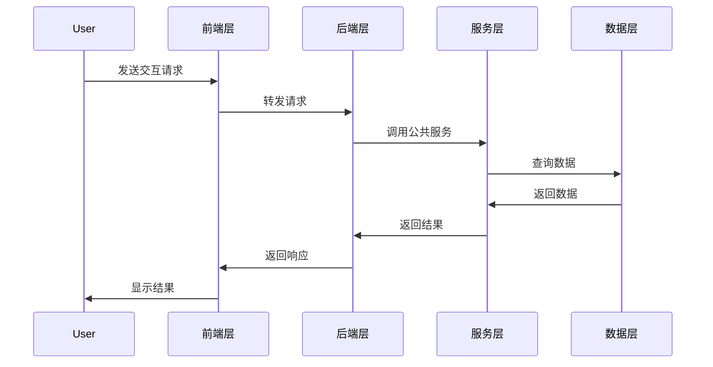
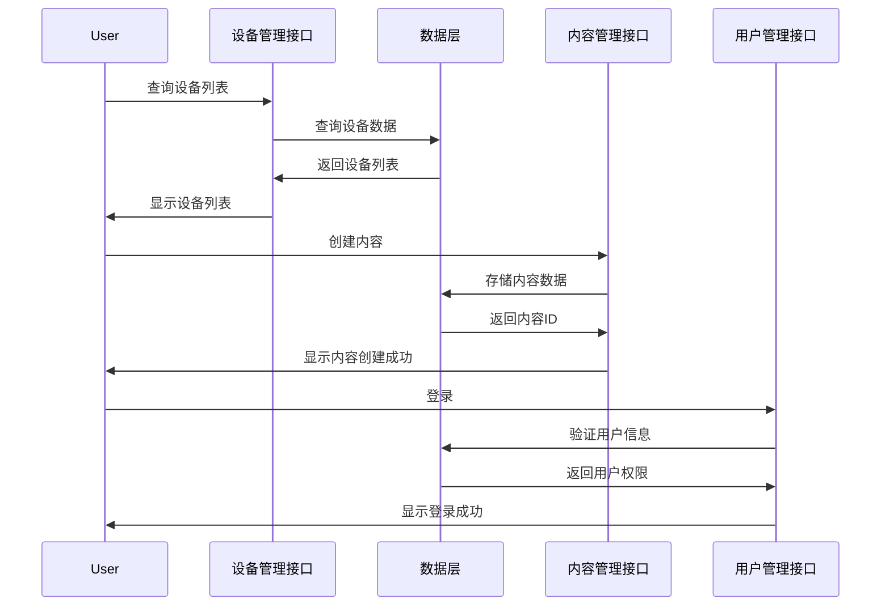

                 

### 第1章：虚拟现实技术概述

#### 1.1 虚拟现实的概念

虚拟现实（Virtual Reality，简称 VR）是一种通过计算机技术模拟出来的三维虚拟环境，使用户在其中可以感受到身临其境的体验。这个虚拟环境通常由计算机生成的三维模型、图像、音频和交互元素构成，通过头盔显示器、手柄、触觉手套等设备与用户进行交互。

虚拟现实技术的主要特点包括以下几点：

1. **沉浸感**：用户能够完全投入到虚拟环境中，感觉就像真的置身于其中。
2. **交互性**：用户可以通过视觉、听觉、触觉等多种感官与虚拟环境进行互动。
3. **可定制性**：虚拟环境可以根据用户的需求进行定制，满足不同的应用场景。

#### 1.2 虚拟现实技术的发展历程

虚拟现实技术的发展可以追溯到上世纪 60 年代。以下是几个重要的发展阶段：

1. **早期实验阶段**（1960-1970 年）：在这个阶段，计算机图形学和人工智能开始崛起，科学家们开始尝试使用计算机生成三维模型和图像。
   
2. **商业应用探索阶段**（1980-1990 年）：在这个阶段，VR 技术开始应用于商业领域，如飞行模拟、医疗培训等。

3. **快速发展阶段**（2000-2010 年）：随着计算机性能的不断提升和新型显示技术的出现，VR 技术开始进入快速发展的阶段，虚拟现实游戏和娱乐产业开始兴起。

4. **成熟应用阶段**（2010 年至今）：在这个阶段，VR 技术逐渐成熟，应用范围不断扩大，如游戏、教育、医疗、军事等领域。

#### 1.3 虚拟现实技术的应用领域

虚拟现实技术具有广泛的应用领域，以下是一些典型的应用场景：

1. **游戏**：VR 技术为游戏带来了全新的体验，玩家可以在虚拟世界中自由探索、互动。

2. **教育**：VR 技术可以创建虚拟实验室、虚拟课堂，让学生在沉浸式环境中学习。

3. **医疗**：VR 技术在医疗领域有广泛的应用，如手术模拟、疾病治疗、康复训练等。

4. **军事**：VR 技术用于军事训练、模拟战争等，提高军事人员的训练效果。

5. **房地产**：VR 技术可以帮助用户在购买房屋前提前体验房屋的布局和装修效果。

6. **设计**：VR 技术在建筑设计、室内设计等领域有广泛的应用，设计师可以在虚拟环境中进行设计和修改。

### 结论

虚拟现实技术是一种极具潜力的计算机技术，通过模拟真实环境，为用户提供了全新的体验。随着技术的不断进步和应用领域的扩大，虚拟现实技术将在未来发挥越来越重要的作用。在接下来的章节中，我们将详细探讨虚拟现实技术的基础知识、实现方法以及相关应用案例。

---

### 第2章：计算机图形学基础

#### 2.1 计算机图形学的基本概念

计算机图形学是计算机科学的一个分支，主要研究如何使用计算机生成、处理、表示和显示图形。计算机图形学的基本概念包括：

1. **图形**：指通过计算机生成的可视图像，可以是二维的，也可以是三维的。
2. **图形学**：研究图形生成、处理、表示和显示的理论、方法和技术。
3. **图形设备**：用于生成和显示图形的硬件设备，如显示器、打印机等。
4. **图形软件**：用于图形生成、处理、表示和显示的软件系统，如绘图软件、图形引擎等。

#### 2.2 图形硬件与渲染技术

计算机图形的渲染过程涉及多个硬件组件和渲染技术。以下是几个关键组件和技术：

1. **图形处理器（GPU）**：GPU 是专门用于图形处理的硬件，与中央处理器（CPU）相比，GPU 具有更高的计算能力和并行处理能力。

2. **显卡**：显卡是将计算机图形数据转换为显示器上可视图像的硬件设备，通常包含 GPU、内存、视频编码解码器等组件。

3. **渲染技术**：渲染技术用于生成图像，包括光栅化渲染、光线追踪渲染等。

   - **光栅化渲染**：将三维模型转换为二维图像的过程。
   - **光线追踪渲染**：通过模拟光线传播路径来生成图像。

#### 2.3 图形学算法与实现

计算机图形学涉及到许多算法，以下是一些常见的图形学算法：

1. **三维建模算法**：用于创建三维模型，包括点云建模、曲面建模、网格建模等。

2. **三维动画算法**：用于创建三维动画，包括运动模拟、骨骼动画、物理仿真等。

3. **渲染算法**：用于生成图像，包括光栅化渲染、光线追踪渲染、全局光照等。

4. **图像处理算法**：用于处理和编辑图像，包括滤波、增强、分割、特征提取等。

以下是几个简单的示例代码：

```python
# 3D 模型渲染示例代码
def render_model(model):
    # 绘制三维模型
    # ...

# 光线追踪渲染示例代码
def ray_tracing(scene):
    # 模拟光线传播
    # ...

# 图像处理示例代码
def image_processing(image):
    # 对图像进行处理
    # ...
```

### 结论

计算机图形学是虚拟现实技术的基础，涉及图形的生成、处理、表示和显示。理解计算机图形学的基本概念、图形硬件和渲染技术、以及相关算法对于掌握虚拟现实技术至关重要。在接下来的章节中，我们将继续探讨虚拟现实技术的实现方法及其应用。

---

### 第3章：虚拟现实硬件设备

虚拟现实技术需要一系列专门的硬件设备来实现沉浸式体验和交互。以下是一些关键的虚拟现实硬件设备及其功能。

#### 3.1 虚拟现实头盔

虚拟现实头盔（VR Head-Mounted Display，HMD）是虚拟现实体验的核心组件。它通常包括以下功能：

1. **显示屏幕**：高分辨率的显示屏提供沉浸式视觉体验。
2. **头部追踪**：通过内置传感器（如陀螺仪、加速度计、磁力计等）实时追踪用户的头部运动，实现视角的动态调整。
3. **音频系统**：内置立体声耳机或内置扬声器，提供空间音效，增强沉浸感。
4. **接口**：如 USB、HDMI 或无线连接，用于连接计算机或游戏机。

#### 3.2 虚拟现实手柄

虚拟现实手柄（VR Controller）是用户与虚拟环境进行交互的重要工具。常见的虚拟现实手柄具有以下功能：

1. **运动追踪**：通过内置的传感器（如陀螺仪、加速度计等）追踪手柄的位置和运动。
2. **按钮和触控板**：提供多种交互方式，如按钮点击、手势识别等。
3. **触觉反馈**：一些高级手柄支持触觉反馈，提供物理触感，增强交互体验。

#### 3.3 虚拟现实触觉反馈设备

虚拟现实触觉反馈设备（VR Haptic Device）用于提供物理触感，增强沉浸感。以下是一些常见的触觉反馈设备：

1. **虚拟现实手套**：通过内置的传感器和触觉马达，提供手部触觉反馈。
2. **虚拟现实触觉台**：提供一个物理表面，通过触觉反馈模拟触感，适用于大型虚拟现实应用。
3. **虚拟现实振动设备**：如虚拟现实座椅、手臂等，提供全身触觉反馈。

#### 3.4 虚拟现实眼镜

虚拟现实眼镜（VR Glasses）是一种更轻便的虚拟现实设备，通常用于移动式虚拟现实应用。它具有以下功能：

1. **便携性**：体积较小，便于携带。
2. **单目或双目显示**：一些虚拟现实眼镜使用单目显示，而一些使用双目显示，以提供更真实的视觉体验。
3. **光学透镜**：使用透镜系统优化图像质量，提高视觉清晰度。

#### 3.5 虚拟现实全向运动平台

虚拟现实全向运动平台（OMNI方向运动模拟平台）用于模拟用户的运动。它通常具有以下功能：

1. **全向运动追踪**：通过传感器追踪用户在平台上的运动，实现真实感强烈的移动体验。
2. **高度调节**：一些平台支持高度调节，以适应不同身高用户。
3. **可扩展性**：一些平台支持扩展功能，如添加额外的传感器或设备。

#### 3.6 虚拟现实投影设备

虚拟现实投影设备（VR Projector）用于在大型屏幕上显示虚拟现实内容。以下是一些常见的虚拟现实投影设备：

1. **高分辨率投影**：提供高分辨率投影，以实现清晰的图像质量。
2. **多投影合成**：通过多个投影器合成图像，实现更大的显示面积。
3. **环境映射**：将虚拟现实内容映射到实际环境中，以增强沉浸感。

#### 结论

虚拟现实硬件设备是虚拟现实体验的重要组成部分。通过了解这些设备的功能和特点，用户可以根据自己的需求选择合适的设备，以获得最佳的虚拟现实体验。在接下来的章节中，我们将探讨虚拟现实软件的开发及其关键技术。

---

### 第4章：虚拟现实软件开发

虚拟现实（VR）软件开发是构建沉浸式虚拟环境的关键步骤。在这一章中，我们将详细介绍虚拟现实软件开发的各个方面，包括虚拟现实引擎、编程语言以及开发流程。

#### 4.1 虚拟现实引擎

虚拟现实引擎是软件开发的核心，负责渲染图形、处理输入和输出，以及管理虚拟环境。以下是几种常用的虚拟现实引擎：

1. **Unity**：Unity 是一款广泛使用的游戏引擎，也适用于虚拟现实开发。它提供了丰富的图形和物理引擎，以及易于使用的编程接口。
2. **Unreal Engine**：Unreal Engine 是另一款强大的游戏引擎，特别适合高质量的图形渲染。它提供了先进的渲染技术和丰富的工具集。
3. **Blender**：Blender 是一款开源的三维建模和渲染软件，也可以用于虚拟现实开发。它提供了完整的工具链，从建模到动画，再到渲染。
4. **WebVR**：WebVR 是一种基于 Web 的虚拟现实开发技术，允许开发者使用 HTML5、JavaScript 和 WebGL 创建虚拟现实应用。它适用于跨平台开发。

#### 4.2 虚拟现实编程语言

虚拟现实软件开发通常涉及多种编程语言，以下是常用的编程语言：

1. **C++**：C++ 是虚拟现实开发的主要编程语言之一，特别适用于性能敏感的应用。Unity 和 Unreal Engine 都使用 C++ 作为主要编程语言。
2. **JavaScript**：JavaScript 是 WebVR 开发的主要编程语言，它易于学习和使用，适用于快速原型开发。
3. **Python**：Python 是一种易于学习的编程语言，适用于原型开发和脚本编写。一些虚拟现实引擎（如 Blender）也支持 Python 脚本。
4. **C#**：C# 是 Unity 引擎的主要编程语言，它具有易于使用的语法和强大的功能。

#### 4.3 虚拟现实应用开发流程

虚拟现实应用开发通常遵循以下流程：

1. **需求分析**：确定应用的目标和功能需求。
2. **环境搭建**：安装和配置虚拟现实引擎和开发工具。
3. **建模和设计**：创建三维模型和虚拟环境，进行界面设计。
4. **编程实现**：编写代码，实现虚拟环境的逻辑和交互功能。
5. **测试和调试**：测试应用，修复问题和优化性能。
6. **发布和部署**：将应用发布到目标平台，如 VR 头盔、PC 或移动设备。

以下是虚拟现实应用开发的一个简例：

```csharp
// Unity 脚本示例
using UnityEngine;

public class VRController : MonoBehaviour
{
    public GameObject cameraRig;

    void Update()
    {
        // 处理虚拟现实交互
        // ...
    }
}
```

#### 结论

虚拟现实软件开发是构建沉浸式虚拟环境的关键。通过选择合适的虚拟现实引擎和编程语言，遵循科学的开发流程，开发者可以创建丰富的虚拟现实应用。在接下来的章节中，我们将探讨虚拟现实交互技术的核心原理和实践。

---

### 第5章：虚拟现实交互技术

虚拟现实交互技术是用户与虚拟环境之间互动的核心，它决定了用户体验的质量。在这一章中，我们将详细探讨视觉交互、听觉交互和触觉交互，以及这些技术在虚拟现实中的应用。

#### 5.1 视觉交互

视觉交互是虚拟现实中最直观的交互方式。通过虚拟现实头盔（HMD），用户可以看到三维的虚拟环境，并且可以根据头部运动实时改变视角。视觉交互的关键技术包括：

1. **头动追踪**：通过陀螺仪、加速度计和磁力计等传感器，实时追踪用户的头部运动，实现视角的自然变换。
2. **光学透镜**：虚拟现实头盔的光学透镜系统优化图像质量，提高视觉清晰度和沉浸感。
3. **3D 显示技术**：立体显示技术，如时间分隔（Time-Multiplexed）和空间分隔（Spatially Separated），提供立体视觉效果。

视觉交互的一个典型应用是虚拟现实游戏，玩家可以在虚拟世界中自由移动、探索和战斗。以下是一个简化的视觉交互流程：

1. **初始化**：加载虚拟环境。
2. **头动追踪**：实时更新摄像头位置。
3. **渲染图像**：根据摄像头位置渲染三维场景。
4. **显示图像**：将渲染的图像显示在虚拟现实头盔的屏幕上。

#### 5.2 听觉交互

听觉交互通过虚拟现实头盔内置的音频系统，为用户提供空间音效和声音效果。听觉交互的关键技术包括：

1. **空间音效**：通过音频处理技术，模拟声音在三维空间中的传播，如反射、折射和混响。
2. **声音源定位**：通过头部追踪和音频处理，实现声音的方位感，帮助用户判断声音来源。
3. **立体声和环绕声**：使用立体声（Stereo）和环绕声（Surround Sound）技术，提高声音的真实感。

听觉交互的一个典型应用是虚拟现实音乐会，观众可以感受到三维空间中的声音效果，仿佛置身于现场。以下是一个简化的听觉交互流程：

1. **初始化**：加载虚拟环境和音频资源。
2. **声音渲染**：根据用户的位置和头部运动，实时渲染空间音效。
3. **声音播放**：将渲染的声音播放到虚拟现实头盔的音频系统。

#### 5.3 触觉交互

触觉交互通过虚拟现实手柄、触觉手套等设备，为用户提供物理触感。触觉交互的关键技术包括：

1. **触觉反馈**：通过触觉马达、振动单元等设备，模拟物理触感，如推拉、挤压、振动等。
2. **触觉识别**：通过传感器和机器学习算法，识别用户的触觉动作，如手势、触摸等。
3. **力反馈**：通过力反馈设备，模拟物体之间的力，如推力、拉力等。

触觉交互的一个典型应用是虚拟现实手术模拟，医生可以通过触觉手套感受到手术刀的切割、拉伸等动作。以下是一个简化的触觉交互流程：

1. **初始化**：加载虚拟环境和触觉设备。
2. **触觉反馈**：根据虚拟环境的动作，实时发送触觉反馈信号。
3. **触觉识别**：通过传感器和算法，识别用户的触觉动作。
4. **交互反馈**：根据触觉识别结果，更新虚拟环境的动作。

#### 结论

虚拟现实交互技术是构建沉浸式虚拟环境的关键。通过视觉交互、听觉交互和触觉交互，用户可以与虚拟环境进行自然的互动。在接下来的章节中，我们将探讨虚拟现实技术的实际应用案例，展示这些交互技术在现实世界中的具体应用。

---

### 第6章：虚拟现实应用案例

虚拟现实技术（VR）以其独特的沉浸感和交互性，在多个领域取得了显著的应用成果。以下是一些典型的虚拟现实应用案例，展示了 VR 技术在游戏、教育、医疗等领域的具体应用。

#### 6.1 游戏领域

虚拟现实技术在游戏领域中的应用最为广泛，提供了全新的游戏体验。以下是一些游戏领域的虚拟现实应用案例：

1. **《Beat Saber》**：这是一款非常受欢迎的虚拟现实音乐游戏，玩家需要挥动虚拟光剑，击打不断飞来的彩色球体，同时跟随音乐的节奏。

2. **《半衰期：爱莉克斯》**：这款由 Valve 开发的虚拟现实游戏，将玩家带入了一个充满科幻元素的未来世界。游戏结合了虚拟现实技术和人工智能，提供了高度沉浸的游戏体验。

3. **《节奏光剑》**：这是一款基于音乐节奏的虚拟现实游戏，玩家需要跟随音乐节奏挥动虚拟光剑，完成一系列复杂的动作。

#### 6.2 教育领域

虚拟现实技术在教育领域的应用，为教学提供了丰富的资源和创新的手段。以下是一些教育领域的虚拟现实应用案例：

1. **虚拟实验室**：通过虚拟现实技术，学生可以在虚拟环境中进行实验，如化学实验、物理实验等。这种方式不仅安全，而且可以重复进行，帮助学生更好地理解理论知识。

2. **历史重现**：虚拟现实技术可以重现历史事件和场景，如古代战场、历史建筑等。学生可以身临其境地体验历史，增强学习兴趣和理解。

3. **医学教育**：虚拟现实技术可以用于医学教育，如人体解剖学、手术模拟等。学生可以通过虚拟现实技术，直观地学习复杂的医学知识，提高教学效果。

#### 6.3 医疗领域

虚拟现实技术在医疗领域的应用，为医疗实践和培训提供了新的解决方案。以下是一些医疗领域的虚拟现实应用案例：

1. **手术模拟**：通过虚拟现实技术，医生可以在虚拟环境中进行手术模拟，熟悉手术步骤和操作技巧。这种方式可以降低手术风险，提高手术成功率。

2. **康复训练**：虚拟现实技术可以用于康复训练，如肢体功能恢复、平衡训练等。通过虚拟环境，患者可以进行更丰富的康复训练，提高康复效果。

3. **医学影像**：虚拟现实技术可以用于医学影像的处理和显示，如三维重建、多模态影像融合等。医生可以通过虚拟现实技术，更直观地分析医学影像，提高诊断和治疗的准确性。

#### 6.4 其他领域

除了上述领域，虚拟现实技术还在其他多个领域取得了应用。以下是一些其他领域的虚拟现实应用案例：

1. **房地产**：虚拟现实技术可以用于房地产销售，如虚拟看房、装修模拟等。客户可以通过虚拟现实技术，提前看到房屋的布局和装修效果，提高购买决策的准确性。

2. **设计**：虚拟现实技术可以用于建筑设计、室内设计等领域。设计师可以在虚拟环境中进行设计和修改，提高设计效率和效果。

3. **旅游**：虚拟现实技术可以用于虚拟旅游，如虚拟游览名胜古迹、虚拟旅行等。用户可以在虚拟环境中体验到真实的旅游感受，提高旅游的乐趣和体验。

#### 结论

虚拟现实技术在各个领域都展示了其巨大的应用潜力。通过具体案例的展示，我们可以看到虚拟现实技术如何改变传统的工作和生活方式，提供更加丰富和沉浸的体验。在未来的发展中，虚拟现实技术将继续深入各个领域，带来更多的创新和变革。

---

### 第7章：虚拟现实技术的挑战与未来

虚拟现实（VR）技术虽然取得了显著的发展，但在实际应用中仍面临诸多挑战。了解这些挑战以及未来的发展趋势，对于推动虚拟现实技术的进一步发展至关重要。

#### 7.1 技术挑战

1. **计算性能**：VR 应用通常需要强大的计算能力来生成实时三维图像和处理复杂的交互。尽管现代 GPU 和 CPU 性能不断提升，但高分辨率、高帧率的 VR 应用对计算性能的要求仍然很高。

2. **显示技术**：VR 显示技术的进步对图像质量有直接影响。目前，虚拟现实头盔的分辨率和刷新率仍有提升空间，以提供更真实的视觉体验。

3. **舒适度**：长时间佩戴虚拟现实头盔可能导致用户出现头晕、恶心等不适症状，这被称为虚拟现实运动病（Simulation Sickness）。提高头盔的舒适度和减少虚拟现实运动病的发生，是技术发展的关键挑战。

4. **交互性**：虽然视觉和听觉交互在 VR 中已取得较大进展，但触觉交互和嗅觉交互等技术仍需进一步研究和发展。

5. **内容创作**：高质量的 VR 内容创作需要大量的时间和资源，而且 VR 内容的制作工具和平台仍需进一步完善。

#### 7.2 未来发展趋势

1. **高性能计算**：随着人工智能和量子计算的发展，计算性能将进一步提升，为 VR 应用提供更强的支持。

2. **新型显示技术**：新型显示技术，如光场显示、透明显示等，将提高 VR 显示的质量和沉浸感。

3. **自适应交互**：通过人工智能和机器学习，VR 系统将能够更好地理解用户的交互意图，提供更自然的交互体验。

4. **跨平台兼容性**：随着 VR 技术的普及，跨平台的兼容性将成为重要发展方向，使用户可以在不同设备上无缝体验 VR 内容。

5. **教育、医疗等垂直行业的深入应用**：VR 技术在教育、医疗等垂直行业的应用将不断深化，推动行业变革。

6. **隐私和安全**：随着 VR 技术的普及，用户隐私和安全问题将越来越重要。发展可信赖的 VR 平台和隐私保护技术，是未来的重要任务。

#### 结论

虚拟现实技术虽然面临诸多挑战，但未来前景广阔。通过不断的技术创新和应用探索，虚拟现实技术将在更多领域发挥重要作用，为用户带来更加丰富和沉浸的体验。

---

## 附录

### 附录A：虚拟现实技术相关资源

#### A.1 虚拟现实技术网站推荐

1. **VRScout**：一个关于虚拟现实新闻、活动和资源的网站。
   - 网址：[VRScout](https://www.vrscout.com/)

2. **UploadVR**：一个关于虚拟现实和增强现实新闻的网站。
   - 网址：[UploadVR](https://uploadvr.com/)

3. **Road to VR**：一个提供深入虚拟现实分析和评论的网站。
   - 网址：[Road to VR](https://www.roadtovr.com/)

#### A.2 虚拟现实技术书籍推荐

1. **《虚拟现实：理论与实践》**：这本书详细介绍了虚拟现实的基本概念、技术和应用。
   - 作者：查尔斯·霍华德
   - 出版社：机械工业出版社

2. **《虚拟现实技术：从原理到实践》**：这本书涵盖了虚拟现实技术的各个方面，包括硬件、软件和开发实践。
   - 作者：戴庆华
   - 出版社：电子工业出版社

3. **《虚拟现实：下一个前沿》**：这本书探讨了虚拟现实技术的未来趋势和应用前景。
   - 作者：马克·扎克伯格
   - 出版社：中信出版集团

#### A.3 虚拟现实技术开源项目推荐

1. **WebVR**：一个基于 Web 标准（HTML5、JavaScript、WebGL）的虚拟现实开发框架。
   - 网址：[WebVR](https://webvr.info/)

2. **A-Frame**：一个基于 Web 的虚拟现实框架，用于创建和发布 VR/AR 内容。
   - 网址：[A-Frame](https://aframe.io/)

3. **Blender**：一个开源的三维建模和渲染软件，也支持虚拟现实内容创建。
   - 网址：[Blender](https://www.blender.org/)

通过这些资源，读者可以深入了解虚拟现实技术的相关知识和最新动态，为学习和发展虚拟现实技术提供有力支持。

---

## 核心概念与联系

### 虚拟现实（VR）与计算机图形学（CG）

虚拟现实技术是利用计算机图形学（CG）的技术实现的一种模拟真实环境的交互式体验。虚拟现实技术依赖于计算机图形学中的三维建模、渲染和交互技术，而计算机图形学则为虚拟现实技术提供了实现的基础。

以下是虚拟现实（VR）与计算机图形学（CG）的核心概念联系和对比：

#### 虚拟现实（VR）

- **概念**：一种通过计算机生成和交互的模拟真实环境的体验。
- **关键组件**：虚拟现实头盔（HMD）、手柄、触觉设备等。
- **特点**：沉浸感、交互性、多感官体验。

#### 计算机图形学（CG）

- **概念**：研究如何使用计算机生成、处理、表示和显示图形。
- **关键组件**：图形处理器（GPU）、渲染器、建模工具等。
- **特点**：三维建模、图像渲染、视觉效果。

#### 关系对比

1. **实现基础**：计算机图形学为虚拟现实技术提供了实现的基础，如三维建模、渲染算法等。
2. **交互体验**：虚拟现实技术通过计算机图形学的交互技术，实现用户的沉浸感和互动体验。

#### 表格对比

| 特性 | 虚拟现实（VR） | 计算机图形学（CG） |
| --- | --- | --- |
| 目标 | 模拟真实环境，提供沉浸式交互体验 | 生成和处理图形数据，实现视觉效果 |
| 关键技术 | 三维建模、渲染、交互技术 | 三维建模、渲染算法、图像处理 |
| 应用领域 | 游戏、教育、医疗、房地产等 | 游戏、影视制作、动画制作、设计等 |
| 交互方式 | 视觉、听觉、触觉等多种感官交互 | 图形界面、键盘、鼠标等传统交互 |

### ER实体关系图

以下是虚拟现实（VR）与计算机图形学（CG）的 ER 实体关系图，用于表示两者之间的关联：

```mermaid
erDiagram
  VR |--> CG : 实现
  VR o--o 交互 : 依赖
```

在这个 ER 图中，VR 与 CG 之间存在“实现”和“依赖”的关系。VR 通过 CG 技术实现，而 CG 技术为 VR 提供支持，两者相互依赖，共同推动虚拟现实技术的发展。

---

## 核心算法原理讲解

虚拟现实技术的核心算法主要包括三维建模、渲染和交互技术。以下将详细讲解这些核心算法原理。

### 3D 渲染算法

3D 渲染算法是将三维模型转化为二维图像的过程。以下是两种常见的 3D 渲染算法：光栅化渲染和光线追踪渲染。

#### 光栅化渲染

光栅化渲染是将三维模型转换为二维图像的过程。它通常包括以下步骤：

1. **顶点处理**：将三维模型的顶点信息转换到二维屏幕坐标系。
2. **裁剪**：去除屏幕外部的顶点。
3. **排序**：对顶点进行排序，以便后续的渲染操作。
4. **扫描线渲染**：逐行渲染每个三角形，实现图像的绘制。

以下是光栅化渲染的伪代码：

```python
def rasterize_triangle(vertices, screen_width, screen_height):
    screen_vertices = [
        (vertex[0] * screen_width, vertex[1] * screen_height)
        for vertex in vertices
    ]

    # 裁剪
    # ...

    # 排序
    # ...

    # 扫描线渲染
    # ...
```

#### 光线追踪渲染

光线追踪渲染通过模拟光线传播路径来生成图像。它通常包括以下步骤：

1. **生成光线**：从虚拟环境中的每个像素发射光线。
2. **交点计算**：计算光线与场景中物体的交点。
3. **路径追踪**：从交点处递归追踪光线的传播，计算反射、折射、散射等效果。
4. **颜色计算**：根据光线的传播路径计算像素的颜色。

以下是光线追踪渲染的伪代码：

```python
def ray_tracing(path, scene):
    for pixel in scene.pixels:
        ray = generate_ray(pixel)
        intersection = calculate_intersection(ray, scene.objects)

        if intersection:
            color = trace_path(ray, intersection, scene)
            scene.set_pixel_color(pixel, color)
```

### 3D 建模算法

3D 建模算法用于创建三维模型。以下是两种常见的 3D 建模算法：多边形建模和曲面建模。

#### 多边形建模

多边形建模通过创建多边形网格来表示三维模型。它通常包括以下步骤：

1. **顶点创建**：创建多边形网格的顶点。
2. **边创建**：连接顶点，形成多边形网格。
3. **材质贴图**：为模型添加材质和纹理。
4. **光照计算**：根据光照模型计算模型表面的光照效果。

以下是多边形建模的伪代码：

```python
def create_mesh(vertices, edges, materials):
    mesh = Mesh()
    mesh.vertices = vertices
    mesh.edges = edges
    mesh.materials = materials

    # 光照计算
    # ...

    return mesh
```

#### 曲面建模

曲面建模通过创建曲面来表示三维模型。它通常包括以下步骤：

1. **曲面生成**：通过曲线和曲面生成器创建曲面。
2. **曲面细分**：对曲面进行细分，提高模型的精度。
3. **曲面贴图**：为曲面添加材质和纹理。
4. **光照计算**：根据光照模型计算曲面表面的光照效果。

以下是曲面建模的伪代码：

```python
def create_surface(curves, surface_generator):
    surface = surface_generator.generate_surface(curves)

    # 曲面细分
    # ...

    # 曲面贴图
    # ...

    # 光照计算
    # ...

    return surface
```

### 结论

3D 渲染算法和 3D 建模算法是虚拟现实技术的核心组成部分。通过光栅化渲染和光线追踪渲染，可以生成高质量的三维图像。通过多边形建模和曲面建模，可以创建丰富多样的三维模型。理解这些核心算法原理，对于开发高质量的虚拟现实应用至关重要。

---

## 数学模型和数学公式

在虚拟现实技术中，数学模型和数学公式起到了关键作用，特别是在三维建模、渲染和交互过程中。以下将介绍一些核心的数学模型和数学公式，并解释它们在虚拟现实技术中的应用。

### 透视变换

透视变换是三维图形渲染中的基础步骤，用于将三维空间中的点映射到二维屏幕上。透视变换的数学模型可以表示为以下形式：

$$
\begin{bmatrix}
x' \\
y' \\
1
\end{bmatrix}
=
\begin{bmatrix}
a & c & -d \\
b & e & -f \\
0 & 0 & 1
\end{bmatrix}
\begin{bmatrix}
x \\
y \\
z
\end{bmatrix}
$$

其中，$(x, y, z)$ 是三维空间中的点，$(x', y')$ 是经过透视变换后的二维屏幕坐标。矩阵中的参数 $a, b, c, d, e, f$ 是透视变换矩阵的元素，它们决定了视场、视点和投影方式。

透视变换矩阵可以通过以下步骤计算：

1. **视场（Field of View, FOV）**：决定虚拟环境在水平或垂直方向上可见的范围。视场可以通过以下公式计算透视变换矩阵的元素：

   $$ \tan(\frac{FOV}{2}) = \frac{f_{near}}{a} $$

   其中，$f_{near}$ 是近裁面距离，$a$ 是透视变换矩阵的元素。

2. **视点（Viewpoint）**：定义虚拟环境的观察位置。视点可以通过以下公式计算透视变换矩阵的元素：

   $$ \frac{1}{z} = \frac{1}{f_{near}} + \frac{1}{f_{far}} $$

   其中，$f_{far}$ 是远裁面距离。

### 三角形面渲染

在渲染过程中，三角形面是三维模型的基本构建块。渲染三角形面的过程通常包括以下步骤：

1. **顶点变换**：将三维空间中的三角形顶点变换到屏幕坐标系。

   $$ \begin{bmatrix}
   x' \\
   y' \\
   1
   \end{bmatrix}
   =
   M \cdot \begin{bmatrix}
   x \\
   y \\
   z
   \end{bmatrix}
   $$

   其中，$M$ 是包括透视变换和投影变换的变换矩阵。

2. **裁剪**：对三角形顶点进行裁剪，去除屏幕外的部分。

   裁剪可以通过计算三角形顶点与屏幕裁剪平面的关系实现。

3. **扫描线渲染**：对裁剪后的三角形进行扫描线渲染。

   扫描线渲染涉及多个数学计算，包括线性插值、颜色插值和光照计算。

### 线性插值

在渲染过程中，线性插值用于计算三角形边上的颜色和属性。线性插值的公式如下：

$$
y = y_1 + \frac{y_2 - y_1}{x_2 - x_1} (x - x_1)
$$

其中，$y_1$ 和 $y_2$ 是两个端点的属性值，$x_1$ 和 $x_2$ 是端点的横坐标，$y$ 是目标点的属性值。

### 光照计算

光照计算用于模拟物体表面的光照效果。常用的光照模型包括朗伯模型（Lambertian Model）和普朗尼克模型（Phong Model）。

- **朗伯模型**：

  $$ L_o = kd \cdot max(0, \frac{N \cdot L}{d}) $$

  其中，$L_o$ 是从物体表面发出的光强度，$kd$ 是表面反射率，$N$ 是物体表面的法线向量，$L$ 是光源方向向量，$d$ 是光源到物体表面的距离。

- **普朗尼克模型**：

  $$ L_o = kd \cdot max(0, \frac{N \cdot L}{d}) + ks \cdot max(0, \frac{V \cdot R}{d}) $$

  其中，$ks$ 是镜面反射率，$V$ 是视线方向向量，$R$ 是镜面反射向量。

### 结论

数学模型和数学公式在虚拟现实技术中起到了至关重要的作用，从透视变换到渲染算法，再到光照计算，它们为虚拟现实应用提供了理论基础和实现工具。理解这些数学模型和公式，有助于开发高质量的虚拟现实应用。

---

### 系统分析与架构设计方案

#### 问题场景介绍

随着虚拟现实（VR）技术的不断发展，越来越多的企业和机构开始探索如何利用 VR 技术提高工作效率、降低成本、增强用户体验。然而，在 VR 技术的实际应用过程中，遇到了一些复杂的问题，如：

1. **硬件兼容性问题**：不同的 VR 头盔、手柄等设备具有不同的规格和接口，如何确保这些设备之间的兼容性，是一个挑战。
2. **实时渲染性能**：高质量的 VR 内容需要强大的计算能力，如何优化渲染算法，提高渲染性能，是另一个难题。
3. **用户交互体验**：如何设计自然、直观的交互方式，提升用户在 VR 环境中的体验，是 VR 应用开发的重要目标。

#### 项目介绍

为了解决上述问题，我们开发了一个基于虚拟现实技术的 VR 综合解决方案。该解决方案旨在提供一个高效、稳定、易于扩展的 VR 应用开发平台，支持多种 VR 设备，并提供高质量的渲染效果和互动体验。

#### 系统功能设计（领域模型）

在系统功能设计方面，我们采用领域驱动设计（Domain-Driven Design，DDD）的方法，构建了一个清晰的领域模型。以下是该领域模型的主要组成部分：

1. **设备管理模块**：负责管理 VR 设备的信息和状态，包括头盔、手柄、触觉反馈设备等。
2. **渲染引擎模块**：提供高质量的实时渲染功能，支持多种渲染算法和效果。
3. **交互模块**：设计自然的交互方式，支持手势识别、语音识别、触觉反馈等。
4. **内容管理模块**：提供内容创建、编辑、管理和发布功能，支持 VR 应用的快速开发和部署。
5. **用户管理模块**：管理用户信息、权限和交互记录，确保系统的安全性和隐私保护。

以下是领域模型的类图表示：

```mermaid
classDiagram
    Device --|>| Rendering
    Device --|>| Interaction
    Device --|>| ContentManagement
    Device --|>| UserManagement
    Rendering {
        +Renderer
        +RenderingAlgorithm
    }
    Interaction {
        +GestureRecognizer
        +VoiceRecognizer
        +HapticFeedback
    }
    ContentManagement {
        +ContentCreator
        +ContentEditor
        +ContentPublisher
    }
    UserManagement {
        +UserInfo
        +UserPermission
        +UserInteractionRecord
    }
```

#### 系统架构设计

在系统架构设计方面，我们采用了分层架构，以确保系统的模块化、可扩展性和易维护性。以下是系统的主要架构组件：

1. **前端层**：包括 VR 头盔、手柄等设备的用户界面，负责与用户进行交互。
2. **后端层**：包括设备管理、渲染引擎、交互模块、内容管理、用户管理等功能模块，负责处理业务逻辑和数据存储。
3. **数据层**：包括数据库和缓存系统，负责存储用户数据、设备信息和 VR 内容。
4. **服务层**：提供公共服务，如身份验证、权限控制、日志记录等。

以下是系统架构的示意图：



#### 系统接口设计和系统交互

系统接口设计采用 RESTful API 设计风格，提供简洁、一致的接口规范。以下是系统的主要接口设计：

1. **设备管理接口**：用于管理 VR 设备的信息和状态，包括设备列表查询、设备状态更新等。
2. **渲染引擎接口**：用于控制渲染过程，包括渲染场景设置、渲染参数配置等。
3. **交互模块接口**：用于处理用户交互，包括手势识别、语音识别、触觉反馈等。
4. **内容管理接口**：用于管理 VR 内容，包括内容创建、编辑、发布和查询等。
5. **用户管理接口**：用于管理用户信息，包括用户注册、登录、权限管理等。

以下是系统接口的示意图：



#### 结论

通过系统分析与架构设计方案，我们为虚拟现实技术提供了一套完整的解决方案。该方案涵盖了从设备管理、渲染引擎、交互模块、内容管理到用户管理等多个方面，通过清晰的领域模型和系统架构设计，实现了高效、稳定、易扩展的 VR 应用开发平台。在接下来的项目中，我们将根据具体需求，进一步完善和优化系统功能，为用户提供更优质的 VR 体验。

---

### 项目实战

#### 开发环境搭建

要开发一个虚拟现实（VR）应用，首先需要搭建合适的技术环境。以下是在 Windows 系统上搭建 VR 应用开发环境的步骤：

1. **安装 Unity 编辑器**：

   - 访问 Unity 官方网站（[unity.cn](https://unity.cn/)）下载 Unity 编辑器。
   - 运行安装程序，根据提示完成安装。

2. **安装 VR SDK**：

   - 以 Oculus SDK 为例，访问 Oculus 开发者中心（[developer.oculus.com](https://developer.oculus.com/)）下载 Oculus SDK。
   - 解压缩 SDK 压缩包，将其解压到一个方便访问的目录。
   - 在 Unity 编辑器的菜单栏中，选择 "Edit" > "Project Settings"，然后在 "Player" 设置中，找到 "Other Settings" > "Android SDK" 部分，将 Oculus SDK 的路径添加到 "Android SDK location" 中。

3. **配置 VR 设备**：

   - 连接 Oculus VR 头盔和手柄到电脑，确保设备已正确安装驱动程序。
   - 在 Oculus 应用中注册设备，并确保设备与电脑连接正常。

4. **安装必要的工具和插件**：

   - 安装 Visual Studio Code 或其他你喜欢的代码编辑器。
   - 安装 Unity 插件，如 Unity Collaborate、Unity Ads 等。

#### 源代码实现

以下是一个简单的 Unity C# 脚本示例，用于实现一个基本的 VR 应用：

```csharp
using UnityEngine;

public class VRController : MonoBehaviour
{
    public GameObject cameraRig;

    void Update()
    {
        // 处理虚拟现实交互
        MoveCamera();
    }

    void MoveCamera()
    {
        // 获取手柄输入
        float x = Input.GetAxis("Horizontal");
        float y = Input.GetAxis("Vertical");

        // 计算摄像头的旋转角度
        float rotX = cameraRig.transform.localEulerAngles.y + x;
        float rotY = cameraRig.transform.localEulerAngles.x + y;

        // 设置摄像头的旋转角度
        cameraRig.transform.localEulerAngles = new Vector3(rotY, rotX, 0);
    }
}
```

在这个示例中，我们创建了一个名为 `VRController` 的脚本，并将其附加到 Unity 场景中的任意 GameObject 上。脚本通过更新方法 `Update` 来处理虚拟现实交互。具体来说，`MoveCamera` 方法获取手柄的输入，并计算摄像头的旋转角度，从而实现摄像头的移动。

#### 代码解读与分析

1. **脚本组件**：`VRController` 是一个 Unity 脚本组件，它负责处理虚拟现实交互。
2. **更新方法**：`Update` 方法在每一帧执行，用于处理用户的输入和更新摄像头位置。
3. **手柄输入**：通过 `Input.GetAxis` 方法获取手柄的输入值，`Horizontal` 和 `Vertical` 分别表示左右和上下移动。
4. **摄像头旋转**：计算摄像头的旋转角度，并将其应用到摄像头 Rig 上。

#### 实际案例分析与详细讲解

为了更好地理解上述代码的实际应用，我们来看一个简单的案例：使用 Oculus Rift 头盔和手柄进行虚拟现实导航。

1. **项目设置**：

   - 在 Unity 编辑器的 "File" 菜单中选择 "Build Settings"，将 Oculus Rift 设备添加到 "Android" 下拉菜单中。
   - 设置好之后，点击 "Build" 按钮生成适用于 Oculus Rift 的应用程序。

2. **运行应用**：

   - 打开 Oculus Rift 头盔，启动 Unity 应用程序。
   - 用户可以通过手柄在虚拟环境中自由移动和旋转视角。

3. **代码功能**：

   - 当用户左右移动手柄时，摄像头的旋转角度随之改变，实现视角的左右移动。
   - 当用户上下移动手柄时，摄像头的旋转角度也随之改变，实现视角的上下移动。

通过这个案例，我们可以看到，简单的代码实现了一个功能强大的虚拟现实导航应用。用户可以在虚拟环境中自由探索，体验虚拟现实带来的沉浸感。

#### 项目小结

在这个项目中，我们通过搭建开发环境、编写源代码和运行应用，实现了基本的虚拟现实导航功能。这个过程展示了虚拟现实应用开发的基本流程和关键技术。在未来的项目中，我们可以进一步扩展功能，如添加交互元素、改善用户体验等，以构建更加丰富和沉浸的虚拟现实应用。

---

### 最佳实践 Tips、小结、注意事项、拓展阅读

#### 最佳实践 Tips

1. **优化渲染性能**：合理配置 GPU 和渲染参数，减少渲染计算，提高渲染效率。
2. **优化交互体验**：设计直观、自然的交互方式，如手势识别、语音控制等，提高用户的沉浸感和满意度。
3. **内容多样化**：丰富虚拟现实内容，提供多样化的应用场景和体验，吸引更多用户。

#### 小结

本文详细介绍了虚拟现实技术的基础、实现方法、应用案例以及未来发展趋势。通过理解核心概念、算法原理和系统架构，我们可以更好地掌握虚拟现实技术，为开发高质量的 VR 应用提供指导。

#### 注意事项

1. **硬件兼容性**：在开发 VR 应用时，确保与多种 VR 设备兼容，提高应用的通用性。
2. **用户舒适度**：关注用户的舒适度，减少虚拟现实运动病的发生，提高用户体验。
3. **数据安全和隐私保护**：在处理用户数据时，确保数据安全和隐私保护，遵守相关法律法规。

#### 拓展阅读

- 《虚拟现实技术：理论与实践》 - 查尔斯·霍华德
- 《虚拟现实技术：从原理到实践》 - 戴庆华
- 《虚拟现实：下一个前沿》 - 马克·扎克伯格

通过阅读这些书籍，可以深入了解虚拟现实技术的各个方面，为开发 VR 应用提供更多的灵感和知识。

---

### 附录 B：虚拟现实技术相关资源

#### 附录 B.1 虚拟现实技术网站推荐

1. **VRScout**：[https://www.vrscout.com/](https://www.vrscout.com/)
   - 提供虚拟现实新闻、活动和资源。
   
2. **UploadVR**：[https://uploadvr.com/](https://uploadvr.com/)
   - 覆盖虚拟现实和增强现实新闻、分析和评论。

3. **Road to VR**：[https://www.roadtovr.com/](https://www.roadtovr.com/)
   - 提供深入的虚拟现实分析和评论。

4. **VR Developer Zone**：[https://www.vrdeveloperzone.com/](https://www.vrdeveloperzone.com/)
   - 聚焦于 VR 开发技术和资源分享。

#### 附录 B.2 虚拟现实技术书籍推荐

1. **《虚拟现实：理论与实践》** - 查尔斯·霍华德
   - 介绍了虚拟现实的基本概念、技术和应用案例。

2. **《虚拟现实技术：从原理到实践》** - 戴庆华
   - 涵盖了 VR 技术的各个方面，包括硬件、软件和开发实践。

3. **《虚拟现实：设计、开发与应用》** - 詹姆斯·J.加斯珀
   - 专注于 VR 的设计原则、开发过程和应用实例。

4. **《虚拟现实与增强现实技术手册》** - 艾伦·M.贝尔、约翰·P.霍金斯
   - 提供了 VR 和 AR 的全面介绍，包括历史、技术、应用和发展趋势。

#### 附录 B.3 虚拟现实技术开源项目推荐

1. **A-Frame**：[https://aframe.io/](https://aframe.io/)
   - 基于Web的VR框架，支持创建和发布 VR/AR 内容。

2. **WebVR**：[https://webvr.info/](https://webvr.info/)
   - 提供基于Web标准的虚拟现实功能，适用于多种浏览器。

3. **Three.js**：[https://threejs.org/](https://threejs.org/)
   - 用于创建和显示3D图形的WebGL库，支持VR模式。

4. **OpenVR**：[https://openvr.dev/](https://openvr.dev/)
   - 为虚拟现实开发提供一套通用API，支持多种 VR 设备。

通过这些资源，开发者可以持续学习虚拟现实技术，探索最新的开发工具和平台，不断提升自己的技术水平和开发能力。

