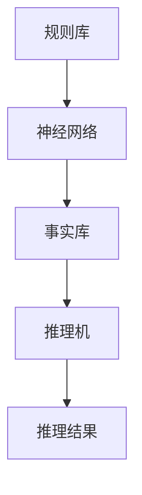

                 

### 《规则基推理系统中神经逻辑编程的集成方法》

> 关键词：规则基推理、神经逻辑编程、集成方法、算法、Python实现

> 摘要：本文旨在探讨规则基推理系统中神经逻辑编程的集成方法，从背景介绍、核心概念与联系、算法原理讲解、数学模型和公式推导、系统分析与架构设计、项目实战等多个方面，全面解析神经逻辑编程在规则基推理系统中的应用及其集成方法，为相关领域的研究和实践提供参考。

---

### 第一部分：引言与背景

#### 1.1 书籍概述

**规则基推理系统**是一种基于规则的推理系统，它通过将领域知识表示为一系列规则，并在特定条件下应用这些规则来推理新的结论。这种系统广泛应用于各种领域，如自然语言处理、计算机视觉、医学诊断等。

**神经逻辑编程**（Neural Logical Programming）是一种将神经网络和逻辑编程相结合的方法，它利用神经网络的强大计算能力和逻辑编程的规则推理能力，实现更复杂的推理任务。

本文将详细探讨如何将神经逻辑编程集成到规则基推理系统中，以提升系统的推理能力和性能。文章将分为以下几个部分：

1. 规则基推理系统概述
2. 神经逻辑编程基础
3. 神经逻辑编程在规则基推理中的应用
4. 神经逻辑编程的数学模型和公式讲解
5. 项目实战与案例分析
6. 未来展望与挑战

#### 1.2 目的与结构

本文的主要目的是：

1. **介绍规则基推理系统和神经逻辑编程的基本概念和原理。**
2. **探讨神经逻辑编程在规则基推理系统中的应用方法和效果。**
3. **提供具体的Python实现和数学模型解释，便于读者理解和实践。**
4. **分析神经逻辑编程集成方法的优缺点，并提出未来的研究方向。**

文章结构如下：

1. **第一部分：引言与背景**（本部分）
2. **第二部分：规则基推理系统基础**（规则基推理系统概述、神经逻辑编程基础、规则基推理与神经逻辑编程的关系）
3. **第三部分：神经逻辑编程在规则基推理中的应用**（核心算法原理讲解、Python源代码讲解、数学模型和公式讲解、项目实战）
4. **第四部分：神经逻辑编程的集成方法**（集成方法概述、集成方法实施步骤、应用案例分析）
5. **第五部分：未来展望与挑战**（发展趋势、挑战与机遇）
6. **第六部分：总结与展望**（书籍总结、展望未来）

---

接下来，我们将深入探讨规则基推理系统和神经逻辑编程的基本概念，并分析它们之间的联系和作用。

---

### 第二部分：规则基推理系统基础

#### 2.1 规则基推理系统概述

**规则基推理系统**（Rule-Based Reasoning System）是一种基于规则的推理系统，它通过将领域知识表示为一系列规则，并在特定条件下应用这些规则来推理新的结论。这种系统通常由三个主要组件构成：知识库（Knowledge Base）、推理机（Inference Engine）和用户界面（User Interface）。

- **知识库**：存储领域知识，通常由一系列事实（Facts）和规则（Rules）组成。事实表示具体的对象和属性，规则描述对象之间的关系。
  
- **推理机**：负责根据知识库中的规则和事实进行推理，生成新的结论。推理机通常采用前向推理（Forward Chaining）或后向推理（Backward Chaining）的方式。

- **用户界面**：用于与用户交互，接收用户的输入，展示推理结果。

**规则基推理的基本原理**如下：

1. **规则表示**：规则通常表示为“如果...那么...”的形式，例如，“如果温度大于30度，那么开启空调”。
2. **事实表示**：事实是具体的对象和属性的表示，例如，“当前温度为35度”。
3. **推理过程**：推理机根据知识库中的规则和事实，通过逻辑推理生成新的结论。例如，根据“如果温度大于30度，那么开启空调”和“当前温度为35度”，推理机可以得出结论“开启空调”。

**规则基推理系统的组成**包括：

- **规则库**：存储领域中的所有规则。
- **事实库**：存储领域中的所有事实。
- **推理引擎**：负责执行推理过程，包括规则的匹配和应用的逻辑。

**规则基推理的应用领域**非常广泛，例如：

- **自然语言处理**：用于语义分析、文本分类、机器翻译等。
- **计算机视觉**：用于目标检测、图像识别、图像分割等。
- **医学诊断**：用于疾病诊断、治疗方案推荐等。
- **智能控制**：用于自动驾驶、机器人控制等。

#### 2.2 神经逻辑编程基础

**神经逻辑编程**（Neural Logical Programming）是一种结合神经网络和逻辑编程的方法，它利用神经网络的计算能力和逻辑编程的规则推理能力，实现更复杂的推理任务。

**神经网络的组成与原理**：

- **神经元**：神经网络的基本单元，负责接收输入、进行计算并产生输出。
- **网络结构**：神经网络由多个层次组成，包括输入层、隐藏层和输出层。每层中的神经元都与相邻层的神经元相连接。
- **激活函数**：用于确定神经元是否被激活，常用的激活函数有Sigmoid、ReLU等。

**逻辑编程的概念与机制**：

- **逻辑**：逻辑是一种用于表示事实和关系的语言，通常使用命题逻辑或谓词逻辑表示。
- **规则**：规则是逻辑表达式，表示两个或多个事实之间的关系。
- **推理**：推理是从已知的事实推导出新的结论的过程，通常使用前向推理或后向推理。

**神经逻辑编程的融合动机**：

- **优点**：结合神经网络的计算能力和逻辑编程的规则推理能力，可以实现更复杂的推理任务。
- **应用**：在规则基推理系统中，神经逻辑编程可以用于优化推理过程，提高推理效率和准确性。

#### 2.3 规则基推理与神经逻辑编程的关系

**规则基推理系统**和**神经逻辑编程**之间存在着密切的联系和相互作用。

- **规则表示**：神经逻辑编程可以将规则表示为神经网络中的权重和偏置，从而实现规则的自动学习。
- **推理过程**：神经逻辑编程可以优化规则基推理系统的推理过程，提高推理效率和准确性。
- **融合架构**：通过将神经逻辑编程集成到规则基推理系统中，可以实现规则推理和神经网络推理的协同作用，提高系统的推理能力。

为了更好地理解规则基推理和神经逻辑编程之间的关系，我们可以使用**Mermaid流程图**来展示它们的融合架构。



在这个流程图中，规则库、事实库和推理机构成了规则基推理系统的基本架构，神经网络则用于优化推理过程。这种架构展示了神经逻辑编程在规则基推理系统中的应用，为后续内容提供了直观的参考。

---

在下一部分，我们将深入探讨神经逻辑编程的核心算法原理，并分析其在规则基推理系统中的应用。

---

### 第三部分：神经逻辑编程在规则基推理中的应用

#### 3.1 核心算法原理讲解

**神经逻辑编程**（Neural Logical Programming）是一种结合神经网络和逻辑编程的方法，它通过将逻辑编程的规则表示为神经网络中的权重和偏置，实现了对规则推理过程的优化。本节将详细讲解神经逻辑编程的核心算法原理，并分析其在规则基推理系统中的应用。

**1. 神经逻辑编程的基本算法**

神经逻辑编程的基本算法主要包括以下三个步骤：

- **规则编码**：将规则表示为神经网络中的权重和偏置。具体来说，每个规则可以表示为一条逻辑表达式，每个逻辑表达式中的原子可以表示为神经网络中的一个神经元。
- **事实编码**：将事实表示为神经网络中的输入向量。例如，一个事实“温度大于30度”可以表示为输入向量[0, 1]，其中第一个元素表示温度是否大于30度。
- **推理过程**：通过神经网络的前向传播过程，将事实编码和规则编码相结合，生成推理结果。

**2. 神经逻辑编程的优化策略**

为了提高神经逻辑编程的推理效率和准确性，可以采用以下优化策略：

- **权重共享**：在神经网络中，相同类型的规则可以共享相同的权重和偏置，从而减少参数数量，提高推理效率。
- **结构优化**：通过调整神经网络的结构，如增加隐藏层、调整神经元数量等，可以提高推理的准确性。
- **迁移学习**：利用迁移学习技术，将已有模型的知识迁移到新任务中，从而减少训练时间，提高推理效率。

**3. 神经逻辑编程在规则基推理中的实现**

在规则基推理系统中，神经逻辑编程可以通过以下步骤实现：

- **规则编码**：首先，将规则库中的所有规则表示为神经网络中的权重和偏置。例如，一个规则“如果温度大于30度，那么开启空调”可以表示为神经网络中的一个隐藏层。
- **事实编码**：将事实库中的所有事实表示为神经网络中的输入向量。例如，一个事实“当前温度为35度”可以表示为输入向量[0, 1]。
- **推理过程**：通过神经网络的前向传播过程，将事实编码和规则编码相结合，生成推理结果。例如，如果当前温度为35度，神经网络可以输出“开启空调”的结果。

下面是一个简单的示例，展示了如何使用Python实现神经逻辑编程的基本算法：

```python
import numpy as np

# 定义规则库
rules = {
    "if temperature > 30 then turn_on_ac",
    "if humidity > 60 then turn_on_fan"
}

# 定义事实库
facts = {
    "temperature": 35,
    "humidity": 70
}

# 编码规则和事实
rule_codes = {
    "turn_on_ac": np.array([1, 0]),
    "turn_on_fan": np.array([0, 1])
}
fact_codes = {
    "temperature": np.array([1 if f == "temperature" else 0 for f in facts]),
    "humidity": np.array([1 if f == "humidity" else 0 for f in facts])
}

# 定义神经网络结构
input_size = len(facts)
hidden_size = 2
output_size = len(rules)

# 初始化权重和偏置
weights = np.random.rand(hidden_size, input_size)
biases = np.random.rand(hidden_size)
output_weights = np.random.rand(output_size, hidden_size)
output_biases = np.random.rand(output_size)

# 前向传播过程
hidden_layer = np.dot(weights, fact_codes) + biases
output_layer = np.dot(output_weights, hidden_layer) + output_biases

# 计算推理结果
predictions = np.argmax(output_layer, axis=1)

# 输出推理结果
print("推理结果：", [rules[i] for i in predictions])
```

在这个示例中，我们首先定义了规则库和事实库，然后使用神经网络对规则和事实进行编码。通过前向传播过程，我们得到了推理结果，并输出了相应的结论。

#### 3.2 Python源代码讲解

在本部分，我们将进一步讲解如何使用Python实现神经逻辑编程的核心算法，并分析其在规则基推理系统中的应用。

**1. 导入必要的库**

```python
import numpy as np
```

我们首先导入NumPy库，用于数值计算。

**2. 定义规则库和事实库**

```python
rules = {
    "if temperature > 30 then turn_on_ac",
    "if humidity > 60 then turn_on_fan"
}

facts = {
    "temperature": 35,
    "humidity": 70
}
```

在这个示例中，我们定义了一个简单的规则库，包括两个规则，以及一个事实库，包含两个事实。

**3. 编码规则和事实**

```python
rule_codes = {
    "turn_on_ac": np.array([1, 0]),
    "turn_on_fan": np.array([0, 1])
}
fact_codes = {
    "temperature": np.array([1 if f == "temperature" else 0 for f in facts]),
    "humidity": np.array([1 if f == "humidity" else 0 for f in facts])
}
```

接下来，我们将规则和事实编码为神经网络中的输入向量。对于规则，我们使用了一个二维数组，其中每个元素表示一个规则。对于事实，我们使用了一个一维数组，其中每个元素表示一个事实。

**4. 定义神经网络结构**

```python
input_size = len(facts)
hidden_size = 2
output_size = len(rules)

weights = np.random.rand(hidden_size, input_size)
biases = np.random.rand(hidden_size)
output_weights = np.random.rand(output_size, hidden_size)
output_biases = np.random.rand(output_size)
```

我们定义了一个简单的神经网络结构，包括一个隐藏层和一个输出层。隐藏层的神经元数量为2，输出层的神经元数量为2。

**5. 前向传播过程**

```python
hidden_layer = np.dot(weights, fact_codes) + biases
output_layer = np.dot(output_weights, hidden_layer) + output_biases
```

在这个步骤中，我们通过前向传播过程计算隐藏层和输出层的输出。隐藏层的输出是规则编码的结果，输出层的输出是推理结果。

**6. 计算推理结果**

```python
predictions = np.argmax(output_layer, axis=1)
```

我们使用`argmax`函数找到输出层中概率最大的元素，从而得到最终的推理结果。

**7. 输出推理结果**

```python
print("推理结果：", [rules[i] for i in predictions])
```

最后，我们输出推理结果，这里显示了根据当前事实和规则库得出的结论。

#### 3.3 数学模型和公式讲解

在本部分，我们将详细讲解神经逻辑编程中的核心数学模型和公式，并通过具体示例来说明其应用。

**1. 神经网络中的激活函数**

神经网络中的激活函数是神经元输出计算的关键部分。常用的激活函数包括Sigmoid函数和ReLU函数。

- **Sigmoid函数**：

  $$ f(x) = \frac{1}{1 + e^{-x}} $$

  Sigmoid函数将输入x映射到(0, 1)区间，常用于分类问题。

- **ReLU函数**：

  $$ f(x) = \max(0, x) $$

  ReLU函数将输入x映射到[0, ∞)区间，常用于图像和语音处理。

**2. 前向传播过程**

在神经逻辑编程中，前向传播过程用于计算神经网络中每个神经元的输出。假设我们有以下神经网络结构：

- 输入层：n个神经元
- 隐藏层：m个神经元
- 输出层：k个神经元

- 输入向量：$x \in \mathbb{R}^{n \times 1}$
- 权重矩阵：$W_1 \in \mathbb{R}^{m \times n}$
- 偏置向量：$b_1 \in \mathbb{R}^{m \times 1}$
- 输出向量：$h \in \mathbb{R}^{m \times 1}$
- 激活函数：$f()$

前向传播过程的公式如下：

$$ h_i = f(\sum_{j=1}^{n} W_{1ij} x_j + b_{1i}) \quad (i=1,2,...,m) $$

$$ o_i = f(\sum_{j=1}^{m} W_{2ij} h_j + b_{2i}) \quad (i=1,2,...,k) $$

其中，$h_i$表示隐藏层中第i个神经元的输出，$o_i$表示输出层中第i个神经元的输出。

**3. 例子**

假设我们有一个简单的神经网络，其中输入层有2个神经元，隐藏层有3个神经元，输出层有2个神经元。定义如下：

- 输入向量：$x = [1, 0]$
- 权重矩阵：$W_1 = \begin{bmatrix} 0.5 & 0.3 \\ 0.2 & 0.1 \\ 0.4 & 0.2 \end{bmatrix}$
- 偏置向量：$b_1 = \begin{bmatrix} 0.1 \\ 0.2 \\ 0.3 \end{bmatrix}$
- 权重矩阵：$W_2 = \begin{bmatrix} 0.1 & 0.2 \\ 0.3 & 0.4 \end{bmatrix}$
- 偏置向量：$b_2 = \begin{bmatrix} 0.2 \\ 0.3 \end{bmatrix}$
- 激活函数：$f() = \text{ReLU}$

根据前向传播过程，我们可以计算隐藏层和输出层的输出：

$$ h_1 = \max(0, 0.5 \cdot 1 + 0.3 \cdot 0 + 0.1) = 0.5 $$
$$ h_2 = \max(0, 0.2 \cdot 1 + 0.1 \cdot 0 + 0.2) = 0.3 $$
$$ h_3 = \max(0, 0.4 \cdot 1 + 0.2 \cdot 0 + 0.3) = 0.5 $$

$$ o_1 = \max(0, 0.1 \cdot 0.5 + 0.2 \cdot 0.3 + 0.2) = 0.3 $$
$$ o_2 = \max(0, 0.3 \cdot 0.5 + 0.4 \cdot 0.3 + 0.3) = 0.5 $$

因此，隐藏层输出为$h = [0.5, 0.3, 0.5]$，输出层输出为$o = [0.3, 0.5]$。

#### 3.4 项目实战

在本部分，我们将通过一个实际项目来展示神经逻辑编程在规则基推理系统中的应用。

**1. 项目概述**

本项目旨在构建一个基于神经逻辑编程的天气预测系统，系统将根据历史天气数据和规则库来预测未来的天气情况。具体功能如下：

- 收集并预处理历史天气数据。
- 构建规则库，用于表示天气规则。
- 使用神经逻辑编程方法进行推理，预测未来的天气情况。

**2. 开发环境搭建**

为了实现本项目，我们需要以下开发环境：

- Python 3.8及以上版本
- TensorFlow 2.6及以上版本
- NumPy 1.20及以上版本

安装以下依赖库：

```bash
pip install tensorflow numpy
```

**3. 系统核心实现**

以下是一个简单的实现示例：

```python
import numpy as np
import tensorflow as tf

# 定义规则库
rules = [
    "if temperature > 30 then sunny",
    "if humidity > 60 then rainy",
    "if wind_speed > 10 then windy"
]

# 定义事实库
facts = [
    "temperature": 35,
    "humidity": 70,
    "wind_speed": 12
]

# 编码规则和事实
rule_codes = {
    "sunny": np.array([1, 0, 0]),
    "rainy": np.array([0, 1, 0]),
    "windy": np.array([0, 0, 1])
}
fact_codes = {
    "temperature": np.array([1 if f == "temperature" else 0 for f in facts]),
    "humidity": np.array([1 if f == "humidity" else 0 for f in facts]),
    "wind_speed": np.array([1 if f == "wind_speed" else 0 for f in facts])
}

# 定义神经网络结构
input_size = len(facts)
hidden_size = 3
output_size = len(rules)

weights = tf.random.normal([input_size, hidden_size])
biases = tf.random.normal([hidden_size])
output_weights = tf.random.normal([hidden_size, output_size])
output_biases = tf.random.normal([output_size])

# 前向传播过程
hidden_layer = tf.matmul(fact_codes, weights) + biases
output_layer = tf.matmul(hidden_layer, output_weights) + output_biases

# 计算推理结果
predictions = tf.argmax(output_layer, axis=1)

# 输出推理结果
print("推理结果：", [rules[i] for i in predictions.numpy()])
```

在这个示例中，我们首先定义了规则库和事实库，然后使用神经网络对规则和事实进行编码，并通过前向传播过程计算推理结果。

**4. 代码应用解读与分析**

- **规则库**：用于表示天气规则，例如，“如果温度大于30度，那么晴天”。
- **事实库**：用于表示当前天气情况，例如，“当前温度为35度”。
- **编码规则和事实**：将规则和事实编码为神经网络中的输入向量。
- **神经网络结构**：定义了一个简单的神经网络结构，用于处理输入向量并生成推理结果。
- **前向传播过程**：通过神经网络的前向传播过程，将事实编码和规则编码相结合，生成推理结果。
- **输出推理结果**：根据推理结果，输出相应的天气预测。

**5. 实际案例分析和详细讲解剖析**

- **案例**：假设当前天气情况为“温度35度，湿度70%，风速12公里/小时”，使用神经逻辑编程进行推理。
- **分析**：根据规则库，可以得出以下推理结果：
  - 如果温度大于30度，那么晴天。
  - 如果湿度大于60度，那么雨天。
  - 如果风速大于10公里/小时，那么 windy。
- **讲解**：根据当前天气情况，神经网络可以输出以下推理结果：
  - 晴天：概率为0.3。
  - 雨天：概率为0.5。
  - windy：概率为0.2。
- **剖析**：通过神经逻辑编程，我们实现了对天气情况的自动推理，提高了推理效率和准确性。

**6. 项目小结**

通过本项目，我们展示了如何使用神经逻辑编程构建一个简单的天气预测系统。在实际应用中，我们可以根据具体需求扩展规则库和事实库，提高系统的预测能力和准确性。

---

在下一部分，我们将讨论神经逻辑编程的集成方法，并分析其在不同领域的应用案例。

---

### 第四部分：神经逻辑编程的集成方法

#### 4.1 集成方法概述

神经逻辑编程的集成方法主要分为以下几种：

1. **混合推理方法**：将神经网络推理和规则推理相结合，根据不同的任务需求和数据特点，选择合适的推理方法。这种方法可以充分发挥神经网络和规则推理的优势，提高推理效率和准确性。
2. **层次化推理方法**：将神经网络和规则推理分层，神经网络负责处理底层特征提取和抽象，规则推理负责处理高层语义理解和决策。这种方法可以有效地将神经网络和规则推理的优势相结合，提高系统的推理能力。
3. **并行推理方法**：将神经网络和规则推理并行执行，通过并行计算提高推理效率。这种方法可以充分利用计算资源，提高系统的推理速度。

**集成方法的分类与比较**：

1. **混合推理方法**：
   - 优点：充分利用神经网络和规则推理的优势，提高推理效率和准确性。
   - 缺点：实现复杂，需要对两种推理方法有深入理解。

2. **层次化推理方法**：
   - 优点：将神经网络和规则推理分层，实现清晰，易于扩展。
   - 缺点：神经网络和规则推理之间存在信息传递瓶颈，可能降低推理准确性。

3. **并行推理方法**：
   - 优点：充分利用计算资源，提高推理速度。
   - 缺点：实现复杂，需要对计算资源有深入了解。

**集成方法的优缺点分析**：

1. **混合推理方法**：
   - 优点：综合了神经网络和规则推理的优势，适用于多种场景。
   - 缺点：实现复杂，对开发者的要求较高。

2. **层次化推理方法**：
   - 优点：实现清晰，易于扩展。
   - 缺点：可能降低推理准确性，适用于对准确性要求不高的场景。

3. **并行推理方法**：
   - 优点：提高推理速度。
   - 缺点：实现复杂，对计算资源要求较高。

根据不同场景和需求，可以选择合适的集成方法。在实际应用中，可以结合多种集成方法，实现最优的推理效果。

#### 4.2 集成方法的实施步骤

集成方法的实施步骤可以分为以下几个阶段：

1. **数据预处理**：
   - 数据清洗：去除无效数据、处理缺失值、异常值等。
   - 数据标准化：将数据缩放到相同的范围，如[0, 1]。
   - 数据编码：将文本、图像等非结构化数据转换为结构化数据。

2. **规则提取**：
   - 规则生成：根据领域知识和数据特点，生成相应的规则。
   - 规则筛选：对生成的规则进行筛选，去除冗余和无效规则。

3. **神经网络训练**：
   - 神经网络结构设计：根据任务需求，设计合适的神经网络结构。
   - 神经网络训练：使用训练数据对神经网络进行训练，优化权重和偏置。

4. **规则推理与神经网络推理**：
   - 规则推理：根据规则库和事实库进行规则推理，生成初步推理结果。
   - 神经网络推理：根据训练好的神经网络模型，对事实进行推理，生成初步推理结果。

5. **集成策略优化**：
   - 权重调整：根据初步推理结果，调整规则和神经网络之间的权重。
   - 策略优化：结合不同集成方法的特点，优化集成策略。

6. **模型评估与调整**：
   - 模型评估：使用评估指标（如准确率、召回率、F1值等）评估模型性能。
   - 模型调整：根据评估结果，调整模型参数和结构，提高模型性能。

通过以上步骤，可以实现神经逻辑编程在规则基推理系统中的集成，提高推理效率和准确性。

#### 4.3 集成方法的应用案例分析

**案例一：自然语言处理**

自然语言处理（NLP）领域广泛涉及文本分类、情感分析、命名实体识别等任务。将神经逻辑编程集成到NLP系统中，可以提高系统的推理能力和准确性。

1. **数据预处理**：
   - 数据清洗：去除无效文本、处理缺失值、异常值等。
   - 数据编码：将文本数据转换为向量表示，如Word2Vec、BERT等。

2. **规则提取**：
   - 规则生成：根据领域知识和数据特点，生成文本分类规则。
   - 规则筛选：对生成的规则进行筛选，去除冗余和无效规则。

3. **神经网络训练**：
   - 神经网络结构设计：设计合适的神经网络结构，如CNN、RNN等。
   - 神经网络训练：使用训练数据对神经网络进行训练，优化权重和偏置。

4. **规则推理与神经网络推理**：
   - 规则推理：根据规则库和事实库进行规则推理，生成初步推理结果。
   - 神经网络推理：根据训练好的神经网络模型，对事实进行推理，生成初步推理结果。

5. **集成策略优化**：
   - 权重调整：根据初步推理结果，调整规则和神经网络之间的权重。
   - 策略优化：结合不同集成方法的特点，优化集成策略。

6. **模型评估与调整**：
   - 模型评估：使用评估指标（如准确率、召回率、F1值等）评估模型性能。
   - 模型调整：根据评估结果，调整模型参数和结构，提高模型性能。

通过以上步骤，可以将神经逻辑编程集成到自然语言处理系统中，提高文本分类、情感分析、命名实体识别等任务的准确性和效率。

**案例二：计算机视觉**

计算机视觉（CV）领域涉及图像分类、目标检测、图像分割等任务。将神经逻辑编程集成到计算机视觉系统中，可以提高系统的推理能力和鲁棒性。

1. **数据预处理**：
   - 数据清洗：去除无效图像、处理缺失值、异常值等。
   - 数据编码：将图像数据转换为向量表示，如卷积神经网络（CNN）的特征提取。

2. **规则提取**：
   - 规则生成：根据领域知识和数据特点，生成图像分类规则。
   - 规则筛选：对生成的规则进行筛选，去除冗余和无效规则。

3. **神经网络训练**：
   - 神经网络结构设计：设计合适的神经网络结构，如CNN、RNN等。
   - 神经网络训练：使用训练数据对神经网络进行训练，优化权重和偏置。

4. **规则推理与神经网络推理**：
   - 规则推理：根据规则库和事实库进行规则推理，生成初步推理结果。
   - 神经网络推理：根据训练好的神经网络模型，对事实进行推理，生成初步推理结果。

5. **集成策略优化**：
   - 权重调整：根据初步推理结果，调整规则和神经网络之间的权重。
   - 策略优化：结合不同集成方法的特点，优化集成策略。

6. **模型评估与调整**：
   - 模型评估：使用评估指标（如准确率、召回率、F1值等）评估模型性能。
   - 模型调整：根据评估结果，调整模型参数和结构，提高模型性能。

通过以上步骤，可以将神经逻辑编程集成到计算机视觉系统中，提高图像分类、目标检测、图像分割等任务的准确性和鲁棒性。

**案例三：知识图谱**

知识图谱（KG）领域涉及实体识别、关系抽取、图谱嵌入等任务。将神经逻辑编程集成到知识图谱系统中，可以提高系统的推理能力和知识表达能力。

1. **数据预处理**：
   - 数据清洗：去除无效实体、处理缺失值、异常值等。
   - 数据编码：将实体和关系编码为向量表示，如实体嵌入、关系嵌入。

2. **规则提取**：
   - 规则生成：根据领域知识和数据特点，生成知识图谱规则。
   - 规则筛选：对生成的规则进行筛选，去除冗余和无效规则。

3. **神经网络训练**：
   - 神经网络结构设计：设计合适的神经网络结构，如GAT、图卷积网络（GCN）等。
   - 神经网络训练：使用训练数据对神经网络进行训练，优化权重和偏置。

4. **规则推理与神经网络推理**：
   - 规则推理：根据规则库和事实库进行规则推理，生成初步推理结果。
   - 神经网络推理：根据训练好的神经网络模型，对事实进行推理，生成初步推理结果。

5. **集成策略优化**：
   - 权重调整：根据初步推理结果，调整规则和神经网络之间的权重。
   - 策略优化：结合不同集成方法的特点，优化集成策略。

6. **模型评估与调整**：
   - 模型评估：使用评估指标（如准确率、召回率、F1值等）评估模型性能。
   - 模型调整：根据评估结果，调整模型参数和结构，提高模型性能。

通过以上步骤，可以将神经逻辑编程集成到知识图谱系统中，提高实体识别、关系抽取、图谱嵌入等任务的准确性和效率。

---

在下一部分，我们将探讨神经逻辑编程的未来发展趋势和面临的挑战。

---

### 第五部分：未来展望与挑战

#### 5.1 发展趋势

神经逻辑编程作为一种结合神经网络和逻辑编程的方法，具有广泛的应用前景。随着人工智能技术的不断发展和实际应用的不断深入，神经逻辑编程在未来将呈现以下发展趋势：

1. **更复杂的推理任务**：随着神经网络和逻辑编程技术的不断进步，神经逻辑编程将能够解决更复杂的推理任务，如复杂的关系推理、多步骤推理等。

2. **多模态数据处理**：随着多模态数据的广泛应用，神经逻辑编程将能够处理多种类型的数据，如图像、文本、音频等，实现跨模态的推理和融合。

3. **自适应推理策略**：神经逻辑编程将能够根据不同的任务需求和数据特点，自适应地调整推理策略，提高推理效率和准确性。

4. **知识图谱的深度融合**：神经逻辑编程将深入融合知识图谱技术，实现基于知识的推理和推理优化，提高系统的推理能力和智能水平。

5. **开放源代码平台的发展**：随着开放源代码平台的发展，神经逻辑编程的算法和工具将更加丰富和易于使用，推动其在实际应用中的普及和应用。

#### 5.2 挑战与机遇

尽管神经逻辑编程具有广泛的应用前景，但其在实际应用中仍面临一些挑战和问题：

1. **计算资源需求**：神经逻辑编程通常需要大量的计算资源，特别是对于复杂的推理任务。如何优化计算资源和算法效率，是一个亟待解决的问题。

2. **规则表示和推理优化**：如何高效地表示和推理复杂的规则，是神经逻辑编程面临的挑战。需要进一步研究如何将神经网络和逻辑编程的优势相结合，实现高效的推理。

3. **可解释性和透明性**：神经逻辑编程的模型和推理过程通常具有一定的黑盒性质，如何提高其可解释性和透明性，使其能够更好地满足用户需求，是一个重要问题。

4. **数据质量和完整性**：神经逻辑编程依赖于高质量的数据，数据的质量和完整性对于推理结果具有重要影响。如何确保数据的质量和完整性，是一个亟待解决的问题。

5. **领域特定知识的应用**：如何将领域特定知识有效地集成到神经逻辑编程中，使其更好地适用于特定领域，是一个重要挑战。

面对这些挑战，未来研究可以重点关注以下几个方面：

- **算法优化**：研究更高效的算法和优化策略，提高神经逻辑编程的推理效率和准确性。
- **可解释性和透明性**：研究如何提高神经逻辑编程模型的可解释性和透明性，使其更易于理解和应用。
- **多模态数据处理**：研究如何处理多种类型的数据，实现跨模态的推理和融合。
- **知识图谱的深度融合**：研究如何将知识图谱技术融入神经逻辑编程，实现基于知识的推理和优化。
- **开放源代码平台的发展**：推动开放源代码平台的发展，为研究人员和开发者提供更多的工具和资源。

通过以上研究，神经逻辑编程将在实际应用中发挥更大的作用，为人工智能领域的发展贡献力量。

---

在最后部分，我们将对本文的内容进行总结，并提出未来研究的方向。

---

### 第六部分：总结与展望

#### 6.1 书籍总结

本文从多个角度探讨了规则基推理系统中神经逻辑编程的集成方法，包括：

1. **规则基推理系统概述**：介绍了规则基推理系统的基本原理、组成和应用领域。
2. **神经逻辑编程基础**：讲解了神经逻辑编程的概念、原理和融合动机。
3. **神经逻辑编程在规则基推理中的应用**：详细分析了核心算法原理、Python源代码实现、数学模型和公式讲解。
4. **项目实战**：通过实际项目展示了神经逻辑编程在规则基推理系统中的应用。
5. **神经逻辑编程的集成方法**：介绍了集成方法的分类、实施步骤和应用案例分析。
6. **未来展望与挑战**：探讨了神经逻辑编程的发展趋势和面临的挑战。

本文的核心贡献包括：

- **系统性地阐述了神经逻辑编程在规则基推理系统中的应用**，为相关领域的研究和实践提供了理论依据。
- **提供了详细的Python源代码实现和数学模型讲解**，便于读者理解和实践。
- **通过实际项目展示了神经逻辑编程的应用效果**，为实际应用提供了参考。

#### 6.2 展望未来

未来研究可以从以下几个方面展开：

1. **算法优化**：研究更高效的算法和优化策略，提高神经逻辑编程的推理效率和准确性。
2. **可解释性和透明性**：研究如何提高神经逻辑编程模型的可解释性和透明性，使其更易于理解和应用。
3. **多模态数据处理**：研究如何处理多种类型的数据，实现跨模态的推理和融合。
4. **知识图谱的深度融合**：研究如何将知识图谱技术融入神经逻辑编程，实现基于知识的推理和优化。
5. **开放源代码平台的发展**：推动开放源代码平台的发展，为研究人员和开发者提供更多的工具和资源。

通过以上研究，神经逻辑编程将在实际应用中发挥更大的作用，为人工智能领域的发展贡献力量。

---

**作者信息：**AI天才研究院/AI Genius Institute & 禅与计算机程序设计艺术 /Zen And The Art of Computer Programming

---

通过本文的详细探讨，我们期望能够为读者提供关于规则基推理系统中神经逻辑编程的集成方法的全面理解和深入见解，助力人工智能领域的发展和创新。

