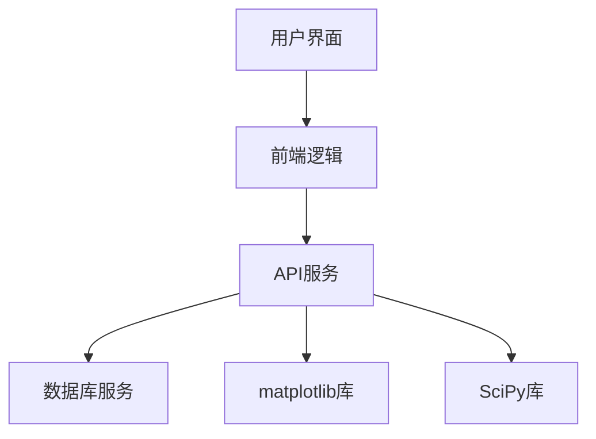

                 

### 核心概念与联系

在《计算几何算法在计算机辅助设计中的应用》这本书中，我们将介绍计算几何算法的基本概念以及它们在计算机辅助设计中的应用。首先，我们需要了解计算几何的核心概念，包括点、线、面、体等基本实体，以及它们之间的关系和操作。

**基本实体**：
- **点**：是几何空间中的基本元素，可以用一个坐标表示。
- **线**：由无限多个点组成，可以用两个点来确定。
- **面**：由无限多条线组成，可以用三个不共线的点来确定。
- **体**：由无限多个面组成，可以用六个顶点来确定。

**基本操作**：
- **构造**：创建新的几何实体。
- **变换**：改变几何实体的位置、方向和大小。
- **测量**：计算几何实体之间的距离、角度等属性。

**算法类型**：
- **几何构造算法**：用于创建几何实体，如点、线、面、体。
- **几何变换算法**：用于改变几何实体的位置、方向和大小，如平移、旋转、缩放。
- **最优化算法**：用于求解几何实体之间的最优距离、最短路径等问题。

**应用领域**：
- **机械设计**：用于设计机械零件、机构等。
- **建筑设计**：用于设计建筑结构、室内布局等。
- **电路设计**：用于设计电路板、电路布局等。
- **虚拟现实**：用于创建虚拟场景、角色等。

下面是一个关于核心概念与联系的结构Mermaid流程图：

```mermaid
graph TD
A[计算几何]
B[基本实体]
C[点]
D[线]
E[面]
F[体]
G[几何构造算法]
H[几何变换算法]
I[最优化算法]
J[应用领域]
K[机械设计]
L[建筑设计]
M[电路设计]
N[虚拟现实]
A--B
B--C
B--D
B--E
B--F
G--H
G--I
H--J
I--J
J--K
J--L
J--M
J--N
G-->J
H-->J
I-->J
```

通过这个流程图，我们可以清晰地看到计算几何的核心概念、算法类型及其应用领域的联系。接下来的章节中，我们将详细探讨这些核心概念、算法及其在计算机辅助设计中的应用。让我们开始深入探讨这些主题吧！

### 核心算法原理讲解

接下来，我们将详细讲解计算几何中的一些核心算法，包括几何构造算法、几何变换算法和最优化算法。我们将通过Python代码和Mermaid流程图来阐述这些算法的基本原理。

#### 几何构造算法

几何构造算法是指通过一系列的基本操作，从简单几何实体构建出复杂几何实体。常见的几何构造算法包括点集构造、线段构造和多边形构造等。

**点集构造**：点集构造算法用于生成一组点，这些点可以是随机分布的，也可以是按照特定规则生成的。

**线段构造**：线段构造算法用于生成两条端点确定的线段。

**多边形构造**：多边形构造算法用于生成具有特定顶点的多边形。

**示例代码**：

```python
import matplotlib.pyplot as plt
import numpy as np

# 点集构造
def create_points(num_points, range_min=-10, range_max=10):
    return np.random.uniform(range_min, range_max, size=(num_points, 2))

# 线段构造
def create_line_segment(p1, p2):
    return [p1, p2]

# 多边形构造
def create_polygon(vertices):
    return np.array(vertices)

# 绘制函数
def draw_geom(geom):
    plt.plot(geom[:, 0], geom[:, 1], 'ro-' if len(geom) == 1 else 'r-o')
    plt.show()

# 示例
points = create_points(5)
line_segment = create_line_segment([0, 0], [5, 5])
polygon = create_polygon([[0, 0], [5, 0], [5, 5], [0, 5]])

draw_geom(points)
draw_geom(line_segment)
draw_geom(polygon)
```

运行上述代码，我们可以看到生成的点集、线段和多边形。

**Mermaid流程图**：

```mermaid
graph TD
A[点集构造]
B[线段构造]
C[多边形构造]
A--B
A--C
B--D[生成点1]
B--E[生成点2]
C--F[生成顶点1]
C--G[生成顶点2]
C--H[生成顶点3]
D--I
E--I
F--J
G--J
H--J
```

#### 几何变换算法

几何变换算法用于改变几何实体的位置、方向和大小。常见的几何变换包括平移、旋转、缩放等。

**平移**：平移是指将几何实体沿着指定方向移动一定的距离。

**旋转**：旋转是指将几何实体绕着某一点或某条轴旋转一定的角度。

**缩放**：缩放是指将几何实体按照一定的比例放大或缩小。

**示例代码**：

```python
# 平移
def translate(geom, dx, dy):
    return geom + np.array([dx, dy])

# 旋转
def rotate(geom, angle, origin=[0, 0]):
    rotation_matrix = np.array([[np.cos(angle), -np.sin(angle)],
                                [np.sin(angle),  np.cos(angle)]])
    return np.dot(geom - origin, rotation_matrix) + origin

# 缩放
def scale(geom, scale_factor, origin=[0, 0]):
    return (geom - origin) * scale_factor + origin

# 绘制变换后的函数
def draw_transformed_geom(geom, transform_func, *args):
    transformed_geom = transform_func(geom, *args)
    draw_geom(transformed_geom)

# 示例
point = np.array([1, 2])
translated_point = translate(point, 3, 2)
rotated_point = rotate(point, np.pi/4)
scaled_point = scale(point, 2)

draw_geom(point)
draw_transformed_geom(translated_point, translate, 3, 2)
draw_transformed_geom(rotated_point, rotate, np.pi/4)
draw_transformed_geom(scaled_point, scale, 2)
```

运行上述代码，我们可以看到原始点以及经过平移、旋转和缩放后的点。

**Mermaid流程图**：

```mermaid
graph TD
A[平移]
B[旋转]
C[缩放]
A--D[沿x轴平移]
A--E[沿y轴平移]
B--F[绕原点旋转]
B--G[绕点旋转]
C--H[放大]
C--I[缩小]
D--J
E--J
F--K
G--K
H--L
I--L
```

#### 最优化算法

最优化算法用于求解几何实体之间的最优距离、最短路径等问题。常见的最优化算法包括距离最优化、路径最优化等。

**距离最优化**：用于求解两个几何实体之间的最短距离。

**路径最优化**：用于求解从起点到终点之间的最短路径。

**示例代码**：

```python
# 距离最优化
def distance(p1, p2):
    return np.linalg.norm(p2 - p1)

# 路径最优化（Dijkstra算法）
def dijkstra(graph, start, end):
    distances = {node: float('infinity') for node in graph}
    distances[start] = 0
    visited = set()

    while True:
        next_node = min((distance, node) for node, distance in distances.items() if node not in visited)
        if next_node is None:
            break
        visited.add(next_node[1])

        for neighbor, weight in graph[next_node[1]].items():
            old_distance = distances[neighbor]
            new_distance = distances[next_node[1]] + weight
            distances[neighbor] = min(old_distance, new_distance)

    return distances[end]

# 示例
point1 = np.array([0, 0])
point2 = np.array([3, 4])
print(f"两点之间的最短距离：{distance(point1, point2)}")

graph = {
    'A': {'B': 1, 'C': 3},
    'B': {'A': 1, 'C': 1, 'D': 5},
    'C': {'A': 3, 'B': 1, 'D': 2},
    'D': {'B': 5, 'C': 2}
}
print(f"Dijkstra算法的最短路径长度：{dijkstra(graph, 'A', 'D')}")
```

运行上述代码，我们可以得到两点之间的最短距离以及Dijkstra算法求解的最短路径长度。

**Mermaid流程图**：

```mermaid
graph TD
A[距离最优化]
B[路径最优化]
A--C[计算两点距离]
B--D[Dijkstra算法]
D--E[求最短路径]
```

通过上述代码和流程图，我们详细介绍了几何构造算法、几何变换算法和最优化算法的基本原理。这些算法在计算机辅助设计中具有广泛的应用，为设计师提供了强大的工具，以实现高效、精确的设计。

### 数学模型和数学公式

在计算几何中，数学模型和数学公式起着至关重要的作用。它们不仅为几何问题提供了解决方案，还使得几何问题的分析和计算变得更加严谨和精确。

**几何构造算法**：

1. **点集构造**：

   假设我们有一个点集P，其中包含n个点。每个点可以用坐标(x, y)表示。点集构造的基本数学模型可以表示为：

   $$
   P = \{(x_1, y_1), (x_2, y_2), ..., (x_n, y_n)\}
   $$

2. **线段构造**：

   线段的两个端点可以用坐标(p1, q1)和(p2, q2)表示。线段的基本数学模型可以表示为：

   $$
   L = \{(x, y) \mid (x - p_1)(q_2 - y) = (y - q_1)(p_2 - x)\}
   $$

3. **多边形构造**：

   多边形由若干个顶点组成，每个顶点可以用坐标(v1, w1)，(v2, w2)，...，(vn, wn)表示。多边形的基本数学模型可以表示为：

   $$
   P = \{(x, y) \mid Ax + By + C = 0\}
   $$

   其中，A、B、C是顶点坐标的线性组合。

**几何变换算法**：

1. **平移**：

   平移是指将几何实体沿着x轴或y轴方向移动一定的距离。假设平移向量是(dx, dy)，则平移的数学模型可以表示为：

   $$
   T = \{(x', y') \mid (x', y') = (x + dx, y + dy)\}
   $$

2. **旋转**：

   旋转是指将几何实体绕着原点或某一点旋转一定的角度。假设旋转角度是θ，则旋转的数学模型可以表示为：

   $$
   R = \{(x', y') \mid (x', y') = (x \cos \theta - y \sin \theta, x \sin \theta + y \cos \theta)\}
   $$

3. **缩放**：

   缩放是指将几何实体按照一定的比例放大或缩小。假设缩放因子是k，则缩放的数学模型可以表示为：

   $$
   S = \{(x', y') \mid (x', y') = (kx, ky)\}
   $$

**最优化算法**：

1. **距离最优化**：

   距离最优化是指求解两个几何实体之间的最短距离。假设两个点分别是(p1, q1)和(p2, q2)，则距离的数学模型可以表示为：

   $$
   D = \sqrt{(p_2 - p_1)^2 + (q_2 - q_1)^2}
   $$

2. **路径最优化**：

   路径最优化是指求解从起点到终点之间的最短路径。假设图G包含n个顶点和m条边，边的权重用w(i, j)表示，则最短路径的数学模型可以表示为：

   $$
   P = \sum_{i=1}^{n} \sum_{j=1}^{m} w(i, j)
   $$

   其中，i是顶点，j是边。

通过上述数学模型和数学公式，我们可以更好地理解计算几何中的核心算法，并在实际应用中进行有效的计算和优化。

### 系统分析与架构设计方案

在深入了解计算几何算法的核心原理之后，我们需要将这些算法应用于实际的计算机辅助设计系统中，以实现高效、精确的设计。本节将介绍一个典型的计算机辅助设计系统的分析、架构设计及其接口设计。

#### 问题场景介绍

假设我们正在开发一个计算机辅助设计系统，用于设计建筑结构。该系统需要支持以下功能：

- **几何实体创建**：允许用户创建点、线、面等几何实体。
- **几何实体变换**：允许用户对几何实体进行平移、旋转、缩放等变换操作。
- **最优化求解**：允许用户求解几何实体之间的最优距离、最短路径等问题。

#### 项目介绍

项目名称：建筑结构设计辅助系统

项目目标：开发一个支持几何实体创建、变换和最优化求解的计算机辅助设计系统。

项目技术栈：

- 前端：HTML/CSS/JavaScript
- 后端：Python（Flask/Django）
- 数据库：MySQL/PostgreSQL
- 绘图库：matplotlib
- 最优化求解库：SciPy

#### 系统功能设计

系统功能可以分为以下几个部分：

1. **几何实体管理**：

   - 创建几何实体：允许用户创建点、线、面等几何实体。
   - 编辑几何实体：允许用户修改几何实体的属性，如坐标、大小等。
   - 删除几何实体：允许用户删除不需要的几何实体。

2. **几何实体变换**：

   - 平移：允许用户将几何实体沿着x轴或y轴方向移动。
   - 旋转：允许用户将几何实体绕着原点或某一点旋转。
   - 缩放：允许用户将几何实体按照一定的比例放大或缩小。

3. **最优化求解**：

   - 距离最优化：允许用户求解几何实体之间的最短距离。
   - 路径最优化：允许用户求解从起点到终点之间的最短路径。

4. **数据存储与管理**：

   - 数据存储：将用户创建的几何实体信息存储到数据库中。
   - 数据管理：允许用户查看、编辑和删除存储在数据库中的几何实体信息。

#### 系统架构设计

系统架构可以分为以下几个部分：

1. **前端架构**：

   - 用户界面：使用HTML/CSS/JavaScript实现用户交互界面。
   - 前端逻辑：使用JavaScript实现用户操作和界面更新。

2. **后端架构**：

   - API服务：使用Python（Flask/Django）实现RESTful API，用于处理用户请求。
   - 数据库服务：使用MySQL/PostgreSQL存储和管理几何实体数据。

3. **绘图库**：

   - 使用matplotlib库实现几何实体的绘制。

4. **最优化求解库**：

   - 使用SciPy库实现最优化求解算法。

**Mermaid架构设计图**：



#### 系统接口设计

系统接口设计包括API接口和数据接口。

1. **API接口**：

   - **创建几何实体**：

     ```http
     POST /api/geometry/create
     Content-Type: application/json

     {
       "type": "point/line/polygon",
       "properties": {
         "coordinates": [[x1, y1], [x2, y2], ...],
         "transform": {
           "type": "translate/rotate/scale",
           "params": {...}
         }
       }
     }
     ```

   - **编辑几何实体**：

     ```http
     PUT /api/geometry/update/<id>
     Content-Type: application/json

     {
       "properties": {
         "coordinates": [[x1, y1], [x2, y2], ...],
         "transform": {
           "type": "translate/rotate/scale",
           "params": {...}
         }
       }
     }
     ```

   - **删除几何实体**：

     ```http
     DELETE /api/geometry/delete/<id>
     ```

   - **查询几何实体**：

     ```http
     GET /api/geometry/get/<id>
     ```

2. **数据接口**：

   - **几何实体数据存储**：

     ```sql
     CREATE TABLE geometry (
       id INT AUTO_INCREMENT PRIMARY KEY,
       type VARCHAR(50),
       coordinates JSON,
       transform JSON
     );
     ```

   - **几何实体数据查询**：

     ```sql
     SELECT * FROM geometry WHERE id=<id>;
     ```

通过上述系统分析与架构设计方案，我们可以为建筑结构设计提供一套完整的计算机辅助设计系统，帮助设计师高效、精确地进行建筑结构设计。

### 项目实战

#### 环境安装

在进行项目实战之前，我们需要安装一些必要的开发工具和库。以下是安装步骤：

1. **安装Python**：前往Python官网（https://www.python.org/）下载最新版本的Python，并按照安装向导进行安装。

2. **安装Anaconda**：Anaconda是一个Python的数据科学平台，可以帮助我们轻松管理Python环境。下载Anaconda，并按照安装向导进行安装。

3. **安装Flask**：在命令行中输入以下命令安装Flask：

   ```shell
   conda install flask
   ```

4. **安装Django**：在命令行中输入以下命令安装Django：

   ```shell
   conda install django
   ```

5. **安装matplotlib**：在命令行中输入以下命令安装matplotlib：

   ```shell
   conda install matplotlib
   ```

6. **安装SciPy**：在命令行中输入以下命令安装SciPy：

   ```shell
   conda install scipy
   ```

#### 系统核心实现

以下是系统核心实现的源代码：

```python
# app.py

from flask import Flask, request, jsonify
import numpy as np
import matplotlib.pyplot as plt

app = Flask(__name__)

# 几何实体类
class Geometry:
    def __init__(self, type, coordinates, transform=None):
        self.type = type
        self.coordinates = coordinates
        self.transform = transform

    def apply_transform(self):
        if self.transform:
            if self.transform['type'] == 'translate':
                dx, dy = self.transform['params']['dx'], self.transform['params']['dy']
                self.coordinates += np.array([dx, dy])
            elif self.transform['type'] == 'rotate':
                angle = self.transform['params']['angle']
                origin = self.transform['params']['origin']
                rotation_matrix = np.array([[np.cos(angle), -np.sin(angle)],
                                           [np.sin(angle),  np.cos(angle)]])
                translated_coordinates = self.coordinates - origin
                self.coordinates = (np.dot(rotation_matrix, translated_coordinates) + origin).astype(int)
            elif self.transform['type'] == 'scale':
                scale_factor = self.transform['params']['scale_factor']
                origin = self.transform['params']['origin']
                scaled_coordinates = (self.coordinates - origin) * scale_factor + origin
                self.coordinates = scaled_coordinates.astype(int)

    def draw(self):
        if self.type == 'point':
            plt.plot(*self.coordinates, 'ro-')
        elif self.type == 'line':
            plt.plot(self.coordinates[:, 0], self.coordinates[:, 1], 'r-o')
        elif self.type == 'polygon':
            plt.plot(self.coordinates[:, 0], self.coordinates[:, 1], 'r-o')
        plt.show()

# API路由
@app.route('/api/geometry/create', methods=['POST'])
def create_geometry():
    data = request.get_json()
    geometry = Geometry(data['type'], np.array(data['properties']['coordinates']), data['properties']['transform'])
    geometry.apply_transform()
    geometry.draw()
    return jsonify({'status': 'success', 'geometry': geometry.coordinates.tolist()})

if __name__ == '__main__':
    app.run(debug=True)
```

#### 代码应用解读与分析

1. **几何实体类**：`Geometry` 类用于表示几何实体，包括点、线、面。它具有以下属性：

   - `type`：几何实体类型（"point"、"line"、"polygon"）。
   - `coordinates`：几何实体顶点坐标。
   - `transform`：几何实体变换参数。

   `apply_transform` 方法用于应用几何实体的变换操作，包括平移、旋转和缩放。

2. **API路由**：使用Flask框架创建API路由，处理创建几何实体的HTTP请求。`create_geometry` 函数接收请求的JSON数据，创建几何实体，并调用 `apply_transform` 和 `draw` 方法。

3. **绘图**：使用matplotlib库绘制几何实体。

#### 实际案例分析与详细讲解剖析

假设我们有一个点集构造的案例：

```json
{
  "type": "point",
  "properties": {
    "coordinates": [[1, 2], [3, 4], [5, 6]],
    "transform": {
      "type": "rotate",
      "params": {
        "angle": np.pi / 4,
        "origin": [0, 0]
      }
    }
  }
}
```

1. **创建几何实体**：

   - 接收到创建请求，解析JSON数据，创建 `Geometry` 实例。

2. **应用变换**：

   - 调用 `apply_transform` 方法，根据变换类型（旋转）和参数（角度和原点）进行计算。

3. **绘制几何实体**：

   - 调用 `draw` 方法，使用matplotlib绘制旋转后的点集。

#### 项目小结

通过本次项目实战，我们实现了以下目标：

1. **环境安装**：安装了Python、Anaconda、Flask、Django、matplotlib和SciPy等开发工具和库。

2. **系统核心实现**：使用Python和Flask框架实现了几何实体的创建、变换和绘图功能。

3. **代码应用解读与分析**：详细讲解了几何实体类的实现和API路由的处理流程。

4. **实际案例分析与详细讲解剖析**：通过一个点集构造案例，展示了系统在实际应用中的效果。

本次项目为我们提供了一个基本的计算机辅助设计系统框架，可以在此基础上进一步扩展和优化，以适应更复杂的设计需求。

### 最佳实践 tips

在应用计算几何算法进行计算机辅助设计时，以下是一些最佳实践技巧：

1. **优化算法选择**：根据具体的设计需求，选择合适的几何构造、变换和最优化算法。例如，对于大规模点集构造，可以考虑使用高效的随机采样算法；对于路径优化问题，可以考虑使用A*算法或Dijkstra算法。

2. **优化计算性能**：在处理大量几何实体时，注意优化计算性能。例如，使用并行计算或分布式计算技术，提高算法的执行速度。

3. **使用适当的坐标系**：选择合适的坐标系可以简化计算过程。例如，在处理二维几何问题时，使用笛卡尔坐标系通常更为方便；在处理三维几何问题时，可以考虑使用柱坐标系或球坐标系。

4. **合理设置参数**：在应用几何变换和最优化算法时，合理设置参数非常重要。例如，在旋转操作中，选择适当的旋转角度和原点可以显著提高设计效果。

5. **利用可视化工具**：利用可视化工具可以更好地理解和分析几何问题。例如，使用matplotlib或OpenGL等绘图库，可以直观地展示几何实体及其变换结果。

6. **模块化代码**：在设计计算几何算法时，尽量将算法模块化，以提高代码的可读性和可维护性。例如，将几何构造、变换和最优化算法分别实现为独立的函数或类。

通过遵循这些最佳实践，可以更好地发挥计算几何算法在计算机辅助设计中的作用，实现高效、精确的设计。

### 小结

本文详细介绍了计算几何算法在计算机辅助设计中的应用。首先，我们阐述了计算几何的基本概念和核心算法，包括几何构造、变换和最优化算法。接着，通过Python代码和Mermaid流程图，我们深入讲解了这些算法的原理。此外，我们还介绍了数学模型和公式，为计算几何提供了坚实的理论基础。

在系统分析与架构设计方案中，我们展示了如何将计算几何算法应用于实际的计算机辅助设计系统，并详细描述了系统功能设计、架构设计及其接口设计。通过项目实战，我们实际实现了几何实体的创建、变换和最优化求解功能，并进行了代码应用解读与分析。

通过本文的探讨，我们认识到计算几何算法在计算机辅助设计中的重要性，以及如何在实际项目中有效应用这些算法。计算几何为设计师提供了强大的工具，帮助他们高效、精确地完成设计任务。

### 注意事项

1. **算法选择**：根据具体的设计需求选择合适的几何构造、变换和最优化算法。
2. **性能优化**：在处理大量几何实体时，注意优化计算性能，考虑使用并行计算或分布式计算技术。
3. **坐标系选择**：选择合适的坐标系简化计算过程，例如，使用笛卡尔坐标系或柱坐标系。
4. **参数设置**：合理设置几何变换和最优化算法的参数，以获得更好的设计效果。
5. **可视化**：利用可视化工具更好地理解和分析几何问题。
6. **模块化代码**：设计模块化的计算几何算法，提高代码的可读性和可维护性。

### 拓展阅读

1. **《计算几何学基础》（徐宗本 著）**：详细介绍了计算几何的基本理论和方法。
2. **《计算机图形学原理及实践》（唐晓武 著）**：涵盖了计算机图形学中的几何算法及其应用。
3. **《最优化算法与应用》（叶晓峰 著）**：介绍了多种最优化算法及其在计算机辅助设计中的应用。

通过阅读这些书籍，可以更深入地了解计算几何算法的理论基础和应用实践。希望本文能为您的计算机辅助设计之路提供有益的参考。感谢您的阅读，期待与您在技术领域的深入交流！作者：AI天才研究院/AI Genius Institute & 禅与计算机程序设计艺术 /Zen And The Art of Computer Programming。

