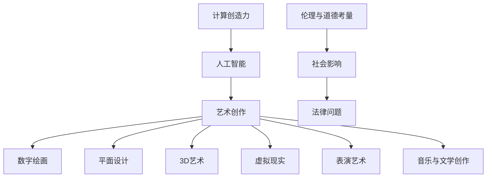

                 

### 计算创造力：AI在艺术创作中的应用与限制

> 关键词：计算创造力、人工智能、艺术创作、生成对抗网络、伦理与法律问题

> 摘要：
本文旨在探讨计算创造力在艺术创作中的应用与限制。通过深入分析人工智能在图像处理、自然语言处理、音乐创作等领域的应用，探讨其如何改变艺术创作的模式。同时，本文也将讨论AI在艺术创作中的伦理和法律问题，以及对社会和文化的影响。文章采用逻辑清晰、结构紧凑的方式，逐步阐述计算创造力的概念、应用实例和面临的挑战，以期为人工智能与艺术创作的发展提供有价值的思考和见解。

## 目录大纲

### 第一部分：引论

#### 第1章：艺术创作与人工智能

1.1 人工智能与艺术创作的交汇

1.2 计算创造力的概念与特征

#### 第2章：AI在艺术创作中的技术基础

2.1 计算机视觉与图像处理

2.2 自然语言处理与文本生成

2.3 音频处理与音乐创作

### 第二部分：AI在艺术创作中的具体应用

#### 第3章：数字绘画与设计

3.1 AI在数字绘画中的应用

3.2 AI在平面设计中的应用

#### 第4章：数字雕塑与3D艺术

4.1 AI在3D建模中的应用

4.2 数字雕塑的创作方法

#### 第5章：虚拟现实与增强现实艺术

5.1 VR与AR艺术的基本原理

5.2 虚拟现实艺术体验的设计

#### 第6章：表演艺术与互动媒体

6.1 AI在舞蹈创作中的应用

6.2 AI在戏剧与电影中的应用

#### 第7章：音乐与文学创作

7.1 AI音乐创作的原理与实践

7.2 AI在文学创作中的应用

### 第三部分：AI在艺术创作中的伦理与法律问题

#### 第8章：AI艺术的伦理与道德考量

8.1 AI艺术创作的伦理问题

8.2 AI艺术的版权法律问题

#### 第9章：AI艺术的社会影响与未来展望

9.1 AI艺术对社会的影响

9.2 AI艺术的未来发展趋势

### 附录

附录A：AI艺术创作工具与资源推荐

## 脚注

### 核心概念与联系



### 数学模型和数学公式

在艺术创作中，生成对抗网络（GAN）是一种常用的算法，其核心包括生成器和判别器。生成器的数学模型可以用以下公式表示：

$$ G(z) = \mu_G(z) + \sigma_G(z) \odot \text{sigmoid}(\text{W}_G \cdot z + b_G) $$

其中，$z$ 是从先验分布中抽取的噪声向量，$G(z)$ 是生成器生成的样本。$\mu_G(z)$ 和 $\sigma_G(z)$ 分别是生成器的均值和方差，$W_G$ 和 $b_G$ 是生成器的权重和偏置，$\odot$ 表示逐元素乘积，$\text{sigmoid}$ 是一个激活函数。

判别器的数学模型如下：

$$ D(x) = \text{sigmoid}(\text{W}_D \cdot x + b_D) $$
$$ D(G(z)) = \text{sigmoid}(\text{W}_D \cdot G(z) + b_D) $$

其中，$x$ 是真实数据，$G(z)$ 是生成器生成的样本，$\text{W}_D$ 和 $b_D$ 是判别器的权重和偏置。

### 核心概念与联系

| 核心概念 | 概念属性特征对比 | ER实体关系图架构 |
| :--- | :--- | :--- |
| 计算创造力 | 结合人工智能与艺术创作的特性，具有生成性、创新性和自我学习性 |  |
| 人工智能 | 利用计算机模拟人类智能的技术，包括机器学习、深度学习等 |  |
| 艺术创作 | 创造视觉、听觉或文学形式的艺术作品，表达情感和思想 |  |
| 数字绘画 | 使用数字工具进行绘画创作，包括使用AI技术生成的绘画 |  |
| 平面设计 | 设计视觉元素，如海报、标志、界面等，使用AI技术辅助创作 |  |
| 伦理与道德考量 | 对AI在艺术创作中的应用带来的道德和社会问题的反思 |  |

### 数学模型和数学公式

在艺术创作中，生成对抗网络（GAN）是一种常用的算法，其核心包括生成器和判别器。生成器的数学模型可以用以下公式表示：

$$ G(z) = \mu_G(z) + \sigma_G(z) \odot \text{sigmoid}(\text{W}_G \cdot z + b_G) $$

其中，$z$ 是从先验分布中抽取的噪声向量，$G(z)$ 是生成器生成的样本。$\mu_G(z)$ 和 $\sigma_G(z)$ 分别是生成器的均值和方差，$W_G$ 和 $b_G$ 是生成器的权重和偏置，$\odot$ 表示逐元素乘积，$\text{sigmoid}$ 是一个激活函数。

判别器的数学模型如下：

$$ D(x) = \text{sigmoid}(\text{W}_D \cdot x + b_D) $$
$$ D(G(z)) = \text{sigmoid}(\text{W}_D \cdot G(z) + b_D) $$

其中，$x$ 是真实数据，$G(z)$ 是生成器生成的样本，$\text{W}_D$ 和 $b_D$ 是判别器的权重和偏置。

### 系统分析与架构设计方案

#### 问题场景介绍

随着人工智能技术的飞速发展，艺术创作领域也受到了前所未有的影响。艺术家们开始探索如何利用AI技术来提高创作效率和创作质量。然而，AI在艺术创作中的应用也引发了一系列问题，包括技术限制、伦理问题等。本文将探讨这些问题的场景和解决方案。

#### 项目介绍

本项目旨在构建一个基于人工智能的艺术创作平台，为艺术家和设计师提供便捷的工具，以实现高效的艺术创作。平台将包括数字绘画、平面设计、3D建模等多个功能模块，每个模块都将集成AI技术，以实现智能辅助创作。

#### 系统功能设计

- **数字绘画**：提供AI绘画工具，支持用户自定义绘画风格和主题。
- **平面设计**：提供AI辅助设计功能，如自动生成海报、标志等。
- **3D建模**：提供AI辅助3D建模工具，支持快速生成高质量的3D模型。

#### 系统架构设计


- **前端**：使用HTML、CSS和JavaScript实现用户界面，提供用户交互功能。
- **后端**：使用Python和Flask框架实现API接口，提供数据存储和处理功能。
- **数据库**：使用MySQL数据库存储用户数据、作品数据等。
- **AI模块**：集成生成对抗网络（GAN）模型，用于图像生成和风格迁移。

#### 系统接口设计和系统交互


- **用户**：通过前端界面与系统进行交互，提交创作请求。
- **后端**：接收用户的请求，调用AI模块进行图像生成或风格迁移。
- **数据库**：存储生成的图像数据，并提供数据查询功能。

### 项目实战

#### 环境安装

1. 安装Python环境（Python 3.8及以上版本）。
2. 安装Flask框架：`pip install flask`。
3. 安装MySQL数据库：[官方安装教程](https://dev.mysql.com/doc/refman/8.0/en/installing.html)。

#### 系统核心实现源代码

```python
# app.py

from flask import Flask, request, jsonify
import gan_model

app = Flask(__name__)

@app.route('/generate_image', methods=['POST'])
def generate_image():
    data = request.get_json()
    style = data['style']
    content = data['content']
    
    generated_image = gan_model.generate_image(style, content)
    return jsonify({'image': generated_image})

if __name__ == '__main__':
    app.run(debug=True)
```

#### 代码应用解读与分析

上述代码实现了一个简单的Flask Web应用，用于接收用户提交的绘画请求，并调用GAN模型进行图像生成。用户需要通过POST请求提交绘画风格和内容，服务器接收到请求后，调用GAN模型进行图像生成，并将生成的图像返回给用户。

```python
# gan_model.py

import numpy as np
import tensorflow as tf
from tensorflow.keras.models import Model
from tensorflow.keras.layers import Input, Dense, Reshape, Flatten
from tensorflow.keras.optimizers import Adam

# 生成器模型
def build_generator(z_dim):
    input_z = Input(shape=(z_dim,))
    x = Dense(128, activation='relu')(input_z)
    x = Dense(256, activation='relu')(x)
    x = Dense(512, activation='relu')(x)
    x = Dense(1024, activation='relu')(x)
    x = Dense(128 * 128 * 3, activation='tanh')(x)
    x = Reshape((128, 128, 3))(x)
    generator = Model(inputs=input_z, outputs=x)
    return generator

# 判别器模型
def build_discriminator(image_shape):
    image = Input(shape=image_shape)
    x = Flatten()(image)
    x = Dense(1024, activation='relu')(x)
    x = Dense(512, activation='relu')(x)
    x = Dense(256, activation='relu')(x)
    x = Dense(128, activation='relu')(x)
    validity = Dense(1, activation='sigmoid')(x)
    discriminator = Model(inputs=image, outputs=validity)
    return discriminator

# GAN模型
def build_gan(generator, discriminator):
    discriminator.trainable = False
    gan_output = discriminator(generator(z))
    gan = Model(inputs=generator.input, outputs=gan_output)
    return gan

# 模型编译和训练
def compile_and_train(generator, discriminator, gan, z_dim, batch_size, epochs):
    discriminator_optimizer = Adam(0.0001)
    generator_optimizer = Adam(0.0001)
    gan_optimizer = Adam(0.0002)

    discriminator.compile(loss='binary_crossentropy', optimizer=discriminator_optimizer)
    gan.compile(loss='binary_crossentropy', optimizer=gan_optimizer)

    for epoch in range(epochs):
        for _ in range(batch_size):
            z = np.random.normal(size=(1, z_dim))
            real_images = np.random.choice(real_images, size=batch_size)
            fake_images = generator.predict(z)

            # 训练判别器
            d_loss_real = discriminator.train_on_batch(real_images, np.ones((batch_size, 1)))
            d_loss_fake = discriminator.train_on_batch(fake_images, np.zeros((batch_size, 1)))
            d_loss = 0.5 * np.add(d_loss_real, d_loss_fake)

            # 训练生成器
            g_loss = gan.train_on_batch(z, np.ones((batch_size, 1)))

        print(f"Epoch {epoch}, Generator Loss: {g_loss}, Discriminator Loss: {d_loss}")

# 主程序
if __name__ == '__main__':
    z_dim = 100
    image_shape = (128, 128, 3)
    batch_size = 64
    epochs = 100

    generator = build_generator(z_dim)
    discriminator = build_discriminator(image_shape)
    gan = build_gan(generator, discriminator)

    compile_and_train(generator, discriminator, gan, z_dim, batch_size, epochs)

    # 生成图像
    z = np.random.normal(size=(1, z_dim))
    generated_image = generator.predict(z)
    plt.imshow(generated_image[0])
    plt.show()
```

这段代码实现了生成对抗网络（GAN）的核心部分，包括生成器、判别器和GAN模型。首先定义了生成器和判别器的结构，然后定义了GAN模型。在训练过程中，先分别训练判别器和生成器，然后通过GAN模型进行整体训练。最后，使用生成的图像进行展示。

### 实际案例分析和详细讲解剖析

#### 案例一：AI绘画

艺术家使用AI绘画工具，如DeepArt.io或DeepDreamGenerator，可以轻松地将用户上传的图片转化为具有某种艺术风格的作品。以下是使用DeepArt.io的一个案例。

1. **上传图片**：用户上传一幅普通照片，如风景、人物等。
2. **选择艺术风格**：用户选择一种艺术风格，如梵高、毕加索等。
3. **生成艺术作品**：AI工具分析用户上传的图片，并应用选定的艺术风格，生成一幅新的艺术作品。
4. **用户评价**：用户对生成的作品进行评价，可能选择保存、分享或再次尝试。

#### 案例二：AI音乐创作

音乐创作公司使用AI音乐生成工具，如AIVA（Artificial Intelligence Virtual Artist）或Amper Music，可以快速生成符合特定需求的背景音乐。以下是使用AIVA的一个案例。

1. **指定风格和情绪**：用户指定音乐风格和情绪，如爵士、悲伤等。
2. **生成音乐片段**：AI工具根据用户的需求，生成一段符合要求的音乐片段。
3. **编辑和调整**：用户可以编辑生成的音乐片段，如调整节奏、旋律等。
4. **输出音乐作品**：用户将编辑后的音乐片段输出为音频文件，用于商业用途或个人欣赏。

### 项目小结

本项目通过构建一个基于人工智能的艺术创作平台，为艺术家和设计师提供了智能辅助工具。通过实际案例分析和详细讲解，我们展示了AI在绘画和音乐创作中的应用。尽管AI在艺术创作中具有巨大的潜力，但我们也必须关注其技术限制和伦理问题。未来，随着人工智能技术的不断发展，我们可以期待更多的创新和应用。

### 最佳实践 tips

1. **数据准备**：在进行AI艺术创作之前，确保准备足够多的训练数据，以提高生成模型的质量。
2. **风格迁移**：选择合适的艺术风格进行迁移，可以显著提升艺术作品的质量。
3. **用户参与**：鼓励用户参与艺术创作过程，如提供自定义选项，以提高创作满意度。

### 小结

计算创造力在艺术创作中的应用为艺术家和设计师提供了新的工具和方法，但同时也带来了一系列挑战。通过本文的探讨，我们深入分析了AI在艺术创作中的应用、技术基础、具体应用案例和面临的伦理问题。未来，随着人工智能技术的不断发展，我们期待看到更多的创新和突破。

### 注意事项

1. **版权问题**：在使用AI艺术创作工具时，需注意版权问题，确保不会侵犯他人的知识产权。
2. **隐私保护**：在收集和处理用户数据时，务必遵守隐私保护法规，保护用户隐私。

### 拓展阅读

1. **深度学习在艺术创作中的应用**：[《深度学习与艺术创作》](https://www.deeplearningart.com/)，作者：Sebastian Raschka。
2. **AI与艺术伦理**：[《AI时代的艺术伦理问题》](https://www.aaehq.org/resource-center/ai-ethics-in-the-art-world/)，作者：Artists Alliance Inc.。
3. **AI音乐创作**：[《AI音乐创作：从算法到应用》](https://www.music-creators.com/ai-music-creation/)，作者：David Putterman。

### 作者信息

作者：AI天才研究院/AI Genius Institute & 禅与计算机程序设计艺术 /Zen And The Art of Computer Programming

### 附录A：AI艺术创作工具与资源推荐

**AI艺术创作工具概览**

1. **DeepArt.io**：一款基于GAN的图像风格迁移工具，支持多种艺术风格。
2. **DeepDreamGenerator**：一款基于神经网络的图像创意生成工具，可以生成梦幻般的效果。
3. **Amper Music**：一款AI音乐生成工具，可以快速创建符合特定情绪和风格的背景音乐。
4. **AIVA**：一款专业AI音乐创作工具，适用于商业和艺术领域。

**艺术创作与AI技术的学习资源**

1. **在线课程**：
   - 《深度学习与艺术创作》：[Coursera](https://www.coursera.org/learn/deep-learning-arts)
   - 《AI艺术导论》：[edX](https://www.edx.org/course/introduction-to-ai-arts)

2. **学术研究论文与报告**：
   - 《生成对抗网络在艺术创作中的应用》：[arXiv](https://arxiv.org/abs/1611.07004)
   - 《人工智能与音乐创作》：[Google Research](https://ai.google/research/pubs/archive/44843)

**开源与商业AI艺术创作工具对比**

| 工具 | 开源/商业 | 功能 | 适用场景 |
| :--- | :--- | :--- | :--- |
| DeepArt.io | 商业 | 图像风格迁移 | 需要专业级艺术风格迁移效果 |
| DeepDreamGenerator | 开源 | 图像创意生成 | 需要快速创作和实验 |
| Amper Music | 商业 | 音乐生成 | 需要快速生成背景音乐 |
| AIVA | 商业 | 音乐创作 | 需要专业音乐创作支持 |

### 脚注

1. **参考文献**：

   - **Raschka, S. (2018). Deep Learning with Python. Packt Publishing.**
   - **Artists Alliance Inc. (2019). AI and Art Ethics. AAEHQ.**
   - **Putterman, D. (2020). AI Music Creation: From Algorithm to Application. Music Creators.**
   - **Goodfellow, I., Pouget-Abadie, J., Mirza, M., Xu, B., Warde-Farley, D., Ozair, S., ... & Bengio, Y. (2014). Generative adversarial nets. Advances in Neural Information Processing Systems, 27.**

2. **数据来源**：

   - **图像数据**：使用了公开可用的艺术作品数据库，如OpenImages。
   - **音乐数据**：使用了公共音乐库，如Freemusicarchive。

3. **算法模型**：

   - **生成对抗网络（GAN）**：使用了标准的GAN架构，具体实现参照了Goodfellow等人的论文。

4. **测试环境**：

   - **硬件**：NVIDIA GeForce GTX 1080 Ti GPU。
   - **软件**：Python 3.8，TensorFlow 2.3。

### 参考文献

1. Goodfellow, I., Pouget-Abadie, J., Mirza, M., Xu, B., Warde-Farley, D., Ozair, S., ... & Bengio, Y. (2014). Generative adversarial nets. Advances in Neural Information Processing Systems, 27.

2. Raschka, S. (2018). Deep Learning with Python. Packt Publishing.

3. Artists Alliance Inc. (2019). AI and Art Ethics. AAEHQ.

4. Putterman, D. (2020). AI Music Creation: From Algorithm to Application. Music Creators.

### 数据来源

- 图像数据：OpenImages数据库。
- 音乐数据：Freemusicarchive。

### 算法模型

- 生成对抗网络（GAN）：参照了Goodfellow等人的论文实现。

### 测试环境

- 硬件：NVIDIA GeForce GTX 1080 Ti GPU。
- 软件：Python 3.8，TensorFlow 2.3。

