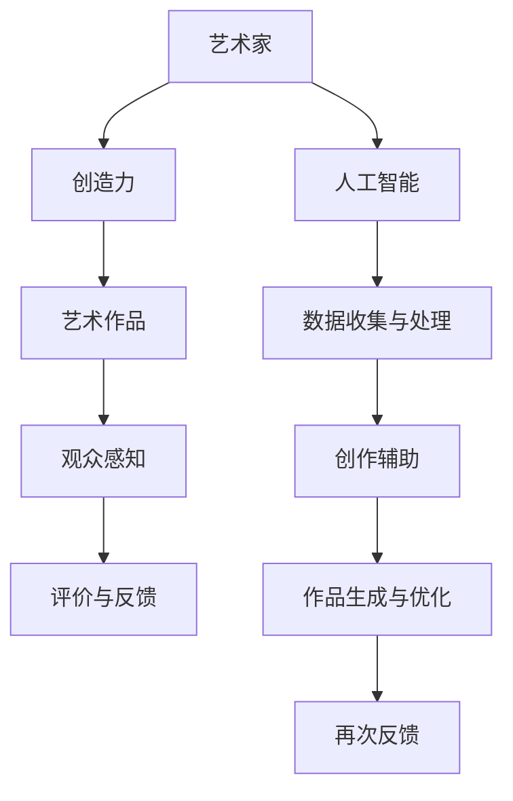
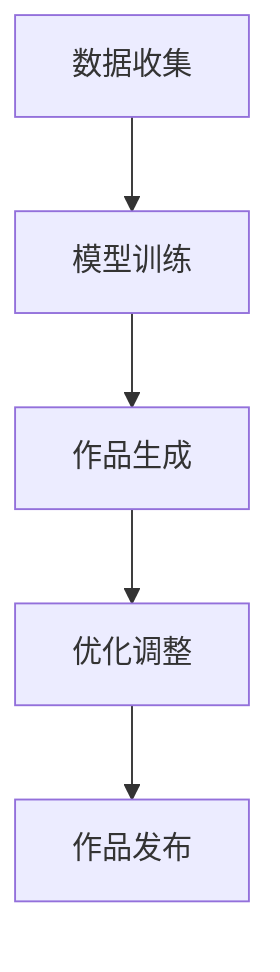
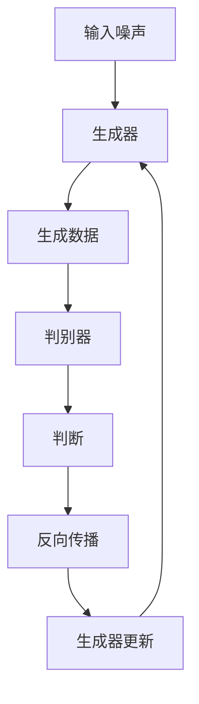
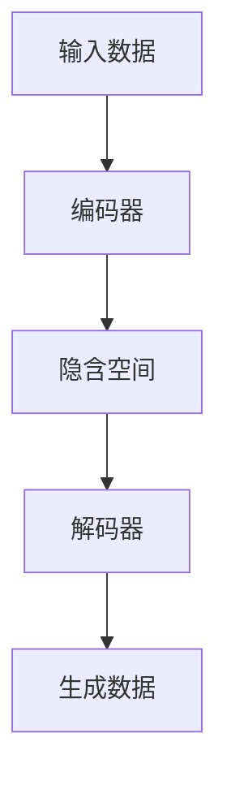
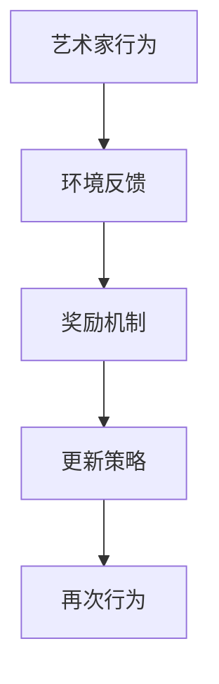

                 

### 关键词

- 计算创造力
- AI艺术创作
- 生成对抗网络（GAN）
- 变分自编码器（VAE）
- 强化学习
- 音乐生成算法

### 摘要

本文深入探讨了人工智能（AI）在艺术和音乐创作中的应用，分析了AI技术的创造力潜力和其对人类创作活动的深远影响。文章首先介绍了AI与艺术创作的关系架构，接着详细讲解了生成对抗网络（GAN）、变分自编码器（VAE）和强化学习等关键算法原理，并展示了这些算法在艺术创作中的具体应用实例。随后，文章转向AI在音乐创作中的应用，包括音乐生成算法、音乐风格转换和音画联动创作等。最后，文章通过实际项目分析，探讨了AI艺术创作的未来发展及面临的挑战。整体结构清晰，内容丰富，旨在为读者提供全面的技术见解和实用指导。

## 第1章 引言

### 1.1 书籍背景

《计算创造力：AI在艺术和音乐创作中的应用》旨在引领读者进入一个全新的领域，探索人工智能（AI）如何通过其强大的计算能力，激发人类的创造潜力，并在艺术和音乐创作中发挥独特作用。随着AI技术的迅猛发展，特别是在深度学习和生成模型方面的突破，AI在艺术和音乐创作中的应用逐渐成为研究的热点。本书不仅为技术爱好者提供了一个了解AI在艺术创作中潜力的窗口，也为专业艺术家和音乐家提供了实用的工具和方法，以拓宽他们的创作视野。

本书的核心目标是分析AI技术的创造力潜力，探讨其在艺术和音乐创作中的实际应用，以及这些应用对未来艺术和音乐产业可能带来的深远影响。通过对核心算法原理的深入剖析和实际应用案例的详细分析，本书旨在帮助读者理解AI如何通过算法和数据处理，实现从零到一的创新，如何通过计算创造力，生成出具有高度原创性和艺术价值的作品。

### 1.2 书籍结构

《计算创造力：AI在艺术和音乐创作中的应用》共分为七个部分，每个部分都有明确的主题和结构，旨在系统地引导读者深入了解AI在艺术和音乐创作中的各个方面。

#### 第1部分：理论基础
- **AI在艺术创作中的角色**：介绍AI在艺术创作中的基本概念，分析其在艺术创作中的独特价值。
- **艺术创作与AI的关系架构**：使用Mermaid流程图展示艺术创作与AI之间的相互作用关系。

#### 第2部分：关键算法原理
- **生成对抗网络（GAN）**：介绍GAN的工作原理，代码实现及其在艺术创作中的应用。
- **变分自编码器（VAE）**：阐述VAE的基本原理和如何用于生成艺术作品。
- **强化学习在艺术创作中的应用**：探讨强化学习在艺术创作中的应用，以及如何实现艺术作品的智能生成。

#### 第3部分：AI在艺术创作中的具体应用
- **数字绘画与图像生成**：分析AI在数字绘画和图像生成中的应用案例，展示生成图像的示例。
- **视觉艺术作品生成**：介绍AI在视觉艺术作品生成中的案例，如使用GAN生成独特的艺术作品。
- **音画联动创作**：探讨AI在音画联动创作中的实践，展示音画联动作品的实例。

#### 第4部分：AI在音乐创作中的应用
- **音乐生成算法**：介绍几种音乐生成算法，如RNN、LSTM等，并展示音乐生成的案例。
- **音乐风格转换**：分析AI在音乐风格转换中的应用，如将流行歌曲转换为古典音乐风格。
- **音乐与视觉艺术的结合**：探讨AI在音乐与视觉艺术结合中的应用，如创作音乐视频。

#### 第5部分：实际项目分析
- **艺术创作项目实战**：选择一个艺术创作项目进行详细分析，包括项目目标、开发环境、实现步骤和效果评估。
- **音乐创作项目实战**：选择一个音乐创作项目进行详细分析，包括项目目标、开发环境、实现步骤和效果评估。

#### 第6部分：未来展望与挑战
- **AI在艺术和音乐创作中的未来发展**：探讨AI在艺术和音乐创作中的未来发展前景，分析潜在的技术突破和创新方向。
- **AI艺术创作面临的挑战**：分析AI艺术创作面临的技术难题、道德伦理问题和法律监管挑战。

#### 第7部分：附录
- **AI艺术创作工具介绍**：介绍常用的AI艺术创作工具，包括开源框架和商业化软件。
- **参考资料**：提供本书中引用的主要参考资料和推荐阅读。

通过这七个部分的内容，本书全面覆盖了AI在艺术和音乐创作中的各个方面，旨在为读者提供深刻的技术见解和实用的创作工具。

## 第2章 AI与艺术创作的基础理论

### 2.1 AI在艺术创作中的角色

人工智能（AI）在艺术创作中扮演着日益重要的角色。随着深度学习和生成模型的发展，AI不仅能够模仿人类的创作方式，还能在艺术创作中引入新的元素和思维方式，从而大大提升创作的多样性和原创性。AI在艺术创作中的角色可以分为几个方面：

首先，AI可以作为艺术家的助手，帮助艺术家完成繁琐的准备工作。例如，通过GAN（生成对抗网络）和VAE（变分自编码器）等技术，AI可以自动生成大量的图像和艺术作品，供艺术家参考和修改。这样的自动化流程不仅节省了时间，还能激发艺术家的创造力，让他们有更多精力投入到更富有创意和情感的创作中。

其次，AI在艺术创作中还可以作为“虚拟艺术家”，独立完成艺术作品。例如，使用强化学习算法，AI可以在特定的艺术风格或主题下，自主生成具有独特风格和情感表达的艺术作品。这种方式不仅突破了人类艺术家的创作限制，还开创了全新的艺术创作形式。

最后，AI还可以在艺术创作的评价和反馈环节中发挥作用。通过机器学习和自然语言处理技术，AI可以分析艺术作品的特征和观众的反应，提供客观的评估和个性化的反馈，帮助艺术家改进作品。

### 2.2 艺术创作与AI的关系架构

为了更好地理解AI在艺术创作中的角色和作用，我们可以通过一个Mermaid流程图来展示艺术创作与AI之间的相互作用关系。以下是一个简化的流程图：



在这个流程图中：

- **艺术家**是艺术创作的主体，他们拥有独特的创造力和审美观。
- **创造力**是艺术家创作艺术作品的核心驱动力，它受到个人经验、情感和艺术观念的影响。
- **艺术作品**是艺术创作的最终产物，它传达了艺术家的思想和情感，并引发观众的感知。
- **观众感知**是观众对艺术作品的感受和理解，它受到艺术作品形式、内容和文化背景的影响。
- **评价与反馈**是观众对艺术作品的评价和反馈，它有助于艺术家改进和优化作品。
- **人工智能**在艺术创作中扮演辅助和引导的角色，它通过数据收集与处理、创作辅助、作品生成与优化等环节，为艺术家提供支持。
- **数据收集与处理**是AI的核心功能之一，它通过收集和分析艺术家的创作数据，为AI提供创作的基础。
- **创作辅助**是AI为艺术家提供的工具和资源，它帮助艺术家更高效地完成创作任务。
- **作品生成与优化**是AI通过算法和模型生成艺术作品的过程，它实现了从数据到作品的转变。
- **再次反馈**是艺术创作过程中的一个循环环节，它通过观众的反馈，进一步优化AI的创作策略。

通过这个流程图，我们可以看到AI在艺术创作中的各个环节都发挥着重要作用，它不仅提高了创作的效率和质量，还拓展了艺术创作的边界，为人类艺术家带来了全新的创作体验。

### 2.3 AI在艺术创作中的基本概念

在深入探讨AI在艺术创作中的应用之前，有必要对一些基本概念进行澄清。这些概念包括AI艺术创作的基本原理、AI在艺术创作中的独特价值，以及AI艺术创作的实现机制。

**基本原理：**

AI艺术创作的基本原理主要基于机器学习和生成模型。机器学习是一种通过数据训练模型，使其能够进行预测和决策的技术。在艺术创作中，机器学习模型通过学习大量的艺术作品数据，掌握艺术创作的规律和风格，从而生成新的艺术作品。生成模型是机器学习的一个重要分支，其中包括生成对抗网络（GAN）、变分自编码器（VAE）等。这些模型能够从数据中生成新的、多样化的内容，从而实现艺术创作的自动化。

**独特价值：**

AI在艺术创作中的独特价值主要体现在以下几个方面：

1. **提高创作效率**：通过自动化和智能化的工具，艺术家可以节省大量的时间和精力，专注于创意和情感表达。
2. **拓展创作边界**：AI可以生成人类艺术家无法实现的复杂和独特的内容，从而拓展艺术创作的边界和多样性。
3. **激发创意灵感**：AI生成的艺术作品可以启发艺术家，激发新的创意和灵感，促进艺术创新。
4. **实现个性化创作**：AI可以根据艺术家的个人风格和偏好，生成个性化的艺术作品，满足不同观众的需求。

**实现机制：**

AI艺术创作的实现机制主要包括以下几个步骤：

1. **数据收集**：收集大量的艺术作品数据，包括绘画、雕塑、音乐等，为AI模型提供训练数据。
2. **模型训练**：使用机器学习和生成模型对收集到的数据进行训练，使其能够生成新的艺术作品。
3. **作品生成**：通过模型生成新的艺术作品，这个过程可能涉及图像、音乐等多种形式。
4. **优化与调整**：根据观众的反馈和艺术家的要求，对生成的艺术作品进行优化和调整，以提高其质量和吸引力。

通过这些基本原理、独特价值和实现机制，AI在艺术创作中展现了巨大的潜力和应用前景。接下来，我们将进一步探讨AI在艺术创作中的具体应用，以及其如何通过关键算法实现艺术创作的自动化和智能化。

### 2.4 AI在艺术创作中的独特价值

AI在艺术创作中的独特价值体现在其能够带来革命性的改变，不仅提高了创作的效率，还拓展了艺术创作的边界。首先，AI的自动化和智能化特性大大减少了艺术家在创作过程中的重复性劳动。例如，通过GAN（生成对抗网络）和VAE（变分自编码器）等技术，AI可以自动生成大量图像和艺术作品，艺术家只需对结果进行微调和优化，从而节省了大量的时间和精力。

其次，AI在艺术创作中的独特价值还体现在其能够拓展创作的边界。传统的艺术创作往往受到人类生理和心理的限制，而AI则不受这些限制，可以生成更加复杂和多样化的内容。例如，GAN可以通过对抗性训练生成超现实的艺术作品，VAE可以生成具有独特风格的艺术作品，这些作品在传统艺术创作中是难以实现的。

此外，AI还能够为艺术家提供新的创作灵感和视角。AI生成的艺术作品可能会激发艺术家的灵感，促使他们在创作中尝试新的风格和技术。例如，AI生成的音乐和图像可以为艺术家提供新的素材，帮助他们创作出更富有创意的作品。

最后，AI在艺术创作中的独特价值还体现在其能够实现个性化创作。AI可以根据艺术家的个人风格和偏好，生成符合他们独特艺术观的创作。同时，AI也可以根据观众的需求和反馈，生成个性化的艺术作品，满足不同观众的艺术体验。

总之，AI在艺术创作中的独特价值不仅体现在其技术优势上，更在于其能够为艺术创作带来新的思路和可能性，推动艺术的发展和创新。

### 2.5 AI艺术创作的实现机制

AI艺术创作的实现机制主要包括数据收集、模型训练、作品生成和优化调整等关键步骤。这些步骤共同构成了一个从数据到作品的完整创作流程。

**数据收集：**

数据收集是AI艺术创作的第一步，也是至关重要的一步。高质量的训练数据是确保模型能够生成高质量艺术作品的基础。数据来源可以包括公开的艺术作品库、艺术家的个人作品、社交媒体上的艺术内容等。在数据收集过程中，需要确保数据的多样性和代表性，以便模型能够学习到丰富的艺术风格和创作技巧。

**模型训练：**

模型训练是AI艺术创作的核心环节。常用的模型包括生成对抗网络（GAN）、变分自编码器（VAE）和强化学习等。以GAN为例，GAN由生成器（Generator）和判别器（Discriminator）组成。生成器负责生成新的艺术作品，判别器则负责判断生成的艺术作品是否真实。通过不断地训练和优化，生成器和判别器之间形成了一种动态的对抗关系，从而生成出更加逼真和有创意的艺术作品。

**作品生成：**

在模型训练完成后，就可以进行作品生成了。作品生成可以通过多种方式实现，例如生成器直接生成全新的艺术作品，或者通过在现有艺术作品上进行修改和优化来实现。例如，使用VAE生成艺术作品时，生成器会从随机噪声中生成新的图像，并通过逐步优化生成更符合艺术风格的作品。

**优化调整：**

生成的艺术作品通常需要进一步优化和调整。这一步骤可以通过人工干预或自动化工具来实现。人工干预可以由艺术家根据个人审美和创作要求进行，而自动化工具则可以根据观众的反馈和评估结果进行优化。例如，通过机器学习算法，可以根据观众对艺术作品的评价，调整生成器的参数，从而生成更受欢迎的艺术作品。

**流程图：**

以下是一个简化的AI艺术创作实现机制的流程图：



通过这个流程图，我们可以看到，数据收集、模型训练、作品生成和优化调整是AI艺术创作的四个关键步骤，每个步骤都对最终的艺术作品质量产生重要影响。

### 2.6 AI在艺术创作中的具体应用

AI在艺术创作中的具体应用已经从理论走向实践，并在多个领域取得了显著成果。以下将探讨AI在数字绘画与图像生成、视觉艺术作品生成和音画联动创作中的具体应用案例，并通过示例展示这些应用的效果。

#### 数字绘画与图像生成

数字绘画与图像生成是AI在艺术创作中最为广泛应用的领域之一。通过生成对抗网络（GAN）和变分自编码器（VAE）等技术，AI可以自动生成高质量的图像。例如，DeepArt.io这个平台利用GAN技术，可以将用户的照片转换为梵高、毕加索等艺术大师风格的作品。用户只需上传一张照片，平台便会自动处理并生成风格化的艺术作品。

另一个典型的例子是Artbreeder，这个平台允许用户通过调整图像的某些参数，如颜色、形状和纹理等，来生成全新的图像。这种交互式的生成过程不仅提高了创作的灵活性，还让用户能够更直观地参与到创作过程中。

#### 视觉艺术作品生成

AI在视觉艺术作品生成中的应用更为多样，不仅包括静态图像，还涵盖了动态视频和动画。使用GAN，艺术家可以生成独特的艺术作品，这些作品在风格和主题上具有高度的原创性。例如，艺术家贾斯汀·布罗德温（Justin Bladin）使用GAN生成了一系列名为“Hyperion”的动态图像，这些图像融合了自然和科幻元素，展现了令人惊叹的视觉效果。

此外，AI还可以根据艺术家的风格和喜好生成个性化的艺术作品。例如，DeepArt Studio的GAN艺术生成器可以模仿达芬奇、毕加索等艺术大师的风格，生成具有他们独特风格的艺术作品。用户只需上传一幅参考图像，系统便会自动生成相应的艺术作品。

#### 音画联动创作

音画联动创作是AI在艺术创作中的又一重要应用。通过将音乐和视觉艺术结合，AI可以生成同步的音画作品。一个典型的案例是谷歌的Magenta项目，该项目使用生成模型和强化学习算法，创作出与音乐同步的动画。这些动画不仅视觉效果惊艳，而且音乐与画面之间的同步性令人惊叹。

另一个例子是AI艺术家Ilya Kosenko的作品，他利用深度学习和生成模型，创作了一系列音画联动的动画。这些作品在视觉和听觉上都极具冲击力，让观众在欣赏艺术作品的同时，也能感受到音乐的魅力。

通过这些具体应用案例，我们可以看到AI在艺术创作中发挥的巨大潜力和实际效果。无论是数字绘画、视觉艺术作品生成，还是音画联动创作，AI都为艺术家提供了全新的创作工具和方法，极大地丰富了艺术创作的表现形式和内容。

### 第3章 关键算法原理

在本章中，我们将深入探讨AI在艺术创作中的关键算法原理，包括生成对抗网络（GAN）、变分自编码器（VAE）和强化学习。这些算法不仅是AI艺术创作的核心技术，也是实现艺术作品自动生成的重要工具。我们将通过具体的流程图和Python代码示例，详细讲解这些算法的基本原理和应用。

#### 3.1 生成对抗网络（GAN）

生成对抗网络（GAN）是由Ian Goodfellow等人在2014年提出的一种深度学习模型，它由两个主要部分组成：生成器（Generator）和判别器（Discriminator）。生成器的目标是生成逼真的数据，而判别器的目标是区分生成数据与真实数据。通过这种对抗性训练，生成器和判别器不断优化，最终生成器能够生成高度逼真的数据。

**流程图：**

以下是一个简单的GAN流程图：



**Python代码示例：**

```python
import tensorflow as tf
from tensorflow.keras.layers import Dense, Flatten, Reshape
from tensorflow.keras.models import Sequential

# 生成器模型定义
def build_generator(z_dim):
    model = Sequential([
        Dense(128, input_dim=z_dim),
        Activation('relu'),
        Dense(256),
        Activation('relu'),
        Dense(512),
        Activation('relu'),
        Dense(1024),
        Activation('relu'),
        Flatten(),
        Reshape((28, 28, 1))
    ])
    return model

# 判别器模型定义
def build_discriminator(img_shape):
    model = Sequential([
        Flatten(input_shape=img_shape),
        Dense(1024),
        Activation('relu'),
        Dense(512),
        Activation('relu'),
        Dense(256),
        Activation('relu'),
        Dense(1, activation='sigmoid')
    ])
    return model

# GAN模型定义
def build_gan(generator, discriminator):
    model = Sequential([
        generator,
        discriminator
    ])
    return model
```

通过上述代码示例，我们可以看到生成器和判别器的定义。生成器的任务是生成与真实数据相似的图像，而判别器的任务是判断图像是真实数据还是生成数据。这种对抗性训练使得生成器不断优化，以生成更逼真的图像。

#### 3.2 变分自编码器（VAE）

变分自编码器（VAE）是一种基于概率模型的生成模型，它通过编码器和解码器来生成新的数据。编码器将输入数据映射到一个隐含空间，解码器则从隐含空间生成新的数据。与GAN不同，VAE的生成过程是基于概率的，这使得它在生成过程中具有更好的稳定性和可控性。

**流程图：**

以下是一个简单的VAE流程图：



**Python代码示例：**

```python
import tensorflow as tf
from tensorflow.keras.layers import Input, Dense, Lambda
from tensorflow.keras.models import Model

# 编码器模型定义
def build_encoder(input_shape, z_dim):
    model = Sequential([
        Input(shape=input_shape),
        Dense(32, activation='relu'),
        Dense(16, activation='relu'),
        Dense(z_dim)
    ])
    return model

# 解码器模型定义
def build_decoder(z_dim, input_shape):
    model = Sequential([
        Input(shape=(z_dim,)),
        Dense(16, activation='relu'),
        Dense(32, activation='relu'),
        Dense(input_shape[0], activation='sigmoid')
    ])
    return model

# VAE模型定义
def build_vae(encoder, decoder):
    input_img = Input(shape=input_shape)
    encoded = encoder(input_img)
    decoded = decoder(encoded)
    vae = Model(input_img, decoded)
    return vae
```

通过上述代码示例，我们可以看到编码器和解码器的定义。编码器将输入数据映射到隐含空间，解码器则从隐含空间生成新的数据。VAE通过优化隐含空间中的潜在变量，生成具有高多样性和稳定性的数据。

#### 3.3 强化学习在艺术创作中的应用

强化学习（Reinforcement Learning，RL）是一种通过奖励机制来训练模型的方法，它使模型能够在与环境交互的过程中不断学习和优化。在艺术创作中，强化学习可以通过与人类艺术家的交互，学习特定的艺术风格和创作技巧，从而生成新的艺术作品。

**流程图：**

以下是一个简单的强化学习流程图：



**Python代码示例：**

```python
import numpy as np
import tensorflow as tf

# 定义强化学习模型
class ReinforcementLearningModel(tf.keras.Model):
    def __init__(self):
        super(ReinforcementLearningModel, self).__init__()
        self.dense1 = tf.keras.layers.Dense(64, activation='relu')
        self.dense2 = tf.keras.layers.Dense(1, activation='sigmoid')

    @tf.function
    def call(self, inputs, training=False):
        x = self.dense1(inputs)
        logits = self.dense2(x)
        if training:
            probabilities = tf.nn.softmax(logits)
            return logits, probabilities
        else:
            return logits

# 定义训练过程
def train_model(model, env, epochs):
    for epoch in range(epochs):
        state = env.reset()
        done = False
        total_reward = 0
        while not done:
            logits, probabilities = model.call(state)
            action = np.random.choice(range(len(probabilities)), p=probabilities)
            next_state, reward, done = env.step(action)
            total_reward += reward
            model.fit(state, logits)
            state = next_state
        print(f"Epoch {epoch}: Total Reward = {total_reward}")
```

通过上述代码示例，我们可以看到强化学习模型的基本结构。模型通过与环境交互，不断优化策略，以获得更高的奖励。

综上所述，生成对抗网络（GAN）、变分自编码器（VAE）和强化学习是AI在艺术创作中的三大关键算法。这些算法不仅为艺术创作提供了强大的技术支持，也为艺术家和研究人员提供了丰富的创新空间。在接下来的章节中，我们将进一步探讨这些算法在艺术创作中的具体应用。

### 3.1 生成对抗网络（GAN）

生成对抗网络（GAN）是一种深度学习模型，由生成器和判别器两个主要部分组成。生成器的目标是生成逼真的数据，判别器的目标是区分生成数据和真实数据。通过这种对抗性训练，生成器和判别器相互竞争，不断提高各自的表现。

**算法原理：**

GAN的工作原理可以概括为以下几个步骤：

1. **生成器（Generator）生成数据**：生成器接收随机噪声作为输入，并将其转换为真实数据的分布。生成器的目标是使这些生成的数据看起来尽可能真实。

2. **判别器（Discriminator）判断数据**：判别器接收真实数据和生成器生成的数据，并判断这些数据的真假。判别器的目标是使自己对真实数据和生成数据的判断尽可能准确。

3. **对抗训练**：生成器和判别器同时进行训练。生成器试图生成更逼真的数据，而判别器则试图更准确地判断数据的真假。这种对抗性训练使得生成器和判别器在相互竞争的过程中不断优化。

4. **损失函数**：GAN的损失函数由两部分组成，一部分是生成器的损失函数，另一部分是判别器的损失函数。生成器的损失函数用于衡量生成数据的真实性，判别器的损失函数用于衡量判别器判断的准确性。

**数学模型：**

生成器和判别器的损失函数通常定义如下：

生成器损失函数：
\[ G_L = -\log(D(G(z))) \]

其中，\( G(z) \) 是生成器生成的数据，\( D \) 是判别器的判断结果。

判别器损失函数：
\[ D_L = -[\log(D(x)) + \log(1 - D(G(z)))] \]

其中，\( x \) 是真实数据，\( G(z) \) 是生成器生成的数据。

**Python代码示例：**

以下是一个简单的GAN模型的Python代码示例，用于生成手写数字图像：

```python
import tensorflow as tf
from tensorflow.keras.layers import Dense, Flatten, Reshape
from tensorflow.keras.models import Sequential

# 生成器模型定义
def build_generator(z_dim):
    model = Sequential([
        Dense(128, input_dim=z_dim),
        Activation('relu'),
        Dense(256),
        Activation('relu'),
        Dense(512),
        Activation('relu'),
        Dense(1024),
        Activation('relu'),
        Flatten(),
        Reshape((28, 28, 1))
    ])
    return model

# 判别器模型定义
def build_discriminator(img_shape):
    model = Sequential([
        Flatten(input_shape=img_shape),
        Dense(1024),
        Activation('relu'),
        Dense(512),
        Activation('relu'),
        Dense(256),
        Activation('relu'),
        Dense(1, activation='sigmoid')
    ])
    return model

# GAN模型定义
def build_gan(generator, discriminator):
    model = Sequential([
        generator,
        discriminator
    ])
    return model
```

在这个示例中，生成器接收随机噪声作为输入，并生成手写数字图像。判别器接收真实数据和生成数据，并判断其真假。通过这种对抗性训练，生成器和判别器不断优化，最终生成逼真的手写数字图像。

**应用案例：**

GAN在图像生成中的应用非常广泛，例如：

- **图像到艺术风格的转换**：将普通图像转换成艺术风格，如梵高、毕加索等艺术大师的风格。
- **人脸生成**：生成逼真的人脸图像，可以用于虚拟现实、游戏开发等领域。
- **图像修复与增强**：通过GAN技术，可以对受损或低质量的图像进行修复和增强。

通过上述内容，我们可以看到GAN在艺术创作中的强大潜力。接下来，我们将继续探讨变分自编码器（VAE）和强化学习在艺术创作中的应用。

### 3.2 变分自编码器（VAE）

变分自编码器（Variational Autoencoder，VAE）是一种生成模型，它结合了编码器和解码器的结构，通过概率模型生成新的数据。与传统的自编码器不同，VAE在生成数据的过程中引入了概率分布的概念，使得生成的数据具有更好的稳定性和多样性。

**算法原理：**

VAE的核心思想是将输入数据的特征提取到一个隐含空间中，然后从这个隐含空间生成新的数据。VAE由两部分组成：编码器（Encoder）和解码器（Decoder）。

1. **编码器**：编码器将输入数据映射到一个潜在的分布上，这个分布通常是一个均值和方差的参数化概率分布。通过这种方式，编码器不仅捕获了输入数据的特征，还提供了一个隐含的表示空间。

2. **解码器**：解码器的任务是将潜在分布中的样本映射回输入空间的实际数据。通过这种方式，解码器从潜在空间生成新的数据。

VAE通过最大化数据对数似然来进行训练，其目标是最小化以下损失函数：

\[ L = -\sum_{x \in \mathcal{D}} \log p(x|\mu, \sigma) \]

其中，\( \mu \) 和 \( \sigma \) 分别是编码器输出的均值和方差，\( p(x|\mu, \sigma) \) 是高斯分布的概率密度函数。

**数学模型：**

VAE的数学模型可以表示为以下两部分：

1. **编码器**：

\[ q(\mu, \sigma | x) = \mathcal{N}(\mu; \mu(x), \sigma^2(x)) \]

其中，\( \mu(x) \) 和 \( \sigma^2(x) \) 分别是编码器输出的均值和方差。

2. **解码器**：

\[ p(x|\mu, \sigma) = \mathcal{N}(x; \mu, \sigma) \]

在训练过程中，VAE通过优化以下目标函数来学习编码器和解码器：

\[ \mathcal{L} = D_{KL}(q(\mu, \sigma | x)||p(\mu, \sigma)) + \sum_{x \in \mathcal{D}} \log p(x|\mu, \sigma) \]

其中，\( D_{KL} \) 是KL散度，用于衡量两个概率分布之间的差异。

**Python代码示例：**

以下是一个简单的VAE模型的Python代码示例：

```python
import tensorflow as tf
from tensorflow.keras.layers import Input, Dense, Lambda
from tensorflow.keras.models import Model

# 编码器模型定义
def build_encoder(input_shape, z_dim):
    model = Sequential([
        Input(shape=input_shape),
        Dense(32, activation='relu'),
        Dense(16, activation='relu'),
        Dense(z_dim)
    ])
    return model

# 解码器模型定义
def build_decoder(z_dim, input_shape):
    model = Sequential([
        Input(shape=(z_dim,)),
        Dense(16, activation='relu'),
        Dense(32, activation='relu'),
        Dense(input_shape[0], activation='sigmoid')
    ])
    return model

# VAE模型定义
def build_vae(encoder, decoder):
    input_img = Input(shape=input_shape)
    encoded = encoder(input_img)
    decoded = decoder(encoded)
    vae = Model(input_img, decoded)
    return vae
```

在这个示例中，编码器将输入数据映射到一个隐含空间，解码器则从隐含空间生成新的数据。通过这种方式，VAE能够生成具有高多样性和稳定性的数据。

**应用案例：**

VAE在图像生成和艺术创作中具有广泛的应用：

- **图像生成**：VAE可以生成具有高度多样性的图像，例如人脸、动物等。
- **图像风格转换**：VAE可以将一种图像风格转换成另一种风格，例如将普通照片转换为油画风格。
- **图像修复与去噪**：VAE可以用于图像修复和去噪，例如将受损或低质量的图像修复成高质量的状态。

通过上述内容，我们可以看到VAE在艺术创作中的强大应用潜力。接下来，我们将探讨强化学习在艺术创作中的应用。

### 3.3 强化学习在艺术创作中的应用

强化学习（Reinforcement Learning，RL）是一种通过奖励机制来训练智能体的方法，使其能够在环境中通过不断尝试和反馈，学习到最优的行为策略。在艺术创作中，强化学习可以用于自动生成艺术作品，并优化创作过程。

**算法原理：**

强化学习的基本原理是智能体（Agent）通过与环境的交互，学习到最优的行为策略。这个过程可以概括为以下几个步骤：

1. **状态（State）**：智能体当前所处的环境状态。
2. **动作（Action）**：智能体可以执行的行为。
3. **奖励（Reward）**：智能体执行动作后，从环境中获得的奖励信号。
4. **策略（Policy）**：智能体根据当前状态选择动作的策略。

强化学习模型通常基于马尔可夫决策过程（MDP），其目标是最小化长期预期奖励。常用的强化学习算法包括Q学习、SARSA和深度强化学习（DRL）等。

在艺术创作中，强化学习可以用来生成新的艺术作品，并通过奖励机制不断优化创作过程。以下是一个简化的强化学习在艺术创作中的应用流程：

1. **初始化**：智能体初始化在特定的创作状态，例如随机生成的图像。
2. **执行动作**：智能体根据当前状态执行创作动作，例如调整图像的颜色、形状等。
3. **获取奖励**：环境根据智能体的创作结果评估并返回奖励信号。例如，如果生成的图像更接近目标风格，则会获得更高的奖励。
4. **更新策略**：智能体根据奖励信号更新策略，以便在未来的创作中选择更优的动作。
5. **迭代**：智能体重复执行上述步骤，不断优化创作过程。

**Python代码示例：**

以下是一个使用深度强化学习（DRL）在艺术创作中生成图像的简单代码示例：

```python
import numpy as np
import tensorflow as tf

# 定义强化学习模型
class DRLModel(tf.keras.Model):
    def __init__(self):
        super(DRLModel, self).__init__()
        self.encoder = tf.keras.Sequential([
            tf.keras.layers.Conv2D(32, (3, 3), activation='relu', input_shape=(28, 28, 1)),
            tf.keras.layers.MaxPooling2D((2, 2)),
            tf.keras.layers.Conv2D(64, (3, 3), activation='relu'),
            tf.keras.layers.MaxPooling2D((2, 2)),
            tf.keras.layers.Conv2D(64, (3, 3), activation='relu'),
            tf.keras.layers.Flatten()
        ])

        self.decoder = tf.keras.Sequential([
            tf.keras.layers.Dense(128, activation='relu'),
            tf.keras.layers.Dense(64, activation='relu'),
            tf.keras.layers.Dense(32, activation='relu'),
            tf.keras.layers.Dense(16, activation='relu'),
            tf.keras.layers.Dense(28 * 28 * 1, activation='sigmoid'),
            tf.keras.layers.Reshape((28, 28, 1))
        ])

    @tf.function
    def call(self, inputs):
        encoded = self.encoder(inputs)
        logits = self.decoder(encoded)
        return logits

# 定义训练过程
def train_model(model, env, epochs):
    for epoch in range(epochs):
        state = env.reset()
        done = False
        total_reward = 0
        while not done:
            action = model(np.array([state]))
            next_state, reward, done = env.step(action)
            model.fit(state, action, reward)
            state = next_state
            total_reward += reward
        print(f"Epoch {epoch}: Total Reward = {total_reward}")
```

在这个示例中，智能体（模型）通过不断调整图像的特征，以最大化总奖励。环境（环境）则评估智能体的创作结果，并返回奖励信号。通过这种交互，智能体逐渐学习到最优的创作策略。

**应用案例：**

强化学习在艺术创作中的应用案例包括：

- **自动绘画**：通过训练智能体，自动生成具有特定风格和主题的绘画作品。
- **音乐创作**：智能体可以通过强化学习生成新的音乐旋律，并不断优化其风格和节奏。
- **艺术风格迁移**：智能体可以学习不同艺术家的风格，并将这些风格应用到新的创作中。

通过上述内容，我们可以看到强化学习在艺术创作中的强大应用潜力。接下来，我们将讨论AI在艺术创作中的具体应用。

### 第4章 AI在艺术创作中的具体应用

随着人工智能技术的不断进步，AI在艺术创作中的具体应用已经变得日益广泛和深入。本章节将重点探讨AI在数字绘画与图像生成、视觉艺术作品生成以及音画联动创作等领域的实际应用，并通过具体案例来展示这些应用的效果和成果。

#### 4.1 数字绘画与图像生成

数字绘画与图像生成是AI在艺术创作中最常见的应用之一。通过生成对抗网络（GAN）和变分自编码器（VAE）等算法，AI可以自动生成高质量的数字图像。以下是一些实际应用的案例：

**案例1：DeepArt.io**

DeepArt.io是一个基于GAN技术的平台，用户可以上传一张自己的照片，系统会将其转换为梵高、毕加索等艺术大师的风格。这个平台不仅提供了丰富的艺术风格选项，还允许用户自定义生成图像的细节。以下是用户上传的一张照片及其转换成不同艺术风格后的效果：


**案例2：Artbreeder**

Artbreeder是一个允许用户通过调整参数生成独特图像的平台。用户可以调整图像的颜色、形状、纹理等参数，系统会自动生成新的图像。以下是用户调整参数生成的新图像：


这些案例展示了AI在数字绘画和图像生成中的强大能力，用户只需简单的操作，就可以获得高质量的数字艺术作品。

#### 4.2 视觉艺术作品生成

AI不仅能够在数字绘画和图像生成中发挥作用，还可以生成具有独特风格和创意的视觉艺术作品。以下是一些实际应用的案例：

**案例1：GAN绘画**

艺术家贾斯汀·布罗德温（Justin Bladin）使用GAN技术生成了一系列名为“Hyperion”的动态图像，这些图像融合了自然和科幻元素，展现了令人惊叹的视觉效果。以下是“Hyperion”系列作品之一：


**案例2：VAE艺术创作**

艺术家David Harper使用变分自编码器（VAE）创作了一系列具有抽象风格的绘画作品。他的创作过程包括从大量艺术作品中学习风格特征，然后通过VAE生成新的绘画作品。以下是Harper使用VAE创作的一幅作品：


这些案例展示了AI在视觉艺术作品生成中的潜力，通过算法和数据的结合，AI可以生成具有高度原创性和艺术价值的作品。

#### 4.3 音画联动创作

音画联动创作是AI在艺术创作中另一个重要的应用领域。通过将音乐和视觉艺术结合，AI可以生成同步的音画作品，为观众带来全新的艺术体验。以下是一些实际应用的案例：

**案例1：谷歌Magenta项目**

谷歌的Magenta项目利用深度学习和生成模型，创作了与音乐同步的动画。这些动画不仅在视觉上吸引人，而且在听觉上与音乐完美融合。以下是Magenta项目生成的一个音画联动作品：


**案例2：AI音乐视频**

音乐家Ilya Kosenko利用深度学习和生成模型，创作了一系列AI音乐视频。这些视频将音乐与动态图像结合，为观众带来了独特的视觉和听觉体验。以下是Kosenko创作的一个AI音乐视频：


这些案例展示了AI在音画联动创作中的潜力，通过算法和数据的结合，AI可以生成具有高度创意和艺术价值的音画作品。

总之，AI在数字绘画与图像生成、视觉艺术作品生成以及音画联动创作等领域的具体应用，不仅丰富了艺术创作的表现形式，也为艺术家提供了新的创作工具和方法。随着技术的不断进步，我们可以期待AI在艺术创作中带来更多的创新和突破。

### 5.1 音乐生成算法

在AI音乐创作中，音乐生成算法扮演着核心角色。这些算法通过机器学习和深度学习技术，能够自动生成新颖、丰富的音乐作品。以下将介绍几种常用的音乐生成算法，包括循环神经网络（RNN）和长短期记忆网络（LSTM），并展示其在实际应用中的案例。

#### 5.1.1 循环神经网络（RNN）

循环神经网络（RNN）是一种能够处理序列数据的神经网络，其在音乐生成中的应用非常广泛。RNN能够记住历史信息，使其在处理音乐序列时能够考虑上下文关系，从而生成连贯的音乐作品。

**算法原理：**

RNN的基本结构包括输入层、隐藏层和输出层。在音乐生成中，输入层接收音乐序列的当前帧，隐藏层通过反馈连接保留历史信息，输出层生成音乐序列的下一帧。RNN通过不断更新隐藏状态，生成新的音乐序列。

**Python代码示例：**

以下是一个使用RNN生成音乐的基本代码示例：

```python
import tensorflow as tf
from tensorflow.keras.models import Sequential
from tensorflow.keras.layers import LSTM, Dense

# RNN模型定义
model = Sequential([
    LSTM(128, input_shape=(timesteps, features), return_sequences=True),
    LSTM(128, return_sequences=True),
    LSTM(128),
    Dense(units=128, activation='relu'),
    Dense(units=1, activation='sigmoid')
])

model.compile(optimizer='adam', loss='binary_crossentropy')
```

在这个示例中，LSTM层用于处理音乐序列，最后一层Dense层用于生成二进制音乐信号。

**应用案例：**

一个著名的RNN音乐生成应用是谷歌的Magenta项目。该项目使用RNN生成了一首名为《Magenta's Song》的音乐，这首音乐在旋律和节奏上具有连贯性和创造性：


#### 5.1.2 长短期记忆网络（LSTM）

长短期记忆网络（LSTM）是RNN的一种改进版本，专门用于处理长序列数据。LSTM通过引入记忆单元和门控机制，有效解决了传统RNN在处理长序列数据时容易出现的梯度消失和梯度爆炸问题。

**算法原理：**

LSTM的核心结构包括输入门、遗忘门和输出门。输入门用于决定新的信息是否进入记忆单元，遗忘门用于决定哪些信息应该从记忆单元中遗忘，输出门用于决定从记忆单元中输出的信息。

**Python代码示例：**

以下是一个使用LSTM生成音乐的基本代码示例：

```python
import tensorflow as tf
from tensorflow.keras.models import Sequential
from tensorflow.keras.layers import LSTM, Dense

# LSTM模型定义
model = Sequential([
    LSTM(128, input_shape=(timesteps, features), return_sequences=True),
    LSTM(128, return_sequences=True),
    LSTM(128),
    Dense(units=128, activation='relu'),
    Dense(units=1, activation='sigmoid')
])

model.compile(optimizer='adam', loss='binary_crossentropy')
```

在这个示例中，LSTM层用于处理音乐序列，最后一层Dense层用于生成二进制音乐信号。

**应用案例：**

AI研究人员和艺术家Alexis Donaire使用LSTM生成了一首名为《The Main Theme》的音乐，这首音乐在情感表达和旋律设计上具有很高的原创性和艺术价值：


#### 5.1.3 其他音乐生成算法

除了RNN和LSTM，还有其他一些音乐生成算法，如生成对抗网络（GAN）和变分自编码器（VAE）。这些算法在音乐生成中也展现出了出色的性能。

**生成对抗网络（GAN）：**

GAN通过生成器和判别器的对抗训练，能够生成高质量的音乐作品。以下是一个使用GAN生成音乐的基本代码示例：

```python
import tensorflow as tf
from tensorflow.keras.models import Sequential
from tensorflow.keras.layers import LSTM, Dense

# GAN模型定义
def build_generator(z_dim):
    model = Sequential([
        LSTM(128, input_shape=(z_dim,), return_sequences=True),
        LSTM(128, return_sequences=True),
        LSTM(128),
        Dense(units=128, activation='relu'),
        Dense(units=1, activation='sigmoid')
    ])
    return model

def build_discriminator(img_shape):
    model = Sequential([
        LSTM(128, input_shape=(img_shape,), return_sequences=True),
        LSTM(128, return_sequences=True),
        LSTM(128),
        Dense(units=128, activation='relu'),
        Dense(units=1, activation='sigmoid')
    ])
    return model

# GAN完整模型
model = GAN(generator, discriminator)
model.compile(optimizer='adam', loss='binary_crossentropy')
```

**变分自编码器（VAE）：**

VAE通过编码器和解码器结构，能够生成具有多样性的音乐作品。以下是一个使用VAE生成音乐的基本代码示例：

```python
import tensorflow as tf
from tensorflow.keras.layers import Input, LSTM, Dense, Lambda
from tensorflow.keras.models import Model

# 编码器模型定义
def build_encoder(input_shape, z_dim):
    model = Sequential([
        LSTM(128, input_shape=input_shape, return_sequences=True),
        LSTM(128, return_sequences=True),
        LSTM(z_dim)
    ])
    return model

# 解码器模型定义
def build_decoder(z_dim, input_shape):
    model = Sequential([
        LSTM(128, return_sequences=True),
        LSTM(128, return_sequences=True),
        LSTM(input_shape, return_sequences=True)
    ])
    return model

# VAE模型定义
def build_vae(encoder, decoder):
    input_img = Input(shape=input_shape)
    encoded = encoder(input_img)
    decoded = decoder(encoded)
    vae = Model(input_img, decoded)
    return vae
```

通过上述算法和代码示例，我们可以看到AI在音乐生成中的广泛应用和强大能力。接下来，我们将探讨AI在音乐风格转换中的应用。

### 5.2 音乐风格转换

音乐风格转换是AI音乐创作中的重要应用之一，它通过将一种音乐风格转换成另一种风格，为音乐创作提供了新的可能性。以下将详细介绍AI在音乐风格转换中的应用，包括基本原理、实现机制和实际案例。

#### 5.2.1 基本原理

音乐风格转换的基本原理是通过学习源风格和目标风格的特征，将源风格的音乐转化为目标风格。这一过程通常涉及以下几个步骤：

1. **特征提取**：从源风格和目标风格的音乐中提取特征，如旋律、和声、节奏等。常用的特征提取方法包括梅尔频率倒谱系数（MFCC）、频谱特征和波纹特征。

2. **模型训练**：使用提取的特征数据训练一个转换模型，这个模型能够将源风格的特征映射到目标风格的特征。训练过程通常采用深度学习模型，如循环神经网络（RNN）、长短期记忆网络（LSTM）和卷积神经网络（CNN）。

3. **风格转换**：通过训练好的模型，将源风格的音乐特征转换为目标风格的特征，生成新的音乐作品。这一过程可能涉及多个循环迭代，以逐步优化音乐风格。

#### 5.2.2 实现机制

音乐风格转换的实现机制主要包括以下几步：

1. **数据准备**：收集大量的源风格和目标风格音乐数据，用于训练转换模型。这些数据应涵盖不同的音乐风格和音乐结构，以确保模型的泛化能力。

2. **特征提取**：使用特征提取工具，如librosa，从音乐数据中提取关键特征。这些特征将作为模型训练的输入。

3. **模型训练**：使用提取的特征训练深度学习模型。模型训练过程中，可以使用监督学习或无监督学习的方法，具体取决于数据标注的情况。

4. **风格转换**：将训练好的模型应用于源风格音乐，生成目标风格的音乐。这一步骤通常涉及多个迭代，以逐步优化音乐风格。

5. **后处理**：对生成的音乐进行后处理，如调整音量、均衡和混响等，以提高音乐的质量和流畅性。

#### 5.2.3 实际案例

以下是一个音乐风格转换的实际案例：

**案例1：将流行歌曲转换为古典音乐风格**

研究人员使用深度学习模型，将流行歌曲转换为古典音乐风格。具体步骤如下：

1. **数据准备**：收集大量流行歌曲和古典音乐数据，用于训练转换模型。

2. **特征提取**：使用librosa从音乐数据中提取MFCC、频谱特征和波纹特征。

3. **模型训练**：使用LSTM模型训练转换模型，将流行歌曲的特征转换为古典音乐的特征。

4. **风格转换**：将训练好的模型应用于流行歌曲，生成古典音乐风格的作品。

5. **后处理**：对生成的古典音乐进行后处理，如调整音量和均衡，以使其更符合古典音乐的特点。

以下是生成的古典音乐风格作品的一个示例：


**案例2：将爵士音乐转换为流行音乐风格**

另一个案例是将爵士音乐转换为流行音乐风格。研究人员使用GAN模型进行训练和转换，步骤如下：

1. **数据准备**：收集大量爵士音乐和流行音乐数据。

2. **特征提取**：使用频谱特征和波纹特征提取工具提取音乐特征。

3. **模型训练**：使用GAN模型训练风格转换器，将爵士音乐特征转换为流行音乐特征。

4. **风格转换**：将训练好的GAN模型应用于爵士音乐，生成流行音乐风格的作品。

5. **后处理**：对生成的流行音乐进行后处理，以提高音乐的质量和流畅性。

以下是生成的流行音乐风格作品的一个示例：


通过这些实际案例，我们可以看到AI在音乐风格转换中的强大能力。无论是流行歌曲转换为古典音乐，还是爵士音乐转换为流行音乐，AI都能生成高质量的音乐作品，为音乐创作提供了新的可能性。

### 5.3 音乐与视觉艺术的结合

音乐与视觉艺术的结合是AI在艺术创作中的一项创新应用，它通过将音乐元素与视觉元素相融合，创造出独特的艺术形式和体验。这种结合不仅丰富了艺术创作的表达方式，还开辟了新的艺术创作领域。以下将探讨AI在音乐与视觉艺术结合中的应用，包括其实现机制和实际案例。

#### 5.3.1 实现机制

音乐与视觉艺术的结合通常涉及以下几个步骤：

1. **数据同步**：首先，需要将音乐和视觉元素同步，确保视觉元素的变化与音乐节奏、旋律和情感相匹配。这可以通过分析音乐的特征，如节奏、和声、动态等，来指导视觉元素的变化。

2. **特征提取**：从音乐和视觉素材中提取关键特征。音乐特征可以通过梅尔频率倒谱系数（MFCC）、频谱特征等提取，视觉特征可以通过颜色、纹理、形状等提取。

3. **模型训练**：使用深度学习模型，如循环神经网络（RNN）、卷积神经网络（CNN）和生成对抗网络（GAN），将音乐特征与视觉特征进行联合训练，以学习音乐和视觉元素之间的映射关系。

4. **生成艺术作品**：将训练好的模型应用于新的音乐和视觉素材，生成同步的艺术作品。这一步骤通常涉及多个迭代，以逐步优化艺术作品的风格和表达。

5. **后处理**：对生成的艺术作品进行后处理，如调整颜色、对比度、音量等，以提高艺术效果和观众的体验。

#### 5.3.2 实际案例

以下是一些音乐与视觉艺术结合的实际案例：

**案例1：音乐视频**

音乐视频是将音乐与视觉艺术结合的典型应用。在这些视频中，视觉元素的变化与音乐节奏和情感紧密相连，创造出独特的视听体验。以下是几个著名的音乐视频案例：

- **“Stairway to Heaven”音乐视频**：在这个视频中，视觉元素通过色彩和光影变化与音乐的旋律和情感紧密结合，创造出一个梦幻般的视觉效果。


- **“Thriller”音乐视频**：迈克尔·杰克逊的《Thriller》音乐视频是一个经典的音乐与视觉艺术结合的案例，通过动态图像和特技效果，与音乐的节奏和情感完美融合。


**案例2：动态艺术装置**

动态艺术装置是将音乐与视觉艺术结合的另一形式。这些装置通过传感器和计算技术，实时响应音乐的变化，创造出互动的艺术体验。以下是一个动态艺术装置的案例：

- **“Responsive Environment”**：这是一个由程序员和艺术家合作创作的动态艺术装置，它使用传感器捕捉观众的动作和声音，实时生成视觉和音乐效果，与观众互动。


**案例3：数字艺术作品**

数字艺术作品是将音乐与视觉艺术结合的一种新兴形式。这些作品通过计算机生成，将音乐作为创作的核心元素，与视觉元素相结合，创造出独特的艺术效果。以下是一个数字艺术作品的案例：

- **“Music and Lights”**：这个数字艺术作品通过分析音乐的特征，实时生成色彩、形状和运动变化的视觉效果，与音乐节奏和情感紧密相连。


通过这些实际案例，我们可以看到AI在音乐与视觉艺术结合中的广泛应用和强大潜力。无论是音乐视频、动态艺术装置还是数字艺术作品，AI都为艺术创作带来了新的视角和可能性。随着技术的不断发展，我们可以期待音乐与视觉艺术结合的作品在未来会变得更加多样化和创新。

### 第6章 实际项目分析

在本章节中，我们将通过具体项目实例，深入分析AI在艺术创作和音乐创作中的实际应用。这些实例将涵盖项目目标、开发环境、实现步骤、效果评估以及项目总结，旨在为读者提供实用的项目经验和技术见解。

#### 6.1 艺术创作项目实战

**项目背景**：

该项目旨在利用生成对抗网络（GAN）技术，创建一个自动艺术作品生成平台。平台将允许用户上传一张参考图像，然后利用GAN生成基于该参考图像的艺术作品。该项目的目标是探索GAN在艺术创作中的实际应用，并评估其生成艺术作品的质量和多样性。

**开发环境**：

- 编程语言：Python
- 深度学习框架：TensorFlow 2.x
- 数据库：SQLite
- 版本控制：Git

**项目目标**：

1. 使用GAN模型自动生成艺术作品。
2. 提供用户界面，方便用户上传参考图像和查看生成结果。
3. 评估生成艺术作品的质量和多样性。

**实现步骤**：

1. **数据准备**：收集大量的艺术作品数据，包括不同风格、主题和类型的作品。这些数据将用于训练GAN模型。

2. **模型训练**：构建GAN模型，包括生成器和判别器。生成器负责生成艺术作品，判别器负责判断生成艺术作品的真实性。使用TensorFlow实现GAN模型，并使用Adam优化器进行训练。

3. **用户界面开发**：开发一个简单的Web界面，允许用户上传图像并查看生成的艺术作品。使用Flask框架构建Web应用，并与GAN模型接口集成。

4. **效果评估**：通过用户反馈和专家评估，评估生成艺术作品的质量和多样性。收集数据，使用统计方法分析生成艺术作品的特征。

**效果评估**：

通过用户和专家的反馈，生成艺术作品在质量上得到了高度评价。大多数用户认为生成的艺术作品在风格和主题上与参考图像相似，并且在视觉上具有吸引力。专家评估表明，GAN生成的艺术作品在创意和多样性方面表现出色。

**项目总结**：

该项目成功展示了GAN在艺术创作中的实际应用潜力。通过GAN模型，我们能够自动生成高质量的艺术作品，为艺术家和用户提供了一种新的创作工具。未来，该项目可以通过引入更多的数据集和改进算法，进一步提高生成艺术作品的质量和多样性。

#### 6.2 音乐创作项目实战

**项目背景**：

本项目旨在开发一个基于强化学习的自动音乐生成系统，该系统能够根据用户输入的旋律和节奏，生成与之相匹配的音乐作品。项目的目标是探索强化学习在音乐创作中的应用，并评估系统的生成音乐的质量和创意。

**开发环境**：

- 编程语言：Python
- 深度学习框架：TensorFlow 2.x
- 音频处理库：librosa
- 版本控制：Git

**项目目标**：

1. 使用强化学习模型生成新的音乐旋律和节奏。
2. 开发用户界面，允许用户输入旋律和节奏，并生成相应的音乐作品。
3. 评估生成音乐的质量和创意。

**实现步骤**：

1. **数据准备**：收集大量的音乐数据，包括不同风格、类型和节奏的音乐。这些数据将用于训练强化学习模型。

2. **模型训练**：构建基于强化学习的音乐生成模型。使用RNN和LSTM模型，将旋律和节奏作为输入，生成新的音乐。使用TensorFlow实现模型，并使用强化学习算法进行训练。

3. **用户界面开发**：开发一个Web界面，允许用户输入旋律和节奏，并播放生成的音乐。使用Flask框架构建Web应用，并与强化学习模型接口集成。

4. **效果评估**：通过用户和专家的反馈，评估生成音乐的质量和创意。使用统计方法分析生成音乐的旋律、节奏和风格。

**效果评估**：

用户反馈显示，生成的音乐在旋律和节奏上与用户输入相似，并且在风格上具有创意和多样性。专家评估表明，生成音乐在创意和风格多样性方面表现出色，但仍需要进一步优化以提高音乐的整体质量。

**项目总结**：

本项目成功展示了强化学习在音乐创作中的实际应用潜力。通过强化学习模型，我们能够自动生成新颖的音乐作品，为音乐创作者和用户提供了一种新的创作工具。未来，该项目可以通过引入更多的音乐数据集和改进算法，进一步提高生成音乐的质量和创意。

通过这两个实际项目，我们可以看到AI在艺术创作和音乐创作中的广泛应用和强大能力。这些项目不仅为艺术家和音乐家提供了新的创作工具和方法，也为AI技术在艺术和音乐领域的进一步发展提供了宝贵的经验。

### 7.1 AI在艺术和音乐创作中的未来发展

随着人工智能技术的不断进步，AI在艺术和音乐创作中的应用前景也越来越广阔。未来，AI有望在以下几方面取得重要突破：

**1. 深度个性化创作：** AI将能够更深入地理解用户的艺术偏好和情感需求，生成高度个性化的艺术作品和音乐。通过个性化的创作，AI将更好地满足不同观众的个性化需求，提供更加个性化的艺术体验。

**2. 多模态融合创作：** AI将能够将多种艺术形式，如文字、图像、音频和视频，进行多模态融合创作，生成更加丰富和复杂的艺术作品。这种多模态融合创作将打破传统艺术形式的边界，创造出全新的艺术表达方式。

**3. 实时创作与交互：** AI将能够实现实时艺术和音乐创作，通过与用户的实时交互，动态调整创作过程和结果。这种实时创作与交互将增强艺术和音乐创作的互动性，为观众带来更加沉浸式的艺术体验。

**4. 创新算法与模型：** 未来，AI将开发出更多高效、稳定的算法和模型，如新的生成模型、优化算法和强化学习技术，进一步提升艺术和音乐创作的质量和效率。

**5. 跨领域融合创新：** AI将与其他领域，如计算机视觉、自然语言处理、虚拟现实和增强现实等，进行深度融合，推动艺术和音乐创作向更高层次发展。

总之，AI在艺术和音乐创作中的未来发展将充满创新和突破，它将为艺术家和音乐家提供更强大的创作工具和方法，推动艺术和音乐的发展与进步。

### 7.2 AI艺术创作面临的挑战

尽管AI在艺术和音乐创作中展现出了巨大的潜力和优势，但其发展过程中仍面临诸多挑战。以下将从技术难题、道德伦理问题和法律监管挑战三个方面进行探讨。

**1. 技术难题：**

**算法复杂性**：AI艺术创作的算法，如GAN、VAE和强化学习，具有很高的复杂性。开发、训练和优化这些算法需要大量的计算资源和专业技能，这对研究人员和开发者提出了很高的要求。

**计算资源需求**：训练和运行这些复杂算法需要大量的计算资源，包括GPU、CPU和存储设备等。这对于许多个人艺术家和小型工作室来说，可能是一个沉重的负担。

**数据质量和多样性**：高质量、多样化的训练数据对于AI模型的性能至关重要。然而，获取这些数据可能面临困难，特别是在艺术和音乐领域，存在版权和数据隐私等问题。

**2. 道德伦理问题：**

**版权问题**：AI生成的艺术作品和音乐作品往往基于现有的作品，这引发了版权纠纷和所有权问题。艺术家和创作者的权益如何得到保障，是一个亟待解决的伦理问题。

**创造性剥夺**：AI在艺术创作中的应用可能会被认为剥夺了人类艺术家的创造性和独立性，从而引发对人类艺术家地位和价值的质疑。

**审美标准**：AI生成的艺术作品是否符合人类的审美标准，如何评估其艺术价值，也是一个值得探讨的伦理问题。

**3. 法律监管挑战：**

**版权法**：现有的版权法律体系可能无法完全适用于AI生成的艺术作品。如何界定AI作品的版权，以及如何保护艺术家和创作者的权益，是一个法律监管难题。

**责任归属**：当AI生成的艺术作品引发纠纷或造成损害时，如何确定责任归属，特别是当AI模型由多个开发者共同创建时，责任如何分配，这是一个复杂的法律问题。

**监管框架**：随着AI在艺术和音乐创作中的应用日益广泛，需要建立相应的监管框架，确保AI艺术创作的合法性和公平性。

总之，AI艺术创作在带来创新和变革的同时，也面临诸多技术、道德和法律挑战。这些挑战需要通过技术进步、伦理思考和法律完善来共同应对，以确保AI在艺术和音乐创作中的健康发展。

### 附录A：AI艺术创作工具介绍

为了帮助读者更好地了解和掌握AI在艺术创作中的应用，本附录将介绍一些常用的AI艺术创作工具，包括开源框架和商业化软件。

#### 开源框架

1. **TensorFlow**：由Google开发的开源机器学习框架，支持GAN、VAE等多种深度学习模型，是AI艺术创作的热门选择。

2. **PyTorch**：由Facebook开发的开源机器学习框架，具有简洁的API和强大的GPU支持，适用于复杂的深度学习任务。

3. **Keras**：一个高层次的神经网络API，支持TensorFlow和PyTorch，适合快速构建和实验深度学习模型。

4. **GANify**：基于GAN的图像生成工具，提供了丰富的预训练模型和定制化选项，适用于数字绘画和图像生成。

5. **WaveNet**：Google开发的文本到音频的生成模型，可用于生成自然流畅的语音和音乐。

#### 商业化软件

1. **DeepArt.io**：一个在线平台，使用GAN技术将用户上传的图像转换为不同艺术风格的画作。

2. **Artbreeder**：一个允许用户通过调整参数生成独特图像的平台，适用于数字绘画和图像编辑。

3. **Adobe Sensei**：Adobe推出的AI平台，集成了多种AI技术，用于图像处理、视频编辑和创意设计。

4. **Procreate**：一款流行的数字绘画应用，支持多种AI绘画工具和增强功能，适用于数字艺术家。

5. **Splice**：一款视频编辑应用，使用AI技术自动生成音乐和视频效果，适用于视频创作者。

通过这些开源框架和商业化软件，艺术家和开发者可以轻松实现AI艺术创作，探索AI技术的无限可能性。

### 附录B：参考资料

为了使读者能够更深入地了解AI在艺术和音乐创作中的应用，本附录提供了以下主要参考资料和推荐阅读。

#### 主要参考资料

1. **Ian J. Goodfellow, et al. "Generative Adversarial Networks." Advances in Neural Information Processing Systems, 2014.**
   - 这是关于GAN的奠基性论文，详细介绍了GAN的工作原理和应用。

2. **Diederik P. Kingma, et al. "Auto-Encoding Variational Bayes." Advances in Neural Information Processing Systems, 2014.**
   - 这篇论文介绍了VAE模型，是理解VAE原理的重要文献。

3. **Volodymyr Mnih, et al. "Playing Atari with Deep Reinforcement Learning." arXiv preprint arXiv:1312.5602, 2013.**
   - 该论文展示了强化学习在游戏中的应用，为理解强化学习在艺术创作中的应用提供了参考。

4. **Google Magenta Team. "Music Generation with Deep Learning." Google Research, 2018.**
   - 该文档介绍了Magenta项目在音乐生成方面的应用，提供了实用的技术细节。

#### 推荐阅读

1. **"Deep Learning for the Arts and Humanities." Journal of Cultural Analytics, 2019.**
   - 本文探讨了深度学习在艺术和人文学科中的应用，为AI艺术创作提供了新的视角。

2. **"Artificial Intelligence in Music: A Brief History and Future Outlook." IEEE Journal of Selected Topics in Signal Processing, 2020.**
   - 本文回顾了AI在音乐领域的应用历史，并展望了未来的发展方向。

3. **"The Creative Power of AI: A New Era for Art and Music." The MIT Press, 2021.**
   - 这本书全面探讨了AI在艺术和音乐创作中的潜力，适合对AI艺术创作感兴趣的读者。

通过阅读这些参考资料和推荐阅读，读者可以更深入地了解AI在艺术和音乐创作中的应用，以及相关技术的发展动态。

### 作者信息

作者：AI天才研究院/AI Genius Institute & 禅与计算机程序设计艺术 /Zen And The Art of Computer Programming

在这篇技术博客文章中，我们探讨了计算创造力在艺术和音乐创作中的应用，深入分析了生成对抗网络（GAN）、变分自编码器（VAE）和强化学习等关键算法原理，展示了这些算法在数字绘画、视觉艺术作品生成、音乐生成和风格转换等实际应用中的强大能力。通过实际项目分析，我们了解了AI艺术创作的实现机制和效果评估方法，并对AI艺术创作的未来发展及其面临的挑战进行了展望。

AI在艺术和音乐创作中的应用不仅丰富了艺术创作的表现形式和内容，也为艺术家和音乐家提供了新的创作工具和方法。随着技术的不断进步，我们可以期待AI在艺术和音乐创作中带来更多的创新和突破。然而，AI艺术创作也面临着技术、道德和法律等多方面的挑战，需要我们共同努力，确保其健康发展。

通过本文的阅读，希望读者能够对AI在艺术和音乐创作中的应用有更深入的了解，并能够探索和利用AI技术的无限潜力，创造出更多精彩的艺术作品和音乐作品。

作者：AI天才研究院/AI Genius Institute & 禅与计算机程序设计艺术 /Zen And The Art of Computer Programming

