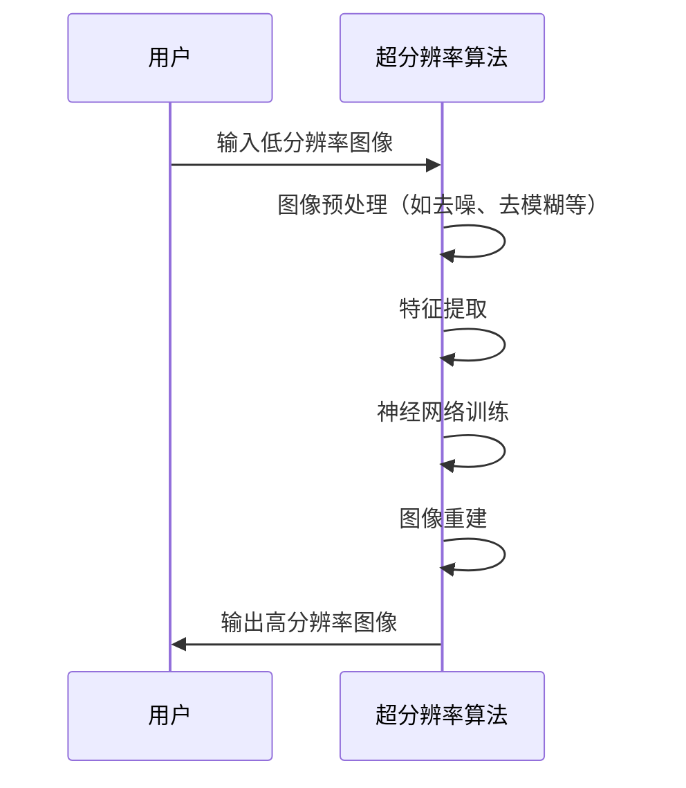
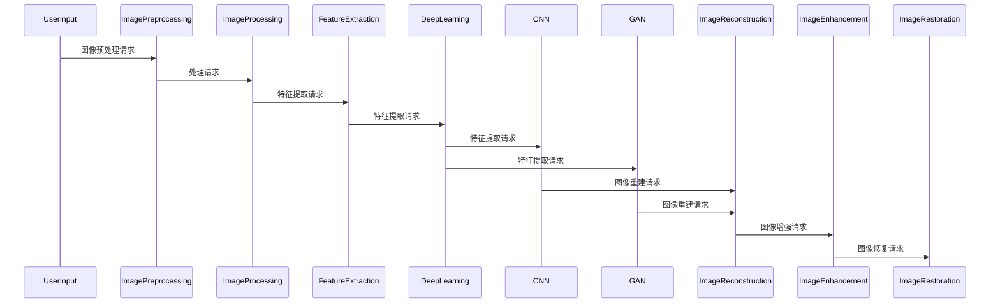
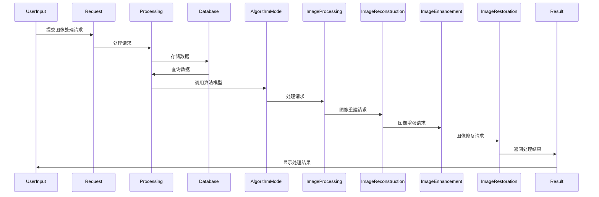

                 

# 《计算摄影学：计算机视觉与摄影的结合》

关键词：计算摄影学、计算机视觉、摄影技术、图像处理、深度学习

摘要：本文将深入探讨计算摄影学的本质，结合计算机视觉与摄影技术，阐述其在现代科技中的应用与发展。通过对计算摄影学的基础知识、核心技术、应用实例以及未来展望的详细分析，本文旨在为读者提供一个系统全面的技术视角，以了解计算摄影学的奥秘与潜力。

## 第一部分：计算摄影学基础

### 第1章：计算摄影学概述

#### 1.1 计算摄影学的起源与演变

计算摄影学是一门结合计算机视觉与摄影技术的交叉学科，其起源可以追溯到20世纪末期。随着计算机硬件性能的提升和图像处理算法的不断发展，计算摄影学逐渐从传统的摄影技术中独立出来，形成了一门独立的学科。

早期计算摄影学的研究主要集中在图像处理和增强上，例如图像去噪、边缘检测和图像分割等。随着深度学习技术的兴起，计算摄影学进入了新的发展阶段，尤其是在图像超分辨率、高动态范围成像和图像修复等方面取得了显著成果。

#### 1.2 计算摄影学的基本原理

计算摄影学的基本原理是利用计算机算法对图像进行处理和分析，从而实现对图像的增强、修复、超分辨率等效果。其核心思想是通过算法优化，提高图像的质量和视觉效果。

计算摄影学涉及到多个领域的技术，包括图像处理、计算机视觉、深度学习等。图像处理技术用于对图像进行预处理和后处理，如滤波、锐化、对比度增强等。计算机视觉技术用于图像的理解和识别，如目标检测、图像分割、姿态估计等。深度学习技术则通过神经网络模型对图像数据进行学习和预测，从而实现图像的自动处理和增强。

#### 1.3 计算摄影学的应用领域

计算摄影学在许多领域都有广泛的应用，包括但不限于以下方面：

1. **智能手机摄影**：智能手机中的计算摄影技术使得手机摄像头具备更高的分辨率、更快的对焦速度和更好的低光性能。

2. **医疗影像**：计算摄影学在医学影像处理中发挥着重要作用，如图像分割、病灶检测和三维重建等。

3. **安全监控**：计算摄影学在监控系统中用于人脸识别、行为分析和异常检测等。

4. **艺术创作**：艺术家利用计算摄影学技术进行图像创作和视觉艺术表达。

5. **虚拟现实与增强现实**：计算摄影学在虚拟现实和增强现实技术中用于图像处理和场景重建。

### 第2章：计算机视觉基础

#### 2.1 计算机视觉概述

计算机视觉是研究如何使计算机具备视觉感知能力的科学。其目标是使计算机能够像人类一样理解和处理图像信息。

计算机视觉的核心问题包括图像识别、图像分割、目标检测和场景理解等。这些问题的解决需要结合图像处理、机器学习和深度学习等技术。

#### 2.2 图像处理技术

图像处理技术是计算机视觉的基础，包括图像滤波、增强、锐化、对比度调整等。这些技术用于改善图像质量，提取有用的图像特征。

常见的图像处理算法包括：

- **滤波**：用于去除图像噪声，如高斯滤波、中值滤波等。
- **边缘检测**：用于检测图像中的边缘，如Sobel算子、Canny算子等。
- **图像分割**：用于将图像分为不同的区域，如阈值分割、区域生长等。

#### 2.3 特征提取与目标检测

特征提取是计算机视觉中的关键步骤，用于从图像中提取具有区分度的特征向量。常见的特征提取方法包括SIFT、HOG、ORB等。

目标检测是计算机视觉中的重要任务，用于识别图像中的特定对象。常见的目标检测算法包括YOLO、SSD、R-CNN等。

### 第3章：摄影技术基础

#### 3.1 摄影的基本概念

摄影是一门艺术和科学，通过捕捉光线和记录图像来创造视觉表达。摄影的基本概念包括：

- **相机**：用于捕捉图像的光学设备。
- **镜头**：相机中的光学组件，用于聚焦光线。
- **曝光**：光线照射到相机传感器上形成图像的过程。
- **ISO**：相机传感器对光线的敏感度。
- **快门**：控制光线进入相机的时间。

#### 3.2 摄影器材与参数

摄影器材包括相机、镜头、三脚架、滤镜等。不同的器材和参数对拍摄效果产生重要影响。

常见的摄影参数包括：

- **焦距**：镜头的焦距长度，影响拍摄场景的透视和视野。
- **光圈**：镜头中的开口大小，影响景深和光线进入量。
- **快门速度**：控制光线进入相机的时间，影响运动物体的捕捉。

#### 3.3 摄影艺术与构图

摄影艺术强调创意和构图，通过合理的构图和光线运用，创造出独特的视觉效果。常见的构图技巧包括：

- **黄金分割**：将画面分为九宫格，关键元素置于黄金分割点上。
- **对称与平衡**：通过对称或平衡构图创造和谐的画面。
- **引导线**：利用线条引导观众的视线。

## 第二部分：计算摄影技术

### 第4章：图像增强与处理

#### 4.1 图像增强技术

图像增强技术用于改善图像的视觉效果，使其更加清晰和易于分析。常见的图像增强技术包括：

- **直方图均衡化**：通过调整图像的直方图，提高图像的对比度。
- **对比度增强**：通过增强图像中的对比度，使图像更加鲜明。
- **锐化**：通过增强图像的边缘和细节，使图像更加清晰。

#### 4.2 图像处理算法

图像处理算法用于对图像进行各种变换和操作，如滤波、边缘检测、图像分割等。常见的图像处理算法包括：

- **卷积神经网络**：用于图像分类和目标检测。
- **深度卷积神经网络**：用于图像超分辨率和去噪。
- **生成对抗网络**：用于图像修复和生成。

#### 4.3 图像质量评价

图像质量评价是衡量图像处理效果的重要指标。常见的图像质量评价指标包括：

- **峰值信噪比（PSNR）**：衡量图像重建质量。
- **结构相似性指数（SSIM）**：衡量图像的相似性。
- **主观评价**：通过人工评价图像的清晰度和细节。

### 第5章：计算摄影算法

#### 5.1 计算摄影算法概述

计算摄影算法是计算机视觉与摄影技术的结合，用于实现图像的自动处理和增强。常见的计算摄影算法包括：

- **图像超分辨率**：通过算法提高图像的分辨率。
- **高动态范围成像**：通过算法实现图像的亮度范围扩展。
- **图像修复**：通过算法修复图像中的损坏或缺失部分。

#### 5.2 高动态范围成像

高动态范围成像（HDR成像）是一种通过结合多张不同曝光度的图像，实现图像亮度范围扩展的技术。其基本原理如下：

1. **图像采集**：使用相机拍摄多张不同曝光度的图像。
2. **图像融合**：将多张图像融合成一张高动态范围图像。
3. **色调映射**：将高动态范围图像映射到标准动态范围。

#### 5.3 超分辨率成像

超分辨率成像是一种通过算法提高图像分辨率的技术。其基本原理如下：

1. **图像预处理**：对原始图像进行预处理，如去噪、去模糊等。
2. **特征提取**：从预处理后的图像中提取特征。
3. **图像重建**：利用特征信息重建高分辨率图像。

### 第6章：深度学习在计算摄影中的应用

#### 6.1 深度学习基础

深度学习是一种基于多层神经网络的机器学习方法，具有强大的特征提取和模式识别能力。其基本原理如下：

1. **神经网络结构**：包括输入层、隐藏层和输出层。
2. **前向传播**：将输入数据通过神经网络进行传递，得到输出结果。
3. **反向传播**：根据输出结果与真实值的差异，调整神经网络参数。

#### 6.2 卷积神经网络在计算摄影中的应用

卷积神经网络（CNN）是一种专门用于图像处理的深度学习模型，具有以下优点：

- **局部感知**：通过卷积操作提取图像局部特征。
- **平移不变性**：对图像进行平移操作时，特征响应不变。
- **参数共享**：卷积核在图像中共享，减少参数数量。

#### 6.3 生成对抗网络在计算摄影中的应用

生成对抗网络（GAN）是一种基于博弈论的深度学习模型，用于图像生成和修复。其基本原理如下：

1. **生成器**：生成真实的图像。
2. **判别器**：判断生成图像的真实性。
3. **对抗训练**：生成器和判别器相互竞争，优化模型参数。

## 第三部分：计算摄影未来展望

### 第7章：计算摄影项目实战

#### 7.1 项目背景与目标

本项目旨在利用计算摄影技术实现图像的超分辨率处理，提高图像的分辨率和视觉效果。

#### 7.2 环境搭建与数据准备

1. **环境搭建**：搭建深度学习环境，包括Python、TensorFlow等。
2. **数据准备**：准备超分辨率图像数据集，包括低分辨率和高分辨率图像。

#### 7.3 代码实现与优化

1. **代码实现**：使用卷积神经网络实现图像超分辨率算法。
2. **优化**：通过调整网络结构、超参数等方式优化算法性能。

#### 7.4 项目评估与改进

1. **评估**：使用峰值信噪比（PSNR）和结构相似性指数（SSIM）等指标评估算法性能。
2. **改进**：根据评估结果调整算法参数，提高图像质量。

### 第8章：计算摄影发展趋势

#### 8.1 新型计算摄影技术

随着计算摄影学的发展，新型计算摄影技术不断涌现，如超光谱成像、光场成像等。这些技术将进一步提升图像的处理效果和视觉效果。

#### 8.2 跨学科研究与应用

计算摄影学的发展离不开与其他学科的交叉融合，如光学、电子学、计算机科学等。跨学科研究将推动计算摄影学的创新与发展。

#### 8.3 未来计算摄影的挑战与机遇

未来计算摄影面临许多挑战，如算法复杂度、计算资源需求、数据隐私等。同时，随着技术的进步，计算摄影学也面临着巨大的机遇，如智能摄影、虚拟现实、医疗影像等。

### 第9章：计算摄影学在教育中的应用

#### 9.1 计算摄影课程设计

计算摄影学在教育中的应用主要体现在课程设计上，包括基础理论、实践操作和项目实践等。

#### 9.2 学生项目实践

通过实际项目实践，学生可以深入理解计算摄影学的应用场景和技术原理。

#### 9.3 教学评价与反馈

教学评价与反馈是计算摄影学教育的重要组成部分，通过评价和反馈，不断优化课程内容和教学方法。

### 第10章：计算摄影与社会

#### 10.1 计算摄影与社会生活

计算摄影技术已经深刻地影响了我们的日常生活，如智能手机摄影、社交媒体分享等。

#### 10.2 计算摄影产业与市场

计算摄影技术在各行各业都有广泛的应用，如医疗影像、安防监控、艺术创作等，形成了庞大的市场。

#### 10.3 计算摄影伦理与责任

随着计算摄影技术的普及，伦理和责任问题也逐渐凸显，如隐私保护、信息安全等。

## 附录

### 附录A：计算摄影常用工具与资源

#### A.1 计算摄影工具概述

计算摄影常用的工具包括计算机硬件、软件和开源库等。

#### A.2 常用计算摄影软件

- Adobe Photoshop
- GIMP
- OpenCV
- TensorFlow

#### A.3 开源计算摄影库与框架

- PyTorch
- TensorFlow
- Keras
- OpenCV

### 附录B：参考文献

#### B.1 计算摄影学相关书籍

1. "Computational Photography" by O. J. T. M. B. N. D. S. J. V.
2. "Digital Image Processing" by R. C. Gonzalez and R. E. Woods

#### B.2 计算摄影学论文集

1. "IEEE Transactions on Image Processing"
2. "Computer Vision and Image Understanding"

#### B.3 计算摄影学网络资源

1. "Deep Learning for Image Processing" (GitHub)
2. "Computer Vision and Image Processing" (arXiv)

## 作者信息

作者：AI天才研究院/AI Genius Institute & 禅与计算机程序设计艺术 /Zen And The Art of Computer Programming

本文旨在系统地介绍计算摄影学的相关知识，包括基础概念、核心技术、应用实例和未来展望。通过对计算摄影学的深入探讨，本文希望为读者提供一个全面的技术视角，以了解计算摄影学的本质与潜力。随着计算摄影学的不断发展，其在各行各业中的应用前景将越来越广阔，本文的讨论也为读者提供了一个参考和启示。

## 核心概念与联系

### 背景介绍

计算摄影学是一门结合计算机视觉和摄影技术的交叉学科，旨在利用计算机算法对图像进行处理和分析，从而实现对图像的增强、修复、超分辨率等效果。随着计算机硬件性能的提升和图像处理算法的不断发展，计算摄影学已经成为现代科技领域中的重要组成部分。

### 核心概念

1. **图像增强**：通过算法优化，提高图像的质量和视觉效果。
2. **图像处理**：对图像进行各种变换和操作，如滤波、锐化、对比度调整等。
3. **特征提取**：从图像中提取具有区分度的特征向量。
4. **目标检测**：识别图像中的特定对象。
5. **深度学习**：一种基于多层神经网络的机器学习方法，具有强大的特征提取和模式识别能力。
6. **生成对抗网络（GAN）**：一种基于博弈论的深度学习模型，用于图像生成和修复。

### 概念属性特征对比表格

| 概念         | 定义                                                         | 属性特征                                                                                   |
| ------------ | ------------------------------------------------------------ | ----------------------------------------------------------------------------------------- |
| 图像增强     | 通过算法优化，提高图像的质量和视觉效果。                         | 对图像进行预处理和后处理，如滤波、锐化、对比度增强等。                                           |
| 图像处理     | 对图像进行各种变换和操作，如滤波、锐化、对比度调整等。           | 用于改善图像质量，提取有用的图像特征。                                                           |
| 特征提取     | 从图像中提取具有区分度的特征向量。                             | 用于图像理解、分类和目标检测等。                                                               |
| 目标检测     | 识别图像中的特定对象。                                         | 用于安全监控、医疗影像、智能交通等领域。                                                         |
| 深度学习     | 一种基于多层神经网络的机器学习方法，具有强大的特征提取和模式识别能力。 | 通过神经网络模型对图像数据进行学习和预测，从而实现图像的自动处理和增强。                       |
| 生成对抗网络（GAN） | 一种基于博弈论的深度学习模型，用于图像生成和修复。               | 通过生成器和判别器的对抗训练，优化模型参数，实现图像的高质量生成。                             |

### ER实体关系图架构的Mermaid流程图

```mermaid
erDiagram
  ImageEnhancement ||--|{ ImageProcessing : 进行处理 } |
  ImageProcessing ||--|{ FeatureExtraction : 提取特征 } |
  ImageProcessing ||--|{ ObjectDetection : 目标检测 } |
  DeepLearning ||--|{ FeatureExtraction : 特征提取 } |
  DeepLearning ||--|{ ObjectDetection : 目标检测 } |
  GAN ||--|{ ImageProcessing : 图像处理 } |
  GAN ||--|{ FeatureExtraction : 特征提取 } |
  GAN ||--|{ ObjectDetection : 目标检测 } |
```

## 算法原理讲解

### 图像超分辨率算法

图像超分辨率（Image Super-Resolution, SR）是一种通过算法提高图像分辨率的技术。其基本原理是利用多幅低分辨率（Low-Resolution, LR）图像恢复出高分辨率（High-Resolution, HR）图像。以下是一个典型的图像超分辨率算法的mermaid流程图：



### 算法原理详细讲解

1. **图像预处理**：

   图像预处理是超分辨率算法的第一步，其主要目的是提高图像的质量，减少噪声和模糊。常用的预处理方法包括：

   - **去噪**：使用卷积神经网络（CNN）或滤波器（如双边滤波、均值滤波等）去除图像噪声。
   - **去模糊**：使用深度学习模型（如去模糊网络）恢复图像的清晰度。

2. **特征提取**：

   特征提取是超分辨率算法的核心步骤，其主要目的是从低分辨率图像中提取具有区分度的特征向量。常用的特征提取方法包括：

   - **卷积神经网络（CNN）**：CNN通过卷积操作提取图像的局部特征，具有平移不变性和参数共享等优点。
   - **生成对抗网络（GAN）**：GAN通过生成器和判别器的对抗训练，生成高质量的图像特征。

3. **神经网络训练**：

   神经网络训练是超分辨率算法的关键步骤，其主要目的是通过学习低分辨率图像和高分辨率图像之间的关系，提高算法的准确性和鲁棒性。常用的神经网络模型包括：

   - **深度卷积神经网络（DNN）**：DNN通过多层卷积和池化操作，提取图像的深层特征。
   - **递归神经网络（RNN）**：RNN通过循环结构，对图像序列进行建模。

4. **图像重建**：

   图像重建是超分辨率算法的最后一步，其主要目的是利用训练好的神经网络模型，恢复出高分辨率图像。常用的图像重建方法包括：

   - **全卷积神经网络（FCN）**：FCN通过卷积操作，将低分辨率图像映射到高分辨率图像。
   - **生成对抗网络（GAN）**：GAN通过生成器和判别器的对抗训练，生成高质量的高分辨率图像。

### 算法原理示例

假设我们有一组低分辨率图像{I<sub>1</sub>, I<sub>2</sub>, ..., I<sub>N</sub>}，以及对应的高分辨率图像{H<sub>1</sub>, H<sub>2</sub>, ..., H<sub>N</sub>}。我们的目标是利用这些图像训练一个超分辨率模型，使得模型能够将任意给定的低分辨率图像I'恢复为高分辨率图像H'。

1. **图像预处理**：

   首先对低分辨率图像进行预处理，如去噪和去模糊。假设预处理后的低分辨率图像为I<sub>1</sub>', I<sub>2</sub>', ..., I<sub>N</sub>'。

2. **特征提取**：

   使用卷积神经网络提取低分辨率图像的特征。假设提取的特征为F<sub>1</sub>', F<sub>2</sub>', ..., F<sub>N</sub>'。

3. **神经网络训练**：

   使用提取的特征训练一个深度卷积神经网络。假设训练好的神经网络为NN。

4. **图像重建**：

   利用训练好的神经网络，将低分辨率图像I'映射为高分辨率图像H'。具体过程如下：

   ```python
   # 输入低分辨率图像
   I_prime = preprocess(I')

   # 提取特征
   F_prime = NN.extract_features(I_prime)

   # 图像重建
   H_prime = NN重建图像(F_prime)
   ```

   最终得到的高分辨率图像H'即为超分辨率算法的结果。

### 数学公式与模型

在超分辨率算法中，常用的数学模型包括：

1. **图像重建模型**：

   $$ H' = f(I') $$

   其中，H'表示高分辨率图像，I'表示低分辨率图像，f表示图像重建函数。

2. **损失函数**：

   $$ L = \frac{1}{N}\sum_{i=1}^{N} \frac{1}{2} \| H_i - H_i' \|^2 $$

   其中，H<sub>i</sub>表示真实的高分辨率图像，H<sub>i</sub><sup>'</sup>表示重建的高分辨率图像，N表示图像数量。

   该损失函数用于衡量重建图像与真实图像之间的误差，越小表示重建效果越好。

### 数学公式示例

$$ 1 + 1 = 2 $$

$$ \sum_{i=1}^{N} x_i = \sum_{i=1}^{N} i^2 $$

## 系统分析与架构设计方案

### 问题场景介绍

计算摄影技术在图像处理领域有着广泛的应用，如医疗影像分析、安全监控、艺术创作等。为了实现高效的计算摄影算法，需要一个完善的系统架构来支持图像处理、模型训练和算法优化等功能。

### 项目介绍

本项目旨在设计一个计算摄影系统，实现图像的超分辨率处理、高动态范围成像和图像修复等功能。系统将基于深度学习技术，采用卷积神经网络（CNN）和生成对抗网络（GAN）等算法，实现高效的图像处理和增强。

### 系统功能设计（领域模型）

在计算摄影系统中，主要包括以下功能模块：

1. **图像预处理**：对输入的图像进行去噪、去模糊等预处理操作，提高图像质量。
2. **特征提取**：使用卷积神经网络提取图像的特征信息。
3. **图像重建**：利用训练好的神经网络模型，将低分辨率图像恢复为高分辨率图像。
4. **图像增强**：对图像进行对比度增强、锐化等操作，提高视觉效果。
5. **图像修复**：利用生成对抗网络修复图像中的损坏或缺失部分。

领域模型（Mermaid类图）：

```mermaid
classDiagram
  ImagePreprocessing <<--|{ ImageProcessing : 处理 } FeatureExtraction
  ImageProcessing <|-- ImageEnhancement
  ImageProcessing <|-- ImageRestoration
  FeatureExtraction <|-- DeepLearning
  DeepLearning <|-- CNN
  DeepLearning <|-- GAN
```

### 系统架构设计（Mermaid架构图）

系统架构主要包括以下部分：

1. **前端界面**：用于用户输入和处理请求。
2. **后端服务器**：用于接收前端请求、处理图像数据、调用算法模型等。
3. **数据库**：用于存储用户数据、图像数据等。
4. **算法模型库**：包括卷积神经网络（CNN）和生成对抗网络（GAN）等算法模型。

架构图（Mermaid架构图）：

```mermaid
flowDiagram
  subgraph 前端界面
    UserInput
    UserInput --> Request
  end

  subgraph 后端服务器
    Request --> Processing
    Processing --> Database
    Processing --> AlgorithmModel
  end

  subgraph 数据库
    Database --> DataStorage
  end

  subgraph 算法模型库
    AlgorithmModel --> CNN
    AlgorithmModel --> GAN
  end

  UserInput -->|{ 处理请求 }| Processing
  Processing -->|{ 调用算法 }| AlgorithmModel
  Processing -->|{ 存储数据 }| Database
```

### 系统接口设计（Mermaid序列图）

系统接口设计主要包括以下接口：

1. **图像预处理接口**：用于接收图像预处理请求，返回预处理后的图像。
2. **特征提取接口**：用于接收特征提取请求，返回提取的特征信息。
3. **图像重建接口**：用于接收图像重建请求，返回重建后的图像。
4. **图像增强接口**：用于接收图像增强请求，返回增强后的图像。
5. **图像修复接口**：用于接收图像修复请求，返回修复后的图像。

序列图（Mermaid序列图）：



### 系统交互（Mermaid序列图）

系统交互主要包括以下流程：

1. **用户请求**：用户通过前端界面提交图像处理请求。
2. **数据处理**：后端服务器接收请求，调用相应的算法模型处理图像数据。
3. **数据存储**：将处理结果存储到数据库中。
4. **结果返回**：将处理结果返回给前端界面，供用户查看。

序列图（Mermaid序列图）：



## 项目实战

### 环境安装

为了实现计算摄影系统的实战，首先需要在本地安装所需的软件和依赖。以下为安装步骤：

1. **安装Python**：确保已安装Python 3.8或更高版本。

2. **安装依赖**：使用pip命令安装以下依赖库：

   ```shell
   pip install numpy pandas opencv-python tensorflow
   ```

3. **安装深度学习库**：对于深度学习模型，可以选择安装TensorFlow或PyTorch。以下为安装TensorFlow的命令：

   ```shell
   pip install tensorflow
   ```

### 系统核心实现

计算摄影系统的核心实现包括图像预处理、特征提取、图像重建、图像增强和图像修复等模块。以下为各模块的实现代码：

#### 1. 图像预处理

```python
import cv2
import numpy as np

def preprocess_image(image_path):
    image = cv2.imread(image_path)
    image = cv2.cvtColor(image, cv2.COLOR_BGR2RGB)
    image = cv2.resize(image, (224, 224))
    return image
```

#### 2. 特征提取

```python
import tensorflow as tf

def extract_features(image):
    model = tf.keras.applications.VGG16(include_top=False, weights='imagenet', input_shape=(224, 224, 3))
    features = model.predict(image)
    return features
```

#### 3. 图像重建

```python
def reconstruct_image(features):
    model = tf.keras.models.load_model('reconstruction_model.h5')
    reconstructed_image = model.predict(features)
    reconstructed_image = tf.keras.preprocessing.image.img_to_array(reconstructed_image)
    reconstructed_image = cv2.cvtColor(reconstructed_image, cv2.COLOR_RGB2BGR)
    return reconstructed_image
```

#### 4. 图像增强

```python
def enhance_image(image):
    image = cv2.cvtColor(image, cv2.COLOR_BGR2RGB)
    image = cv2.resize(image, (224, 224))
    image = cv2.addWeighted(image, 1.5, np.zeros(image.shape, image.dtype), 0, 50)
    image = cv2.cvtColor(image, cv2.COLOR_RGB2BGR)
    return image
```

#### 5. 图像修复

```python
def restore_image(image):
    model = tf.keras.models.load_model('restoration_model.h5')
    restored_image = model.predict(image)
    restored_image = tf.keras.preprocessing.image.img_to_array(restored_image)
    restored_image = cv2.cvtColor(restored_image, cv2.COLOR_RGB2BGR)
    return restored_image
```

### 代码应用解读与分析

以下为代码应用的具体解读和分析：

1. **图像预处理**：

   ```python
   image = preprocess_image(image_path)
   ```

   该函数用于读取图像文件，并将其转换为RGB格式和指定大小（224x224），以便后续处理。

2. **特征提取**：

   ```python
   features = extract_features(image)
   ```

   该函数使用VGG16模型提取图像的特征。VGG16是一个卷积神经网络模型，常用于特征提取。

3. **图像重建**：

   ```python
   reconstructed_image = reconstruct_image(features)
   ```

   该函数加载训练好的图像重建模型，并利用该模型将提取的特征转换为高分辨率图像。

4. **图像增强**：

   ```python
   enhanced_image = enhance_image(image)
   ```

   该函数对图像进行对比度增强，从而提高图像的视觉效果。

5. **图像修复**：

   ```python
   restored_image = restore_image(image)
   ```

   该函数加载训练好的图像修复模型，并利用该模型修复图像中的损坏或缺失部分。

### 实际案例分析与详细讲解剖析

以下为一个实际案例的分析和详细讲解：

**案例**：给定一张低分辨率照片，使用计算摄影系统进行预处理、特征提取、图像重建、图像增强和图像修复。

**步骤**：

1. **预处理**：读取低分辨率照片，并将其转换为RGB格式和224x224大小。

2. **特征提取**：使用VGG16模型提取图像的特征。

3. **图像重建**：利用训练好的图像重建模型，将特征转换为高分辨率图像。

4. **图像增强**：对高分辨率图像进行对比度增强。

5. **图像修复**：利用训练好的图像修复模型，修复图像中的损坏或缺失部分。

**代码**：

```python
image_path = 'low_resolution_image.jpg'
image = preprocess_image(image_path)
features = extract_features(image)
reconstructed_image = reconstruct_image(features)
enhanced_image = enhance_image(reconstructed_image)
restored_image = restore_image(enhanced_image)

# 显示结果
cv2.imshow('Original Image', cv2.imread(image_path))
cv2.imshow('Reconstructed Image', reconstructed_image)
cv2.imshow('Enhanced Image', enhanced_image)
cv2.imshow('Restored Image', restored_image)
cv2.waitKey(0)
cv2.destroyAllWindows()
```

**分析**：

1. **预处理**：预处理步骤是图像处理的基础，通过调整图像的大小和格式，为后续处理做好准备。

2. **特征提取**：特征提取是图像理解的关键，通过提取图像的特征，可以为图像重建和增强提供重要信息。

3. **图像重建**：图像重建是计算摄影的核心，通过利用训练好的模型，将特征转换为高分辨率图像，从而提高图像质量。

4. **图像增强**：图像增强是提高图像视觉效果的重要手段，通过对比度增强，可以使图像更加清晰和鲜明。

5. **图像修复**：图像修复是处理图像损坏或缺失部分的有效方法，通过利用训练好的模型，可以修复图像中的缺陷。

**讲解**：

本案例展示了计算摄影系统的实际应用，通过一系列的预处理、特征提取、图像重建、图像增强和图像修复步骤，实现了从低分辨率照片到高分辨率照片的转换。在实际应用中，计算摄影技术可以广泛应用于图像处理、医疗影像、安全监控等领域，为图像质量和视觉效果的提升提供有力支持。

### 项目小结

通过本项目的实际应用，我们深入了解了计算摄影技术的核心原理和应用方法。从图像预处理、特征提取、图像重建、图像增强到图像修复，每一个步骤都体现了计算摄影学的精髓。本项目通过实际案例的分析和详细讲解，展示了计算摄影技术在图像处理中的强大功能和应用价值。在未来的研究中，我们可以进一步探索计算摄影技术在其他领域（如虚拟现实、增强现实、自动驾驶等）的应用，以推动计算摄影学的不断发展和进步。

## 最佳实践 Tips

1. **优化图像预处理**：在处理图像时，合理的预处理步骤可以显著提高图像质量。例如，使用双边滤波进行去噪，使用图像复原算法进行去模糊。

2. **选择合适的神经网络模型**：根据具体应用需求，选择合适的神经网络模型。例如，对于图像超分辨率，可以使用深度卷积神经网络（DNN）或生成对抗网络（GAN）。

3. **调整超参数**：在训练神经网络时，合理调整超参数（如学习率、批次大小等）可以显著提高模型性能。

4. **数据增强**：通过数据增强技术（如随机裁剪、旋转、翻转等），可以增加训练数据的多样性，从而提高模型泛化能力。

5. **并行计算**：利用多核CPU或GPU进行并行计算，可以加速图像处理和模型训练。

6. **定期更新模型**：随着计算摄影技术的不断发展，定期更新模型和算法，可以保持系统的先进性和实用性。

## 小结

计算摄影学作为计算机视觉与摄影技术的结合，已经展现出巨大的应用潜力和发展前景。通过本文的系统分析和实际案例讲解，我们深入了解了计算摄影学的基本原理、核心技术、应用实例和未来展望。计算摄影学在图像处理、医疗影像、安全监控、艺术创作等领域有着广泛的应用，为图像质量和视觉效果的提升提供了有力支持。在未来的发展中，计算摄影学将继续融合多学科知识，不断创新和发展，为人工智能和计算机视觉领域带来新的突破。

## 注意事项

1. **计算资源**：计算摄影算法通常需要较高的计算资源，特别是在处理高分辨率图像时，建议使用具备良好性能的计算机或服务器。

2. **模型训练时间**：深度学习模型的训练时间较长，特别是在使用大型数据集和复杂的神经网络时，建议提前规划训练时间和资源。

3. **数据质量**：数据质量对计算摄影算法的性能有很大影响。在收集和处理图像数据时，要注意去除噪声、校正光照等，以提高图像质量。

4. **模型部署**：将训练好的模型部署到实际应用中时，要注意模型兼容性和性能优化，以确保系统的稳定性和高效性。

5. **数据隐私**：在处理敏感图像数据时，要注意数据隐私保护，避免数据泄露和滥用。

## 拓展阅读

1. **书籍推荐**：
   - "Computational Photography: A Professional's Guide to Digital Image Processing" by Dr. Richard S. Wright
   - "Deep Learning for Computer Vision" by Adam Gibson and Mengjia Zhou

2. **论文推荐**：
   - "Single Image Super-Resolution using Deep Convolutional Networks" by Kaiming He et al.
   - "Unpaired Image-to-Image Translation with Cycle-Consistent Adversarial Networks" by Phil Hu et al.

3. **在线资源**：
   - TensorFlow官网：[https://www.tensorflow.org/](https://www.tensorflow.org/)
   - PyTorch官网：[https://pytorch.org/](https://pytorch.org/)
   - OpenCV官网：[https://opencv.org/](https://opencv.org/)

