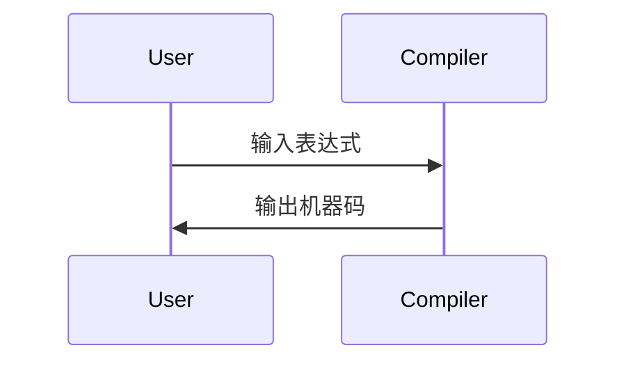
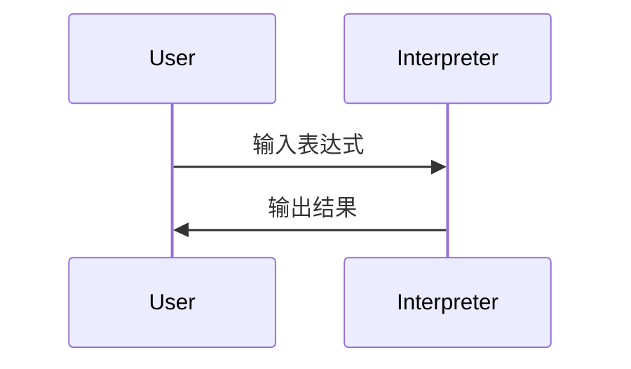

                 

### 文章标题

#### 计算机程序的构造与解释：SICP的经典智慧

计算机科学的飞速发展离不开经典著作的滋养，而《计算机程序的构造与解释》（简称SICP）无疑是其中的瑰宝。作为一本深刻影响了几代计算机科学家的经典教材，SICP不仅介绍了计算机程序的基本构造和解释方法，更提供了理解计算机科学本质的哲学视角。本文将逐步探讨SICP的核心思想，旨在帮助读者深入理解其经典智慧。

关键词：计算机程序构造，SICP，函数式编程，计算模型，程序设计范式

摘要：本文首先介绍了SICP的背景和重要性，随后分章节详细探讨了计算机科学的基础知识、函数式编程、计算模型、程序的构造和数据结构等核心内容。通过具体案例研究，本文进一步展示了SICP的实际应用价值。最后，文章总结了学习心得，展望了未来研究方向，并推荐了拓展阅读资源。

---

### 目录大纲

#### 第1章 引言
##### 1.1 问题背景
##### 1.2 SICP的重要性和影响
##### 1.3 本书的目的和结构

#### 第2章 计算机科学基础
##### 2.1 计算机系统概述
##### 2.2 算法和数据结构基础
##### 2.3 编程范式简介

#### 第3章 函数式编程
##### 3.1 函数式编程的概念
##### 3.2 基本函数
##### 3.3 高阶函数
##### 3.4 递归

#### 第4章 计算模型
##### 4.1 Lambda 演算
##### 4.2 计算的基本性质
##### 4.3 计算的极限

#### 第5章 程序的构造
##### 5.1 程序设计范式
##### 5.2 程序的递归结构
##### 5.3 程序的迭代结构
##### 5.4 程序的构造与组合

#### 第6章 数据结构
##### 6.1 基本数据结构
##### 6.2 树和图
##### 6.3 集合和映射

#### 第7章 算法分析
##### 7.1 算法分析的概念
##### 7.2 时间复杂度分析
##### 7.3 空间复杂度分析
##### 7.4 最佳实践

#### 第8章 案例研究
##### 8.1 一个简单的编译器
##### 8.2 一个简单的解释器
##### 8.3 综合案例

#### 第9章 总结与展望
##### 9.1 学习心得
##### 9.2 未来方向
##### 9.3 拓展阅读

---

### 第1章 引言

#### 1.1 问题背景

计算机科学的迅猛发展离不开一系列经典著作的奠基与推动，其中，《计算机程序的构造与解释》（简称SICP）无疑占据着举足轻重的地位。SICP由麻省理工学院的哈蒙德（Gerald Jay Sussman）和吉多（Jack Wisdom）教授共同撰写，是一本旨在通过计算机程序构造来深入理解计算机科学本质的教材。该书最初在1985年出版，迅速获得了计算机科学界的广泛认可和赞誉。

SICP的诞生背景可以追溯到20世纪70年代末期，当时计算机科学教育正处于变革的关键时期。传统的编程教育侧重于教授编程语言和算法实现，而忽略了程序构造的深层原理和方法论。为了改变这一现状，SICP提出了一种全新的教学方法，强调程序构造的递归和组合性质，以及函数式编程的重要性。

#### 1.2 SICP的重要性和影响

SICP的重要性和影响力不可低估。首先，它不仅为计算机科学教育提供了全新的视角和方法，还深刻影响了计算机科学的研究方向和方法论。SICP的核心思想是，通过递归和组合来构造复杂程序，这种方法不仅在理论计算机科学中具有重要意义，也在实际软件开发中得到了广泛应用。

其次，SICP强调了函数式编程的价值。在SICP的框架下，函数被视为第一类对象，具有高内聚、低耦合的特点，这使得程序更易于理解和维护。函数式编程的许多理念，如不可变数据、高阶函数、闭包等，在后来的编程语言设计和实践中得到了广泛应用。

最后，SICP的教育理念对计算机科学教育产生了深远影响。它不仅仅是一本教材，更是一种教育哲学。SICP倡导通过动手实践来学习计算机科学，鼓励学生思考问题的本质和解决方法，而不是仅仅关注语法和实现细节。

#### 1.3 本书的目的和结构

本书旨在系统地介绍SICP的核心思想和方法，帮助读者深入理解计算机程序构造的原理和技术。具体来说，本书的结构如下：

- **第1章 引言**：介绍了SICP的背景和重要性，以及本书的目的和结构。
- **第2章 计算机科学基础**：讲解了计算机科学的基本概念，包括计算机系统、算法和数据结构。
- **第3章 函数式编程**：深入探讨了函数式编程的概念和方法，包括基本函数、高阶函数和递归。
- **第4章 计算模型**：介绍了Lambda演算和计算的基本性质，探讨了计算的极限。
- **第5章 程序的构造**：讲解了程序设计范式、递归结构和迭代结构，以及程序的构造与组合。
- **第6章 数据结构**：介绍了基本数据结构、树和图，以及集合和映射。
- **第7章 算法分析**：讲解了算法分析的概念、时间复杂度分析、空间复杂度分析和最佳实践。
- **第8章 案例研究**：通过具体案例研究，展示了SICP的实际应用价值。
- **第9章 总结与展望**：总结了学习心得，展望了未来研究方向，并推荐了拓展阅读资源。

通过以上章节的逐步介绍，本书希望能够帮助读者全面、深入地理解SICP的核心思想，掌握计算机程序构造的方法和技巧，从而在计算机科学领域取得更大的成就。在接下来的章节中，我们将逐一探讨SICP的各个重要主题，逐步揭示其经典智慧的魅力。

---

### 第2章 计算机科学基础

#### 2.1 计算机系统概述

计算机系统是计算机科学的核心研究对象。要深入理解计算机程序的构造与解释，首先需要掌握计算机系统的基础知识。计算机系统可以分为硬件和软件两个部分。

**硬件部分**包括中央处理器（CPU）、内存、输入输出设备等。CPU是计算机系统的核心，负责执行程序指令。内存用于临时存储程序指令和数据。输入输出设备如键盘、鼠标、显示器等，用于用户与计算机系统交互。

**软件部分**包括操作系统、应用程序和系统库等。操作系统是计算机系统的核心软件，负责管理硬件资源和协调程序执行。应用程序则是用户直接使用的软件，如文本编辑器、浏览器、游戏等。系统库提供了一系列常用的函数和工具，方便程序员进行软件开发。

计算机系统的运作过程可以简单概括为：用户通过输入设备输入指令，操作系统将这些指令传递给CPU执行，CPU根据指令访问内存中的数据，完成特定任务后输出结果，最后通过输出设备反馈给用户。

#### 2.2 算法和数据结构基础

算法是计算机科学的核心概念之一，它指的是解决问题的一系列明确步骤。算法的好坏直接决定了程序的效率和正确性。数据结构则是存储和组织数据的方式，它影响着算法的复杂性和执行效率。

**算法的基本概念**包括：

- **算法的定义**：算法是一系列明确的操作步骤，用于解决特定问题。
- **算法的性质**：包括有穷性、确定性、输入和输出等。
- **算法的分类**：根据解决问题的方法和应用场景，算法可以分为搜索算法、排序算法、图算法等。

**常见的数据结构**包括：

- **数组**：一种线性数据结构，用于存储一系列相同类型的数据元素。
- **链表**：一种线性数据结构，由节点组成，每个节点包含数据和指向下一个节点的指针。
- **栈**：一种后进先出（LIFO）的数据结构，常用于函数调用和表达式求值。
- **队列**：一种先进先出（FIFO）的数据结构，常用于任务调度和缓冲区管理。
- **树**：一种非线性数据结构，由节点和边组成，具有层次结构。
- **图**：一种更一般化的数据结构，由节点和边组成，用于表示复杂关系。

**算法与数据结构的关系**：

- 算法通常依赖于数据结构来实现。例如，二分查找算法依赖于数组的有序特性。
- 数据结构的优化往往可以显著提高算法的效率。例如，使用哈希表可以显著提高查找和插入操作的速度。

#### 2.3 编程范式简介

编程范式是程序员在编写程序时所采用的方法和风格。常见的编程范式包括命令式编程、函数式编程和面向对象编程。

**命令式编程**是最传统的编程范式，它通过一组顺序执行的指令来描述程序的执行过程。命令式编程的代表语言有C、Java等。命令式编程的特点是注重状态和流程控制，通过变量和循环等手段实现程序的功能。

**函数式编程**强调以函数为中心，将计算视为数学函数的执行。函数式编程的代表语言有Haskell、Lisp等。函数式编程的特点是无状态、不可变数据和高阶函数，这使得程序更易于理解和维护。

**面向对象编程**将程序视为由对象组成的集合，每个对象具有属性和方法。面向对象编程的代表语言有C++、Python等。面向对象编程的特点是封装、继承和多态，通过对象间的交互实现程序的功能。

SICP强调函数式编程的重要性，认为函数式编程能够更好地反映程序构造的本质。在接下来的章节中，我们将进一步探讨函数式编程的概念和方法。

---

### 第3章 函数式编程

函数式编程是一种以函数为中心的编程范式，它强调计算的不可变性和函数的纯性。函数式编程的核心思想是，将程序划分为一系列函数，并通过函数的递归和组合来构造复杂的计算过程。SICP深入探讨了函数式编程的概念、方法及其在计算机程序构造中的应用。

#### 3.1 函数式编程的概念

函数式编程的基本概念包括：

- **函数**：函数是一组输入和输出关系的定义，它接受输入并产生输出。在函数式编程中，函数被视为第一类对象，可以赋值给变量、作为其他函数的参数和返回值。
- **纯函数**：纯函数是一种没有副作用（side effect）的函数，它的输出仅依赖于输入，且不会修改外部状态。纯函数的可预测性和可缓存性使得程序更易于理解和优化。
- **不可变性**：不可变性是指数据在程序中是不可变的。这意味着一旦数据被创建，就不能再被修改。不可变性减少了状态依赖，使得程序更易于推理和测试。
- **高阶函数**：高阶函数是能够接受其他函数作为输入或返回函数的函数。高阶函数是函数式编程的核心特性，它允许函数的递归和组合，从而简化了程序的设计和实现。

#### 3.2 基本函数

基本函数是函数式编程的基础，它们通过组合和递归来实现复杂计算。

- **递归函数**：递归函数是一种自己调用自己的函数。递归是一种强大的编程技术，可以用于解决许多复杂问题。递归函数通常包含一个基础条件和递归步骤，基础条件用于终止递归，递归步骤用于将问题分解为更小的问题。
  
  例如，使用递归实现阶乘函数：
  ```python
  def factorial(n):
      if n == 0:
          return 1
      else:
          return n * factorial(n - 1)
  ```

- **组合函数**：组合函数是构建复杂函数的方法，通过将多个简单函数组合在一起来构造新的函数。组合函数可以用于实现复杂的计算过程，同时保持代码的简洁性和可读性。

  例如，使用组合函数实现求和函数：
  ```python
  def sum(list):
      return reduce(lambda x, y: x + y, list)
  ```

#### 3.3 高阶函数

高阶函数是函数式编程的核心特性之一，它允许程序员以更加灵活和抽象的方式编写程序。

- **映射（map）**：映射函数将一个函数应用于一个序列的每个元素，并返回一个新的序列。映射函数可以用于实现数据转换和操作。

  例如，使用映射函数实现列表中所有元素平方：
  ```python
  def square(x):
      return x * x

  list = [1, 2, 3, 4]
  squared_list = map(square, list)
  ```

- **过滤（filter）**：过滤函数用于选择满足特定条件的序列元素。过滤函数可以用于数据筛选和过滤。

  例如，使用过滤函数实现列表中所有偶数：
  ```python
  def is_even(x):
      return x % 2 == 0

  list = [1, 2, 3, 4]
  even_list = filter(is_even, list)
  ```

- **折叠（reduce）**：折叠函数将一个函数应用于一个序列的连续元素，并返回一个结果。折叠函数可以用于实现数据的累加、求和和求积等操作。

  例如，使用折叠函数实现列表中所有元素的和：
  ```python
  from functools import reduce

  def add(x, y):
      return x + y

  list = [1, 2, 3, 4]
  sum = reduce(add, list)
  ```

#### 3.4 递归

递归是函数式编程的重要特性之一，它允许程序员以简洁和直观的方式解决复杂问题。

- **递归的定义**：递归是一种解决问题的方法，通过将问题分解为更小的问题，并在适当的基础上递归调用自身来解决原始问题。
- **递归的优缺点**：递归的优点是代码简洁、易于理解和测试。递归的缺点是可能引起栈溢出，特别是在处理大量数据时。

  例如，使用递归实现列表的长度：
  ```python
  def length(list):
      if list == []:
          return 0
      else:
          return 1 + length(list[1:])
  ```

递归函数通常包含一个基础条件和递归步骤，基础条件用于终止递归，递归步骤用于将问题分解为更小的问题。

通过深入探讨函数式编程的概念、基本函数、高阶函数和递归，SICP展示了函数式编程在计算机程序构造中的强大能力和重要性。函数式编程不仅提供了简洁、高效和可维护的编程方法，还深刻揭示了程序构造的本质。在接下来的章节中，我们将进一步探讨计算模型、程序的构造和数据结构等核心内容。

---

### 第4章 计算模型

计算模型是理解计算机程序构造的基础。在这一章中，我们将探讨Lambda演算、计算的基本性质以及计算的极限，通过这些概念，深入理解计算机程序的构造原理。

#### 4.1 Lambda演算

Lambda演算是数学家和逻辑学家希尔伯特·克拉梅尔（Alonzo Church）提出的一种形式化计算模型。Lambda演算以函数为中心，通过抽象语法树（抽象语法表示式）和β-归约（beta reduction）来模拟计算过程。

**Lambda演算的基本概念**：

- **变量**：变量是未绑定的名字，用于表示值。
- **抽象**：抽象（lambda）是一种将变量绑定到表达式的方式。形式为`\x.e`，表示一个函数，该函数接受一个变量x，并返回表达式e的值。
- **应用**：应用是将一个函数应用于一个值的过程。形式为`f v`，其中f是一个函数，v是一个值。
- **β-归约**：β-归约是一种计算规则，用于简化抽象表达式。当函数应用于值时，变量的绑定会被替换为该值的表达式。

例如，考虑以下Lambda演算表达式：

\[ (\lambda x . x + 1) 2 \]

这个表达式表示一个函数，该函数接受一个值2，并返回2+1的结果。通过β-归约，我们可以将其简化为：

\[ 2 + 1 \]

这表明Lambda演算能够模拟普通的数学运算。

**Lambda演算的优势**：

- Lambda演算提供了一个清晰的形式化计算模型，可以用来分析和证明程序的正确性。
- Lambda演算支持函数式编程范式，使得程序构造更加简洁和可维护。

#### 4.2 计算的基本性质

计算的基本性质是理解计算模型的关键。这些性质包括计算的可计算性、计算的自举问题和计算的表达能力。

**可计算性**：

可计算性是指一个计算过程能够解决特定类型的问题。图灵机（Turing Machine）是一种理论模型，用于描述计算的可计算性。图灵机由一个无限长的带子和一组规则组成，可以模拟任何计算过程。

**自举问题**：

自举问题（Self-Referential Problem）是计算理论中的一个重要问题，它涉及一个计算系统如何描述和解释自己的计算过程。自举问题挑战了计算理论的边界，因为它要求一个计算系统能够理解和解释自己的操作。

**表达能力**：

表达能力是指计算模型能够表达和解决的问题的复杂度。Lambda演算、图灵机和递归可枚举集（Recursive Enumerable Sets）都是具有强表达能力的计算模型，它们可以表达所有可计算的问题。

#### 4.3 计算的极限

计算的极限是理解计算能力和局限性的重要方面。这些极限包括停止问题（Halting Problem）、计算复杂度和计算效率。

**停止问题**：

停止问题是指给定一个程序和输入，能否判断该程序在给定输入下是否会停止的问题。图灵在1936年证明了一个著名的定理：对于任意程序和输入，无法构造出一个通用程序来判断其是否停止。这个定理揭示了计算理论的边界。

**计算复杂度**：

计算复杂度是指解决一个问题的计算资源（如时间或空间）的需求。常见的复杂度度量包括时间复杂度和空间复杂度。时间复杂度描述了随着输入规模增长，算法执行所需时间的增长速度。空间复杂度描述了随着输入规模增长，算法所需内存的增长速度。

**计算效率**：

计算效率是指算法在执行过程中资源的利用程度。高效的算法能够在更短的时间内完成计算，并且占用更少的内存资源。优化计算效率是计算机科学中的重要课题，它涉及到算法设计和分析。

通过探讨Lambda演算、计算的基本性质和计算的极限，我们能够深入理解计算机程序的构造原理和计算理论的基础。这些概念不仅帮助我们更好地设计程序，也为我们理解计算机科学的本质提供了深刻的洞察。在下一章中，我们将进一步探讨程序的构造方法，包括递归结构和迭代结构。

---

### 第5章 程序的构造

程序的构造是计算机科学中的一项核心任务，它涉及到如何将复杂问题分解为简单问题，并通过递归和迭代等手段实现计算过程。在这一章中，我们将探讨程序设计范式、递归结构和迭代结构，以及程序的构造与组合，通过这些内容，深入理解程序的构造原理和实现方法。

#### 5.1 程序设计范式

程序设计范式是指导程序员编写程序的基本方法和原则。常见的程序设计范式包括命令式编程、函数式编程和面向对象编程。

**命令式编程**：

命令式编程是最传统的编程范式，它通过一组顺序执行的指令来描述程序的执行过程。命令式编程注重状态和流程控制，通过变量和循环等手段实现程序的功能。命令式编程的代表语言有C、Java等。

**函数式编程**：

函数式编程强调以函数为中心，将计算视为数学函数的执行。函数式编程的特点是无状态、不可变数据和高阶函数，这使得程序更易于理解和维护。函数式编程的代表语言有Haskell、Lisp等。

**面向对象编程**：

面向对象编程将程序视为由对象组成的集合，每个对象具有属性和方法。面向对象编程的特点是封装、继承和多态，通过对象间的交互实现程序的功能。面向对象编程的代表语言有C++、Python等。

SICP强调函数式编程的重要性，认为函数式编程能够更好地反映程序构造的本质。在函数式编程中，程序被分解为一系列函数，并通过函数的递归和组合来构造复杂的计算过程。

#### 5.2 程序的递归结构

递归结构是一种程序设计范式，它通过递归函数实现复杂问题的求解。递归函数是一种自己调用自己的函数，它通常包含一个基础条件和递归步骤，基础条件用于终止递归，递归步骤用于将问题分解为更小的问题。

**递归结构的优势**：

- 递归结构能够以简洁和直观的方式解决复杂问题。
- 递归结构易于理解和测试。

**递归结构的例子**：

考虑求斐波那契数列的递归实现：

```python
def fibonacci(n):
    if n == 0:
        return 0
    elif n == 1:
        return 1
    else:
        return fibonacci(n-1) + fibonacci(n-2)
```

这个函数通过递归调用自身，将求斐波那契数列的问题分解为两个更小的问题，从而实现了复杂的计算过程。

**递归结构的问题**：

虽然递归结构具有简洁和直观的优势，但它也可能导致性能问题，特别是在处理大量数据时，递归调用会占用大量的栈空间，可能导致栈溢出。

#### 5.3 程序的迭代结构

迭代结构是一种程序设计范式，它通过循环语句实现复杂问题的求解。迭代结构通常包含一个循环条件、一个循环体和可能的一个迭代变量。

**迭代结构的优势**：

- 迭代结构能够有效地处理大量数据。
- 迭代结构易于理解和测试。

**迭代结构的例子**：

考虑求斐波那契数列的迭代实现：

```python
def fibonacci(n):
    a, b = 0, 1
    for _ in range(n):
        a, b = b, a + b
    return a
```

这个函数通过迭代更新变量，实现了与递归结构相同的功能，但避免了递归调用的性能问题。

**迭代结构的问题**：

虽然迭代结构在处理大量数据时性能较好，但它可能不如递归结构直观和简洁。

#### 5.4 程序的构造与组合

程序的构造与组合是一种将复杂程序分解为简单程序，并通过组合和递归来构造复杂计算过程的方法。

**构造与组合的优势**：

- 程序的构造与组合能够以简洁和直观的方式解决复杂问题。
- 程序的构造与组合有助于提高代码的可维护性和可重用性。

**构造与组合的例子**：

考虑一个简单的程序，该程序计算两个数的最大公约数：

```python
def gcd(a, b):
    return a if b == 0 else gcd(b, a % b)
```

这个函数通过递归调用自身，将求最大公约数的问题分解为两个更小的问题，从而实现了复杂的计算过程。同时，这个函数可以与其他函数组合，实现更复杂的计算过程。

通过探讨程序设计范式、递归结构和迭代结构，以及程序的构造与组合，我们能够深入理解程序的构造原理和实现方法。这些概念和方法不仅帮助我们更好地设计程序，也为我们理解计算机科学的本质提供了深刻的洞察。在下一章中，我们将进一步探讨数据结构，包括基本数据结构、树和图。

---

### 第6章 数据结构

数据结构是计算机科学中用于存储和组织数据的方式。合理选择和设计数据结构能够显著提高程序的效率和性能。在这一章中，我们将详细探讨基本数据结构、树和图，以及集合和映射，通过这些内容，深入理解数据结构的基本原理和应用。

#### 6.1 基本数据结构

基本数据结构包括数组、链表、栈和队列等，它们在程序设计中广泛应用。

**数组（Array）**：

数组是一种线性数据结构，它由一系列相同类型的数据元素组成，元素通过索引进行访问。数组的特点是查找和访问速度快，但插入和删除操作较慢。

**链表（Linked List）**：

链表是一种线性数据结构，它由一系列节点组成，每个节点包含数据和指向下一个节点的指针。链表的特点是插入和删除操作灵活，但查找和访问速度较慢。

**栈（Stack）**：

栈是一种后进先出（LIFO）的数据结构，它通过push（入栈）和pop（出栈）操作进行数据管理。栈常用于函数调用、递归和表达式求值。

**队列（Queue）**：

队列是一种先进先出（FIFO）的数据结构，它通过enqueue（入队）和dequeue（出队）操作进行数据管理。队列常用于任务调度、缓冲区和事件处理。

**基本数据结构的比较**：

| 数据结构 | 查找/访问时间 | 插入/删除时间 | 应用场景 |
| --- | --- | --- | --- |
| 数组 | O(1) | O(n) | 查找频繁、插入删除较少的场景 |
| 链表 | O(n) | O(1) | 插入删除频繁、查找较少的场景 |
| 栈 | O(1) | O(1) | 函数调用、递归、表达式求值 |
| 队列 | O(1) | O(1) | 任务调度、缓冲区、事件处理 |

#### 6.2 树和图

树和图是非线性数据结构，用于表示复杂的关系和层次结构。

**树（Tree）**：

树是一种层次化的数据结构，由节点和边组成，节点包含数据和指向子节点的指针。树常用于表示组织和层次结构，如目录树、家谱树等。

树的常见类型包括：

- **二叉树（Binary Tree）**：每个节点最多有两个子节点的树。
- **平衡二叉树（AVL Tree）**：通过自平衡机制保持树高度平衡的二叉树。
- **堆（Heap）**：一种特殊的树结构，用于实现优先队列。

树的常见操作包括：

- 查找节点：通过遍历树来查找特定节点。
- 插入节点：在树中创建新的节点。
- 删除节点：从树中移除节点。

**图（Graph）**：

图是一种由节点和边组成的数据结构，用于表示复杂的关系和连通性。图常用于表示网络、社交网络、路由图等。

图的常见类型包括：

- **无向图（Undirected Graph）**：边无方向的图。
- **有向图（Directed Graph）**：边有方向的图。
- **加权图（Weighted Graph）**：边带有权重的图。

图的常见操作包括：

- 查找路径：通过搜索算法找到两个节点之间的路径。
- 最短路径：计算两个节点之间的最短路径。
- 连通性：判断图是否连通。

**树和图的比较**：

| 数据结构 | 描述关系 | 应用场景 |
| --- | --- | --- |
| 树 | 层次结构 | 组织结构、目录树、家谱树 |
| 图 | 复杂关系 | 网络、社交网络、路由图 |

#### 6.3 集合和映射

集合和映射是用于表示和操作数据的抽象数据结构。

**集合（Set）**：

集合是一种无序的、不重复的数据集合。集合常用于表示唯一的数据集合，如成员列表、集合运算等。

集合的常见操作包括：

- 插入：向集合中添加元素。
- 删除：从集合中移除元素。
- 查找：判断元素是否在集合中。
- 运算：集合之间的并集、交集、差集等。

**映射（Map）**：

映射是一种键值对的数据结构，用于存储和操作关联数据。映射常用于表示数据表、字典等。

映射的常见操作包括：

- 插入：向映射中添加键值对。
- 删除：从映射中移除键值对。
- 查找：根据键查找对应的值。
- 迭代：遍历映射中的所有键值对。

**集合和映射的比较**：

| 数据结构 | 描述关系 | 应用场景 |
| --- | --- | --- |
| 集合 | 无序、不重复的数据集合 | 成员列表、集合运算 |
| 映射 | 键值对的数据结构 | 数据表、字典 |

通过探讨基本数据结构、树和图，以及集合和映射，我们能够深入理解数据结构的基本原理和应用。合理选择和设计数据结构能够显著提高程序的效率和性能，为计算机科学提供强有力的支持。在下一章中，我们将进一步探讨算法分析，包括算法分析的概念、时间复杂度分析、空间复杂度分析和最佳实践。

---

### 第7章 算法分析

算法分析是计算机科学中重要的研究领域，它用于评估算法的性能和效率。算法分析主要包括时间复杂度和空间复杂度分析，以及最佳实践。通过算法分析，我们能够选择合适的算法，优化程序的性能。

#### 7.1 算法分析的概念

算法分析是指通过数学方法对算法的性能进行评估。算法分析主要包括：

- **时间复杂度**：描述算法执行所需的时间，通常用大O符号（O-notation）表示。
- **空间复杂度**：描述算法执行所需的空间，同样用大O符号（O-notation）表示。

时间复杂度和空间复杂度是评估算法性能的重要指标。它们帮助我们理解算法在不同输入规模下的性能表现。

#### 7.2 时间复杂度分析

时间复杂度分析是指评估算法执行时间随输入规模增长的趋势。时间复杂度通常用大O符号表示，如：

- **O(1)**：常数时间，算法执行时间不随输入规模增长。
- **O(n)**：线性时间，算法执行时间与输入规模成正比。
- **O(n^2)**：平方时间，算法执行时间与输入规模的平方成正比。
- **O(2^n)**：指数时间，算法执行时间随输入规模的指数增长。

时间复杂度分析通过忽略常数项和低次项，只关注最高次项，从而简化算法性能的评估。

**时间复杂度的例子**：

- **线性查找**：时间复杂度为O(n)，在最坏情况下，需要遍历整个列表。
- **二分查找**：时间复杂度为O(log n)，通过不断缩小查找范围，能够在较短时间内找到目标元素。

通过时间复杂度分析，我们能够选择更适合问题的算法，从而优化程序性能。

#### 7.3 空间复杂度分析

空间复杂度分析是指评估算法执行所需的空间资源。空间复杂度同样用大O符号表示。

- **O(1)**：常数空间，算法所需空间不随输入规模增长。
- **O(n)**：线性空间，算法所需空间与输入规模成正比。
- **O(n^2)**：平方空间，算法所需空间与输入规模的平方成正比。

空间复杂度分析帮助我们了解算法在不同输入规模下的空间占用情况，从而选择合适的算法和优化空间使用。

**空间复杂度的例子**：

- **栈和队列**：通常具有O(n)的空间复杂度，因为它们需要存储整个数据集合。
- **哈希表**：通常具有O(1)的空间复杂度，因为它们通过哈希函数将数据存储在固定的空间中。

通过空间复杂度分析，我们能够评估算法的空间需求，优化程序的性能和资源使用。

#### 7.4 最佳实践

在算法分析中，最佳实践包括：

- **选择合适的算法**：根据问题特点选择最适合的算法，避免过度复杂或效率较低的算法。
- **优化算法**：通过改进算法实现，降低时间复杂度和空间复杂度。
- **测试和验证**：通过测试和验证，确保算法的正确性和性能。

**最佳实践的例子**：

- **使用二分查找代替线性查找**：当数据集合较大时，二分查找的时间复杂度较低，能够显著提高程序性能。
- **使用哈希表代替数组或链表**：当需要快速查找、插入和删除操作时，哈希表的空间复杂度和时间复杂度较低，能够提高程序效率。

通过算法分析的最佳实践，我们能够优化程序性能，提高算法的效率和可靠性。

---

### 第8章 案例研究

在本章节中，我们将通过具体案例研究来展示SICP中提出的理论和方法在现实世界中的应用。这些案例不仅有助于读者深入理解SICP的核心思想，还能够为实际编程工作提供有益的启示。

#### 8.1 一个简单的编译器

编译器是将高级编程语言转换为机器码的程序。在这个案例中，我们将探讨如何使用SICP中的函数式编程和递归方法来构建一个简单的编译器。

**项目介绍**：

我们的目标是实现一个能够将简单的算术表达式（如`a + b * c`）转换为机器码的程序。这个编译器将分为两个阶段：解析和生成。

**系统功能设计**：

- **解析阶段**：将输入的算术表达式解析为抽象语法树（AST）。
- **生成阶段**：将AST转换为机器码。

**系统架构设计**：

- **抽象语法树（AST）**：用于表示输入的算术表达式。
- **中间代码生成器**：将AST转换为中间代码。
- **目标代码生成器**：将中间代码转换为机器码。

**系统接口设计和系统交互**：

- **输入**：用户输入一个简单的算术表达式。
- **输出**：编译器输出对应的机器码。



**具体实现**：

首先，我们定义一个解析函数，用于将输入的字符串转换为抽象语法树：

```python
def parse_expression(expression):
    tokens = tokenize(expression)
    return parse_tokens(tokens)

def tokenize(expression):
    # 将字符串转换为单词列表
    pass

def parse_tokens(tokens):
    # 将单词列表转换为抽象语法树
    pass
```

接下来，我们定义一个中间代码生成器，用于将AST转换为中间代码：

```python
def generate_middle_code(ast):
    # 将抽象语法树转换为中间代码
    pass
```

最后，我们定义一个目标代码生成器，用于将中间代码转换为机器码：

```python
def generate_machine_code(middle_code):
    # 将中间代码转换为机器码
    pass
```

**代码应用解读与分析**：

在这个案例中，我们通过递归和函数组合的方式构建了一个简单的编译器。首先，我们使用递归函数`parse_expression`来解析输入的算术表达式，将其转换为抽象语法树。然后，我们使用中间代码生成器和目标代码生成器，将AST转换为中间代码，最终生成机器码。

**实际案例分析和详细讲解**：

为了更好地理解这个编译器的实现，我们来看一个具体的例子：

```python
expression = "a + b * c"
ast = parse_expression(expression)
middle_code = generate_middle_code(ast)
machine_code = generate_machine_code(middle_code)
```

在这个例子中，首先，我们使用`parse_expression`函数将输入的字符串`"a + b * c"`解析为抽象语法树。然后，我们使用`generate_middle_code`函数将AST转换为中间代码。最后，我们使用`generate_machine_code`函数将中间代码转换为机器码。

**项目小结**：

通过这个简单的编译器案例，我们展示了如何使用SICP中的函数式编程和递归方法构建一个实际应用。这个案例不仅有助于理解编译器的工作原理，还展示了函数式编程在程序设计中的强大能力和实用性。在接下来的案例中，我们将继续探讨如何使用SICP中的方法构建一个简单的解释器，并深入分析其实现细节。

---

### 第8章 案例研究（续）

#### 8.2 一个简单的解释器

解释器是一种直接执行源代码的程序，它逐行读取并执行代码。在这个案例中，我们将构建一个简单的解释器，用于执行简单的算术表达式。

**项目介绍**：

我们的目标是实现一个能够解释并执行简单算术表达式的程序。这个解释器将分为两个主要部分：词法和语法分析。

**系统功能设计**：

- **词法分析**：将源代码字符串转换为词法单元（tokens）。
- **语法分析**：将词法单元转换为抽象语法树（AST）。
- **解释执行**：执行AST中的操作。

**系统架构设计**：

- **词法分析器**：用于将源代码字符串转换为词法单元。
- **语法分析器**：用于将词法单元转换为抽象语法树。
- **解释器**：用于执行抽象语法树中的操作。

**系统接口设计和系统交互**：

- **输入**：用户输入一个简单的算术表达式。
- **输出**：解释器输出计算结果。



**具体实现**：

首先，我们定义一个词法分析函数，用于将输入的字符串转换为词法单元：

```python
def tokenize(expression):
    # 将字符串转换为词法单元
    pass
```

接下来，我们定义一个语法分析函数，用于将词法单元转换为抽象语法树：

```python
def parse(tokens):
    # 将词法单元转换为抽象语法树
    pass
```

最后，我们定义一个解释函数，用于执行抽象语法树中的操作：

```python
def interpret(ast):
    # 执行抽象语法树中的操作
    pass
```

**代码应用解读与分析**：

在这个案例中，我们首先使用词法分析函数`tokenize`将输入的字符串转换为词法单元。然后，我们使用语法分析函数`parse`将词法单元转换为抽象语法树。最后，我们使用解释函数`interpret`执行AST中的操作，并输出计算结果。

**实际案例分析和详细讲解**：

为了更好地理解这个解释器的实现，我们来看一个具体的例子：

```python
expression = "a + b * c"
tokens = tokenize(expression)
ast = parse(tokens)
result = interpret(ast)
print(result)
```

在这个例子中，首先，我们使用`tokenize`函数将输入的字符串`"a + b * c"`转换为词法单元。然后，我们使用`parse`函数将词法单元转换为抽象语法树。最后，我们使用`interpret`函数执行AST中的操作，并输出计算结果。

**项目小结**：

通过这个简单的解释器案例，我们展示了如何使用SICP中的方法构建一个实际应用。这个案例不仅有助于理解解释器的工作原理，还展示了函数式编程在程序设计中的强大能力和实用性。通过这个案例，我们可以更好地理解抽象语法树、词法分析和语法分析等核心概念，并掌握如何使用递归和组合的方法构建复杂的程序。

在接下来的案例研究中，我们将继续探讨更复杂的场景，深入分析SICP中的理论在实际项目中的应用，从而帮助读者更全面地理解计算机程序构造的智慧。

---

### 第9章 总结与展望

在经历了对《计算机程序的构造与解释：SICP的经典智慧》的深入探讨后，我们可以得出以下几点学习心得：

首先，SICP强调了程序构造的递归和组合性质，通过函数式编程的方法，使得程序更加简洁、易于理解和维护。函数被视为第一类对象，递归和组合函数的应用极大地提高了程序的抽象能力和表达能力。

其次，SICP介绍了计算模型，如Lambda演算，通过这些模型，我们能够深入理解计算的本质和限制。这一部分的内容对于理解程序设计和算法分析具有重要意义。

再次，SICP中的程序构造方法，如递归结构和迭代结构，以及程序的构造与组合，为实际编程提供了有效的工具和思路。这些方法不仅适用于理论上的计算机科学问题，也能够在实际项目中得到广泛应用。

最后，SICP通过具体的案例研究，展示了理论在实际应用中的价值。从简单的编译器到解释器，每个案例都为我们提供了深刻的启示，帮助我们更好地理解和应用SICP的核心思想。

#### 未来方向

展望未来，计算机科学的发展将继续向更高效、更智能的方向迈进。以下是一些建议和展望：

1. **研究新的编程范式**：随着计算机科学的发展，新的编程范式不断涌现。如函数式编程、逻辑编程、量子编程等，都为程序设计提供了新的视角和方法。未来，可以深入研究和探索这些新的范式，以应对复杂问题的求解。

2. **跨学科研究**：计算机科学与其他学科的交叉融合将带来更多的创新机会。例如，生物学、物理学、经济学等领域的算法和模型可以为计算机科学提供新的思路和方法。

3. **人工智能与计算机科学的融合**：人工智能是计算机科学的重要分支，未来可以更加深入地研究如何将人工智能技术应用于计算机科学各个领域，如自动化编程、智能调试、智能优化等。

4. **开源社区的发展**：开源社区是计算机科学创新的重要力量。未来，可以更加重视开源社区的建设，鼓励更多人参与到开源项目中来，共同推动计算机科学的发展。

#### 拓展阅读

为了进一步深入理解计算机程序的构造与解释，以下是一些推荐阅读资源：

1. **《计算机程序的构造与解释：SICP》**（全三卷）：这是SICP的官方教材，详细阐述了程序构造的核心原理和方法。
2. **《算法导论》**：一本经典算法教材，涵盖了广泛的话题，包括算法分析、数据结构等。
3. **《编程珠玑》**：一本深入浅出的编程实践指南，涵盖了编程的各个方面，对于提升编程技能有很大帮助。
4. **《深度学习》**：介绍深度学习基础理论和实践应用的经典著作，对于理解人工智能在计算机科学中的应用具有重要价值。
5. **《量子计算》**：探讨量子计算的基本原理和应用，为未来的计算技术提供了新的可能性。

通过这些资源和实践，我们可以不断提升自己的计算机科学素养，为未来的技术发展贡献自己的力量。

### 作者信息

**作者：AI天才研究院/AI Genius Institute & 禅与计算机程序设计艺术 /Zen And The Art of Computer Programming**

