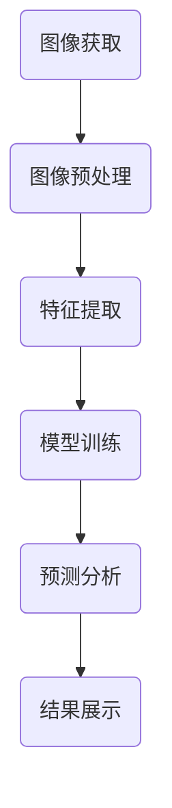

                 

### 计算机视觉与医疗影像分析概述

计算机视觉是一门结合计算机科学、数学和认知科学的研究领域，致力于使计算机具备从图像或视频中感知和理解场景的能力。而医疗影像分析则是指利用计算机技术对医学影像进行自动化处理、分析和解释，从而辅助医疗诊断、治疗方案制定及疾病预测等工作。这两者结合的初衷是显而易见的——利用计算机视觉技术提高医疗影像分析的效率和准确性，进而提升诊断和治疗的质量。

#### **核心概念术语说明**

- **计算机视觉（Computer Vision）**：指让计算机理解和解析数字图像或视频的技术和方法。
- **医疗影像分析（Medical Image Analysis）**：指对医学影像（如X光片、CT、MRI等）进行数字化处理、分析和解释，以便辅助医学诊断。
- **图像分割（Image Segmentation）**：将图像分成若干个有意义的区域，每个区域内的像素具有相似的特征。
- **目标检测（Object Detection）**：识别图像中的特定目标对象，并确定它们的位置。
- **量化分析（Quantitative Analysis）**：利用定量方法对医学影像进行分析，以提供更准确的数据支持。

#### **问题背景**

在过去，医疗影像分析主要依赖于放射科医生的经验和专业知识。医生通过观察和解读影像来诊断疾病，这不仅耗时耗力，而且容易受到主观因素的影响，导致误诊或漏诊。因此，如何提高医疗影像分析的效率与准确性成为了医学界和计算机科学界共同关注的课题。

#### **问题描述**

计算机视觉在医疗影像分析中的应用，主要包括以下几个方面：

1. **图像分割**：通过计算机视觉技术，将复杂的医学影像分割成若干个易于分析的区域，从而提高诊断的准确性。
2. **目标检测**：在医学影像中检测出特定病变区域或组织，有助于医生快速定位异常情况。
3. **量化分析**：利用计算机视觉技术对医学影像进行定量分析，提供更精确的数据支持，帮助医生做出更科学的决策。
4. **特征提取与分类**：从医学影像中提取关键特征，并利用机器学习方法进行分类，以提高诊断的准确性和效率。

#### **问题解决**

计算机视觉技术在医疗影像分析中的成功应用，主要得益于以下几个因素：

1. **深度学习技术的进步**：深度学习模型，特别是卷积神经网络（CNN），在图像处理和模式识别方面取得了显著突破，能够处理复杂的医学影像数据。
2. **大数据和云计算的支持**：医疗影像数据量大且复杂，借助大数据和云计算技术，可以快速处理和分析海量数据，提高分析效率。
3. **跨学科合作**：计算机科学家与医学专家的紧密合作，使得计算机视觉技术能够更好地适应医学影像分析的需求。

#### **边界与外延**

虽然计算机视觉技术在医疗影像分析中具有巨大的潜力，但仍然存在一些边界和挑战。例如，如何保证算法的通用性，使其能够在不同类型和不同质量影像中保持高性能；如何处理因个体差异和设备差异导致的影像数据不一致性等。此外，随着人工智能技术的不断进步，未来还可能拓展到更加个性化的医疗影像分析领域。

#### **概念结构与核心要素组成**

计算机视觉在医疗影像分析中的应用，其核心概念和要素包括：

- **算法模型**：如卷积神经网络（CNN）、循环神经网络（RNN）等深度学习模型。
- **数据处理**：包括影像预处理、特征提取、模型训练和优化等。
- **应用场景**：如肺部疾病诊断、心血管疾病诊断、骨骼疾病诊断等。
- **评价标准**：如诊断准确性、处理速度、资源消耗等。

通过这些核心概念和要素的有机结合，计算机视觉技术能够为医疗影像分析带来革命性的变革，推动医疗领域的发展。

### **计算机视觉基础**

#### **计算机视觉的基本原理**

计算机视觉是一门研究如何使计算机具备从图像或视频中感知和理解场景能力的科学。其核心目标是使计算机能够像人类视觉系统一样，通过处理和分析图像数据，获取场景信息并进行理解和决策。计算机视觉的基本原理主要涉及图像的获取、预处理、特征提取、图像识别和目标跟踪等方面。

首先，**图像的获取**是通过摄像头、扫描仪等设备获取图像数据。这些图像数据包含了场景的视觉信息，但通常需要进行预处理，以去除噪声、校正失真等。**预处理**包括图像增强、灰度化、滤波等操作，目的是提高图像质量，使其更适合后续处理。

接下来，**特征提取**是从图像中提取具有辨识度的特征，如边缘、角点、纹理等。这些特征是图像识别和分类的关键，可以通过手工设计特征（如SIFT、HOG等）或使用深度学习模型（如卷积神经网络）自动提取。

**图像识别**是指将提取出的特征与预定义的类别进行匹配，以确定图像的内容。这通常涉及到分类算法，如支持向量机（SVM）、随机森林（RF）等。**目标跟踪**是在连续的视频帧中追踪特定目标对象，以确保能够实时获取其运动轨迹。

#### **图像处理基础**

图像处理是计算机视觉的重要基础，它涉及对图像进行一系列操作，以提取有用信息或改善图像质量。主要步骤包括图像获取、图像增强、图像变换、滤波和边缘检测等。

1. **图像获取**：通过摄像头、扫描仪等设备获取数字图像。
2. **图像增强**：通过各种算法增强图像的视觉效果，如对比度增强、亮度调整等。
3. **图像变换**：如傅里叶变换、小波变换等，用于分析图像的频率和空间特性。
4. **滤波**：用于去除图像中的噪声，如高斯滤波、中值滤波等。
5. **边缘检测**：通过检测图像中的边缘，提取图像的结构信息，常用的方法包括Canny算法、Sobel算子等。

#### **特征提取与降维**

特征提取是计算机视觉中的关键步骤，它从图像中提取出有辨识度的特征，用于后续的图像识别和分类。特征提取方法可以分为手工特征提取和自动特征提取。

1. **手工特征提取**：如SIFT（尺度不变特征变换）、HOG（方向梯度直方图）等，这些特征通过手工设计算法提取，具有较强的辨别能力和稳定性。
2. **自动特征提取**：利用深度学习模型，如卷积神经网络（CNN）等，通过训练自动学习图像中的特征。

**降维**是将高维特征空间映射到低维空间，以减少数据复杂度和计算量。常见的降维方法包括主成分分析（PCA）、线性判别分析（LDA）等。降维后的特征既保留了图像的核心信息，又降低了计算的复杂度，有助于提高模型效率和准确率。

通过这些基础理论和方法，计算机视觉技术能够有效地处理和分析复杂的医学影像数据，从而在医疗影像分析中发挥重要作用。

### **医疗影像分析基础**

#### **医疗影像的类型与特点**

医疗影像是医学诊断和治疗中的重要工具，主要包括X光片、CT（计算机断层扫描）、MRI（磁共振成像）等。每种影像技术都有其独特的物理基础和成像特点。

1. **X光片**：通过X射线穿透人体组织，成像速度快，常用于骨折、肺炎等疾病的诊断。X光片成像清晰度较高，但组织间的对比度有限。
2. **CT**：利用多个X光片的重叠数据，通过计算机重建出人体内部的断层图像，具有较高的分辨率和对比度，广泛应用于头部、胸部、腹部等部位的检查。
3. **MRI**：利用磁场和射频脉冲，激发人体内的氢原子核，产生信号并重建图像。MRI具有无电离辐射、多维度成像等优点，特别适用于软组织的观察，如脑部、脊髓、关节等。

#### **医学图像的预处理**

医学图像预处理是确保图像质量和后续处理效果的重要步骤，主要包括以下几方面：

1. **图像增强**：通过调整图像的亮度、对比度等，增强图像的视觉效果，使得关键信息更加突出。常用的方法有直方图均衡化、对比度增强等。
2. **图像滤波**：用于去除图像中的噪声，提高图像的清晰度和可分析性。常见滤波器包括高斯滤波、中值滤波、双边滤波等。
3. **图像配准**：将不同时间或不同模态的医学图像进行对齐，以便进行综合分析和诊断。常用的算法有基于特征的图像配准、基于模板的图像配准等。
4. **图像分割**：将医学图像分割成若干个有意义的区域，每个区域代表不同的组织或病变。常用的方法有基于阈值的分割、基于区域的分割、基于边界的分割等。

#### **医学图像分析的基本方法**

医学图像分析的基本方法主要包括图像识别、特征提取和分类等。

1. **图像识别**：通过识别图像中的特定结构和对象，如肿瘤、血管等，帮助医生进行诊断。常用的方法有监督学习、无监督学习和半监督学习等。
2. **特征提取**：从医学图像中提取具有辨识度的特征，用于后续的分析和分类。常用的特征有形态学特征、纹理特征、形状特征等。
3. **分类**：利用提取的特征，将图像分类为不同的类别，如正常组织、病变组织等。常用的分类算法有支持向量机（SVM）、随机森林（RF）、神经网络（NN）等。

通过这些基本方法，计算机视觉技术能够有效地对医疗影像进行分析和处理，为医学诊断和治疗提供有力支持。

### **图像分割**

#### **图像分割的基本概念**

图像分割是计算机视觉中的一个核心任务，它将图像分割成若干个有意义的区域或对象，以便进行后续的处理和分析。在医疗影像分析中，图像分割的重要性尤为突出，它能够帮助医生识别病变区域、量化疾病程度，并提高诊断的准确性。

图像分割主要分为以下几类：

1. **基于阈值的分割**：通过设定一个或多个阈值，将图像像素分为前景和背景。这种方法简单高效，但容易出现边界模糊的问题。
2. **基于区域的分割**：通过分析像素的局部特征（如颜色、亮度等），将图像分割成多个连通区域。这种方法适用于图像中的对象较为明显的情况。
3. **基于边界的分割**：通过检测图像中的边缘和边界，将其分割成若干个区域。这种方法适用于具有明显边缘特征的图像。

#### **基于传统算法的图像分割**

传统算法在图像分割中有着悠久的历史，以下介绍几种常见的传统图像分割算法：

1. **Otsu算法**：是一种基于阈值的分割算法，通过最大化类间方差来选择最优阈值。这种方法适用于单阈值分割，对噪声敏感。
2. **Mean Shift算法**：通过计算像素的邻域均值和标准差，对图像进行区域生长分割。这种方法适用于复杂场景，但计算量大。
3. **Snake算法**：通过能量最小化原理，将图像中的曲线或边界拟合到目标对象。这种方法适用于边缘明确的图像。

#### **基于深度学习的图像分割**

随着深度学习技术的迅猛发展，基于深度学习的图像分割方法逐渐成为主流。以下介绍几种常见的深度学习图像分割算法：

1. **U-Net**：是一种典型的卷积神经网络架构，专门用于医学图像分割。它采用编码器-解码器结构，能够有效地提取图像的局部特征并恢复细节信息。
2. **FCN（全卷积网络）**：通过将传统卷积神经网络转化为全卷积网络，实现像素级别的分类和分割。这种方法能够处理任意尺寸的图像。
3. **Mask R-CNN**：结合了区域检测和实例分割的能力，通过添加一个掩码分支，实现对图像中多个对象的精确分割。

通过结合传统算法和深度学习技术，图像分割在医疗影像分析中的应用得到了显著提升，为疾病的早期诊断和精确治疗提供了强有力的支持。

### **目标检测**

#### **目标检测的基本概念**

目标检测是计算机视觉中的一项重要任务，旨在识别图像中的特定目标对象，并定位其位置。在医疗影像分析中，目标检测技术能够帮助医生快速、准确地定位病变区域，提高诊断效率。目标检测的基本概念包括以下几方面：

1. **检测目标**：指图像中需要识别的目标对象，如肿瘤、血管等。
2. **检测区域**：指图像中目标对象的位置和范围。
3. **检测框**：用矩形框表示目标对象的位置和大小，常用于可视化目标检测结果。
4. **检测精度**：指检测结果的准确性，包括定位精度和识别精度。

目标检测方法可以分为以下几类：

1. **单阶段检测**：直接输出检测框和分类结果，如SSD、YOLO等。这种方法速度快，但精度相对较低。
2. **两阶段检测**：先进行候选区域生成，再对候选区域进行分类和定位，如R-CNN、Faster R-CNN等。这种方法精度高，但速度较慢。

#### **传统目标检测算法**

传统目标检测算法主要包括以下几种：

1. **滑动窗口检测**：通过在图像上滑动不同尺寸的窗口，逐个检测窗口中的目标对象。这种方法简单，但计算量大。
2. **候选区域生成**：通过选择性搜索、滑动窗口等算法生成候选区域，再对候选区域进行分类和定位。这种方法结合了滑动窗口和候选区域生成，能够在保证检测速度的同时提高精度。
3. **基于模型的检测**：使用深度学习模型（如卷积神经网络）直接进行目标检测。这种方法能够处理复杂场景，但需要大量数据和计算资源。

#### **基于深度学习的目标检测算法**

深度学习技术的引入使得目标检测取得了显著突破，以下介绍几种常见的深度学习目标检测算法：

1. **Faster R-CNN**：通过区域建议网络（RPN）生成候选区域，再使用卷积神经网络进行分类和定位。这种方法具有较高的精度和速度。
2. **YOLO（You Only Look Once）**：直接在图像中预测多个检测框和对应的类别，速度快但精度相对较低。
3. **SSD（Single Shot MultiBox Detector）**：在特征图上直接预测多个检测框和对应的类别，速度较快，精度较高。

通过结合传统算法和深度学习技术，目标检测在医疗影像分析中的应用得到了显著提升，为疾病的早期诊断和精确治疗提供了有力支持。

### **跟踪与分割**

#### **跟踪与分割的基本概念**

跟踪与分割是计算机视觉中两个相互关联的任务，旨在连续视频帧中追踪特定对象并对其进行区域分割。在医疗影像分析中，这些技术对于实时监测患者的病情变化、手术过程中的动态观察等具有重要意义。

**跟踪**是指在连续的视频帧中识别并追踪特定对象的过程。关键步骤包括对象检测、对象识别和对象轨迹生成。跟踪算法需要解决以下几个问题：

1. **对象检测**：识别视频帧中的对象。
2. **对象识别**：确认检测到的对象是否是之前跟踪的对象。
3. **对象轨迹生成**：构建对象的运动轨迹。

**分割**是将图像或视频帧中感兴趣的对象从背景中分离出来。分割算法通常分为以下几类：

1. **基于阈值的分割**：通过设定阈值将像素分为前景和背景。
2. **基于区域的分割**：通过分析像素的局部特征将图像分割成不同的区域。
3. **基于边界的分割**：通过检测图像的边缘或轮廓进行分割。

#### **基于传统算法的跟踪与分割**

传统算法在跟踪与分割中有着丰富的应用，以下介绍几种常见的传统算法：

1. **光流法**：通过分析连续帧中像素的运动向量，追踪对象的运动。这种方法适用于对象运动较慢的场合。
2. **背景减除法**：通过计算当前帧与背景帧的差异，将移动的对象分离出来。这种方法适用于背景较为稳定的情况。
3. **卡尔曼滤波**：利用预测和更新步骤，对对象的轨迹进行平滑处理。这种方法适用于对象运动具有随机性的场合。

**粒子滤波**是一种基于概率模型的跟踪算法，通过在目标可能存在的区域中随机生成粒子，并对每个粒子进行预测和更新，最终通过权重分配确定目标的位置。这种方法适用于复杂场景和对象运动不确定的情况。

#### **基于深度学习的跟踪与分割**

深度学习技术的引入显著提升了跟踪与分割的性能，以下介绍几种基于深度学习的算法：

1. **Siamese网络**：通过将目标对象和候选框进行比较，实现实时目标跟踪。这种方法具有简单高效的优点。
2. **DeepFlow**：通过深度学习模型估计连续帧之间的光流场，实现对象的实时跟踪。
3. **Mask R-CNN**：结合目标检测和分割能力，能够同时实现对象的跟踪和区域分割。

通过结合传统算法和深度学习技术，跟踪与分割在医疗影像分析中的应用得到了显著提升，为医学诊断和治疗提供了实时、准确的支持。

### **量化分析**

#### **量化分析的基本概念**

量化分析是指利用定量方法对医学影像进行数值化的分析和处理，从而提取具有诊断意义的量化特征。在医疗影像分析中，量化分析能够提供更精确和客观的医学数据，帮助医生进行疾病的诊断、预后评估和治疗效果分析。

量化分析的基本概念包括：

- **图像特征提取**：从医学影像中提取具有辨识度的图像特征，如纹理、形状、边缘等。
- **数值量化**：将提取的图像特征转换为数值化的度量，如灰度值、频率分布等。
- **统计分析**：对量化后的数据进行统计分析，以发现疾病的规律和特征。

#### **基于传统算法的量化分析**

传统算法在量化分析中发挥着重要作用，以下介绍几种常见的传统算法：

1. **灰度直方图**：通过统计图像中各个灰度级的像素数量，生成灰度直方图，用于描述图像的亮度分布。
2. **纹理特征**：如灰度共生矩阵、自相关函数等，用于描述图像的纹理特性。
3. **形状特征**：如区域面积、周长、圆形度等，用于描述图像的几何特征。
4. **边缘检测**：如Canny算子、Sobel算子等，用于提取图像中的边缘信息。

传统算法具有计算简单、实现方便的优点，但处理复杂影像时效果有限。

#### **基于深度学习的量化分析**

随着深度学习技术的发展，基于深度学习的量化分析成为研究热点，以下介绍几种常见的深度学习算法：

1. **卷积神经网络（CNN）**：通过多层卷积和池化操作，自动提取图像的深度特征，实现图像的量化分析。
2. **生成对抗网络（GAN）**：通过生成器和判别器的对抗训练，生成高质量的医学影像数据，用于量化分析。
3. **循环神经网络（RNN）**：通过处理序列数据，提取连续影像中的时间特征，实现动态量化分析。

深度学习算法能够处理复杂的医学影像数据，提供更精确的量化特征，有助于提升诊断和治疗的准确性。

通过结合传统算法和深度学习技术，量化分析在医疗影像分析中的应用得到了显著提升，为疾病的诊断、评估和治疗提供了有力支持。

### **特征提取与分类**

#### **特征提取的基本概念**

特征提取是计算机视觉和机器学习中的核心步骤，它从原始图像中提取出具有辨识度的特征，用于后续的分析和分类。特征提取的质量直接影响分类算法的性能。常见的特征提取方法包括手工特征提取和自动特征提取。

- **手工特征提取**：通过手工设计算法提取图像特征，如SIFT（尺度不变特征变换）、HOG（方向梯度直方图）等。这种方法具有较强的辨识度和稳定性，但需要大量的人工工作。
- **自动特征提取**：利用深度学习模型，如卷积神经网络（CNN）等，通过训练自动学习图像特征。这种方法能够处理复杂的图像数据，但需要大量的数据和计算资源。

#### **传统特征提取方法**

传统特征提取方法主要包括以下几个方面：

1. **颜色特征**：通过计算图像的颜色直方图或颜色矩，提取图像的颜色信息。
2. **纹理特征**：通过分析图像的纹理结构，如灰度共生矩阵、自相关函数等，提取纹理信息。
3. **形状特征**：通过计算图像的几何特征，如面积、周长、圆形度等，提取形状信息。
4. **边缘特征**：通过检测图像的边缘信息，如Canny算子、Sobel算子等，提取边缘特征。

#### **基于深度学习的特征提取与分类**

随着深度学习技术的发展，基于深度学习的特征提取和分类方法逐渐成为主流。以下介绍几种常见的深度学习算法：

1. **卷积神经网络（CNN）**：通过多层卷积和池化操作，自动提取图像的深度特征，实现图像的分类。例如，VGG、ResNet等网络结构在图像分类中取得了优异的性能。
2. **生成对抗网络（GAN）**：通过生成器和判别器的对抗训练，生成高质量的图像特征，实现图像的分类。这种方法在处理噪声数据和增强图像质量方面具有显著优势。
3. **循环神经网络（RNN）**：通过处理序列数据，提取连续图像的特征，实现动态图像分类。例如，LSTM、GRU等网络结构在视频分类中得到了广泛应用。

深度学习算法能够自动学习图像的复杂特征，提高分类的准确性和效率，为医疗影像分析提供了强有力的技术支持。

#### **比较与总结**

传统特征提取方法与基于深度学习的特征提取方法各有优缺点。传统方法计算简单，实现方便，但难以处理复杂的图像数据。深度学习方法能够自动提取图像的深度特征，但需要大量数据和计算资源。在医疗影像分析中，结合传统方法和深度学习方法，可以发挥各自的优势，提高分类的准确性和效率。

通过深入研究和优化特征提取与分类方法，计算机视觉技术将为医疗影像分析带来更多的可能性和突破。

### **肺部疾病诊断**

#### **肺部疾病诊断的基本流程**

肺部疾病诊断通常包括以下几个步骤：

1. **影像采集**：通过X光片、CT扫描等影像设备获取肺部图像。
2. **图像预处理**：对影像进行增强、滤波、分割等预处理，以提高图像质量。
3. **病灶检测**：利用计算机视觉算法检测肺部图像中的病灶区域。
4. **特征提取**：从检测到的病灶区域中提取具有诊断意义的特征。
5. **分类与诊断**：利用机器学习算法对提取的特征进行分类，辅助医生进行诊断。

#### **肺部疾病诊断的技术难点**

肺部疾病诊断面临以下技术难点：

1. **影像噪声与模糊**：肺部影像中存在大量噪声和模糊，影响病灶的检测和识别。
2. **病变多样性**：肺部病变种类繁多，包括结节、肿块、感染等，难以统一处理。
3. **个体差异**：不同患者的肺部影像存在个体差异，如呼吸频率、肺部结构等，影响诊断的准确性。
4. **实时性要求**：肺部疾病诊断需要快速处理大量影像数据，实时性要求高。

#### **肺部疾病诊断的应用实例**

以肺结节检测为例，通过以下步骤实现：

1. **数据预处理**：对获取的CT扫描图像进行滤波、分割等预处理，提高图像质量。
2. **病灶检测**：利用卷积神经网络（CNN）等深度学习算法，检测肺部图像中的肺结节。
3. **特征提取**：从检测到的结节中提取形状、纹理、边缘等特征。
4. **分类与诊断**：利用支持向量机（SVM）、随机森林（RF）等机器学习算法，对结节进行分类，辅助医生判断结节是否为恶性。

通过计算机视觉技术在肺部疾病诊断中的应用，可以显著提高诊断的准确性和效率，为患者提供更精准的治疗方案。

### **心血管疾病诊断**

#### **心血管疾病诊断的基本流程**

心血管疾病诊断通常包括以下几个步骤：

1. **影像采集**：通过超声心动图、冠状动脉CT成像、心脏MRI等影像设备获取心血管系统的图像。
2. **图像预处理**：对影像进行滤波、分割等预处理，以提高图像质量。
3. **病变检测**：利用计算机视觉算法检测心血管图像中的病变区域。
4. **特征提取**：从检测到的病变区域中提取具有诊断意义的特征。
5. **分类与诊断**：利用机器学习算法对提取的特征进行分类，辅助医生进行诊断。

#### **心血管疾病诊断的技术难点**

心血管疾病诊断面临以下技术难点：

1. **影像噪声与模糊**：心血管影像中存在大量噪声和模糊，影响病变的检测和识别。
2. **病变多样性**：心血管病变种类繁多，包括动脉硬化、心腔扩大、瓣膜病变等，难以统一处理。
3. **个体差异**：不同患者的心血管影像存在个体差异，如心脏形态、血管结构等，影响诊断的准确性。
4. **实时性要求**：心血管疾病诊断需要快速处理大量影像数据，实时性要求高。

#### **心血管疾病诊断的应用实例**

以动脉硬化检测为例，通过以下步骤实现：

1. **数据预处理**：对获取的冠状动脉CT成像图像进行滤波、分割等预处理，提高图像质量。
2. **病变检测**：利用卷积神经网络（CNN）等深度学习算法，检测冠状动脉图像中的动脉硬化区域。
3. **特征提取**：从检测到的动脉硬化区域中提取形状、纹理、边缘等特征。
4. **分类与诊断**：利用支持向量机（SVM）、随机森林（RF）等机器学习算法，对动脉硬化进行分类，辅助医生判断动脉硬化的严重程度。

通过计算机视觉技术在心血管疾病诊断中的应用，可以显著提高诊断的准确性和效率，为患者提供更精准的治疗方案。

### **骨骼疾病诊断**

#### **骨骼疾病诊断的基本流程**

骨骼疾病诊断通常包括以下几个步骤：

1. **影像采集**：通过X光片、CT扫描、MRI等影像设备获取骨骼系统的图像。
2. **图像预处理**：对影像进行滤波、分割等预处理，以提高图像质量。
3. **病变检测**：利用计算机视觉算法检测骨骼图像中的病变区域。
4. **特征提取**：从检测到的病变区域中提取具有诊断意义的特征。
5. **分类与诊断**：利用机器学习算法对提取的特征进行分类，辅助医生进行诊断。

#### **骨骼疾病诊断的技术难点**

骨骼疾病诊断面临以下技术难点：

1. **影像噪声与模糊**：骨骼影像中存在大量噪声和模糊，影响病变的检测和识别。
2. **病变多样性**：骨骼病变种类繁多，包括骨折、骨肿瘤、骨质疏松等，难以统一处理。
3. **个体差异**：不同患者的骨骼影像存在个体差异，如骨骼形态、密度等，影响诊断的准确性。
4. **实时性要求**：骨骼疾病诊断需要快速处理大量影像数据，实时性要求高。

#### **骨骼疾病诊断的应用实例**

以骨折检测为例，通过以下步骤实现：

1. **数据预处理**：对获取的X光片图像进行滤波、分割等预处理，提高图像质量。
2. **病变检测**：利用卷积神经网络（CNN）等深度学习算法，检测X光片图像中的骨折区域。
3. **特征提取**：从检测到的骨折区域中提取形状、纹理、边缘等特征。
4. **分类与诊断**：利用支持向量机（SVM）、随机森林（RF）等机器学习算法，对骨折进行分类，辅助医生判断骨折的类型和严重程度。

通过计算机视觉技术在骨骼疾病诊断中的应用，可以显著提高诊断的准确性和效率，为患者提供更精准的治疗方案。

### **未来展望与挑战**

#### **医疗影像分析的挑战与机遇**

尽管计算机视觉在医疗影像分析中取得了显著进展，但仍然面临诸多挑战和机遇。以下将讨论医疗影像分析所面临的主要挑战及其机遇。

#### **技术挑战**

1. **算法性能与泛化能力**：现有算法在处理复杂和多样化的医学影像时，可能面临性能不足和泛化能力有限的问题。如何提升算法的性能和泛化能力，使其能够在不同的影像数据和应用场景中保持高效准确，是一个亟待解决的问题。
2. **数据质量和标注**：高质量的医学影像数据是训练强大模型的基础。然而，医学影像数据的获取和标注过程复杂且耗时，数据质量参差不齐。如何有效地获取和标注高质量的医学影像数据，是提升模型性能的关键。
3. **实时性与计算资源**：医疗影像分析通常需要在短时间内处理大量数据，这对计算资源提出了高要求。如何在保证实时性的同时，优化算法的计算效率，是一个重要的挑战。

#### **法律与伦理挑战**

1. **隐私保护**：医疗数据涉及患者隐私，如何在保障患者隐私的前提下，利用医学影像数据提升分析准确性，是医疗影像分析面临的重要法律和伦理问题。
2. **责任归属**：在计算机视觉辅助医疗诊断的应用中，如何明确算法和医生之间的责任归属，是法律和伦理领域需要关注的问题。

#### **未来发展趋势**

1. **个性化医疗影像分析**：随着医疗大数据和人工智能技术的发展，个性化医疗影像分析将逐渐成为趋势。通过分析患者的个体差异，提供定制化的诊断和治疗建议，有望显著提高医疗效果。
2. **跨学科合作**：计算机视觉与医学、生物学、生物信息学等领域的跨学科合作，将推动医疗影像分析技术的创新和发展。例如，利用生物信息学技术解析基因数据，与医学影像数据结合，提供更全面的疾病诊断。
3. **远程医疗影像分析**：随着5G技术和云计算的发展，远程医疗影像分析将成为可能。医生可以通过远程连接，快速获取和分析患者的医学影像，为患者提供便捷的医疗服务。

通过应对上述挑战，抓住未来发展机遇，计算机视觉在医疗影像分析中的应用将不断深入和拓展，为医疗领域带来更多创新和突破。

### **新技术与应用前景**

#### **新型深度学习模型**

新型深度学习模型在医疗影像分析中展现了巨大的潜力。例如，生成对抗网络（GAN）能够生成高质量的医学影像数据，提升模型的训练效果。变分自编码器（VAE）通过概率建模，能够捕捉影像数据的复杂分布，提高模型的泛化能力。此外，自监督学习（Self-Supervised Learning）在无需大量标注数据的情况下，通过自我监督的方式训练模型，为医疗影像分析提供了新的解决方案。

#### **跨模态学习**

跨模态学习是结合不同类型数据（如图像、文本、语音等）进行训练和分析的一种方法。在医疗影像分析中，跨模态学习可以通过结合患者的医学影像数据和病历文本，实现更全面的疾病诊断。例如，结合CT影像和电子病历，可以更准确地识别肺癌的病理特征。此外，跨模态学习还可以用于个性化医疗影像分析，根据患者的病史和基因信息，提供个性化的治疗方案。

#### **个性化医疗影像分析**

个性化医疗影像分析通过分析患者的个体差异，提供定制化的诊断和治疗建议。例如，通过结合患者的基因数据和影像数据，可以更精确地预测癌症的复发风险，为患者制定个性化的治疗方案。个性化医疗影像分析还可以用于实时监控患者的病情变化，提供及时的医疗干预建议。

通过新型深度学习模型、跨模态学习和个性化医疗影像分析，计算机视觉在医疗影像分析中的应用前景将更加广阔，为医疗领域带来更多创新和突破。

### **附录：相关资源与工具**

#### **5.1 常用计算机视觉库**

- **OpenCV**：开源的计算机视觉库，支持多种计算机视觉算法，适用于图像处理、目标检测、图像分割等领域。
- **TensorFlow**：谷歌推出的开源机器学习框架，支持深度学习模型的开发与训练。
- **PyTorch**：流行的深度学习框架，具有动态计算图的优势，易于实现和调试。
- **Keras**：基于TensorFlow和Theano的开源深度学习库，简化了深度学习模型的构建和训练过程。

#### **5.2 医疗影像分析相关工具**

- **3D Slicer**：开源的医学影像处理和分析平台，支持多种图像处理和分析算法。
- **ITK（Insight Segmentation and Registration Toolkit）**：开源的医学图像处理库，提供丰富的图像处理和分析功能。
- **SimpleEICU**：开源的电子病历数据集，包含大量的心脏病患者数据，适用于医学数据分析研究。

#### **5.3 开发环境搭建指南**

搭建计算机视觉与医疗影像分析的开发环境，通常需要以下步骤：

1. **安装Python**：Python是开发计算机视觉与医疗影像分析的主要语言，建议安装Python 3.x版本。
2. **安装相关库**：通过pip命令安装常用的计算机视觉库和深度学习框架，如OpenCV、TensorFlow、PyTorch等。
3. **配置GPU支持**：对于深度学习模型训练，建议配置NVIDIA GPU和CUDA工具包，以提高计算性能。
4. **安装编辑器**：选择适合自己的代码编辑器，如VS Code、PyCharm等，方便编写和调试代码。

通过以上步骤，可以搭建一个完整的计算机视觉与医疗影像分析开发环境，为后续的研究和应用提供支持。

### **Mermaid 流程图**

以下是一个简单的Mermaid流程图，展示了计算机视觉在医疗影像分析中的应用流程：

这个流程图从图像获取开始，经过预处理、特征提取、模型训练和预测分析，最终展示分析结果。每个步骤都是实现医疗影像分析的关键环节，通过有机结合，能够为医学诊断和治疗提供有力支持。

