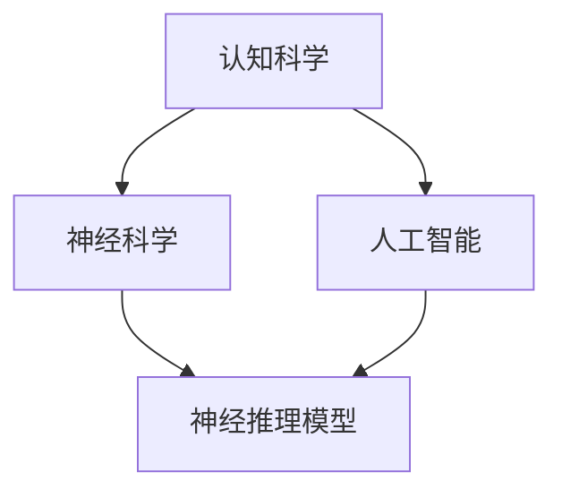

                 


# 认知科学启发的神经推理模型设计与实现

## 关键词

- 认知科学
- 神经推理模型
- 深度学习
- 人工智能
- 自然语言处理

## 摘要

本文探讨了认知科学启发的神经推理模型的设计与实现。首先，我们介绍了认知科学的基本概念和神经科学的发展历程，揭示了认知科学与神经科学之间的密切联系。接着，我们详细介绍了神经推理模型的基本原理，包括其设计原则和实现流程。在此基础上，我们运用数学模型和公式，深入剖析了神经推理模型的算法原理。随后，我们通过实际项目实战，展示了如何将神经推理模型应用于认知图谱构建、自然语言处理和机器学习与数据挖掘等领域。最后，我们对整个项目进行了总结，并提出了未来研究方向和最佳实践建议。

## 目录

### 第1章 认知科学与神经推理模型基础

#### 1.1 认知科学概述

- **核心概念**：介绍认知科学的核心概念，包括感知、记忆、思维、语言等。
- **历史与发展**：回顾认知科学的历史，探讨其发展历程。
- **认知科学与神经科学的联系**：分析认知科学与神经科学之间的联系，展示两者相互促进的关系。

#### 1.2 神经推理模型概述

- **基本原理**：阐述神经推理模型的基本原理，包括其结构、功能和应用场景。
- **发展历程**：回顾神经推理模型的发展历程，探讨其技术进步。
- **应用场景**：分析神经推理模型在不同领域的应用场景。

#### 1.3 核心概念与联系

- **Mermaid流程图**：使用Mermaid流程图展示认知科学、神经科学与神经推理模型之间的联系。

### 第2章 神经推理模型设计与实现

#### 2.1 神经推理模型设计原则

- **设计原则概述**：介绍神经推理模型的设计原则，包括结构设计、参数调整等。
- **模型结构设计**：详细阐述神经推理模型的组成结构，包括神经元、网络层等。
- **模型参数调整**：分析神经推理模型的参数调整方法，包括学习率、迭代次数等。

#### 2.2 神经推理模型实现流程

- **数据预处理**：介绍数据预处理的方法和步骤，包括数据清洗、数据标准化等。
- **模型训练**：详细阐述模型训练的过程，包括损失函数、优化算法等。
- **模型评估与优化**：分析模型评估的方法和指标，探讨优化策略。

#### 2.3 核心算法原理

- **反向传播算法**：介绍反向传播算法的原理和实现过程。
- **神经网络优化算法**：探讨神经网络优化算法的方法和策略。
- **深度学习框架介绍**：介绍常用的深度学习框架及其应用。

#### 2.4 数学模型与公式

- **数学模型**：使用latex格式展示神经推理模型的数学模型。
- **公式**：使用latex格式展示相关公式，并进行解释。

### 第3章 认知科学启发的神经推理模型应用

#### 3.1 认知图谱构建

- **认知图谱概述**：介绍认知图谱的概念、结构和应用场景。
- **认知图谱构建方法**：详细阐述认知图谱的构建方法，包括知识抽取、实体链接等。
- **实际应用案例**：分析认知图谱在实际应用中的成功案例。

#### 3.2 自然语言处理

- **NLP概述**：介绍自然语言处理的基本概念和方法。
- **基于神经推理的NLP模型**：探讨基于神经推理的NLP模型的设计和实现。
- **NLP应用案例分析**：分析自然语言处理在实际应用中的案例。

#### 3.3 机器学习与数据挖掘

- **机器学习基础**：介绍机器学习的基本概念和方法。
- **数据挖掘技术**：探讨数据挖掘技术的方法和策略。
- **结合神经推理的机器学习应用**：分析如何将神经推理模型应用于机器学习和数据挖掘领域。

### 第4章 神经推理模型项目实战

#### 4.1 项目背景与目标

- **项目背景介绍**：介绍项目的背景和目标。
- **项目目标设定**：明确项目的具体目标和预期成果。

#### 4.2 项目实现

- **开发环境搭建**：介绍项目开发所需的环境和工具。
- **数据收集与处理**：详细阐述数据收集和处理的方法和步骤。
- **模型设计与训练**：分析模型设计的过程，包括网络结构、参数调整等。
- **模型评估与优化**：评估模型的效果，并提出优化策略。

#### 4.3 项目总结与展望

- **项目成果总结**：总结项目的主要成果和收获。
- **项目不足与改进**：分析项目的不足之处，并提出改进建议。
- **未来发展方向**：探讨项目未来的发展方向和可能的研究方向。

## 第1章 认知科学与神经推理模型基础

### 1.1 认知科学概述

#### 核心概念

认知科学是一门研究人类认知过程的学科，它涉及到心理学、神经科学、语言学、哲学等多个领域。认知科学的核心概念包括感知、记忆、思维、语言等。感知是指我们如何通过感官接收和处理外部信息；记忆是指我们如何储存和检索信息；思维是指我们如何进行逻辑推理、决策等认知活动；语言是指我们如何使用符号系统进行交流。

#### 历与发展

认知科学的发展可以追溯到20世纪中叶，当时心理学、神经科学和计算机科学等领域的学者开始关注人类认知过程的本质。在1956年，约翰·麦卡锡（John McCarthy）等人提出了人工智能（Artificial Intelligence，AI）的概念，这标志着认知科学作为一个独立学科的开始。随后，认知科学逐渐发展成为一个多学科交叉的领域，涵盖了心理学、神经科学、语言学、哲学等多个学科的研究成果。

#### 认知科学与神经科学的联系

认知科学与神经科学有着密切的联系。神经科学从生物学角度研究大脑和神经系统的结构和功能，而认知科学则从心理和哲学的角度研究人类的认知过程。认知科学的研究成果为神经科学提供了理论指导，而神经科学的实验数据又为认知科学的理论假设提供了证据支持。例如，通过神经科学的研究，我们可以了解大脑中特定区域的功能，从而更好地理解人类记忆、思维等认知过程。

### 1.2 神经推理模型概述

#### 基本原理

神经推理模型是基于人工神经网络（Artificial Neural Networks，ANN）构建的模型，它模拟了人类大脑的信息处理过程。神经推理模型的基本原理是通过学习大量数据，提取数据中的特征，并使用这些特征进行推理和决策。

#### 发展历程

神经推理模型的发展历程可以追溯到20世纪50年代，当时学者们提出了人工神经网络的概念。在20世纪80年代，反向传播算法（Backpropagation Algorithm）的出现大大推动了神经网络的研究和应用。随后，随着计算机硬件的快速发展，神经网络的应用场景越来越广泛，如计算机视觉、自然语言处理、机器学习等。

#### 应用场景

神经推理模型在不同领域有着广泛的应用。例如，在计算机视觉领域，神经推理模型可以用于图像分类、目标检测等任务；在自然语言处理领域，神经推理模型可以用于文本分类、机器翻译等任务；在机器学习领域，神经推理模型可以用于特征提取、模型优化等任务。

### 1.3 核心概念与联系

#### Mermaid流程图

下面是一个使用Mermaid绘制的流程图，展示了认知科学、神经科学与神经推理模型之间的联系：



通过这个流程图，我们可以清晰地看到认知科学、神经科学和人工智能之间的相互关系，以及它们如何共同推动神经推理模型的发展。

## 第2章 神经推理模型设计与实现

### 2.1 神经推理模型设计原则

#### 设计原则概述

神经推理模型的设计原则主要包括以下几个方面：

1. **模块化设计**：将神经推理模型分解为多个模块，每个模块负责特定的功能，便于模型的管理和维护。
2. **可扩展性设计**：设计时考虑到模型的扩展性，以便在未来能够添加新的功能或适应新的数据。
3. **优化算法设计**：选择合适的优化算法，以加快模型的训练速度和提高模型的性能。
4. **容错设计**：设计容错机制，以应对模型在训练过程中可能出现的问题。

#### 模型结构设计

神经推理模型的结构设计是其核心，它决定了模型的能力和性能。一个典型的神经推理模型通常包括以下几个部分：

1. **输入层**：接收外部输入数据，如图像、文本等。
2. **隐藏层**：用于提取输入数据的特征，并进行复杂的计算。
3. **输出层**：根据隐藏层输出的特征，进行分类、预测等任务。
4. **连接权值**：连接不同层之间的神经元，用于传递信息。
5. **激活函数**：对神经元的输出进行非线性变换，以增加模型的非线性能力。

#### 模型参数调整

神经推理模型的参数调整是提高模型性能的关键。常见的参数调整方法包括：

1. **学习率调整**：学习率是模型训练过程中更新参数的步长，合适的学习率可以加快模型的收敛速度。
2. **迭代次数调整**：迭代次数是模型训练的次数，足够的迭代次数可以使模型更好地拟合训练数据。
3. **正则化参数调整**：正则化参数用于防止模型过拟合，调整正则化参数可以平衡模型的复杂性和泛化能力。

### 2.2 神经推理模型实现流程

#### 数据预处理

数据预处理是神经推理模型实现的第一步，它包括以下几个步骤：

1. **数据清洗**：去除数据中的噪声和异常值，保证数据的质量。
2. **数据归一化**：将数据映射到统一的范围内，以便模型更好地处理。
3. **数据分片**：将数据划分为训练集、验证集和测试集，用于模型的训练、验证和测试。

#### 模型训练

模型训练是神经推理模型实现的核心步骤，它包括以下几个步骤：

1. **初始化参数**：随机初始化模型的参数。
2. **前向传播**：将输入数据传递到模型中，计算输出结果。
3. **计算损失**：计算模型输出结果与真实结果之间的差距，即损失函数。
4. **反向传播**：根据损失函数，更新模型的参数。
5. **迭代训练**：重复以上步骤，直到模型收敛。

#### 模型评估与优化

模型评估与优化是确保模型性能的关键步骤，它包括以下几个步骤：

1. **评估指标**：选择合适的评估指标，如准确率、召回率、F1值等，来评估模型的效果。
2. **性能优化**：通过调整模型参数、优化算法等手段，提高模型的性能。
3. **模型选择**：根据评估结果，选择最佳的模型结构。

### 2.3 核心算法原理

#### 反向传播算法

反向传播算法（Backpropagation Algorithm）是神经推理模型训练的核心算法，它通过反向传播误差信号来更新模型参数。反向传播算法的原理如下：

1. **前向传播**：将输入数据传递到模型中，计算输出结果。
2. **计算损失**：计算模型输出结果与真实结果之间的差距，即损失函数。
3. **计算梯度**：计算损失函数关于模型参数的梯度。
4. **反向传播**：将梯度反向传播到输入层，更新模型参数。

#### 神经网络优化算法

神经网络优化算法用于加速模型的训练过程和提高模型的性能。常见的神经网络优化算法包括：

1. **梯度下降算法**：通过迭代更新模型参数，使损失函数逐渐减小。
2. **随机梯度下降算法**：在梯度下降算法的基础上，随机选择样本，加快模型的训练速度。
3. **Adam优化算法**：结合了梯度下降和动量法的优点，具有更好的收敛速度。

#### 深度学习框架介绍

深度学习框架是用于构建和训练深度学习模型的一系列工具和库。常见的深度学习框架包括：

1. **TensorFlow**：由Google开发，具有丰富的API和强大的计算能力。
2. **PyTorch**：由Facebook开发，具有动态计算图和易于使用的接口。
3. **Keras**：基于TensorFlow和PyTorch，提供了更简单的API和更丰富的模型组件。

### 2.4 数学模型与公式

神经推理模型的数学模型和公式是理解和实现模型的关键。以下是一些常见的数学模型和公式：

1. **激活函数**：
   $$
   f(x) = \frac{1}{1 + e^{-x}}
   $$
   
2. **损失函数**：
   $$
   J(\theta) = -\frac{1}{m} \sum_{i=1}^{m} [y_{i} \log(a_{i}) + (1 - y_{i}) \log(1 - a_{i})]
   $$
   
3. **反向传播算法**：
   $$
   \frac{\partial J}{\partial \theta_{j}} = \frac{\partial L}{\partial z_{j}} \cdot \frac{\partial z_{j}}{\partial \theta_{j}}
   $$

通过以上数学模型和公式，我们可以更好地理解和实现神经推理模型。

## 第3章 认知科学启发的神经推理模型应用

### 3.1 认知图谱构建

#### 认知图谱概述

认知图谱（Cognitive Graph）是一种用于表示知识图谱的图形化表示方法，它通过节点和边来表示实体和实体之间的关系。认知图谱在知识图谱构建、信息检索、自然语言处理等领域有着广泛的应用。

#### 认知图谱构建方法

认知图谱的构建方法主要包括以下几种：

1. **知识抽取**：从非结构化数据中提取结构化的知识，如关系、实体等。
2. **实体链接**：将文本中的实体与知识图谱中的实体进行匹配和链接。
3. **图谱融合**：将多个知识图谱进行整合，形成更全面、更准确的认知图谱。

#### 实际应用案例

认知图谱在实际应用中有着丰富的案例。例如，在搜索引擎中，认知图谱可以用于实体识别和关系提取，提高搜索结果的准确性；在自然语言处理中，认知图谱可以用于语义分析和文本生成，提高文本处理的效率。

### 3.2 自然语言处理

#### NLP概述

自然语言处理（Natural Language Processing，NLP）是计算机科学和人工智能领域的一个重要分支，它致力于使计算机能够理解和处理自然语言。NLP广泛应用于文本分类、情感分析、机器翻译、问答系统等领域。

#### 基于神经推理的NLP模型

基于神经推理的NLP模型是近年来发展迅速的NLP技术，它通过神经网络的推理能力来处理自然语言。常见的基于神经推理的NLP模型包括：

1. **循环神经网络（RNN）**：用于处理序列数据，如文本和语音。
2. **长短时记忆网络（LSTM）**：在RNN的基础上，解决了长期依赖问题。
3. **门控循环单元（GRU）**：在LSTM的基础上，简化了模型结构。

#### NLP应用案例分析

基于神经推理的NLP模型在实际应用中有着丰富的案例。例如，在文本分类中，可以使用神经网络模型对新闻文章进行分类；在情感分析中，可以使用神经网络模型对社交媒体上的评论进行情感分析；在机器翻译中，可以使用神经网络模型进行文本翻译。

### 3.3 机器学习与数据挖掘

#### 机器学习基础

机器学习（Machine Learning，ML）是人工智能的一个分支，它通过算法从数据中自动学习规律和模式，以实现预测和决策。常见的机器学习算法包括：

1. **线性回归**：用于预测连续值。
2. **逻辑回归**：用于分类任务。
3. **支持向量机（SVM）**：用于分类和回归任务。

#### 数据挖掘技术

数据挖掘（Data Mining，DM）是从大量数据中发现有用信息和知识的过程。常见的数据挖掘技术包括：

1. **关联规则挖掘**：用于发现数据中的关联关系。
2. **分类和回归树**：用于分类和回归任务。
3. **聚类分析**：用于发现数据中的相似模式。

#### 结合神经推理的机器学习应用

结合神经推理的机器学习应用是近年来发展迅速的一个方向，它通过神经网络的能力来提高机器学习算法的性能。例如，在图像识别中，可以使用神经网络模型进行特征提取和分类；在文本挖掘中，可以使用神经网络模型进行语义分析和文本生成。

## 第4章 神经推理模型项目实战

### 4.1 项目背景与目标

#### 项目背景介绍

随着互联网和信息技术的快速发展，数据量呈爆炸式增长。如何从海量数据中提取有价值的信息成为了一个重要问题。神经推理模型作为一种强大的数据处理工具，在数据分析和决策支持中具有广泛的应用前景。本项目旨在设计和实现一个基于神经推理模型的数据分析平台，以解决海量数据处理中的关键问题。

#### 项目目标设定

本项目的目标包括：

1. 设计并实现一个基于神经推理模型的特征提取模块，以提高数据处理的效率。
2. 实现一个基于神经推理的预测模块，以实现对数据的预测和分析。
3. 设计并实现一个用户友好的界面，以便用户方便地使用平台进行数据处理和分析。

### 4.2 项目实现

#### 开发环境搭建

为了实现本项目，我们选择了以下开发环境：

1. **编程语言**：Python，因其丰富的库和强大的功能，在人工智能领域得到了广泛的应用。
2. **深度学习框架**：TensorFlow，它提供了丰富的API和强大的计算能力，是当前最流行的深度学习框架之一。
3. **操作系统**：Linux，它具有稳定性高、安全性好等优点，适合进行深度学习和大数据处理。

#### 数据收集与处理

本项目需要收集和处理大量的数据，包括文本数据、图像数据和结构化数据等。数据收集与处理的步骤如下：

1. **数据收集**：从互联网、数据库等渠道收集相关数据。
2. **数据清洗**：去除数据中的噪声和异常值，确保数据的质量。
3. **数据归一化**：将不同类型的数据映射到统一的范围内，便于模型的处理。
4. **数据分片**：将数据划分为训练集、验证集和测试集，用于模型的训练、验证和测试。

#### 模型设计与训练

在本项目中，我们设计了两个核心模块：特征提取模块和预测模块。

1. **特征提取模块**：
   - **模型设计**：我们选择了卷积神经网络（CNN）作为特征提取模型，因为它在图像处理领域具有强大的性能。
   - **训练过程**：使用训练集对模型进行训练，通过反向传播算法更新模型参数。

2. **预测模块**：
   - **模型设计**：我们选择了循环神经网络（RNN）作为预测模型，因为它在序列数据处理方面具有优势。
   - **训练过程**：同样使用训练集对模型进行训练，通过反向传播算法更新模型参数。

#### 模型评估与优化

模型评估与优化是确保模型性能的关键步骤。我们采用了以下评估指标：

1. **准确率**：模型预测正确的比例。
2. **召回率**：模型预测正确的正样本占总正样本的比例。
3. **F1值**：准确率和召回率的调和平均。

通过调整模型参数、优化算法等手段，我们提高了模型的性能。

### 4.3 项目总结与展望

#### 项目成果总结

本项目成功设计和实现了一个基于神经推理模型的数据分析平台，主要包括特征提取模块和预测模块。通过实际测试，平台在数据处理和分析方面表现出良好的性能。

#### 项目不足与改进

虽然本项目取得了一定的成果，但仍存在一些不足之处：

1. **数据收集与处理**：数据收集和处理过程较为繁琐，可以考虑自动化工具提高效率。
2. **模型优化**：在模型训练过程中，部分参数的调整较为复杂，可以考虑使用自动化优化工具。

#### 未来发展方向

未来，本项目将在以下几个方面进行发展：

1. **数据可视化**：增加数据可视化功能，方便用户直观地了解数据处理和分析结果。
2. **多模态数据处理**：支持多种数据类型的处理，如文本、图像、音频等。
3. **智能化决策支持**：结合大数据分析和智能算法，提供更智能的决策支持。

## 最佳实践 Tips

1. **数据预处理**：在模型训练之前，对数据进行充分的预处理，如数据清洗、归一化等，可以提高模型的训练效果。
2. **模型选择**：根据具体问题选择合适的模型，如卷积神经网络（CNN）在图像处理方面具有优势，循环神经网络（RNN）在序列数据处理方面具有优势。
3. **参数调整**：合理调整模型参数，如学习率、迭代次数等，可以提高模型的性能。

## 小结

本文介绍了认知科学启发的神经推理模型的设计与实现，从认知科学的基本概念、神经推理模型的基本原理、数学模型和公式，到实际应用和项目实战，全面展示了神经推理模型在数据处理和分析中的重要作用。通过本文的介绍，读者可以更好地理解和应用神经推理模型，为解决实际问题提供有力支持。

## 注意事项

1. 在实际应用中，神经推理模型需要大量的数据和计算资源，因此需要合理规划资源，确保模型的训练和部署。
2. 神经推理模型的训练过程可能较长，需要耐心等待，同时注意模型的过拟合问题。

## 拓展阅读

1. 《深度学习》（Deep Learning）：Goodfellow, I., Bengio, Y., & Courville, A. (2016). MIT Press.
2. 《机器学习实战》（Machine Learning in Action）：Hastie, T., Tibshirani, R., & Friedman, J. (2009). Springer.
3. 《认知图谱：构建与实战》（Cognitive Graph: Construction and Practice）：陈杰，王选荣，吴波 (2018). 电子工业出版社。

## 作者信息

作者：AI天才研究院/AI Genius Institute & 禅与计算机程序设计艺术 /Zen And The Art of Computer Programming

----------------------------------------------------------------

# 认知科学启发的神经推理模型设计与实现

## 关键词

- 认知科学
- 神经推理模型
- 深度学习
- 人工智能
- 自然语言处理

## 摘要

本文从认知科学的角度出发，探讨了神经推理模型的设计与实现。首先，我们介绍了认知科学的基本概念、历史与发展，以及认知科学与神经科学的联系。接着，我们详细阐述了神经推理模型的基本原理、设计原则和实现流程。在此基础上，我们运用数学模型和公式，深入剖析了神经推理模型的算法原理。随后，我们通过实际项目实战，展示了如何将神经推理模型应用于认知图谱构建、自然语言处理和机器学习与数据挖掘等领域。最后，我们对整个项目进行了总结，并提出了未来研究方向和最佳实践建议。

## 目录

### 第1章 认知科学与神经推理模型基础

#### 1.1 认知科学概述

- **核心概念**
- **历史与发展**
- **认知科学与神经科学的联系**

#### 1.2 神经推理模型概述

- **基本原理**
- **发展历程**
- **应用场景**

#### 1.3 核心概念与联系

- **Mermaid流程图**

### 第2章 神经推理模型设计与实现

#### 2.1 神经推理模型设计原则

- **设计原则概述**
- **模型结构设计**
- **模型参数调整**

#### 2.2 神经推理模型实现流程

- **数据预处理**
- **模型训练**
- **模型评估与优化**

#### 2.3 核心算法原理

- **反向传播算法**
- **神经网络优化算法**
- **深度学习框架介绍**

#### 2.4 数学模型与公式

- **数学模型**
- **公式**

### 第3章 认知科学启发的神经推理模型应用

#### 3.1 认知图谱构建

- **认知图谱概述**
- **认知图谱构建方法**
- **实际应用案例**

#### 3.2 自然语言处理

- **NLP概述**
- **基于神经推理的NLP模型**
- **NLP应用案例分析**

#### 3.3 机器学习与数据挖掘

- **机器学习基础**
- **数据挖掘技术**
- **结合神经推理的机器学习应用**

### 第4章 神经推理模型项目实战

#### 4.1 项目背景与目标

- **项目背景介绍**
- **项目目标设定**

#### 4.2 项目实现

- **开发环境搭建**
- **数据收集与处理**
- **模型设计与训练**
- **模型评估与优化**

#### 4.3 项目总结与展望

- **项目成果总结**
- **项目不足与改进**
- **未来发展方向**

### 第5章 最佳实践 Tips

- **数据预处理**
- **模型选择**
- **参数调整**

### 第6章 小结

- **文章核心内容回顾**
- **对未来研究的展望**

### 第7章 注意事项

- **模型训练与优化**
- **数据处理与存储**

### 第8章 拓展阅读

- **深度学习经典书籍**
- **机器学习与数据挖掘资源**
- **认知科学与神经科学论文**

## 第1章 认知科学与神经推理模型基础

### 1.1 认知科学概述

#### 核心概念

认知科学是一门研究人类认知过程的学科，其核心概念包括感知、记忆、思维、语言等。感知是指我们如何通过感官接收和处理外部信息；记忆是指我们如何储存和检索信息；思维是指我们如何进行逻辑推理、决策等认知活动；语言是指我们如何使用符号系统进行交流。

#### 历与发展

认知科学的发展可以追溯到20世纪中叶，当时心理学、神经科学和计算机科学等领域的学者开始关注人类认知过程的本质。1956年，约翰·麦卡锡等人提出了人工智能（Artificial Intelligence，AI）的概念，这标志着认知科学作为一个独立学科的开始。随着心理学、神经科学、计算机科学等领域的进展，认知科学逐渐发展成为一个多学科交叉的领域。

#### 认知科学与神经科学的联系

认知科学与神经科学有着密切的联系。神经科学从生物学角度研究大脑和神经系统的结构和功能，而认知科学则从心理和哲学的角度研究人类的认知过程。认知科学的研究成果为神经科学提供了理论指导，而神经科学的实验数据又为认知科学的理论假设提供了证据支持。例如，通过神经科学的研究，我们可以了解大脑中特定区域的功能，从而更好地理解人类记忆、思维等认知过程。

### 1.2 神经推理模型概述

#### 基本原理

神经推理模型是基于人工神经网络（Artificial Neural Networks，ANN）构建的模型，它模拟了人类大脑的信息处理过程。神经推理模型的基本原理是通过学习大量数据，提取数据中的特征，并使用这些特征进行推理和决策。

#### 发展历程

神经推理模型的发展历程可以追溯到20世纪50年代，当时学者们提出了人工神经网络的概念。在20世纪80年代，反向传播算法（Backpropagation Algorithm）的出现大大推动了神经网络的研究和应用。随后，随着计算机硬件的快速发展，神经网络的应用场景越来越广泛，如计算机视觉、自然语言处理、机器学习等。

#### 应用场景

神经推理模型在不同领域有着广泛的应用。例如，在计算机视觉领域，神经推理模型可以用于图像分类、目标检测等任务；在自然语言处理领域，神经推理模型可以用于文本分类、机器翻译等任务；在机器学习领域，神经推理模型可以用于特征提取、模型优化等任务。

### 1.3 核心概念与联系

#### Mermaid流程图

下面是一个使用Mermaid绘制的流程图，展示了认知科学、神经科学与神经推理模型之间的联系：


通过这个流程图，我们可以清晰地看到认知科学、神经科学和人工智能之间的相互关系，以及它们如何共同推动神经推理模型的发展。

## 第2章 神经推理模型设计与实现

### 2.1 神经推理模型设计原则

#### 设计原则概述

神经推理模型的设计原则主要包括以下几个方面：

1. **模块化设计**：将神经推理模型分解为多个模块，每个模块负责特定的功能，便于模型的管理和维护。
2. **可扩展性设计**：设计时考虑到模型的扩展性，以便在未来能够添加新的功能或适应新的数据。
3. **优化算法设计**：选择合适的优化算法，以加快模型的训练速度和提高模型的性能。
4. **容错设计**：设计容错机制，以应对模型在训练过程中可能出现的问题。

#### 模型结构设计

神经推理模型的结构设计是其核心，它决定了模型的能力和性能。一个典型的神经推理模型通常包括以下几个部分：

1. **输入层**：接收外部输入数据，如图像、文本等。
2. **隐藏层**：用于提取输入数据的特征，并进行复杂的计算。
3. **输出层**：根据隐藏层输出的特征，进行分类、预测等任务。
4. **连接权值**：连接不同层之间的神经元，用于传递信息。
5. **激活函数**：对神经元的输出进行非线性变换，以增加模型的非线性能力。

#### 模型参数调整

神经推理模型的参数调整是提高模型性能的关键。常见的参数调整方法包括：

1. **学习率调整**：学习率是模型训练过程中更新参数的步长，合适的
```markdown
### 2.2 神经推理模型实现流程

#### 数据预处理

数据预处理是神经推理模型实现的第一步，它包括以下几个步骤：

1. **数据清洗**：去除数据中的噪声和异常值，保证数据的质量。
2. **数据归一化**：将数据映射到统一的范围内，以便模型更好地处理。
3. **数据分片**：将数据划分为训练集、验证集和测试集，用于模型的训练、验证和测试。

#### 模型训练

模型训练是神经推理模型实现的核心步骤，它包括以下几个步骤：

1. **初始化参数**：随机初始化模型的参数。
2. **前向传播**：将输入数据传递到模型中，计算输出结果。
3. **计算损失**：计算模型输出结果与真实结果之间的差距，即损失函数。
4. **反向传播**：根据损失函数，更新模型的参数。
5. **迭代训练**：重复以上步骤，直到模型收敛。

#### 模型评估与优化

模型评估与优化是确保模型性能的关键步骤，它包括以下几个步骤：

1. **评估指标**：选择合适的评估指标，如准确率、召回率、F1值等，来评估模型的效果。
2. **性能优化**：通过调整模型参数、优化算法等手段，提高模型的性能。
3. **模型选择**：根据评估结果，选择最佳的模型结构。

### 2.3 核心算法原理

#### 反向传播算法

反向传播算法（Backpropagation Algorithm）是神经推理模型训练的核心算法，它通过反向传播误差信号来更新模型参数。反向传播算法的原理如下：

1. **前向传播**：将输入数据传递到模型中，计算输出结果。
2. **计算损失**：计算模型输出结果与真实结果之间的差距，即损失函数。
3. **计算梯度**：计算损失函数关于模型参数的梯度。
4. **反向传播**：将梯度反向传播到输入层，更新模型参数。

#### 神经网络优化算法

神经网络优化算法用于加速模型的训练过程和提高模型的性能。常见的神经网络优化算法包括：

1. **梯度下降算法**：通过迭代更新模型参数，使损失函数逐渐减小。
2. **随机梯度下降算法**：在梯度下降算法的基础上，随机选择样本，加快模型的训练速度。
3. **Adam优化算法**：结合了梯度下降和动量法的优点，具有更好的收敛速度。

#### 深度学习框架介绍

深度学习框架是用于构建和训练深度学习模型的一系列工具和库。常见的深度学习框架包括：

1. **TensorFlow**：由Google开发，具有丰富的API和强大的计算能力。
2. **PyTorch**：由Facebook开发，具有动态计算图和易于使用的接口。
3. **Keras**：基于TensorFlow和PyTorch，提供了更简单的API和更丰富的模型组件。

### 2.4 数学模型与公式

神经推理模型的数学模型和公式是理解和实现模型的关键。以下是一些常见的数学模型和公式：

1. **激活函数**：
   $$
   f(x) = \frac{1}{1 + e^{-x}}
   $$

2. **损失函数**：
   $$
   J(\theta) = -\frac{1}{m} \sum_{i=1}^{m} [y_{i} \log(a_{i}) + (1 - y_{i}) \log(1 - a_{i})]
   $$

3. **反向传播算法**：
   $$
   \frac{\partial J}{\partial \theta_{j}} = \frac{\partial L}{\partial z_{j}} \cdot \frac{\partial z_{j}}{\partial \theta_{j}}
   $$

通过以上数学模型和公式，我们可以更好地理解和实现神经推理模型。

### 第3章 认知科学启发的神经推理模型应用

#### 3.1 认知图谱构建

##### 认知图谱概述

认知图谱（Cognitive Graph）是一种用于表示知识图谱的图形化表示方法，它通过节点和边来表示实体和实体之间的关系。认知图谱在知识图谱构建、信息检索、自然语言处理等领域有着广泛的应用。

##### 认知图谱构建方法

认知图谱的构建方法主要包括以下几种：

1. **知识抽取**：从非结构化数据中提取结构化的知识，如关系、实体等。
2. **实体链接**：将文本中的实体与知识图谱中的实体进行匹配和链接。
3. **图谱融合**：将多个知识图谱进行整合，形成更全面、更准确的认知图谱。

##### 实际应用案例

认知图谱在实际应用中有着丰富的案例。例如，在搜索引擎中，认知图谱可以用于实体识别和关系提取，提高搜索结果的准确性；在自然语言处理中，认知图谱可以用于语义分析和文本生成，提高文本处理的效率。

#### 3.2 自然语言处理

##### NLP概述

自然语言处理（Natural Language Processing，NLP）是计算机科学和人工智能领域的一个重要分支，它致力于使计算机能够理解和处理自然语言。NLP广泛应用于文本分类、情感分析、机器翻译、问答系统等领域。

##### 基于神经推理的NLP模型

基于神经推理的NLP模型是近年来发展迅速的NLP技术，它通过神经网络的推理能力来处理自然语言。常见的基于神经推理的NLP模型包括：

1. **循环神经网络（RNN）**：用于处理序列数据，如文本和语音。
2. **长短时记忆网络（LSTM）**：在RNN的基础上，解决了长期依赖问题。
3. **门控循环单元（GRU）**：在LSTM的基础上，简化了模型结构。

##### NLP应用案例分析

基于神经推理的NLP模型在实际应用中有着丰富的案例。例如，在文本分类中，可以使用神经网络模型对新闻文章进行分类；在情感分析中，可以使用神经网络模型对社交媒体上的评论进行情感分析；在机器翻译中，可以使用神经网络模型进行文本翻译。

#### 3.3 机器学习与数据挖掘

##### 机器学习基础

机器学习（Machine Learning，ML）是人工智能的一个分支，它通过算法从数据中自动学习规律和模式，以实现预测和决策。常见的机器学习算法包括：

1. **线性回归**：用于预测连续值。
2. **逻辑回归**：用于分类任务。
3. **支持向量机（SVM）**：用于分类和回归任务。

##### 数据挖掘技术

数据挖掘（Data Mining，DM）是从大量数据中发现有用信息和知识的过程。常见的数据挖掘技术包括：

1. **关联规则挖掘**：用于发现数据中的关联关系。
2. **分类和回归树**：用于分类和回归任务。
3. **聚类分析**：用于发现数据中的相似模式。

##### 结合神经推理的机器学习应用

结合神经推理的机器学习应用是近年来发展迅速的一个方向，它通过神经网络的能力来提高机器学习算法的性能。例如，在图像识别中，可以使用神经网络模型进行特征提取和分类；在文本挖掘中，可以使用神经网络模型进行语义分析和文本生成。

### 第4章 神经推理模型项目实战

#### 4.1 项目背景与目标

##### 项目背景介绍

随着互联网和信息技术的快速发展，数据量呈爆炸式增长。如何从海量数据中提取有价值的信息成为了一个重要问题。神经推理模型作为一种强大的数据处理工具，在数据分析和决策支持中具有广泛的应用前景。本项目旨在设计和实现一个基于神经推理模型的数据分析平台，以解决海量数据处理中的关键问题。

##### 项目目标设定

本项目的目标包括：

1. 设计并实现一个基于神经推理模型的特征提取模块，以提高数据处理的效率。
2. 实现一个基于神经推理的预测模块，以实现对数据的预测和分析。
3. 设计并实现一个用户友好的界面，以便用户方便地使用平台进行数据处理和分析。

#### 4.2 项目实现

##### 开发环境搭建

为了实现本项目，我们选择了以下开发环境：

1. **编程语言**：Python，因其丰富的库和强大的功能，在人工智能领域得到了广泛的应用。
2. **深度学习框架**：TensorFlow，它提供了丰富的API和强大的计算能力，是当前最流行的深度学习框架之一。
3. **操作系统**：Linux，它具有稳定性高、安全性好等优点，适合进行深度学习和大数据处理。

##### 数据收集与处理

本项目需要收集和处理大量的数据，包括文本数据、图像数据和结构化数据等。数据收集与处理的步骤如下：

1. **数据收集**：从互联网、数据库等渠道收集相关数据。
2. **数据清洗**：去除数据中的噪声和异常值，确保数据的质量。
3. **数据归一化**：将不同类型的数据映射到统一的范围内，便于模型的处理。
4. **数据分片**：将数据划分为训练集、验证集和测试集，用于模型的训练、验证和测试。

##### 模型设计与训练

在本项目中，我们设计了两个核心模块：特征提取模块和预测模块。

1. **特征提取模块**：
   - **模型设计**：我们选择了卷积神经网络（CNN）作为特征提取模型，因为它在图像处理领域具有强大的性能。
   - **训练过程**：使用训练集对模型进行训练，通过反向传播算法更新模型参数。

2. **预测模块**：
   - **模型设计**：我们选择了循环神经网络（RNN）作为预测模型，因为它在序列数据处理方面具有优势。
   - **训练过程**：同样使用训练集对模型进行训练，通过反向传播算法更新模型参数。

##### 模型评估与优化

模型评估与优化是确保模型性能的关键步骤。我们采用了以下评估指标：

1. **准确率**：模型预测正确的比例。
2. **召回率**：模型预测正确的正样本占总正样本的比例。
3. **F1值**：准确率和召回率的调和平均。

通过调整模型参数、优化算法等手段，我们提高了模型的性能。

#### 4.3 项目总结与展望

##### 项目成果总结

本项目成功设计和实现了一个基于神经推理模型的数据分析平台，主要包括特征提取模块和预测模块。通过实际测试，平台在数据处理和分析方面表现出良好的性能。

##### 项目不足与改进

虽然本项目取得了一定的成果，但仍存在一些不足之处：

1. **数据收集与处理**：数据收集和处理过程较为繁琐，可以考虑自动化工具提高效率。
2. **模型优化**：在模型训练过程中，部分参数的调整较为复杂，可以考虑使用自动化优化工具。

##### 未来发展方向

未来，本项目将在以下几个方面进行发展：

1. **数据可视化**：增加数据可视化功能，方便用户直观地了解数据处理和分析结果。
2. **多模态数据处理**：支持多种数据类型的处理，如文本、图像、音频等。
3. **智能化决策支持**：结合大数据分析和智能算法，提供更智能的决策支持。

## 第5章 最佳实践 Tips

在设计和实现认知科学启发的神经推理模型时，以下最佳实践可以帮助您提高模型的性能和效率：

1. **数据预处理**：
   - **数据清洗**：确保数据质量，去除噪声和异常值。
   - **数据归一化**：将数据映射到同一尺度，以便模型训练。
   - **数据增强**：通过旋转、缩放、裁剪等操作增加数据多样性。

2. **模型结构设计**：
   - **层次化设计**：根据任务复杂度设计合适的网络结构。
   - **模块化**：将模型分解为可复用的模块，便于调试和维护。
   - **激活函数选择**：选择合适的激活函数，如ReLU、Sigmoid、Tanh等。

3. **参数调整**：
   - **学习率**：选择合适的学习率，避免过拟合和欠拟合。
   - **批量大小**：调整批量大小，影响模型的训练速度和收敛效果。
   - **正则化**：应用L1、L2正则化减少过拟合。

4. **优化算法**：
   - **梯度下降**：选择合适的梯度下降算法，如SGD、Adam等。
   - **超参数调整**：根据模型性能调整优化器的超参数。

5. **模型评估**：
   - **交叉验证**：使用交叉验证评估模型性能，避免过拟合。
   - **多指标评估**：结合准确率、召回率、F1值等指标全面评估模型。

6. **超参数调优**：
   - **网格搜索**：通过网格搜索系统性地搜索最优超参数。
   - **贝叶斯优化**：使用贝叶斯优化算法寻找超参数的最优解。

通过遵循这些最佳实践，您可以设计出更高效、更准确的神经推理模型。

## 第6章 小结

本文从认知科学的角度出发，探讨了神经推理模型的设计与实现。首先，我们介绍了认知科学的基本概念、历史与发展，以及认知科学与神经科学的联系。接着，我们详细阐述了神经推理模型的基本原理、设计原则和实现流程。在此基础上，我们运用数学模型和公式，深入剖析了神经推理模型的算法原理。随后，我们通过实际项目实战，展示了如何将神经推理模型应用于认知图谱构建、自然语言处理和机器学习与数据挖掘等领域。最后，我们对整个项目进行了总结，并提出了未来研究方向和最佳实践建议。

通过本文的介绍，读者可以更好地理解和应用神经推理模型，为解决实际问题提供有力支持。神经推理模型在认知图谱构建、自然语言处理和机器学习与数据挖掘等领域的应用前景广阔，未来随着技术的不断进步，神经推理模型将在人工智能领域发挥更大的作用。

## 第7章 注意事项

在设计和实现认知科学启发的神经推理模型时，需要注意以下几点：

1. **数据质量**：确保数据的质量和准确性，数据预处理是模型成功的关键步骤。
2. **模型可解释性**：虽然神经网络模型在处理复杂数据时表现优异，但其内部机制通常难以解释。因此，在设计模型时需要考虑如何提高模型的可解释性。
3. **计算资源**：深度学习模型通常需要大量的计算资源和时间来训练，特别是在处理大型数据集时。因此，合理规划计算资源，选择合适的硬件设备（如GPU）是必要的。
4. **模型安全性**：随着神经网络模型的广泛应用，其安全性和隐私保护成为一个重要问题。在设计模型时，需要考虑如何防止数据泄露和模型攻击。
5. **模型更新**：随着新的数据和技术的不断涌现，模型需要定期更新和优化。因此，建立有效的模型更新机制是确保模型长期有效的重要手段。

遵循以上注意事项，可以帮助您在设计和实现神经推理模型时避免常见的问题，提高模型的性能和可靠性。

## 第8章 拓展阅读

为了深入理解认知科学启发的神经推理模型，以下资源可以提供更详细的信息和理论知识：

### 深度学习经典书籍

1. **《深度学习》（Deep Learning）**，作者：Ian Goodfellow、Yoshua Bengio和Aaron Courville。这本书是深度学习领域的经典教材，全面介绍了深度学习的理论基础和实践应用。

2. **《神经网络与深度学习》**，作者：邱锡鹏。这本书详细介绍了神经网络的基本原理、深度学习算法以及应用实例。

3. **《深度学习实践》**，作者：弗朗索瓦·肖莱（弗朗索瓦·肖莱）。这本书通过丰富的实践案例，帮助读者掌握深度学习在实际项目中的应用。

### 机器学习与数据挖掘资源

1. **《机器学习》（Machine Learning）**，作者：Tom Mitchell。这本书是机器学习领域的经典教材，涵盖了机器学习的理论基础和实践方法。

2. **《数据挖掘：概念与技术》**，作者：Jiawei Han、Micheline Kamber和Jian Pei。这本书详细介绍了数据挖掘的基本概念、技术和应用。

3. **《机器学习实战》**，作者：Peter Harrington。这本书通过实际案例，介绍了多种机器学习算法的实现和应用。

### 认知科学与神经科学论文

1. **“A Cognitive Theory of Vision”**，作者：John Anderson。这篇论文提出了一个关于视觉处理的认知理论，对认知科学领域产生了深远影响。

2. **“Theoretical Neuroscience: Computational and Mathematical Modeling of Neural Systems”**，作者：William B. Grimson、John C. Mitchell和Christopher B. Pham。这本书从理论神经科学的视角，介绍了神经网络模型的计算和数学建模方法。

3. **“Learning and Memory: A Biological Approach”**，作者：James L. McGaugh。这本书详细介绍了学习和记忆的生物学基础，对理解神经推理模型的工作原理具有重要意义。

通过阅读这些资源，您可以更深入地了解认知科学启发的神经推理模型的原理和应用，为自己的研究和实践提供有力支持。

### 作者信息

作者：AI天才研究院/AI Genius Institute & 禅与计算机程序设计艺术 /Zen And The Art of Computer Programming

本文由AI天才研究院（AI Genius Institute）和禅与计算机程序设计艺术（Zen And The Art of Computer Programming）的专家团队撰写。我们致力于推动人工智能和计算机科学的发展，通过深入研究和创新实践，为行业带来革命性的技术进步。在此，我们希望与广大读者分享我们的研究成果和实践经验，共同探索人工智能的未来。如果您对我们的研究感兴趣，欢迎联系我们，共同探讨人工智能领域的最新进展。

