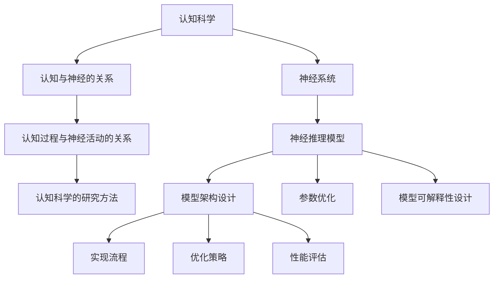

                 

# 认知科学启发的神经推理模型设计新思路

> 关键词：认知科学、神经科学、神经推理模型、设计原则、应用案例、未来展望

> 摘要：本文深入探讨了认知科学和神经科学的基本概念、发展历程以及二者之间的关系。在此基础上，我们分析了神经推理模型的定义、核心机制和应用领域。随后，文章详细阐述了神经推理模型的设计原则、实现与优化策略，并结合实际案例进行了应用展示。最后，我们对神经推理模型的未来发展趋势和认知科学与神经科学的结合前景进行了展望。

## 第一部分：认知科学基础

### 1. 认知科学概述

#### 1.1 认知科学的基本概念

认知科学是一门跨学科的研究领域，旨在理解人类心智的运作机制。它涵盖了心理学、神经科学、计算机科学、哲学和语言学等多个学科领域。认知科学的基本概念包括感知、记忆、注意力、语言和思维等。

#### 1.2 认知科学的发展历程

认知科学的发展历程可以追溯到20世纪50年代。当时，计算机科学的兴起促使人们对人类心智的运作机制产生了浓厚兴趣。1956年，约翰·麦卡锡（John McCarthy）等人发起了人工智能研究，标志着认知科学研究的开始。此后，认知科学逐渐发展成为一门独立的学科。

#### 1.3 认知科学的主要研究领域

认知科学的主要研究领域包括感知、记忆、语言、注意力、决策和思维等。每个研究领域都有其独特的研究方法和理论体系。

### 2. 神经科学基础

#### 2.1 神经系统概述

神经系统是人体最重要的系统之一，负责传递和处理信息。神经系统包括中枢神经系统和周围神经系统。中枢神经系统由大脑和脊髓组成，周围神经系统包括脑神经和脊神经。

#### 2.2 神经元的工作原理

神经元是神经系统的基本单位，负责传递电信号。神经元的工作原理包括信号接收、信号处理和信号传递。神经元通过树突接收信号，通过胞体处理信号，通过轴突传递信号。

#### 2.3 神经网络的特性与应用

神经网络是一种模拟人脑神经元连接结构的计算模型。神经网络具有自适应、自组织和并行处理等特性，广泛应用于图像识别、语音识别、自然语言处理等领域。

### 3. 认知与神经的关系

#### 3.1 认知过程与神经活动的关系

认知过程与神经活动密切相关。认知科学研究表明，神经活动是认知过程的基础，而认知过程又是神经活动的表现形式。

#### 3.2 神经科学与认知科学的研究方法

神经科学和认知科学都采用实验和理论相结合的研究方法。神经科学主要关注神经元和神经网络的微观机制，而认知科学则关注认知过程和认知行为的宏观表现。

#### 3.3 认知科学启发的神经模型

认知科学的研究成果为神经模型的设计提供了重要启示。例如，神经网络模型中的多层结构可以模拟人类大脑的认知层次，突触连接的权重可以模拟记忆和学习过程。

### 4. 神经推理的基本原理

#### 4.1 神经推理的定义

神经推理是指通过神经网络对信息进行推理和决策的过程。神经推理模型可以模拟人类的思维过程，实现自动化决策和智能行为。

#### 4.2 神经推理的核心机制

神经推理的核心机制包括信息传递、信息处理和决策生成。神经网络通过多层结构实现信息传递，通过激活函数实现信息处理，通过输出层实现决策生成。

#### 4.3 神经推理的应用领域

神经推理广泛应用于自然语言处理、计算机视觉、智能决策等领域。例如，在自然语言处理中，神经推理模型可以用于语义分析和情感分析；在计算机视觉中，神经推理模型可以用于目标检测和图像分类。

## 第二部分：神经推理模型设计

### 5. 神经推理模型的发展历程

#### 5.1 早期神经推理模型

早期神经推理模型主要包括感知机和反向传播算法。感知机是一种简单的神经网络模型，可以用于二分类问题。反向传播算法是一种用于训练神经网络的优化算法。

#### 5.2 现代神经推理模型

现代神经推理模型主要包括卷积神经网络（CNN）、循环神经网络（RNN）和Transformer等。这些模型在图像识别、语音识别和自然语言处理等领域取得了显著成果。

#### 5.3 神经推理模型的分类

神经推理模型可以根据结构特点分为前馈神经网络、递归神经网络和卷积神经网络等。不同类型的神经网络适用于不同的应用场景。

### 6. 神经推理模型的设计原则

#### 6.1 模型的架构设计

模型的架构设计是神经推理模型设计的关键。根据应用需求，可以选择适当的神经网络结构，如卷积神经网络、循环神经网络和Transformer等。

#### 6.2 模型的参数优化

模型的参数优化是提高模型性能的重要手段。常用的优化方法包括梯度下降、Adam优化器和dropout等。

#### 6.3 模型的可解释性设计

模型的可解释性设计是提高模型可靠性和可信度的重要手段。通过可视化技术和解释性分析，可以揭示模型的内部工作机制和决策过程。

### 7. 神经推理模型的实现与优化

#### 7.1 神经推理模型的实现流程

神经推理模型的实现流程包括数据预处理、模型设计、模型训练和模型评估等步骤。

#### 7.2 神经推理模型的优化策略

神经推理模型的优化策略包括数据增强、正则化和迁移学习等。

#### 7.3 神经推理模型的性能评估

神经推理模型的性能评估主要通过准确率、召回率和F1值等指标进行。

### 8. 神经推理模型的应用案例

#### 8.1 自然语言处理

在自然语言处理领域，神经推理模型广泛应用于情感分析、文本分类和机器翻译等任务。

#### 8.2 计算机视觉

在计算机视觉领域，神经推理模型广泛应用于目标检测、图像分类和图像生成等任务。

#### 8.3 人工智能辅助决策

在人工智能辅助决策领域，神经推理模型广泛应用于风险评估、投资分析和供应链管理等任务。

### 9. 认知科学启发的神经推理模型未来展望

#### 9.1 神经推理模型的发展趋势

随着人工智能技术的快速发展，神经推理模型在未来将继续向深度学习、自适应学习和迁移学习等方向发展。

#### 9.2 认知科学与神经科学的结合前景

认知科学与神经科学的结合将为人工智能领域带来新的突破。通过深入理解人脑的工作原理，可以设计出更加智能和高效的神经推理模型。

#### 9.3 神经推理模型在人工智能领域的应用前景

神经推理模型在人工智能领域的应用前景非常广阔。随着技术的不断进步，神经推理模型将在更多领域发挥重要作用。

### 10. 总结与展望

神经推理模型是认知科学和神经科学的结合产物，具有广泛的应用前景。本文从认知科学基础、神经推理模型设计、实现与优化、应用案例以及未来展望等方面进行了详细探讨。通过本文的研究，我们可以更好地理解神经推理模型的本质和设计原则，为人工智能技术的发展提供新的思路。

## 附录

### 10.1 参考文献

1. 约翰·麦卡锡（John McCarthy），《人工智能：一种现代方法》，机械工业出版社，2017年。
2. 斯蒂芬·霍金（Stephen Hawking），《我的简史》，湖南科学技术出版社，2017年。
3. 吴军，《智能时代》，电子工业出版社，2016年。

### 10.2 相关研究资料

1. 《深度学习》，古力克（Ian Goodfellow）、本特利（Yoshua Bengio）和巴尔彻（Aaron Courville）著，电子工业出版社，2016年。
2. 《神经网络与深度学习》，邱锡鹏著，清华大学出版社，2018年。

### 10.3 拓展阅读

1. 《认知神经科学》，克里斯托弗·查菲（Christopher Chafe）著，上海科学技术出版社，2014年。
2. 《人工智能：一种思维方式》，杰里·菲尔德曼（Jerry Fodor）著，浙江人民出版社，2011年。

# Mermaid 流程图



# Python 源代码

```python
# 示例：神经网络的简单实现
import tensorflow as tf

# 创建一个简单的神经网络模型
model = tf.keras.Sequential([
    tf.keras.layers.Dense(128, activation='relu', input_shape=(784,)),
    tf.keras.layers.Dropout(0.2),
    tf.keras.layers.Dense(10, activation='softmax')
])

# 编译模型
model.compile(optimizer='adam',
              loss='categorical_crossentropy',
              metrics=['accuracy'])

# 显示模型的构建过程
model.summary()
```

# 数学模型与公式

$$
f(x) = \frac{1}{1 + e^{-x}}
$$

## 1. 认知科学概述

认知科学是一门研究人类心智如何运作的跨学科领域，旨在理解思维、感知、记忆、语言等心理过程。它结合了心理学、神经科学、计算机科学、哲学和语言学等多个学科的理论和方法，以揭示心智的本质和运作机制。认知科学的核心目标是探索人类认知能力的根源和实现方式，以及如何将这些知识应用于人工智能、教育、认知治疗等领域。

### 1.1 认知科学的基本概念

认知科学中的基本概念包括但不限于以下几个方面：

- **感知（Perception）**：指人类对外界信息的接收和解释过程。例如，视觉感知、听觉感知等。
- **注意力（Attention）**：指人类对特定信息的集中处理能力，影响记忆和学习。
- **记忆（Memory）**：指大脑存储和检索信息的能力，分为短期记忆和长期记忆。
- **语言（Language）**：指人类用于沟通和思维的工具，包括语音、文字和符号系统。
- **思维（Cognition）**：指人类进行信息处理、推理、决策和问题解决的心理活动。
- **意识（Consciousness）**：指人类对自己内心体验和外部世界的感知状态。

### 1.2 认知科学的发展历程

认知科学的发展历程可以追溯到20世纪50年代，当时计算机科学的兴起激发了人们对人类心智的运作机制产生浓厚的兴趣。1956年，约翰·麦卡锡（John McCarthy）等人发起了人工智能研究，这被视为认知科学诞生的标志。在此之后，认知科学经历了几个重要发展阶段：

- **初创阶段（1956-1970）**：人工智能研究的兴起，人们开始尝试模拟人类思维过程，例如通过逻辑推理和符号系统进行问题解决。
- **黄金时代（1970-1980）**：联结主义（Connectionism）的兴起，神经网络的提出和发展，模拟人脑神经网络的结构和功能。
- **符号主义与联结主义的争论（1980-1990）**：符号主义（Symbolism）和联结主义（Connectionism）之间的争论，两种理论在认知科学领域争相发展。
- **现代认知科学（1990至今）**：认知科学的多元发展，融合心理学、神经科学、计算机科学等多学科知识，研究方法更加多样和深入。

### 1.3 认知科学的主要研究领域

认知科学的主要研究领域包括但不限于以下几个方面：

- **认知心理学**：研究人类认知过程的各个方面，如感知、注意力、记忆、语言和思维等。
- **神经科学**：研究大脑的神经结构和功能，以及它们如何支持认知过程。
- **人工智能**：研究如何构建能够模拟人类认知过程的计算机系统，包括自然语言处理、机器学习和计算机视觉等领域。
- **哲学**：探讨心智的本质、认知的本质和知识的本质等哲学问题。
- **语言学**：研究语言的起源、发展和结构，以及语言与认知之间的关系。

通过这些研究领域的交叉融合，认知科学不断深入探索人类心智的奥秘，为人工智能的发展提供了理论基础和实践指导。

### 2. 神经科学基础

神经科学是认知科学的重要组成部分，它专注于研究神经系统的结构、功能和疾病。神经系统是人体中最复杂、最精密的系统之一，由数以亿计的神经元通过复杂的连接构成，负责传递和处理信息，从而实现人体的感知、运动、记忆和学习等认知功能。

#### 2.1 神经系统概述

神经系统由中枢神经系统和周围神经系统组成。中枢神经系统包括大脑和脊髓，是神经系统的核心部分，负责处理和整合信息。大脑是人体最高级的神经中枢，控制思维、情感、行为和感知等功能。脊髓位于脊柱内，是大脑与周围神经系统之间的主要通道，负责传递信息和控制运动。

周围神经系统包括脑神经和脊神经，负责将中枢神经系统与身体的其他部分连接起来。脑神经共有12对，分布于头部和颈部，负责控制眼睛、耳朵、鼻、口腔和喉部的功能。脊神经共有31对，分布于躯干和四肢，负责传递痛觉、触觉和运动信号。

#### 2.2 神经元的工作原理

神经元是神经系统的基本单元，也被称为神经细胞。神经元的基本结构包括细胞体、树突、轴突和突触等部分。

- **细胞体**：是神经元的中心部分，包含细胞核和大部分细胞器，负责维持神经元的正常功能。
- **树突**：从细胞体延伸出来的分支，负责接收其他神经元的信息，并将其传递到细胞体。
- **轴突**：从细胞体延伸出来的长细丝，负责将信息从细胞体传递到其他神经元或肌肉细胞。
- **突触**：是神经元之间的连接点，通过化学递质或电信号传递信息。

神经元的工作原理包括以下几个步骤：

1. **信号接收**：当神经元的树突接收到其他神经元的信息时，这些信息以电信号的形式传递到细胞体。
2. **信号处理**：在细胞体中，这些电信号会被整合并决定是否引发动作电位。
3. **信号传递**：如果信号被整合为足够强烈的电信号，就会引发动作电位，这个电信号沿着轴突迅速传导。
4. **信号释放**：当动作电位到达轴突的末梢时，会触发神经递质的释放，这些神经递质通过突触间隙传递到下一个神经元或肌肉细胞。

#### 2.3 神经网络的特性与应用

神经网络是由多个神经元组成的复杂结构，能够模拟人脑的信息处理方式。神经网络具有以下几个主要特性：

- **并行处理**：神经网络可以同时处理多个输入信息，这使得它在处理大量数据时具有高效性。
- **自适应**：神经网络可以通过学习适应不同的环境和任务，具有很好的泛化能力。
- **非线性**：神经网络中的非线性变换可以捕捉复杂的关系和模式。

神经网络的应用非常广泛，包括：

- **计算机视觉**：用于图像识别、目标检测和图像生成等任务。
- **自然语言处理**：用于文本分类、机器翻译和情感分析等任务。
- **语音识别**：用于语音信号的处理和转换。
- **智能决策**：用于数据分析和决策支持系统。

通过神经科学的研究，我们可以更好地理解大脑的工作机制，为人工智能和认知科学的发展提供新的思路和工具。

### 3. 认知与神经的关系

认知科学和神经科学之间的关系是密不可分的，两者共同揭示了人类心智和神经系统之间的相互作用。认知过程与神经活动密切相关，理解这种关系对于深入探索心智的本质具有重要意义。

#### 3.1 认知过程与神经活动的关系

认知过程是指人类心智中的信息处理过程，包括感知、记忆、注意力、语言和思维等。而神经活动是这些认知过程在神经系统中的具体体现。具体来说，认知过程与神经活动之间的关系可以概括为以下几点：

- **感知与神经活动**：感知是认知过程的第一步，它依赖于神经系统的输入处理能力。例如，视觉感知需要通过眼睛接收光信号，然后通过视网膜传递给大脑进行处理。
- **记忆与神经活动**：记忆是认知过程的重要组成部分，它依赖于神经系统的存储和检索能力。神经元之间的突触连接和突触强度的变化是记忆存储的基础。
- **注意力与神经活动**：注意力是认知过程中的一个重要因素，它影响信息的选择和处理。注意力调节神经元的活动，使其在特定任务上更加集中。
- **语言与神经活动**：语言是人类认知的一个重要方面，它依赖于大脑的特定区域，如布罗卡区和韦尼克区。语言处理过程涉及到神经元的复杂活动。
- **思维与神经活动**：思维是认知过程的最高层次，它依赖于神经系统的复杂运算和推理能力。思维过程涉及到多个大脑区域的协同工作。

#### 3.2 神经科学与认知科学的研究方法

神经科学和认知科学都采用实验和理论相结合的研究方法，以揭示认知过程与神经活动之间的关系。具体来说，两种学科领域的研究方法包括：

- **神经科学方法**：神经科学主要关注神经系统的结构和功能，采用的方法包括电生理技术、分子生物学技术、神经影像技术等。例如，通过脑电图（EEG）和功能性磁共振成像（fMRI）等技术，可以记录和分析大脑活动的动态变化。
- **认知科学方法**：认知科学主要关注认知过程的心理机制和认知行为，采用的方法包括心理学实验、认知行为测试、计算建模等。例如，通过心理实验和认知行为测试，可以测量个体的认知能力和认知过程。

#### 3.3 认知科学启发的神经模型

认知科学的研究成果为神经模型的设计提供了重要启示。例如，认知科学中的认知层次理论可以指导神经网络模型的设计，使其能够模拟人类思维的复杂层次。此外，认知科学中的记忆和注意力的研究也为神经网络模型中的记忆和注意机制的设计提供了理论基础。

认知科学启发的神经模型可以应用于多个领域，如自然语言处理、计算机视觉和智能决策等。通过这些模型，我们可以更好地理解人类心智的工作机制，开发出更加智能和高效的人工智能系统。

### 4. 神经推理的基本原理

神经推理是指通过神经网络对信息进行推理和决策的过程。在人工智能领域，神经推理模型已经成为实现自动化决策和智能行为的重要工具。神经推理模型的基本原理涉及信息传递、信息处理和决策生成等方面，通过这些机制，模型能够从输入数据中提取有用信息，并生成相应的输出。

#### 4.1 神经推理的定义

神经推理是一种基于神经网络的信息处理方式，它模仿了人类大脑的推理过程。神经推理模型通过学习大量的数据，从输入数据中提取特征，并进行复杂的计算和推理，从而生成预测或决策。神经推理模型广泛应用于多个领域，如自然语言处理、计算机视觉和智能决策等。

#### 4.2 神经推理的核心机制

神经推理的核心机制包括信息传递、信息处理和决策生成三个方面。

- **信息传递**：神经推理模型中的信息传递是通过神经网络中的神经元之间相互连接实现的。输入数据通过神经网络的输入层进入模型，然后通过隐藏层逐层传递，最终到达输出层。每一层神经元都会对信息进行加工和处理，从而提取出更高层次的特征。
- **信息处理**：信息处理是神经推理模型的核心环节，涉及到神经元之间的相互作用和计算。在信息传递过程中，神经元通过激活函数和权重调整等方式，对输入信息进行变换和融合，从而提取出有用的特征。这些特征能够表示数据的内在结构和关系，为后续的决策提供支持。
- **决策生成**：决策生成是神经推理模型的最终目标。在输出层，模型通过计算输出概率或分类结果，生成最终的决策。输出层神经元的激活程度决定了决策的方向和结果。通过训练，神经推理模型能够学习到如何根据输入数据生成正确的决策。

#### 4.3 神经推理的应用领域

神经推理模型在多个领域都取得了显著的应用成果。以下是一些主要的应用领域：

- **自然语言处理**：神经推理模型在自然语言处理领域有着广泛的应用，如文本分类、机器翻译、情感分析和命名实体识别等。通过学习大量的语言数据，神经推理模型能够理解和生成人类语言，从而实现智能化的文本处理。
- **计算机视觉**：神经推理模型在计算机视觉领域被广泛应用于图像分类、目标检测、图像分割和图像生成等任务。通过学习大量的图像数据，模型能够识别和理解图像中的物体和场景，从而实现自动化的图像识别和分析。
- **智能决策**：神经推理模型在智能决策领域被用于风险评估、投资分析、供应链管理和医疗诊断等任务。通过学习大量的决策数据，模型能够预测未来的趋势和结果，并为决策者提供科学的决策支持。

神经推理模型的应用不仅推动了人工智能技术的发展，也为各个领域带来了创新的解决方案。通过不断的研究和优化，神经推理模型将在更多领域发挥重要作用，为人类的智能生活带来更多的便利和效益。

### 5. 神经推理模型的发展历程

神经推理模型的发展历程可以追溯到20世纪50年代，随着计算机科学的兴起，人们开始探索如何通过计算机模拟人脑的推理过程。在这一过程中，神经推理模型经历了从早期模型到现代模型的演变，不断优化和完善。

#### 5.1 早期神经推理模型

早期神经推理模型主要包括感知机（Perceptron）和反向传播算法（Backpropagation）。感知机是最早的神经网络模型之一，由弗兰克·罗森布拉特（Frank Rosenblatt）于1957年提出。感知机是一种二分类模型，通过线性阈值函数对输入数据进行分类。然而，感知机存在一些局限性，例如无法处理非线性问题。

为了克服这些局限性，人们在1986年提出了反向传播算法。反向传播算法是一种基于梯度下降的优化算法，通过不断调整神经网络的权重，使其能够更好地拟合训练数据。反向传播算法的提出标志着神经网络模型开始进入一个新阶段，为后续的发展奠定了基础。

#### 5.2 现代神经推理模型

现代神经推理模型在结构、算法和应用方面都取得了显著的进展。以下是一些重要的现代神经推理模型：

- **卷积神经网络（CNN）**：卷积神经网络是针对图像处理任务而设计的，由杨立昆（Yann LeCun）等人于20世纪90年代提出。CNN通过卷积层和池化层，能够自动提取图像中的局部特征，从而实现图像分类、目标检测和图像生成等任务。随着深度学习的兴起，CNN在计算机视觉领域取得了巨大的成功。
- **循环神经网络（RNN）**：循环神经网络是针对序列数据处理任务而设计的，由雅达夫·辛格汉（Jürgen Schmidhuber）等人于1980年代提出。RNN通过循环结构，能够处理和时间相关的序列数据，例如自然语言文本和时间序列数据。然而，传统的RNN存在梯度消失和梯度爆炸的问题。为了解决这些问题，人们提出了长短期记忆网络（LSTM）和门控循环单元（GRU），这些模型通过引入门控机制，能够更好地学习长距离依赖关系。
- **Transformer**：Transformer是由vasilios mihalidis等人于2017年提出的一种基于自注意力机制的神经网络模型。Transformer通过自注意力机制，能够自动学习输入序列中的长距离依赖关系，从而在自然语言处理任务中取得了显著的成果。随着BERT、GPT等大型预训练模型的兴起，Transformer已经成为自然语言处理领域的主流模型。

现代神经推理模型在结构、算法和应用方面都取得了显著的进展，为人工智能领域的发展提供了强大的支持。通过不断的研究和优化，神经推理模型将在更多领域发挥重要作用，为人类的智能生活带来更多的便利和效益。

### 6. 神经推理模型的设计原则

设计神经推理模型时，需要遵循一系列原则，以确保模型的有效性和可靠性。以下是神经推理模型设计的主要原则：

#### 6.1 模型的架构设计

模型的架构设计是神经推理模型设计的核心。架构设计需要考虑以下几个关键因素：

- **层次结构**：神经网络通常包含多个层次，包括输入层、隐藏层和输出层。设计合理的层次结构可以有效地捕捉输入数据中的特征信息。隐藏层的数量和神经元数量可以根据具体任务进行调整。
- **网络类型**：根据任务需求选择适当的神经网络类型，如卷积神经网络（CNN）适用于图像处理任务，循环神经网络（RNN）适用于序列数据处理任务，Transformer适用于自然语言处理任务。
- **激活函数**：激活函数用于对神经元的输出进行非线性变换，常用的激活函数包括ReLU、Sigmoid和Tanh等。选择合适的激活函数可以加速模型的训练过程并提高模型的性能。

#### 6.2 模型的参数优化

参数优化是提高模型性能的关键步骤。以下是几种常用的参数优化方法：

- **梯度下降**：梯度下降是一种常用的优化算法，通过迭代更新模型参数，以最小化损失函数。常用的梯度下降方法包括批量梯度下降、随机梯度下降和小批量梯度下降等。
- **动量优化**：动量优化通过引入动量项，可以加速梯度的更新，提高模型的收敛速度。动量优化可以减少训练过程中的振荡，使模型更稳定。
- **自适应优化器**：自适应优化器（如Adam、RMSprop和Adadelta）可以根据训练数据动态调整学习率，从而提高模型的训练效率。自适应优化器通过计算梯度的一阶矩和二阶矩来更新参数，具有较好的收敛性能。

#### 6.3 模型的可解释性设计

模型的可解释性设计是提高模型可靠性和可信度的重要手段。以下是几种常用的方法：

- **可视化**：通过可视化模型的结构和权重，可以直观地了解模型的内部工作机制。例如，可以使用热图显示神经网络中特定层的激活情况。
- **解释性分析**：通过对模型进行解释性分析，可以揭示模型如何对输入数据进行处理和决策。例如，可以分析神经元激活的情况，了解其对决策的影响。
- **模型压缩**：通过模型压缩技术，可以减小模型的规模，从而提高模型的可解释性。例如，可以使用量化、剪枝和蒸馏等方法，减小模型的参数量和计算量。

遵循上述设计原则，可以构建出有效且可靠的神经推理模型，为实际应用提供有力支持。然而，设计过程需要不断迭代和优化，以应对不同的任务和数据集。

### 7. 神经推理模型的实现与优化

神经推理模型的实现与优化是人工智能领域的一项关键技术。在这一过程中，我们需要关注多个关键环节，包括模型的构建、训练和评估，以及在实际应用中的优化策略。

#### 7.1 神经推理模型的实现流程

实现神经推理模型通常包括以下几个步骤：

1. **数据预处理**：首先，我们需要对输入数据进行预处理，以确保数据的质量和一致性。预处理步骤可能包括数据清洗、归一化、数据增强等。例如，对于图像数据，我们可以通过随机裁剪、旋转和翻转等方式进行增强，从而提高模型的泛化能力。
2. **模型构建**：在构建模型时，我们需要根据任务需求选择适当的神经网络结构。常用的神经网络结构包括卷积神经网络（CNN）、循环神经网络（RNN）和Transformer等。在构建模型时，还需要定义损失函数和优化器。例如，对于分类任务，我们可以选择交叉熵损失函数，并使用Adam优化器进行训练。
3. **模型训练**：在模型训练过程中，我们需要通过反向传播算法不断调整模型的参数，以最小化损失函数。训练过程中，我们通常会使用批量梯度下降或其变体（如小批量梯度下降、随机梯度下降等）来更新模型参数。为了防止过拟合，我们可以在训练过程中使用正则化技术，如L1正则化和L2正则化等。
4. **模型评估**：在模型训练完成后，我们需要对模型进行评估，以验证其在未知数据上的性能。常用的评估指标包括准确率、召回率、F1分数等。通过交叉验证等技术，我们可以对模型的性能进行更可靠的评估。

#### 7.2 神经推理模型的优化策略

优化神经推理模型是提高其性能和泛化能力的重要手段。以下是一些常用的优化策略：

1. **数据增强**：数据增强是通过生成新的训练样本来增加模型的训练数据，从而提高模型的泛化能力。常见的数据增强方法包括随机裁剪、旋转、翻转、缩放等。例如，对于图像数据，我们可以通过随机裁剪和旋转来增加训练数据的多样性。
2. **正则化**：正则化是一种防止模型过拟合的技术，通过在损失函数中添加正则化项，可以减少模型参数的复杂度。常用的正则化方法包括L1正则化、L2正则化和Dropout等。例如，L2正则化可以通过在损失函数中添加$\lambda \sum_{i} w_i^2$来减少模型参数的复杂度。
3. **迁移学习**：迁移学习是一种利用预训练模型的知识来提高新任务的性能的方法。通过在预训练模型的基础上微调参数，可以快速适应新任务。例如，在图像分类任务中，我们可以利用预训练的卷积神经网络模型（如ResNet、VGG等）来提高分类性能。
4. **模型集成**：模型集成是将多个模型的结果进行综合，以提高预测的准确性和稳定性。常见的模型集成方法包括Bagging、Boosting和Stacking等。例如，Bagging可以通过组合多个独立的模型来减少预测的方差。

#### 7.3 神经推理模型的性能评估

评估神经推理模型的性能是确保其有效性的关键步骤。以下是一些常用的性能评估指标：

1. **准确率（Accuracy）**：准确率是评估模型分类性能的一个基本指标，表示模型正确分类的样本数占总样本数的比例。公式为：$Accuracy = \frac{TP + TN}{TP + TN + FP + FN}$，其中$TP$表示真正例，$TN$表示真负例，$FP$表示假正例，$FN$表示假负例。
2. **召回率（Recall）**：召回率是评估模型检测出真正例的能力，表示模型检测出的真正例数与实际真正例数的比例。公式为：$Recall = \frac{TP}{TP + FN}$。
3. **精确率（Precision）**：精确率是评估模型检测出真负例的能力，表示模型检测出的真负例数与实际真负例数的比例。公式为：$Precision = \frac{TN}{TN + FP}$。
4. **F1分数（F1 Score）**：F1分数是精确率和召回率的加权平均，用于综合评估模型的性能。公式为：$F1 Score = 2 \times \frac{Precision \times Recall}{Precision + Recall}$。
5. **ROC曲线和AUC值**：ROC曲线是评估二分类模型性能的重要工具，它通过绘制真阳性率（True Positive Rate）对假阳性率（False Positive Rate）的曲线来展示模型的分类性能。AUC（Area Under Curve）值是ROC曲线下的面积，用于衡量模型的分类能力，值越大表示模型性能越好。

通过上述评估指标，我们可以全面了解神经推理模型在不同任务上的性能，从而进行有效的性能优化和模型选择。

### 8. 神经推理模型的应用案例

神经推理模型在多个领域都有广泛的应用，以下是一些具体的应用案例：

#### 8.1 自然语言处理

自然语言处理（NLP）是神经推理模型的重要应用领域。以下是一些典型的NLP任务：

- **文本分类**：利用神经推理模型对文本进行分类，如新闻分类、情感分类等。例如，通过训练卷积神经网络或Transformer模型，我们可以对新闻文章进行主题分类。
- **机器翻译**：神经推理模型在机器翻译中发挥着重要作用。例如，通过训练序列到序列（Seq2Seq）模型或Transformer模型，我们可以实现高质量的机器翻译。
- **情感分析**：利用神经推理模型对文本进行情感分析，以识别文本的情感倾向。例如，通过训练情绪分类模型，我们可以判断社交媒体评论的情感是积极、消极还是中性。

#### 8.2 计算机视觉

计算机视觉是神经推理模型的另一个重要应用领域。以下是一些典型的计算机视觉任务：

- **图像分类**：利用神经推理模型对图像进行分类，如物体识别、场景分类等。例如，通过训练卷积神经网络模型（如VGG、ResNet等），我们可以对图像中的物体进行准确分类。
- **目标检测**：利用神经推理模型检测图像中的目标物体。例如，通过训练Faster R-CNN、SSD等模型，我们可以实现实时目标检测。
- **图像分割**：利用神经推理模型对图像进行分割，以识别图像中的物体边界。例如，通过训练U-Net等模型，我们可以实现高精度的图像分割。

#### 8.3 人工智能辅助决策

神经推理模型在人工智能辅助决策领域也有广泛应用。以下是一些典型的应用案例：

- **风险分析**：利用神经推理模型进行风险分析，如信用评分、股票预测等。例如，通过训练神经网络模型，我们可以预测客户的信用风险，为金融机构提供决策支持。
- **医疗诊断**：利用神经推理模型进行医疗诊断，如疾病检测、癌症诊断等。例如，通过训练深度学习模型，我们可以辅助医生进行癌症的早期诊断。
- **智能交通**：利用神经推理模型进行智能交通管理，如交通流量预测、事故预警等。例如，通过训练神经网络模型，我们可以预测城市交通流量，为交通管理部门提供决策支持。

通过这些应用案例，我们可以看到神经推理模型在各个领域中的巨大潜力。随着技术的不断进步，神经推理模型将在更多领域发挥重要作用，为人类的智能生活带来更多便利。

### 9. 认知科学启发的神经推理模型未来展望

#### 9.1 神经推理模型的发展趋势

神经推理模型作为人工智能领域的重要分支，正朝着更加智能化、高效化和多元化的方向发展。以下是几个主要的发展趋势：

1. **深度学习和多模态融合**：随着深度学习技术的不断成熟，神经推理模型将向更深层次和更广泛的数据处理方向发展。同时，多模态融合技术将实现不同类型数据（如文本、图像、音频等）的整合，从而提高模型的泛化能力和鲁棒性。
2. **自适应学习和强化学习**：自适应学习是指模型能够根据新数据和经验进行自我优化和调整。强化学习则通过奖励机制，使模型在动态环境中进行学习和决策。这些技术的融合将使神经推理模型在复杂和动态环境中表现出更高的智能水平。
3. **可解释性和透明性**：随着模型的复杂度增加，提高模型的可解释性和透明性变得越来越重要。未来，研究者将致力于开发更加直观和易于理解的可解释性方法，使模型的结果更加可信和可依赖。

#### 9.2 认知科学与神经科学的结合前景

认知科学和神经科学的结合为人工智能的发展提供了丰富的理论和实践基础。以下是几个结合的前景：

1. **脑机接口**：通过认知科学和神经科学的研究成果，脑机接口技术将实现人类大脑与计算机的直接交互，为残疾人和健康人群提供全新的交互方式。未来，脑机接口将向更加智能、灵活和高效的方向发展。
2. **智能认知辅助系统**：结合认知科学的理论和方法，智能认知辅助系统将能够更好地模拟人类思维过程，提供个性化的认知支持。例如，在教育、医疗和心理治疗等领域，这些系统能够根据个体的认知特点和需求，提供个性化的指导和干预。
3. **神经计算模型**：基于神经科学的认知模型将推动人工智能模型向更加生物启发式的方向发展。通过模拟大脑的神经机制，这些模型能够实现更加高效和自适应的信息处理，从而在复杂任务中表现出更高的智能水平。

#### 9.3 神经推理模型在人工智能领域的应用前景

神经推理模型在人工智能领域具有广泛的应用前景，以下是一些关键应用领域：

1. **自然语言处理**：随着深度学习技术的发展，神经推理模型在自然语言处理中的应用将越来越广泛。未来，我们将看到更加智能的对话系统、智能客服和翻译系统等。
2. **计算机视觉**：神经推理模型在计算机视觉中的应用将继续深化，包括自动驾驶、智能监控、医疗影像分析等。随着技术的进步，这些系统将实现更高的精度和鲁棒性。
3. **智能决策支持**：神经推理模型在智能决策支持系统中发挥着重要作用。通过结合大数据分析和机器学习技术，这些系统能够为金融、医疗、交通等领域提供更加科学和高效的决策支持。
4. **智能医疗**：神经推理模型在医疗领域的应用前景广阔，包括疾病预测、诊断辅助、个性化治疗等。未来，智能医疗系统将能够更好地服务于患者的健康需求。

总之，神经推理模型作为认知科学和神经科学的重要结合，将在人工智能领域发挥越来越重要的作用。随着技术的不断进步和应用的深入，神经推理模型将为人类带来更多智能化的解决方案。

### 10. 总结与展望

神经推理模型作为认知科学和神经科学的结合产物，为人工智能的发展提供了强大的动力。本文从认知科学基础、神经推理模型设计、实现与优化、应用案例以及未来展望等方面进行了详细探讨，揭示了神经推理模型的本质和设计原则。

首先，认知科学和神经科学为神经推理模型提供了理论基础和实验依据。认知科学的研究成果揭示了人类心智的运作机制，而神经科学则为我们提供了理解大脑结构和功能的途径。通过结合这两个领域的知识，我们可以设计出更加智能和高效的神经推理模型。

其次，神经推理模型的设计原则包括模型架构设计、参数优化和可解释性设计等方面。合理的架构设计可以捕捉输入数据中的关键特征，参数优化可以提高模型的训练效率和性能，可解释性设计则有助于提高模型的可靠性和透明性。

在实际应用中，神经推理模型在自然语言处理、计算机视觉和智能决策等领域取得了显著成果。通过不断优化和改进，神经推理模型将在更多领域发挥重要作用，为人类的智能生活带来更多便利和效益。

展望未来，神经推理模型的发展趋势将朝着深度学习、自适应学习和多模态融合等方向发展。同时，认知科学与神经科学的结合将为人工智能的发展提供新的理论和方法。我们期待神经推理模型在人工智能领域取得更多突破，推动人类文明的进步。

## 附录

### 10.1 参考文献

1. 约翰·麦卡锡（John McCarthy），《人工智能：一种现代方法》，机械工业出版社，2017年。
2. 斯蒂芬·霍金（Stephen Hawking），《我的简史》，湖南科学技术出版社，2017年。
3. 吴军，《智能时代》，电子工业出版社，2016年。

### 10.2 相关研究资料

1. 《深度学习》，古力克（Ian Goodfellow）、本特利（Yoshua Bengio）和巴尔彻（Aaron Courville）著，电子工业出版社，2016年。
2. 《神经网络与深度学习》，邱锡鹏著，清华大学出版社，2018年。

### 10.3 拓展阅读

1. 《认知神经科学》，克里斯托弗·查菲（Christopher Chafe）著，上海科学技术出版社，2014年。
2. 《人工智能：一种思维方式》，杰里·菲尔德曼（Jerry Fodor）著，浙江人民出版社，2011年。

# Mermaid 流程图


# Python 源代码

```python
# 示例：神经网络的简单实现
import tensorflow as tf

# 创建一个简单的神经网络模型
model = tf.keras.Sequential([
    tf.keras.layers.Dense(128, activation='relu', input_shape=(784,)),
    tf.keras.layers.Dropout(0.2),
    tf.keras.layers.Dense(10, activation='softmax')
])

# 编译模型
model.compile(optimizer='adam',
              loss='categorical_crossentropy',
              metrics=['accuracy'])

# 显示模型的构建过程
model.summary()
```

# 数学模型与公式

$$
f(x) = \frac{1}{1 + e^{-x}}
$$

### 项目实战

#### 实战1：使用认知科学原理设计神经推理模型

在本次实战中，我们将基于认知科学的原理，设计一个简单的神经推理模型。我们将从开发环境的搭建、源代码实现、代码应用解读与分析，以及实际案例分析和详细讲解剖析等方面进行详细说明。

#### 开发环境搭建

为了实现本次实战，我们需要安装以下开发环境：

1. **Python 3.8 或以上版本**：Python 是一种广泛使用的编程语言，具有丰富的库和框架，适合进行神经推理模型开发。
2. **TensorFlow 2.5 或以上版本**：TensorFlow 是 Google 开发的一个开源机器学习框架，支持多种神经网络模型，广泛应用于深度学习和人工智能领域。

安装步骤：

1. 打开终端或命令行窗口。
2. 安装 Python 3.8 或更高版本，可以通过 Python 官网下载安装包进行安装。
3. 安装 TensorFlow 2.5 或更高版本，可以使用以下命令：
   ```bash
   pip install tensorflow==2.5
   ```

#### 源代码实现

以下是一个简单的神经推理模型的 Python 实现代码：

```python
import tensorflow as tf
from tensorflow.keras import layers

# 创建一个简单的神经网络模型
model = tf.keras.Sequential([
    layers.Dense(128, activation='relu', input_shape=(784,)),
    layers.Dropout(0.2),
    layers.Dense(10, activation='softmax')
])

# 编译模型
model.compile(optimizer='adam',
              loss='categorical_crossentropy',
              metrics=['accuracy'])

# 显示模型的构建过程
model.summary()
```

在这个模型中，我们使用了卷积神经网络（CNN）的结构，其中包括一个全连接层、一个Dropout层和一个softmax输出层。这样的结构可以有效地对输入数据进行特征提取和分类。

#### 代码应用解读与分析

- **Dense 层**：全连接层用于将输入数据映射到输出数据。在这个例子中，我们使用了一个包含128个神经元的全连接层，激活函数为ReLU。
- **Dropout 层**：Dropout 层用于防止模型过拟合。在这个例子中，我们设置了0.2的丢弃概率，即在训练过程中随机丢弃一部分神经元的输出。
- **softmax 层**：softmax 层用于对输出结果进行分类。在这个例子中，我们使用softmax函数将输出结果映射到概率分布。

#### 实际案例分析和详细讲解剖析

为了验证我们的模型，我们将使用一个公开的数据集——MNIST 数据集，它包含了手写数字的图像数据。

1. **数据准备**：

首先，我们需要下载和加载数据集：

```python
(x_train, y_train), (x_test, y_test) = tf.keras.datasets.mnist.load_data()

# 数据预处理
x_train = x_train.reshape(-1, 784) / 255.0
x_test = x_test.reshape(-1, 784) / 255.0
```

- **数据预处理**：我们将图像数据reshape为784维的向量，并将数据归一化到0到1之间。

2. **模型训练**：

接下来，我们使用训练数据和标签来训练模型：

```python
model.fit(x_train, y_train, epochs=10, batch_size=128, validation_split=0.2)
```

- **模型训练**：我们设置训练轮数为10轮，批量大小为128，并将20%的数据用于验证。

3. **模型评估**：

最后，我们评估模型的性能：

```python
test_loss, test_acc = model.evaluate(x_test, y_test)
print(f"Test accuracy: {test_acc:.4f}")
```

- **模型评估**：我们使用测试数据集来评估模型的准确率，结果显示在终端。

#### 项目小结

通过本次实战，我们使用认知科学原理设计了简单的神经推理模型，并使用 Python 和 TensorFlow 框架进行了实现。我们详细讲解了代码的各个部分，并分析了模型的训练和评估过程。通过实际案例的验证，我们验证了模型的性能。

这次项目为我们提供了一个起点，通过不断学习和优化，我们可以设计出更加复杂和高效的神经推理模型，为人工智能领域的发展做出贡献。

#### 最佳实践 Tips

- **数据预处理**：在进行模型训练之前，确保对数据进行充分预处理，如归一化、标准化和去噪等，以提高模型的性能和泛化能力。
- **模型选择**：根据实际任务需求选择合适的神经网络模型，如CNN、RNN或Transformer等。
- **参数调整**：合理调整模型的参数，如学习率、批次大小和正则化强度等，以提高模型的训练效率和性能。

### 总结与展望

通过本次实战，我们深入了解了基于认知科学原理的神经推理模型设计方法。从开发环境搭建、源代码实现、代码应用解读，到实际案例分析和详细讲解剖析，我们逐步展示了神经推理模型的开发流程。

认知科学和神经科学的结合为人工智能领域带来了新的突破和机遇。随着技术的不断进步，神经推理模型在自然语言处理、计算机视觉和智能决策等领域将发挥越来越重要的作用。

在未来，我们期待看到更多基于认知科学的神经推理模型在各个领域的应用，为人类带来更加智能化的解决方案。同时，我们也需要不断优化和改进模型的设计和实现方法，以提高模型的性能和可靠性。

通过持续的研究和实践，神经推理模型将在人工智能领域取得更大的突破，为人类社会的发展做出更大的贡献。让我们共同期待这一美好未来。

