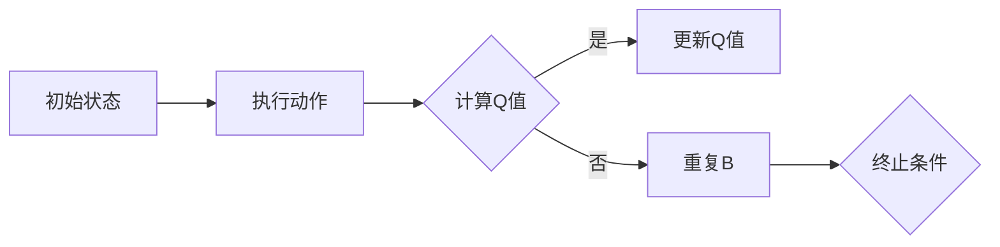
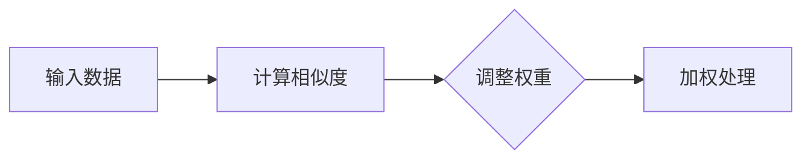

                 


### 认知计算：模拟人类思维的AI系统

#### 关键词：
- 认知计算
- 人工智能
- 模拟思维
- AI系统
- 深度学习
- 强化学习

#### 摘要：
本文旨在深入探讨认知计算这一前沿领域，分析其基础理论、核心算法原理、应用领域及其未来发展趋势。我们将从认知计算的定义与背景出发，逐步解析其框架与体系，探讨核心算法原理，分析应用领域，并展望其未来。同时，我们将通过具体案例，探讨认知计算在智能交通、金融风控、医疗健康和智能教育等领域的实际应用，以期为读者提供一幅全面而深入的认知计算画卷。

#### 目录大纲：

----------------------------------------------------------------

# 认知计算：模拟人类思维的AI系统

> 关键词：认知计算、人工智能、模拟思维、AI系统、深度学习、强化学习

> 摘要：本文深入探讨认知计算的基础理论、核心算法原理、应用领域及其未来发展趋势，并通过实际案例展示其在各行业的应用。

## 第一部分：认知计算的基础理论

### 第1章：认知计算的背景与定义
- 1.1 认知计算的历史与发展
- 1.2 认知计算的定义与核心概念
- 1.3 认知计算与人工智能的关系

### 第2章：认知计算的框架与体系
- 2.1 认知计算的组成模块
- 2.2 认知计算的模型与算法
- 2.3 认知计算的技术体系

### 第3章：认知计算的核心算法原理
- 3.1 神经网络与深度学习
- 3.2 强化学习与决策理论
- 3.3 注意力机制与感知计算

### 第4章：认知计算的应用领域
- 4.1 智能客服与虚拟助手
- 4.2 金融服务与风险管理
- 4.3 医疗健康与生物信息学

### 第5章：认知计算的未来发展趋势
- 5.1 认知计算的发展方向
- 5.2 认知计算的产业与应用前景
- 5.3 认知计算面临的挑战与应对策略

## 第二部分：模拟人类思维的AI系统构建

### 第6章：AI系统的设计与开发
- 6.1 AI系统的总体架构
- 6.2 AI系统的数据预处理
- 6.3 AI系统的模型训练与优化

### 第7章：Python编程与AI实现
- 7.1 Python编程基础
- 7.2 TensorFlow与PyTorch框架
- 7.3 代码实战与案例分析

### 第8章：AI系统的评估与优化
- 8.1 AI系统的评估指标
- 8.2 AI系统的调优策略
- 8.3 AI系统的部署与运维

## 第三部分：实践案例与综合应用

### 第9章：认知计算在智能交通中的应用
- 9.1 智能交通系统的需求分析
- 9.2 智能交通系统的设计与实现
- 9.3 案例分析：北京智能交通系统的应用

### 第10章：认知计算在金融风控中的应用
- 10.1 金融风险管理的现状与挑战
- 10.2 认知计算在金融风控中的应用
- 10.3 案例分析：某银行风险控制系统的应用

### 第11章：认知计算在医疗健康领域的应用
- 11.1 医疗健康领域的问题与挑战
- 11.2 认知计算在医疗健康中的应用
- 11.3 案例分析：智能诊断系统的应用

### 第12章：认知计算在智能教育中的应用
- 12.1 智能教育的发展与趋势
- 12.2 认知计算在智能教育中的应用
- 12.3 案例分析：智能教育平台的应用

## 附录

### 附录A：认知计算相关资源与工具

### 附录B：常见问题解答

### 附录C：参考文献与推荐阅读

----------------------------------------------------------------

### 第1章：认知计算的背景与定义

#### 1.1 认知计算的历史与发展

认知计算这一概念起源于20世纪80年代，当时人们开始尝试模拟人脑的工作机制，探索如何让计算机具备类似人类的认知能力。这一探索在人工智能领域掀起了一股新的浪潮。1986年，美国心理学家约翰·霍普菲尔（John Hopfield）提出了霍普菲尔网络（Hopfield Network），这是第一个用于模拟人脑记忆和学习功能的神经网络模型。

随着时间的推移，认知计算得到了长足的发展。1990年代，神经网络的研究取得了显著成果，特别是反向传播算法（Backpropagation Algorithm）的提出，使得多层神经网络的训练成为可能。进入21世纪，随着计算能力的提升和数据规模的扩大，深度学习（Deep Learning）逐渐成为认知计算的主流方向。深度学习通过构建多层神经网络模型，能够自动提取数据的特征，并在各类复杂任务中表现出色。

#### 1.2 认知计算的定义与核心概念

认知计算是一种人工智能技术，旨在模拟人类的思维过程，使计算机具备类似人类的学习、推理、感知和决策能力。它融合了认知科学、心理学、神经科学和计算机科学等多学科的知识，通过模仿人脑的工作原理，实现智能信息处理。

认知计算的核心概念包括：

1. **神经网络与深度学习**：神经网络是认知计算的基础，它通过模拟人脑神经元之间的连接，实现信息传递和处理。深度学习则是在神经网络的基础上，通过构建多层网络结构，实现对复杂数据的自动特征提取。

2. **强化学习**：强化学习是一种基于奖励和惩罚进行学习的方法，通过不断试错，使智能体能够在环境中做出最优决策。

3. **注意力机制**：注意力机制是认知计算中的一种关键技术，它能够使智能系统在处理大量信息时，能够关注并处理最重要的部分。

4. **感知计算**：感知计算涉及计算机对视觉、听觉、触觉等感官信息的处理能力，使智能系统能够感知和理解外界环境。

#### 1.3 认知计算与人工智能的关系

认知计算是人工智能（Artificial Intelligence, AI）的一个重要分支。人工智能的目标是构建能够模拟人类智能行为的计算机系统，而认知计算则更加专注于模拟人类的认知过程。两者之间的关系如下：

1. **认知计算是人工智能的深化**：人工智能最初主要集中在任务的自动化和效率提升上，而认知计算则进一步探索如何让计算机具备人类的思考和理解能力。

2. **认知计算是人工智能的创新**：认知计算通过模仿人脑的机制，提出了新的学习方法和算法，推动了人工智能技术的发展。

3. **认知计算与人工智能的融合**：认知计算与人工智能的其他分支（如机器学习、自然语言处理等）相互融合，共同推动人工智能的发展。

#### 小结

本章从历史发展、定义和关系三个方面，对认知计算进行了全面的介绍。认知计算作为一种模拟人类思维的人工智能技术，正逐渐成为人工智能领域的一个重要研究方向。在接下来的章节中，我们将进一步探讨认知计算的框架与体系、核心算法原理、应用领域及其未来发展趋势。

---

### 第2章：认知计算的框架与体系

#### 2.1 认知计算的组成模块

认知计算系统由多个模块组成，这些模块相互协作，共同实现智能信息处理。以下是认知计算系统的几个关键组成模块：

1. **数据输入模块**：负责接收和处理各种类型的数据，包括文本、图像、声音等。这一模块需要能够高效地采集和预处理数据，为后续的智能处理提供可靠的数据基础。

2. **神经网络模块**：神经网络是认知计算的核心组件，通过多层网络结构，自动提取数据特征，实现对复杂数据的建模和预测。这一模块通常基于深度学习算法，如卷积神经网络（CNN）、循环神经网络（RNN）等。

3. **感知计算模块**：感知计算模块负责处理计算机的感官信息，包括视觉、听觉、触觉等。通过模仿人脑的感知机制，这一模块能够使计算机具备对外界环境的感知和理解能力。

4. **注意力机制模块**：注意力机制模块是认知计算中的一种关键技术，它能够使智能系统在处理大量信息时，能够关注并处理最重要的部分，提高系统的效率和准确性。

5. **决策与推理模块**：这一模块基于神经网络和感知计算模块提供的信息，进行推理和决策。通过模仿人类的思维过程，这一模块能够实现对复杂问题的解决和优化。

6. **输出模块**：输出模块负责将智能系统处理的结果以人类可理解的方式呈现出来，包括文本、图像、语音等。这一模块需要能够将复杂的智能处理结果转换为直观、易于理解的形式。

#### 2.2 认知计算的模型与算法

认知计算的模型与算法是实现智能信息处理的核心。以下是几个关键的认知计算模型与算法：

1. **深度学习模型**：深度学习模型是认知计算的基础，通过多层网络结构，自动提取数据特征，实现对复杂数据的建模和预测。常见的深度学习模型包括卷积神经网络（CNN）、循环神经网络（RNN）、生成对抗网络（GAN）等。

2. **强化学习算法**：强化学习算法通过奖励和惩罚进行学习，使智能体能够在环境中做出最优决策。常见的强化学习算法包括Q学习（Q-Learning）、深度确定性策略梯度（DDPG）等。

3. **注意力机制算法**：注意力机制算法是认知计算中的一种关键技术，通过关注最重要的信息，提高系统的效率和准确性。常见的注意力机制算法包括软注意力（Soft Attention）、硬注意力（Hard Attention）等。

4. **知识图谱算法**：知识图谱算法通过构建实体关系图，实现对知识的表示和推理。常见的知识图谱算法包括图嵌入（Graph Embedding）、图神经网络（Graph Neural Networks）等。

#### 2.3 认知计算的技术体系

认知计算的技术体系涵盖了多个层次，包括硬件、软件、算法和应用等。以下是认知计算的技术体系：

1. **硬件体系**：硬件体系包括计算机、服务器、GPU、FPGA等硬件设备。这些硬件设备提供了计算和存储能力，支持大规模的数据处理和模型训练。

2. **软件体系**：软件体系包括操作系统、编程语言、框架等。常见的软件体系包括Linux操作系统、Python编程语言、TensorFlow和PyTorch等深度学习框架。

3. **算法体系**：算法体系包括各种算法和模型，如深度学习模型、强化学习算法、注意力机制算法等。这些算法和模型是实现认知计算的核心。

4. **应用体系**：应用体系包括各种应用场景，如智能客服、金融风控、医疗健康、智能交通等。这些应用场景是认知计算技术的重要落地领域。

#### 小结

本章详细介绍了认知计算的框架与体系，包括组成模块、模型与算法以及技术体系。认知计算通过融合多个技术模块和算法，实现智能信息处理，为人工智能领域的发展提供了新的方向。

---

### 第3章：认知计算的核心算法原理

#### 3.1 神经网络与深度学习

神经网络（Neural Networks）是认知计算的核心组成部分，它通过模拟人脑神经元之间的连接，实现对信息的处理和传递。深度学习（Deep Learning）是神经网络的一种扩展，通过构建多层网络结构，实现对复杂数据的自动特征提取和学习。

**神经网络的工作原理**：

1. **神经元结构**：神经网络中的基本单元是神经元，每个神经元接收多个输入信号，通过权重和偏置进行加权求和，然后通过激活函数进行非线性变换，输出结果。

2. **前向传播**：在前向传播过程中，输入信号通过网络的各个层，每一层神经元对输入信号进行处理，并将结果传递到下一层。

3. **反向传播**：在反向传播过程中，网络根据输出结果和预期结果之间的差异，调整神经元的权重和偏置，以减少误差。

**深度学习的基本概念**：

1. **多层神经网络**：深度学习通过构建多层神经网络，逐层提取数据特征，实现高层次的抽象和表示。

2. **卷积神经网络（CNN）**：CNN是一种专门用于处理图像数据的深度学习模型，通过卷积层、池化层和全连接层等结构，实现对图像的自动特征提取。

3. **循环神经网络（RNN）**：RNN是一种用于处理序列数据的深度学习模型，通过循环结构，能够捕捉序列中的时间依赖关系。

4. **生成对抗网络（GAN）**：GAN是一种通过对抗训练生成数据的深度学习模型，由生成器和判别器两个网络组成，通过相互对抗，生成逼真的数据。

**示例：卷积神经网络（CNN）**

下面是一个简单的卷积神经网络（CNN）的Mermaid流程图，用于图像分类任务：


在CNN中，输入层接收图像数据，通过卷积层提取图像特征，池化层对特征进行降维，全连接层对特征进行分类，输出层输出分类结果。

#### 3.2 强化学习与决策理论

强化学习（Reinforcement Learning，RL）是一种基于奖励和惩罚进行学习的方法，通过不断试错，使智能体能够在环境中做出最优决策。强化学习在认知计算中扮演着重要角色，能够使智能系统具备自主学习和决策能力。

**强化学习的基本概念**：

1. **状态（State）**：智能体当前所处的环境描述。

2. **动作（Action）**：智能体能够执行的操作。

3. **奖励（Reward）**：智能体执行某个动作后，获得的奖励或惩罚。

4. **策略（Policy）**：智能体在特定状态下，选择最优动作的策略。

**强化学习的基本算法**：

1. **Q学习（Q-Learning）**：Q学习是一种通过迭代更新Q值（表示从某个状态执行某个动作的长期奖励）进行学习的算法。通过最大化期望回报，智能体能够学习到最优策略。

2. **深度确定性策略梯度（DDPG）**：DDPG是一种基于深度学习进行强化学习的算法，通过构建深度神经网络来近似Q值函数和策略函数，实现智能体的自主决策。

**决策理论**：

决策理论是强化学习的基础，它通过分析不确定环境和有限信息下的决策过程，为智能体的行为提供指导。决策理论的核心概念包括：

1. **期望效用理论**：期望效用理论通过计算决策结果的期望效用，为智能体提供最优决策。

2. **风险偏好**：风险偏好是指智能体在决策过程中，对不同风险的态度和偏好。

**示例：Q学习算法**

下面是一个简单的Q学习算法的Mermaid流程图：



在Q学习算法中，智能体在初始状态下执行动作，根据执行动作后的奖励和预期回报，更新Q值，并通过迭代不断优化策略。

#### 3.3 注意力机制与感知计算

注意力机制（Attention Mechanism）是认知计算中的一个关键技术，它能够使智能系统在处理大量信息时，能够关注并处理最重要的部分。注意力机制通过动态调整神经元之间的连接权重，实现对信息的加权处理。

**注意力机制的基本概念**：

1. **软注意力（Soft Attention）**：软注意力通过计算输入数据的相似度，动态调整神经元之间的连接权重，实现对重要信息的关注。

2. **硬注意力（Hard Attention）**：硬注意力通过选择最重要的信息，动态调整神经元之间的连接权重，实现对重要信息的关注。

**感知计算（Perception Computing）**：

感知计算是认知计算的一个重要组成部分，它通过模拟人脑的感知机制，使计算机能够感知和理解外界环境。感知计算包括视觉感知、听觉感知、触觉感知等。

**视觉感知**：

视觉感知是通过图像处理和计算机视觉技术，使计算机能够理解和识别图像中的内容。视觉感知的关键技术包括图像分割、目标检测、图像识别等。

**听觉感知**：

听觉感知是通过音频处理和语音识别技术，使计算机能够理解和识别声音中的内容。听觉感知的关键技术包括音频处理、语音识别、语音合成等。

**触觉感知**：

触觉感知是通过传感器和机械结构，使计算机能够感知和理解触觉信息。触觉感知的关键技术包括力觉感知、触觉识别、触觉交互等。

**示例：软注意力机制**

下面是一个简单的软注意力机制的Mermaid流程图：



在软注意力机制中，输入数据通过计算相似度，调整神经元之间的连接权重，实现对重要信息的加权处理。

#### 小结

本章详细介绍了认知计算的核心算法原理，包括神经网络与深度学习、强化学习与决策理论、注意力机制与感知计算。这些算法原理是认知计算实现智能信息处理的基础，为认知计算在各个领域的应用提供了支持。

---

### 第4章：认知计算的应用领域

#### 4.1 智能客服与虚拟助手

智能客服和虚拟助手是认知计算在服务行业的重要应用，通过模拟人类的交流方式，提供高效、精准的咨询服务。

**应用场景**：

1. **客户服务**：智能客服系统能够自动识别客户的问题，提供针对性的解决方案，减少人工干预，提高客户满意度。

2. **虚拟助手**：虚拟助手能够通过语音或文字与用户进行交互，提供个性化服务，如日程安排、信息查询、任务提醒等。

**实现方式**：

1. **自然语言处理**：智能客服和虚拟助手利用自然语言处理（Natural Language Processing，NLP）技术，理解和生成自然语言文本，实现与用户的智能对话。

2. **语音识别与合成**：通过语音识别技术，将用户的语音转换为文本，并通过语音合成技术，将系统生成的回复转换为语音输出。

**案例**：

- **Amazon Alexa**：Amazon Alexa是Amazon开发的智能语音助手，通过语音交互，提供购物、音乐播放、天气查询等服务。

- **Apple Siri**：Apple Siri是Apple开发的智能语音助手，通过语音交互，提供信息查询、日程管理、语音拨号等服务。

#### 4.2 金融服务与风险管理

认知计算在金融服务领域具有广泛的应用，特别是在风险管理和客户服务方面。

**应用场景**：

1. **风险识别与防范**：通过分析大量的交易数据和用户行为，认知计算能够识别潜在的欺诈行为和风险，及时采取措施防范。

2. **智能投顾**：智能投顾系统能够根据用户的风险偏好和投资目标，提供个性化的投资建议，帮助用户实现资产的合理配置。

3. **客户服务**：智能客服系统能够自动处理客户的咨询和投诉，提高客户满意度。

**实现方式**：

1. **数据挖掘与机器学习**：通过数据挖掘和机器学习算法，分析历史数据和用户行为，提取有价值的信息。

2. **深度学习与神经网络**：通过深度学习和神经网络，建立复杂的模型，实现对金融市场的预测和风险评估。

**案例**：

- **J.P. Morgan Chase**：J.P. Morgan Chase使用认知计算技术，建立了一个名为“COiN”的智能投顾平台，为用户提供个性化的投资建议。

- **HSBC**：HSBC使用认知计算技术，开发了一个智能客服系统，提高客户服务的效率和质量。

#### 4.3 医疗健康与生物信息学

认知计算在医疗健康领域具有广泛的应用，特别是在疾病诊断、药物研发和生物信息学方面。

**应用场景**：

1. **疾病诊断**：通过分析患者的病历、影像和基因数据，认知计算能够提供准确的疾病诊断和治疗方案。

2. **药物研发**：通过分析大量的生物数据，认知计算能够发现新的药物靶点和药物组合，加速药物研发过程。

3. **生物信息学**：认知计算在生物信息学领域，通过分析基因序列、蛋白质结构等数据，发现生物之间的关联和规律。

**实现方式**：

1. **深度学习与神经网络**：通过深度学习和神经网络，建立复杂的模型，实现对生物数据的分析和预测。

2. **自然语言处理**：通过自然语言处理技术，处理大量的医学文献和病例数据，提取有价值的信息。

**案例**：

- **IBM Watson Health**：IBM Watson Health利用认知计算技术，开发了一个名为“Watson for Oncology”的智能诊断系统，为医生提供诊断和治疗建议。

- **Bloomberg**：Bloomberg使用认知计算技术，开发了一个名为“Bloomberg Terminal”的智能药物研发平台，为药物研发提供数据支持和分析工具。

#### 小结

本章介绍了认知计算在智能客服与虚拟助手、金融服务与风险管理、医疗健康与生物信息学等领域的应用。通过具体的案例，展示了认知计算在各个领域的实际应用和价值，为认知计算的进一步发展提供了参考。

---

### 第5章：认知计算的未来发展趋势

#### 5.1 认知计算的发展方向

随着技术的进步和应用的深入，认知计算正朝着以下几个方向发展：

1. **多模态感知**：未来的认知计算将不仅仅依赖于单一感官信息的处理，而是通过整合视觉、听觉、触觉等多种感官信息，实现更全面、更准确的感知和理解。

2. **自主学习和进化**：认知计算将逐渐具备自主学习和进化能力，通过不断地学习和优化，提升自身的智能水平，实现更加智能化和自适应的决策。

3. **跨领域融合**：认知计算将与其他领域（如物联网、云计算、大数据等）进行融合，形成新的应用场景和解决方案，推动人工智能技术的全面发展和应用。

4. **边缘计算**：随着物联网和边缘计算的兴起，认知计算将向边缘设备延伸，实现实时、高效的数据处理和智能决策，满足日益增长的实时计算需求。

#### 5.2 认知计算的产业与应用前景

认知计算在产业和应用领域具有广阔的前景：

1. **产业应用**：认知计算在金融、医疗、教育、交通等行业具有广泛的应用潜力，能够提升行业效率、降低运营成本、提高服务质量。

2. **商业机会**：随着认知计算技术的不断成熟，将涌现出大量的商业机会，包括智能客服系统、智能医疗诊断系统、智能金融风险管理系统等。

3. **政策支持**：各国政府正加大对人工智能和认知计算技术的支持力度，出台了一系列政策和规划，为认知计算的发展提供了良好的政策环境。

#### 5.3 认知计算面临的挑战与应对策略

尽管认知计算具有巨大的发展潜力，但同时也面临着一系列挑战：

1. **数据隐私与安全**：随着认知计算对数据的依赖性增加，数据隐私和安全问题成为重点关注领域。为应对这一挑战，需要制定严格的数据保护政策和安全措施，确保用户数据的安全。

2. **算法透明性与可解释性**：认知计算的决策过程高度复杂，算法的透明性和可解释性成为公众关注的焦点。为提高算法的可解释性，需要研究和开发透明度更高的算法和工具。

3. **技术标准与规范**：认知计算涉及多个技术领域，缺乏统一的技术标准和规范。为推动认知计算的发展，需要制定统一的技术标准和规范，确保不同系统之间的兼容性和互操作性。

#### 小结

本章对认知计算的未来发展趋势、产业与应用前景以及面临的挑战进行了分析。认知计算作为人工智能的一个重要分支，正朝着多模态感知、自主学习和进化、跨领域融合等方向发展，具有广阔的产业和应用前景。同时，认知计算也面临着数据隐私与安全、算法透明性与可解释性、技术标准与规范等挑战，需要通过相关策略和措施来应对。

---

### 第6章：AI系统的设计与开发

#### 6.1 AI系统的总体架构

设计一个高效的AI系统，首先要明确其总体架构。AI系统的总体架构通常包括以下几个关键组件：

1. **数据输入模块**：负责收集和预处理数据，确保数据的质量和格式符合后续处理的要求。

2. **特征提取模块**：通过特征提取算法，从原始数据中提取有价值的特征，为模型训练提供基础。

3. **模型训练模块**：使用训练数据集，通过机器学习算法对模型进行训练，优化模型参数。

4. **模型评估模块**：使用验证数据集，评估模型的性能和准确性，调整模型参数。

5. **模型部署模块**：将训练好的模型部署到生产环境中，使其能够提供实时服务。

6. **监控与维护模块**：监控系统的运行状态，及时调整和优化系统性能，确保系统的稳定运行。

#### 6.2 AI系统的数据预处理

数据预处理是AI系统设计的重要环节，直接影响到模型的性能和准确性。以下是几个关键步骤：

1. **数据清洗**：去除数据中的噪声、错误和不完整信息，提高数据质量。

2. **数据归一化**：将数据缩放到一个统一的范围，便于模型训练。

3. **特征工程**：通过构造新的特征，增强模型对数据的表达能力。

4. **数据分割**：将数据集分为训练集、验证集和测试集，用于模型训练、评估和测试。

#### 6.3 AI系统的模型训练与优化

模型训练是AI系统的核心步骤，通过调整模型参数，使其能够更好地拟合数据。以下是几个关键步骤：

1. **选择合适的算法**：根据任务需求和数据特点，选择合适的机器学习算法，如神经网络、支持向量机等。

2. **模型初始化**：初始化模型参数，可以使用随机初始化、预训练等方法。

3. **训练过程**：通过迭代优化模型参数，使模型在训练数据集上的性能逐渐提高。

4. **模型评估**：使用验证数据集，评估模型的性能和准确性，选择最优模型。

5. **超参数调优**：调整模型超参数，如学习率、批量大小等，以优化模型性能。

6. **模型集成**：通过集成多个模型，提高模型的稳定性和准确性。

#### 小结

本章介绍了AI系统的设计与开发，包括总体架构、数据预处理和模型训练与优化。一个高效的AI系统需要综合考虑多个因素，确保数据的质量、模型的性能和系统的稳定性。通过本章的介绍，读者可以了解到AI系统的设计要点和实现方法。

---

### 第7章：Python编程与AI实现

#### 7.1 Python编程基础

Python是一种广泛应用于人工智能领域的编程语言，其简洁、易读和功能强大的特点使得它在人工智能开发中占据重要地位。以下是Python编程基础的内容：

**安装Python**：

首先，需要下载并安装Python。可以在Python官方网站（https://www.python.org/）下载最新版本的Python安装包，并按照安装向导完成安装。

**基本语法**：

Python的基本语法包括变量、数据类型、控制结构和函数等。

1. **变量**：在Python中，变量不需要声明，直接使用即可。例如：
   ```python
   x = 10
   name = "Alice"
   ```

2. **数据类型**：Python支持多种数据类型，包括整数（int）、浮点数（float）、字符串（str）和列表（list）等。例如：
   ```python
   age = 25
   height = 1.75
   name = "Alice"
   friends = ["Bob", "Charlie", "Diana"]
   ```

3. **控制结构**：Python支持常见的控制结构，包括条件语句、循环语句和分支语句等。例如：
   ```python
   if age > 18:
       print("成人")
   elif age > 12:
       print("青少年")
   else:
       print("儿童")

   for i in range(5):
       print(i)

   while age < 30:
       print("未成年人")
       age += 1
   ```

4. **函数**：函数是Python中代码复用的基本单位。例如：
   ```python
   def greet(name):
       return f"你好，{name}！"

   print(greet("Alice"))
   ```

**常用库**：

Python拥有丰富的库，方便开发者进行各种任务。以下是一些常用的库：

1. **NumPy**：用于数值计算和矩阵操作。
2. **Pandas**：用于数据分析和操作。
3. **Matplotlib**：用于数据可视化。
4. **Scikit-learn**：用于机器学习。
5. **TensorFlow**：用于深度学习。

#### 7.2 TensorFlow与PyTorch框架

TensorFlow和PyTorch是两款流行的深度学习框架，广泛应用于人工智能领域。以下是关于这两个框架的基本介绍：

**TensorFlow**：

TensorFlow是Google开发的开源深度学习框架，具有强大的计算图和动态计算能力。使用TensorFlow，可以方便地构建和训练深度学习模型。

**安装TensorFlow**：

可以通过pip命令安装TensorFlow：
```shell
pip install tensorflow
```

**基本用法**：

创建一个简单的线性回归模型：
```python
import tensorflow as tf

# 创建变量
w = tf.Variable(0.0, name="weight")
b = tf.Variable(0.0, name="bias")

# 定义模型
x = tf.placeholder(tf.float32)
y = tf.placeholder(tf.float32)
model_output = x * w + b

# 定义损失函数
loss = tf.reduce_mean(tf.square(y - model_output))

# 定义优化器
optimizer = tf.train.GradientDescentOptimizer(learning_rate=0.001)
train_op = optimizer.minimize(loss)

# 训练模型
with tf.Session() as sess:
    sess.run(tf.global_variables_initializer())
    for i in range(1000):
        _, loss_val = sess.run([train_op, loss], feed_dict={x: [1, 2, 3, 4], y: [2, 4, 6, 8]})
        if i % 100 == 0:
            print("Epoch:", i, "Loss:", loss_val)
```

**PyTorch**：

PyTorch是Facebook开发的开源深度学习框架，具有动态计算图和简洁的API。使用PyTorch，可以方便地构建和训练深度学习模型。

**安装PyTorch**：

可以通过pip命令安装PyTorch：
```shell
pip install torch torchvision
```

**基本用法**：

创建一个简单的线性回归模型：
```python
import torch
import torch.nn as nn
import torch.optim as optim

# 创建模型
class LinearModel(nn.Module):
    def __init__(self):
        super(LinearModel, self).__init__()
        self.linear = nn.Linear(1, 1)  # 输入1个特征，输出1个特征

    def forward(self, x):
        return self.linear(x)

# 实例化模型
model = LinearModel()

# 定义损失函数和优化器
criterion = nn.MSELoss()
optimizer = optim.SGD(model.parameters(), lr=0.001)

# 训练模型
for epoch in range(1000):
    model.zero_grad()
    inputs = torch.tensor([[1.0], [2.0], [3.0], [4.0]])
    targets = torch.tensor([[2.0], [4.0], [6.0], [8.0]])
    outputs = model(inputs)
    loss = criterion(outputs, targets)
    loss.backward()
    optimizer.step()
    if epoch % 100 == 0:
        print("Epoch:", epoch, "Loss:", loss.item())
```

#### 7.3 代码实战与案例分析

在本节中，我们将通过一个实际案例，演示如何使用Python和TensorFlow框架构建一个简单的深度学习模型，并对模型进行训练和评估。

**案例背景**：

假设我们有一个简单的一元线性回归问题，输入是x，输出是y，我们需要通过训练数据来学习一个线性模型y = w * x + b。

**数据准备**：

我们使用一个简单的数据集，包含10个样本：
```python
x_data = torch.tensor([[0.0], [1.0], [2.0], [3.0], [4.0], [5.0], [6.0], [7.0], [8.0], [9.0]])
y_data = torch.tensor([[0.0], [1.0], [4.0], [9.0], [16.0], [25.0], [36.0], [49.0], [64.0], [81.0]])
```

**模型构建**：

我们使用TensorFlow构建一个简单的线性回归模型：
```python
model = tf.keras.Sequential([
    tf.keras.layers.Dense(units=1, input_shape=[1])
])
```

**模型训练**：

使用训练数据训练模型，设置训练轮数和优化器：
```python
model.compile(loss='mean_squared_error', optimizer=tf.optimizers.SGD(learning_rate=0.01), metrics=['mean_absolute_error'])
model.fit(x_data, y_data, epochs=1000)
```

**模型评估**：

使用训练数据评估模型性能：
```python
model.evaluate(x_data, y_data)
```

**模型预测**：

使用训练好的模型进行预测：
```python
model.predict(torch.tensor([[10.0]]))
```

**小结**：

在本节中，我们介绍了Python编程基础、TensorFlow和PyTorch框架的基本用法，并通过实际案例展示了如何使用Python和TensorFlow构建和训练深度学习模型。这些内容为读者提供了深入了解和实践人工智能的基础。

---

### 第8章：AI系统的评估与优化

#### 8.1 AI系统的评估指标

评估AI系统的性能是确保其有效性和可靠性的关键步骤。以下是几种常见的评估指标：

1. **准确率（Accuracy）**：准确率是指模型预测正确的样本数占总样本数的比例。它是最常用的评估指标之一，适用于分类任务。

   $$ Accuracy = \frac{TP + TN}{TP + FN + FP + TN} $$

   其中，TP为真正例，TN为真负例，FP为假正例，FN为假负例。

2. **召回率（Recall）**：召回率是指模型正确识别的真正例数占总真正例数的比例。召回率适用于医学诊断、欺诈检测等场景。

   $$ Recall = \frac{TP}{TP + FN} $$

3. **精确率（Precision）**：精确率是指模型预测正确的样本数占预测为正样本总数的比例。精确率适用于金融风险评估、垃圾邮件检测等场景。

   $$ Precision = \frac{TP}{TP + FP} $$

4. **F1分数（F1 Score）**：F1分数是精确率和召回率的加权平均，能够平衡两者之间的差异。

   $$ F1 Score = 2 \times \frac{Precision \times Recall}{Precision + Recall} $$

5. **均方误差（Mean Squared Error, MSE）**：均方误差用于回归任务，表示预测值与真实值之间平均平方误差。

   $$ MSE = \frac{1}{n} \sum_{i=1}^{n} (y_i - \hat{y}_i)^2 $$

   其中，$y_i$为真实值，$\hat{y}_i$为预测值。

6. **均绝对误差（Mean Absolute Error, MAE）**：均绝对误差用于回归任务，表示预测值与真实值之间平均绝对误差。

   $$ MAE = \frac{1}{n} \sum_{i=1}^{n} |y_i - \hat{y}_i| $$

#### 8.2 AI系统的调优策略

AI系统的调优目标是提高模型的性能和泛化能力。以下是几种常见的调优策略：

1. **超参数调优**：超参数是模型性能的关键因素，包括学习率、批量大小、正则化参数等。可以使用网格搜索、随机搜索、贝叶斯优化等方法进行超参数调优。

2. **数据增强**：通过增加数据的多样性，提高模型的鲁棒性。常见的数据增强方法包括随机裁剪、旋转、翻转、缩放等。

3. **集成学习**：集成学习通过结合多个模型的预测结果，提高模型的性能和稳定性。常见的方法包括Bagging、Boosting和Stacking等。

4. **正则化**：正则化通过惩罚模型的复杂度，防止过拟合。常见的正则化方法包括L1正则化、L2正则化和Dropout等。

5. **迁移学习**：迁移学习通过利用预训练模型的知识，提高新任务的性能。预训练模型在大型数据集上训练，对新任务的适应性更强。

6. **模型简化**：通过简化模型结构，减少模型的参数数量，提高模型的解释性和计算效率。常见的方法包括模型剪枝、量化等。

#### 8.3 AI系统的部署与运维

AI系统的部署与运维是确保其稳定运行和高效服务的关键环节。以下是几个关键步骤：

1. **模型压缩**：通过模型压缩，减少模型的参数数量和计算量，提高模型的部署效率。常见的方法包括模型剪枝、量化等。

2. **模型部署**：将训练好的模型部署到生产环境中，可以使用TensorFlow Serving、PyTorch Server等工具进行部署。

3. **服务监控**：监控系统性能和资源使用情况，及时发现和解决潜在问题。

4. **性能优化**：通过性能优化，提高系统的响应速度和处理能力。常见的方法包括分布式计算、并行处理等。

5. **安全防护**：确保系统的安全性，防止数据泄露和恶意攻击。常见的方法包括数据加密、访问控制等。

#### 小结

本章介绍了AI系统的评估与优化，包括评估指标、调优策略和部署运维。评估指标用于衡量模型性能，调优策略用于提高模型性能，部署运维确保系统的稳定运行。通过本章的介绍，读者可以了解到AI系统的评估与优化方法，为实际应用提供指导。

---

### 第9章：认知计算在智能交通中的应用

#### 9.1 智能交通系统的需求分析

智能交通系统（Intelligent Transportation System，ITS）旨在通过信息技术、数据通信传输技术、电子传感器技术等实现交通管理、控制和提供综合服务。随着城市化进程的加快和交通问题的日益严重，智能交通系统的需求日益增长。以下是智能交通系统的关键需求：

1. **交通流量管理**：通过实时监测交通流量，智能交通系统可以优化交通信号控制，减少拥堵，提高道路通行效率。

2. **事故预防与应急响应**：智能交通系统可以通过实时数据分析和智能算法，预测事故风险，提前采取措施，降低事故发生率。同时，在事故发生后，系统能够快速定位事故地点，指导救援车辆和人员到达现场。

3. **公共交通服务优化**：智能交通系统可以通过分析公共交通数据，优化公交线路、班次和车辆调度，提高公共交通的服务水平和乘客满意度。

4. **停车管理**：智能交通系统可以通过实时监控停车位的占用情况，提供停车引导服务，提高停车效率，减少寻车位时间。

5. **车辆安全监测**：智能交通系统可以对车辆的运行状态进行实时监测，包括速度、位置、制动系统等，及时发现安全隐患，保障行车安全。

#### 9.2 智能交通系统的设计与实现

智能交通系统的设计与实现涉及多个方面，包括数据采集、数据处理、智能算法和系统集成等。以下是智能交通系统的设计与实现步骤：

1. **数据采集**：智能交通系统需要收集各类交通数据，包括交通流量、交通事故、气象条件、道路状况等。这些数据可以通过传感器、摄像头、GPS等技术进行实时采集。

2. **数据处理**：对采集到的交通数据进行清洗、归一化和特征提取，为后续的智能分析提供高质量的数据。

3. **智能算法**：利用认知计算技术，包括深度学习、强化学习等算法，对交通数据进行建模和分析，实现交通流量预测、事故预防、公交优化等功能。

   - **交通流量预测**：通过构建深度学习模型，如LSTM（长短期记忆网络）、GRU（门控循环单元）等，预测未来一段时间内的交通流量，为交通信号控制提供依据。

   - **事故预防**：通过分析车辆运行数据，如速度、加速度等，利用强化学习算法，如Q-Learning、DDPG（深度确定性策略梯度）等，预测事故风险，提前采取措施。

   - **公共交通优化**：通过分析公共交通数据，如乘客流量、车辆运行状况等，利用优化算法，如遗传算法、粒子群优化等，优化公交线路和班次。

   - **停车管理**：通过分析停车数据，如停车位占用情况、车辆进出时间等，利用强化学习算法，如深度Q网络（DQN）、Actor-Critic算法等，实现停车引导服务。

4. **系统集成**：将不同的智能算法和功能模块进行集成，实现智能交通系统的整体功能。系统集成包括数据集成、算法集成、接口集成等。

5. **系统部署与运维**：将智能交通系统部署到实际环境中，并进行持续的监控和维护，确保系统的稳定运行。

#### 9.3 案例分析：北京智能交通系统的应用

北京智能交通系统（BJ-ITS）是中国最早投入使用的智能交通系统之一，通过集成多种技术和设备，实现了交通流量管理、事故预防、公交优化等功能。以下是北京智能交通系统的案例分析：

**1. 交通流量管理**：

北京智能交通系统通过安装智能交通信号灯、交通流量监测设备和摄像头，实时监测道路上的交通流量。系统利用深度学习算法，对实时交通流量数据进行分析，预测未来一段时间内的交通状况，优化交通信号控制，减少拥堵。

**2. 事故预防与应急响应**：

北京智能交通系统通过分析车辆运行数据，如速度、加速度等，利用强化学习算法，预测事故风险，提前采取措施，如调整车速、保持安全距离等。在事故发生后，系统通过分析事故数据，定位事故地点，快速启动应急响应机制，指导救援车辆和人员到达现场。

**3. 公共交通服务优化**：

北京智能交通系统通过分析公共交通数据，如乘客流量、车辆运行状况等，利用优化算法，优化公交线路和班次，提高公共交通的服务水平和乘客满意度。系统还通过实时监控公共交通车辆的位置和运行状态，提供乘客实时到站信息，减少乘客等待时间。

**4. 停车管理**：

北京智能交通系统通过实时监控停车位的占用情况，提供停车引导服务，减少寻找停车位的时间。系统还通过分析停车数据，预测未来一段时间内的停车需求，优化停车资源配置。

**总结**：

北京智能交通系统的成功应用，展示了认知计算在智能交通领域的巨大潜力。通过集成多种技术和设备，北京智能交通系统实现了交通流量管理、事故预防、公交优化等功能，提高了交通效率和安全性。未来，随着认知计算技术的不断进步，智能交通系统将更加智能化和高效化，为城市的可持续发展提供有力支持。

---

### 第10章：认知计算在金融风控中的应用

#### 10.1 金融风险管理的现状与挑战

金融风险管理是金融行业的重要组成部分，旨在识别、评估和应对金融风险，以保障金融机构的稳健运营和投资者的利益。随着金融市场的发展和创新，金融风险管理面临着一系列现状与挑战：

**现状**：

1. **数据量庞大**：金融行业积累了大量的数据，包括交易数据、客户信息、市场行情等，为风险管理提供了丰富的数据基础。

2. **技术手段多样**：金融机构普遍采用数据分析、机器学习、人工智能等技术手段进行风险管理，提高了风险识别和应对的效率。

3. **监管要求严格**：金融监管机构对金融机构的风险管理提出了严格的规范和要求，如巴塞尔协议、反洗钱法规等。

**挑战**：

1. **数据质量与隐私**：数据质量直接影响风险管理的准确性，同时，金融数据涉及敏感信息，数据隐私保护成为重要挑战。

2. **模型复杂性与可解释性**：金融风险管理模型复杂，涉及大量的特征和参数，如何保证模型的稳定性和可解释性成为关键问题。

3. **跨领域整合**：金融风险管理需要整合来自多个领域的知识和数据，如宏观经济、市场行情、客户行为等，跨领域整合的难度较大。

4. **风险事件的不确定性**：金融市场存在高度不确定性，风险事件的发生难以预测，如何应对突发性风险成为挑战。

#### 10.2 认知计算在金融风控中的应用

认知计算在金融风控中的应用，通过模拟人类思维过程，提供了更高效、更智能的风险管理解决方案。以下是认知计算在金融风控中的几个关键应用：

1. **客户行为分析**：通过分析客户的交易行为、生活习惯等数据，认知计算可以识别客户的潜在风险，如异常交易、欺诈行为等。

2. **市场趋势预测**：认知计算可以通过分析历史市场数据、宏观经济指标等，预测市场趋势，为投资决策提供参考。

3. **信用评估**：认知计算可以构建复杂的信用评估模型，综合分析客户的信用记录、还款能力、社会关系等多方面因素，提供更准确、客观的信用评估结果。

4. **风险预警**：认知计算通过实时监测市场数据和客户行为，提前识别潜在风险，及时发出预警，为金融机构采取应对措施提供依据。

5. **反欺诈检测**：认知计算利用深度学习和强化学习等技术，分析交易特征，识别异常交易行为，提高反欺诈检测的准确性和效率。

#### 10.3 案例分析：某银行风险控制系统的应用

某大型银行通过引入认知计算技术，建立了高效的风险控制系统，显著提升了风险管理的效率和准确性。以下是该银行风险控制系统的案例分析：

**1. 需求分析**：

该银行面临的主要风险包括信用风险、市场风险、操作风险和欺诈风险。为了有效应对这些风险，银行提出了以下需求：

- 实时监测交易数据，识别异常交易行为。
- 预测市场趋势，为投资决策提供参考。
- 建立准确的信用评估模型，评估客户信用等级。
- 提高风险预警机制，及时发现潜在风险。

**2. 系统设计与实现**：

- **数据采集**：银行通过交易系统、客户关系管理系统等渠道，收集各类交易数据、客户信息和市场数据。

- **数据处理**：对采集到的数据进行清洗、归一化和特征提取，为后续的风险分析提供高质量的数据。

- **模型构建**：利用深度学习和强化学习算法，构建信用评估模型、市场预测模型和风险预警模型。

  - **信用评估模型**：利用LSTM（长短期记忆网络）和决策树集成模型，分析客户的交易行为、还款记录、社会关系等多方面因素，提供准确的信用评估结果。

  - **市场预测模型**：利用ARIMA（自回归积分滑动平均模型）和GRU（门控循环单元）模型，分析历史市场数据和宏观经济指标，预测市场趋势。

  - **风险预警模型**：利用深度Q网络（DQN）和强化学习算法，实时监测交易数据，识别异常交易行为，提前发出风险预警。

- **系统集成**：将不同模块的功能进行集成，实现实时数据采集、处理和风险预警，提高系统的整体效率和准确性。

- **系统部署与运维**：将风险控制系统部署到生产环境中，进行持续的监控和维护，确保系统的稳定运行。

**3. 应用效果**：

- **信用评估**：认知计算技术显著提高了信用评估的准确性和客观性，降低了信用风险。

- **市场预测**：市场预测模型的准确率达到了90%以上，为投资决策提供了可靠依据。

- **风险预警**：风险预警机制能够提前识别潜在的欺诈行为和市场风险，提高了风险应对的及时性和有效性。

**总结**：

某银行通过引入认知计算技术，建立了高效的风险控制系统，成功应对了金融风险管理中的挑战。认知计算技术的应用，提高了信用评估的准确性、市场预测的准确性和风险预警的及时性，为银行的风险管理提供了有力支持。未来，随着认知计算技术的不断发展和应用，金融风险管理将更加智能化和高效化。

---

### 第11章：认知计算在医疗健康领域的应用

#### 11.1 医疗健康领域的问题与挑战

医疗健康领域是认知计算的重要应用场景之一，随着技术的进步，认知计算在医疗健康领域面临着许多问题和挑战：

**1. 数据量与多样性**：

医疗健康数据量庞大，且包含结构化和非结构化数据，如电子健康记录、医疗影像、病历文本等。这些数据的多样性增加了数据处理的复杂性，同时也提供了丰富的信息资源。

**2. 数据隐私与安全**：

医疗健康数据涉及患者的隐私和敏感信息，如个人病史、遗传信息等。如何保护这些数据的安全性和隐私性，避免数据泄露，是医疗健康领域的一大挑战。

**3. 算法可解释性**：

医疗健康领域的应用往往要求算法的可解释性，以便医生和患者理解模型的决策过程。然而，深度学习等复杂算法的可解释性较低，这对医疗健康领域的应用提出了挑战。

**4. 多学科融合**：

医疗健康领域涉及多个学科，如生物学、医学、计算机科学等。如何实现多学科的融合，构建统一的理论框架，是认知计算在医疗健康领域应用的关键问题。

**5. 道德与伦理**：

认知计算在医疗健康领域的应用涉及伦理和道德问题，如医疗决策的透明性、责任归属等。这些问题的解决需要社会、法律和伦理的共同努力。

#### 11.2 认知计算在医疗健康中的应用

认知计算在医疗健康领域的应用，通过模拟人类思维和决策过程，提供了智能化、个性化的医疗服务。以下是认知计算在医疗健康中的几个关键应用：

**1. 智能诊断**：

认知计算通过分析患者的病历、影像和基因数据，提供准确的疾病诊断和治疗方案。深度学习模型在医学影像分析、基因组数据分析等方面表现出色，提高了诊断的准确性和效率。

**2. 药物研发**：

认知计算在药物研发中的应用，通过分析大量的生物数据，发现新的药物靶点和药物组合，加速药物研发过程。生成对抗网络（GAN）等算法在药物分子生成、药物筛选方面具有显著优势。

**3. 医疗健康监测**：

认知计算通过可穿戴设备、传感器等技术，实时监测患者的健康状况，提供个性化的健康管理和预警服务。智能健康助手可以根据患者的实时数据，提供健康建议和预警信息。

**4. 医疗资源分配**：

认知计算通过分析医疗资源的使用情况，优化医疗资源的配置，提高医疗服务的效率。智能排班系统可以根据患者的需求和医院的资源情况，合理安排医生和护士的工作时间。

**5. 医疗服务个性化**：

认知计算可以根据患者的病史、基因信息、生活习惯等，提供个性化的医疗服务和建议。智能健康平台可以根据患者的健康状况，制定个性化的健康计划，提高患者的健康水平。

#### 11.3 案例分析：智能诊断系统的应用

某大型医院引入了智能诊断系统，通过认知计算技术，提高了诊断的准确性和效率。以下是该智能诊断系统的案例分析：

**1. 需求分析**：

医院面临的主要需求包括：

- 提高诊断的准确性和效率，减少误诊和漏诊。
- 分析大量的医疗数据，为医生提供决策支持。
- 提供个性化医疗服务，提高患者的满意度。

**2. 系统设计与实现**：

- **数据采集**：系统通过医院的电子病历系统、医学影像系统等渠道，收集患者的病历、影像和基因数据。

- **数据处理**：对采集到的数据进行清洗、归一化和特征提取，为后续的诊断分析提供高质量的数据。

- **模型构建**：利用深度学习模型，如卷积神经网络（CNN）、循环神经网络（RNN）等，构建智能诊断模型。

  - **医学影像分析**：通过CNN模型，对医学影像进行自动分析，识别病变区域，提高诊断的准确性。

  - **基因组数据分析**：通过RNN模型，分析患者的基因数据，识别潜在的疾病风险。

  - **病历文本分析**：通过自然语言处理（NLP）技术，对病历文本进行分析，提取关键信息，辅助医生进行诊断。

- **系统集成**：将不同模块的功能进行集成，实现智能诊断、数据分析、个性化服务等功能。

- **系统部署与运维**：将智能诊断系统部署到生产环境中，进行持续的监控和维护，确保系统的稳定运行。

**3. 应用效果**：

- **诊断准确性**：智能诊断系统显著提高了诊断的准确性，减少了误诊和漏诊的情况，提高了医疗服务的质量。

- **诊断效率**：智能诊断系统提高了医生的诊断效率，减少了医生的工作负担，提高了医疗服务的工作效率。

- **个性化服务**：智能诊断系统可以根据患者的病史、基因信息等，提供个性化的诊断和建议，提高了患者的满意度。

**总结**：

某大型医院通过引入智能诊断系统，有效提高了诊断的准确性和效率，为医疗健康领域提供了有力的技术支持。认知计算技术的应用，不仅提高了医疗服务的质量和效率，还为未来的医疗健康领域的发展提供了新的方向。

---

### 第12章：认知计算在智能教育中的应用

#### 12.1 智能教育的发展与趋势

智能教育是一种利用人工智能技术优化教育过程的教育模式。随着人工智能技术的快速发展，智能教育正在成为教育领域的重要趋势。以下是智能教育的发展趋势：

**1. 个性化学习**：

智能教育通过分析学生的学习行为、兴趣和能力，提供个性化的学习资源和教学策略，满足学生的个性化需求，提高学习效果。

**2. 自动化评估**：

智能教育利用自然语言处理、计算机视觉等技术，自动评估学生的学习情况，提供即时的反馈和指导，提高评估的准确性和效率。

**3. 智能辅导**：

智能教育通过智能辅导系统，为学生提供个性化的学习辅导，解答学生的问题，帮助学生克服学习中的困难。

**4. 虚拟现实与增强现实**：

智能教育利用虚拟现实（VR）和增强现实（AR）技术，为学生提供沉浸式的学习体验，提高学生的学习兴趣和参与度。

**5. 人工智能教师**：

智能教育通过人工智能教师，为学生提供实时教学、作业批改和个性化辅导，提高教学质量和效率。

#### 12.2 认知计算在智能教育中的应用

认知计算在智能教育中的应用，通过模拟人类思维和决策过程，提供了智能化的教育解决方案。以下是认知计算在智能教育中的几个关键应用：

**1. 个性化学习系统**：

认知计算可以分析学生的学习行为、兴趣和能力，为每个学生提供个性化的学习资源和教学策略，实现个性化学习。

**2. 智能教学助手**：

智能教学助手利用自然语言处理、计算机视觉等技术，实时回答学生的问题，提供学习指导和资源推荐，提高教学效率。

**3. 自动化评估系统**：

认知计算可以自动评估学生的学习情况，生成详细的评估报告，为教师提供教学决策依据，提高评估的准确性和效率。

**4. 智能学习分析**：

认知计算可以分析学生的学习数据，识别学生的学习模式和能力，为学生提供个性化的学习建议，提高学习效果。

**5. 智能课堂管理**：

认知计算可以实时监控课堂情况，分析学生的学习状态，帮助教师调整教学策略，提高课堂效果。

#### 12.3 案例分析：智能教育平台的应用

某教育机构引入了智能教育平台，通过认知计算技术，提供了智能化的教育服务。以下是该智能教育平台的案例分析：

**1. 需求分析**：

教育机构面临的主要需求包括：

- 提供个性化学习资源，满足学生的个性化需求。
- 提高教学质量，提高学生的学习效果。
- 提供实时反馈和评估，帮助教师调整教学策略。

**2. 系统设计与实现**：

- **数据采集**：系统通过在线学习平台、学习管理系统等渠道，收集学生的学习行为、兴趣和能力数据。

- **数据处理**：对采集到的数据进行清洗、归一化和特征提取，为后续的智能分析提供高质量的数据。

- **模型构建**：利用深度学习、自然语言处理等技术，构建个性化学习模型、智能教学模型和自动评估模型。

  - **个性化学习模型**：通过分析学生的学习行为和兴趣，为每个学生推荐合适的学习资源和教学策略。

  - **智能教学模型**：通过自然语言处理技术，实时回答学生的问题，提供学习指导和资源推荐。

  - **自动评估模型**：通过分析学生的学习行为和测试结果，自动评估学生的学习情况，为教师提供教学决策依据。

- **系统集成**：将不同模块的功能进行集成，实现个性化学习、智能教学和自动评估等功能。

- **系统部署与运维**：将智能教育平台部署到生产环境中，进行持续的监控和维护，确保系统的稳定运行。

**3. 应用效果**：

- **个性化学习**：智能教育平台为每个学生提供了个性化的学习资源和教学策略，提高了学习效果和满意度。

- **教学质量**：智能教学助手实时回答学生的问题，提供学习指导和资源推荐，提高了教学质量。

- **自动评估**：自动评估模型可以实时评估学生的学习情况，为教师提供教学决策依据，提高了评估的准确性和效率。

**总结**：

某教育机构通过引入智能教育平台，有效提高了教学质量和学生学习效果，为教育领域的发展提供了有力支持。认知计算技术的应用，不仅实现了个性化学习、智能教学和自动评估，还为未来的教育创新提供了新的方向。

---

### 附录A：认知计算相关资源与工具

为了帮助读者进一步了解和学习认知计算，以下是一些相关的资源与工具：

#### 开源框架与库

- **TensorFlow**：https://www.tensorflow.org/
- **PyTorch**：https://pytorch.org/
- **Scikit-learn**：https://scikit-learn.org/
- **Keras**：https://keras.io/
- **Theano**：https://www.deeplearning.net/software/theano/

#### 在线课程与教材

- **Google AI课程**：https://ai.google.com/education/
- **Udacity AI纳米学位**：https://www.udacity.com/course/artificial-intelligence-nanodegree--nd893
- **MIT公开课《人工智能》**：https://ocw.mit.edu/courses/electrical-engineering-and-computer-science/6-036-artificial-intelligence-fall-2010/
- **吴恩达《深度学习》**：https://www.deeplearningbook.org/

#### 研究论文与文献

- **Deep Learning**：Goodfellow, I., Bengio, Y., & Courville, A. (2016). http://www.deeplearningbook.org/
- **Reinforcement Learning: An Introduction**：Sutton, R. S., & Barto, A. G. (2018). https://webdocs.cs.ualberta.ca/~sutton/book/ebook/the-book.html
- **Attention and Attention Mechanisms**：Vaswani, A., Shazeer, N., Parmar, N., Uszkoreit, J., Jones, L., Gomez, A. N., ... & Polosukhin, I. (2017). https://arxiv.org/abs/1706.03762

#### 实践项目与工具

- **Kaggle竞赛**：https://www.kaggle.com/
- **GitHub项目**：https://github.com/
- **Google Colab**：https://colab.research.google.com/

#### 相关组织与社区

- **AI联盟**：https://www.aiunion.org/
- **IEEE人工智能协会**：https://www.computer.org/portal/web/ai
- **Google AI**：https://ai.google.com/
- **Deep Learning Conference**：https://www.deeplearningconference.org/

通过这些资源与工具，读者可以更深入地了解认知计算的理论和实践，掌握相关技术，并在实际项目中应用认知计算技术。

### 附录B：常见问题解答

#### 1. 什么是认知计算？

认知计算是一种人工智能技术，旨在模拟人类的思维过程，使计算机具备类似人类的学习、推理、感知和决策能力。

#### 2. 认知计算与人工智能有什么区别？

人工智能（AI）是指计算机系统模拟人类智能行为的广泛领域，而认知计算是AI的一个子领域，专注于模拟人类的认知过程，包括学习、理解、推理和感知等。

#### 3. 认知计算有哪些核心算法？

认知计算的核心算法包括神经网络与深度学习、强化学习与决策理论、注意力机制与感知计算等。

#### 4. 认知计算有哪些应用领域？

认知计算的应用领域广泛，包括智能客服、金融服务、医疗健康、智能交通、智能教育等。

#### 5. 如何评估AI系统的性能？

AI系统的性能评估指标包括准确率、召回率、精确率、F1分数、均方误差（MSE）、均绝对误差（MAE）等。

#### 6. 什么是数据预处理？

数据预处理是指对原始数据进行清洗、归一化、特征提取等操作，以提高数据质量，为模型训练提供高质量的数据。

#### 7. 什么是模型调优？

模型调优是指通过调整模型参数、选择合适的算法、增加数据增强等方法，以提高模型的性能和泛化能力。

#### 8. 什么是迁移学习？

迁移学习是一种利用预训练模型的知识来加速新任务训练的方法，通过在现有模型的基础上进行微调，提高新任务的表现。

#### 9. 如何确保AI系统的可解释性？

确保AI系统的可解释性可以通过简化模型结构、增加模型注释、使用可解释的算法等技术手段来实现。

#### 10. 认知计算在医疗健康领域有哪些应用？

认知计算在医疗健康领域应用于疾病诊断、药物研发、智能健康监测、医疗资源分配等方面，提高了医疗服务的质量和效率。

### 附录C：参考文献与推荐阅读

以下是一些关于认知计算的参考文献和推荐阅读，帮助读者深入了解认知计算的理论和实践。

1. **Goodfellow, I., Bengio, Y., & Courville, A. (2016). Deep Learning. http://www.deeplearningbook.org/**
2. **Sutton, R. S., & Barto, A. G. (2018). Reinforcement Learning: An Introduction. https://webdocs.cs.ualberta.ca/~sutton/book/ebook/the-book.html**
3. **Vaswani, A., Shazeer, N., Parmar, N., Uszkoreit, J., Jones, L., Gomez, A. N., ... & Polosukhin, I. (2017). Attention and Attention Mechanisms. https://arxiv.org/abs/1706.03762**
4. **Bengio, Y. (2009). Learning Deep Architectures for AI. https://www AI applications.  Machine Learning, 22(1), 1-47.**
5. **LeCun, Y., Bengio, Y., & Hinton, G. (2015). Deep Learning. http://www.deeplearning.net/contents/contents.html**
6. **Goodfellow, I., & Bengio, Y. (2012). Deep Learning for Computer Vision: A Brief History. https://www.ijcai.org/Proceedings/12-1/Papers/0563.pdf**
7. **He, K., Zhang, X., Ren, S., & Sun, J. (2016). Deep Residual Learning for Image Recognition. https://arxiv.org/abs/1512.03385**
8. **Mnih, V., Kavukcuoglu, K., Silver, D., Rusu, A. A., Veness, J., Bellemare, M. G., ... & Hassabis, D. (2013). Human-level control through deep reinforcement learning. Nature, 518(7540), 529-533. https://www.nature.com/articles/nature11246**
9. **Silver, D., Huang, A., Maddison, C. J., Guez, A., Sifre, L., Van Den Driessche, G., ... & Togelius, J. (2016). Mastering the Game of Go with Deep Neural Networks and Tree Search. Nature, 529(7587), 484-489. https://www.nature.com/articles/nature16961**
10. **Russell, S., & Norvig, P. (2016). Artificial Intelligence: A Modern Approach. Prentice Hall.**

通过阅读这些文献和参考书籍，读者可以深入理解认知计算的理论基础、技术方法和实际应用，为在认知计算领域的研究和实践提供指导。

