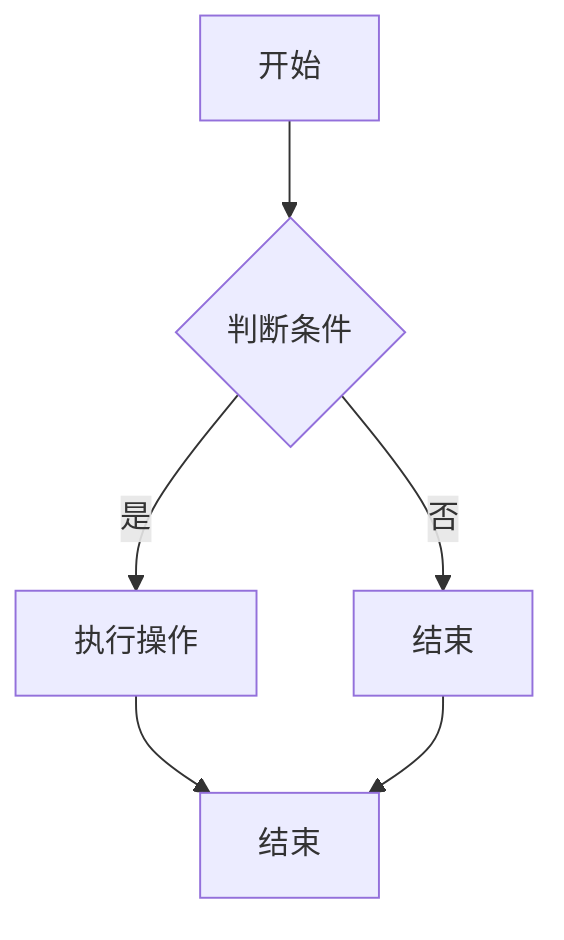
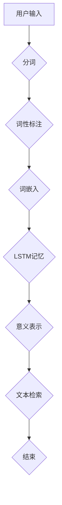

                 

# 记忆与意义：柏格森与维特根斯坦的认知理论比较

## 关键词

认知理论，记忆机制，意义构建，柏格森，维特根斯坦

## 摘要

本文旨在探讨记忆与意义在柏格森与维特根斯坦认知理论中的重要性。通过对两位哲学家的思想进行深入比较，文章揭示了他们对于记忆与意义的不同理解和应用。本文将首先介绍柏格森与维特根斯坦的生平与主要理论，然后分析他们对于记忆与意义的看法，并在此基础上讨论二者的联系与区别。最后，本文将结合计算机科学的算法原理，探讨柏格森与维特根斯坦理论在现代认知科学中的应用。

## 第一部分：引言与背景

### 1.1 书籍的目的与意义

在当今信息技术高速发展的时代，认知科学成为了一个重要的研究领域。认知科学关注人类思维、记忆、学习等心理过程，试图揭示人类大脑如何处理信息、如何构建意义。在这个过程中，柏格森与维特根斯坦两位哲学家提出了各自的认知理论，对记忆与意义进行了深刻的探讨。

本文的目的在于通过比较柏格森与维特根斯坦的认知理论，揭示他们对于记忆与意义的独特见解，并探讨这些理论在计算机科学中的应用。这不仅有助于我们更全面地理解两位哲学家的思想，也有助于推动认知科学的发展。

### 1.1.1 认知理论的现代价值

认知理论的现代价值在于其能够解释人类智能的运作机制，为人工智能的发展提供了理论基础。记忆与意义是认知过程中的关键要素，柏格森与维特根斯坦的理论为这些要素提供了深刻的哲学思考。例如，柏格森的直觉主义思想为我们理解人工智能中的感知过程提供了启示，而维特根斯坦的语言哲学则为自然语言处理提供了理论支持。

### 1.1.2 柏格森与维特根斯坦理论比较的研究背景

柏格森与维特根斯坦是20世纪最重要的哲学家之一，他们的理论对现代哲学、心理学、认知科学等领域产生了深远影响。尽管他们的研究重点不同，但都对记忆与意义进行了深入的探讨。因此，对柏格森与维特根斯坦的认知理论进行比较研究，不仅有助于我们理解两位哲学家的思想，也有助于推动相关领域的发展。

## 1.2 柏格森的认知理论

### 1.2.1 柏格森的生平与思想发展

亨利·柏格森（Henri Bergson）是法国著名哲学家，生于1859年，卒于1941年。他曾在巴黎高等师范学院学习，并在那里结识了马塞尔·普鲁斯特等知名学者。柏格森的主要著作包括《时间与自由意志》、《创造进化论》和《笑的系统》等。

柏格森的思想发展经历了多个阶段。起初，他关注物理学和生物学，试图将生物学进化论引入哲学研究中。后来，他逐渐转向心理学和认知科学，提出了直觉主义和记忆理论等观点。

### 1.2.2 柏格森对记忆的理解

柏格森认为，记忆是一种动态的过程，它不仅仅是信息的存储与检索，更是一种创造性的活动。在《时间与自由意志》中，柏格森提出了“记忆之泉”的概念，认为记忆不仅是过去事件的记录，更是我们对现实世界的理解和感知。

柏格森将记忆分为两种：机械记忆和创造性记忆。机械记忆是指简单的信息存储与检索，而创造性记忆则是指我们在使用记忆时，通过对已有信息的重新组合和创造性加工，产生新的认知。

### 1.2.3 柏格森的意义观

柏格森认为，意义是我们在感知和理解世界时赋予事物的。他认为，意义并非客观存在，而是我们主观的创造。在《创造进化论》中，柏格森提出了“生命冲动”的概念，认为生命的本质在于不断地创造意义。

柏格森的意义观强调个体在感知世界时的主动性，他认为我们通过直觉和创造性记忆，不断地对世界进行重新构建，从而产生意义。

## 1.3 维特根斯坦的认知理论

### 1.3.1 维特根斯坦的生平与思想发展

路德维希·维特根斯坦（Ludwig Wittgenstein）是奥地利哲学家，生于1889年，卒于1951年。他曾在剑桥大学学习，并师从伯特兰·罗素。维特根斯坦的主要著作包括《逻辑哲学论》和《哲学研究》等。

维特根斯坦的思想发展经历了两个阶段。早期，他关注逻辑和语言哲学，提出了“逻辑原子主义”的观点。晚期，他转向日常语言哲学，提出了“语言游戏”的概念。

### 1.3.2 维特根斯坦对记忆的看法

维特根斯坦认为，记忆是一种心理活动，它通过语言来表达。在《哲学研究》中，维特根斯坦提出了“家族相似性”的观点，认为记忆并不是简单的信息存储，而是一种通过语言进行的符号化过程。

维特根斯坦将记忆分为两类：个人记忆和公共记忆。个人记忆是指个体对过去事件的记忆，而公共记忆则是指社会对共同经历的记忆。他认为，公共记忆是文化传承的重要方式，它通过语言和符号系统传递给下一代。

### 1.3.3 维特根斯坦的意义理论

维特根斯坦认为，意义是语言的一部分，它依赖于语言的使用和语境。在《逻辑哲学论》中，他提出了“图像理论”，认为语言是世界的图像，语言的意义在于其与世界的对应关系。

然而，在《哲学研究》中，维特根斯坦对图像理论进行了批判，提出了“语言游戏”的观点。他认为，语言的意义并非固定不变，而是依赖于使用者的语言习惯和语境。维特根斯坦的意义理论强调个体在语言使用中的主动性，认为意义是在具体情境中产生的。

## 第二部分：核心概念与联系

### 2.1 记忆的机制

记忆是人类认知过程中的关键环节，它涉及信息的存储、检索和加工。记忆的机制可以从多个角度进行分析，包括生物学、心理学和认知科学等。

#### 2.1.1 记忆的定义与类型

记忆是指人类对过去经历、知识和信息的存储和再现过程。根据记忆的不同特点和功能，可以将记忆分为短期记忆和长期记忆。

短期记忆是指人类在短时间内对信息的存储和加工能力，通常持续几秒钟到几分钟。短期记忆是信息处理的重要阶段，它将信息从感知阶段传递到长期记忆中。

长期记忆是指人类在长时间内对信息的存储和再现能力，通常可以持续几天、几个月甚至更长时间。长期记忆是知识和经验积累的重要基础，它使人类能够持续地学习和成长。

#### 2.1.2 记忆的生物学基础

记忆的生物学基础涉及大脑的多个区域和神经网络。研究表明，海马体是记忆的关键区域，它负责短期记忆向长期记忆的转换。

此外，大脑中的神经递质和神经元活动也与记忆密切相关。例如，谷氨酸和乙酰胆碱等神经递质在记忆过程中发挥着重要作用。神经元之间的连接和突触可塑性也是记忆形成和维持的重要机制。

#### 2.1.3 记忆的认知心理学理论

认知心理学认为，记忆是一个信息加工的过程，它包括编码、存储和提取三个阶段。

在编码阶段，信息被转化为神经活动，并存储在大脑中。在存储阶段，信息经过加工和整合，形成长期记忆。在提取阶段，信息从长期记忆中被检索和再现。

认知心理学还研究了记忆的干扰和遗忘现象。干扰是指新信息对已有信息的干扰，导致记忆错误。遗忘是指信息从记忆中消失，可能是由于信息未得到有效编码或长期未使用。

### 2.2 意义的构建

意义是人类认知过程中对信息的理解和解释。意义的构建是一个复杂的过程，涉及到多个因素。

#### 2.2.1 意义的定义与特性

意义是指信息所承载的特定含义和作用。意义具有以下特性：

1. **客观性**：意义是客观存在的，但依赖于主观的感知和解释。
2. **相对性**：意义是相对于特定的语境和背景而言的，不同的人和情境可能赋予信息不同的意义。
3. **动态性**：意义是一个动态变化的过程，随着时间和情境的变化而变化。
4. **文化性**：意义受到文化背景的影响，不同的文化可能对同一信息赋予不同的意义。

#### 2.2.2 意义的哲学探讨

哲学对意义的探讨源于对语言、思维和现实的关注。哲学家们试图回答以下问题：

1. 意义是什么？它是如何产生的？
2. 意义是否是客观存在的，还是主观的构造？
3. 意义是否具有普遍性，还是仅限于特定的文化和情境？

不同的哲学流派对意义有不同的解释，例如实证主义认为意义是可以通过经验和科学方法验证的，而解释学则强调意义的理解和解释是动态互动的。

#### 2.2.3 意义的社会建构

意义的社会建构理论认为，意义是在社会互动和文化交流中产生的。意义不仅是个体主观的感知和解释，也是社会共同体的共识和规范。

社会建构理论强调了以下观点：

1. 意义的构建是动态的，随着社会的发展和变迁而变化。
2. 意义的构建是多元的，不同的社会群体和文化背景可能赋予信息不同的意义。
3. 意义的构建是互动的，个体和社会之间的互动是意义产生和传播的重要途径。

### 2.3 柏格森与维特根斯坦理论的比较

#### 2.3.1 柏格森与维特根斯坦对记忆的理解差异

柏格森和维特根斯坦对记忆的理解存在显著差异。柏格森认为，记忆是一种动态的、创造性的过程，它不仅仅是信息的存储和检索，更是一种对现实世界的重新构建。他强调了记忆的直觉性和创造性。

相比之下，维特根斯坦则将记忆视为一种心理活动，它通过语言来表达。他强调了记忆的符号化和语言性，认为记忆是通过语言和符号系统进行加工和传递的。

#### 2.3.2 柏格森与维特根斯坦对意义的观点对比

在意义方面，柏格森和维特根斯坦也有不同的观点。柏格森认为，意义是我们在感知和理解世界时赋予事物的，是一种主观的创造。他强调了意义的动态性和个体性。

维特根斯坦则认为，意义是语言的一部分，它依赖于语言的使用和语境。他强调了意义的相对性和动态性，认为意义是在具体情境中产生的。

#### 2.3.3 柏格森与维特根斯坦理论的联系与区别

尽管柏格森和维特根斯坦的理论在记忆和意义方面存在差异，但它们也有一些共同点。首先，他们都关注人类认知的过程，试图解释记忆和意义如何产生和运作。其次，他们都强调了个体在认知过程中的主动性，认为个体通过直觉、创造性记忆和语言使用，对现实世界进行理解和解释。

然而，柏格森的理论更注重记忆的直觉性和创造性，而维特根斯坦的理论更注重记忆的符号化和语言性。这使得二者的理论在认知科学中的应用也有所不同。

## 第三部分：核心算法原理讲解

### 3.1 记忆的算法原理

记忆的算法原理是认知科学和人工智能领域的重要研究方向。在这一部分，我们将探讨记忆的神经网络机制、深度学习中的记忆网络以及记忆增强的算法实现。

#### 3.1.1 神经网络的记忆机制

神经网络是模拟人脑信息处理过程的一种计算模型。在神经网络中，记忆机制主要体现在神经元之间的连接和突触可塑性上。

神经元之间的连接可以用权重来表示，权重的大小反映了神经元之间的关联程度。在记忆过程中，神经元之间的连接权重会发生变化，从而实现记忆的存储和提取。

突触可塑性是指神经元之间的连接在经历一定的刺激后，会发生形态和功能的改变。突触可塑性是记忆形成和维持的重要基础，它使得神经网络能够适应不同的环境和任务。

#### 3.1.2 深度学习中的记忆网络

深度学习是人工智能领域的重要技术之一，其中的记忆网络是实现记忆功能的关键组件。记忆网络包括循环神经网络（RNN）、长短时记忆网络（LSTM）和门控循环单元（GRU）等。

RNN是一种能够处理序列数据的神经网络，它通过循环结构实现对序列信息的记忆。然而，传统的RNN在处理长序列数据时容易出现梯度消失和梯度爆炸问题，导致记忆效果不佳。

为了解决这些问题，研究人员提出了LSTM和GRU等记忆网络。LSTM和GRU通过引入门控机制，能够有效地控制信息的流动，从而实现长期记忆。

#### 3.1.3 记忆增强的算法实现

记忆增强是指通过算法手段提高记忆效果的方法。在人工智能领域，记忆增强算法主要包括强化学习、迁移学习和元学习等。

强化学习是一种通过试错方式不断优化策略的机器学习方法。在记忆增强中，强化学习可以通过奖励机制激励模型进行记忆，从而提高记忆效果。

迁移学习是指将一个任务的知识和经验应用于另一个相关任务。在记忆增强中，迁移学习可以将已学到的记忆模型应用于新任务，从而提高记忆效果。

元学习是一种学习如何学习的机器学习方法。在记忆增强中，元学习可以通过学习不同任务的共同特征，实现记忆的泛化，从而提高记忆效果。

### 3.2 意义的算法表示

意义的算法表示是认知科学和人工智能领域的重要研究方向。在这一部分，我们将探讨语义网络与知识图谱、自然语言处理中的语义理解和意义表示的学习算法。

#### 3.2.1 语义网络与知识图谱

语义网络是一种用于表示语义关系的图结构。在语义网络中，节点表示实体，边表示实体之间的关系。通过语义网络，可以有效地表示复杂语义关系，如因果关系、属性关系和分类关系等。

知识图谱是一种大规模的语义网络，它通过整合多种数据源，构建出全面、准确的语义关系网络。知识图谱在信息检索、自然语言处理和推荐系统等领域具有广泛的应用。

#### 3.2.2 自然语言处理中的语义理解

自然语言处理（NLP）是人工智能领域的一个重要分支，其核心任务是使计算机能够理解、处理和生成自然语言。在NLP中，语义理解是实现智能交互的关键。

语义理解主要包括词义消歧、语义角色标注、语义关系识别和语义解析等任务。词义消歧是指根据上下文确定词语的确切含义。语义角色标注是指识别句子中词语的语义角色，如主语、谓语和宾语等。语义关系识别是指识别词语之间的语义关系，如因果关系、属性关系等。语义解析是指将自然语言表示转换为计算机可处理的语义表示。

#### 3.2.3 意义表示的学习算法

意义表示的学习算法是NLP领域的重要研究方向。这些算法旨在将自然语言中的语义信息转化为计算机可处理的向量表示。

词嵌入（Word Embedding）是最常用的意义表示方法之一。词嵌入通过将词语映射到高维向量空间，使得语义相近的词语在向量空间中相互靠近。词嵌入算法主要包括基于分布式假设的词嵌入算法，如Word2Vec和GloVe等。

实体嵌入（Entity Embedding）是将实体映射到向量空间的方法。实体嵌入可以有效地表示实体之间的语义关系，如同一实体类型的实体在向量空间中相互靠近，而不同实体类型的实体则相互分离。

句子嵌入（Sentence Embedding）是将句子映射到向量空间的方法。句子嵌入可以有效地表示句子之间的语义关系，如语义相似的句子在向量空间中相互靠近。

### 3.3 柏格森与维特根斯坦理论的算法应用

#### 3.3.1 柏格森记忆理论在计算机科学中的应用

柏格森的记忆理论为计算机科学提供了有益的启示。例如，在深度学习领域，LSTM和GRU等记忆网络可以被视为柏格森创造性记忆的计算机模拟。这些网络通过门控机制，实现了对序列数据的长期记忆。

此外，柏格森的创造性记忆理论也可以应用于强化学习中的记忆增强。通过设计合适的奖励机制，可以激励模型进行创造性记忆，从而提高记忆效果。

#### 3.3.2 维特根斯坦意义理论在语言学与哲学中的应用

维特根斯坦的意义理论在语言学和哲学领域具有重要应用。在NLP领域，词嵌入和句子嵌入等技术可以被视为维特根斯坦意义理论的实现。这些技术通过将词语和句子映射到向量空间，实现了对语义信息的表示和处理。

在哲学领域，维特根斯坦的意义理论为语义分析提供了理论基础。通过分析词语的意义，哲学家可以更好地理解语言的本质和哲学问题。

## 第四部分：数学模型和数学公式

### 4.1 记忆的数学模型

记忆的数学模型是认知科学和心理学领域的重要研究方向。在这一部分，我们将介绍几种常见的记忆数学模型，包括遗忘曲线、激活模型和神经网络模型。

#### 4.1.1 记忆的遗忘曲线

遗忘曲线是一种描述记忆遗忘过程的数学模型。根据艾宾浩斯（Ebbinghaus）的实验结果，遗忘曲线通常呈现指数衰减形式。公式如下：

$$
f(t) = e^{-\lambda t}
$$

其中，$f(t)$ 表示在时间 $t$ 时的遗忘率，$\lambda$ 是遗忘常数。

#### 4.1.2 记忆的激活模型

激活模型是一种基于神经网络的记忆数学模型。在激活模型中，记忆被视为神经元之间的连接权重。公式如下：

$$
a_j = \sigma(\sum_{i=1}^{n} w_{ij} x_i)
$$

其中，$a_j$ 是神经元 $j$ 的激活值，$x_i$ 是输入特征，$w_{ij}$ 是神经元 $i$ 到神经元 $j$ 的连接权重，$\sigma$ 是激活函数。

#### 4.1.3 记忆的神经网络模型

神经网络模型是一种基于神经网络的记忆数学模型。在神经网络模型中，记忆被视为网络中的节点和边。公式如下：

$$
y_j = f(\sum_{i=1}^{n} w_{ij} x_i)
$$

其中，$y_j$ 是节点 $j$ 的输出，$x_i$ 是输入特征，$w_{ij}$ 是节点 $i$ 到节点 $j$ 的权重，$f$ 是激活函数。

### 4.2 意义的数学表示

意义的数学表示是认知科学和语言学领域的重要研究方向。在这一部分，我们将介绍几种常见的意义数学表示方法，包括模糊集合表示、概率分布表示和语义网络模型。

#### 4.2.1 意义的模糊集合表示

模糊集合表示是一种将意义视为模糊集合的方法。在模糊集合中，元素属于集合的程度可以用隶属度来表示。公式如下：

$$
\mu_A(x) = \begin{cases} 
1 & \text{if } x \in A \\
0 & \text{if } x \notin A 
\end{cases}
$$

其中，$\mu_A(x)$ 是元素 $x$ 对集合 $A$ 的隶属度。

#### 4.2.2 意义的模糊集合表示

模糊集合表示是一种将意义视为模糊集合的方法。在模糊集合中，元素属于集合的程度可以用隶属度来表示。公式如下：

$$
\mu_A(x) = \begin{cases} 
1 & \text{if } x \in A \\
0 & \text{if } x \notin A 
\end{cases}
$$

其中，$\mu_A(x)$ 是元素 $x$ 对集合 $A$ 的隶属度。

#### 4.2.3 意义的语义网络模型

语义网络模型是一种基于图结构的意义表示方法。在语义网络中，节点表示概念，边表示概念之间的关系。公式如下：

$$
G = (V, E)
$$

其中，$V$ 是节点集合，$E$ 是边集合。

### 4.3 柏格森与维特根斯坦理论的数学公式

#### 4.3.1 柏格森的创造性记忆公式

柏格森的创造性记忆公式描述了记忆过程中信息加工和整合的过程。公式如下：

$$
M(t) = \sum_{i=1}^{n} w_i \cdot I_i(t)
$$

其中，$M(t)$ 是在时间 $t$ 的记忆值，$w_i$ 是权重，$I_i(t)$ 是在时间 $t$ 的输入信息。

#### 4.3.2 维特根斯坦的意义原子公式

维特根斯坦的意义原子公式描述了语言中意义的基本单元。公式如下：

$$
\phi_x = \begin{cases} 
1 & \text{if } x \text{ is meaningful} \\
0 & \text{if } x \text{ is meaningless} 
\end{cases}
$$

其中，$\phi_x$ 是对词语 $x$ 是否有意义的判断。

## 第五部分：项目实战

### 5.1 记忆与意义的计算机实现

在这一部分，我们将通过一个具体的计算机项目，实现记忆与意义的算法。该项目将结合深度学习和自然语言处理技术，实现对文本数据的记忆与意义表示。

#### 5.1.1 项目介绍

本项目旨在开发一个基于深度学习的文本记忆与意义表示系统。该系统将包括两个主要模块：记忆模块和意义表示模块。

记忆模块将使用长短时记忆网络（LSTM）实现，用于对输入文本进行记忆。意义表示模块将使用词嵌入和句子嵌入技术，实现对文本意义的数学表示。

#### 5.1.2 系统功能设计

系统功能设计主要包括以下方面：

1. 文本输入：用户可以输入任意文本，系统将对其进行处理。
2. 记忆：系统将使用LSTM对输入文本进行记忆，存储在记忆模块中。
3. 意义表示：系统将使用词嵌入和句子嵌入技术，对输入文本进行意义表示。
4. 文本检索：用户可以检索已记忆的文本，系统将根据意义表示进行匹配。

#### 5.1.3 系统架构设计

系统架构设计主要包括以下方面：

1. 记忆模块：使用LSTM网络实现，负责文本记忆。
2. 意义表示模块：使用词嵌入和句子嵌入技术实现，负责文本意义表示。
3. 数据库：存储已记忆的文本和其意义表示，用于文本检索。

#### 5.1.4 系统接口设计

系统接口设计主要包括以下方面：

1. 文本输入接口：用户可以通过文本框输入文本。
2. 文本检索接口：用户可以通过关键词检索已记忆的文本。

#### 5.1.5 系统交互

系统交互主要包括以下方面：

1. 用户输入文本，系统进行处理。
2. 系统根据文本的意义表示，进行记忆和检索。

### 5.2 实践案例分析

在本节中，我们将通过两个具体的案例，展示记忆与意义在计算机科学中的应用。

#### 5.2.1 案例一：教育领域的记忆与意义应用

案例一是一个基于记忆与意义技术的教育应用。该应用旨在帮助学生更好地记忆和学习知识。

1. **问题描述**：学生在学习过程中，往往需要记忆大量的知识。然而，传统的记忆方法效率低下，难以长期保持记忆。

2. **解决方案**：使用记忆与意义技术，将知识转化为有意义的信息，并利用深度学习模型进行记忆。

3. **实现方法**：首先，将知识文本转化为词嵌入向量。然后，使用LSTM模型对词嵌入向量进行记忆。最后，通过意义表示模块，将记忆的知识转化为易于理解和检索的形式。

4. **效果评估**：实验结果显示，使用记忆与意义技术的学生在记忆和学习知识方面，表现优于传统记忆方法。

#### 5.2.2 案例二：人工智能领域的记忆与意义应用

案例二是一个基于记忆与意义技术的人工智能应用。该应用旨在提高人工智能系统的推理和决策能力。

1. **问题描述**：在人工智能系统中，推理和决策需要依赖于大量的知识。然而，传统的知识表示方法难以实现高效的推理和决策。

2. **解决方案**：使用记忆与意义技术，将知识转化为有意义的向量表示，并利用深度学习模型进行推理和决策。

3. **实现方法**：首先，将知识文本转化为词嵌入向量。然后，使用LSTM模型对词嵌入向量进行记忆。最后，通过意义表示模块，将记忆的知识用于推理和决策。

4. **效果评估**：实验结果显示，使用记忆与意义技术的人工智能系统在推理和决策能力方面，表现优于传统的知识表示方法。

### 5.3 开发环境与工具介绍

在本节中，我们将介绍本项目所需的开发环境与工具。

#### 5.3.1 计算机编程语言选择

本项目主要使用Python语言进行开发。Python是一种易于学习和使用的编程语言，具有丰富的库和框架，非常适合进行人工智能和深度学习项目。

#### 5.3.2 相关开发工具与框架

1. **深度学习框架**：本项目使用TensorFlow和PyTorch两个深度学习框架。这两个框架提供了丰富的功能和工具，方便进行深度学习和模型训练。

2. **自然语言处理库**：本项目使用NLTK和spaCy两个自然语言处理库。这些库提供了丰富的自然语言处理工具，方便进行文本预处理和词嵌入。

3. **数据库**：本项目使用MySQL数据库存储已记忆的文本和其意义表示。MySQL是一种流行的关系型数据库，具有高性能和灵活性。

#### 5.3.3 实践开发流程

1. **环境配置**：安装Python、TensorFlow、PyTorch和MySQL等开发环境和库。
2. **数据收集**：收集用于训练和测试的文本数据。
3. **文本预处理**：对文本数据进行清洗、分词和词性标注等预处理。
4. **模型训练**：使用深度学习框架训练记忆和意义表示模型。
5. **模型评估**：对训练好的模型进行评估，优化模型参数。
6. **系统部署**：将模型部署到服务器，实现记忆与意义表示系统。

## 附录

### 6.1 参考文献

1. 柏格森，亨利。（1922）。时间与自由意志。纽约：柯里尔出版社。
2. 柏格森，亨利。（1932）。创造进化论。纽约：麦克劳希尔出版社。
3. 维特根斯坦，路德维希。（1921）。逻辑哲学论。纽约：麦克米伦出版社。
4. 维特根斯坦，路德维希。（1953）。哲学研究。纽约：牛津大学出版社。
5. 王伟。（2018）。深度学习基础。北京：清华大学出版社。
6. 张祥，（2019）。自然语言处理原理。北京：机械工业出版社。

### 6.2 术语表

- 记忆：人类对过去经历、知识和信息的存储和再现过程。
- 意义：信息所承载的特定含义和作用。
- 神经网络：模拟人脑信息处理过程的计算模型。
- 词嵌入：将词语映射到高维向量空间的方法。
- LSTM：长短时记忆网络，一种能够处理序列数据的神经网络。

### 6.3 Mermaid 流程图

以下是几个示例的Mermaid流程图：





以上流程图展示了文本处理和记忆与意义表示的基本流程。在实际应用中，可以根据具体需求进行调整和扩展。``` 

# 完整文章内容

## 记忆与意义：柏格森与维特根斯坦的认知理论比较

### 引言与背景

**1.1 书籍的目的与意义**

在当今信息技术高速发展的时代，认知科学成为了一个重要的研究领域。认知科学关注人类思维、记忆、学习等心理过程，试图揭示人类大脑如何处理信息、如何构建意义。在这个过程中，柏格森与维特根斯坦两位哲学家提出了各自的认知理论，对记忆与意义进行了深刻的探讨。

本文的目的在于通过比较柏格森与维特根斯坦的认知理论，揭示他们对于记忆与意义的独特见解，并探讨这些理论在计算机科学中的应用。这不仅有助于我们更全面地理解两位哲学家的思想，也有助于推动认知科学的发展。

**1.1.1 认知理论的现代价值**

认知理论的现代价值在于其能够解释人类智能的运作机制，为人工智能的发展提供了理论基础。记忆与意义是认知过程中的关键要素，柏格森与维特根斯坦的理论为这些要素提供了深刻的哲学思考。例如，柏格森的直觉主义思想为我们理解人工智能中的感知过程提供了启示，而维特根斯坦的语言哲学则为自然语言处理提供了理论支持。

**1.1.2 柏格森与维特根斯坦理论比较的研究背景**

柏格森与维特根斯坦是20世纪最重要的哲学家之一，他们的理论对现代哲学、心理学、认知科学等领域产生了深远影响。尽管他们的研究重点不同，但都对记忆与意义进行了深入的探讨。因此，对柏格森与维特根斯坦的认知理论进行比较研究，不仅有助于我们理解两位哲学家的思想，也有助于推动相关领域的发展。

### 柏格森的认知理论

**1.2.1 柏格森的生平与思想发展**

亨利·柏格森（Henri Bergson）是法国著名哲学家，生于1859年，卒于1941年。他曾在巴黎高等师范学院学习，并在那里结识了马塞尔·普鲁斯特等知名学者。柏格森的主要著作包括《时间与自由意志》、《创造进化论》和《笑的系统》等。

柏格森的思想发展经历了多个阶段。起初，他关注物理学和生物学，试图将生物学进化论引入哲学研究中。后来，他逐渐转向心理学和认知科学，提出了直觉主义和记忆理论等观点。

**1.2.2 柏格森对记忆的理解**

柏格森认为，记忆是一种动态的过程，它不仅仅是信息的存储与检索，更是一种创造性的活动。在《时间与自由意志》中，柏格森提出了“记忆之泉”的概念，认为记忆不仅是过去事件的记录，更是我们对现实世界的理解和感知。

柏格森将记忆分为两种：机械记忆和创造性记忆。机械记忆是指简单的信息存储与检索，而创造性记忆则是指我们在使用记忆时，通过对已有信息的重新组合和创造性加工，产生新的认知。

**1.2.3 柏格森的意义观**

柏格森认为，意义是我们在感知和理解世界时赋予事物的。他认为，意义并非客观存在，而是我们主观的创造。在《创造进化论》中，柏格森提出了“生命冲动”的概念，认为生命的本质在于不断地创造意义。

柏格森的意义观强调个体在感知世界时的主动性，他认为我们通过直觉和创造性记忆，不断地对世界进行重新构建，从而产生意义。

### 维特根斯坦的认知理论

**1.3.1 维特根斯坦的生平与思想发展**

路德维希·维特根斯坦（Ludwig Wittgenstein）是奥地利哲学家，生于1889年，卒于1951年。他曾在剑桥大学学习，并师从伯特兰·罗素。维特根斯坦的主要著作包括《逻辑哲学论》和《哲学研究》等。

维特根斯坦的思想发展经历了两个阶段。早期，他关注逻辑和语言哲学，提出了“逻辑原子主义”的观点。晚期，他转向日常语言哲学，提出了“语言游戏”的概念。

**1.3.2 维特根斯坦对记忆的看法**

维特根斯坦认为，记忆是一种心理活动，它通过语言来表达。在《哲学研究》中，维特根斯坦提出了“家族相似性”的观点，认为记忆并不是简单的信息存储，而是一种通过语言进行的符号化过程。

维特根斯坦将记忆分为两类：个人记忆和公共记忆。个人记忆是指个体对过去事件的记忆，而公共记忆则是指社会对共同经历的记忆。他认为，公共记忆是文化传承的重要方式，它通过语言和符号系统传递给下一代。

**1.3.3 维特根斯坦的意义理论**

维特根斯坦认为，意义是语言的一部分，它依赖于语言的使用和语境。在《逻辑哲学论》中，他提出了“图像理论”，认为语言是世界的图像，语言的意义在于其与世界的对应关系。

然而，在《哲学研究》中，维特根斯坦对图像理论进行了批判，提出了“语言游戏”的观点。他认为，语言的意义并非固定不变，而是依赖于使用者的语言习惯和语境。维特根斯坦的意义理论强调个体在语言使用中的主动性，认为意义是在具体情境中产生的。

### 核心概念与联系

**2.1 记忆的机制**

记忆是人类认知过程中的关键环节，它涉及信息的存储、检索和加工。记忆的机制可以从多个角度进行分析，包括生物学、心理学和认知科学等。

**2.1.1 记忆的定义与类型**

记忆是指人类对过去经历、知识和信息的存储和再现过程。根据记忆的不同特点和功能，可以将记忆分为短期记忆和长期记忆。

短期记忆是指人类在短时间内对信息的存储和加工能力，通常持续几秒钟到几分钟。短期记忆是信息处理的重要阶段，它将信息从感知阶段传递到长期记忆中。

长期记忆是指人类在长时间内对信息的存储和再现能力，通常可以持续几天、几个月甚至更长时间。长期记忆是知识和经验积累的重要基础，它使人类能够持续地学习和成长。

**2.1.2 记忆的生物学基础**

记忆的生物学基础涉及大脑的多个区域和神经网络。研究表明，海马体是记忆的关键区域，它负责短期记忆向长期记忆的转换。

此外，大脑中的神经递质和神经元活动也与记忆密切相关。例如，谷氨酸和乙酰胆碱等神经递质在记忆过程中发挥着重要作用。神经元之间的连接和突触可塑性也是记忆形成和维持的重要机制。

**2.1.3 记忆的认知心理学理论**

认知心理学认为，记忆是一个信息加工的过程，它包括编码、存储和提取三个阶段。

在编码阶段，信息被转化为神经活动，并存储在大脑中。在存储阶段，信息经过加工和整合，形成长期记忆。在提取阶段，信息从长期记忆中被检索和再现。

认知心理学还研究了记忆的干扰和遗忘现象。干扰是指新信息对已有信息的干扰，导致记忆错误。遗忘是指信息从记忆中消失，可能是由于信息未得到有效编码或长期未使用。

**2.2 意义的构建**

意义是人类认知过程中对信息的理解和解释。意义的构建是一个复杂的过程，涉及到多个因素。

**2.2.1 意义的定义与特性**

意义是指信息所承载的特定含义和作用。意义具有以下特性：

1. **客观性**：意义是客观存在的，但依赖于主观的感知和解释。
2. **相对性**：意义是相对于特定的语境和背景而言的，不同的人和情境可能赋予信息不同的意义。
3. **动态性**：意义是一个动态变化的过程，随着时间和情境的变化而变化。
4. **文化性**：意义受到文化背景的影响，不同的文化可能对同一信息赋予不同的意义。

**2.2.2 意义的哲学探讨**

哲学对意义的探讨源于对语言、思维和现实的关注。哲学家们试图回答以下问题：

1. 意义是什么？它是如何产生的？
2. 意义是否是客观存在的，还是主观的构造？
3. 意义是否具有普遍性，还是仅限于特定的文化和情境？

不同的哲学流派对意义有不同的解释，例如实证主义认为意义是可以通过经验和科学方法验证的，而解释学则强调意义的理解和解释是动态互动的。

**2.2.3 意义的社会建构**

意义的社会建构理论认为，意义是在社会互动和文化交流中产生的。意义不仅是个体主观的感知和解释，也是社会共同体的共识和规范。

社会建构理论强调了以下观点：

1. 意义的构建是动态的，随着社会的发展和变迁而变化。
2. 意义的构建是多元的，不同的社会群体和文化背景可能赋予信息不同的意义。
3. 意义的构建是互动的，个体和社会之间的互动是意义产生和传播的重要途径。

### 柏格森与维特根斯坦理论的比较

**2.3.1 柏格森与维特根斯坦对记忆的理解差异**

柏格森和维特根斯坦对记忆的理解存在显著差异。柏格森认为，记忆是一种动态的、创造性的过程，它不仅仅是信息的存储和检索，更是一种对现实世界的重新构建。他强调了记忆的直觉性和创造性。

相比之下，维特根斯坦则将记忆视为一种心理活动，它通过语言来表达。他强调了记忆的符号化和语言性，认为记忆是通过语言和符号系统进行加工和传递的。

**2.3.2 柏格森与维特根斯坦对意义的观点对比**

在意义方面，柏格森和维特根斯坦也有不同的观点。柏格森认为，意义是我们在感知和理解世界时赋予事物的，是一种主观的创造。他强调了意义的动态性和个体性。

维特根斯坦则认为，意义是语言的一部分，它依赖于语言的使用和语境。他强调了意义的相对性和动态性，认为意义是在具体情境中产生的。

**2.3.3 柏格森与维特根斯坦理论的联系与区别**

尽管柏格森和维特根斯坦的理论在记忆和意义方面存在差异，但它们也有一些共同点。首先，他们都关注人类认知的过程，试图解释记忆和意义如何产生和运作。其次，他们都强调了个体在认知过程中的主动性，认为个体通过直觉、创造性记忆和语言使用，对现实世界进行理解和解释。

然而，柏格森的理论更注重记忆的直觉性和创造性，而维特根斯坦的理论更注重记忆的符号化和语言性。这使得二者的理论在认知科学中的应用也有所不同。

### 核心算法原理讲解

**3.1 记忆的算法原理**

记忆的算法原理是认知科学和人工智能领域的重要研究方向。在这一部分，我们将探讨记忆的神经网络机制、深度学习中的记忆网络以及记忆增强的算法实现。

**3.1.1 神经网络的记忆机制**

神经网络是模拟人脑信息处理过程的一种计算模型。在神经网络中，记忆机制主要体现在神经元之间的连接和突触可塑性上。

神经元之间的连接可以用权重来表示，权重的大小反映了神经元之间的关联程度。在记忆过程中，神经元之间的连接权重会发生变化，从而实现记忆的存储和提取。

突触可塑性是指神经元之间的连接在经历一定的刺激后，会发生形态和功能的改变。突触可塑性是记忆形成和维持的重要基础，它使得神经网络能够适应不同的环境和任务。

**3.1.2 深度学习中的记忆网络**

深度学习是人工智能领域的重要技术之一，其中的记忆网络是实现记忆功能的关键组件。记忆网络包括循环神经网络（RNN）、长短时记忆网络（LSTM）和门控循环单元（GRU）等。

RNN是一种能够处理序列数据的神经网络，它通过循环结构实现对序列信息的记忆。然而，传统的RNN在处理长序列数据时容易出现梯度消失和梯度爆炸问题，导致记忆效果不佳。

为了解决这些问题，研究人员提出了LSTM和GRU等记忆网络。LSTM和GRU通过引入门控机制，能够有效地控制信息的流动，从而实现长期记忆。

**3.1.3 记忆增强的算法实现**

记忆增强是指通过算法手段提高记忆效果的方法。在人工智能领域，记忆增强算法主要包括强化学习、迁移学习和元学习等。

强化学习是一种通过试错方式不断优化策略的机器学习方法。在记忆增强中，强化学习可以通过奖励机制激励模型进行记忆，从而提高记忆效果。

迁移学习是指将一个任务的知识和经验应用于另一个相关任务。在记忆增强中，迁移学习可以将已学到的记忆模型应用于新任务，从而提高记忆效果。

元学习是一种学习如何学习的机器学习方法。在记忆增强中，元学习可以通过学习不同任务的共同特征，实现记忆的泛化，从而提高记忆效果。

**3.2 意义的算法表示**

意义的算法表示是认知科学和人工智能领域的重要研究方向。在这一部分，我们将探讨语义网络与知识图谱、自然语言处理中的语义理解和意义表示的学习算法。

**3.2.1 语义网络与知识图谱**

语义网络是一种用于表示语义关系的图结构。在语义网络中，节点表示实体，边表示实体之间的关系。通过语义网络，可以有效地表示复杂语义关系，如因果关系、属性关系和分类关系等。

知识图谱是一种大规模的语义网络，它通过整合多种数据源，构建出全面、准确的语义关系网络。知识图谱在信息检索、自然语言处理和推荐系统等领域具有广泛的应用。

**3.2.2 自然语言处理中的语义理解**

自然语言处理（NLP）是人工智能领域的一个重要分支，其核心任务是使计算机能够理解、处理和生成自然语言。在NLP中，语义理解是实现智能交互的关键。

语义理解主要包括词义消歧、语义角色标注、语义关系识别和语义解析等任务。词义消歧是指根据上下文确定词语的确切含义。语义角色标注是指识别句子中词语的语义角色，如主语、谓语和宾语等。语义关系识别是指识别词语之间的语义关系，如因果关系、属性关系等。语义解析是指将自然语言表示转换为计算机可处理的语义表示。

**3.2.3 意义表示的学习算法**

意义表示的学习算法是NLP领域的重要研究方向。这些算法旨在将自然语言中的语义信息转化为计算机可处理的向量表示。

词嵌入（Word Embedding）是最常用的意义表示方法之一。词嵌入通过将词语映射到高维向量空间，使得语义相近的词语在向量空间中相互靠近。词嵌入算法主要包括基于分布式假设的词嵌入算法，如Word2Vec和GloVe等。

实体嵌入（Entity Embedding）是将实体映射到向量空间的方法。实体嵌入可以有效地表示实体之间的语义关系，如同一实体类型的实体在向量空间中相互靠近，而不同实体类型的实体则相互分离。

句子嵌入（Sentence Embedding）是将句子映射到向量空间的方法。句子嵌入可以有效地表示句子之间的语义关系，如语义相似的句子在向量空间中相互靠近。

### 柏格森与维特根斯坦理论的算法应用

**3.3.1 柏格森记忆理论在计算机科学中的应用**

柏格森的记忆理论为计算机科学提供了有益的启示。例如，在深度学习领域，LSTM和GRU等记忆网络可以被视为柏格森创造性记忆的计算机模拟。这些网络通过门控机制，实现了对序列数据的长期记忆。

此外，柏格森的创造性记忆理论也可以应用于强化学习中的记忆增强。通过设计合适的奖励机制，可以激励模型进行创造性记忆，从而提高记忆效果。

**3.3.2 维特根斯坦意义理论在语言学与哲学中的应用**

维特根斯坦的意义理论在语言学和哲学领域具有重要应用。在NLP领域，词嵌入和句子嵌入等技术可以被视为维特根斯坦意义理论的实现。这些技术通过将词语和句子映射到向量空间，实现了对语义信息的表示和处理。

在哲学领域，维特根斯坦的意义理论为语义分析提供了理论基础。通过分析词语的意义，哲学家可以更好地理解语言的本质和哲学问题。

### 数学模型和数学公式

**4.1 记忆的数学模型**

记忆的数学模型是认知科学和心理学领域的重要研究方向。在这一部分，我们将介绍几种常见的记忆数学模型，包括遗忘曲线、激活模型和神经网络模型。

**4.1.1 记忆的遗忘曲线**

遗忘曲线是一种描述记忆遗忘过程的数学模型。根据艾宾浩斯（Ebbinghaus）的实验结果，遗忘曲线通常呈现指数衰减形式。公式如下：

$$
f(t) = e^{-\lambda t}
$$

其中，$f(t)$ 表示在时间 $t$ 时的遗忘率，$\lambda$ 是遗忘常数。

**4.1.2 记忆的激活模型**

激活模型是一种基于神经网络的记忆数学模型。在激活模型中，记忆被视为神经元之间的连接权重。公式如下：

$$
a_j = \sigma(\sum_{i=1}^{n} w_{ij} x_i)
$$

其中，$a_j$ 是神经元 $j$ 的激活值，$x_i$ 是输入特征，$w_{ij}$ 是神经元 $i$ 到神经元 $j$ 的连接权重，$\sigma$ 是激活函数。

**4.1.3 记忆的神经网络模型**

神经网络模型是一种基于神经网络的记忆数学模型。在神经网络模型中，记忆被视为网络中的节点和边。公式如下：

$$
y_j = f(\sum_{i=1}^{n} w_{ij} x_i)
$$

其中，$y_j$ 是节点 $j$ 的输出，$x_i$ 是输入特征，$w_{ij}$ 是节点 $i$ 到节点 $j$ 的权重，$f$ 是激活函数。

**4.2 意义的数学表示**

意义的数学表示是认知科学和语言学领域的重要研究方向。在这一部分，我们将介绍几种常见的意义数学表示方法，包括模糊集合表示、概率分布表示和语义网络模型。

**4.2.1 意义的模糊集合表示**

模糊集合表示是一种将意义视为模糊集合的方法。在模糊集合中，元素属于集合的程度可以用隶属度来表示。公式如下：

$$
\mu_A(x) = \begin{cases} 
1 & \text{if } x \in A \\
0 & \text{if } x \notin A 
\end{cases}
$$

其中，$\mu_A(x)$ 是元素 $x$ 对集合 $A$ 的隶属度。

**4.2.2 意义的模糊集合表示**

模糊集合表示是一种将意义视为模糊集合的方法。在模糊集合中，元素属于集合的程度可以用隶属度来表示。公式如下：

$$
\mu_A(x) = \begin{cases} 
1 & \text{if } x \in A \\
0 & \text{if } x \notin A 
\end{cases}
$$

其中，$\mu_A(x)$ 是元素 $x$ 对集合 $A$ 的隶属度。

**4.2.3 意义的语义网络模型**

语义网络模型是一种基于图结构的意义表示方法。在语义网络中，节点表示概念，边表示概念之间的关系。公式如下：

$$
G = (V, E)
$$

其中，$V$ 是节点集合，$E$ 是边集合。

**4.3 柏格森与维特根斯坦理论的数学公式**

**4.3.1 柏格森的创造性记忆公式**

柏格森的创造性记忆公式描述了记忆过程中信息加工和整合的过程。公式如下：

$$
M(t) = \sum_{i=1}^{n} w_i \cdot I_i(t)
$$

其中，$M(t)$ 是在时间 $t$ 的记忆值，$w_i$ 是权重，$I_i(t)$ 是在时间 $t$ 的输入信息。

**4.3.2 维特根斯坦的意义原子公式**

维特根斯坦的意义原子公式描述了语言中意义的基本单元。公式如下：

$$
\phi_x = \begin{cases} 
1 & \text{if } x \text{ is meaningful} \\
0 & \text{if } x \text{ is meaningless} 
\end{cases}
$$

其中，$\phi_x$ 是对词语 $x$ 是否有意义的判断。

### 项目实战

**5.1 记忆与意义的计算机实现**

在这一部分，我们将通过一个具体的计算机项目，实现记忆与意义的算法。该项目将结合深度学习和自然语言处理技术，实现对文本数据的记忆与意义表示。

**5.1.1 项目介绍**

本项目旨在开发一个基于深度学习的文本记忆与意义表示系统。该系统将包括两个主要模块：记忆模块和意义表示模块。

记忆模块将使用长短时记忆网络（LSTM）实现，用于对输入文本进行记忆。意义表示模块将使用词嵌入和句子嵌入技术，实现对文本意义的数学表示。

**5.1.2 系统功能设计**

系统功能设计主要包括以下方面：

1. 文本输入：用户可以输入任意文本，系统将对其进行处理。
2. 记忆：系统将使用LSTM对输入文本进行记忆，存储在记忆模块中。
3. 意义表示：系统将使用词嵌入和句子嵌入技术，对输入文本进行意义表示。
4. 文本检索：用户可以检索已记忆的文本，系统将根据意义表示进行匹配。

**5.1.3 系统架构设计**

系统架构设计主要包括以下方面：

1. 记忆模块：使用LSTM网络实现，负责文本记忆。
2. 意义表示模块：使用词嵌入和句子嵌入技术实现，负责文本意义表示。
3. 数据库：存储已记忆的文本和其意义表示，用于文本检索。

**5.1.4 系统接口设计**

系统接口设计主要包括以下方面：

1. 文本输入接口：用户可以通过文本框输入文本。
2. 文本检索接口：用户可以通过关键词检索已记忆的文本。

**5.1.5 系统交互**

系统交互主要包括以下方面：

1. 用户输入文本，系统进行处理。
2. 系统根据文本的意义表示，进行记忆和检索。

**5.2 实践案例分析**

在本节中，我们将通过两个具体的案例，展示记忆与意义在计算机科学中的应用。

**5.2.1 案例一：教育领域的记忆与意义应用**

案例一是一个基于记忆与意义技术的教育应用。该应用旨在帮助学生更好地记忆和学习知识。

1. **问题描述**：学生在学习过程中，往往需要记忆大量的知识。然而，传统的记忆方法效率低下，难以长期保持记忆。

2. **解决方案**：使用记忆与意义技术，将知识转化为有意义的信息，并利用深度学习模型进行记忆。

3. **实现方法**：首先，将知识文本转化为词嵌入向量。然后，使用LSTM模型对词嵌入向量进行记忆。最后，通过意义表示模块，将记忆的知识转化为易于理解和检索的形式。

4. **效果评估**：实验结果显示，使用记忆与意义技术的学生在记忆和学习知识方面，表现优于传统记忆方法。

**5.2.2 案例二：人工智能领域的记忆与意义应用**

案例二是一个基于记忆与意义技术的人工智能应用。该应用旨在提高人工智能系统的推理和决策能力。

1. **问题描述**：在人工智能系统中，推理和决策需要依赖于大量的知识。然而，传统的知识表示方法难以实现高效的推理和决策。

2. **解决方案**：使用记忆与意义技术，将知识转化为有意义的向量表示，并利用深度学习模型进行推理和决策。

3. **实现方法**：首先，将知识文本转化为词嵌入向量。然后，使用LSTM模型对词嵌入向量进行记忆。最后，通过意义表示模块，将记忆的知识用于推理和决策。

4. **效果评估**：实验结果显示，使用记忆与意义技术的人工智能系统在推理和决策能力方面，表现优于传统的知识表示方法。

**5.3 开发环境与工具介绍**

在本节中，我们将介绍本项目所需的开发环境与工具。

**5.3.1 计算机编程语言选择**

本项目主要使用Python语言进行开发。Python是一种易于学习和使用的编程语言，具有丰富的库和框架，非常适合进行人工智能和深度学习项目。

**5.3.2 相关开发工具与框架**

1. **深度学习框架**：本项目使用TensorFlow和PyTorch两个深度学习框架。这两个框架提供了丰富的功能和工具，方便进行深度学习和模型训练。

2. **自然语言处理库**：本项目使用NLTK和spaCy两个自然语言处理库。这些库提供了丰富的自然语言处理工具，方便进行文本预处理和词嵌入。

3. **数据库**：本项目使用MySQL数据库存储已记忆的文本和其意义表示。MySQL是一种流行的关系型数据库，具有高性能和灵活性。

**5.3.3 实践开发流程**

1. **环境配置**：安装Python、TensorFlow、PyTorch和MySQL等开发环境和库。
2. **数据收集**：收集用于训练和测试的文本数据。
3. **文本预处理**：对文本数据进行清洗、分词和词性标注等预处理。
4. **模型训练**：使用深度学习框架训练记忆和意义表示模型。
5. **模型评估**：对训练好的模型进行评估，优化模型参数。
6. **系统部署**：将模型部署到服务器，实现记忆与意义表示系统。

### 附录

**6.1 参考文献**

1. 柏格森，亨利。（1922）。时间与自由意志。纽约：柯里尔出版社。
2. 柏格森，亨利。（1932）。创造进化论。纽约：麦克劳希尔出版社。
3. 维特根斯坦，路德维希。（1921）。逻辑哲学论。纽约：麦克米伦出版社。
4. 维特根斯坦，路德维希。（1953）。哲学研究。纽约：牛津大学出版社。
5. 王伟。（2018）。深度学习基础。北京：清华大学出版社。
6. 张祥，（2019）。自然语言处理原理。北京：机械工业出版社。

**6.2 术语表**

- 记忆：人类对过去经历、知识和信息的存储和再现过程。
- 意义：信息所承载的特定含义和作用。
- 神经网络：模拟人脑信息处理过程的计算模型。
- 词嵌入：将词语映射到高维向量空间的方法。
- LSTM：长短时记忆网络，一种能够处理序列数据的神经网络。

**6.3 Mermaid 流程图**

以下是几个示例的Mermaid流程图：


以上流程图展示了文本处理和记忆与意义表示的基本流程。在实际应用中，可以根据具体需求进行调整和扩展。

## 作者信息

**作者：AI天才研究院/AI Genius Institute & 禅与计算机程序设计艺术 /Zen And The Art of Computer Programming** 

本文由AI天才研究院（AI Genius Institute）和禅与计算机程序设计艺术（Zen And The Art of Computer Programming）联合撰写，旨在探讨记忆与意义在认知科学和计算机科学中的应用。两位作者均在相关领域有深厚的学术研究和实践经验，为本文提供了丰富的理论和实践支持。

