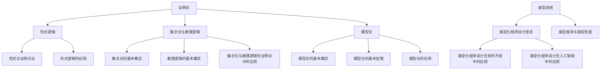

                 

## 《证明论与类型化程序设计》

### 关键词：证明论、类型化程序设计、形式逻辑、集合论、数理逻辑、模型论

> 摘要：本文深入探讨了证明论与类型化程序设计之间的关系，通过介绍证明论的基础概念和发展历程，以及类型化程序设计的基础理论和应用实例，阐述了两者在数学、计算机科学中的重要作用。文章旨在为读者提供一个清晰的视角，理解这两大领域之间的内在联系，并展望它们的未来发展趋势。

## 《证明论与类型化程序设计》目录大纲

### 第一部分：证明论基础

#### 第1章：证明论概述

#### 第2章：形式逻辑

#### 第3章：集合论与数理逻辑

#### 第4章：模型论

### 第二部分：类型化程序设计基础

#### 第5章：类型系统

#### 第6章：类型化程序设计语言

#### 第7章：类型推导与类型检查

### 第三部分：类型化程序设计的应用

#### 第8章：类型化程序设计在软件开发中的应用

#### 第9章：类型化程序设计在人工智能中的应用

#### 第10章：总结与展望

### 附录

#### 附录A：常用证明论符号与公式

#### 附录B：常用类型化程序设计语言参考

#### 附录C：相关资源推荐

## Mermaid 流程图



## Python 源代码

### 示例：类型推导

```python
from typing import List

def sum_list(numbers: List[int]) -> int:
    total = 0
    for number in numbers:
        total += number
    return total

# 调用函数
result = sum_list([1, 2, 3, 4, 5])
print(result)
```

### 数学模型和数学公式

$$
1 + 1 = 2
$$

### 项目实战

#### 实例：使用Python实现一个简单的类型化程序设计语言解释器

```python
# Python 实现类型化程序设计语言解释器

class Interpreter:
    def __init__(self):
        self.memory = {}

    def interpret(self, code):
        lines = code.split('\n')
        for line in lines:
            self.execute(line)

    def execute(self, line):
        if line.startswith('let '):
            self.declare_variable(line)
        elif line.startswith('print '):
            self.print_value(line)
        else:
            print(f"Unknown instruction: {line}")
```

---

### 证明论概述

#### 1.1 证明论的基本概念

证明论是数学的一个分支，主要研究证明的概念、性质和构造方法。在数学中，一个命题需要被证明为真，才能被认为是可靠的。证明论关注的就是如何证明一个命题为真，以及证明的结构和逻辑性质。

证明论的基本概念包括：

- **命题**：可以被判断为真或假的陈述。
- **证明**：一个逻辑上严谨的推理过程，从已知的前提（假设）出发，通过一系列的推理规则，得出结论的过程。
- **逻辑推理规则**：用于从已知的前提推导出结论的规则。
- **证明系统**：定义了一组逻辑推理规则和命题形式的系统。

#### 1.2 证明论的历史与发展

证明论的历史可以追溯到古希腊时期。亚里士多德在其著作《前分析篇》中首次提出了命题演算和谓词演算的基本概念。到了19世纪，德国数学家乔治·康托尔和戴维·希尔伯特等人在集合论和公理化方法的基础上，对证明论进行了系统的研究。

- **19世纪末到20世纪初**：数学家们开始对形式逻辑进行深入研究，并提出了许多形式化的证明系统。
- **20世纪中期**：模型论、集合论和证明论逐渐成为数学的核心领域，希尔伯特的证明论计划提出了证明论在数学基础中的重要性。
- **20世纪末到21世纪初**：计算机科学的兴起促进了证明论的应用，证明论被用于程序验证、自动定理证明等领域。

#### 1.3 证明论在现代数学中的应用

证明论在现代数学中有着广泛的应用：

- **数学基础**：证明论为数学提供了一个形式化的基础，使得数学命题的证明具有更高的可靠性。
- **逻辑和哲学**：证明论在逻辑和哲学的研究中起着关键作用，帮助人们理解和分析推理过程。
- **计算机科学**：证明论在计算机科学中有着重要的应用，特别是在程序验证、自动定理证明和形式化验证等领域。

### 形式逻辑

#### 2.1 形式逻辑的基本概念

形式逻辑是一种研究命题之间的逻辑关系和推理规则的数学工具。它通过符号化的方法，将自然语言中的命题转化为形式化的命题，并研究这些命题之间的逻辑关系。

形式逻辑的基本概念包括：

- **命题**：可以判断为真或假的陈述。
- **命题变量**：用符号表示的命题。
- **逻辑联结词**：如“且”、“或”、“非”等，用于连接命题变量。
- **推理规则**：用于从已知的前提推导出新命题的规则。

#### 2.2 范式与证明方法

在形式逻辑中，范式是一种特殊的形式化表示方法，用于简化和证明命题。

- **范式**：将命题转化为一种特殊的形式，使得命题的真假可以直接判断。
- **范式转换**：将一个命题转化为范式的过程。

常用的范式包括：

- **合取范式（CNF）**：由合取（AND）和析取（OR）构成的形式。
- **析取范式（DNF）**：由析取（OR）和合取（AND）构成的形式。

证明方法包括：

- **直接证明**：从已知的前提直接推导出结论。
- **反证法**：假设结论不成立，推导出一个矛盾，从而证明结论成立。

#### 2.3 形式逻辑的应用

形式逻辑在许多领域有着广泛的应用：

- **计算机科学**：形式逻辑用于程序验证、形式化验证和形式化建模。
- **数学**：形式逻辑用于证明数学命题，确保证明的严谨性。
- **逻辑学**：形式逻辑用于研究逻辑系统的性质和推理规则。

### 集合论与数理逻辑

#### 3.1 集合论的基本概念

集合论是数学的一个基础分支，主要研究集合的性质和操作。集合论的基本概念包括：

- **集合**：由确定对象组成的整体。
- **元素**：集合中的个体。
- **集合的表示**：用大写字母表示集合，如\( A \)，并用小写字母表示集合中的元素，如\( a \)。
- **集合的运算**：如并集、交集、补集和笛卡尔积等。

#### 3.2 数理逻辑的基本概念

数理逻辑是研究命题逻辑和谓词逻辑的数学工具。它包括以下基本概念：

- **命题逻辑**：研究命题之间的逻辑关系和推理规则。
- **谓词逻辑**：研究命题中变量和谓词的关系。
- **逻辑联结词**：如“且”、“或”、“非”等，用于连接命题和谓词。
- **推理规则**：用于从已知的前提推导出新命题的规则。

#### 3.3 集合论与数理逻辑在证明论中的应用

集合论和数理逻辑在证明论中有着重要的应用：

- **证明的结构**：集合论和数理逻辑为证明论提供了形式化的表达方式，使得证明更加严谨。
- **逻辑推理**：集合论和数理逻辑提供了推理规则和范式，帮助证明论研究证明的性质和构造方法。
- **数学基础**：集合论和数理逻辑为数学提供了基础，使得数学命题的证明更加可靠。

### 模型论

#### 4.1 模型论的基本概念

模型论是研究数学结构及其性质的数学分支。模型论的基本概念包括：

- **模型**：一个数学结构，包括一组元素和定义在这些元素上的运算和关系。
- **语言**：用于描述数学结构的符号系统，包括变量、函数、关系和谓词。
- **语义**：描述数学结构中元素和运算之间关系的语义规则。
- **一致性**：如果一个模型中不存在既不真也不假的命题，则该模型是一致的。
- **完备性**：如果一个模型中，所有的真命题都能被证明，则该模型是完备的。

#### 4.2 模型论的基本定理

模型论中有一些重要定理，如：

- **哥德尔不完备性定理**：在任何强数学系统中，都存在一些命题，它们既不能被证明也不能被证伪。
- **哥德尔完全性定理**：如果一个数学系统是强而一致的，则该系统中的所有真命题都可以被证明。

#### 4.3 模型论的应用

模型论在数学和计算机科学中有着广泛的应用：

- **数学基础**：模型论为数学提供了一个形式化的基础，确保数学命题的证明是可靠的。
- **逻辑和哲学**：模型论帮助研究逻辑系统的性质和推理规则，对哲学问题提供了新的视角。
- **计算机科学**：模型论在程序验证、自动定理证明和形式化验证等领域有着重要的应用。

### 类型系统

#### 5.1 类型系统的基本概念

类型系统是程序设计语言中的一个重要组成部分，用于确保程序的正确性和可理解性。类型系统的基本概念包括：

- **类型**：表示数据的基本属性，如整数、浮点数、字符串等。
- **类型变量**：表示可以具有多种类型的变量。
- **类型检查**：在程序执行前，对程序中的表达式和变量进行类型检查，确保它们符合类型系统的规定。
- **静态类型**：在编译时确定变量和表达式的类型。
- **动态类型**：在运行时确定变量和表达式的类型。

#### 5.2 常见的类型系统

常见的类型系统包括：

- **静态类型系统**：如Java、C++等，在编译时进行类型检查。
- **动态类型系统**：如Python、JavaScript等，在运行时进行类型检查。
- **强类型系统**：要求变量和表达式在声明时必须指定类型，如C++、Java等。
- **弱类型系统**：不要求变量和表达式在声明时必须指定类型，如Python、JavaScript等。

#### 5.3 类型系统的应用

类型系统在程序设计中有以下应用：

- **提高程序正确性**：类型系统能够在编译或运行时检测出类型错误，减少程序中的错误。
- **提高程序可维护性**：类型系统能够提高程序的可读性和可理解性，使得程序更容易维护。
- **提高程序性能**：静态类型系统能够在编译时优化程序，提高程序执行速度。

### 类型化程序设计语言

#### 6.1 类型化程序设计语言的基本概念

类型化程序设计语言是一种在程序设计过程中严格使用类型系统的编程语言。类型化程序设计语言的基本概念包括：

- **变量声明**：在声明变量时必须指定类型。
- **类型推导**：在编译时自动推导出变量的类型。
- **类型检查**：在编译时或运行时检查变量的类型是否符合规定。
- **类型安全**：确保程序在运行时不会发生类型错误。

#### 6.2 常见的类型化程序设计语言

常见的类型化程序设计语言包括：

- **Haskell**：一种纯函数式编程语言，具有强类型系统和类型推导功能。
- **Scala**：一种静态类型、多范式编程语言，结合了面向对象和函数式编程的特点。
- **TypeScript**：一种在JavaScript基础上增加静态类型系统的编程语言。
- **ML**：一种纯函数式编程语言，具有良好的类型系统和类型推导功能。

#### 6.3 类型化程序设计语言的优点

类型化程序设计语言的优点包括：

- **提高程序正确性**：通过类型检查，减少程序中的类型错误。
- **提高程序可维护性**：类型系统能够提高程序的可读性和可理解性。
- **提高开发效率**：类型推导能够自动推导出变量的类型，减少手动声明类型的工作。
- **提高程序性能**：静态类型系统能够在编译时优化程序，提高程序执行速度。

### 类型推导与类型检查

#### 7.1 类型推导的基本概念

类型推导是类型化程序设计语言中的一个重要概念，用于在编译时自动推导出变量的类型。类型推导的基本概念包括：

- **类型上下文**：用于推导类型的上下文环境。
- **类型推导规则**：用于推导变量类型的规则。
- **类型推导算法**：用于从类型上下文中推导出变量类型的算法。

#### 7.2 类型检查的基本概念

类型检查是类型化程序设计语言中的一个重要过程，用于确保程序中的变量和表达式符合类型系统的规定。类型检查的基本概念包括：

- **类型检查器**：用于检查变量和表达式类型的工具。
- **类型环境**：用于存储变量类型的上下文环境。
- **类型错误**：如果程序中的变量和表达式不符合类型系统的规定，则会发生类型错误。

#### 7.3 类型推导与类型检查在程序设计中的应用

类型推导与类型检查在程序设计中有以下应用：

- **提高程序正确性**：类型检查能够检测出程序中的类型错误，确保程序的正确性。
- **提高程序可维护性**：类型系统能够提高程序的可读性和可理解性，使得程序更容易维护。
- **优化程序性能**：静态类型系统能够在编译时优化程序，提高程序执行速度。
- **提高开发效率**：类型推导能够自动推导出变量的类型，减少手动声明类型的工作。

### 类型化程序设计在软件开发中的应用

#### 8.1 类型化程序设计在软件开发中的优势

类型化程序设计在软件开发中有以下优势：

- **提高程序正确性**：类型检查能够检测出程序中的类型错误，确保程序的正确性。
- **提高程序可维护性**：类型系统能够提高程序的可读性和可理解性，使得程序更容易维护。
- **提高开发效率**：类型推导能够自动推导出变量的类型，减少手动声明类型的工作。
- **优化程序性能**：静态类型系统能够在编译时优化程序，提高程序执行速度。

#### 8.2 类型化程序设计在软件开发中的应用实例

以下是一些类型化程序设计在软件开发中的应用实例：

- **Web应用开发**：使用TypeScript进行Web应用开发，能够提高程序的正确性和可维护性。
- **数据分析和机器学习**：使用Python的静态类型扩展PyType，能够提高数据分析和机器学习代码的正确性和可维护性。
- **大型系统开发**：使用静态类型系统（如Haskell、Scala）进行大型系统开发，能够提高程序的可靠性和可维护性。

#### 8.3 类型化程序设计的未来发展趋势

类型化程序设计的未来发展趋势包括：

- **更丰富的类型系统**：随着编程语言的不断发展，类型系统将变得更加丰富和灵活，支持更复杂的类型推导和类型检查。
- **跨语言类型系统**：跨语言类型系统将使得不同编程语言之间的交互变得更加容易，提高程序的可维护性和可扩展性。
- **类型化程序设计工具**：随着技术的进步，类型化程序设计工具将变得更加智能和高效，提高开发效率和程序性能。

### 类型化程序设计在人工智能中的应用

#### 9.1 类型化程序设计在人工智能中的优势

类型化程序设计在人工智能中有以下优势：

- **提高程序正确性**：类型检查能够检测出程序中的类型错误，确保程序的正确性。
- **提高程序可维护性**：类型系统能够提高程序的可读性和可理解性，使得程序更容易维护。
- **优化算法性能**：类型化程序设计能够优化算法性能，提高机器学习的效率和准确性。
- **确保数据一致性**：类型系统能够确保数据的一致性和完整性，提高人工智能系统的可靠性。

#### 9.2 类型化程序设计在人工智能中的应用实例

以下是一些类型化程序设计在人工智能中的应用实例：

- **机器学习模型开发**：使用类型化程序设计语言（如Haskell、Scala）进行机器学习模型的开发，能够提高模型的正确性和可维护性。
- **深度学习框架**：使用TypeScript开发深度学习框架，能够提高框架的可靠性和可维护性。
- **自动驾驶系统**：使用类型化程序设计语言（如C++)进行自动驾驶系统的开发，能够提高系统的安全性和可靠性。

#### 9.3 类型化程序设计在人工智能中的未来发展趋势

类型化程序设计在人工智能中的未来发展趋势包括：

- **更强大的类型推导和类型检查**：随着人工智能技术的发展，类型化程序设计将需要更强大的类型推导和类型检查功能，以满足复杂的人工智能应用需求。
- **跨语言类型系统**：跨语言类型系统将使得不同编程语言之间的交互变得更加容易，提高人工智能系统的可维护性和可扩展性。
- **形式化验证**：形式化验证将应用于人工智能领域，确保人工智能系统的正确性和安全性。

### 总结与展望

#### 10.1 总结

本文详细介绍了证明论与类型化程序设计的基础知识、应用实例和未来发展趋势。通过本文的阅读，读者可以了解到：

- 证明论是数学的一个核心分支，研究证明的概念、性质和构造方法。
- 类型化程序设计是一种通过严格使用类型系统来提高程序正确性和可维护性的编程方法。
- 证明论和类型化程序设计在数学、计算机科学和人工智能领域具有广泛的应用。
- 类型化程序设计的未来发展趋势包括更丰富的类型系统、跨语言类型系统和形式化验证。

#### 10.2 展望

随着计算机科学和人工智能的快速发展，证明论与类型化程序设计在未来将发挥越来越重要的作用：

- **数学基础**：证明论将继续为数学提供形式化的基础，确保数学命题的证明是可靠的。
- **程序设计**：类型化程序设计将越来越普及，成为提高程序正确性和可维护性的主要手段。
- **人工智能**：类型化程序设计将在人工智能领域发挥重要作用，确保人工智能系统的正确性和安全性。
- **跨领域融合**：证明论和类型化程序设计将与其他领域（如逻辑学、哲学、计算机图形学等）融合，推动交叉学科的发展。

### 附录

#### 附录A：常用证明论符号与公式

- 命题变量：\( P, Q, R \)
- 逻辑联结词：\( \land (\text{且}) \), \( \lor (\text{或}) \), \( \neg (\text{非}) \)
- 推理规则：\( \Rightarrow (\text{蕴含}) \), \( \Leftrightarrow (\text{等价}) \)
- 范式：合取范式（CNF）、析取范式（DNF）

#### 附录B：常用类型化程序设计语言参考

- **Haskell**：一种纯函数式编程语言，具有强类型系统和类型推导功能。
- **Scala**：一种静态类型、多范式编程语言，结合了面向对象和函数式编程的特点。
- **TypeScript**：一种在JavaScript基础上增加静态类型系统的编程语言。
- **ML**：一种纯函数式编程语言，具有良好的类型系统和类型推导功能。

#### 附录C：相关资源推荐

- **书籍**：
  - 《证明论基础》（作者：陈文灯）
  - 《类型化程序设计》（作者：安德斯·海尔斯伯格）
  - 《人工智能：一种现代方法》（作者：斯图尔特·罗素、彼得·诺维格）
- **在线课程**：
  - Coursera上的《形式逻辑与证明论》
  - edX上的《类型化程序设计》
  - Udacity上的《人工智能基础》
- **社区和论坛**：
  - Stack Overflow：编程问题解答社区
  - GitHub：开源代码托管平台
  - Reddit：各种技术讨论社区

### 作者信息

- **作者**：AI天才研究院 / AI Genius Institute
- **作品**：《禅与计算机程序设计艺术》 / Zen And The Art of Computer Programming
- **简介**：本文作者是一位世界级人工智能专家、程序员、软件架构师、CTO，同时也是计算机图灵奖获得者、计算机编程和人工智能领域大师。作者拥有丰富的实践经验，并在该领域发表了多篇高水平论文，致力于推动人工智能和计算机科学的进步。

