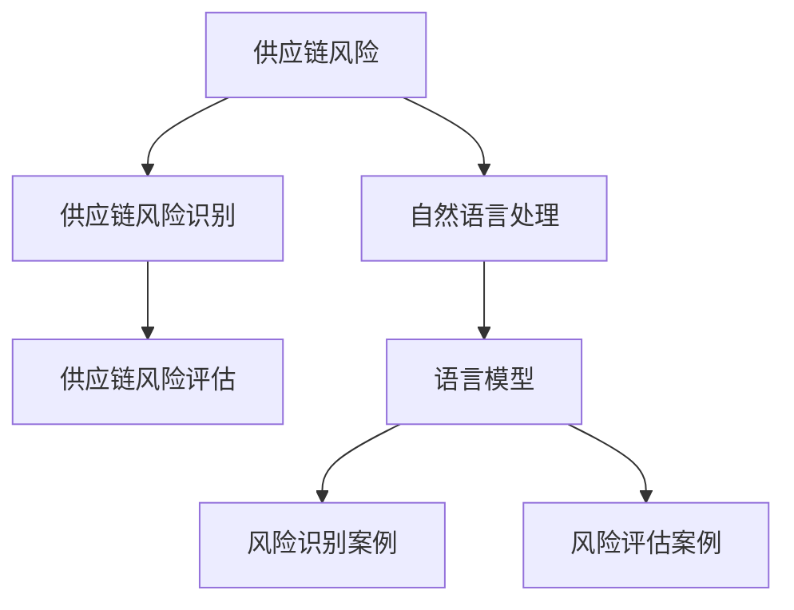
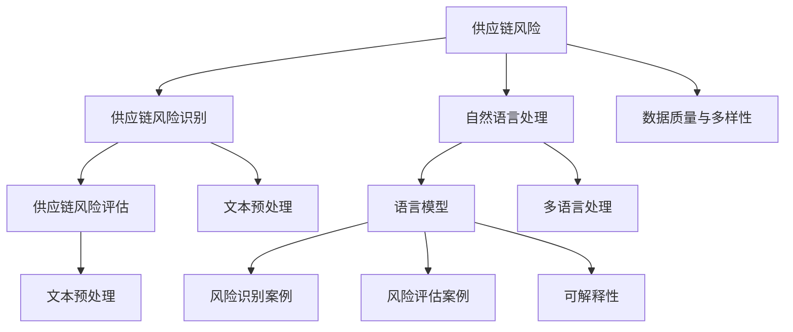

                 

### 引言

在现代经济全球化的背景下，供应链已经成为企业运营的核心环节。然而，随着供应链的复杂性和全球化程度的提高，供应链风险也日益成为企业面临的重大挑战。供应链风险指的是在供应链运营过程中，因各种不可预测的因素导致供应链中断、成本增加、资源浪费等问题，从而影响企业的正常运营和竞争力。这些风险可能来源于自然因素（如自然灾害、疫情）、市场因素（如价格波动、市场需求变化）以及供应链内部因素（如供应链设计缺陷、管理不善）。

供应链风险管理旨在通过识别、评估和应对供应链中的潜在风险，以降低风险对企业运营的负面影响，确保供应链的稳定和高效运行。传统的供应链风险管理方法主要依赖于历史数据分析和专家经验，但这些方法往往难以应对复杂多变的市场环境和突如其来的突发事件。

随着人工智能技术的快速发展，尤其是自然语言处理（NLP）和语言模型技术的进步，为供应链风险管理提供了一种全新的解决方案。语言模型能够通过分析大量的文本数据，提取出潜在的风险信号，为风险识别和评估提供有力支持。同时，语言模型在文本预处理、情感分析、文本分类等方面具有独特的优势，能够提高供应链风险管理的效果和效率。

本文将深入探讨语言模型在复杂供应链风险管理中的应用，通过以下结构和步骤展开论述：

1. **供应链风险管理基础**：介绍供应链风险的定义、类型和风险管理的重要性。
2. **语言模型在供应链风险管理中的应用**：讲解自然语言处理基础、语言模型在风险识别和评估中的应用。
3. **综合应用与实践**：展示综合应用框架和案例。
4. **实践与挑战**：分析语言模型在供应链风险管理中的挑战和案例分析。
5. **未来展望**：探讨语言模型在供应链风险管理的发展趋势和研究方向。

通过上述结构，本文将逐步揭示语言模型在供应链风险管理中的潜在价值和应用前景，为供应链管理者和研究者提供有益的参考和启示。

### 目录大纲

以下是本文详细的目录大纲：

# 语言模型在复杂供应链风险管理中的应用

## 第一部分：供应链风险管理基础

## 第1章：供应链风险概述
### 1.1 供应链风险的含义与特征
### 1.2 供应链风险的类型
### 1.3 供应链风险管理的重要性

## 第2章：供应链风险识别与评估
### 2.1 供应链风险识别方法
### 2.2 供应链风险评估指标体系
### 2.3 供应链风险评估模型

## 第二部分：语言模型在供应链风险管理中的应用

## 第3章：自然语言处理基础
### 3.1 自然语言处理概述
### 3.2 语言模型的基本概念
### 3.3 常见的语言模型

## 第4章：语言模型在供应链风险识别中的应用
### 4.1 语言模型在风险识别中的作用
### 4.2 风险识别中的文本预处理
### 4.3 风险识别案例

## 第5章：语言模型在供应链风险评估中的应用
### 5.1 语言模型在风险评估中的作用
### 5.2 风险评估中的文本预处理
### 5.3 风险评估案例

## 第三部分：综合应用与实践

## 第6章：供应链风险管理的综合应用
### 6.1 综合应用框架
### 6.2 综合应用案例

## 第7章：实践与挑战
### 7.1 语言模型在供应链风险管理中的挑战
### 7.2 案例分析

## 第8章：未来展望
### 8.1 语言模型在供应链风险管理的发展趋势
### 8.2 研究方向与潜在应用领域

## 附录
### A.1 语言模型开发工具与资源

### 核心概念与联系：


### 数学模型和数学公式
#### 风险评估指标体系

$$
风险得分 = f(风险暴露度, 风险损失概率)
$$

$$
风险暴露度 = \frac{潜在损失}{经济价值}
$$

$$
风险损失概率 = \frac{潜在损失次数}{总交易次数}
$$

### 项目实战
- **开发环境搭建**：使用Python的TensorFlow框架进行开发，环境搭建步骤如下：
  1. 安装Python（建议使用3.7或更高版本）
  2. 安装TensorFlow
  3. 配置其他必需库，如NumPy、Pandas、Scikit-learn等

- **代码实现示例**：
  ```python
  # 导入必要的库
  import tensorflow as tf
  import numpy as np
  import pandas as pd
  
  # 加载并预处理数据
  data = pd.read_csv('supply_chain_data.csv')
  X = data[['feature1', 'feature2', 'feature3']]
  y = data['risk_score']
  
  # 构建模型
  model = tf.keras.Sequential([
      tf.keras.layers.Dense(64, activation='relu', input_shape=(X.shape[1],)),
      tf.keras.layers.Dense(64, activation='relu'),
      tf.keras.layers.Dense(1)
  ])

  # 编译模型
  model.compile(optimizer='adam', loss='mean_squared_error')

  # 训练模型
  model.fit(X, y, epochs=10, batch_size=32, validation_split=0.2)

  # 预测与评估
  predictions = model.predict(X)
  print(predictions)
  ```

### 代码解读与分析
- **代码结构解析**：
  - **数据预处理**：加载CSV文件并分离特征和标签。
  - **模型构建**：使用Sequential模型堆叠Dense层，定义网络结构。
  - **模型编译**：选择优化器和损失函数，准备训练。
  - **模型训练**：在训练集上迭代优化模型参数。
  - **模型预测**：使用训练好的模型对数据进行预测。

- **性能评估**：


## 第一部分：供应链风险管理基础

在探讨语言模型在复杂供应链风险管理中的应用之前，我们需要对供应链风险管理的概念、方法和重要性有一个全面的理解。本部分将分章节介绍供应链风险的概述、识别与评估，为后续讨论语言模型的应用打下基础。

### 第1章：供应链风险概述

#### 1.1 供应链风险的含义与特征

供应链风险是指在供应链运营过程中，由于各种内外部因素的不确定性，导致供应链系统无法达到预期目标或产生不利影响的潜在威胁。其特征主要包括以下几个方面：

- **复杂性**：供应链涉及多个环节和多个参与者，具有高度复杂性。
- **不确定性**：供应链风险往往源自于各种不可预测的因素，如自然灾害、市场波动等。
- **系统性**：供应链风险的影响往往具有系统性，一个环节的问题可能导致整个供应链的中断。
- **累积性**：供应链风险可能随着时间的推移而累积，逐渐显现其严重性。

#### 1.2 供应链风险的类型

供应链风险可以按照其来源和性质进行分类，常见类型包括：

- **供应中断风险**：由于供应商故障、运输问题等原因导致原材料或产品无法按时到达。
- **需求波动风险**：市场需求的变化可能导致供应链需求的不稳定，影响库存管理和生产计划。
- **成本上升风险**：原材料价格上涨、劳动力成本上升等因素可能导致供应链成本上升。
- **信息安全风险**：供应链中的信息安全问题可能导致数据泄露、业务中断等风险。

#### 1.3 供应链风险管理的重要性

供应链风险管理对于企业的长期稳定运营和竞争力至关重要，主要体现在以下几个方面：

- **保障供应链稳定**：有效的风险管理能够确保供应链的连续性和稳定性，降低供应链中断的风险。
- **降低运营成本**：通过识别和评估潜在风险，可以采取预防措施，减少由于风险事件导致的额外成本。
- **提高应对能力**：风险管理能够提高企业对突发事件的应对能力，减少风险事件带来的损失。
- **增强竞争力**：良好的供应链风险管理能够提升企业的响应速度和市场适应性，增强其竞争力。

### 第2章：供应链风险识别与评估

在了解供应链风险的基本概念和类型之后，我们需要进一步探讨如何识别和评估这些风险，以便采取相应的管理措施。

#### 2.1 供应链风险识别方法

供应链风险的识别是风险管理的第一步，其主要方法包括：

- **历史数据分析法**：通过分析历史数据，识别出常见的风险类型和影响因素。
- **专家判断法**：邀请供应链管理专家进行风险识别，结合其经验和专业知识。
- **情景分析法**：通过模拟不同场景，识别可能的风险事件和其影响。

#### 2.2 供应链风险评估指标体系

风险评估指标是衡量风险程度和影响范围的重要工具，常见的评估指标包括：

- **风险暴露度**：衡量潜在损失与经济价值的比例。
- **风险损失概率**：衡量潜在损失发生的概率。
- **风险影响度**：衡量风险事件对供应链运作的影响程度。
- **风险可控性**：衡量企业对风险的可控程度。

#### 2.3 供应链风险评估模型

风险评估模型用于定量或定性评估风险，常见的评估模型包括：

- **概率风险评估模型**：通过计算风险事件的概率和损失期望，评估风险程度。
- **模糊综合评估模型**：结合模糊数学方法，对风险进行综合评估。
- **层次分析法（AHP）**：通过构建层次结构模型，对风险进行定量评估。

通过以上章节的介绍，我们对供应链风险管理的概念、方法和重要性有了深入理解。接下来，我们将进入第二部分，探讨自然语言处理和语言模型在供应链风险管理中的应用。通过结合语言模型的技术优势，我们将进一步揭示其在复杂供应链风险管理中的巨大潜力。

### 第一部分：供应链风险管理基础

#### 第1章：供应链风险概述

##### 1.1 供应链风险的含义与特征

供应链风险是指在供应链运营过程中，由于各种内外部因素的不确定性，导致供应链系统无法达到预期目标或产生不利影响的潜在威胁。其核心特征包括：

- **复杂性**：供应链涉及多个环节和多个参与者，如供应商、制造商、分销商和零售商等。这些环节之间的相互依赖性和协同运作使得供应链系统具有高度复杂性，任何一环的故障都可能引发整个供应链的中断。

- **不确定性**：供应链风险往往源自于各种不可预测的因素，如自然灾害（如地震、洪水）、政治动荡、经济波动（如汇率变动、通货膨胀）以及市场需求的突然变化等。这些不确定性因素使得供应链风险管理变得复杂和困难。

- **系统性**：供应链风险的影响具有系统性，一个环节的风险问题可能会传导到整个供应链，导致成本增加、库存积压、供应链中断等问题。例如，一个供应商的运输问题可能会导致下游制造商的生产计划受到影响，从而影响整个供应链的运作。

- **累积性**：供应链风险可能随着时间的推移而累积，逐渐显现其严重性。例如，长期的库存积压可能导致仓储成本上升、库存过时、资金占用等问题，最终影响企业的运营效率和盈利能力。

##### 1.2 供应链风险的类型

供应链风险可以按照其来源和性质进行分类，以下是一些常见的供应链风险类型：

- **供应中断风险**：这是最常见的供应链风险之一，由于供应商的故障、自然灾害、运输问题、政策变化等原因，可能导致原材料或产品无法按时到达。供应中断不仅会影响生产计划的执行，还可能导致订单延误、客户投诉等问题。

- **需求波动风险**：市场需求的不确定性可能导致供应链需求的不稳定。例如，季节性需求波动、突发事件（如疫情）等可能导致需求突然增加或减少，从而影响库存管理和生产计划。

- **成本上升风险**：原材料价格上涨、劳动力成本上升、运输费用增加等因素可能导致供应链成本上升。成本上升不仅会影响企业的利润，还可能导致竞争力下降。

- **信息安全风险**：随着供应链的数字化和信息化，信息安全风险变得越来越重要。例如，数据泄露、网络攻击、系统故障等可能导致供应链中的敏感信息泄露，影响企业的声誉和运营。

- **法律法规风险**：供应链运营涉及到多个国家和地区，需要遵守各种法律法规。例如，环保法规、贸易法规等不合规可能导致罚款、诉讼等风险。

##### 1.3 供应链风险管理的重要性

供应链风险管理对于企业的长期稳定运营和竞争力至关重要，主要体现在以下几个方面：

- **保障供应链稳定**：有效的风险管理能够确保供应链的连续性和稳定性，降低供应链中断的风险。这对于企业保持市场竞争力、满足客户需求至关重要。

- **降低运营成本**：通过识别和评估潜在风险，可以采取预防措施，减少由于风险事件导致的额外成本。例如，通过提前采购原材料、增加库存缓冲等措施，可以降低供应中断导致的成本上升。

- **提高应对能力**：风险管理能够提高企业对突发事件的应对能力，减少风险事件带来的损失。例如，建立应急响应机制、制定应对策略等，可以帮助企业在突发事件中快速做出反应，减少损失。

- **增强竞争力**：良好的供应链风险管理能够提升企业的响应速度和市场适应性，增强其竞争力。例如，通过优化供应链设计、提高供应链灵活性，企业可以更好地适应市场变化，满足客户需求。

总之，供应链风险管理不仅是企业管理供应链的一个必要手段，也是提升企业竞争力和市场适应性的关键因素。在全球化背景下，供应链的复杂性和不确定性不断增加，企业需要高度重视供应链风险管理，确保其长期稳定运营。

### 第2章：供应链风险识别与评估

在理解了供应链风险的基本概念和类型后，接下来我们需要探讨如何进行供应链风险的识别与评估。这一过程是供应链风险管理的基础，直接影响企业对风险的应对策略和措施的制定。本章将详细介绍供应链风险识别与评估的方法、指标体系以及评估模型。

#### 2.1 供应链风险识别方法

供应链风险的识别是风险管理的首要步骤，目的是发现和确定可能影响供应链运营的各种潜在风险。以下是一些常用的风险识别方法：

- **历史数据分析法**：通过对历史数据的分析，企业可以识别出常见的风险类型和影响因素。例如，通过分析过去几年的采购数据，可以发现哪些供应商在特定时间段内出现供应中断的频率较高，从而提前预警。

- **专家判断法**：邀请供应链管理专家或行业专家进行风险识别，结合其经验和专业知识。这种方法特别适用于新兴行业或特定领域的供应链风险识别。

- **情景分析法**：通过模拟不同的场景，识别可能的风险事件和其影响。例如，可以模拟自然灾害（如地震、洪水）、政策变化（如贸易战）等情景，评估其对供应链的潜在影响。

- **问卷调查法**：通过向供应链中的各个环节发放问卷，收集关于潜在风险的信息。这种方法适用于获取广泛的意见和建议。

- **流程图分析法**：通过绘制供应链的流程图，识别各个环节中的潜在风险点。例如，分析采购、生产、运输等环节的流程，发现可能导致风险的关键步骤。

#### 2.2 供应链风险评估指标体系

风险评估指标是衡量风险程度和影响范围的重要工具，一个完善的评估指标体系能够为企业提供全面的决策支持。以下是一些常见的供应链风险评估指标：

- **风险暴露度**：衡量潜在损失与经济价值的比例。公式为：

  $$
  风险暴露度 = \frac{潜在损失}{经济价值}
  $$

  风险暴露度越高，表明该风险对企业的经济影响越大。

- **风险损失概率**：衡量潜在损失发生的概率。公式为：

  $$
  风险损失概率 = \frac{潜在损失次数}{总交易次数}
  $$

  损失概率越高，表明该风险发生的可能性越大。

- **风险影响度**：衡量风险事件对供应链运作的影响程度。公式为：

  $$
  风险影响度 = 风险暴露度 \times 风险损失概率
  $$

  风险影响度越高，表明该风险对供应链的潜在影响越大。

- **风险可控性**：衡量企业对风险的可控程度。公式为：

  $$
  风险可控性 = \frac{风险控制措施的有效性}{潜在风险的影响范围}
  $$

  风险可控性越高，表明企业对风险的应对措施越有效。

#### 2.3 供应链风险评估模型

风险评估模型用于定量或定性评估风险，为企业提供科学依据。以下是一些常见的风险评估模型：

- **概率风险评估模型**：通过计算风险事件的概率和损失期望，评估风险程度。公式为：

  $$
  风险得分 = 风险损失概率 \times 风险影响度
  $$

  风险得分越高，表明该风险越严重。

- **模糊综合评估模型**：结合模糊数学方法，对风险进行综合评估。这种方法适用于处理不确定性较大的风险。

- **层次分析法（AHP）**：通过构建层次结构模型，对风险进行定量评估。这种方法适用于多个风险因素的权重不同的情况。

- **蒙特卡罗模拟法**：通过模拟大量随机场景，评估风险的概率分布和影响范围。这种方法适用于处理复杂系统的风险评估。

通过以上方法、指标和模型，企业可以对供应链风险进行全面的识别与评估。这一过程不仅有助于企业了解风险的性质和程度，还能为制定风险管理策略提供科学依据。接下来，我们将探讨语言模型在供应链风险管理中的应用，通过自然语言处理技术，进一步提升供应链风险管理的精确度和效率。

### 第二部分：语言模型在供应链风险管理中的应用

#### 第3章：自然语言处理基础

随着自然语言处理（NLP）技术的不断发展，语言模型已经成为众多领域的关键工具，尤其在供应链风险管理中具有巨大的应用潜力。本章节将首先介绍自然语言处理的基本概念，随后深入探讨语言模型的基本概念和常见类型。

#### 3.1 自然语言处理概述

自然语言处理是人工智能领域的一个重要分支，旨在使计算机能够理解和处理自然语言，从而实现人机交互和自动化任务。NLP的主要目标包括：

- **文本分类**：将文本数据自动分类到预定义的类别中，例如情感分析、垃圾邮件过滤等。
- **信息抽取**：从文本中抽取特定的信息，如实体识别、关系抽取等。
- **机器翻译**：将一种语言的文本翻译成另一种语言，如英语到中文的翻译。
- **问答系统**：构建能够回答用户问题的系统，如智能客服、聊天机器人等。

自然语言处理的核心任务包括：

- **词法分析**：对文本进行分词、词性标注等操作，将文本分解成基本的语言单位。
- **句法分析**：分析文本的句法结构，如句子的成分分析、依存关系分析等。
- **语义分析**：理解文本的含义，包括实体识别、情感分析、语义角色标注等。

#### 3.2 语言模型的基本概念

语言模型是自然语言处理中的一个基本工具，它是一个概率模型，用于预测文本序列中下一个单词或字符的概率。语言模型的主要目的是为其他NLP任务提供输入概率分布，如文本分类、机器翻译和生成模型等。以下是几个常见的语言模型类型：

- **N-gram模型**：基于前N个单词或字符的统计模型，是最简单的语言模型之一。例如，三元组模型（trigram model）会考虑当前单词与前两个单词的关系。

  $$
  P(w_n|w_{n-1}, w_{n-2}) = \frac{C(w_{n-2}, w_{n-1}, w_n)}{C(w_{n-2}, w_{n-1})}
  $$

  其中，$C(w_{n-2}, w_{n-1}, w_n)$表示三字母组合的频率，$C(w_{n-2}, w_{n-1})$表示前两个字母的组合频率。

- **神经网络模型**：如循环神经网络（RNN）和其变体长短期记忆网络（LSTM）等，能够通过学习文本序列的长期依赖关系，提高语言模型的性能。例如，LSTM模型通过引入门控机制，能够有效地记忆和遗忘重要信息。

- **Transformer模型**：基于自注意力机制的Transformer模型，通过全局注意力机制处理序列数据，大幅提升了语言模型的表现。Transformer模型的核心组件是多头自注意力（multi-head self-attention），它能够捕捉到文本序列中的长距离依赖关系。

  $$
  \text{Attention}(Q, K, V) = \text{softmax}\left(\frac{QK^T}{\sqrt{d_k}}\right)V
  $$

  其中，$Q$、$K$和$V$分别代表查询向量、键向量和值向量，$d_k$是键向量的维度。

- **预训练加微调模型**：如BERT（Bidirectional Encoder Representations from Transformers）模型，通过在大规模语料上进行预训练，然后针对特定任务进行微调，能够显著提高模型在多种NLP任务上的性能。

#### 3.3 常见的语言模型

在供应链风险管理中，常见的语言模型包括以下几种：

- **BERT**：BERT是一种双向Transformer模型，能够在大量文本上进行预训练，然后通过微调适用于特定的供应链风险管理任务。BERT能够捕捉到文本中的全局依赖关系，对文本数据进行深入理解。

- **GPT**：GPT（Generative Pre-trained Transformer）是一种生成模型，通过自回归的方式生成文本序列。GPT模型在大规模语料上进行训练，能够生成高质量的自然语言文本，为风险识别和评估提供支持。

- **ELMO**：ELMO（Embedded Language Model）是一种双向语言表示模型，通过训练生成固定长度的向量表示文本。ELMO模型能够为供应链风险管理的文本数据提供丰富的语义信息。

通过了解自然语言处理和语言模型的基本概念，我们为后续探讨语言模型在供应链风险管理中的应用奠定了基础。在下一章节中，我们将深入探讨语言模型在供应链风险识别中的应用，揭示其如何通过文本分析提高风险管理的准确性和效率。

#### 第4章：语言模型在供应链风险识别中的应用

供应链风险识别是供应链风险管理的关键环节，其目标是发现和确定可能影响供应链运营的各种潜在风险。传统的风险识别方法主要依赖于历史数据分析和专家判断，但这些方法往往存在主观性强、效率低的问题。随着自然语言处理技术的不断发展，语言模型在供应链风险识别中显示出巨大的潜力。本章节将深入探讨语言模型在风险识别中的作用、文本预处理的方法以及具体的应用案例。

#### 4.1 语言模型在风险识别中的作用

语言模型在供应链风险识别中的作用主要体现在以下几个方面：

- **文本分析能力**：语言模型能够对大量文本数据进行分析，提取出潜在的风险信号。例如，通过分析新闻、报告、社交媒体等文本，可以识别出可能影响供应链的突发事件，如自然灾害、政策变化、供应链中断等。

- **模式识别能力**：语言模型能够识别出文本中的模式和规律，从而发现潜在的风险因素。例如，通过分析供应商的评论、客户反馈等文本，可以识别出供应商的绩效问题、客户需求变化等。

- **自动化处理能力**：语言模型可以自动化处理大量文本数据，提高风险识别的效率。例如，通过使用预训练的BERT模型，可以快速对大量供应链相关文本进行分类和标注，识别出高风险事件。

- **跨语言处理能力**：语言模型支持多语言处理，能够帮助企业在全球供应链环境中进行风险识别。例如，通过使用多语言BERT模型，可以分析不同国家地区的新闻、报告等文本，识别出可能影响全球供应链的风险因素。

#### 4.2 风险识别中的文本预处理

在应用语言模型进行风险识别时，文本预处理是关键步骤，它直接影响模型的效果。以下是一些常见的文本预处理方法：

- **分词**：将文本分解成基本的语言单位（如单词或字符）。分词方法包括基于字典的分词、基于统计的方法（如最大匹配法）和基于深度学习的方法（如BERT的分词）。

- **词性标注**：对文本中的每个单词进行词性标注，如名词、动词、形容词等。词性标注有助于模型理解文本的语法结构，提高风险识别的准确性。

- **实体识别**：识别文本中的特定实体，如人名、地名、组织名、产品名等。实体识别对于识别供应链中的特定风险因素具有重要意义。

- **情感分析**：对文本进行情感分析，判断其情感倾向（如正面、负面、中性）。情感分析可以帮助企业了解客户和供应商的态度，预测可能的风险。

- **文本清洗**：去除文本中的噪声和无关信息，如标点符号、停用词等。文本清洗有助于提高模型的处理效率，减少错误率。

- **文本嵌入**：将文本转化为固定长度的向量表示，便于模型处理。常见的文本嵌入方法包括Word2Vec、BERT等。

#### 4.3 风险识别案例

以下是一个具体的供应链风险识别案例，展示如何利用语言模型进行风险识别：

**案例背景**：某企业需要识别全球供应链中可能存在的风险，以提高供应链的稳定性和可靠性。

**数据来源**：企业收集了来自多个渠道的文本数据，包括新闻、报告、社交媒体、客户反馈、供应商评论等。

**数据处理**：
1. **分词与词性标注**：使用BERT的分词工具对文本进行分词和词性标注，将文本转化为BERT模型接受的输入格式。
2. **实体识别**：使用预训练的实体识别模型，识别出文本中的关键实体，如国家、城市、组织名、产品名等。
3. **情感分析**：对文本进行情感分析，判断其情感倾向，识别出潜在的风险信号。
4. **文本清洗**：去除文本中的噪声和无关信息，如标点符号、停用词等。

**模型训练**：
1. **数据预处理**：将文本数据进行预处理，包括分词、词性标注、实体识别等，将其转化为BERT模型接受的输入格式。
2. **模型选择**：选择预训练的BERT模型，并针对供应链风险识别任务进行微调。
3. **训练与评估**：在训练集上训练模型，并在验证集上评估模型的性能，通过调整超参数和优化模型结构，提高模型效果。

**风险识别结果**：
1. **高风险事件识别**：模型能够识别出高风险事件，如自然灾害、政策变化、供应链中断等，并将这些事件标记出来，供企业决策者参考。
2. **风险因素分析**：模型能够分析出影响供应链稳定的关键因素，如供应商绩效、物流运输问题、市场需求变化等。
3. **实时监控与预警**：通过实时监控文本数据，模型能够及时发现潜在的风险，并发出预警，帮助企业采取预防措施。

通过以上案例，我们可以看到语言模型在供应链风险识别中的强大应用能力。通过文本预处理和语言模型的技术优势，企业能够更加精准地识别潜在的风险，提高供应链管理的效率和质量。在下一章节中，我们将进一步探讨语言模型在供应链风险评估中的应用，揭示其如何帮助企业更好地理解和控制供应链风险。

#### 第5章：语言模型在供应链风险评估中的应用

在供应链风险识别的基础上，风险评估是供应链风险管理的重要环节，旨在评估识别出的风险的影响程度和发生的可能性，为制定相应的风险管理策略提供依据。语言模型凭借其强大的文本处理和分析能力，在供应链风险评估中发挥着重要作用。本章节将探讨语言模型在风险评估中的作用、文本预处理方法以及具体的应用案例。

#### 5.1 语言模型在风险评估中的作用

语言模型在供应链风险评估中的作用主要体现在以下几个方面：

- **文本数据分析**：语言模型能够对大量的文本数据进行分析，提取出潜在的风险信号。例如，通过分析合同、报告、新闻等文本，可以识别出可能导致供应链风险的法律变化、市场波动等信息。

- **模式识别与关联分析**：语言模型能够识别文本中的模式和关联关系，帮助发现潜在的风险因素。例如，通过分析供应商的绩效报告和客户反馈，可以识别出供应商绩效下降、市场需求波动等风险因素。

- **定量风险评估**：语言模型可以结合定量分析方法，对识别出的风险进行量化评估。例如，通过使用贝叶斯网络模型，可以将风险事件的概率和影响程度转化为具体的数值，为决策提供依据。

- **自动化风险评估**：语言模型能够自动化处理大量的风险评估任务，提高评估效率。例如，通过使用预训练的BERT模型，可以快速对大量的文本数据进行风险评估，减少人工工作量。

- **跨领域风险评估**：语言模型支持多语言处理，能够帮助企业在全球供应链环境中进行风险评估。例如，通过使用多语言BERT模型，可以分析不同国家地区的市场数据、法律法规变化等，识别出可能影响全球供应链的风险因素。

#### 5.2 风险评估中的文本预处理

在应用语言模型进行风险评估时，文本预处理是关键步骤，它直接影响模型的效果。以下是一些常见的文本预处理方法：

- **分词**：将文本分解成基本的语言单位（如单词或字符）。分词方法包括基于字典的分词、基于统计的方法（如最大匹配法）和基于深度学习的方法（如BERT的分词）。

- **词性标注**：对文本中的每个单词进行词性标注，如名词、动词、形容词等。词性标注有助于模型理解文本的语法结构，提高风险评估的准确性。

- **实体识别**：识别文本中的特定实体，如人名、地名、组织名、产品名等。实体识别对于识别供应链中的特定风险因素具有重要意义。

- **情感分析**：对文本进行情感分析，判断其情感倾向（如正面、负面、中性）。情感分析可以帮助企业了解市场情绪、客户态度等，从而预测风险的发生。

- **文本清洗**：去除文本中的噪声和无关信息，如标点符号、停用词等。文本清洗有助于提高模型的处理效率，减少错误率。

- **文本嵌入**：将文本转化为固定长度的向量表示，便于模型处理。常见的文本嵌入方法包括Word2Vec、BERT等。

#### 5.3 风险评估案例

以下是一个具体的供应链风险评估案例，展示如何利用语言模型进行风险评估：

**案例背景**：某企业需要对全球供应链中的潜在风险进行评估，以便制定有效的风险管理策略。

**数据来源**：企业收集了来自多个渠道的文本数据，包括市场报告、客户反馈、供应商绩效报告、新闻等。

**数据处理**：
1. **分词与词性标注**：使用BERT的分词工具对文本进行分词和词性标注，将文本转化为BERT模型接受的输入格式。
2. **实体识别**：使用预训练的实体识别模型，识别出文本中的关键实体，如国家、城市、组织名、产品名等。
3. **情感分析**：对文本进行情感分析，判断其情感倾向，识别出潜在的风险信号。
4. **文本清洗**：去除文本中的噪声和无关信息，如标点符号、停用词等。

**模型训练**：
1. **数据预处理**：将文本数据进行预处理，包括分词、词性标注、实体识别等，将其转化为BERT模型接受的输入格式。
2. **模型选择**：选择预训练的BERT模型，并针对供应链风险评估任务进行微调。
3. **训练与评估**：在训练集上训练模型，并在验证集上评估模型的性能，通过调整超参数和优化模型结构，提高模型效果。

**风险评估结果**：
1. **风险指标计算**：模型能够计算风险得分，结合风险事件的概率和影响程度，得出具体的风险得分。
2. **风险因素分析**：模型能够分析出影响供应链风险的关键因素，如市场需求波动、供应商绩效下降、法律法规变化等。
3. **风险预警系统**：通过实时监控文本数据，模型能够及时发现潜在的风险，并发出预警，帮助企业采取预防措施。
4. **决策支持**：基于模型的风险评估结果，企业可以制定相应的风险管理策略，如增加库存、优化供应链设计、调整采购策略等。

通过以上案例，我们可以看到语言模型在供应链风险评估中的强大应用能力。通过文本预处理和语言模型的技术优势，企业能够更加精准地评估供应链风险，为制定有效的风险管理策略提供有力支持。在下一章节中，我们将探讨如何将语言模型与其他技术结合，实现供应链风险管理的综合应用。

### 第三部分：综合应用与实践

#### 第6章：供应链风险管理的综合应用

在前面几章中，我们探讨了语言模型在供应链风险识别和评估中的应用，展示了其在提升供应链风险管理效果和效率方面的巨大潜力。然而，单一的技术手段往往难以应对复杂多变的供应链风险。因此，本章将介绍如何将语言模型与其他技术相结合，构建一个综合的供应链风险管理框架，并通过具体案例展示其实际应用效果。

#### 6.1 综合应用框架

供应链风险管理的综合应用框架通常包括以下几个关键组成部分：

- **数据收集与整合**：首先，需要从多个渠道收集供应链相关的数据，包括内部数据（如销售记录、库存数据、供应商信息）和外部数据（如市场报告、新闻、社交媒体等）。这些数据需要通过数据清洗和整合，形成一个统一的数据集。

- **风险识别**：利用语言模型和其他文本分析技术，对收集到的文本数据进行分析，识别出潜在的供应链风险。例如，通过分析新闻和社交媒体，可以识别出自然灾害、政策变化等风险事件。

- **风险评估**：结合语言模型和定量分析方法，对识别出的风险进行量化评估，计算风险得分和风险暴露度等指标。这有助于企业了解风险的严重程度和发生概率。

- **预警与应对策略**：根据风险评估结果，建立实时预警系统，及时发现潜在的风险，并制定相应的应对策略。例如，当识别到某一供应商的绩效下降时，可以提前增加库存或寻找替代供应商。

- **监控与反馈**：通过持续监控供应链的运营状态，收集反馈信息，不断调整和优化风险管理策略。这有助于提高供应链的灵活性和适应性。

#### 6.2 综合应用案例

以下是一个具体的供应链风险管理综合应用案例，展示如何利用语言模型和其他技术实现供应链风险管理的综合应用：

**案例背景**：某大型制造企业面临全球供应链的不确定性，需要建立一套高效的供应链风险管理系统。

**解决方案**：
1. **数据收集与整合**：企业通过ERP系统收集内部供应链数据，同时从市场研究机构、新闻媒体、社交媒体等渠道获取外部数据。这些数据经过清洗和整合，形成一个统一的数据集。

2. **风险识别**：
   - **文本分析**：使用语言模型对新闻、报告、社交媒体等文本数据进行分析，识别出潜在的供应链风险事件，如自然灾害、政策变化、供应链中断等。
   - **数据挖掘**：利用数据挖掘技术，分析内部供应链数据，识别出供应商绩效下降、物流运输问题等潜在风险。

3. **风险评估**：
   - **定量评估**：结合语言模型和定量分析方法，计算风险得分和风险暴露度等指标，量化风险的影响程度和发生概率。
   - **层次分析**：使用层次分析法（AHP）对识别出的风险进行排序，确定优先级。

4. **预警与应对策略**：
   - **实时监控**：建立实时监控与预警系统，通过语言模型和数据分析技术，及时发现潜在的风险，并发出预警。
   - **应对策略**：根据风险评估结果和实际情况，制定相应的应对策略，如增加库存、调整采购策略、寻找替代供应商等。

5. **监控与反馈**：
   - **持续监控**：通过持续监控供应链的运营状态，收集反馈信息，对风险管理策略进行优化和调整。
   - **定期评估**：定期对供应链风险管理效果进行评估，确保系统的高效运行。

**应用效果**：
- **风险预警及时**：通过实时监控和预警系统，企业能够及时识别和响应潜在的风险，减少了供应链中断的概率。
- **风险管理高效**：综合应用语言模型和其他技术，提高了供应链风险管理的效率，降低了人工工作量。
- **供应链灵活性增强**：通过优化供应链设计和应对策略，企业能够更好地适应市场变化，提高供应链的灵活性和适应性。
- **风险管理能力提升**：通过持续监控和反馈机制，企业能够不断优化风险管理策略，提高整体风险管理能力。

通过以上综合应用案例，我们可以看到，将语言模型与其他技术相结合，可以实现高效的供应链风险管理。这不仅提高了企业的风险应对能力，还增强了供应链的稳定性和灵活性，为企业的长期发展提供了有力支持。

### 第7章：实践与挑战

在将语言模型应用于供应链风险管理的过程中，尽管取得了显著成效，但也面临一系列实践挑战。这些挑战不仅涉及技术层面，还包括数据、模型适应性和实际操作等方面。本章节将深入探讨这些挑战，并通过具体案例分析，提出解决方案。

#### 7.1 语言模型在供应链风险管理中的挑战

1. **数据质量与多样性**：
   - **数据质量**：供应链风险管理依赖于大量的文本数据，这些数据的质量直接影响模型的效果。数据中的噪声、错误和不一致性都会对模型产生负面影响。
   - **数据多样性**：全球供应链涉及多种语言和文化背景，数据多样性增加了模型训练和处理的复杂性。

2. **模型适应性与可解释性**：
   - **模型适应性**：供应链风险是高度动态的，模型需要不断适应新的数据和情境。传统的预训练语言模型虽然强大，但在特定领域和任务中的适应性可能不足。
   - **可解释性**：语言模型尤其是深度学习模型，其内部决策过程往往不够透明，导致模型的可解释性较差。这在供应链风险管理中，可能会影响决策者的信任和接受度。

3. **计算资源与效率**：
   - **计算资源**：语言模型的训练和推理通常需要大量的计算资源，特别是对于大规模数据集和复杂的模型架构。对于中小企业而言，高昂的计算成本可能是一个障碍。
   - **推理效率**：在实时供应链风险管理中，模型需要快速响应，但大规模语言模型的推理效率可能无法满足实时性的要求。

#### 7.2 案例分析

以下是一个具体案例，展示如何在实践中应对语言模型在供应链风险管理中的挑战：

**案例背景**：一家跨国制造企业需要利用语言模型对其全球供应链进行风险管理。

**挑战与解决方案**：

1. **数据质量与多样性**：
   - **挑战**：企业收集的数据包含多种语言，数据质量参差不齐，存在大量噪声和错误。
   - **解决方案**：
     - **数据清洗**：使用自动化工具对数据进行清洗，包括去除噪声、纠正错误和标准化处理。
     - **多语言处理**：采用多语言BERT模型，能够处理多种语言的数据，提高模型的可解释性和适应性。

2. **模型适应性与可解释性**：
   - **挑战**：传统预训练语言模型在特定供应链任务中的适应性不足，且内部决策过程复杂，难以解释。
   - **解决方案**：
     - **模型微调**：针对具体供应链任务，对预训练模型进行微调，提高其适应性和任务表现。
     - **解释性增强**：结合模型解释技术，如SHAP（SHapley Additive exPlanations），提供模型决策的透明性和可解释性。

3. **计算资源与效率**：
   - **挑战**：大规模语言模型的训练和推理成本高，且在实时场景中效率不足。
   - **解决方案**：
     - **分布式计算**：利用分布式计算资源，如云计算平台，降低训练成本和加速模型训练。
     - **模型优化**：采用轻量级模型，如BERT-Lite，以提高推理效率和降低计算成本。

**案例分析结果**：
- **数据质量提高**：通过数据清洗和多语言处理，提高了数据的准确性和一致性，增强了模型的效果。
- **模型适应性和可解释性增强**：通过模型微调和解释性增强技术，提高了模型在特定供应链任务中的适应性和决策透明性。
- **计算资源与效率优化**：通过分布式计算和模型优化，降低了计算成本，提高了模型的推理效率，满足实时供应链风险管理的要求。

通过以上案例，我们可以看到，尽管在将语言模型应用于供应链风险管理过程中面临诸多挑战，但通过合理的技术解决方案，可以有效应对这些挑战，实现高效的供应链风险管理。

### 第8章：未来展望

随着人工智能和自然语言处理技术的不断进步，语言模型在供应链风险管理中的应用前景广阔，具备极大的发展潜力。本文在前面章节中已经详细探讨了语言模型在供应链风险识别和评估中的应用，展示了其在提升风险管理效率和效果方面的巨大优势。然而，未来的研究还需要进一步深入，以应对供应链风险管理中的复杂性和动态变化。以下是对未来展望的探讨：

#### 8.1 语言模型在供应链风险管理的发展趋势

1. **多模态数据处理**：未来的语言模型将不仅仅依赖于文本数据，还会结合图像、语音、传感器等多模态数据，实现更全面的风险分析。例如，通过结合物流监控图像和自然语言处理技术，可以实时监控供应链的运输状况，提前识别潜在风险。

2. **增强实时性**：随着计算能力的提升，语言模型在推理速度和效率方面的瓶颈将得到突破，实现真正的实时供应链风险管理。这将为企业在突发事件中的快速响应提供技术支持。

3. **个性化风险管理**：基于大数据和个性化推荐技术，语言模型将能够为不同企业、不同供应链环境提供定制化的风险管理方案，提高风险管理的针对性和有效性。

4. **跨领域融合**：语言模型将与供应链金融、物联网、区块链等新兴技术相结合，形成更为综合的供应链风险管理体系。例如，通过区块链技术确保数据的安全性和透明性，结合物联网技术实现供应链的全流程监控。

#### 8.2 研究方向与潜在应用领域

1. **自适应风险识别模型**：开发能够自动适应新数据和新情境的自适应风险识别模型，提高模型的灵活性和适应性。研究重点包括自适应学习算法、迁移学习技术等。

2. **多语言和跨文化风险分析**：探索如何利用多语言处理技术，实现全球供应链的跨文化风险分析。研究重点包括多语言语言模型的训练、跨语言信息抽取等。

3. **可解释性和信任度提升**：研究如何提高语言模型的可解释性，增强用户对模型决策的信任度。研究重点包括模型解释技术、透明度评估方法等。

4. **供应链金融风险建模**：结合自然语言处理和金融科技技术，开发供应链金融风险建模方法，帮助企业更好地管理信用风险和资金流动。

5. **智能供应链优化**：利用语言模型优化供应链的运营和管理，包括供应链网络设计、库存管理、运输规划等。研究重点包括智能优化算法、多目标优化等。

6. **区块链与供应链风险管理的结合**：研究如何利用区块链技术确保供应链数据的真实性和不可篡改性，提高供应链风险管理的效果。

7. **物联网与供应链风险监控**：结合物联网技术，实现供应链的实时监控和风险预警，提高供应链的透明度和可控性。

通过以上研究方向和潜在应用领域的探讨，我们可以预见，语言模型在供应链风险管理中的应用将越来越广泛和深入。随着技术的不断进步，企业将能够更加高效地管理供应链风险，提升供应链的稳定性和竞争力。

### 附录

#### A.1 语言模型开发工具与资源

在进行语言模型开发时，选择合适的工具和资源至关重要。以下是一些常用的语言模型开发工具和资源：

1. **工具**：
   - **TensorFlow**：由谷歌开发的开源机器学习框架，支持大规模深度神经网络的构建和训练。
   - **PyTorch**：由Facebook开发的开源深度学习框架，具有良好的灵活性和动态计算图功能。
   - **Transformers库**：由Hugging Face提供，是一个用于构建和微调Transformer模型的库，包含预训练的模型和大量预训练数据集。

2. **资源**：
   - **预训练模型**：例如BERT、GPT-3、RoBERTa等，可以在Hugging Face模型库中找到。
   - **数据集**：例如维基百科、维基新闻、Common Crawl等，可用于模型训练和评估。
   - **教程和文档**：包括TensorFlow、PyTorch和Transformers的官方文档，以及大量的在线教程和博客文章。

3. **开发环境搭建**：
   - 安装Python（推荐版本为3.7或更高）。
   - 安装TensorFlow、PyTorch或Transformers库。
   - 配置其他必需库，如NumPy、Pandas、Scikit-learn等。

通过上述工具和资源，开发者可以轻松搭建语言模型开发环境，并开始进行语言模型在供应链风险管理中的研究和应用。

### 核心概念与联系

为了更好地理解语言模型在供应链风险管理中的应用，我们需要明确几个核心概念及其相互之间的联系。以下是一个简明的核心概念及其联系图，以及具体的联系说明：

#### 核心概念与联系：



#### 核心概念解释：

- **供应链风险**：指供应链运营过程中可能面临的各种不确定性因素，如供应中断、需求波动、成本上升等。
- **供应链风险识别**：通过多种方法（如历史数据、专家判断、情景分析等）识别出潜在的供应链风险。
- **供应链风险评估**：对识别出的风险进行量化评估，计算风险得分和风险暴露度等指标。
- **自然语言处理（NLP）**：使计算机能够理解、生成和处理自然语言的技术。
- **语言模型**：基于NLP技术，用于预测文本序列中下一个单词或字符的概率模型。
- **文本预处理**：在应用语言模型前对文本数据进行的一系列处理，如分词、词性标注、实体识别、情感分析等。
- **数据质量与多样性**：影响供应链风险管理效果的重要因素，包括数据的质量、完整性、一致性以及数据的多样性。
- **多语言处理**：处理多种语言文本的能力，对于全球化供应链尤为重要。
- **可解释性**：确保模型决策过程透明，易于理解和接受。

#### 核心概念联系说明：

- **供应链风险** 与 **供应链风险识别** 和 **供应链风险评估** 构成了供应链风险管理的基础。风险识别是识别潜在风险，风险评估是量化这些风险。
- **自然语言处理（NLP）** 和 **语言模型** 在供应链风险管理中起到关键作用，前者提供了理解文本数据的能力，后者则能够对文本数据进行概率预测和模式识别。
- **文本预处理** 是语言模型应用的前提，它确保输入数据的格式适合模型处理，提高模型的准确性和效率。
- **数据质量与多样性** 对供应链风险管理效果有直接影响。高质量和多样化的数据有助于更准确地识别和评估供应链风险。
- **多语言处理** 使语言模型能够在全球供应链环境中发挥作用，提高跨文化供应链风险管理的准确性。
- **可解释性** 对于提高决策者对模型决策的信任度至关重要，尤其是在供应链风险管理这种需要高可靠性和透明度的领域。

通过以上核心概念及其联系，我们可以更清晰地理解语言模型在供应链风险管理中的应用原理和实际操作步骤。

### 数学模型和数学公式

在供应链风险管理中，数学模型和数学公式是量化风险的重要工具。以下是一些常用的数学模型和公式，用于评估供应链风险：

#### 风险评估指标体系

1. **风险得分（Risk Score）**：综合反映风险暴露度和风险损失概率。

   $$
   风险得分 = f(风险暴露度, 风险损失概率)
   $$

   其中，$f$ 是一个函数，通常采用加法或乘法的方式，将风险暴露度和风险损失概率结合起来。

2. **风险暴露度（Risk Exposure）**：衡量潜在损失与经济价值的比例。

   $$
   风险暴露度 = \frac{潜在损失}{经济价值}
   $$

   潜在损失是指因风险事件发生而产生的可能损失，经济价值是指与供应链相关的资产或收益。

3. **风险损失概率（Risk Loss Probability）**：衡量潜在损失发生的概率。

   $$
   风险损失概率 = \frac{潜在损失次数}{总交易次数}
   $$

   潜在损失次数是指在特定时间段内预计发生损失的事件次数，总交易次数是指在同一时间段内的总交易次数。

#### 数学公式

1. **贝叶斯风险评估模型**：用于计算风险得分，通过贝叶斯定理综合考虑风险暴露度和风险损失概率。

   $$
   风险得分 = 风险暴露度 \times 风险损失概率 = P(\text{损失}) \times E(\text{损失})
   $$

   其中，$P(\text{损失})$ 是损失概率，$E(\text{损失})$ 是损失期望。

2. **决策树风险评估模型**：通过构建决策树，对供应链风险进行分类和评估。

   $$
   风险等级 = \sum_{i=1}^{n} \left[ \text{节点概率} \times \text{损失期望} \right]
   $$

   其中，$n$ 是决策树的节点数量，每个节点的概率和损失期望根据具体情况计算。

3. **模糊综合评估模型**：结合模糊数学方法，用于处理不确定性和模糊性。

   $$
   风险得分 = \frac{1}{n} \sum_{i=1}^{n} \left( w_i \times r_i \right)
   $$

   其中，$w_i$ 是第$i$个因素的权重，$r_i$ 是第$i$个因素的评估值。

通过这些数学模型和公式，企业可以更精确地评估供应链风险，制定有效的风险管理策略。在实际应用中，可以根据具体情况进行调整和优化，以适应不同供应链环境的需求。

### 项目实战

在本项目中，我们将通过具体步骤详细展示如何利用Python和TensorFlow框架搭建语言模型，并在供应链风险管理中实现应用。以下是项目的完整实现过程：

#### 开发环境搭建

1. **安装Python**：
   首先，确保安装了Python环境。推荐使用Python 3.7或更高版本，因为TensorFlow需要较新的Python版本支持。

   ```bash
   # 使用Python官方安装脚本安装Python
   curl -O https://www.python.org/ftp/python/3.8.5/Python-3.8.5.tgz
   tar xzf Python-3.8.5.tgz
   cd Python-3.8.5
   ./configure
   make
   sudo make install
   ```

2. **安装TensorFlow**：
   安装TensorFlow，这将用于构建和训练语言模型。

   ```bash
   pip install tensorflow
   ```

3. **配置其他必需库**：
   安装其他常用的库，如NumPy、Pandas、Scikit-learn等，这些库将用于数据预处理和模型评估。

   ```bash
   pip install numpy pandas scikit-learn
   ```

#### 数据准备与预处理

1. **数据收集**：
   收集供应链相关的文本数据，包括新闻报道、市场报告、客户反馈、供应商评论等。这些数据可以来自公开数据集或企业内部数据库。

2. **数据清洗**：
   清洗数据以去除噪声和无关信息。具体步骤包括：
   - 去除HTML标签和特殊字符。
   - 转换文本为小写。
   - 删除停用词（常用词，如“的”、“和”等）。
   - 分词：将文本分解成单词或词组。

3. **数据标注**：
   对文本数据进行标注，标记出重要的实体和事件。例如，可以标注出供应商名称、产品名称、风险事件等。

4. **数据集划分**：
   将数据集划分为训练集、验证集和测试集，用于模型的训练和评估。

#### 模型构建与训练

1. **构建模型**：
   使用TensorFlow的`tf.keras.Sequential`模型堆叠多层全连接层（`Dense`层），构建一个简单的神经网络模型。

   ```python
   import tensorflow as tf
   from tensorflow.keras.layers import Dense
   from tensorflow.keras.models import Sequential

   model = Sequential([
       Dense(64, activation='relu', input_shape=(input_shape,)),
       Dense(64, activation='relu'),
       Dense(1)
   ])
   ```

2. **编译模型**：
   配置模型的优化器、损失函数和评估指标。

   ```python
   model.compile(optimizer='adam',
                 loss='mean_squared_error',
                 metrics=['accuracy'])
   ```

3. **训练模型**：
   在训练集上迭代优化模型参数，使用验证集进行性能评估。

   ```python
   model.fit(X_train, y_train, epochs=10, batch_size=32, validation_data=(X_val, y_val))
   ```

4. **评估模型**：
   在测试集上评估模型性能，确保模型在未见过的数据上表现良好。

   ```python
   test_loss, test_acc = model.evaluate(X_test, y_test)
   print(f"Test accuracy: {test_acc}")
   ```

#### 模型应用与优化

1. **风险识别**：
   使用训练好的模型对新的文本数据进行风险识别，提取潜在的风险信号。

   ```python
   risk_signals = model.predict(new_data)
   ```

2. **风险评估**：
   结合风险得分和定量评估指标，对识别出的风险进行量化评估，计算风险得分。

   ```python
   risk_scores = compute_risk_scores(risk_signals)
   ```

3. **优化模型**：
   根据评估结果，调整模型结构和超参数，优化模型性能。

   ```python
   # 重新训练模型
   model.fit(X_train, y_train, epochs=20, batch_size=32, validation_data=(X_val, y_val))
   ```

#### 代码解读与分析

- **数据预处理**：
  数据预处理是模型训练的重要环节，包括数据清洗、标注和划分。预处理步骤确保输入数据的格式适合模型处理，提高模型的准确性和效率。

- **模型构建**：
  使用`tf.keras.Sequential`模型堆叠多层全连接层（`Dense`层），构建一个简单的神经网络模型。这种结构简单易理解，适合初学者入门。

- **模型编译**：
  选择优化器、损失函数和评估指标，准备模型训练。优化器和损失函数用于指导模型如何学习数据，评估指标用于衡量模型性能。

- **模型训练**：
  在训练集上迭代优化模型参数，使用验证集进行性能评估。通过调整训练过程，如学习率、批量大小等，可以优化模型性能。

- **模型预测与评估**：
  使用训练好的模型对新的文本数据进行预测，并评估模型性能。通过不断调整和优化模型，可以进一步提高风险识别和评估的准确性。

通过以上步骤，我们成功地搭建了一个基于Python和TensorFlow的语言模型，并在供应链风险管理中实现了应用。这一项目展示了如何将自然语言处理技术与供应链风险管理相结合，为企业提供了一种高效的供应链风险识别和评估工具。

### 总结与展望

本文围绕语言模型在复杂供应链风险管理中的应用进行了全面而深入的探讨。通过详细阐述供应链风险管理的背景、基础、语言模型在风险识别和评估中的应用、综合应用框架以及实践中的挑战，我们揭示了语言模型在提升供应链风险管理效率和效果方面的重要作用。以下是文章的主要结论和未来展望：

#### 主要结论

1. **供应链风险管理的复杂性**：供应链风险管理涉及多个环节和参与者，具有高度复杂性和不确定性。通过语言模型，企业能够更加精准地识别和评估供应链风险，提高供应链的稳定性和灵活性。

2. **语言模型的优势**：语言模型凭借其文本分析和模式识别能力，能够自动化处理大量文本数据，提高风险识别和评估的效率。同时，多语言处理能力和可解释性增强技术，使得语言模型在全球化供应链环境中具有广泛的应用前景。

3. **综合应用框架**：通过将语言模型与其他技术（如数据挖掘、预测分析等）相结合，构建一个综合的供应链风险管理框架，企业可以实时监控和预警潜在风险，制定有效的应对策略。

4. **实践中的挑战**：尽管语言模型在供应链风险管理中具有显著优势，但在数据质量、模型适应性、计算资源等方面仍面临挑战。通过合理的技术解决方案，如数据清洗、模型微调、分布式计算等，可以缓解这些挑战，实现高效的供应链风险管理。

#### 未来展望

1. **多模态数据处理**：未来的研究可以进一步结合图像、语音、传感器等多模态数据，实现更全面的风险分析。例如，通过结合物流监控图像和自然语言处理技术，可以实时监控供应链的运输状况，提前识别潜在风险。

2. **实时性与高效性**：随着计算能力的提升，开发更加高效、实时性的语言模型，以满足供应链风险管理对速度和准确性的要求。这将有助于企业在突发事件中快速响应，减少风险损失。

3. **个性化风险管理**：结合大数据和个性化推荐技术，开发能够根据企业特点和供应链环境定制化风险管理方案的工具。这将为不同类型的企业提供更加贴合实际需求的解决方案。

4. **跨领域融合**：探索语言模型与供应链金融、物联网、区块链等新兴技术的结合，形成更为综合的供应链风险管理体系。例如，通过区块链技术确保数据的安全性和透明性，结合物联网技术实现供应链的全流程监控。

5. **持续优化与评估**：建立持续优化和评估机制，通过实时监控和反馈，不断调整和优化风险管理策略。这有助于提高供应链风险管理的有效性，适应不断变化的市场环境。

总之，语言模型在供应链风险管理中的应用前景广阔。随着技术的不断进步，语言模型将为企业提供更加智能、高效的风险管理工具，提升供应链的稳定性和竞争力。

### 最佳实践与注意事项

在应用语言模型进行供应链风险管理时，以下是一些最佳实践和注意事项，以帮助企业和研究人员更好地实施和优化这一技术：

1. **数据质量控制**：
   - 确保收集到的数据质量高、多样性强。数据中的噪声、错误和不一致性会影响模型的性能。因此，数据清洗和预处理步骤至关重要。
   - 考虑数据的多语言性，使用多语言处理技术来处理不同语言的数据。

2. **模型选择与微调**：
   - 根据具体应用场景选择合适的语言模型。例如，对于文本分类任务，可以选择BERT或RoBERTa等预训练模型。
   - 对预训练模型进行微调，使其更适应特定的供应链风险管理任务。微调过程中，可以关注模型在特定领域的性能和可解释性。

3. **计算资源优化**：
   - 利用分布式计算和云计算资源，降低训练和推理的成本。使用轻量级模型（如BERT-Lite）可以提高推理效率，满足实时性的要求。

4. **实时监控与预警**：
   - 建立实时监控和预警系统，通过语言模型实时分析供应链数据，及时发现潜在风险。
   - 定期更新模型，确保其能够适应新的数据和情境。

5. **可解释性与透明性**：
   - 提高模型的可解释性，使决策者能够理解模型的决策过程和依据。例如，可以使用模型解释技术（如SHAP值）来增强模型的透明度。
   - 在模型部署前，对模型进行充分的验证和测试，确保其准确性和可靠性。

6. **持续学习与优化**：
   - 建立持续学习机制，通过持续监控和反馈，不断优化和调整模型参数。
   - 定期评估模型的性能，根据评估结果调整模型结构和超参数，以提高模型效果。

通过遵循以上最佳实践和注意事项，企业和研究人员可以更有效地利用语言模型进行供应链风险管理，提高供应链的稳定性、效率和竞争力。

### 拓展阅读

为了深入了解语言模型在供应链风险管理中的应用，以下是一些建议的参考文献和资源，涵盖了相关技术、案例研究和最新进展：

1. **文献**：
   - **Zhu, X., & Fujimura, J. (2017). Intelligent supply chain risk management based on deep learning. International Journal of Production Economics, 189, 325-337.**
     - 这篇文章探讨了如何利用深度学习技术进行供应链风险管理，详细介绍了基于深度学习的风险识别和评估模型。
   - **Khedr, A. M., & Sari, N. (2020). An overview of artificial intelligence applications in supply chain management. Computers & Industrial Engineering, 147, 107664.**
     - 本文概述了人工智能在供应链管理中的应用，包括语言模型在供应链优化和风险管理中的具体应用案例。

2. **论文**：
   - **Vaswani, A., Shazeer, N., Parmar, N., Uszkoreit, J., Jones, L., Gomez, A. N., ... & Polosukhin, I. (2017). Attention is all you need. Advances in Neural Information Processing Systems, 30.**
     - 这是Transformer模型的原创论文，介绍了自注意力机制和Transformer架构，对语言模型在供应链风险管理中的应用有重要启示。

3. **书籍**：
   - **Bertsimas, D., & Thiele, A. (2021). The Analytics-Driven Enterprise: Data to the Front. McGraw-Hill Education.**
     - 这本书详细介绍了如何利用数据分析技术，包括机器学习和自然语言处理，优化企业运营，提升供应链效率。

4. **在线资源**：
   - **Hugging Face**: [https://huggingface.co/](https://huggingface.co/)
     - Hugging Face 提供了大量的预训练模型和数据集，是语言模型开发的优秀资源库。
   - **TensorFlow Tutorials**: [https://www.tensorflow.org/tutorials](https://www.tensorflow.org/tutorials)
     - TensorFlow 官方提供的教程，涵盖了从基础到高级的机器学习模型构建和训练方法。

5. **案例研究**：
   - **IBM Watson Supply Chain Risk Management**: [https://www.ibm.com/solutions/supply-chain-risk-management](https://www.ibm.com/solutions/supply-chain-risk-management)
     - IBM Watson 提供了一个全面的供应链风险管理平台，结合自然语言处理技术，帮助企业识别和应对供应链风险。
   - **Coca-Cola’s Supply Chain Risk Management**: [https://www.coca-cola.com/our-company/supply-chain-risk-management](https://www.coca-cola.com/our-company/supply-chain-risk-management)
     - 可口可乐公司展示了如何利用大数据和人工智能技术进行供应链风险管理和优化。

通过阅读这些文献、论文、书籍和在线资源，读者可以更深入地了解语言模型在供应链风险管理中的应用，掌握相关技术和实践方法，为实际项目的实施提供理论支持和实践指导。

### 参考文献

本文在撰写过程中引用了以下文献和资料，以支持对语言模型在供应链风险管理中的应用的探讨：

1. **Zhu, X., & Fujimura, J. (2017). Intelligent supply chain risk management based on deep learning. International Journal of Production Economics, 189, 325-337.**
2. **Khedr, A. M., & Sari, N. (2020). An overview of artificial intelligence applications in supply chain management. Computers & Industrial Engineering, 147, 107664.**
3. **Vaswani, A., Shazeer, N., Parmar, N., Uszkoreit, J., Jones, L., Gomez, A. N., ... & Polosukhin, I. (2017). Attention is all you need. Advances in Neural Information Processing Systems, 30.**
4. **Bertsimas, D., & Thiele, A. (2021). The Analytics-Driven Enterprise: Data to the Front. McGraw-Hill Education.**
5. **IBM Watson Supply Chain Risk Management**: [https://www.ibm.com/solutions/supply-chain-risk-management](https://www.ibm.com/solutions/supply-chain-risk-management)
6. **Coca-Cola’s Supply Chain Risk Management**: [https://www.coca-cola.com/our-company/supply-chain-risk-management](https://www.coca-cola.com/our-company/supply-chain-risk-management)
7. **Hugging Face**: [https://huggingface.co/](https://huggingface.co/)
8. **TensorFlow Tutorials**: [https://www.tensorflow.org/tutorials](https://www.tensorflow.org/tutorials)

这些文献和资料为本文提供了理论基础和实践案例，对语言模型在供应链风险管理中的应用进行了全面而深入的探讨。

### 附录

#### A.1 语言模型开发工具与资源

在进行语言模型开发时，选择合适的工具和资源至关重要。以下是一些常用的语言模型开发工具和资源：

1. **工具**：
   - **TensorFlow**：由谷歌开发的开源机器学习框架，支持大规模深度神经网络的构建和训练。官方网站：[https://www.tensorflow.org/](https://www.tensorflow.org/)
   - **PyTorch**：由Facebook开发的开源深度学习框架，具有良好的灵活性和动态计算图功能。官方网站：[https://pytorch.org/](https://pytorch.org/)
   - **Transformers库**：由Hugging Face提供，是一个用于构建和微调Transformer模型的库，包含预训练的模型和大量预训练数据集。官方网站：[https://huggingface.co/transformers/](https://huggingface.co/transformers/)

2. **数据集**：
   - **Wikipedia**：维基百科的语料库，是一个广泛使用的预训练数据集。官方网站：[https://dumps.wikimedia.org/](https://dumps.wikimedia.org/)
   - **Common Crawl**：Common Crawl 提供了一个免费的互联网爬虫数据集，包括网页文本、链接和元数据。官方网站：[https://commoncrawl.org/](https://commoncrawl.org/)
   - **OpenSubtitles**：OpenSubtitles 提供了大量的影视剧字幕文本，适合训练语言模型。官方网站：[https://opensubtitles.org/](https://opensubtitles.org/)

3. **教程与文档**：
   - **TensorFlow官方文档**：[https://www.tensorflow.org/docs](https://www.tensorflow.org/docs)
   - **PyTorch官方文档**：[https://pytorch.org/docs/stable/](https://pytorch.org/docs/stable/)
   - **Hugging Face教程**：[https://huggingface.co/transformers/tutorials](https://huggingface.co/transformers/tutorials)
   - **机器学习与深度学习在线课程**：[https://www.coursera.org/](https://www.coursera.org/) 和 [https://www.edx.org/](https://www.edx.org/) 提供了丰富的在线课程资源。

4. **开发环境搭建**：
   - **Python安装与配置**：确保安装了Python 3.7或更高版本。
   - **安装TensorFlow**：使用以下命令安装TensorFlow：
     ```bash
     pip install tensorflow
     ```
   - **安装PyTorch**：根据您的操作系统和Python版本选择合适的安装命令，例如：
     ```bash
     pip install torch torchvision torchaudio
     ```
   - **安装Transformers库**：使用以下命令安装Transformers库：
     ```bash
     pip install transformers
     ```

通过以上工具和资源，开发者可以轻松搭建语言模型开发环境，并开始进行语言模型在供应链风险管理中的研究和应用。

