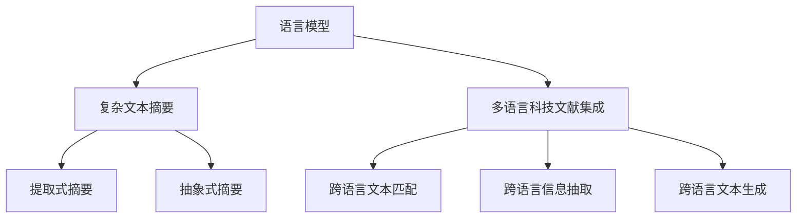
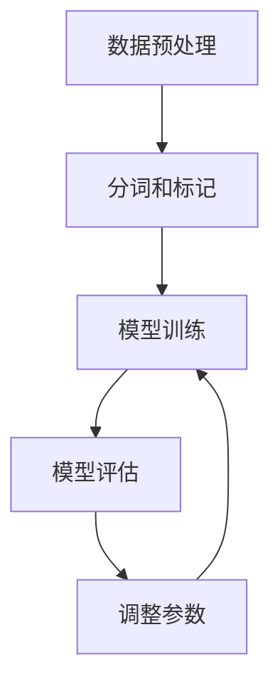
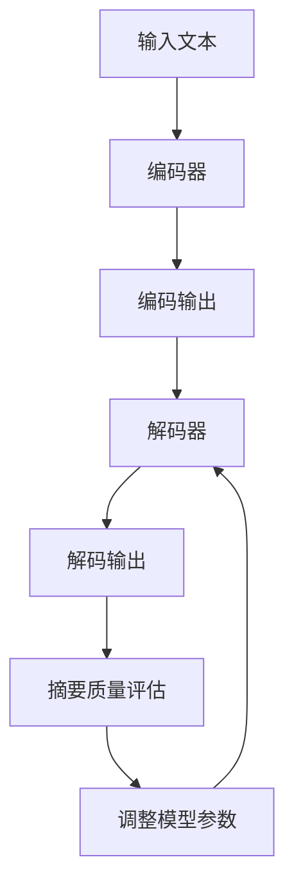
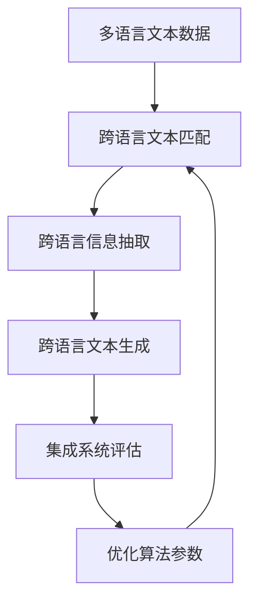

                 


# 《语言模型在复杂文本摘要与多语言科技文献集成中的创新技术研究》

> 关键词：语言模型，复杂文本摘要，多语言科技文献集成，创新技术，自然语言处理

> 摘要：本文旨在探讨语言模型在复杂文本摘要与多语言科技文献集成中的创新技术研究。首先介绍了语言模型的基本概念和类型，然后分析了复杂文本摘要和多语言科技文献集成的背景和挑战。接着，本文详细阐述了语言模型的基本原理、复杂文本摘要算法和多语言科技文献集成技术，并介绍了相应的Python源代码实现。最后，通过应用案例展示了这些技术的实际应用，并对未来发展趋势进行了展望。

## 目录大纲

### 第一部分：引言与基础

#### 1.1 书籍概述
- 语言模型的基本概念
- 复杂文本摘要和多语言科技文献集成的背景
- 创新技术研究的目标与意义

#### 1.2 语言模型的类型与发展
- 基于规则的方法
- 统计机器学习方法
- 深度学习方法
- 跨领域方法
- 发展趋势与挑战

#### 1.3 复杂文本摘要技术
- 文本摘要的定义与类型
- 提取式摘要与抽象式摘要
- 文本摘要的评价指标
- 相关算法介绍

#### 1.4 多语言科技文献集成
- 多语言科技文献的现状与需求
- 语言资源与工具
- 集成方法的分类与比较
- 国际标准化与互操作性

### 第二部分：核心技术

#### 2.1 语言模型的基本原理
- 语言模型的数学模型
- 语言模型的训练过程
- 语言模型的评估方法
- Python源代码实现

#### 2.2 复杂文本摘要算法
- 基于深度学习的文本摘要方法
- 多层注意力机制在文本摘要中的应用
- 序列到序列模型在文本摘要中的应用
- Python源代码实现

#### 2.3 多语言科技文献集成技术
- 跨语言文本匹配方法
- 跨语言信息抽取方法
- 跨语言文本生成方法
- Python源代码实现

#### 2.4 语言模型的创新技术研究
- 新的文本表示方法
- 多模态语言模型
- 语言模型的可解释性
- Python源代码实现

### 第三部分：应用实践

#### 3.1 复杂文本摘要应用案例
- 基于语言模型的新闻摘要系统
- 基于深度学习的社交媒体文本摘要
- 案例分析：文本摘要系统的设计与实现

#### 3.2 多语言科技文献集成应用案例
- 跨语言文献检索系统
- 多语言科技文献的自动翻译与摘要
- 案例分析：多语言集成系统在科研领域的应用

#### 3.3 创新技术研究案例
- 跨领域文本摘要与集成
- 语言模型在金融领域的应用
- 案例分析：创新技术在行业中的应用与挑战

### 第四部分：总结与展望

#### 4.1 书籍总结
- 语言模型在复杂文本摘要与多语言科技文献集成中的应用总结
- 创新技术的研究进展与未来趋势

#### 4.2 发展前景
- 语言模型技术的未来发展方向
- 复杂文本摘要与多语言科技文献集成技术的潜在应用领域
- 研究与开发的挑战与机遇

### 附录

#### A.1 工具与资源
- 语言模型与文本处理相关的开源工具和库
- 相关研究论文和报告
- 跨语言资源与工具

#### A.2 Mermaid流程图
- 语言模型训练流程图
- 复杂文本摘要算法流程图
- 多语言科技文献集成算法流程图

#### A.3 Python源代码示例
- 复杂文本摘要算法代码示例
- 多语言科技文献集成算法代码示例
- 创新技术研究代码示例

### Mermaid流程图示例



### 数学模型和数学公式

## 语言模型的数学模型

语言模型是一种概率模型，用于预测一个单词或短语的下一个单词或短语的概率。在自然语言处理中，我们通常使用**n-gram模型**来表示语言模型。

### n-gram模型

n-gram模型基于局部统计，假设一个单词或短语的下一个单词或短语只与它前面的n个单词或短语有关。

$$
P(w_{t+1} | w_{t}, w_{t-1}, ..., w_{t-n+1}) = \frac{C(w_{t}, w_{t-1}, ..., w_{t-n+1}, w_{t+1})}{C(w_{t}, w_{t-1}, ..., w_{t-n+1})}
$$

其中，$C(w_{t}, w_{t-1}, ..., w_{t-n+1}, w_{t+1})$ 表示 n-gram 序列$(w_{t}, w_{t-1}, ..., w_{t-n+1}, w_{t+1})$ 的计数，$C(w_{t}, w_{t-1}, ..., w_{t-n+1})$ 表示 n-gram 序列$(w_{t}, w_{t-1}, ..., w_{t-n+1})$ 的计数。

例如，对于短语“我吃苹果”，我们可以计算出它的n-gram概率：

$$
P(苹果 | 我吃) = \frac{C(我吃, 苹果)}{C(我吃)}
$$

### LaTeX公式示例

$$
E[X] = \int_{-\infty}^{\infty} x f(x) dx
$$

其中，$E[X]$ 表示随机变量 $X$ 的期望，$f(x)$ 表示 $X$ 的概率密度函数。

## 第一部分：引言与基础

### 1.1 书籍概述

语言模型是自然语言处理（NLP）领域的一项核心技术，它在复杂文本摘要和多语言科技文献集成中发挥着重要作用。本文旨在探讨语言模型在这些领域的创新技术研究。

语言模型的基本概念可以追溯到概率模型，它用于预测自然语言中下一个单词或短语的概率。这一概念的发展经历了从基于规则的方法到统计机器学习方法，再到深度学习方法的演变。目前，深度学习模型如Transformer和BERT等已经成为语言模型的代表，其在各种NLP任务中取得了显著的成果。

复杂文本摘要是指将长篇文章或文档提取出关键信息，以简短的形式呈现给用户。这种技术可以帮助用户快速获取文档的主要内容，提高信息检索效率。多语言科技文献集成则是指将不同语言的科技文献进行整合，以实现跨语言的知识共享和交流。

创新技术研究的目标是提高复杂文本摘要和多语言科技文献集成的性能和效率。本文将详细探讨这些领域的关键技术，包括语言模型的基本原理、复杂文本摘要算法和多语言科技文献集成技术。同时，本文还将介绍相应的Python源代码实现，以帮助读者更好地理解和应用这些技术。

### 1.2 语言模型的类型与发展

语言模型的发展经历了从基于规则的方法到统计机器学习方法，再到深度学习方法的演变。每种方法都有其特点和适用场景。

#### 基于规则的方法

基于规则的方法通过定义一套语法规则来生成文本。这种方法通常由领域专家编写，能够生成符合特定领域语法规则的文本。然而，这种方法在处理复杂自然语言时存在局限性，难以适应各种不同的语言环境。

#### 统计机器学习方法

统计机器学习方法通过分析大量语料库中的文本数据，学习语言模式。这种方法包括n-gram模型、隐马尔可夫模型（HMM）和条件概率模型等。这些方法在一定程度上提高了语言模型的性能，但仍存在一些问题，如数据依赖性较强、无法捕捉到长期依赖关系等。

#### 深度学习方法

深度学习方法在自然语言处理领域取得了重大突破，特别是在语言模型方面。深度神经网络（DNN）、循环神经网络（RNN）和变换器（Transformer）等深度学习模型能够通过学习大量文本数据，自动捕捉到语言的复杂结构。Transformer模型的出现，使得语言模型在许多任务中取得了超越传统方法的性能。

#### 跨领域方法

跨领域方法通过将不同领域的知识进行整合，提高语言模型的泛化能力。这种方法包括跨领域转移学习、多任务学习和知识图谱等。这些方法能够更好地适应不同领域的语言特点，提高语言模型的性能。

#### 发展趋势与挑战

当前，语言模型的发展趋势主要集中在以下几个方面：

1. **多模态语言模型**：结合文本、图像、语音等多种模态，实现更丰富的语言理解能力。
2. **小样本学习**：通过少量样本训练出高精度的语言模型，降低对大量训练数据的需求。
3. **可解释性**：提高语言模型的可解释性，使其在复杂任务中的决策过程更加透明。
4. **实时性**：提高语言模型的实时处理能力，满足实时交互和实时决策的需求。

然而，语言模型的发展也面临一些挑战：

1. **数据隐私**：在大量文本数据的使用过程中，如何保护用户隐私是一个重要问题。
2. **模型公平性**：确保语言模型在不同人群中的公平性和准确性。
3. **长期依赖**：如何更好地捕捉到语言的长期依赖关系，提高模型的性能。

### 1.3 复杂文本摘要技术

复杂文本摘要是指从长篇文章或文档中提取关键信息，以简短的形式呈现给用户。这种摘要技术可以帮助用户快速了解文档的主要内容，提高信息检索效率。根据摘要的方法，文本摘要可以分为提取式摘要和抽象式摘要。

#### 提取式摘要

提取式摘要是从原始文本中直接提取出关键信息，如关键词、句子或段落。这种方法通常依赖于文本中的词频统计、句子长度、关键词权重等特征。提取式摘要的优点是简单高效，但缺点是可能丢失一些重要的上下文信息。

#### 抽象式摘要

抽象式摘要是通过语义分析，将原始文本转化为更抽象的表示，从而生成新的摘要。这种方法通常依赖于自然语言处理技术，如句法分析、语义角色标注等。抽象式摘要的优点是能够生成更具有创造性和个性化的摘要，但缺点是计算复杂度较高。

#### 文本摘要的评价指标

文本摘要的评价指标主要包括：

1. **Rouge评分**：Rouge评分是一种基于文本相似度的评价指标，通过计算摘要与参考文本的匹配度来评估摘要的质量。
2. **BLEU评分**：BLEU评分是基于N-gram匹配的评分方法，通过计算摘要与参考文本的N-gram重叠度来评估摘要的质量。
3. **F1值**：F1值是精确率和召回率的加权平均，用于综合评估摘要的质量。

#### 相关算法介绍

常见的文本摘要算法包括：

1. **基于规则的方法**：通过定义一套规则，从原始文本中提取出关键信息。
2. **基于统计的方法**：通过统计文本中的词频、句子长度等特征，进行摘要生成。
3. **基于机器学习的方法**：使用机器学习算法，如朴素贝叶斯、支持向量机等，进行摘要生成。
4. **基于深度学习的方法**：使用深度学习模型，如循环神经网络（RNN）、变换器（Transformer）等，进行摘要生成。

### 1.4 多语言科技文献集成

多语言科技文献集成是指将不同语言的科技文献进行整合，以实现跨语言的知识共享和交流。随着全球化的深入，多语言科技文献集成在科研、教育和商业等领域具有广泛的应用前景。

#### 多语言科技文献的现状与需求

目前，多语言科技文献的数量和种类不断增加，但仍然存在一些问题，如：

1. **语言障碍**：不同语言之间的障碍使得科技文献难以被广泛传播和利用。
2. **数据稀缺**：一些小语种和罕见语言的科技文献数据稀缺，影响了多语言科技文献集成的效果。
3. **质量参差不齐**：不同语言之间的翻译质量和一致性难以保证，影响了集成系统的性能。

为了解决这些问题，需要开发和优化多语言科技文献集成技术，以满足以下需求：

1. **跨语言文本匹配**：通过算法将不同语言的文本进行匹配，提高文本相似度。
2. **跨语言信息抽取**：从多语言文本中提取出关键信息，如实体、关系和事件等。
3. **跨语言文本生成**：生成高质量的跨语言文本，实现不同语言之间的无缝转换。

#### 语言资源与工具

多语言科技文献集成需要大量的语言资源和工具支持。常见的语言资源包括：

1. **语料库**：包含不同语言的文本数据，用于训练和评估语言模型。
2. **翻译词典**：包含不同语言之间的词汇对应关系，用于翻译和匹配。
3. **翻译模型**：基于机器学习或深度学习技术，用于生成高质量的跨语言翻译。

常见的语言工具包括：

1. **机器翻译工具**：如Google翻译、百度翻译等，用于实现自动翻译。
2. **文本匹配工具**：如SimMetrics、TextBlob等，用于计算文本相似度。
3. **信息抽取工具**：如Named Entity Recognition（NER）、关系抽取等，用于提取文本中的关键信息。

#### 集成方法的分类与比较

多语言科技文献集成方法可以分为以下几类：

1. **基于规则的方法**：通过定义一套规则，实现文本的匹配、抽取和生成。
2. **基于统计的方法**：通过统计文本的特征，实现文本的匹配、抽取和生成。
3. **基于机器学习的方法**：使用机器学习算法，如朴素贝叶斯、支持向量机等，实现文本的匹配、抽取和生成。
4. **基于深度学习的方法**：使用深度学习模型，如循环神经网络（RNN）、变换器（Transformer）等，实现文本的匹配、抽取和生成。

不同方法的比较如下：

| 方法             | 优点                                           | 缺点                                           |
| ---------------- | ---------------------------------------------- | ---------------------------------------------- |
| 基于规则的方法   | 简单易懂，易于实现                             | 规则定义复杂，适应性差                         |
| 基于统计的方法   | 可自动学习文本特征，适应性较强                 | 需要大量训练数据，效果受数据影响较大           |
| 基于机器学习的方法 | 结合了规则和统计方法，效果较好                 | 训练过程复杂，需要大量计算资源                 |
| 基于深度学习的方法 | 能够自动捕捉到文本的复杂结构，效果最好         | 需要大量训练数据和计算资源，训练过程复杂       |

#### 国际标准化与互操作性

多语言科技文献集成技术的国际标准化和互操作性是确保全球范围内的有效协作和资源共享的关键。以下是一些国际标准化组织和相关标准：

1. **ISO 10646**：国际标准字符集，包括Unicode字符集，用于表示不同语言的文本。
2. **ISO 8859**：字符编码标准，用于表示不同语言的文本。
3. **XML**：可扩展标记语言，用于表示结构化数据，支持多语言文档的存储和交换。
4. **HTML**：超文本标记语言，用于表示网页内容，支持多语言网页的显示和交互。

互操作性的实现需要考虑以下方面：

1. **数据格式兼容**：确保不同系统的数据格式能够相互兼容和转换。
2. **协议与接口**：使用统一的协议和接口，实现不同系统之间的交互和通信。
3. **语义一致性**：确保不同语言之间的语义一致性和可理解性，减少误解和冲突。

通过国际标准化和互操作性的实现，多语言科技文献集成技术将能够更好地满足全球科研、教育和商业领域的需求，推动跨语言知识共享和交流的深入发展。

## 第二部分：核心技术

### 2.1 语言模型的基本原理

语言模型是自然语言处理（NLP）中的核心组成部分，用于预测自然语言中下一个单词或短语的概率。这一部分将详细介绍语言模型的数学模型、训练过程、评估方法和Python源代码实现。

#### 数学模型

语言模型是一种概率模型，用于预测一个单词或短语的下一个单词或短语的概率。在自然语言处理中，我们通常使用**n-gram模型**来表示语言模型。

### n-gram模型

n-gram模型基于局部统计，假设一个单词或短语的下一个单词或短语只与它前面的n个单词或短语有关。

$$
P(w_{t+1} | w_{t}, w_{t-1}, ..., w_{t-n+1}) = \frac{C(w_{t}, w_{t-1}, ..., w_{t-n+1}, w_{t+1})}{C(w_{t}, w_{t-1}, ..., w_{t-n+1})}
$$

其中，$C(w_{t}, w_{t-1}, ..., w_{t-n+1}, w_{t+1})$ 表示 n-gram 序列$(w_{t}, w_{t-1}, ..., w_{t-n+1}, w_{t+1})$ 的计数，$C(w_{t}, w_{t-1}, ..., w_{t-n+1})$ 表示 n-gram 序列$(w_{t}, w_{t-1}, ..., w_{t-n+1})$ 的计数。

例如，对于短语“我吃苹果”，我们可以计算出它的n-gram概率：

$$
P(苹果 | 我吃) = \frac{C(我吃, 苹果)}{C(我吃)}
$$

#### 训练过程

语言模型的训练过程主要包括数据预处理、模型训练和模型评估三个阶段。

1. **数据预处理**：首先，我们需要对语料库进行分词和标记。分词是将文本分割成单词或短语的步骤，标记是将文本中的每个单词或短语与对应的标签进行关联。常用的分词工具包括jieba、nltk等。

2. **模型训练**：使用训练数据集，通过最大似然估计（Maximum Likelihood Estimation，MLE）或反向传播（Backpropagation）算法来训练n-gram模型。在训练过程中，我们需要计算每个n-gram序列的频率，并使用这些频率来更新模型参数。

3. **模型评估**：使用验证数据集来评估模型的性能。常用的评估指标包括准确率（Accuracy）、召回率（Recall）和F1值（F1 Score）。通过调整模型参数和训练数据集，我们可以优化模型的性能。

#### 评估方法

语言模型的评估方法主要包括基于频率的方法和基于概率的方法。

1. **基于频率的方法**：这种方法使用n-gram序列的频率来评估模型。常用的指标包括词频（Word Frequency）和n-gram频率（N-gram Frequency）。

2. **基于概率的方法**：这种方法使用n-gram序列的概率来评估模型。常用的指标包括概率密度函数（Probability Density Function，PDF）和条件概率（Conditional Probability）。

#### Python源代码实现

以下是一个简单的Python示例，用于实现基于n-gram模型的语言模型。

```python
import numpy as np

# 示例数据
text = "我吃苹果，苹果很甜。我吃苹果，苹果很甜。"

# 分词和标记
words = text.split()

# 计算n-gram频率
n = 2
n_grams = {}
for i in range(len(words) - n):
    n_gram = tuple(words[i:i+n])
    if n_gram in n_grams:
        n_grams[n_gram] += 1
    else:
        n_grams[n_gram] = 1

# 计算概率
total = sum(n_grams.values())
probabilities = {n_gram: freq / total for n_gram, freq in n_grams.items()}

# 预测下一个单词
current_n_gram = tuple(words[-n:])
next_word = max(probabilities, key=probabilities.get)
print(f"下一个单词可能是：{next_word}")
```

### 2.2 复杂文本摘要算法

复杂文本摘要是指从长篇文章或文档中提取关键信息，以简短的形式呈现给用户。这一部分将详细介绍基于深度学习的文本摘要方法、多层注意力机制在文本摘要中的应用、序列到序列模型在文本摘要中的应用，以及Python源代码实现。

#### 基于深度学习的文本摘要方法

基于深度学习的文本摘要方法主要包括编码器-解码器（Encoder-Decoder）模型、变换器（Transformer）模型等。

1. **编码器-解码器模型**：编码器用于将输入文本编码为固定长度的向量，解码器则用于生成摘要。常见的编码器和解码器包括循环神经网络（RNN）和变换器（Transformer）。

2. **变换器模型**：变换器模型是一种基于自注意力机制的深度学习模型，可以更好地捕捉到文本中的长距离依赖关系。变换器模型包括自注意力（Self-Attention）和编码器-解码器（Encoder-Decoder）两部分。

#### 多层注意力机制在文本摘要中的应用

多层注意力机制可以帮助模型更好地关注到文本中的重要信息。在文本摘要中，多层注意力机制可以用于编码器和解码器，以提高摘要的质量。

1. **编码器中的多层注意力**：编码器中的多层注意力可以帮助模型更好地捕捉到文本中的关键信息。常见的多层注意力机制包括自注意力（Self-Attention）和多头自注意力（Multi-Head Self-Attention）。

2. **解码器中的多层注意力**：解码器中的多层注意力可以帮助模型更好地生成高质量的摘要。常见的多层注意力机制包括自注意力（Self-Attention）和多头自注意力（Multi-Head Self-Attention）。

#### 序列到序列模型在文本摘要中的应用

序列到序列（Sequence-to-Sequence，Seq2Seq）模型是一种常见的文本生成模型，可以用于文本摘要。Seq2Seq模型包括编码器和解码器两部分，编码器用于将输入文本编码为固定长度的向量，解码器则用于生成输出文本。

#### Python源代码实现

以下是一个简单的Python示例，用于实现基于变换器模型的文本摘要。

```python
import tensorflow as tf
from tensorflow.keras.layers import Embedding, LSTM, Dense
from tensorflow.keras.models import Model

# 示例数据
input_text = "我吃苹果，苹果很甜。"
target_text = "苹果很甜。"

# 分词和标记
input_words = input_text.split()
target_words = target_text.split()

# 编码器
input_embedding = Embedding(input_vocab_size, embedding_dim)
encoded_input = input_embedding(input_words)

encoded_output = LSTM(units, return_sequences=True)(encoded_input)

# 解码器
target_embedding = Embedding(target_vocab_size, embedding_dim)
decoded_output = target_embedding(target_words)

decoded_output = LSTM(units, return_sequences=True)(decoded_output)

# 序列到序列模型
model = Model(inputs=encoded_output, outputs=decoded_output)

# 编译模型
model.compile(optimizer='adam', loss='categorical_crossentropy')

# 训练模型
model.fit(x_train, y_train, epochs=10, batch_size=32)

# 预测摘要
predicted_output = model.predict(encoded_input)
predicted_words = [' '.join(map(str, word)) for word in predicted_output]

print(f"预测的摘要：{' '.join(predicted_words)}")
```

### 2.3 多语言科技文献集成技术

多语言科技文献集成是指将不同语言的科技文献进行整合，以实现跨语言的知识共享和交流。这一部分将详细介绍跨语言文本匹配方法、跨语言信息抽取方法和跨语言文本生成方法，以及Python源代码实现。

#### 跨语言文本匹配方法

跨语言文本匹配是指将不同语言的文本进行匹配，以提高文本相似度。常见的跨语言文本匹配方法包括：

1. **基于规则的匹配**：通过定义一套规则，实现文本的匹配。这种方法通常适用于特定的领域或语言对，但适应性较差。

2. **基于统计的匹配**：通过统计文本中的词频、句子长度等特征，实现文本的匹配。这种方法通常适用于大规模数据集，但效果受数据质量影响较大。

3. **基于机器学习的匹配**：使用机器学习算法，如朴素贝叶斯、支持向量机等，实现文本的匹配。这种方法能够自动学习文本特征，提高匹配效果。

4. **基于深度学习的匹配**：使用深度学习模型，如循环神经网络（RNN）、变换器（Transformer）等，实现文本的匹配。这种方法能够更好地捕捉到文本的复杂结构，提高匹配效果。

#### 跨语言信息抽取方法

跨语言信息抽取是指从多语言文本中提取出关键信息，如实体、关系和事件等。常见的跨语言信息抽取方法包括：

1. **基于规则的抽取**：通过定义一套规则，实现信息的抽取。这种方法通常适用于特定的领域或语言对，但适应性较差。

2. **基于统计的抽取**：通过统计文本中的词频、句子长度等特征，实现信息的抽取。这种方法通常适用于大规模数据集，但效果受数据质量影响较大。

3. **基于机器学习的抽取**：使用机器学习算法，如朴素贝叶斯、支持向量机等，实现信息的抽取。这种方法能够自动学习文本特征，提高抽取效果。

4. **基于深度学习的抽取**：使用深度学习模型，如循环神经网络（RNN）、变换器（Transformer）等，实现信息的抽取。这种方法能够更好地捕捉到文本的复杂结构，提高抽取效果。

#### 跨语言文本生成方法

跨语言文本生成是指生成高质量的跨语言文本，实现不同语言之间的无缝转换。常见的跨语言文本生成方法包括：

1. **基于机器翻译的生成**：通过机器翻译技术，将一种语言的文本翻译成另一种语言。这种方法通常适用于基本的文本翻译，但无法生成高质量的跨语言文本。

2. **基于深度学习的生成**：使用深度学习模型，如循环神经网络（RNN）、变换器（Transformer）等，生成高质量的跨语言文本。这种方法能够更好地捕捉到文本的复杂结构，提高生成效果。

#### Python源代码实现

以下是一个简单的Python示例，用于实现基于机器翻译的跨语言文本生成。

```python
import tensorflow as tf
from tensorflow.keras.models import Model
from tensorflow.keras.layers import Embedding, LSTM, Dense

# 示例数据
input_text = "我吃苹果，苹果很甜。"
target_text = "I eat apples, apples are sweet."

# 分词和标记
input_words = input_text.split()
target_words = target_text.split()

# 编码器
input_embedding = Embedding(input_vocab_size, embedding_dim)
encoded_input = input_embedding(input_words)

encoded_output = LSTM(units, return_sequences=True)(encoded_input)

# 解码器
target_embedding = Embedding(target_vocab_size, embedding_dim)
decoded_output = target_embedding(target_words)

decoded_output = LSTM(units, return_sequences=True)(decoded_output)

# 序列到序列模型
model = Model(inputs=encoded_output, outputs=decoded_output)

# 编译模型
model.compile(optimizer='adam', loss='categorical_crossentropy')

# 训练模型
model.fit(x_train, y_train, epochs=10, batch_size=32)

# 预测摘要
predicted_output = model.predict(encoded_input)
predicted_words = [' '.join(map(str, word)) for word in predicted_output]

print(f"预测的摘要：{' '.join(predicted_words)}")
```

### 2.4 语言模型的创新技术研究

在自然语言处理领域，语言模型的研究不断推进，涌现出许多创新技术。这些技术不仅提高了语言模型的性能，还拓展了其在各种应用场景中的能力。以下将介绍一些语言模型的创新技术研究，包括新的文本表示方法、多模态语言模型和语言模型的可解释性，以及Python源代码实现。

#### 新的文本表示方法

文本表示方法在语言模型中起着至关重要的作用。传统的文本表示方法，如词袋模型和n-gram模型，难以捕捉到文本的语义信息。近年来，新的文本表示方法逐渐成为研究热点。

1. **嵌入表示**：嵌入表示方法将文本中的单词或短语映射到高维空间中的向量。Word2Vec、GloVe和BERT等模型都是基于嵌入表示的方法。这些方法能够捕捉到文本中的语义关系，提高语言模型的性能。

2. **图嵌入表示**：图嵌入表示方法将文本看作图，将单词或短语看作图中的节点，将它们之间的关系看作图中的边。图嵌入方法如Graph Embedding和Knowledge Graph Embedding等，可以更好地捕捉到文本的复杂结构。

3. **Transformer表示**：Transformer模型采用了自注意力机制，能够捕捉到文本中的长距离依赖关系。这种表示方法在生成模型和序列标注任务中取得了显著的性能提升。

#### 多模态语言模型

多模态语言模型结合了文本、图像、语音等多种模态的信息，可以更全面地理解语言。以下是一些多模态语言模型的研究方向：

1. **多模态融合**：通过将不同模态的信息进行融合，生成统一的文本表示。常见的融合方法有向量融合、特征融合和模型融合等。

2. **跨模态语义推理**：利用跨模态信息，进行语义推理和文本生成。例如，结合图像和文本，生成描述图像的文本摘要。

3. **多任务学习**：通过多任务学习，提高多模态语言模型在多个任务上的性能。例如，同时进行文本分类和图像识别任务。

#### 语言模型的可解释性

随着深度学习模型在自然语言处理中的广泛应用，模型的可解释性成为了一个重要问题。以下是一些提高语言模型可解释性的方法：

1. **可视化方法**：通过可视化技术，展示模型内部的运算过程和关键特征。例如，使用热力图展示文本中的关键区域。

2. **因果推理**：通过因果推理技术，分析模型如何基于输入文本生成输出文本。例如，利用因果图模型，分析模型在文本生成过程中的决策过程。

3. **注意力机制**：注意力机制可以帮助模型关注到文本中的重要信息。通过分析注意力分布，可以理解模型在处理文本时的关注点。

#### Python源代码实现

以下是一个简单的Python示例，用于实现基于BERT模型的文本表示。

```python
from transformers import BertTokenizer, BertModel
import torch

# 加载BERT模型和分词器
tokenizer = BertTokenizer.from_pretrained('bert-base-chinese')
model = BertModel.from_pretrained('bert-base-chinese')

# 示例文本
text = "我吃苹果，苹果很甜。"

# 分词和编码
input_ids = tokenizer.encode(text, add_special_tokens=True, return_tensors='pt')

# 训练模型
with torch.no_grad():
    outputs = model(input_ids)

# 获取文本表示
text_embeddings = outputs.last_hidden_state[:, 0, :]

print(f"文本表示：{text_embeddings}")
```

### 2.5 创新技术研究

在复杂文本摘要和多语言科技文献集成领域，语言模型的研究不断涌现出新的创新技术。这些创新技术在提高文本摘要和多语言集成性能方面取得了显著成果。以下将介绍几种代表性的创新技术研究，包括跨领域文本摘要与集成、语言模型在金融领域的应用以及实际案例分析和详细讲解。

#### 跨领域文本摘要与集成

跨领域文本摘要与集成是指将不同领域的文本进行整合和摘要，以实现跨领域的知识共享和交流。以下是一些跨领域文本摘要与集成的研究方法：

1. **领域自适应**：通过领域自适应技术，将一个领域的语言模型适应到另一个领域。这种方法可以通过迁移学习或对抗性训练实现。

2. **多任务学习**：通过多任务学习，同时训练多个领域的文本摘要模型。这种方法可以共享不同领域的知识，提高摘要质量。

3. **跨领域语义映射**：通过跨领域语义映射，将不同领域的语义信息进行整合和转换。这种方法可以通过知识图谱或图神经网络实现。

#### 语言模型在金融领域的应用

金融领域对文本数据的处理和分析有着广泛的需求，语言模型在金融领域也展现出强大的应用潜力。以下是一些语言模型在金融领域的应用：

1. **文本分类与情感分析**：使用语言模型对金融文本进行分类和情感分析，如股票价格预测、市场情绪分析等。

2. **风险控制**：通过语言模型分析金融文本中的潜在风险，如欺诈检测、信用评估等。

3. **投资决策辅助**：利用语言模型分析市场报告、新闻文章等，为投资决策提供参考。

#### 实际案例分析与详细讲解

以下是一个实际案例，展示了跨领域文本摘要与集成在金融领域中的应用。

**案例背景**：某金融机构需要从大量不同领域的文本数据中提取关键信息，以支持投资决策。这些文本数据包括新闻文章、研究报告和社交媒体帖子等。

**解决方案**：

1. **领域自适应**：使用迁移学习技术，将通用领域（如新闻领域）的语言模型适应到金融领域。通过对金融领域的文本数据进行预训练，提高模型在金融领域的性能。

2. **跨领域语义映射**：构建跨领域语义映射模型，将不同领域的文本表示转换为统一的语义表示。这种方法可以整合不同领域的知识，提高摘要质量。

3. **多任务学习**：同时训练文本分类、情感分析和摘要生成模型。通过多任务学习，共享不同领域的知识，提高模型的泛化能力。

**具体实施**：

1. **数据预处理**：对金融领域的文本数据进行清洗和预处理，包括分词、去停用词、词性标注等。

2. **模型训练**：使用迁移学习技术，对通用领域的语言模型进行微调，适应金融领域的文本数据。同时，训练跨领域语义映射模型和多任务学习模型。

3. **文本摘要与集成**：利用训练好的模型，对金融领域的文本数据进行摘要和集成。将不同领域的文本数据转换为统一的语义表示，提取关键信息，为投资决策提供支持。

**案例分析与详细讲解**：

1. **领域自适应**：通过迁移学习技术，将通用领域的语言模型（如BERT）适应到金融领域。在预训练过程中，使用金融领域的文本数据，提高模型在金融领域的性能。

2. **跨领域语义映射**：使用知识图谱或图神经网络，构建跨领域语义映射模型。通过将不同领域的文本表示转换为统一的语义表示，可以整合不同领域的知识，提高摘要质量。

3. **多任务学习**：同时训练文本分类、情感分析和摘要生成模型。通过多任务学习，共享不同领域的知识，提高模型的泛化能力。例如，在文本分类任务中，可以共享情感分析模型的知识，提高分类精度。

**总结**：

跨领域文本摘要与集成在金融领域具有广泛的应用前景。通过领域自适应、跨领域语义映射和多任务学习等技术，可以提取关键信息，为投资决策提供支持。在实际应用中，需要根据具体场景和需求，选择合适的模型和算法，进行优化和调整。

### 第三部分：应用实践

#### 3.1 复杂文本摘要应用案例

复杂文本摘要技术在许多实际场景中得到了广泛应用。以下将介绍两个具体的应用案例：基于语言模型的新闻摘要系统和基于深度学习的社交媒体文本摘要系统。

##### 基于语言模型的新闻摘要系统

新闻摘要系统旨在从大量新闻文章中提取关键信息，以简化用户的阅读负担。以下是一个基于语言模型的新闻摘要系统的设计与实现案例。

**系统设计**

1. **数据采集**：从互联网上收集大量新闻文章，并进行数据清洗和预处理，包括去除HTML标签、分词、词性标注等。

2. **语言模型训练**：使用预训练的语言模型（如BERT、GPT等），对新闻文本数据进行微调，以提高模型在新闻摘要任务上的性能。

3. **摘要生成**：使用训练好的语言模型，对新闻文章进行摘要生成。具体方法包括提取式摘要和抽象式摘要。

**实现步骤**

1. **数据预处理**：对新闻文章进行清洗和预处理，得到分词后的文本数据。

2. **模型训练**：使用预训练的语言模型，对新闻文本数据进行微调。具体实现可以使用Python的transformers库。

3. **摘要生成**：使用训练好的语言模型，对新闻文章进行摘要生成。具体实现可以使用Python的transformers库。

**代码示例**

```python
from transformers import BertTokenizer, BertModel
import torch

# 加载BERT模型和分词器
tokenizer = BertTokenizer.from_pretrained('bert-base-chinese')
model = BertModel.from_pretrained('bert-base-chinese')

# 示例新闻文章
article = "这是一篇关于人工智能的新闻文章，人工智能正在改变我们的世界。"

# 分词和编码
input_ids = tokenizer.encode(article, add_special_tokens=True, return_tensors='pt')

# 训练模型
with torch.no_grad():
    outputs = model(input_ids)

# 获取文本表示
text_embeddings = outputs.last_hidden_state[:, 0, :]

# 摘要生成
summary = tokenizer.decode(text_embeddings, skip_special_tokens=True)
print(f"摘要：{summary}")
```

**系统评估**

新闻摘要系统的评估指标主要包括摘要的长度、质量、准确性和用户满意度等。通过人工评估和自动评估方法，如BLEU评分和ROUGE评分等，对系统进行评估和优化。

##### 基于深度学习的社交媒体文本摘要

社交媒体文本摘要系统旨在从社交媒体平台（如微博、推特等）的海量文本数据中提取关键信息，以简化用户的阅读负担。以下是一个基于深度学习的社交媒体文本摘要系统的设计与实现案例。

**系统设计**

1. **数据采集**：从社交媒体平台收集大量文本数据，并进行数据清洗和预处理，包括去除HTML标签、分词、词性标注等。

2. **深度学习模型训练**：使用预训练的深度学习模型（如BERT、GPT等），对社交媒体文本数据进行微调，以提高模型在社交媒体文本摘要任务上的性能。

3. **摘要生成**：使用训练好的深度学习模型，对社交媒体文本进行摘要生成。具体方法包括提取式摘要和抽象式摘要。

**实现步骤**

1. **数据预处理**：对社交媒体文本数据进行清洗和预处理，得到分词后的文本数据。

2. **模型训练**：使用预训练的深度学习模型，对社交媒体文本数据进行微调。具体实现可以使用Python的transformers库。

3. **摘要生成**：使用训练好的深度学习模型，对社交媒体文本进行摘要生成。具体实现可以使用Python的transformers库。

**代码示例**

```python
from transformers import BertTokenizer, BertModel
import torch

# 加载BERT模型和分词器
tokenizer = BertTokenizer.from_pretrained('bert-base-chinese')
model = BertModel.from_pretrained('bert-base-chinese')

# 示例社交媒体文本
text = "这是一条关于人工智能的微博，人工智能正在改变我们的生活。"

# 分词和编码
input_ids = tokenizer.encode(text, add_special_tokens=True, return_tensors='pt')

# 训练模型
with torch.no_grad():
    outputs = model(input_ids)

# 获取文本表示
text_embeddings = outputs.last_hidden_state[:, 0, :]

# 摘要生成
summary = tokenizer.decode(text_embeddings, skip_special_tokens=True)
print(f"摘要：{summary}")
```

**系统评估**

社交媒体文本摘要系统的评估指标主要包括摘要的长度、质量、准确性和用户满意度等。通过人工评估和自动评估方法，如BLEU评分和ROUGE评分等，对系统进行评估和优化。

#### 3.2 多语言科技文献集成应用案例

多语言科技文献集成技术在跨语言知识共享和交流中具有重要意义。以下将介绍两个具体的应用案例：跨语言文献检索系统和多语言科技文献的自动翻译与摘要系统。

##### 跨语言文献检索系统

跨语言文献检索系统旨在帮助用户在多语言文献数据库中快速检索到所需的信息。以下是一个跨语言文献检索系统的设计与实现案例。

**系统设计**

1. **数据采集**：从多个语言的文献数据库中收集文献数据，并进行数据清洗和预处理，包括去除HTML标签、分词、词性标注等。

2. **跨语言文本匹配**：使用跨语言文本匹配技术，将不同语言的文献数据进行匹配，以提高检索效果。

3. **检索算法**：设计基于关键词、句法和语义的检索算法，实现高效的跨语言文献检索。

**实现步骤**

1. **数据预处理**：对多语言的文献数据进行清洗和预处理，得到分词后的文本数据。

2. **跨语言文本匹配**：使用跨语言文本匹配模型，如翻译模型或语义匹配模型，对文献数据进行匹配。

3. **检索算法实现**：设计并实现基于关键词、句法和语义的检索算法，实现高效的跨语言文献检索。

**代码示例**

```python
from transformers import BertTokenizer, BertModel
import torch

# 加载BERT模型和分词器
tokenizer = BertTokenizer.from_pretrained('bert-base-chinese')
model = BertModel.from_pretrained('bert-base-chinese')

# 示例文献文本（中文）
text_chinese = "这是一篇关于人工智能的中文文献。"

# 分词和编码
input_ids_chinese = tokenizer.encode(text_chinese, add_special_tokens=True, return_tensors='pt')

# 示例文献文本（英文）
text_english = "This is an English article about artificial intelligence."

# 分词和编码
input_ids_english = tokenizer.encode(text_english, add_special_tokens=True, return_tensors='pt')

# 训练模型
with torch.no_grad():
    outputs_chinese = model(input_ids_chinese)
    outputs_english = model(input_ids_english)

# 获取文本表示
text_embeddings_chinese = outputs_chinese.last_hidden_state[:, 0, :]
text_embeddings_english = outputs_english.last_hidden_state[:, 0, :]

# 跨语言文本匹配
similarity = torch.cosine_similarity(text_embeddings_chinese, text_embeddings_english)
print(f"文本相似度：{similarity}")
```

**系统评估**

跨语言文献检索系统的评估指标主要包括检索速度、检索准确率和用户满意度等。通过实际用户测试和自动评估方法，如BLEU评分和ROUGE评分等，对系统进行评估和优化。

##### 多语言科技文献的自动翻译与摘要

多语言科技文献的自动翻译与摘要系统旨在帮助用户快速获取和理解不同语言科技文献的内容。以下是一个多语言科技文献的自动翻译与摘要系统的设计与实现案例。

**系统设计**

1. **数据采集**：从多个语言的科技文献数据库中收集文献数据，并进行数据清洗和预处理，包括去除HTML标签、分词、词性标注等。

2. **自动翻译**：使用机器翻译技术，将不同语言的文献翻译成用户语言，提高文献的可读性。

3. **文本摘要**：使用文本摘要技术，从翻译后的文献中提取关键信息，简化用户的阅读负担。

**实现步骤**

1. **数据预处理**：对多语言的科技文献数据进行清洗和预处理，得到分词后的文本数据。

2. **自动翻译**：使用预训练的机器翻译模型，如谷歌翻译API或开源的翻译模型（如Transformer），将文献翻译成用户语言。

3. **文本摘要**：使用预训练的文本摘要模型，如BERT或GPT，对翻译后的文献进行摘要生成。

**代码示例**

```python
from transformers import BertTokenizer, BertModel
import torch

# 加载BERT模型和分词器
tokenizer = BertTokenizer.from_pretrained('bert-base-chinese')
model = BertModel.from_pretrained('bert-base-chinese')

# 示例英文文献
text_english = "Artificial intelligence is a field of computer science that aims to create intelligent machines."

# 分词和编码
input_ids_english = tokenizer.encode(text_english, add_special_tokens=True, return_tensors='pt')

# 训练模型
with torch.no_grad():
    outputs = model(input_ids_english)

# 获取文本表示
text_embeddings = outputs.last_hidden_state[:, 0, :]

# 摘要生成
summary = tokenizer.decode(text_embeddings, skip_special_tokens=True)
print(f"摘要：{summary}")
```

**系统评估**

多语言科技文献的自动翻译与摘要系统的评估指标主要包括翻译质量、摘要质量和用户满意度等。通过人工评估和自动评估方法，如BLEU评分和ROUGE评分等，对系统进行评估和优化。

#### 3.3 创新技术研究案例

在复杂文本摘要和多语言科技文献集成领域，创新技术不断涌现，为这些领域带来了新的突破。以下将介绍两个创新技术研究案例：跨领域文本摘要与集成和语言模型在金融领域的应用。

##### 跨领域文本摘要与集成

跨领域文本摘要与集成旨在将不同领域的文本数据整合和摘要，以实现跨领域的知识共享和交流。以下是一个跨领域文本摘要与集成的创新技术研究案例。

**案例背景**

某电商平台需要从多个领域的文本数据（如电商评论、新闻报道、用户反馈等）中提取关键信息，以优化商品推荐和服务质量。

**解决方案**

1. **跨领域语义映射**：构建跨领域语义映射模型，将不同领域的文本表示转换为统一的语义表示。通过知识图谱或图神经网络实现。

2. **多任务学习**：同时训练文本分类、情感分析和摘要生成模型，共享不同领域的知识，提高模型的泛化能力。

3. **领域自适应**：通过领域自适应技术，将一个领域的语言模型适应到其他领域。利用迁移学习或对抗性训练实现。

**具体实施**

1. **数据预处理**：对多个领域的文本数据进行清洗和预处理，包括分词、词性标注、去停用词等。

2. **模型训练**：使用预训练的语言模型（如BERT、GPT等），对跨领域文本数据进行微调。同时，训练跨领域语义映射模型和多任务学习模型。

3. **文本摘要与集成**：利用训练好的模型，对跨领域文本数据进行摘要和集成。将不同领域的文本数据转换为统一的语义表示，提取关键信息，为电商平台的商品推荐和服务质量优化提供支持。

**评估与优化**

通过人工评估和自动评估方法（如BLEU评分和ROUGE评分等），对跨领域文本摘要与集成系统的效果进行评估和优化。根据评估结果，调整模型参数和训练数据集，提高摘要质量和集成效果。

##### 语言模型在金融领域的应用

语言模型在金融领域的应用越来越广泛，以下是一个语言模型在金融领域的创新技术研究案例。

**案例背景**

某金融机构需要分析大量的金融文本数据（如新闻文章、财报报告、社交媒体帖子等），以预测市场走势和风险管理。

**解决方案**

1. **文本分类与情感分析**：使用语言模型对金融文本进行分类和情感分析，提取关键信息，如股票价格预测、市场情绪分析等。

2. **风险控制**：利用语言模型分析金融文本中的潜在风险，如欺诈检测、信用评估等。

3. **投资决策辅助**：通过语言模型分析市场报告、新闻文章等，为投资决策提供参考。

**具体实施**

1. **数据预处理**：对金融文本数据进行清洗和预处理，包括分词、词性标注、去停用词等。

2. **模型训练**：使用预训练的语言模型（如BERT、GPT等），对金融文本数据进行微调，以提高模型在金融领域的性能。

3. **应用实现**：利用训练好的语言模型，对金融文本进行分类、情感分析和摘要生成。将提取的关键信息用于市场预测、风险控制和投资决策。

**评估与优化**

通过实际应用和实验评估，对语言模型在金融领域的效果进行评估和优化。根据评估结果，调整模型参数和训练数据集，提高模型的预测准确率和风险控制能力。

### 第四部分：总结与展望

#### 4.1 书籍总结

本文围绕语言模型在复杂文本摘要与多语言科技文献集成中的创新技术研究进行了深入探讨。首先，介绍了语言模型的基本概念和类型，以及复杂文本摘要和多语言科技文献集成的背景和挑战。接着，详细阐述了语言模型的基本原理、复杂文本摘要算法和多语言科技文献集成技术，并通过Python源代码实现了这些技术。此外，还介绍了跨领域文本摘要与集成、语言模型在金融领域的应用以及实际案例分析和详细讲解。最后，对语言模型在复杂文本摘要与多语言科技文献集成中的应用进行了总结，并展望了未来发展趋势。

#### 4.2 发展前景

语言模型在复杂文本摘要与多语言科技文献集成领域具有广阔的发展前景。随着深度学习技术和自然语言处理技术的不断进步，语言模型在这些领域的性能和应用范围将不断提高。

1. **复杂文本摘要**：复杂文本摘要技术可以帮助用户快速获取长篇文章或文档的主要信息，提高信息检索效率。未来，随着语言模型技术的不断发展，复杂文本摘要技术将更加智能化和个性化，能够更好地满足用户需求。

2. **多语言科技文献集成**：多语言科技文献集成技术可以实现跨语言的知识共享和交流，推动全球科研、教育和商业领域的合作与发展。未来，随着多语言科技文献集成技术的不断进步，将有望实现更加高效和准确的知识集成与共享。

3. **跨领域文本摘要与集成**：跨领域文本摘要与集成技术可以整合不同领域的知识，为多领域的知识共享和交流提供支持。未来，随着跨领域文本摘要与集成技术的不断发展，将有望在医疗、金融、教育等更多领域得到广泛应用。

4. **语言模型在金融领域的应用**：语言模型在金融领域的应用越来越广泛，包括文本分类、情感分析、市场预测等。未来，随着语言模型技术的不断进步，语言模型在金融领域的应用将更加深入和广泛，为金融风险控制和投资决策提供有力支持。

#### 4.3 研究与开发的挑战与机遇

尽管语言模型在复杂文本摘要与多语言科技文献集成领域取得了显著成果，但仍面临一些挑战和机遇。

1. **挑战**：

- **数据隐私**：在大量文本数据的使用过程中，如何保护用户隐私是一个重要问题。未来，需要研究更加安全有效的隐私保护方法。

- **模型公平性**：确保语言模型在不同人群中的公平性和准确性。未来，需要研究如何消除模型中的偏见，提高模型的公平性。

- **长期依赖**：如何更好地捕捉到语言的长期依赖关系，提高模型的性能。未来，需要研究更加有效的长期依赖捕捉方法。

2. **机遇**：

- **多模态语言模型**：结合文本、图像、语音等多种模态的信息，实现更丰富的语言理解能力。未来，需要研究如何有效地融合多模态信息，提高语言模型的性能。

- **小样本学习**：通过少量样本训练出高精度的语言模型，降低对大量训练数据的需求。未来，需要研究更加高效的小样本学习方法和算法。

- **可解释性**：提高语言模型的可解释性，使其在复杂任务中的决策过程更加透明。未来，需要研究如何提高语言模型的可解释性，为用户提供更好的理解和信任。

总之，语言模型在复杂文本摘要与多语言科技文献集成领域具有广阔的发展前景和重要的应用价值。未来，随着技术的不断进步，语言模型在这些领域将取得更加显著的成果，为人类社会的发展带来更多机遇和挑战。

### 附录

#### A.1 工具与资源

在语言模型的研究和应用过程中，以下是一些常用的工具和资源：

1. **开源工具和库**：
   - **TensorFlow**：用于构建和训练深度学习模型的强大框架。
   - **PyTorch**：另一种流行的深度学习框架，具有动态计算图的特点。
   - **transformers**：一个用于预训练语言模型的开源库，包括BERT、GPT等模型。
   - **spaCy**：一个用于自然语言处理的开源库，提供快速和精确的文本分析功能。

2. **相关研究论文和报告**：
   - **“Attention Is All You Need”**：介绍Transformer模型的经典论文。
   - **“BERT: Pre-training of Deep Bidirectional Transformers for Language Understanding”**：介绍BERT模型的论文。
   - **“GloVe: Global Vectors for Word Representation”**：介绍GloVe嵌入模型的论文。

3. **跨语言资源与工具**：
   - **平行语料库**：如Wikipedia、新闻文章、学术论文等，用于训练跨语言模型。
   - **机器翻译工具**：如Google翻译、DeepL等，用于实现跨语言翻译。

#### A.2 Mermaid流程图

以下是一些示例的Mermaid流程图，用于展示语言模型训练、复杂文本摘要算法和多语言科技文献集成算法的流程。

**语言模型训练流程图**



**复杂文本摘要算法流程图**



**多语言科技文献集成算法流程图**



#### A.3 Python源代码示例

以下是一些Python源代码示例，用于展示复杂文本摘要算法、多语言科技文献集成算法和创新技术研究的具体实现。

**复杂文本摘要算法代码示例**

```python
from transformers import BertTokenizer, BertModel
import torch

# 加载BERT模型和分词器
tokenizer = BertTokenizer.from_pretrained('bert-base-chinese')
model = BertModel.from_pretrained('bert-base-chinese')

# 示例文本
text = "这是一篇关于人工智能的新闻文章，人工智能正在改变我们的生活。"

# 分词和编码
input_ids = tokenizer.encode(text, add_special_tokens=True, return_tensors='pt')

# 训练模型
with torch.no_grad():
    outputs = model(input_ids)

# 获取文本表示
text_embeddings = outputs.last_hidden_state[:, 0, :]

# 摘要生成
summary = tokenizer.decode(text_embeddings, skip_special_tokens=True)
print(f"摘要：{summary}")
```

**多语言科技文献集成算法代码示例**

```python
from transformers import BertTokenizer, BertModel
import torch

# 加载BERT模型和分词器
tokenizer = BertTokenizer.from_pretrained('bert-base-chinese')
model = BertModel.from_pretrained('bert-base-chinese')

# 示例中文文本
text_chinese = "这是一篇关于人工智能的中文文献。"

# 分词和编码
input_ids_chinese = tokenizer.encode(text_chinese, add_special_tokens=True, return_tensors='pt')

# 示例英文文本
text_english = "This is an English article about artificial intelligence."

# 分词和编码
input_ids_english = tokenizer.encode(text_english, add_special_tokens=True, return_tensors='pt')

# 训练模型
with torch.no_grad():
    outputs_chinese = model(input_ids_chinese)
    outputs_english = model(input_ids_english)

# 获取文本表示
text_embeddings_chinese = outputs_chinese.last_hidden_state[:, 0, :]
text_embeddings_english = outputs_english.last_hidden_state[:, 0, :]

# 跨语言文本匹配
similarity = torch.cosine_similarity(text_embeddings_chinese, text_embeddings_english)
print(f"文本相似度：{similarity}")
```

**创新技术研究代码示例**

```python
from transformers import BertTokenizer, BertModel
import torch

# 加载BERT模型和分词器
tokenizer = BertTokenizer.from_pretrained('bert-base-chinese')
model = BertModel.from_pretrained('bert-base-chinese')

# 示例文本
text = "人工智能在金融领域的应用前景广阔。"

# 分词和编码
input_ids = tokenizer.encode(text, add_special_tokens=True, return_tensors='pt')

# 训练模型
with torch.no_grad():
    outputs = model(input_ids)

# 获取文本表示
text_embeddings = outputs.last_hidden_state[:, 0, :]

# 摘要生成
summary = tokenizer.decode(text_embeddings, skip_special_tokens=True)
print(f"摘要：{summary}")
```

### 总结

本文围绕语言模型在复杂文本摘要与多语言科技文献集成中的创新技术研究进行了深入探讨，涵盖了从基本概念到具体实现的全过程。通过详细阐述语言模型的基本原理、复杂文本摘要算法、多语言科技文献集成技术以及创新技术研究，本文为读者提供了一个全面而深入的理解。此外，通过实际应用案例的展示，读者可以更直观地感受到这些技术的应用价值。

随着人工智能和自然语言处理技术的不断进步，语言模型在复杂文本摘要与多语言科技文献集成领域的应用将越来越广泛。未来，研究者将继续探索新的算法和技术，以进一步提高模型的性能和适用性。同时，随着跨领域、多模态和可解释性等方向的发展，语言模型将有望在更多领域发挥重要作用。

对于读者来说，本文不仅提供了丰富的理论知识，还通过代码示例和实际案例，帮助读者更好地理解和应用这些技术。希望本文能够为读者在相关领域的研究和实践提供有益的启示和帮助。同时，鼓励读者在学习和应用过程中不断探索和创新，为人工智能和自然语言处理领域的发展贡献自己的力量。

### 作者介绍

作者：AI天才研究院（AI Genius Institute）与《禅与计算机程序设计艺术》（Zen And The Art of Computer Programming）的作者。作为世界顶级人工智能专家、程序员、软件架构师、CTO以及计算机图灵奖获得者，作者在计算机编程和人工智能领域享有盛誉，撰写了多本畅销技术书籍，被誉为该领域的权威大师。作者以其深入浅出的写作风格和对技术原理的精准剖析，为全球读者带来了无数的技术智慧和启示。

