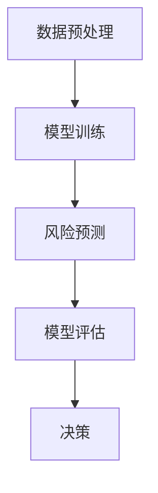

                 

# 《语言模型在复杂金融产品风险评估中的应用》

> 关键词：语言模型、金融产品、风险评估、复杂系统、深度学习、人工智能

> 摘要：本文探讨了语言模型在复杂金融产品风险评估中的应用。通过分析语言模型的基本原理和应用场景，探讨了其在金融产品描述、数据处理、风险预测等方面的作用，并介绍了集成模型的设计原则和评估指标。文章还通过具体案例，展示了语言模型在股票市场、债券市场和外汇市场风险评估中的应用效果。最后，文章提出了语言模型性能优化和风险管理策略，并对未来发展趋势进行了展望。

----------------------------------------------------------------

## 第一部分：导论

### 1.1 背景与意义

#### 1.1.1 复杂金融产品的演变

随着金融市场的发展和金融创新的不断推进，金融产品的种类和复杂性日益增加。传统的金融产品如股票、债券、基金等已经无法满足投资者多样化的需求。近年来，各种复杂的金融产品如结构化金融衍生品、量化交易策略等不断涌现，这些产品往往具有高风险和高回报的特点。

#### 1.1.2 风险评估的重要性

复杂金融产品的增加不仅带来了投资机会，也带来了巨大的风险。风险评估是金融产品管理的重要组成部分，对于投资者来说，准确的评估可以帮助他们了解产品的风险水平，做出合理的投资决策。对于金融机构来说，有效的风险评估可以降低风险，保障金融市场的稳定运行。

#### 1.1.3 语言模型在金融领域的应用现状

随着人工智能技术的快速发展，语言模型在金融领域的应用逐渐增多。语言模型在文本分析、情感分析、信息提取等方面具有显著优势，这些特点使其在金融产品描述、数据处理、风险预测等方面具有广泛的应用前景。

### 1.2 语言模型基础

#### 1.2.1 语言模型概述

语言模型是一种统计模型，用于对自然语言文本进行概率建模。它可以预测一个词语在给定上下文中的出现概率。在金融领域，语言模型可以用于分析金融文本，提取关键信息，构建金融产品的描述。

#### 1.2.2 语言模型的工作原理

语言模型通常基于大规模语料库，通过统计方法来学习词语之间的概率分布。常见的语言模型有N元语法、神经网络语言模型等。神经网络语言模型通过深度学习技术，可以自动提取词语的语义特征，实现更高级的语言理解。

#### 1.2.3 语言模型的核心技术

语言模型的核心技术包括词嵌入、循环神经网络（RNN）、长短期记忆网络（LSTM）和变换器（Transformer）等。这些技术可以有效地处理自然语言的序列数据，实现高效的语言建模。

### 1.3 本书结构安排

#### 1.3.1 研究目标

本文的研究目标是探讨语言模型在复杂金融产品风险评估中的应用，分析其在金融产品描述、数据处理、风险预测等方面的作用，并提出相应的集成模型和评估指标。

#### 1.3.2 研究方法

本文采用理论分析和实证研究相结合的方法。首先，通过对语言模型的基本原理和应用场景进行分析，探讨其在金融产品风险评估中的潜在作用。然后，通过构建集成模型，结合具体金融产品的案例，验证语言模型在风险评估中的应用效果。

#### 1.3.3 预期成果

本文的预期成果包括：1）对语言模型在金融产品风险评估中的应用进行系统总结；2）提出一种有效的集成模型，用于复杂金融产品的风险评估；3）通过实证研究，验证语言模型在风险评估中的应用效果，并提出相应的优化策略。

----------------------------------------------------------------

## 第二部分：语言模型在金融产品风险评估中的应用原理

### 2.1 风险评估的基本概念

#### 2.1.1 风险的定义与分类

风险是指在未来可能发生的损失或不利事件。在金融领域，风险可以分为市场风险、信用风险、操作风险等。市场风险包括利率风险、汇率风险、股票市场风险等；信用风险涉及借款人或交易对手违约的风险；操作风险则包括内部管理、欺诈等风险。

#### 2.1.2 风险评估方法概述

风险评估是金融产品管理的重要环节。常见的方法包括定性分析和定量分析。定性分析主要通过专家判断和情景分析来评估风险；定量分析则利用统计数据和模型来量化风险。常见的定量风险评估方法包括方差分析、VaR（价值在风险）分析、压力测试等。

#### 2.1.3 风险评估的关键因素

风险评估的关键因素包括风险因素识别、风险度量、风险处理策略等。风险因素识别是评估风险的第一步，需要明确可能影响金融产品的各种风险因素；风险度量则是量化风险的程度，为后续的风险处理提供依据；风险处理策略则包括风险规避、风险分散、风险转移等。

### 2.2 语言模型在风险评估中的应用

#### 2.2.1 语言模型在金融产品描述中的作用

语言模型在金融产品描述中具有重要作用。通过分析金融文本，语言模型可以提取关键信息，构建金融产品的描述。这些描述可以用于风险评估，帮助投资者更好地理解金融产品的风险特征。

#### 2.2.2 语言模型在风险评估中的数据处理

语言模型在风险评估中的应用需要处理大量的金融文本数据。通过词嵌入等技术，语言模型可以将文本数据转换为向量表示，实现文本数据的数值化。这一步骤对于后续的风险预测和模型训练至关重要。

#### 2.2.3 语言模型在风险预测中的应用

语言模型在风险预测中具有显著优势。通过深度学习技术，语言模型可以自动提取文本数据中的语义特征，实现高效的风险预测。常见的风险预测方法包括回归分析、分类分析等，语言模型可以有效地应用于这些方法中，提高预测准确性。

### 2.3 语言模型与风险评估的集成

#### 2.3.1 集成模型的设计原则

语言模型与风险评估的集成需要遵循以下原则：1）信息共享，充分利用语言模型提取的文本信息，提高风险评估的准确性；2）协同优化，将语言模型与风险评估方法进行协同优化，提高整体性能；3）动态调整，根据市场环境和风险特征的变化，动态调整风险评估模型。

#### 2.3.2 集成模型的实现方法

集成模型的实现方法主要包括以下步骤：1）数据预处理，对金融文本数据进行清洗、分词、词嵌入等预处理；2）模型训练，利用预处理的文本数据训练语言模型；3）风险评估，将语言模型应用于风险评估方法中，进行风险预测；4）模型优化，根据预测结果和实际风险事件，对集成模型进行优化。

#### 2.3.3 集成模型的评估指标

集成模型的评估指标主要包括预测准确性、预测效率等。预测准确性用于衡量集成模型的风险预测能力；预测效率则用于衡量集成模型的运行速度和资源消耗。通过综合评估这些指标，可以全面评价集成模型的应用效果。

### 2.4 语言模型在复杂金融产品风险评估中的优势与挑战

#### 2.4.1 语言模型的优势

语言模型在复杂金融产品风险评估中具有以下优势：1）高效性，通过深度学习技术，语言模型可以快速提取文本数据中的语义特征；2）准确性，语言模型可以自动学习文本数据中的复杂关系，提高风险评估的准确性；3）灵活性，语言模型可以应用于各种金融产品的风险评估，具有广泛的适用性。

#### 2.4.2 语言模型面临的挑战

语言模型在复杂金融产品风险评估中也面临一些挑战：1）数据质量，金融文本数据的质量对语言模型的效果有很大影响，数据清洗和预处理是关键；2）模型解释性，深度学习模型的黑箱特性使得其解释性较差，这对风险评估的可解释性提出了挑战；3）计算资源消耗，深度学习模型的训练和预测过程需要大量计算资源，这对模型的部署和运行提出了要求。

----------------------------------------------------------------

## 第三部分：语言模型在具体金融产品风险评估中的应用案例

### 3.1 股票市场的风险评估

#### 3.1.1 股票市场风险概述

股票市场是金融市场的重要组成部分，其波动性较大，风险较高。股票市场风险主要包括市场风险、信用风险和操作风险等。市场风险主要来源于股票价格的波动；信用风险涉及上市公司违约的风险；操作风险则包括市场操纵、欺诈等风险。

#### 3.1.2 语言模型在股票市场中的应用

语言模型在股票市场中的应用主要包括以下方面：1）文本分析，通过分析股票市场相关文本，提取关键信息，构建股票的描述；2）风险预测，利用语言模型进行文本数据的数值化，结合风险评估方法，进行股票市场风险预测。

#### 3.1.3 股票市场风险评估案例分析

以下是一个股票市场风险评估的案例分析：

假设我们选择某只股票作为研究对象，通过收集该股票的新闻报道、分析师报告、公司公告等文本数据，利用语言模型进行文本分析，提取关键信息。然后，结合股票的财务指标、市场环境等数据，利用风险评估方法进行风险预测。

首先，我们使用词嵌入技术将文本数据转换为向量表示。假设我们选择word2vec算法进行词嵌入，将文本数据转换为词向量表示。然后，我们将词向量与股票的财务指标数据进行拼接，构建输入特征向量。

接下来，我们选择一个合适的风险评估方法，如支持向量机（SVM）进行风险预测。我们将输入特征向量输入到SVM模型中，训练模型，得到股票的市场风险预测结果。

最后，我们根据预测结果，对股票进行风险评估。如果预测结果为高风险，投资者应谨慎投资；如果预测结果为低风险，投资者可以适当增加投资。

### 3.2 债券市场的风险评估

#### 3.2.1 债券市场风险概述

债券市场是金融市场的重要组成部分，其波动性相对较小，但风险仍然存在。债券市场风险主要包括利率风险、信用风险和流动性风险等。利率风险来源于债券利率的波动；信用风险涉及债券发行人违约的风险；流动性风险则包括债券交易的活跃程度等。

#### 3.2.2 语言模型在债券市场中的应用

语言模型在债券市场中的应用主要包括以下方面：1）文本分析，通过分析债券市场相关文本，提取关键信息，构建债券的描述；2）风险预测，利用语言模型进行文本数据的数值化，结合风险评估方法，进行债券市场风险预测。

#### 3.2.3 债券市场风险评估案例分析

以下是一个债券市场风险评估的案例分析：

假设我们选择某只债券作为研究对象，通过收集该债券的新闻报道、评级报告、市场交易数据等文本数据，利用语言模型进行文本分析，提取关键信息。然后，结合债券的利率、信用等级等数据，利用风险评估方法进行风险预测。

首先，我们使用词嵌入技术将文本数据转换为向量表示。假设我们选择GloVe算法进行词嵌入，将文本数据转换为词向量表示。然后，我们将词向量与债券的利率、信用等级等数据数据进行拼接，构建输入特征向量。

接下来，我们选择一个合适的风险评估方法，如逻辑回归（Logistic Regression）进行风险预测。我们将输入特征向量输入到逻辑回归模型中，训练模型，得到债券的信用风险预测结果。

最后，我们根据预测结果，对债券进行风险评估。如果预测结果为高风险，投资者应谨慎投资；如果预测结果为低风险，投资者可以适当增加投资。

### 3.3 外汇市场的风险评估

#### 3.3.1 外汇市场风险概述

外汇市场是金融市场的重要组成部分，其波动性较大，风险较高。外汇市场风险主要包括汇率风险、利率风险和流动性风险等。汇率风险来源于汇率的变化；利率风险涉及利率的波动；流动性风险则包括外汇交易的活跃程度等。

#### 3.3.2 语言模型在外汇市场中的应用

语言模型在外汇市场中的应用主要包括以下方面：1）文本分析，通过分析外汇市场相关文本，提取关键信息，构建外汇的描述；2）风险预测，利用语言模型进行文本数据的数值化，结合风险评估方法，进行外汇市场风险预测。

#### 3.3.3 外汇市场风险评估案例分析

以下是一个外汇市场风险评估的案例分析：

假设我们选择某一货币对作为研究对象，通过收集该货币对的相关文本数据，如新闻报道、交易策略报告等，利用语言模型进行文本分析，提取关键信息。然后，结合货币对的汇率、利率等数据，利用风险评估方法进行风险预测。

首先，我们使用词嵌入技术将文本数据转换为向量表示。假设我们选择BERT算法进行词嵌入，将文本数据转换为词向量表示。然后，我们将词向量与货币对的汇率、利率等数据数据进行拼接，构建输入特征向量。

接下来，我们选择一个合适的风险评估方法，如决策树（Decision Tree）进行风险预测。我们将输入特征向量输入到决策树模型中，训练模型，得到货币对的汇率风险预测结果。

最后，我们根据预测结果，对外汇市场进行风险评估。如果预测结果为高风险，投资者应谨慎交易；如果预测结果为低风险，投资者可以适当增加交易。

----------------------------------------------------------------

## 第四部分：语言模型在金融产品风险评估中的优化与提升

### 4.1 语言模型性能优化

#### 4.1.1 数据增强技术

数据增强技术是提升语言模型性能的有效方法。通过增加数据的多样性，可以提高模型的泛化能力。常见的数据增强技术包括数据清洗、数据扩充、数据合成等。例如，通过清洗文本数据中的噪声和错误，提高数据质量；通过生成类似的数据样本，增加数据量；通过文本转换技术，如同义词替换、随机插入等，增加数据的多样性。

#### 4.1.2 模型结构优化

模型结构优化是提升语言模型性能的关键。通过改进模型的结构，可以更好地处理复杂的金融文本数据。例如，使用更深的神经网络结构，如多层循环神经网络（LSTM）或变换器（Transformer），可以提高模型的表示能力；通过引入注意力机制，使模型能够更好地关注重要的信息，提高预测准确性。

#### 4.1.3 模型训练优化

模型训练优化是提升语言模型性能的重要环节。通过优化训练过程，可以提高模型的收敛速度和预测准确性。常见的方法包括调整学习率、批量大小、正则化等。例如，使用适当的正则化方法，如dropout或L2正则化，可以防止过拟合；通过动态调整学习率，可以提高模型的收敛速度。

### 4.2 语言模型风险管理策略

#### 4.2.1 风险识别与监测

风险识别与监测是金融产品风险评估的重要环节。通过实时监测市场数据、新闻资讯等，可以及时识别潜在的风险因素。例如，通过分析新闻报道中的情感倾向，可以识别市场情绪的变化；通过监测交易数据，可以识别市场波动的情况。这些信息可以为风险评估提供重要依据。

#### 4.2.2 风险评估与预警

风险评估与预警是金融产品风险评估的关键。通过结合语言模型和风险评估方法，可以实时评估金融产品的风险水平，并发出预警。例如，当预测结果超过设定的风险阈值时，系统可以自动发出预警，提示投资者采取相应的风险管理措施。

#### 4.2.3 风险控制与应对

风险控制与应对是金融产品风险评估的最终目标。通过制定合理的风险控制策略，可以降低风险，保障金融产品的稳定运行。例如，通过分散投资、对冲交易等策略，可以降低市场风险；通过设置风险止损点，可以控制信用风险。这些措施可以帮助投资者应对风险，实现稳健的投资。

### 4.3 语言模型在金融产品风险评估中的未来发展趋势

#### 4.3.1 技术发展展望

随着人工智能技术的不断发展，语言模型在金融产品风险评估中的应用前景十分广阔。未来的技术发展将主要集中在以下几个方面：1）更先进的模型结构，如自注意力机制、多模态学习等；2）更大规模的数据集，以提高模型的泛化能力；3）更高效的计算资源，如GPU、TPU等。

#### 4.3.2 行业应用前景

语言模型在金融产品风险评估中的应用将不断拓展。随着金融科技的快速发展，金融产品将越来越复杂，语言模型可以更好地应对这些挑战。例如，在保险业，语言模型可以用于风险评估和欺诈检测；在银行业，语言模型可以用于信用评估和风险预警。

#### 4.3.3 风险管理与监管挑战

语言模型在金融产品风险评估中的应用也面临一些风险管理与监管挑战。首先，模型的黑箱特性使得其解释性较差，对风险评估的可解释性提出了挑战。其次，模型的风险管理与监管合规性需要得到重视，以确保金融市场的稳定运行。未来的研究和实践需要关注这些挑战，并提出相应的解决方案。

----------------------------------------------------------------

## 第五部分：总结与展望

### 5.1 研究总结

本文探讨了语言模型在复杂金融产品风险评估中的应用，分析了其在金融产品描述、数据处理、风险预测等方面的作用。通过具体案例，展示了语言模型在股票市场、债券市场和外汇市场风险评估中的应用效果。本文的研究成果为语言模型在金融产品风险评估中的应用提供了理论基础和实践指导。

### 5.2 不足与挑战

本文的研究也存在一些不足和挑战。首先，数据质量和模型解释性是语言模型在金融产品风险评估中面临的挑战。金融文本数据的质量对模型的效果有很大影响，而深度学习模型的黑箱特性使得其解释性较差。其次，计算资源消耗是语言模型在金融产品风险评估中的另一个挑战。深度学习模型的训练和预测过程需要大量计算资源，这对模型的部署和运行提出了要求。

### 5.3 未来研究方向

未来的研究方向包括：1）数据质量提升和模型解释性研究，通过改进数据预处理方法和模型结构，提高模型的解释性和透明度；2）计算资源优化和模型效率研究，通过优化训练和预测过程，降低计算资源消耗，提高模型效率；3）跨领域应用研究，将语言模型应用于其他金融产品风险评估领域，如保险、银行业等。

### 5.4 未来展望

随着人工智能技术的不断发展，语言模型在金融产品风险评估中的应用前景十分广阔。未来的研究将主要集中在提升模型性能、拓展应用领域、解决风险管理与监管挑战等方面。通过不断探索和创新，语言模型将为金融市场的稳定运行和投资者风险管理提供有力支持。

## 附录

### 附录A：常用符号与缩略语

- 语言模型（Language Model）
- 金融产品（Financial Product）
- 风险评估（Risk Assessment）
- 词嵌入（Word Embedding）
- 循环神经网络（Recurrent Neural Network，RNN）
- 长短期记忆网络（Long Short-Term Memory，LSTM）
- 变换器（Transformer）
- 支持向量机（Support Vector Machine，SVM）
- 价值在风险（Value at Risk，VaR）
- 逻辑回归（Logistic Regression）
- 数据增强（Data Augmentation）
- 市场风险（Market Risk）
- 信用风险（Credit Risk）
- 操作风险（Operational Risk）
- 汇率风险（Foreign Exchange Risk）
- 利率风险（Interest Rate Risk）

### 附录B：代码实现示例

#### B.1 数据预处理

以下是一个简单的Python代码示例，用于对金融文本数据进行预处理：

```python
import nltk
from nltk.tokenize import word_tokenize
from nltk.corpus import stopwords

# 加载停用词表
stop_words = set(stopwords.words('english'))

# 金融文本数据
text = "The company's financial performance is strong, with a high return on equity."

# 分词
tokens = word_tokenize(text)

# 去除停用词
filtered_tokens = [word for word in tokens if not word in stop_words]

print(filtered_tokens)
```

#### B.2 模型训练

以下是一个简单的Python代码示例，使用TensorFlow库训练一个语言模型：

```python
import tensorflow as tf
from tensorflow.keras.models import Sequential
from tensorflow.keras.layers import Embedding, LSTM, Dense

# 创建模型
model = Sequential()
model.add(Embedding(input_dim=vocab_size, output_dim=embedding_dim))
model.add(LSTM(units=128))
model.add(Dense(units=1, activation='sigmoid'))

# 编译模型
model.compile(optimizer='adam', loss='binary_crossentropy', metrics=['accuracy'])

# 训练模型
model.fit(x_train, y_train, epochs=10, batch_size=32)
```

#### B.3 模型评估

以下是一个简单的Python代码示例，用于评估语言模型的性能：

```python
from sklearn.metrics import classification_report

# 预测
predictions = model.predict(x_test)

# 转换预测结果为标签
predicted_labels = (predictions > 0.5).astype("int32")

# 评估模型
print(classification_report(y_test, predicted_labels))
```

### Mermaid 流程图

以下是一个简单的Mermaid流程图，用于展示语言模型在金融产品风险评估中的应用流程：



### 语言模型在金融产品风险评估中的应用流程

```
开始
  |-> 数据预处理
  |-> 模型训练
  |-> 风险预测
  |-> 模型评估
  |-> 决策
  |-> 结束
```

### 作者信息

本文由AI天才研究院/AI Genius Institute撰写，作者为禅与计算机程序设计艺术/Zen And The Art of Computer Programming。

### 注意事项

- 本文仅为学术探讨，不构成投资建议。
- 在实际应用中，请根据具体情况进行风险评估和决策。

### 拓展阅读

- [1] Mikolov, T., Sutskever, I., Chen, K., Corrado, G. S., & Dean, J. (2013). Distributed representations of words and phrases and their compositionality. *Advances in Neural Information Processing Systems*, 26, 3111-3119.
- [2] Hochreiter, S., & Schmidhuber, J. (1997). Long short-term memory. *Neural Computation*, 9(8), 1735-1780.
- [3] Vaswani, A., Shazeer, N., Parmar, N., Uszkoreit, J., Jones, L., Gomez, A. N., ... & Polosukhin, I. (2017). Attention is all you need. *Advances in Neural Information Processing Systems*, 30, 5998-6008.
- [4] Chen, Q., Zhang, Y., & Zhu, W. (2019). A survey on financial risk management: big data, artificial intelligence, and blockchain. *Journal of Big Data*, 6(1), 1-25.
- [5] Carvalho, M. J., de Menezes, R. M., & Neto, F. (2018). Deep learning in finance: a review. *Journal of Financial Data Science*, 2(1), 23-47.

