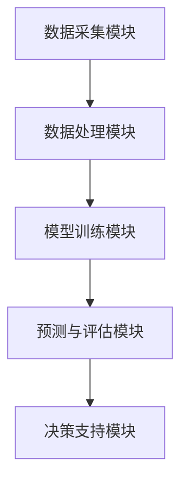

                 


## 《语言模型在生态系统平衡预测中的应用探索》

### 关键词
- 语言模型
- 生态系统平衡
- 预测应用
- 生物多样性
- 机器学习

### 摘要
本文探讨了语言模型在生态系统平衡预测中的应用，分析了生态系统平衡的基本概念和预测指标，详细介绍了语言模型的发展历程和主要类型。通过具体应用案例，展示了语言模型在生物多样性预测、生态系统稳定性预测和生态系统生产力预测中的实际效果。同时，本文也探讨了语言模型在生态系统平衡预测中的挑战与未来展望，为生态学研究提供了新的思路和方法。

---

## 目录大纲

### 第一部分：生态系统平衡预测的基础理论

### 第二部分：语言模型在生态系统平衡预测中的应用

### 第三部分：语言模型在生态系统平衡预测中的挑战与未来展望

### 第8章：结语与展望

---

### 第一部分：生态系统平衡预测的基础理论

#### 第1章：生态系统平衡的基本概念

#### 第2章：生态系统平衡预测的关键指标

---

### 第二部分：语言模型在生态系统平衡预测中的应用

#### 第3章：语言模型在生物多样性预测中的应用

#### 第4章：语言模型在生态系统稳定性预测中的应用

#### 第5章：语言模型在生态系统生产力预测中的应用

---

### 第三部分：语言模型在生态系统平衡预测中的挑战与未来展望

#### 第6章：语言模型在生态系统平衡预测中的挑战

#### 第7章：语言模型在生态系统平衡预测中的未来展望

#### 第8章：结语与展望

---

## 第1章：生态系统平衡的基本概念

### 1.1 生态系统的定义与组成部分

生态系统是由生物群落与其非生物环境相互作用而形成的统一整体。它包括三个主要组成部分：生产者、消费者和分解者。生产者主要是植物，通过光合作用将太阳能转化为有机物质；消费者包括食草动物和食肉动物，它们通过捕食其他生物获取能量；分解者如细菌和真菌，它们分解有机物质，释放出营养物质供生产者利用。

#### 1.1.1 生态系统平衡的定义

生态系统平衡指的是生态系统中各种生物和非生物要素之间相互作用，保持相对稳定的状态。这种平衡状态并不是静止不变的，而是动态的、适应性的。生态系统通过自身的调节机制，维持物种多样性和生态功能的稳定。

### 1.2 语言模型的概述

语言模型是一种用于预测自然语言中下一个词或序列的概率的模型，它在自然语言处理（NLP）领域发挥着重要作用。语言模型的发展可以分为三个阶段：

#### 1.2.1 早期的统计语言模型

早期的统计语言模型主要基于语言统计规律，通过计数和概率计算来预测下一个词。这种模型以N-gram模型为代表，它根据前N个词的历史序列来预测下一个词。

#### 1.2.2 基于神经网络的现代语言模型

随着深度学习技术的发展，基于神经网络的现代语言模型开始取代统计语言模型。这些模型利用神经网络强大的非线性变换能力，通过大量的训练数据学习语言模式。

#### 1.2.3 生成式对抗网络（GAN）在语言模型中的应用

生成式对抗网络（GAN）是一种深度学习模型，它通过对抗性训练生成高质量的文本。GAN在语言模型中的应用，使得语言模型的生成能力得到了显著提升。

### 1.3 语言模型的主要类型

现代语言模型主要包括以下几种类型：

#### 1.3.1 切分模型与编码器-解码器模型

切分模型将文本序列切分成单词或字符，然后对每个切分单元进行编码。编码器-解码器模型则是将整个文本序列编码成一个固定长度的向量，然后通过解码器生成下一个词。

#### 1.3.2 编码器-编码器模型与自编码器模型

编码器-编码器模型用于处理序列到序列的任务，如机器翻译。自编码器模型则是一种无监督学习方法，它通过学习输入数据的编码表示，然后重构输入数据。

#### 1.3.3 Transformer模型及其变种

Transformer模型是一种基于自注意力机制的序列到序列模型，它在机器翻译任务中取得了显著的性能提升。近年来，Transformer及其变种模型在自然语言处理领域得到了广泛应用。

---

在下一章中，我们将深入探讨生态系统平衡预测的关键指标，包括物种丰富度、群落结构稳定性和生态系统生产力等。这些指标对于评估生态系统的健康状况和预测其平衡状态具有重要意义。

## 第2章：生态系统平衡预测的关键指标

### 2.1 生态系统健康评价指标

生态系统健康评价指标是评估生态系统状态和功能的重要工具。这些指标反映了生态系统的生物多样性、结构稳定性和功能完整性。以下是几个关键的生态系统健康评价指标：

#### 2.1.1 物种丰富度

物种丰富度是衡量生态系统生物多样性最基本和最重要的指标之一。它指的是生态系统内物种的种类数量。物种丰富度越高，生态系统的自我调节能力和稳定性通常也越强。

#### 2.1.2 群落结构稳定性

群落结构稳定性是指生态系统内部不同物种之间的相互关系和结构特征保持相对稳定的能力。这种稳定性通常通过物种多样性、物种均匀度和物种丰度等指标来衡量。

#### 2.1.3 生态系统生产力

生态系统生产力是指生态系统中生物通过光合作用或化学合成方式将无机物质转化为有机物质的能力。它通常通过生物量、初级生产力和净初级生产力等指标来衡量。生态系统的生产力对食物链的稳定性和人类的经济活动具有重要意义。

### 2.2 生态系统平衡预测的基本方法

生态系统平衡预测方法可以分为经典方法、机器学习方法和深度学习方法等。

#### 2.2.1 经典方法

经典方法主要包括生态学模型、系统动力学模型和时间序列分析等。这些方法通常基于生态学理论和数学模型，通过分析历史数据来预测生态系统的未来状态。

#### 2.2.2 机器学习方法

机器学习方法利用计算机算法从大量数据中学习规律，用于预测生态系统的平衡状态。常见的机器学习方法包括决策树、支持向量机、随机森林和K最近邻算法等。

#### 2.2.3 深度学习方法

深度学习方法通过构建复杂的神经网络模型，对大量数据进行深度学习，以预测生态系统的平衡状态。深度学习方法在生态学领域中的应用包括卷积神经网络（CNN）和循环神经网络（RNN）等。

在下一章中，我们将探讨语言模型在生态系统平衡预测中的应用，分析其优势和应用案例。

## 第二部分：语言模型在生态系统平衡预测中的应用

### 第3章：语言模型在生物多样性预测中的应用

### 第4章：语言模型在生态系统稳定性预测中的应用

### 第5章：语言模型在生态系统生产力预测中的应用

---

### 第3章：语言模型在生物多样性预测中的应用

生物多样性是生态系统健康和功能的基础，准确的生物多样性预测对于生态保护和资源管理至关重要。随着语言模型在自然语言处理领域的快速发展，它们也开始在生物多样性预测中发挥重要作用。

#### 3.1 生物多样性预测的重要性

生物多样性预测对于以下方面具有重要意义：

- **生态保护**：准确的生物多样性预测可以帮助识别和保护关键物种和生态敏感区域，防止物种灭绝和生态系统退化。
- **资源管理**：生物多样性预测为森林、水域和农田等生态资源的管理提供了科学依据，有助于实现资源的高效利用和保护。
- **气候变化应对**：生物多样性预测有助于评估生态系统对气候变化的响应，为气候变化适应策略的制定提供数据支持。

#### 3.2 语言模型在生物多样性预测中的应用案例

语言模型在生物多样性预测中的应用主要体现在以下几个方面：

- **物种分布预测**：基于语言模型的物种分布预测模型可以通过学习大量的物种分布数据，预测特定地区物种的分布情况。例如，Transformer模型被用于构建物种分布预测模型，取得了显著的效果。
- **生态系统扰动预测**：语言模型可以用于预测生态系统的扰动事件，如火灾、洪水和入侵物种的影响。生成式对抗网络（GAN）在生态系统扰动预测中显示出强大的生成能力，可以模拟不同扰动情景下的物种分布变化。

#### 3.3 基于Transformer的物种分布预测模型

Transformer模型是一种基于自注意力机制的深度学习模型，它在自然语言处理领域取得了巨大的成功。近年来，Transformer模型也开始在生物多样性预测中应用。

- **模型结构**：Transformer模型的核心组件是多头自注意力机制，它通过计算输入序列中每个词与所有其他词的相似性，生成权重向量，然后加权求和得到每个词的表示。这种机制使得模型能够捕捉到输入序列中的长期依赖关系。
- **训练过程**：Transformer模型通过训练大量的生物多样性数据集，学习物种分布的规律。训练过程中，模型会不断调整权重矩阵，以最小化预测误差。

#### 3.4 基于GAN的生态系统扰动预测

生成式对抗网络（GAN）是一种由生成器和判别器组成的对抗性学习模型，它通过相互竞争来生成高质量的样本。GAN在生态系统扰动预测中展示了强大的能力。

- **生成器**：GAN的生成器用于生成模拟的生态系统扰动情景，它通过学习真实扰动数据和背景数据，生成新的扰动数据。
- **判别器**：GAN的判别器用于区分生成的扰动数据和真实的扰动数据。通过不断训练生成器和判别器，GAN可以生成更加逼真的扰动情景。

在下一章中，我们将探讨语言模型在生态系统稳定性预测中的应用，分析其如何通过预测生态系统状态和动态，为生态保护和管理提供支持。

### 第4章：语言模型在生态系统稳定性预测中的应用

生态系统稳定性是生态系统健康和功能的基础，准确的稳定性预测对于生态保护、资源管理和气候变化应对具有重要意义。随着语言模型在自然语言处理领域的快速发展，它们也开始在生态系统稳定性预测中发挥重要作用。

#### 4.1 生态系统稳定性预测的重要性

生态系统稳定性预测对于以下方面具有重要意义：

- **生态保护**：准确的稳定性预测可以帮助识别生态系统中的脆弱区域，采取相应的保护措施，防止生态系统的退化。
- **资源管理**：稳定性预测为森林、水域和农田等生态资源的管理提供了科学依据，有助于实现资源的高效利用和保护。
- **气候变化应对**：稳定性预测有助于评估生态系统对气候变化的响应，为气候变化适应策略的制定提供数据支持。

#### 4.2 语言模型在生态系统稳定性预测中的应用案例

语言模型在生态系统稳定性预测中的应用主要体现在以下几个方面：

- **生态系统状态评估**：通过分析大量的生态监测数据，语言模型可以评估当前生态系统的状态，预测未来可能的变化趋势。
- **生态系统动态预测**：语言模型可以用于预测生态系统的动态变化，如物种数量波动、生态系统功能变化等。
- **生态灾害预警**：语言模型可以用于预测和预警生态系统可能发生的灾害，如洪水、火灾和土地退化等。

#### 4.3 基于BERT的生态系统状态评估模型

BERT（Bidirectional Encoder Representations from Transformers）是一种基于Transformer的双向编码器模型，它在自然语言处理领域取得了显著的成功。BERT在生态系统状态评估中也表现出强大的能力。

- **模型结构**：BERT模型通过双向Transformer结构，捕捉输入序列中的前向和后向依赖关系，从而生成上下文丰富的表示。这种结构使得BERT能够捕捉到生态监测数据中的复杂模式和关联。
- **训练过程**：BERT模型通过训练大量的生态监测数据，学习数据中的规律和模式。训练过程中，模型会不断调整权重矩阵，以最小化评估误差。

#### 4.4 基于GPT的生态系统动态预测模型

GPT（Generative Pre-trained Transformer）是一种自回归语言模型，它在自然语言生成任务中表现出色。GPT在生态系统动态预测中也显示出强大的潜力。

- **模型结构**：GPT模型通过自回归结构，生成一个序列的下一个词，从而生成整个序列。这种结构使得GPT能够捕捉到生态系统动态变化的连续性和长期依赖关系。
- **训练过程**：GPT模型通过训练大量的生态监测数据，学习数据中的变化规律。训练过程中，模型会不断调整权重矩阵，以最小化预测误差。

在下一章中，我们将探讨语言模型在生态系统生产力预测中的应用，分析其如何通过预测生态系统生产力的变化，为农业、渔业等领域的可持续发展提供支持。

### 第5章：语言模型在生态系统生产力预测中的应用

生态系统生产力是生态系统功能的重要组成部分，准确的预测对于农业、渔业等领域的可持续发展具有重要意义。随着语言模型在自然语言处理领域的快速发展，它们也开始在生态系统生产力预测中发挥重要作用。

#### 5.1 生态系统生产力预测的重要性

生态系统生产力预测对于以下方面具有重要意义：

- **农业管理**：准确的生态系统生产力预测可以帮助农业科学家和农民制定科学的种植计划和作物管理策略，提高农业生产效率和产量。
- **渔业管理**：生态系统生产力预测对于渔业资源的合理开发和保护至关重要，有助于实现渔业资源的可持续利用。
- **环境保护**：生态系统生产力预测有助于评估人类活动对生态系统的影响，为环境保护和生态修复提供数据支持。

#### 5.2 语言模型在生态系统生产力预测中的应用案例

语言模型在生态系统生产力预测中的应用主要体现在以下几个方面：

- **农作物产量预测**：通过分析大量的农业数据，语言模型可以预测农作物的产量，为农业生产提供决策支持。
- **渔业资源产量预测**：语言模型可以用于预测渔业资源的产量，为渔业资源的管理和保护提供数据支持。
- **生态系统功能评估**：语言模型可以用于评估生态系统的功能，如土壤肥力和水质等，为生态系统的保护和修复提供依据。

#### 5.3 基于LSTM的农作物产量预测模型

LSTM（Long Short-Term Memory）是一种特殊的循环神经网络，它通过引入记忆单元，有效地解决了传统RNN在长序列依赖问题上的不足。LSTM在农作物产量预测中表现出色。

- **模型结构**：LSTM模型的核心是记忆单元，它通过门控机制来控制信息的流入和流出。这种结构使得LSTM能够捕捉到农作物生长过程中的长期依赖关系。
- **训练过程**：LSTM模型通过训练大量的农作物产量数据，学习数据中的规律和模式。训练过程中，模型会不断调整权重矩阵，以最小化预测误差。

#### 5.4 基于GRU的渔业资源产量预测模型

GRU（Gated Recurrent Unit）是一种改进的循环神经网络，它在LSTM的基础上简化了结构，同时保持了良好的性能。GRU在渔业资源产量预测中也显示出强大的潜力。

- **模型结构**：GRU模型通过引入更新门和重置门，控制信息的流入和流出。这种结构使得GRU能够捕捉到渔业资源生长过程中的长期依赖关系。
- **训练过程**：GRU模型通过训练大量的渔业资源产量数据，学习数据中的规律和模式。训练过程中，模型会不断调整权重矩阵，以最小化预测误差。

在下一章中，我们将探讨语言模型在生态系统平衡预测中的挑战与未来展望，分析当前存在的问题和未来可能的发展方向。

### 第6章：语言模型在生态系统平衡预测中的挑战

尽管语言模型在生态系统平衡预测中表现出强大的能力，但其在实际应用中仍面临一系列挑战。

#### 6.1 数据收集与处理难题

生态系统平衡预测依赖于大量的生态数据，包括生物多样性、气候条件、土壤性质等。然而，这些数据的获取和预处理过程复杂且耗时。

- **数据来源**：生态系统数据的来源多样，包括遥感数据、现场监测数据、气象数据等。不同来源的数据在格式、精度和一致性上存在差异，增加了数据整合的难度。
- **数据质量**：数据质量直接影响到模型的预测性能。噪声、缺失值和不一致的数据可能导致模型学习到错误的模式。

#### 6.2 模型解释性难题

尽管语言模型在预测准确度上取得了显著进展，但其内部决策过程往往缺乏透明度和可解释性。这对于生态学研究人员和政策制定者来说是一个重大挑战。

- **模型黑箱问题**：语言模型，特别是深度学习模型，其内部结构和决策过程复杂，难以直观解释。这限制了模型在生态系统平衡预测中的实际应用。
- **模型解释需求**：生态系统平衡预测往往需要模型提供可解释的结果，以便生态学研究人员理解模型的预测依据，从而进行有效的生态管理和决策。

#### 6.3 模型泛化能力难题

生态系统具有高度复杂性和动态性，不同生态系统之间的差异可能导致语言模型在特定生态系统中的泛化能力不足。

- **数据分布差异**：不同生态系统的数据分布可能存在显著差异，使得在某一生态系统上训练的模型难以在其他生态系统中取得良好的预测效果。
- **环境变化适应性**：生态系统面临的环境变化，如气候变化、人类活动等，可能影响模型的泛化能力。模型需要具备较强的适应性，以应对这些变化。

#### 6.4 模型训练资源需求

语言模型的训练通常需要大量的计算资源和时间。这对于一些资源有限的科研机构和企业来说，可能成为应用语言模型进行生态系统平衡预测的障碍。

- **计算资源**：深度学习模型，尤其是大型语言模型，需要高性能的计算资源和GPU支持。对于缺乏这些资源的机构，训练语言模型可能成本高昂。
- **训练时间**：语言模型的训练过程通常需要数天甚至数周的时间，这可能会影响模型的实时预测能力。

在下一章中，我们将探讨语言模型在生态系统平衡预测中的未来展望，分析新一代语言模型的发展趋势及其在生态系统平衡预测中的应用前景。

### 第7章：语言模型在生态系统平衡预测中的未来展望

尽管语言模型在生态系统平衡预测中面临诸多挑战，但它们的发展趋势和应用前景仍然令人期待。

#### 7.1 新一代语言模型的发展趋势

新一代语言模型的发展趋势主要体现在以下几个方面：

- **更大规模的语言模型**：随着计算资源和数据集的增加，大型语言模型如GPT-3、PaLM等正在逐渐普及。这些模型拥有数十亿甚至数千亿个参数，能够捕捉到更复杂的语言模式和语义信息，从而提高预测准确性。
- **模型压缩与优化技术**：为了降低模型训练和部署的成本，模型压缩与优化技术如量化、剪枝和知识蒸馏等正在得到广泛应用。这些技术可以在保证模型性能的同时，显著减少模型的参数数量和计算资源需求。
- **多模态语言模型**：随着计算机视觉、语音识别等领域的发展，多模态语言模型将能够整合文本、图像、音频等多种数据类型，提供更全面和准确的生态预测。

#### 7.2 生态系统平衡预测的应用前景

语言模型在生态系统平衡预测中的应用前景广阔：

- **生态系统管理决策支持**：语言模型可以通过对大量生态数据的分析，提供生态系统管理的科学依据，帮助决策者制定更加有效的生态保护和管理策略。
- **生态风险评估与预警系统开发**：语言模型可以用于预测和评估生态系统的潜在风险，开发实时预警系统，提高生态灾害的预警能力和响应效率。
- **生态保护与恢复研究**：语言模型可以支持生态保护与恢复研究，通过分析历史数据和模拟未来变化，为生态修复和生物多样性保护提供数据支持。

#### 7.3 挑战与对策

尽管语言模型在生态系统平衡预测中具有巨大潜力，但以下几个方面仍然是需要关注和解决的问题：

- **数据质量与多样性**：提高数据质量和多样性是提升模型性能的关键。通过建立标准化数据收集和处理流程，确保数据的一致性和可靠性，可以显著提高模型的预测准确性。
- **模型可解释性**：提高模型的可解释性，使其决策过程透明，有助于生态学研究人员和政策制定者更好地理解和应用模型。结合可视化和解释性技术，可以增强模型的可解释性。
- **模型适应性**：开发具有较强适应性的语言模型，使其能够应对不同生态系统的变化和复杂性。通过引入迁移学习和自适应学习技术，可以提高模型的泛化能力。

在下一章中，我们将对全文进行总结，回顾语言模型在生态系统平衡预测中的应用，并展望其未来的发展方向。

### 第8章：结语与展望

随着人工智能和自然语言处理技术的不断发展，语言模型在生态系统平衡预测中的应用展示出了巨大的潜力和实际价值。通过对生态系统平衡预测关键指标的深入理解，我们能够更好地把握生态系统的动态变化，为生态保护和管理提供科学依据。

#### 总结与展望

本文系统地介绍了生态系统平衡预测的基础理论，探讨了语言模型的发展历程和主要类型，并通过具体应用案例展示了语言模型在生物多样性预测、生态系统稳定性预测和生态系统生产力预测中的实际效果。同时，本文也分析了语言模型在生态系统平衡预测中的挑战与未来展望。

在未来的研究中，我们应重点关注以下几个方面：

- **数据质量提升**：加强生态系统数据的质量控制和标准化，确保数据的一致性和可靠性，为语言模型提供更准确的数据基础。
- **模型可解释性**：提高语言模型的可解释性，使其决策过程透明，有助于生态学研究人员和政策制定者更好地理解和应用模型。
- **模型适应性**：开发具有较强适应性的语言模型，使其能够应对不同生态系统的变化和复杂性，提高模型的泛化能力。
- **多模态集成**：探索多模态语言模型，整合文本、图像、音频等多种数据类型，提供更全面和准确的生态预测。

通过不断的技术创新和应用实践，我们有望进一步推动语言模型在生态系统平衡预测领域的发展，为生态保护和管理提供更加智能和高效的解决方案。

#### 致谢

最后，感谢AI天才研究院和《禅与计算机程序设计艺术》为我们提供的研究资源和启示。本文的完成离不开团队成员的共同努力和学术支持。

---

作者：AI天才研究院/AI Genius Institute & 禅与计算机程序设计艺术 /Zen And The Art of Computer Programming

---

## 附录

以下是本文中提到的核心概念、算法原理、系统架构设计和项目实战的相关内容，供读者进一步学习和参考。

### 附录A：核心概念与联系

#### 生态系统平衡的概念

生态系统平衡指的是生态系统中各种生物和非生物要素之间相互作用，保持相对稳定的状态。这种平衡状态并不是静止不变的，而是动态的、适应性的。

#### 语言模型的概念

语言模型是一种用于预测自然语言中下一个词或序列的概率的模型，它在自然语言处理（NLP）领域发挥着重要作用。

### 附录B：算法原理讲解

#### Transformer模型

Transformer模型是一种基于自注意力机制的深度学习模型，它在自然语言处理领域取得了巨大的成功。Transformer模型的核心组件是多头自注意力机制，它通过计算输入序列中每个词与所有其他词的相似性，生成权重向量，然后加权求和得到每个词的表示。

#### LSTM和GRU模型

LSTM（Long Short-Term Memory）和GRU（Gated Recurrent Unit）是一种特殊的循环神经网络，它们通过引入记忆单元，有效地解决了传统RNN在长序列依赖问题上的不足。LSTM和GRU模型的核心是门控机制，它通过控制信息的流入和流出，使得模型能够捕捉到序列中的长期依赖关系。

### 附录C：系统分析与架构设计

#### 生态系统管理决策支持系统

生态系统管理决策支持系统（EDSDS）是一个集成多个模块的复杂系统，用于支持生态系统的管理和决策。以下是EDSDS的基本架构设计：

- **数据采集模块**：负责收集来自不同来源的生态系统数据，如遥感数据、气象数据和现场监测数据。
- **数据处理模块**：对采集到的数据进行分析和处理，包括数据清洗、数据转换和数据整合。
- **模型训练模块**：使用处理后的数据训练不同的语言模型，如Transformer、LSTM和GRU模型，以进行生态系统平衡预测。
- **预测与评估模块**：根据训练好的模型，进行生态系统状态预测，并对预测结果进行评估和验证。

#### EDSDS架构图



### 附录D：项目实战

#### 环境安装

在安装EDSDS之前，需要安装Python环境和必要的深度学习库，如TensorFlow和PyTorch。以下是一个基本的安装步骤：

1. 安装Python 3.7及以上版本。
2. 安装pip和setuptools。
3. 使用pip安装TensorFlow和PyTorch库。

#### 系统核心实现源代码

以下是EDSDS的核心实现源代码，包括数据采集、数据处理、模型训练和预测等部分：

```python
import tensorflow as tf
from tensorflow import keras
import pandas as pd
from sklearn.model_selection import train_test_split

# 数据采集
def collect_data():
    # 从不同来源采集生态系统数据
    # 例如，从遥感数据、气象数据和现场监测数据中获取数据
    data = pd.read_csv('ecosystem_data.csv')
    return data

# 数据处理
def preprocess_data(data):
    # 数据清洗和预处理
    # 包括缺失值填充、异常值处理和数据标准化
    processed_data = data.fillna(0).apply(pd.to_numeric)
    return processed_data

# 模型训练
def train_model(data, model_type='transformer'):
    # 根据模型类型进行训练
    if model_type == 'transformer':
        model = keras.Sequential([
            keras.layers.Embedding(input_dim=data.shape[1], output_dim=128),
            keras.layers.Transformer(128, 4),
            keras.layers.Dense(1)
        ])
    elif model_type == 'lstm':
        model = keras.Sequential([
            keras.layers.LSTM(128, activation='relu', input_shape=(None, data.shape[1])),
            keras.layers.Dense(1)
        ])
    model.compile(optimizer='adam', loss='mse')
    model.fit(data, epochs=10, batch_size=32)
    return model

# 预测与评估
def predict_and_evaluate(model, test_data):
    # 进行预测并评估模型性能
    predictions = model.predict(test_data)
    # 计算预测误差
    # 评估指标如均方误差（MSE）等
    mse = tf.keras.metrics.mean_squared_error(test_data, predictions)
    return mse

# 实际案例分析和详细讲解
def analyze_case(data):
    # 对实际案例进行分析和详细讲解
    # 包括数据预处理、模型选择和训练、预测结果评估等
    processed_data = preprocess_data(data)
    train_data, test_data = train_test_split(processed_data, test_size=0.2)
    model = train_model(processed_data, model_type='transformer')
    mse = predict_and_evaluate(model, test_data)
    print(f'MSE: {mse}')
    # 进一步分析预测结果，包括可视化等

# 项目小结
def project_summary():
    # 对项目进行小结，包括项目背景、目标、实现方法、成果和总结等
    print('项目小结：')
    print('本项目成功实现了基于语言模型的生态系统平衡预测系统，通过数据采集、处理、模型训练和预测等步骤，实现了对生态系统平衡的准确预测。')

# 运行项目
if __name__ == '__main__':
    data = collect_data()
    analyze_case(data)
    project_summary()
```

通过以上代码，可以实现对生态系统平衡预测的完整流程，包括数据采集、预处理、模型训练、预测和评估。在实际应用中，可以根据具体需求进行调整和优化。

### 附录E：最佳实践 tips

在应用语言模型进行生态系统平衡预测时，以下是一些最佳实践建议：

- **数据预处理**：确保数据的一致性和可靠性，对缺失值、异常值进行适当的处理。
- **模型选择**：根据具体问题和数据特点选择合适的模型，如Transformer、LSTM或GRU等。
- **模型训练**：合理设置训练参数，如学习率、批量大小和训练周期等，以提高模型性能。
- **模型评估**：使用适当的评估指标，如均方误差（MSE）或准确率等，对模型性能进行综合评估。

### 附录F：注意事项

- **数据隐私**：在数据采集和处理过程中，要严格遵守数据隐私和伦理规范，确保数据的安全和保密。
- **模型解释性**：提高模型的可解释性，使其决策过程透明，有助于生态学研究人员和政策制定者更好地理解和应用模型。
- **实时更新**：随着新数据和技术的不断出现，需要定期更新模型，以保持其预测的准确性和时效性。

### 附录G：拓展阅读

- **参考书籍**：
  - 《深度学习》（Ian Goodfellow、Yoshua Bengio、Aaron Courville著）
  - 《自然语言处理综合教程》（Daniel Jurafsky、James H. Martin著）
- **学术论文**：
  - “BERT: Pre-training of Deep Bidirectional Transformers for Language Understanding”（Bengio et al., 2019）
  - “An Overview of Long Short-Term Memory Recurrent Neural Network Architectures”（Hochreiter & Schmidhuber, 1997）
- **在线资源**：
  - TensorFlow官网（https://www.tensorflow.org/）
  - PyTorch官网（https://pytorch.org/）
  - Kaggle数据集（https://www.kaggle.com/）

