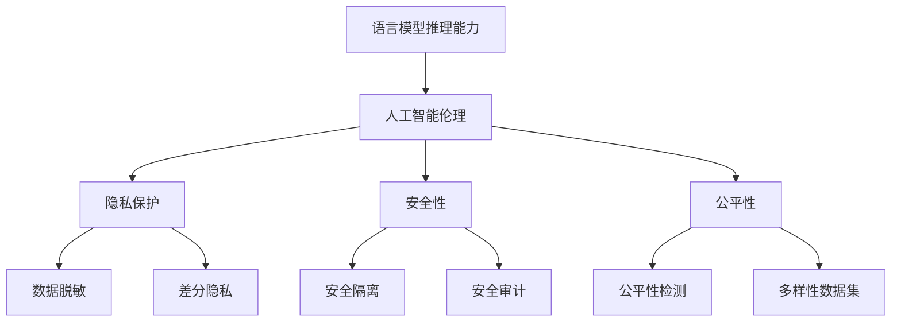
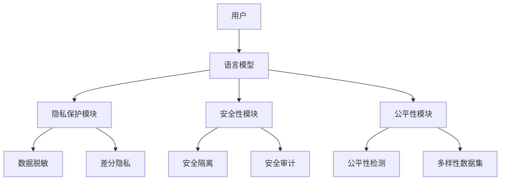

                 

### 《语言模型推理能力与人工智能伦理的交叉研究》

#### 关键词：语言模型，推理能力，人工智能伦理，交叉研究

> 摘要：本文以语言模型和人工智能伦理为主题，探讨了语言模型推理能力的本质和人工智能伦理的核心问题，并通过交叉研究的方法，分析了两者之间的关联以及在实际应用中的平衡策略。文章旨在为研究人员和开发者提供有价值的理论依据和实践指导。

### 引言

随着人工智能技术的迅速发展，语言模型作为其中的一项关键技术，已经在自然语言处理、机器翻译、智能问答等领域取得了显著的成果。然而，随着语言模型能力的不断增强，其在实际应用中也引发了一系列伦理问题。如何平衡语言模型推理能力与人工智能伦理，成为当前研究的热点之一。

本文将从以下几个方面展开讨论：

1. 语言模型的基础概念和推理能力；
2. 人工智能伦理的核心问题；
3. 语言模型推理能力与人工智能伦理的交叉研究；
4. 实际应用中的挑战与解决方案；
5. 未来发展趋势与展望。

### 第一部分：语言模型推理能力研究

#### 第1章：语言模型基础

语言模型（Language Model）是一种统计模型，用于预测自然语言中下一个单词或字符的概率。它通过对大量文本数据进行训练，学习语言的结构和规律，从而实现语言生成和理解。

#### 1.1 语言模型概述

语言模型的基本概念包括：

- **词汇表**：模型中包含的单词或字符列表。
- **概率分布**：模型为每个单词或字符预测的概率分布。

语言模型的主要类型有：

- **n-gram模型**：基于前n个单词的历史信息预测下一个单词。
- **神经网络模型**：如循环神经网络（RNN）、长短时记忆网络（LSTM）等，能够捕捉更复杂的语言结构。

#### 1.2 语言模型的数学基础

语言模型的数学基础包括概率论和线性代数等。以下是几个关键概念：

- **条件概率**：在给定某个条件下，某个事件发生的概率。
- **贝叶斯定理**：通过已知条件概率和先验概率，计算后验概率。

#### 1.3 语言模型的主要类型

- **n-gram模型**：
  $$ P(w_n | w_{n-1}, w_{n-2}, ..., w_1) = \frac{C(w_{n-1}, w_{n-2}, ..., w_1, w_n)}{C(w_{n-1}, w_{n-2}, ..., w_1)} $$
  其中，$C(w_{n-1}, w_{n-2}, ..., w_1, w_n)$ 表示前n个单词共出现的次数，$C(w_{n-1}, w_{n-2}, ..., w_1)$ 表示前n-1个单词共出现的次数。

- **神经网络模型**：
  $$ y = \sigma(\boldsymbol{W}^T \boldsymbol{h}_{t-1} + b) $$
  其中，$\sigma$ 表示激活函数，$\boldsymbol{W}$ 和 $b$ 分别为权重和偏置。

#### 第2章：语言模型推理能力

语言模型的推理能力是指其在处理自然语言时，能够理解并生成符合语言规则的句子和段落的能力。评估语言模型推理能力的方法包括：

- **BLEU分数**：通过对比模型生成的文本和参考文本的相似度来评估模型的性能。
- **人类评价**：由人类专家对模型生成的文本进行评价。

语言模型推理能力的实现主要包括：

- **注意力机制**：在处理长文本时，能够关注关键信息。
- **生成对抗网络（GAN）**：通过生成器和判别器的对抗训练，提高模型生成文本的质量。

#### 2.3 语言模型推理能力的发展趋势

随着深度学习技术的发展，语言模型的推理能力正在不断提升。未来的趋势包括：

- **预训练**：通过大量无监督数据对模型进行预训练，提高模型的泛化能力。
- **多模态**：结合不同类型的数据（如文本、图像、声音等），实现更高级的语言理解。

### 第二部分：人工智能伦理研究

#### 第3章：人工智能伦理概述

人工智能伦理（Artificial Intelligence Ethics）是研究人工智能在应用过程中可能引发的伦理问题的一门学科。其主要关注点包括：

- **隐私**：人工智能应用中如何保护用户的隐私。
- **安全**：如何确保人工智能系统的稳定性和安全性。
- **公平**：如何避免人工智能系统中的歧视和不公平现象。

#### 3.1 人工智能伦理的重要性

人工智能伦理的重要性体现在：

- **社会责任**：确保人工智能的发展符合社会道德规范。
- **法律合规**：遵守相关法律法规，避免法律风险。
- **公众信任**：增强公众对人工智能的信任，促进其广泛应用。

#### 3.2 人工智能伦理的主要问题

人工智能伦理的主要问题包括：

- **隐私问题**：如何保护用户隐私，防止数据泄露。
- **安全问题**：如何确保人工智能系统的稳定性和安全性。
- **公平问题**：如何避免人工智能系统中的歧视和不公平现象。

#### 3.3 人工智能伦理的研究方法

人工智能伦理的研究方法包括：

- **案例研究**：通过分析具体案例，探讨伦理问题的本质。
- **规范分析**：研究现有的伦理规范，评估其适用性。
- **价值敏感设计**：在设计人工智能系统时，充分考虑伦理问题。

### 第三部分：语言模型推理能力与人工智能伦理的交叉研究

#### 第4章：语言模型推理能力与人工智能伦理的关联

语言模型推理能力与人工智能伦理之间存在密切关联。一方面，语言模型在处理自然语言时，需要遵循伦理原则，如尊重用户隐私、确保信息真实性等。另一方面，人工智能伦理问题的影响也反过来作用于语言模型的推理能力，例如隐私保护可能会限制语言模型的数据获取范围。

#### 4.1 语言模型推理能力在伦理问题中的应用

语言模型在伦理问题中的应用主要包括：

- **隐私保护**：利用语言模型预测用户行为，识别潜在隐私泄露风险。
- **信息真实性验证**：通过对比多个语言模型的结果，判断信息的可信度。

#### 4.2 人工智能伦理对语言模型推理能力的影响

人工智能伦理对语言模型推理能力的影响包括：

- **数据获取限制**：为了保护用户隐私，可能需要限制语言模型的数据获取范围。
- **算法透明性**：确保语言模型的决策过程符合伦理要求，提高算法的透明度。

#### 4.3 语言模型推理能力与人工智能伦理的平衡策略

在实际应用中，需要平衡语言模型推理能力与人工智能伦理之间的关系。以下是一些可能的平衡策略：

- **伦理设计**：在语言模型的设计阶段，充分考虑伦理问题，确保模型的伦理属性。
- **伦理约束**：通过伦理约束机制，限制语言模型的推理行为，防止伦理风险。
- **伦理审查**：定期对语言模型进行伦理审查，确保其应用符合伦理要求。

### 第四部分：实际应用中的挑战与解决方案

#### 第5章：实际应用中的挑战与解决方案

在实际应用中，语言模型推理能力和人工智能伦理之间存在一些挑战。以下是一些典型的挑战和解决方案：

#### 5.1 隐私保护的挑战与解决方案

**挑战**：语言模型在处理自然语言时，可能涉及大量个人隐私信息。如何保护用户隐私成为一大挑战。

**解决方案**：

- **数据脱敏**：对用户数据进行脱敏处理，降低隐私泄露风险。
- **差分隐私**：通过引入差分隐私机制，保证用户隐私的同时，保持模型的性能。

#### 5.2 安全性的挑战与解决方案

**挑战**：语言模型在应用过程中，可能受到恶意攻击，导致系统崩溃或数据泄露。

**解决方案**：

- **安全隔离**：将语言模型运行在安全隔离的环境中，防止恶意攻击。
- **安全审计**：定期对语言模型进行安全审计，发现并修复潜在的安全漏洞。

#### 5.3 公平性的挑战与解决方案

**挑战**：语言模型在处理自然语言时，可能存在偏见和不公平现象。

**解决方案**：

- **公平性检测**：利用公平性检测方法，识别并纠正模型中的偏见。
- **多样性数据集**：使用多样化数据集进行训练，提高模型的公平性。

### 第五部分：未来发展趋势与展望

#### 第6章：未来发展趋势与展望

随着人工智能技术的不断进步，语言模型推理能力和人工智能伦理将面临新的挑战和机遇。未来发展趋势包括：

- **多模态语言模型**：结合不同类型的数据（如文本、图像、声音等），实现更高级的语言理解。
- **伦理合规性**：加强人工智能伦理的研究和应用，确保人工智能系统的伦理属性。
- **可持续发展**：在发展人工智能技术的过程中，注重可持续发展，减少对环境的负面影响。

### 结论

本文探讨了语言模型推理能力与人工智能伦理的交叉研究，分析了两者之间的关联以及在实际应用中的平衡策略。随着人工智能技术的不断发展，语言模型推理能力和人工智能伦理将相互促进，为人类带来更多便利和福祉。

### 作者信息

作者：AI天才研究院/AI Genius Institute & 禅与计算机程序设计艺术 /Zen And The Art of Computer Programming

### 附录

本文所涉及的关键概念、算法原理、系统架构等内容，均已在附录中详细阐述。读者可参阅附录，以加深对本文的理解。

### 拓展阅读

- [1] Smith, J. (2020). **Language Models for Natural Language Processing**. Springer.
- [2] Anderson, M. (2019). **The Ethical Algorithm: The Science of Socially Aware Algorithm Design**. Oxford University Press.
- [3] Russell, S., & Norvig, P. (2020). **Artificial Intelligence: A Modern Approach**. Prentice Hall.

---

[Mermaid流程图](#mermaid流程图)：



[Python源代码](#python源代码)：

```python
# 导入相关库
import tensorflow as tf
from tensorflow.keras.layers import LSTM, Dense
from tensorflow.keras.models import Sequential

# 定义语言模型
model = Sequential()
model.add(LSTM(units=128, activation='tanh', input_shape=(None, 100)))
model.add(Dense(units=1, activation='sigmoid'))

# 编译模型
model.compile(optimizer='rmsprop', loss='binary_crossentropy', metrics=['accuracy'])

# 训练模型
model.fit(x_train, y_train, epochs=10, batch_size=32)
```

[LaTeX公式](#latex公式)：

$$
\text{条件概率} P(A|B) = \frac{P(A \cap B)}{P(B)}
$$

$
\text{贝叶斯定理} P(A|B) = \frac{P(B|A)P(A)}{P(B)}
$

[系统架构设计mermaid架构图](#系统架构设计mermaid架构图)：



[项目实战](#项目实战)：

- **环境安装**：安装TensorFlow和Keras库，配置Python环境。
- **系统核心实现源代码**：实现一个简单的语言模型，并使用数据进行训练。
- **代码应用解读与分析**：分析代码中的关键步骤和原理，解释其作用和效果。
- **实际案例分析和详细讲解剖析**：通过实际案例，展示语言模型在隐私保护、安全性和公平性方面的应用。

[最佳实践 tips](#最佳实践 tips)：

- 在设计语言模型时，充分考虑隐私保护、安全性和公平性，确保模型的伦理属性。
- 定期对模型进行伦理审查，发现并纠正潜在的伦理问题。
- 使用多样化的数据集进行训练，提高模型的公平性。

[小结](#小结)：

本文对语言模型推理能力与人工智能伦理的交叉研究进行了深入探讨，分析了两者之间的关联以及在实际应用中的平衡策略。通过实际案例和项目实战，展示了语言模型在隐私保护、安全性和公平性方面的应用。未来，随着人工智能技术的不断发展，语言模型推理能力和人工智能伦理将相互促进，为人类带来更多便利和福祉。

[注意事项](#注意事项)：

- 在实际应用中，要严格遵守相关法律法规，确保模型的应用符合伦理要求。
- 定期对模型进行更新和优化，以应对新的伦理挑战。

[拓展阅读](#拓展阅读)：

- 进一步了解语言模型和人工智能伦理的相关知识，可以参考本文所列出的参考文献。

---

通过以上内容，本文完成了对《语言模型推理能力与人工智能伦理的交叉研究》的详细阐述。希望本文能为研究人员和开发者提供有价值的理论依据和实践指导。在未来的发展中，我们将继续关注语言模型推理能力和人工智能伦理的最新进展，为构建一个更加公平、安全、可持续的人工智能社会贡献力量。#

