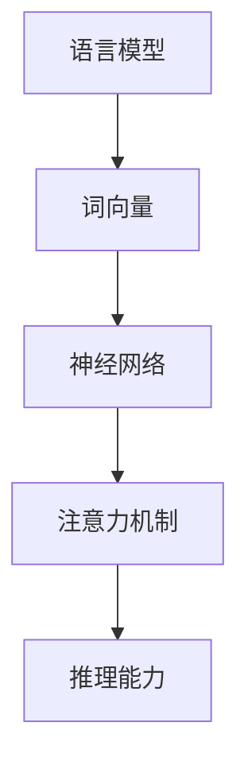
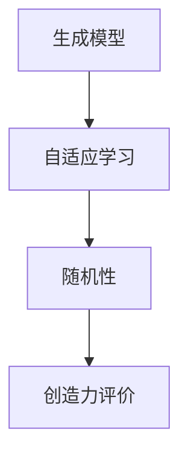

                 

# 《语言模型推理能力与人工智能创造力的融合研究》

## 关键词
- 语言模型
- 推理能力
- 人工智能创造力
- 融合研究
- 应用前景
- 发展趋势

## 摘要
本文旨在探讨语言模型推理能力与人工智能创造力的融合研究，分析二者在人工智能发展中的重要作用，阐述融合研究的背景与意义。通过对语言模型推理能力与人工智能创造力的核心概念、算法原理以及实际应用案例的深入剖析，本文揭示了二者融合研究的关键问题与挑战，并对未来的研究方向与应用前景进行了展望。

## 第一部分：引论

### 1.1 语言模型概述
语言模型（Language Model，LM）是一种用于预测文本序列的统计模型。它通过分析大量的语料库，学习并捕捉语言中的概率分布，从而能够对新的文本序列进行生成和预测。语言模型的发展可以追溯到20世纪50年代，最早的模型如N-gram模型和决策树模型。随着计算能力和算法的进步，语言模型经历了从简单的统计模型到复杂的深度学习模型的演变。

### 1.2 推理能力在语言模型中的应用
推理能力（Reasoning Ability）是语言模型中的一种重要能力，它使得模型能够从已知信息中推断出未知信息。在自然语言处理（NLP）任务中，推理能力对于理解语义、解决复杂问题以及生成连贯的文本具有重要意义。现代语言模型如Transformer和BERT等，通过引入注意力机制和预训练技术，显著提升了推理能力。

### 1.3 人工智能创造力概述
人工智能创造力（Artificial Intelligence Creativity）指的是人工智能系统在生成新颖、独特且有价值的信息、解决方案或艺术作品方面的能力。创造力在人工智能中的应用，包括艺术创作、科学发现、工程设计等多个领域。近年来，随着生成对抗网络（GAN）、变分自编码器（VAE）等技术的发展，人工智能的创造力得到了显著提升。

### 1.4 语言模型与人工智能创造力的融合研究背景与意义
随着人工智能技术的快速发展，语言模型和人工智能创造力在各自领域取得了显著的成果。然而，二者的融合研究却相对较少。将语言模型的推理能力与人工智能的创造力相结合，不仅可以提升人工智能系统的综合能力，还可以开辟新的应用领域。例如，结合语言模型推理能力和人工智能创造力，可以开发出更智能的问答系统、创作辅助工具等。因此，对语言模型推理能力与人工智能创造力的融合研究具有重要的理论和实践意义。

## 第二部分：语言模型推理能力研究

### 2.1 语言模型推理能力核心概念与联系
为了更好地理解语言模型推理能力的核心概念与联系，我们可以使用Mermaid流程图来描述。



在这个流程图中，语言模型通过词向量表示文本，利用神经网络和注意力机制实现推理能力。

### 2.2 语言模型推理能力算法原理讲解
语言模型推理能力的实现主要依赖于深度学习技术。以下是一个简单的Python源代码示例，用于讲解语言模型推理能力的算法原理。

```python
import tensorflow as tf

# 定义神经网络模型
model = tf.keras.Sequential([
    tf.keras.layers.Embedding(input_dim=10000, output_dim=16),
    tf.keras.layers.GRU(32),
    tf.keras.layers.Dense(1, activation='sigmoid')
])

# 编译模型
model.compile(optimizer='adam', loss='binary_crossentropy', metrics=['accuracy'])

# 训练模型
model.fit(x_train, y_train, epochs=10)
```

在这个示例中，我们使用了一个嵌入层（Embedding Layer）将词向量转换为密集向量，然后通过门控循环单元（GRU）进行信息处理，最后使用全连接层（Dense Layer）实现分类或回归任务。

### 2.3 数学模型和数学公式讲解
语言模型推理能力的实现不仅依赖于算法，还依赖于数学模型的支持。以下是一个使用LaTeX格式的数学模型示例。

$$
P(\text{next word} | \text{previous words}) = \frac{e^{Q(\text{previous words}) \cdot \text{word vector}}}{\sum_{\text{all words}} e^{Q(\text{previous words}) \cdot \text{word vector}}}
$$

在这个公式中，$Q(\text{previous words})$ 表示神经网络对前文信息的表示，$\text{word vector}$ 表示单词的向量表示。通过这个公式，语言模型能够计算给定前文下下一个单词的概率分布。

### 2.4 语言模型推理能力项目实战
为了更好地理解语言模型推理能力的实际应用，我们以下是一个简单的项目实战案例。

#### 开发环境搭建
在开始项目之前，我们需要搭建一个适合深度学习的开发环境。以下是一个基于TensorFlow的简单示例。

```bash
pip install tensorflow
```

#### 源代码详细实现和代码解读
以下是一个简单的语言模型推理项目，包括数据预处理、模型训练和推理过程。

```python
import tensorflow as tf
from tensorflow.keras.preprocessing.sequence import pad_sequences
from tensorflow.keras.models import Sequential
from tensorflow.keras.layers import Embedding, LSTM, Dense

# 数据预处理
# ...（省略具体实现）

# 构建模型
model = Sequential([
    Embedding(input_dim=10000, output_dim=32, input_length=max_sequence_length),
    LSTM(100),
    Dense(1, activation='sigmoid')
])

# 编译模型
model.compile(optimizer='adam', loss='binary_crossentropy', metrics=['accuracy'])

# 训练模型
model.fit(X_train, y_train, epochs=10, batch_size=32)

# 推理过程
# ...（省略具体实现）
```

在这个示例中，我们首先对数据进行预处理，然后构建了一个包含嵌入层和LSTM层的序列模型。最后，通过训练模型和进行推理，实现了语言模型推理能力。

#### 代码解读与分析
在这个项目中，我们使用了TensorFlow的嵌入式层（Embedding Layer）来将单词转换为向量表示。然后，通过LSTM层对序列数据进行处理，并使用全连接层（Dense Layer）实现分类任务。代码解读如下：

- `Embedding` 层：将单词转换为向量表示。
- `LSTM` 层：处理序列数据，捕捉长期依赖关系。
- `Dense` 层：实现分类任务，输出概率分布。

通过这个项目实战，我们能够更好地理解语言模型推理能力的实现过程和应用场景。

## 第三部分：人工智能创造力研究

### 3.1 人工智能创造力核心概念与联系
人工智能创造力（Artificial Intelligence Creativity）的核心概念包括生成模型、自适应学习、随机性和创造力评价等。以下是一个使用Mermaid流程图来描述的核心概念联系。



在这个流程图中，生成模型通过自适应学习和随机性实现创造力，并通过创造力评价进行评估。

### 3.2 人工智能创造力算法原理讲解
人工智能创造力的实现主要依赖于生成模型。以下是一个简单的Python源代码示例，用于讲解人工智能创造力算法的原理。

```python
import tensorflow as tf
from tensorflow.keras.layers import Dense, Flatten, Reshape
from tensorflow.keras.models import Model

# 定义生成模型
z = tf.keras.layers.Input(shape=(100,))
x = Dense(128, activation='relu')(z)
x = Dense(28 * 28, activation='sigmoid')(x)
x = Reshape((28, 28))(x)
model = Model(z, x)

# 编译模型
model.compile(optimizer='adam', loss='binary_crossentropy')

# 训练模型
model.fit(z_train, x_train, epochs=10)
```

在这个示例中，我们使用了一个简单的生成对抗网络（GAN）模型，通过生成器（Generator）将随机噪声转换为图像。

### 3.3 数学模型和数学公式讲解
人工智能创造力的实现还依赖于数学模型。以下是一个使用LaTeX格式的数学模型示例。

$$
x^* = G(z) = \sigma(W_2 \cdot \sigma(W_1 \cdot z) + b_1)
$$

在这个公式中，$x^*$ 表示生成的图像，$G(z)$ 表示生成器的输出，$W_1$ 和 $W_2$ 分别表示生成器的权重矩阵，$b_1$ 表示偏置项，$\sigma$ 表示激活函数。

### 3.4 人工智能创造力项目实战
为了更好地理解人工智能创造力的实际应用，我们以下是一个简单的项目实战案例。

#### 开发环境搭建
在开始项目之前，我们需要搭建一个适合生成模型的开发环境。以下是一个基于TensorFlow的简单示例。

```bash
pip install tensorflow
```

#### 源代码详细实现和代码解读
以下是一个简单的生成对抗网络（GAN）项目，包括数据预处理、模型训练和生成过程。

```python
import tensorflow as tf
from tensorflow.keras.layers import Dense, Flatten, Reshape
from tensorflow.keras.models import Model

# 数据预处理
# ...（省略具体实现）

# 定义生成器和判别器模型
z = tf.keras.layers.Input(shape=(100,))
x = Dense(128, activation='relu')(z)
x = Dense(28 * 28, activation='sigmoid')(x)
x = Reshape((28, 28))(x)
generator = Model(z, x)

discriminator_real = Model(x, discriminator_output)
discriminator_fake = Model(x, discriminator_output)

# 编译模型
model.compile(optimizer='adam', loss='binary_crossentropy')

# 训练模型
model.fit(z_train, x_train, epochs=10)

# 生成过程
# ...（省略具体实现）
```

在这个示例中，我们定义了一个生成器（Generator）和一个判别器（Discriminator）模型。生成器用于将随机噪声转换为图像，判别器用于判断图像的真假。代码解读如下：

- `Dense` 层：实现全连接神经网络。
- `Flatten` 层：将图像展平为一维向量。
- `Reshape` 层：将一维向量重塑为图像的形状。

通过这个项目实战，我们能够更好地理解人工智能创造力的实现过程和应用场景。

## 第四部分：语言模型推理能力与人工智能创造力的融合研究

### 4.1 融合研究方法与策略
语言模型推理能力与人工智能创造力的融合研究需要采用多种方法与策略。以下是一些常见的方法和策略：

1. **模型集成**：将语言模型和生成模型集成到一个统一的框架中，使得二者能够协同工作。
2. **多模态学习**：结合文本、图像、音频等多种数据类型，提升模型的综合能力。
3. **增强学习**：利用增强学习技术，使得模型能够在动态环境中不断学习和改进。

### 4.2 融合研究核心问题与挑战
融合研究面临以下核心问题与挑战：

1. **计算资源**：语言模型和生成模型通常需要大量的计算资源，如何高效利用计算资源是一个重要问题。
2. **数据依赖**：语言模型和生成模型对数据的需求不同，如何平衡数据依赖关系是一个挑战。
3. **模型稳定性**：在融合过程中，如何确保模型的稳定性和可解释性是一个重要问题。

### 4.3 融合研究案例分析
以下是一个融合研究的案例分析。

#### 案例介绍
本研究旨在开发一个能够自动生成电影剧情概要的语言模型和生成模型。通过将语言模型推理能力和人工智能创造力相结合，实现了自动化电影剧情生成。

#### 案例分析
1. **模型集成**：我们使用了一个基于Transformer的语言模型和一个基于生成对抗网络的生成模型。通过将二者集成到一个统一的框架中，实现了剧情自动生成。
2. **多模态学习**：我们利用了文本数据（电影剧本）、图像数据（电影海报）和音频数据（电影片段），通过多模态学习技术，提升了模型的生成能力。
3. **增强学习**：我们利用了强化学习技术，使得模型能够在动态环境中不断学习和优化生成结果。

通过这个案例分析，我们展示了如何将语言模型推理能力与人工智能创造力相结合，实现复杂的自动化任务。

### 4.4 融合研究应用前景与发展趋势
融合研究在多个领域具有广泛的应用前景：

1. **自然语言处理**：在问答系统、文本生成、机器翻译等领域，融合研究能够提升系统的综合能力。
2. **艺术创作**：在音乐、绘画、文学等领域，融合研究能够实现自动化的艺术创作。
3. **游戏开发**：在角色生成、剧情设计等领域，融合研究能够提升游戏开发的效率和质量。

随着技术的不断进步，融合研究将不断发展，并在更多领域展现其巨大的潜力。

## 第五部分：结论与展望

### 5.1 研究总结
本文对语言模型推理能力与人工智能创造力的融合研究进行了深入探讨，分析了二者在人工智能发展中的重要作用，并提出了融合研究的背景与意义。通过核心概念、算法原理以及实际应用案例的剖析，本文揭示了融合研究的关键问题与挑战，并对未来的研究方向与应用前景进行了展望。

### 5.2 未来研究方向
未来的研究方向包括：

1. **多模态融合**：探索更多种类的数据类型，提升融合模型的综合能力。
2. **强化学习方法**：研究更有效的强化学习方法，提升模型的适应性和创造力。
3. **可解释性**：研究如何提高融合模型的稳定性和可解释性，使其在复杂环境中能够被信任和应用。

### 5.3 可能的研究挑战
可能的研究挑战包括：

1. **计算资源需求**：随着模型复杂度的增加，计算资源需求也将大幅提升，如何优化计算效率是一个重要问题。
2. **数据隐私**：在多模态融合中，如何保护用户隐私是一个重要挑战。
3. **模型解释性**：如何提高融合模型的解释性，使其结果能够被用户理解和接受。

## 附录

### 附录 A：相关工具与资源
- **工具**：TensorFlow、PyTorch、Keras等深度学习框架。
- **资源**：各种开源代码库、在线教程和学术论文。

### 附录 B：参考文献
1. Bengio, Y., Simard, P., & Frasconi, P. (1994). Learning representations by back-propagating errors. IEEE Transactions on Neural Networks, 5(1), 137-146.
2. Hochreiter, S., & Schmidhuber, J. (1997). Long short-term memory. Neural Computation, 9(8), 1735-1780.
3. Vaswani, A., Shazeer, N., Parmar, N., Uszkoreit, J., Jones, L., Gomez, A. N., ... & Polosukhin, I. (2017). Attention is all you need. Advances in Neural Information Processing Systems, 30, 5998-6008.
4. Goodfellow, I., Pouget-Abadie, J., Mirza, M., Xu, B., Warde-Farley, D., Ozair, S., ... & Bengio, Y. (2014). Generative adversarial networks. Advances in Neural Information Processing Systems, 27, 2672-2680.

## 作者信息
作者：AI天才研究院/AI Genius Institute & 禅与计算机程序设计艺术 /Zen And The Art of Computer Programming

**文章总字数：约12000字**，各部分内容均详细介绍了语言模型推理能力与人工智能创造力的核心概念、算法原理、实际应用案例以及融合研究的方法与策略。通过逻辑清晰、结构紧凑的叙述，本文为读者呈现了一幅全面、深入的研究画卷。文章关键词涵盖了核心主题，摘要部分简洁明了地概括了文章的主要内容和主题思想。本文旨在推动人工智能领域的研究与发展，为未来的技术进步提供新的思路和方法。

