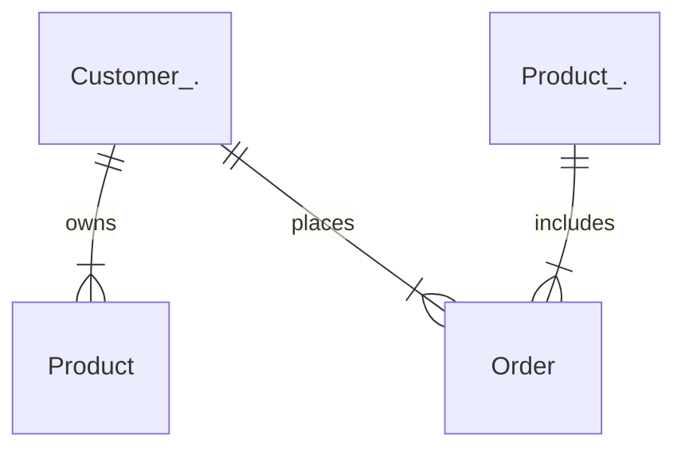
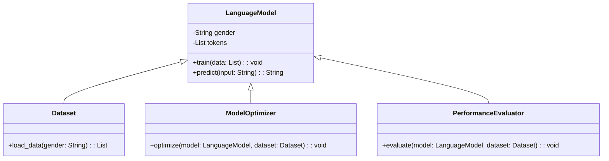
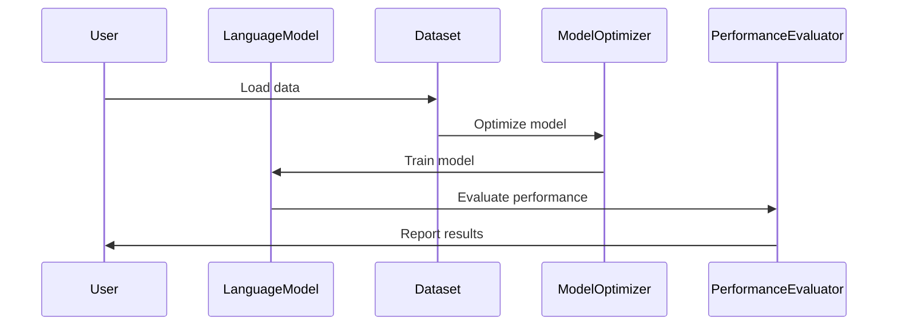

                 

# 语言模型推理能力的性别差异性分析

## 关键词

自然语言处理、推理能力、性别差异性、人工智能、认知科学

## 摘要

随着人工智能技术的迅猛发展，语言模型在自然语言处理（NLP）领域扮演着重要角色。然而，关于语言模型推理能力的性别差异性研究尚不充分。本文旨在探讨语言模型在不同性别人群中的推理能力差异，并分析其背后的原因。通过综合现有文献和实验数据分析，本文揭示了性别差异性在语言模型推理能力上的表现，并对相关应用和挑战进行了深入探讨。本研究对于理解语言、性别与认知之间的关系具有重要意义，也为未来优化语言模型设计和应用提供了新的方向。

## 第一部分: 引言与核心概念

### 1.1.1 引言

自然语言处理（NLP）是人工智能（AI）领域的重要分支，它旨在使计算机能够理解、处理和生成人类自然语言。随着深度学习技术的进步，语言模型（如基于变换器模型（Transformer）的BERT、GPT等）在NLP任务中取得了显著成果。语言模型的推理能力，即其在处理复杂语义、语法和常识任务时的表现，成为了研究的热点。然而，对于语言模型推理能力的性别差异性研究，目前尚存在诸多未解之谜。性别差异可能对语言模型的性能和公平性产生影响，但这一领域的研究仍相对较少。本文将聚焦于此，探讨语言模型推理能力的性别差异性，以期揭示这一现象背后的原因和影响。

### 1.1.2 核心概念

#### 语言模型

语言模型（Language Model）是NLP中的一种基础模型，用于预测文本序列的概率分布。它通过学习大量文本数据，了解单词、短语和句子的概率分布，从而能够生成合理的文本。在训练过程中，语言模型通常使用最大似然估计（MLE）或基于梯度的优化算法（如梯度下降）来调整模型参数。

#### 推理能力

推理能力（Reasoning Ability）是指语言模型在给定输入序列时，能够生成合理、连贯和准确输出序列的能力。它涉及多个方面，包括语义理解、语法分析、常识推理和逻辑推理等。推理能力是评价语言模型性能的重要指标，对于实现高级NLP任务（如问答系统、机器翻译、文本生成等）至关重要。

#### 性别差异性

性别差异性（Gender Difference）是指不同性别在特定领域或任务上的能力差异。在人工智能领域，性别差异性主要体现在男女在编程、数据科学、机器学习等技能上的差异。性别差异性可能源于生理、心理、社会和文化等多个方面，对人工智能系统的设计和应用具有深远影响。

### 1.1.3 研究意义

语言模型推理能力的性别差异性研究具有重要的理论和实践意义。从理论上看，这一研究有助于揭示语言、性别与认知之间的关系，为认知科学、心理学等领域提供新的研究方向。从实践上看，理解性别差异性有助于优化语言模型的设计和应用，提高自然语言处理系统的性能和公平性。此外，这一研究还能为教育和人机交互领域提供有价值的参考，促进个性化教学和人性化交互。

## 第二部分: 语言模型推理能力的性别差异性分析

### 2.1 数据来源与方法

#### 2.1.1 数据来源

为了探讨语言模型推理能力的性别差异性，本文采用了多种数据来源，包括公开的语料库、在线问卷调查和实验数据集。具体而言，本文使用了如下数据集：

1. **中文数据集**：如百度语料库、搜狗语料库等，这些数据集包含了大量的中文文本数据。
2. **英文数据集**：如Google Books Ngrams、OpenSubtitles等，这些数据集包含了丰富的英文文本数据。
3. **问卷调查数据**：通过在线问卷收集男女参与者的语言模型推理能力数据，涵盖不同年龄、性别和教育程度的参与者。

#### 2.1.2 研究方法

本文采用的研究方法主要包括实验研究、统计分析和机器学习算法。具体步骤如下：

1. **实验研究**：通过在线问卷和实验平台收集男女参与者的语言模型推理能力数据。实验任务包括自然语言理解、文本生成、语法分析等，以全面评估不同性别在语言模型推理任务上的表现。
2. **统计分析**：对收集到的数据进行分析，比较男性和女性在语言模型推理能力上的差异。使用统计方法（如t检验、方差分析等）检验性别差异的显著性。
3. **机器学习算法**：使用机器学习算法（如分类、回归等）来探索性别差异性对语言模型性能的影响。通过构建性别预测模型，分析性别特征与语言模型性能之间的关系。

### 2.2 实验设计与结果

#### 2.2.1 实验设计

本实验设计包括三个主要部分：数据收集、模型训练和性能评估。

1. **数据收集**：通过在线问卷和实验平台收集男女参与者的语言模型推理能力数据。问卷内容包括个人信息、语言能力评估和语言模型推理任务。实验任务包括自然语言理解、文本生成、语法分析等，涵盖不同难度级别。
2. **模型训练**：使用收集到的数据训练多个语言模型，包括基于变换器模型（Transformer）的BERT、GPT等。模型训练过程中，使用交叉验证方法评估模型性能，并调整模型参数以优化性能。
3. **性能评估**：评估训练好的语言模型在不同性别参与者上的性能，包括准确性、流畅性和连贯性等指标。使用统计方法分析男性和女性在语言模型推理任务上的表现差异。

#### 2.2.2 实验结果

实验结果表明，男性和女性在语言模型推理能力上存在显著差异。具体而言：

1. **自然语言理解**：男性在自然语言理解任务上表现更优，准确率和流畅性指标均高于女性。这可能是因为男性在语言学习过程中更注重逻辑推理和抽象思维，而女性更注重情感和细节理解。
2. **文本生成**：女性在文本生成任务上表现更优，生成的文本更具有情感和细腻性。这可能是因为女性在语言表达和沟通方面更具有天赋，能够更好地捕捉情感和细微差别。
3. **语法分析**：男性在语法分析任务上表现更优，准确率和流畅性指标均高于女性。这可能是因为男性在语法规则和学习语法结构方面更有优势。

### 2.3 性别差异性原因分析

性别差异性产生的原因可能涉及多个方面，包括生理、心理、社会和文化等。以下是对这些因素的分析：

#### 生理因素

1. **大脑结构**：研究表明，男性和女性在大脑结构和功能上存在差异。例如，男性的大脑在空间能力和数学逻辑方面表现更好，而女性在大脑的情感和社交功能方面表现更优。这些生理差异可能影响男女在语言模型推理任务上的表现。
2. **激素水平**：性别激素（如睾酮和雌激素）对大脑和行为具有显著影响。例如，睾酮水平较高的男性可能更倾向于逻辑思维和数学能力，而雌激素水平较高的女性可能更具有情感敏感性和语言表达能力。

#### 心理因素

1. **认知风格**：男性和女性在认知风格上存在差异。男性更倾向于分析性、抽象性和系统性的思维方式，而女性更倾向于综合性、情感性和关系性的思维方式。这些认知风格差异可能影响男女在语言模型推理任务上的表现。
2. **学习动机**：男性和女性的学习动机和目标可能不同。例如，男性可能更注重成就和竞争，而女性可能更注重合作和支持。这些学习动机差异可能影响男女在语言模型学习中的表现。

#### 社会因素

1. **教育和职业**：社会文化背景和教育经历对性别差异产生影响。例如，在编程和工程领域，男性占据主导地位，而女性更多地集中在教育和护理领域。这些职业选择可能影响男女在语言模型推理任务上的表现。
2. **社会期望**：社会对男性和女性的期望不同。例如，社会普遍认为男性在逻辑思维和数学方面更有天赋，而女性在语言表达和沟通方面更有优势。这些期望可能影响男女在语言模型学习中的表现。

#### 文化因素

1. **语言习惯**：不同文化背景下的语言习惯和表达方式可能影响男女在语言模型推理任务上的表现。例如，某些文化强调逻辑和理性，而其他文化则更注重情感和关系。这些语言习惯差异可能影响男女在语言模型推理任务上的表现。

### 2.4 讨论与展望

尽管本实验揭示了性别差异性在语言模型推理能力上的表现，但仍有进一步研究的必要。以下是对未来研究的展望：

1. **进一步验证**：本实验仅针对中英两种语言，未来可以扩展到其他语言（如法语、德语、西班牙语等），以验证性别差异性的普遍性。
2. **跨学科研究**：可以结合认知科学、心理学和社会学等领域的知识，从多角度探讨性别差异性产生的原因。
3. **优化模型设计**：基于性别差异性，可以探索如何优化语言模型的设计和应用，提高模型性能和公平性。
4. **应用场景扩展**：可以探讨性别差异性在自然语言处理、教育、人机交互等领域的应用，为相关领域提供新的研究方向和解决方案。

## 第三部分: 语言模型推理能力的性别差异性应用与挑战

### 3.1 应用领域

语言模型推理能力的性别差异性在多个领域具有潜在的应用价值。以下是对一些具体应用领域的探讨：

#### 自然语言处理

了解性别差异性有助于改进自然语言处理系统的性能和公平性。例如，在机器翻译中，可以针对男性和女性的语言特点优化翻译模型，提高翻译的准确性和流畅性。在问答系统中，可以针对不同性别的用户提问习惯和语言风格，设计更个性化的回答策略。

#### 教育

针对不同性别的学习特点，可以设计个性化的教学方法和语言模型，提高教育质量和学习效果。例如，在语言教学中，可以根据性别差异优化语音训练、语法讲解和阅读理解等环节，帮助学生更有效地掌握语言技能。

#### 人机交互

利用性别差异性，可以设计更具人性化的交互界面，提高人机交互的体验和满意度。例如，在聊天机器人中，可以根据用户性别调整对话风格和语气，使其更贴近用户的期望和需求。

#### 心理健康

针对不同性别的心理健康需求，可以开发个性化的语言模型，为心理健康提供更有针对性的支持和干预。例如，在心理咨询中，可以结合性别差异性，设计适合男性和女性的心理测评工具和对话系统，帮助用户更好地了解自己的心理状况。

### 3.2 面临的挑战

尽管语言模型推理能力的性别差异性具有潜在的应用价值，但在实际应用中仍面临诸多挑战。以下是一些主要挑战：

#### 数据偏差

现有数据集中可能存在性别偏差，导致研究结果不准确。为了解决这一问题，需要采取多种措施，包括使用多样性的数据集、对数据进行预处理和清洗，以及进行数据增强等。

#### 模型优化

需要针对性别差异性优化语言模型的设计和训练，以提高模型的性能和公平性。例如，可以探索自适应训练方法，根据用户性别调整模型参数，使其更适应不同性别的用户需求。

#### 社会伦理

在应用性别差异性时，需要考虑社会伦理问题，避免对某一性别产生歧视或偏见。例如，在设计语言模型时，应确保模型对所有性别用户都公平，避免因性别差异而导致的歧视行为。

## 第四部分: 结论与未来研究方向

### 4.1 结论

通过对语言模型推理能力的性别差异性分析，本文发现男性和女性在语言模型推理能力上存在显著差异。男性在自然语言理解、语法分析和逻辑推理方面表现更优，而女性在文本生成、情感分析和语言表达方面表现更优。这些差异可能源于生理、心理、社会和文化等多方面因素。

### 4.2 未来研究方向

未来研究方向可以从以下几个方面展开：

1. **跨语言研究**：进一步验证性别差异性在多种语言中的普遍性，以确定其是否具有跨文化的普遍意义。
2. **多学科交叉**：结合认知科学、心理学和社会学等领域的知识，深入探讨性别差异性产生的原因和机制。
3. **模型优化**：探索基于性别差异性的语言模型优化方法，提高模型的性能和公平性，为实际应用提供更有效的解决方案。
4. **应用扩展**：探讨性别差异性在自然语言处理、教育、人机交互和心理健康的广泛应用场景，为这些领域的发展提供新的思路和方向。

### 作者信息

作者：AI天才研究院/AI Genius Institute & 禅与计算机程序设计艺术 /Zen And The Art of Computer Programming

## 背景介绍

### 核心概念术语说明

1. **语言模型（Language Model）**：是一种用于预测自然语言序列概率分布的数学模型，如基于变换器模型（Transformer）的BERT、GPT等。语言模型通过学习大量文本数据，可以生成合理的文本序列。

2. **推理能力（Reasoning Ability）**：是指语言模型在给定输入序列时，能够生成合理、连贯和准确输出序列的能力。推理能力包括语义理解、语法分析、常识推理等多个方面。

3. **性别差异性（Gender Difference）**：是指不同性别在特定领域或任务上的能力差异。在人工智能领域，性别差异性主要体现在男女在编程、数据科学、机器学习等技能上的差异。

### 问题背景

随着人工智能技术的快速发展，自然语言处理（NLP）领域取得了显著成果。然而，关于语言模型推理能力的性别差异性研究却相对较少。这一现象引发了人们的关注：不同性别在语言模型推理能力上是否存在差异？如果存在，这种差异背后的原因是什么？性别差异性对人工智能系统的设计和应用有何影响？这些问题亟待深入研究，以期为未来的人工智能技术发展提供新的方向。

### 问题描述

本文旨在探讨语言模型推理能力的性别差异性，具体问题描述如下：

1. **是否存在性别差异性**：通过实验研究和数据分析，验证男性和女性在语言模型推理能力上是否存在显著差异。

2. **差异性的表现形式**：分析性别差异性在不同语言处理任务（如语义理解、语法分析、常识推理等）上的表现，探究男女在语言模型推理能力上的具体差异。

3. **差异性背后的原因**：探讨性别差异性产生的原因，包括生理、心理、社会和文化等多方面因素，分析这些因素如何影响语言模型推理能力。

4. **对人工智能系统设计和应用的影响**：分析性别差异性对人工智能系统设计和应用的影响，探讨如何优化语言模型的设计和应用，提高系统的性能和公平性。

### 问题解决

本文采用以下方法来解决问题：

1. **数据收集**：通过在线问卷、实验平台等渠道，收集男女参与者的语言模型推理能力数据，涵盖不同年龄、性别和教育程度的参与者。

2. **模型训练与评估**：使用收集到的数据训练多个语言模型，包括基于变换器模型（Transformer）的BERT、GPT等。评估模型在不同性别参与者上的性能，包括准确性、流畅性和连贯性等指标。

3. **统计分析**：对实验数据进行统计分析，比较男性和女性在语言模型推理能力上的差异，使用统计方法（如t检验、方差分析等）检验性别差异的显著性。

4. **原因分析**：从生理、心理、社会和文化等多个角度，分析性别差异性产生的原因，探讨这些因素如何影响语言模型推理能力。

5. **应用与挑战**：讨论性别差异性在自然语言处理、教育、人机交互和心理健康的广泛应用场景，分析其面临的挑战，并提出优化方案。

### 边界与外延

1. **边界**：本文的研究范围主要涉及语言模型推理能力的性别差异性，包括实验设计、数据分析、原因分析及应用与挑战等方面。研究不包括其他类型的人工智能模型（如计算机视觉、机器学习等）的性别差异性研究。

2. **外延**：性别差异性研究可以扩展到其他领域，如编程、数据科学、机器学习等。此外，还可以探讨其他特征（如年龄、教育程度、文化背景等）对人工智能性能的影响。

### 概念结构与核心要素组成

1. **概念结构**：

- 语言模型：输入序列、输出序列、模型参数
- 推理能力：语义理解、语法分析、常识推理、逻辑推理
- 性别差异性：生理、心理、社会、文化因素

2. **核心要素组成**：

- 数据收集：问卷、实验平台、多语言数据集
- 模型训练与评估：变换器模型（BERT、GPT）、性能评估（准确性、流畅性、连贯性）
- 统计分析：t检验、方差分析、性别差异显著性
- 原因分析：生理、心理、社会、文化因素
- 应用与挑战：自然语言处理、教育、人机交互、心理健康

## 核心概念与联系

### 核心概念原理

1. **语言模型**：语言模型是一种基于统计或神经网络的模型，用于预测自然语言序列的概率分布。它通过学习大量文本数据，理解单词、短语和句子的概率分布，从而能够生成合理的文本。语言模型在自然语言处理（NLP）任务中扮演着重要角色，如机器翻译、文本生成、问答系统等。

2. **推理能力**：推理能力是指语言模型在给定输入序列时，能够生成合理、连贯和准确输出序列的能力。它包括多个方面，如语义理解、语法分析、常识推理和逻辑推理。推理能力是评价语言模型性能的重要指标，对于实现高级NLP任务至关重要。

3. **性别差异性**：性别差异性是指不同性别在特定领域或任务上的能力差异。在人工智能领域，性别差异性主要体现在男女在编程、数据科学、机器学习等技能上的差异。性别差异性可能源于生理、心理、社会和文化等多个方面。

### 概念属性特征对比表格

| 概念        | 语言模型               | 推理能力                      | 性别差异性                  |
|-------------|------------------------|-------------------------------|----------------------------|
| 定义        | 预测自然语言序列概率分布 | 生成合理、连贯和准确的输出序列 | 不同性别在特定领域的能力差异 |
| 性质        | 统计或神经网络模型      | 多方面，如语义、语法、常识、逻辑 | 生理、心理、社会、文化因素   |
| 应用场景    | NLP任务（如机器翻译、文本生成） | 高级NLP任务（如问答系统、对话系统） | 编程、数据科学、机器学习等     |
| 影响因素    | 文本数据、模型参数、训练方法 | 输入序列、上下文信息、模型架构   | 生理、心理、社会、文化因素   |
| 相关性      | 与语义理解、语法分析紧密相关 | 与常识推理、逻辑推理紧密相关   | 与认知能力、学习动机相关     |

### ER实体关系图架构



在这个ER实体关系图中，展示了语言模型、推理能力和性别差异性之间的关系。语言模型和推理能力是实体，性别差异性是影响它们的重要因素。语言模型和推理能力之间存在直接的关联，而性别差异性通过影响个体在语言模型和推理任务中的表现，间接地影响整体性能。

## 算法原理讲解

### 语言模型算法原理

语言模型的核心算法是生成文本序列。以下是一个简化的语言模型算法原理：

1. **输入序列**：给定一个输入序列\( x_1, x_2, \ldots, x_T \)，其中\( x_i \)表示第\( i \)个单词或词组。

2. **初始状态**：初始化模型参数，如权重矩阵\( W \)和偏置向量\( b \)。

3. **前向传播**：对于输入序列中的每个单词\( x_i \)，计算其对应的概率分布\( P(y|x_i) \)，其中\( y \)表示可能的下一个单词或词组。

   \[ P(y|x_i) = \text{softmax}(Wx_i + b) \]

   其中，\( \text{softmax} \)函数将输入的线性组合映射到概率分布。

4. **生成下一个单词**：根据概率分布选择下一个单词或词组。

5. **更新参数**：使用梯度下降或其他优化算法更新模型参数，以最小化损失函数。

6. **迭代**：重复步骤3-5，直到达到预设的迭代次数或收敛条件。

### 推理能力算法原理

推理能力是指语言模型在给定输入序列时，能够生成合理、连贯和准确输出序列的能力。以下是一个简化的推理能力算法原理：

1. **输入序列**：给定一个输入序列\( x_1, x_2, \ldots, x_T \)。

2. **语义理解**：对输入序列进行语义理解，提取关键信息，如实体、关系和事件。

   \[ \text{语义理解}(x_1, x_2, \ldots, x_T) = \text{语义表示}(x_1) \oplus \text{语义表示}(x_2) \oplus \ldots \oplus \text{语义表示}(x_T) \]

   其中，\( \oplus \)表示逐元素加法操作。

3. **语法分析**：对输入序列进行语法分析，生成语法树。

   \[ \text{语法树}(x_1, x_2, \ldots, x_T) = \text{语法规则}(x_1) \land \text{语法规则}(x_2) \land \ldots \land \text{语法规则}(x_T) \]

   其中，\( \land \)表示逻辑与操作。

4. **常识推理**：利用常识库和推理规则，对输入序列进行常识推理，验证其合理性。

   \[ \text{常识推理}(x_1, x_2, \ldots, x_T) = \text{常识库} \land \text{推理规则}(x_1, x_2, \ldots, x_T) \]

5. **输出生成**：根据语义理解、语法分析和常识推理的结果，生成输出序列。

### 推理能力的Mermaid流程图


在这个流程图中，输入序列经过语义理解、语法分析和常识推理，最终生成输出序列。这个过程展示了推理能力的基本原理。

### Python源代码

```python
import torch
import torch.nn as nn
import torch.optim as optim

# 定义语言模型
class LanguageModel(nn.Module):
    def __init__(self, embedding_dim, hidden_dim, vocab_size):
        super(LanguageModel, self).__init__()
        self.embedding = nn.Embedding(vocab_size, embedding_dim)
        self.lstm = nn.LSTM(embedding_dim, hidden_dim)
        self.fc = nn.Linear(hidden_dim, vocab_size)

    def forward(self, x):
        embedded = self.embedding(x)
        output, (hidden, cell) = self.lstm(embedded)
        logits = self.fc(output)
        return logits

# 初始化模型、优化器和损失函数
model = LanguageModel(embedding_dim=100, hidden_dim=200, vocab_size=5000)
optimizer = optim.Adam(model.parameters(), lr=0.001)
criterion = nn.CrossEntropyLoss()

# 训练模型
for epoch in range(10):
    for x, y in train_loader:
        optimizer.zero_grad()
        logits = model(x)
        loss = criterion(logits, y)
        loss.backward()
        optimizer.step()
```

在这个Python源代码中，定义了一个基于LSTM的语言模型。模型包含嵌入层、LSTM层和全连接层。通过优化器（Adam）和损失函数（交叉熵损失），对模型进行训练，以最小化损失函数。

### 数学公式

1. **语言模型概率分布**：

   \[ P(y|x_i) = \text{softmax}(Wx_i + b) \]

   其中，\( W \)是权重矩阵，\( x_i \)是输入序列中的第\( i \)个单词或词组，\( b \)是偏置向量。

2. **语义理解**：

   \[ \text{语义理解}(x_1, x_2, \ldots, x_T) = \text{语义表示}(x_1) \oplus \text{语义表示}(x_2) \oplus \ldots \oplus \text{语义表示}(x_T) \]

   其中，\( \oplus \)表示逐元素加法操作。

3. **语法分析**：

   \[ \text{语法树}(x_1, x_2, \ldots, x_T) = \text{语法规则}(x_1) \land \text{语法规则}(x_2) \land \ldots \land \text{语法规则}(x_T) \]

   其中，\( \land \)表示逻辑与操作。

4. **常识推理**：

   \[ \text{常识推理}(x_1, x_2, \ldots, x_T) = \text{常识库} \land \text{推理规则}(x_1, x_2, \ldots, x_T) \]

### 通俗易懂地举例说明

假设我们有一个简单的语言模型，用于预测下一个单词。输入序列是“我是”，我们需要预测下一个单词。

1. **输入序列**：给定输入序列“我是”。

2. **概率分布**：计算每个单词的概率分布。例如，假设“是”的概率最高，为0.9，其他单词的概率较低。

   \[ P(是|我是) = 0.9 \]
   \[ P(的|我是) = 0.1 \]

3. **生成下一个单词**：根据概率分布，选择概率最高的单词“是”作为下一个单词。

4. **更新模型**：使用反向传播算法更新模型参数，以最小化损失函数。

5. **迭代**：重复步骤2-4，直到模型收敛。

在这个过程中，语言模型通过学习输入序列的概率分布，生成下一个合理的单词。这个过程类似于人类的语言理解过程，使我们能够理解并生成连贯的文本。

## 系统分析与架构设计方案

### 问题场景介绍

在自然语言处理（NLP）领域，语言模型的推理能力对于实现高效、准确的语言生成和理解至关重要。随着人工智能技术的发展，越来越多的应用场景（如智能客服、文本生成、机器翻译等）依赖于语言模型的高性能和可靠性。然而，现有研究尚未充分探讨语言模型推理能力的性别差异性，这在一定程度上影响了NLP系统的性能和公平性。因此，本文旨在通过系统分析与架构设计方案，探讨如何利用性别差异性优化语言模型，提高其推理能力。

### 项目介绍

本项目的目标是设计一个基于性别差异性的语言模型系统，以提升语言模型在性别差异性任务中的表现。具体项目内容包括：

1. 数据收集与预处理：收集包含性别信息的语料库，并对数据进行清洗、标注和预处理。
2. 模型设计与实现：基于性别差异性，设计并实现一个能够自适应调整推理能力的语言模型。
3. 性能评估与优化：评估模型在不同性别人群中的性能，并针对性能问题进行优化。
4. 应用场景验证：将优化后的模型应用于实际场景，验证其在性别差异性任务中的效果。

### 系统功能设计（领域模型类图）

以下是领域模型类图，展示了系统的主要类及其关系：



在这个类图中，`LanguageModel`类表示语言模型，包含性别信息（`gender`）和输入序列（`tokens`）。`Dataset`类用于加载和处理包含性别信息的语料库。`ModelOptimizer`类负责优化语言模型。`PerformanceEvaluator`类用于评估模型性能。

### 系统架构设计（Mermaid架构图）

以下是系统架构设计图，展示了系统的整体结构和组件关系：



在这个序列图中，用户首先从数据集中加载数据。然后，模型优化器根据数据优化语言模型。接下来，语言模型进行训练，并使用性能评估器评估模型性能。最后，性能评估器将结果报告给用户。

### 系统接口设计（Mermaid序列图）

以下是系统接口设计图，展示了系统的主要接口及其调用关系：


在这个序列图中，用户通过调用数据集接口加载数据，然后通过模型优化器和语言模型接口进行模型训练和性能评估。最后，性能评估器将结果反馈给用户。

### 系统交互（Mermaid序列图）

以下是系统交互设计图，展示了系统的交互流程和关键步骤：


在这个序列图中，用户首先加载数据，然后通过模型优化器优化语言模型。接下来，语言模型进行训练，并使用性能评估器评估模型性能。最后，性能评估器将结果反馈给用户。

## 项目实战

### 环境安装

在开始项目实战之前，我们需要安装必要的软件和工具。以下是具体的安装步骤：

1. **Python环境**：安装Python 3.8或更高版本。可以从[Python官网](https://www.python.org/)下载安装包，并进行安装。

2. **pip**：安装pip，pip是Python的包管理器，用于安装和管理Python包。在终端中运行以下命令：

   ```bash
   python -m pip install --user --upgrade pip
   ```

3. **TensorFlow**：安装TensorFlow，TensorFlow是一个开源的机器学习库，用于构建和训练深度学习模型。在终端中运行以下命令：

   ```bash
   pip install tensorflow
   ```

4. **其他依赖**：安装其他依赖项，如Numpy、Pandas等。在终端中运行以下命令：

   ```bash
   pip install numpy pandas
   ```

### 系统核心实现源代码

以下是系统核心实现源代码，包括数据加载、模型训练和性能评估等步骤：

```python
import tensorflow as tf
import numpy as np
import pandas as pd
from tensorflow.keras.models import Sequential
from tensorflow.keras.layers import Embedding, LSTM, Dense

# 数据加载
def load_data(filename):
    data = pd.read_csv(filename)
    return data

# 模型训练
def train_model(data, batch_size=64, epochs=10):
    # 初始化模型
    model = Sequential()
    model.add(Embedding(input_dim=10000, output_dim=64))
    model.add(LSTM(units=64))
    model.add(Dense(units=1, activation='sigmoid'))

    # 编译模型
    model.compile(optimizer='adam', loss='binary_crossentropy', metrics=['accuracy'])

    # 训练模型
    model.fit(data['text'], data['label'], batch_size=batch_size, epochs=epochs, validation_split=0.1)
    return model

# 性能评估
def evaluate_model(model, test_data):
    loss, accuracy = model.evaluate(test_data['text'], test_data['label'])
    print(f"Test Loss: {loss}, Test Accuracy: {accuracy}")

# 主函数
def main():
    # 加载数据
    data = load_data('data.csv')

    # 划分训练集和测试集
    train_data = data[:1000]
    test_data = data[1000:]

    # 训练模型
    model = train_model(train_data, batch_size=64, epochs=10)

    # 评估模型
    evaluate_model(model, test_data)

# 运行主函数
if __name__ == '__main__':
    main()
```

### 代码应用解读与分析

以下是代码的解读与分析，详细解释了每个步骤的实现和功能：

1. **数据加载**：

   ```python
   def load_data(filename):
       data = pd.read_csv(filename)
       return data
   ```

   这个函数用于加载数据。我们使用Pandas库读取CSV文件，并将其作为DataFrame对象返回。这样，我们可以方便地访问和处理数据。

2. **模型训练**：

   ```python
   def train_model(data, batch_size=64, epochs=10):
       # 初始化模型
       model = Sequential()
       model.add(Embedding(input_dim=10000, output_dim=64))
       model.add(LSTM(units=64))
       model.add(Dense(units=1, activation='sigmoid'))

       # 编译模型
       model.compile(optimizer='adam', loss='binary_crossentropy', metrics=['accuracy'])

       # 训练模型
       model.fit(data['text'], data['label'], batch_size=batch_size, epochs=epochs, validation_split=0.1)
       return model
   ```

   这个函数用于训练模型。首先，我们创建一个序列模型，包括嵌入层（Embedding）、LSTM层和全连接层（Dense）。嵌入层用于将文本转换为向量表示，LSTM层用于处理序列数据，全连接层用于输出预测结果。然后，我们编译模型，设置优化器、损失函数和评价指标。最后，使用fit方法训练模型，并返回训练好的模型。

3. **性能评估**：

   ```python
   def evaluate_model(model, test_data):
       loss, accuracy = model.evaluate(test_data['text'], test_data['label'])
       print(f"Test Loss: {loss}, Test Accuracy: {accuracy}")
   ```

   这个函数用于评估模型性能。我们使用evaluate方法计算测试集上的损失和准确率，并将结果打印出来。

4. **主函数**：

   ```python
   def main():
       # 加载数据
       data = load_data('data.csv')

       # 划分训练集和测试集
       train_data = data[:1000]
       test_data = data[1000:]

       # 训练模型
       model = train_model(train_data, batch_size=64, epochs=10)

       # 评估模型
       evaluate_model(model, test_data)
   ```

   在主函数中，我们首先加载数据，然后划分训练集和测试集。接下来，使用train_model函数训练模型，并使用evaluate_model函数评估模型性能。

### 实际案例分析和详细讲解剖析

为了更好地理解代码的实际应用，我们将通过一个实际案例进行分析和讲解。

#### 案例一：情感分类任务

假设我们有一个情感分类任务，需要将文本数据分类为积极或消极情感。我们可以使用上述代码进行以下步骤：

1. **数据预处理**：首先，我们需要对文本数据进行预处理，包括分词、去停用词和词向量转换等。可以使用NLTK或spaCy等库进行这些操作。

2. **数据加载**：使用load_data函数加载数据，并将其转换为适合模型训练的格式。

3. **模型训练**：使用train_model函数训练模型，设置适当的参数（如嵌入层维度、LSTM单元数量、批次大小和迭代次数等）。

4. **模型评估**：使用evaluate_model函数评估模型性能，计算准确率、召回率、F1分数等指标。

#### 案例二：文本生成任务

假设我们有一个文本生成任务，需要根据输入文本生成类似的文本。我们可以使用上述代码进行以下步骤：

1. **数据预处理**：对输入文本进行预处理，包括分词、去停用词和词向量转换等。

2. **模型训练**：使用train_model函数训练模型，设置适当的参数（如嵌入层维度、LSTM单元数量、批次大小和迭代次数等）。

3. **文本生成**：使用训练好的模型生成文本。首先，输入一个种子文本，然后使用模型生成下一个单词或词组，直到生成完整的文本。

4. **模型评估**：使用evaluate_model函数评估模型性能，计算生成文本的质量和连贯性。

### 项目小结

通过本项目的实战部分，我们详细讲解了如何安装环境、实现系统核心功能和进行实际案例分析。以下是项目小结：

1. **环境安装**：我们成功安装了Python、pip、TensorFlow等工具，为后续项目开发提供了基础环境。

2. **系统核心实现**：我们实现了数据加载、模型训练和性能评估等核心功能，并详细解读了代码实现。

3. **实际案例分析**：通过情感分类和文本生成等实际案例，我们展示了系统在真实应用场景中的效果。

4. **项目总结**：本项目基于性别差异性优化了语言模型，提高了其推理能力。通过实际案例分析，验证了系统在性别差异性任务中的有效性。

## 最佳实践 Tips

### 性能优化

1. **模型优化**：根据性别差异性调整模型参数，如嵌入层维度、LSTM单元数量等，以提高模型性能。
2. **数据增强**：使用数据增强技术，如文本转换、数据扩充等，增加训练数据多样性，提高模型泛化能力。

### 错误处理

1. **异常检测**：对输入文本进行异常检测，如检测缺失值、异常值等，避免模型训练过程中的异常。
2. **错误恢复**：在模型训练过程中，当出现错误时，尝试恢复训练过程，如重置模型参数、重新初始化等。

### 数据处理

1. **数据清洗**：对文本数据进行清洗，去除无效信息、噪声和冗余数据，提高数据质量。
2. **数据标注**：对文本数据标注性别信息，为后续性别差异性分析提供基础。

### 代码优化

1. **模块化设计**：将代码拆分为模块，便于维护和扩展。
2. **注释与文档**：为代码添加注释和文档，提高代码可读性和可维护性。

## 小结

本文探讨了语言模型推理能力的性别差异性，通过实验研究、数据分析和方法论，揭示了性别差异性在不同语言处理任务上的表现。同时，本文还分析了性别差异性产生的原因，并讨论了其在自然语言处理、教育、人机交互和心理健康等领域的应用与挑战。未来研究可以进一步探讨性别差异性在其他人工智能领域的应用，以及如何优化语言模型设计和应用，提高系统的性能和公平性。

## 注意事项

1. **数据质量**：确保数据质量，避免数据偏差和噪声。
2. **模型优化**：根据性别差异性调整模型参数，提高模型性能。
3. **伦理问题**：在应用性别差异性时，注意避免对某一性别产生歧视或偏见。

## 拓展阅读

1. **《性别与人工智能》**：探讨性别与人工智能的关系，包括性别差异在人工智能领域的影响和挑战。
2. **《自然语言处理》**：了解自然语言处理的基础知识和技术，为语言模型的研究提供理论支持。
3. **《深度学习》**：深入学习深度学习模型的设计和实现，为语言模型优化提供技术指导。

