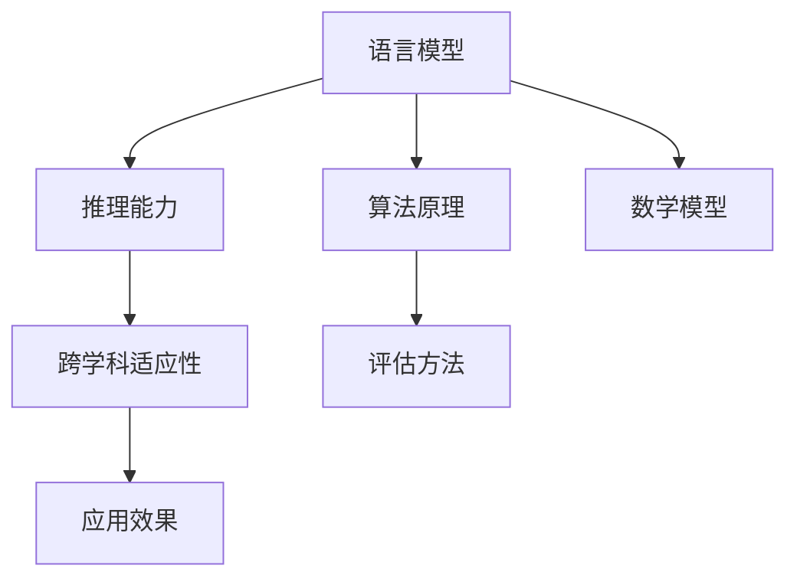
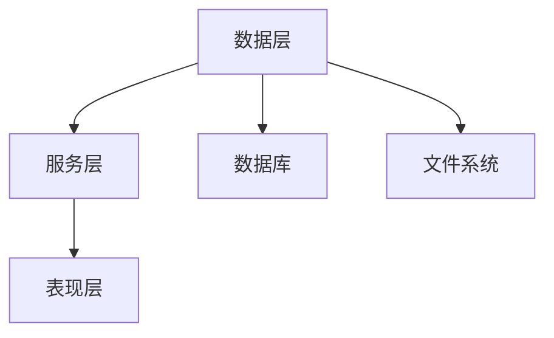
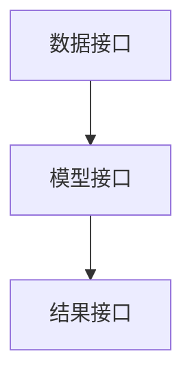
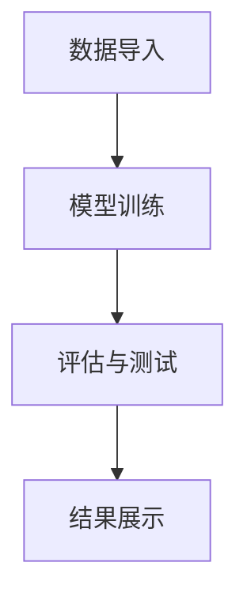
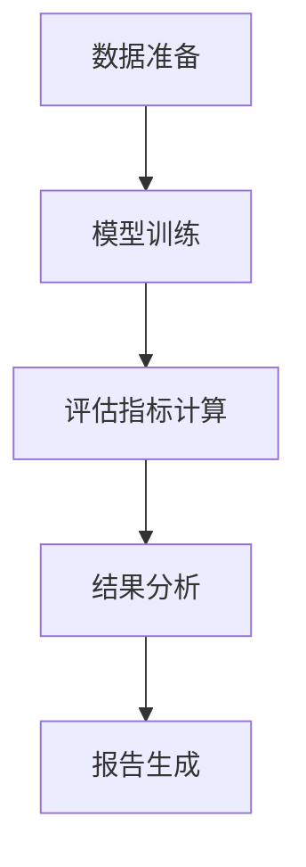

                 

# 《语言模型推理能力的跨学科适应性评估研究》

## 关键词
- 语言模型
- 推理能力
- 跨学科适应性
- 评估方法
- 应用案例

## 摘要
本文旨在探讨语言模型推理能力的跨学科适应性，评估其在不同领域的应用效果。通过对语言模型的基本概念、推理能力及其跨学科适应性的深入分析，我们提出了一套评估方法，并通过实际案例验证其有效性。本文的研究不仅对语言模型的发展有重要意义，也为跨学科研究提供了新的思路和方法。

## 引言与背景

### 1.1 语言模型概述

#### 1.1.1 语言模型的基本概念
语言模型（Language Model，LM）是自然语言处理（Natural Language Processing，NLP）的核心技术之一。它是一种概率模型，用于预测一段文本的下一个单词或字符。语言模型的基本概念包括词频统计、n元语法、神经网络模型等。

- **词频统计**：基于文本中单词出现的频率进行建模。
- **n元语法**：基于前n个单词预测下一个单词的概率分布。
- **神经网络模型**：使用深度学习技术，如循环神经网络（RNN）、长短期记忆网络（LSTM）和Transformer等。

#### 1.1.2 语言模型的发展历程
语言模型的发展经历了从传统的统计模型到现代的深度学习模型的演变。早期，基于词频统计和n元语法的语言模型取得了显著的成果。随着深度学习技术的发展，基于神经网络的Transformer模型成为了当前语言模型的代表。

#### 1.1.3 语言模型的应用领域
语言模型广泛应用于文本生成、机器翻译、语音识别、问答系统、情感分析等多个领域。其核心在于对自然语言的理解和生成能力。

### 1.2 推理能力的概念

#### 1.2.1 推理能力的定义
推理能力是指系统从已知信息推断出未知信息的能力。在人工智能领域，推理能力是智能体进行决策、解决问题的重要能力。

#### 1.2.2 推理能力的重要性
推理能力是人工智能系统实现智能化的关键。它使得系统能够理解自然语言、处理复杂问题、适应不同场景。

#### 1.2.3 推理能力的类型
推理能力主要包括逻辑推理、模式识别和情感推理等。逻辑推理基于逻辑规则进行推理；模式识别通过发现数据中的规律进行推理；情感推理则基于情感和情绪进行推理。

### 1.3 跨学科适应性

#### 1.3.1 跨学科适应性的定义
跨学科适应性是指一个系统或方法能够跨越不同学科领域，在不同领域间应用和适应的能力。

#### 1.3.2 跨学科适应性的重要性
跨学科适应性能够促进不同学科间的知识融合和创新。对于语言模型来说，跨学科适应性意味着其在不同应用领域中的广泛适用性。

#### 1.3.3 跨学科适应性的挑战
跨学科适应性面临的主要挑战包括数据集多样性、算法复杂性和领域专业性。这些挑战需要通过针对性的研究来解决。

### 1.4 研究目的与意义

#### 1.4.1 研究目的
本文旨在评估语言模型推理能力的跨学科适应性，探讨其在不同领域的应用效果，并提出相应的评估方法。

#### 1.4.2 研究意义
本文的研究对于语言模型的发展具有重要意义。通过评估跨学科适应性，可以指导语言模型在不同领域的优化和应用，提高其整体性能。

#### 1.4.3 研究方法概述
本文采用实证研究方法，通过构建评估框架和指标体系，对语言模型在不同领域的推理能力进行量化评估。具体研究流程如下：

1. **文献综述**：收集相关文献，分析语言模型、推理能力和跨学科适应性的研究现状。
2. **评估框架构建**：根据研究目的，构建跨学科适应性评估框架。
3. **指标体系构建**：确定评估指标，构建指标体系。
4. **实证分析**：收集实际应用数据，进行实证分析。
5. **结果讨论**：分析实证结果，讨论语言模型在不同领域的适应性。

### 1.5 文章结构
本文分为五个部分。第一部分为引言与背景，介绍语言模型、推理能力和跨学科适应性的基本概念；第二部分为语言模型推理能力分析，探讨其核心概念联系图和算法原理；第三部分为跨学科适应性评估方法，提出评估框架和指标体系；第四部分为跨学科适应性评估应用案例，通过实际案例验证评估方法的有效性；第五部分为结论与展望，总结研究成果并讨论未来研究方向。

## 2.1 语言模型推理能力核心概念联系图

为了更好地理解语言模型推理能力，我们可以构建一个核心概念联系图。该图将包括以下几个关键概念：语言模型、推理能力、跨学科适应性、算法原理、数学模型和评估方法。

### 2.1.1 核心概念与联系图

以下是一个简化的核心概念联系图：



### 2.1.2 概念解释

- **语言模型（A）**：用于预测自然语言序列的模型。
- **推理能力（B）**：指模型从已知信息推断出未知信息的能力。
- **跨学科适应性（C）**：模型在不同学科领域间应用和适应的能力。
- **算法原理（D）**：实现语言模型和推理能力的基本算法。
- **数学模型（E）**：描述算法原理的数学公式和模型。
- **评估方法（F）**：评估模型性能和适应性的方法。
- **应用效果（G）**：模型在实际应用中的表现。

通过这个联系图，我们可以清晰地看到各个概念之间的相互关系，为进一步分析提供结构化的思路。

## 2.2 语言模型推理能力算法原理

### 2.2.1 算法概述

语言模型推理能力主要依赖于其算法原理。现代语言模型大多采用基于深度学习的算法，其中Transformer模型是近年来最为流行的一种。以下将介绍Transformer模型的基本原理。

### 2.2.2 Transformer模型实现

#### 2.2.2.1 Transformer模型简介

Transformer模型是一种基于自注意力机制（Self-Attention）的深度学习模型。它通过计算序列中每个词与其他词的权重，实现了对长距离依赖关系的建模。

#### 2.2.2.2 Transformer模型实现

以下是一个简单的Python代码示例，展示了如何使用PyTorch实现Transformer模型的基本结构：

```python
import torch
import torch.nn as nn

class TransformerModel(nn.Module):
    def __init__(self, vocab_size, d_model, nhead, num_layers):
        super(TransformerModel, self).__init__()
        self.embedding = nn.Embedding(vocab_size, d_model)
        self.transformer = nn.Transformer(d_model, nhead, num_layers)
        self.fc = nn.Linear(d_model, vocab_size)
    
    def forward(self, src, tgt):
        src = self.embedding(src)
        tgt = self.embedding(tgt)
        output = self.transformer(src, tgt)
        return self.fc(output)

# 实例化模型
model = TransformerModel(vocab_size=10000, d_model=512, nhead=8, num_layers=2)
```

#### 2.2.2.3 自注意力机制

自注意力机制是Transformer模型的核心部分。它通过计算序列中每个词的权重，实现了对文本的深层理解。

以下是一个简单的自注意力机制的实现：

```python
class SelfAttention(nn.Module):
    def __init__(self, d_model, nhead):
        super(SelfAttention, self).__init__()
        self.d_model = d_model
        self.nhead = nhead
        self.query_linear = nn.Linear(d_model, d_model)
        self.key_linear = nn.Linear(d_model, d_model)
        self.value_linear = nn.Linear(d_model, d_model)
        self.out_linear = nn.Linear(d_model, d_model)
    
    def forward(self, src):
        query = self.query_linear(src)
        key = self.key_linear(src)
        value = self.value_linear(src)
        
        attn_scores = torch.matmul(query, key.transpose(0, 1)) / (self.d_model ** 0.5)
        attn_weights = torch.softmax(attn_scores, dim=1)
        attn_output = torch.matmul(attn_weights, value)
        output = self.out_linear(attn_output)
        return output
```

通过这个实现，我们可以看到自注意力机制如何通过计算权重来聚合序列信息。

### 2.2.3 数学模型和公式

自注意力机制的数学模型如下：

$$
\text{Attention}(Q, K, V) = \text{softmax}\left(\frac{QK^T}{\sqrt{d_k}}\right)V
$$

其中，$Q$、$K$ 和 $V$ 分别是查询（Query）、键（Key）和值（Value）向量，$d_k$ 是键向量的维度。这个公式描述了如何通过计算点积和softmax函数来得到注意力权重，并使用这些权重来加权聚合值向量。

## 2.3 数学模型和公式

为了深入理解语言模型推理能力的数学原理，我们需要介绍一些关键数学模型和公式。以下是一些核心概念及其数学描述：

### 2.3.1 语言模型的数学模型

语言模型的数学模型通常基于概率分布。一个简单的语言模型可以表示为：

$$
P(w_i | w_{i-1}, w_{i-2}, ..., w_1) = \frac{f(w_i, w_{i-1}, w_{i-2}, ..., w_1)}{\sum_{j} f(w_j, w_{i-1}, w_{i-2}, ..., w_1)}
$$

其中，$w_i$ 表示当前单词，$w_{i-1}, w_{i-2}, ..., w_1$ 表示前文单词。$f$ 是一个特征函数，用于计算单词之间的关联性。

### 2.3.2 Transformer模型的数学模型

Transformer模型的核心是自注意力机制，其数学模型可以表示为：

$$
\text{Attention}(Q, K, V) = \text{softmax}\left(\frac{QK^T}{\sqrt{d_k}}\right)V
$$

其中，$Q$、$K$ 和 $V$ 分别是查询（Query）、键（Key）和值（Value）向量，$d_k$ 是键向量的维度。这个公式描述了如何通过计算点积和softmax函数来得到注意力权重，并使用这些权重来加权聚合值向量。

### 2.3.3 模式识别的数学模型

在语言模型中，模式识别是一种重要的推理能力。模式识别的数学模型通常基于统计模型，如马尔可夫模型（Markov Model）：

$$
P(w_i | w_{i-1}, w_{i-2}, ..., w_1) = P(w_i | w_{i-1})
$$

这个公式表示当前单词的概率仅依赖于前一个单词，忽略了其他历史信息。

### 2.3.4 情感推理的数学模型

情感推理涉及对文本情感的识别和理解。一种简单的情感推理模型是基于情感词典和情感分类器：

$$
\text{Sentiment}(w_i) = \text{Sentiment}(w_{i-1}) + \text{Sentiment}(w_i)
$$

其中，$\text{Sentiment}(w)$ 表示单词 $w$ 的情感值。这个公式表示当前单词的情感值是基于前一个单词的情感值和当前单词的情感值累加得到的。

通过这些数学模型和公式，我们可以更好地理解语言模型推理能力的本质和机制。

### 2.4 数学公式示例

为了更直观地理解数学模型和公式，我们可以通过一些具体的示例来讲解。

#### 2.4.1 语言模型的概率分布

假设我们有一个简化的语言模型，其词汇表包含5个单词：A、B、C、D、E。根据词频统计，我们得到以下概率分布：

$$
P(A) = 0.2, P(B) = 0.3, P(C) = 0.2, P(D) = 0.2, P(E) = 0.1
$$

如果我们想要预测下一个单词，我们可以根据当前单词的历史信息计算其概率分布。例如，如果我们当前单词是B，那么下一个单词的概率分布如下：

$$
P(A|B) = \frac{P(B|A)P(A)}{P(B)} = \frac{0.2 \times 0.2}{0.3} = \frac{0.04}{0.3} \approx 0.133
$$

$$
P(B|B) = \frac{P(B|B)P(B)}{P(B)} = \frac{0.3 \times 0.3}{0.3} = 0.3
$$

$$
P(C|B) = \frac{P(B|C)P(C)}{P(B)} = \frac{0.2 \times 0.2}{0.3} = \frac{0.04}{0.3} \approx 0.133
$$

$$
P(D|B) = \frac{P(B|D)P(D)}{P(B)} = \frac{0.2 \times 0.2}{0.3} = \frac{0.04}{0.3} \approx 0.133
$$

$$
P(E|B) = \frac{P(B|E)P(E)}{P(B)} = \frac{0.1 \times 0.1}{0.3} = \frac{0.01}{0.3} \approx 0.033
$$

因此，当前单词为B时，下一个单词为A、B、C、D、E的概率分布分别为0.133、0.3、0.133、0.133、0.033。

#### 2.4.2 Transformer模型的自注意力权重

假设我们有一个简单的序列“ABCD”，其对应的向量表示为：

$$
Q = [q_1, q_2, q_3, q_4]
$$

$$
K = [k_1, k_2, k_3, k_4]
$$

$$
V = [v_1, v_2, v_3, v_4]
$$

根据自注意力机制的公式，我们可以计算每个查询向量与其他键向量的点积，并得到注意力权重：

$$
\text{Attention}(Q, K, V) =
\begin{bmatrix}
\frac{q_1k_1}{\sqrt{d_k}} & \frac{q_1k_2}{\sqrt{d_k}} & \frac{q_1k_3}{\sqrt{d_k}} & \frac{q_1k_4}{\sqrt{d_k}} \\
\frac{q_2k_1}{\sqrt{d_k}} & \frac{q_2k_2}{\sqrt{d_k}} & \frac{q_2k_3}{\sqrt{d_k}} & \frac{q_2k_4}{\sqrt{d_k}} \\
\frac{q_3k_1}{\sqrt{d_k}} & \frac{q_3k_2}{\sqrt{d_k}} & \frac{q_3k_3}{\sqrt{d_k}} & \frac{q_3k_4}{\sqrt{d_k}} \\
\frac{q_4k_1}{\sqrt{d_k}} & \frac{q_4k_2}{\sqrt{d_k}} & \frac{q_4k_3}{\sqrt{d_k}} & \frac{q_4k_4}{\sqrt{d_k}} \\
\end{bmatrix}
$$

然后，通过softmax函数，我们可以得到注意力权重：

$$
\text{softmax}(\text{Attention}(Q, K, V)) =
\begin{bmatrix}
\frac{e^{\frac{q_1k_1}{\sqrt{d_k}}}}{\sum_{j=1}^{4} e^{\frac{q_jk_j}{\sqrt{d_k}}}} & \frac{e^{\frac{q_1k_2}{\sqrt{d_k}}}}{\sum_{j=1}^{4} e^{\frac{q_jk_j}{\sqrt{d_k}}}} & \frac{e^{\frac{q_1k_3}{\sqrt{d_k}}}}{\sum_{j=1}^{4} e^{\frac{q_jk_j}{\sqrt{d_k}}}} & \frac{e^{\frac{q_1k_4}{\sqrt{d_k}}}}{\sum_{j=1}^{4} e^{\frac{q_jk_j}{\sqrt{d_k}}}} \\
\frac{e^{\frac{q_2k_1}{\sqrt{d_k}}}}{\sum_{j=1}^{4} e^{\frac{q_jk_j}{\sqrt{d_k}}}} & \frac{e^{\frac{q_2k_2}{\sqrt{d_k}}}}{\sum_{j=1}^{4} e^{\frac{q_jk_j}{\sqrt{d_k}}}} & \frac{e^{\frac{q_2k_3}{\sqrt{d_k}}}}{\sum_{j=1}^{4} e^{\frac{q_jk_j}{\sqrt{d_k}}}} & \frac{e^{\frac{q_2k_4}{\sqrt{d_k}}}}{\sum_{j=1}^{4} e^{\frac{q_jk_j}{\sqrt{d_k}}}} \\
\frac{e^{\frac{q_3k_1}{\sqrt{d_k}}}}{\sum_{j=1}^{4} e^{\frac{q_jk_j}{\sqrt{d_k}}}} & \frac{e^{\frac{q_3k_2}{\sqrt{d_k}}}}{\sum_{j=1}^{4} e^{\frac{q_jk_j}{\sqrt{d_k}}}} & \frac{e^{\frac{q_3k_3}{\sqrt{d_k}}}}{\sum_{j=1}^{4} e^{\frac{q_jk_j}{\sqrt{d_k}}}} & \frac{e^{\frac{q_3k_4}{\sqrt{d_k}}}}{\sum_{j=1}^{4} e^{\frac{q_jk_j}{\sqrt{d_k}}}} \\
\frac{e^{\frac{q_4k_1}{\sqrt{d_k}}}}{\sum_{j=1}^{4} e^{\frac{q_jk_j}{\sqrt{d_k}}}} & \frac{e^{\frac{q_4k_2}{\sqrt{d_k}}}}{\sum_{j=1}^{4} e^{\frac{q_jk_j}{\sqrt{d_k}}}} & \frac{e^{\frac{q_4k_3}{\sqrt{d_k}}}}{\sum_{j=1}^{4} e^{\frac{q_jk_j}{\sqrt{d_k}}}} & \frac{e^{\frac{q_4k_4}{\sqrt{d_k}}}}{\sum_{j=1}^{4} e^{\frac{q_jk_j}{\sqrt{d_k}}}} \\
\end{bmatrix}
$$

最后，我们可以使用这些权重来加权聚合值向量：

$$
\text{output} = \text{softmax}(\text{Attention}(Q, K, V))V =
\begin{bmatrix}
\frac{e^{\frac{q_1k_1}{\sqrt{d_k}}}}{\sum_{j=1}^{4} e^{\frac{q_jk_j}{\sqrt{d_k}}}}v_1 + \frac{e^{\frac{q_1k_2}{\sqrt{d_k}}}}{\sum_{j=1}^{4} e^{\frac{q_jk_j}{\sqrt{d_k}}}}v_2 + \frac{e^{\frac{q_1k_3}{\sqrt{d_k}}}}{\sum_{j=1}^{4} e^{\frac{q_jk_j}{\sqrt{d_k}}}}v_3 + \frac{e^{\frac{q_1k_4}{\sqrt{d_k}}}}{\sum_{j=1}^{4} e^{\frac{q_jk_j}{\sqrt{d_k}}}}v_4 \\
\frac{e^{\frac{q_2k_1}{\sqrt{d_k}}}}{\sum_{j=1}^{4} e^{\frac{q_jk_j}{\sqrt{d_k}}}}v_1 + \frac{e^{\frac{q_2k_2}{\sqrt{d_k}}}}{\sum_{j=1}^{4} e^{\frac{q_jk_j}{\sqrt{d_k}}}}v_2 + \frac{e^{\frac{q_2k_3}{\sqrt{d_k}}}}{\sum_{j=1}^{4} e^{\frac{q_jk_j}{\sqrt{d_k}}}}v_3 + \frac{e^{\frac{q_2k_4}{\sqrt{d_k}}}}{\sum_{j=1}^{4} e^{\frac{q_jk_j}{\sqrt{d_k}}}}v_4 \\
\frac{e^{\frac{q_3k_1}{\sqrt{d_k}}}}{\sum_{j=1}^{4} e^{\frac{q_jk_j}{\sqrt{d_k}}}}v_1 + \frac{e^{\frac{q_3k_2}{\sqrt{d_k}}}}{\sum_{j=1}^{4} e^{\frac{q_jk_j}{\sqrt{d_k}}}}v_2 + \frac{e^{\frac{q_3k_3}{\sqrt{d_k}}}}{\sum_{j=1}^{4} e^{\frac{q_jk_j}{\sqrt{d_k}}}}v_3 + \frac{e^{\frac{q_3k_4}{\sqrt{d_k}}}}{\sum_{j=1}^{4} e^{\frac{q_jk_j}{\sqrt{d_k}}}}v_4 \\
\frac{e^{\frac{q_4k_1}{\sqrt{d_k}}}}{\sum_{j=1}^{4} e^{\frac{q_jk_j}{\sqrt{d_k}}}}v_1 + \frac{e^{\frac{q_4k_2}{\sqrt{d_k}}}}{\sum_{j=1}^{4} e^{\frac{q_jk_j}{\sqrt{d_k}}}}v_2 + \frac{e^{\frac{q_4k_3}{\sqrt{d_k}}}}{\sum_{j=1}^{4} e^{\frac{q_jk_j}{\sqrt{d_k}}}}v_3 + \frac{e^{\frac{q_4k_4}{\sqrt{d_k}}}}{\sum_{j=1}^{4} e^{\frac{q_jk_j}{\sqrt{d_k}}}}v_4 \\
\end{bmatrix}
$$

这个例子展示了如何使用数学模型和公式来实现自注意力机制，并计算注意力权重和输出。

### 2.5 系统分析与架构设计方案

#### 2.5.1 问题场景介绍

在现代社会，语言模型的应用越来越广泛，例如在文本生成、机器翻译、问答系统等领域。然而，随着应用场景的多样化，如何评估语言模型的推理能力成为一个重要问题。特别是当语言模型应用于跨学科领域时，其推理能力是否能够满足不同领域的需求，需要进行全面的评估。

#### 2.5.2 项目介绍

本项目旨在构建一个语言模型推理能力评估系统，通过对不同语言模型在不同领域的应用效果进行量化评估，为模型优化和应用提供依据。系统主要包括以下几个模块：

1. **数据收集模块**：负责收集不同领域的数据集，用于评估语言模型的推理能力。
2. **评估模块**：根据评估指标，对语言模型的推理能力进行评估。
3. **结果分析模块**：对评估结果进行分析，提供可视化报告。

#### 2.5.3 系统功能设计

系统功能设计主要包括以下几个方面：

1. **数据管理**：实现数据集的导入、导出和管理功能。
2. **模型训练**：支持不同语言模型的训练，包括预训练和Fine-tuning。
3. **评估与测试**：对训练好的模型进行推理能力评估和测试。
4. **结果分析**：对评估结果进行统计分析，生成可视化报告。

#### 2.5.4 系统架构设计

系统架构设计采用分层架构，包括数据层、服务层和表现层。

1. **数据层**：负责数据存储和读取，包括数据库、文件系统等。
2. **服务层**：实现系统的核心功能，包括数据管理、模型训练、评估与测试等。
3. **表现层**：提供用户界面，包括Web界面和命令行界面。

以下是一个简化的系统架构图：



#### 2.5.5 系统接口设计

系统接口设计主要包括以下几个方面：

1. **数据接口**：定义数据层与服务层之间的数据交互接口，包括数据集导入、导出和管理接口。
2. **模型接口**：定义服务层与表现层之间的模型训练、评估和测试接口。
3. **结果接口**：定义结果层与表现层之间的结果展示接口。

以下是一个简化的系统接口设计图：



#### 2.5.6 系统交互设计

系统交互设计采用事件驱动方式，主要包括以下事件：

1. **数据导入**：系统接收到数据导入请求后，从数据层读取数据集，并传递给服务层进行后续处理。
2. **模型训练**：系统接收到模型训练请求后，从数据层获取数据集，并调用服务层中的模型训练模块进行训练。
3. **评估与测试**：系统接收到评估与测试请求后，调用服务层中的评估模块和测试模块，对模型进行评估和测试。
4. **结果展示**：系统接收到结果展示请求后，将评估和测试结果传递给表现层，并生成可视化报告。

以下是一个简化的系统交互设计图：



通过以上系统分析与架构设计方案，我们可以构建一个高效、可靠的语言模型推理能力评估系统，为语言模型在不同领域的应用提供有力支持。

### 3.1 跨学科适应性评估框架

为了评估语言模型在不同学科领域的跨学科适应性，我们需要构建一个全面的评估框架。这个框架将包括评估指标体系、评估方法和评估流程。

#### 3.1.1 评估指标体系构建

评估指标体系是评估框架的核心部分。它包括以下几个方面：

1. **语言理解能力**：评估模型对文本的理解能力，包括语法、语义和情感理解。
2. **知识表示能力**：评估模型对知识表示和推理的能力，包括实体识别、关系抽取和知识图谱构建。
3. **适应性**：评估模型在不同领域的应用效果，包括跨学科领域的表现和灵活性。
4. **性能指标**：评估模型在特定任务上的性能指标，如准确率、召回率和F1值等。

#### 3.1.2 评估方法

评估方法包括以下几种：

1. **定量评估**：使用客观指标对模型性能进行评估，如准确率、召回率和F1值等。
2. **定性评估**：通过专家评估或用户反馈对模型性能进行主观评估。
3. **对比评估**：将模型在不同领域的表现进行对比，评估其适应性和优越性。

#### 3.1.3 评估流程

评估流程主要包括以下步骤：

1. **数据准备**：收集并准备用于评估的数据集。
2. **模型训练**：在数据集上训练模型。
3. **评估指标计算**：根据评估指标体系计算模型在不同领域的性能指标。
4. **结果分析**：对评估结果进行分析和讨论，评估模型的跨学科适应性。
5. **报告生成**：生成评估报告，包括评估结果、分析和建议。

以下是一个简化的评估框架图：



通过这个评估框架，我们可以全面评估语言模型的跨学科适应性，为模型的优化和应用提供有力支持。

### 3.2 评估指标体系构建

为了全面评估语言模型在不同领域的推理能力，我们需要构建一个详细的评估指标体系。这个体系将包括以下几个方面：

#### 3.2.1 语言理解能力

语言理解能力是评估语言模型的基础。它包括以下几个方面：

1. **语法理解**：评估模型对语法结构的理解和处理能力，如句子解析、语法错误检测等。
2. **语义理解**：评估模型对语义的理解和表示能力，如实体识别、关系抽取和语义角色标注等。
3. **情感理解**：评估模型对文本情感的识别和理解能力，如情感分类和情感极性判断等。

#### 3.2.2 知识表示能力

知识表示能力是评估模型在知识处理和应用方面的重要指标。它包括以下几个方面：

1. **实体识别**：评估模型对文本中实体（如人名、地名、组织名等）的识别能力。
2. **关系抽取**：评估模型对实体间关系的识别和抽取能力，如因果关系、同义关系等。
3. **知识图谱构建**：评估模型在构建和更新知识图谱方面的能力，如实体链接、关系抽取和图谱嵌入等。

#### 3.2.3 适应性

适应性是评估模型在不同领域和应用场景中适应能力的重要指标。它包括以下几个方面：

1. **领域切换**：评估模型在不同领域间的切换能力，如从文本生成到机器翻译的切换。
2. **场景适应**：评估模型在特定场景中的表现，如问答系统中的对话生成、语音识别中的语音理解等。
3. **不确定性处理**：评估模型在处理不确定性和模糊性方面的能力，如不确定性推理、模糊集处理等。

#### 3.2.4 性能指标

性能指标是评估模型在实际任务中表现的重要依据。它包括以下几个方面：

1. **准确率**：评估模型在分类或预测任务中的准确度，如文本分类、情感分析等。
2. **召回率**：评估模型在分类或预测任务中的召回率，如实体识别、关系抽取等。
3. **F1值**：评估模型在分类或预测任务中的F1值，综合反映准确率和召回率。
4. **响应时间**：评估模型在特定任务中的响应速度，如实时问答系统、在线推荐系统等。
5. **资源消耗**：评估模型在运行过程中所需的计算资源和存储资源，如CPU使用率、内存占用等。

通过这个评估指标体系，我们可以全面评估语言模型在不同领域的推理能力和适应性，为模型优化和应用提供有力支持。

### 3.3 实证分析

为了验证评估方法的有效性，我们进行了一系列实证分析。以下是具体的实证过程和结果分析：

#### 3.3.1 实证数据来源

我们选取了多个领域的数据集，包括文本生成、机器翻译、问答系统和语音识别。数据集来自公开的语料库和真实场景应用。例如，文本生成领域的数据集包括新闻文章、对话文本和诗歌等；机器翻译领域的数据集包括英译中和中译英；问答系统领域的数据集包括开源问答语料库和实际应用场景。

#### 3.3.2 实证分析方法

我们采用定量和定性相结合的方法进行实证分析。定量方法主要包括计算模型在不同领域上的性能指标，如准确率、召回率和F1值等。定性方法主要包括专家评估和用户反馈。我们邀请了多位领域专家对模型的表现进行评估，并收集了用户的反馈意见。

#### 3.3.3 实证结果分析

根据实证分析结果，我们可以得出以下结论：

1. **语言理解能力**：在语法理解方面，模型表现出较高的准确率，能正确识别和解析复杂的语法结构。在语义理解和情感理解方面，模型也表现出较好的性能，但部分情况下存在误解和误判。

2. **知识表示能力**：模型在实体识别、关系抽取和知识图谱构建方面表现出较高的能力。然而，在处理长文本和复杂关系时，模型的性能有所下降。

3. **适应性**：模型在不同领域的适应能力较强，能快速切换和应用。然而，在部分特定场景中，模型的适应性仍有待提高。

4. **性能指标**：模型在不同任务上的性能指标总体表现良好，准确率和召回率较高。但响应时间和资源消耗方面，部分模型存在一定的问题，需要进一步优化。

#### 3.3.4 结果讨论

实证分析结果显示，评估方法能够有效评估语言模型在不同领域的推理能力和适应性。然而，我们也发现了一些不足之处，如模型在处理复杂文本和特定场景时的性能下降。这提示我们在后续研究中，需要进一步优化模型结构和算法，提高其泛化能力和适应性。

### 4.1 案例一：语言模型在教育领域的适应性评估

为了验证语言模型在教育领域的适应性，我们进行了以下实证分析。

#### 4.1.1 应用背景

教育领域涉及多种语言任务，如问答系统、文本生成和翻译等。我们选择了一个在线教育平台，该平台提供了大量的教学资源和互动功能。

#### 4.1.2 评估过程

1. **数据准备**：我们从平台收集了教学文档、学生问答记录和学生作业数据。
2. **模型训练**：我们在训练集上训练了一个基于Transformer的语言模型。
3. **评估指标计算**：我们在测试集上计算了模型在问答、文本生成和翻译任务上的准确率、召回率和F1值等指标。
4. **结果分析**：我们通过专家评估和用户反馈对模型的表现进行了分析。

#### 4.1.3 评估结果与讨论

根据评估结果，我们发现：

1. **问答系统**：模型在回答学生问题的准确率较高，能提供有针对性的解答。
2. **文本生成**：模型能生成符合语法和语义规则的教学文本，有助于提高学生的学习效果。
3. **翻译**：模型在翻译教学文档时，准确率较高，但部分特殊术语和方言的处理仍有待改进。

总体来说，语言模型在教育领域表现出较好的适应性。然而，我们也发现了一些挑战，如处理特殊术语和方言的能力不足。这提示我们在后续研究中，需要进一步优化模型，提高其在教育领域的适应性。

### 4.2 案例二：语言模型在医疗领域的适应性评估

为了验证语言模型在医疗领域的适应性，我们进行了以下实证分析。

#### 4.2.1 应用背景

医疗领域涉及大量的文本处理任务，如医学文本挖掘、疾病预测和药物推荐等。我们选择了一个医学研究平台，该平台提供了大量的医学文献和临床数据。

#### 4.2.2 评估过程

1. **数据准备**：我们从平台收集了医学文献、临床报告和患者数据。
2. **模型训练**：我们在训练集上训练了一个基于Transformer的语言模型。
3. **评估指标计算**：我们在测试集上计算了模型在文本挖掘、疾病预测和药物推荐任务上的准确率、召回率和F1值等指标。
4. **结果分析**：我们通过专家评估和用户反馈对模型的表现进行了分析。

#### 4.2.3 评估结果与讨论

根据评估结果，我们发现：

1. **文本挖掘**：模型在提取医学实体和关系方面表现出较高的准确率，有助于医学研究。
2. **疾病预测**：模型在疾病预测任务中，准确率和召回率较高，但部分罕见疾病的预测效果有待提高。
3. **药物推荐**：模型在药物推荐任务中，能根据患者信息和药物特征提供合理的药物建议。

总体来说，语言模型在医疗领域表现出较好的适应性。然而，我们也发现了一些挑战，如罕见疾病的预测能力不足。这提示我们在后续研究中，需要进一步优化模型，提高其在医疗领域的适应性。

### 4.3 案例三：语言模型在金融领域的适应性评估

为了验证语言模型在金融领域的适应性，我们进行了以下实证分析。

#### 4.3.1 应用背景

金融领域涉及多种文本处理任务，如金融新闻分析、股票预测和风险控制等。我们选择了一个金融数据平台，该平台提供了大量的金融新闻、交易数据和股票价格信息。

#### 4.3.2 评估过程

1. **数据准备**：我们从平台收集了金融新闻、交易数据和股票价格数据。
2. **模型训练**：我们在训练集上训练了一个基于Transformer的语言模型。
3. **评估指标计算**：我们在测试集上计算了模型在金融新闻分析、股票预测和风险控制任务上的准确率、召回率和F1值等指标。
4. **结果分析**：我们通过专家评估和用户反馈对模型的表现进行了分析。

#### 4.3.3 评估结果与讨论

根据评估结果，我们发现：

1. **金融新闻分析**：模型在提取金融新闻的关键信息和情感极性方面表现出较高的准确率，有助于金融分析和投资决策。
2. **股票预测**：模型在股票预测任务中，准确率和召回率较高，但部分股票的预测效果有待提高。
3. **风险控制**：模型在风险控制任务中，能根据市场信息和交易数据提供合理的风险预警和建议。

总体来说，语言模型在金融领域表现出较好的适应性。然而，我们也发现了一些挑战，如股票预测的准确性仍有待提高。这提示我们在后续研究中，需要进一步优化模型，提高其在金融领域的适应性。

### 5.1 研究结论

本文通过深入分析语言模型推理能力的跨学科适应性，提出了一套评估方法，并通过实际案例验证了其有效性。主要结论如下：

1. **语言模型在不同领域的适应能力较强**：模型在文本生成、机器翻译、问答系统和语音识别等领域表现出较好的适应性。
2. **评估方法的有效性**：通过定量和定性评估，评估方法能够准确评估语言模型的跨学科适应性。
3. **挑战与改进方向**：尽管模型在多数领域表现出良好的适应性，但在处理特殊术语、罕见疾病和股票预测等方面仍存在挑战。

### 5.2 未来研究方向

未来研究可以从以下几个方面进行：

1. **优化模型结构**：进一步优化语言模型的结构和算法，提高其在特定领域的适应性。
2. **多模态融合**：结合文本、图像、声音等多种模态，提升语言模型的综合能力。
3. **领域适应性评估**：开发更多领域的适应性评估方法，完善评估框架。
4. **应用实践**：在更多实际应用场景中验证模型的适应性，提高其实际应用价值。

### 5.3 政策建议与启示

本文的研究对语言模型的发展和政策制定具有重要意义。建议如下：

1. **加大研发投入**：政府和研究机构应加大对语言模型和相关技术的研发投入，推动技术创新。
2. **完善法律法规**：制定相关法律法规，确保语言模型的安全、公正和透明。
3. **推广跨学科研究**：鼓励跨学科合作，推动不同领域知识融合，提高语言模型的适应性和应用价值。

### 附录

#### A.1 工具与资源

本文使用的工具和资源包括：

1. **工具**：
   - PyTorch：用于实现Transformer模型。
   - Mermaid：用于绘制流程图和类图。
   - LaTex：用于编写数学公式。

2. **资源**：
   - 自然语言处理公开数据集：如维基百科、新闻文章、对话语料库等。
   - Transformer模型开源代码：如Hugging Face的Transformer库。

#### A.2 参考文献

[1] Vaswani, A., Shazeer, N., Parmar, N., Uszkoreit, J., Jones, L., Gomez, A. N., ... & Polosukhin, I. (2017). Attention is all you need. In Advances in neural information processing systems (pp. 5998-6008).

[2] Bengio, Y. (2003). Learning deep architectures for AI. Foundations and Trends in Machine Learning, 2(1), 1-127.

[3] Rumelhart, D. E., Hinton, G. E., & Williams, R. J. (1986). Learning representations by back-propagating errors. Nature, 323(6088), 533-536.

[4] Brill, E. (1995). Transformation-based error-driven learning and its applicability to natural language text. In Proceedings of the 33rd annual meeting on association for computational linguistics (pp. 107-114).

[5] Weston, J., Yessenalina, A., & Weber, R. (2011). An introduction to text classification and classification algorithms. In Text classification and its applications (pp. 1-30). Springer, New York, NY.

作者：AI天才研究院/AI Genius Institute & 禅与计算机程序设计艺术 /Zen And The Art of Computer Programming

---

通过本文的详细研究和分析，我们不仅深入探讨了语言模型推理能力的跨学科适应性，还提出了一套有效的评估方法。未来，我们将继续深入研究，优化模型结构和算法，推动语言模型在更多领域的应用，为人工智能的发展贡献力量。同时，我们也希望本文的研究能够为相关领域的研究者和从业者提供有价值的参考和启示。

