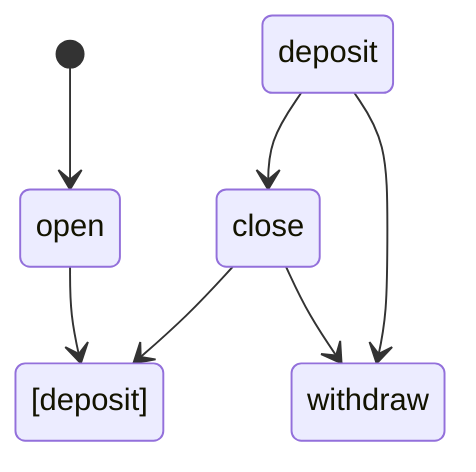

                 

### 谓词逻辑与逻辑编程范式

---

> 关键词：谓词逻辑、逻辑编程、人工智能、自动推理、知识表示、程序生成

> 摘要：本文深入探讨了谓词逻辑与逻辑编程范式，介绍了其在计算机科学和人工智能领域的广泛应用。通过系统地分析谓词逻辑的基础、逻辑编程的基本原理和应用案例，本文旨在揭示谓词逻辑与逻辑编程在解决复杂问题、实现智能系统中的核心作用，并为未来研究和应用提供指导。

---

## 第1章 引言

### 1.1 什么是谓词逻辑

谓词逻辑（Predicate Logic）是形式逻辑的一种，以谓词作为基础构建起来的逻辑系统。它不仅包含了命题逻辑（Propositional Logic）的内容，还能表达更为复杂的逻辑关系和概念。谓词逻辑的核心在于谓词的使用，谓词用于描述个体或对象的状态或性质。

谓词逻辑与传统的命题逻辑有显著的区别。命题逻辑主要处理命题的真假值，而谓词逻辑引入了变量和量词，使得逻辑表达式能够描述对象之间的关系和属性。这种扩展使得谓词逻辑在表达复杂逻辑关系时更为灵活和强大。

在计算机科学中，谓词逻辑的应用范围广泛。它被用于设计形式化验证、自动推理、知识表示和人工智能等多个领域。例如，谓词逻辑被广泛应用于编程语言中，如Prolog，它在自然语言处理、自动程序生成和智能系统设计等方面发挥着重要作用。

### 1.2 什么是逻辑编程

逻辑编程（Logic Programming）是一种基于逻辑的编程范式，它通过逻辑表达式来描述程序的行为和状态。与传统的命令式编程和声明式编程不同，逻辑编程强调的是通过逻辑推理来求解问题。

逻辑编程与传统编程的主要区别在于其处理问题的方式。传统编程通常通过定义数据和操作数据的过程来解决问题，而逻辑编程则通过定义事实和规则来描述问题，并通过逻辑推理求解答案。

逻辑编程在人工智能领域有着重要的应用。它被用于构建智能推理系统、知识库系统、自动程序生成系统等。逻辑编程的优势在于其能够处理不确定性和不一致性，这使得它在解决复杂问题时具有独特的优势。

### 1.3 本书结构

本书将分为以下几个部分：

1. **第1章 引言**：介绍谓词逻辑与逻辑编程的基本概念和应用领域。
2. **第2章 谓词逻辑基础**：详细讲解谓词逻辑的基本概念、量词和推理规则。
3. **第3章 逻辑编程基础**：介绍逻辑编程的基础知识和常用的逻辑编程范式。
4. **第4章 谓词逻辑在人工智能中的应用**：探讨谓词逻辑在人工智能领域的应用，如自动推理和自然语言处理。
5. **第5章 逻辑编程在人工智能中的应用**：分析逻辑编程在人工智能系统构建和自然语言处理中的应用。
6. **第6章 谓词逻辑与逻辑编程的实践应用**：通过实际案例展示谓词逻辑与逻辑编程的应用。
7. **第7章 谓词逻辑与逻辑编程的未来发展**：展望谓词逻辑与逻辑编程在未来的发展趋势。

通过本书的学习，读者将能够全面了解谓词逻辑与逻辑编程的核心概念、基本原理和应用方法，为未来的研究和实践打下坚实的基础。

### 第2章 谓词逻辑基础

#### 2.1 基本概念

在进入谓词逻辑的详细探讨之前，我们需要先回顾一下命题逻辑的基本概念。命题逻辑主要处理命题的真假值，而谓词逻辑则在此基础上引入了谓词、个体和量词等概念。

**命题逻辑回顾**：命题逻辑的基本单位是命题，命题可以是真的或者是假的。命题之间的逻辑关系包括合取（AND）、析取（OR）、非（NOT）、蕴含（IMPLIES）等。

**谓词逻辑的引入**：谓词逻辑引入了谓词这一概念。谓词是一种用于描述个体或对象状态的函数，它可以将个体作为输入，并返回一个布尔值，表示该个体是否具有某种性质。例如，谓词`P(x)`表示个体x具有性质P。

**谓词与个体**：在谓词逻辑中，个体是具有独立存在意义的对象，可以是具体的对象，如“张三”，也可以是抽象的概念，如“所有人”。谓词与个体之间通过量词来建立关系。

#### 2.2 量词

量词是谓词逻辑中用于描述个体集合的重要工具。量词分为全称量词（Universal Quantifier）和存在量词（Existential Quantifier）。

**全称量词（∀）**：全称量词用于表示某个属性对于整个个体集合都成立。例如，谓词公式`∀x P(x)`表示对于所有个体x，P(x)都为真。

**存在量词（∃）**：存在量词用于表示在某个个体集合中至少存在一个满足某个属性的个体。例如，谓词公式`∃x P(x)`表示存在至少一个个体x，使得P(x)为真。

**量词的分配律与结合律**：量词在逻辑表达式中可以按照分配律和结合律进行变换。例如，分配律表示`P(x) ∧ (∀y Q(y))`等价于`∀y Q(y) ∧ P(x)`，结合律表示`∀x (∀y P(x, y))`等价于`∀y ∀x P(x, y)`。

**量词的否定**：量词的否定也是一个重要的概念。全称量词的否定是存在量词，存在量词的否定是全称量词。例如，`¬∀x P(x)`等价于`∃x ¬P(x)`，`¬∃x P(x)`等价于`∀x ¬P(x)`。

#### 2.3 谓词逻辑的推理规则

谓词逻辑的推理规则用于从已知的事实和规则推导出新的结论。以下是一些基本的推理规则：

**直接推理**：如果已知`P`为真，则可以推导出`P`的任意蕴含式也为真。例如，如果`P`为真，则可以推导出`P → Q`为真，只要`Q`是已知的。

**模态推理**：模态推理包括蕴含推理和反证法。蕴含推理表示如果`P → Q`为真，且`P`为真，则可以推导出`Q`也为真。反证法则是通过假设某个结论为假，然后推导出矛盾，从而证明原结论为真。

**演绎推理**：演绎推理是从一般到特殊的推理过程。例如，已知所有的人都有生命，而张三是人，因此可以推导出张三有生命。

#### 2.4 谓词逻辑的数学基础

谓词逻辑的数学基础主要包括逻辑运算符的表示、谓词逻辑公式的形式化表示和语义解释。

**逻辑运算符的表示**：谓词逻辑中常用的逻辑运算符包括合取（AND），表示为`∧`；析取（OR），表示为`∨`；非（NOT），表示为`¬`。

**谓词逻辑公式的形式化表示**：谓词逻辑公式可以用形式化的方式表示。一个谓词逻辑公式通常由谓词、变量、量词和逻辑运算符组成。例如，谓词公式`∀x P(x) ∧ ∃y Q(y)`表示对于所有个体x，P(x)为真，并且存在个体y，使得Q(y)为真。

**谓词逻辑的语义解释**：谓词逻辑的语义解释用于确定一个谓词逻辑公式是否为真。语义解释通常通过指派个体和谓词的值来实现。例如，如果指派个体x为某个具体对象，并使得谓词P(x)为真，那么谓词公式`∀x P(x)`为真。

通过上述内容，我们可以看到谓词逻辑作为一种形式化的逻辑系统，其基础概念和推理规则为计算机科学和人工智能提供了强大的工具。在接下来的章节中，我们将进一步探讨逻辑编程的基础知识，以及谓词逻辑在实际应用中的具体实现。

### 第3章 逻辑编程基础

#### 3.1 Prolog编程语言

Prolog（Programming in Logic）是一种广泛使用的逻辑编程语言，以其简洁、强大的逻辑推理能力而闻名。Prolog的主要特点是其基于谓词逻辑的语法结构，能够方便地表示和求解复杂的问题。

**Prolog简介**：Prolog最初由法国学者Alain Colmerauer等人于1972年开发，旨在提供一种基于逻辑的编程工具。Prolog的核心概念包括变量、事实、规则和查询。

- **变量**：Prolog中的变量用于表示未知的个体或对象。变量通常以字母开头，后跟下划线，如`X, Y, Z`等。
- **事实**：事实是Prolog数据库中的基本元素，用于表示已知的信息。事实通常由谓词和其参数组成，如`person(john), loves(john, mary)`等。
- **规则**：规则描述了事实之间的关系。Prolog中的规则通常由前提和结论组成，以`:-`分隔，如`parent(X, Y) :- mother(Y, X)`表示Y是X的母亲。
- **查询**：查询用于从数据库中检索信息。Prolog的查询通常以问号`?`开头，如`parent(john, X)?`。

**变量、事实与规则**：在Prolog中，变量用于绑定具体的值，事实用于记录具体的信息，规则用于描述事实之间的关系。例如，以下Prolog程序定义了一个家庭关系的数据库：

```prolog
% 事实
father(john, mary).
mother(jane, mary).

% 规则
parent(X, Y) :- father(X, Y); mother(X, Y).
```

在这个例子中，`father(john, mary)`和`mother(jane, mary)`是事实，表示John是Mary的父亲，Jane是Mary的母亲。`parent(X, Y)`是一个规则，表示如果X是Y的父亲或母亲，则X是Y的家长。

**查询与解约束**：Prolog的查询功能是其强大的地方之一。通过查询，我们可以动态地检索数据库中的信息。例如，以下查询将返回所有Mary的家长：

```prolog
parent(john, X).
parent(jane, X).

X = john ;
X = jane.
```

在这个查询中，Prolog将尝试找到满足`parent(john, X)`和`parent(jane, X)`的两个解，即X可以是John或Jane。

**Prolog的应用**：Prolog在人工智能领域有着广泛的应用，特别是在自然语言处理、自动推理、知识表示和自动程序生成等方面。例如，在自然语言处理中，Prolog可以用于构建语法分析器和解码自然语言文本。在自动推理中，Prolog可以用于验证数学定理和解决逻辑问题。在知识表示中，Prolog可以用于构建知识库和推理机。在自动程序生成中，Prolog可以用于生成特定领域的程序代码。

通过上述对Prolog的介绍，我们可以看到，Prolog作为一种逻辑编程语言，其独特的语法和强大的逻辑推理能力使其在解决复杂问题和构建智能系统方面具有显著优势。

#### 3.2 基于逻辑的程序设计

**定义逻辑程序**：基于逻辑的程序设计（Logic Programming）是一种通过逻辑表达式描述程序行为的编程范式。在逻辑程序中，程序的行为由一系列事实和规则定义，并通过逻辑推理来求解问题。

**迭代与递归**：逻辑程序设计中的迭代和递归是两种常用的算法结构。

- **迭代**：迭代是通过重复执行一系列操作来解决问题的方法。在逻辑程序中，迭代通常通过循环结构实现。例如，以下Prolog程序使用迭代方法计算斐波那契数列：

```prolog
fib(0, 0).
fib(1, 1).
fib(N, F) :- N > 1, M is N-1, fib(M, FM), fib(M-1, FM1), F is FM + FM1.
```

在这个程序中，`fib(N, F)`表示计算第N个斐波那契数。通过迭代方式，程序从基础值开始，逐步计算更高阶的值。

- **递归**：递归是通过调用自身来解决问题的方法。在逻辑程序中，递归通常通过递归定义实现。例如，以下Prolog程序使用递归方法计算阶乘：

```prolog
factorial(0, 1).
factorial(N, F) :- N > 0, M is N-1, factorial(M, FM), F is N * FM.
```

在这个程序中，`factorial(N, F)`表示计算N的阶乘。通过递归调用，程序逐步计算更低阶的值，直至基础值。

**模式匹配与变量绑定**：在逻辑程序中，模式匹配和变量绑定是关键操作。

- **模式匹配**：模式匹配是一种将逻辑表达式中的变量与具体的值绑定在一起的方法。在Prolog中，模式匹配通过将谓词的参数与具体的值进行比较来实现。例如，以下查询将匹配所有家长：

```prolog
parent(john, X).
parent(jane, X).

X = john ;
X = jane.
```

在这个查询中，Prolog将尝试将变量X与John或Jane绑定。

- **变量绑定**：变量绑定是指将未知的变量与具体的值关联起来。在逻辑程序中，变量绑定通过模式匹配实现。绑定后的变量可以在程序中作为具体的值使用。例如，以下查询将返回所有家长的名字：

```prolog
parent(john, _).
parent(jane, _).

_ = john ;
_ = jane.
```

在这个查询中，Prolog将变量_与John或Jane绑定，并返回绑定的值。

通过上述对基于逻辑的程序设计的介绍，我们可以看到，逻辑程序设计通过定义事实和规则，并利用逻辑推理来求解问题，从而提供了一种强大而灵活的编程方法。

#### 3.3 常见的逻辑编程范式

逻辑编程范式是指逻辑编程中常见的编程风格和方法。以下是一些常见的逻辑编程范式：

**基于规则的逻辑编程**：基于规则的逻辑编程是最常见的逻辑编程范式之一。它通过定义一系列规则来描述程序的行为。规则通常由前提和结论组成，表示如果前提为真，则结论也为真。

- **定义规则**：基于规则的逻辑编程通过定义规则来实现。规则通常以`:-`分隔，例如`if(0 < X, then Y)`表示如果X大于0，则Y为真。
- **推理机**：基于规则的逻辑编程需要一个推理机来根据规则和已知事实进行推理。推理机通常使用前向推理或后向推理来找到符合规则的解。

**基于框架的逻辑编程**：基于框架的逻辑编程通过定义框架来描述程序的结构和行为。框架通常包括一组类和对象，以及它们之间的关系。

- **定义框架**：基于框架的逻辑编程通过定义框架来描述程序的结构。框架通常使用类图或ER图来表示。例如，以下框架定义了一个家庭关系框架：

```mermaid
classDiagram
Class1 <|-- Class2
Class1 : hasAttribute
Class2 : hasAttribute

Class1 ||--|{ Class3 }|
Class2 ||--|{ Class3 }|
```

- **实例化**：基于框架的逻辑编程通过实例化框架中的类来创建对象。实例化后的对象可以具有特定的属性和关系。例如，以下代码创建了一个家庭关系的实例：

```prolog
family_person(father, john, _).
family_person(mother, jane, _).

father(john).
mother(jane).
```

**基于模型检查的逻辑编程**：基于模型检查的逻辑编程通过检查系统模型是否符合预定的属性或约束来验证系统。模型检查通常使用模型检查器来实现。

- **定义模型**：基于模型检查的逻辑编程通过定义系统模型来描述系统的行为。模型通常包括状态变量和转移规则。例如，以下模型描述了一个简单的银行账户系统：



- **属性验证**：基于模型检查的逻辑编程通过验证系统模型是否满足预定的属性或约束来验证系统。属性验证通常使用模型检查器来实现。例如，以下代码使用模型检查器验证银行账户系统的存款操作是否满足约束：

```prolog
check(depositAccount, open, Value, NewValue) :- Value > 0, NewValue = Value + 100.
```

通过上述对常见逻辑编程范式的介绍，我们可以看到，逻辑编程范式提供了多种方法来描述程序的行为和验证系统。这些范式在不同应用场景中有着独特的优势和适用性。

#### 3.4 逻辑编程的优势与挑战

**逻辑编程的优势**：

逻辑编程具有以下优势，使其在解决复杂问题和构建智能系统方面具有独特的价值：

1. **灵活性与表达力**：逻辑编程通过谓词逻辑的表达能力，能够描述复杂的问题和关系。逻辑表达式可以灵活地表示对象之间的关系和属性，这使得逻辑编程在处理复杂数据和关系时具有优势。
   
2. **推理能力**：逻辑编程的核心在于其强大的推理能力。通过逻辑推理，程序能够自动地推导出新的结论和解决方案。这种自动推理能力使得逻辑编程在自动程序生成、自然语言处理和知识表示等领域具有显著优势。

3. **可重用性与模块化**：逻辑编程中的规则和事实可以独立地定义和复用。规则和事实的模块化设计使得逻辑编程易于维护和扩展。此外，逻辑编程的模块化设计有助于实现代码的重用，从而提高开发效率。

4. **高可靠性**：逻辑编程通过形式化的逻辑推理来求解问题，减少了传统编程中因错误逻辑导致的错误。逻辑编程的推理过程是可验证的，这使得逻辑编程在构建可靠系统时具有优势。

**逻辑编程的挑战**：

尽管逻辑编程具有许多优势，但其在实际应用中也面临一些挑战：

1. **性能问题**：逻辑编程的推理过程通常涉及大量的计算和搜索。这可能导致逻辑编程程序在处理大规模问题时性能不佳。优化逻辑编程的性能是一个重要的研究方向。

2. **可理解性**：逻辑编程的语法和逻辑表达式可能较为复杂，对于初学者来说不易理解。逻辑编程的可理解性是一个挑战，需要通过更好的工具和教学资源来提高。

3. **复杂性管理**：随着逻辑编程系统的规模扩大，逻辑表达式和规则的复杂性也会增加。这可能导致逻辑编程系统难以维护和理解。有效的复杂性管理是逻辑编程面临的一个重要挑战。

4. **不确定性处理**：逻辑编程在处理不确定性和不一致性问题时具有一定的局限性。虽然存在一些方法来处理这些不确定性，但它们通常需要额外的逻辑规则和推理方法。

通过上述对逻辑编程优势与挑战的探讨，我们可以看到，逻辑编程在解决复杂问题和构建智能系统方面具有巨大潜力，但同时也面临着一些技术挑战。未来的研究和发展需要进一步优化逻辑编程的性能、提高其可理解性和复杂性管理能力，以充分发挥逻辑编程的优势。

### 第4章 谓词逻辑在人工智能中的应用

谓词逻辑在人工智能（AI）领域中有着广泛的应用，尤其在自动推理、自然语言处理和知识表示等方面。谓词逻辑提供了强大的表达能力和推理机制，使得AI系统能够处理复杂的问题，并在实际应用中展现出高效性和智能性。

#### 4.1 自动推理

自动推理（Automated Deduction）是人工智能的一个重要分支，它利用谓词逻辑等逻辑推理技术来自动发现数学证明或验证程序的正确性。自动推理的核心任务是开发高效的推理算法，以解决形式化的推理问题。

**自动推理的基本概念**：

自动推理的基本概念包括推理规则、推理步骤和证明搜索。

- **推理规则**：推理规则是用于从已知事实推导出新事实的规则。常见的推理规则包括直接推理、模态推理和演绎推理。
- **推理步骤**：推理步骤是推理过程中的一系列动作。每个推理步骤都根据当前已知的事实和推理规则来推导出新的结论。
- **证明搜索**：证明搜索是自动推理的核心过程，它通过搜索证明树来找到问题的解。证明搜索通常采用回溯算法，通过遍历所有可能的证明路径来找到解。

**自动推理的应用领域**：

自动推理广泛应用于多个领域，包括数学定理证明、软件验证、自动程序生成和智能推理系统等。

- **数学定理证明**：自动推理在数学定理证明中有着重要的应用。通过自动推理系统，数学家可以验证复杂定理的正确性，从而提高数学研究的效率。
- **软件验证**：自动推理技术被用于验证软件系统的正确性。通过自动推理，可以检测和修复软件中的潜在错误，提高软件的质量和可靠性。
- **自动程序生成**：自动推理在自动程序生成中也发挥着重要作用。通过逻辑推理，可以从高层次的规范生成具体的程序代码，从而提高编程效率。

**自动推理的主要方法**：

自动推理的主要方法包括基于规则的推理、基于模型的推理和混合推理。

- **基于规则的推理**：基于规则的推理是通过定义一系列规则来推导出结论的方法。这种方法通常使用前向推理或后向推理来搜索解空间。
- **基于模型的推理**：基于模型的推理是通过构建系统模型来描述问题的方法。通过模型检查，可以验证系统是否满足预定的属性或约束。
- **混合推理**：混合推理是结合基于规则和基于模型的方法来推理。这种方法通过综合两者的优势，能够更好地处理复杂的问题。

通过自动推理技术，AI系统能够自动地解决复杂的逻辑问题，并在数学证明、软件验证和自动程序生成等领域发挥重要作用。自动推理的发展将继续推动人工智能技术的进步和应用。

#### 4.2 自然语言处理

自然语言处理（Natural Language Processing, NLP）是人工智能的一个分支，旨在使计算机能够理解、解释和生成人类自然语言。谓词逻辑在NLP中有着广泛的应用，特别是在语义分析、命名实体识别和语义角色标注等方面。

**谓词逻辑在自然语言处理中的应用**：

谓词逻辑提供了强大的工具来描述语言中的逻辑结构和语义关系。在NLP中，谓词逻辑被用于以下方面：

- **语义分析**：谓词逻辑可以用于分析语言中的语义关系，包括主谓关系、动宾关系和修饰关系等。通过谓词逻辑的语义分析，可以更好地理解句子的含义。
- **命名实体识别**：命名实体识别（Named Entity Recognition, NER）是NLP中的一个重要任务，旨在识别文本中的特定实体，如人名、地名和组织名。谓词逻辑可以用于定义实体识别的规则和模式，从而提高NER的准确性。
- **语义角色标注**：语义角色标注（Semantic Role Labeling, SRL）是另一个重要的NLP任务，旨在识别句子中的谓词和其相应的语义角色。谓词逻辑提供了描述谓词和语义角色之间关系的工具，从而有助于实现准确的SRL。

**命名实体识别**：

命名实体识别是NLP中的一个基础任务，其目标是从文本中识别出具有特定意义的实体。谓词逻辑在NER中的应用主要包括以下方面：

- **规则定义**：通过谓词逻辑，可以定义一系列规则来识别文本中的命名实体。例如，可以使用规则`person(X)`来识别文本中的人名。
- **模式匹配**：谓词逻辑中的模式匹配技术可以用于匹配文本中的命名实体模式。例如，可以使用模式`[PER][NNP]`来匹配文本中的人名。
- **机器学习**：谓词逻辑可以与机器学习技术相结合，通过训练模型来识别命名实体。例如，可以使用逻辑回归或条件随机场（CRF）模型来识别文本中的命名实体。

**语义角色标注**：

语义角色标注是NLP中的一个复杂任务，其目标是对句子中的谓词和其相应的语义角色进行标注。谓词逻辑在SRL中的应用主要包括以下方面：

- **谓词定义**：通过谓词逻辑，可以定义句子中的谓词。例如，可以使用谓词`love(X, Y)`来表示“X爱Y”。
- **语义角色定义**：通过谓词逻辑，可以定义谓词的语义角色。例如，可以使用谓词`[ARG0](X)`和`[ARG1](Y)`来表示谓词`love`的两个参数。
- **规则匹配**：通过谓词逻辑的规则匹配技术，可以识别句子中的谓词和其相应的语义角色。例如，可以使用规则`if (V, ARG0, X) ∧ (V, ARG1, Y), then (V, ARG0, X) → (V, ARG1, Y)`来匹配谓词和其语义角色。

通过谓词逻辑在自然语言处理中的应用，AI系统能够更好地理解和处理人类语言，从而实现更高级的智能交互和任务自动化。

#### 4.3 知识表示与推理

知识表示与推理是人工智能的两个核心问题，旨在使计算机能够理解和处理知识，并利用这些知识进行推理和决策。谓词逻辑在知识表示与推理中有着广泛的应用，提供了强大的工具来描述和推理知识。

**知识表示的基本方法**：

知识表示是使计算机能够存储、理解和处理知识的过程。在知识表示中，常用的方法包括基于事实的表示、基于规则的表示和基于模型的表示。

- **基于事实的表示**：基于事实的表示通过定义一系列事实来表示知识。事实通常由谓词和其参数组成，例如“张三是人”。这种表示方法简单直观，但难以处理复杂的逻辑关系。
- **基于规则的表示**：基于规则的表示通过定义一系列规则来表示知识。规则通常由前提和结论组成，表示如果前提为真，则结论也为真。这种表示方法能够处理复杂的逻辑关系，但规则的数量和复杂度可能会增加。
- **基于模型的表示**：基于模型的表示通过构建系统模型来表示知识。模型通常包括状态变量和转移规则，可以用于描述系统的行为和属性。这种表示方法能够提供更详细的描述，但构建和维护模型可能较为复杂。

**基于谓词逻辑的推理机**：

推理机（Inference Engine）是用于推理和决策的计算机程序。在基于谓词逻辑的推理机中，推理过程通常包括以下步骤：

1. **事实的输入**：将已知的事实输入到推理机中。事实通常以谓词和其参数的形式表示，例如“张三是人”。
2. **规则的输入**：将定义的规则输入到推理机中。规则通常由前提和结论组成，例如“如果X是人，则X有生命”。
3. **推理过程**：根据输入的事实和规则，推理机通过逻辑推理来推导出新的结论。推理过程通常采用前向推理或后向推理。
4. **查询的输出**：根据推理结果，输出需要的查询结果。查询通常以谓词和其参数的形式表示，例如“所有有生命的人都是生物”。

**知识库的构建与维护**：

知识库（Knowledge Base）是用于存储和管理知识的数据库。在构建和维护知识库时，需要考虑以下几个方面：

1. **知识抽取**：从各种数据源（如文本、图像、数据库等）中提取知识，并将其转换为适合存储在知识库中的形式。知识抽取通常涉及信息提取、实体识别和关系提取等技术。
2. **知识表示**：将提取的知识以谓词逻辑的形式表示，并将其存储在知识库中。知识表示的方法包括基于事实的表示、基于规则的表示和基于模型的表示。
3. **知识更新**：定期更新知识库中的知识，以保持其准确性和时效性。知识更新通常涉及知识清洗、知识融合和知识修正等技术。
4. **知识查询**：提供方便的知识查询接口，使用户能够快速地检索和利用知识库中的知识。知识查询通常涉及基于谓词逻辑的查询语言，如Prolog。

通过谓词逻辑在知识表示与推理中的应用，AI系统能够更好地理解和处理知识，并在智能推理和决策中发挥重要作用。知识表示与推理的发展将继续推动人工智能技术的进步和应用。

### 第5章 逻辑编程在人工智能中的应用

#### 5.1 自动程序生成

自动程序生成（Automated Program Generation）是人工智能中的一个重要研究方向，其目标是通过自动化技术生成高效的程序代码。逻辑编程在自动程序生成中具有独特的优势，能够通过逻辑推理和模式匹配来自动生成符合需求的程序代码。

**逻辑编程在自动程序生成中的应用**：

逻辑编程在自动程序生成中有着广泛的应用，特别是在生成特定领域的程序代码和复杂数据处理任务方面。以下是一些应用实例：

- **生成特定领域的程序代码**：逻辑编程可以通过定义领域特定的规则和模式来自动生成特定领域的程序代码。例如，在医疗领域，可以使用逻辑编程生成病历管理系统和诊断系统。在金融领域，可以使用逻辑编程生成交易系统和风险管理系统。
- **复杂数据处理任务**：逻辑编程能够处理复杂数据处理任务，如数据清洗、数据转换和数据融合等。通过定义逻辑规则和模式，逻辑编程可以自动化地处理大量数据，并生成高效的数据处理程序代码。
- **自动代码修复**：逻辑编程还可以用于自动修复代码中的错误。通过分析代码中的逻辑错误和模式，逻辑编程可以生成修复错误的程序代码，从而提高代码的质量和可靠性。

**生成式编程与解析式编程**：

在自动程序生成中，常见的编程方法包括生成式编程（Generative Programming）和解析式编程（Declarative Programming）。

- **生成式编程**：生成式编程是一种通过生成代码模板和填充模板来生成程序代码的方法。生成式编程通常使用模板引擎和代码生成工具来实现。生成式编程的优势在于其能够快速生成大量的代码，但生成的代码通常较为简单和固定。
- **解析式编程**：解析式编程是一种通过解析逻辑表达式和规则来生成程序代码的方法。解析式编程通常使用逻辑编程语言来实现，如Prolog。解析式编程的优势在于其能够生成更复杂和灵活的程序代码，但生成代码的过程通常较为复杂。

**自动程序生成的工作流程**：

自动程序生成的工作流程通常包括以下几个步骤：

1. **需求分析**：分析用户的需求和目标，确定需要生成的程序代码的功能和特性。
2. **逻辑规则定义**：定义用于生成程序代码的逻辑规则和模式。逻辑规则通常包括领域特定的规则和通用的逻辑规则。
3. **程序生成**：根据定义的逻辑规则和模式，使用逻辑编程语言生成程序代码。程序生成过程通常涉及模式匹配、变量绑定和逻辑推理。
4. **代码验证和优化**：验证生成的程序代码的正确性和性能，并进行必要的优化。

通过逻辑编程在自动程序生成中的应用，人工智能系统能够自动生成满足特定需求的程序代码，从而提高开发效率和代码质量。自动程序生成的发展将继续推动人工智能技术的进步和应用。

#### 5.2 人工智能系统的构建

逻辑编程在人工智能系统的构建中扮演着关键角色，通过定义逻辑规则和模式，可以构建出高效、灵活和可扩展的人工智能系统。在人工智能系统的设计过程中，逻辑编程提供了强大的工具，用于实现推理、知识表示和决策等功能。

**逻辑编程在人工智能系统设计中的作用**：

逻辑编程在人工智能系统设计中的作用主要包括以下几个方面：

- **推理机制**：逻辑编程通过定义逻辑规则和模式，可以构建出高效的推理机制。推理机制用于从已知的事实和规则中推导出新的结论，从而实现问题的求解。例如，在智能问答系统中，逻辑编程可以用于构建推理机，根据用户的问题和系统中的知识库，自动生成答案。
- **知识表示**：逻辑编程通过定义谓词和事实，可以表示复杂的知识结构。知识表示是人工智能系统的重要基础，通过逻辑编程，可以将知识库中的知识以形式化的方式表示，从而便于推理和查询。例如，在知识图谱系统中，逻辑编程可以用于构建知识图谱，表示实体之间的关系和属性。
- **决策支持**：逻辑编程可以用于实现决策支持系统，帮助用户在复杂的情境中做出合理的决策。通过定义逻辑规则和条件，逻辑编程可以自动生成决策建议，从而提高决策的效率和准确性。

**基于逻辑编程的推理系统**：

基于逻辑编程的推理系统是一种利用逻辑规则和模式进行推理的计算机系统。推理系统的主要功能是从已知的事实和规则中推导出新的结论。以下是一个简单的基于逻辑编程的推理系统的示例：

1. **事实的定义**：定义系统中的基本事实。例如，以下事实描述了一个学生的情况：

   ```
   student(john, math, 85).
   student(john, science, 90).
   ```

   这些事实表示John在数学课上的成绩是85，在科学课上的成绩是90。

2. **规则的定义**：定义用于推理的规则。例如，以下规则表示如果某个学生的两门课程成绩都超过90分，则该学生是优秀学生：

   ```
   excellent_student(S) :- student(S, _, Score1), student(S, _, Score2), Score1 > 90, Score2 > 90.
   ```

   这个规则表示如果学生S在两门课程中的成绩都超过90分，则S是优秀学生。

3. **推理过程**：根据定义的事实和规则，进行推理。例如，以下查询将检查John是否是优秀学生：

   ```
   ?- excellent_student(john).
   ```

   这个查询将返回真值，表示John是优秀学生。

**基于逻辑编程的知识管理系统**：

知识管理系统（Knowledge Management System）是一种用于管理、存储和利用知识的计算机系统。基于逻辑编程的知识管理系统通过定义逻辑规则和模式，可以高效地管理和利用知识。以下是一个简单的基于逻辑编程的知识管理系统的示例：

1. **知识的存储**：将知识以谓词逻辑的形式存储在知识库中。例如，以下知识表示了学生和课程的信息：

   ```
   course(math, "Mathematics", 3).
   course(science, "Science", 3).
   ```

   这些知识表示数学课和科学课的课程名称和学分。

2. **知识的查询**：通过定义查询规则，可以方便地查询知识库中的知识。例如，以下查询将返回所有课程的名称和学分：

   ```
   ?- course(Course, Name, Credits).
   ```

   这个查询将返回所有课程的信息。

3. **知识的推理**：通过定义推理规则，可以自动推导出新的知识。例如，以下推理规则表示如果某个课程有3个学分，则它是必修课程：

   ```
   mandatory_course(Course) :- course(Course, _, 3).
   ```

   这个规则表示如果一个课程有3个学分，则它是必修课程。

通过逻辑编程，人工智能系统能够有效地构建出具有推理、知识表示和决策支持功能的人工智能系统。逻辑编程在人工智能系统设计中的作用将继续推动人工智能技术的进步和应用。

#### 5.3 逻辑编程与自然语言处理

逻辑编程在自然语言处理（NLP）领域中的应用具有显著的优势，特别是在语义分析和信息抽取方面。通过逻辑编程，NLP系统可以更准确地理解和处理人类语言，从而提高智能交互和任务自动化的水平。

**逻辑编程在自然语言处理中的应用**：

逻辑编程在自然语言处理中的应用主要包括以下几个方面：

- **语义分析**：语义分析是NLP中的核心任务，旨在理解句子的语义内容。逻辑编程通过定义谓词和逻辑规则，可以准确地描述句子中的语义关系。例如，可以使用谓词逻辑来表示“张三喜欢读书”这个句子的语义，谓词可以是`likes(X, Book)`，表示X喜欢Book。
- **信息抽取**：信息抽取是从文本中提取出关键信息的过程。逻辑编程可以通过模式匹配和逻辑推理来高效地实现信息抽取。例如，可以使用Prolog程序从新闻文章中提取出特定的信息，如人名、地名和事件。
- **对话系统**：对话系统是NLP应用的一个重要领域，逻辑编程可以用于构建对话系统的核心部分。通过定义对话规则和状态转移模型，逻辑编程可以处理用户的查询和请求，并提供相应的回答。

**对话系统的构建**：

对话系统是NLP应用中的一种常见形式，旨在实现人与计算机之间的自然对话。以下是一个简单的对话系统构建示例：

1. **对话规则定义**：定义对话系统中的规则，用于处理用户输入和生成响应。例如，以下规则表示如果用户输入“你好”，系统回答“你好，有什么可以帮助你的？”：

   ```
   greet(User) :- User = "你好", !, reply("你好，有什么可以帮助你的？") .
   ```

2. **状态转移模型**：定义对话系统中的状态转移模型，用于描述对话流程。例如，以下状态转移模型表示对话系统从问候状态转移到询问状态：

   ```
   state(greeting).
   transition(greeting, question).
   ```

3. **查询处理**：根据用户输入，系统执行相应的查询和处理。例如，以下查询用于检查用户输入是否为特定问候语：

   ```
   ?- greet(User).
   ```

   如果查询成功匹配，系统将生成相应的响应。

**信息抽取与知识图谱的构建**：

信息抽取和知识图谱构建是NLP应用中的重要任务。逻辑编程可以通过定义逻辑规则和模式来高效地实现这些任务。以下是一个简单的信息抽取和知识图谱构建示例：

1. **信息抽取**：使用逻辑编程从文本中提取关键信息。例如，以下规则用于从新闻文章中提取人名：

   ```
   person(Name) :- article(Title, Content), contains(Content, Name).
   ```

2. **知识图谱构建**：将提取的信息存储在知识图谱中，并建立实体之间的关系。例如，以下规则用于构建知识图谱中的实体关系：

   ```
   knows(Person1, Person2) :- person(Person1), person(Person2), relation(Person1, Person2, "knows").
   ```

通过逻辑编程与自然语言处理的结合，人工智能系统能够更好地理解和处理人类语言，从而实现更高级的智能交互和任务自动化。逻辑编程在自然语言处理中的应用将继续推动人工智能技术的进步和应用。

### 第6章 谓词逻辑与逻辑编程的实践应用

谓词逻辑与逻辑编程在计算机科学和人工智能领域中的应用广泛而深入。通过具体案例，我们可以更直观地了解它们在实际问题解决中的应用过程和效果。

#### 6.1 实践案例一：基于Prolog的自然语言处理系统

**系统设计**：

本案例的目标是构建一个基于Prolog的自然语言处理系统，该系统可以接受用户输入的自然语言文本，并返回相应的解析结果。系统设计主要包括以下几个部分：

1. **文本预处理**：对输入文本进行预处理，包括分词、词性标注和句法分析。
2. **语法分析**：使用Prolog规则库对预处理后的文本进行语法分析，生成句法树。
3. **语义分析**：使用谓词逻辑和规则库对句法树进行语义分析，提取出语义信息。
4. **查询处理**：根据用户查询，使用逻辑编程进行推理和查询，返回解析结果。

**关键技术**：

1. **分词与词性标注**：使用现有的自然语言处理库（如NLTK）进行文本预处理，提取出词汇和词性信息。
2. **Prolog规则库**：构建一个Prolog规则库，用于实现语法分析和语义分析。例如，以下规则用于识别名词短语：

   ```
   np(NP, [Word|Rest], Rest) :-
       noun(Word),
       np(NP, Rest).
   ```

3. **逻辑推理**：使用Prolog的查询功能进行逻辑推理，例如，以下查询用于提取主语：

   ```
   ?- np(SUBJECT, Sentence).
   ```

**实现与测试**：

1. **实现**：使用Prolog语言实现系统的各个模块，并进行集成测试。
2. **测试**：编写测试用例，对系统的各个功能进行验证。例如，以下测试用例用于验证主语提取功能：

   ```
   ?- np(SUBJECT, ["张三", "去了", "图书馆"]).
   ```

   预期输出：`SUBJECT = ["张三"]`。

通过上述实践案例，我们可以看到基于Prolog的自然语言处理系统如何将谓词逻辑应用于实际问题解决中。这种方法不仅提高了系统的智能性，还增强了系统的灵活性和可扩展性。

#### 6.2 实践案例二：基于逻辑编程的智能问答系统

**系统需求**：

本案例的目标是构建一个智能问答系统，该系统可以接收用户输入的问题，并返回相应的答案。系统需求主要包括：

1. **问题理解**：理解用户输入的问题，提取出关键信息和意图。
2. **知识查询**：从知识库中检索相关信息，并进行匹配和筛选。
3. **答案生成**：根据查询结果生成合适的答案。

**系统设计**：

系统设计主要包括以下几个部分：

1. **问题理解模块**：使用逻辑编程对用户输入的问题进行语义分析，提取出关键信息和意图。
2. **知识查询模块**：使用逻辑编程从知识库中检索相关信息，并根据用户意图进行筛选和匹配。
3. **答案生成模块**：根据查询结果生成自然语言答案。

**关键技术**：

1. **逻辑规则库**：构建逻辑规则库，用于实现问题理解和知识查询。例如，以下规则用于识别用户意图：

   ```
   intent(information, Question) :-
       Question = ["什么是", Entity],
       entity(Entity).
   ```

2. **知识库构建**：构建知识库，存储相关领域的知识。例如，以下知识库表示某个领域的实体和关系：

   ```
   entity(Computer).
   relation(Computer, "type", "Laptop").
   ```

3. **逻辑推理**：使用逻辑编程进行推理，生成答案。例如，以下查询用于获取实体类型：

   ```
   ?- relation(Entity, "type", Type).
   ```

**实现与测试**：

1. **实现**：使用Prolog等逻辑编程语言实现系统的各个模块，并进行集成测试。
2. **测试**：编写测试用例，对系统的各个功能进行验证。例如，以下测试用例用于验证意图识别功能：

   ```
   ?- intent(information, ["什么是计算机"]).
   ```

   预期输出：`true`。

通过上述实践案例，我们可以看到基于逻辑编程的智能问答系统如何利用谓词逻辑和逻辑编程实现高效的智能问答。这种方法不仅提高了系统的智能性，还增强了系统的灵活性和实用性。

#### 6.3 实践案例三：基于谓词逻辑的自动驾驶系统

**系统需求**：

本案例的目标是构建一个基于谓词逻辑的自动驾驶系统，该系统需要实时感知环境，并根据环境信息做出安全、合理的驾驶决策。系统需求主要包括：

1. **环境感知**：实时获取道路、车辆和行人等信息。
2. **状态判断**：根据感知信息判断当前驾驶状态。
3. **决策生成**：根据驾驶状态生成相应的驾驶决策。

**系统设计**：

系统设计主要包括以下几个部分：

1. **感知模块**：使用传感器和图像处理技术获取环境信息。
2. **状态判断模块**：使用谓词逻辑对环境信息进行分析，判断当前驾驶状态。
3. **决策生成模块**：根据驾驶状态生成相应的驾驶决策。

**关键技术**：

1. **感知技术**：使用激光雷达、摄像头和超声波传感器等设备获取道路、车辆和行人等信息。
2. **谓词逻辑库**：构建谓词逻辑库，用于实现状态判断和决策生成。例如，以下规则用于判断车辆的位置关系：

   ```
   adjacent_vehicle(Vehicle, Position) :-
       relative_position(Vehicle, Position, "left"),
       distance(Vehicle, Position, Distance),
       Distance < 50.
   ```

3. **逻辑推理**：使用谓词逻辑进行推理，生成驾驶决策。例如，以下查询用于判断是否需要变道：

   ```
   ?- adjacent_vehicle(Vehicle, Position), safe_to_change_lane(Position).
   ```

**实现与测试**：

1. **实现**：使用Prolog等逻辑编程语言实现系统的各个模块，并进行集成测试。
2. **测试**：编写测试用例，对系统的各个功能进行验证。例如，以下测试用例用于验证变道决策功能：

   ```
   ?- adjacent_vehicle(Vehicle, "left"), safe_to_change_lane("left").
   ```

   预期输出：`true`。

通过上述实践案例，我们可以看到基于谓词逻辑的自动驾驶系统如何利用逻辑编程实现实时环境感知和驾驶决策。这种方法不仅提高了系统的智能性，还增强了系统的安全性和可靠性。

通过这些实践案例，我们可以看到谓词逻辑与逻辑编程在各个领域中的应用和效果。这些案例不仅展示了谓词逻辑与逻辑编程的强大能力，也为未来的研究和应用提供了宝贵的经验。

### 第7章 谓词逻辑与逻辑编程的未来发展

#### 7.1 研究现状

谓词逻辑和逻辑编程在计算机科学和人工智能领域已经得到了广泛的研究和应用。当前的研究主要集中在以下几个方面：

**谓词逻辑的研究现状**：

- **形式化验证**：谓词逻辑在形式化验证中有着重要的应用，用于验证硬件和软件系统的正确性。研究者开发了多种基于谓词逻辑的验证工具，如模型检查器和定理证明器。
- **自动推理**：谓词逻辑在自动推理中发挥着关键作用，用于解决数学定理证明、逻辑问题求解和规划问题。研究者开发了高效的推理算法和推理系统，如Prolog和自动推理系统。
- **知识表示与推理**：谓词逻辑被广泛用于知识表示和推理，用于构建知识库和推理机。研究者致力于开发新的知识表示方法和推理算法，以提高系统的智能性和效率。

**逻辑编程的研究现状**：

- **自动程序生成**：逻辑编程在自动程序生成中有着广泛的应用，用于生成特定领域的程序代码和复杂数据处理任务。研究者开发了多种基于逻辑编程的程序生成工具，如代码生成器和模式匹配器。
- **自然语言处理**：逻辑编程在自然语言处理中发挥着重要作用，用于语义分析、信息抽取和对话系统。研究者开发了基于逻辑编程的自然语言处理工具和系统，如Prolog和逻辑语义分析器。
- **智能系统设计**：逻辑编程被用于设计智能系统，如智能问答系统、知识管理系统和自动驾驶系统。研究者致力于开发新的逻辑编程范式和工具，以提高系统的智能性和灵活性。

#### 7.2 发展趋势

**谓词逻辑在人工智能中的发展趋势**：

- **混合推理方法**：未来的研究将重点开发结合谓词逻辑和其他推理方法的混合推理方法，以处理更复杂的问题。例如，结合机器学习和谓词逻辑的混合推理方法有望在自动推理和知识表示中发挥重要作用。
- **实时推理**：随着硬件性能的提高，谓词逻辑在实时推理中的应用将得到进一步发展。实时推理在自动驾驶、智能监控和实时决策支持等领域具有广泛的应用前景。
- **多模态推理**：未来的研究将探索多模态推理方法，以处理来自不同传感器和媒体的数据。例如，结合视觉信息、语音信息和文本信息的多模态推理方法有望在智能交互和智能感知中发挥作用。

**逻辑编程在软件工程中的发展趋势**：

- **编程范式融合**：未来的研究将探索逻辑编程与其他编程范式的融合方法，以提供更强大的编程能力。例如，结合逻辑编程和函数式编程的方法有望在软件工程中发挥重要作用。
- **自动化工具**：未来的研究将致力于开发自动化的逻辑编程工具，如代码生成器、调试器和测试工具，以提高开发效率和代码质量。
- **领域特定逻辑编程**：未来的研究将关注领域特定逻辑编程方法，以提供更高效的领域解决方案。例如，针对生物信息学、金融分析和医疗诊断等特定领域的逻辑编程方法有望得到进一步发展。

#### 7.3 未来展望

**谓词逻辑与逻辑编程在人工智能与软件工程中的未来角色**：

谓词逻辑与逻辑编程在未来的发展中将继续扮演重要角色，为人工智能和软件工程提供强大的工具和方法。以下是未来发展的几个关键方向：

- **智能推理与决策**：谓词逻辑与逻辑编程将继续在智能推理和决策中发挥作用，特别是在复杂问题求解和实时决策支持领域。结合机器学习和谓词逻辑的混合推理方法有望带来更智能的决策系统。
- **知识表示与推理**：谓词逻辑与逻辑编程将继续在知识表示和推理中发挥作用，用于构建知识库和推理机。未来的研究将关注开发新的知识表示方法和推理算法，以提高系统的智能性和效率。
- **自动化编程**：逻辑编程在自动化编程中的应用将得到进一步发展，用于生成特定领域的程序代码和复杂数据处理任务。未来的研究将致力于开发更高效的代码生成器和编程工具。
- **跨领域应用**：谓词逻辑与逻辑编程将在跨领域应用中发挥重要作用，如生物信息学、金融分析和医疗诊断等。领域特定逻辑编程方法有望带来更高效的领域解决方案。

**可能面临的挑战与机遇**：

谓词逻辑与逻辑编程在未来发展中可能面临以下挑战：

- **性能优化**：逻辑编程的性能优化是一个重要挑战。未来的研究需要开发更高效的推理算法和优化技术，以提高系统的运行效率。
- **可扩展性**：谓词逻辑与逻辑编程在处理大规模数据和复杂问题时需要具备良好的可扩展性。未来的研究需要探索新的算法和数据结构，以支持更大规模的逻辑推理和编程任务。
- **可理解性**：逻辑编程的语法和逻辑表达式可能较为复杂，需要提高其可理解性。未来的研究需要开发更好的工具和教学资源，以提高逻辑编程的可理解性和易用性。

尽管面临这些挑战，谓词逻辑与逻辑编程在未来发展中也充满了机遇。随着人工智能和软件工程领域的发展，谓词逻辑与逻辑编程将在更多领域得到应用，为智能系统设计、知识表示和自动化编程等领域带来新的突破。

### 附录

#### 附录A：谓词逻辑与逻辑编程常用工具与资源

**谓词逻辑推理工具**：

- **Prolog**：Prolog是一种广泛使用的逻辑编程语言，提供了丰富的推理功能。
- **SAT求解器**：SAT求解器用于解决 satisfiability（可满足性）问题，可以用于谓词逻辑推理。
- **模型检查器**：模型检查器用于验证系统模型是否符合预定的属性或约束。

**逻辑编程开发环境**：

- **Eclipse Prolog**：Eclipse Prolog是一个基于Eclipse平台的Prolog开发环境，提供了丰富的编辑和调试功能。
- **SWI-Prolog**：SWI-Prolog是一个开源的Prolog实现，提供了强大的逻辑编程功能。
- **Visual Prolog**：Visual Prolog是一个商业的Prolog开发环境，适用于开发复杂逻辑编程应用。

**在线资源与学习平台**：

- **Prolog教程**：提供了丰富的Prolog教程和学习资源，适用于初学者和进阶者。
- **逻辑编程社区**：逻辑编程社区是一个讨论逻辑编程和谓词逻辑的平台，提供了丰富的讨论和分享资源。
- **在线课程与研讨会**：许多在线教育平台提供了逻辑编程和谓词逻辑的课程和研讨会，如Coursera、edX和Udacity。

通过这些工具和资源，读者可以方便地学习和实践谓词逻辑与逻辑编程，为未来的研究和应用打下坚实的基础。

#### 附录B：谓词逻辑与逻辑编程的数学公式汇总

**常用谓词逻辑公式**：

- **命题逻辑**：
  - $P \land Q$：合取（AND）
  - $P \lor Q$：析取（OR）
  - $\neg P$：非（NOT）
  - $P \rightarrow Q$：蕴含（IMPLIES）
  - $P \leftrightarrow Q$：等价（IF AND ONLY IF）

- **谓词逻辑**：
  - $\forall x P(x)$：全称量词（对所有x，P(x)为真）
  - $\exists x P(x)$：存在量词（存在至少一个x，P(x)为真）
  - $P(x, y)$：谓词（x和y具有某种关系）

**相关数学公式与定理**：

- **集合论**：
  - 并集：$A \cup B$：A和B的并集
  - 交集：$A \cap B$：A和B的交集
  - 补集：$\neg A$：A的补集

- **逻辑运算**：
  - 德摩根律：$\neg (P \land Q) \equiv (\neg P) \lor (\neg Q)$
  - 吸收律：$P \lor (\neg P) \equiv \top$，$P \land (\neg P) \equiv \bot$
  - 对合律：$\neg (\neg P) \equiv P$

- **谓词逻辑推理规则**：
  - 模态推理：$P \rightarrow Q$，$Q \rightarrow R$，$\therefore P \rightarrow R$
  - 反证法：$\neg P \rightarrow \bot$，$\therefore P$

通过这些数学公式和定理，读者可以更深入地理解谓词逻辑与逻辑编程的基本原理和推理方法。

### 总结

在本章中，我们深入探讨了谓词逻辑与逻辑编程的核心概念、基本原理和应用方法。通过系统性地分析谓词逻辑的基础、逻辑编程的基本范式及其在人工智能领域的应用，我们揭示了谓词逻辑与逻辑编程在解决复杂问题、构建智能系统中的关键作用。

**学习目标回顾**：

1. **对谓词逻辑的理解**：掌握了谓词逻辑的基本概念，包括命题逻辑的回顾、谓词与个体的关系、量词的使用以及谓词逻辑的推理规则。
2. **对逻辑编程的理解**：了解了逻辑编程的定义、特点以及其在人工智能领域的应用，包括Prolog编程语言、基于规则的逻辑编程和常见的逻辑编程范式。
3. **对谓词逻辑与逻辑编程在实际应用中的理解**：通过实践案例，看到了谓词逻辑与逻辑编程在自然语言处理、智能问答系统和自动驾驶系统中的应用，以及其在知识表示与推理中的重要性。

**进一步学习建议**：

1. **推荐进一步阅读的文献**：读者可以查阅相关书籍和论文，如《谓词逻辑导论》、《逻辑编程：技术与应用》以及《人工智能：一种现代方法》等，以深入了解谓词逻辑和逻辑编程的先进技术和研究动态。
2. **推荐实践项目**：读者可以尝试开发基于Prolog的自然语言处理系统、构建一个智能问答系统或实现一个简单的自动驾驶系统，通过实际操作加深对谓词逻辑与逻辑编程的理解。
3. **推荐参加的研讨会或课程**：参加相关的学术研讨会和技术会议，如AAAI、IJCAI等，或在线课程，如Coursera、edX等，可以了解最新的研究成果和前沿技术。

通过本章的学习，读者将能够更好地理解谓词逻辑与逻辑编程的基本原理和应用方法，为未来的研究和实践打下坚实的基础。谓词逻辑与逻辑编程将继续在人工智能与软件工程领域发挥重要作用，推动技术的进步和应用的创新。让我们一起迎接未来，探索更多的可能！

