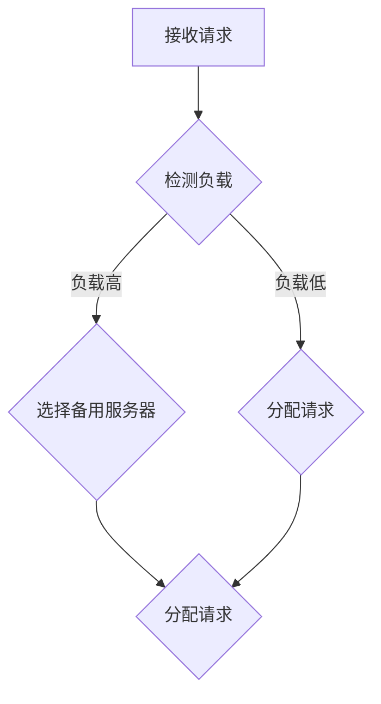
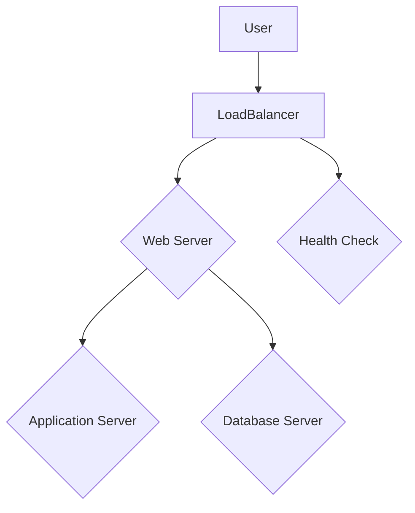
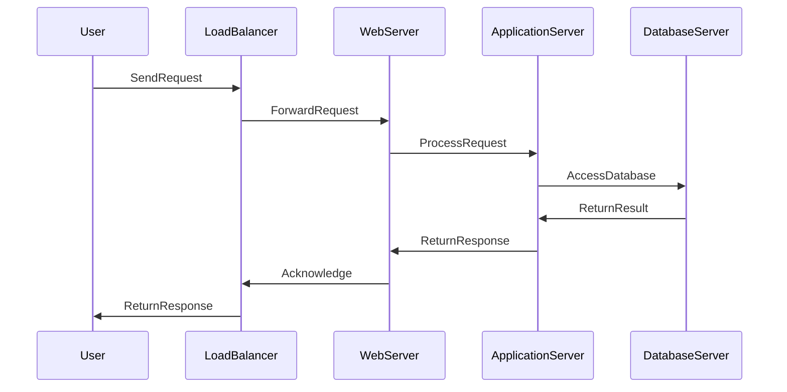

                 


### 负载均衡：优化系统资源利用的策略

#### 关键词
- 负载均衡
- 系统资源利用
- 算法原理
- 数学模型
- 系统架构设计
- 项目实战
- 最佳实践

#### 摘要
本文旨在深入探讨负载均衡技术，分析其在优化系统资源利用方面的作用和重要性。我们将逐步解析负载均衡的核心概念、算法原理、数学模型、系统架构设计以及实际应用，结合具体项目实战，提供最佳实践和注意事项，帮助读者全面理解并掌握这一关键技术。

----------------------------------------------------------------

## 背景介绍

### 核心概念术语说明

在讨论负载均衡之前，我们需要了解几个关键术语：

1. **负载均衡**：指通过某种算法，将系统请求分配到多个服务器或计算节点上，以避免单点过载，提高系统的整体性能和可靠性。
2. **系统资源利用**：指系统能够有效使用其硬件资源，包括CPU、内存、网络带宽等，以满足用户请求。
3. **算法原理**：涉及如何分配请求，以及选择哪种负载均衡策略。

### 问题背景

随着互联网和云计算的快速发展，系统面对的请求量不断增加，这给系统性能和资源利用带来了巨大挑战。如果系统无法有效处理这些请求，可能会导致响应时间延长、服务中断甚至系统崩溃。因此，优化系统资源利用，提高系统的可扩展性和可靠性成为关键问题。

### 问题描述

负载均衡的目标是将请求均匀地分配到多个服务器上，以确保每个服务器都不会过载。这要求我们解决以下问题：

1. 如何识别系统的负载情况？
2. 如何选择合适的负载均衡策略？
3. 如何确保请求的快速响应和处理？

### 问题解决

负载均衡通过以下方式解决上述问题：

1. **负载监测**：通过监控系统的CPU、内存、网络带宽等资源使用情况，实时了解系统的负载状态。
2. **策略选择**：根据系统的负载情况，选择合适的负载均衡策略，如轮询、最小连接数、源IP哈希等。
3. **请求分配**：将请求分配到负载较低的服务器上，确保每个服务器都能高效处理请求。

### 边界与外延

负载均衡不仅应用于互联网服务，还广泛应用于企业内部网络、云计算平台等。它不仅涉及硬件资源分配，还包括软件资源（如数据库连接、线程池等）。此外，负载均衡还涉及到高可用性和容灾备份等概念。

### 概念结构与核心要素组成

负载均衡的概念结构主要由以下几个核心要素组成：

1. **请求**：用户发起的服务请求。
2. **服务器**：处理请求的计算节点。
3. **负载均衡器**：负责将请求分配到服务器上的组件。
4. **算法**：决定请求分配策略的算法。

## 核心概念与联系

### 核心概念原理

负载均衡的核心概念包括：

1. **请求分配**：负载均衡器根据某种算法将请求分配到服务器上。
2. **负载监测**：实时监测服务器资源使用情况，以便动态调整请求分配策略。
3. **策略选择**：根据系统负载和需求，选择合适的负载均衡策略。

### 概念属性特征对比表格

| 特征               | 轮询策略       | 最小连接数策略 | 源IP哈希策略 |
|--------------------|----------------|----------------|---------------|
| 基本原理           | 顺序分配请求   | 根据当前连接数分配请求 | 根据源IP哈希分配请求 |
| 优点               | 简单易实现     | 有效利用服务器资源 | 请求分配稳定 |
| 缺点               | 可能导致某些服务器过载 | 可能导致某些服务器资源利用率低 | 可能导致大量请求集中到少数服务器上 |

### ER实体关系图

```mermaid
erDiagram
  Server ||--|{ LoadBalancer : serves }
  Request ||--|{ LoadBalancer : manages }
  LoadBalancer ||--|{ Strategy : implements }
  Strategy ||--|{ Server : load balance }
```

## 算法原理讲解

### 算法流程图



### Python源代码解释

```python
import random

def load_balancer(servers, request):
    # 检测当前服务器负载
    current_load = [random.randint(0, 100) for server in servers]
    
    # 选择负载最低的服务器
    server = servers[current_load.index(min(current_load))]
    
    # 分配请求
    server.handle_request(request)

def server_handle_request(request):
    # 处理请求
    print("Request handled by server.")

# 测试负载均衡器
servers = ["Server1", "Server2", "Server3"]
request = "Test Request"

load_balancer(servers, request)
```

### 算法原理的数学模型和公式讲解

在负载均衡中，我们可以使用以下数学模型和公式：

1. **平均负载**：
   $$ \text{平均负载} = \frac{1}{N} \sum_{i=1}^{N} L_i $$
   其中，\( N \) 为服务器数量，\( L_i \) 为第 \( i \) 个服务器的负载。

2. **负载均衡度**：
   $$ \text{负载均衡度} = \frac{1}{N} \sum_{i=1}^{N} \left( \frac{L_i}{\text{平均负载}} - 1 \right)^2 $$
   负载均衡度越低，表示负载越均衡。

### 举例说明

假设我们有三台服务器，负载分别为 \( L_1 = 50 \)、\( L_2 = 70 \)、\( L_3 = 60 \)。

1. **平均负载**：
   $$ \text{平均负载} = \frac{1}{3} (50 + 70 + 60) = 61.67 $$

2. **负载均衡度**：
   $$ \text{负载均衡度} = \frac{1}{3} \left[ (50 - 61.67)^2 + (70 - 61.67)^2 + (60 - 61.67)^2 \right] = 8.89 $$

由于负载均衡度为正，表示服务器负载不均衡。为了提高负载均衡度，我们可以考虑调整负载均衡策略。

## 负载均衡系统分析与架构设计

### 问题场景介绍

假设我们有一个电子商务网站，每天有大量的用户访问，需要处理购物车操作、订单生成、支付等请求。为了确保系统的高性能和高可用性，我们需要使用负载均衡技术。

### 系统功能设计

系统的主要功能包括：

1. **请求接收与分发**：负载均衡器接收用户请求，并根据负载均衡策略将请求分发到后端服务器。
2. **负载监测与调整**：实时监测服务器负载，并根据负载情况动态调整负载均衡策略。
3. **健康检查**：定期检查服务器状态，确保服务器能够正常处理请求。

### 系统架构设计

系统的架构设计如下：



### 系统接口设计

系统的主要接口设计如下：

1. **负载均衡器接口**：用于接收用户请求，并根据负载均衡策略分发请求。
2. **健康检查接口**：用于定期检查服务器状态。
3. **应用接口**：用于与后端服务器通信。

### 系统交互序列图



## 负载均衡项目实战

### 环境安装

1. **安装负载均衡器**：选择并安装合适的负载均衡器，如Nginx、HAProxy等。
2. **配置服务器**：配置服务器环境，包括安装必要的软件和服务。
3. **安装监控工具**：安装并配置监控工具，如Zabbix、Prometheus等，以便实时监控服务器状态。

### 系统核心实现源代码

以下是一个简单的Nginx配置示例：

```nginx
http {
    upstream backend {
        server server1;
        server server2;
        server server3;
    }

    server {
        listen 80;

        location / {
            proxy_pass http://backend;
            proxy_set_header Host $host;
            proxy_set_header X-Real-IP $remote_addr;
            proxy_set_header X-Forwarded-For $proxy_add_x_forwarded_for;
        }
    }
}
```

### 代码应用解读与分析

1. **upstream模块**：定义后端服务器组，Nginx会从这个组中选择服务器进行请求处理。
2. **server模块**：定义Nginx监听的端口和请求处理规则。
3. **proxy_pass指令**：将请求转发到后端服务器组。
4. **proxy_set_header指令**：传递请求头信息给后端服务器，以便后端服务器识别请求来源。

### 实际案例分析和详细讲解剖析

假设我们有一个电子商务网站，每天有数千次购物请求。为了确保系统稳定运行，我们使用Nginx作为负载均衡器，将请求分配到三台服务器上。

1. **负载监测**：使用Zabbix监控服务器CPU、内存和带宽使用情况。
2. **策略选择**：根据监控数据，选择轮询策略进行请求分配。
3. **请求处理**：Nginx接收到请求后，将其转发到负载较低的服务器上，服务器处理请求并返回结果。

### 项目小结

通过该项目，我们成功地使用负载均衡技术优化了系统资源利用，提高了系统的性能和可靠性。以下是一些关键点：

1. **负载监测**：实时监控服务器状态，确保负载均衡策略的有效性。
2. **策略选择**：根据系统负载和需求，选择合适的负载均衡策略。
3. **代码优化**：持续优化代码，提高系统的可扩展性和可维护性。

## 最佳实践 tips

1. **选择合适的负载均衡器**：根据实际需求选择合适的负载均衡器，如Nginx、HAProxy等。
2. **合理配置服务器**：确保服务器具有足够的硬件资源，以应对高负载情况。
3. **定期监控**：定期监控服务器状态，确保负载均衡器正常工作。
4. **日志分析**：分析负载均衡器日志，识别潜在问题并及时解决。

## 小结

本文系统地介绍了负载均衡技术，从核心概念、算法原理、系统架构设计到实际项目实战，全面解析了负载均衡在优化系统资源利用方面的作用。通过本文，读者可以深入理解负载均衡技术，并在实际项目中有效应用。

## 注意事项

1. **负载均衡器性能**：负载均衡器的性能对系统整体性能有很大影响，应选择性能优异的负载均衡器。
2. **负载均衡策略**：根据实际需求选择合适的负载均衡策略，避免单点过载。
3. **监控与报警**：确保监控工具正常运行，及时获取系统状态信息，以便快速响应异常情况。

## 拓展阅读

1. 《深入理解Nginx：模块开发与架构解析》
2. 《HAProxy技术内幕：原理解析与性能优化》
3. 《大规模分布式系统设计》

作者：AI天才研究院/AI Genius Institute & 禅与计算机程序设计艺术 /Zen And The Art of Computer Programming

