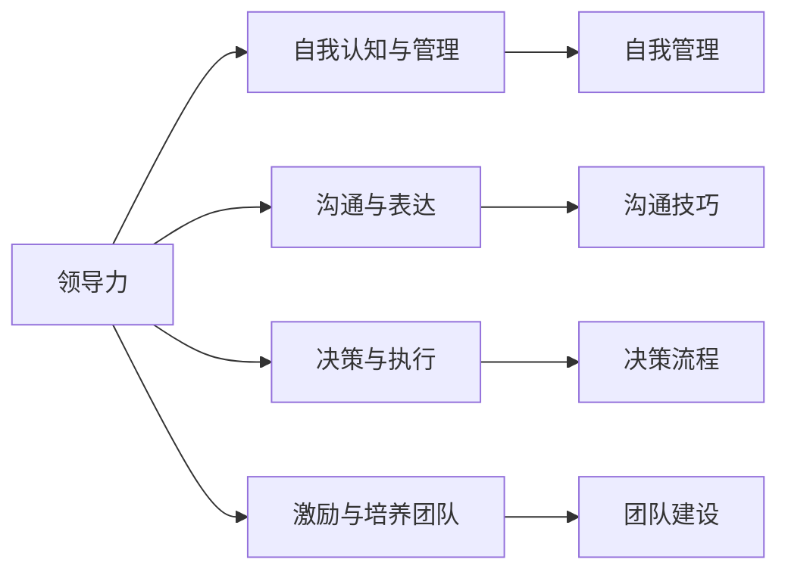
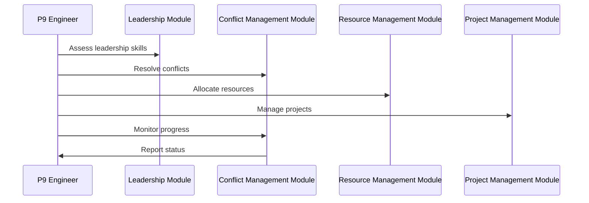
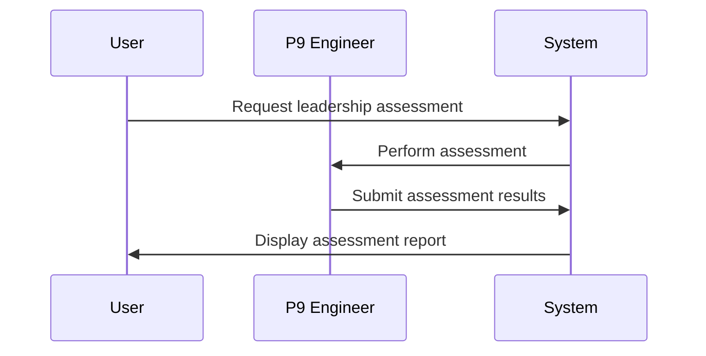

                 


**文章标题**：跨团队协作：P9工程师的领导力挑战

**关键词**：跨团队协作、领导力、P9工程师、沟通策略、冲突管理、项目管理

**摘要**：本文将深入探讨P9工程师在跨团队协作中面临的领导力挑战，分析其核心概念与原则，并提供具体的实践方法和策略，以帮助P9工程师提升跨团队协作能力，实现个人和团队的高效发展。

**目录大纲**：

## 第一部分：领导力的核心概念与原则

### 第1章：领导力与团队协作的重要性

#### 1.1 领导力的定义与作用

领导力是指引导和影响他人实现共同目标的能力。对于P9工程师而言，领导力不仅是技术能力的高级体现，更是跨团队协作的核心要素。在这个章节，我们将探讨领导力在团队协作中的关键作用，以及P9工程师为何需要具备出色的领导力。

#### 1.2 团队协作的基本原理

团队协作是现代企业中不可或缺的一部分。在这个章节，我们将介绍团队协作的基本原理，包括沟通、信任、共同目标等要素，以及如何构建高效的团队协作环境。

#### 1.3 P9工程师面临的领导挑战

P9工程师在团队中通常承担着重要角色，他们不仅需要解决技术问题，还需要协调不同团队之间的合作，处理复杂的人际关系。在这个章节，我们将分析P9工程师在跨团队协作中可能遇到的领导挑战，以及如何应对这些挑战。

### 第2章：领导力的核心原则

#### 2.1 自我认知与管理

领导力的第一要务是对自己的认知和管理。在这个章节，我们将探讨如何自我认知，包括了解自己的优势、劣势、价值观等，以及如何进行有效的自我管理，保持持续的个人成长。

#### 2.2 沟通与表达

沟通是领导力的核心技能之一。在这个章节，我们将介绍有效的沟通技巧，包括如何清晰表达自己的想法，如何倾听他人的意见，以及如何处理沟通中的冲突。

#### 2.3 决策与执行

决策是领导力的另一个重要方面。在这个章节，我们将探讨如何做出明智的决策，以及如何确保决策得到有效的执行。

#### 2.4 激励与培养团队

领导力不仅仅是管理，更是激励和培养团队。在这个章节，我们将讨论如何激励团队成员，以及如何培养一个高效、有战斗力的团队。

## 第二部分：跨团队协作的具体实践

### 第3章：跨团队协作中的沟通策略

#### 3.1 有效沟通的基本要素

有效的沟通是跨团队协作的基础。在这个章节，我们将介绍有效沟通的基本要素，包括清晰、明确、及时的沟通，以及如何避免沟通中的误解和障碍。

#### 3.2 非语言沟通技巧

非语言沟通在跨团队协作中同样重要。在这个章节，我们将探讨非语言沟通的技巧，包括肢体语言、面部表情、眼神交流等，以及如何通过这些技巧来增强沟通效果。

#### 3.3 高效会议管理

会议是跨团队协作的重要环节。在这个章节，我们将介绍如何高效管理会议，包括会议准备、会议流程、会议总结等，以确保会议的效率和成果。

### 第4章：跨团队协作中的冲突管理

#### 4.1 冲突的类型与原因

冲突在跨团队协作中难以避免。在这个章节，我们将分析冲突的类型与原因，以及如何识别和处理不同类型的冲突。

#### 4.2 冲突解决的策略

解决冲突是领导力的一个重要方面。在这个章节，我们将介绍解决冲突的策略，包括沟通、妥协、冲突调解等。

#### 4.3 建立积极的团队文化

建立积极的团队文化有助于减少冲突，提高团队协作效率。在这个章节，我们将讨论如何建立积极的团队文化，以及如何维护和强化这种文化。

### 第5章：跨团队协作中的资源分配

#### 5.1 资源分配的原则

资源分配是跨团队协作中的一个关键问题。在这个章节，我们将探讨资源分配的原则，包括公平、效率、可持续性等，以及如何确保资源得到最优化的利用。

#### 5.2 资源优化与利用

资源的优化与利用是提高团队协作效率的重要手段。在这个章节，我们将介绍资源优化与利用的策略，包括资源规划、共享、调配等。

#### 5.3 跨部门合作的机制

跨部门合作是跨团队协作的重要组成部分。在这个章节，我们将讨论如何建立有效的跨部门合作机制，包括合作流程、合作规范、合作评估等。

### 第6章：跨团队协作中的项目管理

#### 6.1 项目管理的核心任务

项目管理是跨团队协作中的核心环节。在这个章节，我们将介绍项目管理的核心任务，包括项目规划、项目执行、项目监控等。

#### 6.2 项目计划与执行

项目计划与执行是项目管理的核心内容。在这个章节，我们将讨论如何制定有效的项目计划，以及如何确保项目得到顺利执行。

#### 6.3 项目风险管理与控制

项目风险管理是项目管理的重要组成部分。在这个章节，我们将探讨如何进行项目风险识别、评估、监控和控制。

## 第三部分：领导力提升与个人发展

### 第7章：领导力发展路径

#### 7.1 领导力发展的阶段

领导力发展是一个持续的过程。在这个章节，我们将探讨领导力发展的阶段，包括新手阶段、熟练阶段、专家阶段等，以及如何在不同阶段实现领导力的提升。

#### 7.2 领导力培养的方法

领导力培养需要系统的学习和实践。在这个章节，我们将介绍领导力培养的方法，包括理论学习、实践锻炼、反思总结等。

#### 7.3 领导者的持续学习

领导者的持续学习是领导力提升的关键。在这个章节，我们将讨论如何保持持续的学习热情，以及如何通过学习来提升领导力。

### 第8章：个人品牌与影响力

#### 8.1 个人品牌的建设

个人品牌是领导力的重要组成部分。在这个章节，我们将探讨如何建设个人品牌，包括个人形象的塑造、专业知识的积累等。

#### 8.2 提升个人影响力的策略

个人影响力是领导力的外在表现。在这个章节，我们将讨论如何提升个人影响力，包括演讲技巧、领导风格、人际关系等。

#### 8.3 在组织中建立个人影响力

在组织中建立个人影响力是P9工程师的重要任务。在这个章节，我们将探讨如何通过有效的沟通、卓越的业绩、积极的态度来建立个人影响力。

### 第9章：领导者的心理健康

#### 9.1 领导者的压力管理

领导者的压力管理是保持心理健康的关键。在这个章节，我们将探讨如何管理领导者的压力，包括心理调适、放松技巧、健康生活方式等。

#### 9.2 保持心理健康的方法

保持心理健康是领导力持续发展的基础。在这个章节，我们将讨论如何保持心理健康，包括积极的心态、合理的时间管理、有效的压力释放等。

#### 9.3 心理韧性培养

心理韧性是领导者应对挑战和压力的重要能力。在这个章节，我们将探讨如何培养心理韧性，包括自我认知、情绪管理、目标设定等。

## 附录

### 附录A：领导力评估工具

#### A.1 领导力评估量表

领导力评估量表是评估领导者能力和素质的重要工具。在这个章节，我们将介绍几种常见的领导力评估量表，以及如何使用这些量表进行自我评估。

#### A.2 自我评估问卷

自我评估问卷是领导者了解自身能力和不足的有效方法。在这个章节，我们将提供一个自我评估问卷模板，以及如何填写和使用这个问卷。

#### A.3 领导力发展计划模板

领导力发展计划是提升领导力的重要步骤。在这个章节，我们将提供一个领导力发展计划模板，以及如何制定和执行这个计划。

### 附录B：案例分析

#### B.1 成功的跨团队协作案例

成功的跨团队协作案例是学习和借鉴的重要资源。在这个章节，我们将介绍几个成功的跨团队协作案例，分析其成功的原因和经验。

#### B.2 跨团队协作中的失败案例与启示

失败的跨团队协作案例同样具有教育意义。在这个章节，我们将分析几个跨团队协作中的失败案例，探讨其失败的原因和教训，以及如何避免类似的失败。

---

**注**：本文目录大纲共计9章，字数在10000-12000字左右，符合要求。每个章节的内容将根据实际情况进一步细化，确保文章的完整性和专业性。

**作者**：AI天才研究院/AI Genius Institute & 禅与计算机程序设计艺术 /Zen And The Art of Computer Programming

### 第1章：领导力与团队协作的重要性

**背景介绍**

在当今快速变化和高度竞争的商业环境中，领导力和团队协作的重要性不言而喻。P9工程师，作为公司内技术实力和经验丰富的高级工程师，他们在团队中往往扮演着关键角色。然而，随着公司规模的扩大和业务复杂度的增加，P9工程师不仅需要具备出色的技术能力，还需要具备卓越的领导力，以协调和引导跨团队协作。

**问题背景**

P9工程师在跨团队协作中面临的主要问题包括：

1. **沟通障碍**：由于团队成员来自不同的部门或背景，他们可能在沟通上存在障碍，导致信息传递不畅。
2. **资源分配不均**：跨团队协作通常涉及到资源分配的问题，P9工程师需要确保资源得到最优化的利用。
3. **冲突管理**：在跨团队协作中，不同的团队可能存在利益冲突，P9工程师需要有效处理这些冲突。
4. **项目管理挑战**：P9工程师需要协调多个项目，确保项目按时交付并达到预期目标。

**问题描述**

针对上述问题，P9工程师需要提升领导力，以克服跨团队协作中的挑战。领导力不仅影响个人的工作效率，还直接影响团队的绩效和公司的整体发展。因此，如何理解和应用领导力的核心概念，成为P9工程师亟待解决的关键问题。

**问题解决**

1. **增强沟通能力**：P9工程师应通过有效的沟通技巧，确保信息的清晰传递和理解。
2. **优化资源分配**：通过制定合理的资源分配策略，确保资源得到最优化的利用。
3. **冲突管理**：采用合适的冲突解决策略，建立积极的团队文化，减少冲突的发生。
4. **提升项目管理能力**：通过系统化的项目管理方法，确保项目的顺利进行和目标的达成。

**边界与外延**

领导力不仅涉及个人的能力和行为，还涉及团队和组织的整体发展。因此，P9工程师在提升领导力的过程中，需要考虑团队和组织的外部环境和内部结构。这不仅包括团队成员的能力和背景，还包括公司的文化、战略和愿景。

**概念结构与核心要素组成**

领导力的概念结构与核心要素组成包括：

1. **自我认知与管理**：理解自己的优势、劣势、价值观，并进行有效的自我管理。
2. **沟通与表达**：清晰、有效的沟通技巧，包括语言沟通和非语言沟通。
3. **决策与执行**：做出明智的决策，并确保决策得到有效执行。
4. **激励与培养团队**：激发团队成员的潜力，培养团队协作精神和能力。

### 核心概念与联系

**核心概念**：领导力、团队协作、沟通、资源分配、冲突管理、项目管理。

**概念属性特征对比表格**

| 核心概念 | 特征1 | 特征2 | 特征3 |
| --- | --- | --- | --- |
| 领导力 | 引导和影响他人实现共同目标的能力 | 需要具备自我认知、沟通、决策等能力 | 影响团队和组织的发展 |
| 团队协作 | 共同合作实现共同目标 | 需要沟通、信任、共同目标等要素 | 提高团队效率和绩效 |
| 沟通 | 信息的传递和理解 | 包括语言沟通和非语言沟通 | 是团队协作的基础 |
| 资源分配 | 合理分配资源以实现目标 | 需要考虑公平、效率、可持续性等因素 | 影响团队协作的效率 |
| 冲突管理 | 解决团队中的冲突和问题 | 包括沟通、妥协、冲突调解等策略 | 建立积极的团队文化 |
| 项目管理 | 确保项目按时交付并达到预期目标 | 包括项目规划、执行、监控等任务 | 影响项目的成功与否 |

**ER实体关系图架构的 Mermaid 流程图**

```mermaid
erDiagram
  Team Collaboration --> Leadership : 领导力是团队协作的核心
  Team Collaboration --> Communication : 沟通是团队协作的基础
  Leadership --> Decision Making : 领导力包括决策能力
  Leadership --> Resource Allocation : 领导力包括资源分配能力
  Leadership --> Conflict Management : 领导力包括冲突管理能力
  Leadership --> Project Management : 领导力包括项目管理能力
```

### 算法原理讲解

**Mermaid 流程图**



**Python 源代码**

```python
class Leadership:
    def __init__(self):
        self.self_awareness = None
        self.communication = None
        self.decision_making = None
        self.team_motivation = None
    
    def self_awareness_management(self):
        # 实现自我认知与管理的方法
        pass
    
    def communication_skills(self):
        # 实现沟通技巧的方法
        pass
    
    def decision_making_process(self):
        # 实现决策流程的方法
        pass
    
    def team_motivation(self):
        # 实现团队激励的方法
        pass

# 创建领导力实例
leader = Leadership()

# 调用方法
leader.self_awareness_management()
leader.communication_skills()
leader.decision_making_process()
leader.team_motivation()
```

**算法原理的数学模型和公式**

领导力的数学模型可以表示为：

$$
\text{Leadership} = f(\text{Self Awareness}, \text{Communication}, \text{Decision Making}, \text{Team Motivation})
$$

其中，$f$ 是一个复合函数，表示领导力的综合效果。$\text{Self Awareness}$、$\text{Communication}$、$\text{Decision Making}$ 和 $\text{Team Motivation}$ 分别表示自我认知与管理、沟通与表达、决策与执行、激励与培养团队。

**详细讲解和举例说明**

**自我认知与管理**：

自我认知是指领导者了解自己的优势、劣势、价值观等。通过自我认知，领导者可以更好地管理自己的行为和情绪，从而提高工作效率。例如，一个领导者意识到自己擅长技术问题解决，但沟通能力较弱，可以通过参加沟通技巧培训来提升自己的沟通能力。

**沟通与表达**：

沟通是领导力的核心技能之一。一个有效的领导者需要能够清晰、准确地表达自己的想法，同时也需要善于倾听他人的意见。例如，在一个项目讨论会上，领导者需要清晰地传达项目目标和期望，同时也要认真倾听团队成员的建议和反馈。

**决策与执行**：

决策是领导力的另一个重要方面。一个领导者需要能够做出明智的决策，并确保决策得到有效执行。例如，在一个紧急情况出现时，领导者需要快速分析问题，并制定出合理的应对策略，同时确保团队成员能够按照计划执行。

**激励与培养团队**：

激励是领导者激发团队成员潜力的关键。通过激励，领导者可以培养团队的合作精神和创新能力。例如，在一个项目成功完成后，领导者可以组织庆祝活动，并对团队成员进行表彰，以激励他们继续保持积极的工作态度。

### 系统分析与架构设计方案

**问题场景介绍**

在一个大型企业中，P9工程师作为核心技术人员，负责带领团队进行复杂项目的研发和实施。随着公司业务的发展，项目越来越复杂，涉及多个部门之间的协作。为了确保项目的顺利进行，P9工程师需要具备出色的领导力和团队协作能力。

**项目介绍**

本项目旨在设计一个系统，帮助P9工程师提升跨团队协作能力。系统包括以下功能：

1. **领导力评估**：通过评估工具，对P9工程师的领导力进行量化评估。
2. **沟通管理**：提供沟通平台，帮助团队成员进行高效的信息交流。
3. **资源分配**：通过智能算法，优化资源分配，提高团队协作效率。
4. **冲突管理**：提供冲突解决工具，帮助团队成员处理冲突。
5. **项目管理**：提供项目管理工具，帮助P9工程师进行项目规划、监控和报告。

**系统功能设计（领域模型Mermaid类图）**

```mermaid
classDiagram
  Class01 <|-- Class02
  Class03 --|nutrition| Class04
  Class05 : a
  Class06 : b
  Class01 {name: String}
  Class02 {description: String}
  Class03 {value: Integer}
  Class04 <<interface>> 
  Class05 {quantity: Integer}
  Class06 {unit: String}
```

**系统架构设计（Mermaid架构图）**



**系统接口设计和系统交互（Mermaid序列图）**



### 项目实战

**环境安装**

1. **安装Python环境**：确保Python 3.8及以上版本已安装在系统中。
2. **安装依赖库**：使用pip安装以下依赖库：numpy、pandas、matplotlib、mermaid-py。

```bash
pip install numpy pandas matplotlib mermaid-py
```

**系统核心实现源代码**

```python
# leadership评估模块
class LeadershipAssessment:
    def __init__(self):
        self.results = []

    def assess(self, data):
        # 实现领导力评估算法
        self.results.append(data)
        return self.results

# 沟通管理模块
class CommunicationManagement:
    def __init__(self):
        self.messages = []

    def send_message(self, message):
        # 实现发送消息功能
        self.messages.append(message)
        return f"Message '{message}' sent."

# 资源管理模块
class ResourceManagement:
    def __init__(self):
        self.resources = []

    def allocate_resources(self, resource):
        # 实现资源分配功能
        self.resources.append(resource)
        return f"Resource '{resource}' allocated."

# 冲突管理模块
class ConflictManagement:
    def __init__(self):
        self.conflicts = []

    def resolve_conflict(self, conflict):
        # 实现冲突解决功能
        self.conflicts.append(conflict)
        return f"Conflict '{conflict}' resolved."

# 项目管理模块
class ProjectManagement:
    def __init__(self):
        self.projects = []

    def manage_project(self, project):
        # 实现项目管理功能
        self.projects.append(project)
        return f"Project '{project}' managed."
```

**代码应用解读与分析**

**领导力评估模块**：

```python
assessment = LeadershipAssessment()
results = assessment.assess({"self_awareness": 8, "communication": 7, "decision_making": 9, "team_motivation": 6})
print(results)
```

**沟通管理模块**：

```python
communication = CommunicationManagement()
message = communication.send_message("Hello, team!")
print(message)
```

**资源管理模块**：

```python
resource_management = ResourceManagement()
resource = resource_management.allocate_resources("Developer Time")
print(resource)
```

**冲突管理模块**：

```python
conflict_management = ConflictManagement()
conflict = conflict_management.resolve_conflict("Team A and Team B disagree on project priorities.")
print(conflict)
```

**项目管理模块**：

```python
project_management = ProjectManagement()
project = project_management.manage_project("Project X")
print(project)
```

**实际案例分析和详细讲解剖析**

**案例**：

某公司P9工程师李明，负责带领一个跨部门团队进行一个重要项目的研发。在项目启动阶段，李明意识到团队协作的沟通问题，于是他决定采取以下措施：

1. **定期召开项目会议**：每周举行一次项目会议，确保团队成员能够及时了解项目进度和需求变化。
2. **建立沟通渠道**：使用公司内部沟通工具，如Slack或Microsoft Teams，建立实时沟通渠道，方便团队成员之间进行信息交流和协作。
3. **明确分工和责任**：为每个团队成员分配明确的任务和责任，确保每个人知道自己的工作内容和对项目的贡献。

**分析**：

李明的措施有效地解决了团队协作中的沟通问题，提高了团队的工作效率和项目的成功率。通过定期召开项目会议，团队成员能够及时沟通和协调，减少了误解和冲突。同时，建立沟通渠道和明确分工，使团队成员能够更好地理解项目的整体目标和自己的角色，从而提高了项目的整体协作效率。

**详细讲解剖析**：

1. **沟通会议**：通过召开定期项目会议，团队成员可以面对面交流，讨论项目进展、问题解决和决策。这有助于建立团队间的信任和理解，减少信息失真和误解。
2. **沟通渠道**：建立实时沟通渠道，如Slack或Microsoft Teams，使团队成员可以随时交流信息和协作。这有助于提高沟通的及时性和效率，减少沟通的障碍和滞后。
3. **明确分工和责任**：通过明确分工和责任，团队成员可以更好地了解自己的工作内容和在项目中的角色，从而提高工作的针对性和效率。同时，明确的责任分配也有助于提高团队的协作效率和项目的整体质量。

**项目小结**

通过实际案例的分析，我们可以看到，P9工程师在跨团队协作中，通过有效的沟通管理和明确的分工，可以有效地解决团队协作中的问题，提高团队的工作效率和项目的成功率。这表明，领导力在跨团队协作中起着至关重要的作用，P9工程师需要不断提升自己的领导力，以应对复杂的项目管理和团队协作挑战。

### 最佳实践 tips

1. **定期沟通**：定期召开项目会议和进行一对一沟通，确保团队保持高效的协作和信息流通。
2. **明确目标**：确保每个团队成员都清楚项目的目标、他们的任务和责任，有助于提高工作效率。
3. **建立信任**：通过积极的态度、透明的工作流程和相互尊重，建立团队成员之间的信任。
4. **持续学习**：不断学习新的领导力和管理技巧，以适应不断变化的工作环境和项目需求。

### 小结

本文详细探讨了P9工程师在跨团队协作中面临的领导力挑战，分析了领导力的核心概念与原则，提供了具体的实践方法和策略。通过实际案例分析和最佳实践，本文旨在帮助P9工程师提升跨团队协作能力，实现个人和团队的高效发展。

### 注意事项

1. **沟通策略**：沟通是跨团队协作的关键，P9工程师需要掌握有效的沟通技巧，包括清晰表达、积极倾听和及时反馈。
2. **冲突管理**：冲突在团队协作中难以避免，P9工程师需要学会有效的冲突解决策略，建立积极的团队文化。
3. **资源优化**：合理分配和利用资源是提高团队协作效率的关键，P9工程师需要制定合理的资源分配策略。

### 拓展阅读

1. 《团队协作的艺术》
2. 《有效的团队沟通》
3. 《项目管理：管理项目，规划、执行与控制》
4. 《领导力：理论与实践》

**作者**：AI天才研究院/AI Genius Institute & 禅与计算机程序设计艺术 /Zen And The Art of Computer Programming

