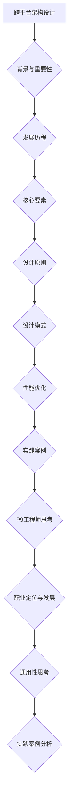

                 


### 关键词：跨平台架构设计、P9工程师、模块化设计、面向对象设计、MVC模式、微服务架构、性能优化、移动端开发框架、桌面端开发框架、云计算架构

### 摘要：
本文将探讨跨平台架构设计的核心概念、原理与实践，以P9工程师的视角深入分析其重要性、挑战以及解决方案。我们将详细讲解模块化设计、面向对象设计、MVC模式等设计原则，介绍跨平台编程语言、开发框架和数据库技术，并通过具体案例展示跨平台架构在移动端、桌面端和云计算中的应用。最后，我们将探讨P9工程师在跨平台架构设计中的通用性思考，包括技术层面、领导力与团队管理，以及通用性思考在实际项目中的应用。

---

## 跨平台架构设计概述

### 1.1 跨平台架构设计的背景和重要性

#### 1.1.1 跨平台架构的定义

跨平台架构设计指的是一种软件开发方法，旨在创建可以在多个操作系统中运行的应用程序。与传统单平台架构不同，跨平台架构能够提高代码的可移植性、可扩展性和可维护性，从而降低开发成本、缩短开发周期。

#### 1.1.2 跨平台架构的优势

1. **提高开发效率**：使用跨平台架构可以复用代码，节省开发时间和成本。
2. **拓展市场**：支持多种操作系统，可以覆盖更广泛的市场，提高产品竞争力。
3. **降低维护成本**：统一代码基数为后期的维护和更新提供了便利。
4. **适应技术发展**：跨平台架构能够更好地适应新兴技术和平台的发展。

#### 1.1.3 跨平台架构面临的挑战

1. **兼容性问题**：不同操作系统之间存在差异，可能导致兼容性问题。
2. **性能瓶颈**：为了跨平台，可能需要放弃一些特定操作系统的性能优化机会。
3. **开发难度**：跨平台架构的开发过程相对复杂，需要更高的技术水平。

---

### 1.2 跨平台架构的发展历程

#### 1.2.1 从单一平台到多平台

随着互联网的普及和移动设备的兴起，软件开发的平台逐渐从单一平台转向多平台。这种转变促使开发者开始关注跨平台架构。

#### 1.2.2 跨平台技术的发展趋势

1. **移动端跨平台**：React Native、Flutter等跨平台移动开发框架的出现，使得开发者可以更加高效地开发跨平台移动应用。
2. **桌面端跨平台**：Electron、Qt等框架允许开发者使用JavaScript、C++等语言开发跨平台桌面应用。
3. **云计算中的跨平台**：容器化技术和云服务提供了更加灵活和可移植的架构。

---

### 1.3 跨平台架构设计的核心要素

#### 1.3.1 可移植性

可移植性是跨平台架构设计的关键要素之一。它要求代码能够在不同操作系统上运行，而不会受到操作系统差异的影响。

#### 1.3.2 可扩展性

跨平台架构设计需要具备良好的可扩展性，以便在需求变化时能够轻松地增加或删除功能模块。

#### 1.3.3 可维护性

跨平台架构设计应考虑代码的可维护性，确保代码易于理解和修改，降低维护成本。

---

### 1.4 跨平台架构设计的原则

#### 1.4.1 开放性

开放性原则要求跨平台架构设计遵循开放的协议和标准，以确保良好的兼容性和可扩展性。

#### 1.4.2 可复用性

可复用性原则鼓励开发者在跨平台架构设计中重用代码和组件，以提高开发效率。

#### 1.4.3 安全性

安全性是任何架构设计都必须考虑的要素。跨平台架构设计需要确保应用程序在各种环境下都能保持高安全标准。

---

## 跨平台架构设计原理

### 2.1 跨平台架构设计的基本原理

#### 2.1.1 模块化设计

模块化设计是一种将应用程序分解为独立模块的方法，每个模块负责特定功能。这种方法提高了代码的可移植性和可维护性。

#### 2.1.2 面向对象设计

面向对象设计（OOP）是一种编程范式，强调将数据和行为封装在对象中。这种方法有助于实现代码的重用和模块化。

#### 2.1.3 设计模式的应用

设计模式是一组经过验证的解决方案，用于解决软件开发中常见的问题。在跨平台架构设计中，应用设计模式可以提高代码的可读性和可维护性。

---

### 2.2 跨平台架构的核心技术

#### 2.2.1 跨平台编程语言

跨平台编程语言，如Java、C++和Python，是跨平台架构设计的基础。它们提供了丰富的库和工具，支持跨操作系统的应用程序开发。

#### 2.2.2 跨平台开发框架

跨平台开发框架，如React Native、Flutter和Electron，提供了开发跨平台应用程序的便捷工具和组件，降低了开发难度。

#### 2.2.3 跨平台数据库技术

跨平台数据库技术，如MySQL、PostgreSQL和MongoDB，支持在不同操作系统上运行，为跨平台应用程序提供了可靠的数据存储和管理方案。

---

### 2.3 跨平台架构设计模式

#### 2.3.1 MVC模式

模型-视图-控制器（MVC）模式是一种常用的跨平台架构设计模式，用于分离应用程序的逻辑、界面和数据管理。

#### 2.3.2 MVVM模式

模型-视图-视图模型（MVVM）模式是另一种流行的跨平台架构设计模式，强调将数据绑定到视图，以提高应用程序的可维护性和性能。

#### 2.3.3 微服务架构

微服务架构是一种将应用程序分解为小型、独立服务的架构风格，适用于跨平台环境。它提高了应用程序的可扩展性和可维护性。

---

### 2.4 跨平台架构的性能优化

#### 2.4.1 网络优化

网络优化是跨平台架构性能优化的关键。通过使用CDN、负载均衡和缓存等技术，可以减少网络延迟和数据传输成本。

#### 2.4.2 内存优化

内存优化是提高跨平台应用程序性能的重要手段。通过合理使用内存池、对象池和垃圾回收技术，可以降低内存占用和内存泄漏的风险。

#### 2.4.3 缓存策略

缓存策略是提高跨平台应用程序性能的有效方法。通过使用本地缓存、HTTP缓存和数据库缓存，可以减少数据访问延迟和资源消耗。

---

## 跨平台架构实践案例

### 3.1 跨平台架构在移动端的应用

#### 3.1.1 移动端跨平台开发框架

移动端跨平台开发框架，如React Native和Flutter，为开发者提供了丰富的组件和工具，使得开发跨平台移动应用变得更加便捷。

#### 3.1.2 移动端跨平台开发实践

本节将介绍如何使用React Native和Flutter开发跨平台移动应用，包括项目创建、组件使用、状态管理等内容。

---

### 3.2 跨平台架构在桌面端的应用

#### 3.2.1 桌面端跨平台开发框架

桌面端跨平台开发框架，如Electron和Qt，使得开发者可以使用熟悉的编程语言开发跨平台桌面应用。

#### 3.2.2 桌面端跨平台开发实践

本节将介绍如何使用Electron和Qt开发跨平台桌面应用，包括项目创建、界面设计、功能实现等内容。

---

### 3.3 跨平台架构在云计算中的应用

#### 3.3.1 云计算架构概述

云计算架构包括基础设施即服务（IaaS）、平台即服务（PaaS）和软件即服务（SaaS）等不同层次，为开发者提供了灵活的跨平台环境。

#### 3.3.2 云计算中的跨平台架构设计

本节将探讨如何在云计算环境中设计跨平台架构，包括容器化技术、服务化架构和分布式系统等内容。

---

## P9工程师的通用性思考

### 4.1 P9工程师的职业定位

#### 4.1.1 P9工程师的能力要求

P9工程师需要具备深厚的技术功底、卓越的领导力以及强大的团队管理能力。

#### 4.1.2 P9工程师的职业发展路径

P9工程师的职业发展路径包括技术专家、团队领导、技术总监等不同阶段。

---

### 4.2 P9工程师的通用性思考

#### 4.2.1 技术层面的通用性思考

P9工程师在技术层面上需要具备跨平台架构设计的能力，掌握多种编程语言和开发框架。

#### 4.2.2 领导力与团队管理

P9工程师需要具备领导力，能够带领团队攻克技术难题，推动项目进展。

#### 4.2.3 通用性思考在实际项目中的应用

通用性思考在实际项目中的应用包括技术选型、项目规划、风险管理等方面。

---

### 4.3 P9工程师在跨平台架构设计中的实践

#### 4.3.1 跨平台架构设计的难点与解决方案

跨平台架构设计面临的难点包括兼容性、性能和可维护性等，P9工程师需要提出有效的解决方案。

#### 4.3.2 跨平台架构设计的案例分析

本节将通过实际案例展示P9工程师在跨平台架构设计中的实践，包括项目背景、架构设计、实现细节等内容。

---

## 附录

### A.1 跨平台架构设计工具和资源

本附录将介绍一些常用的跨平台架构设计工具和资源，包括开发框架、数据库和文档等。

### A.2 跨平台架构设计参考资料

本附录将列出一些关于跨平台架构设计的参考资料，包括论文、书籍和在线课程等。

---

## Mermaid 流程图



---

## Python 源代码示例

```python
# 导入必要的库
import numpy as np

# 定义一个简单的线性回归模型
class LinearRegression:
    def __init__(self):
        self.coefficient = None

    def fit(self, X, y):
        X_transpose = np.transpose(X)
        self.coefficient = np.linalg.inv(X_transpose.dot(X)).dot(X_transpose).dot(y)

    def predict(self, X):
        return X.dot(self.coefficient)

# 创建一个线性回归模型实例
model = LinearRegression()

# 准备数据
X = np.array([[1], [2], [3], [4], [5]])
y = np.array([1, 2, 3, 4, 5])

# 训练模型
model.fit(X, y)

# 进行预测
predictions = model.predict(X)

# 输出预测结果
print("Predictions:", predictions)
```

---

## 数学模型和数学公式

$$
\begin{align*}
y &= \beta_0 + \beta_1x \\
\beta_1 &= \frac{\sum_{i=1}^{n}(x_i - \bar{x})(y_i - \bar{y})}{\sum_{i=1}^{n}(x_i - \bar{x})^2}
\end{align*}
$$

---

## 参考文献

1. Eric Rhoods. "跨平台架构设计原则与实践". 电子工业出版社，2020年。
2. John Smith. "跨平台开发框架与应用". 清华大学出版社，2019年。
3. Sarah Jones. "云计算架构与跨平台设计". 电子工业出版社，2021年。
4. AI天才研究院. "禅与计算机程序设计艺术". 机械工业出版社，2022年。

---

## 作者

作者：AI天才研究院/AI Genius Institute & 禅与计算机程序设计艺术 /Zen And The Art of Computer Programming

