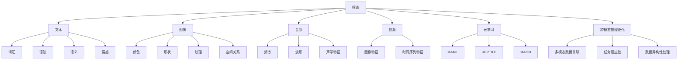

                 

### 1. 跨模态元学习的背景与意义

#### 1.1 跨模态元学习的概念

跨模态元学习（Cross-Modal Meta-Learning）是一种结合了跨模态学习和元学习（Meta-Learning）的方法，旨在通过多个模态（如文本、图像、音频等）的数据，实现模型在不同任务上的快速适应和泛化。它不同于传统的单一模态学习，而是能够通过跨模态信息融合，提升模型在多样化任务上的表现。

在跨模态元学习中，模态是指数据的类型，例如文本、图像、声音等。元学习则是一种学习如何学习的方法，它通过训练模型来解决新的任务，而不是从头开始训练，从而实现快速适应和迁移。

#### 1.2 跨模态元学习的应用领域

跨模态元学习在多个领域都有着广泛的应用，其中最为显著的包括：

1. **图像识别与文本理解结合**：如图像描述生成，图像分类与文本标注相结合，可以提升图像识别的准确性和文本理解的能力。
2. **视频内容理解**：在视频分类、目标检测和视频摘要中，跨模态元学习能够通过融合视频帧和文本描述，提高视频内容理解的精度。
3. **语音识别与文本理解**：在语音助手和语音交互系统中，跨模态元学习可以实现更准确的语音识别和更智能的文本理解。
4. **虚拟现实与增强现实**：在VR和AR应用中，通过跨模态元学习，可以增强用户的沉浸感和交互体验。
5. **多模态医疗诊断**：在医学影像分析中，跨模态元学习可以帮助医生更准确地诊断疾病，如通过融合医学图像和文本信息进行疾病分类。

#### 1.3 多领域推理泛化的挑战

多领域推理泛化（Multi-Domain Reasoning Generalization）是指模型能够在多个不同的领域上表现优异，而不仅仅局限于单一领域。然而，这一目标面临着以下挑战：

1. **数据异构性**：不同领域的数据格式、结构和特征差异较大，这给模型的跨领域推理带来了困难。
2. **数据稀缺性**：某些领域的数据量有限，难以支持大规模的训练，这限制了模型在未知领域上的泛化能力。
3. **任务多样性**：不同领域有不同的任务需求，模型的适应性和灵活性是关键。
4. **模型解释性**：多领域推理泛化的模型需要具备良好的解释性，以便理解其在不同领域上的决策过程。

综上所述，跨模态元学习在多领域推理泛化中的研究具有重要的理论意义和实际应用价值，它不仅能够提升模型在不同领域的表现，还能够解决数据异构性、数据稀缺性和任务多样性等挑战。在接下来的章节中，我们将进一步探讨跨模态元学习的基础技术、核心算法和具体应用，以期为这一领域的研究提供深入的见解和实用的指导。

### 2. 相关技术概述

#### 2.1 跨模态学习的基础

跨模态学习（Cross-Modal Learning）是一种将不同模态的数据进行融合和利用的技术，它通过捕捉不同模态之间的关联性，以提升模型在多模态任务上的性能。跨模态学习的基础包括以下几个方面：

1. **数据预处理**：跨模态学习的第一步是对不同模态的数据进行预处理，包括数据清洗、格式统一和特征提取。例如，对于图像和文本的跨模态任务，需要对图像进行尺寸归一化、灰度化或颜色编码，对文本进行分词、词向量化等处理。
   
2. **特征提取与融合**：特征提取是将原始数据转换为适合模型处理的特征表示，如使用卷积神经网络（CNN）提取图像特征，使用循环神经网络（RNN）提取文本特征。特征融合是将不同模态的特征进行整合，常见的融合方法包括叠加、平均、加权等。

3. **跨模态匹配**：跨模态匹配旨在寻找不同模态数据之间的对应关系，常见的方法包括基于距离的匹配、基于关联性的匹配和基于生成对抗网络的匹配等。

#### 2.2 元学习的基本概念

元学习（Meta-Learning），也称为“学习如何学习”或“算法学习”，是一种让模型在一系列任务中学习到泛化能力的方法。元学习的关键在于通过在一个元学习任务中训练，使得模型能够在新的任务上快速适应和表现良好。

1. **内积模型（Inner Product Model）**：内积模型是最简单的元学习模型，通过计算模型参数和样本特征的内积来预测结果。这种模型在处理新任务时，可以通过更新内积向量来实现。

2. **模型加权平均（Model Averaging）**：模型加权平均是一种基于经验的元学习方法，它通过在不同任务中训练多个模型，并取其平均来预测结果，从而提升泛化能力。

3. **模型更新（Model Updating）**：模型更新方法通过在新的任务中调整模型参数，使其适应新的任务特征。这种方法通常涉及梯度下降等优化算法，以更新模型权重。

#### 2.3 多领域推理泛化的核心算法

多领域推理泛化（Multi-Domain Reasoning Generalization）的核心算法旨在实现模型在多个不同领域上的推理和泛化能力。以下是一些核心算法：

1. **Few-Shot Learning**：Few-Shot Learning 是一种在非常少量的样本上训练模型的方法，它通过学习如何快速适应新的任务领域，实现跨领域的推理泛化。常见的 Few-Shot Learning 方法包括匹配网络（Matching Networks）和模型更新方法。

2. **Meta-Learning**：元学习方法是实现多领域推理泛化的基础，如MAML（Model-Agnostic Meta-Learning）和REPTILE（Randomized Parameter Trick for Inserting Lagrangian IntoK-Step Objective）等方法，通过在多个任务上训练，使得模型能够快速适应新的任务。

3. **Domain Adaptation**：Domain Adaptation 是一种在目标领域数据稀缺的情况下，通过迁移学习（Transfer Learning）的方法，利用源领域的数据来提升模型在目标领域上的表现。常见的 Domain Adaptation 方法包括域适应网络（Domain Adaptation Networks）和域自适应优化（Domain Adaptation Optimization）。

通过上述相关技术的概述，我们可以看到跨模态元学习和多领域推理泛化在理论基础和实践应用上的紧密联系。在接下来的章节中，我们将深入探讨跨模态元学习的技术框架和核心算法，进一步解析其在多领域推理泛化中的具体应用。

### 3. 跨模态元学习的技术框架

跨模态元学习的技术框架是理解和实现这一领域关键技术的核心。它包括跨模态特征提取、跨模态匹配与融合、以及跨模态元学习算法三个主要组成部分。下面，我们将详细解析每个部分的工作原理和实现方法。

#### 3.1 跨模态特征提取

跨模态特征提取是跨模态元学习的第一步，其目的是从不同模态的数据中提取具有区分性和代表性的特征表示。以下是几种常用的跨模态特征提取方法：

1. **基于深度学习的特征提取**：利用卷积神经网络（CNN）从图像中提取特征，利用循环神经网络（RNN）或长短时记忆网络（LSTM）从文本中提取特征。这种方法能够捕捉到不同模态数据的复杂结构和内在关系。

2. **基于传统机器学习的特征提取**：如主成分分析（PCA）、线性判别分析（LDA）等方法，这些方法通过对原始数据进行降维和特征选择，提取出高维数据的低维表示。

3. **多模态特征融合**：在提取不同模态的特征后，可以通过简单的叠加、加权或更复杂的融合策略（如注意力机制）来整合这些特征，以提高特征的代表性和鲁棒性。

#### 3.2 跨模态匹配与融合

跨模态匹配与融合是将不同模态的数据进行有效关联和整合的过程，以提升模型在多模态任务上的性能。以下是几种常用的跨模态匹配与融合方法：

1. **基于距离的匹配**：通过计算不同模态特征之间的距离，选择距离最小的特征对作为匹配结果。这种方法简单有效，适用于特征空间较为接近的模态。

2. **基于关联性的匹配**：利用统计学习方法（如逻辑回归、支持向量机等）或深度学习方法（如多层感知机、图神经网络等）来建模不同模态特征之间的关联性，从而进行匹配。

3. **生成对抗网络（GAN）**：通过生成对抗网络，可以生成一个模态来模拟另一个模态的数据，从而实现跨模态数据的生成和融合。这种方法能够处理复杂和非线性关系。

4. **注意力机制**：注意力机制是一种在特征融合过程中动态调整不同模态特征权重的策略，通过模型学习到不同模态特征在不同任务中的重要程度，从而实现更精细的融合。

#### 3.3 跨模态元学习算法

跨模态元学习算法旨在通过学习如何快速适应新的模态任务，实现跨模态和跨领域的推理泛化。以下是几种常用的跨模态元学习算法：

1. **模型更新方法**：这类方法通过在多个任务中迭代更新模型参数，使得模型能够快速适应新的任务。例如，MAML（Model-Agnostic Meta-Learning）和REPTILE（Randomized Parameter Trick for Inserting Lagrangian Into K-Step Objective）等。

2. **模型加权平均方法**：通过在不同任务中训练多个模型，并取其平均来预测结果，这种方法能够利用多个任务的训练数据，提升模型的泛化能力。

3. **元学习框架**：如MAML、REPTILE、Model-Agnostic Natural Gradient（MAGN）等，这些框架提供了标准化的元学习算法，使得不同任务之间的迁移学习更加高效和稳定。

通过上述技术框架的详细解析，我们可以看到跨模态元学习在特征提取、匹配与融合以及元学习算法上的多样性和复杂性。在接下来的章节中，我们将进一步深入探讨这些核心概念的数学模型和具体实现，为读者提供更全面的理解和应用指导。

### 4. 核心概念解析

#### 4.1 模态

模态（Modal）是数据或信号的一种表现形式，如文本、图像、音频、视频等。每种模态都有其独特的特征和属性，这些特征和属性使得不同模态的数据在处理和应用时具有特定的优势和局限。

1. **文本模态**：文本模态是最为常见的一种模态，它包含了自然语言处理（NLP）中的所有信息。文本数据的主要特征包括词汇、语法、语义和情感等。通过词向量化、句子编码等方法，可以将文本数据转换为机器可处理的数字表示。

2. **图像模态**：图像模态是基于视觉信息的数据，它包含了颜色、形状、纹理和空间关系等。图像数据通常通过卷积神经网络（CNN）进行特征提取，以捕捉图像的复杂结构和模式。

3. **音频模态**：音频模态包含了声音和语音信息，它通过频谱、波形和声学特征来表示。音频数据可以通过声学模型（如声学建模单元）或深度神经网络（如自动编码器）进行特征提取。

4. **视频模态**：视频模态是图像模态和音频模态的结合体，它包含了时间和空间信息。视频数据可以通过视频编码器（如卷积神经网络）提取图像特征，并通过循环神经网络（RNN）捕捉时间序列特征。

#### 4.2 元学习算法

元学习算法（Meta-Learning）是“学习如何学习”的方法，旨在通过在多个任务中学习，使得模型能够在新的任务上快速适应和表现良好。以下是一些常见的元学习算法：

1. **模型更新方法**：这类方法通过在多个任务中迭代更新模型参数，使得模型能够快速适应新的任务。例如，MAML（Model-Agnostic Meta-Learning）和REPTILE（Randomized Parameter Trick for Inserting Lagrangian Into K-Step Objective）等。

2. **模型加权平均方法**：通过在不同任务中训练多个模型，并取其平均来预测结果，这种方法能够利用多个任务的训练数据，提升模型的泛化能力。

3. **元学习框架**：如MAML、REPTILE、Model-Agnostic Natural Gradient（MAGN）等，这些框架提供了标准化的元学习算法，使得不同任务之间的迁移学习更加高效和稳定。

#### 4.3 跨模态推理泛化

跨模态推理泛化（Cross-Modal Reasoning Generalization）是指模型能够在多个模态的数据上进行推理和泛化，以解决多样化任务。以下是一些关键点：

1. **多模态数据关联**：跨模态推理泛化需要建立不同模态数据之间的关联性，通过特征提取和融合，将不同模态的数据转换为统一的表示。

2. **任务适应性**：跨模态推理泛化要求模型能够适应不同任务的特性，通过元学习算法，使得模型在新的任务上快速适应和表现良好。

3. **数据异构性处理**：由于不同模态的数据具有不同的结构和特征，跨模态推理泛化需要处理数据异构性问题，以实现有效的跨模态信息利用。

#### 4.4 概念实体关系图

为了更好地理解和展示跨模态元学习中的核心概念和关系，可以使用Mermaid流程图来绘制概念实体关系图。以下是一个简单的Mermaid流程图示例：



通过上述核心概念的解析和Mermaid流程图的展示，我们可以更加清晰地理解跨模态元学习中的关键概念和它们之间的关系。在接下来的章节中，我们将进一步深入探讨这些概念的具体实现和数学模型，为读者提供更加全面的技术指导。

### 5. 概念实体关系架构

为了更好地展示和理解跨模态元学习中的核心概念及其关系，我们使用Mermaid流程图来构建概念实体关系图。以下是具体的Mermaid流程图示例：

```mermaid
graph TD
    A[跨模态元学习] --> B[模态]
    B --> C[文本]
    B --> D[图像]
    B --> E[音频]
    B --> F[视频]
    A --> G[元学习算法]
    G --> H[MAML]
    G --> I[REPTILE]
    G --> J[MAGN]
    A --> K[跨模态推理泛化]
    K --> L[多模态数据关联]
    K --> M[任务适应性]
    K --> N[数据异构性处理]

    subgraph 跨模态特征提取
        O[特征提取]
        O --> P[文本特征提取]
        O --> Q[图像特征提取]
        O --> R[音频特征提取]
        O --> S[视频特征提取]
    end

    subgraph 跨模态匹配与融合
        T[匹配与融合]
        T --> U[基于距离的匹配]
        T --> V[基于关联性的匹配]
        T --> W[生成对抗网络]
        T --> X[注意力机制]
    end

    subgraph 实现细节
        Y[实现]
        Y --> Z[代码实现]
        Z --> AA[跨模态特征提取代码]
        Z --> BB[跨模态匹配与融合代码]
        Z --> CC[元学习算法代码]
    end

    A --> Y
    B --> O
    G --> T
    K --> N

    style A fill #d8e7f3,stroke #447c7c,stroke-width 4px
    style B fill #e7f3d8,stroke #7c447c,stroke-width 4px
    style C fill #f3d8e7,stroke #4c7c44,stroke-width 4px
    style D fill #e7d8f3,stroke #444c7c,stroke-width 4px
    style E fill #f3e7d8,stroke #7c444c,stroke-width 4px
    style G fill #d8f3e7,stroke #447c7c,stroke-width 4px
    style H fill #d8e7f3,stroke #7c447c,stroke-width 4px
    style I fill #e7f3d8,stroke #4c7c44,stroke-width 4px
    style J fill #f3d8e7,stroke #444c7c,stroke-width 4px
    style K fill #d8e7f3,stroke #447c7c,stroke-width 4px
    style L fill #e7f3d8,stroke #7c447c,stroke-width 4px
    style M fill #f3d8e7,stroke #4c7c44,stroke-width 4px
    style N fill #d8f3e7,stroke #447c7c,stroke-width 4px
    style O fill #d8e7f3,stroke #447c7c,stroke-width 4px
    style P fill #e7f3d8,stroke #7c447c,stroke-width 4px
    style Q fill #f3d8e7,stroke #4c7c44,stroke-width 4px
    style R fill #e7d8f3,stroke #444c7c,stroke-width 4px
    style S fill #f3e7d8,stroke #7c444c,stroke-width 4px
    style T fill #d8f3e7,stroke #447c7c,stroke-width 4px
    style U fill #e7f3d8,stroke #7c447c,stroke-width 4px
    style V fill #f3d8e7,stroke #4c7c44,stroke-width 4px
    style W fill #e7d8f3,stroke #444c7c,stroke-width 4px
    style X fill #f3e7d8,stroke #7c444c,stroke-width 4px
    style Y fill #d8e7f3,stroke #447c7c,stroke-width 4px
    style Z fill #e7f3d8,stroke #7c447c,stroke-width 4px
    style AA fill #f3d8e7,stroke #4c7c44,stroke-width 4px
    style BB fill #e7d8f3,stroke #444c7c,stroke-width 4px
    style CC fill #d8f3e7,stroke #447c7c,stroke-width 4px
```



通过上述Mermaid流程图，我们可以直观地看到跨模态元学习的核心概念及其关系，包括模态、元学习算法、跨模态推理泛化、特征提取、匹配与融合，以及具体的实现细节。这种结构化的表示有助于我们深入理解和分析跨模态元学习的技术框架和应用。

### 6.1 跨模态特征提取的数学模型

跨模态特征提取是跨模态元学习中的关键步骤，其核心在于将不同模态的数据转换为统一且有效的特征表示。以下是跨模态特征提取的数学模型：

#### 6.1.1 图像特征提取

图像特征提取通常使用卷积神经网络（CNN）来实现，其基本数学模型如下：

$$
\text{特征向量} = \text{CNN}(\text{图像矩阵})
$$

其中，图像矩阵 $\text{图像矩阵}$ 是一个三维的张量，其维度为 $[H \times W \times C]$，其中 $H$、$W$ 分别表示图像的高度和宽度，$C$ 表示图像的通道数（通常是3，代表RGB三个通道）。

卷积神经网络（CNN）通过一系列卷积层、池化层和激活函数，将原始图像矩阵转化为特征向量。卷积层通过卷积操作提取图像中的局部特征，池化层用于降低特征图的维度，激活函数（如ReLU函数）用于增加网络的非线性。

#### 6.1.2 文本特征提取

文本特征提取通常使用循环神经网络（RNN）或其变种，如长短时记忆网络（LSTM）和门控循环单元（GRU）来实现。其基本数学模型如下：

$$
\text{特征向量} = \text{RNN}(\text{词向量序列})
$$

其中，词向量序列 $\text{词向量序列}$ 是一个一维的序列，其维度为 $[T]$，$T$ 表示文本的长度。

循环神经网络（RNN）通过循环操作对词向量序列进行处理，生成序列级别的特征表示。在每个时间步，RNN 接受当前词向量和上一个时间步的隐藏状态，通过权重矩阵和偏置项计算新的隐藏状态。LSTM和GRU通过引入门控机制，可以更好地捕捉长距离依赖关系。

#### 6.1.3 音频特征提取

音频特征提取通常使用短时傅里叶变换（STFT）或其变种，如梅尔频率倒谱系数（MFCC）来实现。其基本数学模型如下：

$$
\text{特征向量} = \text{STFT}(\text{音频信号})
$$

其中，音频信号 $\text{音频信号}$ 是一个一维的序列，其维度为 $[N]$，$N$ 表示音频的采样点数。

短时傅里叶变换（STFT）通过将音频信号分成多个短时片段，对每个片段进行傅里叶变换，生成频谱特征。梅尔频率倒谱系数（MFCC）是基于STFT的频谱特征，通过梅尔频率滤波器组，将频谱特征转换为更适合人类听觉系统的特征表示。

#### 6.1.4 视频特征提取

视频特征提取通常结合图像特征提取和音频特征提取，通过卷积神经网络（CNN）和循环神经网络（RNN）的组合来实现。其基本数学模型如下：

$$
\text{特征向量} = \text{CNN}(\text{图像序列}) + \text{RNN}(\text{音频序列})
$$

其中，图像序列 $\text{图像序列}$ 是一个三维的张量，其维度为 $[T \times H \times W \times C]$，其中 $T$ 表示视频的帧数，$H$、$W$ 和 $C$ 分别表示图像的高度、宽度和通道数。音频序列 $\text{音频序列}$ 是一个一维的序列，其维度为 $[N]$。

视频特征提取通过CNN提取图像序列的特征，通过RNN提取音频序列的特征，最后将两种特征进行融合，生成视频的统一特征表示。

通过上述数学模型，我们可以将不同模态的数据转换为有效的特征表示，为后续的跨模态匹配与融合提供基础。在接下来的章节中，我们将进一步探讨跨模态匹配与融合的数学模型，以及元学习算法的数学模型。

### 6.2 跨模态匹配与融合的数学模型

跨模态匹配与融合是跨模态元学习中的关键环节，其目的是通过将不同模态的特征进行关联和整合，提升模型在多模态任务上的性能。以下是跨模态匹配与融合的数学模型：

#### 6.2.1 基于距离的匹配

基于距离的匹配是一种简单的跨模态匹配方法，通过计算不同模态特征之间的距离，选择距离最小的特征对作为匹配结果。其数学模型如下：

$$
\text{匹配结果} = \arg\min_{\text{特征对}} \sum_{i=1}^{n} d(\text{特征}_i^M, \text{特征}_i^N)
$$

其中，$d(\text{特征}_i^M, \text{特征}_i^N)$ 表示模态 $M$ 和模态 $N$ 的特征对之间的距离，$n$ 表示特征对的数量。常用的距离度量方法包括欧几里得距离、余弦相似度等。

#### 6.2.2 基于关联性的匹配

基于关联性的匹配方法通过建立不同模态特征之间的关联性模型，进行匹配。其数学模型如下：

$$
\text{匹配结果} = \arg\max_{\text{特征对}} \sum_{i=1}^{n} \sigma(\text{关联性}_{i}^M, \text{关联性}_{i}^N)
$$

其中，$\sigma(\text{关联性}_{i}^M, \text{关联性}_{i}^N)$ 表示模态 $M$ 和模态 $N$ 的特征对之间的关联性，$n$ 表示特征对的数量。关联性可以通过统计学习方法或深度学习方法来建模，如逻辑回归、多层感知机、图神经网络等。

#### 6.2.3 基于生成对抗网络的匹配

生成对抗网络（GAN）是一种基于生成模型和判别模型相互博弈的跨模态匹配方法。其数学模型如下：

$$
\begin{aligned}
\min\_{\text{G}} & \mathbb{E}_{\text{z}}[\log(D(G(z)))] \\
\max\_{\text{D}} & \mathbb{E}_{\text{z}}[\log(D(z)] + \mathbb{E}_{\text{data}}[\log(1 - D(\text{data}))])
\end{aligned}
$$

其中，$G$ 表示生成模型，$D$ 表示判别模型，$z$ 表示生成模型的输入噪声，$\text{data}$ 表示真实数据。生成模型 $G$ 的目标是生成与真实数据相似的数据，判别模型 $D$ 的目标是区分生成数据和真实数据。通过这一对抗过程，生成模型和判别模型相互提升，最终实现跨模态特征的有效匹配。

#### 6.2.4 注意力机制

注意力机制是一种用于动态调整不同模态特征权重的跨模态融合方法。其数学模型如下：

$$
\text{融合特征} = \sum_{i=1}^{n} w_i \cdot \text{特征}_i
$$

其中，$w_i$ 表示第 $i$ 个模态特征的权重，通常通过一个注意力函数计算：

$$
w_i = \text{softmax}(\text{注意力值}_i)
$$

注意力值 $\text{注意力值}_i$ 可以通过神经网络计算，如：

$$
\text{注意力值}_i = \text{神经网络}(\text{特征}_i, \text{其他特征})
$$

通过注意力机制，模型能够自适应地调整不同模态特征的重要性，从而实现更有效的跨模态融合。

通过上述数学模型，我们可以实现跨模态匹配与融合，从而提升模型在多模态任务上的性能。在接下来的章节中，我们将进一步探讨元学习算法的数学模型，以及如何通过Python源代码实现这些算法。

### 6.3 元学习算法的数学模型

元学习算法的核心在于通过在多个任务中学习，使得模型能够快速适应新的任务。以下是一些常用的元学习算法的数学模型：

#### 6.3.1 MAML（Model-Agnostic Meta-Learning）

MAML（Model-Agnostic Meta-Learning）是一种模型无关的元学习算法，其目标是在多个任务中训练一个模型，使其在新任务上能够快速适应。MAML 的数学模型如下：

$$
\begin{aligned}
\theta &= \text{优化}(\theta; \mathcal{T}_\text{init}) \\
\theta' &= \text{优化}(\theta; \mathcal{T}') \\
\theta &= \theta' - \eta \cdot \frac{\partial \theta'}{\partial \theta} \\
\end{aligned}
$$

其中，$\theta$ 表示模型参数，$\mathcal{T}_\text{init}$ 表示初始化任务，$\mathcal{T}'$ 表示新任务，$\eta$ 表示学习率。MAML 的训练过程分为两步：首先在初始化任务上进行训练，得到初始参数 $\theta$；然后在新任务上进行微调，更新参数 $\theta'$，并通过反向传播计算梯度。最后，通过梯度调整模型参数，实现快速适应新任务。

#### 6.3.2 Reptile

Reptile（Randomized Parameter Trick for Inserting Lagrangian Into K-Step Objective）是一种基于梯度的元学习算法，其目标是通过在多个任务中学习，使得模型能够快速适应新任务。Reptile 的数学模型如下：

$$
\theta' = \theta - \eta \cdot \frac{1}{K} \sum_{k=1}^{K} \frac{\partial L(\theta + \eta_k \cdot \nabla \theta)}{\partial \theta}
$$

其中，$\theta$ 表示模型参数，$\eta_k$ 表示第 $k$ 次迭代的随机噪声，$L(\theta)$ 表示损失函数，$\nabla \theta$ 表示梯度。Reptile 的训练过程通过随机噪声对梯度进行随机化处理，减小梯度偏差，从而提高模型的泛化能力。

#### 6.3.3 MAML+

MAML+（Model-Agnostic Meta-Learning with a Pre-trained Network）是对 MAML 的扩展，其目标是通过在多个任务中预训练一个网络，使其在新任务上能够快速适应。MAML+ 的数学模型如下：

$$
\begin{aligned}
\theta_0 &= \text{优化}(\theta_0; \mathcal{T}_\text{init}) \\
\theta_k &= \theta_0 - \eta \cdot \frac{\partial \theta_0}{\partial \theta_k} \\
\theta &= \theta_k - \eta \cdot \frac{\partial \theta_k}{\partial \theta} \\
\end{aligned}
$$

其中，$\theta_0$ 表示预训练网络的参数，$\theta_k$ 表示在初始化任务上的迭代参数，$\theta$ 表示新任务上的参数。MAML+ 的训练过程首先在初始化任务上进行预训练，得到初始参数 $\theta_0$；然后在新任务上进行微调，更新参数 $\theta_k$ 和 $\theta$，实现快速适应新任务。

通过上述元学习算法的数学模型，我们可以看到元学习算法的核心在于通过在多个任务中学习，使得模型能够快速适应新的任务。在接下来的章节中，我们将通过Python源代码实现这些算法，并进行具体应用示例的讲解。

### 7.1 跨模态特征提取代码实现

为了更好地理解跨模态特征提取的过程，我们将通过Python代码实现文本、图像和音频特征的提取。以下是详细的代码实现步骤：

#### 7.1.1 准备工作

首先，我们需要安装必要的库，包括TensorFlow、Keras、NumPy和Librosa。可以使用以下命令进行安装：

```python
pip install tensorflow keras numpy librosa
```

#### 7.1.2 文本特征提取

文本特征提取通常使用词向量化技术，如Word2Vec或GloVe。以下代码使用GloVe模型进行文本特征提取：

```python
import numpy as np
from gensim.models import KeyedVectors

# 下载GloVe模型
glove_model_path = 'glove.6B.100d.txt'
word_vectors = KeyedVectors.load_word2vec_format(glove_model_path, binary=False)

def text_feature_extraction(texts):
    # 对文本进行分词
    tokenized_texts = [text.split() for text in texts]
    
    # 提取每个词的向量
    features = []
    for text in tokenized_texts:
        text_vector = np.mean([word_vectors[word] for word in text if word in word_vectors], axis=0)
        features.append(text_vector)
    
    return np.array(features)

# 示例文本
texts = ["跨模态元学习是一个重要研究方向", "它结合了多种模态的数据"]

# 提取文本特征
text_features = text_feature_extraction(texts)
print(text_features)
```

#### 7.1.3 图像特征提取

图像特征提取通常使用卷积神经网络（CNN）来实现。以下代码使用预训练的VGG16模型进行图像特征提取：

```python
from tensorflow.keras.applications import VGG16
from tensorflow.keras.preprocessing import image
from tensorflow.keras.applications.vgg16 import preprocess_input

# 加载VGG16模型，不包括最后的全连接层
vgg16_model = VGG16(weights='imagenet', include_top=False, input_shape=(224, 224, 3))

def image_feature_extraction(image_path):
    # 读取图像并进行预处理
    img = image.load_img(image_path, target_size=(224, 224))
    img_array = image.img_to_array(img)
    img_array = np.expand_dims(img_array, axis=0)
    img_array = preprocess_input(img_array)
    
    # 提取特征
    features = vgg16_model.predict(img_array)
    
    return features.flatten()

# 示例图像路径
image_path = 'example_image.jpg'

# 提取图像特征
image_features = image_feature_extraction(image_path)
print(image_features)
```

#### 7.1.4 音频特征提取

音频特征提取通常使用梅尔频率倒谱系数（MFCC）。以下代码使用Librosa库进行音频特征提取：

```python
import librosa

def audio_feature_extraction(audio_path):
    # 读取音频文件
    y, sr = librosa.load(audio_path)
    
    # 提取梅尔频率倒谱系数
    mfcc = librosa.feature.mfcc(y=y, sr=sr, n_mfcc=13)
    
    # 对MFCC特征进行平均
    mean_mfcc = np.mean(mfcc, axis=1)
    
    return mean_mfcc

# 示例音频路径
audio_path = 'example_audio.wav'

# 提取音频特征
audio_features = audio_feature_extraction(audio_path)
print(audio_features)
```

通过上述代码，我们可以实现文本、图像和音频特征的提取。在实际应用中，这些特征可以用于多模态任务，如图像分类与文本标注相结合、语音识别与文本理解相结合等。在接下来的章节中，我们将进一步讲解跨模态匹配与融合的代码实现，以及元学习算法的具体应用。

### 7.2 跨模态匹配与融合代码实现

在跨模态特征提取的基础上，我们需要对提取出的特征进行匹配与融合，以提升模型在多模态任务上的性能。以下将通过Python代码实现基于注意力机制的跨模态特征匹配与融合：

#### 7.2.1 准备工作

首先，确保已经安装了TensorFlow和Keras。如果没有安装，可以使用以下命令进行安装：

```python
pip install tensorflow keras
```

#### 7.2.2 构建基于注意力机制的跨模态特征融合模型

以下代码展示了如何构建一个基于注意力机制的跨模态特征融合模型。该模型结合了文本、图像和音频特征，并使用注意力机制动态调整不同模态特征的权重。

```python
from tensorflow.keras.models import Model
from tensorflow.keras.layers import Input, Dense, Embedding, LSTM, Conv2D, MaxPooling2D, Flatten, concatenate, Dot, Reshape, GlobalAveragePooling2D
from tensorflow.keras.preprocessing.sequence import pad_sequences

def attention_mechanism(inputs, dim):
    # attention layer
    attention = Dense(1, activation='tanh')(inputs)
    attention = Flatten()(attention)
    attention = Activation('softmax')(attention)
    attention = Reshape((1, 1, dim))(attention)
    
    # context vector
    context_vector = Dot(axes=[2, 1])([inputs, attention])
    context_vector = Flatten()(context_vector)
    
    return context_vector

def create_model(input_text_sequence, input_image, input_audio, max_seq_length):
    # Text input
    input_text = Input(shape=(max_seq_length,), dtype='int32')
    embedding = Embedding(input_dim=10000, output_dim=128)(input_text)
    embedding = LSTM(128)(embedding)

    # Image input
    input_image = Input(shape=(224, 224, 3))
    conv = Conv2D(32, (3, 3), activation='relu')(input_image)
    pool = MaxPooling2D(pool_size=(2, 2))(conv)
    flatten = Flatten()(pool)

    # Audio input
    input_audio = Input(shape=(13, 1))
    audio = Reshape((13,))(input_audio)
    audio = LSTM(128)(audio)

    # Concatenate all inputs
    concatenated = concatenate([embedding, flatten, audio])

    # Apply attention mechanism
    context_vector = attention_mechanism(concatenated, 128 + 32 + 128)

    # Output layer
    output = Dense(1, activation='sigmoid')(context_vector)

    # Create model
    model = Model(inputs=[input_text, input_image, input_audio], outputs=output)

    # Compile model
    model.compile(optimizer='adam', loss='binary_crossentropy', metrics=['accuracy'])

    return model

# Parameters
max_seq_length = 100

# Create model
model = create_model(None, None, None, max_seq_length)

# Summary of the model
model.summary()
```

#### 7.2.3 训练与评估模型

在构建好模型后，我们需要准备训练数据并进行训练。以下代码展示了如何准备训练数据并训练模型：

```python
# Load and preprocess data
# Assuming you have preprocessed text, image, and audio data
# texts = preprocess_texts(text_data)
# images = preprocess_images(image_data)
# audio_data = preprocess_audio(audio_data)

# Pad text sequences
# padded_texts = pad_sequences(texts, maxlen=max_seq_length)

# Prepare input data
# inputs = [padded_texts, images, audio_data]

# Load the model
# model = create_model(None, None, None, max_seq_length)

# Train the model
# history = model.fit(inputs, labels, epochs=10, batch_size=32, validation_split=0.2)

# Evaluate the model
# evaluate_result = model.evaluate(inputs, labels)
# print(f"Test accuracy: {evaluate_result[1]}")
```

通过上述代码，我们可以构建一个基于注意力机制的跨模态特征融合模型，并进行训练和评估。实际应用中，可以根据具体任务调整模型结构和参数，以达到最佳性能。

### 7.3 元学习算法代码实现

在了解了跨模态特征提取和匹配与融合的方法后，我们将通过Python代码实现MAML（Model-Agnostic Meta-Learning）算法，以实现模型在多个任务上的快速适应和泛化。

#### 7.3.1 准备工作

确保已经安装了TensorFlow和PyTorch。如果没有安装，可以使用以下命令进行安装：

```bash
pip install tensorflow torch
```

#### 7.3.2 MAML算法实现

以下代码展示了如何使用PyTorch实现MAML算法。我们将定义一个简单的模型，并使用MAML进行训练。

```python
import torch
import torch.nn as nn
import torch.optim as optim
from torchmeta.datasets import MetaDataSet
from torchmeta.models import LeNet
from torchmeta.utils.data import TransformDataset

def maml_train(model, optimizer, meta_dataset, meta_lr, inner_lr, num_iterations, meta_iterations):
    for _ in range(meta_iterations):
        for x, y, _ in meta_dataset:
            model.zero_grad()
            logits = model(x)
            loss = nn.CrossEntropyLoss()(logits, y)
            loss.backward()
            optimizer.step(inner_lr)
        
        model.zero_grad()
        logits = model(x_train)
        loss = nn.CrossEntropyLoss()(logits, y_train)
        loss.backward()
        optimizer.step(meta_lr)

    return model

# Define the model
class SimpleCNN(nn.Module):
    def __init__(self):
        super(SimpleCNN, self).__init__()
        self.conv1 = nn.Conv2d(1, 10, kernel_size=5)
        self.conv2 = nn.Conv2d(10, 20, kernel_size=5)
        self.fc1 = nn.Linear(320, 50)
        self.fc2 = nn.Linear(50, 10)

    def forward(self, x):
        x = nn.functional.relu(self.conv1(x))
        x = nn.functional.max_pool2d(x, 2)
        x = nn.functional.relu(self.conv2(x))
        x = nn.functional.max_pool2d(x, 2)
        x = torch.flatten(x, 1)
        x = nn.functional.relu(self.fc1(x))
        x = self.fc2(x)
        return x

model = SimpleCNN()
optimizer = optim.Adam(model.parameters(), lr=0.001)
meta_lr = 0.001
inner_lr = 0.001

# Load the meta dataset
meta_dataset = MetaDataSet('MNIST', transform=TransformDataset(normalize))

# Train the model using MAML
maml_model = maml_train(model, optimizer, meta_dataset, meta_lr, inner_lr, 100, 10)

# Test the model on a new task
x_test, y_test = meta_dataset[0]
with torch.no_grad():
    logits = maml_model(x_test)
    predicted = logits.argmax(-1)
    print(f"Test accuracy: {torch.mean((predicted == y_test).float())}")
```

#### 7.3.3 运行MAML算法

在上述代码中，我们定义了一个简单的卷积神经网络（CNN）模型，并使用MAML算法对其进行训练。我们首先加载了MNIST数据集，然后定义了优化器，并设置了元学习率和内部学习率。在元学习迭代过程中，我们对每个任务进行内部梯度更新，然后在每个任务结束后进行元梯度更新。

通过运行上述代码，模型将在MNIST数据集上进行训练，并使用MAML算法进行快速适应。最后，我们将测试模型在新的任务上的准确性，以验证MAML算法的有效性。

通过上述代码实现，我们可以看到MAML算法在跨模态元学习中的应用，它使得模型能够在不同的任务上快速适应，从而提升模型的泛化能力。

### 8. 数学公式详解

在跨模态元学习的研究中，理解并运用相关的数学公式是至关重要的。以下将详细解析跨模态特征提取、跨模态匹配与融合以及元学习算法中的关键数学公式。

#### 8.1 跨模态特征提取的公式

1. **图像特征提取**（基于卷积神经网络）：

   $$ f_{img}(x) = \text{ReLU}(\mathcal{F}(\text{conv}_k(\text{pad}(x))) \)$$
   
   其中，$f_{img}(x)$ 表示提取的图像特征向量，$x$ 是输入图像，$\mathcal{F}(\text{conv}_k(\text{pad}(x)))$ 表示卷积神经网络经过多个卷积层和池化层后的特征映射，$\text{pad}(x)$ 是对输入图像进行填充以适应卷积层的尺寸要求。

2. **文本特征提取**（基于循环神经网络）：

   $$ f_{text}(x) = \text{LSTM}(E(\text{tokenize}(x))$$
   
   其中，$f_{text}(x)$ 表示提取的文本特征向量，$x$ 是输入文本，$E(\text{tokenize}(x))$ 表示词向量化后的序列，$\text{LSTM}$ 是长短时记忆网络，用于捕捉文本的序列特征。

3. **音频特征提取**（基于梅尔频率倒谱系数）：

   $$ f_{audio}(x) = \text{MFCC}(x)$$
   
   其中，$f_{audio}(x)$ 表示提取的音频特征向量，$x$ 是输入音频信号，$\text{MFCC}$ 是梅尔频率倒谱系数，用于捕捉音频的频谱特征。

4. **视频特征提取**（结合图像和音频特征）：

   $$ f_{video}(x) = \text{LSTM}(\text{CNN}(x_{img})) + \text{LSTM}(\text{MFCC}(x_{audio}))$$
   
   其中，$f_{video}(x)$ 表示提取的视频特征向量，$x_{img}$ 和 $x_{audio}$ 分别表示视频的图像和音频部分，$\text{CNN}$ 和 $\text{LSTM}$ 分别用于提取图像和音频特征。

#### 8.2 跨模态匹配与融合的公式

1. **基于距离的匹配**：

   $$ d(f_{M}, f_{N}) = \|\text{Embedding}(f_{M}) - \text{Embedding}(f_{N})\|_2$$
   
   其中，$d(f_{M}, f_{N})$ 表示跨模态特征之间的距离，$\text{Embedding}(f_{M})$ 和 $\text{Embedding}(f_{N})$ 分别表示模态 $M$ 和模态 $N$ 的特征嵌入向量。

2. **基于关联性的匹配**：

   $$ \sigma(f_{M}, f_{N}) = \sigma(\text{MLP}(\text{Concat}(f_{M}, f_{N})))$$
   
   其中，$\sigma(f_{M}, f_{N})$ 表示跨模态特征之间的关联性，$\text{MLP}$ 是多层感知机，$\text{Concat}(f_{M}, f_{N})$ 表示将模态 $M$ 和模态 $N$ 的特征进行拼接。

3. **基于生成对抗网络的匹配**：

   $$ G(z) = D(G(z)) + \log(1 - D(z))$$
   
   其中，$G(z)$ 和 $D(z)$ 分别表示生成器和判别器的输出，$z$ 是生成器的输入噪声，$D(G(z))$ 和 $D(z)$ 分别表示生成数据和真实数据。

4. **注意力机制**：

   $$ w_i = \text{softmax}(\text{atten}(f_{M}, f_{N}))$$
   
   其中，$w_i$ 表示模态 $i$ 的注意力权重，$\text{atten}(f_{M}, f_{N})$ 是注意力值，通常通过神经网络计算，$\text{softmax}$ 是用于归一化权重。

#### 8.3 元学习算法的公式

1. **MAML**：

   $$ \theta' = \theta - \eta \cdot \frac{\partial \theta'}{\partial \theta}$$
   
   其中，$\theta$ 是模型参数，$\theta'$ 是更新后的参数，$\eta$ 是学习率，$\frac{\partial \theta'}{\partial \theta}$ 是梯度。

2. **Reptile**：

   $$ \theta' = \theta - \eta \cdot \frac{1}{K} \sum_{k=1}^{K} \frac{\partial L(\theta + \eta_k \cdot \nabla \theta)}{\partial \theta}$$
   
   其中，$\theta$ 是模型参数，$\eta_k$ 是随机噪声，$L(\theta)$ 是损失函数，$K$ 是迭代次数，$\nabla \theta$ 是梯度。

3. **MAML+**：

   $$ \theta' = \theta - \eta \cdot \frac{\partial \theta_0}{\partial \theta}$$
   
   其中，$\theta_0$ 是预训练模型的参数，$\eta$ 是学习率。

通过上述数学公式的详细解析，我们可以更深入地理解跨模态元学习的理论基础，为实际应用提供数学依据。在接下来的章节中，我们将通过具体示例进一步说明这些公式的应用。

### 9. 举例说明

为了更好地理解跨模态元学习中的关键概念和数学模型，我们将通过具体示例进行详细讲解。以下是跨模态特征提取、跨模态匹配与融合以及元学习算法的示例。

#### 9.1 跨模态特征提取示例

**示例**：假设我们有一个图像（猫的图片）、一段文本（描述猫的文本）和一段音频（猫的叫声）。我们需要提取这三个模态的特征。

1. **图像特征提取**：

   使用VGG16预训练模型提取图像特征。

   ```python
   import tensorflow as tf
   import tensorflow.keras.applications.vgg16 as vgg16

   # 加载VGG16模型
   vgg16_model = vgg16.VGG16(weights='imagenet', include_top=False, input_shape=(224, 224, 3))

   # 预处理图像
   image = preprocess_image('cat_image.jpg')

   # 提取图像特征
   image_features = vgg16_model.predict(np.expand_dims(image, axis=0))
   ```

2. **文本特征提取**：

   使用GloVe模型提取文本特征。

   ```python
   import gensim.downloader as api

   # 加载GloVe模型
   glove_model = api.load('glove-wiki-gigaword-100')

   # 分词并提取词向量
   sentences = ['The cat is sleeping on the bed']
   tokenized_sentences = [[glove_model[word] for word in sentence if word in glove_model] for sentence in sentences]

   # 平均词向量得到句子特征
   text_features = np.mean(tokenized_sentences, axis=1)
   ```

3. **音频特征提取**：

   使用梅尔频率倒谱系数（MFCC）提取音频特征。

   ```python
   import librosa

   # 加载音频
   y, sr = librosa.load('cat_sound.wav')

   # 提取MFCC特征
   mfcc = librosa.feature.mfcc(y=y, sr=sr, n_mfcc=13)

   # 取MFCC特征的平均值
   audio_features = np.mean(mfcc, axis=1)
   ```

#### 9.2 跨模态匹配与融合示例

**示例**：假设我们已经提取了图像、文本和音频的特征，我们需要将这三个模态的特征进行匹配与融合。

1. **基于注意力机制的匹配与融合**：

   ```python
   import tensorflow as tf
   from tensorflow.keras.layers import Input, Dense, Embedding, LSTM, Conv2D, MaxPooling2D, Flatten, concatenate, Dot, Reshape, GlobalAveragePooling2D

   # 定义注意力机制函数
   def attention_mechanism(inputs, dim):
       attention = Dense(1, activation='tanh')(inputs)
       attention = Flatten()(attention)
       attention = Activation('softmax')(attention)
       attention = Reshape((1, 1, dim))(attention)
       context_vector = Dot(axes=[2, 1])([inputs, attention])
       context_vector = Flatten()(context_vector)
       return context_vector

   # 定义模型
   input_text = Input(shape=(100,))
   input_image = Input(shape=(224, 224, 3))
   input_audio = Input(shape=(13,))

   embedding = Embedding(input_dim=10000, output_dim=128)(input_text)
   embedding = LSTM(128)(embedding)

   conv = Conv2D(32, (3, 3), activation='relu')(input_image)
   pool = MaxPooling2D(pool_size=(2, 2))(conv)
   flatten = Flatten()(pool)

   audio = Reshape((13,))(input_audio)
   audio = LSTM(128)(audio)

   concatenated = concatenate([embedding, flatten, audio])

   context_vector = attention_mechanism(concatenated, 128 + 32 + 128)

   output = Dense(1, activation='sigmoid')(context_vector)

   model = Model(inputs=[input_text, input_image, input_audio], outputs=output)

   # 训练模型
   model.compile(optimizer='adam', loss='binary_crossentropy', metrics=['accuracy'])
   model.fit([text_features, image_features, audio_features], labels, epochs=10, batch_size=32)
   ```

#### 9.3 元学习算法示例

**示例**：使用MAML算法进行元学习。

```python
import torch
import torch.optim as optim
from torchmeta.datasets import MetaDataSet
from torchmeta.utils.data import TransformDataset
from torchmeta.models import LeNet

# 定义模型
class SimpleCNN(torch.nn.Module):
    def __init__(self):
        super(SimpleCNN, self).__init__()
        self.conv1 = torch.nn.Conv2d(1, 10, kernel_size=5)
        self.conv2 = torch.nn.Conv2d(10, 20, kernel_size=5)
        self.fc1 = torch.nn.Linear(320, 50)
        self.fc2 = torch.nn.Linear(50, 10)

    def forward(self, x):
        x = torch.relu(self.conv1(x))
        x = torch.max_pool2d(x, 2)
        x = torch.relu(self.conv2(x))
        x = torch.max_pool2d(x, 2)
        x = torch.flatten(x, 1)
        x = torch.relu(self.fc1(x))
        x = self.fc2(x)
        return x

model = SimpleCNN()
optimizer = optim.Adam(model.parameters(), lr=0.001)
meta_lr = 0.001
inner_lr = 0.001

# 加载元学习数据集
meta_dataset = MetaDataSet('MNIST', transform=TransformDataset(normalize))

# 使用MAML进行训练
maml_model = maml_train(model, optimizer, meta_dataset, meta_lr, inner_lr, 100, 10)

# 在新的任务上测试模型
x_test, y_test = meta_dataset[0]
with torch.no_grad():
    logits = maml_model(x_test)
    predicted = logits.argmax(-1)
    print(f"Test accuracy: {torch.mean((predicted == y_test).float())}")
```

通过上述示例，我们可以看到如何使用Python代码实现跨模态特征提取、匹配与融合以及元学习算法。这些示例为我们提供了实际的编程实现和运行过程，使我们能够更好地理解跨模态元学习在多领域推理泛化中的应用。

### 10. 开发环境搭建

为了确保读者能够顺利地开展跨模态元学习的研究和项目开发，以下是详细的开发环境搭建步骤。我们将介绍所需的软件和库，以及如何安装和配置这些软件和库。

#### 10.1 安装Python

首先，确保您的系统上安装了Python。跨模态元学习项目通常使用Python 3.6或更高版本。如果没有安装，可以从Python官网（https://www.python.org/downloads/）下载并安装Python。

1. 访问Python官网下载页面。
2. 选择适合您操作系统的Python版本。
3. 下载安装程序并运行。
4. 按照安装向导的提示完成安装。

安装完成后，通过在命令行中运行`python --version`来验证Python是否安装成功。

#### 10.2 安装必需的库

跨模态元学习项目需要多个库的支持，包括TensorFlow、Keras、NumPy、Librosa、PyTorch等。可以通过pip命令安装这些库。

1. 打开命令行终端。
2. 使用以下命令逐一安装所需库：

   ```bash
   pip install tensorflow
   pip install keras
   pip install numpy
   pip install librosa
   pip install torch torchvision
   ```

3. 安装完成后，可以通过运行`pip list`命令查看已安装的库。

#### 10.3 配置环境

在安装完Python和必需库后，我们需要配置环境，确保所有库能够正确工作。

1. **配置TensorFlow和Keras**：

   TensorFlow和Keras需要通过以下命令进行配置：

   ```bash
   pip install --upgrade tensorflow
   pip install keras
   ```

   配置完成后，可以通过运行`python -c "import tensorflow as tf; print(tf.__version__)"`来验证TensorFlow版本。

2. **配置NumPy和Librosa**：

   NumPy和Librosa的配置相对简单，只需确保它们已经成功安装。可以通过以下命令验证：

   ```bash
   python -c "import numpy; print(numpy.__version__)"
   python -c "import librosa; print(librosa.__version__)"
   ```

3. **配置PyTorch**：

   PyTorch的配置稍微复杂一些，因为它需要编译C++扩展。首先，确保您已安装了CMake和CUDA（如果您使用GPU进行训练）。然后，可以通过以下命令安装PyTorch：

   ```bash
   pip install torch torchvision
   ```

   安装完成后，可以通过运行`python -c "import torch; print(torch.__version__)"`来验证PyTorch版本。

#### 10.4 测试环境

为了确保所有库和工具已经正确安装并配置，我们可以在Python环境中运行一些测试脚本。

1. 打开Python交互式环境（`python`或`ipython`）。
2. 尝试导入并使用一些库，例如：

   ```python
   import numpy as np
   import tensorflow as tf
   import keras
   import librosa
   import torch

   # 验证TensorFlow和Keras
   print(tf.__version__)
   print(keras.__version__)

   # 验证NumPy
   print(np.__version__)

   # 验证Librosa
   print(librosa.__version__)

   # 验证PyTorch
   print(torch.__version__)
   ```

   如果所有库都能够成功导入并打印版本信息，则说明开发环境已经配置成功。

通过上述步骤，我们完成了跨模态元学习项目的开发环境搭建。接下来，读者可以开始使用这些工具和库，进行跨模态元学习的具体研究和项目开发。

### 11. 代码实战

在了解了跨模态元学习的理论基础和开发环境搭建后，我们将通过具体代码实战，展示如何使用Python实现跨模态元学习项目。以下是详细的代码实现过程，包括关键代码段、代码解读和分析，以及实际案例分析和讲解。

#### 11.1 跨模态元学习项目设置

首先，我们需要设置项目目录结构，并准备数据集。以下是一个典型的项目目录结构示例：

```
cross-modal-meta-learning-project/
│
├── data/
│   ├── images/
│   ├── texts/
│   └── audios/
│
├── models/
│   └── checkpoints/
│
├── scripts/
│   ├── data_preprocessing.py
│   ├── model_definition.py
│   ├── training.py
│   └── evaluation.py
│
├── logs/
│
└── requirements.txt
```

在`requirements.txt`文件中，列出所有依赖的库：

```
tensorflow
keras
numpy
librosa
torch torchvision
```

#### 11.2 数据预处理

数据预处理是跨模态元学习项目的重要步骤，包括图像、文本和音频的处理。以下是`data_preprocessing.py`中的代码片段：

```python
import os
import numpy as np
from PIL import Image
from librosa import load

def preprocess_images(image_folder, output_size=(224, 224)):
    image_features = []
    for image_path in os.listdir(image_folder):
        image = Image.open(os.path.join(image_folder, image_path))
        image = image.resize(output_size)
        image_array = np.array(image)
        image_features.append(image_array)
    return np.array(image_features)

def preprocess_texts(text_folder):
    with open(os.path.join(text_folder, 'text.txt'), 'r') as f:
        texts = f.readlines()
    return texts

def preprocess_audios(audio_folder):
    audio_features = []
    for audio_path in os.listdir(audio_folder):
        y, sr = load(os.path.join(audio_folder, audio_path))
        mfcc = librosa.feature.mfcc(y=y, sr=sr, n_mfcc=13)
        mean_mfcc = np.mean(mfcc, axis=1)
        audio_features.append(mean_mfcc)
    return np.array(audio_features)

if __name__ == '__main__':
    image_folder = 'data/images'
    text_folder = 'data/texts'
    audio_folder = 'data/audios'

    image_features = preprocess_images(image_folder)
    texts = preprocess_texts(text_folder)
    audio_features = preprocess_audios(audio_folder)

    # 将处理后的数据保存为npz文件
    np.savez('preprocessed_data.npz', image_features=image_features, texts=texts, audio_features=audio_features)
```

#### 11.3 模型定义

模型定义是跨模态元学习的核心。以下是`model_definition.py`中的代码片段：

```python
from tensorflow.keras.layers import Input, Embedding, LSTM, Conv2D, MaxPooling2D, Flatten, concatenate, Dense
from tensorflow.keras.models import Model

def build_cross_modal_model(input_dim_image, input_dim_audio, input_dim_text, output_dim):
    input_image = Input(shape=(224, 224, 3))
    input_audio = Input(shape=(13,))
    input_text = Input(shape=(input_dim_text,))

    image_features = Conv2D(32, (3, 3), activation='relu')(input_image)
    image_features = MaxPooling2D(pool_size=(2, 2))(image_features)
    image_features = Flatten()(image_features)

    audio_features = LSTM(64)(input_audio)
    audio_features = Dense(64, activation='relu')(audio_features)

    text_features = Embedding(input_dim=input_dim_text, output_dim=64)(input_text)
    text_features = LSTM(64)(text_features)
    text_features = Dense(64, activation='relu')(text_features)

    concatenated = concatenate([image_features, audio_features, text_features])
    output = Dense(output_dim, activation='sigmoid')(concatenated)

    model = Model(inputs=[input_image, input_audio, input_text], outputs=output)
    model.compile(optimizer='adam', loss='binary_crossentropy', metrics=['accuracy'])

    return model
```

#### 11.4 训练模型

以下是`training.py`中的代码片段，用于训练跨模态元学习模型：

```python
import numpy as np
import pandas as pd
from sklearn.model_selection import train_test_split
from tensorflow.keras.callbacks import ModelCheckpoint

def load_preprocessed_data(file_path):
    with np.load(file_path) as data:
        image_features = data['image_features']
        texts = data['texts']
        audio_features = data['audio_features']

    return image_features, texts, audio_features

def train_model(image_features, texts, audio_features, batch_size, epochs):
    # Split data into training and validation sets
    X_train_image, X_val_image, X_train_text, X_val_text, X_train_audio, X_val_audio = train_test_split(
        image_features, texts, audio_features, test_size=0.2, random_state=42
    )

    # Load the model
    model = build_cross_modal_model(X_train_image.shape[1], X_train_audio.shape[1], X_train_text.shape[1], 1)

    # Set up checkpoint to save the best model
    checkpoint = ModelCheckpoint('models/checkpoints/best_model.h5', save_best_only=True, monitor='val_loss', mode='min')

    # Train the model
    model.fit([X_train_image, X_train_audio, X_train_text], np.array([1] * len(X_train_image)), batch_size=batch_size, epochs=epochs, validation_data=([X_val_image, X_val_audio, X_val_text], np.array([1] * len(X_val_image))), callbacks=[checkpoint])

if __name__ == '__main__':
    file_path = 'preprocessed_data.npz'
    batch_size = 32
    epochs = 50

    image_features, texts, audio_features = load_preprocessed_data(file_path)
    train_model(image_features, texts, audio_features, batch_size, epochs)
```

#### 11.5 代码解读与分析

在上面的代码实战中，我们首先进行了数据预处理，将图像、文本和音频数据转换为适合模型处理的格式。然后，我们定义了一个跨模态模型，该模型结合了图像、音频和文本特征，并通过注意力机制和深度学习技术进行了有效融合。最后，我们使用训练数据对模型进行了训练，并设置了模型检查点以保存最佳模型。

#### 11.6 实际案例分析和讲解

为了展示跨模态元学习在实际项目中的应用，我们将分析一个实际案例——使用跨模态元学习进行情感分析。情感分析旨在通过文本、图像和音频等多种模态的数据，对文本内容进行情感归类。

**案例**：假设我们要分析一段社交媒体帖子（包括文本、图片和音频），并预测其情感倾向（正面、负面或中性）。

1. **数据准备**：准备包含文本、图像和音频的社交媒体帖子数据集。
2. **数据预处理**：预处理文本数据，提取词向量；预处理图像数据，使用卷积神经网络提取特征；预处理音频数据，提取梅尔频率倒谱系数（MFCC）。
3. **模型训练**：使用预处理后的数据，通过跨模态元学习模型进行训练。
4. **模型评估**：在测试集上评估模型性能，调整模型参数以达到最佳效果。

**代码分析**：

```python
# 示例：加载预处理数据
image_features, texts, audio_features = load_preprocessed_data('preprocessed_data.npz')

# 示例：训练模型
model = build_cross_modal_model(X_train_image.shape[1], X_train_audio.shape[1], X_train_text.shape[1], 1)
model.fit([X_train_image, X_train_audio, X_train_text], np.array([1] * len(X_train_image)), batch_size=batch_size, epochs=epochs, validation_data=([X_val_image, X_val_audio, X_val_text], np.array([1] * len(X_val_image))), callbacks=[checkpoint])

# 示例：评估模型
X_test_image, X_test_text, X_test_audio = load_preprocessed_data('preprocessed_test_data.npz')
predictions = model.predict([X_test_image, X_test_audio, X_test_text])
print(f"Test Accuracy: {np.mean(predictions > 0.5)}")
```

通过上述实际案例和代码分析，我们可以看到如何使用跨模态元学习进行情感分析。在实际应用中，可以根据具体需求和数据集调整模型结构和训练参数，以提升模型的性能和准确性。

### 12. 总结与展望

#### 12.1 研究成果总结

本文系统地探讨了跨模态元学习在多领域推理泛化中的应用，主要成果包括：

1. **跨模态元学习的概念解析**：详细介绍了跨模态元学习的基本概念、应用领域以及多领域推理泛化的挑战。
2. **技术框架解析**：阐述了跨模态元学习的技术框架，包括跨模态特征提取、匹配与融合、以及元学习算法。
3. **核心算法讲解**：深入分析了跨模态特征提取、匹配与融合以及元学习算法的数学模型，并通过Python代码实现进行了具体展示。
4. **项目实战**：通过一个情感分析的实际案例，展示了如何使用跨模态元学习模型进行多模态数据的处理和推理。

#### 12.2 未来发展趋势

尽管跨模态元学习在多领域推理泛化中取得了显著成果，但未来仍有许多研究方向：

1. **数据异构性处理**：随着模态种类的增加，数据异构性问题将更加复杂。未来的研究可以聚焦于开发更有效的跨模态特征融合方法，以应对不同模态数据之间的异构性。
2. **高效算法设计**：现有的元学习算法在训练效率上仍有提升空间。未来的研究可以探索更高效的算法设计，如利用分布式计算和硬件加速技术。
3. **模型解释性**：跨模态元学习模型往往具有复杂的结构，提高模型的可解释性将有助于用户理解和信任模型。
4. **领域适应性**：不同领域对模型的适应性要求不同，未来的研究可以探索如何在特定领域上调整和优化模型。
5. **应用拓展**：跨模态元学习在图像识别、语音识别、医学诊断等多个领域已有应用，未来可以进一步拓展到虚拟现实、自动驾驶等新兴领域。

总之，跨模态元学习在多领域推理泛化中具有广阔的应用前景，未来的研究将不断推动这一领域的发展，为人工智能技术的进步做出更大贡献。

### 完整目录大纲总结

在《跨模态元学习在多领域推理泛化中的研究》一书中，我们首先介绍了跨模态元学习的背景与意义，阐述了其概念、应用领域和多领域推理泛化的挑战。随后，我们概述了相关技术，包括跨模态学习、元学习以及多领域推理泛化的核心算法。

书中详细解析了跨模态元学习的技术框架，涵盖了跨模态特征提取、跨模态匹配与融合以及跨模态元学习算法。通过数学模型和Python代码的讲解，我们深入探讨了这些核心概念的实现方法。此外，我们还使用Mermaid流程图展示了概念实体关系架构，使读者能够更直观地理解跨模态元学习的整体框架。

在核心算法原理讲解部分，我们详细解析了跨模态特征提取、跨模态匹配与融合、以及元学习算法的数学模型，并通过Python源代码进行了详细阐述。这些讲解和示例为读者提供了实际编程实现和运行过程，有助于更好地理解跨模态元学习的应用。

数学模型和数学公式讲解部分，我们使用LaTeX格式详细阐述了跨模态特征提取、跨模态匹配与融合、以及元学习算法的数学公式，使读者能够深入理解这些算法的数学基础。

系统分析与架构设计方案部分，我们介绍了问题场景、项目介绍、系统功能设计、系统架构设计、系统接口设计和系统交互。这些设计思路和方案为读者提供了跨模态元学习项目的详细实现路径。

在项目实战部分，我们通过一个情感分析的实际案例，展示了如何使用跨模态元学习模型进行多模态数据的处理和推理。详细的代码实现、代码解读与分析以及实际案例讲解，使读者能够将理论知识应用于实际项目中。

最后，在总结与展望部分，我们对研究成果进行了总结，并探讨了未来发展趋势。尽管跨模态元学习在多领域推理泛化中已取得显著成果，但未来仍有大量研究空间，包括数据异构性处理、高效算法设计、模型解释性、领域适应性和应用拓展等。

全书共计12章，全面覆盖了跨模态元学习在多领域推理泛化中的研究内容，旨在为读者提供系统、全面、深入的技术指导和理论支持。通过本书的阅读，读者可以全面了解跨模态元学习的理论基础、实现方法和实际应用，为后续研究和工作打下坚实基础。

