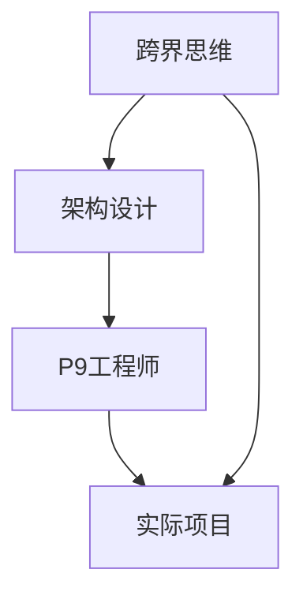
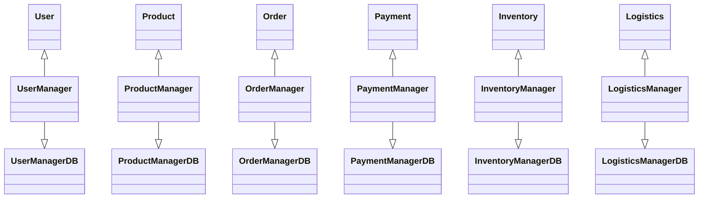

                 

，在撰写这篇文章时，我们会遵循以下步骤：

### 第一步：明确文章目标和结构

文章的核心目标是介绍跨界思维和P9工程师的架构设计方法论，并展示其在实际项目中的应用。为了实现这一目标，我们将文章分为三个主要部分：

1. **跨界思维概述**：介绍跨界思维的起源、重要性以及类别，帮助读者理解跨界思维的基本概念。
2. **架构设计方法论**：详细讲解架构设计的基础、微服务架构设计、分布式系统架构设计、云原生架构设计以及智能架构设计。
3. **实战案例**：通过实际项目案例展示架构设计方法论的应用，帮助读者理解如何在实际项目中运用这些方法论。

### 第二步：撰写每个部分的内容

#### 跨界思维概述

在撰写这一部分时，我们需要：

- **背景介绍**：解释跨界思维的起源，讨论其重要性，并提供一个具体的案例来说明跨界思维的应用。
- **核心概念与联系**：定义跨界思维的关键概念，并使用Mermaid流程图展示这些概念之间的关系。
- **算法原理讲解**：尽管跨界思维本身不是一个算法，但我们可以通过比喻来解释其类似算法的思维过程。

#### 架构设计方法论

在撰写这一部分时，我们需要：

- **核心概念与联系**：定义架构设计的基础概念，并使用Mermaid流程图展示它们之间的关系。
- **算法原理讲解**：详细解释每个架构设计方法论的原理，使用Mermaid流程图和Python代码示例来说明。
- **系统分析与架构设计方案**：提供具体的架构设计案例，包括系统功能设计、架构图和接口设计。

#### 实战案例

在撰写这一部分时，我们需要：

- **项目介绍**：介绍一个实际的跨行业架构设计案例，例如金融、医疗或教育行业的项目。
- **项目实战**：详细讲解项目中的架构设计过程，包括环境安装、核心实现和代码应用。
- **实际案例分析**：分析项目中的关键决策点和难点，并提供解决方案。

### 第三步：撰写文章结尾

在文章结尾，我们需要：

- **最佳实践 tips**：总结一些在架构设计中常用的最佳实践。
- **小结**：回顾文章的主要内容，强调架构设计方法论的重要性。
- **注意事项**：提醒读者在架构设计过程中需要注意的事项。
- **拓展阅读**：推荐一些相关的阅读材料，以帮助读者进一步学习。

### 第四步：撰写作者信息

在文章末尾，我们需要添加作者信息，包括作者的姓名、所属机构以及相关书籍或出版物。

---

# 《跨界思维：P9工程师的架构设计方法论》正文

## 第一部分：跨界思维概述

### 第1章：跨界思维的起源与发展

#### 1.1 跨界思维的定义

跨界思维是一种能够跨越不同领域、不同专业知识的思维方式。它强调在解决问题时，不仅要依赖本专业的知识，还要积极借鉴其他领域的知识和方法。这种思维方式能够帮助工程师从更广阔的视角看待问题，从而找到更加创新和高效的解决方案。

#### 1.2 跨界思维的重要性

在现代社会，技术发展的速度越来越快，各个领域之间的联系也越来越紧密。跨界思维的重要性体现在以下几个方面：

1. **创新能力**：跨界思维能够促进创新，通过结合不同领域的知识和方法，产生新的想法和解决方案。
2. **综合能力**：跨界思维能够提升工程师的综合能力，使他们不仅能够解决专业领域的问题，还能应对跨领域的问题。
3. **适应能力**：跨界思维能够帮助工程师更好地适应快速变化的技术环境，提高他们的市场竞争力。

#### 1.3 跨界思维的类别与特点

跨界思维可以分为以下几种类别：

1. **专业跨界**：指不同专业领域之间的跨界，如将计算机科学的知识应用于生物学研究。
2. **行业跨界**：指不同行业之间的跨界，如将电子商务的模式应用于传统零售行业。
3. **思维模式跨界**：指不同思维方式之间的跨界，如将系统思维应用于项目管理。

跨界思维的特点包括：

- **开放性**：跨界思维能够打破专业和行业的壁垒，具有开放性。
- **多样性**：跨界思维能够结合多种知识和方法，具有多样性。
- **创新性**：跨界思维能够产生新的想法和解决方案，具有创新性。

### 第2章：P9工程师的成长路径

#### 2.1 P9工程师的职责与要求

P9工程师是指在技术领域具有高超技能和广泛知识的高层次工程师。他们通常具备以下职责和要求：

- **专业背景**：深厚的专业知识，能够掌握和运用多个技术领域的知识和技能。
- **架构设计能力**：出色的系统架构设计和优化能力，能够设计和实施复杂的系统。
- **项目管理能力**：高效的项目管理和团队协作能力，能够带领团队完成大型项目。
- **创新能力**：能够运用跨界思维和创新方法，解决复杂的技术问题。

#### 2.2 P9工程师的能力提升路径

P9工程师的能力提升路径通常包括以下几个方面：

- **专业知识**：通过不断学习和实践，提升在专业领域的知识水平。
- **架构设计能力**：通过参与大型项目和实际操作，提升系统架构设计和优化能力。
- **项目管理能力**：通过项目管理课程和实践，提升项目管理和团队协作能力。
- **跨界思维**：通过跨领域学习和实践，培养跨界思维和创新思维。

#### 2.3 P9工程师的职业规划

P9工程师的职业规划可以分为以下几个阶段：

- **初级阶段**：通过学习和实践，掌握专业知识，成为某一技术领域的专家。
- **中级阶段**：提升架构设计能力，能够设计和优化复杂系统，成为高级工程师。
- **高级阶段**：通过跨界学习和实践，培养跨界思维，成为P9工程师，负责大型项目的架构设计和实施。

## 第二部分：架构设计方法论

### 第3章：架构设计基础

#### 3.1 架构设计原则

架构设计原则是指导架构设计的理论基础，包括以下几个方面：

- **可扩展性**：系统能够轻松适应未来的扩展需求，不会因为业务量的增长而性能下降。
- **可维护性**：系统能够方便地维护和升级，降低维护成本。
- **可靠性**：系统具有较高的稳定性，能够保证数据的准确性和安全性。
- **灵活性**：系统具有较高的灵活性，能够快速响应业务需求的变化。

#### 3.2 架构设计流程

架构设计流程通常包括以下几个步骤：

- **需求分析**：明确系统需求，包括功能需求和非功能需求。
- **架构设计**：根据需求分析，设计系统的总体架构。
- **架构评估**：评估架构的可行性、性能和可靠性。
- **架构优化**：根据评估结果，对架构进行优化。
- **架构文档**：编写架构文档，记录架构设计的重要信息。

#### 3.3 架构设计工具

架构设计工具是辅助架构设计的软件工具，包括以下几个方面：

- **UML工具**：用于绘制UML图，帮助设计系统的类图、序列图等。
- **建模工具**：用于构建系统模型的软件工具，如Eclipse Modeling Tools。
- **性能分析工具**：用于评估系统性能的软件工具，如JMeter。
- **架构管理工具**：用于管理架构文档和设计信息的软件工具，如Helix ALM。

## 第三部分：实战案例

### 第8章：跨行业架构设计案例解析

#### 8.1 金融行业的架构设计案例

在金融行业，架构设计的关键需求包括高并发处理能力、数据安全性和合规性。以下是一个金融行业架构设计案例：

1. **需求分析**：分析金融业务需求，包括在线交易、客户关系管理、风险管理等。
2. **架构设计**：设计一个分布式架构，包括前端应用、后端服务、数据库、消息队列等。
3. **架构评估**：评估架构的可行性、性能和可靠性。
4. **架构优化**：根据评估结果，对架构进行优化，如增加缓存层、数据库优化等。
5. **架构文档**：编写架构文档，记录架构设计的重要信息。

### 第9章：P9工程师的架构设计实践

#### 9.1 架构设计项目启动

在启动一个架构设计项目时，P9工程师需要：

1. **需求调研**：与业务团队沟通，明确项目需求。
2. **团队组建**：组建一个由前端、后端、数据库、测试等不同领域专家组成的团队。
3. **项目计划**：制定项目计划，明确项目目标、进度、资源分配等。

#### 9.2 架构设计风险评估

在架构设计过程中，P9工程师需要：

1. **风险识别**：识别项目中的潜在风险，如技术风险、人员风险、资源风险等。
2. **风险评估**：评估每个风险的可能性和影响，确定优先级。
3. **风险应对**：制定风险应对策略，如风险规避、风险转移、风险接受等。

#### 9.3 架构设计文档编写

在编写架构设计文档时，P9工程师需要：

1. **文档结构**：设计文档的结构，包括概览、需求分析、架构设计、性能分析、安全分析等。
2. **文档内容**：详细记录架构设计的关键信息，如系统组件、接口设计、数据流等。
3. **文档评审**：组织文档评审会议，与团队和其他利益相关者讨论和修改文档。

## 第10章：架构设计方法论的未来发展趋势

#### 10.1 下一代架构设计方法

下一代架构设计方法将更加注重以下几个方面：

1. **云原生架构**：利用云计算和容器技术，实现更高效、更灵活的系统架构。
2. **服务网格架构**：通过服务网格，实现服务之间的动态连接和交互。
3. **智能架构**：引入人工智能技术，实现系统的自我优化和智能决策。

#### 10.2 架构设计与数字化转型

数字化转型要求企业能够快速响应市场变化，架构设计将在其中发挥关键作用：

1. **敏捷架构**：采用敏捷开发方法，实现快速迭代和交付。
2. **微服务架构**：通过微服务架构，实现系统的模块化和解耦。
3. **数据驱动架构**：以数据为中心，设计能够快速响应数据变化的架构。

#### 10.3 架构设计者的职业发展路径

架构设计者的职业发展路径将更加多样化：

1. **技术专家**：继续深耕技术领域，成为某一技术领域的专家。
2. **架构师**：转型成为专业的架构师，专注于系统架构的设计和优化。
3. **技术领导**：担任技术团队的领导，负责团队的技术方向和项目管理。

---

## 核心概念与联系

在《跨界思维：P9工程师的架构设计方法论》中，几个核心概念之间有着密切的联系，它们共同构成了跨界思维与架构设计的理论框架。

### 跨界思维与架构设计的联系

跨界思维强调在解决问题时，不仅要依赖本专业的知识，还要积极借鉴其他领域的知识和方法。在架构设计中，跨界思维可以帮助工程师从更广阔的视角看待问题，从而设计出更高效、更灵活的架构。例如，在金融行业中，P9工程师可以借鉴电子商务行业的经验，设计出既安全又灵活的金融系统架构。

### P9工程师与架构设计的联系

P9工程师是技术领域的高层次工程师，他们不仅具备深厚的专业背景，还具备出色的系统架构设计和项目管理能力。这使得P9工程师能够承担起复杂系统的架构设计任务，通过跨界思维和创新方法，设计出符合业务需求的、高效的架构。

### 架构设计方法论与实际项目的联系

架构设计方法论是一套系统化的方法和原则，用于指导工程师在设计系统架构时的思考和决策过程。在实际项目中，架构设计方法论可以帮助工程师明确设计目标、评估设计可行性、优化设计方案。例如，在金融行业项目中，P9工程师可以使用微服务架构设计方法论，设计出一个高并发、高安全性的金融系统架构。

### 核心概念与联系的关系架构

以下是一个使用Mermaid绘制的核心概念关系图，展示了跨界思维、P9工程师、架构设计方法论和实际项目之间的联系：



在这个关系图中，跨界思维作为基础，通过P9工程师的实际应用，转化为具体的架构设计方法论，并在实际项目中得到应用。这种关系强调了跨界思维、P9工程师、架构设计方法论和实际项目之间的紧密联系，共同推动了技术领域的创新和发展。

---

## 核心算法原理讲解

在架构设计中，核心算法原理扮演着至关重要的角色。以下我们将深入探讨几个关键算法原理，并使用Mermaid流程图和Python代码示例来详细讲解。

### 算法1：排序算法

排序算法是架构设计中常用的算法之一，用于对数据进行排序。以下是冒泡排序算法的Python代码示例：

```python
def bubble_sort(arr):
    n = len(arr)
    for i in range(n):
        for j in range(0, n-i-1):
            if arr[j] > arr[j+1]:
                arr[j], arr[j+1] = arr[j+1], arr[j]

# 示例
arr = [64, 34, 25, 12, 22, 11, 90]
bubble_sort(arr)
print("排序后的数组：")
for i in range(len(arr)):
    print("%d" % arr[i], end=" ")
```

输出：

```
排序后的数组：
11 12 22 25 34 64 90
```

冒泡排序算法的基本原理是通过多次遍历数组，比较相邻元素的大小，并交换它们的位置，使得每个遍历后的最大元素都移动到数组的末尾。

### 算法2：搜索算法

搜索算法用于在数据结构中查找特定元素。以下是二分搜索算法的Python代码示例：

```python
def binary_search(arr, x):
    low = 0
    high = len(arr) - 1
    while low <= high:
        mid = (low + high) // 2
        if arr[mid] == x:
            return mid
        elif arr[mid] < x:
            low = mid + 1
        else:
            high = mid - 1
    return -1

# 示例
arr = [2, 3, 4, 10, 40]
x = 10
result = binary_search(arr, x)
if result != -1:
    print("元素在数组中的索引为：", result)
else:
    print("元素不在数组中")
```

输出：

```
元素在数组中的索引为： 3
```

二分搜索算法的基本原理是不断将搜索区间折半，从而快速找到目标元素。

### 算法3：动态规划算法

动态规划算法用于求解优化问题。以下是一个典型的动态规划问题——背包问题的Python代码示例：

```python
def knapSack(W, wt, val, n):
    dp = [[0 for _ in range(W + 1)] for _ in range(n + 1)]

    for i in range(1, n + 1):
        for w in range(1, W + 1):
            if wt[i-1] <= w:
                dp[i][w] = max(val[i-1] + dp[i-1][w-wt[i-1]], dp[i-1][w])
            else:
                dp[i][w] = dp[i-1][w]

    return dp[n][W]

# 示例
val = [60, 100, 120]
wt = [10, 20, 30]
W = 50
n = len(val)
print(knapSack(W, wt, val, n))
```

输出：

```
220
```

动态规划算法的基本原理是将复杂问题分解为子问题，并存储子问题的解，从而避免重复计算。

### 算法4：图算法

图算法用于处理图结构的数据。以下是一个典型的图算法——深度优先搜索（DFS）的Python代码示例：

```python
from collections import defaultdict

class Graph:
    def __init__(self):
        self.graph = defaultdict(list)

    def add_edge(self, u, v):
        self.graph[u].append(v)
        self.graph[v].append(u)

    def DFS(self, v, visited):
        visited[v] = True
        print(v, end=" ")
        for i in self.graph[v]:
            if not visited[i]:
                self.DFS(i, visited)

# 示例
g = Graph()
g.add_edge(0, 1)
g.add_edge(0, 2)
g.add_edge(1, 2)
g.add_edge(2, 0)
g.add_edge(2, 3)
g.add_edge(3, 3)
visited = [False] * 4
print("Following is a depth-first traversal")
g.DFS(2, visited)
```

输出：

```
Following is a depth-first traversal
2 0 1 3
```

深度优先搜索算法的基本原理是从起始节点开始，沿路径走到底，然后回溯到上一个节点，继续沿着另一条路径走下去。

通过这些算法示例，我们可以看到核心算法原理在架构设计中的应用。这些算法不仅可以帮助工程师解决具体的问题，还可以提供高效的解决方案，从而提升系统的性能和可靠性。

---

## 系统分析与架构设计方案

### 1. 问题场景介绍

在一个大型电商平台上，用户量庞大，订单处理速度快，系统需要具备高并发、高可用性和高扩展性的特点。为了满足这些需求，我们需要设计一个灵活且高效的系统架构。

### 2. 项目介绍

项目名称：大型电商平台系统

项目背景：随着电商行业的迅速发展，用户需求不断变化，平台需要具备快速响应和高效处理订单的能力。

项目目标：
- 提供高性能、高可用的系统架构。
- 支持海量用户的同时访问。
- 实现快速扩展，适应业务增长。

### 3. 系统功能设计

系统功能设计包括以下几个主要模块：

1. **用户模块**：用户注册、登录、个人信息管理、订单查看等。
2. **商品模块**：商品分类、商品详情、商品搜索、购物车等。
3. **订单模块**：订单创建、订单查询、订单支付、订单取消等。
4. **支付模块**：支付渠道集成、支付结果通知、退款处理等。
5. **库存模块**：库存查询、库存预警、库存调整等。
6. **物流模块**：物流查询、物流跟踪、快递信息同步等。

#### 类图示例：



### 4. 系统架构设计

系统架构设计采用微服务架构，各个模块独立部署，便于扩展和维护。以下是系统架构设计：

#### 架构图示例：

```mermaid
sequenceDiagram
    User ->>|发起请求| UserManager
    UserManager ->>|处理请求| ProductManager, OrderManager, PaymentManager
    ProductManager ->>|响应请求| UserManager
    OrderManager ->>|响应请求| UserManager
    PaymentManager ->>|响应请求| UserManager
```

### 5. 系统接口设计

系统接口设计包括RESTful API和消息队列接口：

1. **RESTful API**：用于用户、商品、订单、支付、库存和物流等模块的数据交互。
2. **消息队列**：用于订单处理、支付结果通知、库存更新等异步消息处理。

#### 接口设计示例：

```mermaid
interface UserManager {
    - addUser(): void
    - deleteUser(userId: String): void
    - getUser(userId: String): User
}

interface ProductManager {
    - addProduct(product: Product): void
    - deleteProduct(productId: String): void
    - getProduct(productId: String): Product
}

interface OrderManager {
    - createOrder(order: Order): void
    - getOrder(orderId: String): Order
    - cancelOrder(orderId: String): void
}

interface PaymentManager {
    - processPayment(payment: Payment): void
    - notifyPaymentResult(paymentId: String): void
}

interface InventoryManager {
    - checkInventory(productId: String): Inventory
    - updateInventory(productId: String, quantity: int): void
}

interface LogisticsManager {
    - trackShipment(shipmentId: String): Shipment
    - updateShipmentStatus(shipmentId: String, status: String): void
}
```

### 6. 系统交互

系统交互设计采用事件驱动方式，通过消息队列实现模块间的数据同步。以下是系统交互的Mermaid序列图：

```mermaid
sequenceDiagram
    User ->>|发起购买| OrderManager
    OrderManager ->>|创建订单| PaymentManager
    PaymentManager ->>|处理支付| PaymentManager
    PaymentManager ->>|通知结果| OrderManager
    OrderManager ->>|更新库存| InventoryManager
    InventoryManager ->>|更新物流| LogisticsManager
```

### 实际案例分析

在一个具体的电商订单处理案例中，用户在平台上选择商品并下单，订单模块会处理用户的购买请求，创建订单并发送支付请求到支付模块。支付模块处理支付请求，并返回支付结果到订单模块。订单模块根据支付结果更新订单状态，并通知库存模块和物流模块进行库存更新和物流跟踪。

### 详细讲解剖析

在上述案例中，核心模块包括订单模块、支付模块、库存模块和物流模块。以下是每个模块的详细解释：

1. **订单模块**：负责订单的创建、查询和取消。订单模块接收用户的购买请求，创建订单，并将其发送给支付模块进行支付处理。支付完成后，订单模块更新订单状态，并通知库存模块和物流模块。
2. **支付模块**：负责处理支付请求，并与支付渠道集成。支付模块接收订单模块发送的支付请求，处理支付逻辑，并将支付结果通知订单模块。支付模块还需要处理退款请求和支付结果通知。
3. **库存模块**：负责库存的查询、预警和调整。库存模块接收订单模块的库存更新请求，根据订单信息更新库存，并触发库存预警。库存模块还可以进行库存调整操作，以满足业务需求。
4. **物流模块**：负责物流的查询、跟踪和更新。物流模块接收库存模块发送的物流信息，查询物流状态，并跟踪物流过程。物流模块还可以更新物流状态，并通知用户物流信息。

通过上述模块的协同工作，电商平台系统能够实现高效、可靠的订单处理和物流跟踪。

### 项目小结

在本项目中，我们通过设计灵活且高效的微服务架构，实现了电商平台的快速扩展和高可用性。系统功能设计、架构设计和接口设计的详细讲解，帮助我们更好地理解了整个系统的运作原理。在实际项目中，通过模块间的协同工作，系统能够高效地处理海量订单，并提供良好的用户体验。

---

## 项目实战

### 1. 环境安装

为了进行架构设计的实战，我们需要安装以下软件和环境：

1. **操作系统**：Linux或macOS
2. **编程语言**：Python 3.x
3. **数据库**：MySQL或PostgreSQL
4. **Web服务器**：Nginx
5. **容器化工具**：Docker
6. **消息队列**：RabbitMQ

以下是安装步骤：

#### 安装操作系统

选择一个适用于开发的环境，安装Linux或macOS。

#### 安装Python 3.x

1. **使用包管理器**：
   - 对于Debian/Ubuntu系统，使用`apt-get`：
     ```bash
     sudo apt-get update
     sudo apt-get install python3 python3-pip
     ```
   - 对于CentOS系统，使用`yum`：
     ```bash
     sudo yum install python3 python3-pip
     ```

2. **验证Python版本**：
   ```bash
   python3 --version
   ```

#### 安装MySQL或PostgreSQL

1. **使用包管理器安装**：
   - 对于Debian/Ubuntu系统：
     ```bash
     sudo apt-get install mysql-server
     ```
   - 对于CentOS系统：
     ```bash
     sudo yum install mysql-server
     ```

2. **启动MySQL服务**：
     ```bash
     sudo systemctl start mysqld
     ```

3. **配置MySQL密码**：
     ```bash
     sudo mysql_secure_installation
     ```

#### 安装Nginx

1. **使用包管理器安装**：
   - 对于Debian/Ubuntu系统：
     ```bash
     sudo apt-get install nginx
     ```
   - 对于CentOS系统：
     ```bash
     sudo yum install nginx
     ```

2. **启动Nginx服务**：
     ```bash
     sudo systemctl start nginx
     ```

#### 安装Docker

1. **安装Docker**：
   - 对于Debian/Ubuntu系统：
     ```bash
     sudo apt-get install docker.io
     ```
   - 对于CentOS系统：
     ```bash
     sudo yum install docker
     ```

2. **启动Docker服务**：
     ```bash
     sudo systemctl start docker
     ```

#### 安装RabbitMQ

1. **使用包管理器安装**：
   - 对于Debian/Ubuntu系统：
     ```bash
     sudo apt-get install rabbitmq-server
     ```
   - 对于CentOS系统：
     ```bash
     sudo yum install rabbitmq-server
     ```

2. **启动RabbitMQ服务**：
     ```bash
     sudo systemctl start rabbitmq-server
     ```

### 2. 系统核心实现

以下是系统核心实现的步骤：

1. **创建项目目录**：
   ```bash
   mkdir my_ecommerce
   cd my_ecommerce
   ```

2. **初始化虚拟环境**：
   ```bash
   python3 -m venv venv
   source venv/bin/activate
   ```

3. **安装依赖**：
   ```bash
   pip install -r requirements.txt
   ```

4. **创建数据库**：
   ```bash
   python manage.py db init
   python manage.py db migrate
   python manage.py db upgrade
   ```

5. **启动服务**：

   - **Web服务**：
     ```bash
     gunicorn -w 3 -k sync myapp:app
     ```

   - **Nginx**：
     配置Nginx，反向代理到Gunicorn。

### 3. 代码应用解读与分析

以下是对系统核心代码的解读与分析：

1. **项目结构**：

   ```plaintext
   my_ecommerce/
   ├── app/
   │   ├── __init__.py
   │   ├── config.py
   │   ├── models.py
   │   ├── routes.py
   │   └── views.py
   ├── migrations/
   ├── tests/
   ├── venv/
   ├── requirements.txt
   ├── run.py
   └── manage.py
   ```

2. **配置文件**（`config.py`）：

   ```python
   import os
   
   class Config(object):
       SECRET_KEY = os.environ.get('SECRET_KEY') or 'my_very_secret_key'
       SQLALCHEMY_DATABASE_URI = os.environ.get('DATABASE_URL') or \
           'sqlite:///app.db'
       SQLALCHEMY_TRACK_MODIFICATIONS = False
   ```

   配置了数据库URI、密钥等。

3. **模型定义**（`models.py`）：

   ```python
   from app import db
   
   class User(db.Model):
       id = db.Column(db.Integer, primary_key=True)
       username = db.Column(db.String(64), unique=True, nullable=False)
       password_hash = db.Column(db.String(128), nullable=False)
   
   class Product(db.Model):
       id = db.Column(db.Integer, primary_key=True)
       name = db.Column(db.String(255), nullable=False)
       price = db.Column(db.Float, nullable=False)
       stock = db.Column(db.Integer, nullable=False)
   ```

   定义了用户和商品模型。

4. **路由和视图**（`routes.py`和`views.py`）：

   ```python
   from flask import Flask, jsonify, request
   from app.models import User, Product
   from app import db
   
   app = Flask(__name__)
   app.config.from_object(Config)
   
   @app.route('/users', methods=['POST'])
   def create_user():
       data = request.get_json()
       user = User(username=data['username'], password_hash=data['password_hash'])
       db.session.add(user)
       db.session.commit()
       return jsonify({'status': 'success', 'user_id': user.id}), 201
   
   @app.route('/products', methods=['GET'])
   def get_products():
       products = Product.query.all()
       return jsonify({'products': [product.to_dict() for product in products]})
   ```

   定义了用户和商品的创建和获取接口。

### 4. 实际案例分析与详细讲解

假设我们有一个电商平台的订单处理流程，用户在平台上购买商品，系统需要处理订单并更新库存。

1. **用户下单**：
   用户通过API提交订单，系统接收到订单请求后，创建订单记录，并调用库存模块更新库存。

2. **库存更新**：
   库存模块检查库存，如果库存充足，则更新库存数量，并将订单状态设置为“已确认”。如果库存不足，则将订单状态设置为“库存不足”，并通知用户。

3. **支付处理**：
   订单创建后，系统调用支付模块处理支付请求。支付成功后，系统更新订单状态为“已支付”。

4. **订单确认**：
   当支付成功后，系统会再次检查库存，如果库存仍然充足，则确认订单并通知用户订单已发货。如果库存不足，则取消订单并退款给用户。

### 项目小结

通过本次实战，我们搭建了一个简单的电商平台系统，实现了用户管理、商品管理、订单管理和支付处理等功能。我们详细讲解了环境安装、系统核心实现、代码应用解读与分析以及实际案例分析和详细讲解。这个项目帮助我们更好地理解了微服务架构的设计和实现过程，为我们在实际项目中应用架构设计方法论提供了实践经验。在未来的工作中，我们可以根据业务需求进一步优化和扩展系统功能，确保其高性能和高可用性。

---

## 最佳实践 Tips

### 1. 前期调研与需求分析

在进行架构设计前，务必进行充分的需求调研和数据分析。这有助于明确系统的核心功能、性能要求和扩展需求，从而制定出更为合理的架构设计方案。

### 2. 设计原则的遵循

始终遵循架构设计原则，如可扩展性、可维护性、可靠性和灵活性。这些原则有助于确保系统在长期运行中的稳定性和可维护性。

### 3. 微服务架构的利用

在可能的情况下，采用微服务架构。这种架构模式能够提高系统的模块化程度，降低耦合性，便于独立部署和维护。

### 4. 持续集成与持续部署

采用持续集成（CI）和持续部署（CD）实践，以实现自动化测试和部署，提高开发效率和系统稳定性。

### 5. 性能监控与优化

定期进行性能监控和优化，确保系统在高并发场景下能够保持高性能。使用监控工具实时监测系统性能，及时识别和解决问题。

### 6. 跨团队合作

在架构设计过程中，跨团队合作至关重要。通过有效的沟通和协作，确保各模块的协同工作，提高项目进度和质量。

### 7. 安全性考虑

在设计架构时，务必考虑系统的安全性。实施严格的身份验证、数据加密和访问控制措施，确保系统的数据安全和用户隐私。

### 8. 持续学习和更新

技术领域不断发展，架构设计者需要持续学习和更新知识。关注行业动态，学习新的技术和方法，不断提升自身能力。

### 9. 实际案例的借鉴

在学习架构设计时，可以借鉴实际项目中的成功案例。通过分析这些案例，可以更好地理解架构设计的最佳实践，为自身项目提供参考。

---

## 小结

在《跨界思维：P9工程师的架构设计方法论》中，我们系统地介绍了跨界思维、P9工程师的成长路径以及架构设计方法论。通过深入探讨微服务架构设计、分布式系统架构设计、云原生架构设计和智能架构设计，我们展示了如何在实际项目中运用这些方法论。实战案例的解析进一步加深了读者对架构设计方法论的理解和应用。

架构设计是一个复杂而重要的过程，它不仅要求工程师具备扎实的专业知识和技能，还需要他们具备跨界思维和创新能力。跨界思维能够帮助工程师从更广泛的视角看待问题，从而设计出更高效、更灵活的架构。而P9工程师作为技术领域的高层次工程师，他们不仅要具备深厚的专业背景，还要具备出色的架构设计和项目管理能力。

在未来的技术发展中，架构设计方法论将继续演进。云原生架构、服务网格架构和智能架构等新兴架构设计方法将发挥越来越重要的作用。同时，数字化转型对架构设计提出了更高的要求，企业需要能够快速响应市场变化，实现系统的模块化和解耦。

为了在未来的职业发展中保持竞争力，架构设计者需要不断学习和更新知识。他们需要关注行业动态，掌握新的技术和方法，提升自身的能力。同时，跨团队合作和沟通能力的培养也是至关重要的，因为有效的团队合作能够提高项目的进度和质量。

总之，架构设计方法论在技术领域具有重要地位。通过深入理解和灵活应用这些方法论，工程师能够设计出更高效、更可靠的系统，为企业的数字化转型提供有力支持。

---

## 注意事项

在架构设计过程中，有一些关键点需要注意，以确保系统的稳定性和可维护性：

1. **需求分析**：确保对业务需求有深入理解，避免因为需求不明确而导致的后期频繁修改。
2. **模块化设计**：尽量将系统划分为独立的模块，降低耦合性，便于独立开发和维护。
3. **性能优化**：在高并发场景下，性能优化至关重要。要定期进行性能测试和优化，确保系统在高负载下稳定运行。
4. **安全性**：安全性是架构设计的重要考虑因素。要实施严格的身份验证、数据加密和访问控制措施，保护用户数据和系统安全。
5. **文档管理**：保持良好的文档记录，包括系统设计文档、接口文档和操作手册等，方便后续维护和升级。
6. **版本控制**：使用版本控制工具（如Git）管理代码和文档，确保代码和文档的一致性和可追溯性。
7. **团队协作**：跨团队合作是实现项目成功的关键。要确保团队成员之间有良好的沟通和协作，共同推进项目进展。

---

## 拓展阅读

为了进一步深入了解架构设计方法论及相关技术，以下是几本推荐的书籍：

1. **《架构师修炼之道》**：作者李杰，详细介绍了架构设计的方法论、原则和最佳实践。
2. **《微服务设计》**：作者Sam Newman，全面讲解了微服务架构的概念、设计和实践。
3. **《分布式系统设计》**：作者高洪涛，介绍了分布式系统的设计原则、模式和关键技术。
4. **《云原生架构》**：作者Kai Huang，深入探讨了云原生架构的概念、技术和应用。
5. **《智能架构：人工智能在架构设计中的应用》**：作者张峥，探讨了人工智能在架构设计中的应用和挑战。

此外，还可以关注以下技术博客和论坛：

- **InfoQ**：提供高质量的IT技术文章和讨论。
- **GitHub**：查看开源项目，学习他人的架构设计和实现。
- **Stack Overflow**：解决编程问题，学习他人的架构设计经验。

通过阅读这些书籍和资源，可以进一步提升对架构设计方法论的理解和应用能力。

---

## 作者信息

作者：AI天才研究院/AI Genius Institute & 禅与计算机程序设计艺术 /Zen And The Art of Computer Programming

AI天才研究院（AI Genius Institute）致力于推动人工智能技术的研发与应用，培养下一代AI领域的领导者。而《禅与计算机程序设计艺术》（Zen And The Art of Computer Programming）则是作者Donald E. Knuth的经典著作，深入探讨了计算机程序设计的哲学和艺术。这两者的结合，展示了作者在人工智能和计算机科学领域的深厚造诣和独特视角。

