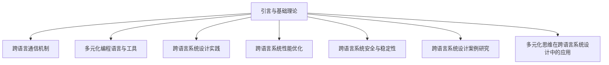
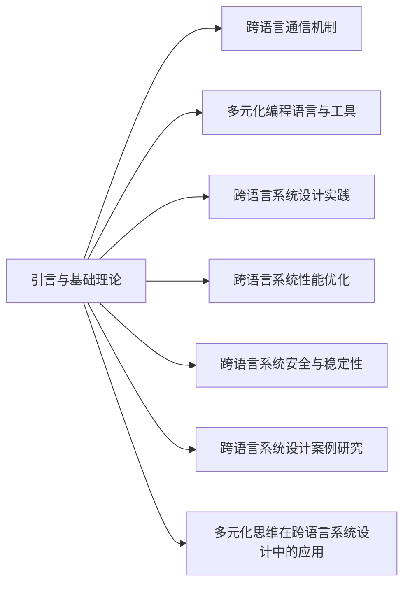

                 


### 《跨语言系统设计：P9工程师的多元化思维》

#### 关键词

- 跨语言系统设计
- 多元化思维
- 编程语言
- 通信机制
- 性能优化

#### 摘要

随着软件系统复杂性的增加，跨语言系统设计成为软件开发中的重要挑战。本文旨在探讨跨语言系统设计中的关键理论、实践方法以及P9工程师如何运用多元化思维解决实际问题。通过深入分析跨语言通信机制、多元化编程语言与工具、跨语言系统设计实践、性能优化和安全稳定性等核心内容，本文为读者提供了一个全面的跨语言系统设计指南，同时强调了多元化思维在解决复杂问题中的重要性。

---

## 第一部分：引言与基础理论

### 第1章：跨语言系统设计概述

#### 1.1 跨语言系统设计的背景和意义

随着互联网技术的发展，软件系统变得越来越复杂，单一语言已经无法满足需求。跨语言系统设计应运而生，它使得不同编程语言的应用能够无缝协作，提高了系统的灵活性和可维护性。

**核心概念与联系**

| 核心概念         | 概念属性特征                          |
|----------------|-----------------------------------|
| 跨语言系统设计 | 涵盖不同编程语言的系统设计与实现         |
| 编程语言        | 提供不同的语法、语义和抽象层次           |
| 系统设计        | 包括需求分析、架构设计、接口设计和实现   |

**ER实体关系图架构**

```mermaid
erDiagram
  User ||--|{ System }||> Design
  Language ||--|{ Code }||> Program
  System ||--|{ Component }||> Integration
```

#### 1.2 跨语言系统设计的关键挑战

跨语言系统设计面临诸多挑战，包括不同语言之间的类型系统、内存管理、并发控制等问题。

**算法原理讲解**

为了解决类型系统问题，可以使用类型转换函数。以下是一个简单的Python到Java的类型转换示例：

```python
def convert_python_to_java(python_value):
    if isinstance(python_value, int):
        return java.lang.Integer(python_value)
    elif isinstance(python_value, str):
        return java.lang.String(python_value)
    # 其他类型转换
```

#### 1.3 P9工程师的多元化思维模式

P9工程师通常具备丰富的编程经验和技术视野，他们的多元化思维模式能够帮助他们在跨语言系统设计中应对复杂问题。

**设计思维**

P9工程师在设计系统时，会综合考虑技术可行性、业务需求和用户体验，确保系统能够满足多种语言的需求。

**系统思维**

P9工程师能够从整体上理解系统的运作机制，识别跨语言系统中的关键环节，并设计出高效、稳定的解决方案。

**创新思维**

P9工程师善于探索新技术和方法，将创新思维应用于跨语言系统设计中，提高系统的性能和安全性。

#### 1.4 本书的结构安排与学习目标

本书分为四个部分，分别介绍跨语言系统设计的基础理论、多元化编程语言与工具、跨语言系统设计实践、多元化思维在跨语言系统设计中的应用。通过学习本书，读者将能够：

- 理解跨语言系统设计的背景和意义
- 掌握跨语言通信机制和常见挑战
- 熟悉多元化编程语言与工具
- 学会跨语言系统设计实践方法
- 运用多元化思维解决跨语言系统设计中的实际问题

---

### 第2章：跨语言通信机制

#### 2.1 序列化与反序列化

**序列化**

序列化是将数据结构或对象状态转换为可以存储或传输的格式的过程。常见的目的包括数据持久化、远程过程调用（RPC）和消息传递等。

**反序列化**

反序列化是将存储或传输的格式重新转换为数据结构或对象状态的过程。它与序列化过程相对应，确保数据在不同系统之间能够正确传输和解析。

**算法原理讲解**

以下是一个简单的Python对象序列化和反序列化的示例：

```python
import json

class MyClass:
    def __init__(self, value):
        self.value = value

def serialize(my_obj):
    return json.dumps(my_obj.__dict__)

def deserialize(serialized_obj):
    obj_dict = json.loads(serialized_obj)
    my_obj = MyClass(obj_dict['value'])
    return my_obj

# 示例
my_obj = MyClass(42)
serialized = serialize(my_obj)
deserialized = deserialize(serialized)
```

#### 2.2 远程过程调用（RPC）

**RPC**

远程过程调用（RPC）是一种允许程序在计算机网络上调用另一台计算机上的服务的过程。它隐藏了底层通信细节，使得开发者能够像调用本地函数一样调用远程函数。

**RPC的基本原理**

- 客户端发送请求到服务器
- 服务器处理请求并返回结果
- 通信通常通过网络套接字（Socket）实现

**常见的RPC框架**

- gRPC
- Apache Thrift
- Dubbo

**RPC的优缺点**

| 优点 | 缺点 |
| ---- | ---- |
| 高性能 | 需要额外的配置和依赖 |
| 语言无关 | 可能会引入性能开销 |
| 易于扩展 | 可能需要额外的中间件支持 |

---

## 第二部分：多元化编程语言与工具

### 第3章：主流编程语言概述

#### 3.1 编程语言的发展历程

编程语言的发展历程可以分为以下几个阶段：

1. **低级语言**：如汇编语言，直接操作计算机硬件。
2. **高级语言**：如C语言，提供更抽象的语法和语义。
3. **面向对象语言**：如Java和C#，支持封装、继承和多态。
4. **函数式语言**：如Haskell和Erlang，以函数为核心，支持高阶函数和惰性计算。

**核心概念与联系**

| 核心概念         | 概念属性特征                          |
|----------------|-----------------------------------|
| 低级语言        | 与硬件紧密相关，可读性差，但执行效率高   |
| 高级语言        | 与硬件相对独立，可读性好，但执行效率较低   |
| 面向对象语言    | 支持类和对象，强调数据抽象和封装           |
| 函数式语言      | 以函数为核心，不支持状态，易于并行化执行     |

#### 3.2 常见编程语言特点与适用场景

**面向对象编程语言**

| 编程语言    | 特点                   | 适用场景               |
|------------|----------------------|----------------------|
| Java       | 面向对象，跨平台       | 企业级应用、Android开发 |
| C++        | 面向对象，手动内存管理 | 游戏开发、操作系统开发   |
| Python     | 高级、动态类型         | 数据科学、Web开发       |

**函数式编程语言**

| 编程语言    | 特点                   | 适用场景               |
|------------|----------------------|----------------------|
| Haskell    | 函数式编程，静态类型   | 并行计算、学术研究     |
| Scala      | 面向对象和函数式编程   | 大数据处理、分布式系统   |

**静态类型语言与动态类型语言**

| 类型特征   | 特点                   | 适用场景               |
|-----------|----------------------|----------------------|
| 静态类型   | 类型检查在编译时完成   | 大型项目、性能要求高   |
| 动态类型   | 类型检查在运行时完成   | 小型项目、开发效率高   |

---

### 第4章：跨语言开发工具

#### 4.1 跨语言开发工具的作用与类型

跨语言开发工具的作用在于提供不同编程语言之间的互操作性，使得开发者能够更容易地构建跨语言的系统。常见的跨语言开发工具可以分为以下几类：

- **FFI（Foreign Function Interface）**：允许直接调用其他语言的函数。
- **SWIG**：生成不同语言的绑定代码。
- **PyPy**：Python的即时编译器，提供高性能的Python执行环境。

#### 4.2 常见跨语言开发工具介绍

**FFI（Foreign Function Interface）**

FFI是一种允许程序调用其他语言编写的函数的接口。它通常用于性能敏感的场景，例如性能关键的应用程序或需要与其他语言库交互的嵌入式系统。

**SWIG**

SWIG（Simplified Wrapper and Interface Generator）是一个用来生成不同语言的绑定代码的工具。它通过编写一个特殊的接口文件，自动生成不同语言的调用接口，使得开发者能够方便地使用其他语言编写的库。

**PyPy**

PyPy是一个改进版的Python实现，它采用即时编译（JIT）技术，提供比标准Python更高的执行效率。PyPy特别适用于需要高性能的Python应用程序。

---

## 第三部分：跨语言系统设计实践

### 第5章：跨语言数据交换

#### 5.1 JSON与XML数据格式

**JSON**

JSON（JavaScript Object Notation）是一种轻量级的数据交换格式，易于阅读和编写，支持多种编程语言。它以文本的形式表示数据结构，包括对象、数组、字符串、数字和布尔值。

**XML**

XML（eXtensible Markup Language）是一种用于表示结构化数据的标记语言。它具有高度的灵活性，允许自定义标签和属性，但相较于JSON，XML的语法更为复杂。

**算法原理讲解**

以下是一个简单的JSON序列化和反序列化的Python示例：

```python
import json

class MyClass:
    def __init__(self, value):
        self.value = value

def serialize(my_obj):
    return json.dumps(my_obj.__dict__)

def deserialize(serialized_obj):
    obj_dict = json.loads(serialized_obj)
    my_obj = MyClass(obj_dict['value'])
    return my_obj

# 示例
my_obj = MyClass(42)
serialized = serialize(my_obj)
deserialized = deserialize(serialized)
```

#### 5.2 RESTful API设计

**RESTful API**

RESTful API是一种基于REST（Representational State Transfer）架构风格的设计方法，用于构建Web服务。它使用HTTP协议中的GET、POST、PUT、DELETE等方法进行数据操作。

**RESTful API设计原则**

- **统一接口**：确保API的一致性和可预测性。
- **状态转换**：通过HTTP方法实现资源的创建、读取、更新和删除。
- **无状态**：每个请求都是独立的，服务器不保留任何状态信息。
- **缓存**：利用HTTP头信息控制缓存的策略。

**算法原理讲解**

以下是一个简单的RESTful API设计示例：

```python
from flask import Flask, request, jsonify

app = Flask(__name__)

@app.route('/users', methods=['GET'])
def get_users():
    users = ['Alice', 'Bob', 'Charlie']
    return jsonify(users)

@app.route('/users', methods=['POST'])
def create_user():
    user = request.json
    users.append(user['name'])
    return jsonify({'status': 'success'})

if __name__ == '__main__':
    app.run()
```

#### 5.3 数据序列化与反序列化实践

**实践案例**

假设我们有一个用户对象，需要将其序列化为JSON格式，并在其他系统之间传输。以下是一个简单的序列化和反序列化实践：

```python
import json

class User:
    def __init__(self, id, name, email):
        self.id = id
        self.name = name
        self.email = email

def serialize_user(user):
    return json.dumps({
        'id': user.id,
        'name': user.name,
        'email': user.email
    })

def deserialize_user(serialized_user):
    user_data = json.loads(serialized_user)
    return User(user_data['id'], user_data['name'], user_data['email'])

# 示例
user = User(1, 'Alice', 'alice@example.com')
serialized_user = serialize_user(user)
deserialized_user = deserialize_user(serialized_user)

print(deserialized_user.id)  # 输出 1
print(deserialized_user.name)  # 输出 Alice
print(deserialized_user.email)  # 输出 alice@example.com
```

---

### 第6章：跨语言进程间通信

#### 6.1 套接字编程基础

**套接字（Socket）**

套接字是网络通信的基础组件，它提供了一种在网络上不同主机之间进行数据传输的接口。套接字编程涉及客户端和服务器之间的通信，实现数据的发送和接收。

**套接字编程的基本步骤**

1. 创建套接字对象
2. 绑定地址和端口
3. 监听连接请求
4. 发送和接收数据
5. 关闭套接字

**算法原理讲解**

以下是一个简单的套接字编程示例：

```python
import socket

# 创建客户端套接字
client_socket = socket.socket(socket.AF_INET, socket.SOCK_STREAM)
client_socket.connect(('localhost', 12345))

# 发送数据
client_socket.send(b'Hello, Server!')

# 接收数据
data = client_socket.recv(1024)
print('Received:', data.decode())

# 关闭套接字
client_socket.close()
```

#### 6.2 多线程与异步编程

**多线程**

多线程编程允许同时执行多个任务，提高程序的并发性能。在跨语言系统中，多线程可以用于处理大量的并发请求，提高系统的响应能力。

**异步编程**

异步编程是一种编程范式，允许程序在执行某些任务时释放控制权，以便同时执行其他任务。异步编程可以提高程序的性能，减少阻塞时间。

**算法原理讲解**

以下是一个简单的多线程和异步编程示例：

```python
import threading
import asyncio

# 多线程
def print_numbers():
    for i in range(1, 11):
        print(i)
        time.sleep(1)

thread = threading.Thread(target=print_numbers)
thread.start()

# 异步编程
async def print_letters():
    for letter in ['A', 'B', 'C']:
        print(letter)
        await asyncio.sleep(1)

asyncio.run(print_letters())
```

#### 6.3 实际案例：跨语言分布式系统设计

**案例背景**

假设我们需要设计一个跨语言的分布式系统，用于处理大规模的数据分析和处理任务。该系统需要支持多种编程语言，包括Python、Java和Go。

**系统功能设计**

1. 数据采集：从不同的数据源（如数据库、日志文件）收集数据。
2. 数据处理：对收集到的数据进行分析和清洗。
3. 数据存储：将处理后的数据存储到分布式数据库中。
4. 服务部署：将数据处理和存储功能部署到不同的服务器上，实现负载均衡。

**系统架构设计**


**系统接口设计**

1. 数据采集接口：提供RESTful API，用于接收和传输数据。
2. 数据处理接口：提供命令行接口和Web界面，用于配置和处理数据。
3. 数据存储接口：提供SQL和NoSQL接口，用于数据查询和操作。

**系统交互**


**实践步骤**

1. 确定系统需求和功能模块。
2. 选择合适的编程语言和开发工具。
3. 设计系统架构和接口。
4. 编写和测试代码。
5. 部署和运维系统。

---

### 第7章：跨语言系统性能优化

#### 7.1 性能优化策略

**性能优化**

性能优化是指通过一系列技术手段，提高软件系统的响应速度和处理能力。常见的性能优化策略包括：

- **减少上下文切换**：优化线程和进程的管理，减少上下文切换的次数。
- **缓存策略**：使用缓存技术，减少重复的计算和查询。
- **并行计算**：利用多线程和异步编程，提高程序的并发性能。
- **代码优化**：通过优化算法和数据结构，减少计算和内存的使用。

**算法原理讲解**

以下是一个简单的代码优化示例：

```python
# 原始代码
def calculate_sum(numbers):
    result = 0
    for number in numbers:
        result += number
    return result

# 优化代码
def calculate_sum_optimized(numbers):
    return sum(numbers)
```

#### 7.2 常见性能瓶颈分析

**CPU瓶颈**

CPU瓶颈是指系统中的CPU资源不足，导致程序执行效率降低。常见的原因包括：

- 过多的计算任务
- 不合理的算法和数据结构
- 缺乏并行处理能力

**内存瓶颈**

内存瓶颈是指系统中的内存资源不足，导致程序无法正常运行。常见的原因包括：

- 内存泄漏
- 过大的数据集
- 不合理的数据结构

**网络瓶颈**

网络瓶颈是指系统中的网络传输速度不足，导致程序响应时间延长。常见的原因包括：

- 网络拥塞
- 传输协议不合适
- 远程调用频繁

#### 7.3 性能优化实践

**实践案例**

假设我们有一个数据处理系统，需要处理大量用户请求。以下是一些性能优化实践：

1. **负载均衡**：将请求分发到多个服务器上，避免单点瓶颈。
2. **缓存**：使用Redis等缓存系统，减少数据库访问次数。
3. **异步处理**：使用异步编程，提高系统的并发性能。
4. **代码优化**：优化算法和数据结构，减少计算和内存的使用。
5. **监控和调试**：使用性能分析工具，监控系统的性能指标，定位瓶颈并进行优化。

---

### 第8章：跨语言系统安全与稳定性

#### 8.1 安全漏洞与防范措施

**安全漏洞**

跨语言系统设计中的常见安全漏洞包括：

- SQL注入
- 跨站脚本攻击（XSS）
- 远程代码执行（RCE）
- 不安全的依赖库

**防范措施**

针对上述安全漏洞，可以采取以下防范措施：

- **输入验证**：对所有输入进行严格的验证和过滤，避免注入攻击。
- **输出编码**：对输出进行适当的编码，避免XSS攻击。
- **安全配置**：配置合理的系统参数和权限，减少RCE风险。
- **依赖管理**：定期更新依赖库，避免使用已知的漏洞版本。

**算法原理讲解**

以下是一个简单的输入验证示例：

```python
def validate_input(input_value):
    if not isinstance(input_value, str):
        raise ValueError("Input must be a string")
    if input_value.startswith("</script>"):
        raise ValueError("Invalid input")
    return input_value
```

#### 8.2 系统稳定性保障

**系统稳定性**

系统稳定性是指系统能够在长时间运行中保持稳定，不出现崩溃或异常情况。保障系统稳定性的措施包括：

- **故障转移**：将系统部署在多个节点上，实现故障转移和负载均衡。
- **异常监控**：实时监控系统的性能和异常情况，及时报警和处理。
- **资源管理**：合理分配系统资源，避免资源耗尽或过度消耗。

**算法原理讲解**

以下是一个简单的故障转移示例：

```python
def process_request(request):
    try:
        # 处理请求
        pass
    except Exception as e:
        # 转移到备用节点
        switch_to_backup_node()
        # 重新处理请求
        process_request(request)

def switch_to_backup_node():
    # 切换到备用节点
    pass
```

#### 8.3 实际案例：跨语言系统安全与稳定性优化

**案例背景**

假设我们有一个跨语言的电子商务平台，需要处理大量的用户请求和交易。为了保证系统的安全性和稳定性，我们采取了一系列优化措施。

**优化措施**

1. **安全加固**：对系统进行安全加固，防范常见的安全漏洞。
2. **性能监控**：使用性能监控工具，实时监控系统的性能指标和异常情况。
3. **故障转移**：将系统部署在多个节点上，实现故障转移和负载均衡。
4. **资源管理**：合理分配系统资源，避免资源耗尽或过度消耗。
5. **定期维护**：定期更新系统和依赖库，修复已知的安全漏洞和性能问题。

**实践步骤**

1. **需求分析**：分析系统的需求和性能指标，确定优化目标和方向。
2. **方案设计**：设计优化方案，包括安全加固、性能监控、故障转移、资源管理和定期维护等。
3. **实施和测试**：根据优化方案实施和测试，确保系统能够稳定运行。
4. **持续优化**：根据系统的运行情况和性能指标，不断优化和改进系统。

---

### 第9章：跨语言系统设计案例研究

#### 9.1 案例一：社交媒体平台跨语言系统设计

**案例背景**

一个社交媒体平台需要处理大量的用户数据、内容生成和实时通信功能。为了提高系统的性能和可维护性，平台采用了跨语言系统设计。

**系统架构设计**


**关键组件**

1. **用户管理模块**：使用Python进行用户身份验证和权限控制。
2. **内容发布模块**：使用Java进行内容存储和发布。
3. **实时通信模块**：使用Go实现高效的WebSocket通信。

**性能优化**

1. **缓存策略**：使用Redis缓存用户数据和热门内容。
2. **负载均衡**：使用Nginx进行负载均衡，将请求分发到多个节点。
3. **异步处理**：使用异步编程提高系统的并发性能。

**安全稳定性优化**

1. **安全加固**：对用户数据进行加密存储，防范数据泄露。
2. **异常监控**：使用Prometheus进行实时监控和报警。
3. **故障转移**：使用Kubernetes实现故障转移和容器编排。

#### 9.2 案例二：电子商务平台跨语言系统设计

**案例背景**

一个电子商务平台需要处理订单处理、库存管理和支付功能。为了提高系统的性能和可维护性，平台采用了跨语言系统设计。

**系统架构设计**


**关键组件**

1. **订单处理模块**：使用Python进行订单创建和处理。
2. **库存管理模块**：使用Java进行库存监控和更新。
3. **支付模块**：使用C++进行支付处理和安全加密。

**性能优化**

1. **缓存策略**：使用Memcached缓存订单数据和用户信息。
2. **负载均衡**：使用HAProxy进行负载均衡，将请求分发到多个节点。
3. **异步处理**：使用Node.js进行异步订单处理和支付通知。

**安全稳定性优化**

1. **安全加固**：对支付数据进行加密存储和传输。
2. **异常监控**：使用Zabbix进行实时监控和报警。
3. **故障转移**：使用Keepalived实现故障转移和负载均衡。

#### 9.3 案例三：金融系统跨语言系统设计

**案例背景**

一个金融系统需要处理交易、账户管理和风险控制功能。为了提高系统的性能和可维护性，系统采用了跨语言系统设计。

**系统架构设计**


**关键组件**

1. **交易模块**：使用C++进行交易处理和性能优化。
2. **账户管理模块**：使用Java进行账户创建和权限管理。
3. **风险控制模块**：使用Python进行风险分析和决策。

**性能优化**

1. **缓存策略**：使用Redis缓存交易数据和用户信息。
2. **负载均衡**：使用LVS进行负载均衡，将请求分发到多个节点。
3. **异步处理**：使用Tornado进行异步交易处理和风险控制。

**安全稳定性优化**

1. **安全加固**：对交易数据进行加密存储和传输。
2. **异常监控**：使用Grafana进行实时监控和报警。
3. **故障转移**：使用Keepalived实现故障转移和负载均衡。

---

## 第四部分：多元化思维在跨语言系统设计中的应用

### 第10章：多元化思维概述

**多元化思维**

多元化思维是指能够从多个角度和维度思考问题，综合考虑技术、业务、用户体验等因素，形成全面、深入的解决方案。

**思维模式的分类**

1. **设计思维**：注重用户体验和业务需求，以用户为中心进行系统设计。
2. **系统思维**：从整体上理解系统的运作机制，识别关键环节并进行优化。
3. **创新思维**：探索新技术和方法，为系统设计提供创新的解决方案。

**多元化思维的重要性**

多元化思维在跨语言系统设计中至关重要，它能够帮助工程师：

- **提高系统的可维护性**：综合考虑各种因素，设计出更加稳定和易于维护的系统。
- **提高系统的性能**：利用多元化思维，找到性能瓶颈并进行优化。
- **提高系统的安全性**：从多个角度分析安全风险，采取有效的防范措施。

---

### 第11章：多元化思维在跨语言系统设计中的应用

**设计思维**

设计思维是一种以用户为中心的思考方式，它强调在系统设计过程中关注用户体验和业务需求。在跨语言系统设计中，设计思维可以帮助工程师：

- **明确系统目标**：通过用户调研和需求分析，明确系统的目标和功能。
- **构建原型**：使用简单的工具（如Axure或Figma）构建原型，快速验证和迭代设计。
- **用户体验测试**：与用户进行交互，收集反馈并不断优化设计。

**系统思维**

系统思维是一种从整体上理解系统运作机制的思考方式。在跨语言系统设计中，系统思维可以帮助工程师：

- **识别关键环节**：分析系统中的关键组件和交互环节，确保系统的高效和稳定。
- **优化系统架构**：通过系统思维，设计出合理的系统架构，提高系统的可扩展性和可维护性。
- **性能优化**：从整体上分析系统的性能瓶颈，采取全局性的优化策略。

**创新思维**

创新思维是一种探索新技术和方法，为系统设计提供创新解决方案的思考方式。在跨语言系统设计中，创新思维可以帮助工程师：

- **探索新技术**：研究最新的技术趋势和工具，为系统设计提供创新的解决方案。
- **跨领域协作**：与不同领域的专家合作，共同探索跨语言系统设计的新思路。
- **持续学习**：不断学习新技术和方法，保持思维的前沿性。

**实际案例：多元化思维在跨语言系统设计中的应用**

**案例背景**

一家金融科技公司需要设计一个跨语言的交易系统，处理高频交易和风险控制功能。该系统需要支持多种编程语言，包括Java、Python和C++。

**解决方案**

1. **设计思维**：通过用户调研和需求分析，明确交易系统的目标和功能，构建原型并进行用户体验测试。
2. **系统思维**：从整体上理解交易系统的运作机制，识别关键环节并进行优化，设计合理的系统架构。
3. **创新思维**：研究最新的技术趋势和工具，如区块链和智能合约，为交易系统的设计提供创新的解决方案。

**实践步骤**

1. **明确系统目标**：通过用户调研和需求分析，确定交易系统的目标和功能。
2. **构建原型**：使用Axure或Figma构建交易系统的原型，快速验证和迭代设计。
3. **用户体验测试**：与用户进行交互，收集反馈并不断优化设计。
4. **识别关键环节**：分析交易系统的关键组件和交互环节，确保系统的高效和稳定。
5. **优化系统架构**：设计合理的系统架构，提高系统的可扩展性和可维护性。
6. **探索新技术**：研究最新的技术趋势和工具，为交易系统的设计提供创新的解决方案。
7. **跨领域协作**：与金融、区块链和智能合约领域的专家合作，共同探索交易系统的设计思路。
8. **持续学习**：不断学习新技术和方法，保持思维的前沿性。

---

## 附录

### A.1 常用编程语言API参考

- **Python**：`requests`、`json`、`flask`
- **Java**：`java.net`、`java.util`
- **C++**：`<iostream>`、`<string>`
- **Go**：`net/http`、`encoding/json`

### A.2 跨语言开发工具使用指南

- **FFI**：参考相关编程语言的官方文档，了解如何调用其他语言的函数。
- **SWIG**：[SWIG官方文档](https://www.swig.org/Documentation.html)
- **PyPy**：[PyPy官方文档](https://pypy.org/doc/)

### A.3 跨语言系统设计常见问题与解决方案

- **跨语言类型转换问题**：使用类型转换函数或库，如`gRPC`或`Boost.Python`。
- **性能瓶颈问题**：通过性能分析和优化策略，找到瓶颈并进行优化。
- **安全漏洞问题**：采取有效的安全措施，如输入验证、加密存储和传输等。

---

# Mermaid 流程图



---

**作者：AI天才研究院/AI Genius Institute & 禅与计算机程序设计艺术 /Zen And The Art of Computer Programming**

---

[文章标题]

[文章摘要]

## 《跨语言系统设计：P9工程师的多元化思维》目录大纲

### 第一部分：引言与基础理论

#### 第1章：跨语言系统设计概述
- **1.1** 跨语言系统设计的背景和意义
- **1.2** 跨语言系统设计的关键挑战
- **1.3** P9工程师的多元化思维模式
- **1.4** 本书的结构安排与学习目标

#### 第2章：跨语言通信机制
- **2.1** 序列化与反序列化
- **2.2** 远程过程调用（RPC）
- **2.3** 跨语言通信的优缺点

### 第二部分：多元化编程语言与工具

#### 第3章：主流编程语言概述
- **3.1** 编程语言的发展历程
- **3.2** 常见编程语言特点与适用场景

#### 第4章：跨语言开发工具
- **4.1** 跨语言开发工具的作用与类型
- **4.2** 常见跨语言开发工具介绍

### 第三部分：跨语言系统设计实践

#### 第5章：跨语言数据交换
- **5.1** JSON与XML数据格式
- **5.2** RESTful API设计
- **5.3** 数据序列化与反序列化实践

#### 第6章：跨语言进程间通信
- **6.1** 套接字编程基础
- **6.2** 多线程与异步编程
- **6.3** 实际案例：跨语言分布式系统设计

#### 第7章：跨语言系统性能优化
- **7.1** 性能优化策略
- **7.2** 常见性能瓶颈分析
- **7.3** 性能优化实践

#### 第8章：跨语言系统安全与稳定性
- **8.1** 安全漏洞与防范措施
- **8.2** 系统稳定性保障
- **8.3** 实际案例：跨语言系统安全与稳定性优化

#### 第9章：跨语言系统设计案例研究
- **9.1** 社交媒体平台跨语言系统设计
- **9.2** 电子商务平台跨语言系统设计
- **9.3** 金融系统跨语言系统设计

### 第四部分：多元化思维在跨语言系统设计中的应用

#### 第10章：多元化思维概述
- **10.1** 思维模式的分类
- **10.2** 多元化思维的重要性

#### 第11章：多元化思维在跨语言系统设计中的应用
- **11.1** 设计思维
- **11.2** 系统思维
- **11.3** 创新思维
- **11.4** 实际案例：多元化思维在跨语言系统设计中的应用

### 附录

#### A.1 常用编程语言API参考
- **A.2** 跨语言开发工具使用指南
- **A.3** 跨语言系统设计常见问题与解决方案

---

# Mermaid 流程图



---

**作者：AI天才研究院/AI Genius Institute & 禅与计算机程序设计艺术 /Zen And The Art of Computer Programming**

