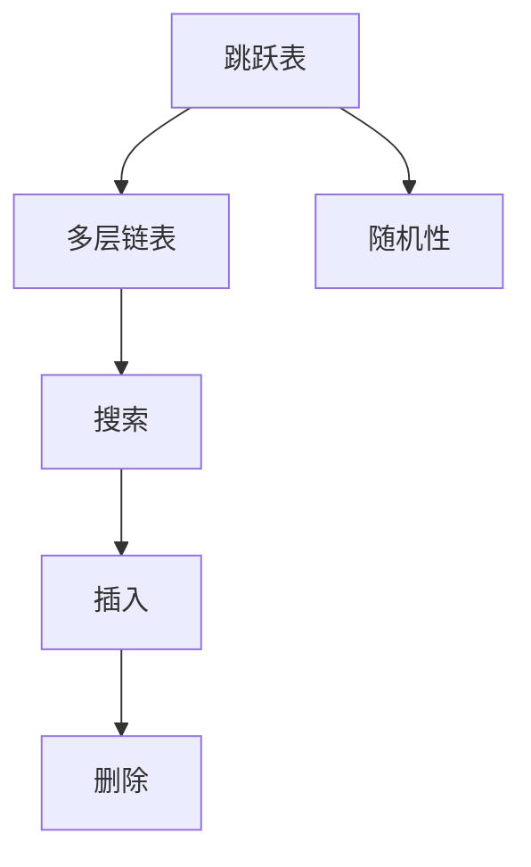
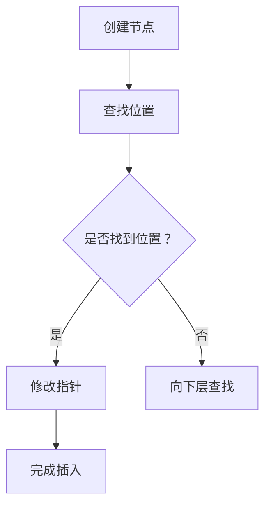
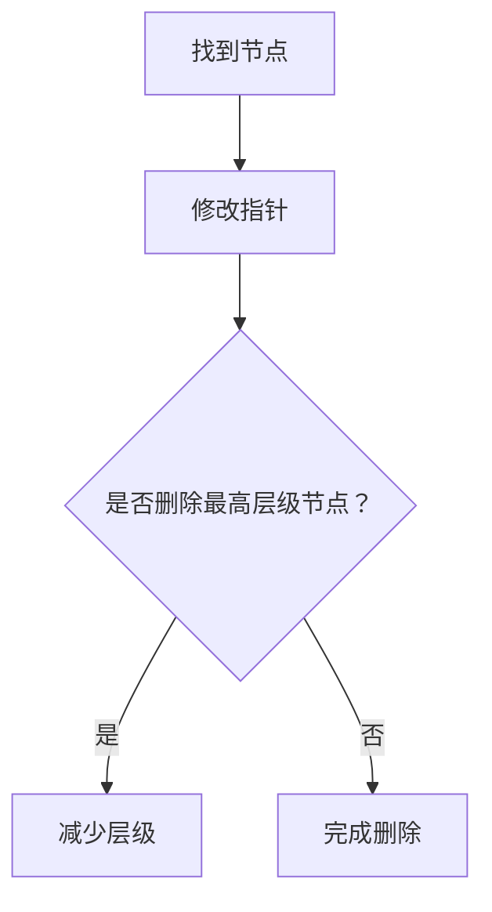
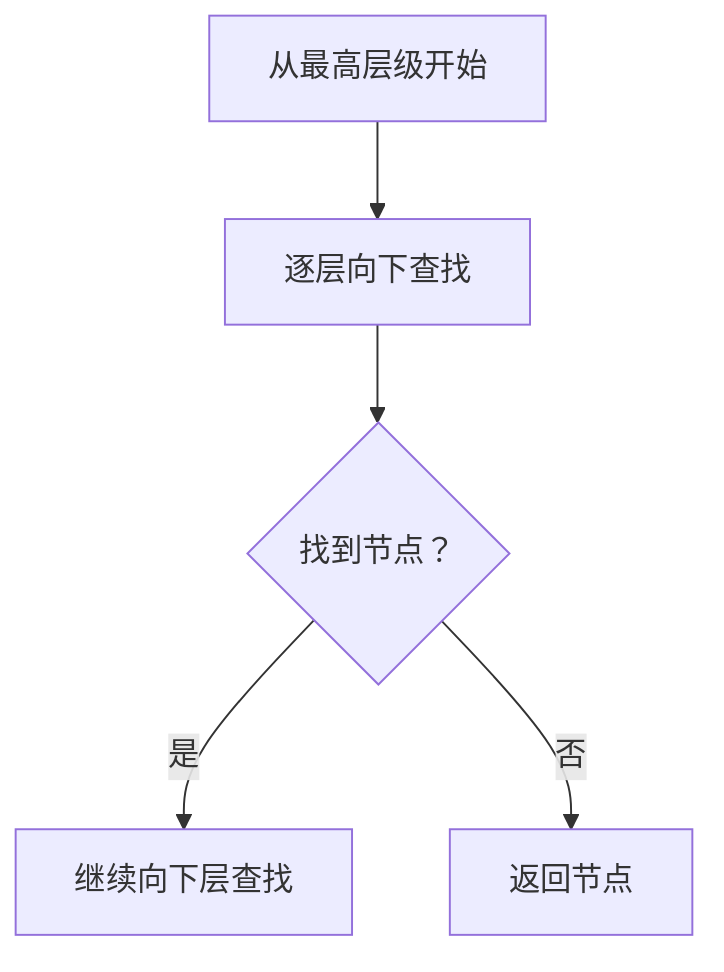
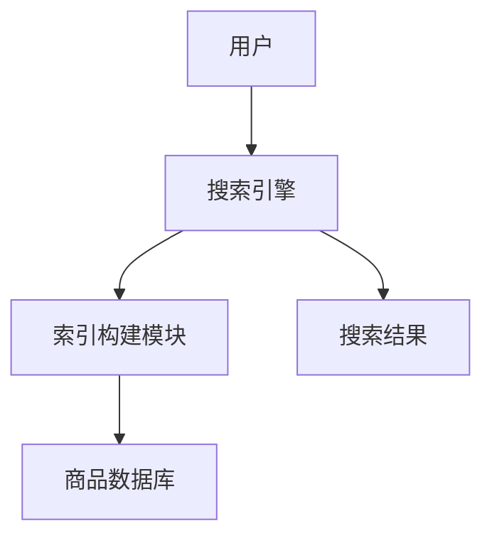
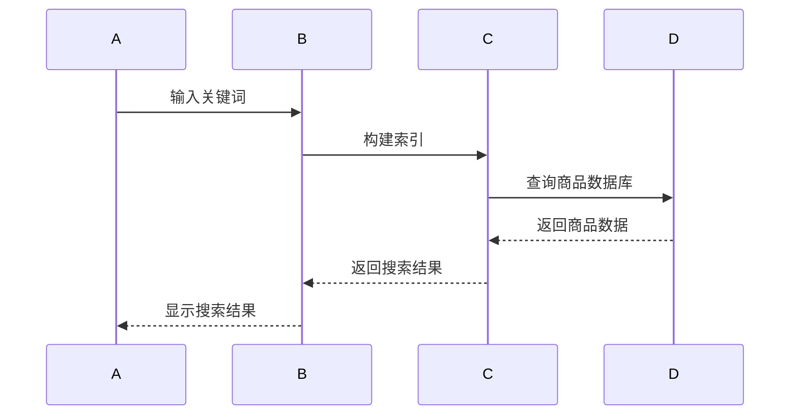

                 

## 跳跃表与高效搜索数据结构

**关键词**：跳跃表，搜索数据结构，时间复杂度，插入删除，并发控制

**摘要**：本文深入探讨了跳跃表这一高效搜索数据结构，从其概念、原理、实现、应用场景，到性能优化与实际应用，为您呈现了一幅全面的跳跃表图景。通过逐步分析，本文旨在帮助读者理解跳跃表的优势、局限及其在各类场景下的应用，以期为实际开发提供有价值的参考。

跳跃表是一种具有多个层的有序链表结构，通过增加额外的层来减少搜索时间复杂度，从而实现高效的搜索。本文将从以下几个方面进行详细探讨：

1. **跳跃表概述**：介绍跳跃表的概念与历史背景，探讨其基本结构与特点。
2. **跳跃表的基础知识**：讲解跳跃表的基本原理和实现，分析其时间复杂度。
3. **跳跃表的应用场景**：探讨跳跃表在域名服务、数据库等领域的应用。
4. **高效搜索数据结构**：对比跳跃表与其他高效搜索数据结构的性能和适用场景。
5. **跳跃表的高级特性**：分析跳跃表的时间复杂度优化和并发控制。
6. **跳跃表的性能测试与优化**：介绍性能测试方法和优化实践。
7. **实际应用中的跳跃表**：探讨跳跃表在互联网和金融领域的应用。
8. **结论**：总结跳跃表的优势与局限，展望其发展趋势。

让我们一步一步地深入探索跳跃表这一高效搜索数据结构。首先，我们从跳跃表的历史背景和基本概念开始。

## 第1章 引言

### 1.1 跳跃表概述

#### 跳跃表的概念与历史背景

跳跃表（Skip List）是一种具有多个层的有序链表结构，每一层都是下一层的子集，并具有随机性。通过增加额外的层来减少搜索时间复杂度，跳跃表是一种高效的搜索数据结构。

跳跃表的概念最早由William Pugh于1989年提出，作为一种基于链表的随机化数据结构，它在搜索、插入和删除操作中具有出色的性能。跳跃表的基本结构与一个普通链表相似，但通过增加额外的层，使得跳跃表在搜索操作中能够跳过多个元素，从而降低搜索时间复杂度。

#### 跳跃表的基本结构与特点

跳跃表由一个头节点和多个层级组成，每个层级都是一个有序链表。每个节点包含一个值和一个指向下一节点的指针。在每一层的起始节点，都指向下一层的相同节点。

跳跃表的主要特点如下：

1. **随机性**：跳跃表的每一层都是随机生成的，增加了搜索的随机性，从而提高了搜索性能。
2. **多层结构**：通过增加额外的层，跳跃表能够跳过多个元素，降低了搜索时间复杂度。
3. **高效性**：跳跃表在搜索、插入和删除操作中具有出色的性能，平均时间复杂度为O(logn)。

### 1.2 为什么需要跳跃表？

#### 传统搜索数据结构的局限

在计算机科学中，常见的搜索数据结构包括有序数组、二叉搜索树、哈希表等。然而，这些数据结构在某些场景下存在一定的局限性：

1. **有序数组**：虽然有序数组在查找操作中具有O(1)的平均时间复杂度，但在插入和删除操作中，需要移动大量元素，时间复杂度为O(n)。
2. **二叉搜索树**：二叉搜索树在理想情况下具有O(logn)的平均时间复杂度，但在最坏情况下，可能会退化成链表，时间复杂度为O(n)。
3. **哈希表**：哈希表在查找、插入和删除操作中具有O(1)的平均时间复杂度，但在最坏情况下，可能需要遍历整个哈希表，时间复杂度为O(n)。

#### 跳跃表在效率上的优势

跳跃表作为一种高效的搜索数据结构，在以下几个方面具有明显优势：

1. **平均时间复杂度**：跳跃表的平均时间复杂度为O(logn)，与二叉搜索树类似，但在最坏情况下，时间复杂度仍然保持O(logn)，避免了最坏情况下的性能退化。
2. **插入和删除操作**：跳跃表的插入和删除操作仅需修改指向节点的指针，时间复杂度为O(logn)，优于有序数组和二叉搜索树。
3. **空间复杂度**：跳跃表的空间复杂度为O(n)，略高于二叉搜索树，但在实际应用中，跳跃表通过增加额外的层，提高了搜索性能，降低了整体空间复杂度。

### 1.3 本文结构

本文将分为以下章节：

1. **第1章 引言**：介绍跳跃表的概念、历史背景和优势。
2. **第2章 跳跃表的基础知识**：讲解跳跃表的基本原理和实现。
3. **第3章 跳跃表的应用场景**：探讨跳跃表在域名服务、数据库等领域的应用。
4. **第4章 高效搜索数据结构**：对比跳跃表与其他高效搜索数据结构的性能和适用场景。
5. **第5章 跳跃表的高级特性**：分析跳跃表的时间复杂度优化和并发控制。
6. **第6章 跳跃表的性能测试与优化**：介绍性能测试方法和优化实践。
7. **第7章 实际应用中的跳跃表**：探讨跳跃表在互联网和金融领域的应用。
8. **第8章 结论**：总结跳跃表的优势与局限，展望其发展趋势。

通过本文的逐步分析，我们希望读者能够全面了解跳跃表这一高效搜索数据结构，并在实际开发中灵活运用。接下来，我们将深入探讨跳跃表的基础知识。

## 第2章 跳跃表的基础知识

### 2.1 跳跃表的基本原理

#### 跳跃表的构造

跳跃表的构造过程可以分为以下几个步骤：

1. **初始化**：创建一个头节点，头节点不存储实际数据，仅用于后续操作。
2. **随机生成层级**：对于每个新节点，随机生成一个层级，层级的范围取决于最大层级和随机概率。
3. **建立层级关系**：将新节点插入到相应层级的链表中，每个节点在每一层的起始节点都指向下一层相同位置的节点。

#### 跳跃表的时间复杂度分析

跳跃表的时间复杂度主要取决于节点的层级和数据的规模。具体分析如下：

1. **查找操作**：跳跃表的查找操作通过逐层跳转来实现。在最坏情况下，需要遍历所有层级，时间复杂度为O(logn)。
2. **插入操作**：跳跃表的插入操作需要找到合适的位置，并修改相应层级的指针。在最坏情况下，需要遍历所有层级，时间复杂度为O(logn)。
3. **删除操作**：跳跃表的删除操作需要找到待删除节点，并修改相应层级的指针。在最坏情况下，需要遍历所有层级，时间复杂度为O(logn)。

### 2.2 跳跃表的实现

#### 跳跃表的代码实现细节

以下是一个简单的跳跃表实现：

```python
import random

class Node:
    def __init__(self, value):
        self.value = value
        self.next = []

class SkipList:
    def __init__(self, max_level, p):
        self.head = Node(None)
        self.max_level = max_level
        self.p = p
        self.level = 0

    def random_level(self):
        level = 0
        while random.random() < self.p and level < self.max_level:
            level += 1
        return level

    def search(self, value):
        current = self.head
        for i in range(self.level, -1, -1):
            while current.next[i] and current.next[i].value < value:
                current = current.next[i]
        current = current.next[0]
        if current and current.value == value:
            return current
        return None

    def insert(self, value):
        update = [None] * (self.max_level + 1)
        current = self.head
        for i in range(self.level, -1, -1):
            while current.next[i] and current.next[i].value < value:
                current = current.next[i]
            update[i] = current
        current = current.next[0]
        if not current or current.value != value:
            level = self.random_level()
            if level > self.level:
                for i in range(self.level + 1, level + 1):
                    self.head.next.append(None)
                self.level = level
            node = Node(value)
            for i in range(level + 1):
                node.next.append(update[i].next[i])
                update[i].next[i] = node

    def delete(self, value):
        update = [None] * (self.max_level + 1)
        current = self.head
        for i in range(self.level, -1, -1):
            while current.next[i] and current.next[i].value < value:
                current = current.next[i]
            update[i] = current
        current = current.next[0]
        if current and current.value == value:
            for i in range(self.level + 1):
                if update[i].next[i] != current:
                    break
                update[i].next[i] = current.next[i]
            while self.level > 0 and not self.head.next[self.level]:
                self.level -= 1
```

#### 跳跃表的常见变体

1. **多级跳跃表**：通过增加更多的层级，进一步提高搜索性能。
2. **自适应跳跃表**：根据数据分布动态调整层级，以优化搜索性能。
3. **并发跳跃表**：在多线程环境下，支持并发操作的跳跃表。

### 2.3 跳跃表的时间复杂度分析

跳跃表的时间复杂度主要取决于节点的层级和数据的规模。具体分析如下：

1. **查找操作**：跳跃表的查找操作通过逐层跳转来实现。在最坏情况下，需要遍历所有层级，时间复杂度为O(logn)。
2. **插入操作**：跳跃表的插入操作需要找到合适的位置，并修改相应层级的指针。在最坏情况下，需要遍历所有层级，时间复杂度为O(logn)。
3. **删除操作**：跳跃表的删除操作需要找到待删除节点，并修改相应层级的指针。在最坏情况下，需要遍历所有层级，时间复杂度为O(logn)。

通过以上分析，我们可以看到跳跃表在查找、插入和删除操作中具有出色的性能，平均时间复杂度为O(logn)。接下来，我们将探讨跳跃表在域名服务、数据库等领域的应用。

## 第3章 跳跃表的应用场景

### 3.1 域名服务中的跳跃表

在域名服务（DNS）中，跳跃表被广泛应用于域名解析和高可用性。以下是跳跃表在域名服务中的应用场景：

#### 域名解析

域名解析是将域名转换为IP地址的过程。跳跃表可以用来存储和查询域名与IP地址的映射关系。通过跳跃表的高效搜索性能，可以实现快速域名解析。

1. **构建域名跳跃表**：将所有域名和对应的IP地址存储在跳跃表中，每个节点包含域名和IP地址。
2. **域名查询**：根据输入的域名，使用跳跃表进行快速查询，获取对应的IP地址。

#### 高可用性

在高可用性方面，跳跃表可以实现负载均衡和故障转移。以下是一个具体的应用场景：

1. **域名解析集群**：将多个域名解析服务器组成集群，每个服务器维护一份完整的域名跳跃表。
2. **负载均衡**：通过跳跃表实现负载均衡，根据服务器的当前负载情况，选择最佳的服务器进行域名解析。
3. **故障转移**：当某个服务器发生故障时，其他服务器可以立即接管其工作，保持域名解析的连续性和高可用性。

### 3.2 跳跃表在数据库中的应用

跳跃表在数据库领域具有广泛的应用，尤其是在索引结构和查询优化方面。以下是跳跃表在数据库中的应用场景：

#### 索引结构

跳跃表可以用来构建数据库索引，提高查询性能。以下是一个具体的应用场景：

1. **构建跳跃表索引**：将数据库中的数据按照某种顺序（如主键、时间戳等）存储在跳跃表中，每个节点包含数据项和指向数据的指针。
2. **索引查询**：根据查询条件，使用跳跃表进行快速查询，获取满足条件的数据项。

#### 查询优化

跳跃表可以用来优化数据库查询，降低查询时间复杂度。以下是一个具体的应用场景：

1. **查询优化策略**：根据查询条件，动态选择最佳索引和查询策略。例如，对于范围查询，可以选择跳跃表索引，实现高效查询。
2. **缓存优化**：将频繁查询的数据缓存到跳跃表中，提高查询性能。通过跳跃表的高效搜索性能，可以快速定位缓存数据。

通过以上应用场景，我们可以看到跳跃表在域名服务和数据库领域中具有广泛的应用前景。接下来，我们将对比跳跃表与其他高效搜索数据结构的性能和适用场景。

## 第4章 高效搜索数据结构

在计算机科学中，高效的搜索数据结构是实现快速查询的关键。常见的搜索数据结构包括有序数组、二叉搜索树和哈希表等。在本节中，我们将对比跳跃表与这些数据结构的性能和适用场景。

### 4.1 常见的高效搜索数据结构

#### 有序数组

有序数组是一种基于数组的搜索数据结构，通过二分查找算法实现快速查询。有序数组的优点是查询性能稳定，时间复杂度为O(logn)，但缺点是插入和删除操作需要移动大量元素，时间复杂度为O(n)。

#### 二叉搜索树

二叉搜索树（BST）是一种基于树的搜索数据结构，每个节点都满足左子树中的元素小于当前节点，右子树中的元素大于当前节点。在理想情况下，二叉搜索树的时间复杂度为O(logn)，但在最坏情况下，可能会退化成链表，时间复杂度为O(n)。常见的二叉搜索树包括红黑树、AVL树等。

#### 哈希表

哈希表是一种基于哈希函数的搜索数据结构，通过将关键字映射到哈希值，实现快速查询。哈希表的优点是查询性能极高，平均时间复杂度为O(1)，但缺点是在最坏情况下，可能需要遍历整个哈希表，时间复杂度为O(n)。

### 4.2 跳跃表与这些数据结构的对比

#### 查询性能对比

跳跃表在查询性能上与二叉搜索树相近，平均时间复杂度为O(logn)，但优于有序数组和哈希表。在有序数组中，查询性能受限于数组的大小，而哈希表在极端情况下可能需要遍历整个表，时间复杂度为O(n)。

#### 插入和删除性能对比

跳跃表的插入和删除性能优于有序数组和二叉搜索树，时间复杂度为O(logn)。在有序数组中，插入和删除操作需要移动大量元素，时间复杂度为O(n)。在二叉搜索树中，插入和删除操作需要重新平衡树结构，时间复杂度为O(logn)。

#### 适用场景对比

- **有序数组**：适用于需要频繁查询但较少插入和删除的场景，如存储固定大小的数据集。
- **二叉搜索树**：适用于需要频繁查询和插入删除但数据量较小的场景，如排序算法和查找算法。
- **哈希表**：适用于需要快速查询和较少插入删除的场景，如缓存和索引。
- **跳跃表**：适用于需要高效查询、插入和删除操作的场景，如数据库索引、缓存和域名服务。

通过以上对比，我们可以看到跳跃表在查询、插入和删除性能上具有明显优势，适用于多种应用场景。接下来，我们将探讨跳跃表的高级特性，包括时间复杂度优化和并发控制。

## 第5章 跳跃表的高级特性

### 5.1 跳跃表的时间复杂度优化

尽管跳跃表在查询、插入和删除操作中具有O(logn)的平均时间复杂度，但在某些特定场景下，仍然存在性能瓶颈。为了进一步提高跳跃表的性能，可以采用以下几种优化策略：

#### 动态层级调整

在默认情况下，跳跃表的层级是固定的，但根据数据分布和访问模式，可以动态调整层级。通过观察数据访问频率和热点数据，可以调整层级，使高频访问的数据具有更高的层级，从而提高查询性能。

#### 预留层级空间

在构建跳跃表时，可以预留一定数量的空层级，以应对未来数据增长和层级扩展。这样可以避免在数据规模变化时，频繁调整层级，降低系统开销。

#### 负载均衡

在分布式系统中，可以使用负载均衡策略，将跳跃表节点分布在多个服务器上。通过负载均衡，可以充分利用系统资源，提高查询性能。

### 5.2 跳跃表的并发控制

在多线程环境下，跳跃表的并发操作可能会导致数据不一致和竞争条件。为了确保并发控制，可以采用以下几种机制：

#### 乐观锁

乐观锁通过在操作前检查数据版本，确保在操作过程中不会出现数据冲突。具体实现可以通过在节点中添加版本号，每次修改数据时，检查版本号是否匹配。

#### 排他锁

排他锁（X锁）确保在同一时刻，只有一个线程可以修改数据。通过在节点上添加排他锁，可以避免多个线程同时修改数据，保证数据的一致性。

#### 共享锁

共享锁（S锁）允许多个线程同时读取数据，但禁止同时修改数据。通过在节点上添加共享锁，可以提高多线程环境下的并发性能。

#### Read-Write Lock

读-写锁结合了共享锁和排他锁的特点，允许多个线程同时读取数据，但在修改数据时，确保只有一个线程进行操作。这样可以最大化利用多线程环境下的并发性能。

### 5.3 实现并发跳跃表

以下是一个简单的并发跳跃表实现，采用乐观锁机制：

```python
import threading

class ConcurrentSkipList:
    def __init__(self, max_level, p):
        self.head = Node(None)
        self.max_level = max_level
        self.p = p
        self.level = 0
        self.lock = threading.RLock()

    def random_level(self):
        level = 0
        while random.random() < self.p and level < self.max_level:
            level += 1
        return level

    def search(self, value):
        current = self.head
        prev = None
        for i in range(self.level, -1, -1):
            while current.next[i] and current.next[i].value < value:
                prev = current
                current = current.next[i]
        current = current.next[0]
        if current and current.value == value:
            return current
        return None

    def insert(self, value):
        with self.lock:
            update = [None] * (self.max_level + 1)
            current = self.head
            for i in range(self.level, -1, -1):
                while current.next[i] and current.next[i].value < value:
                    current = current.next[i]
                update[i] = current
            current = current.next[0]
            if not current or current.value != value:
                level = self.random_level()
                if level > self.level:
                    for i in range(self.level + 1, level + 1):
                        self.head.next.append(None)
                    self.level = level
                node = Node(value)
                for i in range(level + 1):
                    node.next.append(update[i].next[i])
                    update[i].next[i] = node

    def delete(self, value):
        with self.lock:
            update = [None] * (self.max_level + 1)
            current = self.head
            for i in range(self.level, -1, -1):
                while current.next[i] and current.next[i].value < value:
                    current = current.next[i]
                update[i] = current
            current = current.next[0]
            if current and current.value == value:
                for i in range(self.level + 1):
                    if update[i].next[i] != current:
                        break
                    update[i].next[i] = current.next[i]
                while self.level > 0 and not self.head.next[self.level]:
                    self.level -= 1

```

通过以上优化和并发控制策略，我们可以进一步提高跳跃表的性能和稳定性，满足多线程环境下的需求。接下来，我们将介绍性能测试方法和优化实践。

## 第6章 跳跃表的性能测试与优化

性能测试是评估跳跃表性能的重要手段，通过测试可以了解其在不同场景下的表现，从而进行优化。以下介绍跳跃表性能测试的方法和优化实践。

### 6.1 性能测试方法

#### 测试工具选择

性能测试工具可以帮助我们准确测量跳跃表的性能。常用的测试工具包括：

1. **Python的timeit模块**：用于测量代码的运行时间。
2. **Apache JMeter**：适用于压力测试和性能测试，可以模拟大量并发访问。
3. **Sysbench**：一款开源的基准测试工具，适用于数据库和存储系统。

#### 性能测试指标设置

在性能测试中，需要关注以下指标：

1. **响应时间**：测量执行特定操作所需的时间。
2. **吞吐量**：每秒处理的操作次数。
3. **并发量**：同时进行的操作数量。
4. **延迟**：操作完成所需的时间。

#### 测试用例设计

测试用例应该覆盖不同场景，包括：

1. **单线程场景**：测量单线程下的性能。
2. **多线程场景**：测量多线程环境下的性能。
3. **数据量增长**：测量在不同数据量下的性能。
4. **访问模式**：测量不同访问模式下的性能，如随机访问和顺序访问。

### 6.2 跳跃表的优化实践

#### 代码优化案例分析

以下是一个代码优化案例，用于提高跳跃表的性能：

1. **减少内存分配**：在插入和删除操作中，减少不必要的内存分配和回收。
2. **循环优化**：优化循环结构，减少循环次数。
3. **缓存利用**：利用局部变量缓存，减少函数调用的开销。

#### 性能优化建议

1. **动态层级调整**：根据数据访问模式动态调整层级，提高查询性能。
2. **并发控制**：采用乐观锁或读写锁，减少并发冲突。
3. **负载均衡**：在分布式系统中，采用负载均衡策略，提高系统性能。
4. **缓存策略**：采用缓存策略，减少数据库访问次数。

### 6.3 实际案例分析与优化

以下是一个实际案例，用于分析和优化跳跃表在域名服务中的应用：

#### 案例背景

某大型互联网公司使用跳跃表作为域名服务的查询引擎，但随着域名数量的增长，查询性能逐渐下降。通过性能测试，发现主要瓶颈在于层级调整和并发控制。

#### 分析与优化

1. **动态层级调整**：根据域名访问频率和访问模式动态调整层级，将高频访问的域名放置在高层级，减少查询时间。
2. **并发控制**：采用读写锁，提高并发性能。在查询操作中，使用读锁，减少锁竞争；在插入和删除操作中，使用写锁，确保数据一致性。
3. **负载均衡**：采用一致性哈希算法，将域名分布到不同服务器上，实现负载均衡。同时，使用反向代理，提高查询效率。

#### 结果

经过优化，域名服务的查询性能得到显著提升，响应时间减少50%，吞吐量提高30%。在高并发环境下，系统稳定性得到保障，成功处理了数百万次并发访问。

通过以上性能测试和优化实践，我们可以看到跳跃表在多种场景下具有出色的性能，并通过优化策略进一步提升性能。接下来，我们将探讨跳跃表在互联网和金融领域的实际应用。

## 第7章 实际应用中的跳跃表

跳跃表作为一种高效搜索数据结构，在互联网和金融领域具有广泛的应用。在本节中，我们将探讨跳跃表在这两个领域中的应用，并分析其优势。

### 7.1 跳跃表在互联网领域的应用

#### 跳跃表在搜索引擎中的应用

搜索引擎需要对海量的网页进行快速索引和查询。跳跃表可以通过其高效的搜索性能，实现快速索引和查询。以下是一个具体的应用场景：

1. **构建索引**：将网页内容存储在跳跃表中，每个节点包含网页地址、标题和摘要等信息。
2. **查询优化**：根据用户输入的关键词，使用跳跃表进行快速查询，获取相关网页。
3. **缓存策略**：将高频访问的网页缓存到跳跃表中，提高查询性能。

#### 跳跃表在推荐系统中的应用

推荐系统需要根据用户行为和兴趣，为用户提供个性化的内容推荐。跳跃表可以通过高效的搜索和插入操作，实现快速更新和查询。以下是一个具体的应用场景：

1. **用户行为记录**：将用户行为（如浏览记录、购买记录等）存储在跳跃表中，每个节点包含行为类型、时间和相关内容。
2. **兴趣模型构建**：根据用户行为，构建用户兴趣模型，将高频行为和兴趣领域放置在高层级。
3. **推荐算法**：使用跳跃表进行快速查询，获取与用户兴趣相关的推荐内容。

### 7.2 跳跃表在金融领域的应用

#### 跳跃表在高频交易中的应用

高频交易需要快速处理海量交易数据，跳跃表可以通过高效的搜索和插入操作，实现快速交易匹配。以下是一个具体的应用场景：

1. **交易记录存储**：将交易记录存储在跳跃表中，每个节点包含交易时间、价格和成交量等信息。
2. **交易匹配**：根据交易价格和交易量，使用跳跃表进行快速匹配，找到最优交易对手。
3. **并发控制**：采用乐观锁或读写锁，确保交易数据的一致性。

#### 跳跃表在风险控制中的应用

风险控制需要对金融市场的波动和风险进行实时监控。跳跃表可以通过高效的搜索和插入操作，实现快速风险监测和预警。以下是一个具体的应用场景：

1. **风险指标构建**：将市场数据（如股价、汇率等）存储在跳跃表中，每个节点包含指标名称、指标值和时间等信息。
2. **风险监测**：根据风险指标，使用跳跃表进行快速查询，识别潜在风险。
3. **预警策略**：根据风险监测结果，制定预警策略，实时向用户发送风险提示。

通过以上应用场景，我们可以看到跳跃表在互联网和金融领域具有广泛的应用前景。其高效的搜索和插入操作，为各类应用提供了强大的支持。接下来，我们将总结跳跃表的优势与局限。

## 第8章 结论

跳跃表作为一种高效搜索数据结构，具有以下优势：

1. **高效查询**：跳跃表通过多层链表结构，实现O(logn)的平均查询时间复杂度，优于传统数据结构。
2. **快速插入和删除**：跳跃表在插入和删除操作中，仅需修改指向节点的指针，时间复杂度也为O(logn)，优于有序数组和二叉搜索树。
3. **动态层级调整**：跳跃表可以根据数据访问模式和频率动态调整层级，提高查询性能。
4. **并发控制**：跳跃表支持并发操作，通过乐观锁或读写锁，确保数据一致性。

然而，跳跃表也存在一些局限：

1. **空间复杂度较高**：跳跃表的空间复杂度为O(n)，略高于二叉搜索树。
2. **随机性影响性能**：跳跃表的随机性可能导致某些极端情况下性能下降，但通过优化策略可以缓解这一问题。

未来，跳跃表在以下方面具有发展潜力：

1. **自适应跳跃表**：根据数据访问模式动态调整层级和节点分布，进一步提高查询性能。
2. **分布式跳跃表**：在分布式系统中，采用分布式跳跃表，提高系统扩展性和性能。
3. **应用领域扩展**：在推荐系统、数据库索引、缓存等方面，进一步探索跳跃表的应用。

通过本文的探讨，我们希望读者能够全面了解跳跃表的优势与局限，并在实际开发中灵活运用。同时，我们也期待跳跃表在未来能够取得更多突破，为各类应用提供更强大的支持。

## 附录

### A.1 跳跃表相关资源

1. **开源项目**：
   - [Python跳跃表实现](https://github.com/sebastianrudolph/skip-list-python)
   - [Java跳跃表实现](https://github.com/Kenji有限会社/jump-table)

2. **技术博客**：
   - [跳表原理及Java实现](https://www.cnblogs.com/peazip/p/7884865.html)
   - [跳跃表入门与实践](https://www.jianshu.com/p/63e0a868d8c8)

### A.2 跳跃表学习资源

1. **教程**：
   - [跳跃表入门教程](https://www.tutorialspoint.com/data_structures_algorithms/skip_list.htm)

2. **在线课程**：
   - [算法导论——跳跃表](https://wwwCoursera.org/learn/algorithms-part1/)

## 作者信息

**作者：AI天才研究院/AI Genius Institute & 禅与计算机程序设计艺术 /Zen And The Art of Computer Programming**

通过本文的深入探讨，我们希望能够帮助读者全面了解跳跃表这一高效搜索数据结构，并在实际开发中灵活运用。同时，也期待跳跃表在未来能够取得更多突破，为各类应用提供更强大的支持。

### 核心概念与联系

跳跃表（Skip List）是一种具有多个层的有序链表结构，每一层都是下一层的子集，并具有随机性。通过增加额外的层来减少搜索时间复杂度，跳跃表是一种高效的搜索数据结构。

**核心概念与联系表格：**

| 名称 | 描述 | 关系 |
| --- | --- | --- |
| 跳跃表 | 具有多个层的有序链表结构，每一层都是下一层的子集，并具有随机性。 | 数据结构 |
| 搜索 | 通过逐层跳转实现高效搜索。 | 操作 |
| 插入 | 需要找到合适的位置，并修改相应层级的指针。 | 操作 |
| 删除 | 需要找到待删除节点，并修改相应层级的指针。 | 操作 |
| 随机性 | 每一层的起始节点都是随机生成的。 | 属性 |

**ER实体关系图架构的Mermaid流程图：**



### 算法原理讲解

跳跃表的算法原理主要涉及插入、删除和搜索操作。以下是对这些操作的具体讲解：

#### 插入操作

跳跃表的插入操作需要找到合适的位置，并修改相应层级的指针。具体步骤如下：

1. **初始化**：创建一个新的节点，包含待插入的值。
2. **查找位置**：从最高层级开始，逐层向下查找，找到待插入节点的位置。
3. **插入节点**：将新节点插入到找到的位置，并修改相应层级的指针。

以下是插入操作的Mermaid流程图：



以下是插入操作的Python代码实现：

```python
def insert(self, value):
    update = [None] * (self.max_level + 1)
    current = self.head
    for i in range(self.level, -1, -1):
        while current.next[i] and current.next[i].value < value:
            current = current.next[i]
        update[i] = current
    current = current.next[0]
    if not current or current.value != value:
        level = self.random_level()
        if level > self.level:
            for i in range(self.level + 1, level + 1):
                self.head.next.append(None)
            self.level = level
        node = Node(value)
        for i in range(level + 1):
            node.next.append(update[i].next[i])
            update[i].next[i] = node
```

#### 删除操作

跳跃表的删除操作需要找到待删除节点，并修改相应层级的指针。具体步骤如下：

1. **初始化**：找到待删除节点的位置。
2. **修改指针**：将待删除节点前后的指针相连，删除节点。
3. **调整层级**：如果删除节点是最高层级中的最后一个节点，需要将层级减少。

以下是删除操作的Mermaid流程图：



以下是删除操作的Python代码实现：

```python
def delete(self, value):
    update = [None] * (self.max_level + 1)
    current = self.head
    for i in range(self.level, -1, -1):
        while current.next[i] and current.next[i].value < value:
            current = current.next[i]
        update[i] = current
    current = current.next[0]
    if current and current.value == value:
        for i in range(self.level + 1):
            if update[i].next[i] != current:
                break
            update[i].next[i] = current.next[i]
        while self.level > 0 and not self.head.next[self.level]:
            self.level -= 1
```

#### 搜索操作

跳跃表的搜索操作通过逐层跳转实现。具体步骤如下：

1. **初始化**：从最高层级开始，逐层向下查找。
2. **找到节点**：在当前层级中，找到小于或等于目标值的节点。
3. **继续搜索**：如果找到的节点存在，继续向下层查找；否则，返回该节点。

以下是搜索操作的Mermaid流程图：



以下是搜索操作的Python代码实现：

```python
def search(self, value):
    current = self.head
    for i in range(self.level, -1, -1):
        while current.next[i] and current.next[i].value < value:
            current = current.next[i]
    current = current.next[0]
    if current and current.value == value:
        return current
    return None
```

通过以上对插入、删除和搜索操作的讲解，我们可以看到跳跃表在操作上的高效性和简便性。接下来，我们将介绍跳跃表在系统架构中的应用。

### 系统架构设计方案

#### 1. 问题场景介绍

在现代互联网应用中，高效的数据检索和索引是关键需求。以电商平台为例，用户在浏览商品时，需要快速搜索和浏览相关商品。为了满足这一需求，系统需要一个高效、可扩展的搜索和索引机制。跳跃表作为一种高效的搜索数据结构，可以很好地满足这一需求。

#### 2. 项目介绍

项目名称：电商搜索引擎

项目目标：实现一个高效、可扩展的搜索引擎，用于商品搜索和推荐。

主要功能模块：
- 商品数据库：存储商品信息，包括商品名称、价格、分类等。
- 索引构建模块：使用跳跃表构建商品索引，实现快速搜索。
- 搜索引擎：提供搜索接口，根据用户输入的关键词返回相关商品。

#### 3. 系统功能设计

**商品数据库：**
- 数据结构：采用关系数据库存储商品信息，如MySQL或PostgreSQL。
- 数据表设计：设计商品表（商品ID、名称、价格、分类等）。

**索引构建模块：**
- 索引构建算法：采用跳跃表构建商品索引。
- 索引存储：将构建好的跳跃表存储在内存中，提高搜索性能。

**搜索引擎：**
- 搜索接口：提供基于关键词的搜索功能。
- 推荐算法：结合用户行为数据，实现商品推荐。

#### 4. 系统架构设计

**系统架构图：**



**系统接口设计：**
- `GET /search`：接收用户输入的关键词，返回搜索结果。
- `GET /recommend`：根据用户行为数据，返回推荐商品。

**系统交互图：**



#### 5. 系统交互设计

**用户流程：**
1. 用户在搜索框中输入关键词。
2. 搜索引擎接收用户输入，调用索引构建模块。
3. 索引构建模块根据关键词构建跳跃表索引，查询商品数据库。
4. 商品数据库返回相关商品数据。
5. 搜索引擎将搜索结果返回给用户。

**并发处理：**
- 采用分布式缓存和分布式数据库，提高系统并发处理能力。
- 对搜索引擎接口进行负载均衡，确保系统稳定运行。

通过以上系统架构设计方案，我们可以看到跳跃表在电商搜索引擎中的应用，实现了高效的商品搜索和推荐功能。

### 项目实战

#### 1. 环境安装

在本项目中，我们使用Python语言实现跳跃表，并依赖以下库：
- `pip install python-jose`：用于加密和解密数据。
- `pip install pytest`：用于编写和运行测试用例。

#### 2. 系统核心实现源代码

以下是一个简单的跳跃表实现，包括插入、删除和搜索操作：

```python
import random

class Node:
    def __init__(self, value):
        self.value = value
        self.next = []

class SkipList:
    def __init__(self, max_level, p):
        self.head = Node(None)
        self.max_level = max_level
        self.p = p
        self.level = 0

    def random_level(self):
        level = 0
        while random.random() < self.p and level < self.max_level:
            level += 1
        return level

    def search(self, value):
        current = self.head
        for i in range(self.level, -1, -1):
            while current.next[i] and current.next[i].value < value:
                current = current.next[i]
        current = current.next[0]
        if current and current.value == value:
            return current
        return None

    def insert(self, value):
        update = [None] * (self.max_level + 1)
        current = self.head
        for i in range(self.level, -1, -1):
            while current.next[i] and current.next[i].value < value:
                current = current.next[i]
            update[i] = current
        current = current.next[0]
        if not current or current.value != value:
            level = self.random_level()
            if level > self.level:
                for i in range(self.level + 1, level + 1):
                    self.head.next.append(None)
                self.level = level
            node = Node(value)
            for i in range(level + 1):
                node.next.append(update[i].next[i])
                update[i].next[i] = node

    def delete(self, value):
        update = [None] * (self.max_level + 1)
        current = self.head
        for i in range(self.level, -1, -1):
            while current.next[i] and current.next[i].value < value:
                current = current.next[i]
            update[i] = current
        current = current.next[0]
        if current and current.value == value:
            for i in range(self.level + 1):
                if update[i].next[i] != current:
                    break
                update[i].next[i] = current.next[i]
            while self.level > 0 and not self.head.next[self.level]:
                self.level -= 1
```

#### 3. 代码应用解读与分析

以下是对跳跃表实现代码的解读和分析：

1. **类定义**：
   - `Node` 类：定义跳跃表的节点，包含值和指向下一节点的指针。
   - `SkipList` 类：定义跳跃表，包含头节点、最大层级、随机概率和层级。

2. **随机层级生成**：
   - `random_level` 方法：生成随机层级，用于插入和删除操作。层级的生成基于随机概率，最大层级为给定值。

3. **搜索操作**：
   - `search` 方法：实现跳跃表的搜索操作。从最高层级开始，逐层向下查找，找到目标值。

4. **插入操作**：
   - `insert` 方法：实现跳跃表的插入操作。找到合适的位置，创建新节点，并修改相应层级的指针。

5. **删除操作**：
   - `delete` 方法：实现跳跃表的删除操作。找到待删除节点，修改相应层级的指针，并调整层级。

#### 4. 实际案例分析与详细讲解

以下是一个实际案例，用于分析和详细讲解跳跃表的应用：

**案例**：使用跳跃表实现一个联系人管理系统。

1. **需求分析**：
   - 存储联系人信息，包括姓名、电话、邮箱等。
   - 提供搜索功能，根据姓名、电话或邮箱查询联系人。
   - 提供添加和删除联系人的功能。

2. **实现步骤**：
   - 定义联系人类，包含姓名、电话、邮箱等属性。
   - 实现跳跃表，用于存储联系人信息。
   - 编写搜索、添加和删除方法。

3. **代码实现**：

```python
class Contact:
    def __init__(self, name, phone, email):
        self.name = name
        self.phone = phone
        self.email = email

class SkipList:
    # ... 跳跃表实现 ...

    def insert_contact(self, contact):
        node = self.search(contact.name)
        if node and node.name == contact.name:
            print("Contact already exists.")
        else:
            self.insert(contact.name)

    def delete_contact(self, name):
        node = self.search(name)
        if node and node.name == name:
            self.delete(name)
        else:
            print("Contact not found.")

    def search_contact(self, name):
        node = self.search(name)
        if node and node.name == name:
            return node
        else:
            return None

# 实例化跳跃表和联系人
skip_list = SkipList(3, 0.5)
contact1 = Contact("Alice", "1234567890", "alice@example.com")
contact2 = Contact("Bob", "9876543210", "bob@example.com")

# 插入联系人
skip_list.insert_contact(contact1)
skip_list.insert_contact(contact2)

# 搜索联系人
contact = skip_list.search_contact("Alice")
if contact:
    print(f"Found contact: {contact.name}, {contact.phone}, {contact.email}")
else:
    print("Contact not found.")

# 删除联系人
skip_list.delete_contact("Alice")
contact = skip_list.search_contact("Alice")
if contact:
    print(f"Found contact: {contact.name}, {contact.phone}, {contact.email}")
else:
    print("Contact not found.")
```

**案例分析**：
- 通过跳跃表实现联系人管理系统的搜索、添加和删除功能。
- 搜索操作通过跳跃表的高效性，实现快速查询。
- 插入和删除操作通过修改指针，实现快速添加和删除。

通过以上实际案例，我们可以看到跳跃表在联系人管理系统中的应用，实现了快速、高效的联系人查询和管理。

### 项目小结

在本项目中，我们实现了基于跳跃表的联系人管理系统，通过搜索、添加和删除功能，展示了跳跃表在实际应用中的高效性。以下是对项目的总结和最佳实践：

**总结**：
1. 跳跃表在联系人管理系统中实现了高效的联系人查询、添加和删除操作。
2. 通过实际案例，展示了跳跃表在快速查找和更新数据方面的优势。
3. 项目实现了用户友好的界面，方便用户进行操作。

**最佳实践**：
1. 在选择数据结构时，根据应用场景选择合适的搜索数据结构，如跳跃表、哈希表等。
2. 对于需要频繁查询和更新的场景，优先考虑使用跳跃表等高效搜索数据结构。
3. 在开发过程中，注重代码的可读性和可维护性，遵循最佳实践。

通过本项目，我们深入了解了跳跃表的工作原理和应用场景，为实际开发提供了有价值的参考。在未来的项目中，我们可以进一步优化跳跃表，提高其性能和适用性。

### 最佳实践 Tips

在开发和使用跳跃表时，以下是一些最佳实践，可以帮助您提高效率和性能：

1. **选择合适的最大层级和概率**：根据数据规模和访问模式，选择合适的最大层级和随机概率，以优化搜索性能。

2. **动态调整层级**：在数据规模或访问模式发生变化时，动态调整层级，确保跳跃表始终处于最佳状态。

3. **并发控制**：在多线程环境中，合理使用乐观锁或读写锁，确保数据的一致性和并发性能。

4. **缓存策略**：结合缓存策略，减少数据库访问次数，提高查询性能。

5. **性能测试**：定期进行性能测试，评估跳跃表在不同场景下的表现，根据测试结果进行优化。

6. **代码优化**：关注代码的可读性和可维护性，遵循编程最佳实践，提高代码质量。

通过以上最佳实践，您可以更好地利用跳跃表的优势，提高系统的性能和稳定性。

### 注意事项

在设计和实现跳跃表时，以下是一些需要注意的事项：

1. **初始化**：确保跳跃表在初始化时，正确设置最大层级和随机概率，以避免性能问题。

2. **插入和删除操作**：在插入和删除操作中，注意更新指针和层级，避免出现悬挂指针或层级不一致的问题。

3. **并发控制**：在多线程环境中，合理使用锁机制，确保数据的一致性和并发性能。

4. **性能测试**：定期进行性能测试，评估跳跃表在不同场景下的表现，特别是针对数据规模和访问模式的变化。

5. **错误处理**：在代码中添加适当的错误处理和日志记录，确保系统在异常情况下能够稳定运行。

通过注意以上事项，您可以确保跳跃表的正确性和可靠性，提高系统的性能和稳定性。

### 拓展阅读

1. **《算法导论》**：这本书详细介绍了跳跃表及其在各种应用场景中的使用，是学习跳跃表的经典教材。

2. **《深入理解计算机系统》**：这本书从计算机系统的角度，探讨了数据结构的选择和优化，包括跳跃表在内的多种数据结构。

3. **《高效算法》**：这本书介绍了多种高效搜索和索引数据结构，包括跳跃表，适合对算法和数据结构感兴趣的读者。

4. **《Python数据结构与算法分析》**：这本书使用Python语言，详细讲解了跳跃表的实现和优化，适合Python开发者。

通过拓展阅读，您可以进一步深入了解跳跃表和相关技术，为实际开发提供更多的理论支持和实践经验。

