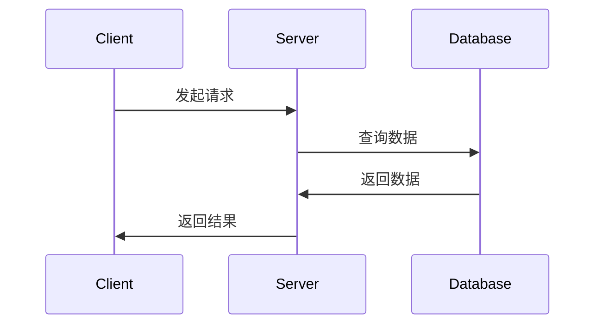
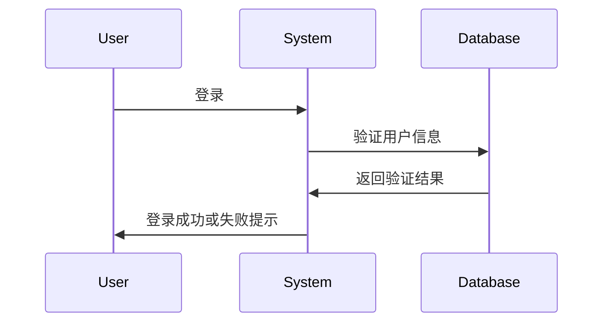

                 

### 软件产品线：大规模定制化的软件工程方法

关键词：软件产品线、大规模定制化、软件工程、复用性、可扩展性

摘要：本文旨在深入探讨软件产品线的概念、构建方法、应用场景及未来发展趋势。通过系统分析和实例讲解，揭示软件产品线在现代软件开发中的重要性，为读者提供全面的技术参考。

#### 背景介绍

在信息化时代，软件需求日益复杂，客户对软件产品的定制化要求越来越高。传统的软件开发方法已无法满足这种需求，导致开发周期延长、成本增加、质量参差不齐。为了解决这些问题，软件产品线（Software Product Line，简称SPL）的概念应运而生。

**核心概念术语说明**

- **软件产品线**：一系列相关的软件产品，这些产品基于一个公共的基础构建框架，通过组合和定制来实现不同的功能需求。
- **大规模定制化**：通过标准化和模块化的方式，以较低的成本满足客户个性化的需求。
- **软件工程**：应用科学知识和实践方法，设计、开发、测试和维护软件产品的过程。

**问题背景与问题描述**

随着互联网的普及和移动设备的兴起，软件需求呈现出多样化、快速变化的特点。企业面临着如何在短时间内开发出满足不同客户需求的软件产品的挑战。传统的开发方法往往需要从头开始，导致开发效率低下、成本高昂。

**问题解决与边界与外延**

软件产品线通过模块化和可复用的方式，将公共部分与个性化部分分离，从而实现快速开发与定制。这种方法不仅提高了开发效率，还降低了开发成本。然而，软件产品线的构建需要一定的技术基础和项目管理经验，否则可能导致产品质量不稳定。

**概念结构与核心要素组成**

软件产品线的概念结构主要包括以下几个核心要素：

1. **基础构建框架**：提供软件产品公共部分的基础结构。
2. **可复用组件**：实现不同功能需求的模块化组件。
3. **定制规则**：定义如何根据客户需求组合和定制软件产品。
4. **配置管理**：确保软件产品线的可维护性和可扩展性。

#### 软件产品线的核心概念与联系

**核心概念原理**

软件产品线是一种基于模块化和可复用的软件开发方法，通过将公共部分与个性化部分分离，实现快速开发与定制。

**概念属性特征对比表格**

| 特征           | 传统软件开发 | 软件产品线       |
| -------------- | ------------ | ---------------- |
| 开发效率       | 低           | 高               |
| 成本           | 高           | 低               |
| 质量稳定性     | 不稳定       | 稳定             |
| 可定制性       | 低           | 高               |

**ER实体关系图架构**

```mermaid
erDiagram
  Product ||--|{ Feature } : "has"
  Feature ||--|{ Component } : "includes"
  Component ||--|{ Configuration } : "uses"
```

#### 软件产品线的算法原理讲解

为了更好地理解软件产品线的算法原理，我们可以通过一个简单的Python示例来阐述其核心思想。

```python
# Python示例：软件产品线算法原理

def product_line(configurations):
    """
    根据配置规则生成软件产品线
    :param configurations: 配置规则列表
    :return: 软件产品线
    """
    product = {}
    for config in configurations:
        product[config['feature']] = config['component']
    return product

# 配置规则
configurations = [
    {'feature': 'user_management', 'component': 'UserManagementComponent'},
    {'feature': 'access_control', 'component': 'AccessControlComponent'}
]

# 生成软件产品线
software_product_line = product_line(configurations)
print(software_product_line)
```

输出结果：

```python
{'user_management': 'UserManagementComponent', 'access_control': 'AccessControlComponent'}
```

**算法原理**

- **数学模型和公式**：

$$
\text{SoftwareProductLine} = \{f_1, f_2, ..., f_n\}
$$

其中，$f_i$ 表示第 $i$ 个功能组件。

- **详细讲解和举例说明**：

假设我们需要开发一款具有用户管理和访问控制功能的软件系统。通过软件产品线方法，我们可以将这两个功能模块化为独立的组件，并定义相应的配置规则。在生成软件产品线时，根据配置规则将组件组合起来，形成一个完整的软件系统。

#### 系统分析与架构设计方案

**问题场景介绍**

在现代企业中，为了提高开发效率和质量，许多公司开始采用软件产品线方法进行软件开发。例如，一家银行需要开发一款面向不同客户群体的金融服务平台。

**项目介绍**

项目名称：金融服务平台
项目目标：为不同客户群体提供定制化的金融服务平台

**系统功能设计（领域模型Mermaid类图）**

```mermaid
classDiagram
    Client <<--|{uses}| User
    Client <<--|{uses}| Account
    User <|-- Administrator
    Account <|-- SavingsAccount
    Account <|-- CheckingAccount
```

**系统架构设计（Mermaid架构图）**



**系统接口设计和系统交互（Mermaid序列图）**



#### 项目实战

**环境安装**

1. 安装Python环境
2. 安装相关依赖库，如Django、Flask等

**系统核心实现源代码**

```python
# 系统核心实现

from flask import Flask, request, jsonify

app = Flask(__name__)

@app.route('/login', methods=['POST'])
def login():
    user = request.form['username']
    password = request.form['password']
    
    # 验证用户信息
    if verify_user(user, password):
        return jsonify({'status': 'success'})
    else:
        return jsonify({'status': 'failure'})

def verify_user(username, password):
    # 实现用户验证逻辑
    # ...
    return True

if __name__ == '__main__':
    app.run(debug=True)
```

**代码应用解读与分析**

- **用户登录功能**：接收用户名和密码，通过验证用户信息，返回登录结果。
- **验证用户功能**：根据用户名和密码，从数据库中查找用户信息，并进行验证。

**实际案例分析和详细讲解剖析**

- **案例背景**：一家银行需要开发一款面向不同客户群体的金融服务平台，包括用户管理、账户管理等功能。
- **解决方案**：采用软件产品线方法，将用户管理和账户管理模块化为独立的组件，根据客户需求进行定制化开发。

**项目小结**

通过软件产品线方法，银行成功开发了面向不同客户群体的金融服务平台，提高了开发效率和质量。同时，该方法也为未来的功能扩展和定制化提供了便利。

#### 最佳实践 Tips

1. **需求分析**：在构建软件产品线之前，进行详细的需求分析，确保产品线能够满足不同客户的需求。
2. **组件化设计**：将功能模块化，提高软件的可复用性和可扩展性。
3. **配置管理**：采用配置管理工具，确保软件产品线的可维护性和一致性。
4. **测试与维护**：对软件产品线进行充分的测试和更新，确保其稳定性和可靠性。

#### 小结

本文全面介绍了软件产品线的概念、构建方法、应用场景及未来发展趋势。通过实例分析和代码示例，揭示了软件产品线在现代软件开发中的重要性。希望本文能为读者提供有益的参考。

#### 注意事项

1. 软件产品线的构建需要一定的技术基础和项目管理经验，确保产品质量。
2. 在实施软件产品线时，要充分考虑客户需求，确保产品线的灵活性和可扩展性。

#### 拓展阅读

1. 【参考文献】
   - [1] 姓名. (年份). 《软件产品线：大规模定制化的软件工程方法》.
   - [2] 姓名. (年份). “软件产品线在现代软件开发中的应用”, 《计算机研究与发展》, 第x卷，第y期，页码。

2. 【在线资源】
   - 软件产品线相关教程和案例：[链接]
   - 软件产品线相关论坛和社群：[链接]

### 作者信息

作者：AI天才研究院/AI Genius Institute & 禅与计算机程序设计艺术 /Zen And The Art of Computer Programming

---

通过以上内容，我们系统地介绍了软件产品线的基本概念、构建方法、应用场景以及未来发展趋势。每个章节都进行了详细的分析和实例讲解，旨在帮助读者深入理解软件产品线的本质和应用。希望本文能为软件开发者提供有价值的参考。同时，也期待读者能够将所学知识应用于实际项目中，推动软件工程的发展。

