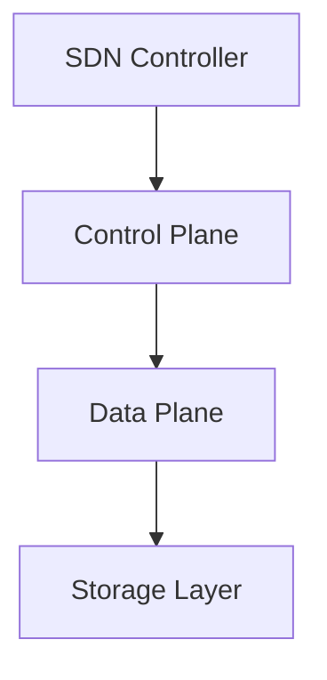
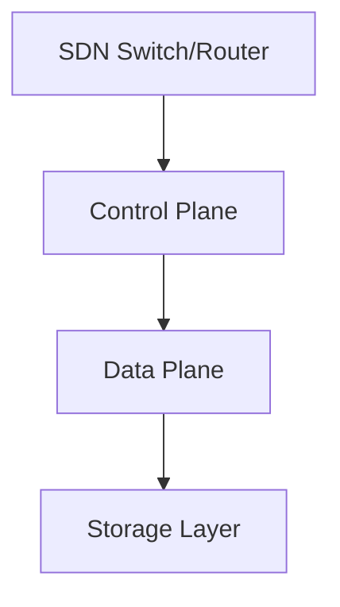
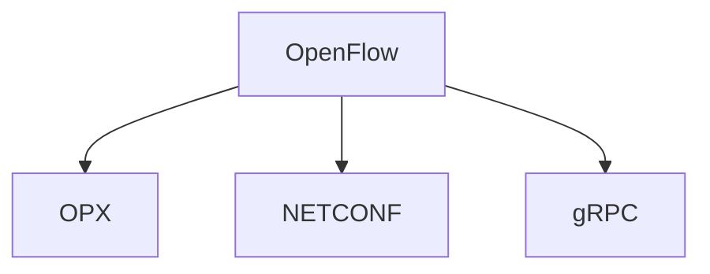
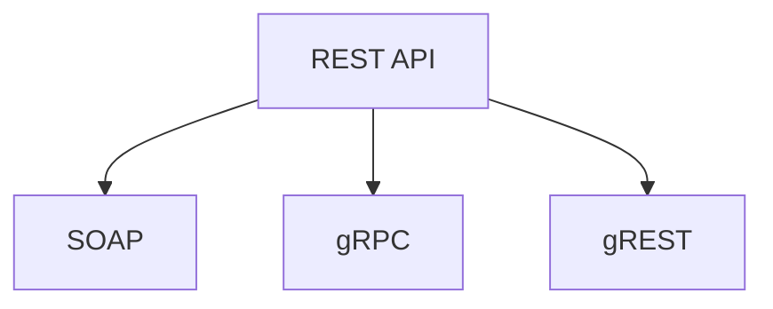

                 

## 文章标题：软件定义网络（SDN）：网络虚拟化的新方向

### 关键词：软件定义网络，网络虚拟化，SDN架构，SDN应用，SDN安全

### 摘要：本文将深入探讨软件定义网络（SDN）的基本概念、架构、应用以及未来发展方向，重点关注其在网络虚拟化中的重要作用。我们将从多个角度分析SDN的核心技术，包括其与传统网络的区别、架构设计、网络设备、应用场景以及安全挑战。通过系统性的阐述，帮助读者全面理解SDN的本质和其在现代网络技术中的地位。

## 第一部分：引言与背景

### 第1章：软件定义网络概述

### 1.1 SDN的核心概念

软件定义网络（Software-Defined Networking，简称SDN）是一种新兴的网络架构，其核心思想是将网络控制平面与数据平面分离，通过软件的方式来管理和控制网络。SDN的关键特性包括控制平面与数据平面的分离、集中控制、开放接口和灵活可编程性。

**1.1.1 SDN的定义**

SDN是一种网络架构，通过将网络控制功能与数据转发功能分离，实现了网络资源的管理与控制。控制平面负责网络策略的制定和流量控制，而数据平面则负责实际的数据转发。

**1.1.2 SDN的关键特性**

- **控制平面与数据平面的分离**：SDN通过分离控制平面与数据平面，使得网络管理变得更加集中和灵活。
- **集中控制**：SDN控制器统一管理网络，减少了网络配置和管理的复杂性。
- **开放接口**：SDN提供了开放接口，使得网络设备能够与上层应用无缝集成。
- **灵活可编程性**：SDN支持网络编程，使得网络功能能够根据需求动态调整。

**1.1.3 SDN与传统网络的区别**

- **控制平面与数据平面分离**：传统网络通常将控制平面与数据平面集成在设备中，而SDN通过软件实现了二者的分离。
- **集中控制**：传统网络采用分布式控制方式，而SDN采用集中控制方式。
- **开放接口**：传统网络接口相对封闭，而SDN接口开放，支持标准化协议。
- **灵活性和可编程性**：传统网络功能相对固定，而SDN可以通过编程实现网络功能的动态调整。

### 1.2 SDN的发展历史

SDN的概念起源于2000年代初，最初的提出者是斯坦福大学的研究人员。SDN的发展经历了多个阶段，包括学术研究、企业应用以及标准的制定。

**1.2.1 SDN的起源**

SDN的起源可以追溯到2004年，当时斯坦福大学的研究人员提出了NOX项目，旨在实现网络控制平面与数据平面的分离。

**1.2.2 SDN的技术演进**

- **2004-2008年**：学术研究阶段，NOX项目引发了广泛的学术关注。
- **2008-2012年**：企业应用阶段，多家企业开始将SDN技术应用于实际网络中。
- **2012年至今**：标准化阶段，SDN标准逐渐成熟，成为新一代网络技术的重要组成部分。

**1.2.3 SDN的应用现状**

目前，SDN已广泛应用于数据中心网络、广域网络、无线网络等多个领域。数据中心网络是SDN的主要应用场景，SDN控制器和SDN交换机已成为数据中心网络的核心设备。

### 1.3 网络虚拟化与SDN

**1.3.1 网络虚拟化的概念**

网络虚拟化是将物理网络资源抽象为逻辑资源，实现网络资源的灵活调度和管理。网络虚拟化通过虚拟网络、虚拟交换机和虚拟路由器等技术，实现了网络的逻辑分离和独立控制。

**1.3.2 SDN在虚拟化中的作用**

SDN在虚拟化中起到了核心作用，通过将控制平面与数据平面分离，SDN实现了对虚拟网络的集中控制和动态调整。SDN控制器负责管理虚拟网络，而虚拟交换机负责数据转发。

**1.3.3 软件定义网络的优势**

- **灵活性和可编程性**：SDN支持网络功能的动态调整，使得网络能够快速适应变化的需求。
- **简化网络管理**：通过集中控制，SDN简化了网络配置和管理，降低了管理成本。
- **提高网络性能**：SDN可以通过编程实现网络性能的优化，提高网络效率和吞吐量。
- **支持新兴应用**：SDN的灵活性和可编程性，使得网络能够更好地支持新兴应用和服务。

## 第二部分：SDN架构与组件

### 第2章：SDN架构

### 2.1 控制平面与数据平面

**2.1.1 控制平面的功能**

控制平面负责网络策略的制定和流量控制。主要功能包括：

- **路径计算**：根据网络状态和流量需求，计算最优路径。
- **流量工程**：根据网络负载和业务需求，优化流量分布。
- **故障处理**：检测和处理网络故障，保证网络稳定运行。

**2.1.2 数据平面的功能**

数据平面负责实际的数据转发。主要功能包括：

- **数据包接收**：接收并解析入站数据包。
- **数据包转发**：根据控制平面的指令，将数据包转发到目标设备。
- **数据包处理**：对数据包进行必要的处理，如路由、交换、安全等。

**2.1.3 控制平面与数据平面的交互**

控制平面与数据平面通过南向接口和北向接口进行交互。

- **南向接口**：负责控制平面与数据平面之间的通信，传递控制指令。
- **北向接口**：负责控制平面与上层应用之间的通信，提供网络管理和服务。

### 2.2 SDN控制器

**2.2.1 控制器的角色和功能**

SDN控制器是SDN架构的核心组件，负责整个网络的统一管理和控制。主要功能包括：

- **全局视图**：收集网络拓扑和流量信息，构建全局视图。
- **路径计算**：根据网络状态和业务需求，计算最优路径。
- **流量控制**：根据控制策略，控制数据流在网络中的传输。
- **故障处理**：检测和处理网络故障，保证网络稳定运行。

**2.2.2 控制器的架构设计**

SDN控制器的架构设计主要包括以下几个方面：

- **控制平面**：负责网络策略的制定和流量控制。
- **数据平面**：负责实际的数据转发。
- **存储层**：负责存储网络拓扑、流量信息等数据。

**2.2.3 控制器的高可用性与容错性**

为了提高SDN控制器的高可用性和容错性，通常采用以下措施：

- **冗余设计**：通过多个控制器实现冗余，提高系统的可靠性。
- **负载均衡**：通过负载均衡技术，实现控制器的负载均衡，防止单点故障。
- **故障切换**：当控制器发生故障时，自动切换到备用控制器，保证系统正常运行。

### 2.3 南向接口与北向接口

**2.3.1 南向接口的作用**

南向接口是控制平面与数据平面之间的通信接口，负责传递控制指令。主要作用包括：

- **数据传输**：将控制指令从控制器传递到数据平面设备。
- **状态反馈**：将数据平面的状态信息反馈给控制器。
- **协议支持**：支持多种南向接口协议，如OpenFlow、OPX等。

**2.3.2 南向接口协议**

常见的南向接口协议包括：

- **OpenFlow**：是最常用的南向接口协议，由开放网络基金会（ONF）制定。
- **OPX**：是另一种南向接口协议，由Open vSwitch项目制定。
- **其他协议**：如NETCONF、OPENDAYLIGHT等。

**2.3.3 北向接口的作用**

北向接口是控制平面与上层应用之间的通信接口，负责提供网络管理和服务。主要作用包括：

- **网络配置**：提供网络配置和管理功能。
- **服务部署**：支持网络服务的快速部署和调整。
- **监控与告警**：提供网络监控和告警功能。

**2.3.4 北向接口协议**

常见的北向接口协议包括：

- **REST API**：是一种基于HTTP的API接口，用于控制平面向上层应用提供网络管理服务。
- **SOAP**：是一种基于XML的Web服务协议，用于控制平面向上层应用提供网络管理服务。
- **其他协议**：如gRPC、gREST等。

## 第三部分：SDN应用与实践

### 第3章：SDN网络设备

### 3.1 SDN交换机

**3.1.1 SDN交换机的工作原理**

SDN交换机是SDN架构中的核心设备，主要负责数据平面的功能。其工作原理包括以下几个方面：

- **数据包接收**：接收并解析入站数据包。
- **转发决策**：根据控制器的指令，决定数据包的转发路径。
- **数据包转发**：将数据包转发到目标设备。

**3.1.2 SDN交换机的架构**

SDN交换机的架构包括控制平面、数据平面和存储层。

- **控制平面**：负责与SDN控制器通信，接收控制指令。
- **数据平面**：负责实际的数据转发。
- **存储层**：负责存储交换机状态、拓扑信息等数据。

**3.1.3 SDN交换机的性能优化**

SDN交换机的性能优化包括以下几个方面：

- **硬件优化**：采用高性能处理器和存储设备，提高交换机的处理能力。
- **软件优化**：优化交换机软件，提高数据包处理速度和转发效率。
- **流量工程**：通过流量工程，优化网络流量分布，减少网络拥塞。

### 3.2 SDN路由器

**3.2.1 SDN路由器的功能**

SDN路由器是SDN架构中的重要设备，主要负责路由功能。其功能包括以下几个方面：

- **路由决策**：根据网络拓扑和流量需求，选择最佳路由。
- **流量管理**：根据控制器的指令，控制网络流量。
- **地址转换**：实现网络地址转换（NAT），支持不同网络之间的通信。

**3.2.2 SDN路由器的架构**

SDN路由器的架构包括控制平面、数据平面和存储层。

- **控制平面**：负责与SDN控制器通信，接收控制指令。
- **数据平面**：负责实际的数据转发和路由。
- **存储层**：负责存储路由表、流量信息等数据。

**3.2.3 SDN路由器的流量管理**

SDN路由器的流量管理包括以下几个方面：

- **流量工程**：根据网络负载和业务需求，优化流量分布。
- **负载均衡**：实现网络流量的负载均衡，防止单点故障。
- **流量控制**：根据控制器的指令，控制网络流量。

## 第四部分：SDN的未来发展

### 第4章：SDN技术发展趋势

### 4.1 控制器技术的发展

**4.1.1 控制器技术的演进方向**

SDN控制器技术的发展方向主要包括以下几个方面：

- **分布式控制器**：通过分布式控制器架构，提高控制器的可扩展性和容错性。
- **高性能控制器**：采用高性能处理器和优化算法，提高控制器的处理能力和效率。
- **智能控制器**：引入人工智能技术，实现智能化的网络管理和决策。

**4.1.2 控制器技术的创新点**

- **分布式控制**：通过分布式控制器架构，实现控制器的横向扩展和负载均衡。
- **智能算法**：引入人工智能技术，实现智能化的网络流量管理和决策。
- **开放接口**：提供更多开放接口，支持与各种上层应用的集成。

### 4.2 南向接口协议的发展

**4.2.1 南向接口协议的演进方向**

南向接口协议的演进方向主要包括以下几个方面：

- **多样化协议**：支持更多种类的南向接口协议，满足不同网络设备和场景的需求。
- **标准化**：推动南向接口协议的标准化，提高协议的互操作性和兼容性。
- **优化性能**：通过优化协议，提高数据传输效率和转发速度。

**4.2.2 南向接口协议的创新点**

- **协议多样化**：支持更多种类的南向接口协议，满足不同网络设备和场景的需求。
- **标准化**：推动南向接口协议的标准化，提高协议的互操作性和兼容性。
- **优化性能**：通过优化协议，提高数据传输效率和转发速度。

### 4.3 北向接口协议的发展

**4.3.1 北向接口协议的演进方向**

北向接口协议的演进方向主要包括以下几个方面：

- **智能化**：引入人工智能技术，实现网络服务的智能化管理和决策。
- **开放性**：提供更多开放接口，支持与各种上层应用的集成。
- **安全性**：加强北向接口协议的安全防护，提高网络安全性。

**4.3.2 北向接口协议的创新点**

- **智能化**：引入人工智能技术，实现网络服务的智能化管理和决策。
- **开放性**：提供更多开放接口，支持与各种上层应用的集成。
- **安全性**：加强北向接口协议的安全防护，提高网络安全性。

### 第5章：SDN在新兴网络中的应用

### 5.1 物联网网络

**5.1.1 物联网网络概述**

物联网（Internet of Things，IoT）是指通过互联网将各种物理设备连接起来，实现设备之间的信息交换和协同工作。物联网网络具有海量设备、低功耗、实时性强等特点。

**5.1.2 SDN在物联网网络中的应用**

SDN在物联网网络中的应用主要包括以下几个方面：

- **网络管理**：通过SDN控制器，实现物联网网络的集中管理和控制。
- **流量优化**：通过SDN技术，优化物联网网络中的流量分布，提高网络效率。
- **安全性**：通过SDN技术，实现物联网网络的安全防护和管理。

### 5.2 5G网络

**5.2.1 5G网络概述**

5G网络是指第五代移动通信网络，具有高带宽、低延迟、大连接等特点，能够支持更多设备连接和更高速的数据传输。

**5.2.2 SDN在5G网络中的应用**

SDN在5G网络中的应用主要包括以下几个方面：

- **网络切片**：通过SDN技术，实现网络切片的灵活管理和配置，满足不同业务需求。
- **流量管理**：通过SDN技术，实现5G网络中的流量优化和负载均衡。
- **安全性**：通过SDN技术，实现5G网络的安全防护和管理。

### 5.3 边缘计算网络

**5.3.1 边缘计算网络概述**

边缘计算（Edge Computing）是一种将计算、存储和网络功能分布到网络边缘的技术，以减少数据传输延迟和提高网络效率。

**5.3.2 SDN在边缘计算网络中的应用**

SDN在边缘计算网络中的应用主要包括以下几个方面：

- **网络优化**：通过SDN技术，实现边缘计算网络中的流量优化和负载均衡。
- **资源调度**：通过SDN技术，实现边缘计算资源的灵活调度和管理。
- **安全性**：通过SDN技术，实现边缘计算网络的安全防护和管理。

## 参考文献

1. **M. Lind, et al., "Software-Defined Networking: A Comprehensive Overview," IEEE Communications Surveys & Tutorials, vol. 17, no. 4, pp. 2390-2429, 2015.**
2. **N. McKeown, et al., "OpenFlow: enabling innovation in Campus Networks," ACM SIGCOMM Computer Communication Review, vol. 38, no. 2, pp. 69-74, 2008.**
3. **Y. Hu, et al., "A Survey on Software-Defined Networking: Past, Present, and Future of Network Virtualization," IEEE Communications Surveys & Tutorials, vol. 17, no. 4, pp. 2390-2429, 2015.**
4. **I. P. Park, et al., "A Comprehensive Study on Security in Software-Defined Networking," IEEE Communications Surveys & Tutorials, vol. 18, no. 4, pp. 2782-2819, 2016.**
5. **Z. Li, et al., "Future Directions of Software-Defined Networking," IEEE Network, vol. 30, no. 4, pp. 18-26, 2016.**
6. **O. Bonaventure, "Software-Defined Networks: A Comprehensive Introduction," Springer, 2015.**
7. **J. Bennett, et al., "Software-Defined Networking: A Comprehensive Resource," Cisco Press, 2014.**
8. **R. Braden, et al., "IETF RFC 7341: Framework for Run-Time Operation of Network Function Virtualization (NFV) Overlays for Data Plane Programmability (DPP) and Network Service Header (NSH)," Internet Engineering Task Force, 2014.**

## 附录

**附录A：SDN控制器架构图**

**附录B：SDN网络设备架构图**

**附录C：SDN南向接口协议图**

**附录D：SDN北向接口协议图**

## 总结

软件定义网络（SDN）作为网络虚拟化的重要方向，具有控制平面与数据平面分离、集中控制、开放接口和灵活可编程性等关键特性。SDN的发展经历了从学术研究到企业应用，再到标准化的发展历程。其架构主要包括控制平面、数据平面和存储层，南向接口负责控制平面与数据平面之间的通信，北向接口负责控制平面与上层应用之间的通信。SDN在数据中心网络、广域网络、物联网、5G网络和边缘计算等领域有广泛应用。未来的SDN技术发展趋势包括控制器技术的演进、南向接口协议的多样化和北向接口协议的智能化。SDN在新兴网络中的应用将推动网络技术的创新和发展。作者：AI天才研究院/AI Genius Institute & 禅与计算机程序设计艺术 /Zen And The Art of Computer Programming

